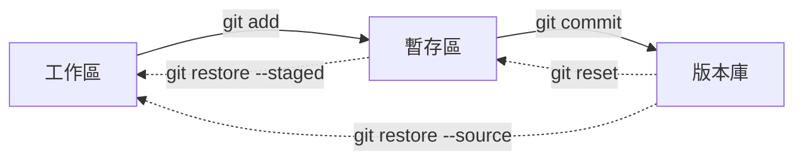
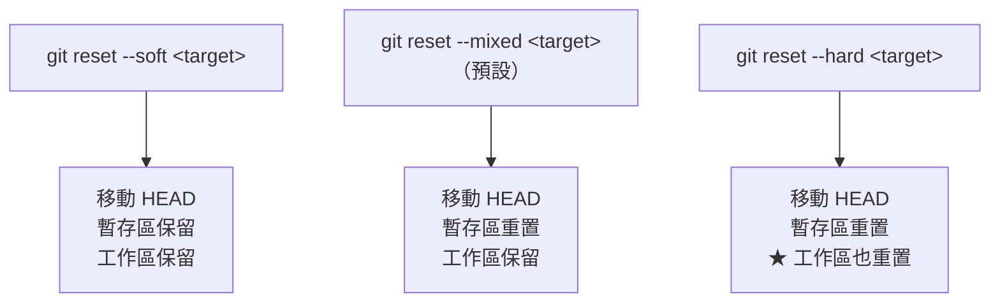

# Git 回復與重寫歷史

> [!abstract] 這篇你會學到
> - **挑對回復手段**：`restore` / `reset` / `revert` / `checkout` 該用哪個
> - 理解 `reset` 的 **`--soft` / `--mixed` / `--hard`** 差在哪
> - 用 **`reflog` 救回「消失」的提交**（幾乎所有意外都救得回來）
> - 安全地**整理提交歷史**
> - **徹底清除誤提交的機密**（`git filter-repo`）
> - 知道**哪些操作不可復原**

> [!tip] 先記住這句話
> **只要提交過，幾乎都救得回來（靠 `git reflog`）。**
> **沒提交過的，一旦丟棄就真的沒了。**
>
> 所以：**不確定的時候，先 `git stash` 或先 `git commit`。**

## 前置知識

- [[03-Git-分支與合併]] — 分支與 HEAD 的概念

---

## 觀念說明

### 先搞清楚：你要回復「哪一個區域」



| 我想要… | 指令 | 危險度 |
| --- | --- | --- |
| **丟棄工作區的修改** | `git restore <file>` | **⚠️ 不可復原** |
| **取消暫存**（保留修改） | `git restore --staged <file>` | 安全 |
| **從某個提交取回檔案** | `git restore --source=<sha> <file>` | 安全 |
| **撤銷上一個提交，保留修改** | `git reset --soft HEAD~1` | 安全 |
| **撤銷上一個提交，回到未暫存** | `git reset HEAD~1`（mixed） | 安全 |
| **撤銷上一個提交，連修改都丟** | `git reset --hard HEAD~1` | **⚠️ 危險** |
| **產生一個「反向的提交」** | `git revert <sha>` | **安全（推薦）** |
| **修改上一個提交** | `git commit --amend` | ⚠️ 改寫歷史 |
| **丟棄未追蹤的檔案** | `git clean -fd` | **⚠️ 不可復原** |

---

## `git restore`：處理未提交的變更

```bash
# ===== 丟棄工作區的修改（★ 不可復原）=====
$ git restore nginx.conf
$ git restore .                        # 全部
$ git restore -- .                     # 同上（明確分隔）

# ===== 取消暫存（保留工作區的修改）=====
$ git restore --staged nginx.conf

# ===== 同時取消暫存並丟棄修改 =====
$ git restore --staged --worktree nginx.conf
$ git restore -SW nginx.conf           # 縮寫

# ===== 從特定提交取回某個檔案（★ 很實用）=====
$ git restore --source=HEAD~3 nginx.conf     # 三個提交前的版本
$ git restore --source=a1b2c3d nginx.conf    # 特定提交
$ git restore --source=origin/main nginx.conf # 遠端的版本
$ git restore --source=feature nginx.conf     # 其他分支的版本
```

> [!danger] `git restore <file>` 會永久丟失修改
> **Git 沒有記錄未提交的變更，所以救不回來。**
>
> **保險做法**：
> ```bash
> # 不確定要不要留 → 先 stash（可以救回）
> $ git stash push -m "不確定的修改"
> $ git stash list
> stash@{0}: On main: 不確定的修改
>
> # 需要時取回
> $ git stash pop        # 取回並刪除 stash
> $ git stash apply      # 取回但保留 stash
> ```

### 舊語法對照

```bash
# 這兩組是等價的（restore 是 Git 2.23+ 的新語法，語意更清楚）
git restore <file>              ≈  git checkout -- <file>
git restore --staged <file>     ≈  git reset HEAD <file>
git restore --source=<sha> <f>  ≈  git checkout <sha> -- <f>
```

> [!tip] 為什麼要有 `restore` 與 `switch`
> **舊的 `git checkout` 做了太多不相關的事**：
> - 切換分支
> - 丟棄檔案修改
> - 從提交取回檔案
> - 進入 detached HEAD
>
> **新版拆成兩個語意明確的指令**：
> ```
> git switch   → 【切換分支】
> git restore  → 【還原檔案】
> ```
> **`checkout` 仍然可用，但新指令不容易誤操作。**

---

## `git reset`：移動分支指標

> [!danger] 這是最容易誤用的指令
> **`reset` 做的事是「把目前分支的指標移到某個提交」**，
> 三個選項決定「工作區與暫存區怎麼處理」。



| 選項 | HEAD | 暫存區 | 工作區 | 用途 |
| --- | --- | --- | --- | --- |
| **`--soft`** | 移動 | **保留** | **保留** | **重新組織提交**（修改全部進暫存區） |
| **`--mixed`**（預設） | 移動 | 重置 | **保留** | **取消提交與暫存**，重新挑選 |
| **`--hard`** | 移動 | 重置 | **⚠️ 重置** | **完全丟棄**（危險） |

### 實際範例

```bash
# ===== 情境：剛剛提交了，但想重新組織 =====

# 【--soft】撤銷提交，所有修改回到「已暫存」狀態
$ git reset --soft HEAD~1
$ git status -sb
M  nginx.conf          ← 還在暫存區
M  php.ini
# → 可以重新 commit，或用 git restore --staged 挑選

# 【--mixed】撤銷提交，修改回到「未暫存」狀態
$ git reset HEAD~1
$ git status -sb
 M nginx.conf          ← 回到工作區
 M php.ini
# → 可以用 git add -p 重新挑選要提交什麼

# 【--hard】★★ 撤銷提交，連修改都丟掉
$ git reset --hard HEAD~1
$ git status
nothing to commit, working tree clean     ← 修改全沒了
```

```bash
# ===== 常用的 reset 目標 =====
$ git reset --hard HEAD           # 丟棄所有未提交的修改
$ git reset --hard HEAD~1         # 回到上一個提交
$ git reset --hard HEAD~3         # 回到三個提交前
$ git reset --hard a1b2c3d        # 回到特定提交
$ git reset --hard origin/main    # ★ 與遠端完全同步（丟棄本地變更）

# ===== 只 reset 特定檔案（不移動 HEAD）=====
$ git reset HEAD nginx.conf       # ＝ git restore --staged nginx.conf
```

> [!danger] `git reset --hard` 的三個危險
> ```
> ① 【未提交的修改永久消失】（沒有任何辦法救回）
> ② 【未追蹤的檔案不會被刪除】（容易誤以為「乾淨了」）
> ③ 【已提交的可以用 reflog 救回】（這點是好消息）
> ```
>
> **執行前的保險**：
> ```bash
> $ git status              # 確認沒有想留的未提交修改
> $ git stash push -m "保險"  # 或先 stash
> $ git log --oneline -5    # 記下目前的 SHA
> ```

---

## `git revert`：安全的撤銷

> [!tip] `revert` 與 `reset` 的關鍵差異
> ```
> reset  → 【刪除歷史】（分支指標往回移）
>          ✅ 適合：還沒 push 的本地提交
>          ❌ 不適合：已經 push 的（會造成分岔）
>
> revert → 【產生一個「做相反事情」的新提交】
>          ✅ 適合：【已經 push 的提交】
>          ✅ 歷史完整保留（看得出「曾經有這個改動，後來撤銷了」）
> ```

```bash
# ===== 撤銷一個提交 =====
$ git revert a1b2c3d
# → 產生新提交 "Revert "原本的訊息""

# ===== 撤銷但不立即提交（想調整內容時）=====
$ git revert --no-commit a1b2c3d
$ git revert -n a1b2c3d              # 縮寫
$ ...調整...
$ git commit -m "revert: 撤銷 XXX 變更（保留部分設定）"

# ===== 撤銷多個提交 =====
$ git revert a1b2c3d d4e5f6g
$ git revert HEAD~3..HEAD            # 撤銷最近三個

# ===== ★ 撤銷一個 merge commit =====
$ git revert -m 1 <merge-commit-sha>
# -m 1 = 保留第一個父節點（通常是主線）
# -m 2 = 保留第二個父節點（被合併進來的分支）

# ===== 放棄 revert =====
$ git revert --abort
```

> [!warning] revert merge commit 的陷阱
> ```
> 你 revert 了一個 merge commit
>   → 那個功能的變更被撤銷了
>     → 【但 Git 仍然認為該分支「已經合併過」】
>       → 之後再次 merge 同一個分支，【不會帶回那些變更】
>
> 解法：要重新合併時，先 revert 掉「那個 revert」
>   $ git revert <revert-commit-sha>
> ```

### 什麼時候用哪個

```
【正式環境部署後發現有問題】
  → 【revert】（歷史保留，可追溯，不影響其他人）

【本地剛提交，還沒 push，想重做】
  → reset --soft 或 --mixed

【本地一團亂，想回到某個乾淨的點】
  → reset --hard（★ 先確認沒有想留的東西）

【想丟棄本地全部變更，與遠端一致】
  → git fetch && git reset --hard origin/main

【想撤銷某個檔案的變更，但保留其他】
  → git restore --source=<sha> <file>
```

---

## `git reflog`：後悔藥

> [!tip] 這是 Git 最重要的救命工具
> **`reflog` 記錄了 HEAD 的所有移動歷史**，
> 包括那些「已經不在任何分支上」的提交。

```bash
$ git reflog
a1b2c3d (HEAD -> main) HEAD@{0}: reset: moving to HEAD~1
d4e5f6g HEAD@{1}: commit: feat: 新增 API 反向代理     ← ★ 被 reset 掉的提交
g7h8i9j HEAD@{2}: commit: fix: 修正逾時設定
j0k1l2m HEAD@{3}: checkout: moving from feature to main
n3o4p5q HEAD@{4}: commit: wip
...
```

### 救回被 reset 掉的提交

```bash
# ===== 情境：不小心 git reset --hard HEAD~3 =====
$ git reflog
a1b2c3d (HEAD -> main) HEAD@{0}: reset: moving to HEAD~3
z9y8x7w HEAD@{1}: commit: feat: 重要的功能        ← ★ 要救回這個

# ===== 方式一：直接 reset 回去 =====
$ git reset --hard z9y8x7w
# 或用 reflog 語法
$ git reset --hard HEAD@{1}

# ===== 方式二：建立分支保住它（★ 更安全）=====
$ git switch -c rescue z9y8x7w
$ git log --oneline -5           # 確認內容正確
$ git switch main
$ git merge rescue               # 或 cherry-pick 需要的提交
```

### 救回被刪除的分支

```bash
# ===== 情境：git branch -D feature/api 刪錯了 =====
$ git reflog | grep 'feature/api'
z9y8x7w HEAD@{12}: checkout: moving from feature/api to main
                                              ↑ 這是分支最後的位置

# 重建分支
$ git switch -c feature/api z9y8x7w
```

```bash
# ===== 更精確：查特定分支的 reflog =====
$ git reflog show feature/api
z9y8x7w feature/api@{0}: commit: 最後一個提交
y8x7w6v feature/api@{1}: commit: 上一個提交

# ===== 查所有 ref 的 reflog =====
$ git reflog --all
```

### 找出「完全孤立」的提交

```bash
# ===== 當 reflog 也找不到時（最後手段）=====
$ git fsck --lost-found --unreachable
dangling commit z9y8x7w6v5u4t3s2r1q0p9o8n7m6l5k4j3i2h1
dangling blob    a1b2c3d4e5f6...

$ git show z9y8x7w              # 看看是不是要找的
$ git switch -c rescue z9y8x7w  # 救回來
```

> [!danger] reflog 不是永久的
> ```bash
> # 預設保留期限
> gc.reflogExpire              = 90 天（可達到的提交）
> gc.reflogExpireUnreachable   = 30 天（不可達到的提交）
> ```
>
> **超過期限後，`git gc` 會真的刪掉它們。**
>
> **延長保留期限（重要的 repo 建議設定）**：
> ```bash
> $ git config --global gc.reflogExpire "365 days"
> $ git config --global gc.reflogExpireUnreachable "180 days"
> ```
>
> **另外：`reflog` 是「本地的」** ——
> 別人的 reflog 沒有你的操作記錄，
> 重新 clone 也不會有 reflog。

---

## 整理提交歷史

### 修改最近一個提交

```bash
# 只改訊息
$ git commit --amend

# 補上漏掉的檔案（不改訊息）
$ git add 漏掉的檔案
$ git commit --amend --no-edit

# 修正作者資訊
$ git commit --amend --reset-author
$ git commit --amend --author="王小明 <wang@example.gov.tw>"
```

### 用互動式 rebase 整理多個提交

```bash
$ git rebase -i HEAD~5
```

詳見 [[03-Git-分支與合併]] 的互動式 rebase 段落。

### cherry-pick：挑選特定提交

```bash
# ===== 把某個提交套用到目前分支 =====
$ git cherry-pick a1b2c3d

# ===== 多個 =====
$ git cherry-pick a1b2c3d d4e5f6g
$ git cherry-pick a1b2c3d..g7h8i9j     # 範圍（不含 a1b2c3d）
$ git cherry-pick a1b2c3d^..g7h8i9j    # 範圍（含 a1b2c3d）

# ===== 不立即提交（想調整時）=====
$ git cherry-pick -n a1b2c3d

# ===== 記錄「這是從哪裡 cherry-pick 來的」（★ 建議）=====
$ git cherry-pick -x a1b2c3d
# 訊息會加上 "(cherry picked from commit a1b2c3d)"

# ===== 衝突處理 =====
$ git cherry-pick --continue
$ git cherry-pick --skip
$ git cherry-pick --abort
```

> [!tip] cherry-pick 的典型用途
> ```
> 【把 hotfix 同時套用到多個版本分支】
>   main 上修好了 → cherry-pick 到 release/2.3 與 release/2.2
>
> 【只想要某個分支上的一兩個提交】
>   （不想整個 merge）
>
> 【救回被 reset 掉的特定提交】
> ```
>
> **注意**：cherry-pick 會產生**新的提交（不同的 SHA）**，
> 內容相同但 Git 視為不同的提交。
> 之後 merge 時可能會產生衝突。

---

## 徹底清除誤提交的機密

> [!danger] 先做這件事：更換憑證
> ```
> 【順序極重要】
> ① ★★★ 【立刻更換該密碼／金鑰／Token】★★★
> ② 通知相關人員
> ③ 檢查有無被使用的跡象（日誌）
> ④ 【然後】才處理 Git 歷史
> ```
>
> **為什麼順序是這樣**：
> - 如果已經 push 到遠端（尤其是公開的），
>   **可能早就被爬蟲或其他人複製走了**
> - **清除歷史不能讓已經外洩的憑證變回安全**
> - GitHub 等平台會**保留 fork 與快取**，你清不乾淨
>
> **清除歷史是「減少後續暴露」，不是「解決外洩」。**

### 用 `git filter-repo`（官方推薦）

```bash
# ===== 安裝 =====
$ sudo apt install -y git-filter-repo
# 或
$ pip install --user git-filter-repo
```

> [!warning] `filter-repo` 會拒絕在「有遠端的 repo」上執行
> 它要求你在**新鮮的 clone** 上操作，這是刻意的保護。
> ```bash
> $ git clone --mirror git@github.com:org/repo.git repo-clean
> $ cd repo-clean
> ```

```bash
# ===== 【1】移除特定檔案的所有歷史 =====
$ git filter-repo --path .env --invert-paths
$ git filter-repo --path config/secrets.yml --invert-paths

# ===== 【2】移除多個路徑 =====
$ git filter-repo --path .env --path secrets/ --path '*.key' --invert-paths

# ===== 【3】★ 取代內容（保留檔案但把密碼換掉）=====
$ cat > /tmp/replacements.txt <<'EOF'
ghp_abcdef1234567890==>***REMOVED-TOKEN***
DB_PASSWORD=RealSecret123==>DB_PASSWORD=***REMOVED***
regex:AKIA[0-9A-Z]{16}==>***REMOVED-AWS-KEY***
EOF
$ git filter-repo --replace-text /tmp/replacements.txt

# ===== 【4】檢查結果 =====
$ git log --all --full-history -- .env      # 應該沒有輸出
$ git grep -i "RealSecret123" $(git rev-list --all)   # 應該沒有輸出

# ===== 【5】推回遠端（★ 破壞性操作）=====
$ git remote add origin git@github.com:org/repo.git
$ git push --force --all
$ git push --force --tags
```

### 清除後的必要動作

```
□ ★ 【已經更換所有外洩的憑證】（第一優先，不是最後）
□ 【通知所有協作者】：他們必須重新 clone
   （他們本地的舊歷史還在，而且 pull 會產生災難性的衝突）
□ 【GitHub/GitLab 上刪除所有 fork】（fork 保有舊歷史）
□ 【聯絡平台清除快取】
   GitHub 支援可以清除 dangling commits 的快取
□ 【檢查 CI/CD 的快取與 artifacts】
□ 【檢查備份與鏡像】
□ 【檢查 issue、PR 討論、wiki 中有沒有貼過】
□ 【檢查 CI 的日誌】（可能印出過）
```

> [!danger] 你永遠無法確定已經清乾淨
> **這就是為什麼「更換憑證」永遠是第一步。**
>
> 可能還存在的地方：
> - 其他人的本地 clone
> - Fork
> - 平台的快取與 dangling objects
> - CI/CD 的日誌與快取
> - 備份與鏡像
> - **搜尋引擎的快取**
> - 已經被自動化爬蟲收集走的資料庫

### 預防：pre-commit 掃描

```bash
# ===== 安裝 gitleaks =====
$ wget -qO- https://github.com/gitleaks/gitleaks/releases/latest/download/gitleaks_linux_x64.tar.gz | \
    sudo tar xz -C /usr/local/bin gitleaks

# ===== 掃描整個歷史（現在就檢查一次）=====
$ gitleaks detect --source . --report-path /tmp/leaks.json -v

# ===== 設為 pre-commit hook =====
$ cat > .git/hooks/pre-commit <<'EOF'
#!/usr/bin/env bash
if command -v gitleaks >/dev/null 2>&1; then
  if ! gitleaks protect --staged --redact -v; then
    echo ""
    echo "❌ 偵測到疑似機密資訊，已阻止提交。"
    echo "   · 確認為誤判 → git commit --no-verify"
    echo "   · 確實是機密 → 移除後改用環境變數或機密管理系統"
    exit 1
  fi
fi
EOF
$ chmod +x .git/hooks/pre-commit
```

> [!tip] 用 pre-commit 框架統一管理 hooks
> ```bash
> $ pip install --user pre-commit
> ```
> ```yaml
> # .pre-commit-config.yaml（★ 這個檔案會進版控，團隊共用）
> repos:
>   - repo: https://github.com/gitleaks/gitleaks
>     rev: v8.18.0
>     hooks:
>       - id: gitleaks
>   - repo: https://github.com/pre-commit/pre-commit-hooks
>     rev: v4.5.0
>     hooks:
>       - id: check-added-large-files
>         args: ['--maxkb=1024']
>       - id: detect-private-key           # ★ 偵測私鑰
>       - id: check-merge-conflict         # 偵測殘留的衝突標記
>       - id: end-of-file-fixer
>       - id: trailing-whitespace
>       - id: check-yaml
>       - id: check-json
> ```
> ```bash
> $ pre-commit install
> $ pre-commit run --all-files     # 對現有檔案跑一次
> ```
>
> **好處**：hooks 設定進版控，**新成員 clone 後只要 `pre-commit install` 就有了**。

---

## 完整實戰範例

### 決策樹：我該用哪個指令

```
我想撤銷的東西已經 push 了嗎？
├─ 【是】→ 【git revert】（唯一安全的選擇）
│
└─ 否 → 我想保留那些修改嗎？
        ├─ 是，想重新組織 → git reset --soft HEAD~1
        ├─ 是，想重新挑選 → git reset HEAD~1（mixed）
        └─ 否，完全不要   → git reset --hard HEAD~1
                             ★ 先確認沒有其他未提交的修改

我只想還原「某個檔案」？
├─ 丟棄未提交的修改     → git restore <file>（★ 不可復原）
├─ 取消暫存             → git restore --staged <file>
└─ 取回舊版本           → git restore --source=<sha> <file>

我把東西弄丟了？
└─ 【git reflog】→ 找到 SHA → git switch -c rescue <sha>
```

### 情境一：正式環境部署後發現有問題

```bash
# ========== 【1】確認是哪個提交造成的 ==========
$ git log --oneline -10
a1b2c3d (HEAD -> main, origin/main) feat(nginx): 啟用 HTTP/3
d4e5f6g fix(php): 調整 memory_limit
g7h8i9j feat(nginx): 新增反向代理

# ========== 【2】revert（★ 已 push 必須用這個）==========
$ git revert a1b2c3d
[main z9y8x7w] Revert "feat(nginx): 啟用 HTTP/3"

# ========== 【3】驗證並部署 ==========
$ sudo nginx -t
$ sudo nginx -s reload
$ curl -sI https://example.gov.tw | head -1

# ========== 【4】推送 ==========
$ git push

# ========== 【5】之後修好了要重新套用 ==========
$ git revert z9y8x7w        # revert 那個 revert
# 或重新做一次正確的實作
```

### 情境二：本地提交了一團亂，想重做

```bash
$ git log --oneline -5
c3d4e5f (HEAD -> feature/api) 又改一次
b2c3d4e 還是不對
a1b2c3d wip
z9y8x7w (origin/feature/api) feat: 新增 API 反向代理    ← 已 push 到這裡

# ===== 把未 push 的三個提交合併成一個 =====
$ git reset --soft z9y8x7w
$ git status -sb
M  nginx/api.conf          ← 三個提交的修改全部回到暫存區

$ git commit -m "feat(nginx): 補上 API 反向代理的標頭設定

補上 proxy_set_header 以正確傳遞 Host、X-Real-IP 與
X-Forwarded-For，解決後端取不到客戶端資訊的問題。

單號：#1234"

$ git push --force-with-lease      # ★ 個人分支才可以
```

### 情境三：救回誤刪的分支與提交

```bash
# ========== 情境：不小心刪掉了做了三天的分支 ==========
$ git branch -D feature/big-refactor
Deleted branch feature/big-refactor (was z9y8x7w).
                                          ↑ ★ Git 有告訴你 SHA！

# ===== 方式一：用剛才顯示的 SHA =====
$ git switch -c feature/big-refactor z9y8x7w

# ===== 方式二：如果沒記下來，查 reflog =====
$ git reflog | grep -i 'big-refactor'
z9y8x7w HEAD@{5}: checkout: moving from feature/big-refactor to main

$ git switch -c feature/big-refactor z9y8x7w

# ===== 方式三：連 reflog 都找不到 =====
$ git fsck --lost-found --unreachable | grep commit
dangling commit z9y8x7w6v5u4t3s2r1q0p9o8n7m6l5k4j3i2h1

$ git log --oneline z9y8x7w -5     # 確認是不是要找的
$ git switch -c rescue z9y8x7w
```

### 情境四：完整處理誤提交的資料庫密碼

```bash
# ═══════════ 【第 0 步】★★★ 最優先 ★★★ ═══════════
# 立刻更換該資料庫密碼！
$ mysql -u root -p -e "ALTER USER 'app'@'%' IDENTIFIED BY '新的強密碼';"
# 更新所有使用該密碼的地方（.env、CI secrets、容器設定）
# 檢查資料庫日誌有無異常連線

# ═══════════ 【第 1 步】確認影響範圍 ═══════════
$ git log --all --full-history --oneline -- .env
a1b2c3d chore: 新增環境設定           ← 什麼時候進去的
d4e5f6g chore: 移出版控               ← 什麼時候拿掉的

$ git show a1b2c3d:.env               # 確認洩漏了什麼
DB_PASSWORD=RealSecret123
API_KEY=sk-abc123...

$ git log a1b2c3d --format='%ad' --date=iso    # 洩漏了多久
2026-06-15 10:23:45 +0800             # ← 兩個月

# 是否曾 push 到公開 repo？→ 若是，視同【已完全外洩】

# ═══════════ 【第 2 步】通知 ═══════════
# · 通知所有協作者
# · 若涉及個資或公務系統，依 [[04-資安事件應變流程]] 通報

# ═══════════ 【第 3 步】清除歷史 ═══════════
$ cd /tmp
$ git clone --mirror git@github.com:org/repo.git repo-clean
$ cd repo-clean

$ cat > /tmp/replace.txt <<'EOF'
RealSecret123==>***REMOVED***
sk-abc123==>***REMOVED***
EOF

$ git filter-repo --path .env --invert-paths --replace-text /tmp/replace.txt

# 驗證
$ git log --all --full-history -- .env         # 應無輸出
$ git grep -i "RealSecret123" $(git rev-list --all) 2>/dev/null   # 應無輸出

# 推回
$ git remote add origin git@github.com:org/repo.git
$ git push --force --all
$ git push --force --tags

# ═══════════ 【第 4 步】後續清理 ═══════════
# □ 通知協作者【重新 clone】（不要 pull！）
# □ 刪除所有 fork
# □ 聯絡平台清除快取
# □ 檢查 CI 的日誌與快取
# □ 檢查備份與鏡像

# ═══════════ 【第 5 步】預防再發生 ═══════════
$ echo ".env" >> .gitignore
$ cp .env .env.example && sed -i 's/=.*/=/' .env.example
$ git add .gitignore .env.example
$ git commit -m "chore: 加入 .gitignore 與環境變數範本"

# 裝上 pre-commit hook
$ pre-commit install
$ gitleaks detect --source . -v      # 確認現在是乾淨的
```

---

## 常見錯誤與排錯

| 現象／錯誤 | 原因 | 解法 |
| --- | --- | --- |
| **`git reset --hard` 後修改全沒了** | 未提交的修改**不可復原** | 沒辦法救；下次先 `git stash` |
| 提交沒了，以為救不回來 | 不知道有 reflog | **`git reflog`** → `git switch -c rescue <sha>` |
| **reflog 也找不到** | 超過保留期限被 gc 掉了 | `git fsck --lost-found --unreachable`；平時延長 `gc.reflogExpire` |
| **已 push 的提交用 reset** | 造成本地與遠端分岔 | **已 push 一律用 `revert`** |
| 誤刪分支 | `git branch -D` | 刪除訊息會**顯示 SHA**；或查 `git reflog` |
| **`git clean -fd` 刪掉重要檔案** | 沒預覽 | **一定先 `git clean -nd`** |
| revert merge commit 後無法重新合併 | Git 認為已合併過 | **revert 那個 revert** |
| revert merge 時報錯 | 沒指定父節點 | `git revert -m 1 <sha>` |
| **清了歷史但機密還在其他地方** | fork、快取、CI 日誌、備份 | **憑證更換永遠是第一步**；逐項清查 |
| `filter-repo` 拒絕執行 | 它要求乾淨的 clone | `git clone --mirror` 後再執行 |
| 清完歷史後同事的 repo 大亂 | 他們 pull 了 | **通知所有人重新 clone，不要 pull** |
| cherry-pick 後 merge 產生衝突 | cherry-pick 產生的是**新提交** | 用 `-x` 記錄來源；或考慮改用 merge |
| **不知道該用哪個指令** | 概念混淆 | 用本篇的決策樹 |
| stash 之後找不到了 | 忘了 `git stash list` | `git stash list`；`git fsck` 也找得到 |

---

## 安全性注意事項

> [!danger] 誤提交機密的正確處理順序
> ```
> ① ★★★【立刻更換憑證】★★★  ← 不是最後一步，是第一步
> ② 通知相關人員
> ③ 檢查有無被使用的跡象
> ④ 清除 Git 歷史
> ⑤ 通知協作者重新 clone
> ⑥ 清除 fork、快取、CI 日誌、備份
> ⑦ 建立預防機制（gitignore + pre-commit）
> ```
>
> **最常見的錯誤是把 ① 放到最後** ——
> 花了半天清歷史，結果密碼早就被用了。

> [!warning] 重寫歷史對團隊的影響
> **`filter-repo`、`rebase`、`--force push` 都會改寫歷史。**
>
> **對其他人的影響**：
> ```
> 他們本地的 repo 與遠端【完全不相容】
>   → git pull 會產生大量重複提交與衝突
>     → 【他們必須重新 clone】
>       → 未 push 的工作可能遺失
> ```
>
> **執行前必做**：
> ```
> □ 【事先通知所有協作者】
> □ 【請他們先 push 所有工作】
> □ 【選一個大家都不在工作的時間】
> □ 【提供明確的後續指示】（重新 clone，不要 pull）
> □ 【自己先備份一份原始的 clone】
> ```

> [!tip] 保護重要 repo 不被誤操作
> ```
> 【平台端】
> □ main 設為受保護分支
> □ 禁止 force push
> □ 禁止刪除
> □ 要求 PR 才能合併
> □ 對管理員也套用
>
> 【本地端】
> □ 延長 reflog 保留期限
>   git config --global gc.reflogExpire "365 days"
>   git config --global gc.reflogExpireUnreachable "180 days"
> □ 用 --force-with-lease 而非 --force
> □ 重要操作前先建立備份分支
>   git branch backup-$(date +%Y%m%d)
> ```

> [!danger] `git clean` 特別危險
> ```bash
> $ git clean -fdx
>            │││└─ x = 【連 .gitignore 忽略的也刪】
>            ││└── d = 連目錄也刪
>            │└─── f = 強制執行
>            └──── ★ 這會刪掉：
>                    · node_modules（要重裝）
>                    · 【.env】（設定全沒了）
>                    · 【本地的資料庫檔案】
>                    · 【上傳的使用者檔案】
> ```
>
> **在正式環境或有資料的目錄執行 `git clean -fdx`，
> 可能造成無法復原的資料遺失。**
>
> **鐵則：一定先 `git clean -ndx` 預覽。**

---

## 速查表

### 選對指令的決策樹

```
已經 push 了嗎？
├─ 【是】→ 【git revert】（唯一安全選擇）
└─ 否 → 想保留修改嗎？
        ├─ 想重新組織 → reset --soft HEAD~1
        ├─ 想重新挑選 → reset HEAD~1（mixed）
        └─ 完全不要   → reset --hard HEAD~1 ⚠️

只想還原某個檔案？
├─ 丟棄未提交 → git restore <file> ⚠️不可復原
├─ 取消暫存   → git restore --staged <file>
└─ 取回舊版   → git restore --source=<sha> <file>

東西弄丟了？→ 【git reflog】
```

### reset 三種模式

| 選項 | HEAD | 暫存區 | 工作區 |
| --- | --- | --- | --- |
| `--soft` | 移動 | **保留** | **保留** |
| `--mixed`（預設） | 移動 | 重置 | **保留** |
| **`--hard`** | 移動 | 重置 | **⚠️ 重置** |

### reset vs revert

```
reset  → 刪除歷史（指標往回移）  ✅ 未 push  ❌ 已 push
revert → 產生反向的新提交        ✅ 已 push（推薦）

git revert -m 1 <merge-sha>     # revert merge commit
★ revert merge 後想重新合併 → 【revert 那個 revert】
```

### reflog 救援

```bash
git reflog                          # 看 HEAD 移動歷史
git reflog show <branch>            # 特定分支
git reflog --all                    # 所有 ref
git reset --hard HEAD@{1}           # 回到上一個狀態
git switch -c rescue <sha>          # ★ 更安全：建分支保住

# reflog 也找不到時
git fsck --lost-found --unreachable

# 延長保留期限
git config --global gc.reflogExpire "365 days"
git config --global gc.reflogExpireUnreachable "180 days"
```

### cherry-pick

```bash
git cherry-pick <sha>
git cherry-pick -x <sha>            # ★ 記錄來源
git cherry-pick -n <sha>            # 不立即提交
git cherry-pick a^..b               # 範圍（含 a）
git cherry-pick --continue/--skip/--abort
```

### 清除機密的順序

```
① ★★★ 立刻更換憑證 ★★★    ← 第一步，不是最後
② 通知相關人員
③ 檢查被使用的跡象
④ git filter-repo 清除歷史
⑤ 通知協作者【重新 clone，不要 pull】
⑥ 刪 fork、清快取、清 CI 日誌、查備份
⑦ gitignore + pre-commit 預防
```

### filter-repo

```bash
git clone --mirror <url> repo-clean && cd repo-clean

git filter-repo --path .env --invert-paths          # 移除檔案
git filter-repo --replace-text /tmp/replace.txt     # 取代內容

# replace.txt 格式：
#   密碼明文==>***REMOVED***
#   regex:AKIA[0-9A-Z]{16}==>***REMOVED***

git push --force --all && git push --force --tags
```

### 預防機制

```yaml
# .pre-commit-config.yaml
repos:
  - repo: https://github.com/gitleaks/gitleaks
    rev: v8.18.0
    hooks: [{id: gitleaks}]
  - repo: https://github.com/pre-commit/pre-commit-hooks
    rev: v4.5.0
    hooks:
      - id: detect-private-key          # ★
      - id: check-added-large-files
      - id: check-merge-conflict
```
```bash
pre-commit install
gitleaks detect --source . -v          # 掃描整個歷史
```

### 不可復原的操作

```
⚠️ git restore <file>       未提交的修改永久消失
⚠️ git reset --hard         同上
⚠️ git clean -fdx           ★★ 連 .env、node_modules、資料檔都刪
   → 【一定先 git clean -ndx 預覽】

✅ 提交過的 → reflog 救得回來（在保留期限內）
```

---

## 練習題

> [!question]- 練習 1：三種 reset 的差異
> 在測試 repo 中做 3 個提交，然後分別實驗：
> 1. `git reset --soft HEAD~1` → **`git status -sb` 顯示什麼？**
> 2. `git reflog` 找回來，再試 `git reset HEAD~1`（mixed）→ 狀態？
> 3. 再找回來，試 `git reset --hard HEAD~1` → 狀態？
> 4. **三次實驗中，工作區的檔案內容分別是什麼？**
> 5. 每次都用 `git reflog` + `git reset --hard <sha>` 回復
> 6. 畫出你自己的對照表

> [!question]- 練習 2：救援演練
> 1. 建立分支 `feature/test`，做 3 個提交
> 2. 切回 main，`git branch -D feature/test`
> 3. **不看剛才的輸出**，用 `git reflog` 找回它
> 4. `git switch -c rescue <sha>`，確認 3 個提交都在
> 5. 再做一次：這次用 `git reset --hard HEAD~3` 在 main 上刪掉提交
> 6. **用 `git fsck --lost-found --unreachable` 找找看**
> 7. 思考：如果 90 天後才發現，還救得回來嗎？

> [!question]- 練習 3：完整處理誤提交的機密
> ⚠️ 在**測試 repo** 上做（可以推到自己的私有測試 repo）。
> 1. 建立 `.env` 寫入 `DB_PASSWORD=TestSecret123`，commit 並 push
> 2. 再做 3 個提交
> 3. **現在假裝你發現了** —— 依本篇的順序處理：
>    - 第 0 步該做什麼？（提示：不是清歷史）
>    - 確認洩漏了多久：`git log --all --full-history -- .env`
> 4. 用 `git filter-repo` 清除
> 5. **驗證**：`git grep TestSecret123 $(git rev-list --all)`
> 6. 裝上 gitleaks pre-commit hook
> 7. **再試著 commit 一個含密碼的檔案**，看它會不會被擋下來

---

## 小測驗

Q1. **`restore`、`reset`、`revert` 三者的核心差異是什麼？各適用什麼情境**？

Q2. **`reset` 的 `--soft`、`--mixed`、`--hard` 對 HEAD、暫存區、工作區各做了什麼**？

Q3. **已經 push 的提交為什麼一定要用 `revert` 而不是 `reset`**？

Q4. **`git reflog` 是什麼？它能救回哪些東西？有什麼限制**？

Q5. **reflog 也找不到時，最後手段是什麼**？

Q6. revert 一個 merge commit 時要注意什麼？之後想重新合併該怎麼做？

Q7. **誤提交機密時，正確的處理順序是什麼？為什麼第一步不是清歷史**？

Q8. **清除歷史後，還有哪七個地方可能殘留機密**？

Q9. **重寫歷史對團隊有什麼影響？執行前必做哪五件事**？

Q10. **`git clean -fdx` 為什麼特別危險？它會刪掉哪些東西**？

> [!question]- 測驗答案
> **Q1.** **`restore`** 處理**未提交的變更**
> （丟棄工作區修改、取消暫存、從特定提交取回檔案）；
> **`reset`** **移動分支指標**（改變「目前分支指向哪個提交」），
> 適用於**還沒 push 的本地提交**；
> **`revert`** **產生一個「做相反事情」的新提交**，
> 歷史完整保留，**適用於已經 push 的提交**。
>
> **Q2.** **`--soft`**：移動 HEAD，**暫存區保留、工作區保留**
> （所有修改回到「已暫存」狀態，適合重新組織提交）；
> **`--mixed`（預設）**：移動 HEAD，**暫存區重置、工作區保留**
> （修改回到「未暫存」狀態，適合重新挑選要提交什麼）；
> **`--hard`**：移動 HEAD，**暫存區重置、工作區也重置**
> （⚠ 未提交的修改永久消失）。
>
> **Q3.** 因為 **`reset` 會刪除歷史（把分支指標往回移）**，
> 而遠端仍然保有那些提交 ——
> 結果是**你的本地與遠端分岔**，push 會被拒絕，
> 只能 `--force`，而**強制推送會破壞其他人的歷史**
> （他們 pull 時會產生大量衝突）。
> **`revert` 則是「往前加一個反向的提交」**，
> 歷史線性延續、不需要強制推送、
> 而且**看得出「曾經有這個改動，後來撤銷了」**，可追溯。
>
> **Q4.** **`reflog` 記錄了 HEAD（以及各分支）的所有移動歷史**，
> 包括那些「已經不在任何分支上」的提交。
> 它能救回：**被 `reset --hard` 掉的提交**、
> **被 `branch -D` 刪掉的分支**、
> rebase 前的狀態、amend 前的提交 ——
> 基本上**只要曾經提交過的都救得回來**。
> **限制**：①它是**本地的**（別人的 reflog 沒有你的記錄，
> 重新 clone 也不會有）；
> ②**有保留期限**（預設可達到的 90 天、不可達到的 30 天），
> 超過後 `git gc` 會真的刪掉。
>
> **Q5.** **`git fsck --lost-found --unreachable`** ——
> 它會列出所有「孤立（dangling）」的物件，
> 包括不再被任何 ref 參照的 commit。
> 找到後用 `git show <sha>` 確認內容，
> 再用 `git switch -c rescue <sha>` 救回來。
>
> **Q6.** 要注意**必須用 `-m` 指定保留哪個父節點**
> （`git revert -m 1 <sha>`，`-m 1` 通常是主線），
> 否則 Git 不知道該以哪一邊為基準而報錯。
> **陷阱是**：revert 之後，那個功能的變更被撤銷了，
> **但 Git 仍然認為該分支「已經合併過」** ——
> 所以之後再 merge 同一個分支，**不會帶回那些變更**。
> 想重新合併時，要**先 revert 掉「那個 revert commit」**。
>
> **Q7.** 順序是：①**★立刻更換該密碼／金鑰／Token★**；
> ②通知相關人員；③檢查有無被使用的跡象；
> ④清除 Git 歷史；⑤通知協作者重新 clone；
> ⑥清除 fork、快取、CI 日誌、備份；⑦建立預防機制。
> **第一步不是清歷史**，因為：
> 如果已經 push 到遠端（尤其是公開的），
> **可能早就被爬蟲或其他人複製走了**；
> **清除歷史不能讓已經外洩的憑證變回安全**；
> 而且平台會保留 fork 與快取，你**永遠無法確定清乾淨了**。
> **清除歷史是「減少後續暴露」，不是「解決外洩」。**
>
> **Q8.** ①**其他人的本地 clone**；②**Fork**；
> ③**平台的快取與 dangling objects**；
> ④**CI/CD 的日誌與快取**；⑤**備份與鏡像**；
> ⑥**搜尋引擎的快取**；
> ⑦**已經被自動化爬蟲收集走的資料庫**。
> （另：issue／PR 討論／wiki 中也可能貼過。）
>
> **Q9.** 影響是：**其他人本地的 repo 與遠端完全不相容** ——
> `git pull` 會產生大量重複提交與衝突，
> **他們必須重新 clone**，而未 push 的工作可能遺失。
> 執行前必做五件事：
> ①**事先通知所有協作者**；
> ②**請他們先 push 所有工作**；
> ③**選一個大家都不在工作的時間**；
> ④**提供明確的後續指示**（重新 clone，**不要 pull**）；
> ⑤**自己先備份一份原始的 clone**。
>
> **Q10.** 因為 `-x` 會**連 `.gitignore` 忽略的檔案也刪掉**，
> 而那些正是「刻意不進版控但很重要」的檔案。
> 它會刪掉：**`node_modules`**（要重裝）、
> **`.env`**（設定全沒了）、
> **本地的資料庫檔案**（如 SQLite）、
> **上傳的使用者檔案**（如 `storage/app/public`）、
> 各種快取與建置產物。
> 在正式環境或有資料的目錄執行，
> **可能造成無法復原的資料遺失**。
> **鐵則：一定先用 `git clean -ndx` 預覽會刪什麼。**

---

## 延伸閱讀

- [[03-Git-分支與合併]] — 互動式 rebase 整理歷史
- [[07-Git-進階技巧]] — stash、bisect、hooks
- [[09-Git-團隊規範與實戰情境]] — 誤推、誤刪的團隊處理
- [[03-機密管理與金鑰保護]] — 密碼與金鑰的正確存放
- [[04-資安事件應變流程]] — 機密外洩的通報流程
- [[02-Git-基本工作流程]] — `.gitignore` 與提交前檢查
