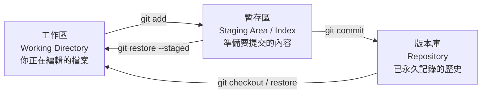
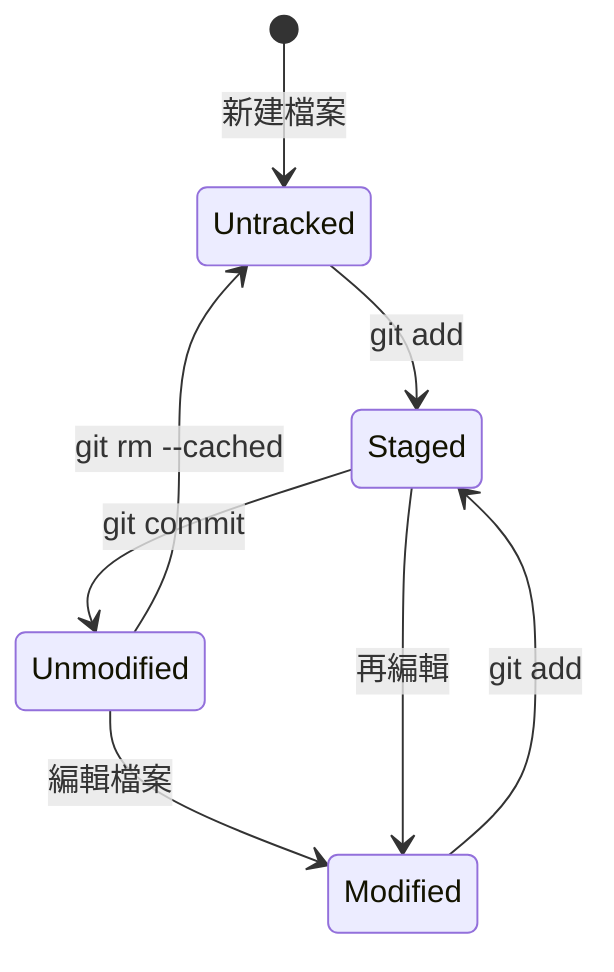

# Git 觀念與初次設定

> [!abstract] 這篇你會學到
> - 說出**三個區域**（工作區／暫存區／版本庫）的差別，以及檔案怎麼在其間移動
> - 完成 **user、editor、換行、別名、預設分支**等一次設定好用一輩子的設定
> - 建立第一個 repo 並完成第一次提交
> - 理解 Git **設定的三個層級**與優先順序
> - 為**維運工作**設定 Git（設定檔版控、多身分切換）

> [!tip] 維運人員為什麼要學 Git
> 你可能不寫程式，但你一定會：
> - 改 `nginx.conf`、`sshd_config`、`docker-compose.yml`
> - 需要知道「**這個設定是誰、什麼時候、為什麼改的**」
> - 需要**改壞了能快速還原**
> - 需要**部署程式碼到伺服器**
>
> **把 `/etc` 或設定檔目錄放進 Git，是投資報酬率極高的維運習慣。**

## 前置知識

- [[020-01-03-cmd-Linux-終端機與Shell入門]] — 基本的 shell 操作
- [[020-01-05-cmd-Linux-路徑導覽與檔案操作]] — 路徑與檔案概念

---

## 觀念說明

### Git 是什麼

> [!note] 一句話：Git 是「檔案的時光機 + 平行宇宙產生器」
> - **時光機**：任何時候都能回到過去的任一個版本
> - **平行宇宙**：可以同時存在多條不同的開發線（分支），最後再合併
>
> **和你以前可能用的方式比較**：
> ```
> ❌ nginx.conf.bak
> ❌ nginx.conf.bak2
> ❌ nginx.conf.20260801
> ❌ nginx.conf.可以用的版本
> ❌ nginx.conf.真的可以用的版本_final
>
> ✅ git log 一行看完所有版本，附上誰改的、什麼時候、為什麼
> ```

### 三個區域（最重要的心智模型）



| 區域 | 實體位置 | 意義 | 比喻 |
| --- | --- | --- | --- |
| **工作區** | 你看得到的檔案 | 正在編輯的狀態 | **你的書桌** |
| **暫存區** | `.git/index` | **挑選好、準備提交的內容** | **打包好的箱子** |
| **版本庫** | `.git/objects` | 已提交的完整歷史 | **倉庫的架子** |

> [!tip] 為什麼要有「暫存區」這個中間層
> **這是 Git 與其他版本控制系統最大的差異，也是初學者最困惑的地方。**
>
> **它的價值：讓你能「挑選要提交什麼」。**
>
> ```
> 你改了 5 個檔案：
>   · nginx.conf       ← 修正了反向代理設定（要提交）
>   · php.ini          ← 調整了 memory_limit（要提交）
>   · test.conf        ← 隨手測試用的（不要提交）
>   · debug.log        ← 除錯輸出（不要提交）
>   · README.md        ← 順手改的錯字（想另外提交）
>
> 有暫存區 → 【可以只 add 前兩個，做出一個乾淨的提交】
> 沒有暫存區 → 只能全部一起提交，歷史變得很亂
> ```
>
> **好的提交應該是「一個提交做一件事」** ——
> 這樣未來要回退或查問題時才好處理。

### 檔案的四種狀態



| 狀態 | 中文 | `git status` 顯示 |
| --- | --- | --- |
| **Untracked** | 未追蹤（Git 不認識它） | `Untracked files` |
| **Modified** | 已修改（但還沒 add） | `Changes not staged for commit` |
| **Staged** | 已暫存（已 add，等待 commit） | `Changes to be committed` |
| **Unmodified** | 未修改（與版本庫一致） | 不顯示 |

---

## 安裝與初次設定

```bash
$ sudo apt update && sudo apt install -y git
$ git --version
git version 2.43.0
```

> [!info]- Rocky / AlmaLinux（RHEL 系）對照
> ```bash
> $ sudo dnf install -y git
> ```

### 設定的三個層級

> [!danger] 搞清楚層級，可以避免「為什麼我的設定沒生效」
> ```
> 【system】 /etc/gitconfig          → 這台機器的【所有使用者】
> 【global】 ~/.gitconfig            → 【目前這個使用者】的所有 repo
> 【local】  <repo>/.git/config      → 【只有這個 repo】
>
> 優先順序：local > global > system   （越靠近越優先）
> ```

```bash
# 查看設定與它來自哪個檔案（★ 除錯時很有用）
$ git config --list --show-origin
file:/etc/gitconfig         core.autocrlf=input
file:/home/user/.gitconfig  user.name=王小明
file:.git/config            user.email=work@example.gov.tw

# 只看某一項
$ git config user.email
$ git config --show-origin user.email      # 看它是哪裡設的
```

### 一次設定好用一輩子

```bash
# ========== 【必設】身分 ==========
# ★ 這會寫進每一個 commit，是永久記錄
$ git config --global user.name  "王小明"
$ git config --global user.email "wang@example.gov.tw"

# ========== 【必設】預設分支名稱 ==========
# 新版 Git 建議用 main（舊版預設是 master）
$ git config --global init.defaultBranch main

# ========== 【必設】換行處理 ==========
# Linux/macOS：儲存時轉成 LF，避免 Windows 的 CRLF 汙染
$ git config --global core.autocrlf input
$ git config --global core.safecrlf warn
# Windows 上則用：git config --global core.autocrlf true

# ========== 【必設】中文檔名不要變成亂碼 ==========
$ git config --global core.quotepath false

# ========== 編輯器 ==========
$ git config --global core.editor "vim"
# 或 nano（新手友善）：git config --global core.editor "nano"
# 或 VSCode：git config --global core.editor "code --wait"

# ========== pull 的行為（★ 避免無謂的合併提交）==========
$ git config --global pull.rebase true       # pull 時用 rebase 而非 merge
# 或保守一點，明確禁止自動合併：
# $ git config --global pull.ff only

# ========== push 的行為 ==========
$ git config --global push.default simple
$ git config --global push.autoSetupRemote true   # 首次 push 自動設定上游

# ========== 顯示 ==========
$ git config --global color.ui auto
$ git config --global log.date iso              # 用 ISO 格式顯示日期

# ========== 更好的 diff ==========
$ git config --global diff.algorithm histogram
$ git config --global diff.colorMoved zebra     # 標示出「只是搬移」的區塊

# ========== 合併衝突時顯示三方內容（★ 強烈建議）==========
$ git config --global merge.conflictstyle zdiff3

# ========== 自動修正打錯的指令 ==========
$ git config --global help.autocorrect 10       # 1 秒後自動執行猜測的指令
```

> [!tip] `merge.conflictstyle = zdiff3` 讓解衝突容易很多
> **預設的衝突顯示**只給你「我的」與「他的」：
> ```
> <<<<<<< HEAD
> worker_processes 4;
> =======
> worker_processes 8;
> >>>>>>> feature
> ```
> **你不知道原本是什麼**，所以不知道兩邊各改了什麼。
>
> **`zdiff3` 會多顯示「共同祖先」**：
> ```
> <<<<<<< HEAD
> worker_processes 4;
> ||||||| 共同祖先
> worker_processes 2;
> =======
> worker_processes 8;
> >>>>>>> feature
> ```
> **現在你知道：原本是 2，我改成 4，他改成 8** ——
> 判斷起來清楚多了。

### 實用的別名

```bash
# ========== 基本縮寫 ==========
$ git config --global alias.st  "status -sb"
$ git config --global alias.co  "checkout"
$ git config --global alias.br  "branch"
$ git config --global alias.ci  "commit"
$ git config --global alias.cm  "commit -m"
$ git config --global alias.aa  "add --all"

# ========== 好看的歷史圖 ★ 最常用 ==========
$ git config --global alias.lg \
  "log --graph --abbrev-commit --decorate --date=relative \
   --format=format:'%C(bold blue)%h%C(reset) - %C(bold green)(%ar)%C(reset) %C(white)%s%C(reset) %C(dim white)- %an%C(reset)%C(auto)%d%C(reset)' --all"

# ========== 看最近的提交 ==========
$ git config --global alias.last "log -1 HEAD --stat"

# ========== 取消暫存 ==========
$ git config --global alias.unstage "restore --staged"

# ========== 修改上一個提交（不改訊息）==========
$ git config --global alias.amend "commit --amend --no-edit"

# ========== 查看某個檔案的修改歷史 ==========
$ git config --global alias.fl "log -u"

# ========== 找出誰改了某一行 ==========
$ git config --global alias.who "blame -w -C -C -C"
```

**使用效果**：
```bash
$ git st
## main...origin/main
 M nginx.conf
?? test.conf

$ git lg
* a1b2c3d - (2 hours ago) fix(nginx): 修正反向代理的 Host 標頭 - 王小明 (HEAD -> main)
* d4e5f6g - (1 day ago) feat(nginx): 新增 API 路由的反向代理設定 - 王小明
* 7h8i9j0 - (3 days ago) chore: 初始化設定檔版控 - 王小明
```

### 為工作與私人分開設定身分

> [!tip] 用 `includeIf` 依目錄自動切換身分
> **情境**：公務的 repo 要用公務信箱，私人專案用私人信箱。
> **忘記切換會把公務信箱 commit 進公開專案。**

```ini
# ~/.gitconfig
[user]
    name = 王小明
    email = personal@gmail.com        # 預設用私人的

[includeIf "gitdir:~/work/"]
    path = ~/.gitconfig-work           # ~/work/ 底下的 repo 用工作設定

[includeIf "gitdir:~/gov/"]
    path = ~/.gitconfig-gov
```

```ini
# ~/.gitconfig-work
[user]
    email = wang@company.com
[core]
    sshCommand = "ssh -i ~/.ssh/id_ed25519_work"
```

```ini
# ~/.gitconfig-gov
[user]
    email = wang@example.gov.tw
[core]
    sshCommand = "ssh -i ~/.ssh/id_ed25519_gov"
```

```bash
# 驗證
$ cd ~/work/some-project && git config user.email
wang@company.com
$ cd ~/gov/some-project && git config user.email
wang@example.gov.tw
```

---

## 建立第一個 repo

```bash
# ===== 方式一：從空目錄開始 =====
$ mkdir ~/my-configs && cd ~/my-configs
$ git init
Initialized empty Git repository in /home/user/my-configs/.git/

$ ls -a
.  ..  .git

# ===== 方式二：把既有目錄納入版控 =====
$ cd /existing/project
$ git init

# ===== 方式三：從遠端複製 =====
$ git clone https://github.com/user/repo.git
$ git clone https://github.com/user/repo.git 自訂目錄名
$ git clone --depth 1 https://github.com/user/repo.git   # 只取最新版（省時省空間）
```

### `.git` 目錄裡有什麼

```bash
$ tree -L 1 .git
.git
├── HEAD          ← 目前在哪個分支
├── config        ← 這個 repo 的設定（local 層級）
├── description
├── hooks/        ← 自動化腳本（見 07 篇）
├── index         ← ★ 暫存區就是這個檔案
├── info/
├── objects/      ← ★ 所有的版本內容都存在這裡
└── refs/         ← 分支與標籤指向哪個提交
```

> [!danger] `.git` 目錄就是整個版本庫
> - **刪掉 `.git` = 所有歷史都沒了**（工作區的檔案還在，但變成普通目錄）
> - **複製 `.git` = 複製了整個 repo 的完整歷史**
> - **`.git` 絕對不能放進 Web 網站的公開目錄** ——
>   否則攻擊者可以下載它並還原你的**全部原始碼與設定**（可能含密碼）
>
> ```nginx
> # Nginx 必設
> location ~ /\.(git|svn|hg|env) {
>     deny all;
>     return 404;
> }
> ```
>
> 見 [[090-05-10-guide-資安設備-弱點管理與滲透測試工具]]。

### 第一次提交

```bash
$ cd ~/my-configs
$ cp /etc/nginx/nginx.conf .
$ git status
On branch main

No commits yet

Untracked files:
  (use "git add <file>..." to include in what will be committed)
        nginx.conf

nothing added to commit but untracked files present

$ git add nginx.conf
$ git status -sb
## No commits yet on main
A  nginx.conf              ← A = Added（已暫存）

$ git commit -m "chore: 納入 nginx 主設定檔版控"
[main (root-commit) a1b2c3d] chore: 納入 nginx 主設定檔版控
 1 file changed, 45 insertions(+)
 create mode 100644 nginx.conf

$ git log
commit a1b2c3d4e5f6... (HEAD -> main)
Author: 王小明 <wang@example.gov.tw>
Date:   2026-08-28 14:30:00 +0800

    chore: 納入 nginx 主設定檔版控
```

---

## 完整實戰範例

### 把伺服器設定檔納入版控

> [!tip] 這是維運人員最實用的 Git 應用
> **目標**：任何人改了設定檔，都能查到「誰、什麼時候、為什麼」。

```bash
# ========== 【1】建立設定檔 repo ==========
$ sudo mkdir -p /srv/config-repo && cd /srv/config-repo
$ sudo git init
$ sudo git config user.name "系統管理"
$ sudo git config user.email "sysadmin@example.gov.tw"

# ========== 【2】用符號連結或複製的方式納管 ==========
# 方式 A：直接在 /etc 建 repo（適合小型環境）
$ cd /etc
$ sudo git init
$ sudo tee .gitignore > /dev/null <<'EOF'
# 排除機密與會變動的檔案
shadow
shadow-
gshadow
gshadow-
*.key
*.pem
ssl/private/*
letsencrypt/
ssh/ssh_host_*
mtab
resolv.conf
adjtime
.pwd.lock
*.bak
*~
EOF
$ sudo git add -A
$ sudo git commit -m "chore: 初始化 /etc 版控（$(hostname)）"

# ★ 極重要：設定權限，避免 .git 被一般使用者讀取
$ sudo chmod 700 /etc/.git
```

> [!danger] 在 `/etc` 建 repo 的三個必要防護
> ```
> ① 【.gitignore 排除 shadow、私鑰】← 否則密碼雜湊與私鑰進了版控
> ② 【chmod 700 /etc/.git】        ← 否則任何人都能讀取歷史
> ③ 【如果要 push 到遠端，遠端必須是私有且受保護的】
> ```
>
> **更安全的做法**：用 **etckeeper**（專為此設計的工具）：
> ```bash
> $ sudo apt install -y etckeeper
> $ sudo etckeeper init
> $ sudo etckeeper commit "初始化"
> # 之後 apt 安裝套件時會【自動提交】設定檔變更
> ```

```bash
# ========== 【3】日常使用 ==========
# 改了設定之後
$ sudo vim /etc/nginx/sites-available/example.conf
$ sudo nginx -t                      # ★ 先驗證語法
$ cd /etc && sudo git add -A
$ sudo git commit -m "feat(nginx): 為 example.gov.tw 新增反向代理

需求單號：#1234
變更內容：將 /api/ 反向代理到 127.0.0.1:8000
影響範圍：僅 example.gov.tw
回退方式：git revert <此提交>"

# ========== 【4】查詢：這個設定是誰改的 ==========
$ cd /etc
$ sudo git log --oneline -- nginx/nginx.conf
a1b2c3d fix(nginx): 調高 worker_connections 至 4096
d4e5f6g feat(nginx): 啟用 gzip 壓縮

$ sudo git show a1b2c3d               # 看那次改了什麼
$ sudo git blame nginx/nginx.conf     # 看每一行是誰改的

# ========== 【5】設定改壞了，快速還原 ==========
$ sudo git diff                        # 看目前改了什麼
$ sudo git restore nginx/nginx.conf    # 丟棄未提交的修改
$ sudo git checkout a1b2c3d -- nginx/nginx.conf   # 還原到特定版本
```

### 檢查你的 Git 設定

```bash
#!/usr/bin/env bash
# 檢查 Git 是否設定妥當
echo "═══ Git 設定檢查 ═══"

chk() {
  v=$(git config --global "$1" 2>/dev/null)
  if [ -n "$v" ]; then printf "  ✓ %-28s = %s\n" "$1" "$v"
  else printf "  ✗ %-28s 【未設定】%s\n" "$1" "$2"; fi
}

chk user.name              "→ git config --global user.name '你的名字'"
chk user.email             "→ git config --global user.email 'you@example.com'"
chk init.defaultBranch     "→ 建議設為 main"
chk core.editor            "→ 建議設為 vim 或 nano"
chk core.autocrlf          "→ Linux 建議 input"
chk core.quotepath         "→ 建議 false（中文檔名）"
chk pull.rebase            "→ 建議 true"
chk merge.conflictstyle    "→ 建議 zdiff3"
chk push.autoSetupRemote   "→ 建議 true"

echo -e "\n【別名】"
git config --global --get-regexp '^alias\.' | sed 's/^alias\./  /' | head -20

echo -e "\n【目前 repo（若在 repo 內）】"
if git rev-parse --git-dir >/dev/null 2>&1; then
  echo "  路徑：$(git rev-parse --show-toplevel)"
  echo "  分支：$(git branch --show-current)"
  echo "  身分：$(git config user.name) <$(git config user.email)>"
  echo "  遠端：$(git remote -v | head -1 || echo '（無）')"
else
  echo "  （目前不在 Git repo 內）"
fi
```

---

## 常見錯誤與排錯

| 現象／錯誤 | 原因 | 解法 |
| --- | --- | --- |
| `Please tell me who you are` | **沒設定 user.name / user.email** | `git config --global user.name/.email` |
| **提交後發現用錯了信箱** | 沒設定或設定層級搞混 | 改設定後 `git commit --amend --reset-author`；用 `includeIf` 依目錄自動切換 |
| 中文檔名顯示成 `\344\270\255` | `core.quotepath` 預設為 true | `git config --global core.quotepath false` |
| **換行符號整個檔案都變更** | Windows 的 CRLF 與 Linux 的 LF 混用 | `core.autocrlf`：Linux 設 `input`，Windows 設 `true` |
| `fatal: not a git repository` | 不在 repo 內 | `git init` 或 `cd` 到正確目錄 |
| 設定改了但沒生效 | **設定層級的優先順序**（local > global） | `git config --list --show-origin` 看它來自哪裡 |
| `git pull` 產生一堆合併提交 | 預設的 merge 行為 | `git config --global pull.rebase true` |
| **解衝突時不知道原本是什麼** | 預設只顯示兩方 | `git config --global merge.conflictstyle zdiff3` |
| **`.git` 被公開下載** | 放進了 Web 根目錄 | Nginx/Apache 拒絕 `/\.git`；部署時排除 `.git` |
| `/etc/.git` 被一般使用者讀取 | 權限預設 755 | **`sudo chmod 700 /etc/.git`** |
| **密碼雜湊被 commit 進 /etc repo** | 沒排除 `shadow` | `.gitignore` 排除；已提交的要用 `filter-repo` 清除（見 05 篇） |
| clone 很慢、佔空間大 | 歷史很長 | `git clone --depth 1`（淺層複製） |

---

## 安全性注意事項

> [!danger] 絕對不要 commit 進版控的東西
> ```
> ❌ 密碼、API 金鑰、Token
> ❌ 私鑰（*.key、*.pem、id_rsa、id_ed25519）
> ❌ .env 檔案（含資料庫密碼）
> ❌ /etc/shadow（密碼雜湊）
> ❌ 憑證的私鑰部分
> ❌ 資料庫備份（可能含個資）
> ❌ 客戶或民眾的個人資料
> ```
>
> **關鍵認知**：
> **Git 一旦 commit，即使後來刪掉，內容仍留在歷史裡。**
> ```bash
> $ git log --all --full-history -- .env    # 它還在
> $ git show <舊提交>:.env                   # 還是拿得到
> ```
>
> **如果已經推到遠端（尤其是公開的），
> 必須「視同已外洩」→ 立刻更換該密碼／金鑰。**
> 清除歷史的方法見 [[060-01-01-05-guide-Git-回復與重寫歷史]]。

> [!tip] 用工具防止機密被提交
> ```bash
> # ===== gitleaks：掃描 repo 中的機密 =====
> $ wget -qO- https://github.com/gitleaks/gitleaks/releases/latest/download/gitleaks_linux_x64.tar.gz | \
>     sudo tar xz -C /usr/local/bin gitleaks
>
> $ gitleaks detect --source . -v          # 掃描整個歷史
> $ gitleaks protect --staged -v           # 只掃描待提交的內容
>
> # ===== 設成 pre-commit hook（自動攔截）=====
> $ cat > .git/hooks/pre-commit <<'EOF'
> #!/usr/bin/env bash
> if command -v gitleaks >/dev/null; then
>   gitleaks protect --staged --redact -v || {
>     echo "❌ 偵測到疑似機密，已阻止提交"
>     echo "   確認為誤判時可用 git commit --no-verify 略過"
>     exit 1
>   }
> fi
> EOF
> $ chmod +x .git/hooks/pre-commit
> ```
>
> 見 [[060-01-01-07-guide-Git-進階技巧]] 的 hooks 段落與 [[090-03-03-guide-應用安全-機密管理與金鑰保護]]。

> [!warning] commit 的作者資訊是永久且公開的
> **每個 commit 都會永久記錄你的姓名與電子郵件。**
>
> - 推到 **GitHub 等公開平台** → **全世界都看得到你的信箱**
> - 可能被爬蟲收集用於垃圾信或釣魚
> - **公務信箱出現在公開專案**可能不妥
>
> **對策**：
> - 用 `includeIf` **依目錄自動切換身分**
> - 公開專案用 GitHub 提供的 **noreply 信箱**
>   （`12345678+username@users.noreply.github.com`）
> - 定期檢查：`git log --format='%ae' | sort -u`

---

## 速查表

### 三個區域

```
工作區（書桌）--git add--> 暫存區（箱子）--git commit--> 版本庫（倉庫）
                  <--git restore --staged--   <--git checkout--
```

### 設定的三個層級

```
system  /etc/gitconfig       所有使用者
global  ~/.gitconfig         這個使用者      ← 最常用
local   .git/config          這個 repo       ← 優先權最高

git config --list --show-origin      ← 除錯用
```

### 必設的九項

```bash
git config --global user.name  "你的名字"
git config --global user.email "you@example.com"
git config --global init.defaultBranch main
git config --global core.autocrlf input          # Windows 用 true
git config --global core.quotepath false         # 中文檔名
git config --global core.editor "vim"
git config --global pull.rebase true
git config --global merge.conflictstyle zdiff3   # ★ 解衝突容易很多
git config --global push.autoSetupRemote true
```

### 最實用的別名

```bash
git config --global alias.st "status -sb"
git config --global alias.lg "log --graph --oneline --decorate --all"
git config --global alias.unstage "restore --staged"
git config --global alias.amend "commit --amend --no-edit"
```

### 依目錄切換身分

```ini
# ~/.gitconfig
[includeIf "gitdir:~/work/"]
    path = ~/.gitconfig-work
```

### 建立 repo

| 目的 | 指令 |
| --- | --- |
| 新建 | `git init` |
| 複製 | `git clone <url>` |
| **淺層複製**（快） | `git clone --depth 1 <url>` |

### 第一次提交

```bash
git add <檔案>            # 或 git add -A（全部）
git commit -m "訊息"
git log
```

### `/etc` 版控三個必要防護

```
① .gitignore 排除 shadow、私鑰、ssl/private
② 【chmod 700 /etc/.git】
③ 遠端必須私有且受保護
更安全的替代方案：【etckeeper】
```

### 絕不能 commit 的東西

```
密碼 · API 金鑰 · Token · 私鑰 · .env
/etc/shadow · 資料庫備份 · 個人資料

★ commit 後即使刪掉仍留在歷史 → 【視同外洩，立刻換掉】
★ 用 gitleaks + pre-commit hook 自動攔截
```

### `.git` 目錄

```
HEAD    目前在哪個分支
config  local 設定
index   ★ 暫存區
objects ★ 所有版本內容
refs    分支與標籤

★ 絕不能放進 Web 公開目錄（會被下載還原全部原始碼）
```

---

## 練習題

> [!question]- 練習 1：完成你的 Git 設定
> 1. 執行本篇的檢查腳本，**有幾項未設定？**
> 2. 把九項必設全部設定完成
> 3. 設定至少三個別名
> 4. **用 `git config --list --show-origin` 確認每一項來自哪裡**
> 5. 如果你有工作與私人兩種身分，**設定 `includeIf` 自動切換**並驗證

> [!question]- 練習 2：體驗三個區域
> 建立一個測試 repo，實際操作：
> 1. `git init`，建立三個檔案 A、B、C
> 2. `git add A B`（只加兩個），用 `git status -sb` 觀察**三種狀態同時存在**
> 3. `git commit`，再觀察狀態
> 4. 修改 A，`git add A`，**再修改一次 A**
>    → `git status` 會顯示 A **同時在「已暫存」與「已修改」**，為什麼？
> 5. `git restore --staged A` 之後狀態變成什麼？
> 6. 畫出你自己的三區域圖

> [!question]- 練習 3：把一台伺服器的設定納入版控
> ⚠️ 請在測試機上做。
> 1. 在 `/etc` 建立 repo
> 2. **寫好 `.gitignore`**（至少排除 shadow、私鑰）
> 3. **`chmod 700 /etc/.git`**
> 4. 完成第一次提交
> 5. 改一個設定檔（例如 `/etc/nginx/nginx.conf` 的 `worker_processes`）
> 6. 提交，訊息要寫清楚**為什麼改**
> 7. 用 `git log -p -- nginx/nginx.conf` 查看該檔的修改歷史
> 8. 用 `git restore` 還原
> 9. **思考**：如果是正式環境，這個 repo 要不要推到遠端？推到哪裡？風險是什麼？

---

## 小測驗

Q1. **Git 的三個區域是什麼？「暫存區」存在的價值是什麼**？

Q2. 檔案在 Git 中有哪四種狀態？各自在 `git status` 中怎麼顯示？

Q3. **Git 設定的三個層級是什麼？優先順序如何？怎麼查一項設定來自哪裡**？

Q4. **`core.autocrlf` 在 Linux 與 Windows 上分別該設什麼？不設會怎樣**？

Q5. **`merge.conflictstyle = zdiff3` 解決了什麼問題**？

Q6. `includeIf` 的用途是什麼？它解決了什麼實際困擾？

Q7. **在 `/etc` 建立 Git repo 時，有哪三個必要防護**？更安全的替代方案是什麼？

Q8. **為什麼 `.git` 目錄絕對不能放進 Web 的公開目錄**？該怎麼防？

Q9. **為什麼說「commit 進去的密碼即使刪掉也視同外洩」**？該怎麼處理？

Q10. commit 的作者資訊有什麼隱私風險？有哪三種對策？

> [!question]- 測驗答案
> **Q1.** **工作區（Working Directory）**——你正在編輯的檔案；
> **暫存區（Staging Area / Index）**——挑選好、準備提交的內容，
> 實體是 `.git/index`；
> **版本庫（Repository）**——已提交的完整歷史，存在 `.git/objects`。
> **暫存區的價值是「讓你能挑選要提交什麼」** ——
> 當你同時改了 5 個檔案（有些是要提交的、有些是測試用的、
> 有些想另外提交），暫存區讓你**只 add 想要的那幾個，
> 做出一個乾淨的提交**。
> 好的提交應該是「**一個提交做一件事**」，未來要回退或查問題時才好處理。
>
> **Q2.** **Untracked**（未追蹤）→ `Untracked files`；
> **Modified**（已修改但未 add）→ `Changes not staged for commit`；
> **Staged**（已暫存等待 commit）→ `Changes to be committed`；
> **Unmodified**（與版本庫一致）→ **不顯示**。
>
> **Q3.** **system**（`/etc/gitconfig`，這台機器的所有使用者）、
> **global**（`~/.gitconfig`，目前使用者的所有 repo）、
> **local**（`<repo>/.git/config`，只有這個 repo）。
> **優先順序：local > global > system**（越靠近越優先）。
> 查詢來源用 **`git config --list --show-origin`**，
> 或針對單項 `git config --show-origin <key>`。
>
> **Q4.** **Linux/macOS 設 `input`**（儲存到版本庫時轉成 LF，
> 取出時不轉換）；**Windows 設 `true`**（取出時轉成 CRLF，
> 提交時轉回 LF）。
> **不設會導致**：Windows 與 Linux 使用者交替編輯同一個檔案時，
> **整個檔案的每一行都被判定為變更**（因為換行符號不同），
> 使 diff 完全無法閱讀、合併衝突頻繁。
>
> **Q5.** 它解決了「**解衝突時不知道原本是什麼**」的問題。
> 預設的衝突顯示只給你「我的（HEAD）」與「他的（分支）」兩個版本，
> 你**看不出兩邊各自改了什麼**。
> `zdiff3` 會**多顯示「共同祖先」的內容**，
> 讓你知道「原本是 2，我改成 4，他改成 8」，
> 判斷該保留哪個（或怎麼合併）就清楚多了。
>
> **Q6.** `includeIf` 可以**依目錄自動載入不同的 Git 設定**
> （例如 `[includeIf "gitdir:~/work/"] path = ~/.gitconfig-work`）。
> 它解決的困擾是：**忘記切換身分，把公務信箱 commit 進公開專案**，
> 或把私人信箱 commit 進公司專案。
> 除了 `user.email`，也可以在裡面設定 `core.sshCommand`
> 來自動使用不同的 SSH 金鑰。
>
> **Q7.** ①**`.gitignore` 排除機密檔案**
> （`shadow`、`gshadow`、`*.key`、`*.pem`、`ssl/private/*`、
> `ssh/ssh_host_*`）——否則密碼雜湊與私鑰會進版控；
> ②**`sudo chmod 700 /etc/.git`** ——
> 否則任何使用者都能讀取整個歷史；
> ③**如果要 push 到遠端，遠端必須是私有且受保護的**。
> **更安全的替代方案是 `etckeeper`** ——
> 它是專為此設計的工具，且會在 apt 安裝套件時**自動提交**設定檔變更。
>
> **Q8.** 因為 `.git` 目錄**就是整個版本庫** ——
> 如果 `https://網站/.git/config` 可以下載，
> **攻擊者可以還原你的全部原始碼與設定**，
> 其中通常含有**資料庫密碼、API 金鑰、內部架構**。
> 防範：Nginx 用 `location ~ /\.(git|svn|hg|env) { deny all; return 404; }`；
> **更根本的做法是部署時不要把 `.git` 目錄放進 web root**。
>
> **Q9.** 因為 **Git 一旦 commit，內容就永久留在歷史裡** ——
> 即使後來把檔案刪掉並提交，
> 仍可用 `git log --all --full-history -- .env` 找到，
> 用 `git show <舊提交>:.env` 完整取出。
> 處理方式：**如果已經推到遠端（尤其是公開的），
> 必須「視同已外洩」→ 立刻更換該密碼／金鑰**，
> 然後才考慮用 `git filter-repo` 清除歷史
> （清除歷史不能取代更換憑證，因為可能已經被複製走了）。
> 預防：用 **gitleaks + pre-commit hook** 自動攔截。
>
> **Q10.** 風險是：**每個 commit 都會永久記錄你的姓名與電子郵件**，
> 推到 GitHub 等公開平台後**全世界都看得到**，
> 可能被爬蟲收集用於垃圾信或釣魚，
> 而且**公務信箱出現在公開專案**可能不妥。
> 三種對策：①用 **`includeIf` 依目錄自動切換身分**；
> ②公開專案用 GitHub 提供的 **noreply 信箱**
> （`12345678+username@users.noreply.github.com`）；
> ③**定期檢查** `git log --format='%ae' | sort -u`。

---

## 延伸閱讀

- [[060-01-01-02-guide-Git-基本工作流程]] — 下一步：完整的修改到提交循環
- [[060-01-01-05-guide-Git-回復與重寫歷史]] — 清除誤提交的機密
- [[060-01-01-07-guide-Git-進階技巧]] — hooks 自動化檢查
- [[060-01-01-08-guide-Git-伺服器端與自動部署]] — 用 Git 部署到伺服器
- [[090-03-03-guide-應用安全-機密管理與金鑰保護]] — 密碼與金鑰的正確存放
- [[020-02-03-02-ref-標準化-基準設定與範本化]] — 設定檔版控與組態管理
