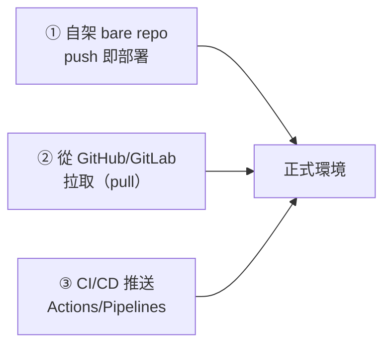

# Git 伺服器端與自動部署

> [!abstract] 這篇你會學到
> - 在自己的伺服器上架起 **bare repo** 當作 Git 遠端
> - 用 **`post-receive` hook** 實作「push 即部署」
> - 用 **`pre-receive` hook** 做**無法被略過**的伺服器端檢查
> - **從 GitHub 上既有的專案部署到正式環境**（含 Deploy Key 與 CI/CD）
> - 安全地設定**部署使用者的權限**
> - 實作**零停機部署**與**一鍵回退**

> [!tip] 這一篇是 LXMP 部署的前置
> [[00-部署實戰-索引]] 會用到這裡建立的部署機制。
> 本篇先把「程式碼怎麼安全地送到伺服器上」講清楚。

## 前置知識

- [[04-Git-遠端協作]] — SSH 金鑰與 Deploy Key
- [[07-Git-進階技巧]] — hooks
- [[06-Git-標籤與版本發布]] — 依標籤部署

---

## 三種部署來源



| 方式 | 適合 | 優點 | 缺點 |
| --- | --- | --- | --- |
| **① 自架 bare repo** | **完全內網、不能連外的機關環境** | 簡單、無外部依賴、程式碼不出機關 | 沒有 PR 流程、沒有 CI |
| **② 從遠端拉取** | **最常見**、有 GitHub/GitLab | 有 PR 與 CI、部署端唯讀 | 伺服器要能連外 |
| **③ CI/CD 推送** | 有成熟 DevOps 流程 | 全自動、可稽核 | 憑證管理較複雜 |

> [!tip] 機關環境的實務選擇
> ```
> 【封閉內網】     → ① 自架 bare repo（或內部 GitLab）
> 【可連外，一般】 → ② 從 GitHub/GitLab 拉取 + Deploy Key（★ 最推薦）
> 【有 CI 需求】   → ② + GitHub Actions 觸發部署腳本
> ```
>
> **② 的關鍵優勢：伺服器上的憑證是「唯讀」的** ——
> 即使伺服器被入侵，攻擊者也改不了原始碼。

---

## 方式一：自架 bare repo

### 什麼是 bare repo

```bash
# 一般 repo：有工作區（看得到檔案）+ .git 目錄
myproject/
├── src/
├── README.md
└── .git/

# bare repo：【只有 .git 的內容】，沒有工作區
myproject.git/
├── HEAD
├── config
├── hooks/
├── objects/
└── refs/
```

> [!note] 為什麼遠端要用 bare
> **一般 repo 不能被 push**（會影響到別人的工作區，Git 預設拒絕）。
> **bare repo 沒有工作區，所以可以安全地接受 push。**

### 建立

```bash
# ========== 【1】建立專用的部署使用者 ==========
$ sudo useradd -m -s /bin/bash -c "Git 部署帳號" gitdeploy
$ sudo -u gitdeploy mkdir -p /home/gitdeploy/.ssh
$ sudo -u gitdeploy chmod 700 /home/gitdeploy/.ssh

# ========== 【2】部署開發者的公鑰 ==========
$ sudo -u gitdeploy tee /home/gitdeploy/.ssh/authorized_keys > /dev/null <<'EOF'
# 王小明（開發）
ssh-ed25519 AAAAC3NzaC1lZDI1NTE5AAAAI... wang@example.gov.tw
# 李大同（開發）
ssh-ed25519 AAAAC3NzaC1lZDI1NTE5AAAAI... li@example.gov.tw
EOF
$ sudo -u gitdeploy chmod 600 /home/gitdeploy/.ssh/authorized_keys

# ========== 【3】建立 bare repo ==========
$ sudo -u gitdeploy mkdir -p /srv/git/myproject.git
$ sudo -u gitdeploy git init --bare /srv/git/myproject.git
Initialized empty Git repository in /srv/git/myproject.git/

# ========== 【4】建立部署目標目錄 ==========
$ sudo mkdir -p /var/www/myproject
$ sudo chown -R gitdeploy:www-data /var/www/myproject
$ sudo chmod 2775 /var/www/myproject      # setgid，新檔案繼承群組

# ========== 【5】開發者端加入 remote ==========
# 在開發機上：
$ git remote add production gitdeploy@10.0.5.20:/srv/git/myproject.git
$ git push production main
```

### `post-receive` hook：push 即部署

```bash
$ sudo -u gitdeploy tee /srv/git/myproject.git/hooks/post-receive > /dev/null <<'HOOK'
#!/usr/bin/env bash
# 收到 push 之後自動部署
set -euo pipefail

WORK_TREE=/var/www/myproject
GIT_DIR=/srv/git/myproject.git
DEPLOY_BRANCH=main
LOG=/var/log/git-deploy.log

log() { echo "[$(date '+%F %T')] $*" | tee -a "$LOG"; }

while read -r oldrev newrev refname; do
  branch=$(git --git-dir="$GIT_DIR" rev-parse --symbolic --abbrev-ref "$refname")

  # 只有 main 分支才部署
  if [ "$branch" != "$DEPLOY_BRANCH" ]; then
    echo "→ 分支 $branch 不觸發部署（只有 $DEPLOY_BRANCH 會）"
    continue
  fi

  log "═══ 部署開始 ($oldrev → $newrev) ═══"

  # ---------- 【1】記錄目前版本（用於回退）----------
  if [ -d "$WORK_TREE/.git" ] || [ -f "$WORK_TREE/.deployed-rev" ]; then
    PREV=$(cat "$WORK_TREE/.deployed-rev" 2>/dev/null || echo "$oldrev")
  else
    PREV="$oldrev"
  fi
  log "前一版：$PREV"

  # ---------- 【2】檢出程式碼到工作目錄 ----------
  # --work-tree 的方式：目標目錄【不需要】有 .git，比較安全
  git --work-tree="$WORK_TREE" --git-dir="$GIT_DIR" checkout -f "$DEPLOY_BRANCH"
  echo "$newrev" > "$WORK_TREE/.deployed-rev"
  log "已檢出 $newrev"

  # ---------- 【3】顯示本次變更 ----------
  echo "【本次變更】"
  git --git-dir="$GIT_DIR" log --oneline "$PREV..$newrev" 2>/dev/null | sed 's/^/  /' || true

  # ---------- 【4】後續動作（依專案類型調整）----------
  cd "$WORK_TREE"

  # PHP / Laravel
  if [ -f composer.json ]; then
    log "執行 composer install"
    composer install --no-dev --optimize-autoloader --no-interaction
  fi

  # Node / Vue / Nuxt
  if [ -f package-lock.json ]; then
    log "執行 npm ci && npm run build"
    npm ci --omit=dev
    npm run build
  fi

  # Laravel 的收尾
  if [ -f artisan ]; then
    log "執行 Laravel 部署動作"
    php artisan down --render="errors::503" || true
    php artisan migrate --force
    php artisan config:cache
    php artisan route:cache
    php artisan view:cache
    php artisan storage:link || true
    php artisan up
  fi

  # ---------- 【5】權限 ----------
  chgrp -R www-data "$WORK_TREE"
  find "$WORK_TREE" -type d -exec chmod 2775 {} \;
  find "$WORK_TREE" -type f -exec chmod 664 {} \;
  [ -d "$WORK_TREE/storage" ] && chmod -R 2775 "$WORK_TREE/storage"
  [ -d "$WORK_TREE/bootstrap/cache" ] && chmod -R 2775 "$WORK_TREE/bootstrap/cache"

  # ---------- 【6】重載服務 ----------
  sudo /bin/systemctl reload php8.3-fpm
  sudo /usr/sbin/nginx -t && sudo /usr/sbin/nginx -s reload

  # ---------- 【7】驗證 ----------
  sleep 2
  CODE=$(curl -s -o /dev/null -w '%{http_code}' -m 10 https://example.gov.tw/health || echo 000)
  if [ "$CODE" = "200" ]; then
    log "✓ 健康檢查通過（HTTP $CODE）"
  else
    log "❌ 健康檢查失敗（HTTP $CODE）"
    echo ""
    echo "  回退指令："
    echo "    git --work-tree=$WORK_TREE --git-dir=$GIT_DIR checkout -f $PREV"
    exit 1
  fi

  log "═══ 部署完成 ═══"
done
HOOK
$ sudo -u gitdeploy chmod +x /srv/git/myproject.git/hooks/post-receive
```

> [!warning] hook 需要的 sudo 權限要嚴格限制
> ```bash
> $ sudo tee /etc/sudoers.d/gitdeploy > /dev/null <<'EOF'
> # 只允許重載服務，不允許其他任何操作
> gitdeploy ALL=(root) NOPASSWD: /bin/systemctl reload php8.3-fpm
> gitdeploy ALL=(root) NOPASSWD: /usr/sbin/nginx -t
> gitdeploy ALL=(root) NOPASSWD: /usr/sbin/nginx -s reload
> EOF
> $ sudo chmod 440 /etc/sudoers.d/gitdeploy
> $ sudo visudo -c        # ★ 驗證語法
> ```
>
> **絕對不要給 `NOPASSWD: ALL`** ——
> 那等於任何能 push 的人都能取得 root。

### `pre-receive` hook：無法被略過的檢查

> [!tip] 這是本地 hooks 做不到的
> **`--no-verify` 只能略過本地 hooks，
> 伺服器端的 `pre-receive` 無論如何都會執行。**

```bash
$ sudo -u gitdeploy tee /srv/git/myproject.git/hooks/pre-receive > /dev/null <<'HOOK'
#!/usr/bin/env bash
set -euo pipefail
ZERO=0000000000000000000000000000000000000000
FAILED=0

while read -r oldrev newrev refname; do
  branch="${refname#refs/heads/}"

  # ---------- 【1】禁止刪除受保護分支 ----------
  if [ "$newrev" = "$ZERO" ]; then
    case "$branch" in
      main|master|production)
        echo "❌ 禁止刪除受保護分支：$branch"; FAILED=1; continue ;;
    esac
  fi

  # ---------- 【2】禁止強制推送到受保護分支 ----------
  if [ "$oldrev" != "$ZERO" ] && [ "$newrev" != "$ZERO" ]; then
    if ! git merge-base --is-ancestor "$oldrev" "$newrev" 2>/dev/null; then
      case "$branch" in
        main|master|production)
          echo "❌ 禁止對 $branch 強制推送（會改寫歷史）"; FAILED=1; continue ;;
      esac
    fi
  fi

  [ "$newrev" = "$ZERO" ] && continue
  RANGE=$([ "$oldrev" = "$ZERO" ] && echo "$newrev" || echo "$oldrev..$newrev")

  # ---------- 【3】檢查每個提交 ----------
  for c in $(git rev-list "$RANGE"); do
    SUBJ=$(git log -1 --format=%s "$c")

    # 訊息格式
    case "$SUBJ" in
      Merge*|Revert*) ;;
      *)
        if ! echo "$SUBJ" | grep -qE '^(feat|fix|docs|style|refactor|perf|test|chore|ci|build|revert)(\(.+\))?!?: .+'; then
          echo "❌ ${c:0:7} 訊息格式不符：$SUBJ"; FAILED=1
        fi ;;
    esac

    # 阻擋 WIP
    if echo "$SUBJ" | grep -qiE '^(wip|fixup!|squash!)'; then
      echo "❌ ${c:0:7} 是未整理的提交：$SUBJ"; FAILED=1
    fi

    # ---------- 【4】掃描機密 ----------
    while IFS= read -r f; do
      [ -z "$f" ] && continue
      case "$f" in
        *.env|*.key|*.pem|*id_rsa*|*id_ed25519|*auth.json)
          echo "❌ ${c:0:7} 含不該提交的檔案：$f"; FAILED=1 ;;
      esac
    done < <(git diff-tree --no-commit-id --name-only -r "$c")

    # 內容中的機密樣式
    if git show "$c" 2>/dev/null | grep -qE '^\+.*(ghp_[A-Za-z0-9]{36}|AKIA[0-9A-Z]{16}|-----BEGIN [A-Z ]*PRIVATE KEY-----)'; then
      echo "❌ ${c:0:7} 內容含疑似金鑰或 Token"; FAILED=1
    fi

    # ---------- 【5】阻擋大檔案 ----------
    while IFS= read -r line; do
      size=$(echo "$line" | awk '{print $1}')
      name=$(echo "$line" | cut -d' ' -f2-)
      if [ "$size" -gt 5242880 ]; then      # 5 MB
        echo "❌ ${c:0:7} 檔案過大（$((size/1024/1024))MB）：$name"; FAILED=1
      fi
    done < <(git diff-tree --no-commit-id -r --numstat "$c" >/dev/null 2>&1;
             git ls-tree -r -l "$c" | awk '{print $4, $5}')
  done
done

if [ "$FAILED" -ne 0 ]; then
  echo ""
  echo "════════════════════════════════════════"
  echo " 推送已被伺服器拒絕"
  echo " ★ 伺服器端檢查【無法用 --no-verify 略過】"
  echo "════════════════════════════════════════"
  exit 1
fi
HOOK
$ sudo -u gitdeploy chmod +x /srv/git/myproject.git/hooks/pre-receive
```

> [!danger] `pre-receive` 拒絕後整批 push 都會失敗
> **這是刻意的設計** —— 要嘛全部接受，要嘛全部拒絕，
> 不會出現「一半的提交被接受」的中間狀態。

---

## 方式二：從 GitHub 拉取（★ 最推薦）

> [!tip] 這是機關環境最務實的做法
> - 開發在 GitHub 上進行（有 PR、有 CI、有審查）
> - **伺服器只用「唯讀」的 Deploy Key 拉取**
> - 部署由伺服器端的腳本執行，可加上完整檢查

### 設定唯讀的 Deploy Key

```bash
# ========== 【1】在伺服器上產生專用金鑰 ==========
$ sudo useradd -m -s /bin/bash -c "部署帳號" deployer
$ sudo -u deployer ssh-keygen -t ed25519 -N "" \
    -f /home/deployer/.ssh/deploy_myproject \
    -C "deploy@web01-myproject"

$ sudo cat /home/deployer/.ssh/deploy_myproject.pub

# ========== 【2】在 GitHub 加入 Deploy Key ==========
#   Repo → Settings → Deploy keys → Add deploy key
#   ★★ 【不要】勾選 "Allow write access"

# ========== 【3】SSH 設定 ==========
$ sudo -u deployer tee /home/deployer/.ssh/config > /dev/null <<'EOF'
Host github-myproject
    HostName github.com
    User git
    IdentityFile /home/deployer/.ssh/deploy_myproject
    IdentitiesOnly yes
    StrictHostKeyChecking yes
EOF
$ sudo -u deployer chmod 600 /home/deployer/.ssh/config
$ sudo -u deployer ssh-keyscan github.com >> /home/deployer/.ssh/known_hosts

# ========== 【4】驗證（應該可以 clone，但不能 push）==========
$ sudo -u deployer ssh -T git@github-myproject
Hi org/myproject! You've successfully authenticated, but GitHub does not provide shell access.
```

### 部署腳本

```bash
$ sudo tee /usr/local/sbin/deploy-myproject.sh > /dev/null <<'SCRIPT'
#!/usr/bin/env bash
# 從 GitHub 拉取並部署（支援指定標籤或分支）
set -euo pipefail

REPO="git@github-myproject:org/myproject.git"
APP_DIR="/var/www/myproject"
USER="deployer"
REF="${1:-main}"
LOG="/var/log/deploy-myproject.log"

exec > >(tee -a "$LOG") 2>&1
echo "════════════════════════════════════════"
echo " 部署 $REF   $(date '+%F %T')"
echo " 執行者：${SUDO_USER:-$USER}"
echo "════════════════════════════════════════"

run() { sudo -u "$USER" "$@"; }

# ---------- 【1】首次部署則 clone ----------
if [ ! -d "$APP_DIR/.git" ]; then
  echo "首次部署，執行 clone…"
  sudo mkdir -p "$APP_DIR"
  sudo chown "$USER":www-data "$APP_DIR"
  run git clone "$REPO" "$APP_DIR"
fi

cd "$APP_DIR"

# ---------- 【2】記錄目前版本 ----------
BEFORE=$(run git rev-parse HEAD)
BEFORE_DESC=$(run git describe --tags --always 2>/dev/null || echo "$BEFORE")
echo "目前版本：$BEFORE_DESC"

# ---------- 【3】確認工作區乾淨 ----------
if ! run git diff --quiet; then
  echo "❌ 工作區有未提交的變更，請先處理："
  run git status -s
  exit 1
fi

# ---------- 【4】拉取 ----------
run git fetch origin --tags --prune
if ! run git rev-parse "$REF" >/dev/null 2>&1; then
  echo "❌ 找不到 $REF"
  echo "可用的標籤："; run git tag --sort=-version:refname | head -10
  exit 1
fi
run git checkout --detach "$REF"
AFTER=$(run git rev-parse HEAD)

if [ "$BEFORE" = "$AFTER" ]; then
  echo "沒有新的變更，結束。"
  exit 0
fi

# ---------- 【5】顯示本次變更 ----------
echo -e "\n【本次變更】"
run git log --oneline "$BEFORE..$AFTER" | sed 's/^/  /'

# ---------- 【6】相依套件與建置 ----------
[ -f composer.json ]      && run composer install --no-dev --optimize-autoloader --no-interaction
[ -f package-lock.json ]  && { run npm ci; run npm run build; }

# ---------- 【7】Laravel 收尾 ----------
if [ -f artisan ]; then
  run php artisan down --retry=30 || true
  run php artisan migrate --force
  run php artisan config:cache
  run php artisan route:cache
  run php artisan view:cache
  run php artisan event:cache || true
  run php artisan storage:link || true
  run php artisan queue:restart || true
  run php artisan up
fi

# ---------- 【8】權限與版本標記 ----------
sudo chgrp -R www-data "$APP_DIR"
sudo find "$APP_DIR/storage" "$APP_DIR/bootstrap/cache" -type d -exec chmod 2775 {} \; 2>/dev/null || true
run sh -c 'git describe --tags --always > public/version.txt'

# ---------- 【9】重載服務 ----------
sudo systemctl reload php8.3-fpm
sudo nginx -t && sudo nginx -s reload

# ---------- 【10】驗證 ----------
sleep 2
CODE=$(curl -s -o /dev/null -w '%{http_code}' -m 10 https://example.gov.tw/health || echo 000)
if [ "$CODE" != "200" ]; then
  echo "❌ 健康檢查失敗（HTTP $CODE）"
  echo "回退：$0 $BEFORE"
  exit 1
fi

echo -e "\n════════════════════════════════════════"
echo " ✓ 部署完成：$BEFORE_DESC → $(run git describe --tags --always)"
echo " 回退指令：$0 $BEFORE"
echo "════════════════════════════════════════"
SCRIPT
$ sudo chmod 750 /usr/local/sbin/deploy-myproject.sh
```

```bash
# ===== 使用 =====
$ sudo /usr/local/sbin/deploy-myproject.sh v1.2.0    # 部署特定標籤
$ sudo /usr/local/sbin/deploy-myproject.sh main      # 部署 main 最新
$ sudo /usr/local/sbin/deploy-myproject.sh a1b2c3d   # 回退到特定提交
```

---

## 方式三：CI/CD 觸發部署

```yaml
# .github/workflows/deploy.yml
name: 部署到正式環境

on:
  push:
    tags: ['v*']              # 只有 v 開頭的標籤才觸發
  workflow_dispatch:          # 允許手動觸發
    inputs:
      ref:
        description: '要部署的標籤或分支'
        required: true
        default: 'main'

jobs:
  security-check:
    runs-on: ubuntu-latest
    steps:
      - uses: actions/checkout@v4
        with: { fetch-depth: 0 }

      - name: 掃描機密
        uses: gitleaks/gitleaks-action@v2
        env:
          GITHUB_TOKEN: ${{ secrets.GITHUB_TOKEN }}

      - name: 相依套件弱點掃描
        uses: aquasecurity/trivy-action@master
        with:
          scan-type: fs
          severity: CRITICAL,HIGH
          ignore-unfixed: true
          exit-code: '1'

  deploy:
    needs: security-check
    runs-on: ubuntu-latest
    environment:
      name: production          # ★ 可設定 required reviewers
      url: https://example.gov.tw
    steps:
      - name: 透過 SSH 觸發伺服器上的部署腳本
        uses: appleboy/ssh-action@v1
        with:
          host: ${{ secrets.DEPLOY_HOST }}
          username: ${{ secrets.DEPLOY_USER }}
          key: ${{ secrets.DEPLOY_SSH_KEY }}
          port: ${{ secrets.DEPLOY_PORT }}
          script: |
            sudo /usr/local/sbin/deploy-myproject.sh ${{ github.ref_name }}

      - name: 部署後驗證
        run: |
          sleep 5
          code=$(curl -s -o /dev/null -w '%{http_code}' https://example.gov.tw/health)
          [ "$code" = "200" ] || { echo "健康檢查失敗：$code"; exit 1; }
          curl -s https://example.gov.tw/version.txt
```

> [!danger] CI 的部署金鑰要嚴格限制
> ```
> □ 【專用的部署帳號】（不是你的個人帳號）
> □ 【該帳號只能執行部署腳本】（sudoers 限定單一指令）
> □ 【SSH 金鑰限制來源 IP】（authorized_keys 的 from=）
> □ 【限定可執行的指令】（authorized_keys 的 command=）
> □ 【GitHub Environment 設定 required reviewers】
> □ 【Secrets 定期輪替】
> ```
>
> ```bash
> # /home/deployer/.ssh/authorized_keys
> from="140.82.112.0/20",command="/usr/local/sbin/deploy-wrapper.sh",no-agent-forwarding,no-port-forwarding,no-pty ssh-ed25519 AAAA... github-actions
> ```

---

## 零停機部署

> [!tip] 前面的做法在 checkout 到重載服務之間會有短暫的不一致
> **符號連結切換法**可以做到近乎零停機。

```
/var/www/myproject/
├── releases/
│   ├── 20260828-143000/       ← 舊版
│   ├── 20260828-160000/       ← 新版（正在準備）
│   └── 20260828-170000/       ← 更新的版本
├── shared/                    ← 【跨版本共用，不隨部署改變】
│   ├── .env
│   ├── storage/
│   └── public/uploads/
└── current -> releases/20260828-170000    ← 【符號連結】
```

```bash
$ sudo tee /usr/local/sbin/deploy-zerodowntime.sh > /dev/null <<'SCRIPT'
#!/usr/bin/env bash
set -euo pipefail

BASE=/var/www/myproject
REPO="git@github-myproject:org/myproject.git"
REF="${1:-main}"
USER=deployer
KEEP=5                          # 保留幾個舊版本
STAMP=$(date +%Y%m%d-%H%M%S)
NEW="$BASE/releases/$STAMP"

run() { sudo -u "$USER" "$@"; }

echo "═══ 零停機部署 $REF → $STAMP ═══"

# ---------- 【1】建立目錄結構（首次）----------
sudo mkdir -p "$BASE/releases" "$BASE/shared/storage" "$BASE/shared/public/uploads"
sudo chown -R "$USER":www-data "$BASE"

# ---------- 【2】clone 新版本到獨立目錄 ----------
run git clone --depth 1 --branch "$REF" "$REPO" "$NEW" 2>/dev/null || {
  run git clone "$REPO" "$NEW"
  run git -C "$NEW" checkout --detach "$REF"
}

# ---------- 【3】連結共用資源 ----------
run rm -rf "$NEW/storage" "$NEW/public/uploads"
run ln -sfn "$BASE/shared/storage"        "$NEW/storage"
run ln -sfn "$BASE/shared/public/uploads" "$NEW/public/uploads"
run ln -sfn "$BASE/shared/.env"           "$NEW/.env"

# ---------- 【4】在新目錄中建置（★ 舊版仍在服務中）----------
cd "$NEW"
[ -f composer.json ]     && run composer install --no-dev --optimize-autoloader --no-interaction
[ -f package-lock.json ] && { run npm ci; run npm run build; }

if [ -f artisan ]; then
  run php artisan config:cache
  run php artisan route:cache
  run php artisan view:cache
fi

# ---------- 【5】資料庫遷移（★ 必須向下相容）----------
if [ -f artisan ]; then
  echo "執行 migration…"
  run php artisan migrate --force
fi

# ---------- 【6】★ 切換符號連結（這一刻才生效，幾乎瞬間）----------
PREV=$(readlink -f "$BASE/current" 2>/dev/null || echo "")
sudo -u "$USER" ln -sfn "$NEW" "$BASE/current.tmp"
sudo -u "$USER" mv -Tf "$BASE/current.tmp" "$BASE/current"
run sh -c "git -C '$NEW' describe --tags --always > '$NEW/public/version.txt'"

# ---------- 【7】重載（清除 opcache）----------
sudo systemctl reload php8.3-fpm
run php "$NEW/artisan" queue:restart 2>/dev/null || true

# ---------- 【8】驗證 ----------
sleep 2
CODE=$(curl -s -o /dev/null -w '%{http_code}' -m 10 https://example.gov.tw/health || echo 000)
if [ "$CODE" != "200" ]; then
  echo "❌ 健康檢查失敗，回退中…"
  [ -n "$PREV" ] && { sudo -u "$USER" ln -sfn "$PREV" "$BASE/current"; sudo systemctl reload php8.3-fpm; }
  exit 1
fi

# ---------- 【9】清理舊版本 ----------
cd "$BASE/releases"
ls -1dt */ | tail -n +$((KEEP+1)) | xargs -r sudo rm -rf

echo "═══ ✓ 完成 ═══"
echo "前一版：$PREV"
echo "回退：sudo -u $USER ln -sfn '$PREV' '$BASE/current' && sudo systemctl reload php8.3-fpm"
SCRIPT
$ sudo chmod 750 /usr/local/sbin/deploy-zerodowntime.sh
```

```nginx
# ★ Nginx 的 root 指向 current 符號連結
server {
    listen 443 ssl;
    server_name example.gov.tw;

    root /var/www/myproject/current/public;

    # ★ 重要：讓 Nginx 每次都重新解析符號連結
    # 否則切換後 Nginx 仍指向舊的實體路徑
    disable_symlinks off;

    location / {
        try_files $uri $uri/ /index.php?$query_string;
    }

    location ~ \.php$ {
        fastcgi_pass unix:/run/php/php8.3-fpm.sock;
        # ★ 用 $realpath_root 而非 $document_root
        fastcgi_param SCRIPT_FILENAME $realpath_root$fastcgi_script_name;
        fastcgi_param DOCUMENT_ROOT   $realpath_root;
        include fastcgi_params;
    }
}
```

> [!danger] 零停機部署的三個關鍵細節
> **① Nginx 要用 `$realpath_root`**
> 否則 PHP-FPM 的 opcache 會快取舊的實體路徑，切換後仍執行舊程式碼。
>
> **② 資料庫 migration 必須向下相容**
> ```
> 切換的那一瞬間，可能有舊版與新版同時在處理請求。
>
> ✅ 安全的 migration：新增欄位（可為 NULL）、新增資料表、新增索引
> ❌ 危險的 migration：刪除欄位、改名、改型別、加 NOT NULL 約束
>
> → 破壞性變更要拆成【兩次部署】：
>    第一次：新增新欄位，程式同時寫新舊兩邊
>    第二次：移除舊欄位
> ```
>
> **③ `shared/` 裡的東西不能隨部署被覆蓋**
> `.env`、`storage/`、使用者上傳的檔案 —— 這些必須跨版本保留。

---

## 完整實戰範例

### 一鍵回退

```bash
$ sudo tee /usr/local/sbin/rollback-myproject.sh > /dev/null <<'SCRIPT'
#!/usr/bin/env bash
set -euo pipefail
BASE=/var/www/myproject
USER=deployer

echo "可用的版本："
ls -1dt "$BASE/releases"/*/ | head -10 | nl -w2 -s'. '
CURRENT=$(readlink -f "$BASE/current")
echo -e "\n目前：$CURRENT"

read -rp $'\n要回退到第幾個？(輸入編號，或 q 取消) ' n
[ "$n" = "q" ] && exit 0

TARGET=$(ls -1dt "$BASE/releases"/*/ | sed -n "${n}p")
[ -z "$TARGET" ] && { echo "無效的選擇"; exit 1; }

echo "回退到：$TARGET"
read -rp "確認？(yes/no) " ans
[ "$ans" = "yes" ] || exit 0

sudo -u "$USER" ln -sfn "${TARGET%/}" "$BASE/current"
sudo systemctl reload php8.3-fpm
sudo nginx -s reload

sleep 2
CODE=$(curl -s -o /dev/null -w '%{http_code}' https://example.gov.tw/health)
echo "健康檢查：HTTP $CODE"
curl -s https://example.gov.tw/version.txt
SCRIPT
$ sudo chmod 750 /usr/local/sbin/rollback-myproject.sh
```

### 內部 GitLab（機關的中間方案）

> [!tip] 兼顧「不出機關」與「有 PR/CI」
> ```bash
> # Docker 部署 GitLab CE
> $ docker run -d --name gitlab \
>   --hostname gitlab.example.gov.tw \
>   -p 8929:8929 -p 2224:22 \
>   -v /srv/gitlab/config:/etc/gitlab \
>   -v /srv/gitlab/logs:/var/log/gitlab \
>   -v /srv/gitlab/data:/var/opt/gitlab \
>   --shm-size 512m \
>   --restart always \
>   gitlab/gitlab-ce:latest
> ```
>
> **好處**：
> - 程式碼**完全留在機關內部**
> - **有 Merge Request、Code Review、CI/CD**
> - 可設定分支保護與 Tag protection
> - 可整合 AD/LDAP 認證
>
> **代價**：要自己維運（備份、升級、資源）。
>
> ⚠️ **GitLab 相當吃資源**（建議 4 核心 / 8GB RAM 以上）。

---

## 常見錯誤與排錯

| 現象／錯誤 | 原因 | 解法 |
| --- | --- | --- |
| **push 到一般 repo 被拒絕** | 遠端不是 bare | 遠端用 `git init --bare` |
| `post-receive` 沒有執行 | 沒有執行權限 | `chmod +x hooks/post-receive` |
| hook 中的指令找不到 | **hook 的環境變數很精簡** | 用**絕對路徑**；或在 hook 開頭 `export PATH=...` |
| **hook 中 git 指令行為異常** | 繼承了 `GIT_DIR` 等環境變數 | 在 hook 中 `unset GIT_DIR GIT_WORK_TREE` 或明確指定 |
| **部署後仍執行舊程式碼** | **PHP opcache 快取了舊路徑** | Nginx 用 `$realpath_root`；重載 PHP-FPM |
| 符號連結切換後 Nginx 沒生效 | Nginx 快取了解析結果 | `disable_symlinks off` + `$realpath_root` + reload |
| **`.env` 被部署覆蓋** | 沒有用 shared 目錄 | `.env` 放 `shared/`，用符號連結 |
| **使用者上傳的檔案不見了** | 每次部署重新 clone | `public/uploads`、`storage` 放 `shared/` |
| 部署後權限錯誤 | 檢出的檔案擁有者不對 | 部署後 `chgrp -R www-data` + `chmod` |
| **migration 讓舊版壞掉** | 破壞性變更 | **拆成兩次部署**；只做向下相容的變更 |
| CI 的 SSH 連不上 | 金鑰或 known_hosts 問題 | 檢查 secrets；`ssh-keyscan` 加入 known_hosts |
| **部署帳號權限過大** | `NOPASSWD: ALL` | **sudoers 限定單一指令**；`authorized_keys` 加 `command=` |
| 磁碟被舊版本塞滿 | 沒有清理 releases | 部署腳本保留固定數量並清理 |
| `pre-receive` 拒絕但不知道原因 | 訊息不清楚 | hook 的 stdout 會顯示給推送者，寫清楚原因 |

---

## 安全性注意事項

> [!danger] 部署機制是「從外部寫入正式環境」的通道
> **它必然是高價值的攻擊目標。**
>
> ```
> 攻擊者取得部署權限 → 【可以在正式環境執行任意程式碼】
> ```
>
> **必做的七項防護**：
> ```
> ① 【部署帳號不是 root】，且 sudoers 只允許特定指令
> ② 【Deploy Key 設為唯讀】
> ③ 【authorized_keys 限制來源 IP 與可執行指令】
> ④ 【伺服器端 pre-receive 檢查】（無法被略過）
> ⑤ 【部署需要人工核准】（GitHub Environment）
> ⑥ 【每次部署都留下可稽核的紀錄】
> ⑦ 【部署腳本本身要納入版控與 code review】
> ```

> [!warning] 部署目錄不要有 `.git`
> ```bash
> # 檢查
> $ curl -sI https://example.gov.tw/.git/config | head -1
> HTTP/2 200          ← ⚠⚠ 有問題！
> ```
>
> **三種避免方式**：
> ```
> ① 用 --work-tree 檢出（bare repo 在別的地方，工作目錄沒有 .git）
> ② web root 指向子目錄（Laravel 的 public/），.git 在上一層
> ③ Nginx 明確拒絕：
>    location ~ /\.(git|env|svn|hg) { deny all; return 404; }
> ```

> [!danger] hook 腳本的執行身分與注入風險
> ```bash
> # ❌ 危險：把分支名直接用在指令中
> branch=$(git rev-parse --abbrev-ref "$refname")
> eval "deploy_$branch"                    # ← 分支名可能含惡意內容
>
> # ✅ 安全：白名單比對
> case "$branch" in
>   main)       deploy_main ;;
>   staging)    deploy_staging ;;
>   *)          echo "分支 $branch 不觸發部署"; continue ;;
> esac
> ```
>
> **分支名稱、標籤名稱、commit 訊息都是「使用者可控的輸入」**，
> 不要直接放進 shell 指令中。

> [!tip] 部署的稽核紀錄
> **每次部署都要能回答**：
> ```
> · 誰部署的？          → $SUDO_USER / CI 的觸發者
> · 什麼時候？          → 時戳
> · 部署了哪一版？      → git describe / commit SHA
> · 包含哪些變更？      → git log 範圍
> · 有沒有成功？        → 健康檢查結果
> · 前一版是什麼？      → 用於回退
> ```
>
> **這些資訊要寫進日誌並送到集中日誌伺服器**
> （見 [[09-日誌集中與SIEM]]），
> 因為**攻擊者若透過部署管道植入後門，這是唯一的追溯線索**。

---

## 速查表

### 三種部署來源

| 方式 | 適合 | 關鍵優點 |
| --- | --- | --- |
| 自架 bare repo | 封閉內網 | 無外部依賴 |
| **從 GitHub 拉取** | **最常見** | **憑證唯讀** ★ |
| CI/CD 推送 | 成熟 DevOps | 全自動可稽核 |

### bare repo

```bash
git init --bare /srv/git/myproject.git      # 伺服器端
git remote add production user@host:/srv/git/myproject.git   # 開發端
```

### 伺服器端 hooks

| Hook | 時機 | 用途 |
| --- | --- | --- |
| **`pre-receive`** | 接受前 | **檢查（無法被 `--no-verify` 略過）** |
| `update` | 每個 ref | 逐分支檢查 |
| **`post-receive`** | 接受後 | **自動部署** |

### post-receive 部署要點

```bash
git --work-tree=/var/www/app --git-dir=/srv/git/app.git checkout -f main
# ★ --work-tree 方式：目標目錄不需要有 .git
```

### sudoers 最小權限

```
gitdeploy ALL=(root) NOPASSWD: /bin/systemctl reload php8.3-fpm
gitdeploy ALL=(root) NOPASSWD: /usr/sbin/nginx -t
gitdeploy ALL=(root) NOPASSWD: /usr/sbin/nginx -s reload
★ 絕不能給 NOPASSWD: ALL
```

### Deploy Key（唯讀）

```bash
ssh-keygen -t ed25519 -N "" -f ~/.ssh/deploy_myproject
# GitHub → Settings → Deploy keys → 【不勾 Allow write access】
# ~/.ssh/config: Host github-myproject / IdentitiesOnly yes
ssh-keyscan github.com >> ~/.ssh/known_hosts
```

### 零停機部署結構

```
releases/<時戳>/          每次部署一個新目錄
shared/                   .env · storage/ · public/uploads/  ← 跨版本共用
current -> releases/xxx   ★ 切換符號連結那一刻才生效
```

**Nginx 必設**：
```nginx
root /var/www/app/current/public;
disable_symlinks off;
fastcgi_param SCRIPT_FILENAME $realpath_root$fastcgi_script_name;   # ★
fastcgi_param DOCUMENT_ROOT   $realpath_root;
```

### migration 的向下相容

```
✅ 安全：新增可為 NULL 的欄位 · 新增資料表 · 新增索引
❌ 危險：刪除欄位 · 改名 · 改型別 · 加 NOT NULL

破壞性變更 → 【拆成兩次部署】
  第一次：新增新欄位，程式同時寫新舊兩邊
  第二次：移除舊欄位
```

### authorized_keys 限制

```
from="140.82.112.0/20",command="/usr/local/sbin/deploy-wrapper.sh",\
no-agent-forwarding,no-port-forwarding,no-pty ssh-ed25519 AAAA... ci
```

### 部署機制七項防護

```
① 部署帳號非 root，sudoers 限定指令
② 【Deploy Key 唯讀】
③ authorized_keys 限來源 IP 與指令
④ 【pre-receive 檢查】（無法略過）
⑤ 部署需人工核准
⑥ 可稽核的部署紀錄
⑦ 部署腳本本身納入版控與 review
```

### `.git` 不能出現在 web root

```
① --work-tree 檢出（工作目錄沒有 .git）
② web root 指向 public/（.git 在上一層）
③ Nginx: location ~ /\.(git|env) { deny all; return 404; }
檢查：curl -sI https://網站/.git/config | head -1
```

### 部署稽核紀錄要含

```
誰 · 什麼時候 · 哪一版 · 包含哪些變更 · 成功與否 · 前一版
→ 送到【集中日誌伺服器】（攻擊者植入後門時的唯一追溯線索）
```

---

## 練習題

> [!question]- 練習 1：架設 bare repo + 自動部署
> 在測試機上：
> 1. 建立 `gitdeploy` 使用者與 bare repo
> 2. 從開發機 `git push` 上去
> 3. 寫一個簡單的 `post-receive`（先只做 checkout 與 echo）
> 4. **確認 hook 有執行**（push 時會看到 hook 的輸出）
> 5. 加上 `sudo systemctl reload nginx`，設定 sudoers
> 6. **故意在 hook 中打錯字，觀察錯誤訊息會不會顯示給推送者**
> 7. 加上 `pre-receive`，**測試 `git push --no-verify` 能不能繞過**

> [!question]- 練習 2：用 Deploy Key 從 GitHub 部署
> 1. 建立一個測試 repo（可以是私有的）
> 2. 在測試機上產生 Deploy Key，**不給寫入權限**
> 3. 設定 `~/.ssh/config` 與 `known_hosts`
> 4. **驗證**：能 clone 嗎？能 push 嗎？（應該 pull 可以、push 被拒）
> 5. 寫部署腳本，支援 `deploy.sh <標籤>`
> 6. 打一個標籤並部署
> 7. **測試回退**：`deploy.sh <前一個標籤>`

> [!question]- 練習 3：零停機部署
> 1. 建立 `releases/` `shared/` `current` 的目錄結構
> 2. 把 `.env` 移到 `shared/` 並建立符號連結
> 3. Nginx 的 root 指向 `current/public`，設定 `$realpath_root`
> 4. 執行兩次部署，**觀察 `current` 指向的變化**
> 5. **在部署過程中持續 `curl` 網站**，記錄有沒有出現 5xx
> 6. **拿掉 `$realpath_root` 再試一次** —— 會發生什麼？
> 7. 測試回退：切換符號連結回舊版
> 8. 思考：如果這次部署有 migration，回退時該怎麼辦？

---

## 小測驗

Q1. **為什麼 Git 遠端要用 bare repo？一般 repo 為什麼不能被 push**？

Q2. 三種部署來源各適合什麼情境？**「從遠端拉取」的關鍵安全優勢是什麼**？

Q3. **`pre-receive` 與本地 `pre-commit` 最大的差異是什麼**？

Q4. **`post-receive` hook 中，為什麼要用 `--work-tree` 而不是在目標目錄建 repo**？

Q5. 部署帳號的 sudoers 該怎麼設定？**為什麼絕不能給 `NOPASSWD: ALL`**？

Q6. **零停機部署的三個關鍵細節是什麼**？

Q7. **為什麼 Nginx 要用 `$realpath_root` 而非 `$document_root`**？不用會怎樣？

Q8. **哪些 migration 是「向下相容」的？破壞性變更該怎麼處理**？

Q9. **`shared/` 目錄要放哪些東西？為什麼**？

Q10. **hook 腳本中處理分支名稱時有什麼注入風險？該怎麼防**？

> [!question]- 測驗答案
> **Q1.** 因為 **bare repo 沒有工作區**，只有 `.git` 的內容
> （HEAD、config、hooks、objects、refs）。
> **一般 repo 不能被 push**，是因為推送會改變分支指標，
> 但**工作區的檔案不會跟著更新**，
> 造成「工作區與 HEAD 不一致」的混亂狀態 ——
> 如果當時有人正在那個目錄工作，情況會更糟，
> 所以 Git 預設拒絕推送到有工作區的 repo 的當前分支。
>
> **Q2.** **① 自架 bare repo** 適合**完全內網、不能連外的機關環境**；
> **② 從遠端拉取**適合**最常見的情況**（有 GitHub/GitLab）；
> **③ CI/CD 推送**適合有成熟 DevOps 流程的團隊。
> **「從遠端拉取」的關鍵安全優勢是：
> 伺服器上的憑證可以是「唯讀」的（Deploy Key 不勾寫入權限）** ——
> 即使伺服器被入侵，**攻擊者也改不了原始碼**，
> 無法把後門推回 repo 去感染其他環境。
>
> **Q3.** **`pre-receive` 在伺服器端執行，無法被 `--no-verify` 略過**；
> 而本地的 `pre-commit` / `pre-push` **任何人加一個參數就能繞過**。
> 這代表：**本地 hooks 的價值是「方便開發者早期發現問題」，
> 伺服器端 hooks 才是「真正的強制」**。
> 另外 `pre-receive` 拒絕時**整批 push 都會失敗**（不會有一半被接受的中間狀態）。
>
> **Q4.** 因為 **`--work-tree` 的方式讓目標目錄「不需要有 `.git`」** ——
> 這樣就**不會有 `.git` 目錄暴露在 web root 的風險**
> （攻擊者無法下載 `/.git/config` 還原整個原始碼與歷史）。
> 指令是：
> `git --work-tree=/var/www/app --git-dir=/srv/git/app.git checkout -f main`。
>
> **Q5.** sudoers 應該**只允許執行部署必要的特定指令**：
> ```
> gitdeploy ALL=(root) NOPASSWD: /bin/systemctl reload php8.3-fpm
> gitdeploy ALL=(root) NOPASSWD: /usr/sbin/nginx -t
> gitdeploy ALL=(root) NOPASSWD: /usr/sbin/nginx -s reload
> ```
> **絕不能給 `NOPASSWD: ALL`**，因為那等於
> **任何能 push 的人（或任何取得部署金鑰的攻擊者）都能取得 root** ——
> 部署權限會直接升級成整台機器的完全控制權。
>
> **Q6.** ①**Nginx 要用 `$realpath_root`** ——
> 否則 PHP-FPM 的 opcache 會快取舊的實體路徑，切換後仍執行舊程式碼；
> ②**資料庫 migration 必須向下相容** ——
> 切換的瞬間可能有舊版與新版同時在處理請求；
> ③**`shared/` 裡的東西不能隨部署被覆蓋** ——
> `.env`、`storage/`、使用者上傳的檔案必須跨版本保留。
>
> **Q7.** 因為 **`current` 是符號連結**。
> `$document_root` 會是「設定中寫的路徑」（含符號連結），
> 而 **`$realpath_root` 是「解析符號連結後的實體路徑」**。
> 不用 `$realpath_root` 的後果：
> **PHP-FPM 的 opcache 以 `$document_root` 為鍵值快取編譯結果**，
> 切換符號連結後路徑字串沒變，
> **opcache 認為檔案沒變而繼續使用舊的編譯結果** ——
> 也就是**部署完成了但仍在執行舊程式碼**。
> 另外還要設 `disable_symlinks off`。
>
> **Q8.** **向下相容（安全）的**：
> **新增可為 NULL 的欄位、新增資料表、新增索引** ——
> 舊版程式碼不知道它們的存在，但也不會壞掉。
> **破壞性（危險）的**：
> **刪除欄位、改名、改型別、加 NOT NULL 約束** ——
> 舊版程式碼會因為找不到欄位或違反約束而報錯。
> **破壞性變更要拆成兩次部署**：
> **第一次**新增新欄位，程式**同時寫新舊兩邊**（雙寫）；
> **第二次**（確認舊版已完全下線後）移除舊欄位。
>
> **Q9.** 要放**跨版本共用、不能隨部署被覆蓋**的東西：
> **`.env`**（設定與密碼，每次重新 clone 會不見）、
> **`storage/`**（Laravel 的日誌、快取、上傳檔案）、
> **`public/uploads/`**（使用者上傳的檔案）。
> 原因是**每次部署都會建立一個全新的 `releases/<時戳>/` 目錄**，
> 如果這些東西在版本目錄裡，**每次部署使用者的資料就會消失**。
> 做法是把它們放在 `shared/`，在新版本目錄中用**符號連結**指過去。
>
> **Q10.** 風險是：**分支名稱、標籤名稱、commit 訊息
> 都是「使用者可控的輸入」** ——
> 攻擊者可以建立名稱含有 shell 特殊字元的分支，
> 如果 hook 中直接把它拼進指令（尤其是用 `eval`），
> 就會造成**命令注入，在伺服器上執行任意程式碼**。
> **防範方式是用白名單比對而非直接代入**：
> ```bash
> case "$branch" in
>   main)    deploy_main ;;
>   staging) deploy_staging ;;
>   *)       echo "分支 $branch 不觸發部署"; continue ;;
> esac
> ```
> 並且**絕對不要用 `eval`**、變數一律加雙引號。

---

## 延伸閱讀

- [[00-部署實戰-索引]] — **LXMP 全套的完整部署實戰**
- [[06-Git-標籤與版本發布]] — 依標籤部署與回退
- [[04-Git-遠端協作]] — Deploy Key 與 SSH 設定
- [[07-Git-進階技巧]] — hooks 的完整說明
- [[06-部署自動化]] — CI/CD 與部署工具
- [[09-日誌集中與SIEM]] — 部署稽核紀錄
- [[11-委外與供應鏈資安]] — 廠商的部署權限管控
