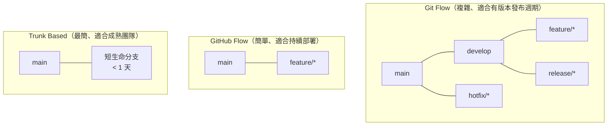

# Git 團隊規範與實戰情境

> [!abstract] 這篇你會學到
> - 訂出**適合團隊規模的分支策略**（三種主流方案的比較）
> - 寫出可讀且可自動化處理的 **commit 訊息規範**
> - 建立有效的 **Code Review 文化**
> - 處理**誤推、誤刪、機密外洩、歷史被改寫**等意外
> - 制定一份**可執行的團隊 Git 規範**（附完整範本）

> [!tip] git-flow 的完整實作在下一篇
> 本篇比較三種策略並說明「怎麼選」，
> **git-flow 的完整流程與指令**見 [[10-Git-flow完整實戰]]。

## 前置知識

- [[08-Git-伺服器端與自動部署]] — 伺服器端 hooks
- [[03-Git-分支與合併]] — 分支與合併
- [[06-Git-標籤與版本發布]] — 版本與發布

---

## 三種主流分支策略



| | **Git Flow** | **GitHub Flow** | **Trunk Based** |
| --- | --- | --- | --- |
| 分支類型 | **5 種** | **2 種** | 1～2 種 |
| 分支存活 | 數天～數週 | 數天 | **< 1 天** |
| 發布方式 | **有版本發布週期** | 持續部署 | 持續部署 + 功能旗標 |
| 適合團隊 | 中大型、有 QA | **小～中型** | 成熟、測試自動化完整 |
| 適合產品 | **需要維護多版本**（如套裝軟體） | Web 服務 | Web 服務 |
| 學習成本 | 高 | **低** | 中（需要功能旗標） |
| 常見問題 | **過度複雜、合併衝突多** | 長分支會有衝突 | 需要很強的測試 |

> [!danger] 最常見的錯誤：盲目採用 Git Flow
> **Git Flow 是 2010 年為「有版本發布週期的套裝軟體」設計的。**
>
> **如果你的情況是**：
> ```
> · 一個系統，只有一個正式環境
> · 沒有「同時維護 v1.x 與 v2.x」的需求
> · 團隊只有 2～5 人
> · 每週或每月上線一次
> ```
> **那 Git Flow 對你來說太複雜了** ——
> 你會花很多時間在管理分支，而不是在做事。
>
> **連 Git Flow 的原作者後來都寫了一段但書**，
> 說它不適合持續交付的 Web 應用。

### 怎麼選

```
你需要「同時維護多個版本」嗎？（如 v1.x 還要繼續修 bug）
├─ 【是】→ Git Flow 或簡化版
└─ 否 → 你的測試自動化夠完整、能一天多次上線嗎？
        ├─ 是 → 【Trunk Based】
        └─ 否 → 【GitHub Flow】★ 多數機關的最佳選擇
```

> [!tip] 機關環境的務實建議：GitHub Flow + 環境分支
> ```
> main              ← 正式環境（受保護，只能透過 PR 合併）
> ├─ feature/xxx    ← 功能開發（從 main 分出，PR 回 main）
> └─ hotfix/xxx     ← 緊急修正（從 tag 分出）
>
> 【部署靠標籤，不靠分支】
>   v1.2.0 → 部署到正式環境
>   標籤才是「哪一版在跑」的依據
> ```
>
> **為什麼不用 develop 分支**：
> - 機關通常只有一個正式環境
> - `develop` 與 `main` 的差異會越來越大，最後合併時衝突爆炸
> - **多一個分支就多一個要同步的地方**
>
> **需要「預備環境」的話**：
> 用**標籤 + 環境**，而不是分支：
> ```
> v1.2.0-rc.1  → 部署到測試環境
> v1.2.0       → 部署到正式環境
> ```

### 各策略的分支命名

```
【共通】
main / master        正式環境
hotfix/<單號>-<描述> 緊急修正

【Git Flow 額外】
develop              開發主線
feature/<單號>-<描述>
release/<版號>

【GitHub Flow / Trunk Based】
feature/<單號>-<描述>
fix/<單號>-<描述>
chore/<描述>
docs/<描述>

【範例】
feature/1234-新增API反向代理
fix/1567-修正登入逾時
hotfix/1890-緊急修正付款錯誤
```

---

## Commit 訊息規範

### Conventional Commits（推薦）

```
<類型>(<範圍>): <簡短描述>
<空行>
<內文：為什麼要改>
<空行>
<頁尾：單號、Breaking Change、Co-authored-by>
```

| 類型 | 用於 | 版號影響 |
| --- | --- | --- |
| **`feat`** | 新增功能 | MINOR |
| **`fix`** | 修正錯誤 | PATCH |
| `perf` | 效能改善 | PATCH |
| `refactor` | 重構（不改行為） | — |
| `docs` | 文件 | — |
| `style` | 格式（不影響邏輯） | — |
| `test` | 測試 | — |
| `build` | 建置系統或相依套件 | — |
| `ci` | CI/CD 設定 | — |
| **`chore`** | 雜項 | — |
| `revert` | 撤銷先前的提交 | — |

**Breaking Change 的兩種寫法**：
```
feat(api)!: 移除 /v1/users 的 email 欄位
                ↑ 驚嘆號

或在頁尾：

feat(api): 調整使用者 API 的回應格式

BREAKING CHANGE: /v1/users 不再回傳 email 欄位，
請改用 /v1/users/{id}/contact 取得。
```

### 範例

```
✅ 好的：

fix(nginx): 修正反向代理遺失 X-Forwarded-For 標頭

後端 Laravel 取到的客戶端 IP 一直是 127.0.0.1，
導致登入紀錄與速率限制都失效。

原因是 proxy_pass 預設不會傳遞原始的客戶端資訊。
加入 proxy_set_header X-Forwarded-For 與
TrustProxies middleware 的設定後恢復正常。

單號：#1234
影響範圍：example.gov.tw 的所有路由
測試：已於測試機驗證登入紀錄的 IP 正確
回退：git revert <此提交> && sudo nginx -s reload
```

```
❌ 不好的：

update
修正
fix bug
改一下
asdf
最終版
真的可以了
WIP
merge
.
```

> [!tip] 用 commitlint 自動檢查
> ```bash
> $ npm install --save-dev @commitlint/cli @commitlint/config-conventional
> ```
> ```js
> // commitlint.config.js
> module.exports = {
>   extends: ['@commitlint/config-conventional'],
>   rules: {
>     'subject-max-length': [2, 'always', 72],
>     'body-max-line-length': [2, 'always', 100],
>     'scope-enum': [2, 'always', [
>       'nginx', 'php', 'db', 'api', 'ui', 'auth', 'deploy', 'docs', 'ci'
>     ]],
>   },
> };
> ```
> 搭配 husky 或 pre-commit 框架自動執行，
> 並在**伺服器端的 `pre-receive`** 做最終把關（見 [[08-Git-伺服器端與自動部署]]）。

---

## Code Review

> [!tip] Review 的目的不是「找碴」
> ```
> ① 【傳播知識】—— 讓至少兩個人知道這段程式碼
> ② 【發現問題】—— 特別是安全性與邊界情況
> ③ 【維持一致性】—— 風格、命名、架構
> ④ 【降低單點風險】—— 不是只有一個人懂
> ```
>
> **第 ① 與 ④ 對機關特別重要** ——
> 「只有某某人會」是最大的營運風險。

### Review 檢查清單

```
【功能】
□ 這個變更確實解決了單號描述的問題嗎？
□ 有沒有處理【邊界情況】與錯誤？
□ 【有沒有測試？】

【安全性】★ 維運人員特別要看這一段
□ 有沒有【硬編碼的密碼、金鑰、Token】？
□ 使用者輸入有沒有【驗證與跳脫】？（SQL Injection、XSS）
□ 有沒有【權限檢查】？（每一次存取都要檢查）
□ 錯誤訊息會不會【洩漏內部資訊】？
□ 有沒有引入新的【第三方套件】？來源可信嗎？
□ 日誌會不會印出【個資或密碼】？

【設定變更】
□ Nginx/PHP/DB 的設定變更有沒有【驗證語法】？
□ 有沒有影響【現有的安全性設定】？
□ 【需要停機嗎？】有沒有回退方案？

【資料庫】
□ migration 是【向下相容】的嗎？
□ 有沒有【down migration】？
□ 大表的變更會不會【鎖表】？

【可維護性】
□ 命名清楚嗎？
□ 有沒有【重複的程式碼】？
□ 複雜的邏輯有沒有註解【說明「為什麼」】？
□ 文件需要一起更新嗎？
```

> [!warning] Review 的實務原則
> ```
> ① 【PR 要小】—— 超過 400 行就很難認真看
>    → 大功能拆成多個 PR
>
> ② 【24 小時內回應】—— 不然開發者會卡住
>
> ③ 【對事不對人】
>    ❌「你為什麼這樣寫？」
>    ✅「這裡如果 $id 是 null 會怎樣？」
>
> ④ 【區分「必須改」與「建議」】
>    [必須] 這裡有 SQL Injection 風險
>    [建議] 這個變數名可以更清楚
>    [疑問] 我不確定這個邏輯，可以說明一下嗎？
>
> ⑤ 【作者也要主動說明】
>    在 PR 描述中寫清楚：改了什麼、為什麼、怎麼測試
> ```

### PR 範本

```markdown
<!-- .github/pull_request_template.md -->
## 變更說明

<!-- 這個 PR 做了什麼？為什麼要做？ -->

## 相關單號

Closes #

## 變更類型

- [ ] 新增功能（feat）
- [ ] 錯誤修正（fix）
- [ ] 設定變更（chore）
- [ ] 文件（docs）
- [ ] **Breaking Change**

## 測試方式

<!-- 審查者要怎麼驗證這個變更？ -->

1.
2.

## 部署注意事項

- [ ] 需要執行 migration
- [ ] 需要更新環境變數（請列出）
- [ ] 需要清除快取
- [ ] 需要重啟服務
- [ ] **需要停機**（預計 ___ 分鐘）
- [ ] 以上皆無

## 回退方式

<!-- 出問題時怎麼退回去？涉及 migration 時要特別說明 -->

## 自我檢查

- [ ] 已在本機測試
- [ ] **沒有硬編碼的密碼或金鑰**
- [ ] 已檢查 `git diff` 沒有多餘的變更
- [ ] commit 訊息符合規範
- [ ] 相關文件已更新
```

---

## 實戰情境：意外處理

### 情境一：誤推了機密到公開 repo

```bash
# ═══════ 【第 0 步】★★★ 最優先 ★★★ ═══════
# 立刻更換該憑證！不是先清歷史！
# （已 push 到公開 repo = 【視同已完全外洩】，
#   爬蟲通常在幾分鐘內就會掃到）

# ═══════ 【第 1 步】評估範圍 ═══════
$ git log --all --full-history --oneline -- .env
$ git show <提交>:.env                    # 洩漏了什麼
$ git log <提交> --format='%ad' --date=iso  # 洩漏了多久

# ═══════ 【第 2 步】通報 ═══════
# 涉及個資或公務系統 → 依 [[04-資安事件應變流程]] 通報

# ═══════ 【第 3 步】清除歷史 ═══════
# 見 [[05-Git-回復與重寫歷史]] 的 git filter-repo

# ═══════ 【第 4 步】後續 ═══════
# □ 通知協作者【重新 clone，不要 pull】
# □ 刪除所有 fork
# □ 聯絡平台清除快取
# □ 檢查 CI 日誌與快取
# □ 加上 gitignore 與 pre-commit hook
```

### 情境二：誤推覆蓋了別人的提交

```bash
# ═══════ 情境：有人 git push --force 到 main ═══════

# 【1】不要慌，先看看發生了什麼
$ git fetch
$ git reflog show origin/main
a1b2c3d refs/remotes/origin/main@{0}: fetch: forced-update
z9y8x7w refs/remotes/origin/main@{1}: fetch: fast-forward   ← 被覆蓋前的狀態

# 【2】從任何一個「還沒 fetch 的人」的 repo 救回
#     或用自己的 reflog
$ git log z9y8x7w --oneline -10          # 確認是不是遺失的內容

# 【3】救回
$ git switch -c rescue z9y8x7w
$ git log --oneline main..rescue          # 看看遺失了哪些提交

# 【4】把遺失的提交合併回去
$ git switch main
$ git merge rescue
# 或挑選特定的：
$ git cherry-pick <遺失的提交>

# 【5】推回
$ git push

# ═══════ 【6】★ 根本解決：設定分支保護 ═══════
# GitHub: Settings → Branches → 禁止 force push
# 自架:   pre-receive hook 阻擋（見 08 篇）
```

> [!danger] 如果沒有人有那些提交，就真的救不回來了
> **這就是為什麼「分支保護」是必要的，而不是「可選的」。**

### 情境三：誤刪遠端分支

```bash
# 【1】如果本地還有
$ git push origin feature/api

# 【2】如果本地也沒有，查 reflog
$ git reflog | grep 'feature/api'
z9y8x7w HEAD@{12}: checkout: moving from feature/api to main
$ git switch -c feature/api z9y8x7w
$ git push -u origin feature/api

# 【3】GitHub 上還有 PR 的話（★ 最容易被忽略的救法）
#     PR 頁面 → 「Restore branch」按鈕
#     即使分支被刪，PR 中的提交仍然保留一段時間

# 【4】用 GitHub API 查詢（PR 的 head SHA）
$ gh api repos/org/repo/pulls/123 --jq '.head.sha'
z9y8x7w6v5u4...
$ git fetch origin z9y8x7w
$ git switch -c feature/api FETCH_HEAD
```

### 情境四：分支落後太多，衝突爆炸

```bash
# ═══════ 情境：feature 分支開了三個月，main 已經前進 200 個提交 ═══════

# 【方案 A】小步 rebase（推薦）
$ git switch feature/big
$ git fetch origin
# 不要一次 rebase 到最新，分段做
$ git rebase origin/main~150      # 先追到中間點
$ git rebase origin/main~100
$ git rebase origin/main~50
$ git rebase origin/main

# 【方案 B】啟用 rerere，讓重複的衝突自動解決
$ git config rerere.enabled true
$ git config rerere.autoUpdate true

# 【方案 C】放棄合併，重新做
# 如果衝突真的太多，有時候「看著舊分支重寫」比解衝突快
$ git switch -c feature/big-v2 origin/main
$ git diff main...feature/big > /tmp/changes.patch   # 參考用
# 手動把變更重新套用

# ═══════ 【根本解決】不要讓分支活太久 ═══════
# · 分支存活【不超過一週】
# · 大功能【拆成多個小 PR】
# · 【每天 rebase 一次 main】
```

### 情境五：commit 用錯了作者身分

```bash
# 【單一提交（最後一個）】
$ git commit --amend --author="王小明 <wang@example.gov.tw>" --no-edit

# 【多個提交】—— 用 filter-repo（★ 會改寫歷史）
$ git clone --mirror <url> repo-fix && cd repo-fix
$ cat > /tmp/mailmap <<'EOF'
王小明 <wang@example.gov.tw> <wrong@personal.com>
EOF
$ git filter-repo --mailmap /tmp/mailmap
$ git push --force --all

# 【只想以後正確】—— 用 .mailmap（★ 不改寫歷史，推薦）
$ cat > .mailmap <<'EOF'
# 正確的名字 <正確信箱> <錯誤信箱>
王小明 <wang@example.gov.tw> <wrong@personal.com>
李大同 <li@example.gov.tw> <li@old-company.com>
EOF
$ git add .mailmap && git commit -m "chore: 加入 .mailmap 統一作者資訊"

# 之後 git log / shortlog 會顯示正確的名字
$ git shortlog -sne
```

### 情境六：不小心 commit 了 node_modules

```bash
# 【1】從版控移除但保留本機
$ git rm -r --cached node_modules
$ echo "node_modules/" >> .gitignore
$ git commit -m "chore: 將 node_modules 移出版控"

# 【2】★ repo 已經變大了，歷史裡還在
$ git count-objects -vH
size-pack: 856.3 MiB          ← 很大

# 【3】清除歷史
$ git clone --mirror <url> repo-clean && cd repo-clean
$ git filter-repo --path node_modules --invert-paths
$ git count-objects -vH
size-pack: 12.4 MiB           ← 清乾淨了

$ git push --force --all
# ★ 通知所有人重新 clone
```

---

## 完整實戰範例：團隊 Git 規範

```markdown
═══════════════════════════════════════════════════════════
 ○○機關資訊室 Git 使用規範              文件編號：STD-012
 版本：1.2   生效：2026-08-28   核定：資訊室主任
═══════════════════════════════════════════════════════════

## 一、適用範圍

本規範適用於資訊室所有程式碼與設定檔的版本控制作業，
包含自行開發與委外開發之專案。

## 二、分支策略

採用 **GitHub Flow + 標籤發布**。

| 分支 | 用途 | 建立來源 | 合併目標 | 存活期 |
| --- | --- | --- | --- | --- |
| `main` | 正式環境 | — | — | 永久 |
| `feature/<單號>-<描述>` | 新功能 | main | main（PR） | **≤ 1 週** |
| `fix/<單號>-<描述>` | 錯誤修正 | main | main（PR） | ≤ 3 天 |
| `hotfix/<單號>-<描述>` | 緊急修正 | **正式環境的標籤** | main（PR） | ≤ 1 天 |

**規則**：
1. `main` 為受保護分支，**禁止直接推送、禁止強制推送、禁止刪除**。
2. 所有變更**必須經由 Pull Request 合併**，至少一位審查者核准。
3. 功能分支**存活不超過一週**；超過者應拆分或先合併已完成的部分。
4. 合併使用 `--no-ff`（保留功能的完整性，便於整包 revert）。
5. **正式環境部署依「標籤」而非分支**。

## 三、Commit 規範

採用 **Conventional Commits**。

格式：`<類型>(<範圍>): <簡短描述>`

**類型**：feat / fix / docs / style / refactor / perf / test / build / ci / chore / revert
**範圍**：nginx / php / db / api / ui / auth / deploy / docs / ci

**要求**：
1. 標題**不超過 72 字元**，使用祈使句。
2. 內文說明**「為什麼」**而非「改了什麼」。
3. **必須包含相關單號**（`#1234`）。
4. Breaking Change 須在頁尾明確標示。
5. **禁止**：`update`、`fix`、`WIP`、`.` 等無意義訊息。

## 四、禁止提交的內容

**以下內容一律禁止提交**（伺服器端 pre-receive 會阻擋）：

- 密碼、API 金鑰、Token、憑證私鑰
- `.env`、`auth.json`、`credentials` 等機密檔案
- `node_modules/`、`vendor/` 等相依套件目錄
- 資料庫傾印檔、備份檔
- **含個人資料的任何檔案**
- 單一檔案超過 **5 MB**（大檔案改用 Git LFS 並事先申請）

**誤提交機密時的處理**：
1. **★ 立刻更換該憑證**（第一步，不是清歷史）
2. 通報資安聯絡窗口
3. 依 PRO-020 資安事件應變程序處理
4. 事後清除歷史並通知協作者重新 clone

## 五、Code Review

1. PR **變更行數建議不超過 400 行**。
2. 審查者應於**一個工作日內**回應。
3. 意見須區分 `[必須]`／`[建議]`／`[疑問]`。
4. **安全性檢查為必要項目**（見 PR 範本的檢查清單）。
5. **作者不得核准自己的 PR**。

## 六、版本與發布

1. 版號格式：`v<主>.<次>.<修訂>-<YYYYMMDD>`
2. 一律使用**附註標籤**（`git tag -a`）且**必須簽章**（`git tag -s`）。
3. 標籤訊息須包含：新增功能、錯誤修正、**升級注意事項**、**回退方式**、單號。
4. **標籤受保護**，僅資訊室主任與指定人員可建立。
5. 部署依 PRO-011 發布作業程序辦理。

## 七、環境設定

**每位同仁 clone 後應執行**：
```bash
git config core.hooksPath .githooks
pre-commit install
pre-commit install --hook-type commit-msg
```

**必要的全域設定**：
```bash
git config --global user.name  "你的姓名"
git config --global user.email "你的公務信箱"
git config --global core.autocrlf input
git config --global core.quotepath false
git config --global pull.rebase true
git config --global merge.conflictstyle zdiff3
git config --global push.autoSetupRemote true
```

## 八、委外專案

委外開發之專案，除本規範外另應遵守：
1. 廠商人員使用**個人化帳號**，禁止共用。
2. 廠商**僅得推送至 feature 分支**，不得直接推 main。
3. 廠商的 PR 須由**本機關人員**審查。
4. 契約終止時**立即撤銷所有存取權**。
5. 詳見 STD-006 委外資安管理辦法。

## 九、附則

本規範每年審查一次，或於工具、流程有重大變更時修訂。
═══════════════════════════════════════════════════════════
```

### 對應的平台設定

```
【GitHub / GitLab 分支保護規則 — main】
□ 要求 Pull Request 才能合併
□ 要求至少 1 位審查者核准
□ 【要求重新審查（有新提交時）】
□ 要求狀態檢查通過（CI）
□ 【要求分支為最新】
□ 【禁止強制推送】
□ 【禁止刪除】
□ 【對管理員也套用】
□ 要求簽章提交

【標籤保護規則 — v*】
□ 僅允許：資訊室主任、指定的發布人員

【CI 必要檢查】
□ gitleaks 機密掃描
□ 相依套件弱點掃描（Trivy）
□ 程式碼靜態檢查
□ 單元測試
□ commit 訊息格式檢查
```

---

## 常見錯誤與排錯

| 現象／錯誤 | 原因 | 解法 |
| --- | --- | --- |
| **盲目採用 Git Flow 結果很痛苦** | 策略與需求不符 | 沒有「多版本維護」需求就用 **GitHub Flow** |
| 分支開三個月，合併時衝突爆炸 | 分支活太久 | **限制存活期 ≤ 1 週**；每天 rebase；大功能拆小 PR |
| **有人 force push 覆蓋了別人的提交** | 沒有分支保護 | 立刻用 `git reflog show origin/main` 救回；**設定分支保護** |
| PR 沒人看 | 沒有時限規範 | 規範**一個工作日內回應**；輪值審查 |
| **PR 太大沒人想看** | 一次做太多 | 限制 400 行；大功能拆成多個 PR |
| commit 訊息一團亂 | 沒有規範或沒有強制 | commitlint + **伺服器端 pre-receive** |
| **誤推機密到公開 repo** | 沒有 pre-commit 掃描 | **立刻換憑證**（第一步）；gitleaks hook |
| **repo 變得超大** | commit 了 node_modules 或大檔案 | `filter-repo` 清除；`.gitignore`；pre-receive 擋大檔 |
| 作者資訊錯誤 | 沒設定或設錯 | 未來用 `.mailmap`；歷史用 `filter-repo --mailmap` |
| 誤刪遠端分支 | 手滑 | 本地推回；`reflog`；**GitHub PR 頁面的 Restore branch** |
| **hotfix 沒合併回 main** | 流程沒有明訂 | 寫進規範與檢查清單 |
| 委外廠商直接推 main | 權限沒限制 | 平台設定：廠商帳號僅能推 feature 分支 |
| **規範寫了但沒人遵守** | 沒有強制機制 | **本地 hooks（方便）+ 伺服器端 hooks（強制）+ 平台保護** |

---

## 安全性注意事項

> [!danger] 規範必須配合「強制機制」
> **只寫在文件上的規範，三個月後就沒有人記得。**
>
> **三層強制機制**：
> | 層級 | 機制 | 特性 |
> | --- | --- | --- |
> | **本地** | pre-commit / commit-msg hooks | **方便，但可 `--no-verify` 略過** |
> | **平台** | 分支保護、Tag protection、必要的 CI | **強制** |
> | **伺服器** | pre-receive hook | **強制，且完全無法略過** |
>
> **理想組合**：本地 hooks 讓開發者早期發現，
> 平台與伺服器端做最終把關。

> [!warning] Code Review 是最有效的安全防線之一
> **自動化工具找得到的**：硬編碼的金鑰、已知的弱點套件、明顯的語法問題。
>
> **只有人看得出來的**：
> ```
> · 【權限檢查漏了】（查詢時忘了加 where user_id = ?）
> · 【業務邏輯的漏洞】（可以把金額改成負數）
> · 【錯誤的信任假設】（相信前端傳來的角色欄位）
> · 【資料外洩的邊界】（API 回傳了不該給的欄位）
> · 【競態條件】
> ```
>
> **這些是自動掃描工具幾乎抓不到的，而它們往往是最嚴重的弱點。**

> [!danger] 委外專案的 Git 管控
> ```
> □ 廠商人員【個人化帳號】，禁止共用
> □ 廠商【只能推 feature 分支】，不能推 main
> □ 廠商的 PR 【必須由機關人員審查】
> □ 【機關保有 repo 的所有權與管理權】（不要放在廠商的帳號下）
> □ 契約終止時【立即撤銷所有存取】
> □ 【定期檢視協作者清單】（人員異動時常常沒有通知）
> □ 【要求提供完整的原始碼與建置說明】（避免被綁架）
> ```
>
> **最常見的問題：專案 repo 開在廠商的 GitHub 帳號下** ——
> 契約結束後你可能拿不到完整的歷史。
> **契約應明訂 repo 的歸屬與移轉方式。**

> [!tip] 定期檢視 repo 的存取權限
> ```bash
> # GitHub
> $ gh api repos/org/repo/collaborators --jq '.[] | "\(.login)\t\(.permissions)"'
> $ gh api repos/org/repo/keys --jq '.[] | "\(.title)\tread_only=\(.read_only)"'
>
> # 檢查有沒有：
> #   · 已離職人員                    ← 最常見
> #   · 契約結束的廠商
> #   · 權限過大的協作者（不該有 admin 的人）
> #   · 【可寫入的 Deploy Key】       ← 應該都是唯讀
> #   · 過期或不再使用的 Token
> ```
>
> **納入半年一次的權限審查**（見 [[09-資安稽核與符合性檢核]]）。

---

## 速查表

### 三種分支策略

| | Git Flow | **GitHub Flow** | Trunk Based |
| --- | --- | --- | --- |
| 分支數 | 5 種 | **2 種** | 1～2 種 |
| 適合 | 多版本維護 | **小～中型 Web** | 成熟團隊 |
| 學習成本 | 高 | **低** | 中 |

**選擇**：
```
需要同時維護多個版本？
├─ 是 → Git Flow
└─ 否 → 測試自動化夠完整能一天多次上線？
        ├─ 是 → Trunk Based
        └─ 否 → 【GitHub Flow】★ 機關的最佳選擇
```

### 機關建議：GitHub Flow + 標籤發布

```
main                 正式環境（受保護）
feature/<單號>-<描述>  ≤ 1 週
fix/<單號>-<描述>      ≤ 3 天
hotfix/<單號>-<描述>   從【標籤】分出，≤ 1 天

【部署依標籤，不依分支】
  v1.2.0-rc.1 → 測試環境
  v1.2.0      → 正式環境
```

### Commit 類型

```
feat(MINOR) fix(PATCH) perf refactor docs style test build ci chore revert
Breaking：feat(api)!: 或頁尾 BREAKING CHANGE:
```

### Review 檢查重點（安全性）

```
□ 硬編碼的密碼/金鑰/Token
□ 使用者輸入的驗證與跳脫（SQLi、XSS）
□ 【每一次存取都有權限檢查嗎】
□ 錯誤訊息會洩漏內部資訊嗎
□ 新增的第三方套件來源可信嗎
□ 日誌會印出個資或密碼嗎
□ migration 向下相容嗎、有 down 嗎
```

### Review 實務原則

```
① PR ≤ 400 行     ② 24 小時內回應
③ 對事不對人      ④ 區分 [必須]/[建議]/[疑問]
⑤ 作者主動說明改了什麼、為什麼、怎麼測
```

### 意外處理速查

| 情境 | 處置 |
| --- | --- |
| **誤推機密** | **① 立刻換憑證**（不是先清歷史）② 通報 ③ filter-repo ④ 通知重新 clone |
| **force push 覆蓋** | `git reflog show origin/main` 找回 → cherry-pick → **設定分支保護** |
| 誤刪遠端分支 | 本地推回 / reflog / **GitHub PR 的 Restore branch** |
| 分支落後太多 | 分段 rebase + **rerere**；根本解是分支 ≤ 1 週 |
| 作者資訊錯 | 未來用 **`.mailmap`**；歷史用 `filter-repo --mailmap` |
| commit 了 node_modules | `rm -r --cached` + `filter-repo --path node_modules --invert-paths` |

### 三層強制機制

```
本地 hooks    方便，【可被 --no-verify 略過】
平台保護      強制（分支保護、Tag protection、CI）
pre-receive   強制，【完全無法略過】
```

### 平台必設（main）

```
□ 要求 PR 才能合併     □ 要求審查者核准
□ 有新提交要重新審查   □ 要求 CI 通過
□ 要求分支為最新       □ 【禁止 force push】
□ 【禁止刪除】         □ 【對管理員也套用】
□ Tag protection: v*   □ 要求簽章提交
```

### 委外專案七項

```
□ 個人化帳號        □ 只能推 feature 分支
□ PR 由機關人員審查  □ 【repo 所有權在機關】★
□ 契約終止立即撤銷   □ 定期檢視協作者清單
□ 要求完整原始碼與建置說明
```

---

## 練習題

> [!question]- 練習 1：為你的團隊選擇分支策略
> 回答這些問題：
> 1. **你需要同時維護多個版本嗎？**（例如 v1.x 還要修 bug）
> 2. 團隊有幾人？
> 3. 多久上線一次？
> 4. **測試自動化的涵蓋率如何？**
> 5. 有沒有 QA 或驗收流程？
>
> 依本篇的決策樹選出策略，然後：
> - **寫出你的分支命名規則**
> - **寫出「什麼情況下用 hotfix」**
> - **決定部署要依分支還是依標籤**

> [!question]- 練習 2：實作三層強制機制
> 在一個測試 repo 上：
> 1. **本地層**：設定 pre-commit（gitleaks）與 commit-msg（格式檢查）
> 2. **測試**：試著 commit 一個含 `AKIA...` 的檔案，被擋了嗎？
> 3. **試著 `git commit --no-verify`** —— 成功了嗎？
> 4. **平台層**：在 GitHub 設定 main 的分支保護
> 5. **測試**：試著 `git push --force origin main`，被擋了嗎？
> 6. 如果有自架 Git，加上 `pre-receive` hook 再測一次
> 7. **結論**：哪一層是真正有效的？

> [!question]- 練習 3：寫一份你機關的 Git 規範
> 用本篇的範本改寫成你機關的版本：
> 1. **分支策略**（依練習 1 的結論）
> 2. **禁止提交的內容清單**（依你的實際情況）
> 3. **Review 要求**（幾人審查？多久回應？）
> 4. **版本與發布規則**
> 5. **委外廠商的特別規定** ← 機關特別重要
> 6. 對應的**平台設定清單**
> 7. **強制機制**：哪些用 hooks、哪些用平台保護
>
> 然後：**找一位同事看，問他「照著這份規範，你知道該怎麼做嗎？」**

---

## 小測驗

Q1. **三種主流分支策略的核心差異是什麼？機關環境通常該選哪一個，為什麼**？

Q2. **為什麼說「盲目採用 Git Flow」是常見錯誤**？什麼情況才適合 Git Flow？

Q3. **機關建議的「GitHub Flow + 標籤發布」中，為什麼不用 `develop` 分支**？

Q4. Conventional Commits 中，Breaking Change 有哪兩種寫法？

Q5. **Code Review 的四個目的是什麼？哪兩個對機關特別重要**？

Q6. **Review 中「只有人看得出來」的安全問題有哪些**？為什麼它們特別重要？

Q7. **誤推機密到公開 repo 時，第一步該做什麼？為什麼不是清歷史**？

Q8. **有人 force push 覆蓋了別人的提交，該怎麼救？根本解決方法是什麼**？

Q9. **三層強制機制分別是什麼？哪一層「完全無法被略過」**？

Q10. **委外專案的 Git 管控有哪七項要求？最常見的問題是什麼**？

> [!question]- 測驗答案
> **Q1.** **Git Flow** 有 5 種分支、適合**需要同時維護多個版本**的套裝軟體；
> **GitHub Flow** 只有 main + feature 兩種、適合**小～中型 Web 服務**；
> **Trunk Based** 分支存活 < 1 天、適合**測試自動化完整的成熟團隊**。
> **機關環境通常該選 GitHub Flow**，因為機關通常
> **只有一個正式環境、沒有多版本維護需求、團隊人數少（2～5 人）、
> 每週或每月上線一次**，而 Trunk Based 需要非常完整的測試自動化才撐得住。
>
> **Q2.** 因為 **Git Flow 是 2010 年為「有版本發布週期的套裝軟體」設計的** ——
> 如果你只有一個正式環境、不需要同時維護 v1.x 與 v2.x、
> 團隊只有幾個人，**你會花很多時間在管理分支而不是做事**。
> 連 Git Flow 的原作者後來都加了但書，說它不適合持續交付的 Web 應用。
> **適合 Git Flow 的情況**：需要同時維護多個已發布版本
> （例如套裝軟體、需要對舊版持續提供修補的產品）、有明確的發布週期與 QA 流程。
>
> **Q3.** 三個原因：①**機關通常只有一個正式環境**，
> 多一個分支沒有對應的環境；
> ②**`develop` 與 `main` 的差異會越來越大**，最後合併時衝突爆炸；
> ③**多一個分支就多一個要同步的地方**（每次 hotfix 都要合併回兩個分支，常常漏掉）。
> 需要「預備環境」時，**用標籤 + 環境**而非分支：
> `v1.2.0-rc.1` → 測試環境，`v1.2.0` → 正式環境。
>
> **Q4.** ①**在類型後面加驚嘆號**：`feat(api)!: 移除 /v1/users 的 email 欄位`；
> ②**在頁尾寫 `BREAKING CHANGE:`**：
> ```
> feat(api): 調整使用者 API 的回應格式
>
> BREAKING CHANGE: /v1/users 不再回傳 email 欄位，
> 請改用 /v1/users/{id}/contact 取得。
> ```
> 兩者都會讓自動化工具（如語意化版號產生器）判定為 MAJOR 版號變更。
>
> **Q5.** ①**傳播知識**（讓至少兩個人知道這段程式碼）；
> ②**發現問題**（特別是安全性與邊界情況）；
> ③**維持一致性**（風格、命名、架構）；
> ④**降低單點風險**（不是只有一個人懂）。
> **第 ① 與 ④ 對機關特別重要**，因為
> **「只有某某人會」是機關最大的營運風險** ——
> 那個人請假、離職或調職時，整個系統就沒有人接得下去。
>
> **Q6.** **權限檢查漏了**（查詢時忘了加 `where user_id = ?`）、
> **業務邏輯的漏洞**（可以把金額改成負數）、
> **錯誤的信任假設**（相信前端傳來的角色欄位）、
> **資料外洩的邊界**（API 回傳了不該給的欄位）、
> **競態條件**。
> 它們特別重要，是因為**自動掃描工具幾乎抓不到這些**
> （工具能找到硬編碼的金鑰、已知的弱點套件，
> 但看不懂你的業務邏輯該有什麼權限規則），
> **而它們往往是最嚴重的弱點**。
>
> **Q7.** 第一步是 **★立刻更換該憑證★**。
> **不是先清歷史**，因為：
> **已 push 到公開 repo = 視同已完全外洩** ——
> 自動化爬蟲通常在**幾分鐘內**就會掃到公開 repo 中的金鑰並開始使用；
> 而**清除歷史不能讓已經外洩的憑證變回安全**，
> 平台還會保留 fork 與快取，你永遠無法確定清乾淨了。
> 正確順序：①換憑證 → ②通報 → ③評估洩漏範圍與時間 →
> ④`filter-repo` 清除歷史 → ⑤通知協作者重新 clone → ⑥建立預防機制。
>
> **Q8.** **救法**：用 **`git reflog show origin/main`** 找到
> 「被覆蓋前的狀態」的 SHA（`forced-update` 的前一筆），
> 或從任何一個「還沒 fetch 的人」的 repo 取得；
> 然後 `git switch -c rescue <sha>`，
> 用 `git log --oneline main..rescue` 確認遺失了哪些提交，
> 再 merge 或 cherry-pick 回去。
> **根本解決方法是「設定分支保護，禁止 force push」** ——
> 因為**如果沒有任何人手上有那些提交，就真的救不回來了**，
> 這正是分支保護是「必要的」而非「可選的」的原因。
>
> **Q9.** ①**本地層**：pre-commit / commit-msg hooks ——
> 方便，讓開發者早期發現問題，**但可用 `--no-verify` 略過**；
> ②**平台層**：分支保護、Tag protection、必要的 CI 檢查 ——**強制**；
> ③**伺服器層**：`pre-receive` hook ——
> **強制，且完全無法略過**（它在伺服器上執行，客戶端加任何參數都繞不過）。
> 理想組合是三層都做：本地讓開發順暢，平台與伺服器端做最終把關。
>
> **Q10.** 七項：①廠商人員**個人化帳號**，禁止共用；
> ②廠商**僅得推送至 feature 分支**，不得直接推 main；
> ③廠商的 PR **必須由機關人員審查**；
> ④**機關保有 repo 的所有權與管理權**；
> ⑤契約終止時**立即撤銷所有存取權**；
> ⑥**定期檢視協作者清單**（人員異動常常沒通知）；
> ⑦**要求提供完整的原始碼與建置說明**（避免被綁架）。
> **最常見的問題是「專案 repo 開在廠商的 GitHub 帳號下」** ——
> 契約結束後機關**可能拿不到完整的歷史**，
> 所以**契約應明訂 repo 的歸屬與移轉方式**。

---

## 延伸閱讀

- [[10-Git-flow完整實戰]] — git-flow 的完整流程與指令
- [[08-Git-伺服器端與自動部署]] — 伺服器端強制檢查
- [[05-Git-回復與重寫歷史]] — 意外的救援手段
- [[06-Git-標籤與版本發布]] — 版本規範
- [[11-委外與供應鏈資安]] — 委外的完整資安要求
- [[10-資安政策文件與制度]] — 把規範寫成正式文件
- [[02-分支策略與git-flow]] — 從專案管理角度看分支策略
