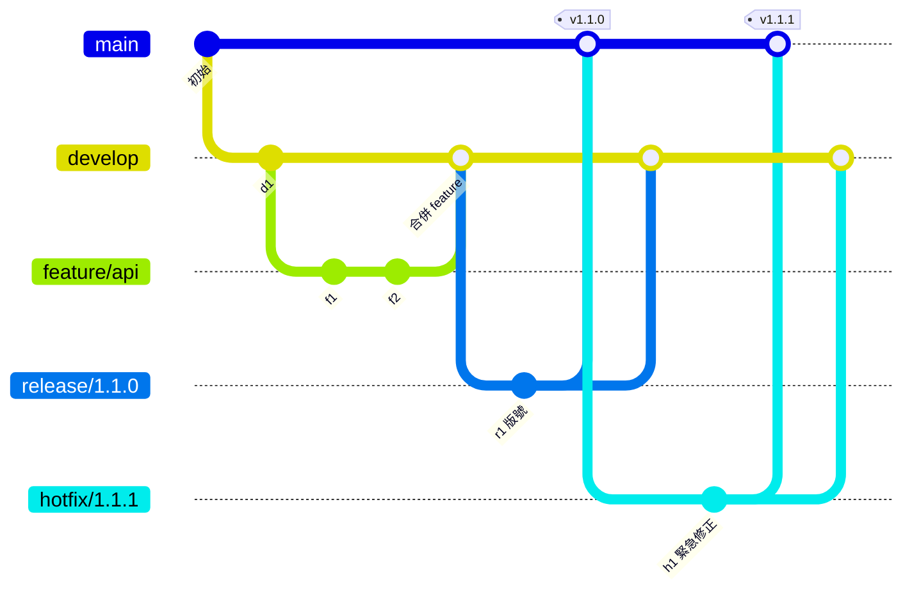

# Git flow 完整實戰

> [!abstract] 這篇你會學到
> - 掌握 **git-flow 的五種分支**與各自的規則
> - 用 **`git flow` 工具**與**純 Git 指令**兩種方式完成整個流程
> - 走完 **feature → release → hotfix** 的完整生命週期
> - 知道 **git-flow 的三個致命痛點**與對應的解法
> - 設計**適合機關環境的簡化版 git-flow**
> - 判斷**什麼時候該放棄 git-flow**

> [!warning] 先讀 [[09-Git-團隊規範與實戰情境]] 的策略比較
> **git-flow 不是「比較好」的策略，是「適合特定情境」的策略。**
> 如果你沒有「同時維護多個已發布版本」的需求，
> **GitHub Flow 通常是更好的選擇。**
>
> 本篇假設你已經確認 git-flow 適合你，或你必須接手一個用 git-flow 的專案。

## 前置知識

- [[09-Git-團隊規範與實戰情境]] — 三種策略的比較與選擇
- [[03-Git-分支與合併]] — merge、rebase、衝突
- [[06-Git-標籤與版本發布]] — 標籤與語意化版號

---

## 觀念說明

### 五種分支



| 分支 | 生命 | 從哪來 | 合併到哪 | 用途 |
| --- | --- | --- | --- | --- |
| **`main`** | **永久** | — | — | **正式環境，每個提交都是一個發布版本** |
| **`develop`** | **永久** | main | — | **開發主線，累積下一版的功能** |
| **`feature/*`** | 暫時 | **develop** | **develop** | 單一功能的開發 |
| **`release/*`** | 暫時 | **develop** | **main + develop** | **發布準備**：改版號、修 bug、寫文件 |
| **`hotfix/*`** | 暫時 | **main** | **main + develop** | **正式環境的緊急修正** |

> [!danger] 三條鐵律
> ```
> ① 【feature 一律從 develop 分出，合併回 develop】
>    ❌ 絕不從 main 分出 feature
>
> ② 【release 與 hotfix 一律合併到「main 與 develop 兩邊」】
>    ❌ 只合併到 main 會導致 develop 少了那些修正
>       → 下次發布時 bug 又回來了
>
> ③ 【main 上的每一個提交都必須有標籤】
>    → main 的歷史就是「發布歷史」
> ```
>
> **第 ② 條是最常出錯的地方。**

### 為什麼要有 `release` 分支

> [!tip] 它解決的問題是「發布準備期間，開發不能停」
> ```
> 沒有 release 分支：
>   develop 要發布了 → 【凍結 develop，不能合併新功能】
>     → 測試、修 bug、改文件（花三天）
>       → 【這三天所有人都不能合併新功能】
>
> 有 release 分支：
>   從 develop 切出 release/1.1.0
>     → 【release 分支上做發布準備】
>     → 【develop 繼續接受新功能的合併】
>       → 兩邊並行，沒有人被卡住
> ```
>
> **這也是判斷「你需不需要 git-flow」的關鍵**：
> **如果你的發布準備期只有幾小時，就不需要 release 分支。**

---

## 安裝與初始化 git-flow 工具

```bash
# ===== 安裝 =====
$ sudo apt install -y git-flow

# 或用 AVH 版本（維護較活躍，功能較多）
$ wget --no-check-certificate -q -O - \
    https://raw.githubusercontent.com/petervanderdoes/gitflow-avh/develop/contrib/gitflow-installer.sh \
    | sudo bash

$ git flow version
1.12.3 (AVH Edition)
```

> [!info]- Rocky / AlmaLinux（RHEL 系）對照
> ```bash
> $ sudo dnf install -y epel-release
> $ sudo dnf install -y gitflow
> ```

```bash
# ===== 初始化 =====
$ cd myproject
$ git flow init

Which branch should be used for bringing forth production releases?
   - main
Branch name for production releases: [main] main
Branch name for "next release" development: [develop] develop

How to name your supporting branch prefixes?
Feature branches? [feature/] feature/
Bugfix branches? [bugfix/] bugfix/
Release branches? [release/] release/
Hotfix branches? [hotfix/] hotfix/
Support branches? [support/] support/
Version tag prefix? [] v              ← ★ 建議填 v
Hooks and filters directory? [.git/hooks]

# ===== 非互動式初始化（用預設值）=====
$ git flow init -d

# ===== 檢視設定 =====
$ git config --get-regexp '^gitflow\.'
gitflow.branch.master main
gitflow.branch.develop develop
gitflow.prefix.feature feature/
gitflow.prefix.bugfix bugfix/
gitflow.prefix.release release/
gitflow.prefix.hotfix hotfix/
gitflow.prefix.versiontag v
```

> [!warning] `git flow init` 會建立 develop 分支
> **如果 repo 已經有人在用，記得先溝通**：
> ```bash
> $ git push -u origin develop      # 把 develop 推上去
> ```
> 並在平台上**把 develop 也設為受保護分支**。

---

## Feature 分支的完整流程

### 用 git flow 工具

```bash
# ========== 【1】開始一個功能 ==========
$ git flow feature start 1234-api反向代理
Switched to a new branch 'feature/1234-api反向代理'

Summary of actions:
- A new branch 'feature/1234-api反向代理' was created, based on 'develop'
- You are now on branch 'feature/1234-api反向代理'

# ========== 【2】開發 ==========
$ vim nginx/api.conf
$ git add -p
$ git commit -m "feat(nginx): 新增 api.example.gov.tw 的 server block"

# ========== 【3】推送以便協作／備份 ==========
$ git flow feature publish 1234-api反向代理
# 等同於 git push -u origin feature/1234-api反向代理

# ========== 【4】其他人取得這個 feature ==========
$ git flow feature pull origin 1234-api反向代理
# 或（AVH 版）
$ git flow feature track 1234-api反向代理

# ========== 【5】同步 develop 的最新變更 ==========
$ git flow feature rebase 1234-api反向代理
# 等同於：git fetch && git rebase develop

# ========== 【6】完成（合併回 develop 並刪除分支）==========
$ git flow feature finish 1234-api反向代理

Switched to branch 'develop'
Merge made by the 'ort' strategy.
Deleted branch feature/1234-api反向代理

Summary of actions:
- The feature branch 'feature/1234-api反向代理' was merged into 'develop'
- Feature branch 'feature/1234-api反向代理' has been locally deleted
- You are now on branch 'develop'

$ git push origin develop
```

### 對應的純 Git 指令

```bash
# 【1】start
$ git switch develop && git pull
$ git switch -c feature/1234-api反向代理

# 【3】publish
$ git push -u origin feature/1234-api反向代理

# 【5】rebase（同步 develop）
$ git fetch origin
$ git rebase origin/develop

# 【6】finish
$ git switch develop && git pull
$ git merge --no-ff feature/1234-api反向代理 \
    -m "Merge feature/1234-api反向代理 into develop"
$ git branch -d feature/1234-api反向代理
$ git push origin --delete feature/1234-api反向代理
$ git push origin develop
```

> [!danger] `git flow feature finish` 的兩個陷阱
> **陷阱一：它會直接合併，跳過 Code Review**
> ```
> 在有 PR 流程的團隊中，【不要用 finish】
> 改成：publish → 在平台上開 PR → 審查 → 平台上合併
> ```
>
> **陷阱二：它預設會刪除遠端分支**
> ```bash
> $ git flow feature finish -k 1234-api反向代理   # -k = 保留分支
> ```
>
> **實務建議**：
> ```
> 【有 PR 流程】→ 只用 start 與 publish，finish 交給平台
> 【沒有 PR 流程】→ 可以用 finish，但要自己確保有人看過
> ```

---

## Release 分支的完整流程

```bash
# ========== 【1】開始發布準備 ==========
$ git flow release start 1.1.0
Switched to a new branch 'release/1.1.0'

Summary of actions:
- A new branch 'release/1.1.0' was created, based on 'develop'
- Follow-up actions:
- Bump the version number now!
- Start committing last-minute fixes in preparing your release
- When done, run: git flow release finish '1.1.0'

# ========== 【2】更新版號 ==========
$ vim package.json          # "version": "1.1.0"
$ vim composer.json
$ vim VERSION
$ git commit -am "chore(release): 版號更新為 1.1.0"

# ========== 【3】產生 CHANGELOG ==========
$ LAST=$(git describe --tags --abbrev=0 main)
$ {
    echo "## v1.1.0 ($(date +%F))"
    echo ""
    echo "### 新增功能"
    git log "$LAST"..HEAD --pretty="- %s (%h)" --grep="^feat"
    echo ""
    echo "### 錯誤修正"
    git log "$LAST"..HEAD --pretty="- %s (%h)" --grep="^fix"
  } | cat - CHANGELOG.md > /tmp/cl && mv /tmp/cl CHANGELOG.md
$ git commit -am "docs(release): 更新 CHANGELOG"

# ========== 【4】推送供測試 ==========
$ git flow release publish 1.1.0
# 部署 release/1.1.0 到測試環境進行驗收

# ========== 【5】修正測試發現的問題 ==========
# ★ 只修 bug，【不加新功能】
$ vim src/fix.php
$ git commit -am "fix(api): 修正驗收發現的分頁錯誤"

# ========== 【6】完成發布 ==========
$ git flow release finish 1.1.0
# 會依序：
#   ① 合併 release/1.1.0 → main
#   ② 在 main 上建立標籤 v1.1.0
#   ③ 合併 release/1.1.0 → develop     ★ 關鍵
#   ④ 刪除 release/1.1.0
# 過程中會開三次編輯器（merge 訊息 ×2、tag 訊息 ×1）

# ★ 用參數避免互動
$ git flow release finish -m "Release v1.1.0" 1.1.0

# ========== 【7】推送 ==========
$ git push origin main
$ git push origin develop
$ git push origin --tags
```

### 對應的純 Git 指令

```bash
# 【1】start
$ git switch develop && git pull
$ git switch -c release/1.1.0

# 【6】finish —— ★ 三個步驟缺一不可
# ①合併到 main
$ git switch main && git pull
$ git merge --no-ff release/1.1.0 -m "Merge release/1.1.0 into main"

# ②打標籤
$ git tag -s v1.1.0 -m "Release v1.1.0

## 新增功能
- 新增 API 反向代理

## 錯誤修正
- 修正分頁錯誤

## 升級注意事項
- 需執行 php artisan migrate

## 回退方式
- 部署前一個標籤 v1.0.3"

# ③【★ 最容易漏掉】合併回 develop
$ git switch develop
$ git merge --no-ff release/1.1.0 -m "Merge release/1.1.0 into develop"

# ④刪除分支
$ git branch -d release/1.1.0
$ git push origin --delete release/1.1.0

# 【7】推送
$ git push origin main develop --follow-tags
```

> [!danger] 為什麼「合併回 develop」不能漏
> ```
> release 分支上做的事：
>   · 版號更新
>   · CHANGELOG
>   · 【驗收時發現的 bug 修正】  ← 關鍵
>
> 只合併到 main 沒合併到 develop：
>   → develop 上沒有那些 bug 修正
>     → 下次從 develop 切 release
>       → 【同樣的 bug 又出現了】
>         → 而且你會覺得「明明修過啊」
> ```
>
> **`git flow release finish` 會自動做這件事，這是使用工具的主要價值。**

---

## Hotfix 分支的完整流程

```bash
# ========== 【1】開始緊急修正（★ 從 main 分出）==========
$ git flow hotfix start 1.1.1
Switched to a new branch 'hotfix/1.1.1'

Summary of actions:
- A new branch 'hotfix/1.1.1' was created, based on 'main'    ★ 注意是 main
- Follow-up actions:
- Start committing your hot fixes
- Bump the version number now!
- When done, run: git flow hotfix finish '1.1.1'

# ★ 也可以指定從特定標籤分出
$ git flow hotfix start 1.1.1 v1.1.0

# ========== 【2】修正 ==========
$ vim nginx/nginx.conf
$ sudo nginx -t
$ git commit -am "fix(nginx): 調高 proxy_read_timeout 解決登入逾時

正式環境的登入請求因後端處理超過 60 秒被 Nginx 中斷。
proxy_read_timeout 由 60s 調整為 180s。

單號：#1567
影響：僅 /login 路由
回退：git revert 此提交後 nginx -s reload"

# ========== 【3】更新版號 ==========
$ vim VERSION       # 1.1.1
$ git commit -am "chore(release): 版號更新為 1.1.1"

# ========== 【4】完成 ==========
$ git flow hotfix finish -m "Hotfix v1.1.1：修正登入逾時" 1.1.1
# 會依序：
#   ① 合併 hotfix/1.1.1 → main
#   ② 在 main 上建立標籤 v1.1.1
#   ③ 合併 hotfix/1.1.1 → develop     ★ 關鍵
#   ④ 刪除 hotfix/1.1.1

$ git push origin main develop --follow-tags

# ========== 【5】部署 ==========
$ ssh web01 'sudo /usr/local/sbin/deploy-myproject.sh v1.1.1'
```

> [!warning] 如果 hotfix 期間正好有 release 分支存在
> **git-flow 的規則**：
> ```
> 有 release 分支存在時，hotfix finish 會合併到
>   ① main
>   ② 【release 分支】（而非 develop）
>
> 因為 release 之後會合併回 develop，所以修正最終還是會到 develop
> ```
>
> **但 AVH 版與原版行為略有差異** ——
> **請務必在 finish 之後驗證**：
> ```bash
> $ git log develop --oneline | grep 1567     # 修正有到 develop 嗎
> $ git log release/1.2.0 --oneline | grep 1567
> ```

---

## git-flow 的三個致命痛點

> [!danger] 痛點一：與 Pull Request 流程衝突
> ```
> git flow feature finish
>   → 【直接在本地合併並推送】
>     → 【完全跳過 Code Review】
>       → 也跳過 CI 檢查
> ```
>
> **解法**：
> ```
> ① 只用 start 與 publish，【finish 交給平台的 PR 合併】
> ② 或用 --showcommands 看它做了什麼，自己執行需要的部分
> ③ 或乾脆不用工具，用純 Git 指令（本篇都有列出）
>
> ★ 在平台上把 develop 也設為受保護分支，禁止直接推送
>   → 這樣就強制所有人走 PR
> ```

> [!danger] 痛點二：develop 與 main 分歧越來越大
> ```
> 症狀：
>   · release 合併時衝突爆炸
>   · 「明明修過的 bug 又出現」（漏了合併回 develop）
>   · 不確定某個修正到底在不在 develop 上
>
> 檢查：
>   $ git log main..develop --oneline | wc -l    # develop 領先幾個提交
>   $ git log develop..main --oneline            # ★ main 有但 develop 沒有的
>                                                 #   【這個結果應該是空的！】
> ```
>
> **解法**：
> ```bash
> # 每次 release/hotfix finish 之後【一定要驗證】
> $ git log develop..main --oneline
> # 有輸出 = 有東西漏了合併回 develop → 立刻補上
> $ git switch develop && git merge --no-ff main
> ```
>
> **做成腳本，納入發布檢查清單**（見下方）。

> [!danger] 痛點三：分支太多，新人搞不清楚
> ```
> 「我現在該從哪個分支切？」
> 「這個要合併到哪裡？」
> 「為什麼我的修正上不了正式環境？」
> ```
>
> **解法**：
> - **一張圖 + 一張決策表**貼在 wiki（見下方速查表）
> - **用工具而非手動**（工具至少不會漏掉合併目標）
> - **定期檢查分支健康度**（見下方腳本）

---

## 完整實戰範例

### 發布檢查腳本

```bash
$ sudo tee /usr/local/bin/gitflow-check > /dev/null <<'SCRIPT'
#!/usr/bin/env bash
# git-flow 健康檢查 —— 每次 release/hotfix 之後執行
set -uo pipefail
cd "${1:-.}"

MAIN=$(git config --get gitflow.branch.master || echo main)
DEV=$(git config --get gitflow.branch.develop || echo develop)

echo "═══════════════════════════════════════"
echo " git-flow 健康檢查  $(date '+%F %T')"
echo " repo: $(git rev-parse --show-toplevel)"
echo "═══════════════════════════════════════"

git fetch --all --tags --prune --quiet

# ---------- 【1】★ 最重要：main 有但 develop 沒有的提交 ----------
echo -e "\n【1】main 有但 develop 沒有的提交（應為空）"
MISSING=$(git log "origin/$DEV..origin/$MAIN" --oneline)
if [ -n "$MISSING" ]; then
  echo "  ❌❌ 有 $(echo "$MISSING" | wc -l) 個提交沒有合併回 $DEV："
  echo "$MISSING" | sed 's/^/     /'
  echo ""
  echo "  修正：git switch $DEV && git merge --no-ff origin/$MAIN && git push"
else
  echo "  ✓ 沒有遺漏"
fi

# ---------- 【2】develop 領先 main 多少 ----------
AHEAD=$(git rev-list --count "origin/$MAIN..origin/$DEV")
echo -e "\n【2】$DEV 領先 $MAIN：$AHEAD 個提交"
[ "$AHEAD" -gt 50 ] && echo "  ⚠ 累積太多未發布的變更，建議盡快發布"

# ---------- 【3】main 上的每個提交都有標籤嗎 ----------
echo -e "\n【3】$MAIN 上未打標籤的合併提交"
UNTAGGED=0
while read -r sha; do
  if ! git tag --points-at "$sha" | grep -q .; then
    echo "  ⚠ $(git log -1 --format='%h %s' "$sha")"
    UNTAGGED=$((UNTAGGED+1))
  fi
done < <(git rev-list --merges "origin/$MAIN" -20)
[ "$UNTAGGED" -eq 0 ] && echo "  ✓ 都有標籤"

# ---------- 【4】存活過久的 feature 分支 ----------
echo -e "\n【4】超過 14 天沒有更新的 feature 分支"
NOW=$(date +%s)
FOUND=0
while read -r ts branch; do
  days=$(( (NOW - ts) / 86400 ))
  if [ "$days" -gt 14 ]; then
    echo "  ⚠ $branch（$days 天前）"
    FOUND=$((FOUND+1))
  fi
done < <(git for-each-ref --format='%(committerdate:unix) %(refname:short)' \
           'refs/remotes/origin/feature/*')
[ "$FOUND" -eq 0 ] && echo "  ✓ 沒有停滯的 feature 分支"

# ---------- 【5】未完成的 release / hotfix ----------
echo -e "\n【5】進行中的 release / hotfix"
git branch -r --list 'origin/release/*' 'origin/hotfix/*' | sed 's/^/  /' \
  || echo "  （無）"

# ---------- 【6】feature 分支落後 develop 多少 ----------
echo -e "\n【6】feature 分支與 $DEV 的差距"
while read -r b; do
  behind=$(git rev-list --count "$b..origin/$DEV" 2>/dev/null || echo 0)
  [ "$behind" -gt 30 ] && echo "  ⚠ ${b#origin/} 落後 $behind 個提交，建議 rebase"
done < <(git branch -r --list 'origin/feature/*' --format='%(refname:short)')

echo -e "\n═══════════════════════════════════════"
SCRIPT
$ sudo chmod +x /usr/local/bin/gitflow-check
```

```bash
$ gitflow-check /srv/repos/myproject
═══════════════════════════════════════
 git-flow 健康檢查  2026-08-28 15:30:00
═══════════════════════════════════════

【1】main 有但 develop 沒有的提交（應為空）
  ❌❌ 有 2 個提交沒有合併回 develop：
     a1b2c3d fix(nginx): 調高 proxy_read_timeout
     d4e5f6g chore(release): 版號更新為 1.1.1

  修正：git switch develop && git merge --no-ff origin/main && git push

【2】develop 領先 main：12 個提交
【3】main 上未打標籤的合併提交
  ✓ 都有標籤
【4】超過 14 天沒有更新的 feature 分支
  ⚠ origin/feature/1200-舊功能（45 天前）
...
```

### 機關環境的簡化版 git-flow

> [!tip] 保留 git-flow 的優點，去掉最痛的部分
> **簡化的原則**：
> ```
> ✅ 保留：hotfix 從 main 分出（正式環境的緊急修正）
> ✅ 保留：release 分支（如果發布準備要好幾天）
> ❌ 去掉：develop 分支（改用 main + PR）
> ❌ 去掉：git flow finish（改用平台的 PR 合併）
> ```

```
【簡化版：main + release + hotfix】

main                    ← 開發主線 + 正式環境（受保護）
├─ feature/<單號>-<描述>  ← 從 main 分出，PR 回 main
├─ release/<版號>        ← 發布準備期，PR 回 main + 打標籤
└─ hotfix/<單號>-<描述>  ← 從【標籤】分出，PR 回 main

【部署依標籤】
  v1.1.0-rc.1  → 測試環境
  v1.1.0       → 正式環境
```

**流程**：
```bash
# ===== 一般功能 =====
$ git switch main && git pull
$ git switch -c feature/1234-新功能
$ ...開發...
$ git push -u origin feature/1234-新功能
$ gh pr create --base main --fill
# 審查 → 平台合併 → 刪除分支

# ===== 發布準備（需要好幾天時才用）=====
$ git switch -c release/1.1.0
$ ...改版號、CHANGELOG、修驗收 bug...
$ git push -u origin release/1.1.0
$ git tag -s v1.1.0-rc.1 -m "RC1" && git push --follow-tags
# 部署 rc 到測試環境驗收
$ gh pr create --base main --title "Release v1.1.0"
# 合併後：
$ git switch main && git pull
$ git tag -s v1.1.0 -m "Release v1.1.0 ..." && git push --follow-tags

# ===== 緊急修正 =====
$ git switch -c hotfix/1567-登入逾時 v1.1.0    # ★ 從標籤分出
$ ...修正...
$ git push -u origin hotfix/1567-登入逾時
$ gh pr create --base main --title "Hotfix: 修正登入逾時"
# 合併後：
$ git switch main && git pull
$ git tag -s v1.1.1 -m "Hotfix v1.1.1" && git push --follow-tags
$ ssh web01 'sudo /usr/local/sbin/deploy-myproject.sh v1.1.1'
```

> [!tip] 這個簡化版的好處
> ```
> ✓ 只有一個永久分支（main），【不會有 develop 分歧的問題】
> ✓ 所有變更都走 PR，【有 Code Review 與 CI】
> ✓ 保留 release 分支處理「發布準備期」
> ✓ hotfix 從標籤分出，【不會帶到未發布的功能】
> ✓ 部署依標籤，【明確知道正式環境跑哪一版】
> ✓ 新人只要記住「從 main 分出，PR 回 main」
> ```

### git-flow 對照速查卡

```
╔══════════════════════════════════════════════════════════════╗
║              git-flow 我該怎麼做？                            ║
╠══════════════════════════════════════════════════════════════╣
║ 我要做一個新功能                                              ║
║   → git flow feature start <名稱>     （從 develop）          ║
║   → 完成後合併回 develop                                      ║
║                                                               ║
║ 我要準備發布                                                  ║
║   → git flow release start <版號>     （從 develop）          ║
║   → 改版號、CHANGELOG、只修 bug 不加功能                       ║
║   → git flow release finish <版號>                            ║
║   → ★ 會合併到 main【和】develop，並打標籤                     ║
║                                                               ║
║ 正式環境出問題要緊急修                                        ║
║   → git flow hotfix start <版號>      【從 main】★            ║
║   → git flow hotfix finish <版號>                             ║
║   → ★ 會合併到 main【和】develop，並打標籤                     ║
║                                                               ║
║ 我不確定分支是不是乾淨的                                      ║
║   → git log develop..main --oneline                          ║
║      【這個結果應該是空的】                                    ║
╠══════════════════════════════════════════════════════════════╣
║ ★★ 三條鐵律 ★★                                              ║
║  ① feature 從 develop 來，回 develop 去                       ║
║  ② release/hotfix 一定要合併到【main 與 develop 兩邊】        ║
║  ③ main 上每個提交都要有標籤                                  ║
╚══════════════════════════════════════════════════════════════╝
```

---

## 常見錯誤與排錯

| 現象／錯誤 | 原因 | 解法 |
| --- | --- | --- |
| **修過的 bug 又出現** | **hotfix/release 沒合併回 develop** | `git log develop..main` 檢查；補合併；用 `gitflow-check` 例行檢查 |
| **feature finish 跳過了 Code Review** | 工具直接在本地合併 | **只用 start/publish**，finish 交給平台 PR；develop 設為受保護分支 |
| `git flow feature start` 從錯的分支切 | 當時不在 develop 上 | 工具會自動切到 develop；純指令要記得先 `git switch develop && git pull` |
| **hotfix 從 develop 分出** | 用錯指令或手動操作 | **hotfix 必須從 main（或標籤）分出**，否則會帶進未發布的功能 |
| release finish 時衝突爆炸 | develop 與 main 分歧太久 | 縮短發布週期；每次 finish 後驗證；定期把 main 合併回 develop |
| **finish 時開了三次編輯器很煩** | 三次合併／標籤訊息 | 用 `-m "訊息"` 參數；或設 `GIT_MERGE_AUTOEDIT=no` |
| 找不到 `git flow` 指令 | 沒安裝 | `sudo apt install git-flow`；或用純 Git 指令 |
| 別人 clone 後沒有 develop | develop 沒推上去 | `git push -u origin develop` |
| **不知道現在在哪個階段** | 分支太多 | `git branch -a`；`gitflow-check`；貼速查卡 |
| feature 分支活太久，衝突難解 | 沒有時限規範 | 限制 ≤ 1 週；定期 `git flow feature rebase` |
| **main 上有提交沒有標籤** | 手動合併沒打標籤 | `gitflow-check` 的第 3 項；規範「main 每個提交都要有標籤」 |
| 團隊覺得 git-flow 太複雜 | **策略與需求不符** | 考慮**簡化版**或改用 **GitHub Flow** |
| AVH 版與原版行為不同 | 兩個版本的實作有差異 | 統一團隊使用的版本；`finish` 後**務必驗證結果** |

---

## 安全性注意事項

> [!danger] develop 也必須是受保護分支
> **常見的疏忽**：
> ```
> main 設了分支保護 ✓
> develop 【沒有設】 ✗
>   → 任何人都能直接推 develop
>     → 【跳過 Code Review 的程式碼會累積在 develop】
>       → 下次 release 時「一起」進到 main
>         → 【等於繞過了 main 的保護】
> ```
>
> **必設**：
> ```
> main：    禁止直接推、禁止 force push、禁止刪除、要求 PR + 審查 + CI
> develop： 【同樣的規則】（審查者數量可以放寬）
> release/*、hotfix/*：禁止 force push
> v* 標籤： Tag protection，限指定人員
> ```

> [!warning] hotfix 分支的來源決定了安全性
> ```
> ❌ 從 develop 分出 hotfix
>    → 會帶進【所有未發布、未驗收的功能】
>      → 部署到正式環境 = 把未測試的程式碼推上去
>
> ✅ 從 main 或【正式環境目前的標籤】分出
>    → 只有那一個修正
>      → 影響範圍最小、風險最低
> ```
>
> ```bash
> # ★ 最保險：明確指定從正式環境目前的標籤分出
> $ git flow hotfix start 1.1.1 v1.1.0
> # 純指令：
> $ git switch -c hotfix/1567 v1.1.0
> ```

> [!tip] release 分支是最後的品質把關點
> **release 分支上應該完成的檢查**：
> ```
> □ 【機密掃描】（gitleaks detect --source .）
> □ 【相依套件弱點掃描】（trivy fs / composer audit / npm audit）
> □ 【設定檔語法驗證】（nginx -t、php -l）
> □ 【migration 的向下相容性檢視】
> □ 【回退方案已寫好並驗證過】
> □ 【CHANGELOG 中沒有洩漏弱點細節】
> □ 【版號已更新且一致】（package.json / composer.json / VERSION）
> □ 【測試環境的驗收紀錄】
> ```
>
> **一旦 release finish，程式碼就會進到 main 並打上標籤，
> 之後就是部署到正式環境了。**

> [!danger] 標籤是部署的觸發點
> 如果 CI 設定成「推送 `v*` 標籤就自動部署」，
> 那麼 **`git flow release finish` 會自動打標籤 →
> 推送後就自動部署了**。
>
> **這代表任何能執行 finish 的人，都能觸發正式環境部署。**
>
> **防護**：
> ```
> □ 【Tag protection】：只有指定人員能建立 v* 標籤
> □ 【簽章標籤】：部署腳本驗證 git tag -v
> □ 【部署需人工核准】：GitHub Environment 的 required reviewers
> □ 【release finish 不自動推送】：手動確認後才 push --follow-tags
> ```

---

## 速查表

### 五種分支

| 分支 | 從哪來 | 合併到 | 用途 |
| --- | --- | --- | --- |
| `main` | — | — | 正式環境，**每個提交都有標籤** |
| `develop` | main | — | 開發主線 |
| `feature/*` | **develop** | **develop** | 單一功能 |
| `release/*` | **develop** | **main + develop** | 發布準備 |
| `hotfix/*` | **main（或標籤）** | **main + develop** | 緊急修正 |

### 三條鐵律

```
① feature 從 develop 來，回 develop 去（絕不從 main 分出）
② release/hotfix 一定要合併到【main 與 develop 兩邊】★ 最常出錯
③ main 上每個提交都要有標籤
```

### git flow 指令

```bash
git flow init [-d]                        # 初始化

git flow feature start  <名稱>            # 從 develop 建立
git flow feature publish <名稱>           # 推送
git flow feature rebase  <名稱>           # 同步 develop
git flow feature finish [-k] <名稱>       # 合併回 develop（-k 保留分支）

git flow release start  <版號>            # 從 develop 建立
git flow release publish <版號>
git flow release finish -m "訊息" <版號>  # → main + tag + develop

git flow hotfix start  <版號> [起點標籤]  # ★ 從 main 建立
git flow hotfix finish -m "訊息" <版號>   # → main + tag + develop
```

### 純 Git 對照（release finish）

```bash
git switch main && git pull
git merge --no-ff release/1.1.0 -m "Merge release/1.1.0 into main"
git tag -s v1.1.0 -m "Release v1.1.0 ..."
git switch develop                                       # ★ 別漏
git merge --no-ff release/1.1.0 -m "Merge into develop"  # ★ 別漏
git branch -d release/1.1.0
git push origin main develop --follow-tags
```

### 健康檢查（最重要的一條）

```bash
git log develop..main --oneline
# 【這個結果應該是空的】
# 有輸出 = main 有東西沒合併回 develop → 立刻補
git switch develop && git merge --no-ff origin/main && git push
```

### 三個致命痛點與解法

```
① 與 PR 流程衝突    → 只用 start/publish，finish 交給平台
② develop 與 main 分歧 → 每次 finish 後執行 gitflow-check
③ 分支太多搞不清    → 貼速查卡；用工具而非手動
```

### 機關建議：簡化版

```
main                     開發主線 + 正式環境（受保護）
├─ feature/<單號>-<描述>  從 main → PR 回 main
├─ release/<版號>        發布準備期（需要時才用）
└─ hotfix/<單號>-<描述>  【從標籤分出】→ PR 回 main

部署依標籤：v1.1.0-rc.1 → 測試；v1.1.0 → 正式

好處：只有一個永久分支、全部走 PR、hotfix 不帶未發布功能
```

### 安全設定

```
□ 【develop 也要設分支保護】（否則等於繞過 main 的保護）
□ 【hotfix 從 main 或標籤分出】（不要從 develop）
□ release 分支做最後的安全檢查（機密掃描、弱點掃描、回退方案）
□ 【Tag protection】+ 簽章標籤 + 部署需人工核准
```

---

## 練習題

> [!question]- 練習 1：走完一次完整的 git-flow 循環
> 在測試 repo 上：
> 1. `git flow init -d`
> 2. 建立兩個 feature，各做幾個提交，分別 finish
> 3. `git flow release start 1.0.0`，改版號、寫 CHANGELOG
> 4. **在 release 分支上修一個 bug**
> 5. `git flow release finish -m "Release v1.0.0" 1.0.0`
> 6. **執行 `git log develop..main --oneline`** —— 是空的嗎？
> 7. `git log --graph --oneline --all` 看看歷史圖
> 8. **手動用純 Git 指令再做一次 release**，故意漏掉「合併回 develop」
> 9. 再執行第 6 步 —— **這次看到什麼？**

> [!question]- 練習 2：hotfix 的兩種做法比較
> 1. 在 develop 上做 3 個「未發布的新功能」提交
> 2. **做法 A（錯誤）**：`git switch -c hotfix-wrong develop`，修一個 bug
>    - `git log main..hotfix-wrong --oneline` —— **包含了幾個提交？**
>    - 如果部署這個分支，會把什麼推上正式環境？
> 3. **做法 B（正確）**：`git flow hotfix start 1.0.1`
>    - `git log main..hotfix/1.0.1 --oneline` —— **包含了幾個提交？**
> 4. **比較兩者的差異，說明為什麼 hotfix 必須從 main 分出**

> [!question]- 練習 3：為你的專案設計分支策略
> 1. 執行本篇的 `gitflow-check` 腳本（或手動檢查）在一個真實的 repo 上
> 2. 回答：
>    - **你需要 develop 分支嗎？**（有「發布準備要好幾天」的情況嗎？）
>    - **你需要 release 分支嗎？**
>    - hotfix 該從哪裡分出？
> 3. 依據答案，選擇：**完整 git-flow / 簡化版 / GitHub Flow**
> 4. **寫出你的分支決策表**（貼在 wiki 給團隊看）
> 5. 列出對應的**平台保護設定**
> 6. 思考：**如果團隊有人不遵守，你要怎麼強制？**（提示：三層機制）

---

## 小測驗

Q1. **git-flow 的五種分支各自從哪來、合併到哪、用途是什麼**？

Q2. **git-flow 的三條鐵律是什麼？哪一條最容易出錯，出錯的後果是什麼**？

Q3. **`release` 分支解決了什麼問題？什麼情況下你不需要它**？

Q4. **`git flow release finish` 自動做了哪四件事**？用純 Git 指令要怎麼做？

Q5. **`hotfix` 為什麼必須從 `main`（或標籤）分出，不能從 `develop`**？

Q6. **git-flow 的三個致命痛點是什麼？各自的解法**？

Q7. **檢查 git-flow 健康度「最重要的一條指令」是什麼？結果應該是什麼**？

Q8. **`git flow feature finish` 在有 PR 流程的團隊中為什麼有問題？該怎麼做**？

Q9. **為什麼 `develop` 也必須設為受保護分支**？不設會怎樣？

Q10. **機關環境的「簡化版 git-flow」拿掉了什麼、保留了什麼？有哪六個好處**？

> [!question]- 測驗答案
> **Q1.** **`main`**：永久，正式環境，每個提交都是一個發布版本且都有標籤；
> **`develop`**：永久，從 main 建立，開發主線，累積下一版的功能；
> **`feature/*`**：從 **develop** 分出、合併回 **develop**，單一功能的開發；
> **`release/*`**：從 **develop** 分出、合併到 **main 與 develop 兩邊**，
> 發布準備（改版號、CHANGELOG、修驗收發現的 bug）；
> **`hotfix/*`**：從 **main（或標籤）** 分出、合併到 **main 與 develop 兩邊**，
> 正式環境的緊急修正。
>
> **Q2.** ①**feature 一律從 develop 分出、合併回 develop**（絕不從 main 分出）；
> ②**release 與 hotfix 一律合併到「main 與 develop 兩邊」**；
> ③**main 上的每一個提交都必須有標籤**。
> **第 ② 條最容易出錯**。出錯的後果是：
> **develop 上少了那些修正 → 下次從 develop 切 release 發布時，
> 同樣的 bug 又出現了** ——
> 而且你會覺得「明明修過啊」，很難聯想到原因。
>
> **Q3.** 它解決的問題是「**發布準備期間，開發不能停**」。
> 沒有 release 分支時，要發布就得**凍結 develop**，
> 在測試、修 bug、改文件的那幾天裡，**所有人都不能合併新功能**。
> 有了 release 分支，發布準備在 release 上進行，**develop 可以繼續接受新功能**。
> **不需要它的情況：你的發布準備期只有幾小時** ——
> 那凍結幾小時的成本遠低於多維護一種分支的成本。
>
> **Q4.** 四件事：①**合併 release → main**；
> ②**在 main 上建立標籤**；
> ③**合併 release → develop**（★ 關鍵，最容易被手動遺漏）；
> ④**刪除 release 分支**。
> 純 Git 指令：
> ```bash
> git switch main && git pull
> git merge --no-ff release/1.1.0 -m "..."
> git tag -s v1.1.0 -m "..."
> git switch develop                          # ★ 別漏
> git merge --no-ff release/1.1.0 -m "..."    # ★ 別漏
> git branch -d release/1.1.0
> git push origin main develop --follow-tags
> ```
>
> **Q5.** 因為 **develop 上有「所有未發布、未驗收的功能」**。
> 如果從 develop 分出 hotfix，這個分支就會**帶進那些未測試的程式碼**，
> 部署到正式環境時**等於把未驗收的功能一起推上去** ——
> 這正是緊急修正時最不該發生的事（你想要的是「最小變更、最低風險」）。
> 從 **main 或正式環境目前的標籤**分出，**只有那一個修正**，
> 影響範圍最小。最保險的寫法是明確指定起點：
> `git flow hotfix start 1.1.1 v1.1.0`。
>
> **Q6.** ①**與 Pull Request 流程衝突**（`finish` 直接在本地合併並推送，
> 跳過 Code Review 與 CI）→ **只用 start/publish，finish 交給平台的 PR 合併**，
> 並把 develop 設為受保護分支強制走 PR；
> ②**develop 與 main 分歧越來越大**（漏了合併回 develop）→
> **每次 finish 後執行 `git log develop..main --oneline` 驗證**，做成腳本納入檢查清單；
> ③**分支太多，新人搞不清楚** → **一張圖 + 一張決策表**貼在 wiki、
> **用工具而非手動**（工具至少不會漏掉合併目標）、定期檢查分支健康度。
>
> **Q7.** **`git log develop..main --oneline`**。
> **結果應該是空的** ——
> 它列出的是「main 有但 develop 沒有的提交」，
> 而依照 git-flow 的規則，**main 上的每一個變更都應該也合併回了 develop**。
> **只要有輸出，就代表有東西漏了合併回 develop**，
> 必須立刻補上：`git switch develop && git merge --no-ff origin/main && git push`。
>
> **Q8.** 因為 `git flow feature finish` 會**直接在本地合併到 develop 並推送**，
> **完全跳過 Code Review 與 CI 檢查** ——
> 等於讓 PR 流程形同虛設。
> 做法：**只用 `start` 與 `publish`**（建立分支、推送），
> **`finish` 交給平台的 PR 合併**；
> 並且**在平台上把 develop 也設為受保護分支、禁止直接推送**，
> 這樣就從技術上強制所有人走 PR。
> （或乾脆不用工具，用純 Git 指令。）
>
> **Q9.** 因為 **develop 最終會透過 release 合併進 main**。
> 如果只保護 main 而不保護 develop：
> **任何人都能直接推 develop → 跳過 Code Review 的程式碼會累積在 develop →
> 下次 release 時「一起」進到 main → 等於繞過了 main 的保護**。
> 必設：main 與 develop 都要「禁止直接推、禁止 force push、
> 禁止刪除、要求 PR + 審查 + CI」（develop 的審查者數量可放寬），
> 另外 `release/*`、`hotfix/*` 禁止 force push，`v*` 標籤設 Tag protection。
>
> **Q10.** **拿掉**：`develop` 分支、`git flow finish`（改用平台 PR 合併）。
> **保留**：`hotfix` 從標籤分出、`release` 分支（發布準備要好幾天時才用）。
> 結構是 `main`（開發主線 + 正式環境）+ `feature/*` + `release/*` + `hotfix/*`，
> **部署依標籤**（`v1.1.0-rc.1` → 測試，`v1.1.0` → 正式）。
> **六個好處**：①只有一個永久分支，**不會有 develop 分歧的問題**；
> ②所有變更都走 PR，**有 Code Review 與 CI**；
> ③保留 release 分支處理發布準備期；
> ④**hotfix 從標籤分出，不會帶到未發布的功能**；
> ⑤**部署依標籤，明確知道正式環境跑哪一版**；
> ⑥**新人只要記住「從 main 分出，PR 回 main」**。

---

## 延伸閱讀

- [[09-Git-團隊規範與實戰情境]] — 三種策略的比較與團隊規範
- [[03-Git-分支與合併]] — merge、rebase、衝突處理
- [[06-Git-標籤與版本發布]] — 標籤與語意化版號
- [[08-Git-伺服器端與自動部署]] — 標籤觸發部署
- [[02-分支策略與git-flow]] — 從專案管理角度看分支策略
- [[03-發布流程與變更時窗]] — 發布的制度面
