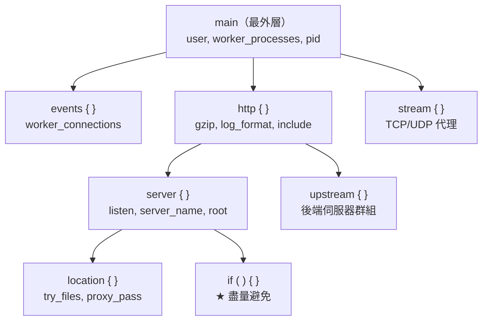
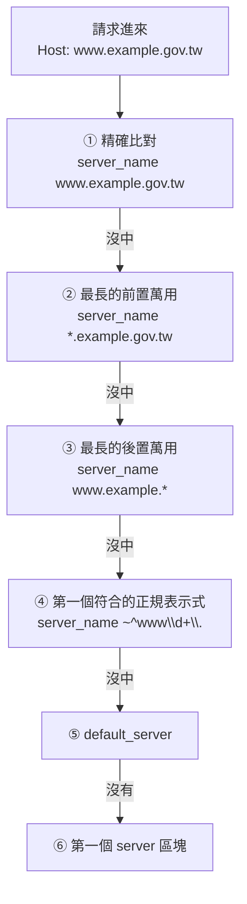

# Nginx 設定語法與虛擬主機

> [!abstract] 這篇你會學到
> - 掌握 Nginx 設定的**語法規則與四種區塊**
> - 理解**設定的繼承規則**（以及最容易踩的「陣列型指令」陷阱）
> - 掌握 **`listen` 與 `server_name` 的完整比對順序**
> - 知道**為什麼有時候連到了不是你以為的那個站台**
> - 用**變數**寫出更靈活的設定
> - 建立**可維護的多站台設定結構**

## 前置知識

- [[01-Nginx-安裝與目錄結構]] — 目錄結構與 `nginx -T`

---

## 語法規則

### 基本語法

```nginx
# 這是註解

# ① 簡單指令：以分號結尾
worker_processes auto;
server_tokens off;

# ② 區塊指令（context）：用大括號包住
http {
    server {
        listen 80;
        location / {
            root /var/www/html;
        }
    }
}

# ③ 值中含空白或特殊字元時要加引號
log_format main '$remote_addr - $remote_user [$time_local] "$request"';
add_header Content-Security-Policy "default-src 'self'";

# ④ 大小寫敏感（指令名稱都是小寫）
# ⑤ 縮排不影響語意，但請保持一致（建議 4 空格）
```

> [!danger] 三個最常見的語法錯誤
> ```nginx
> # ❌ 忘記分號
> server_tokens off
> # nginx: [emerg] directive "server_tokens" is not terminated by ";"
>
> # ❌ 大括號不配對
> server {
>     listen 80;
> # nginx: [emerg] unexpected end of file, expecting "}"
>
> # ❌ 值含分號但沒加引號
> add_header Set-Cookie a=1; path=/;
> # 會被當成兩個指令 → 語法錯誤或行為異常
> # ✅ add_header Set-Cookie "a=1; path=/";
> ```
>
> **一律用 `nginx -t` 驗證。**

### 四種主要區塊



| 區塊 | 用途 | 典型指令 |
| --- | --- | --- |
| **main** | 全域 | `user`、`worker_processes`、`pid`、`load_module` |
| **`events`** | 連線處理 | `worker_connections`、`use`、`multi_accept` |
| **`http`** | HTTP 相關的全域設定 | `gzip`、`log_format`、`include`、`upstream` |
| **`server`** | **一個虛擬主機** | `listen`、`server_name`、`root`、`ssl_*` |
| **`location`** | **一組 URI 的處理規則** | `try_files`、`proxy_pass`、`fastcgi_pass` |
| **`upstream`** | 後端伺服器群組 | `server`、`keepalive`、負載平衡演算法 |
| `stream` | TCP/UDP 代理（與 http 平行） | `server`、`proxy_pass` |
| `if` | 條件判斷 | **★ 盡量避免，見下方** |

> [!warning] `if` 在 Nginx 中是「邪惡的」
> 官方 wiki 有一篇著名的文章叫 **"If is Evil"**。
>
> **問題**：`if` 在 `location` 中的行為**不直觀且有陷阱**：
> ```nginx
> # ❌ 這樣寫可能不會如你預期
> location / {
>     if ($request_method = POST) {
>         add_header X-Test "post";      # 可能不生效
>     }
>     try_files $uri /index.php;         # if 內外的指令可能互相干擾
> }
> ```
>
> **`if` 中「安全」的只有兩個指令**：`return` 與 `rewrite ... last`。
>
> **替代方案**：
> ```nginx
> # 用 map 取代 if
> map $request_method $is_post { POST 1; default 0; }
>
> # 用 try_files 取代檔案存在判斷
> try_files $uri $uri/ /index.php?$query_string;
>
> # 用不同的 location 取代路徑判斷
> location /api/ { ... }
> location / { ... }
> ```

---

## 設定的繼承規則

> [!danger] 這是 Nginx 最容易踩坑的地方
> **大部分指令會從外層繼承到內層，但「陣列型指令」不會累加，而是「覆蓋」。**

### 規則一：一般指令 —— 內層覆蓋外層

```nginx
http {
    client_max_body_size 1m;        # 全域預設

    server {
        server_name a.example.com;
        # 繼承 1m

        location /upload {
            client_max_body_size 100m;    # ★ 只有這個 location 是 100m
        }
    }

    server {
        server_name b.example.com;
        client_max_body_size 50m;         # ★ 這個站台全部是 50m
    }
}
```

### 規則二：陣列型指令 —— **內層完全覆蓋，不會累加** ★★

```nginx
http {
    add_header X-Frame-Options "SAMEORIGIN";
    add_header X-Content-Type-Options "nosniff";

    server {
        add_header X-XSS-Protection "1; mode=block";
        # ★★★ 這裡【只有 X-XSS-Protection】
        #     上面兩個 add_header 【完全消失了】！

        location /api/ {
            add_header Access-Control-Allow-Origin "*";
            # ★★★ 這裡【只有 Access-Control-Allow-Origin】
            #     連 X-XSS-Protection 也沒了！
        }
    }
}
```

> [!danger] 這個陷阱造成的真實後果
> ```
> 你在 http 層設定了完整的安全標頭
>   → 某個 location 加了一個 add_header
>     → 【那個 location 的所有安全標頭全部消失】
>       → 掃描時才發現「明明設定了為什麼沒有」
> ```
>
> **受影響的常見指令**：
> ```
> add_header · proxy_set_header · fastcgi_param
> more_set_headers · set_real_ip_from · limit_req · limit_conn
> ```

### 三種解法

```nginx
# ═══ 解法一：用 include 把共用設定拉出來（★ 最推薦）═══
# /etc/nginx/snippets/security-headers.conf
add_header X-Frame-Options "SAMEORIGIN" always;
add_header X-Content-Type-Options "nosniff" always;
add_header Referrer-Policy "strict-origin-when-cross-origin" always;
add_header Permissions-Policy "geolocation=(), microphone=(), camera=()" always;

# 在每個需要的地方 include
server {
    include snippets/security-headers.conf;

    location /api/ {
        include snippets/security-headers.conf;      # ★ 這裡也要
        add_header Access-Control-Allow-Origin "*" always;
    }
}
```

```nginx
# ═══ 解法二：用 headers-more 模組（Nginx 沒有內建）═══
# more_set_headers 不受繼承覆蓋的限制
more_set_headers "X-Frame-Options: SAMEORIGIN";
```

```nginx
# ═══ 解法三：只在最內層設定（最簡單但重複多）═══
location / {
    add_header X-Frame-Options "SAMEORIGIN" always;
    add_header X-Content-Type-Options "nosniff" always;
    # ... 每個 location 都完整寫一次
}
```

> [!tip] `add_header` 的 `always` 參數
> ```nginx
> add_header X-Frame-Options "SAMEORIGIN";           # 只在 2xx/3xx 加
> add_header X-Frame-Options "SAMEORIGIN" always;    # ★ 所有回應都加（含 4xx/5xx）
> ```
> **安全標頭一律加 `always`** ——
> 否則 404、500 頁面就沒有防護標頭。

---

## `listen`：監聽哪裡

```nginx
listen 80;                          # 所有介面的 80 埠（IPv4）
listen [::]:80;                     # IPv6
listen [::]:80 ipv6only=off;        # ★ 同時處理 IPv4 與 IPv6（部分系統）
listen 127.0.0.1:8080;              # ★ 只監聽本機（後端服務常用）
listen 10.0.5.20:80;                # 指定 IP
listen unix:/var/run/nginx.sock;    # Unix socket

listen 443 ssl;                     # HTTPS
listen 443 ssl http2;               # HTTP/2（Nginx < 1.25 的寫法）
listen 443 ssl;                     # Nginx 1.25.1+ 改用 http2 指令
http2 on;                           # ★ 新版寫法

listen 443 quic reuseport;          # HTTP/3（需要編譯支援）
listen 80 default_server;           # ★ 未比對到 server_name 時用這個
listen 80 backlog=4096;             # 調整 accept 佇列
listen 80 deferred;                 # 有資料才喚醒（Linux）
```

> [!warning] `default_server` 每個「IP:埠」組合只能有一個
> ```nginx
> # ❌ 錯誤
> server { listen 80 default_server; server_name a.com; }
> server { listen 80 default_server; server_name b.com; }
> # nginx: [emerg] a duplicate default server for 0.0.0.0:80
> ```
>
> **沒有明確指定 `default_server` 時**，
> Nginx 會用**第一個載入的 server 區塊**當作預設 ——
> 這通常不是你想要的（見 [[01-Nginx-安裝與目錄結構]] 的「預設拒絕」）。

> [!tip] HTTP/2 的寫法在 Nginx 1.25.1 之後改了
> ```nginx
> # 舊版（1.25.1 之前）
> listen 443 ssl http2;
>
> # 新版（1.25.1+）★ 舊寫法會有 deprecation 警告
> listen 443 ssl;
> http2 on;
> ```
> **檢查你的版本**：`nginx -v`

---

## `server_name`：比對哪個網域

### 比對的完整順序



```nginx
# ① 精確比對（最優先）
server_name example.gov.tw www.example.gov.tw;

# ② 前置萬用字元（* 在開頭）
server_name *.example.gov.tw;
server_name .example.gov.tw;        # ★ 等同 example.gov.tw + *.example.gov.tw

# ③ 後置萬用字元（* 在結尾）
server_name www.example.*;

# ④ 正規表示式（~ 開頭）
server_name ~^www(?<num>\d+)\.example\.gov\.tw$;
# 可用具名捕獲：$num

# ⑤ 特殊值
server_name "";                     # 比對「沒有 Host 標頭」的請求
server_name _;                      # ★ 不是萬用字元！只是一個「不可能比對到」的名字
                                    #   要搭配 default_server 才有意義
```

> [!danger] `server_name _;` 常被誤解
> **它不是「萬用字元」。**
>
> `_` 只是一個**永遠不會被比對到的無效網域名稱**
> （因為底線不是合法的網域字元）。
>
> ```nginx
> # ❌ 這樣不會接住所有請求
> server {
>     listen 80;
>     server_name _;
> }
>
> # ✅ 要加 default_server 才會
> server {
>     listen 80 default_server;      # ← 【這個】才是關鍵
>     server_name _;                 # ← 只是慣例的寫法
> }
> ```

> [!tip] 為什麼「連到了不是我以為的那個站台」
> **排查順序**：
> ```bash
> # 【1】確認實際發送的 Host 標頭
> $ curl -v https://example.gov.tw/ 2>&1 | grep -i '^> host'
> > Host: example.gov.tw
>
> # 【2】列出所有 server_name
> $ sudo nginx -T 2>/dev/null | grep -E '^\s*server_name' | sort -u
>
> # 【3】檢查有沒有重複的 server_name
> $ sudo nginx -T 2>/dev/null | grep -E '^\s*server_name' | \
>     tr -s ' ' | sed 's/^\s*server_name //; s/;$//' | tr ' ' '\n' | \
>     sort | uniq -d
> # ★ 有輸出 = 有重複，Nginx 會用【第一個載入的】
>
> # 【4】確認載入順序（檔名的字母順序）
> $ ls -1 /etc/nginx/sites-enabled/ /etc/nginx/conf.d/
> ```
>
> **常見原因**：
> - **兩個設定檔用了同一個 `server_name`**（Nginx 會警告但仍啟動）
> - HTTPS 請求但只有 HTTP 的 server 區塊
> - **SNI 與 Host 不一致**
> - 沒有 `default_server`，第一個 server 接走了

```nginx
# ===== 重複的 server_name 會有警告 =====
# nginx: [warn] conflicting server name "example.gov.tw" on 0.0.0.0:80, ignored
```

---

## 變數

### 常用的內建變數

| 變數 | 內容 | 範例 |
| --- | --- | --- |
| **`$host`** | **Host 標頭（小寫，去掉埠）** | `example.gov.tw` |
| `$http_host` | 原始的 Host 標頭（含埠） | `example.gov.tw:8443` |
| `$server_name` | 比對到的 server_name | `example.gov.tw` |
| **`$remote_addr`** | **客戶端 IP** | `203.0.113.5` |
| `$remote_port` | 客戶端埠 | `54321` |
| **`$request_uri`** | **完整的原始 URI（含查詢字串）** | `/api/users?page=2` |
| **`$uri`** | **正規化後的 URI（不含查詢字串，會被 rewrite 改變）** | `/api/users` |
| `$args` / `$query_string` | 查詢字串 | `page=2` |
| `$arg_xxx` | 某個查詢參數 | `$arg_page` → `2` |
| **`$request_method`** | HTTP 方法 | `GET` |
| **`$scheme`** | http 或 https | `https` |
| `$document_root` | 設定中的 root | `/var/www/app/public` |
| **`$realpath_root`** | **解析符號連結後的實體路徑** | `/var/www/app/releases/xxx/public` |
| `$request_filename` | 對應的檔案路徑 | `/var/www/app/public/index.php` |
| **`$status`** | 回應狀態碼 | `200` |
| **`$request_time`** | 處理總時間 | `0.123` |
| **`$upstream_response_time`** | 後端回應時間 | `0.120` |
| `$upstream_addr` | 實際連到的後端 | `127.0.0.1:9000` |
| `$http_xxx` | 任意請求標頭 | `$http_user_agent` |
| `$sent_http_xxx` | 任意回應標頭 | `$sent_http_content_type` |
| `$cookie_xxx` | 某個 Cookie | `$cookie_session` |
| `$ssl_protocol` | TLS 版本 | `TLSv1.3` |
| `$ssl_cipher` | 加密套件 | `TLS_AES_256_GCM_SHA384` |

> [!danger] `$uri` 與 `$request_uri` 的差別很重要
> ```
> 請求：GET /api/users?page=2
>
> $request_uri  = /api/users?page=2      ★ 【原始的，不會變】
> $uri          = /api/users             ★ 【正規化的，會被 rewrite 改變】
> $args         = page=2
> ```
>
> **常見錯誤**：
> ```nginx
> # ❌ 重導向時用 $uri 會【遺失查詢字串】
> return 301 https://$host$uri;
>
> # ✅ 用 $request_uri
> return 301 https://$host$request_uri;
> ```

### 自訂變數

```nginx
# ===== set：簡單賦值 =====
set $my_var "hello";
set $backend "127.0.0.1:9000";

# ===== map：★ 依輸入決定輸出（比 if 好用太多）=====
http {
    # 依 User-Agent 判斷是否為爬蟲
    map $http_user_agent $is_bot {
        default            0;
        ~*bot              1;
        ~*crawler          1;
        ~*spider           1;
        ~*(googlebot|bingbot|slurp)  1;
    }

    # 依副檔名決定快取時間
    map $uri $cache_expires {
        default                    0;
        ~*\.(jpg|jpeg|png|gif|webp|svg|ico)$   30d;
        ~*\.(css|js|woff2?)$                   365d;
        ~*\.(pdf|zip)$                         7d;
    }

    # ★ WebSocket 升級（反向代理必備）
    map $http_upgrade $connection_upgrade {
        default upgrade;
        ''      close;
    }

    # 依來源決定是否記錄日誌（排除監控的健康檢查）
    map $remote_addr $skip_log {
        default        1;
        10.0.9.50      0;      # 監控主機
        127.0.0.1      0;
    }

    server {
        location / {
            if ($is_bot) { return 403; }        # ★ if 中用 return 是安全的
            expires $cache_expires;
            access_log /var/log/nginx/access.log main if=$skip_log;
        }
    }
}
```

> [!tip] `map` 是取代 `if` 的正確方式
> ```nginx
> # ❌ 用 if（有陷阱）
> location / {
>     if ($http_user_agent ~* bot) { return 403; }
>     if ($http_user_agent ~* crawler) { return 403; }
>     if ($http_user_agent ~* spider) { return 403; }
> }
>
> # ✅ 用 map（清楚、高效、無陷阱）
> map $http_user_agent $is_bot {
>     default 0;
>     ~*(bot|crawler|spider) 1;
> }
> location / {
>     if ($is_bot) { return 403; }
> }
> ```
>
> **`map` 的計算是「惰性的」** —— 只有真的用到那個變數時才計算，
> 所以定義很多 `map` 不會影響效能。

### `geo`：依 IP 決定變數

```nginx
http {
    geo $is_internal {
        default          0;
        10.0.0.0/8       1;
        172.16.0.0/12    1;
        192.168.0.0/16   1;
        127.0.0.1        1;
    }

    server {
        location /admin/ {
            if ($is_internal = 0) { return 403; }    # 只允許內網
            # ...
        }
    }
}
```

---

## 可維護的多站台結構

### 建議的目錄配置

```
/etc/nginx/
├── nginx.conf
├── conf.d/
│   ├── 00-default-deny.conf        ★ 預設拒絕（檔名 00- 確保最先）
│   ├── 10-maps.conf                ★ 所有 map 定義集中在這裡
│   ├── 20-upstreams.conf           ★ 所有 upstream 定義
│   └── 90-status.conf              監控端點
├── snippets/                       ★ 可重複使用的片段
│   ├── security-headers.conf
│   ├── ssl-params.conf
│   ├── php-fpm.conf
│   ├── deny-hidden.conf
│   ├── static-cache.conf
│   └── proxy-common.conf
├── sites-available/
│   ├── example.gov.tw
│   ├── api.example.gov.tw
│   └── admin.example.gov.tw
└── sites-enabled/
    └── ... (符號連結)
```

### 常用的 snippets

```nginx
# ═══════════ snippets/deny-hidden.conf ═══════════
# 拒絕隱藏檔與敏感路徑
location ~ /\.(?!well-known) {
    deny all;
    access_log off;
    log_not_found off;
    return 404;
}

location ~* \.(env|log|sql|sqlite|bak|swp|old|orig|save|conf|ini|yml|yaml)$ {
    deny all;
    return 404;
}

location ~* /(composer\.(json|lock)|package(-lock)?\.json|yarn\.lock|artisan|Dockerfile|docker-compose\.ya?ml)$ {
    deny all;
    return 404;
}
```

```nginx
# ═══════════ snippets/security-headers.conf ═══════════
add_header X-Frame-Options "SAMEORIGIN" always;
add_header X-Content-Type-Options "nosniff" always;
add_header Referrer-Policy "strict-origin-when-cross-origin" always;
add_header Permissions-Policy "geolocation=(), microphone=(), camera=(), payment=()" always;
add_header Cross-Origin-Opener-Policy "same-origin" always;
# HSTS 只在 HTTPS 且確認全站都支援後才加（見 06 篇）
# add_header Strict-Transport-Security "max-age=31536000; includeSubDomains" always;
```

```nginx
# ═══════════ snippets/static-cache.conf ═══════════
location ~* \.(?:css|js|mjs)$ {
    expires 1y;
    add_header Cache-Control "public, immutable";
    access_log off;
    include snippets/security-headers.conf;      # ★ 記得補回來
}

location ~* \.(?:jpg|jpeg|png|gif|webp|avif|svg|ico)$ {
    expires 30d;
    add_header Cache-Control "public";
    access_log off;
    include snippets/security-headers.conf;
}

location ~* \.(?:woff2?|ttf|otf|eot)$ {
    expires 1y;
    add_header Cache-Control "public, immutable";
    add_header Access-Control-Allow-Origin "*";
    access_log off;
}
```

```nginx
# ═══════════ snippets/proxy-common.conf ═══════════
proxy_http_version 1.1;
proxy_set_header Host              $host;
proxy_set_header X-Real-IP         $remote_addr;
proxy_set_header X-Forwarded-For   $proxy_add_x_forwarded_for;
proxy_set_header X-Forwarded-Proto $scheme;
proxy_set_header X-Forwarded-Host  $host;
proxy_set_header X-Forwarded-Port  $server_port;
proxy_set_header Upgrade           $http_upgrade;
proxy_set_header Connection        $connection_upgrade;

proxy_connect_timeout 10s;
proxy_send_timeout    60s;
proxy_read_timeout    60s;
proxy_buffering       on;
proxy_buffer_size     8k;
proxy_buffers         8 8k;

# 不要把後端的錯誤頁直接吐給使用者
proxy_intercept_errors off;
proxy_hide_header X-Powered-By;
proxy_hide_header Server;
```

### 完整的站台設定範例

```nginx
# /etc/nginx/sites-available/example.gov.tw
# ═══════════ HTTP → HTTPS 重導 ═══════════
server {
    listen 80;
    listen [::]:80;
    server_name example.gov.tw www.example.gov.tw;

    # ACME 挑戰（憑證申請與續期用）
    location ^~ /.well-known/acme-challenge/ {
        root /var/www/acme;
        default_type "text/plain";
        allow all;
    }

    location / {
        return 301 https://$host$request_uri;    # ★ 用 $request_uri
    }
}

# ═══════════ www 導向到主網域 ═══════════
server {
    listen 443 ssl;
    listen [::]:443 ssl;
    http2 on;
    server_name www.example.gov.tw;

    include snippets/ssl-params.conf;
    ssl_certificate     /etc/letsencrypt/live/example.gov.tw/fullchain.pem;
    ssl_certificate_key /etc/letsencrypt/live/example.gov.tw/privkey.pem;

    return 301 https://example.gov.tw$request_uri;
}

# ═══════════ 主站台 ═══════════
server {
    listen 443 ssl;
    listen [::]:443 ssl;
    http2 on;
    server_name example.gov.tw;

    # ── 憑證 ──
    include snippets/ssl-params.conf;
    ssl_certificate     /etc/letsencrypt/live/example.gov.tw/fullchain.pem;
    ssl_certificate_key /etc/letsencrypt/live/example.gov.tw/privkey.pem;

    # ── 網站根目錄（★ 指向 public 子目錄）──
    root  /var/www/example.gov.tw/current/public;
    index index.php index.html;

    # ── 日誌 ──
    access_log /var/log/nginx/example.gov.tw.access.log main;
    error_log  /var/log/nginx/example.gov.tw.error.log  warn;

    # ── 大小與逾時 ──
    client_max_body_size 20m;

    # ── 安全標頭 ──
    include snippets/security-headers.conf;

    # ── 拒絕敏感路徑 ──
    include snippets/deny-hidden.conf;

    # ── 靜態資源快取 ──
    include snippets/static-cache.conf;

    # ── 健康檢查 ──
    location = /health {
        access_log off;
        add_header Content-Type text/plain;
        return 200 "ok\n";
    }

    # ── 前端（Vue SPA / Laravel）──
    location / {
        try_files $uri $uri/ /index.php?$query_string;
    }

    # ── PHP ──
    location ~ \.php$ {
        include snippets/php-fpm.conf;
        include snippets/security-headers.conf;    # ★ 補回來
    }

    # ── 上傳目錄禁止執行 PHP（★ 極重要）──
    location ^~ /storage/ {
        location ~ \.php$ { deny all; return 404; }
    }
    location ^~ /uploads/ {
        location ~ \.php$ { deny all; return 404; }
    }
}
```

---

## 完整實戰範例

### 檢查設定的健康度

```bash
#!/usr/bin/env bash
# Nginx 設定健康檢查
echo "═══ Nginx 設定檢查 $(hostname) ═══"

echo -e "\n【1】語法"
sudo nginx -t 2>&1 | sed 's/^/  /'

echo -e "\n【2】重複的 server_name（★ 會導致連到錯的站台）"
DUP=$(sudo nginx -T 2>/dev/null | grep -E '^\s*server_name' | \
  sed 's/^\s*server_name //; s/;$//' | tr ' ' '\n' | grep -v '^$' | \
  sort | uniq -d)
[ -n "$DUP" ] && echo "$DUP" | sed 's/^/  ⚠ /' || echo "  ✓ 沒有重複"

echo -e "\n【3】default_server 設定"
sudo nginx -T 2>/dev/null | grep -E 'listen.*default_server' | sed 's/^/  /' \
  || echo "  ⚠ 沒有 default_server（未知網域會連到第一個站台）"

echo -e "\n【4】使用 \$uri 做重導（★ 會遺失查詢字串）"
sudo nginx -T 2>/dev/null | grep -E 'return\s+30[12].*\$uri' | sed 's/^/  ⚠ /' \
  || echo "  ✓ 沒有發現"

echo -e "\n【5】add_header 被覆蓋的風險"
echo "  各 location 中的 add_header 數量（差異大表示可能有覆蓋問題）："
sudo nginx -T 2>/dev/null | awk '
  /location/ {loc=$0; count=0}
  /add_header/ {count++}
  /^\s*}/ {if (loc != "" && count > 0) {print "    " count " 個: " loc; loc=""}}
' | head -20

echo -e "\n【6】web root 檢查"
sudo nginx -T 2>/dev/null | grep -E '^\s*root ' | sort -u | while read -r _ p; do
  p="${p%;}"
  if [[ "$p" == */public ]] || [[ "$p" == */dist ]] || [[ "$p" == */html ]]; then
    echo "  ✓ $p"
  else
    echo "  ⚠ $p （★ 確認是否應該指向 public/ 子目錄）"
  fi
done

echo -e "\n【7】安全設定"
for item in "server_tokens off" "autoindex off"; do
  sudo nginx -T 2>/dev/null | grep -q "$item" && echo "  ✓ $item" || echo "  ✗ $item"
done
sudo nginx -T 2>/dev/null | grep -qE 'location ~ /\\\.' \
  && echo "  ✓ 有拒絕隱藏檔" || echo "  ✗ 沒有拒絕隱藏檔"

echo -e "\n【8】從外部驗證（需要能連到自己）"
for host in $(sudo nginx -T 2>/dev/null | grep -E '^\s*server_name' | \
              sed 's/^\s*server_name //; s/;$//' | tr ' ' '\n' | \
              grep -vE '^(_|""|\*|$)' | sort -u | head -3); do
  for path in /.git/config /.env /composer.json; do
    code=$(curl -sk -o /dev/null -w '%{http_code}' -m 5 \
           -H "Host: $host" "https://127.0.0.1$path" 2>/dev/null || echo "---")
    [ "$code" = "200" ] && echo "  ⚠⚠ $host$path 回傳 200！"
  done
done
echo "  （檢查完成）"
```

### 用 `map` 集中管理

```nginx
# /etc/nginx/conf.d/10-maps.conf
# ★ 所有 map 集中在這裡，方便維護

# ── WebSocket 升級（反向代理必備）──
map $http_upgrade $connection_upgrade {
    default upgrade;
    ''      close;
}

# ── 是否為內部網段 ──
geo $is_internal {
    default        0;
    10.0.0.0/8     1;
    172.16.0.0/12  1;
    192.168.0.0/16 1;
    127.0.0.0/8    1;
}

# ── 靜態資源的快取時間 ──
map $uri $static_expires {
    default                                 off;
    ~*\.(?:css|js|mjs)$                     1y;
    ~*\.(?:jpg|jpeg|png|gif|webp|avif|svg)$ 30d;
    ~*\.(?:woff2?|ttf|otf)$                 1y;
    ~*\.(?:pdf|zip|doc|docx|xls|xlsx)$      7d;
}

# ── 排除健康檢查的日誌 ──
map $request_uri $loggable {
    default      1;
    ~^/health    0;
    ~^/ping      0;
    ~^/metrics   0;
}

# ── 惡意 User-Agent ──
map $http_user_agent $bad_ua {
    default                    0;
    ""                         1;      # 空的 UA
    ~*(nikto|sqlmap|nmap|masscan|zgrab)  1;
    ~*(libwww-perl|python-requests/0)    1;
}

# ── 限流的 key（內部網段不限流）──
map $is_internal $limit_key {
    0  $binary_remote_addr;
    1  "";                    # ★ 空值 = 不套用限流
}
```

---

## 常見錯誤與排錯

| 現象／錯誤 | 原因 | 解法 |
| --- | --- | --- |
| **安全標頭「消失」了** | **`add_header` 被內層覆蓋（不會累加）** | 用 `include snippets/` 在每一層補上；或用 headers-more 模組 |
| 404/500 頁面沒有安全標頭 | `add_header` 沒加 `always` | **所有安全標頭都加 `always`** |
| **重導向後查詢字串不見了** | 用了 `$uri` 而非 `$request_uri` | `return 301 https://$host$request_uri;` |
| **連到了不是我以為的那個站台** | server_name 重複 / 沒有 default_server | `nginx -T` 找重複；加 `default_server` |
| `a duplicate default server` | 同一個 IP:埠 有兩個 default_server | 每個 IP:埠 只能有一個 |
| `conflicting server name` 警告 | 兩個設定用了同一個 server_name | 找出並移除重複的 |
| **`server_name _;` 沒有接住所有請求** | `_` 不是萬用字元 | **要加 `default_server`** |
| `if` 的行為不符預期 | **Nginx 的 `if` 有陷阱** | 用 `map` / `try_files` / 不同的 location 取代 |
| HTTP/2 有 deprecation 警告 | Nginx 1.25.1+ 改了寫法 | `listen 443 ssl;` + `http2 on;` |
| **上傳目錄的 PHP 被執行了** | 沒有明確禁止 | `location ^~ /uploads/ { location ~ \.php$ { deny all; } }` |
| 設定太亂難以維護 | 沒有結構 | 用 `snippets/` + `conf.d/` 分層；map 集中管理 |
| `$host` 與 `$http_host` 搞混 | 兩者不同 | `$host` 去掉埠且小寫；`$http_host` 是原始值 |
| 反向代理後 WebSocket 斷線 | 沒有處理 Upgrade | `map $http_upgrade $connection_upgrade` + `proxy_set_header` |

---

## 安全性注意事項

> [!danger] `add_header` 繼承陷阱造成的安全風險
> **這是實務上最常見、也最容易被忽略的安全問題。**
>
> ```
> 你在 http 或 server 層設定了完整的安全標頭
>   → 某個 location 為了加 CORS 而寫了一個 add_header
>     → 【那個 location 的所有安全標頭全部消失】
>       → 而你完全不會發現，因為主頁面是正常的
> ```
>
> **檢查方式**：
> ```bash
> # 對每一個 location 的代表性路徑檢查標頭
> $ for p in / /api/users /admin /static/app.css; do
>     echo "── $p"
>     curl -sI "https://example.gov.tw$p" | grep -iE 'x-frame|x-content|referrer|permissions'
>   done
> ```
> **每一個路徑都應該有完整的安全標頭。**

> [!warning] `root` 的位置決定了會不會洩漏檔案
> ```nginx
> # ❌ 危險
> root /var/www/myproject;
> #    → https://網站/.env             拿得到
> #    → https://網站/composer.json    拿得到
> #    → https://網站/storage/logs/laravel.log  拿得到
> #    → https://網站/vendor/...       拿得到
>
> # ✅ 正確
> root /var/www/myproject/public;
> #    → .env、vendor/、storage/ 都在 web root 之外，碰不到
> ```
>
> **Laravel、Symfony、Nuxt 都是這個結構。**
> **即使有 `deny` 規則，也應該從根本上讓檔案不在 web root 內。**

> [!danger] 上傳目錄必須禁止執行 PHP
> ```
> 攻擊流程：
>   找到檔案上傳功能 → 上傳 shell.php（或 shell.php.jpg 繞過檢查）
>     → 存取 https://網站/uploads/shell.php
>       → 【取得 web shell，可執行任意指令】
> ```
>
> ```nginx
> # ✅ 明確禁止（★ 用 ^~ 確保優先）
> location ^~ /uploads/ {
>     location ~ \.(php|phtml|php\d?)$ {
>         deny all;
>         return 404;
>     }
> }
> location ^~ /storage/ {
>     location ~ \.(php|phtml|php\d?)$ { deny all; return 404; }
> }
> ```
>
> **更根本的做法**：
> - **上傳的檔案不要放在 web root 內**，透過程式讀取後輸出
> - 或放在**獨立的網域／子網域**（沒有 PHP 處理器）
> - 上傳時**重新命名並驗證檔案類型**

> [!tip] 用 `geo` 限制管理介面的來源
> ```nginx
> geo $is_internal {
>     default 0;
>     10.0.9.0/24  1;        # 只有管理網段
> }
>
> server {
>     location ^~ /admin/ {
>         if ($is_internal = 0) { return 404; }    # ★ 回 404 而非 403
>         # ...
>     }
> }
> ```
>
> **回 404 而非 403 的理由**：
> 403 等於告訴攻擊者「這裡有東西，只是你沒權限」；
> **404 讓他以為根本不存在。**

---

## 速查表

### 四種區塊

```
main     user, worker_processes, pid, load_module
events   worker_connections, use, multi_accept
http     gzip, log_format, include, map, geo, upstream
  server   listen, server_name, root, ssl_*
    location try_files, proxy_pass, fastcgi_pass
stream   TCP/UDP 代理（與 http 平行）
```

### 繼承規則（★ 最重要）

```
一般指令   → 內層【覆蓋】外層（正常）
陣列型指令 → 內層【完全覆蓋】，【不會累加】★★

受影響：add_header · proxy_set_header · fastcgi_param
        set_real_ip_from · limit_req · limit_conn

解法：① include snippets/（在每一層補上）★ 推薦
      ② headers-more 模組
      ③ 只在最內層設定
```

### `add_header` 必加 `always`

```nginx
add_header X-Frame-Options "SAMEORIGIN" always;   # ★ 4xx/5xx 也會加
```

### listen

```nginx
listen 80;                    listen [::]:80;
listen 127.0.0.1:8080;        # 只監聽本機
listen 443 ssl;  http2 on;    # ★ Nginx 1.25.1+ 的寫法
listen 80 default_server;     # ★ 每個 IP:埠 只能有一個
```

### server_name 比對順序

```
① 精確比對         example.gov.tw
② 最長前置萬用     *.example.gov.tw   （.example.gov.tw 是簡寫）
③ 最長後置萬用     www.example.*
④ 第一個符合的正規表示式  ~^www\d+\.
⑤ default_server
⑥ 第一個 server 區塊

★ server_name _; 【不是萬用字元】，要配 default_server 才有效
```

### 關鍵變數

| 變數 | 內容 |
| --- | --- |
| **`$request_uri`** | **原始 URI 含查詢字串**（重導向用這個） |
| `$uri` | 正規化 URI，**會被 rewrite 改變** |
| `$host` | Host 標頭（小寫、去埠） |
| `$remote_addr` | 客戶端 IP |
| **`$realpath_root`** | **解析符號連結後的實體路徑**（零停機部署必用） |
| `$request_time` / `$upstream_response_time` | 效能排錯 |

```nginx
# ❌ return 301 https://$host$uri;          遺失查詢字串
# ✅ return 301 https://$host$request_uri;
```

### `map` 取代 `if`

```nginx
map $http_upgrade $connection_upgrade {     # WebSocket 必備
    default upgrade;
    ''      close;
}
map $http_user_agent $bad_ua {
    default 0;
    ~*(nikto|sqlmap|nmap) 1;
}
geo $is_internal { default 0; 10.0.0.0/8 1; }

★ if 中只有 return 與 rewrite...last 是安全的
★ map 是惰性計算，定義很多不影響效能
```

### 建議的檔案結構

```
conf.d/00-default-deny.conf    預設拒絕（00- 確保最先載入）
conf.d/10-maps.conf            所有 map/geo 集中
conf.d/20-upstreams.conf       所有 upstream
snippets/security-headers.conf
snippets/ssl-params.conf
snippets/php-fpm.conf
snippets/deny-hidden.conf
snippets/static-cache.conf
snippets/proxy-common.conf
sites-available/ + sites-enabled/
```

### 安全三要

```nginx
① root /var/www/app/public;                    # ★ 指向 public 子目錄
② include snippets/deny-hidden.conf;           # 拒絕 .git/.env
③ location ^~ /uploads/ {                      # ★ 上傳目錄禁止 PHP
      location ~ \.php$ { deny all; return 404; }
  }
```

### 排查「連到錯的站台」

```bash
curl -v https://網站/ 2>&1 | grep -i '^> host'        # 實際的 Host
nginx -T | grep -E '^\s*server_name' | sort -u        # 所有 server_name
nginx -T | grep -E '^\s*server_name' | sed 's/.*server_name //; s/;//' \
  | tr ' ' '\n' | sort | uniq -d                      # ★ 找重複
ls -1 /etc/nginx/sites-enabled/                        # 載入順序
```

---

## 練習題

> [!question]- 練習 1：驗證 `add_header` 的繼承陷阱
> 1. 在 `http` 層加 `add_header X-Test-A "1" always;`
> 2. 在某個 `server` 加 `add_header X-Test-B "2" always;`
> 3. 在該 server 的某個 `location` 加 `add_header X-Test-C "3" always;`
> 4. **分別對三個層級的路徑 `curl -I`，看到幾個標頭？**
> 5. **加上 `include` 的解法再測一次**
> 6. 檢查你的正式站台：`curl -sI https://網站/api/xxx | grep -i x-frame`
>    —— **API 路徑有安全標頭嗎？**

> [!question]- 練習 2：server_name 比對實驗
> 建立四個 server 區塊：
> ```
> A: server_name test.example.com;          （精確）
> B: server_name *.example.com;             （前置萬用）
> C: server_name ~^test\d+\.example\.com$;  （正規表示式）
> D: listen 80 default_server; server_name _;
> ```
> 然後用 `curl -H "Host: xxx"` 測試，**預測並驗證**會連到哪一個：
> 1. `test.example.com`
> 2. `abc.example.com`
> 3. `test123.example.com`
> 4. `other.com`
> 5. 不帶 Host 標頭

> [!question]- 練習 3：建立可維護的設定結構
> 重構一個現有的站台設定：
> 1. 建立 `snippets/security-headers.conf`、`deny-hidden.conf`、`static-cache.conf`
> 2. 建立 `conf.d/10-maps.conf` 放所有 map
> 3. 把站台設定改成用 `include`
> 4. **`nginx -T` 比對重構前後的完整設定是否一致**
> 5. 執行本篇的健康檢查腳本
> 6. **從外部驗證 `.git`、`.env` 拿不到**

---

## 小測驗

Q1. Nginx 的四種主要區塊是什麼？各自放什麼設定？

Q2. **「陣列型指令」的繼承規則有什麼陷阱？哪些指令受影響？有哪三種解法**？

Q3. **`add_header` 的 `always` 參數做什麼？為什麼安全標頭一定要加**？

Q4. **`$uri` 與 `$request_uri` 的差別是什麼？重導向該用哪個，為什麼**？

Q5. **`server_name` 的比對順序是什麼**？

Q6. **`server_name _;` 是萬用字元嗎？要怎麼才能接住所有請求**？

Q7. **為什麼說 Nginx 的 `if` 是「邪惡的」？`if` 中哪兩個指令是安全的？替代方案是什麼**？

Q8. **`map` 相對於 `if` 的三個優勢是什麼**？

Q9. **`root` 指向專案根目錄與指向 `public/` 子目錄，有什麼安全差異**？

Q10. **上傳目錄為什麼必須禁止執行 PHP？除了 Nginx 規則，還有哪兩種更根本的做法**？

> [!question]- 測驗答案
> **Q1.** **main（最外層）**：`user`、`worker_processes`、`pid`、`load_module`；
> **`events`**：`worker_connections`、`use`、`multi_accept`；
> **`http`**：`gzip`、`log_format`、`include`、`map`、`geo`、`upstream`
> （HTTP 相關的全域設定）；
> **`server`**（在 http 內）：`listen`、`server_name`、`root`、`ssl_*`（一個虛擬主機）；
> **`location`**（在 server 內）：`try_files`、`proxy_pass`、`fastcgi_pass`。
> 另有與 `http` 平行的 `stream`（TCP/UDP 代理）。
>
> **Q2.** 陷阱是：**內層的設定會「完全覆蓋」外層，而不是累加** ——
> 例如 `http` 層設了三個 `add_header`，
> 某個 `location` 只加了一個 `add_header`，
> **那個 location 就「只有」那一個標頭，上面三個全部消失**。
> **受影響的指令**：`add_header`、`proxy_set_header`、`fastcgi_param`、
> `more_set_headers`、`set_real_ip_from`、`limit_req`、`limit_conn`。
> **三種解法**：①**把共用設定寫成 `snippets/`，在每一層 `include`**（推薦）；
> ②用 **headers-more 模組**的 `more_set_headers`（不受此限制）；
> ③只在最內層設定（簡單但重複多）。
>
> **Q3.** `always` 讓該標頭**在「所有」回應中都加上，包含 4xx 與 5xx**；
> 不加 `always` 的話**只會在 2xx 與 3xx 的回應中加**。
> 安全標頭一定要加，是因為**404 與 500 頁面同樣會被瀏覽器渲染**，
> 如果它們沒有 `X-Frame-Options`、`X-Content-Type-Options` 等防護標頭，
> 就可能被用於點擊劫持或 MIME 類型混淆攻擊 ——
> 而攻擊者往往就是刻意去觸發錯誤頁面。
>
> **Q4.** 對於請求 `GET /api/users?page=2`：
> **`$request_uri` = `/api/users?page=2`**（**原始的、含查詢字串、不會被改變**）；
> **`$uri` = `/api/users`**（**正規化後、不含查詢字串、會被 `rewrite` 改變**）。
> **重導向該用 `$request_uri`**，因為用 `$uri` 會**遺失查詢字串** ——
> `return 301 https://$host$uri;` 會把 `?page=2` 丟掉，
> 正確寫法是 `return 301 https://$host$request_uri;`。
>
> **Q5.** ①**精確比對**（`example.gov.tw`）→
> ②**最長的前置萬用字元**（`*.example.gov.tw`）→
> ③**最長的後置萬用字元**（`www.example.*`）→
> ④**第一個符合的正規表示式**（`~^www\d+\.`）→
> ⑤**`default_server`** → ⑥**第一個 server 區塊**。
> 注意 `.example.gov.tw` 是 `example.gov.tw` + `*.example.gov.tw` 的簡寫。
>
> **Q6.** **不是**。`_` 只是一個**永遠不會被比對到的無效網域名稱**
> （底線不是合法的網域字元），純粹是慣例的寫法。
> **要接住所有請求，關鍵是 `listen` 加上 `default_server`**：
> ```nginx
> server {
>     listen 80 default_server;      # ← 這個才是關鍵
>     server_name _;                 # ← 只是慣例
>     return 444;
> }
> ```
>
> **Q7.** 因為 **`if` 在 `location` 中的行為不直觀且有陷阱** ——
> `if` 內外的指令可能互相干擾，某些指令在 `if` 中不會如預期生效
> （官方 wiki 有一篇著名的 "If is Evil"）。
> **`if` 中安全的只有兩個指令：`return` 與 `rewrite ... last`**。
> **替代方案**：用 **`map`** 取代條件判斷、
> 用 **`try_files`** 取代檔案存在判斷、
> 用**不同的 `location` 區塊**取代路徑判斷。
>
> **Q8.** ①**清楚**：所有對應關係集中在一處，一眼看完，
> 而多個 `if` 會散落在各個 location；
> ②**高效且無陷阱**：`map` 沒有 `if` 的行為問題；
> ③**惰性計算**：`map` 只有在真的用到那個變數時才計算，
> **所以定義很多 `map` 不會影響效能**，
> 而多個 `if` 是每個請求都要逐一判斷。
>
> **Q9.** **`root /var/www/myproject;`（專案根目錄）**：
> `.env`、`composer.json`、`storage/logs/laravel.log`、`vendor/`
> **全部都在 web root 內，都可以被下載** ——
> 等於資料庫密碼、原始碼結構、日誌內容全部外洩。
> **`root /var/www/myproject/public;`（public 子目錄）**：
> 那些檔案**在 web root 之外，Nginx 根本碰不到**。
> Laravel、Symfony、Nuxt 都是這個結構。
> 即使有 `deny` 規則，也應該**從根本上讓檔案不在 web root 內**
> （深度防禦：規則可能寫錯，但目錄結構不會）。
>
> **Q10.** 因為攻擊流程是：**找到檔案上傳功能 → 上傳 `shell.php`
> （或 `shell.php.jpg` 繞過檢查）→ 存取 `https://網站/uploads/shell.php`
> → 取得 web shell，可執行任意指令**。
> Nginx 規則：
> ```nginx
> location ^~ /uploads/ {
>     location ~ \.(php|phtml|php\d?)$ { deny all; return 404; }
> }
> ```
> **兩種更根本的做法**：
> ①**上傳的檔案不要放在 web root 內**，改由程式讀取後輸出
> （這樣還能順便做權限檢查）；
> ②**放在獨立的網域／子網域**（該網域沒有設定 PHP 處理器）。
> 另外上傳時應**重新命名並驗證檔案類型**（不信任副檔名與 MIME）。

---

## 延伸閱讀

- [[03-Nginx-location與rewrite]] — 下一步：location 的比對規則
- [[04-Nginx-反向代理與負載平衡]] — proxy_pass 與 upstream
- [[06-Nginx-HTTPS與Certbot]] — TLS 設定
- [[09-Nginx-安全設定]] — 完整的安全加固
- [[01-Nginx-安裝與目錄結構]] — 目錄結構與 `nginx -T`
- [[02-應用層安全]] — 安全標頭的完整說明
