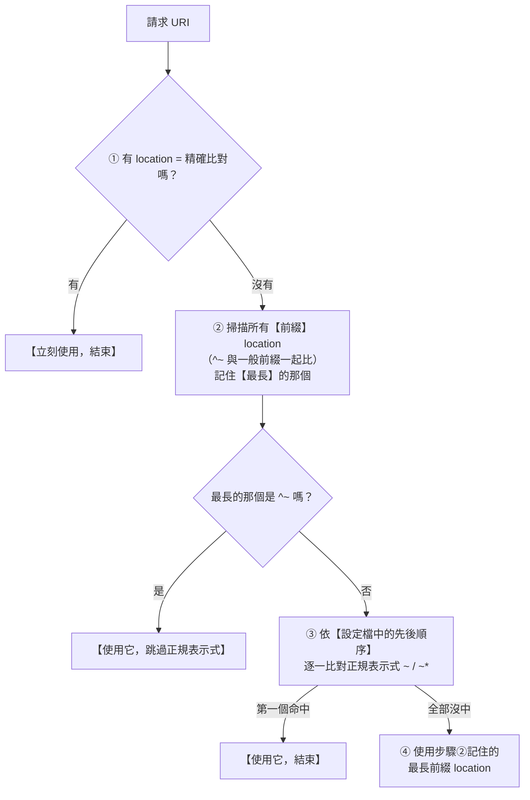
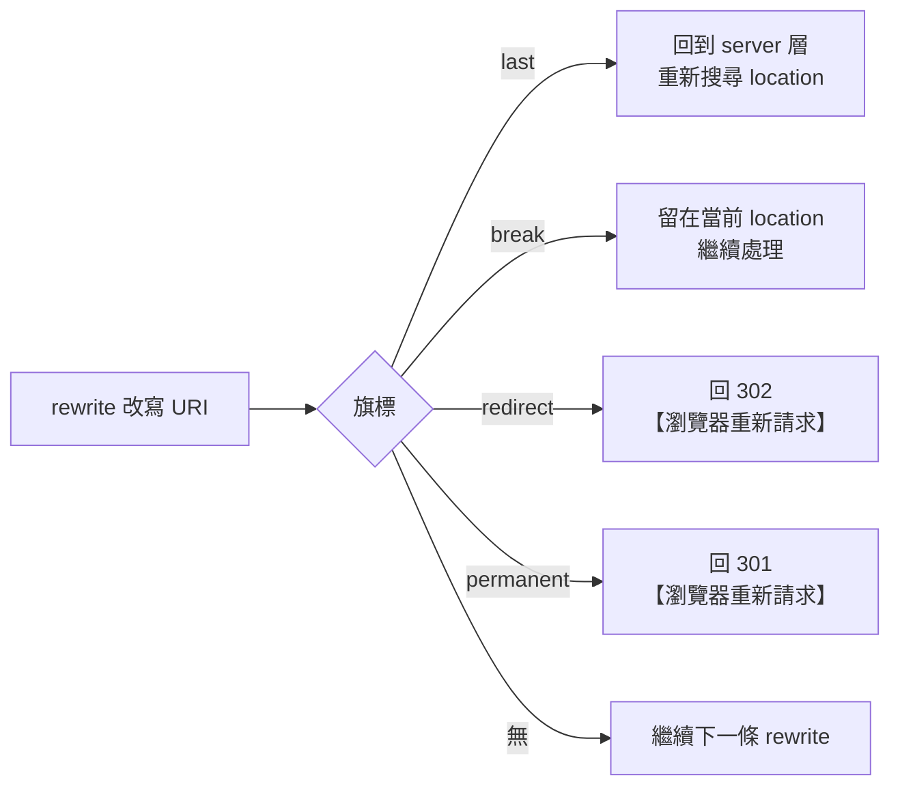

# Nginx location 與 rewrite

> [!abstract] 這篇你會學到
> - 記住 **location 的六種修飾符與完整比對順序**
> - 分清楚 **`root` 與 `alias`** 的差別（以及 `alias` 的路徑穿越風險）
> - 用 **`try_files`** 寫出 Vue SPA、Nuxt、Laravel 的正確路由
> - 知道什麼時候該用 **`return`**、什麼時候才需要 **`rewrite`**
> - 理解 `last` / `break` / `redirect` / `permanent` 四個旗標
> - 用 **`error_page`** 與內部 location 做出漂亮的錯誤處理

## 前置知識

- [[02-Nginx-設定語法與虛擬主機]] — 設定語法、變數、繼承規則

---

## location 的六種修飾符

```nginx
location = /exact          { }   # ① 精確比對
location ^~ /prefix/       { }   # ② 前綴比對（命中後【停止】比對正規表示式）
location ~  \.php$         { }   # ③ 正規表示式（大小寫敏感）
location ~* \.(jpg|png)$   { }   # ④ 正規表示式（大小寫【不】敏感）
location /prefix/          { }   # ⑤ 一般前綴比對
location /                 { }   # ⑥ 萬用（也是一般前綴，但最短所以最後）
location @fallback         { }   # ⑦ 具名 location（只能內部跳轉，不參與比對）
```

### 完整比對順序 ★★★



**背下這五句**：

```
① location =  精確比對 → 命中就結束（最快）
② 前綴比對取【最長】的（不是最先的）
③ 若最長前綴帶 ^~ → 直接用它，【不再看正規表示式】
④ 正規表示式依【設定檔順序】比，【第一個】命中就用
⑤ 正規表示式全沒中 → 回頭用步驟②的最長前綴
```

> [!danger] 兩個關鍵差異
> ```
> 【前綴 location】比的是「誰最長」，與寫的順序無關
> 【正規 location】比的是「誰最先」，順序【非常重要】
> ```

### 實際演練

```nginx
server {
    location  /            { return 200 "A: /\n"; }
    location  /images/     { return 200 "B: /images/\n"; }
    location ^~ /static/   { return 200 "C: ^~ /static/\n"; }
    location ~ \.jpg$      { return 200 "D: ~ .jpg\n"; }
    location ~* \.(gif|png)$ { return 200 "E: ~* gif|png\n"; }
    location = /           { return 200 "F: = /\n"; }
    location = /logo.png   { return 200 "G: = /logo.png\n"; }
}
```

| 請求 | 命中 | 原因 |
| --- | --- | --- |
| `/` | **F** | 精確比對優先於一切 |
| `/logo.png` | **G** | 精確比對 |
| `/images/a.jpg` | **D** | 最長前綴是 B，但不是 `^~`，所以繼續比正規；`~ \.jpg$` 命中 |
| `/images/a.gif` | **E** | 同上，`~ \.jpg$` 不中，`~* \.(gif|png)$` 命中 |
| `/images/a.txt` | **B** | 正規全不中 → 回頭用最長前綴 `/images/` |
| **`/static/a.jpg`** | **C** | **最長前綴是 `^~ /static/` → 直接用，不看正規** |
| `/static/a.gif` | **C** | 同上 |
| `/about` | **A** | 只有 `/` 命中 |

> [!tip] 動手驗證
> 把上面的設定貼進一個測試 server 區塊，然後：
> ```bash
> $ for p in / /logo.png /images/a.jpg /images/a.gif /images/a.txt /static/a.jpg /about; do
>     printf '%-20s → %s' "$p" "$(curl -s "http://127.0.0.1:8888$p")"
>   done
> ```
> **這比讀十遍文件有效。**

### `^~` 的三個實用場景

```nginx
# ① 靜態資源目錄：避免落入 PHP 的正規 location
location ^~ /static/ {
    root /var/www/app/public;
    expires 1y;
    # 就算檔名是 xxx.php，也不會被 PHP 處理器執行
}

# ② ACME 挑戰：確保永遠優先（憑證續期用）
location ^~ /.well-known/acme-challenge/ {
    root /var/www/acme;
    default_type "text/plain";
}

# ③ ★ 上傳目錄：確保「禁止執行 PHP」的規則不被繞過
location ^~ /uploads/ {
    location ~ \.php$ { deny all; return 404; }
}
```

> [!warning] `= /` 是常見的效能優化
> 首頁通常是最高流量的路徑。
> ```nginx
> location = / {
>     # 精確比對，Nginx 一命中就停止掃描
>     try_files /index.html @app;
> }
> ```

---

## `root` vs `alias` ★

```nginx
# ═══ root：把 location 的路徑【接在】root 後面 ═══
location /images/ {
    root /var/www/data;
}
# 請求 /images/cat.jpg → 檔案 /var/www/data【/images/】cat.jpg
#                                          ^^^^^^^^^ location 路徑被保留

# ═══ alias：用 alias 的路徑【取代】location 的路徑 ═══
location /images/ {
    alias /var/www/data/;
}
# 請求 /images/cat.jpg → 檔案 /var/www/data/cat.jpg
#                                          ^^ location 路徑被【替換掉】
```

```
root  = 【接續】：final = root  + uri
alias = 【替換】：final = alias + (uri 去掉 location 前綴)
```

> [!danger] `alias` 的三個陷阱
> **陷阱一：結尾斜線必須一致**
> ```nginx
> # ❌ location 有 /，alias 沒有 → 路徑會黏在一起
> location /images/ { alias /var/www/data; }
> # /images/cat.jpg → /var/www/datacat.jpg   ★ 少了斜線
>
> # ✅ 兩邊都有斜線
> location /images/ { alias /var/www/data/; }
> ```
>
> **陷阱二：`alias` 不能用在正規 location（除非用捕獲群組）**
> ```nginx
> # ❌ 沒有捕獲，alias 不知道要接什麼
> location ~ ^/images/ { alias /var/www/data/; }
>
> # ✅ 用捕獲群組
> location ~ ^/images/(?<file>.*)$ { alias /var/www/data/$file; }
> ```
>
> **陷阱三：★★ 路徑穿越漏洞（安全問題）**
> ```nginx
> # ❌ 【危險】location 沒有結尾斜線
> location /files {
>     alias /var/www/data/;
> }
> # 攻擊：GET /files../etc/passwd
> #   → location 前綴 "/files" 被去掉
> #   → 剩下 "../etc/passwd"
> #   → 最終路徑 /var/www/data/../etc/passwd = /var/www/etc/passwd
> #   ★ 可以跳出目錄！
>
> # ✅ location 一定要有結尾斜線
> location /files/ {
>     alias /var/www/data/;
> }
> ```
> **這是 CVE 等級的真實漏洞（俗稱 "Nginx alias traversal"）。**

> [!tip] 什麼時候用哪個
> | 情境 | 用哪個 |
> | --- | --- |
> | URL 路徑與磁碟路徑**結構一致** | **`root`**（優先，沒有陷阱） |
> | URL 路徑與磁碟路徑**不一致** | `alias`（**location 結尾一定要有 `/`**） |
> | 只想指定單一檔案 | `alias /path/to/file.html;`（location 用 `=`） |
>
> **能用 `root` 就用 `root`。**

---

## `try_files`：最重要的一個指令

```nginx
try_files 檔案1 [檔案2 ...] 最後手段;
```

**行為**：依序檢查每個路徑對應的檔案是否存在，
**第一個存在的就回傳**；全部不存在時執行「最後手段」。

**最後手段有三種形式**：
```nginx
try_files $uri $uri/ /index.html;         # ① 內部跳轉到某個 URI
try_files $uri $uri/ @backend;            # ② 跳到具名 location
try_files $uri $uri/ =404;                # ③ 直接回傳狀態碼（★ 前面要有 =）
```

### 三大前端框架的正確寫法

```nginx
# ═══════════ ① Vue SPA（history 模式）═══════════
# 特徵：只有一個 index.html，路由由 JS 處理
server {
    root /var/www/app/dist;
    index index.html;

    location / {
        try_files $uri $uri/ /index.html;
        # /about       → 檔案不存在 → 回傳 index.html → Vue Router 接手 ✓
        # /app.js      → 檔案存在 → 直接回傳 ✓
    }

    # ★ 帶 hash 的資源長快取
    location ~* \.(js|css|woff2)$ {
        expires 1y;
        add_header Cache-Control "public, immutable";
    }

    # ★ index.html 絕對不能快取（否則使用者拿到舊版）
    location = /index.html {
        expires -1;
        add_header Cache-Control "no-store, no-cache, must-revalidate";
    }
}
```

```nginx
# ═══════════ ② Nuxt SSG（靜態產生）═══════════
# 特徵：每個路由都有對應的實體 .html 檔案
server {
    root /var/www/app/.output/public;
    index index.html;

    location / {
        try_files $uri $uri.html $uri/index.html /200.html;
        #         ^^^^ ^^^^^^^^^ ^^^^^^^^^^^^^^ ^^^^^^^^^
        #         精確  加 .html   目錄的 index   Nuxt 的 SPA fallback
    }
}
```

```nginx
# ═══════════ ③ Laravel / Symfony ═══════════
# 特徵：所有請求都進 index.php 前端控制器
server {
    root /var/www/app/current/public;      # ★ public 子目錄
    index index.php;

    location / {
        try_files $uri $uri/ /index.php?$query_string;
        #                              ^^^^^^^^^^^^^^ ★ 一定要帶查詢字串
    }

    location ~ \.php$ {
        # ★★ 防止 PHP 路徑資訊攻擊（見下方安全章節）
        try_files $uri =404;

        fastcgi_pass unix:/run/php/php8.3-fpm.sock;
        fastcgi_index index.php;
        fastcgi_param SCRIPT_FILENAME $realpath_root$fastcgi_script_name;
        fastcgi_param DOCUMENT_ROOT   $realpath_root;
        include fastcgi_params;
    }
}
```

> [!danger] `location ~ \.php$` 裡的 `try_files $uri =404;` 不能省
> **沒有它就會有嚴重的安全漏洞。**
>
> ```
> 攻擊：上傳一個 evil.jpg（內容其實是 PHP 程式碼）
>   → 存取 /uploads/evil.jpg/x.php
>     → 正規 location ~ \.php$ 命中（URI 結尾是 .php）
>       → PHP-FPM 收到 SCRIPT_FILENAME = /uploads/evil.jpg/x.php
>         → 檔案不存在，但若 cgi.fix_pathinfo=1
>           → PHP 往前找到 /uploads/evil.jpg 【並執行它】
>             → ★ 取得 web shell
> ```
>
> **兩道防線缺一不可**：
> ```nginx
> # 防線 1（Nginx）：檔案不存在就 404，不轉給 PHP
> location ~ \.php$ {
>     try_files $uri =404;
>     ...
> }
> ```
> ```ini
> ; 防線 2（php.ini）：關閉 pathinfo 修正
> cgi.fix_pathinfo = 0
> ```

```nginx
# ═══════════ ④ 前後端分離（Vue + Laravel API）═══════════
server {
    root /var/www/frontend/dist;

    # API 走 PHP（★ 用 ^~ 確保優先於 / ）
    location ^~ /api/ {
        root /var/www/backend/public;
        try_files $uri /index.php?$query_string;
    }

    location ~ \.php$ {
        root /var/www/backend/public;
        try_files $uri =404;
        include snippets/php-fpm.conf;
    }

    # 其他都給前端
    location / {
        try_files $uri $uri/ /index.html;
    }
}
```

```nginx
# ═══════════ ⑤ 有 fallback 到後端的靜態優先 ═══════════
server {
    root /var/www/app/public;

    location / {
        try_files $uri $uri/ @nodejs;        # 靜態檔優先，找不到才給 Node
    }

    location @nodejs {                        # ★ 具名 location
        proxy_pass http://127.0.0.1:3000;
        include snippets/proxy-common.conf;
    }
}
```

> [!warning] `try_files` 的兩個陷阱
> **陷阱一：`$uri/` 會觸發目錄索引**
> ```nginx
> try_files $uri $uri/ /index.php;
> # 若 /admin/ 是實體目錄且 autoindex on → 【列出目錄內容】
> # ★ 確保 autoindex off;（預設就是 off）
> ```
>
> **陷阱二：無限迴圈**
> ```nginx
> # ❌ /index.html 不存在時 → 內部跳轉到 /index.html → 又進到同一個 location → 無限迴圈
> location / {
>     try_files $uri /index.html;
> }
> # nginx: rewrite or internal redirection cycle while internally redirecting to "/index.html"
>
> # ✅ 確保 fallback 目標確實存在，或用 =404
> location / {
>     try_files $uri $uri/ =404;
> }
> ```

---

## `return`：能用 return 就別用 rewrite

```nginx
return 301 https://example.gov.tw$request_uri;   # 永久重導
return 302 /new-path;                             # 暫時重導
return 404;                                       # 直接狀態碼
return 403 "Forbidden\n";                         # 狀態碼 + 內容
return 200 '{"status":"ok"}';                     # 直接回傳內容
return 444;                                       # ★ 直接關閉連線（Nginx 特有）

# 回傳 JSON
location = /health {
    default_type application/json;
    return 200 '{"status":"ok","host":"$hostname"}';
}
```

> [!tip] `return` 比 `rewrite` 快很多
> ```nginx
> # ❌ 慢（要跑正規表示式引擎）
> rewrite ^ https://$host$request_uri permanent;
>
> # ✅ 快（純字串操作）
> return 301 https://$host$request_uri;
> ```
> **只有在「需要用正規表示式擷取 URI 的一部分」時才用 `rewrite`。**

### `return 444`

```nginx
# Nginx 專有：不回應任何東西，直接關閉連線
server {
    listen 80 default_server;
    listen 443 ssl default_server;
    server_name _;
    ssl_reject_handshake on;         # ★ Nginx 1.19.4+：直接拒絕 TLS 握手
    return 444;
}
```

**用途**：對掃描器、直接用 IP 存取的請求「完全沉默」——
不留下任何可供指紋辨識的資訊，也不浪費頻寬產生錯誤頁。

---

## `rewrite`：需要正規表示式時才用

```nginx
rewrite 正規表示式 取代字串 [旗標];
```

### 四個旗標

| 旗標 | 行為 | 使用時機 |
| --- | --- | --- |
| **`last`** | 改寫 URI 後**重新搜尋 location**（最多 10 次） | 需要交給另一個 location 處理 |
| **`break`** | 改寫 URI 後**停在當前 location**，不再搜尋 | 只想改路徑，處理方式不變 |
| **`redirect`** | 回傳 **302** 給瀏覽器 | 暫時性的網址變更 |
| **`permanent`** | 回傳 **301** 給瀏覽器 | 永久性的網址變更 |
| （無旗標） | 繼續執行後續的 rewrite 指令 | 多段改寫 |



> [!danger] `last` vs `break` 是最常搞混的
> ```nginx
> location /a/ {
>     rewrite ^/a/(.*)$ /b/$1 last;      # → 【跳出去】重新找 location，會進入 /b/
>     # 這行以下不會執行
> }
> location /b/ {
>     root /var/www/b;                    # ★ last 會執行到這裡
> }
> ```
> ```nginx
> location /a/ {
>     rewrite ^/a/(.*)$ /b/$1 break;     # → 【留在這裡】，URI 變成 /b/xxx
>     root /var/www/a;                    # ★ break 會用【這個】root
>     # 最終檔案：/var/www/a/b/xxx
> }
> ```
>
> ```
> last  → 換一個 location 處理（像 goto）
> break → 只改路徑，處理方式不變（像 continue）
> ```

### 常見的 rewrite 範例

```nginx
# ── 移除結尾斜線 ──
rewrite ^/(.*)/$ /$1 permanent;

# ── 加上結尾斜線 ──
rewrite ^([^.]*[^/])$ $1/ permanent;

# ── 舊網址搬家（保留路徑）──
rewrite ^/old-blog/(.*)$ /blog/$1 permanent;

# ── 語系前綴 ──
rewrite ^/tw/(.*)$ /$1?lang=zh-TW last;

# ── 版本化的 API ──
rewrite ^/api/v1/(.*)$ /v1/$1 break;

# ── 移除 index.php ──
rewrite ^/index\.php/(.*)$ /$1 permanent;

# ── ★ 「乾淨網址」：/article/123 → /article.php?id=123 ──
rewrite ^/article/(\d+)/?$ /article.php?id=$1 last;

# ── 多語系 + 分頁 ──
rewrite ^/(zh|en)/blog/page/(\d+)/?$ /blog.php?lang=$1&page=$2 last;
```

> [!tip] `rewrite` 何時會自動變成 301/302
> **如果取代字串以 `http://`、`https://`、`$scheme` 開頭，
> 即使沒有寫旗標，也會自動回傳 302。**
> ```nginx
> rewrite ^/old$ https://example.gov.tw/new;      # ← 自動 302
> rewrite ^/old$ https://example.gov.tw/new permanent;   # ← 明確 301
> ```

> [!warning] `rewrite` 會丟掉查詢字串嗎？
> ```nginx
> # 取代字串【沒有】問號 → 原本的查詢字串會【自動附加】
> rewrite ^/old/(.*)$ /new/$1 last;
> # /old/a?x=1 → /new/a?x=1  ✓
>
> # 取代字串【有】問號 → 原本的查詢字串會【被丟掉】
> rewrite ^/old/(.*)$ /new.php?path=$1 last;
> # /old/a?x=1 → /new.php?path=a     ★ x=1 不見了
>
> # ✅ 要保留就手動加上（結尾的 ? 表示「不要再自動加」）
> rewrite ^/old/(.*)$ /new.php?path=$1&$args? last;
> ```

---

## `error_page` 與內部 location

```nginx
server {
    # ── 自訂錯誤頁 ──
    error_page 404              /errors/404.html;
    error_page 500 502 503 504  /errors/50x.html;

    location ^~ /errors/ {
        internal;                       # ★ 只能內部跳轉，外部直接存取回 404
        root /var/www/error-pages;
    }

    # ── 把 403 改成 404（不告訴攻擊者「這裡有東西」）──
    error_page 403 =404 /errors/404.html;

    # ── 把後端的錯誤換成自己的頁面 ──
    location /api/ {
        proxy_pass http://backend;
        proxy_intercept_errors on;      # ★ 攔截後端的錯誤碼
        error_page 502 503 504 /errors/maintenance.html;
    }

    # ── 維護模式（有這個檔案就全站導向維護頁）──
    if (-f /var/www/maintenance.flag) {
        return 503;
    }
    error_page 503 @maintenance;
    location @maintenance {
        root /var/www/error-pages;
        rewrite ^ /maintenance.html break;
        add_header Retry-After 3600 always;
    }
}
```

> [!tip] `internal` 指令的用途
> ```nginx
> location ^~ /internal-only/ {
>     internal;       # 只有 error_page、try_files、rewrite 等【內部跳轉】能進來
> }
> ```
> **典型應用：X-Accel-Redirect（受保護的檔案下載）**
> ```nginx
> # 程式驗證權限後，回傳標頭 X-Accel-Redirect: /protected/report.pdf
> # Nginx 收到後從磁碟讀檔並回傳 —— 檔案不在 web root，但下載速度是 Nginx 級的
> location ^~ /protected/ {
>     internal;
>     alias /var/data/private-files/;
> }
> ```
> 這是**上傳檔案不放 web root** 的標準解法。

---

## 完整實戰範例

### LXMP 全套：Vue 前端 + Laravel API + 檔案下載

```nginx
# /etc/nginx/sites-available/app.example.gov.tw
server {
    listen 443 ssl;
    listen [::]:443 ssl;
    http2 on;
    server_name app.example.gov.tw;

    include snippets/ssl-params.conf;
    ssl_certificate     /etc/letsencrypt/live/app.example.gov.tw/fullchain.pem;
    ssl_certificate_key /etc/letsencrypt/live/app.example.gov.tw/privkey.pem;

    root /var/www/app/frontend/current/dist;
    index index.html;

    client_max_body_size 20m;
    include snippets/security-headers.conf;
    include snippets/deny-hidden.conf;

    access_log /var/log/nginx/app.access.log main;
    error_log  /var/log/nginx/app.error.log  warn;

    # ═══ ① 健康檢查（精確比對，最快）═══
    location = /health {
        access_log off;
        default_type application/json;
        return 200 '{"status":"ok"}';
    }

    # ═══ ② ACME 挑戰（^~ 確保優先）═══
    location ^~ /.well-known/acme-challenge/ {
        root /var/www/acme;
        default_type "text/plain";
    }

    # ═══ ③ API → Laravel（^~ 確保優先於 / ）═══
    location ^~ /api/ {
        root /var/www/app/backend/current/public;
        try_files $uri /index.php?$query_string;
    }

    # ═══ ④ Laravel 後台（Nova / Filament）═══
    location ^~ /admin/ {
        root /var/www/app/backend/current/public;
        try_files $uri /index.php?$query_string;
    }

    # ═══ ⑤ PHP 處理器 ═══
    location ~ \.php$ {
        root /var/www/app/backend/current/public;
        try_files $uri =404;                       # ★★ 必須

        fastcgi_pass unix:/run/php/php8.3-fpm-app.sock;
        fastcgi_index index.php;
        fastcgi_param SCRIPT_FILENAME $realpath_root$fastcgi_script_name;
        fastcgi_param DOCUMENT_ROOT   $realpath_root;
        fastcgi_param HTTPS           on;
        include fastcgi_params;

        fastcgi_read_timeout 60s;
        fastcgi_buffer_size 32k;
        fastcgi_buffers 8 32k;

        include snippets/security-headers.conf;    # ★ 補回來
    }

    # ═══ ⑥ 受保護的檔案下載（internal + X-Accel-Redirect）═══
    location ^~ /protected-files/ {
        internal;                                   # ★ 外部直接存取 → 404
        alias /var/data/app-uploads/;
    }

    # ═══ ⑦ 公開的上傳檔（★ 禁止執行 PHP）═══
    location ^~ /storage/ {
        alias /var/www/app/backend/shared/storage/app/public/;
        expires 7d;
        location ~ \.(php|phtml|php\d?|phar)$ { deny all; return 404; }
    }

    # ═══ ⑧ 前端靜態資源（帶 hash，長快取）═══
    location ~* \.(?:js|mjs|css|woff2?|ttf)$ {
        expires 1y;
        add_header Cache-Control "public, immutable";
        access_log off;
        include snippets/security-headers.conf;
    }

    location ~* \.(?:jpg|jpeg|png|gif|webp|avif|svg|ico)$ {
        expires 30d;
        add_header Cache-Control "public";
        access_log off;
        include snippets/security-headers.conf;
    }

    # ═══ ⑨ index.html 絕不快取 ═══
    location = /index.html {
        expires -1;
        add_header Cache-Control "no-store, no-cache, must-revalidate" always;
        include snippets/security-headers.conf;
    }

    # ═══ ⑩ Vue SPA fallback（最後）═══
    location / {
        try_files $uri $uri/ /index.html;
    }

    # ═══ ⑪ 錯誤頁 ═══
    error_page 404 /errors/404.html;
    error_page 500 502 503 504 /errors/50x.html;
    location ^~ /errors/ {
        internal;
        root /var/www/error-pages;
    }
}
```

### 驗證比對結果的腳本

```bash
#!/usr/bin/env bash
# 驗證 location 比對是否符合預期
HOST="${1:-app.example.gov.tw}"
BASE="https://$HOST"

check() {
    local path="$1" expect="$2" desc="$3"
    local code
    code=$(curl -sk -o /dev/null -w '%{http_code}' -m 10 "$BASE$path")
    if [ "$code" = "$expect" ]; then
        printf '  ✓ %-35s %s  %s\n' "$path" "$code" "$desc"
    else
        printf '  ✗ %-35s %s (預期 %s)  %s\n' "$path" "$code" "$expect" "$desc"
    fi
}

echo "═══ location 比對驗證 $HOST ═══"
echo
echo "【應該正常】"
check /                       200 "SPA 首頁"
check /health                 200 "健康檢查"
check /some/vue/route         200 "SPA 路由 → index.html"
check /api/ping               200 "API"

echo
echo "【應該被擋】"
check /.env                   404 "環境變數檔"
check /.git/config            404 "git 設定"
check /composer.json          404 "composer"
check /protected-files/a.pdf  404 "internal location 外部存取"
check /storage/x.php          404 "上傳目錄的 PHP"
check /index.php/x.php        404 "PHP 路徑資訊攻擊"
check /uploads/evil.jpg/x.php 404 "PathInfo 繞過"

echo
echo "【快取標頭】"
for p in /index.html /assets/app.js /favicon.ico; do
    cc=$(curl -sk -m 10 -o /dev/null -D - "$BASE$p" 2>/dev/null | \
         grep -i '^cache-control' | tr -d '\r')
    printf '  %-25s %s\n' "$p" "${cc:-（無）}"
done
echo "  ★ index.html 應為 no-store；帶 hash 的資源應為 immutable"

echo
echo "【安全標頭是否在每個 location 都存在】"
for p in / /api/ping /assets/app.js; do
    n=$(curl -sk -m 10 -o /dev/null -D - "$BASE$p" 2>/dev/null | \
        grep -icE 'x-frame-options|x-content-type-options|referrer-policy')
    printf '  %-25s %s 個安全標頭 %s\n' "$p" "$n" \
        "$([ "$n" -ge 3 ] && echo '✓' || echo '⚠ 可能被 add_header 繼承覆蓋')"
done
```

---

## 常見錯誤與排錯

| 現象／錯誤 | 原因 | 解法 |
| --- | --- | --- |
| **靜態圖檔被 PHP 處理器接走** | 正規 location 優先於一般前綴 | 靜態目錄改用 **`^~`** |
| **`^~` 的 location 沒生效** | 有更長的前綴 location 命中 | `^~` 只在「它是最長前綴」時才跳過正規 |
| **正規 location 順序不對** | 正規是「第一個命中就用」 | 把更精確的正規**寫在前面** |
| **`alias` 路徑黏在一起** | location 有 `/` 但 alias 沒有 | **兩邊結尾斜線要一致** |
| **`/files../etc/passwd` 拿到系統檔** | **alias 路徑穿越漏洞** | **location 結尾一定要有 `/`** |
| `alias` 在正規 location 無效 | 沒有捕獲群組 | `location ~ ^/x/(?<f>.*)$ { alias /path/$f; }` |
| **SPA 重新整理後 404** | 沒有 fallback | `try_files $uri $uri/ /index.html;` |
| `rewrite or internal redirection cycle` | try_files 的 fallback 目標不存在 | 確認 fallback 檔案存在，或改用 `=404` |
| **Laravel 查詢字串遺失** | try_files 沒帶 `$query_string` | `try_files $uri $uri/ /index.php?$query_string;` |
| **上傳的 jpg 被當 PHP 執行** | **沒有 `try_files $uri =404;`** | **PHP location 加上它，且 `cgi.fix_pathinfo=0`** |
| **`last` 與 `break` 行為不符預期** | 兩者語意不同 | `last`=重新找 location；`break`=留在原地 |
| rewrite 後查詢字串不見 | 取代字串含 `?` | 結尾加 `&$args?` |
| rewrite 意外變成 302 | 取代字串以 `http(s)://` 開頭 | 這是預期行為；用 `permanent` 改成 301 |
| **`internal` location 可以直接存取** | 忘了寫 `internal;` | 加上 `internal;` |
| 目錄被列出來了 | `$uri/` + `autoindex on` | `autoindex off;`（預設） |
| 403 洩漏了路徑存在 | 直接回 403 | `error_page 403 =404 /errors/404.html;` |

### 排查「到底命中哪個 location」

```nginx
# ★ 臨時加上除錯標頭
location ^~ /static/ {
    add_header X-Debug-Location "static ^~" always;
    ...
}
location ~ \.php$ {
    add_header X-Debug-Location "php regex" always;
    ...
}
location / {
    add_header X-Debug-Location "root prefix" always;
    ...
}
```

```bash
$ curl -sI https://網站/static/a.jpg | grep -i x-debug
X-Debug-Location: static ^~
```

```nginx
# ★ 或開啟 rewrite 除錯日誌（需要 --with-debug 編譯）
error_log /var/log/nginx/debug.log debug;
rewrite_log on;                  # 這個不需要 debug 版本
error_log /var/log/nginx/rewrite.log notice;
```

```bash
$ sudo tail -f /var/log/nginx/rewrite.log
... "^/old/(.*)$" matches "/old/a", client: ..., request: "GET /old/a HTTP/1.1"
... rewritten data: "/new/a", args: "", client: ...
```

> [!danger] 除錯完記得移除
> `rewrite_log on;` 會產生大量日誌，
> `add_header X-Debug-*` 會洩漏內部設定結構。

---

## 安全性注意事項

> [!danger] 三個必須記住的 location 安全規則
> **① `location ~ \.php$` 必須有 `try_files $uri =404;`**
> ```nginx
> location ~ \.php$ {
>     try_files $uri =404;         # ★★ 沒有它 = 可能被上傳 web shell
>     fastcgi_pass ...;
> }
> ```
> 搭配 `php.ini` 的 `cgi.fix_pathinfo = 0`。
>
> **② `alias` 的 location 必須有結尾斜線**
> ```nginx
> location /files/ { alias /var/www/data/; }    # ✅
> location /files  { alias /var/www/data/; }    # ❌ 路徑穿越
> ```
>
> **③ 上傳目錄用 `^~` 明確禁止 PHP**
> ```nginx
> location ^~ /uploads/ {
>     location ~ \.(php|phtml|php\d?|phar)$ { deny all; return 404; }
> }
> ```
> 用 `^~` 是為了確保**這個前綴比對優先於全域的 `~ \.php$`**。

> [!warning] `if` 中的 rewrite 是少數安全的用法
> ```nginx
> # ✅ if + return / rewrite ... last 是安全的
> if ($request_uri ~* "\.(bak|old|orig)$") {
>     return 404;
> }
>
> # ❌ if + 其他指令 有陷阱
> if ($x = 1) {
>     add_header Y z;            # 可能不生效
>     proxy_pass http://a;       # 行為詭異
> }
> ```

> [!tip] 用 `internal` + `X-Accel-Redirect` 保護檔案下載
> **問題**：使用者上傳的檔案要有權限控管，
> 但用 PHP `readfile()` 輸出會佔用 PHP-FPM 的 worker（大檔案尤其嚴重）。
>
> **解法**：
> ```php
> // Laravel Controller
> public function download(File $file) {
>     $this->authorize('view', $file);          // ① PHP 做權限檢查
>     return response('', 200, [
>         'X-Accel-Redirect' => '/protected-files/' . $file->path,   // ② 交給 Nginx
>         'Content-Type'     => $file->mime,
>         'Content-Disposition' => 'attachment; filename="'.$file->name.'"',
>     ]);
> }
> ```
> ```nginx
> location ^~ /protected-files/ {
>     internal;                                  # ★ 外部直接存取 → 404
>     alias /var/data/app-uploads/;
> }
> ```
> **結果**：權限由 PHP 檢查，檔案傳輸由 Nginx 處理，
> **PHP-FPM 的 worker 立刻釋放**，且檔案完全不在 web root 內。

> [!warning] 不要用 `if (-f ...)` 做檔案存在判斷
> ```nginx
> # ❌ 慢且有陷阱
> if (-f $request_filename) { ... }
> if (!-e $request_filename) { rewrite ^ /index.php last; }
>
> # ✅ 用 try_files（Nginx 為此最佳化過）
> try_files $uri $uri/ /index.php?$query_string;
> ```

---

## 速查表

### location 修飾符與優先順序 ★★★

```
location =  /path       ① 精確比對 —— 命中就結束
location ^~ /path/      ② 前綴比對 —— 命中且最長時，【跳過正規表示式】
location ~  regex       ③ 正規（大小寫敏感）  ┐ 依【設定檔順序】
location ~* regex       ④ 正規（不分大小寫）  ┘ 第一個命中就用
location    /path/      ⑤ 一般前綴 —— 【最長】的勝出
location @name          具名 —— 只能內部跳轉

比對流程：
  = 精確 → 最長前綴（記住）→ 若是 ^~ 就用它
        → 否則依序比正規，第一個命中就用
        → 正規全不中 → 用剛才記住的最長前綴

★ 前綴比【誰最長】（與順序無關）
★ 正規比【誰最先】（順序很重要）
```

### `root` vs `alias`

```nginx
location /images/ { root  /var/www/data;  }   # → /var/www/data/images/cat.jpg（接續）
location /images/ { alias /var/www/data/; }   # → /var/www/data/cat.jpg      （替換）

★ alias 的 location 結尾【一定要有 /】 —— 否則路徑穿越漏洞
★ 能用 root 就用 root
```

### `try_files` 三大框架

```nginx
# Vue SPA
try_files $uri $uri/ /index.html;

# Nuxt SSG
try_files $uri $uri.html $uri/index.html /200.html;

# Laravel / Symfony
try_files $uri $uri/ /index.php?$query_string;

# PHP 處理器（★ 安全必備）
location ~ \.php$ { try_files $uri =404; ... }

# fallback 到後端
try_files $uri $uri/ @backend;
location @backend { proxy_pass http://127.0.0.1:3000; }
```

### `return` vs `rewrite`

```nginx
return 301 https://$host$request_uri;    # ★ 快，優先用
return 444;                               # 直接關閉連線
return 200 '{"ok":true}';

rewrite ^/old/(.*)$ /new/$1 permanent;    # 需要正規擷取時才用
```

### rewrite 四旗標

| 旗標 | 行為 |
| --- | --- |
| `last` | 改寫後**重新搜尋 location**（像 goto） |
| `break` | 改寫後**留在當前 location**（像 continue） |
| `redirect` | 回 **302** |
| `permanent` | 回 **301** |

```nginx
# 保留查詢字串（取代字串含 ? 時）
rewrite ^/old/(.*)$ /new.php?p=$1&$args? last;
#                                    ^^^^^^ 結尾的 ? 表示不要再自動附加
```

### 錯誤頁與內部 location

```nginx
error_page 404 /errors/404.html;
error_page 403 =404 /errors/404.html;      # ★ 把 403 偽裝成 404
location ^~ /errors/ { internal; root /var/www/error-pages; }

# 受保護的下載（X-Accel-Redirect）
location ^~ /protected/ { internal; alias /var/data/private/; }
```

### 安全三規則

```nginx
① location ~ \.php$ { try_files $uri =404; }        # + php.ini cgi.fix_pathinfo=0
② location /files/ { alias /var/www/data/; }        # 結尾斜線
③ location ^~ /uploads/ {                            # ^~ 確保優先
      location ~ \.(php|phtml|phar)$ { deny all; return 404; }
  }
```

### 除錯

```nginx
add_header X-Debug-Location "which-one" always;    # 臨時，用完刪除
rewrite_log on;  error_log /var/log/nginx/rw.log notice;
```

---

## 練習題

> [!question]- 練習 1：location 比對實驗
> 建立測試 server（`listen 8888;`），貼入本篇「實際演練」的七個 location，
> 然後**先自己預測**，再用腳本驗證：
> ```bash
> for p in / /logo.png /images/a.jpg /images/a.gif /images/a.txt \
>          /static/a.jpg /static/logo.png /about; do
>   printf '%-20s → %s' "$p" "$(curl -s "http://127.0.0.1:8888$p")"
> done
> ```
> **答錯的每一題都回頭看比對流程圖。**

> [!question]- 練習 2：重現並修補 alias 路徑穿越
> 1. 建立**有漏洞**的設定：
>    ```nginx
>    location /files { alias /var/www/data/; }
>    ```
> 2. 在 `/var/www/` 放一個 `secret.txt`
> 3. 用 `curl 'http://127.0.0.1:8888/files../secret.txt'` **確認拿得到**
> 4. 改成 `location /files/ { alias /var/www/data/; }`
> 5. **再測一次，確認 404**
> 6. 檢查你的正式站台有沒有這個問題：
>    ```bash
>    nginx -T | grep -B2 'alias' | grep -E 'location [^~=]*[^/] *\{'
>    ```

> [!question]- 練習 3：重現並修補 PHP PathInfo 攻擊
> 1. 建立測試站台，**故意省略** `try_files $uri =404;`
> 2. 在 `uploads/` 放一個 `test.jpg`，內容是 `<?php echo "PWNED"; ?>`
> 3. 存取 `http://127.0.0.1:8888/uploads/test.jpg/x.php`
> 4. **若 `cgi.fix_pathinfo=1`，你會看到 `PWNED`**
> 5. 分別套用**兩道防線**，各自驗證是否還能重現
> 6. 檢查正式環境：
>    ```bash
>    php -i | grep cgi.fix_pathinfo
>    nginx -T | grep -A3 'location ~ .*\\.php\$' | grep -c try_files
>    ```

> [!question]- 練習 4：完整的 LXMP location 配置
> 依本篇的「完整實戰範例」建立一個站台，並用驗證腳本確認：
> 1. SPA 路由、API、後台三者都能正常運作
> 2. `.env`、`.git`、`composer.json` 全部 404
> 3. `internal` location 外部存取回 404
> 4. `index.html` 是 `no-store`，帶 hash 的資源是 `immutable`
> 5. **每個路徑都有完整的安全標頭**（測試 `add_header` 繼承問題）

---

## 小測驗

Q1. **location 的六種修飾符是什麼？完整的比對順序是什麼**？

Q2. **前綴 location 與正規 location 的「勝出條件」有什麼根本差異**？

Q3. `^~` 修飾符做什麼？它在什麼條件下才會生效？舉兩個實用場景。

Q4. **`root` 與 `alias` 的差別是什麼**？`location /images/ { root /var/www/data; }` 收到 `/images/cat.jpg` 時會讀哪個檔案？

Q5. **`alias` 的路徑穿越漏洞是怎麼發生的？怎麼修**？

Q6. **Vue SPA、Nuxt SSG、Laravel 的 `try_files` 各該怎麼寫**？

Q7. **`location ~ \.php$` 裡的 `try_files $uri =404;` 為什麼不能省略？攻擊流程是什麼？第二道防線是什麼**？

Q8. **`rewrite` 的 `last` 與 `break` 有什麼差別**？

Q9. `return` 與 `rewrite` 該優先用哪個，為什麼？`return 444` 的用途是什麼？

Q10. **`internal` 指令做什麼？搭配 `X-Accel-Redirect` 可以解決什麼問題**？

> [!question]- 測驗答案
> **Q1.** 六種修飾符：
> **`=`**（精確）、**`^~`**（前綴，命中後跳過正規）、
> **`~`**（正規、大小寫敏感）、**`~*`**（正規、不分大小寫）、
> **無修飾符**（一般前綴）、**`@name`**（具名，只能內部跳轉）。
> **比對順序**：
> ①先找 **`=` 精確比對**，命中就結束；
> ②掃描所有**前綴** location（`^~` 與一般前綴一起比），**記住最長的那個**；
> ③若最長的那個帶 **`^~`** → **直接用它，不再看正規表示式**；
> ④否則**依設定檔中的先後順序**逐一比對正規表示式，**第一個命中就用**；
> ⑤正規全不中 → **回頭用步驟②記住的最長前綴**。
>
> **Q2.** **前綴 location 比的是「誰最長」，與寫在設定檔的順序無關**；
> **正規 location 比的是「誰最先」，設定檔的順序非常重要**。
> 所以調整前綴 location 的順序不會改變行為，
> 但調整正規 location 的順序會 —— 更精確的正規要寫在前面。
>
> **Q3.** `^~` 表示「**這是前綴比對，而且一旦它成為最長前綴，就直接使用它、
> 不再比對任何正規表示式**」。
> **生效條件**：它必須是**所有前綴比對中最長的那個**
> （如果有更長的前綴命中，`^~` 就不生效）。
> **兩個實用場景**：
> ①**靜態資源目錄**（`location ^~ /static/`）—— 避免落入 `~ \.php$` 被 PHP 執行；
> ②**ACME 挑戰**（`location ^~ /.well-known/acme-challenge/`）—— 確保憑證續期不被其他規則攔截；
> ③**上傳目錄禁止 PHP**（`location ^~ /uploads/`）—— 確保優先於全域的 `~ \.php$`。
>
> **Q4.** **`root` 是「接續」**：最終路徑 = `root` + **完整的 URI**；
> **`alias` 是「替換」**：最終路徑 = `alias` + **URI 去掉 location 前綴的部分**。
> `location /images/ { root /var/www/data; }` 收到 `/images/cat.jpg` 時，
> 會讀 **`/var/www/data/images/cat.jpg`**（location 路徑 `/images/` 被保留）。
> 若改成 `alias /var/www/data/;`，則會讀 `/var/www/data/cat.jpg`。
> **能用 `root` 就用 `root`**，因為它沒有 `alias` 的那些陷阱。
>
> **Q5.** 當 **location 沒有結尾斜線**時：
> ```nginx
> location /files { alias /var/www/data/; }
> ```
> 攻擊者送出 `GET /files../etc/passwd` →
> Nginx 去掉 location 前綴 `/files` → 剩下 `../etc/passwd` →
> 最終路徑 `/var/www/data/` + `../etc/passwd` = **`/var/www/etc/passwd`**
> —— **成功跳出目錄**。
> **修法**：**location 結尾一定要加斜線**：
> `location /files/ { alias /var/www/data/; }`。
> 這是俗稱 "Nginx alias traversal" 的真實漏洞。
>
> **Q6.**
> ```nginx
> # Vue SPA（history 模式，只有一個 index.html）
> try_files $uri $uri/ /index.html;
>
> # Nuxt SSG（每個路由都有實體 .html）
> try_files $uri $uri.html $uri/index.html /200.html;
>
> # Laravel / Symfony（前端控制器）
> try_files $uri $uri/ /index.php?$query_string;
> #                              ^^^^^^^^^^^^^^ ★ 一定要帶，否則查詢字串遺失
> ```
>
> **Q7.** 因為沒有它會有 **PHP PathInfo 攻擊**：
> 攻擊者上傳一個內容其實是 PHP 程式碼的 `evil.jpg`，
> 然後存取 `/uploads/evil.jpg/x.php` →
> URI 結尾是 `.php` 所以 `location ~ \.php$` 命中 →
> PHP-FPM 收到 `SCRIPT_FILENAME = .../evil.jpg/x.php`，該檔案不存在 →
> **若 `cgi.fix_pathinfo=1`，PHP 會往前找到 `evil.jpg` 並執行它** →
> **攻擊者取得 web shell**。
> `try_files $uri =404;` 讓 **Nginx 先確認檔案真的存在，不存在就直接 404，
> 根本不轉給 PHP**。
> **第二道防線**是在 `php.ini` 設定 **`cgi.fix_pathinfo = 0`**。
> 兩道防線缺一不可。
>
> **Q8.** **`last`**：改寫 URI 後**跳回 server 層、重新搜尋 location**
> （像 `goto`，會進入另一個 location，最多 10 次）；
> **`break`**：改寫 URI 後**停留在當前 location 繼續處理**
> （像 `continue`，不會換 location，所以會用當前 location 的 `root` 等設定）。
> ```nginx
> location /a/ {
>     rewrite ^/a/(.*)$ /b/$1 last;   # → 跳到 location /b/ 處理
> }
> location /a/ {
>     rewrite ^/a/(.*)$ /b/$1 break;  # → 留在這裡，用這裡的 root
>     root /var/www/a;                #   最終檔案 /var/www/a/b/xxx
> }
> ```
>
> **Q9.** **優先用 `return`**，因為它是**純字串操作，不需要啟動正規表示式引擎，
> 速度快很多**；只有在**需要用正規表示式擷取 URI 的一部分**時才用 `rewrite`。
> ```nginx
> return 301 https://$host$request_uri;          # ✅
> rewrite ^ https://$host$request_uri permanent; # ❌ 沒必要地慢
> ```
> **`return 444` 是 Nginx 專有的「不回應任何東西，直接關閉連線」** ——
> 用於對掃描器、直接用 IP 存取的請求「完全沉默」：
> 不留下任何可供指紋辨識的資訊，也不浪費頻寬產生錯誤頁。
>
> **Q10.** **`internal;`** 讓該 location **只能透過內部跳轉進入**
> （`error_page`、`try_files`、`rewrite`、`X-Accel-Redirect`），
> **外部直接存取一律回 404**。
> 搭配 **`X-Accel-Redirect`** 可以解決
> **「需要權限控管的檔案下載」**這個問題：
> PHP 只做**權限驗證**，然後回傳 `X-Accel-Redirect: /protected/xxx` 標頭，
> **實際的檔案傳輸交給 Nginx**。
> 好處是：①**PHP-FPM 的 worker 立刻釋放**（不會被大檔案傳輸卡住）；
> ②**檔案完全不在 web root 內**，不可能被直接下載；
> ③傳輸效率是 Nginx 級的（sendfile）。

---

## 延伸閱讀

- [[04-Nginx-反向代理與負載平衡]] — 下一步：proxy_pass 與 upstream
- [[05-Nginx-靜態資源與快取]] — expires、Cache-Control、proxy_cache
- [[09-Nginx-安全設定]] — 完整的安全加固
- [[02-Nginx-設定語法與虛擬主機]] — 設定語法與繼承規則
- [[04-Apache-htaccess與Rewrite]] — Apache 的對應寫法
