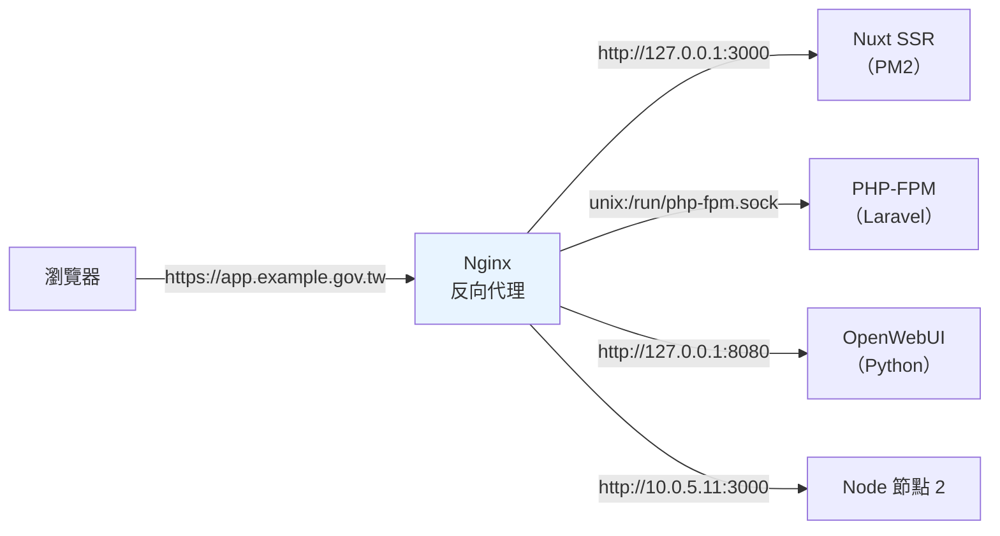

# Nginx 反向代理與負載平衡

> [!abstract] 這篇你會學到
> - 徹底搞懂 **`proxy_pass` 的「有無結尾斜線」規則**（最常踩的坑）
> - 正確轉發 **Host、X-Forwarded-For、X-Forwarded-Proto** 等標頭
> - 讓後端應用（Laravel / Nuxt / Node）**取得真實的客戶端 IP 與 https 協定**
> - 設定 **upstream** 與五種負載平衡演算法
> - 處理 **WebSocket、SSE、大檔案上傳、長時間請求**
> - 用 **keepalive** 大幅降低後端連線開銷
> - 做出**優雅的後端故障處理**與零停機切換

## 前置知識

- [[03-Nginx-location與rewrite]] — location 比對規則
- [[02-Nginx-設定語法與虛擬主機]] — map、變數、繼承規則

---

## 反向代理的角色



| 反向代理負責 | 後端應用負責 |
| --- | --- |
| **TLS 終止**（憑證只裝在 Nginx） | 業務邏輯 |
| **靜態檔案**（比應用快很多） | 動態內容 |
| **壓縮**（gzip / brotli） | — |
| **限流、WAF、IP 封鎖** | — |
| **負載平衡與健康檢查** | — |
| **快取** | — |
| **統一的存取日誌** | 應用日誌 |

> [!tip] 後端只監聽 127.0.0.1
> ```bash
> # ✅ 後端服務一律只綁本機
> pm2 start .output/server/index.mjs --name app -- --host 127.0.0.1 --port 3000
> # 或 systemd 服務中設定 HOST=127.0.0.1
> ```
> **這樣就算防火牆規則出錯，外部也連不到後端。**
> 驗證：
> ```bash
> $ sudo ss -tlnp | grep 3000
> LISTEN 0 511 127.0.0.1:3000 0.0.0.0:*   users:(("node",pid=1234,fd=20))
> #            ^^^^^^^^^ ★ 必須是 127.0.0.1，不是 0.0.0.0
> ```

---

## `proxy_pass` 的斜線規則 ★★★

> [!danger] 這是 Nginx 最容易搞錯的一件事
> **`proxy_pass` 的 URL「有沒有結尾路徑」，決定 URI 怎麼傳給後端。**

```nginx
# ═══ A. proxy_pass 【沒有】路徑（只有 host:port）═══
location /api/ {
    proxy_pass http://127.0.0.1:3000;
}
# 請求 /api/users  →  後端收到 【/api/users】   ★ 完整 URI 原封不動

# ═══ B. proxy_pass 【有】路徑（哪怕只是一個 /）═══
location /api/ {
    proxy_pass http://127.0.0.1:3000/;
}
# 請求 /api/users  →  後端收到 【/users】       ★ location 前綴被【替換】成 /

# ═══ C. proxy_pass 有路徑（非根）═══
location /api/ {
    proxy_pass http://127.0.0.1:3000/v2/;
}
# 請求 /api/users  →  後端收到 【/v2/users】    ★ /api/ 被替換成 /v2/
```

```
proxy_pass 【無】路徑 → URI 原封不動傳過去（像 root）
proxy_pass 【有】路徑 → location 前綴被【替換】掉（像 alias）
                        ★ 結尾的 / 也算「有路徑」！
```

| location | proxy_pass | 請求 | 後端收到 |
| --- | --- | --- | --- |
| `/api/` | `http://b:3000` | `/api/users` | **`/api/users`** |
| `/api/` | `http://b:3000/` | `/api/users` | **`/users`** |
| `/api/` | `http://b:3000/v2/` | `/api/users` | **`/v2/users`** |
| `/api` | `http://b:3000/` | `/api/users` | `//users` ← **雙斜線，通常是 bug** |
| `/api/` | `http://b:3000/v2` | `/api/users` | `/v2users` ← **黏在一起** |

> [!warning] 正規表示式 location 中 `proxy_pass` **不能帶路徑**
> ```nginx
> # ❌ nginx: [emerg] "proxy_pass" cannot have URI part in location given by regular expression
> location ~ ^/api/ {
>     proxy_pass http://backend/;
> }
>
> # ✅ 不帶路徑
> location ~ ^/api/ {
>     proxy_pass http://backend;
> }
>
> # ✅ 或用 rewrite 先改寫 URI
> location ~ ^/api/(.*)$ {
>     rewrite ^/api/(.*)$ /$1 break;
>     proxy_pass http://backend;
> }
> ```

> [!tip] 怎麼確定後端到底收到什麼
> ```bash
> # 【方法一】用 nc 開一個假後端，看它收到什麼
> $ nc -l 127.0.0.1 3000
> GET /api/users HTTP/1.1        ← ★ 這就是後端收到的
> Host: app.example.gov.tw
> X-Real-IP: 203.0.113.5
> ...
>
> # 【方法二】用 Python 一行的 echo server
> $ python3 -c "
> from http.server import *
> class H(BaseHTTPRequestHandler):
>     def do_GET(s):
>         s.send_response(200); s.end_headers()
>         s.wfile.write(f'PATH={s.path}\n{s.headers}'.encode())
> HTTPServer(('127.0.0.1',3000),H).serve_forever()"
> $ curl http://localhost/api/users
> PATH=/api/users
> Host: app.example.gov.tw
> X-Real-IP: 203.0.113.5
> ```
> **每次改 `proxy_pass` 都應該這樣驗一次。**

---

## 必要的標頭轉發

```nginx
# ═══════════ snippets/proxy-common.conf ═══════════
proxy_http_version 1.1;                  # ★ 預設是 1.0，keepalive 與 WebSocket 都需要 1.1

# ── 身分與協定資訊 ──
proxy_set_header Host              $host;
proxy_set_header X-Real-IP         $remote_addr;
proxy_set_header X-Forwarded-For   $proxy_add_x_forwarded_for;
proxy_set_header X-Forwarded-Proto $scheme;          # ★ http 或 https
proxy_set_header X-Forwarded-Host  $host;
proxy_set_header X-Forwarded-Port  $server_port;

# ── WebSocket 升級 ──
proxy_set_header Upgrade    $http_upgrade;
proxy_set_header Connection $connection_upgrade;     # ★ 需要搭配 map

# ── 逾時 ──
proxy_connect_timeout 10s;
proxy_send_timeout    60s;
proxy_read_timeout    60s;

# ── 緩衝 ──
proxy_buffering    on;
proxy_buffer_size  8k;
proxy_buffers      8 8k;
proxy_busy_buffers_size 16k;

# ── 隱藏後端資訊 ──
proxy_hide_header X-Powered-By;
proxy_hide_header Server;
proxy_intercept_errors off;
```

```nginx
# ★ WebSocket 需要的 map（放在 http 層，例如 conf.d/10-maps.conf）
map $http_upgrade $connection_upgrade {
    default upgrade;
    ''      close;
}
```

| 標頭 | 值 | 後端用它做什麼 |
| --- | --- | --- |
| **`Host`** | `$host` | 產生正確的絕對網址、多租戶識別 |
| **`X-Real-IP`** | `$remote_addr` | 記錄真實客戶端 IP |
| **`X-Forwarded-For`** | `$proxy_add_x_forwarded_for` | 完整的代理鏈（會**附加**到既有的值後面） |
| **`X-Forwarded-Proto`** | `$scheme` | **判斷原始請求是 http 還是 https** |
| `X-Forwarded-Host` / `-Port` | `$host` / `$server_port` | 產生正確的重導向網址 |
| **`Upgrade` / `Connection`** | `$http_upgrade` / `$connection_upgrade` | WebSocket 升級 |

> [!danger] 沒設 `X-Forwarded-Proto` 會發生什麼
> ```
> 使用者連 https://app.example.gov.tw/login
>   → Nginx 用 http://127.0.0.1:3000 連後端
>     → 後端以為請求是 http
>       → 產生重導向 Location: http://app.example.gov.tw/dashboard
>         → 瀏覽器連 http → Nginx 又 301 到 https
>           → 【混合內容警告 / 重導向迴圈 / Cookie 的 Secure 旗標失效】
> ```
>
> **症狀**：
> - 登入後被踢回登入頁（Session Cookie 因 Secure 旗標而沒送出）
> - 頁面資源用 http 載入 → 瀏覽器封鎖混合內容
> - `ERR_TOO_MANY_REDIRECTS`

### 讓後端框架信任這些標頭

```php
// ══ Laravel：bootstrap/app.php（Laravel 11+）══
->withMiddleware(function (Middleware $middleware) {
    $middleware->trustProxies(
        at: ['127.0.0.1', '10.0.0.0/8'],      // ★ 或 '*' 若確定只有自己的 Nginx 能連
        headers: Request::HEADER_X_FORWARDED_FOR
               | Request::HEADER_X_FORWARDED_HOST
               | Request::HEADER_X_FORWARDED_PORT
               | Request::HEADER_X_FORWARDED_PROTO
    );
})
```

```php
// ══ Laravel 10 及以前：app/Http/Middleware/TrustProxies.php ══
protected $proxies = ['127.0.0.1'];
protected $headers = Request::HEADER_X_FORWARDED_ALL;
```

```ini
# ══ 同時在 .env 明確指定網址 ══
APP_URL=https://app.example.gov.tw
ASSET_URL=https://app.example.gov.tw
SESSION_SECURE_COOKIE=true
```

```ts
// ══ Nuxt 3/4：nuxt.config.ts ══
export default defineNuxtConfig({
  nitro: {
    // Nitro 預設會讀 X-Forwarded-* ，但要確認來源可信
  },
  runtimeConfig: {
    public: { siteUrl: 'https://app.example.gov.tw' }
  }
})
```

```js
// ══ Express ══
app.set('trust proxy', 'loopback, 10.0.0.0/8');
```

> [!warning] `trust proxy` 設成 `*` 或 `true` 的風險
> 若後端**可以被外部直接連到**，設成信任所有代理等於
> **讓任何人偽造 `X-Forwarded-For` 來繞過 IP 限制與限流**。
>
> **兩個前提缺一不可**：
> ① **後端只監聽 127.0.0.1**（外部連不到）
> ② 信任清單**明確列出代理的 IP**

### 用 `real_ip` 模組讓 Nginx 自己也認得真實 IP

```nginx
# 情境：Nginx 前面還有 CDN / 硬體負載平衡器
http {
    # 信任的上游代理
    set_real_ip_from 10.0.0.0/8;
    set_real_ip_from 172.16.0.0/12;
    # Cloudflare 的網段（若有用）
    # set_real_ip_from 173.245.48.0/20;

    real_ip_header    X-Forwarded-For;
    real_ip_recursive on;         # ★ 從右往左跳過所有信任的代理，取第一個非信任 IP
}
```

> [!danger] `set_real_ip_from` 也是「陣列型指令」
> 它**不會累加繼承** —— 若在 `server` 層寫了一條，
> `http` 層的全部失效。**集中在 `http` 層設定。**

> [!warning] 只信任你真正控制的代理
> ```nginx
> # ❌ 極度危險
> set_real_ip_from 0.0.0.0/0;
> real_ip_header X-Forwarded-For;
> # → 任何人送 X-Forwarded-For: 127.0.0.1 就能偽裝成本機
> #   → 繞過所有 IP 白名單、限流、封鎖
> ```

---

## upstream 與負載平衡

```nginx
http {
    upstream app_backend {
        # ── 演算法（不寫 = round-robin）──
        least_conn;

        # ── 後端節點 ──
        server 10.0.5.11:3000 weight=3 max_fails=3 fail_timeout=30s;
        server 10.0.5.12:3000 weight=1 max_fails=3 fail_timeout=30s;
        server 10.0.5.13:3000 backup;            # ★ 只在其他全掛時才用
        server 10.0.5.14:3000 down;              # ★ 手動下線（維護中）

        # ── ★ keepalive：極大幅降低連線開銷 ──
        keepalive 32;                 # 每個 worker 保持的空閒連線數
        keepalive_requests 1000;      # 每條連線最多處理幾個請求
        keepalive_timeout 60s;
    }

    server {
        location / {
            proxy_pass http://app_backend;
            include snippets/proxy-common.conf;
        }
    }
}
```

### 五種演算法

| 演算法 | 寫法 | 行為 | 適用 |
| --- | --- | --- | --- |
| **Round Robin** | （預設） | 輪流 | 節點效能相近、應用無狀態 |
| **Weighted RR** | `server x weight=3;` | 依權重輪流 | **節點效能不同** |
| **`least_conn`** | `least_conn;` | 給**當前連線最少**的節點 | **請求處理時間差異大**（推薦） |
| **`ip_hash`** | `ip_hash;` | 依客戶端 IP 固定分配 | 需要 session 黏著且無共享 session |
| **`hash`** | `hash $key consistent;` | 依自訂 key（一致性雜湊） | 快取節點、依使用者分流 |

```nginx
# ── 依 URI 分流（快取節點常用）──
upstream cache_nodes {
    hash $request_uri consistent;      # ★ consistent = 加減節點時重分配最少
    server 10.0.5.11:3000;
    server 10.0.5.12:3000;
}

# ── 依使用者分流（讓同一使用者永遠連同一台）──
upstream app_backend {
    hash $cookie_session_id consistent;
    server 10.0.5.11:3000;
    server 10.0.5.12:3000;
}
```

> [!warning] `ip_hash` 的三個問題
> ① **NAT 後面的整個機關會被分到同一台**（分配不均）
> ② **節點增減時大量使用者被重新分配**（session 全部失效）
> ③ **只看 IPv4 的前三段**（同網段的使用者可能都到同一台）
>
> **更好的做法**：**把 session 移到共享儲存**
> ```ini
> # Laravel .env
> SESSION_DRIVER=redis
> CACHE_STORE=redis
> QUEUE_CONNECTION=redis
> ```
> 這樣就可以放心用 `least_conn`，節點增減也不影響使用者。

> [!tip] `keepalive` 是最有感的一個優化
> **沒有 keepalive**：每個請求都要 TCP 三次握手 + 四次揮手。
> **有 keepalive**：連線重複使用。
>
> ```nginx
> upstream backend {
>     server 127.0.0.1:3000;
>     keepalive 32;                     # ★ 這一行
> }
> location / {
>     proxy_pass http://backend;
>     proxy_http_version 1.1;           # ★★ 必須（預設 1.0 不支援 keepalive）
>     proxy_set_header Connection "";   # ★★ 必須（清掉 Connection: close）
> }
> ```
>
> **注意**：`keepalive` 的值是**每個 worker process** 的空閒連線數，
> 不是總數。實際上限 ≈ `worker_processes × keepalive`。
>
> **實測差異**（本機後端，1000 次請求）：
> ```
> 無 keepalive：平均 3.2ms，TIME_WAIT 連線數飆到數千
> 有 keepalive：平均 1.1ms，TIME_WAIT 幾乎為 0
> ```

### 健康檢查與故障轉移

```nginx
upstream app_backend {
    server 10.0.5.11:3000 max_fails=3 fail_timeout=30s;
    server 10.0.5.12:3000 max_fails=3 fail_timeout=30s;
    keepalive 32;
}

location / {
    proxy_pass http://app_backend;
    include snippets/proxy-common.conf;

    # ★ 什麼情況要換下一台重試
    proxy_next_upstream error timeout http_502 http_503 http_504;
    proxy_next_upstream_tries   2;
    proxy_next_upstream_timeout 10s;
}
```

| 參數 | 說明 |
| --- | --- |
| `max_fails=3` | **30 秒內**失敗 3 次就標記為不可用 |
| `fail_timeout=30s` | ①統計失敗的時間窗 ②標記不可用後隔離的時間 |
| `proxy_next_upstream` | 遇到哪些情況換下一台 |
| `proxy_next_upstream_tries` | 最多換幾台（**避免請求在所有節點上都跑一遍**） |

> [!danger] `proxy_next_upstream` 不要包含 `non_idempotent`
> ```nginx
> # ❌ 危險：POST 請求可能被【重複執行】
> proxy_next_upstream error timeout non_idempotent;
> # → 使用者按一次「送出訂單」，可能建立兩筆訂單
>
> # ✅ 預設行為就是「非冪等請求不重試」，保持預設
> proxy_next_upstream error timeout http_502 http_503;
> ```

> [!warning] 開源版 Nginx **沒有主動健康檢查**
> 開源版只有「被動健康檢查」——
> **要等到真的有請求失敗，才會把節點標記為不可用**。
>
> **這代表**：節點掛掉後，最早的幾個請求還是會失敗。
>
> **三種補強方式**：
> ① **NGINX Plus**（商業版）的 `health_check` 指令
> ② **`nginx_upstream_check_module`**（第三方模組，需重新編譯）
> ③ **外部監控 + 動態改設定**（Consul Template、自製腳本）
> ④ **改用有主動健康檢查的代理**（HAProxy、Traefik、Envoy）
>
> 對多數機關內部的應用，**被動檢查 + 監控告警**已經足夠。

---

## 特殊情境的處理

### WebSocket

```nginx
# http 層
map $http_upgrade $connection_upgrade {
    default upgrade;
    ''      close;
}

# server 層
location /ws/ {
    proxy_pass http://127.0.0.1:6001;

    proxy_http_version 1.1;                       # ★ 必須
    proxy_set_header Upgrade    $http_upgrade;    # ★ 必須
    proxy_set_header Connection $connection_upgrade;  # ★ 必須
    proxy_set_header Host $host;
    proxy_set_header X-Real-IP $remote_addr;
    proxy_set_header X-Forwarded-For $proxy_add_x_forwarded_for;
    proxy_set_header X-Forwarded-Proto $scheme;

    proxy_read_timeout  3600s;      # ★ 長連線，不能用預設的 60s
    proxy_send_timeout  3600s;
    proxy_buffering off;            # ★ WebSocket 不能緩衝
}
```

```bash
# 驗證 WebSocket 是否通
$ curl -i -N \
    -H "Connection: Upgrade" \
    -H "Upgrade: websocket" \
    -H "Sec-WebSocket-Version: 13" \
    -H "Sec-WebSocket-Key: dGhlIHNhbXBsZSBub25jZQ==" \
    https://app.example.gov.tw/ws/
HTTP/1.1 101 Switching Protocols        ← ★ 看到 101 就對了
Upgrade: websocket
Connection: Upgrade
```

### SSE（Server-Sent Events）／串流回應

```nginx
# ★ AI 服務（Ollama、OpenWebUI）的串流回應必備
location /api/chat {
    proxy_pass http://127.0.0.1:8080;
    include snippets/proxy-common.conf;

    proxy_buffering    off;          # ★★ 關掉緩衝，否則使用者要等全部產生完才看到
    proxy_cache        off;
    proxy_read_timeout 3600s;
    chunked_transfer_encoding on;

    # ★ 關掉 gzip（會導致緩衝）
    gzip off;

    # ★ 告訴前面的 CDN/代理也不要緩衝
    add_header X-Accel-Buffering no;
}
```

> [!danger] 忘記關 `proxy_buffering` 的典型症狀
> ```
> 使用者在 OpenWebUI 送出問題
>   → 畫面卡住不動，好像當掉了
>     → 過了 30 秒，【整段回答一次全部出現】
>
> 原因：Nginx 把 LLM 逐字產生的 token 全部緩衝起來，
>       等後端關閉連線才一次送出。
> ```
> **解法**：`proxy_buffering off;` + `X-Accel-Buffering: no`。

### 大檔案上傳

```nginx
location /upload {
    proxy_pass http://127.0.0.1:3000;
    include snippets/proxy-common.conf;

    client_max_body_size 500m;          # ★ 允許的最大請求體
    client_body_timeout  300s;
    proxy_request_buffering off;        # ★ 邊收邊轉給後端（不先寫到暫存檔）
    proxy_read_timeout  600s;
    proxy_send_timeout  600s;
}
```

> [!tip] `client_max_body_size` 要三個地方一起改
> ```
> ① Nginx：client_max_body_size 500m;
> ② PHP  ：upload_max_filesize = 500M
>          post_max_size = 512M          ★ 要比 upload 大
>          max_execution_time = 600
> ③ 應用 ：Laravel 的驗證規則 max:512000
> ```
> **任何一個沒改，都會失敗**，而錯誤訊息各不相同：
> - Nginx 不夠 → **413 Request Entity Too Large**
> - PHP 不夠 → 上傳「成功」但 `$_FILES` 是空的
> - 應用不夠 → 422 驗證失敗

### 長時間執行的請求（報表產生、批次匯入）

```nginx
location /reports/generate {
    proxy_pass http://127.0.0.1:3000;
    include snippets/proxy-common.conf;

    proxy_read_timeout 600s;            # ★ 允許後端跑 10 分鐘
    proxy_send_timeout 600s;
}
```

> [!warning] 更好的做法是不要有長請求
> ```
> ❌ 使用者按「產生報表」→ 等 10 分鐘 → 逾時 / 使用者關掉分頁
>
> ✅ 使用者按「產生報表」→ 立刻回 202 + job id
>      → 背景 queue worker 處理
>        → 完成後通知（email / WebSocket / 前端輪詢）
> ```
> Laravel 用 **Queue + Horizon**，
> Node 用 **BullMQ**。
> 見 [[03-Laravel-佇列排程與Supervisor]]。

### gRPC

```nginx
location /grpc/ {
    grpc_pass grpc://127.0.0.1:50051;
    # 或 TLS 後端：grpc_pass grpcs://...
    grpc_set_header X-Real-IP $remote_addr;
}
```

---

## 完整實戰範例

### LXMP 完整反向代理架構

```nginx
# ════════════════ /etc/nginx/conf.d/10-maps.conf ════════════════
map $http_upgrade $connection_upgrade {
    default upgrade;
    ''      close;
}

# ════════════════ /etc/nginx/conf.d/20-upstreams.conf ════════════════
# ── Nuxt SSR（PM2 cluster 模式，多個 port）──
upstream nuxt_ssr {
    least_conn;
    server 127.0.0.1:3000 max_fails=3 fail_timeout=30s;
    server 127.0.0.1:3001 max_fails=3 fail_timeout=30s;
    keepalive 32;
    keepalive_requests 1000;
}

# ── PHP-FPM（Laravel）──
upstream php_fpm {
    server unix:/run/php/php8.3-fpm-app.sock;
    keepalive 16;
}

# ── WebSocket（Laravel Reverb / Soketi）──
upstream websocket {
    ip_hash;                                  # WebSocket 需要黏著
    server 127.0.0.1:8080;
    keepalive 16;
}

# ── AI 服務（OpenWebUI）──
upstream openwebui {
    server 127.0.0.1:8081;
    keepalive 8;
}

# ════════════════ sites-available/app.example.gov.tw ════════════════
server {
    listen 443 ssl;
    listen [::]:443 ssl;
    http2 on;
    server_name app.example.gov.tw;

    include snippets/ssl-params.conf;
    ssl_certificate     /etc/letsencrypt/live/app.example.gov.tw/fullchain.pem;
    ssl_certificate_key /etc/letsencrypt/live/app.example.gov.tw/privkey.pem;

    root /var/www/app/backend/current/public;
    index index.php;

    client_max_body_size 50m;
    include snippets/security-headers.conf;
    include snippets/deny-hidden.conf;

    access_log /var/log/nginx/app.access.log main;
    error_log  /var/log/nginx/app.error.log  warn;

    # ═══ 健康檢查（Nginx 自己回，不打後端）═══
    location = /health {
        access_log off;
        default_type application/json;
        return 200 '{"status":"ok","layer":"nginx"}';
    }

    # ═══ Laravel API ═══
    location ^~ /api/ {
        try_files $uri /index.php?$query_string;
    }

    # ═══ Laravel 後台（Nova / Filament）═══
    location ^~ /admin/ {
        try_files $uri /index.php?$query_string;
    }

    # ═══ PHP-FPM ═══
    location ~ \.php$ {
        try_files $uri =404;                              # ★ 安全必備
        fastcgi_pass php_fpm;
        fastcgi_index index.php;
        fastcgi_param SCRIPT_FILENAME $realpath_root$fastcgi_script_name;
        fastcgi_param DOCUMENT_ROOT   $realpath_root;
        fastcgi_param HTTPS           on;
        include fastcgi_params;
        fastcgi_read_timeout 120s;
        fastcgi_keep_conn on;                             # ★ 搭配 upstream keepalive
        include snippets/security-headers.conf;
    }

    # ═══ WebSocket（Laravel Reverb 廣播）═══
    location ^~ /app/ {
        proxy_pass http://websocket;
        proxy_http_version 1.1;
        proxy_set_header Upgrade    $http_upgrade;
        proxy_set_header Connection $connection_upgrade;
        proxy_set_header Host $host;
        proxy_set_header X-Real-IP $remote_addr;
        proxy_set_header X-Forwarded-For $proxy_add_x_forwarded_for;
        proxy_set_header X-Forwarded-Proto $scheme;
        proxy_read_timeout 3600s;
        proxy_send_timeout 3600s;
        proxy_buffering off;
    }

    # ═══ AI 對話（串流回應）═══
    location ^~ /ai/ {
        proxy_pass http://openwebui/;                     # ★ 有斜線 → 去掉 /ai/ 前綴
        include snippets/proxy-common.conf;
        proxy_buffering off;                              # ★★ 串流必須
        proxy_cache off;
        proxy_read_timeout 3600s;
        add_header X-Accel-Buffering no;
        gzip off;
    }

    # ═══ 大檔案上傳 ═══
    location = /api/upload {
        proxy_pass http://nuxt_ssr;
        include snippets/proxy-common.conf;
        client_max_body_size 500m;
        proxy_request_buffering off;                      # ★ 邊收邊轉
        proxy_read_timeout 600s;
    }

    # ═══ 靜態資源（Nginx 直接處理，不進後端）═══
    location ~* \.(?:js|mjs|css|woff2?|jpg|jpeg|png|gif|webp|svg|ico)$ {
        expires 1y;
        add_header Cache-Control "public, immutable";
        access_log off;
        try_files $uri @nuxt;                             # 找不到才給 Nuxt
        include snippets/security-headers.conf;
    }

    # ═══ 其他都給 Nuxt SSR ═══
    location / {
        try_files $uri @nuxt;
    }

    location @nuxt {
        proxy_pass http://nuxt_ssr;
        include snippets/proxy-common.conf;
    }

    # ═══ 錯誤頁 ═══
    error_page 502 503 504 @maintenance;
    location @maintenance {
        root /var/www/error-pages;
        rewrite ^ /maintenance.html break;
        add_header Retry-After 60 always;
    }
}
```

### 驗證腳本

```bash
#!/usr/bin/env bash
# 反向代理設定驗證
HOST="${1:-app.example.gov.tw}"
B="https://$HOST"

echo "═══ 反向代理驗證 $HOST ═══"

echo -e "\n【1】後端只監聽本機？"
sudo ss -tlnp | grep -E ':(3000|3001|8080|8081)\b' | while read -r _ _ _ _ addr _; do
    if [[ "$addr" == 127.0.0.1:* ]] || [[ "$addr" == "[::1]":* ]]; then
        echo "  ✓ $addr"
    else
        echo "  ⚠⚠ $addr ← 【外部可直接連到後端】"
    fi
done

echo -e "\n【2】後端是否收到正確的標頭"
echo "  （需要後端有一個回顯標頭的端點，例如 /debug/headers）"
curl -sk "$B/debug/headers" 2>/dev/null | \
    grep -iE 'x-forwarded-proto|x-real-ip|x-forwarded-for|host' | sed 's/^/    /' \
    || echo "    （沒有 debug 端點，改用下方方法驗證）"

echo -e "\n【3】HTTPS 是否被後端正確識別（看重導向的 Location）"
loc=$(curl -sk -o /dev/null -D - "$B/login" 2>/dev/null | grep -i '^location:' | tr -d '\r')
if [ -z "$loc" ]; then
    echo "    （沒有重導向）"
elif [[ "$loc" == *"http://"* ]]; then
    echo "  ⚠⚠ $loc ← 【後端以為是 http，X-Forwarded-Proto 沒生效】"
else
    echo "  ✓ $loc"
fi

echo -e "\n【4】WebSocket"
code=$(curl -sk -o /dev/null -w '%{http_code}' -m 10 \
    -H "Connection: Upgrade" -H "Upgrade: websocket" \
    -H "Sec-WebSocket-Version: 13" \
    -H "Sec-WebSocket-Key: dGhlIHNhbXBsZSBub25jZQ==" "$B/app/x" 2>/dev/null)
[ "$code" = "101" ] && echo "  ✓ 101 Switching Protocols" \
                    || echo "  ⚠ 回傳 $code（預期 101）"

echo -e "\n【5】串流回應沒有被緩衝"
hdr=$(curl -skI -m 10 "$B/ai/health" 2>/dev/null | grep -i 'x-accel-buffering' | tr -d '\r')
echo "  ${hdr:-⚠ 沒有 X-Accel-Buffering: no}"

echo -e "\n【6】keepalive 是否生效"
echo "  連線到後端的 TIME_WAIT 數量："
tw=$(ss -tan state time-wait 2>/dev/null | grep -cE ':(3000|3001|8080)\b')
echo "    $tw  ★ 大量 TIME_WAIT 表示 keepalive 沒生效"
sudo nginx -T 2>/dev/null | grep -q 'keepalive ' \
    && echo "  ✓ upstream 有設 keepalive" || echo "  ✗ upstream 沒有 keepalive"
sudo nginx -T 2>/dev/null | grep -q 'proxy_http_version 1.1' \
    && echo "  ✓ 有 proxy_http_version 1.1" || echo "  ✗ 缺 proxy_http_version 1.1"

echo -e "\n【7】上傳限制的三層一致性"
n=$(sudo nginx -T 2>/dev/null | grep -oP 'client_max_body_size\s+\K\S+' | tr -d ';' | head -1)
p=$(php -i 2>/dev/null | grep -oP '^upload_max_filesize => \K\S+' | head -1)
q=$(php -i 2>/dev/null | grep -oP '^post_max_size => \K\S+' | head -1)
echo "  Nginx client_max_body_size : ${n:-?}"
echo "  PHP   upload_max_filesize  : ${p:-?}"
echo "  PHP   post_max_size        : ${q:-?}  ★ 應 ≥ upload_max_filesize"

echo -e "\n【8】upstream 節點狀態"
sudo nginx -T 2>/dev/null | awk '/upstream /{u=$2} /^\s*server /&&u{print "  ["u"] "$0}' | \
    sed 's/;$//' | head -20
```

### 零停機切換後端版本

```bash
#!/usr/bin/env bash
# Nuxt SSR 藍綠部署（不中斷服務）
set -euo pipefail
APP=/var/www/app/frontend
BLUE=3000; GREEN=3001

# 判斷目前哪個在服務
CURRENT=$(sudo nginx -T 2>/dev/null | grep -oP 'server 127.0.0.1:\K(3000|3001)(?=.*# active)' | head -1)
[ "$CURRENT" = "$BLUE" ] && { NEW=$GREEN; OLD=$BLUE; } || { NEW=$BLUE; OLD=$GREEN; }
echo "目前：$OLD → 切換到：$NEW"

# 1. 在新 port 啟動新版本
cd "$APP/releases/$(ls -1 "$APP/releases" | tail -1)"
PORT=$NEW pm2 start .output/server/index.mjs --name "app-$NEW" --update-env

# 2. 等新版本健康
for i in {1..30}; do
    curl -sf "http://127.0.0.1:$NEW/health" >/dev/null && break
    echo "  等待新版本啟動 ($i/30)..."
    sleep 2
    [ "$i" = "30" ] && { echo "✗ 新版本啟動失敗，中止"; pm2 delete "app-$NEW"; exit 1; }
done
echo "✓ 新版本健康"

# 3. 切換 Nginx upstream
sudo sed -i "s/server 127.0.0.1:$OLD.*/server 127.0.0.1:$NEW;  # active/" \
    /etc/nginx/conf.d/20-upstreams.conf
sudo nginx -t && sudo systemctl reload nginx
echo "✓ Nginx 已切換到 $NEW"

# 4. 等舊連線排空後關掉舊版本
sleep 30
pm2 delete "app-$OLD" 2>/dev/null || true
echo "✓ 完成"
```

---

## 常見錯誤與排錯

| 現象／錯誤 | 原因 | 解法 |
| --- | --- | --- |
| **後端收到的路徑多／少了前綴** | **`proxy_pass` 有無結尾斜線** | 無路徑=原封不動；有路徑=替換前綴 |
| `"proxy_pass" cannot have URI part in location given by regular expression` | 正規 location 的 proxy_pass 帶路徑 | 去掉路徑，或先 `rewrite ... break` |
| 後端路徑出現 `//` | location 沒斜線但 proxy_pass 有 | 兩邊保持一致 |
| **登入後被踢回登入頁** | **缺 `X-Forwarded-Proto`**，Cookie 的 Secure 沒生效 | 加標頭 + 後端設 trust proxy |
| **`ERR_TOO_MANY_REDIRECTS`** | 後端以為是 http，一直重導 | 同上 |
| 混合內容警告 | 後端產生 http:// 的資源網址 | 同上 + `APP_URL=https://...` |
| **後端日誌全是 127.0.0.1** | 缺 `X-Real-IP` / 後端沒信任代理 | 加標頭 + `trust proxy` 設定 |
| **502 Bad Gateway** | 後端沒啟動 / port 不對 / socket 權限 | `ss -tlnp`、`curl 127.0.0.1:3000`、看 error_log |
| **504 Gateway Timeout** | 後端太慢 | 調 `proxy_read_timeout`；**根本解法是改成非同步佇列** |
| **413 Request Entity Too Large** | `client_max_body_size` 太小 | Nginx + PHP + 應用**三層都要改** |
| 上傳「成功」但檔案是空的 | PHP 的 `upload_max_filesize` 太小 | 調 php.ini 並重啟 PHP-FPM |
| **AI 回應整段一次出現** | **`proxy_buffering on`** | `proxy_buffering off;` + `X-Accel-Buffering: no` + `gzip off` |
| **WebSocket 連不上（回 400/200）** | 缺 `proxy_http_version 1.1` 或 Upgrade 標頭 | 補齊三個必要設定 + map |
| WebSocket 60 秒後斷線 | `proxy_read_timeout` 預設 60s | 調成 3600s |
| **大量 TIME_WAIT 連線** | 沒有 keepalive | `keepalive 32;` + `proxy_http_version 1.1;` + `Connection ""` |
| `upstream sent too big header` | 後端標頭超過 buffer | 調大 `proxy_buffer_size 16k;` |
| **POST 被重複執行** | `proxy_next_upstream` 含 `non_idempotent` | 移除它（預設就不重試非冪等請求） |
| 節點掛了還是有請求失敗 | **開源版只有被動健康檢查** | 靠監控告警；或用 HAProxy/Traefik |
| 負載不平均 | `ip_hash` + NAT | 改 session 到 Redis，用 `least_conn` |
| `no live upstreams` | 所有節點都被標記為失敗 | 檢查後端；調 `max_fails` / `fail_timeout` |

### 502 的系統化排查

```bash
# 【1】後端到底活著嗎
$ sudo ss -tlnp | grep 3000
$ curl -v http://127.0.0.1:3000/health

# 【2】Nginx 的 error_log 怎麼說
$ sudo tail -50 /var/log/nginx/app.error.log
connect() failed (111: Connection refused) while connecting to upstream
#                    ^^^ 後端沒在聽
connect() failed (13: Permission denied) while connecting to upstream
#                    ^^^ ★ Unix socket 權限 或 SELinux
upstream prematurely closed connection while reading response header
#        ^^^ 後端崩潰 / OOM / 執行時間超過後端自己的限制
upstream sent too big header while reading response header
#        ^^^ 調大 proxy_buffer_size

# 【3】Unix socket 的權限
$ ls -l /run/php/php8.3-fpm.sock
srw-rw---- 1 www-data www-data 0 Aug 28 10:00 /run/php/php8.3-fpm.sock
#            ^^^^^^^^ ^^^^^^^^ 必須讓 Nginx 的執行身分讀得到
$ ps -o user= -C nginx | sort -u        # Nginx worker 的身分

# 【4】SELinux（RHEL 系）
$ sudo getenforce
Enforcing
$ sudo ausearch -m avc -ts recent | grep nginx
$ sudo setsebool -P httpd_can_network_connect 1       # ★ 允許 Nginx 連 TCP 後端

# 【5】後端自己的日誌
$ pm2 logs app --lines 100
$ sudo journalctl -u php8.3-fpm -n 100
$ sudo tail -100 /var/log/php8.3-fpm.log
```

> [!info]- Rocky / AlmaLinux（RHEL 系）對照
> **SELinux 是最常見的 502 元凶**：
> ```bash
> # 症狀：Permission denied，但檔案權限看起來完全正常
> $ sudo tail /var/log/nginx/error.log
> connect() to 127.0.0.1:3000 failed (13: Permission denied)
>
> # 診斷
> $ sudo ausearch -m avc -ts recent
> type=AVC msg=audit(...): avc: denied { name_connect } for pid=1234 comm="nginx"
>
> # 解法一：允許 Nginx 連接網路後端
> $ sudo setsebool -P httpd_can_network_connect 1
>
> # 解法二：只開放特定 port
> $ sudo semanage port -a -t http_port_t -p tcp 3000
>
> # 解法三：允許 Nginx 讀取自訂路徑
> $ sudo semanage fcontext -a -t httpd_sys_content_t "/var/www/app(/.*)?"
> $ sudo restorecon -Rv /var/www/app
> ```
>
> **不要用 `setenforce 0` 當作解法** ——
> 那是關掉整個安全機制，只能用於「確認問題是不是 SELinux」的暫時測試。
>
> 其他差異：
> - Nginx 執行身分是 **`nginx`**（不是 `www-data`）
> - PHP-FPM socket 預設在 `/run/php-fpm/www.sock`
> - firewalld：`sudo firewall-cmd --permanent --add-service=https && sudo firewall-cmd --reload`

---

## 安全性注意事項

> [!danger] 後端服務絕對不能對外開放
> ```bash
> # ❌ 危險
> $ sudo ss -tlnp | grep 3000
> LISTEN 0 511 0.0.0.0:3000 0.0.0.0:*
> #            ^^^^^^^ 任何人都能繞過 Nginx 直接連
>
> # → 繞過 TLS、繞過 WAF、繞過限流、繞過 IP 白名單
> # → 而且後端若信任 X-Forwarded-For，攻擊者可以偽造來源 IP
> ```
>
> **三道防線**：
> ```bash
> # ① 應用層：只綁 127.0.0.1
> HOST=127.0.0.1 pm2 start ...
>
> # ② 防火牆
> $ sudo ufw deny 3000/tcp
>
> # ③ 定期稽核
> $ sudo ss -tlnp | grep -v '127.0.0.1\|\[::1\]'
> ```

> [!danger] `X-Forwarded-For` 偽造
> ```
> 攻擊者送出：
>   GET /admin HTTP/1.1
>   X-Forwarded-For: 127.0.0.1
>
> 若 Nginx 設定了 set_real_ip_from 0.0.0.0/0
>   → $remote_addr 變成 127.0.0.1
>     → 繞過所有 IP 白名單、限流、fail2ban
> ```
>
> **正確做法**：
> ```nginx
> # ① 只信任你真正控制的代理
> set_real_ip_from 10.0.5.1;              # 前面的硬體 LB
> real_ip_header X-Forwarded-For;
> real_ip_recursive on;
>
> # ② 若 Nginx 是最外層，【不要】啟用 real_ip
> # ③ 主動清掉客戶端送來的 X-Forwarded-For
> proxy_set_header X-Forwarded-For $remote_addr;   # ★ 覆蓋而非附加
> ```
>
> **`$proxy_add_x_forwarded_for` vs `$remote_addr`**：
> - `$proxy_add_x_forwarded_for`：**附加**到客戶端送來的值後面（多層代理用）
> - `$remote_addr`：**完全覆蓋**（**Nginx 是最外層時用這個更安全**）

> [!warning] 隱藏後端的技術指紋
> ```nginx
> # 後端常常會洩漏版本資訊
> proxy_hide_header X-Powered-By;          # PHP/8.3.2
> proxy_hide_header Server;                # Express / Werkzeug
> proxy_hide_header X-AspNet-Version;
> proxy_hide_header X-Generator;
> server_tokens off;                        # Nginx 自己的版本
> ```
> ```bash
> # 驗證
> $ curl -sI https://app.example.gov.tw/ | grep -iE 'server|powered|version'
> server: nginx                              ← ★ 沒有版本號
> ```

> [!tip] 不要把後端的錯誤頁直接吐給使用者
> ```nginx
> proxy_intercept_errors off;               # 後端自己的 4xx/5xx 直接轉發
> # 或
> proxy_intercept_errors on;                # ★ 攔下來換成自己的頁面
> error_page 500 502 503 504 /errors/50x.html;
> ```
> **後端框架的預設錯誤頁常常會洩漏**：
> 檔案路徑、框架版本、堆疊追蹤、資料庫查詢語句。
>
> **正式環境的後端一定要關掉 debug 模式**：
> ```ini
> # Laravel .env
> APP_DEBUG=false
> APP_ENV=production
> ```

> [!warning] 限制 proxy 到內部服務的路徑
> ```nginx
> # ❌ 極度危險：把使用者輸入當成後端位址（SSRF）
> location /fetch {
>     proxy_pass $arg_url;              # ★★ 任何人可以讓伺服器連任意網址
> }
>
> # ✅ 後端位址一律寫死或用白名單 map
> map $arg_target $safe_backend {
>     default    "";
>     "service1" "http://10.0.5.11:3000";
>     "service2" "http://10.0.5.12:3000";
> }
> location /fetch {
>     if ($safe_backend = "") { return 400; }
>     proxy_pass $safe_backend;
> }
> ```

---

## 速查表

### `proxy_pass` 斜線規則 ★★★

```nginx
location /api/ { proxy_pass http://b:3000;      }  # → /api/users （原封不動）
location /api/ { proxy_pass http://b:3000/;     }  # → /users     （替換前綴）
location /api/ { proxy_pass http://b:3000/v2/;  }  # → /v2/users

★ 【無】路徑 = 原封不動（像 root）
★ 【有】路徑 = 替換 location 前綴（像 alias），結尾的 / 也算「有路徑」
★ 正規 location 的 proxy_pass 【不能】帶路徑
```

### 必備標頭

```nginx
proxy_http_version 1.1;
proxy_set_header Host              $host;
proxy_set_header X-Real-IP         $remote_addr;
proxy_set_header X-Forwarded-For   $proxy_add_x_forwarded_for;
proxy_set_header X-Forwarded-Proto $scheme;        # ★ 沒有它 HTTPS 會壞掉
proxy_set_header Upgrade           $http_upgrade;
proxy_set_header Connection        $connection_upgrade;
```

### 後端信任代理

```php
// Laravel 11+  bootstrap/app.php
$middleware->trustProxies(at: ['127.0.0.1'], headers: Request::HEADER_X_FORWARDED_ALL);
```
```js
app.set('trust proxy', 'loopback');            // Express
```
```ini
APP_URL=https://app.example.gov.tw             # .env
SESSION_SECURE_COOKIE=true
```

### upstream 與演算法

```nginx
upstream backend {
    least_conn;                                  # 推薦（處理時間差異大）
    # ip_hash;                                   # session 黏著（有 NAT 問題）
    # hash $cookie_sid consistent;               # 自訂 key
    server 10.0.5.11:3000 weight=3 max_fails=3 fail_timeout=30s;
    server 10.0.5.12:3000 backup;                # 只在其他全掛時用
    server 10.0.5.13:3000 down;                  # 手動下線
    keepalive 32;                                # ★ 每個 worker 的空閒連線數
    keepalive_requests 1000;
}
location / {
    proxy_pass http://backend;
    proxy_http_version 1.1;                      # ★★ keepalive 必須
    proxy_set_header Connection "";              # ★★ keepalive 必須
    proxy_next_upstream error timeout http_502 http_503;
    proxy_next_upstream_tries 2;
}
```

### 特殊情境

```nginx
# WebSocket
proxy_http_version 1.1;  proxy_set_header Upgrade $http_upgrade;
proxy_set_header Connection $connection_upgrade;
proxy_read_timeout 3600s;  proxy_buffering off;

# SSE / AI 串流 ★
proxy_buffering off;  proxy_cache off;  gzip off;
add_header X-Accel-Buffering no;  proxy_read_timeout 3600s;

# 大檔案上傳
client_max_body_size 500m;  proxy_request_buffering off;
# ★ 同時要改 PHP：upload_max_filesize、post_max_size

# gRPC
grpc_pass grpc://127.0.0.1:50051;
```

### 502 排查五步

```bash
sudo ss -tlnp | grep <port>              # ① 後端在聽嗎
curl -v http://127.0.0.1:<port>/health   # ② 直接連得到嗎
sudo tail -50 /var/log/nginx/*error.log  # ③ Nginx 怎麼說
ls -l /run/php/*.sock                    # ④ socket 權限
sudo ausearch -m avc -ts recent          # ⑤ SELinux（RHEL）
```

| error_log 訊息 | 原因 |
| --- | --- |
| `Connection refused` | 後端沒啟動 / port 錯 |
| `Permission denied` | socket 權限 / **SELinux** |
| `upstream prematurely closed` | 後端崩潰 / OOM |
| `upstream sent too big header` | 調大 `proxy_buffer_size` |
| `no live upstreams` | 所有節點都被標記失敗 |

### 安全五條

```nginx
① 後端只監聽 127.0.0.1（+ 防火牆擋 port）
② set_real_ip_from 只寫【你控制的】代理 IP
③ proxy_hide_header X-Powered-By / Server；server_tokens off
④ 後端 APP_DEBUG=false
⑤ proxy_pass 的位址【絕不】來自使用者輸入（SSRF）
```

---

## 練習題

> [!question]- 練習 1：徹底搞懂 proxy_pass 斜線
> 1. 用 Python 起一個回顯路徑的假後端（見本篇「怎麼確定後端到底收到什麼」）
> 2. 建立四組設定，**先預測後端會收到什麼**，再實測：
>    ```
>    A: location /api/  { proxy_pass http://127.0.0.1:3000;     }
>    B: location /api/  { proxy_pass http://127.0.0.1:3000/;    }
>    C: location /api/  { proxy_pass http://127.0.0.1:3000/v2/; }
>    D: location /api   { proxy_pass http://127.0.0.1:3000/;    }
>    ```
> 3. 每組都送 `curl http://localhost/api/users?page=2`
> 4. **記下四種結果，這輩子就不會再搞錯了**

> [!question]- 練習 2：重現 X-Forwarded-Proto 的問題
> 1. 部署一個 Laravel 應用在 Nginx 後面（HTTPS）
> 2. **故意不設定** `proxy_set_header X-Forwarded-Proto $scheme;`
> 3. 觀察：
>    - `curl -skI https://網站/login | grep -i location` → 看到 `http://` 嗎？
>    - 設定 `SESSION_SECURE_COOKIE=true` 後能登入嗎？
>    - `php artisan tinker` → `request()->isSecure()` 回傳什麼？
> 4. 加上標頭 + `trustProxies` 設定
> 5. **再測一次全部**

> [!question]- 練習 3：keepalive 的效能實測
> 1. 建立 upstream **不設** `keepalive`
> 2. `ab -n 2000 -c 20 http://localhost/api/ping`
> 3. 記錄：平均延遲、`ss -tan state time-wait | wc -l`
> 4. 加上 `keepalive 32;` + `proxy_http_version 1.1;` + `proxy_set_header Connection "";`
> 5. **重測，比較差異**
> 6. 只加 `keepalive` 但**不加** `proxy_http_version 1.1` 會怎樣？

> [!question]- 練習 4：串流回應
> 1. 架設 Ollama + OpenWebUI（或用 `curl` 直接打 Ollama 的 `/api/generate`）
> 2. 透過 Nginx 代理，**先不要**關 `proxy_buffering`
> 3. 觀察回應是「逐字出現」還是「一次全出現」
> 4. 加上 `proxy_buffering off;` + `X-Accel-Buffering: no` + `gzip off`
> 5. **再測一次**
> 6. 用 `curl -N` 觀察 chunk 的到達時間

> [!question]- 練習 5：故障轉移演練
> 1. 建立兩節點的 upstream，設 `max_fails=2 fail_timeout=10s`
> 2. 持續發送請求：`while true; do curl -s localhost/health; sleep 0.2; done`
> 3. **停掉其中一個節點**，觀察：
>    - 幾個請求失敗後才自動切換？
>    - `fail_timeout` 過後會自動恢復嗎？
> 4. 停掉**全部**節點 → 看到什麼錯誤？error_log 說什麼？
> 5. 加上 `error_page 502 503 504 @maintenance;` 讓使用者看到友善的維護頁

---

## 小測驗

Q1. **`proxy_pass http://b:3000;` 與 `proxy_pass http://b:3000/;` 有什麼差別**？`location /api/` 收到 `/api/users` 時，兩者的後端各收到什麼？

Q2. 正規表示式 location 中的 `proxy_pass` 有什麼限制？怎麼繞過？

Q3. **反向代理必備的五個 `proxy_set_header` 是什麼？各自的作用**？

Q4. **沒有設定 `X-Forwarded-Proto` 會產生哪三種症狀**？

Q5. **`$proxy_add_x_forwarded_for` 與 `$remote_addr` 用在 `X-Forwarded-For` 有什麼差別？什麼時候該用哪個**？

Q6. **`set_real_ip_from 0.0.0.0/0;` 為什麼極度危險**？

Q7. **要讓 upstream 的 `keepalive` 真正生效，除了 `keepalive 32;` 還需要哪兩個設定**？

Q8. **`ip_hash` 有哪三個問題？更好的做法是什麼**？

Q9. **AI 串流回應「整段一次出現」是什麼原因？需要哪四個設定才能修好**？

Q10. **開源版 Nginx 的健康檢查是主動還是被動？這代表什麼實務後果**？

> [!question]- 測驗答案
> **Q1.** 差別在 **`proxy_pass` 的 URL「有沒有路徑部分」**（結尾的 `/` 也算有路徑）：
> **無路徑** → **URI 原封不動傳給後端**（行為像 `root`）：
> 後端收到 **`/api/users`**；
> **有路徑** → **location 前綴被替換掉**（行為像 `alias`）：
> 後端收到 **`/users`**（`/api/` 被替換成 `/`）。
> 若寫 `proxy_pass http://b:3000/v2/;` 則後端收到 `/v2/users`。
>
> **Q2.** **正規 location 中的 `proxy_pass` 不能帶 URI 路徑**，
> 否則會報 `"proxy_pass" cannot have URI part in location given by regular expression`。
> 因為正規比對沒有固定的「前綴」可以替換。
> **繞過方式**：①去掉路徑，只寫 `proxy_pass http://backend;`；
> ②先用 `rewrite ... break` 改寫 URI：
> ```nginx
> location ~ ^/api/(.*)$ {
>     rewrite ^/api/(.*)$ /$1 break;
>     proxy_pass http://backend;
> }
> ```
>
> **Q3.** ①**`Host $host`** —— 讓後端產生正確的絕對網址、識別多租戶；
> ②**`X-Real-IP $remote_addr`** —— 記錄真實客戶端 IP；
> ③**`X-Forwarded-For $proxy_add_x_forwarded_for`** —— 完整的代理鏈；
> ④**`X-Forwarded-Proto $scheme`** —— **讓後端知道原始請求是 http 還是 https**；
> ⑤**`Upgrade $http_upgrade` + `Connection $connection_upgrade`** —— WebSocket 升級。
> 另外必須有 **`proxy_http_version 1.1;`**（預設是 1.0，keepalive 與 WebSocket 都需要 1.1）。
>
> **Q4.** 後端會以為請求是 http（因為 Nginx 是用 http 連後端的），於是：
> ①**登入後被踢回登入頁** —— Session Cookie 的 `Secure` 旗標讓瀏覽器不送出 Cookie；
> ②**`ERR_TOO_MANY_REDIRECTS`** —— 後端產生 `Location: http://...`，
> 瀏覽器連 http → Nginx 又 301 到 https → 無限迴圈；
> ③**混合內容警告** —— 頁面資源用 `http://` 載入，被瀏覽器封鎖。
> 修法：加上標頭，並在後端設定信任代理（Laravel 的 `trustProxies`、
> Express 的 `app.set('trust proxy', ...)`），同時設 `APP_URL=https://...`。
>
> **Q5.** **`$proxy_add_x_forwarded_for`** 會把 `$remote_addr`
> **附加到客戶端送來的既有 `X-Forwarded-For` 後面**（保留完整代理鏈）；
> **`$remote_addr`** 則是**完全覆蓋掉客戶端送來的值**。
> **多層代理（Nginx 前面還有 CDN 或硬體 LB）時用 `$proxy_add_x_forwarded_for`**，
> 才能保留完整鏈路；
> **Nginx 就是最外層時，用 `$remote_addr` 更安全** ——
> 因為它會清掉攻擊者自己偽造的 `X-Forwarded-For`。
>
> **Q6.** 因為 `set_real_ip_from` 定義的是「**哪些來源送的 `X-Forwarded-For` 可以信任**」。
> 設成 `0.0.0.0/0` 等於**信任所有人送來的值** ——
> 任何人只要送出 `X-Forwarded-For: 127.0.0.1`，
> Nginx 就會把 `$remote_addr` 改寫成 `127.0.0.1`，
> **繞過所有 IP 白名單、限流（limit_req）、`deny` 規則與 fail2ban**。
> 正確做法是**只列出你真正控制的代理 IP**；
> 若 Nginx 本身就是最外層，**根本不要啟用 real_ip 模組**。
>
> **Q7.** 還需要：
> ①**`proxy_http_version 1.1;`** —— 預設的 HTTP/1.0 **不支援 keepalive**；
> ②**`proxy_set_header Connection "";`** —— 清掉預設會送出的 `Connection: close`，
> 否則後端收到後會主動關閉連線。
> ```nginx
> upstream backend { server 127.0.0.1:3000; keepalive 32; }
> location / {
>     proxy_pass http://backend;
>     proxy_http_version 1.1;
>     proxy_set_header Connection "";
> }
> ```
> 另外注意 `keepalive` 的值是**每個 worker process** 的空閒連線數，不是總數。
>
> **Q8.** ①**NAT 後面的整個機關會被分到同一台**，造成負載嚴重不均；
> ②**節點增減時大量使用者被重新分配**，導致 session 全部失效；
> ③**只看 IPv4 位址的前三段**，同網段的使用者傾向落到同一台。
> **更好的做法**：**把 session 移到共享儲存（Redis）**，
> 讓應用變成無狀態，就可以放心用 `least_conn`：
> ```ini
> SESSION_DRIVER=redis
> CACHE_STORE=redis
> ```
> 這樣節點增減完全不影響使用者。
>
> **Q9.** 原因是 **`proxy_buffering` 預設是 `on`** ——
> Nginx 把後端逐字產生的 token 全部緩衝起來，
> 等後端關閉連線才一次送出，使用者看到的就是「卡住 30 秒後整段出現」。
> **需要四個設定**：
> ```nginx
> proxy_buffering off;                  # ①★★ 關掉緩衝
> proxy_cache off;                      # ②不要快取串流
> gzip off;                             # ③壓縮也會造成緩衝
> add_header X-Accel-Buffering no;      # ④告訴前面的 CDN/代理也別緩衝
> proxy_read_timeout 3600s;             # 順便：長連線不能用預設 60s
> ```
>
> **Q10.** **開源版只有「被動健康檢查」** ——
> 它**必須等到真的有請求失敗**（`max_fails` 次）才把節點標記為不可用。
> **實務後果**：**節點掛掉後，最早的幾個請求還是會失敗**（真實使用者會看到錯誤），
> 而且節點恢復後也要等 `fail_timeout` 過去才會被重新嘗試。
> **補強方式**：①NGINX Plus 商業版的 `health_check` 指令；
> ②第三方 `nginx_upstream_check_module`（需重新編譯）；
> ③外部監控 + 動態改設定（Consul Template）；
> ④改用有主動健康檢查的 HAProxy / Traefik / Envoy。
> 對多數機關內部應用，**被動檢查 + 監控告警**已經足夠。

---

## 延伸閱讀

- [[05-Nginx-靜態資源與快取]] — proxy_cache 與快取策略
- [[08-Nginx-效能調校]] — worker、連線數、HTTP/2 與 HTTP/3
- [[09-Nginx-安全設定]] — 限流、IP 封鎖、WAF
- [[03-Nginx-location與rewrite]] — location 比對規則
- [[03-PM2-程序管理入門]] — Node.js 後端的程序管理
- [[02-PHP-FPM設定與Pool調校]] — PHP-FPM 的 pool 設定
