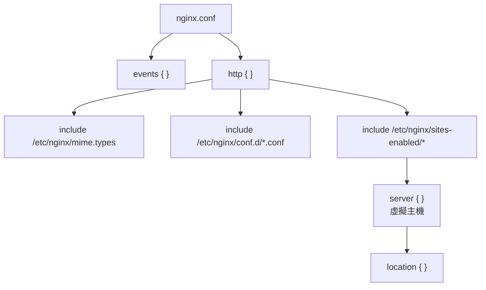

# Nginx 安裝與目錄結構

> [!abstract] 這篇你會學到
> - 分辨**三種安裝來源**（發行版／官方／MyGuard）與各自的取捨
> - 理解 **Nginx 的目錄結構與設定檔載入順序**
> - 掌握 **`sites-available` / `sites-enabled`** 的慣例（以及它其實不是必然）
> - 學會 **`nginx -t` 與 `nginx -T`** 這兩個最重要的除錯指令
> - 完成**第一次啟動就該做對的六項設定**
> - 知道**編譯了哪些模組**與如何確認

## 前置知識

- [[060-02-01-guide-Web-Web伺服器概論]] — 反向代理與整體架構
- [[020-01-14-guide-Linux-套件管理]] — apt / dnf 的操作

---

## 三種安裝來源

| 來源 | 版本 | 模組 | 適合 |
| --- | --- | --- | --- |
| **發行版套件庫** | **穩定但較舊** | 發行版打包的常用模組 | **一般用途、求穩定** |
| **Nginx 官方套件庫** | **stable 或 mainline** | 官方模組 | 需要新版功能 |
| **MyGuard 套件庫** | **mainline + 每日重建** | **HTTP/3、kTLS、Brotli、Zstd、ModSecurity v3、100+ 動態模組** | 需要 WAF、HTTP/3、`autocert` |

### 方式一：發行版套件庫（最簡單）

```bash
$ sudo apt update
$ sudo apt install -y nginx
$ nginx -v
nginx version: nginx/1.24.0 (Ubuntu)

$ systemctl status nginx
● nginx.service - A high performance web server and a reverse proxy server
     Loaded: loaded (/usr/lib/systemd/system/nginx.service; enabled)
     Active: active (running)
```

> [!info]- Rocky / AlmaLinux（RHEL 系）對照
> ```bash
> $ sudo dnf install -y nginx
> $ sudo systemctl enable --now nginx
>
> # ★ RHEL 系預設啟用 SELinux，反向代理要額外開權限
> $ sudo setsebool -P httpd_can_network_connect 1
> $ sudo setsebool -P httpd_can_network_relay 1        # 若做反向代理
>
> # ★ 防火牆用 firewalld
> $ sudo firewall-cmd --permanent --add-service=http
> $ sudo firewall-cmd --permanent --add-service=https
> $ sudo firewall-cmd --reload
> ```
>
> **RHEL 系的目錄結構也不同**（見下方對照表）。

### 方式二：Nginx 官方套件庫

```bash
$ sudo apt install -y curl gnupg2 ca-certificates lsb-release ubuntu-keyring

# 匯入官方簽章金鑰
$ curl https://nginx.org/keys/nginx_signing.key | gpg --dearmor \
    | sudo tee /usr/share/keyrings/nginx-archive-keyring.gpg >/dev/null

# ★ 驗證金鑰指紋（官方公布的是 573BFD6B3D8FBC641079A6ABABF5BD827BD9BF62）
$ gpg --dry-run --quiet --no-keyring --import --import-options import-show \
    /usr/share/keyrings/nginx-archive-keyring.gpg

# 加入套件庫（stable 或 mainline 二選一）
$ echo "deb [signed-by=/usr/share/keyrings/nginx-archive-keyring.gpg] \
http://nginx.org/packages/ubuntu $(lsb_release -cs) nginx" \
  | sudo tee /etc/apt/sources.list.d/nginx.list
# mainline 改成：http://nginx.org/packages/mainline/ubuntu

# 設定優先使用官方套件
$ echo -e "Package: *\nPin: origin nginx.org\nPin: release o=nginx\nPin-Priority: 900\n" \
  | sudo tee /etc/apt/preferences.d/99nginx

$ sudo apt update && sudo apt install -y nginx
```

> [!warning] 官方套件的目錄結構與發行版不同
> ```
> 發行版：/etc/nginx/sites-available/ + sites-enabled/
> 官方：  【沒有 sites-available】，只有 /etc/nginx/conf.d/
> ```
> 詳見下方目錄對照表。

### 方式三：MyGuard 套件庫（強化版）

> [!tip] 什麼時候值得用
> ```
> ✓ 需要【ModSecurity v3】但不想自己編譯
> ✓ 需要 HTTP/3（QUIC）
> ✓ 想用【autocert】自動申請與續期憑證（不用 certbot）
> ✓ 需要 Brotli / Zstandard 壓縮
> ✓ 需要大量動態模組
> ```

```bash
# ★★ 動筆前請到 https://deb.myguard.nl/how-to-use/
#    確認【當前的套件庫路徑、簽章金鑰與支援的 codename】
#    以下為示意流程，實際指令請依官方頁面

$ sudo apt install -y curl ca-certificates gnupg lsb-release

# 【1】匯入簽章金鑰（★ 路徑與金鑰請依官方頁面）
$ curl -fsSL <官方公布的金鑰網址> \
    | sudo gpg --dearmor -o /usr/share/keyrings/myguard-archive-keyring.gpg

# 【2】加入套件庫（★ 路徑請依官方頁面）
$ echo "deb [signed-by=/usr/share/keyrings/myguard-archive-keyring.gpg] \
<官方公布的套件庫網址> $(lsb_release -cs) main" \
  | sudo tee /etc/apt/sources.list.d/myguard.list

$ sudo apt update

# 【3】查看可用的套件與版本
$ apt-cache policy nginx
$ apt list -a nginx angie 2>/dev/null

# 【4】安裝
$ sudo apt install -y nginx
# 或安裝 Angie（Nginx 的分支）
# $ sudo apt install -y angie
```

> [!danger] 使用第三方套件庫的必要防護
> ```
> ① 【驗證簽章金鑰的指紋】（不要盲目匯入）
> ② 【固定版本】避免自動更新造成非預期的行為變更：
>    $ sudo apt-mark hold nginx
> ③ 【訂閱該套件庫的公告】
> ④ 【保留退回官方套件的方案】
> ⑤ 【確認機關的採購與資安規範是否允許第三方來源】
> ⑥ 部署前【在測試環境驗證】
> ```
>
> 見 [[090-07-11-guide-資安實踐-委外與供應鏈資安]] 與 [[020-02-03-03-cmd-標準化-第三方APT套件庫實務]]。

---

## 目錄結構

### Ubuntu / Debian（發行版套件）

```
/etc/nginx/
├── nginx.conf                  ★ 主設定檔（載入其他所有設定）
├── conf.d/                     ★ 全域片段（http 區塊層級）
│   └── *.conf                  （會被 nginx.conf 的 include 載入）
├── sites-available/            ★ 【所有】虛擬主機設定（可用）
│   ├── default
│   └── example.gov.tw
├── sites-enabled/              ★ 【已啟用】的（符號連結到 sites-available）
│   └── example.gov.tw -> ../sites-available/example.gov.tw
├── snippets/                   ★ 可重複使用的設定片段
│   ├── fastcgi-php.conf
│   └── snakeoil.conf
├── modules-available/          動態模組設定
├── modules-enabled/            已啟用的動態模組
├── mime.types                  副檔名 → MIME 類型對照
├── fastcgi_params              FastCGI 的標準參數
├── proxy_params                反向代理的標準參數
└── scgi_params / uwsgi_params

/var/www/html/                  預設的網站根目錄
/var/log/nginx/                 ★ 日誌
├── access.log
└── error.log
/run/nginx.pid                  PID 檔
/usr/share/nginx/               預設的靜態資源（錯誤頁等）
```

### RHEL 系 / Nginx 官方套件

```
/etc/nginx/
├── nginx.conf
├── conf.d/                     ★ 【虛擬主機直接放這裡】
│   └── example.gov.tw.conf
├── default.d/                  （RHEL 系特有）
├── mime.types
└── fastcgi_params

/usr/share/nginx/html/          ★ 預設的網站根目錄（不是 /var/www/html）
/var/log/nginx/
```

> [!warning] 三個常見的目錄差異陷阱
> | 項目 | Ubuntu 發行版 | RHEL / 官方套件 |
> | --- | --- | --- |
> | 虛擬主機位置 | **`sites-available/` + `sites-enabled/`** | **`conf.d/*.conf`** |
> | 預設 web root | `/var/www/html` | **`/usr/share/nginx/html`** |
> | 執行使用者 | `www-data` | **`nginx`** |
>
> **照網路教學抄設定時，這三個地方最容易出錯。**

### `sites-available` 其實不是 Nginx 的機制

> [!tip] 這是 Debian 的打包慣例，不是 Nginx 本身的功能
> **它能運作，完全是因為 `nginx.conf` 裡有這一行**：
> ```nginx
> include /etc/nginx/sites-enabled/*;
> ```
>
> **所以**：
> - 官方套件沒有這個結構，因為它的 `nginx.conf` 只 include `conf.d/*.conf`
> - **你可以自己建立這個結構**（只要加上 include）
> - **也可以完全不用**（直接把設定放 `conf.d/`）
>
> **建議**：
> ```
> 【Ubuntu 發行版套件】→ 沿用 sites-available/sites-enabled（符合慣例）
> 【官方或 MyGuard 套件】→ 用 conf.d/（沿用它的慣例）
> ★ 重點是【團隊統一】，不要一台一個樣
> ```

### 設定檔的載入順序



```nginx
# /etc/nginx/nginx.conf 的骨架
user www-data;                      # ← 執行身分（★ 全域，只能出現在最外層）
worker_processes auto;
pid /run/nginx.pid;
include /etc/nginx/modules-enabled/*.conf;

events {                            # ← 連線處理
    worker_connections 768;
}

http {                              # ← ★ 幾乎所有 Web 設定都在這裡
    sendfile on;
    keepalive_timeout 65;

    include /etc/nginx/mime.types;
    default_type application/octet-stream;

    access_log /var/log/nginx/access.log;
    error_log  /var/log/nginx/error.log;

    gzip on;

    include /etc/nginx/conf.d/*.conf;        # ← 全域片段
    include /etc/nginx/sites-enabled/*;      # ← 虛擬主機
}

# stream { }                        # ← TCP/UDP 代理（與 http 平行，不常用）
```

> [!danger] 指令的「作用區塊」很重要
> ```
> user、worker_processes、pid    → 只能在【最外層】（main）
> worker_connections             → 只能在 events
> gzip、client_max_body_size     → http / server / location 都可以
> server_name、listen            → 只能在 server
> proxy_pass、try_files          → 只能在 location（proxy_pass 也可在 if）
> ```
>
> **放錯位置的錯誤訊息**：
> ```
> nginx: [emerg] "server" directive is not allowed here in /etc/nginx/conf.d/x.conf:1
> ```
> 通常是因為**把 `server { }` 直接寫在 `http { }` 之外**，
> 或**設定檔被 include 到了錯誤的層級**。

---

## 兩個最重要的指令

### `nginx -t`：語法檢查

```bash
$ sudo nginx -t
nginx: the configuration file /etc/nginx/nginx.conf syntax is ok
nginx: configuration file /etc/nginx/nginx.conf test is successful
```

> [!danger] 改完設定「一定」要先 `nginx -t` 再 reload
> ```bash
> # ❌ 危險：設定有錯會導致服務起不來
> $ sudo systemctl restart nginx
>
> # ✅ 正確
> $ sudo nginx -t && sudo systemctl reload nginx
> ```
>
> **`reload` 與 `restart` 的差別**：
> | | `reload` | `restart` |
> | --- | --- | --- |
> | 做什麼 | **平順地重新載入設定** | 停止再啟動 |
> | 現有連線 | **不中斷**（舊 worker 處理完才退出） | **中斷** |
> | 設定有錯時 | **保持舊設定繼續運作** | **服務起不來** |
> | 何時必須用 restart | 換執行使用者、改 PID 路徑、升級主程式 | — |
>
> **日常一律用 `reload`。**

### `nginx -T`：顯示「完整展開」的設定

```bash
$ sudo nginx -T | less
# 會把所有 include 的內容【全部展開】顯示

# ===== 實用組合 =====
# 找出所有 server_name（有哪些虛擬主機）
$ sudo nginx -T 2>/dev/null | grep -E '^\s*server_name' | sort -u

# 找出某個設定是在哪個檔案定義的
$ sudo nginx -T 2>/dev/null | grep -B30 'client_max_body_size' | grep '# configuration file'

# 找出所有 root 指令（web root 在哪）
$ sudo nginx -T 2>/dev/null | grep -E '^\s*root '

# 檢查某個設定有沒有生效
$ sudo nginx -T 2>/dev/null | grep -c 'server_tokens off'
```

> [!tip] `nginx -T` 是排錯的第一步
> **「我明明設定了，為什麼沒生效？」**
> 90% 的情況是：
> - 設定檔沒有被 include（不在 `sites-enabled/` 或 `conf.d/`）
> - **被後面的設定覆蓋了**
> - 放在錯誤的區塊層級
> - **有多個 server 區塊，實際比對到的不是你以為的那個**
>
> **`nginx -T` 一次看清楚所有生效的設定。**

### 其他常用指令

```bash
$ nginx -v                       # 版本
$ nginx -V                       # ★ 版本 + 編譯參數 + 已編譯的模組
$ nginx -s reload                # 重新載入設定
$ nginx -s reopen                # 重新開啟日誌檔（logrotate 用）
$ nginx -s quit                  # 平順關閉（處理完現有連線）
$ nginx -s stop                  # 立即關閉
$ nginx -c /path/to/nginx.conf   # 指定設定檔
$ nginx -p /path/to/prefix       # 指定前綴路徑
```

### 確認編譯了哪些模組

```bash
$ nginx -V 2>&1 | tr ' ' '\n' | grep -E '^--with|^--add' | sort
--with-http_ssl_module
--with-http_v2_module
--with-http_realip_module
--with-http_gzip_static_module
--with-http_stub_status_module
...

# 檢查是否支援 HTTP/3
$ nginx -V 2>&1 | grep -o 'http_v3_module' || echo "不支援 HTTP/3"

# 檢查是否有 ModSecurity
$ nginx -V 2>&1 | grep -o 'modsecurity' || echo "無 ModSecurity"

# 檢查是否有 Brotli
$ nginx -V 2>&1 | grep -o 'brotli' || echo "無 Brotli"

# 動態模組（如果有）
$ ls /etc/nginx/modules-enabled/ 2>/dev/null
$ ls /usr/lib/nginx/modules/ 2>/dev/null
```

> [!warning] 發行版套件通常沒有 ModSecurity 與 HTTP/3
> ```
> Ubuntu 24.04 的 nginx 1.24：
>   ✓ HTTP/2、SSL、realip、gzip_static
>   ✗ 【HTTP/3】
>   ✗ 【ModSecurity】
>   ✗ 【Brotli】
> ```
>
> **需要這些功能時的三個選擇**：
> ```
> ① 用 MyGuard 套件庫（最省事）
> ② 用發行版的動態模組套件（如 libnginx-mod-http-*）
> ③ 自己編譯（最麻煩但最可控）
> ```

---

## 第一次啟動就該做對的六項設定

```bash
$ sudo cp /etc/nginx/nginx.conf /etc/nginx/nginx.conf.orig     # ★ 先備份
$ sudo vim /etc/nginx/nginx.conf
```

```nginx
user www-data;

# ═══ ① worker 設定 ═══
worker_processes auto;              # ★ 自動 = CPU 核心數
worker_rlimit_nofile 65535;         # ★ 提高檔案描述符上限

pid /run/nginx.pid;
include /etc/nginx/modules-enabled/*.conf;

events {
    worker_connections 4096;        # ★ 每個 worker 的最大連線數
    multi_accept on;                # 一次接受多個新連線
    use epoll;                      # Linux 上最有效率的事件模型
}

http {
    # ═══ ② 隱藏版本資訊（安全）═══
    server_tokens off;              # ★★ 必設

    # ═══ ③ 基本效能 ═══
    sendfile on;                    # 零複製傳輸靜態檔
    tcp_nopush on;                  # 配合 sendfile，減少封包數
    tcp_nodelay on;                 # 小封包不延遲
    keepalive_timeout 65;
    keepalive_requests 1000;
    types_hash_max_size 2048;

    # ═══ ④ 上傳與緩衝區大小 ═══
    client_max_body_size 20m;       # ★ 上傳檔案的大小上限
    client_body_buffer_size 128k;
    client_header_buffer_size 4k;
    large_client_header_buffers 4 16k;

    # ═══ ⑤ 逾時（防 Slowloris）═══
    client_body_timeout 12s;
    client_header_timeout 12s;
    send_timeout 10s;
    reset_timedout_connection on;

    include /etc/nginx/mime.types;
    default_type application/octet-stream;

    # ═══ ⑥ 日誌格式（★ 加上後端處理時間，排錯必備）═══
    log_format main '$remote_addr - $remote_user [$time_local] '
                    '"$request" $status $body_bytes_sent '
                    '"$http_referer" "$http_user_agent" '
                    'rt=$request_time uct="$upstream_connect_time" '
                    'uht="$upstream_header_time" urt="$upstream_response_time"';

    access_log /var/log/nginx/access.log main;
    error_log  /var/log/nginx/error.log warn;

    # ═══ 壓縮 ═══
    gzip on;
    gzip_vary on;
    gzip_proxied any;
    gzip_comp_level 6;
    gzip_min_length 256;
    gzip_types
        text/plain text/css text/xml text/javascript
        application/json application/javascript application/xml+rss
        application/atom+xml image/svg+xml font/woff font/woff2;

    include /etc/nginx/conf.d/*.conf;
    include /etc/nginx/sites-enabled/*;
}
```

> [!tip] 日誌格式加上 `$request_time` 與 `$upstream_*_time` 極為重要
> ```
> rt=1.234              ← 【Nginx 處理這個請求的總時間】
> uct=0.001             ← 連到後端花了多久
> uht=1.230             ← 【後端回傳「標頭」花了多久 = 後端處理時間】
> urt=1.231             ← 後端完整回應花了多久
> ```
>
> **排錯時的判讀**：
> ```
> rt 高、uht 低  → 【問題在 Nginx 或網路】（傳輸大檔？客戶端很慢？）
> rt 高、uht 高  → 【問題在後端】（PHP 慢？資料庫慢？）
> uct 高         → 【連不上後端】（PHP-FPM 滿了？）
> ```
>
> **沒有這幾個欄位，你只能猜。**

```bash
$ sudo nginx -t && sudo systemctl reload nginx
```

### 移除預設站台

```bash
# ===== Ubuntu 發行版 =====
$ sudo rm /etc/nginx/sites-enabled/default
# 或保留但改成「拒絕未比對到的請求」（見下方）

# ===== 官方 / RHEL 套件 =====
$ sudo mv /etc/nginx/conf.d/default.conf /etc/nginx/conf.d/default.conf.disabled
```

> [!danger] 一定要有「預設拒絕」的 server 區塊
> **問題**：如果有人用 IP 或未設定的網域直接連進來，
> Nginx 會用**第一個 server 區塊**回應 ——
> 這可能洩漏你不想公開的網站。
>
> ```nginx
> # /etc/nginx/conf.d/00-default-deny.conf
> # ★ 檔名用 00- 開頭確保它是第一個載入的
>
> server {
>     listen 80 default_server;
>     listen [::]:80 default_server;
>     server_name _;
>     return 444;                  # ★ 444 = 直接關閉連線，不回應任何內容
> }
>
> server {
>     listen 443 ssl default_server;
>     listen [::]:443 ssl default_server;
>     server_name _;
>     # 需要一組憑證才能完成 TLS 交握（用自簽的即可）
>     ssl_certificate     /etc/ssl/certs/ssl-cert-snakeoil.pem;
>     ssl_certificate_key /etc/ssl/private/ssl-cert-snakeoil.key;
>     ssl_reject_handshake on;     # ★ Nginx 1.19.4+：直接拒絕 TLS 交握
>     return 444;
> }
> ```
>
> **效果**：
> ```bash
> $ curl -I http://伺服器IP/
> curl: (52) Empty reply from server        ← 連線被直接關閉
> ```

---

## 完整實戰範例

### 建立第一個虛擬主機

```bash
# ========== 【1】建立網站目錄 ==========
$ sudo mkdir -p /var/www/example.gov.tw/public
$ sudo tee /var/www/example.gov.tw/public/index.html > /dev/null <<'EOF'
<!DOCTYPE html>
<html lang="zh-Hant">
<head><meta charset="utf-8"><title>測試站台</title></head>
<body><h1>example.gov.tw 運作中</h1></body>
</html>
EOF
$ sudo chown -R www-data:www-data /var/www/example.gov.tw
$ sudo find /var/www/example.gov.tw -type d -exec chmod 755 {} \;
$ sudo find /var/www/example.gov.tw -type f -exec chmod 644 {} \;

# ========== 【2】建立設定檔 ==========
$ sudo tee /etc/nginx/sites-available/example.gov.tw > /dev/null <<'EOF'
server {
    listen 80;
    listen [::]:80;
    server_name example.gov.tw www.example.gov.tw;

    # ★ web root 指向 public 子目錄
    root /var/www/example.gov.tw/public;
    index index.html index.htm;

    # 獨立的日誌（★ 方便排錯與分析）
    access_log /var/log/nginx/example.gov.tw.access.log main;
    error_log  /var/log/nginx/example.gov.tw.error.log warn;

    location / {
        try_files $uri $uri/ =404;
    }

    # ★ 拒絕存取隱藏檔
    location ~ /\.(?!well-known) {
        deny all;
        return 404;
    }

    # 健康檢查端點（給監控用）
    location = /health {
        access_log off;
        add_header Content-Type text/plain;
        return 200 "ok\n";
    }
}
EOF

# ========== 【3】啟用 ==========
$ sudo ln -s /etc/nginx/sites-available/example.gov.tw \
             /etc/nginx/sites-enabled/example.gov.tw

# ========== 【4】驗證並重載 ==========
$ sudo nginx -t
nginx: configuration file /etc/nginx/nginx.conf test is successful
$ sudo systemctl reload nginx

# ========== 【5】測試 ==========
$ curl -H "Host: example.gov.tw" http://127.0.0.1/
<!DOCTYPE html>...

$ curl -H "Host: example.gov.tw" http://127.0.0.1/health
ok

# 測試預設拒絕
$ curl -I http://127.0.0.1/
curl: (52) Empty reply from server        ← ✓ 444 生效
```

### 設定檔的版控與備份

```bash
# ========== 把 /etc/nginx 納入 Git ==========
$ cd /etc/nginx
$ sudo git init
$ sudo tee .gitignore > /dev/null <<'EOF'
# 不要提交私鑰與敏感檔案
*.key
*.pem
ssl/private/
.htpasswd
*.log
EOF
$ sudo git add -A
$ sudo git commit -m "chore(nginx): 初始化設定檔版控（$(hostname)）"
$ sudo chmod 700 /etc/nginx/.git         # ★ 保護

# ========== 每次改設定的流程 ==========
$ sudo vim /etc/nginx/sites-available/example.gov.tw
$ sudo nginx -t                          # ★ 先驗證
$ cd /etc/nginx && sudo git diff         # ★ 看改了什麼
$ sudo git add -A
$ sudo git commit -m "feat(nginx): 為 example.gov.tw 新增 API 反向代理

需求單號：#1234
影響：僅 /api/ 路徑
回退：git revert <此提交> && sudo nginx -s reload"
$ sudo systemctl reload nginx

# ========== 改壞了快速還原 ==========
$ cd /etc/nginx
$ sudo git diff                          # 看目前改了什麼
$ sudo git restore sites-available/example.gov.tw    # 丟棄未提交的修改
$ sudo nginx -t && sudo systemctl reload nginx
```

> [!tip] 更保險：改設定前先建立自動還原的保險
> ```bash
> # 15 分鐘後自動還原（萬一改壞了連不上）
> $ echo "cd /etc/nginx && git checkout . && systemctl reload nginx" \
>     | sudo at now + 15 minutes
>
> # 確認沒問題後取消
> $ sudo atq
> $ sudo atrm <job-id>
> ```

### 環境檢查腳本

```bash
#!/usr/bin/env bash
# Nginx 安裝後檢查
PASS=0; FAIL=0
chk() { if eval "$2" >/dev/null 2>&1; then echo "  ✓ $1"; PASS=$((PASS+1));
        else echo "  ✗ $1"; FAIL=$((FAIL+1)); fi; }

echo "═══ Nginx 環境檢查 $(hostname) ═══"
echo -e "\n【基本】"
chk "nginx 已安裝"           "command -v nginx"
chk "服務執行中"             "systemctl is-active --quiet nginx"
chk "已設定開機啟動"         "systemctl is-enabled --quiet nginx"
chk "設定語法正確"           "nginx -t"

echo -e "\n【安全】"
chk "server_tokens off"      "nginx -T 2>/dev/null | grep -q 'server_tokens off'"
chk "有 default_server 拒絕未知網域" \
    "nginx -T 2>/dev/null | grep -q 'default_server'"
chk "拒絕隱藏檔存取"         "nginx -T 2>/dev/null | grep -qE 'location ~ /\\\\\\.'"

echo -e "\n【效能】"
chk "sendfile on"            "nginx -T 2>/dev/null | grep -q 'sendfile on'"
chk "gzip on"                "nginx -T 2>/dev/null | grep -q 'gzip on'"
chk "worker_processes auto"  "nginx -T 2>/dev/null | grep -q 'worker_processes auto'"

echo -e "\n【日誌】"
chk "日誌格式含 request_time" \
    "nginx -T 2>/dev/null | grep -q 'request_time'"
chk "有 logrotate 設定"      "[ -f /etc/logrotate.d/nginx ]"

echo -e "\n【模組】"
for m in http_ssl_module http_v2_module http_realip_module http_gzip_static_module; do
  nginx -V 2>&1 | grep -q "$m" && echo "  ✓ $m" || echo "  · $m（未編譯）"
done
for m in http_v3_module modsecurity brotli; do
  nginx -V 2>&1 | grep -q "$m" && echo "  ✓ $m" || echo "  · $m（未編譯）"
done

echo -e "\n【資訊】"
echo "  版本：$(nginx -v 2>&1 | cut -d/ -f2)"
echo "  執行身分：$(nginx -T 2>/dev/null | grep -m1 '^user' | awk '{print $2}' | tr -d ';')"
echo "  worker 數：$(pgrep -c -f 'nginx: worker')"
echo "  虛擬主機："
nginx -T 2>/dev/null | grep -E '^\s*server_name' | sort -u | sed 's/^/    /'

echo -e "\n通過 $PASS / 未通過 $FAIL"
```

---

## 常見錯誤與排錯

| 現象／錯誤 | 原因 | 解法 |
| --- | --- | --- |
| **`Address already in use`** | 80/443 被別的服務佔用 | `sudo ss -tlnp \| grep :80`；停用 Apache 或改埠 |
| **`nginx -t` 說 `server directive is not allowed here`** | server 區塊在錯誤的層級 | 確認設定檔被 include 到 `http { }` 內 |
| **設定改了沒生效** | 沒 reload / 沒被 include / 被覆蓋 | **`nginx -T` 看完整展開的設定** |
| 新增的虛擬主機沒作用 | 沒有建立 `sites-enabled` 的符號連結 | `ln -s ../sites-available/xxx sites-enabled/` |
| **用 IP 連進來看到別的網站** | 沒有 `default_server` | 加上 `default_server` + `return 444` |
| 403 Forbidden | 權限或 web root 不存在 | 檢查 `root` 路徑；`chown www-data`；父目錄要有 `x` 權限 |
| **RHEL 上反向代理 502** | **SELinux 阻擋** | `setsebool -P httpd_can_network_connect 1` |
| 照教學抄設定但路徑不對 | **發行版 vs 官方套件的目錄不同** | 對照本篇的目錄表；用 `nginx -T` 確認實際路徑 |
| **`restart` 之後服務起不來** | 設定有錯 | **一律先 `nginx -t`**；用 `reload` 而非 `restart` |
| 上傳大檔失敗（413） | `client_max_body_size` 太小 | 調高（並同步調整 PHP 的 `upload_max_filesize`） |
| **日誌看不出效能問題在哪** | 日誌格式太陽春 | 加上 `$request_time` 與 `$upstream_*_time` |
| 沒有 ModSecurity / HTTP/3 | 發行版套件沒編譯 | 用 MyGuard 套件庫、動態模組，或自行編譯 |
| **改壞設定後連不上機器** | 沒有保險機制 | 改設定前用 `at` 排定自動還原 |

---

## 安全性注意事項

> [!danger] 安裝完成後立刻該做的五件事
> ```
> ① 【server_tokens off】               隱藏版本
> ② 【default_server + return 444】     拒絕未知網域
> ③ 【拒絕隱藏檔】location ~ /\.        防 .git / .env 外洩
> ④ 【web root 指向 public 子目錄】     防設定檔外洩
> ⑤ 【防火牆只開 80/443】               縮小攻擊面
> ```

> [!warning] `/etc/nginx` 納入版控的注意事項
> ```
> □ 【.gitignore 排除 *.key、*.pem、ssl/private/】
> □ 【chmod 700 /etc/nginx/.git】
> □ 【不要放進 web root】（`.git` 會被下載）
> □ 若推到遠端，遠端必須是【私有】的
> ```
>
> **設定檔中若有 `.htpasswd` 或 API 金鑰，也要排除。**

> [!tip] 第三方套件庫的供應鏈風險
> **使用 MyGuard 或任何第三方套件庫時**：
> ```
> ① 【驗證簽章金鑰的指紋】（與官方頁面公布的比對）
> ② 【固定版本】：sudo apt-mark hold nginx
> ③ 【訂閱該套件庫的資安公告】
> ④ 【測試環境先驗證】再上正式
> ⑤ 【保留回退方案】（記錄如何切回官方套件）
> ⑥ 【確認機關規範允許】
> ```
>
> **Web 伺服器是對外開放的元件** ——
> 一旦套件庫被投毒，影響是直接且全面的。
> 見 [[090-07-11-guide-資安實踐-委外與供應鏈資安]]。

> [!danger] 執行使用者不要用 root
> ```nginx
> user www-data;          # ✅ Ubuntu
> user nginx;             # ✅ RHEL
> # user root;            # ❌ 絕對不要
> ```
>
> **master 程序會以 root 執行**（為了綁定 <1024 的埠），
> 但 **worker 程序必須降權** ——
> 這樣即使 worker 被攻破，攻擊者也只有 `www-data` 的權限。
>
> ```bash
> $ ps -ef | grep nginx
> root      1234     1  nginx: master process /usr/sbin/nginx
> www-data  1235  1234  nginx: worker process        ← ✓ 已降權
> www-data  1236  1234  nginx: worker process
> ```

---

## 速查表

### 三種安裝來源

| 來源 | 版本 | 特色 |
| --- | --- | --- |
| 發行版 | 穩定較舊 | 最簡單、無 ModSecurity/HTTP3 |
| 官方套件庫 | stable/mainline | 新版功能；**目錄結構不同** |
| **MyGuard** | mainline 每日重建 | **ModSecurity v3、HTTP/3、autocert、Brotli** |

### 目錄差異（最常踩的坑）

| | Ubuntu 發行版 | RHEL / 官方套件 |
| --- | --- | --- |
| 虛擬主機 | **`sites-available` + `sites-enabled`** | **`conf.d/*.conf`** |
| web root | `/var/www/html` | **`/usr/share/nginx/html`** |
| 執行身分 | `www-data` | **`nginx`** |

### 兩個最重要的指令

```bash
sudo nginx -t     # ★ 語法檢查（改完一定要跑）
sudo nginx -T     # ★ 顯示【完整展開】的設定（排錯第一步）

# 實用組合
nginx -T | grep -E '^\s*server_name' | sort -u    # 有哪些虛擬主機
nginx -T | grep -E '^\s*root '                    # web root 在哪
```

### reload vs restart

| | reload | restart |
| --- | --- | --- |
| 現有連線 | **不中斷** | 中斷 |
| 設定有錯 | **保持舊設定運作** | **服務起不來** |
| 日常使用 | **★ 用這個** | 只在換使用者/升級時 |

```bash
sudo nginx -t && sudo systemctl reload nginx    # ★ 標準流程
```

### 其他指令

```bash
nginx -v          版本
nginx -V          ★ 版本 + 編譯參數 + 模組
nginx -s reopen   重開日誌檔（logrotate）
nginx -s quit     平順關閉
nginx -c <file>   指定設定檔
```

### 檢查模組

```bash
nginx -V 2>&1 | tr ' ' '\n' | grep -E '^--with|^--add' | sort
nginx -V 2>&1 | grep -o 'http_v3_module'   # HTTP/3
nginx -V 2>&1 | grep -o 'modsecurity'      # WAF
nginx -V 2>&1 | grep -o 'brotli'           # Brotli
```

### 第一次啟動的六項設定

```nginx
① worker_processes auto; worker_rlimit_nofile 65535;
② server_tokens off;                     ★ 安全
③ sendfile/tcp_nopush/tcp_nodelay/keepalive
④ client_max_body_size 20m;
⑤ client_body_timeout 12s;（防 Slowloris）
⑥ log_format 加上 $request_time $upstream_*_time   ★ 排錯必備
```

### 日誌欄位判讀

```
rt=總時間  uct=連線後端  uht=後端處理  urt=後端完整回應

rt 高、uht 低 → Nginx 或網路（傳輸/客戶端慢）
rt 高、uht 高 → 【後端慢】（PHP/DB）
uct 高        → 【連不上後端】（PHP-FPM 滿了）
```

### 預設拒絕（必設）

```nginx
server {
    listen 80 default_server;
    listen 443 ssl default_server;
    server_name _;
    ssl_reject_handshake on;      # Nginx 1.19.4+
    return 444;                   # 直接關閉連線
}
```

### 安裝後五件事

```
① server_tokens off
② default_server + return 444
③ location ~ /\. { deny all; }
④ web root 指向 public/
⑤ 防火牆只開 80/443
```

### 設定檔版控

```bash
cd /etc/nginx && sudo git init
# .gitignore: *.key *.pem ssl/private/ .htpasswd *.log
sudo chmod 700 /etc/nginx/.git         # ★

# 改設定的保險
echo "cd /etc/nginx && git checkout . && systemctl reload nginx" | sudo at now + 15 minutes
```

---

## 練習題

> [!question]- 練習 1：確認你的 Nginx 環境
> 1. 執行本篇的檢查腳本，**通過幾項？**
> 2. `nginx -V` —— **有 HTTP/3 嗎？有 ModSecurity 嗎？**
> 3. `nginx -T | grep -E '^\s*server_name' | sort -u` —— 有哪些虛擬主機？
> 4. **`curl -I http://伺服器IP/`** —— 回傳什麼？
>    （如果看得到某個網站的內容 → 你缺 `default_server`）
> 5. `ps -ef | grep nginx` —— **worker 程序的執行身分是什麼？**
> 6. 檢查日誌格式**有沒有 `$request_time`**

> [!question]- 練習 2：建立虛擬主機並驗證
> 1. 建立一個新的虛擬主機（用測試網域）
> 2. **web root 指向 `public/` 子目錄**
> 3. 在 `public/` 的上一層放一個 `secret.txt`
> 4. **測試 `curl http://測試網域/secret.txt`** —— 拿得到嗎？（應該拿不到）
> 5. 加上健康檢查端點 `/health`
> 6. 加上「拒絕隱藏檔」的 location
> 7. 在 `public/` 放一個 `.env`，**測試能不能下載**

> [!question]- 練習 3：設定檔版控與救援演練
> 1. 把 `/etc/nginx` 納入 Git（記得 `.gitignore` 與 `chmod 700`）
> 2. 提交初始狀態
> 3. **故意改壞一個設定**（例如刪掉一個 `}`）
> 4. `nginx -t` —— 錯誤訊息說什麼？
> 5. 用 `git diff` 找出改了什麼
> 6. 用 `git restore` 還原
> 7. **再試一次，但這次先設定 `at` 的自動還原保險**
> 8. 思考：如果你是遠端操作，改壞了連不上機器，怎麼辦？

---

## 小測驗

Q1. **三種 Nginx 安裝來源的取捨是什麼？什麼情況值得用 MyGuard**？

Q2. **Ubuntu 發行版與官方／RHEL 套件的三個目錄差異是什麼**？

Q3. **`sites-available` / `sites-enabled` 是 Nginx 的功能嗎**？它為什麼能運作？

Q4. **`nginx -t` 與 `nginx -T` 各做什麼？為什麼 `-T` 是排錯的第一步**？

Q5. **`reload` 與 `restart` 有什麼差別？日常該用哪個，為什麼**？

Q6. **日誌格式為什麼要加 `$request_time` 與 `$upstream_*_time`？怎麼判讀**？

Q7. **為什麼一定要設定 `default_server` + `return 444`**？不設會怎樣？

Q8. **Nginx 的 master 與 worker 程序的執行身分為什麼不同**？

Q9. **`/etc/nginx` 納入版控時有哪四項注意事項**？

Q10. **改設定時「改壞了連不上機器」該怎麼預防**？

> [!question]- 測驗答案
> **Q1.** **發行版套件庫**：穩定但版本較舊，模組較少（**通常沒有 ModSecurity、
> HTTP/3、Brotli**），適合一般用途、求穩定；
> **官方套件庫**：可選 stable 或 mainline，版本較新，
> 但**目錄結構與發行版不同**（沒有 `sites-available`）；
> **MyGuard**：mainline 且每日重建，內含 **ModSecurity v3、HTTP/3（QUIC）、
> kTLS、Brotli、Zstandard、autocert 與 100+ 動態模組**。
> **值得用 MyGuard 的情況**：需要 ModSecurity 但不想自己編譯、
> 需要 HTTP/3、想用 `autocert` 自動申請續期憑證（免 certbot）、
> 需要 Brotli/Zstd 壓縮。
>
> **Q2.** ①**虛擬主機位置**：Ubuntu 發行版用
> **`sites-available/` + `sites-enabled/`**，
> 官方／RHEL 用 **`conf.d/*.conf`**；
> ②**預設 web root**：`/var/www/html` vs **`/usr/share/nginx/html`**；
> ③**執行使用者**：`www-data` vs **`nginx`**。
> 照網路教學抄設定時，這三個地方最容易出錯。
>
> **Q3.** **不是**。它是 **Debian 的打包慣例**，不是 Nginx 本身的功能。
> 它能運作，完全是因為發行版的 `nginx.conf` 裡有一行
> **`include /etc/nginx/sites-enabled/*;`**。
> 所以官方套件沒有這個結構（它只 include `conf.d/*.conf`），
> 而你**可以自己建立這個結構**（只要加上 include），
> **也可以完全不用**（直接把設定放 `conf.d/`）。
> 重點是**團隊統一**，不要一台一個樣。
>
> **Q4.** **`nginx -t`** 做**語法檢查**（不套用，只驗證設定檔是否正確）；
> **`nginx -T`** 顯示**「完整展開」的設定**
> （把所有 `include` 的內容全部展開列出）。
> **`-T` 是排錯第一步**，因為「我明明設定了為什麼沒生效」
> 有 90% 的原因是：設定檔沒有被 include、**被後面的設定覆蓋了**、
> 放在錯誤的區塊層級、或**有多個 server 區塊而實際比對到的不是你以為的那個** ——
> `nginx -T` 一次看清楚所有實際生效的設定。
>
> **Q5.** **`reload`** 是**平順地重新載入設定**：
> **現有連線不中斷**（舊 worker 處理完才退出），
> 而且**設定有錯時會保持舊設定繼續運作**；
> **`restart`** 是停止再啟動：**現有連線中斷**，
> 且**設定有錯時服務會起不來**。
> **日常一律用 `reload`**（標準流程是 `nginx -t && systemctl reload nginx`），
> 只有在換執行使用者、改 PID 路徑、升級主程式時才需要 `restart`。
>
> **Q6.** 因為預設的日誌格式**看不出效能問題出在哪一層**。
> 四個欄位：`rt` = Nginx 處理該請求的總時間；
> `uct` = 連到後端花的時間；
> **`uht` = 後端回傳標頭的時間（= 後端處理時間）**；
> `urt` = 後端完整回應的時間。
> **判讀**：
> **`rt` 高但 `uht` 低** → 問題在 Nginx 或網路（傳輸大檔、客戶端慢）；
> **`rt` 高且 `uht` 高** → **問題在後端**（PHP 慢、資料庫慢）；
> **`uct` 高** → **連不上後端**（PHP-FPM 處理程序滿了）。
> 沒有這幾個欄位，你只能猜。
>
> **Q7.** 因為**如果有人用 IP 或未設定的網域直接連進來，
> Nginx 會用「第一個 server 區塊」回應** ——
> 這可能**洩漏你不想公開的內部網站**
> （例如管理後台剛好是第一個載入的設定）。
> 設定 `default_server` 並 `return 444`（直接關閉連線不回應任何內容），
> 就能確保只有帶正確 `Host` 標頭的請求才拿得到內容。
> HTTPS 的部分還可加 `ssl_reject_handshake on;`（Nginx 1.19.4+）直接拒絕交握。
>
> **Q8.** 因為**master 程序需要 root 權限才能綁定 1024 以下的埠**（80、443），
> 但**worker 程序（實際處理請求的）必須降權為 `www-data` 或 `nginx`** ——
> 這樣**即使 worker 被攻破（例如透過某個模組的弱點），
> 攻擊者也只有一般使用者的權限**，無法直接取得整台機器的控制權。
> 可用 `ps -ef | grep nginx` 確認 worker 確實已降權。
>
> **Q9.** ①**`.gitignore` 排除私鑰與敏感檔案**
> （`*.key`、`*.pem`、`ssl/private/`、`.htpasswd`、`*.log`）；
> ②**`chmod 700 /etc/nginx/.git`**（否則任何使用者都能讀取歷史）；
> ③**不要放進 web root**（`.git` 目錄會被下載）；
> ④**若推到遠端，遠端必須是私有的**。
>
> **Q10.** **在改設定之前，先用 `at` 排定一個自動還原的保險**：
> ```bash
> echo "cd /etc/nginx && git checkout . && systemctl reload nginx" \
>   | sudo at now + 15 minutes
> ```
> 這樣即使改壞了導致連不上，**15 分鐘後系統會自動還原**。
> 確認新設定沒問題後，用 `sudo atq` 找到工作編號、`sudo atrm <id>` 取消保險。
> 另外的基本原則：**一律先 `nginx -t` 驗證再 `reload`**（不要用 `restart`），
> 並把 `/etc/nginx` 納入 Git 以便快速比對與還原。

---

## 延伸閱讀

- [[060-02-02-02-guide-Nginx-設定語法與虛擬主機]] — 下一步：設定檔語法與 server 區塊
- [[060-02-02-03-guide-Nginx-location與rewrite]] — 路由規則
- [[060-02-02-06-guide-Nginx-HTTPS與Certbot]] — 憑證與 HTTPS
- [[060-02-02-09-guide-Nginx-安全設定]] — 完整的安全加固
- [[060-02-01-guide-Web-Web伺服器概論]] — 整體架構與選型
- [[020-02-03-03-cmd-標準化-第三方APT套件庫實務]] — MyGuard 等第三方套件庫
- [[060-01-01-01-guide-Git-觀念與初次設定]] — 設定檔版控
