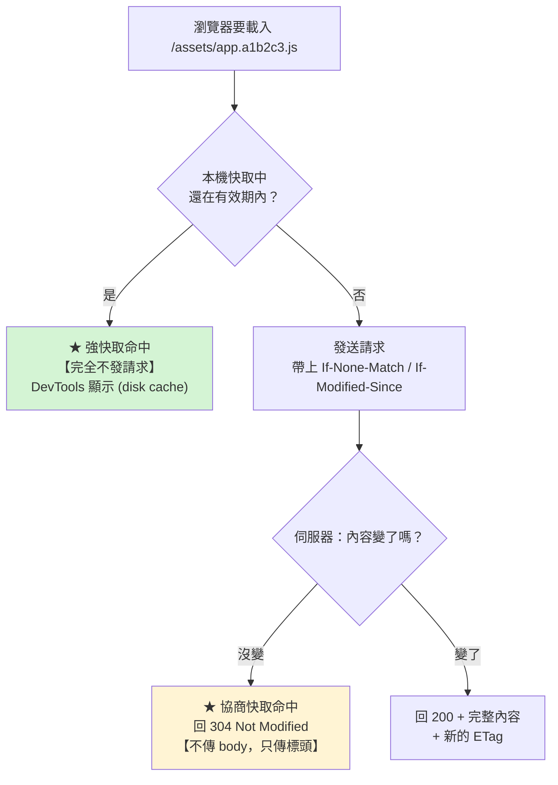

# Nginx 靜態資源與快取

> [!abstract] 這篇你會學到
> - 分清 **強快取（Cache-Control）與協商快取（ETag / Last-Modified）**
> - 為 Vue / Nuxt 的**帶 hash 資源**與 **index.html** 設定正確的快取策略
> - 設定 **gzip 與 brotli / zstd** 壓縮（含 MyGuard 的擴充模組）
> - 用 **`proxy_cache`** 快取後端的動態回應，讓 QPS 提升數十倍
> - 正確地**清除快取**（purge）與**避免快取雪崩**
> - 用 `sendfile` / `tcp_nopush` / `open_file_cache` 榨出靜態檔效能

## 前置知識

- [[060-02-02-03-guide-Nginx-location與rewrite]] — location 比對規則
- [[060-02-02-04-guide-Nginx-反向代理與負載平衡]] — proxy_pass 與 upstream

---

## 快取的兩種機制



| 機制 | 標頭 | 效果 | 代價 |
| --- | --- | --- | --- |
| **強快取** | `Cache-Control: max-age=...` / `Expires` | **完全不發請求**（最快） | 內容變了也拿不到新的 |
| **協商快取** | `ETag` / `Last-Modified` | 發請求但**只回 304**（省頻寬） | 仍有一次 RTT |

> [!danger] 快取策略錯誤的兩種災難
> **災難 A：該快取的沒快取**
> ```
> 帶 hash 的 JS/CSS 每次都重新下載
>   → 首頁載入 3MB → 使用者抱怨慢 → 頻寬爆掉
> ```
>
> **災難 B：不該快取的被快取（★ 更嚴重）**
> ```
> index.html 被設成 max-age=31536000
>   → 你部署了新版本
>     → 使用者的瀏覽器【一年內】都拿不到新版
>       → 舊的 index.html 引用了【已經被刪掉的】 app.OLD.js
>         → 【網站完全白畫面】
>           → 而且你叫使用者「清快取」也沒用（CDN 也快取了）
> ```
> **這是真實會發生、而且極難補救的事故。**

---

## 前端資源的正確快取策略 ★★★

### 核心原則：依「檔名有沒有 hash」分兩類

```
【帶 hash 的檔案】app.a1b2c3d4.js、style.9f8e7d.css、logo.5c4b3a.png
  → 內容改變 = 檔名改變 = 網址改變
  → 【可以放心永久快取】Cache-Control: public, max-age=31536000, immutable

【不帶 hash 的入口】index.html、200.html、sw.js、manifest.json
  → 網址永遠不變，內容會變
  → 【絕對不能快取】Cache-Control: no-store, no-cache, must-revalidate
```

```nginx
server {
    root /var/www/app/dist;

    # ═══ ① 帶 hash 的資源：永久快取 ═══
    location ~* "^/assets/.+\.[0-9a-f]{8,}\.(js|mjs|css|woff2?)$" {
        expires 1y;
        add_header Cache-Control "public, max-age=31536000, immutable" always;
        access_log off;
        include snippets/security-headers.conf;
    }

    # ═══ ② 一般靜態資源：中期快取 ═══
    location ~* \.(?:js|mjs|css)$ {
        expires 7d;
        add_header Cache-Control "public, max-age=604800" always;
        access_log off;
        include snippets/security-headers.conf;
    }

    location ~* \.(?:jpg|jpeg|png|gif|webp|avif|svg|ico)$ {
        expires 30d;
        add_header Cache-Control "public, max-age=2592000" always;
        access_log off;
        include snippets/security-headers.conf;
    }

    location ~* \.(?:woff2?|ttf|otf|eot)$ {
        expires 1y;
        add_header Cache-Control "public, max-age=31536000, immutable" always;
        add_header Access-Control-Allow-Origin "*" always;    # ★ 字型跨域
        access_log off;
    }

    # ═══ ③ ★★ 入口檔案：絕不快取 ═══
    location = /index.html {
        expires -1;
        add_header Cache-Control "no-store, no-cache, must-revalidate, max-age=0" always;
        add_header Pragma "no-cache" always;
        include snippets/security-headers.conf;
    }

    location = /sw.js {                      # Service Worker
        expires -1;
        add_header Cache-Control "no-store, no-cache, must-revalidate" always;
    }

    location = /manifest.json {
        expires -1;
        add_header Cache-Control "no-cache" always;
    }

    # ═══ ④ API 回應：不快取 ═══
    location ^~ /api/ {
        add_header Cache-Control "no-store, private" always;
        try_files $uri /index.php?$query_string;
    }

    # ═══ ⑤ SPA fallback ═══
    location / {
        try_files $uri $uri/ /index.html;
    }
}
```

> [!tip] `immutable` 是什麼
> `Cache-Control: public, max-age=31536000, immutable`
>
> `immutable` 告訴瀏覽器：**這個資源永遠不會變**。
> 效果是：**即使使用者按 F5 重新整理，瀏覽器也不會發送驗證請求**。
>
> 沒有 `immutable` 時，F5 會讓瀏覽器對每個資源發一次 `If-None-Match`
> —— 就算全部回 304，也還是幾十次 RTT。
>
> **只用在檔名帶 content hash 的資源上。**

> [!warning] `expires` 與 `add_header Cache-Control` 一起用會怎樣
> ```nginx
> expires 1y;                                       # 產生 Cache-Control: max-age=31536000
> add_header Cache-Control "public, immutable";     # ★ 這個會【附加】，變成兩個值
> ```
> ```
> Cache-Control: max-age=31536000
> Cache-Control: public, immutable
> ```
> 瀏覽器會合併處理，通常沒問題，但**比較乾淨的做法是二選一**：
> ```nginx
> # 方法 A：只用 add_header（推薦，最明確）
> add_header Cache-Control "public, max-age=31536000, immutable" always;
>
> # 方法 B：只用 expires
> expires 1y;
> ```

### 驗證快取設定

```bash
#!/usr/bin/env bash
# 檢查各類資源的快取標頭
HOST="${1:-app.example.gov.tw}"
echo "═══ 快取標頭檢查 ═══"
printf '%-32s %-12s %s\n' "路徑" "狀態" "Cache-Control"
echo "────────────────────────────────────────────────────────────"

check() {
    local p="$1" want="$2"
    local out code cc
    out=$(curl -skI -m 10 "https://$HOST$p" 2>/dev/null)
    code=$(echo "$out" | head -1 | awk '{print $2}')
    cc=$(echo "$out" | grep -i '^cache-control:' | sed 's/^[^:]*: *//' | tr -d '\r' | paste -sd'; ')
    local mark="  "
    case "$want" in
        immutable) [[ "$cc" == *immutable* ]] && mark="✓ " || mark="⚠ " ;;
        nostore)   [[ "$cc" == *no-store* || "$cc" == *no-cache* ]] && mark="✓ " || mark="⚠⚠" ;;
    esac
    printf '%s%-30s %-12s %s\n' "$mark" "$p" "$code" "${cc:-（無）}"
}

# ★ 從實際的 index.html 抓出帶 hash 的資源
ASSET=$(curl -s "https://$HOST/" | grep -oP '(?<=src=")[^"]*\.[0-9a-f]{8}[^"]*\.js' | head -1)
[ -n "$ASSET" ] && check "$ASSET" immutable
check /index.html      nostore
check /                nostore
check /favicon.ico     ""
check /api/health      nostore

echo
echo "★ 帶 hash 的 JS/CSS  → 應含 immutable"
echo "★ index.html 與 /     → 應含 no-store 或 no-cache"
echo "★ /api/*             → 應含 no-store"
```

---

## ETag 與 Last-Modified

```nginx
etag on;                      # 預設就是 on
if_modified_since exact;      # 預設 exact
```

```bash
# 第一次
$ curl -sI https://網站/assets/app.js | grep -iE 'etag|last-modified'
etag: "66cf1234-5f2a"
last-modified: Wed, 28 Aug 2026 02:30:12 GMT

# 第二次帶上 ETag
$ curl -sI -H 'If-None-Match: "66cf1234-5f2a"' https://網站/assets/app.js
HTTP/2 304                    ← ★ 304，沒有 body
```

> [!warning] 多台伺服器時 ETag 會不一致
> Nginx 的 ETag 由 **`檔案修改時間 - 檔案大小`** 產生。
> ```
> 伺服器 A：檔案時間 2026-08-28 10:00 → ETag "66cf1234-5f2a"
> 伺服器 B：檔案時間 2026-08-28 10:03 → ETag "66cf1237-5f2a"   ★ 不同！
>
> → 使用者輪流連到 A、B → 快取永遠命中不了 → 每次都重新下載
> ```
>
> **三種解法**：
> ① **部署時同步檔案時間**：`rsync -a`（保留 mtime）
> ② **在負載平衡層統一產生 ETag**
> ③ **關掉 ETag，只靠 Cache-Control**（帶 hash 的資源本來就不需要 ETag）
> ```nginx
> location ~* \.[0-9a-f]{8,}\.(js|css)$ {
>     etag off;                                       # ★ 有 hash 就不需要 ETag
>     add_header Cache-Control "public, max-age=31536000, immutable" always;
> }
> ```

> [!tip] gzip 會讓 ETag 變成 weak
> ```
> etag: W/"66cf1234-5f2a"
>       ^^ weak（因為壓縮後內容不同，但語意相同）
> ```
> 這是正常的，不影響 304 的運作。

---

## 壓縮

### gzip

```nginx
http {
    gzip on;
    gzip_vary on;                    # ★ 加 Vary: Accept-Encoding（CDN 必須）
    gzip_comp_level 5;               # ★ 1-9，5 是效能與壓縮率的甜蜜點
    gzip_min_length 1024;            # 小於 1KB 不壓縮（壓了反而變大）
    gzip_proxied any;                # ★ 對代理來的請求也壓縮
    gzip_disable "msie6";

    gzip_types
        text/plain
        text/css
        text/xml
        text/javascript
        application/javascript
        application/json
        application/xml
        application/rss+xml
        application/atom+xml
        application/ld+json
        application/manifest+json
        application/vnd.api+json
        application/x-font-ttf
        font/opentype
        image/svg+xml
        image/x-icon;
        # ★ text/html 【永遠會壓縮】，不用也不能寫在這裡
}
```

> [!danger] 不要壓縮這些
> ```
> ❌ 已經壓縮過的格式：jpg、png、gif、webp、mp4、zip、gz、woff2、pdf
>    → 壓不動，只是白白浪費 CPU（甚至變大）
>
> ❌ 【極重要】不要壓縮敏感的動態內容
>    → BREACH 攻擊：攻擊者透過觀察壓縮後的回應大小，
>      可以逐字元推測出回應中的 CSRF token 或 session
> ```
>
> **BREACH 的防護**：
> ```nginx
> # 對含有機密的 API 回應關閉壓縮
> location ^~ /api/ {
>     gzip off;
> }
> ```
> 或在應用層加入**隨機長度的填充**（多數框架已內建 CSRF token 遮罩）。
>
> 實務上多數機關系統風險可接受，但**登入、金流等敏感端點建議關閉壓縮**。

### brotli（需要模組）

```nginx
# ★ 需要 ngx_brotli 模組（MyGuard / 官方套件庫 / 自行編譯）
load_module modules/ngx_http_brotli_filter_module.so;
load_module modules/ngx_http_brotli_static_module.so;

http {
    brotli on;
    brotli_comp_level 5;            # 1-11，5 已經比 gzip 9 小
    brotli_min_length 1024;
    brotli_static on;               # ★ 優先使用預先壓縮的 .br 檔
    brotli_types
        text/plain text/css text/xml text/javascript
        application/javascript application/json application/xml
        application/manifest+json image/svg+xml;
}
```

| 演算法 | 壓縮率 | CPU | 支援度 |
| --- | --- | --- | --- |
| **gzip** | 基準 | 低 | **100%** |
| **brotli** | **比 gzip 小 15-25%** | 中 | 現代瀏覽器（**僅限 HTTPS**） |
| **zstd** | 接近 brotli，**速度快很多** | 低 | 需要模組，瀏覽器支援仍在成長 |

> [!tip] `brotli_static` / `gzip_static`：預先壓縮
> **最好的壓縮是「不在請求時壓縮」。**
> ```bash
> # 建置後預先產生壓縮檔
> $ cd /var/www/app/dist
> $ find . -type f \( -name '*.js' -o -name '*.css' -o -name '*.svg' \
>     -o -name '*.json' -o -name '*.html' \) -print0 | \
>   xargs -0 -P4 -I{} sh -c 'gzip -9 -k -f "{}"; brotli -9 -k -f "{}"'
>
> $ ls -la assets/
> app.a1b2c3.js       412K
> app.a1b2c3.js.gz    118K      ← gzip -9
> app.a1b2c3.js.br     98K      ← brotli -9  ★ 更小
> ```
> ```nginx
> gzip_static on;              # ★ 自動使用 .gz
> brotli_static on;            # ★ 自動使用 .br（優先）
> ```
> **好處**：
> - 用最高壓縮等級（-9/-11），但**不佔用執行時的 CPU**
> - 每個請求少 5-20ms
> - 可以在 CI/CD 的建置階段做，完全不影響正式環境

```bash
# 驗證壓縮
$ curl -sI -H 'Accept-Encoding: gzip' https://網站/assets/app.js | grep -i content-encoding
content-encoding: gzip

$ curl -sI -H 'Accept-Encoding: br' https://網站/assets/app.js | grep -i content-encoding
content-encoding: br

# 比較大小
$ for enc in identity gzip br; do
    size=$(curl -s -H "Accept-Encoding: $enc" -o /dev/null -w '%{size_download}' \
           https://網站/assets/app.js)
    printf '%-10s %8s bytes\n' "$enc" "$size"
  done
identity     412834 bytes
gzip         118203 bytes
br            98441 bytes
```

> [!info]- MyGuard / Angie 的壓縮擴充
> MyGuard 套件庫（`deb.myguard.nl`）提供的強化版 NGINX 內含：
> - **`brotli`** —— 已編譯好的動態模組，不用自己編
> - **`zstd`** —— Zstandard 壓縮，速度比 brotli 快很多
> - **`strip-filter`** —— **在輸出前移除 HTML/CSS/JS/JSON 的空白與註解**，
>   壓縮前先減少 5-15% 的原始大小
> - **`cache-turbo`** —— 共享記憶體的邊緣快取，支援 stale-while-revalidate
>
> ```nginx
> # zstd（MyGuard 模組）
> zstd on;
> zstd_comp_level 6;
> zstd_static on;
> zstd_types text/css application/javascript application/json;
>
> # strip-filter
> strip on;
> strip_types text/html text/css application/javascript application/json;
> ```
>
> 詳見 [[060-02-05-01-guide-MyGuard-MyGuard套件庫介紹]]。

---

## `proxy_cache`：快取動態內容

> [!tip] 這是效能提升最大的一個功能
> 把 PHP/Node 產生的頁面快取在 Nginx，
> **命中時完全不打後端** —— QPS 可以從 200 提升到 20000。

```nginx
http {
    # ═══ 定義快取區 ═══
    proxy_cache_path /var/cache/nginx/app
        levels=1:2                       # 目錄分層（避免單一目錄檔案過多）
        keys_zone=app_cache:100m         # ★ 共享記憶體區，100m 約可存 80 萬個 key
        max_size=10g                     # 磁碟上限
        inactive=60m                     # 60 分鐘沒被存取就刪除
        use_temp_path=off;               # ★ 直接寫入快取目錄，少一次複製

    # ═══ 快取 key 的組成 ═══
    proxy_cache_key "$scheme$request_method$host$request_uri";

    server {
        location / {
            proxy_pass http://backend;
            include snippets/proxy-common.conf;

            # ── 啟用快取 ──
            proxy_cache app_cache;

            # ── 各狀態碼的快取時間 ──
            proxy_cache_valid 200 301 302  10m;
            proxy_cache_valid 404          1m;
            proxy_cache_valid any          30s;

            # ── ★ 什麼情況【不要】用快取 ──
            proxy_cache_bypass $cookie_session $http_authorization $arg_nocache;
            proxy_no_cache     $cookie_session $http_authorization;

            # ── ★ 防止快取雪崩：同一個 key 只讓一個請求打後端 ──
            proxy_cache_lock         on;
            proxy_cache_lock_timeout 5s;
            proxy_cache_lock_age     5s;

            # ── ★ 後端掛掉時繼續用過期的快取（優雅降級）──
            proxy_cache_use_stale error timeout updating
                                  http_500 http_502 http_503 http_504;
            proxy_cache_background_update on;      # ★ 背景更新，使用者不用等

            # ── 至少被請求幾次才快取（過濾長尾）──
            proxy_cache_min_uses 2;

            # ── ★ 除錯用標頭 ──
            add_header X-Cache-Status $upstream_cache_status always;
        }
    }
}
```

### `$upstream_cache_status` 的六種值

| 值 | 意思 | 該怎麼看 |
| --- | --- | --- |
| **`HIT`** | **命中快取，沒打後端** | ✓ 理想狀態 |
| `MISS` | 沒命中，打了後端並存入快取 | 正常（第一次） |
| `EXPIRED` | 快取過期，重新取得 | 正常 |
| `STALE` | **用了過期快取**（後端有問題） | ⚠ 檢查後端 |
| `UPDATING` | 正在背景更新，先回舊的 | ✓ 正常 |
| `BYPASS` | **被 `proxy_cache_bypass` 跳過** | 檢查條件是否過寬 |
| `REVALIDATED` | 用 If-Modified-Since 驗證後仍有效 | ✓ |

```bash
# 觀察快取命中率
$ curl -sI https://網站/products | grep -i x-cache-status
x-cache-status: MISS
$ curl -sI https://網站/products | grep -i x-cache-status
x-cache-status: HIT              ← ★ 第二次命中了

# 從日誌統計命中率（log_format 要加 $upstream_cache_status）
$ awk '{print $NF}' /var/log/nginx/app.access.log | sort | uniq -c | sort -rn
  84213 HIT
   6402 MISS
    891 EXPIRED
    203 BYPASS
# 命中率 = 84213 / 91709 = 91.8%
```

```nginx
# ★ 把快取狀態寫進日誌
log_format cached '$remote_addr - [$time_local] "$request" '
                  '$status $body_bytes_sent '
                  'rt=$request_time urt=$upstream_response_time '
                  'cache=$upstream_cache_status';
access_log /var/log/nginx/app.access.log cached;
```

### 什麼該快取、什麼不該

```nginx
server {
    # ═══ ① 完全公開的頁面：積極快取 ═══
    location ^~ /news/ {
        proxy_pass http://backend;
        proxy_cache app_cache;
        proxy_cache_valid 200 30m;
        proxy_cache_lock on;
        add_header X-Cache-Status $upstream_cache_status always;
    }

    # ═══ ② 公開 API：短期快取 ═══
    location ^~ /api/public/ {
        proxy_pass http://backend;
        proxy_cache app_cache;
        proxy_cache_valid 200 60s;
        proxy_cache_key "$scheme$request_method$host$request_uri";
        add_header X-Cache-Status $upstream_cache_status always;
    }

    # ═══ ③ ★★ 需要登入的頁面：絕對不快取 ═══
    location ^~ /admin/ {
        proxy_pass http://backend;
        proxy_cache off;                  # ★ 明確關閉
        add_header Cache-Control "no-store, private" always;
    }

    location ^~ /api/user/ {
        proxy_pass http://backend;
        proxy_cache off;
        add_header Cache-Control "no-store, private" always;
    }
}
```

> [!danger] 快取洩漏：把 A 使用者的頁面給了 B 使用者 ★★★
> **這是快取設定最嚴重的事故。**
>
> ```
> 快取 key 只有 $request_uri
>   → 使用者 A 登入後存取 /dashboard
>     → Nginx 把「A 的個人資料頁面」存進快取
>       → 使用者 B 存取 /dashboard
>         → 【拿到 A 的頁面，看到 A 的姓名、身分證字號、案件資料】
> ```
>
> **三道防線**：
> ```nginx
> # ① 需要登入的路徑【明確關閉快取】
> location ^~ /admin/  { proxy_cache off; }
> location ^~ /api/user/ { proxy_cache off; }
>
> # ② 有 session cookie 或 Authorization 標頭時不快取
> proxy_no_cache     $cookie_session $http_authorization;
> proxy_cache_bypass $cookie_session $http_authorization;
>
> # ③ 尊重後端的 Cache-Control（★ 讓應用有最終決定權）
> #   後端回 Cache-Control: private / no-store 時，Nginx 預設就不會快取
> #   不要用 proxy_ignore_headers 去忽略它
> ```
>
> **絕對不要這樣寫**：
> ```nginx
> # ❌❌❌ 極度危險
> proxy_ignore_headers Cache-Control Set-Cookie Expires;
> proxy_cache_valid 200 10m;
> # → 連帶著 Set-Cookie 的個人化頁面全部被快取
> ```
>
> **上線前的驗證**：
> ```bash
> # 用 A 的 session 存取，再用【沒有 session】存取，比對內容
> $ curl -s -b "session=AAA" https://網站/dashboard > /tmp/a.html
> $ curl -s https://網站/dashboard > /tmp/b.html
> $ diff /tmp/a.html /tmp/b.html && echo "⚠⚠ 內容相同 —— 可能有快取洩漏！"
> ```

### 快取雪崩與 `proxy_cache_lock`

```
沒有 proxy_cache_lock 時：
  熱門頁面的快取在 10:00:00 過期
    → 這一刻同時有 500 個請求進來
      → 【500 個請求全部打到後端】
        → 後端瞬間過載 → 更慢 → 更多請求堆積 → 雪崩

有 proxy_cache_lock 時：
  → 只有【第一個】請求打後端
    → 其他 499 個【等待】它的結果
      → 後端只收到 1 個請求 ✓
```

```nginx
proxy_cache_lock         on;
proxy_cache_lock_timeout 5s;      # 等超過 5 秒就自己去打後端
proxy_cache_lock_age     5s;      # 第一個請求超過 5 秒沒回，放行第二個
```

### `proxy_cache_use_stale`：後端掛了也能撐

```nginx
proxy_cache_use_stale error timeout updating
                      http_500 http_502 http_503 http_504;
proxy_cache_background_update on;
```

```
後端掛掉時：
  ❌ 沒有 use_stale → 使用者看到 502 Bad Gateway
  ✅ 有 use_stale   → 使用者看到【稍微舊一點但正常】的頁面
                      （X-Cache-Status: STALE）

背景更新（background_update）：
  快取過期時，【立刻回傳舊內容】給使用者，
  同時在背景去後端拿新的 —— 使用者永遠不用等
```

### 清除快取

```bash
# ═══ 方法一：直接刪檔案（開源版最實用）═══
$ sudo rm -rf /var/cache/nginx/app/*
$ sudo systemctl reload nginx

# ═══ 方法二：算出特定 key 的檔案路徑 ═══
# proxy_cache_key "$scheme$request_method$host$request_uri"
$ KEY="httpsGETapp.example.gov.tw/news/123"
$ HASH=$(echo -n "$KEY" | md5sum | awk '{print $1}')
$ echo "$HASH"
d41d8cd98f00b204e9800998ecf8427e
# levels=1:2 → 路徑是 /var/cache/nginx/app/e/27/d41d8cd98f00b204e9800998ecf8427e
#                                          ^ 倒數第1碼  ^^ 倒數第2-3碼
$ sudo rm -f "/var/cache/nginx/app/${HASH: -1}/${HASH: -3:2}/$HASH"

# ═══ 方法三：批次清除某個路徑前綴 ═══
$ sudo grep -rl "KEY: httpsGETapp.example.gov.tw/news/" /var/cache/nginx/app/ \
    | xargs -r sudo rm -f
```

```bash
#!/usr/bin/env bash
# /usr/local/bin/nginx-cache-purge —— 清除指定 URL 的快取
set -euo pipefail
CACHE_DIR=/var/cache/nginx/app
LEVELS_1=1; LEVELS_2=2

purge() {
    local url="$1"
    local key="httpsGET${url#https://}"
    key="httpsGET$(echo "$url" | sed 's|^https\?://||')"
    local hash
    hash=$(printf '%s' "$key" | md5sum | awk '{print $1}')
    local path="$CACHE_DIR/${hash: -1}/${hash: -3:2}/$hash"
    if [ -f "$path" ]; then
        rm -f "$path" && echo "✓ 已清除 $url"
    else
        echo "  （快取中沒有 $url）"
    fi
}

[ $# -eq 0 ] && { echo "用法：$0 <url> [url...]"; exit 1; }
for u in "$@"; do purge "$u"; done
```

> [!tip] `ngx_cache_purge` 模組（第三方）
> ```nginx
> # 需要 ngx_cache_purge 模組
> location ~ /purge(/.*) {
>     allow 127.0.0.1;
>     allow 10.0.0.0/8;
>     deny all;                      # ★ 一定要限制來源
>     proxy_cache_purge app_cache "$scheme$request_method$host$1";
> }
> ```
> ```bash
> $ curl -X PURGE https://網站/purge/news/123
> ```
> **MyGuard 的強化版 NGINX 內含這個模組。**

> [!warning] 更好的做法：讓部署自動清快取
> ```bash
> # 部署腳本的最後一步
> echo "清除 Nginx 快取..."
> sudo find /var/cache/nginx/app -type f -delete
> sudo systemctl reload nginx
> ```
> **或者用「版本化的快取 key」，部署時遞增版本號，舊快取自然失效**：
> ```nginx
> # /etc/nginx/conf.d/cache-version.conf（部署時由腳本改寫）
> map "" $cache_version { default "v42"; }
> proxy_cache_key "$cache_version$scheme$request_method$host$request_uri";
> ```

---

## 靜態檔案的效能設定

```nginx
http {
    # ═══ 零複製傳輸 ═══
    sendfile on;                  # ★ 檔案直接從核心送到 socket，不經過使用者空間
    sendfile_max_chunk 2m;        # 避免單一連線壟斷 worker

    tcp_nopush on;                # ★ 搭配 sendfile：等填滿封包才送（減少封包數）
    tcp_nodelay on;               # ★ keepalive 連線上立刻送（降低延遲）

    # ═══ ★ 檔案描述元快取（靜態檔多時效果顯著）═══
    open_file_cache          max=10000 inactive=60s;
    open_file_cache_valid    60s;
    open_file_cache_min_uses 2;
    open_file_cache_errors   on;      # 連「檔案不存在」也快取

    # ═══ 大檔案傳輸 ═══
    aio threads;                  # 非同步 I/O（需要 --with-threads）
    directio 16m;                 # 大於 16MB 的檔案繞過 page cache

    # ═══ 限速（避免單一使用者吃光頻寬）═══
    # location /downloads/ {
    #     limit_rate_after 10m;    # 前 10MB 全速
    #     limit_rate 1m;           # 之後限 1MB/s
    # }
}
```

| 指令 | 作用 | 效果 |
| --- | --- | --- |
| **`sendfile on`** | 核心層零複製 | **靜態檔吞吐量提升明顯** |
| `tcp_nopush on` | 填滿封包才送 | 減少封包數量 |
| `tcp_nodelay on` | keepalive 上立刻送 | 降低小回應的延遲 |
| **`open_file_cache`** | 快取檔案描述元與 metadata | **減少 stat() 系統呼叫** |
| `aio threads` | 非同步讀取 | 大檔案不阻塞 worker |
| `directio` | 繞過 page cache | 超大檔案避免污染快取 |

> [!warning] `open_file_cache` 與部署的衝突
> ```
> 你用符號連結切換版本（current -> releases/xxx）
>   → open_file_cache 還記著舊的檔案描述元
>     → 【60 秒內使用者拿到的還是舊檔案】
> ```
>
> **解法**：
> ```bash
> # 部署後 reload（會清空 open_file_cache）
> sudo systemctl reload nginx
> ```
> 或縮短 `open_file_cache_valid`，或在部署期間暫時關閉。

---

## 完整實戰範例

### LXMP 的完整快取設定

```nginx
# ════════════ /etc/nginx/nginx.conf（http 區塊）════════════
http {
    # ── 靜態檔效能 ──
    sendfile on;
    sendfile_max_chunk 2m;
    tcp_nopush on;
    tcp_nodelay on;
    open_file_cache max=10000 inactive=60s;
    open_file_cache_valid 60s;
    open_file_cache_min_uses 2;
    open_file_cache_errors on;

    # ── 壓縮 ──
    gzip on;
    gzip_vary on;
    gzip_comp_level 5;
    gzip_min_length 1024;
    gzip_proxied any;
    gzip_static on;                                  # ★ 優先用 .gz
    gzip_types text/plain text/css text/xml text/javascript
               application/javascript application/json application/xml
               application/ld+json application/manifest+json
               image/svg+xml;

    # ── brotli（若有模組）──
    # brotli on;  brotli_comp_level 5;  brotli_static on;
    # brotli_types text/css application/javascript application/json image/svg+xml;

    # ── 反向代理快取區 ──
    proxy_cache_path /var/cache/nginx/app
        levels=1:2 keys_zone=app_cache:100m
        max_size=10g inactive=60m use_temp_path=off;
    proxy_cache_key "$scheme$request_method$host$request_uri";

    # ── 日誌含快取狀態 ──
    log_format cached '$remote_addr - $remote_user [$time_local] '
                      '"$request" $status $body_bytes_sent '
                      '"$http_referer" "$http_user_agent" '
                      'rt=$request_time urt=$upstream_response_time '
                      'cache=$upstream_cache_status';
}

# ════════════ sites-available/app.example.gov.tw ════════════
server {
    listen 443 ssl;
    http2 on;
    server_name app.example.gov.tw;

    include snippets/ssl-params.conf;
    ssl_certificate     /etc/letsencrypt/live/app.example.gov.tw/fullchain.pem;
    ssl_certificate_key /etc/letsencrypt/live/app.example.gov.tw/privkey.pem;

    root /var/www/app/frontend/current/dist;
    index index.html;

    access_log /var/log/nginx/app.access.log cached;
    include snippets/security-headers.conf;
    include snippets/deny-hidden.conf;

    # ═══ ① 帶 hash 的資源：永久快取 ═══
    location ~* "\.[0-9a-f]{8,}\.(js|mjs|css|woff2?)$" {
        expires 1y;
        add_header Cache-Control "public, max-age=31536000, immutable" always;
        etag off;                                   # 有 hash 就不需要
        access_log off;
        include snippets/security-headers.conf;
    }

    # ═══ ② 字型：長快取 + CORS ═══
    location ~* \.(?:woff2?|ttf|otf)$ {
        expires 1y;
        add_header Cache-Control "public, max-age=31536000, immutable" always;
        add_header Access-Control-Allow-Origin "*" always;
        access_log off;
    }

    # ═══ ③ 圖片 ═══
    location ~* \.(?:jpg|jpeg|png|gif|webp|avif|svg|ico)$ {
        expires 30d;
        add_header Cache-Control "public, max-age=2592000" always;
        access_log off;
        include snippets/security-headers.conf;
    }

    # ═══ ④ ★★ 入口檔：絕不快取 ═══
    location = /index.html {
        expires -1;
        add_header Cache-Control "no-store, no-cache, must-revalidate, max-age=0" always;
        include snippets/security-headers.conf;
    }

    location = /sw.js {
        expires -1;
        add_header Cache-Control "no-store, no-cache, must-revalidate" always;
    }

    # ═══ ⑤ 公開 API：短期代理快取 ═══
    location ^~ /api/public/ {
        proxy_pass http://backend;
        include snippets/proxy-common.conf;

        proxy_cache app_cache;
        proxy_cache_valid 200 60s;
        proxy_cache_valid 404 10s;
        proxy_cache_lock on;
        proxy_cache_lock_timeout 5s;
        proxy_cache_use_stale error timeout updating http_500 http_502 http_503 http_504;
        proxy_cache_background_update on;
        proxy_cache_min_uses 2;

        add_header X-Cache-Status $upstream_cache_status always;
        include snippets/security-headers.conf;
    }

    # ═══ ⑥ ★★ 個人化內容：絕對不快取 ═══
    location ^~ /api/user/ {
        proxy_pass http://backend;
        include snippets/proxy-common.conf;
        proxy_cache off;
        add_header Cache-Control "no-store, private" always;
        include snippets/security-headers.conf;
    }

    location ^~ /admin/ {
        proxy_pass http://backend;
        include snippets/proxy-common.conf;
        proxy_cache off;
        add_header Cache-Control "no-store, private" always;
        include snippets/security-headers.conf;
    }

    # ═══ ⑦ SPA fallback ═══
    location / {
        try_files $uri $uri/ /index.html;
    }
}
```

### 部署時的預壓縮與清快取

```bash
#!/usr/bin/env bash
# /usr/local/bin/deploy-frontend —— 前端部署（含預壓縮與清快取）
set -euo pipefail
APP=/var/www/app/frontend
REL="$APP/releases/$(date +%Y%m%d-%H%M%S)"

echo "【1】建置"
cd "$APP/repo"
git fetch --all && git reset --hard origin/main
npm ci --omit=dev
npm run build

echo "【2】搬到 release 目錄"
mkdir -p "$REL"
cp -a dist/. "$REL/"

echo "【3】★ 預壓縮（gzip + brotli）"
find "$REL" -type f \( -name '*.js' -o -name '*.mjs' -o -name '*.css' \
    -o -name '*.svg' -o -name '*.json' -o -name '*.html' -o -name '*.xml' \) \
    -size +1k -print0 | \
  xargs -0 -P"$(nproc)" -I{} sh -c '
    gzip   -9 -k -f "{}" 2>/dev/null
    command -v brotli >/dev/null && brotli -9 -k -f "{}" 2>/dev/null
  '
echo "  壓縮檔數量：$(find "$REL" -name '*.gz' | wc -l) gz, $(find "$REL" -name '*.br' | wc -l) br"

echo "【4】切換符號連結"
ln -sfn "$REL" "$APP/current.tmp"
mv -Tf "$APP/current.tmp" "$APP/current"

echo "【5】★ 清除 Nginx 快取（避免舊 index.html 殘留）"
sudo find /var/cache/nginx/app -type f -delete 2>/dev/null || true

echo "【6】reload（順便清空 open_file_cache）"
sudo nginx -t && sudo systemctl reload nginx

echo "【7】驗證"
sleep 2
for p in / /index.html; do
    cc=$(curl -sk -o /dev/null -D - "https://app.example.gov.tw$p" | \
         grep -i '^cache-control' | tr -d '\r')
    echo "  $p → ${cc:-（無）}"
done
ASSET=$(curl -s https://app.example.gov.tw/ | \
        grep -oP '(?<=src=")[^"]*\.[0-9a-f]{8}[^"]*\.js' | head -1)
if [ -n "$ASSET" ]; then
    cc=$(curl -sk -o /dev/null -D - "https://app.example.gov.tw$ASSET" | \
         grep -i '^cache-control' | tr -d '\r')
    enc=$(curl -sk -H 'Accept-Encoding: br,gzip' -o /dev/null -D - \
          "https://app.example.gov.tw$ASSET" | grep -i '^content-encoding' | tr -d '\r')
    echo "  $ASSET"
    echo "    ${cc:-（無 Cache-Control）}"
    echo "    ${enc:-（無壓縮）}"
fi

echo "【8】保留最近 5 個版本"
ls -1dt "$APP"/releases/*/ | tail -n +6 | xargs -r rm -rf
echo "✓ 完成"
```

### 快取健康檢查

```bash
#!/usr/bin/env bash
# Nginx 快取健康檢查
LOG=/var/log/nginx/app.access.log
echo "═══ 快取健康檢查 ═══"

echo -e "\n【1】快取命中率（近 10 萬筆）"
tail -100000 "$LOG" 2>/dev/null | grep -oP 'cache=\K\S+' | sort | uniq -c | sort -rn | \
  awk '{c[$2]=$1; t+=$1} END {
    for (k in c) printf "  %-14s %8d  %5.1f%%\n", k, c[k], c[k]*100/t
    printf "  ────────────────────────────\n"
    printf "  命中率        %5.1f%%\n", (c["HIT"]+c["STALE"]+c["UPDATING"])*100/t
  }'

echo -e "\n【2】快取磁碟用量"
du -sh /var/cache/nginx/* 2>/dev/null | sed 's/^/  /'
echo "  檔案數：$(find /var/cache/nginx -type f 2>/dev/null | wc -l)"

echo -e "\n【3】BYPASS 比例過高？（表示 bypass 條件太寬）"
BY=$(tail -100000 "$LOG" 2>/dev/null | grep -c 'cache=BYPASS' || echo 0)
TT=$(tail -100000 "$LOG" 2>/dev/null | grep -c 'cache=' || echo 1)
awk -v b="$BY" -v t="$TT" 'BEGIN {
    p = b*100/t
    printf "  BYPASS %.1f%%  %s\n", p, (p>30 ? "⚠ 過高，檢查 proxy_cache_bypass 條件" : "✓")
}'

echo -e "\n【4】STALE 比例（表示後端不穩）"
ST=$(tail -100000 "$LOG" 2>/dev/null | grep -c 'cache=STALE' || echo 0)
awk -v s="$ST" -v t="$TT" 'BEGIN {
    p = s*100/t
    printf "  STALE %.2f%%  %s\n", p, (p>1 ? "⚠ 後端可能有問題" : "✓")
}'

echo -e "\n【5】★ 快取洩漏風險檢查"
echo "  檢查登入路徑是否關閉快取："
for path in /admin/ /api/user/ /dashboard /profile; do
    if sudo nginx -T 2>/dev/null | grep -A15 "location.*$path" | grep -q 'proxy_cache off'; then
        echo "    ✓ $path 已關閉快取"
    elif sudo nginx -T 2>/dev/null | grep -q "location.*$path"; then
        echo "    ⚠ $path 【沒有明確關閉快取】"
    fi
done
sudo nginx -T 2>/dev/null | grep -q 'proxy_ignore_headers.*Set-Cookie' \
  && echo "    ⚠⚠ 有 proxy_ignore_headers Set-Cookie —— 【極度危險】"

echo -e "\n【6】壓縮設定"
for d in "gzip on" "gzip_vary on" "gzip_static on" "brotli on"; do
    sudo nginx -T 2>/dev/null | grep -q "$d" && echo "  ✓ $d" || echo "  ○ $d（未啟用）"
done

echo -e "\n【7】靜態檔效能設定"
for d in "sendfile on" "tcp_nopush on" "open_file_cache max"; do
    sudo nginx -T 2>/dev/null | grep -q "$d" && echo "  ✓ $d" || echo "  ✗ $d"
done
```

---

## 常見錯誤與排錯

| 現象／錯誤 | 原因 | 解法 |
| --- | --- | --- |
| **部署新版後使用者看到白畫面** | **index.html 被長期快取，引用了已刪除的舊 JS** | index.html 設 `no-store`；保留舊版本的資源檔案 |
| **部署後使用者看不到新版** | index.html 或 CDN 快取 | `no-store` + 部署時清 CDN 快取 |
| **A 使用者看到 B 的頁面** ★★ | **快取洩漏：個人化內容被快取** | 登入路徑 `proxy_cache off`；`proxy_no_cache $cookie_session` |
| 每次 F5 都重新下載全部資源 | 沒設 `immutable`，或 ETag 不一致 | 加 `immutable`；多台伺服器同步 mtime |
| **多台伺服器快取一直 MISS** | **ETag 由 mtime 產生，各機不同** | `rsync -a` 保留時間；或帶 hash 的資源 `etag off` |
| 壓縮沒生效 | 未在 `gzip_types`；小於 `gzip_min_length` | 檢查 MIME type；`curl -H 'Accept-Encoding: gzip' -I` |
| CDN 快取了未壓縮版本給支援壓縮的使用者 | 缺 `gzip_vary on` | **一定要加 `gzip_vary on`** |
| **快取命中率很低** | `proxy_cache_key` 含了會變的變數 | 檢查 key 是否含 `$args`、cookie 等 |
| **BYPASS 比例超過 30%** | `proxy_cache_bypass` 條件太寬 | 檢查條件；例如 `$cookie_session` 對所有訪客都存在時 |
| 熱門頁面過期瞬間後端過載 | **快取雪崩** | `proxy_cache_lock on;` |
| 後端掛掉使用者看到 502 | 沒有 `use_stale` | `proxy_cache_use_stale error timeout http_502 http_503;` |
| **符號連結切版後還是舊檔案** | `open_file_cache` 還記著舊 fd | 部署後 `systemctl reload nginx` |
| PHP 讀到舊路徑（opcache） | 沒用 `$realpath_root` | `fastcgi_param SCRIPT_FILENAME $realpath_root$fastcgi_script_name;` |
| 圖片壓縮後變大 | 壓縮已壓縮過的格式 | 從 `gzip_types` 移除 jpg/png/woff2 |
| **敏感 API 有 BREACH 風險** | 對含 token 的回應壓縮 | 敏感端點 `gzip off;` |
| 快取磁碟用滿 | `max_size` 沒設或太大 | 設 `max_size` 與 `inactive` |
| `proxy_cache` 沒生效 | 後端回了 `Set-Cookie` 或 `Cache-Control: private` | **這是保護機制**，不要用 `proxy_ignore_headers` 繞過 |

### 排查「為什麼沒快取」

```bash
# 【1】看快取狀態
$ curl -sI https://網站/news/123 | grep -i x-cache-status
x-cache-status: BYPASS         ← 被 bypass 條件跳過了

# 【2】看後端回了什麼標頭（★ 最常見的原因）
$ curl -sI http://127.0.0.1:3000/news/123
Set-Cookie: session=abc123     ← ★ 有 Set-Cookie，Nginx 【預設不快取】
Cache-Control: private         ← ★ private，Nginx 【預設不快取】

# 【3】檢查 bypass 條件
$ sudo nginx -T | grep -E 'proxy_cache_bypass|proxy_no_cache'
proxy_cache_bypass $cookie_session $http_authorization;
# → 若所有訪客都有 session cookie（例如訪客追蹤），就會全部 bypass

# 【4】檢查 min_uses
$ sudo nginx -T | grep proxy_cache_min_uses
proxy_cache_min_uses 2;        # 第一次請求不會被快取，這是正常的

# 【5】確認快取目錄真的有東西
$ sudo find /var/cache/nginx/app -type f | head
$ sudo du -sh /var/cache/nginx/app
```

> [!info]- Rocky / AlmaLinux（RHEL 系）對照
> ```bash
> # 快取目錄權限
> $ sudo mkdir -p /var/cache/nginx/app
> $ sudo chown -R nginx:nginx /var/cache/nginx      # ★ 不是 www-data
>
> # SELinux 允許 Nginx 寫入快取目錄
> $ sudo semanage fcontext -a -t httpd_cache_t "/var/cache/nginx(/.*)?"
> $ sudo restorecon -Rv /var/cache/nginx
>
> # 症狀：error_log 出現 Permission denied 但權限看起來正常 → 幾乎都是 SELinux
> $ sudo ausearch -m avc -ts recent | grep nginx
>
> # brotli 模組
> $ sudo dnf install nginx-module-brotli        # EPEL 或官方套件庫
> ```

---

## 安全性注意事項

> [!danger] 快取洩漏是最嚴重的快取安全問題
> **絕對不要做的三件事**：
> ```nginx
> # ❌❌❌ ① 忽略 Set-Cookie
> proxy_ignore_headers Set-Cookie;
> # → 帶有個人 session 的頁面會被快取，然後給別人
>
> # ❌❌❌ ② 忽略 Cache-Control
> proxy_ignore_headers Cache-Control;
> # → 後端明確說「不要快取」也被無視
>
> # ❌❌❌ ③ 快取 key 不含使用者識別，卻快取了個人化內容
> proxy_cache_key "$request_uri";
> location /dashboard { proxy_cache app_cache; }
> ```
>
> **正確的原則**：
> ```
> ① 【預設不快取】，只對【明確確認是公開內容】的路徑開啟
> ② 【尊重後端的 Cache-Control】—— 讓應用有最終決定權
> ③ 登入相關的路徑一律 proxy_cache off
> ④ 上線前用不同身分驗證同一個 URL 的回應是否不同
> ```
>
> **驗證腳本**：
> ```bash
> # 用 A 的 session 存取 → 再用無 session 存取 → 比對
> for path in /dashboard /profile /api/user/me /admin; do
>     a=$(curl -s -b "session=USER_A_SESSION" "https://網站$path" | md5sum | cut -c1-8)
>     b=$(curl -s "https://網站$path" | md5sum | cut -c1-8)
>     if [ "$a" = "$b" ]; then
>         echo "⚠⚠ $path 回應相同 —— 可能有快取洩漏"
>     else
>         echo "✓  $path"
>     fi
> done
> ```

> [!warning] Web Cache Deception 攻擊
> **攻擊手法**：
> ```
> 攻擊者誘騙受害者點擊：
>   https://網站/account/profile.css      ← ★ 加上 .css
>
> → 後端的路由忽略副檔名，回傳【受害者的個人資料頁】
>   → Nginx 看到 .css，套用「靜態資源快取規則」→ 存進快取
>     → 攻擊者自己存取 https://網站/account/profile.css
>       → 【拿到受害者的個人資料】
> ```
>
> **防護**：
> ```nginx
> # ① 靜態資源的 location 要求檔案【真的存在】
> location ~* \.(js|css|jpg|png|woff2)$ {
>     try_files $uri =404;                     # ★★ 關鍵
>     expires 1y;
>     add_header Cache-Control "public, immutable" always;
> }
>
> # ② 應用路徑【優先】比對，且不快取
> location ^~ /account/ {
>     proxy_pass http://backend;
>     proxy_cache off;
>     add_header Cache-Control "no-store, private" always;
> }
> ```
>
> **後端也要防**：不要讓 `/account/profile.css` 這種路徑回傳 200。

> [!warning] BREACH：壓縮 + 機密 = 洩漏
> ```
> 條件：① 回應被 gzip 壓縮
>       ② 回應中含有機密（CSRF token、session）
>       ③ 回應中反映了攻擊者可控的輸入
>
> 攻擊：攻擊者控制輸入，觀察【壓縮後的回應大小】
>       猜對 token 的一個字元 → 壓縮率提高 → 回應變小
>       → 逐字元推測出整個 token
> ```
>
> **防護**：
> ```nginx
> location ^~ /api/ { gzip off; }      # 敏感 API 關閉壓縮
> ```
> 或應用層對 CSRF token 加隨機遮罩（Laravel、Django 已內建）。

> [!tip] 快取目錄的權限
> ```bash
> $ sudo mkdir -p /var/cache/nginx/app
> $ sudo chown -R www-data:www-data /var/cache/nginx    # RHEL 用 nginx:nginx
> $ sudo chmod 700 /var/cache/nginx
> #             ^^^ ★ 只有 Nginx 讀得到
> ```
> **快取檔案中含有完整的 HTTP 回應內容** ——
> 若權限太鬆，同機的其他使用者可以讀到所有被快取的頁面。

---

## 速查表

### 前端快取策略（★ 核心）

```nginx
# 帶 hash 的資源 → 永久快取
location ~* "\.[0-9a-f]{8,}\.(js|css|woff2)$" {
    add_header Cache-Control "public, max-age=31536000, immutable" always;
    etag off;  access_log off;
}

# ★★ 入口檔 → 絕不快取
location = /index.html {
    add_header Cache-Control "no-store, no-cache, must-revalidate, max-age=0" always;
}

# API → 不快取
location ^~ /api/ { add_header Cache-Control "no-store, private" always; }
```

```
【帶 hash】檔名變 = 網址變 → immutable（永久）
【不帶 hash 的入口】網址不變、內容會變 → no-store
```

### 壓縮

```nginx
gzip on;  gzip_vary on;  gzip_comp_level 5;  gzip_min_length 1024;
gzip_proxied any;  gzip_static on;
gzip_types text/css application/javascript application/json image/svg+xml;
# ★ text/html 永遠會壓縮，不用寫

brotli on;  brotli_comp_level 5;  brotli_static on;   # 需模組，比 gzip 小 15-25%

# 預壓縮（部署時做，最佳）
find dist -name '*.js' -o -name '*.css' | xargs -P4 -I{} sh -c 'gzip -9 -k {}; brotli -9 -k {}'
```

```
❌ 不要壓縮：jpg png webp mp4 zip woff2 pdf（已壓縮過）
❌ 敏感 API 關閉壓縮（BREACH）
```

### proxy_cache

```nginx
proxy_cache_path /var/cache/nginx/app levels=1:2 keys_zone=app:100m
                 max_size=10g inactive=60m use_temp_path=off;
proxy_cache_key "$scheme$request_method$host$request_uri";

location ^~ /api/public/ {
    proxy_cache app;
    proxy_cache_valid 200 60s;
    proxy_cache_lock on;                              # ★ 防雪崩
    proxy_cache_use_stale error timeout http_502 http_503;   # ★ 後端掛了也能撐
    proxy_cache_background_update on;
    proxy_cache_min_uses 2;
    proxy_no_cache     $cookie_session $http_authorization;
    proxy_cache_bypass $cookie_session $http_authorization;
    add_header X-Cache-Status $upstream_cache_status always;
}

location ^~ /admin/ { proxy_cache off; }              # ★★ 登入路徑必須關閉
```

| `$upstream_cache_status` | 意思 |
| --- | --- |
| `HIT` | ✓ 命中，沒打後端 |
| `MISS` / `EXPIRED` | 正常 |
| `STALE` | ⚠ 用了過期快取（後端有問題） |
| `UPDATING` | ✓ 背景更新中 |
| `BYPASS` | 被跳過（比例高要檢查條件） |

### 清快取

```bash
sudo find /var/cache/nginx/app -type f -delete && sudo systemctl reload nginx

# 算單一 URL 的快取檔路徑（levels=1:2）
H=$(printf 'httpsGEThost/path' | md5sum | cut -d' ' -f1)
sudo rm -f "/var/cache/nginx/app/${H: -1}/${H: -3:2}/$H"
```

### 靜態檔效能

```nginx
sendfile on;  sendfile_max_chunk 2m;
tcp_nopush on;  tcp_nodelay on;
open_file_cache max=10000 inactive=60s;
open_file_cache_valid 60s;  open_file_cache_min_uses 2;  open_file_cache_errors on;
# ★ 部署切符號連結後要 reload，否則 open_file_cache 記著舊 fd
```

### 安全三禁

```nginx
❌ proxy_ignore_headers Set-Cookie;      # 快取洩漏
❌ proxy_ignore_headers Cache-Control;   # 無視後端決定
❌ 靜態資源 location 沒有 try_files $uri =404;   # Web Cache Deception
```

### 驗證

```bash
curl -sI https://網站/assets/app.HASH.js | grep -iE 'cache-control|etag'
curl -sI -H 'Accept-Encoding: br' https://網站/app.js | grep -i content-encoding
curl -sI https://網站/news/1 | grep -i x-cache-status
awk '{print $NF}' access.log | grep cache= | sort | uniq -c   # 命中率
```

---

## 練習題

> [!question]- 練習 1：重現「部署後白畫面」事故
> 1. 部署一個 Vue 應用，**故意把 index.html 設成 `expires 1y`**
> 2. 用瀏覽器開啟，確認正常
> 3. 修改程式碼、重新建置（**產生新的 hash 檔名**）、部署
> 4. **刪掉舊版的 `assets/` 目錄**
> 5. 用同一個瀏覽器分頁 F5 → **觀察白畫面與 console 的 404**
> 6. 改成 `no-store` 後重做一次
> 7. **記下這個教訓**

> [!question]- 練習 2：測試快取洩漏
> 1. 建立一個顯示「目前登入者姓名」的頁面 `/profile`
> 2. **故意開啟** `proxy_cache` 且**不加**任何 bypass 條件
> 3. 用使用者 A 的 session 存取 → 記下內容
> 4. **用完全沒有 session 的瀏覽器（無痕視窗）存取同一個 URL**
> 5. **你看到 A 的資料了嗎？**
> 6. 分別加上三道防線，各自驗證
> 7. 寫一個自動化的檢查腳本加進部署流程

> [!question]- 練習 3：壓縮效果實測
> 1. 對一個真實的 JS bundle 測量三種大小：
>    ```bash
>    for e in identity gzip br; do
>      curl -s -H "Accept-Encoding: $e" -o /dev/null -w "$e: %{size_download}\n" URL
>    done
>    ```
> 2. 測量不同 `gzip_comp_level`（1、5、9）的**大小與 CPU 時間**
> 3. 啟用 `gzip_static` + 預壓縮，比較**回應時間**
> 4. **結論：哪個 comp_level 最划算？預壓縮省了多少時間？**

> [!question]- 練習 4：proxy_cache 效能實測
> 1. 建立一個「故意慢 200ms」的後端端點
> 2. `ab -n 1000 -c 50` 測量 **沒有快取** 的 QPS
> 3. 啟用 `proxy_cache`，重測
> 4. **記錄 QPS 提升了幾倍**
> 5. 移除 `proxy_cache_lock`，在快取剛過期時發動 500 併發，
>    **觀察後端的負載**
> 6. 加回 `proxy_cache_lock`，再測一次

> [!question]- 練習 5：Web Cache Deception
> 1. 建立一個回傳「使用者姓名」的 `/account/profile` 端點
> 2. 確認後端對 `/account/profile.css` 也回傳同樣內容（多數框架的預設行為）
> 3. 設定「所有 `.css` 都快取一年」的 location（**故意不加 `try_files`**）
> 4. 用 A 的 session 存取 `/account/profile.css`
> 5. **用無痕視窗存取同一個 URL** → 拿到 A 的資料了嗎？
> 6. 加上 `try_files $uri =404;` 後重測

---

## 小測驗

Q1. **強快取與協商快取的差別是什麼？各用哪些標頭？各自的效果與代價**？

Q2. **前端資源的快取策略要依什麼分兩類？各該設什麼 `Cache-Control`**？

Q3. **`index.html` 設成長期快取會造成什麼災難**？

Q4. `immutable` 做什麼？為什麼只能用在帶 hash 的資源上？

Q5. **多台伺服器時 ETag 為什麼會不一致？有哪三種解法**？

Q6. **`gzip_vary on` 為什麼重要？哪些檔案不該壓縮**？

Q7. **`proxy_cache_lock` 解決什麼問題？`proxy_cache_use_stale` 解決什麼問題**？

Q8. **「快取洩漏」是什麼？哪三道防線可以防？哪兩個指令絕對不能用**？

Q9. **Web Cache Deception 攻擊的流程是什麼？Nginx 端最關鍵的一行防護是什麼**？

Q10. **`open_file_cache` 與符號連結部署會產生什麼衝突？怎麼解**？

> [!question]- 測驗答案
> **Q1.** **強快取**用 **`Cache-Control: max-age=...`** 或 `Expires`，
> 效果是**在有效期內完全不發送請求**（DevTools 顯示 `(disk cache)`），
> 最快；**代價是內容變了也拿不到新的**。
> **協商快取**用 **`ETag`** 或 **`Last-Modified`**，
> 瀏覽器會發送請求並帶上 `If-None-Match` / `If-Modified-Since`，
> 伺服器若判斷沒變就**回 304 Not Modified，不傳 body**，省頻寬；
> **代價是仍然有一次 RTT**。
>
> **Q2.** 依**「檔名有沒有 content hash」**分兩類：
> **①帶 hash 的檔案**（`app.a1b2c3d4.js`）——
> 內容改變 = 檔名改變 = 網址改變，所以可以放心永久快取：
> **`Cache-Control: public, max-age=31536000, immutable`**；
> **②不帶 hash 的入口檔**（`index.html`、`sw.js`、`manifest.json`）——
> 網址永遠不變但內容會變，**絕對不能快取**：
> **`Cache-Control: no-store, no-cache, must-revalidate, max-age=0`**。
>
> **Q3.** 部署新版後，使用者的瀏覽器**在快取有效期內都拿不到新的 index.html**，
> 而舊的 index.html **引用的是已經被刪掉的舊 hash JS 檔案**
> （例如 `app.OLD.js`）→ **網站完全白畫面**。
> 更糟的是：**叫使用者「清快取」也未必有用**（CDN 也快取了），
> 而且你無法主動讓已發出去的快取失效。
> 補救方式只能是「把舊版的資源檔案留著別刪」加上等待快取自然過期。
>
> **Q4.** `immutable` 告訴瀏覽器**這個資源永遠不會改變**，效果是
> **即使使用者按 F5 重新整理，瀏覽器也不會發送驗證請求**。
> 沒有它時，F5 會對每個資源發一次 `If-None-Match`，
> 就算全部回 304，也還是幾十次 RTT。
> **只能用在檔名帶 content hash 的資源上**，
> 因為前提是「內容變了網址一定會變」——
> 若對不帶 hash 的檔案加 `immutable`，
> 使用者將永遠拿不到更新，而且連 F5 都救不了。
>
> **Q5.** 因為 **Nginx 的 ETag 是由「檔案修改時間 - 檔案大小」產生的**，
> 不同伺服器上同一個檔案的 mtime 常常不同（部署時間差），
> 導致 ETag 不同 → **使用者輪流連到不同機器時快取永遠命中不了**，每次都重新下載。
> **三種解法**：①**部署時保留檔案時間**（`rsync -a`）；
> ②**在負載平衡層統一產生 ETag**；
> ③**對帶 hash 的資源直接 `etag off`**
> （反正有 `immutable` + hash 檔名，不需要 ETag）。
>
> **Q6.** `gzip_vary on` 會加上 **`Vary: Accept-Encoding`** 回應標頭，
> 告訴 CDN 與中間代理「**這個回應會依 Accept-Encoding 而不同，
> 要分開快取**」。
> **沒有它時**，CDN 可能把「未壓縮的版本」快取起來給支援壓縮的使用者
> （浪費頻寬），或反過來**把 gzip 版本給不支援壓縮的舊客戶端（畫面全亂碼）**。
> **不該壓縮的**：①**已經壓縮過的格式**（jpg、png、webp、mp4、zip、gz、woff2、pdf）
> —— 壓不動只浪費 CPU 甚至變大；
> ②**含有機密（CSRF token / session）的動態回應** —— **BREACH 攻擊**風險。
>
> **Q7.** **`proxy_cache_lock` 解決「快取雪崩」**：
> 熱門頁面的快取過期的那一瞬間，同時進來的幾百個請求會**全部打到後端**，
> 造成瞬間過載。開啟後**只有第一個請求打後端，其他請求等待它的結果**。
> **`proxy_cache_use_stale` 解決「後端故障時的服務中斷」**：
> 後端掛掉（502/503/504/timeout）時，**繼續回傳過期的快取內容**
> （`X-Cache-Status: STALE`），使用者看到的是「稍微舊一點但正常」的頁面，
> 而不是 502 錯誤頁。搭配 `proxy_cache_background_update on;`
> 還能在回傳舊內容的同時於背景更新，使用者永遠不用等。
>
> **Q8.** **快取洩漏**是**個人化的內容被存進共用快取，然後回傳給其他使用者** ——
> 例如快取 key 只有 `$request_uri`，
> 使用者 A 登入後存取 `/dashboard` 被快取，
> 使用者 B 存取同一個 URL 就**拿到 A 的姓名、身分證字號等個資**。
> **三道防線**：
> ①**需要登入的路徑明確 `proxy_cache off;`**；
> ②**`proxy_no_cache $cookie_session $http_authorization;`
> + `proxy_cache_bypass` 同樣條件**；
> ③**尊重後端的 `Cache-Control: private` / `Set-Cookie`**（Nginx 預設就會）。
> **絕對不能用的兩個指令**：
> **`proxy_ignore_headers Set-Cookie;`** 與 **`proxy_ignore_headers Cache-Control;`**
> —— 它們會直接摧毀 Nginx 內建的保護機制。
>
> **Q9.** **流程**：攻擊者誘騙受害者點擊 **`https://網站/account/profile.css`**
> （在真實路徑後面加一個靜態副檔名）→
> **後端的路由忽略副檔名，回傳受害者的個人資料頁**（多數框架的預設行為）→
> **Nginx 看到 `.css` 就套用「靜態資源快取一年」的規則，把它存進快取** →
> 攻擊者自己存取同一個 URL → **拿到受害者的個人資料**。
> **Nginx 端最關鍵的一行防護**：
> ```nginx
> location ~* \.(js|css|jpg|png|woff2)$ {
>     try_files $uri =404;        # ★★ 要求檔案【真的存在】才處理
>     expires 1y;
> }
> ```
> 這樣 `/account/profile.css` 因為磁碟上沒這個檔案就直接 404，
> 根本不會進到後端也不會被快取。
> 另外應用路徑要用 `^~` 優先比對且 `proxy_cache off`。
>
> **Q10.** **衝突**：用符號連結切換版本時（`current -> releases/xxx`），
> **`open_file_cache` 仍然記著舊版本的檔案描述元與 metadata**，
> 在 `open_file_cache_valid`（例如 60 秒）內，
> **使用者拿到的還是舊版本的檔案**。
> **解法**：**部署後執行 `sudo systemctl reload nginx`** ——
> reload 會啟動新的 worker process，清空 open_file_cache。
> 次要解法是縮短 `open_file_cache_valid`，或部署期間暫時關閉。
> 相關的還有 PHP 的 opcache 問題，
> 要用 **`fastcgi_param SCRIPT_FILENAME $realpath_root$fastcgi_script_name;`**
> 讓 PHP 拿到解析符號連結後的實體路徑。

---

## 延伸閱讀

- [[060-02-02-08-guide-Nginx-效能調校]] — worker、連線數、HTTP/2 與 HTTP/3
- [[060-02-02-04-guide-Nginx-反向代理與負載平衡]] — proxy_pass 與 upstream
- [[060-02-02-09-guide-Nginx-安全設定]] — 限流與 WAF
- [[060-03-01-05-guide-PHP-OPcache與效能]] — PHP 端的快取
- [[060-02-05-01-guide-MyGuard-MyGuard套件庫介紹]] — cache-turbo、zstd、strip-filter 模組
