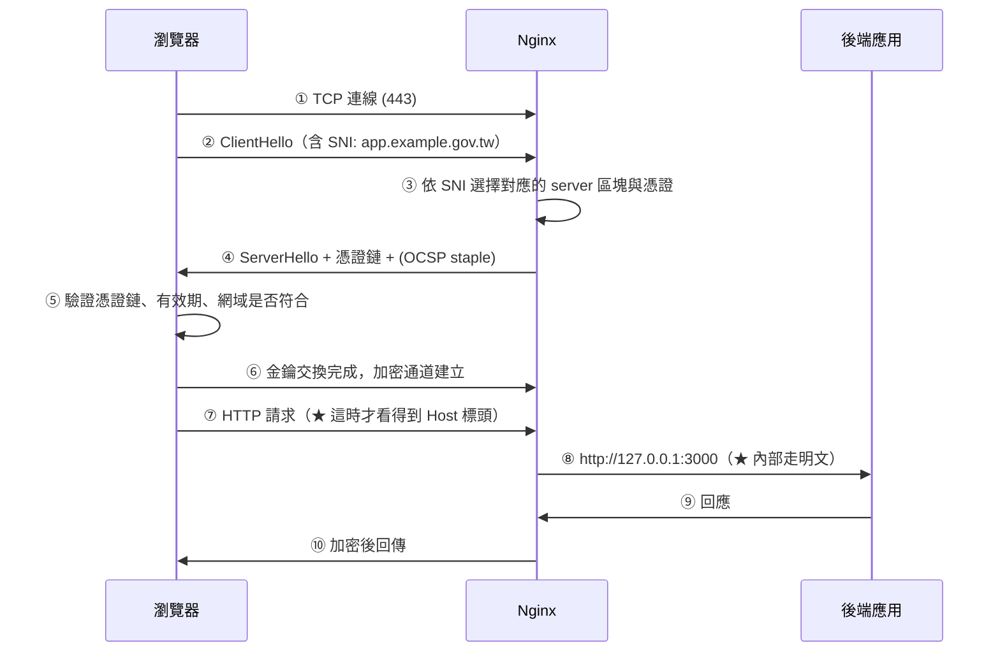

# Nginx HTTPS 與 Certbot

> [!abstract] 這篇你會學到
> - 用 **Certbot** 申請 Let's Encrypt 憑證並設定**全自動續期**
> - 寫出一份 **SSL Labs 拿 A+** 的 TLS 設定
> - 正確設定 **HTTP → HTTPS 轉址**與 **HSTS**（含它的不可逆風險）
> - 設定 **OCSP Stapling** 加快首次連線
> - 處理**多網域、萬用憑證、內部憑證**三種情境
> - 系統化排查 **TLS 相關的錯誤**

## 前置知識

- [[060-02-02-02-guide-Nginx-設定語法與虛擬主機]] — listen、server_name
- [[060-02-02-03-guide-Nginx-location與rewrite]] — location 與 return

> [!tip] 憑證的原理與自簽憑證鏈
> 本篇專注在**「怎麼在 Nginx 上把 HTTPS 設好」**。
> 憑證的原理、CSR 的產生、自簽憑證鏈的建立、內部 CA 的架設，
> 請看 [[090-01-00-idx-PKI-憑證與PKI]] 整個章節。

---

## TLS 在 Nginx 中的位置



> [!warning] SNI 在加密前就送出
> **步驟②的 SNI 是明文的** —— 中間的網路設備可以看到你連的是哪個網域
> （但看不到路徑與內容）。
> 這也是為什麼**同一個 IP 可以放多個 HTTPS 網站**：
> Nginx 靠 SNI 決定要用哪張憑證。
>
> **兩個推論**：
> - 極舊的客戶端（Windows XP 的 IE）不支援 SNI，會拿到**第一個** server 的憑證
> - 「連到哪個網域」無法用 HTTPS 隱藏（ECH 標準仍在推廣中）

---

## 用 Certbot 申請憑證

### 安裝

```bash
# ═══ Ubuntu / Debian（推薦用 snap，版本最新）═══
$ sudo snap install --classic certbot
$ sudo ln -sf /snap/bin/certbot /usr/bin/certbot

# ═══ 或用 apt（版本較舊但夠用）═══
$ sudo apt update && sudo apt install -y certbot python3-certbot-nginx

# 驗證
$ certbot --version
certbot 3.1.0
```

> [!info]- Rocky / AlmaLinux（RHEL 系）對照
> ```bash
> $ sudo dnf install -y epel-release
> $ sudo dnf install -y certbot python3-certbot-nginx
>
> # 或用 snap（版本較新）
> $ sudo dnf install -y snapd
> $ sudo systemctl enable --now snapd.socket
> $ sudo ln -s /var/lib/snapd/snap /snap
> $ sudo snap install --classic certbot
>
> # ★ 防火牆
> $ sudo firewall-cmd --permanent --add-service=http --add-service=https
> $ sudo firewall-cmd --reload
> ```

### 三種驗證方式

| 方式 | 原理 | 適用 | 限制 |
| --- | --- | --- | --- |
| **HTTP-01** | 在 `/.well-known/acme-challenge/` 放檔案 | **最常用** | **80 埠必須從外部連得到** |
| **DNS-01** | 在 DNS 加 TXT 記錄 | **內網主機、萬用憑證** | 需要 DNS API 或手動 |
| TLS-ALPN-01 | 443 埠的 TLS 擴充 | 80 埠被封鎖時 | 需要專用外掛 |

```bash
# ═══ 方式一：--nginx（自動改設定，最方便）═══
$ sudo certbot --nginx -d example.gov.tw -d www.example.gov.tw

# ═══ 方式二：--webroot（★ 推薦，不動你的設定檔）═══
$ sudo mkdir -p /var/www/acme
$ sudo certbot certonly --webroot -w /var/www/acme \
    -d example.gov.tw -d www.example.gov.tw \
    --email admin@example.gov.tw --agree-tos --no-eff-email

# ═══ 方式三：--standalone（Nginx 尚未安裝時）═══
$ sudo systemctl stop nginx
$ sudo certbot certonly --standalone -d example.gov.tw
$ sudo systemctl start nginx

# ═══ 方式四：DNS-01（★ 內網主機、萬用憑證）═══
$ sudo certbot certonly --manual --preferred-challenges dns \
    -d "*.example.gov.tw" -d example.gov.tw
# → 依提示在 DNS 加入 _acme-challenge TXT 記錄
```

> [!tip] `--webroot` 為什麼比 `--nginx` 好
> `--nginx` 外掛會**自動修改你的 Nginx 設定檔** ——
> 它加入的設定通常不符合你自己的結構，
> 而且續期時可能又改一次，把你手動調整的內容覆蓋掉。
>
> **`--webroot` 只需要一段固定的設定**，之後完全不再碰你的檔案：
> ```nginx
> server {
>     listen 80;
>     server_name example.gov.tw www.example.gov.tw;
>
>     # ★ ACME 挑戰（用 ^~ 確保優先於任何轉址規則）
>     location ^~ /.well-known/acme-challenge/ {
>         root /var/www/acme;
>         default_type "text/plain";
>         allow all;
>     }
>
>     location / {
>         return 301 https://$host$request_uri;
>     }
> }
> ```

> [!danger] ACME 挑戰路徑一定要放在轉址之前
> ```nginx
> # ❌ 錯誤：所有 HTTP 請求都被轉走，ACME 驗證永遠失敗
> server {
>     listen 80;
>     return 301 https://$host$request_uri;
> }
>
> # ✅ 正確：先處理 ACME，其餘才轉址
> server {
>     listen 80;
>     location ^~ /.well-known/acme-challenge/ { root /var/www/acme; }
>     location / { return 301 https://$host$request_uri; }
> }
> ```
> 症狀：`Invalid response from http://.../.well-known/acme-challenge/xxx: 301`

### 憑證檔案在哪

```bash
$ sudo ls -l /etc/letsencrypt/live/example.gov.tw/
lrwxrwxrwx cert.pem       -> ../../archive/example.gov.tw/cert1.pem
lrwxrwxrwx chain.pem      -> ../../archive/example.gov.tw/chain1.pem
lrwxrwxrwx fullchain.pem  -> ../../archive/example.gov.tw/fullchain1.pem
lrwxrwxrwx privkey.pem    -> ../../archive/example.gov.tw/privkey1.pem
```

| 檔案 | 內容 | Nginx 用哪個 |
| --- | --- | --- |
| `cert.pem` | **只有**你的憑證 | ✗ 不要用（缺中繼憑證） |
| `chain.pem` | 中繼憑證鏈 | 用於 `ssl_trusted_certificate`（OCSP） |
| **`fullchain.pem`** | **你的憑證 + 中繼憑證** | **✅ `ssl_certificate` 用這個** |
| **`privkey.pem`** | 私鑰 | **✅ `ssl_certificate_key`** |

> [!danger] 用 `cert.pem` 而不是 `fullchain.pem` 的後果
> ```
> 桌面版 Chrome / Firefox → 【看起來正常】（它們會自己去抓中繼憑證）
> 手機 App / curl / Java / 舊版 Android → 【憑證驗證失敗】
> ```
> **這是最典型的「我電腦上明明可以」的憑證問題。**
>
> **驗證方式**：
> ```bash
> $ openssl s_client -connect example.gov.tw:443 -servername example.gov.tw </dev/null 2>/dev/null | \
>     grep -E '^\s+[0-9] s:|^\s+[0-9] i:'
>  0 s:CN=example.gov.tw
>    i:C=US, O=Let's Encrypt, CN=R11
>  1 s:C=US, O=Let's Encrypt, CN=R11        ← ★ 有這一行才對（中繼憑證）
>    i:C=US, O=Internet Security Research Group, CN=ISRG Root X1
> ```

---

## 完整的 TLS 設定

```nginx
# ═══════════ /etc/nginx/snippets/ssl-params.conf ═══════════
# ── 協定版本 ──
ssl_protocols TLSv1.2 TLSv1.3;          # ★ 只留這兩個
                                         #   TLSv1.0/1.1 已被 PCI DSS 與 TWGCB 禁用

# ── 加密套件 ──
ssl_prefer_server_ciphers off;           # ★ TLS 1.3 時代讓客戶端決定較好
ssl_ciphers 'ECDHE-ECDSA-AES128-GCM-SHA256:ECDHE-RSA-AES128-GCM-SHA256:ECDHE-ECDSA-AES256-GCM-SHA384:ECDHE-RSA-AES256-GCM-SHA384:ECDHE-ECDSA-CHACHA20-POLY1305:ECDHE-RSA-CHACHA20-POLY1305:DHE-RSA-AES128-GCM-SHA256:DHE-RSA-AES256-GCM-SHA384';
# ★ TLS 1.3 的套件由 OpenSSL 決定，不受 ssl_ciphers 影響

# ── 橢圓曲線 ──
ssl_ecdh_curve X25519:prime256v1:secp384r1;

# ── Session 快取（★ 大幅減少握手次數）──
ssl_session_cache   shared:SSL:50m;      # 50m 約可存 20 萬個 session
ssl_session_timeout 1d;
ssl_session_tickets off;                 # ★ 關閉：ticket 金鑰不輪替會破壞前向保密

# ── OCSP Stapling（★ 加快首次連線）──
ssl_stapling on;
ssl_stapling_verify on;
resolver 1.1.1.1 8.8.8.8 valid=300s ipv6=off;
resolver_timeout 5s;
# ssl_trusted_certificate 要寫在 server 區塊（每個網域的鏈不同）

# ── 緩衝 ──
ssl_buffer_size 4k;                      # ★ 預設 16k；4k 讓首個位元組更快到達

# ── DH 參數（只有用 DHE 套件時需要）──
# ssl_dhparam /etc/nginx/dhparam.pem;
```

```bash
# 產生 DH 參數（★ 要幾分鐘，只有啟用 DHE 套件時需要）
$ sudo openssl dhparam -out /etc/nginx/dhparam.pem 2048
```

### 完整的 server 區塊

```nginx
# ═══ HTTP：只做 ACME 與轉址 ═══
server {
    listen 80;
    listen [::]:80;
    server_name example.gov.tw www.example.gov.tw;

    location ^~ /.well-known/acme-challenge/ {
        root /var/www/acme;
        default_type "text/plain";
        allow all;
    }

    location / {
        return 301 https://$host$request_uri;
    }
}

# ═══ HTTPS ═══
server {
    listen 443 ssl;
    listen [::]:443 ssl;
    http2 on;                             # ★ Nginx 1.25.1+ 的寫法

    server_name example.gov.tw www.example.gov.tw;

    # ── 憑證 ──
    ssl_certificate         /etc/letsencrypt/live/example.gov.tw/fullchain.pem;
    ssl_certificate_key     /etc/letsencrypt/live/example.gov.tw/privkey.pem;
    ssl_trusted_certificate /etc/letsencrypt/live/example.gov.tw/chain.pem;  # OCSP

    include snippets/ssl-params.conf;

    # ── ★ HSTS（讀完下方警告再啟用）──
    add_header Strict-Transport-Security "max-age=31536000; includeSubDomains" always;

    # ── 其他安全標頭 ──
    include snippets/security-headers.conf;

    root  /var/www/example.gov.tw/current/public;
    index index.php index.html;

    access_log /var/log/nginx/example.access.log main;
    error_log  /var/log/nginx/example.error.log  warn;

    include snippets/deny-hidden.conf;

    location / {
        try_files $uri $uri/ /index.php?$query_string;
    }

    location ~ \.php$ {
        try_files $uri =404;
        fastcgi_pass unix:/run/php/php8.3-fpm.sock;
        fastcgi_param SCRIPT_FILENAME $realpath_root$fastcgi_script_name;
        fastcgi_param DOCUMENT_ROOT   $realpath_root;
        fastcgi_param HTTPS           on;              # ★ 讓 PHP 知道是 HTTPS
        include fastcgi_params;
        include snippets/security-headers.conf;
    }
}

# ═══ 預設拒絕（沒有比對到任何 server_name 時）═══
server {
    listen 80 default_server;
    listen [::]:80 default_server;
    listen 443 ssl default_server;
    listen [::]:443 ssl default_server;
    server_name _;

    ssl_reject_handshake on;               # ★ Nginx 1.19.4+：直接拒絕 TLS 握手
    return 444;                            # 直接關閉連線
}
```

> [!tip] `ssl_reject_handshake on` 取代了「假憑證」的做法
> Nginx 1.19.4 之前，default_server 也必須提供一張憑證
> （否則設定檔無法通過檢查），大家都放一張自簽的假憑證。
>
> 現在只要 `ssl_reject_handshake on;` ——
> Nginx 會**直接拒絕握手**，不需要任何憑證，
> 用 IP 直接存取的掃描器連憑證都拿不到。

---

## HSTS：強大但不可逆

```nginx
add_header Strict-Transport-Security "max-age=31536000; includeSubDomains" always;
```

**作用**：告訴瀏覽器「**接下來 N 秒內，這個網域只准用 HTTPS**」——
即使使用者輸入 `http://`，**瀏覽器自己就轉成 https，連請求都不發**。
這能防止 SSL Stripping 中間人攻擊。

> [!danger] HSTS 的三個不可逆風險 ★★★
> **風險一：`includeSubDomains` 會影響所有子網域**
> ```
> 你在 example.gov.tw 設了 includeSubDomains
>   → 【所有】子網域都被強制 HTTPS
>     → 那台還在用 http 的舊內部系統 old.example.gov.tw
>       → 【瀏覽器直接拒絕連線，而且無法點「繼續前往」】
> ```
>
> **風險二：憑證過期時完全無法存取**
> ```
> 一般情況：憑證過期 → 瀏覽器警告 → 使用者可以點「繼續前往」
> 有 HSTS ：憑證過期 → 【瀏覽器直接拒絕，沒有繞過選項】
>            → 整個網站完全無法存取，直到憑證修好
> ```
>
> **風險三：`preload` 幾乎不可逆**
> ```
> 送出 preload 申請 → 進入瀏覽器【內建的清單】
>   → 移除申請要等【好幾個月】，而且要等瀏覽器改版才生效
>     → 這期間你的網域【永遠只能用 HTTPS】
> ```
>
> **正確的導入順序**：
> ```nginx
> # 【第 1 週】短期，只測主網域
> add_header Strict-Transport-Security "max-age=300" always;
>
> # 【第 2-4 週】確認全站（含所有資源）都是 HTTPS 後拉長
> add_header Strict-Transport-Security "max-age=86400" always;
>
> # 【第 2 個月】確認所有子網域都支援 HTTPS 後才加 includeSubDomains
> add_header Strict-Transport-Security "max-age=31536000; includeSubDomains" always;
>
> # 【preload】★ 想清楚再送，這是幾乎不可逆的決定
> # add_header Strict-Transport-Security "max-age=63072000; includeSubDomains; preload" always;
> ```
>
> **加 `includeSubDomains` 前的檢查清單**：
> ```bash
> # 列出所有子網域，逐一確認支援 HTTPS
> for sub in www api admin mail vpn old test dev staging; do
>     h="$sub.example.gov.tw"
>     if host "$h" >/dev/null 2>&1; then
>         code=$(curl -sk -o /dev/null -w '%{http_code}' -m 5 "https://$h/" 2>/dev/null)
>         printf '  %-30s %s %s\n' "$h" "${code:-連不上}" \
>             "$([ -n "$code" ] && [ "$code" != "000" ] && echo '✓' || echo '⚠ 【會被 HSTS 擋死】')"
>     fi
> done
> ```

> [!warning] 使用者端怎麼清除 HSTS
> 若不小心設錯，使用者可以手動清除（但你不可能叫所有使用者這樣做）：
> ```
> Chrome / Edge：chrome://net-internals/#hsts → Delete domain security policies
> Firefox      ：歷史記錄 → 清除最近的歷史 → 網站設定
> Safari       ：刪除 ~/Library/Cookies/HSTS.plist
> ```
> **所以請務必按照漸進式的順序導入。**

---

## 自動續期

Let's Encrypt 憑證**只有 90 天有效期**，必須自動續期。

```bash
# ═══ Certbot 安裝時已自動建立 systemd timer ═══
$ systemctl list-timers | grep certbot
NEXT                        LEFT       UNIT                 ACTIVATES
Thu 2026-08-28 21:14:33 CST 8h left    snap.certbot.renew.timer  snap.certbot.renew.service

# ═══ ★ 一定要測試續期流程 ═══
$ sudo certbot renew --dry-run
Congratulations, all simulated renewals succeeded:
  /etc/letsencrypt/live/example.gov.tw/fullchain.pem (success)

# ═══ 查看目前的憑證與到期日 ═══
$ sudo certbot certificates
Certificate Name: example.gov.tw
    Domains: example.gov.tw www.example.gov.tw
    Expiry Date: 2026-11-26 08:14:22+00:00 (VALID: 89 days)
    Certificate Path: /etc/letsencrypt/live/example.gov.tw/fullchain.pem
    Private Key Path: /etc/letsencrypt/live/example.gov.tw/privkey.pem
```

> [!danger] 續期成功但 Nginx 沒有重新載入 ★★
> **最常見的憑證事故**：
> ```
> Certbot 在凌晨成功續期了憑證
>   → 但【沒有告訴 Nginx】
>     → Nginx 記憶體中還是舊憑證
>       → 30 天後舊憑證過期
>         → 【整個網站掛掉】，而 certbot certificates 顯示「憑證有效」
> ```
>
> **必須設定 deploy hook**：
> ```bash
> $ sudo mkdir -p /etc/letsencrypt/renewal-hooks/deploy
> $ sudo tee /etc/letsencrypt/renewal-hooks/deploy/reload-nginx.sh >/dev/null <<'EOF'
> #!/usr/bin/env bash
> set -euo pipefail
> # ★ 先驗證設定，避免 reload 失敗
> if nginx -t 2>/dev/null; then
>     systemctl reload nginx
>     logger -t certbot-deploy "憑證已續期，Nginx 已重新載入：${RENEWED_DOMAINS:-unknown}"
> else
>     logger -t certbot-deploy "★ nginx -t 失敗，未重新載入！"
>     exit 1
> fi
> EOF
> $ sudo chmod +x /etc/letsencrypt/renewal-hooks/deploy/reload-nginx.sh
>
> # 驗證 hook 會被執行
> $ sudo certbot renew --dry-run --force-renewal 2>&1 | grep -i hook
> Running deploy-hook command: /etc/letsencrypt/renewal-hooks/deploy/reload-nginx.sh
> ```
>
> **hook 的三個目錄**：
> ```
> /etc/letsencrypt/renewal-hooks/pre/     續期【前】執行（例如停止服務）
> /etc/letsencrypt/renewal-hooks/deploy/  ★ 續期【成功後】執行（reload nginx）
> /etc/letsencrypt/renewal-hooks/post/    續期【後】執行（無論成功與否）
> ```

### 憑證到期監控（不要只信任自動化）

```bash
#!/usr/bin/env bash
# /usr/local/bin/check-cert-expiry —— 憑證到期檢查（放進 cron 每天跑）
set -uo pipefail
WARN_DAYS=21
FAIL=0

echo "═══ 憑證到期檢查 $(date '+%F %T') ═══"

# ── ★ 從【外部連線】檢查（不是看檔案，才能抓到「沒 reload」的問題）──
DOMAINS=$(sudo nginx -T 2>/dev/null | grep -E '^\s*server_name' | \
    sed 's/^\s*server_name //; s/;$//' | tr ' ' '\n' | \
    grep -vE '^(_|""|\*|localhost|$)' | sort -u)

for d in $DOMAINS; do
    END=$(echo | timeout 10 openssl s_client -connect "$d:443" -servername "$d" 2>/dev/null | \
          openssl x509 -noout -enddate 2>/dev/null | cut -d= -f2)
    if [ -z "$END" ]; then
        printf '  %-35s ⚠ 無法連線\n' "$d"
        continue
    fi
    EPOCH=$(date -d "$END" +%s 2>/dev/null) || continue
    DAYS=$(( (EPOCH - $(date +%s)) / 86400 ))

    if   [ "$DAYS" -lt 0 ];          then printf '  %-35s ✗✗ 【已過期 %d 天】\n' "$d" "$((-DAYS))"; FAIL=1
    elif [ "$DAYS" -lt 7 ];          then printf '  %-35s ✗ 剩 %d 天【緊急】\n' "$d" "$DAYS"; FAIL=1
    elif [ "$DAYS" -lt "$WARN_DAYS" ]; then printf '  %-35s ⚠ 剩 %d 天\n' "$d" "$DAYS"
    else                                  printf '  %-35s ✓ 剩 %d 天\n' "$d" "$DAYS"
    fi
done

# ── ★ 比對「磁碟上的憑證」與「Nginx 正在用的憑證」──
echo
echo "【檢查 Nginx 是否載入了最新憑證】"
for cert in /etc/letsencrypt/live/*/fullchain.pem; do
    [ -e "$cert" ] || continue
    d=$(basename "$(dirname "$cert")")
    disk=$(openssl x509 -in "$cert" -noout -fingerprint -sha256 2>/dev/null | cut -d= -f2)
    live=$(echo | timeout 10 openssl s_client -connect "$d:443" -servername "$d" 2>/dev/null | \
           openssl x509 -noout -fingerprint -sha256 2>/dev/null | cut -d= -f2)
    if [ -z "$live" ]; then
        printf '  %-35s ⚠ 無法連線\n' "$d"
    elif [ "$disk" = "$live" ]; then
        printf '  %-35s ✓ 一致\n' "$d"
    else
        printf '  %-35s ✗✗ 【磁碟上是新憑證，但 Nginx 還在用舊的 —— 需要 reload】\n' "$d"
        FAIL=1
    fi
done

# ── 續期 timer 是否正常 ──
echo
echo "【續期排程】"
systemctl list-timers --all 2>/dev/null | grep -i certbot | sed 's/^/  /' \
    || echo "  ⚠ 找不到 certbot timer"

echo
echo "【deploy hook】"
if [ -x /etc/letsencrypt/renewal-hooks/deploy/reload-nginx.sh ]; then
    echo "  ✓ reload-nginx.sh 存在且可執行"
else
    echo "  ✗✗ 【沒有 deploy hook —— 續期後 Nginx 不會重新載入】"
    FAIL=1
fi

exit $FAIL
```

```bash
# 排程
$ sudo tee /etc/cron.d/cert-expiry >/dev/null <<'EOF'
30 7 * * * root /usr/local/bin/check-cert-expiry || \
  /usr/local/bin/check-cert-expiry | mail -s "【警告】憑證檢查異常 $(hostname)" admin@example.gov.tw
EOF
```

---

## 三種進階情境

### ① 多網域、多憑證

```nginx
# 每個網域各自的 server 區塊與憑證
server {
    listen 443 ssl;
    http2 on;
    server_name a.example.gov.tw;
    ssl_certificate     /etc/letsencrypt/live/a.example.gov.tw/fullchain.pem;
    ssl_certificate_key /etc/letsencrypt/live/a.example.gov.tw/privkey.pem;
    include snippets/ssl-params.conf;
    # ...
}

server {
    listen 443 ssl;
    http2 on;
    server_name b.example.gov.tw;
    ssl_certificate     /etc/letsencrypt/live/b.example.gov.tw/fullchain.pem;
    ssl_certificate_key /etc/letsencrypt/live/b.example.gov.tw/privkey.pem;
    include snippets/ssl-params.conf;
    # ...
}
```

### ② 萬用憑證（需要 DNS-01）

```bash
# 用 DNS API 自動驗證（以 Cloudflare 為例）
$ sudo snap install certbot-dns-cloudflare
$ sudo snap set certbot trust-plugin-with-root=ok

$ sudo mkdir -p /root/.secrets
$ sudo tee /root/.secrets/cloudflare.ini >/dev/null <<'EOF'
dns_cloudflare_api_token = 你的_API_Token
EOF
$ sudo chmod 600 /root/.secrets/cloudflare.ini      # ★ 權限很重要

$ sudo certbot certonly \
    --dns-cloudflare \
    --dns-cloudflare-credentials /root/.secrets/cloudflare.ini \
    -d "example.gov.tw" -d "*.example.gov.tw"
```

```nginx
# 一張憑證涵蓋所有子網域
server {
    listen 443 ssl;
    http2 on;
    server_name ~^(?<sub>[a-z0-9-]+)\.example\.gov\.tw$;

    ssl_certificate     /etc/letsencrypt/live/example.gov.tw/fullchain.pem;
    ssl_certificate_key /etc/letsencrypt/live/example.gov.tw/privkey.pem;
    include snippets/ssl-params.conf;

    root /var/www/sites/$sub/public;       # ★ 依子網域決定目錄
    # ...
}
```

> [!warning] 萬用憑證的風險
> **一張憑證涵蓋所有子網域 = 一把私鑰洩漏，所有子網域都被影響。**
>
> **建議**：
> - 高價值的服務（金流、後台）用**獨立憑證**
> - 萬用憑證只用於**大量的低風險子網域**
> - 私鑰權限 `chmod 600`、`chown root:root`

### ③ 雙憑證（ECC + RSA）

```nginx
server {
    listen 443 ssl;
    http2 on;
    server_name example.gov.tw;

    # ★ 同時提供兩張憑證，Nginx 依客戶端支援度自動選擇
    ssl_certificate     /etc/letsencrypt/live/example.gov.tw-ecc/fullchain.pem;
    ssl_certificate_key /etc/letsencrypt/live/example.gov.tw-ecc/privkey.pem;

    ssl_certificate     /etc/letsencrypt/live/example.gov.tw/fullchain.pem;
    ssl_certificate_key /etc/letsencrypt/live/example.gov.tw/privkey.pem;

    include snippets/ssl-params.conf;
}
```

```bash
# 申請 ECC 憑證（★ 更小、更快）
$ sudo certbot certonly --webroot -w /var/www/acme \
    -d example.gov.tw \
    --key-type ecdsa --elliptic-curve secp384r1 \
    --cert-name example.gov.tw-ecc
```

**ECC 的優勢**：憑證更小、握手更快、相同安全強度下運算量更低。
**保留 RSA 的理由**：極舊的客戶端（Android 4.x、Windows XP）不支援 ECC。

---

## 完整實戰範例

### 從零到 A+ 的完整流程

```bash
#!/usr/bin/env bash
# 全新網站的 HTTPS 建置
set -euo pipefail
DOMAIN="app.example.gov.tw"
EMAIL="admin@example.gov.tw"
WEBROOT="/var/www/$DOMAIN/current/public"

echo "═══ 【1】前置檢查 ═══"
# DNS 是否指向本機
RESOLVED=$(dig +short "$DOMAIN" | tail -1)
MYIP=$(curl -s4 https://ifconfig.me 2>/dev/null || echo "?")
echo "  DNS 解析：$RESOLVED"
echo "  本機外部 IP：$MYIP"
[ "$RESOLVED" = "$MYIP" ] || echo "  ⚠ 不一致，HTTP-01 驗證可能失敗"

# 80 埠是否可從外部連到
sudo ss -tlnp | grep -q ':80 ' && echo "  ✓ 80 埠有服務" || echo "  ⚠ 80 埠沒有服務"

echo -e "\n═══ 【2】建立 HTTP server（只做 ACME 與轉址）═══"
sudo mkdir -p /var/www/acme
sudo chown -R www-data:www-data /var/www/acme

sudo tee "/etc/nginx/sites-available/$DOMAIN" >/dev/null <<EOF
server {
    listen 80;
    listen [::]:80;
    server_name $DOMAIN;

    location ^~ /.well-known/acme-challenge/ {
        root /var/www/acme;
        default_type "text/plain";
        allow all;
    }

    location / {
        return 301 https://\$host\$request_uri;
    }
}
EOF
sudo ln -sf "/etc/nginx/sites-available/$DOMAIN" /etc/nginx/sites-enabled/
sudo nginx -t && sudo systemctl reload nginx

echo -e "\n  驗證 ACME 路徑可存取"
echo "test-$(date +%s)" | sudo tee /var/www/acme/.well-known/acme-challenge/test >/dev/null 2>&1 || \
  { sudo mkdir -p /var/www/acme/.well-known/acme-challenge; \
    echo "test" | sudo tee /var/www/acme/.well-known/acme-challenge/test >/dev/null; }
curl -sf "http://$DOMAIN/.well-known/acme-challenge/test" >/dev/null \
  && echo "  ✓ ACME 路徑可存取" || { echo "  ✗ ACME 路徑不通，中止"; exit 1; }
sudo rm -f /var/www/acme/.well-known/acme-challenge/test

echo -e "\n═══ 【3】申請憑證 ═══"
sudo certbot certonly --webroot -w /var/www/acme -d "$DOMAIN" \
    --email "$EMAIL" --agree-tos --no-eff-email --non-interactive

echo -e "\n═══ 【4】建立 ssl-params snippet ═══"
sudo tee /etc/nginx/snippets/ssl-params.conf >/dev/null <<'EOF'
ssl_protocols TLSv1.2 TLSv1.3;
ssl_prefer_server_ciphers off;
ssl_ciphers 'ECDHE-ECDSA-AES128-GCM-SHA256:ECDHE-RSA-AES128-GCM-SHA256:ECDHE-ECDSA-AES256-GCM-SHA384:ECDHE-RSA-AES256-GCM-SHA384:ECDHE-ECDSA-CHACHA20-POLY1305:ECDHE-RSA-CHACHA20-POLY1305';
ssl_ecdh_curve X25519:prime256v1:secp384r1;
ssl_session_cache shared:SSL:50m;
ssl_session_timeout 1d;
ssl_session_tickets off;
ssl_stapling on;
ssl_stapling_verify on;
resolver 1.1.1.1 8.8.8.8 valid=300s ipv6=off;
resolver_timeout 5s;
ssl_buffer_size 4k;
EOF

echo -e "\n═══ 【5】改寫完整設定 ═══"
sudo tee "/etc/nginx/sites-available/$DOMAIN" >/dev/null <<EOF
server {
    listen 80;
    listen [::]:80;
    server_name $DOMAIN;
    location ^~ /.well-known/acme-challenge/ {
        root /var/www/acme;
        default_type "text/plain";
    }
    location / { return 301 https://\$host\$request_uri; }
}

server {
    listen 443 ssl;
    listen [::]:443 ssl;
    http2 on;
    server_name $DOMAIN;

    ssl_certificate         /etc/letsencrypt/live/$DOMAIN/fullchain.pem;
    ssl_certificate_key     /etc/letsencrypt/live/$DOMAIN/privkey.pem;
    ssl_trusted_certificate /etc/letsencrypt/live/$DOMAIN/chain.pem;
    include snippets/ssl-params.conf;

    # ★ HSTS 先用短的，確認全站 HTTPS 後再拉長
    add_header Strict-Transport-Security "max-age=300" always;
    include snippets/security-headers.conf;

    root  $WEBROOT;
    index index.php index.html;

    access_log /var/log/nginx/$DOMAIN.access.log main;
    error_log  /var/log/nginx/$DOMAIN.error.log  warn;

    include snippets/deny-hidden.conf;

    location / { try_files \$uri \$uri/ /index.php?\$query_string; }

    location ~ \.php\$ {
        try_files \$uri =404;
        fastcgi_pass unix:/run/php/php8.3-fpm.sock;
        fastcgi_param SCRIPT_FILENAME \$realpath_root\$fastcgi_script_name;
        fastcgi_param DOCUMENT_ROOT   \$realpath_root;
        fastcgi_param HTTPS           on;
        include fastcgi_params;
        include snippets/security-headers.conf;
    }
}
EOF
sudo nginx -t && sudo systemctl reload nginx

echo -e "\n═══ 【6】★ 設定 deploy hook ═══"
sudo mkdir -p /etc/letsencrypt/renewal-hooks/deploy
sudo tee /etc/letsencrypt/renewal-hooks/deploy/reload-nginx.sh >/dev/null <<'EOF'
#!/usr/bin/env bash
set -euo pipefail
if nginx -t 2>/dev/null; then
    systemctl reload nginx
    logger -t certbot-deploy "憑證已續期並重新載入 Nginx：${RENEWED_DOMAINS:-unknown}"
else
    logger -t certbot-deploy "★ nginx -t 失敗，未重新載入"
    exit 1
fi
EOF
sudo chmod +x /etc/letsencrypt/renewal-hooks/deploy/reload-nginx.sh

echo -e "\n═══ 【7】測試續期 ═══"
sudo certbot renew --dry-run

echo -e "\n═══ 【8】驗證 ═══"
sleep 2
echo "  ── 憑證鏈 ──"
echo | openssl s_client -connect "$DOMAIN:443" -servername "$DOMAIN" 2>/dev/null | \
    grep -E '^\s+[0-9] s:' | sed 's/^/    /'
echo "  ── 協定版本 ──"
for p in tls1 tls1_1 tls1_2 tls1_3; do
    if echo | timeout 5 openssl s_client -"$p" -connect "$DOMAIN:443" \
       -servername "$DOMAIN" >/dev/null 2>&1; then
        case "$p" in tls1|tls1_1) echo "    ✗ $p 【應該關閉】";; *) echo "    ✓ $p";; esac
    else
        case "$p" in tls1|tls1_1) echo "    ✓ $p 已關閉";; *) echo "    ⚠ $p 不支援";; esac
    fi
done
echo "  ── OCSP Stapling ──"
echo | openssl s_client -connect "$DOMAIN:443" -servername "$DOMAIN" -status 2>/dev/null | \
    grep -A1 'OCSP Response Status' | head -2 | sed 's/^/    /' || echo "    ⚠ 未啟用"
echo "  ── HTTP 轉址 ──"
curl -sI "http://$DOMAIN/" | head -2 | sed 's/^/    /'
echo "  ── 安全標頭 ──"
curl -sI "https://$DOMAIN/" | grep -iE 'strict-transport|x-frame|x-content' | sed 's/^/    /'

echo -e "\n✓ 完成。到 https://www.ssllabs.com/ssltest/analyze.html?d=$DOMAIN 檢測評分"
echo "  ★ 確認全站 HTTPS 正常運作【一個月後】，再把 HSTS 的 max-age 拉長"
```

### TLS 健檢腳本

```bash
#!/usr/bin/env bash
# TLS 設定健檢
D="${1:?用法: $0 <domain>}"
echo "═══ TLS 健檢 $D ═══"

echo -e "\n【1】憑證資訊"
echo | timeout 10 openssl s_client -connect "$D:443" -servername "$D" 2>/dev/null | \
    openssl x509 -noout -subject -issuer -dates -ext subjectAltName 2>/dev/null | sed 's/^/  /'

echo -e "\n【2】★ 憑證鏈是否完整"
CHAIN=$(echo | timeout 10 openssl s_client -connect "$D:443" -servername "$D" \
        -showcerts 2>/dev/null | grep -c 'BEGIN CERTIFICATE')
echo "  憑證數量：$CHAIN"
[ "$CHAIN" -ge 2 ] && echo "  ✓ 有中繼憑證" \
                   || echo "  ✗✗ 【只有一張憑證 —— 應該用 fullchain.pem 而非 cert.pem】"

echo -e "\n【3】協定版本"
for p in tls1 tls1_1 tls1_2 tls1_3; do
    if echo | timeout 5 openssl s_client -"$p" -connect "$D:443" -servername "$D" >/dev/null 2>&1; then
        case "$p" in
            tls1|tls1_1) echo "  ✗ ${p^^} 【已被 PCI DSS 與 TWGCB 禁用，應關閉】";;
            *) echo "  ✓ ${p^^}";;
        esac
    else
        case "$p" in
            tls1|tls1_1) echo "  ✓ ${p^^} 已關閉";;
            tls1_3)      echo "  ⚠ TLS 1.3 不支援（建議啟用）";;
            *)           echo "  ✗ ${p^^} 不支援";;
        esac
    fi
done

echo -e "\n【4】OCSP Stapling"
echo | timeout 10 openssl s_client -connect "$D:443" -servername "$D" -status 2>/dev/null | \
    grep -q 'OCSP Response Status: successful' \
    && echo "  ✓ 已啟用" || echo "  ⚠ 未啟用（首次連線會多一次外部查詢）"

echo -e "\n【5】HSTS"
H=$(curl -skI "https://$D/" 2>/dev/null | grep -i 'strict-transport-security' | tr -d '\r')
if [ -z "$H" ]; then
    echo "  ⚠ 未設定"
else
    echo "  $H"
    MA=$(echo "$H" | grep -oP 'max-age=\K\d+')
    [ "${MA:-0}" -ge 31536000 ] && echo "  ✓ max-age ≥ 1 年" \
                                || echo "  ○ max-age = ${MA:-0} 秒（漸進導入中？）"
    echo "$H" | grep -q includeSubDomains && echo "  ★ 含 includeSubDomains —— 確認所有子網域都支援 HTTPS"
    echo "$H" | grep -q preload && echo "  ★★ 含 preload —— 【幾乎不可逆】"
fi

echo -e "\n【6】HTTP 轉址"
L=$(curl -sI "http://$D/" 2>/dev/null | grep -iE '^(HTTP/|location)' | tr -d '\r')
echo "$L" | sed 's/^/  /'
echo "$L" | grep -qi '301' && echo "  ✓ 301 永久轉址" || echo "  ⚠ 不是 301"
echo "$L" | grep -qi 'location: https://' && echo "  ✓ 轉到 HTTPS" || echo "  ✗ 沒轉到 HTTPS"

echo -e "\n【7】重新協商與壓縮（漏洞檢查）"
echo | timeout 10 openssl s_client -connect "$D:443" -servername "$D" 2>/dev/null | \
    grep -E 'Secure Renegotiation|Compression' | sed 's/^/  /'
echo "  ★ Secure Renegotiation 應為 IS supported；Compression 應為 NONE"

echo -e "\n【8】到期日"
END=$(echo | timeout 10 openssl s_client -connect "$D:443" -servername "$D" 2>/dev/null | \
      openssl x509 -noout -enddate 2>/dev/null | cut -d= -f2)
if [ -n "$END" ]; then
    DAYS=$(( ($(date -d "$END" +%s) - $(date +%s)) / 86400 ))
    printf '  %s（剩 %d 天）%s\n' "$END" "$DAYS" \
        "$([ "$DAYS" -lt 21 ] && echo '⚠' || echo '✓')"
fi

echo -e "\n★ 完整評分：https://www.ssllabs.com/ssltest/analyze.html?d=$D"
```

---

## 常見錯誤與排錯

| 現象／錯誤 | 原因 | 解法 |
| --- | --- | --- |
| **手機 App 說憑證無效，但電腦正常** ★ | **用了 `cert.pem` 而非 `fullchain.pem`** | 改用 `fullchain.pem` |
| `Invalid response ... : 301` | ACME 路徑被轉址規則吃掉 | ACME 的 location 用 `^~` 且放在轉址之前 |
| **憑證續期成功但網站還是舊憑證** ★★ | **沒有 deploy hook，Nginx 沒 reload** | 建立 `renewal-hooks/deploy/reload-nginx.sh` |
| `Connection refused` during ACME | 80 埠沒開或被防火牆擋 | `ss -tlnp`、`ufw allow 80` |
| **`too many certificates already issued`** | 觸發 Let's Encrypt 速率限制 | 用 `--dry-run` 測試；等一週；或用 staging 環境 |
| `NET::ERR_CERT_COMMON_NAME_INVALID` | 憑證的 SAN 不含這個網域 | 重新申請時加上 `-d` |
| **`NET::ERR_CERT_DATE_INVALID`** | 憑證過期 | 檢查續期；**若有 HSTS 使用者無法繞過** |
| `SSL_ERROR_NO_CYPHER_OVERLAP` | 客戶端太舊 / cipher 太嚴格 | 檢查 `ssl_protocols` 與 `ssl_ciphers` |
| **`ERR_TOO_MANY_REDIRECTS`** | 後端不知道是 HTTPS，一直重導 | 加 `X-Forwarded-Proto` + 後端 trust proxy |
| **HSTS 設錯導致子網域全掛** ★ | `includeSubDomains` 影響所有子網域 | 只能等 `max-age` 過期；**導入前務必檢查所有子網域** |
| OCSP Stapling 沒生效 | 缺 `resolver` 或 `ssl_trusted_certificate` | 兩者都要設定 |
| `unable to get local issuer certificate` | 憑證鏈不完整 | `fullchain.pem` + `ssl_trusted_certificate chain.pem` |
| **重新載入後憑證沒更新** | `reload` 有時不夠 | 少數情況要 `systemctl restart nginx` |
| DNS-01 驗證失敗 | TXT 記錄未生效 | `dig TXT _acme-challenge.網域`；等 DNS 傳播 |
| 私鑰權限錯誤 | Nginx 讀不到 | `chmod 600`、`chown root:root`；Nginx master 以 root 啟動所以讀得到 |
| SSL Labs 只有 B | TLS 1.0/1.1 未關 / 缺 HSTS / 弱 cipher | 依本篇的 `ssl-params.conf` |

### 憑證問題的系統化排查

```bash
# 【1】從外部看到的憑證是什麼
$ echo | openssl s_client -connect example.gov.tw:443 -servername example.gov.tw 2>/dev/null | \
    openssl x509 -noout -subject -issuer -dates -ext subjectAltName

# 【2】★ 磁碟上的憑證與線上的是否一致（抓「沒 reload」）
$ openssl x509 -in /etc/letsencrypt/live/example.gov.tw/fullchain.pem \
    -noout -fingerprint -sha256
$ echo | openssl s_client -connect example.gov.tw:443 -servername example.gov.tw 2>/dev/null | \
    openssl x509 -noout -fingerprint -sha256
# ★ 不一致 = 需要 systemctl reload nginx

# 【3】憑證與私鑰是否配對
$ sudo openssl x509 -noout -modulus -in fullchain.pem | openssl md5
$ sudo openssl rsa  -noout -modulus -in privkey.pem   | openssl md5
# ★ 兩個 md5 必須相同

# 【4】憑證鏈是否完整
$ echo | openssl s_client -connect example.gov.tw:443 -servername example.gov.tw \
    -showcerts 2>/dev/null | grep -c 'BEGIN CERTIFICATE'
2                          # ★ 至少要 2（自己的 + 中繼）

# 【5】Certbot 的紀錄
$ sudo certbot certificates
$ sudo journalctl -u snap.certbot.renew -n 50
$ sudo tail -50 /var/log/letsencrypt/letsencrypt.log

# 【6】Nginx 載入的憑證路徑
$ sudo nginx -T 2>/dev/null | grep -E 'ssl_certificate|server_name'

# 【7】驗證憑證檔本身
$ openssl x509 -in /etc/letsencrypt/live/example.gov.tw/fullchain.pem -noout -text | head -30
```

> [!tip] 用 staging 環境測試避免速率限制
> Let's Encrypt 有嚴格的速率限制
> （**每個註冊網域每週 50 張憑證**、**同組網域每週 5 次重複申請**）。
> ```bash
> # ★ 測試流程時一律加 --staging
> $ sudo certbot certonly --staging --webroot -w /var/www/acme -d example.gov.tw
>
> # 測試完刪掉 staging 憑證，再申請正式的
> $ sudo certbot delete --cert-name example.gov.tw
> $ sudo certbot certonly --webroot -w /var/www/acme -d example.gov.tw
> ```
> **踩到限制後只能等一週**，沒有申訴管道。

---

## 安全性注意事項

> [!danger] 私鑰的保護
> ```bash
> $ sudo ls -l /etc/letsencrypt/live/example.gov.tw/privkey.pem
> -rw------- 1 root root 241 Aug 28 10:00 privkey.pem
> #  ^^^^^^^ ★ 只有 root 讀得到
>
> $ sudo ls -ld /etc/letsencrypt/{live,archive}
> drwx------ ★ 目錄本身也要限制
> ```
>
> **三個絕對不能做的事**：
> ```
> ❌ 私鑰進 git（就算是私有 repo）
> ❌ 私鑰放在 web root 內
> ❌ 用 email / Slack 傳送私鑰
> ```
>
> **檢查**：
> ```bash
> # 私鑰有沒有不小心進了 web root
> $ sudo find /var/www -name '*.key' -o -name 'privkey*' -o -name '*.pem' 2>/dev/null
>
> # 私鑰有沒有進 git
> $ git log --all --diff-filter=A --name-only | grep -iE '\.(key|pem)$|privkey'
>
> # 從外部確認拿不到
> $ curl -sI https://example.gov.tw/privkey.pem | head -1
> HTTP/2 404                  ← ★ 必須是 404
> ```
>
> **私鑰若曾經洩漏，唯一的解法是撤銷並重新簽發**：
> ```bash
> $ sudo certbot revoke --cert-path /etc/letsencrypt/live/example.gov.tw/cert.pem \
>     --reason keycompromise
> $ sudo certbot certonly --webroot -w /var/www/acme -d example.gov.tw --force-renewal
> ```

> [!warning] 不要用 `ssl_session_tickets on`（除非會輪替金鑰）
> ```nginx
> ssl_session_tickets off;      # ★ 建議
> ```
> **原因**：session ticket 的加密金鑰若不定期輪替，
> 攻擊者只要取得那把金鑰，就能**解密過去所有錄下的流量**
> —— 這會破壞**前向保密（Forward Secrecy）**。
>
> Nginx 沒有內建的自動輪替機制，
> **除非你自己實作金鑰輪替，否則直接關閉**。
> `ssl_session_cache` 已經能提供大部分的效能好處。

> [!warning] TLS 1.0 / 1.1 必須關閉
> ```
> PCI DSS：2018 年 6 月起禁用 TLS 1.0
> TWGCB  ：政府組態基準要求 TLS 1.2 以上
> 各大瀏覽器：2020 年起已全面移除 TLS 1.0/1.1 支援
> ```
> ```nginx
> ssl_protocols TLSv1.2 TLSv1.3;      # ★ 只留這兩個
> ```
> **關閉它們幾乎不會影響任何真實使用者** ——
> 只有 Windows XP 的 IE8 與 Android 4.3 以下才需要 TLS 1.0。

> [!tip] 定期輪替憑證 + 監控 CT 日誌
> **Certificate Transparency（CT）日誌**會記錄所有公開簽發的憑證。
> 監控它可以發現**有人為你的網域申請了憑證**（可能是攻擊或設定錯誤）：
> ```bash
> # 查詢某網域被簽發過的所有憑證
> $ curl -s "https://crt.sh/?q=example.gov.tw&output=json" | \
>     jq -r '.[] | "\(.not_before[0:10])  \(.issuer_name | split(",")[-1])  \(.common_name)"' | \
>     sort -u | tail -20
> ```
> **設定告警**：<https://crt.sh> 或 Facebook 的 CT Monitor 都提供訂閱服務。
>
> 也可以用 **CAA 記錄**限制誰能為你的網域簽發憑證：
> ```
> example.gov.tw.  IN  CAA  0 issue "letsencrypt.org"
> example.gov.tw.  IN  CAA  0 iodef "mailto:security@example.gov.tw"
> ```

---

## 速查表

### Certbot 常用指令

```bash
# 申請（★ 推薦 webroot，不動你的設定）
sudo certbot certonly --webroot -w /var/www/acme -d a.gov.tw -d www.a.gov.tw \
     --email admin@a.gov.tw --agree-tos --no-eff-email

# 萬用憑證（需 DNS-01）
sudo certbot certonly --dns-cloudflare \
     --dns-cloudflare-credentials /root/.secrets/cloudflare.ini \
     -d a.gov.tw -d "*.a.gov.tw"

# ECC 憑證
sudo certbot certonly --webroot -w /var/www/acme -d a.gov.tw \
     --key-type ecdsa --elliptic-curve secp384r1 --cert-name a.gov.tw-ecc

sudo certbot certificates              # 列出所有憑證與到期日
sudo certbot renew --dry-run           # ★ 測試續期（一定要做）
sudo certbot renew --force-renewal     # 強制續期
sudo certbot delete --cert-name a.gov.tw
sudo certbot certonly --staging ...    # ★ 測試用，避免速率限制
```

### 檔案對應

```
fullchain.pem  → ssl_certificate           ★ 用這個，不是 cert.pem
privkey.pem    → ssl_certificate_key
chain.pem      → ssl_trusted_certificate   （OCSP Stapling 用）
cert.pem       → ✗ 不要用（缺中繼憑證，手機會失敗）
```

### 完整 TLS 設定

```nginx
ssl_protocols TLSv1.2 TLSv1.3;           # ★ 只留這兩個
ssl_prefer_server_ciphers off;
ssl_ciphers 'ECDHE-ECDSA-AES128-GCM-SHA256:ECDHE-RSA-AES128-GCM-SHA256:...';
ssl_ecdh_curve X25519:prime256v1:secp384r1;
ssl_session_cache shared:SSL:50m;
ssl_session_timeout 1d;
ssl_session_tickets off;                  # ★ 保護前向保密
ssl_stapling on;  ssl_stapling_verify on;
resolver 1.1.1.1 8.8.8.8 valid=300s ipv6=off;
ssl_buffer_size 4k;
```

### ACME 挑戰的 location（★ 順序很重要）

```nginx
server {
    listen 80;
    location ^~ /.well-known/acme-challenge/ {    # ★ ^~ 且放在前面
        root /var/www/acme;
        default_type "text/plain";
    }
    location / { return 301 https://$host$request_uri; }
}
```

### deploy hook（★ 最重要的一個檔案）

```bash
sudo tee /etc/letsencrypt/renewal-hooks/deploy/reload-nginx.sh <<'EOF'
#!/usr/bin/env bash
set -euo pipefail
nginx -t && systemctl reload nginx
EOF
sudo chmod +x /etc/letsencrypt/renewal-hooks/deploy/reload-nginx.sh
```

### HSTS 漸進導入

```nginx
# 第 1 週
add_header Strict-Transport-Security "max-age=300" always;
# 第 2-4 週
add_header Strict-Transport-Security "max-age=86400" always;
# 第 2 個月（★ 確認所有子網域都支援 HTTPS）
add_header Strict-Transport-Security "max-age=31536000; includeSubDomains" always;
# preload ★★ 幾乎不可逆，想清楚再送
```

### 排查指令

```bash
# 憑證資訊
echo | openssl s_client -connect D:443 -servername D 2>/dev/null | \
  openssl x509 -noout -subject -issuer -dates -ext subjectAltName

# ★ 憑證鏈完整性（應 ≥ 2）
echo | openssl s_client -connect D:443 -servername D -showcerts 2>/dev/null | \
  grep -c 'BEGIN CERTIFICATE'

# ★ 磁碟 vs 線上（抓「沒 reload」）
openssl x509 -in /etc/letsencrypt/live/D/fullchain.pem -noout -fingerprint -sha256
echo | openssl s_client -connect D:443 -servername D 2>/dev/null | \
  openssl x509 -noout -fingerprint -sha256

# 憑證與私鑰是否配對（兩個 md5 要相同）
openssl x509 -noout -modulus -in fullchain.pem | openssl md5
openssl rsa  -noout -modulus -in privkey.pem   | openssl md5

# OCSP Stapling
echo | openssl s_client -connect D:443 -servername D -status 2>/dev/null | \
  grep 'OCSP Response Status'

# 協定版本
for p in tls1 tls1_1 tls1_2 tls1_3; do
  echo | openssl s_client -$p -connect D:443 -servername D >/dev/null 2>&1 \
    && echo "$p 支援" || echo "$p 不支援"
done
```

### 安全檢查清單

```
□ ssl_certificate 用 fullchain.pem（不是 cert.pem）
□ ssl_protocols 只有 TLSv1.2 TLSv1.3
□ ssl_session_tickets off
□ 有 deploy hook 自動 reload nginx ★★
□ certbot renew --dry-run 通過
□ 私鑰 chmod 600、不在 web root、不在 git
□ HSTS 漸進導入（先短再長）
□ default_server 有 ssl_reject_handshake on
□ 憑證到期監控（外部連線檢查，不是只看檔案）
□ CAA 記錄限制簽發者
□ SSL Labs 評分 A 以上
```

---

## 練習題

> [!question]- 練習 1：完整走一次申請流程
> 用一個測試網域（或子網域）：
> 1. 先用 **`--staging`** 走完整個流程
> 2. 確認 ACME 路徑可存取：`curl http://網域/.well-known/acme-challenge/test`
> 3. 申請正式憑證
> 4. 套用本篇的 `ssl-params.conf`
> 5. 到 **SSL Labs 檢測**，目標 **A+**
> 6. 若不是 A+，看報告缺什麼，逐項修正

> [!question]- 練習 2：重現「續期後沒 reload」的事故
> 1. **故意不建立** deploy hook
> 2. `sudo certbot renew --force-renewal`
> 3. **不要** reload nginx
> 4. 比對磁碟與線上的憑證指紋：
>    ```bash
>    openssl x509 -in /etc/letsencrypt/live/D/fullchain.pem -noout -fingerprint -sha256
>    echo | openssl s_client -connect D:443 -servername D 2>/dev/null | \
>      openssl x509 -noout -fingerprint -sha256
>    ```
> 5. **確認兩者不同** —— 這就是事故的樣子
> 6. 建立 deploy hook，重做一次，確認一致
> 7. 把「憑證指紋比對」加進你的監控

> [!question]- 練習 3：驗證 fullchain 的重要性
> 1. 把 `ssl_certificate` 改成 `cert.pem`（**故意做錯**）
> 2. 用**桌面版 Chrome** 開啟 → 看起來正常嗎？
> 3. 用 `curl` 測試：
>    ```bash
>    curl -v https://網域/ 2>&1 | grep -i 'unable to get local issuer'
>    ```
> 4. 用手機瀏覽器或 App 測試
> 5. 檢查憑證鏈長度：
>    ```bash
>    echo | openssl s_client -connect 網域:443 -showcerts 2>/dev/null | grep -c 'BEGIN CERT'
>    ```
> 6. 改回 `fullchain.pem`，重測全部

> [!question]- 練習 4：HSTS 的風險演練
> **★ 用測試網域，不要在正式環境做**
> 1. 建立兩個子網域：`a.test.local`（HTTPS）與 `b.test.local`（**只有 HTTP**）
> 2. 在 `test.local` 設定 `max-age=300; includeSubDomains`
> 3. 用瀏覽器存取 `a.test.local`（讓 HSTS 生效）
> 4. **嘗試存取 `http://b.test.local`** → 觀察瀏覽器的行為
> 5. 到 `chrome://net-internals/#hsts` 查詢 `test.local`
> 6. 用同一頁面清除，再測一次
> 7. **想像這發生在正式環境會怎樣**

> [!question]- 練習 5：憑證監控自動化
> 1. 部署本篇的 `check-cert-expiry` 腳本
> 2. 用 `date -s` 或修改腳本的 `WARN_DAYS` 模擬「快到期」
> 3. 確認告警會發出
> 4. 加入「磁碟 vs 線上憑證指紋比對」
> 5. 接到你的監控系統（見 [[100-01-03-guide-日誌-系統監控與告警]]）
> 6. **模擬一次真實的憑證過期，確認你會在過期前收到通知**

---

## 小測驗

Q1. **`fullchain.pem` 與 `cert.pem` 的差別是什麼？用錯會有什麼症狀**？

Q2. **`--webroot` 為什麼比 `--nginx` 好？ACME 挑戰的 location 為什麼要用 `^~` 且放在轉址之前**？

Q3. **憑證續期成功但網站還是舊憑證，原因是什麼？怎麼修？怎麼監控**？

Q4. **HSTS 的三個不可逆風險是什麼？正確的導入順序是什麼**？

Q5. `ssl_session_tickets` 為什麼建議設成 `off`？

Q6. **OCSP Stapling 做什麼？需要哪三個設定才會生效**？

Q7. **`ssl_reject_handshake on` 解決什麼問題？取代了什麼做法**？

Q8. **DNS-01 驗證什麼時候必須用？萬用憑證有什麼風險**？

Q9. **怎麼確認「憑證與私鑰是配對的」？怎麼確認「憑證鏈完整」**？

Q10. **Let's Encrypt 的速率限制怎麼避免踩到？CAA 記錄的作用是什麼**？

> [!question]- 測驗答案
> **Q1.** **`cert.pem` 只有你自己的憑證**；
> **`fullchain.pem` = 你的憑證 + 中繼憑證（intermediate）**。
> Nginx 的 `ssl_certificate` **必須用 `fullchain.pem`**。
> **用錯的症狀**：
> **桌面版 Chrome / Firefox 看起來正常**（它們會自己去 AIA 抓中繼憑證），
> 但**手機 App、`curl`、Java、舊版 Android 全部憑證驗證失敗** ——
> 這就是最典型的「我電腦上明明可以」的憑證問題。
> 驗證方式：
> ```bash
> echo | openssl s_client -connect D:443 -servername D -showcerts 2>/dev/null | \
>   grep -c 'BEGIN CERTIFICATE'      # ★ 至少要 2
> ```
>
> **Q2.** **`--nginx` 外掛會自動修改你的 Nginx 設定檔** ——
> 它加入的設定通常不符合你自己的結構，
> 而且**續期時可能再改一次，覆蓋掉你手動調整的內容**。
> **`--webroot` 只需要一段固定的設定，之後完全不再碰你的檔案**。
> ACME 挑戰的 location **要用 `^~`** 是為了確保它**優先於任何正規表示式的 location**；
> **放在轉址之前**是因為若寫成 `server { listen 80; return 301 https://...; }`，
> **所有 HTTP 請求（含 ACME 驗證）都會被 301 轉走，驗證永遠失敗**
> （錯誤訊息：`Invalid response from http://.../.well-known/acme-challenge/xxx: 301`）。
>
> **Q3.** 原因是 **Certbot 續期後沒有通知 Nginx 重新載入** ——
> Nginx 把憑證讀進記憶體，不會自己重新讀檔。
> 結果是磁碟上是新憑證、`certbot certificates` 顯示「憑證有效」，
> 但**線上服務的是舊憑證，30 天後過期整站掛掉**。
> **修法**：建立 deploy hook：
> ```bash
> sudo tee /etc/letsencrypt/renewal-hooks/deploy/reload-nginx.sh <<'EOF'
> #!/usr/bin/env bash
> set -euo pipefail
> nginx -t && systemctl reload nginx
> EOF
> sudo chmod +x /etc/letsencrypt/renewal-hooks/deploy/reload-nginx.sh
> ```
> **監控方式**：**比對「磁碟上憑證的指紋」與「從外部連線取得的憑證指紋」** ——
> 不一致就代表沒有 reload。只檢查檔案到期日抓不到這個問題。
>
> **Q4.** **①`includeSubDomains` 會影響所有子網域** ——
> 還在用 HTTP 的舊內部系統會**被瀏覽器直接拒絕連線，且無法點「繼續前往」**；
> **②憑證過期時完全無法存取** ——
> 一般情況使用者還能點「繼續前往」，有 HSTS 就**完全沒有繞過選項**；
> **③`preload` 幾乎不可逆** ——
> 進入瀏覽器內建清單後，移除要等好幾個月且要等瀏覽器改版。
> **正確順序**：
> `max-age=300`（第 1 週）→ `max-age=86400`（第 2-4 週）→
> **確認所有子網域都支援 HTTPS 後**才加 `includeSubDomains` 並拉長到一年 →
> preload 想清楚再送。
>
> **Q5.** 因為 **session ticket 的加密金鑰若不定期輪替，
> 攻擊者只要取得那把金鑰，就能解密過去所有錄下的流量** ——
> 這會**破壞前向保密（Forward Secrecy）**。
> Nginx **沒有內建的自動金鑰輪替機制**，
> 除非你自己實作輪替，否則應該直接 `ssl_session_tickets off;`。
> `ssl_session_cache shared:SSL:50m;` 已經能提供大部分的握手效能好處。
>
> **Q6.** **OCSP Stapling** 讓 **Nginx 自己去 CA 查詢憑證的撤銷狀態並「附帶」在握手中回傳**，
> 這樣**瀏覽器就不用自己再去連 CA 的 OCSP 伺服器** ——
> 省掉一次外部往返，**首次連線明顯變快**，也避免洩漏使用者正在瀏覽哪個網站。
> **需要三個設定**：
> ```nginx
> ssl_stapling on;
> ssl_stapling_verify on;
> ssl_trusted_certificate /etc/letsencrypt/live/D/chain.pem;   # ★ 在 server 區塊
> resolver 1.1.1.1 8.8.8.8 valid=300s;                          # ★ 沒有它不會生效
> ```
> 驗證：`openssl s_client -connect D:443 -status | grep 'OCSP Response Status'`。
>
> **Q7.** 解決 **default_server 需要一張憑證**的問題。
> Nginx 1.19.4 之前，`listen 443 ssl default_server;` 的區塊
> **也必須提供 `ssl_certificate`**（否則 `nginx -t` 不通過），
> 所以大家都放一張**自簽的假憑證** ——
> 這既麻煩又會讓掃描器拿到資訊。
> **`ssl_reject_handshake on;` 讓 Nginx 直接拒絕 TLS 握手，完全不需要任何憑證**，
> 用 IP 直接存取的掃描器連憑證都拿不到。
> 搭配 `return 444;`（直接關閉連線）達到「完全沉默」的效果。
>
> **Q8.** **DNS-01 必須用的兩種情況**：
> ①**萬用憑證**（`*.example.gov.tw`）—— Let's Encrypt **只接受 DNS-01**；
> ②**內網主機** —— 80 埠無法從網際網路連到，HTTP-01 做不到。
> **萬用憑證的風險**：**一張憑證涵蓋所有子網域，
> 等於一把私鑰洩漏就影響所有子網域**。
> 建議**高價值服務（金流、後台）用獨立憑證**，
> 萬用憑證只用於大量的低風險子網域，且私鑰嚴格 `chmod 600`。
>
> **Q9.** **憑證與私鑰是否配對** —— 比對兩者的 modulus 雜湊：
> ```bash
> openssl x509 -noout -modulus -in fullchain.pem | openssl md5
> openssl rsa  -noout -modulus -in privkey.pem   | openssl md5
> # ★ 兩個 md5 必須【相同】
> ```
> （ECC 憑證用 `openssl ec -noout -pubout` 比對公鑰）
> **憑證鏈是否完整** —— 數線上回傳了幾張憑證：
> ```bash
> echo | openssl s_client -connect D:443 -servername D -showcerts 2>/dev/null | \
>   grep -c 'BEGIN CERTIFICATE'
> # ★ 至少 2（自己的 + 中繼）；只有 1 表示用錯成 cert.pem
> ```
>
> **Q10.** **避免速率限制**：
> Let's Encrypt 的限制是**每個註冊網域每週 50 張憑證**、
> **同一組網域每週 5 次重複申請** ——
> **測試流程時一律加 `--staging`**，測通了再申請正式的。
> **踩到限制後只能等一週，沒有申訴管道**。
> **CAA 記錄**是 DNS 記錄，用來**限制「哪些 CA 可以為你的網域簽發憑證」**：
> ```
> example.gov.tw.  IN  CAA  0 issue "letsencrypt.org"
> example.gov.tw.  IN  CAA  0 iodef "mailto:security@example.gov.tw"
> ```
> 這樣其他 CA 就不會（也不應該）為你的網域簽發憑證，
> `iodef` 則指定違規時的通報信箱。
> 搭配監控 **Certificate Transparency 日誌**（`crt.sh`）
> 可以及早發現有人為你的網域申請了憑證。

---

## 延伸閱讀

- [[090-01-00-idx-PKI-憑證與PKI]] — 憑證原理、CSR、自簽憑證鏈、內部 CA
- [[060-02-02-09-guide-Nginx-安全設定]] — 安全標頭與完整加固
- [[060-02-02-08-guide-Nginx-效能調校]] — HTTP/2 與 HTTP/3
- [[060-02-03-05-guide-Apache-HTTPS設定]] — Apache 的對應設定
- [[060-02-05-03-guide-MyGuard-autocert自動憑證模組]] — MyGuard 的免 certbot 方案
- [[090-03-01-guide-應用安全-TLS憑證與HTTPS實務]] — mTLS 與 SSL Labs 評分細節
