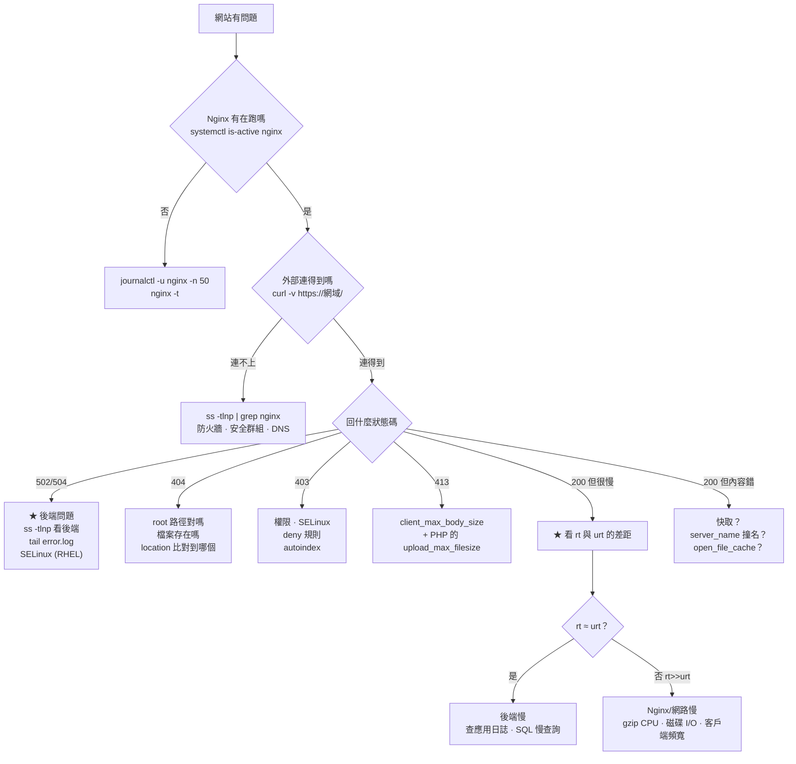

# Nginx 日誌與除錯

> [!abstract] 這篇你會學到
> - 設計一個**真的能用來排錯**的 `log_format`（含時間、快取、後端資訊）
> - 讀懂 **`error_log` 的八個等級**與最常見的訊息
> - 用 **`$request_time` 與 `$upstream_response_time`** 分辨「Nginx 慢」還是「後端慢」
> - 用純 `awk` / `grep` 做**慢請求、錯誤率、來源分析**
> - 設定 **JSON 格式日誌**與 **logrotate**
> - 建立一套**系統化的排錯流程**

## 前置知識

- [[02-Nginx-設定語法與虛擬主機]] — 變數與設定語法
- [[19-日誌系統]] — journalctl、rsyslog、logrotate 的基礎

---

## 預設日誌的問題

```nginx
# Nginx 的預設 log_format（combined）
log_format combined '$remote_addr - $remote_user [$time_local] '
                    '"$request" $status $body_bytes_sent '
                    '"$http_referer" "$http_user_agent"';
```

```
203.0.113.5 - - [28/Aug/2026:10:15:32 +0800] "GET /api/orders HTTP/1.1" 200 8421 "-" "Mozilla/5.0..."
```

> [!danger] 這份日誌無法回答任何有用的問題
> ```
> ✗ 這個請求花了多久？          → 沒有 $request_time
> ✗ 是 Nginx 慢還是後端慢？      → 沒有 $upstream_response_time
> ✗ 打到哪一台後端？             → 沒有 $upstream_addr
> ✗ 快取命中了嗎？               → 沒有 $upstream_cache_status
> ✗ 是哪個網域？                 → 沒有 $host（多站台時完全無法區分）
> ✗ 真實客戶端 IP？              → CDN 後面全部是 CDN 的 IP
> ✗ 用什麼 TLS 版本？            → 沒有 $ssl_protocol
> ```
>
> **等到出事才發現日誌不夠用，就來不及了。**

---

## 設計一個能用的 `log_format`

```nginx
http {
    # ═══════════ 主要格式（★ 建議所有站台都用這個）═══════════
    log_format main
        '$remote_addr - $remote_user [$time_local] '
        '"$request" $status $body_bytes_sent '
        '"$http_referer" "$http_user_agent" '
        # ── ★ 效能 ──
        'rt=$request_time '                    # 總處理時間
        'uct=$upstream_connect_time '          # 連到後端花了多久
        'uht=$upstream_header_time '           # 後端送回第一個位元組
        'urt=$upstream_response_time '         # 後端完整回應
        # ── ★ 後端與快取 ──
        'ua=$upstream_addr '                   # 打到哪一台
        'us=$upstream_status '                 # 後端回的狀態碼
        'cache=$upstream_cache_status '        # 快取狀態
        # ── ★ 識別 ──
        'host=$host '                          # 哪個網域
        'xff="$http_x_forwarded_for" '         # 代理鏈
        'ssl=$ssl_protocol/$ssl_cipher '       # TLS 版本
        'req=$request_length '                 # 請求大小
        'cid=$connection:$connection_requests';# 連線 ID:第幾個請求

    access_log /var/log/nginx/access.log main;
    error_log  /var/log/nginx/error.log  warn;
}
```

```
203.0.113.5 - - [28/Aug/2026:10:15:32 +0800] "GET /api/orders HTTP/2.0" 200 8421
"https://app.example.gov.tw/" "Mozilla/5.0..." rt=0.243 uct=0.001 uht=0.238 urt=0.241
ua=127.0.0.1:9000 us=200 cache=MISS host=app.example.gov.tw xff="-"
ssl=TLSv1.3/TLS_AES_128_GCM_SHA256 req=1204 cid=8842:3
```

### 四個時間變數的關係 ★★

```mermaid
gantt
    dateFormat X
    axisFormat %L ms
    section 請求生命週期
    讀取請求         :0, 5
    連到後端 (uct)   :5, 6
    等後端第一個位元組 (uht)  :6, 238
    接收後端完整回應 (urt)    :238, 241
    傳送給客戶端     :241, 243
```



| 變數 | 意義 | 診斷 |
| --- | --- | --- |
| **`$request_time`** | **從讀到第一個位元組到送出最後一個位元組的總時間** | 使用者實際感受的延遲 |
| `$upstream_connect_time` | 建立到後端的連線 | **大 = 後端過載或網路問題** |
| `$upstream_header_time` | 後端送回**回應標頭** | **大 = 後端運算慢**（SQL、外部 API） |
| `$upstream_response_time` | 後端送完**完整回應** | 與 header_time 差距大 = 回應體很大或後端串流慢 |

> [!tip] 用時間差診斷問題的三個規則 ★★★
> ```
> ① rt ≈ urt          → 【後端慢】，去查應用與資料庫
> ② rt >> urt         → 【Nginx 或網路慢】
>                        · 客戶端網路慢（行動網路、大檔案）
>                        · Nginx 磁碟 I/O（大量寫日誌、快取寫入）
>                        · gzip 壓縮吃 CPU
> ③ uct 大            → 【連不上後端】
>                        · 後端 worker 用完（PHP-FPM pm.max_children）
>                        · TCP backlog 滿了
>                        · keepalive 沒生效，每次都重新握手
> ④ uht 大、urt≈uht   → 【後端運算慢】（SQL 慢查詢、外部 API）
> ⑤ urt >> uht        → 【回應體大或串流】（正常，或該分頁）
> ```
>
> **實例**：
> ```
> rt=5.021 urt=0.043    → 後端只花 43ms，總共 5 秒
>                          → ★ 不是後端的問題，查網路 / 大檔案 / 壓縮
>
> rt=5.043 urt=5.021 uct=0.001 uht=5.019
>                        → ★ 後端運算花了 5 秒，去查應用的慢查詢
>
> rt=3.102 urt=0.050 uct=3.001
>                        → ★ 光是「連上後端」就花了 3 秒
>                          → PHP-FPM 的 worker 全滿，在排隊
> ```

### 分站台日誌

```nginx
server {
    server_name app.example.gov.tw;
    access_log /var/log/nginx/app.example.gov.tw.access.log main;
    error_log  /var/log/nginx/app.example.gov.tw.error.log  warn;
    # ...
}
```

> [!tip] 排除雜訊
> ```nginx
> # ── 健康檢查不寫日誌 ──
> location = /health {
>     access_log off;
>     return 200 "ok\n";
> }
>
> # ── 靜態資源不寫日誌（★ 可以少掉 80% 的日誌量）──
> location ~* \.(?:js|css|png|jpg|woff2|ico)$ {
>     access_log off;
>     expires 1y;
> }
>
> # ── ★ 用 map 條件式記錄（更靈活）──
> map $request_uri $loggable {
>     default    1;
>     ~^/health  0;
>     ~^/ping    0;
>     ~^/metrics 0;
> }
> map $remote_addr $not_monitor {
>     default   1;
>     10.0.9.50 0;              # 監控主機
> }
> access_log /var/log/nginx/access.log main if=$loggable;
> ```
>
> **但注意**：靜態資源關掉日誌後，
> **就無法分析「哪些資源被大量請求」與「防盜連的效果」** ——
> 建議另外寫一份精簡格式：
> ```nginx
> log_format static '$time_local $status $request_uri $body_bytes_sent';
> location ~* \.(?:jpg|png|mp4)$ {
>     access_log /var/log/nginx/static.log static buffer=64k flush=5s;
> }
> ```

### 緩衝寫入（高流量必備）

```nginx
access_log /var/log/nginx/access.log main buffer=64k flush=5s gzip=5;
#                                          ^^^^^^^^^ ^^^^^^^ ^^^^^^^
#                                          批次寫入   最多延遲  即時壓縮
```

| 參數 | 作用 |
| --- | --- |
| `buffer=64k` | **累積到 64KB 才寫入磁碟**（大幅減少 write 系統呼叫） |
| `flush=5s` | 最多延遲 5 秒，避免低流量時日誌遲遲不出現 |
| `gzip=5` | **直接寫成 gzip**（省 70-80% 磁碟，但無法直接 `tail`） |

> [!warning] `buffer` 會讓即時排錯變麻煩
> 開了 `buffer` 之後，`tail -f` 看不到最新的請求（要等 flush）。
> **排錯時可以暫時關掉**：
> ```bash
> # 暫時改成無 buffer，測完改回來
> $ sudo sed -i 's/ buffer=64k flush=5s//' /etc/nginx/sites-enabled/app
> $ sudo nginx -t && sudo systemctl reload nginx
> ```

---

## JSON 格式日誌

```nginx
# ★ 給 ELK / Loki / Wazuh 等日誌系統用
log_format json escape=json '{'
    '"time":"$time_iso8601",'
    '"remote_addr":"$remote_addr",'
    '"xff":"$http_x_forwarded_for",'
    '"host":"$host",'
    '"method":"$request_method",'
    '"uri":"$request_uri",'
    '"protocol":"$server_protocol",'
    '"status":$status,'
    '"body_bytes":$body_bytes_sent,'
    '"request_length":$request_length,'
    '"referer":"$http_referer",'
    '"user_agent":"$http_user_agent",'
    '"request_time":$request_time,'
    '"upstream_addr":"$upstream_addr",'
    '"upstream_status":"$upstream_status",'
    '"upstream_connect_time":"$upstream_connect_time",'
    '"upstream_header_time":"$upstream_header_time",'
    '"upstream_response_time":"$upstream_response_time",'
    '"cache_status":"$upstream_cache_status",'
    '"ssl_protocol":"$ssl_protocol",'
    '"ssl_cipher":"$ssl_cipher",'
    '"scheme":"$scheme",'
    '"connection":"$connection",'
    '"connection_requests":$connection_requests'
'}';

access_log /var/log/nginx/access.json.log json;
```

> [!danger] `escape=json` 不能省
> **沒有它，使用者送來的 User-Agent 或 Referer 中的引號會破壞 JSON 格式**：
> ```json
> {"user_agent":"Mozilla/5.0 "evil" ", "status":200}
>                              ^^^^^^ ★ JSON 解析失敗
> ```
> 更嚴重的是**日誌注入攻擊** ——
> 攻擊者可以送出精心構造的 UA，
> **在日誌中偽造出額外的 JSON 欄位或整筆記錄**，
> 誤導後續的分析與告警。
>
> `escape=json` 會正確跳脫所有特殊字元。
> （非 JSON 格式可以用 `escape=default`，會把不可見字元轉成 `\xXX`。）

```bash
# 用 jq 分析 JSON 日誌
$ jq -r 'select(.status >= 500) | "\(.time) \(.status) \(.uri) rt=\(.request_time)"' \
    /var/log/nginx/access.json.log | tail -20

# 最慢的 20 個請求
$ jq -r 'select(.request_time > 1) | [.request_time, .status, .uri] | @tsv' \
    /var/log/nginx/access.json.log | sort -rn | head -20

# 各狀態碼統計
$ jq -r '.status' /var/log/nginx/access.json.log | sort | uniq -c | sort -rn

# P95 延遲
$ jq -r '.request_time' /var/log/nginx/access.json.log | sort -n | \
    awk '{a[NR]=$1} END {printf "P50=%.3f P95=%.3f P99=%.3f\n", a[int(NR*0.5)], a[int(NR*0.95)], a[int(NR*0.99)]}'
```

---

## `error_log`：八個等級

```nginx
error_log /var/log/nginx/error.log warn;
#                                  ^^^^ 記錄這個等級【以上】的訊息
```

| 等級 | 何時用 | 典型訊息 |
| --- | --- | --- |
| `emerg` | 系統無法啟動 | 設定檔語法錯誤 |
| `alert` | 需要立刻處理 | — |
| `crit` | 嚴重錯誤 | `SSL_do_handshake() failed` |
| **`error`** | **請求失敗** | `connect() failed`、`upstream timed out`、`open() failed` |
| **`warn`** | **⭐ 正式環境建議** | `an upstream response is buffered to a temporary file` |
| `notice` | 一般通知 | rewrite 的訊息 |
| `info` | 詳細資訊 | 用戶端提早關閉連線 |
| `debug` | **極詳細**（需 `--with-debug`） | 每一個處理步驟 |

> [!danger] 正式環境絕對不要開 `debug`
> ```
> 每個請求會產生【數百行】日誌
>   → 磁碟秒滿
>     → Nginx 寫不了日誌
>       → 【服務中斷】
> ```
> **要用也只對特定 IP 開**：
> ```nginx
> events {
>     debug_connection 203.0.113.5;        # ★ 只對這個 IP 開 debug
>     debug_connection 10.0.9.0/24;
> }
> error_log /var/log/nginx/debug.log debug;
> ```
> 這需要 `--with-debug` 編譯的 Nginx（`nginx -V 2>&1 | grep -o with-debug`）。
>
> **不需要 debug 版本的替代品**：
> ```nginx
> rewrite_log on;                                # rewrite 的處理過程
> error_log /var/log/nginx/rewrite.log notice;
> ```

### 最常見的 error_log 訊息

| 訊息 | 意思 | 處理 |
| --- | --- | --- |
| **`connect() failed (111: Connection refused)`** | **後端沒在聽** | `ss -tlnp`、啟動後端 |
| **`connect() failed (13: Permission denied)`** | **socket 權限 / SELinux** | 檢查 socket 權限、`setsebool -P httpd_can_network_connect 1` |
| **`upstream timed out (110: Connection timed out)`** | 後端太慢 | 調 `proxy_read_timeout`；**根本解法是改非同步** |
| **`upstream prematurely closed connection`** | **後端崩潰 / OOM / 自己的逾時到了** | 看後端日誌、`dmesg | grep -i oom` |
| `upstream sent too big header` | 後端標頭超過 buffer | `proxy_buffer_size 32k;` |
| **`open() "..." failed (2: No such file or directory)`** | **檔案不存在** | 檢查 `root` 路徑、部署是否完成 |
| `open() failed (13: Permission denied)` | Nginx 讀不到檔案 | 檢查目錄的 `x` 權限、SELinux |
| **`worker_connections are not enough`** | **連線數用完** | 調大 `worker_connections` |
| `too many open files` | fd 上限 | `worker_rlimit_nofile 65535;` + systemd `LimitNOFILE` |
| **`an upstream response is buffered to a temporary file`** | **回應太大，寫到磁碟了** | 調大 `proxy_buffers`；或這是正常的大檔案 |
| `client intended to send too large body` | 超過 `client_max_body_size` | 調大它（**與 PHP 設定一起**） |
| **`SSL_do_handshake() failed`** | TLS 握手失敗 | 客戶端太舊 / cipher 不相容 / 掃描器 |
| `no live upstreams` | 所有後端都被標記失敗 | 檢查後端；調 `max_fails` |
| `directory index of "..." is forbidden` | 目錄沒有 index 檔且 autoindex off | **這通常是正確的行為** |
| `client closed connection while waiting` | 使用者關掉分頁了 | 通常可忽略（除非大量出現） |

---

## 用 awk 做日誌分析

```bash
#!/usr/bin/env bash
# /usr/local/bin/nginx-log-report —— Nginx 日誌分析報告
LOG="${1:-/var/log/nginx/access.log}"
N="${2:-100000}"
echo "═══ Nginx 日誌分析：$LOG（最近 $N 筆）═══"

TMP=$(mktemp); trap 'rm -f "$TMP"' EXIT
tail -n "$N" "$LOG" > "$TMP"
TOTAL=$(wc -l < "$TMP")
echo "  總筆數：$TOTAL"

echo -e "\n【1】狀態碼分布"
awk '{for(i=1;i<=NF;i++) if($i ~ /^"(GET|POST|PUT|DELETE|HEAD|PATCH|OPTIONS)/) {print $(i+2); break}}' "$TMP" | \
  sort | uniq -c | sort -rn | head -12 | \
  awk -v t="$TOTAL" '{printf "  %-6s %8d  %5.2f%%\n", $2, $1, $1*100/t}'

echo -e "\n【2】★ 5xx 錯誤（最近 20 筆）"
grep -E '" 5[0-9]{2} ' "$TMP" | tail -20 | \
  awk '{print "  " $4, $6, $7, $9}' || echo "  ✓ 沒有 5xx"

echo -e "\n【3】★ 最慢的 20 個請求"
grep -oP 'rt=\K[0-9.]+' "$TMP" >/dev/null 2>&1 && {
  awk '{
    rt=""; uri=""; st="";
    for(i=1;i<=NF;i++) {
      if($i ~ /^rt=/)  rt=substr($i,4)
      if($i ~ /^"(GET|POST|PUT|DELETE|PATCH)/) {uri=$(i+1); st=$(i+2)}
    }
    if(rt != "") printf "%s %s %s\n", rt, st, uri
  }' "$TMP" | sort -rn | head -20 | awk '{printf "  %8.3fs  %s  %s\n", $1, $2, $3}'
} || echo "  ⚠ log_format 中沒有 rt= 欄位，請改用本篇的 main 格式"

echo -e "\n【4】★ 延遲百分位數"
awk '{for(i=1;i<=NF;i++) if($i ~ /^rt=/) print substr($i,4)}' "$TMP" | sort -n | \
  awk '{a[NR]=$1} END {
    if (NR==0) {print "  （無資料）"; exit}
    printf "  P50=%.3fs  P90=%.3fs  P95=%.3fs  P99=%.3fs  Max=%.3fs\n",
           a[int(NR*0.50)], a[int(NR*0.90)], a[int(NR*0.95)], a[int(NR*0.99)], a[NR]
  }'

echo -e "\n【5】★ Nginx 慢 vs 後端慢"
awk '{
  rt=""; urt="";
  for(i=1;i<=NF;i++) {
    if($i ~ /^rt=/)  rt=substr($i,4)
    if($i ~ /^urt=/) urt=substr($i,5)
  }
  if(rt+0 > 1 && urt != "" && urt != "-") {
    if (urt+0 > rt*0.8) backend++
    else nginx++
  }
} END {
  printf "  慢請求(>1s) 中：後端慢 %d 筆，Nginx/網路慢 %d 筆\n", backend, nginx
  if (nginx > backend) print "  ★ 主要瓶頸在 Nginx 或網路，查壓縮/磁碟/客戶端頻寬"
  else if (backend > 0) print "  ★ 主要瓶頸在後端，查應用與資料庫"
}' "$TMP"

echo -e "\n【6】流量最大的 15 個路徑"
awk '{for(i=1;i<=NF;i++) if($i ~ /^"(GET|POST|PUT|DELETE|PATCH)/) {print $(i+1); break}}' "$TMP" | \
  sed 's/?.*//' | sort | uniq -c | sort -rn | head -15 | \
  awk '{printf "  %8d  %s\n", $1, $2}'

echo -e "\n【7】★ 請求數最多的 15 個 IP"
awk '{print $1}' "$TMP" | sort | uniq -c | sort -rn | head -15 | \
  awk -v t="$TOTAL" '{printf "  %8d  %5.2f%%  %s\n", $1, $1*100/t, $2}'

echo -e "\n【8】★ 可疑掃描（單一 IP 產生大量 404）"
grep '" 404 ' "$TMP" | awk '{print $1}' | sort | uniq -c | sort -rn | head -10 | \
  awk '$1 > 50 {printf "  ⚠ %6d 次 404  %s\n", $1, $2}' || echo "  ✓ 沒有異常"

echo -e "\n【9】快取命中率"
grep -oP 'cache=\K\S+' "$TMP" | sort | uniq -c | sort -rn | \
  awk '{c[$2]=$1; t+=$1} END {
    if (t==0) {print "  （未啟用 proxy_cache）"; exit}
    for(k in c) printf "  %-12s %8d  %5.1f%%\n", k, c[k], c[k]*100/t
    printf "  ─────────────────────────\n  命中率 %.1f%%\n", (c["HIT"]+c["STALE"])*100/t
  }'

echo -e "\n【10】TLS 版本分布"
grep -oP 'ssl=\K[^/ ]+' "$TMP" | sort | uniq -c | sort -rn | \
  awk '{printf "  %-12s %8d\n", $1, $2}' || echo "  （log_format 無 ssl 欄位）"

echo -e "\n【11】User-Agent 前 10（判斷爬蟲比例）"
grep -oP '"[^"]*"\s*rt=' "$TMP" 2>/dev/null | head -0
awk -F'"' '{print $6}' "$TMP" | cut -c1-60 | sort | uniq -c | sort -rn | head -10 | \
  awk '{c=$1; $1=""; printf "  %8d %s\n", c, $0}'

echo -e "\n【12】每小時請求量"
awk '{print substr($4, 2, 14)}' "$TMP" | sort | uniq -c | tail -24 | \
  awk '{printf "  %s  %6d  ", $2, $1; for(i=0;i<$1/50 && i<50;i++) printf "▇"; print ""}'
```

### 即時監控的單行指令

```bash
# ── 即時看 5xx ──
$ sudo tail -f /var/log/nginx/access.log | grep --line-buffered -E '" 5[0-9]{2} '

# ── 即時看慢請求（> 1 秒）──
$ sudo tail -f /var/log/nginx/access.log | \
    awk '{for(i=1;i<=NF;i++) if($i ~ /^rt=/ && substr($i,4)+0 > 1) {print; break}}'

# ── 每秒請求數 ──
$ sudo tail -f /var/log/nginx/access.log | \
    awk '{print substr($4,14,8)}' | uniq -c

# ── 即時的狀態碼分布（每 2 秒更新）──
$ watch -n2 'tail -2000 /var/log/nginx/access.log | \
    grep -oP "\" \K[0-9]{3}" | sort | uniq -c | sort -rn'

# ── 找出正在攻擊的 IP ──
$ sudo tail -20000 /var/log/nginx/access.log | awk '{print $1}' | \
    sort | uniq -c | sort -rn | head -20

# ── 某個 IP 做了什麼 ──
$ sudo grep '^203.0.113.5 ' /var/log/nginx/access.log | \
    awk '{print $9, $7}' | sort | uniq -c | sort -rn | head -30

# ── 掃描特徵（.env、.git、wp-admin…）──
$ sudo grep -E '\.(env|git|sql|bak)|wp-admin|phpmyadmin|\.\./' \
    /var/log/nginx/access.log | awk '{print $1, $7, $9}' | sort | uniq -c | sort -rn | head -20

# ── error_log 的錯誤類型統計 ──
$ sudo grep -oP '\[(error|crit|alert)\] .*?(?=,|$)' /var/log/nginx/error.log | \
    sed 's/.*\] //; s/[0-9]\+/N/g' | sort | uniq -c | sort -rn | head -20
```

---

## logrotate

```bash
# Ubuntu / Debian 的預設設定
$ cat /etc/logrotate.d/nginx
```

```
/var/log/nginx/*.log {
    daily
    missingok
    rotate 30              # ★ 保留 30 天（依法規需求調整）
    compress
    delaycompress
    notifempty
    create 0640 www-data adm
    sharedscripts
    prerotate
        if [ -d /etc/logrotate.d/httpd-prerotate ]; then \
            run-parts /etc/logrotate.d/httpd-prerotate; \
        fi \
    endscript
    postrotate
        # ★ USR1 訊號讓 Nginx 重新開啟日誌檔（不中斷服務）
        if [ -f /run/nginx.pid ]; then
            kill -USR1 $(cat /run/nginx.pid)
        fi
    endscript
}
```

> [!danger] 沒有 `postrotate` 的 `kill -USR1` 會怎樣
> ```
> logrotate 把 access.log 改名成 access.log.1
>   → 但 Nginx 還握著【原本那個檔案的 fd】
>     → 繼續寫進【已經改名的檔案】
>       → 新的 access.log 【永遠是空的】
>         → 而磁碟空間【一直被舊 fd 佔著，即使檔案被刪也不會釋放】
> ```
>
> **症狀**：
> ```bash
> $ ls -la /var/log/nginx/access.log
> -rw-r----- 1 www-data adm 0 Aug 28 00:00 access.log     ← ★ 一直是 0
>
> $ df -h /var
> /dev/sda2  50G  49G  0G  100%  /var                     ← 磁碟滿了
> $ du -sh /var/log/nginx
> 1.2G  /var/log/nginx                                     ← ★ 對不上
>
> $ sudo lsof +L1 | grep nginx                             # ★ 找已刪除但仍被開啟的檔案
> nginx  1234 www-data 5w REG 8,2 47000000000 0 /var/log/nginx/access.log (deleted)
> #                                                                        ^^^^^^^^^
> ```
>
> **緊急處理**：`sudo kill -USR1 $(cat /run/nginx.pid)`

```bash
# ★ 測試 logrotate 設定（不實際執行）
$ sudo logrotate -d /etc/logrotate.d/nginx

# ★ 強制執行一次
$ sudo logrotate -vf /etc/logrotate.d/nginx

# 檢查是否有「已刪除但仍佔空間」的日誌
$ sudo lsof +L1 2>/dev/null | grep -E 'nginx|deleted'
```

> [!tip] 高流量站台改用 size 觸發
> ```
> /var/log/nginx/*.log {
>     size 500M              # ★ 超過 500MB 就輪替（不等到隔天）
>     rotate 20
>     compress
>     ...
> }
> ```
> 並確認 logrotate 的執行頻率夠高：
> ```bash
> $ systemctl list-timers logrotate
> # 預設一天一次 → 高流量時要改成每小時
> $ sudo systemctl edit logrotate.timer
> [Timer]
> OnCalendar=
> OnCalendar=hourly
> ```

---

## 完整實戰範例

### 系統化排錯流程

```bash
#!/usr/bin/env bash
# /usr/local/bin/nginx-diag —— Nginx 全面診斷
echo "═══ Nginx 診斷 $(hostname) $(date '+%F %T') ═══"

echo -e "\n【1】服務狀態"
systemctl is-active nginx >/dev/null && echo "  ✓ 執行中" || echo "  ✗✗ 未執行"
systemctl status nginx --no-pager -n 5 2>/dev/null | tail -6 | sed 's/^/  /'

echo -e "\n【2】設定語法"
sudo nginx -t 2>&1 | sed 's/^/  /'

echo -e "\n【3】版本與編譯選項"
nginx -v 2>&1 | sed 's/^/  /'
nginx -V 2>&1 | tr ' ' '\n' | grep -E '^--with-(http_v2|http_v3|threads|debug)' | sed 's/^/  /'

echo -e "\n【4】監聽的埠"
sudo ss -tlnp | grep nginx | sed 's/^/  /'

echo -e "\n【5】worker 程序"
echo "  worker_processes 設定：$(sudo nginx -T 2>/dev/null | grep -oP 'worker_processes\s+\K\S+' | tr -d ';')"
echo "  實際 worker 數量：$(pgrep -c -f 'nginx: worker')"
echo "  CPU 核心數：$(nproc)"

echo -e "\n【6】★ 連線與檔案描述元"
CONN=$(sudo ss -tan state established 2>/dev/null | grep -cE ':(80|443)\b')
WC=$(sudo nginx -T 2>/dev/null | grep -oP 'worker_connections\s+\K\d+' | head -1)
WP=$(pgrep -c -f 'nginx: worker')
MAX=$(( ${WC:-512} * ${WP:-1} ))
echo "  目前連線：$CONN / 上限約 $MAX"
awk -v c="$CONN" -v m="$MAX" 'BEGIN {
  if (m>0 && c*100/m > 70) printf "  ⚠ 使用率 %.0f%% —— 考慮調大 worker_connections\n", c*100/m
}'
for pid in $(pgrep -f 'nginx: worker' | head -3); do
    fd=$(sudo ls /proc/"$pid"/fd 2>/dev/null | wc -l)
    lim=$(sudo cat /proc/"$pid"/limits 2>/dev/null | awk '/open files/{print $4}')
    echo "  PID $pid: $fd / $lim fd"
done

echo -e "\n【7】★ error_log 近期錯誤（分類統計）"
for log in /var/log/nginx/*error*.log; do
    [ -e "$log" ] || continue
    n=$(grep -c '\[error\]\|\[crit\]\|\[alert\]' "$log" 2>/dev/null || echo 0)
    [ "$n" -eq 0 ] && continue
    echo "  ── $(basename "$log")（$n 筆）──"
    grep -hoP '\[(error|crit|alert)\] \d+#\d+: \K[^,]*' "$log" 2>/dev/null | \
      sed 's/[0-9]\{2,\}/N/g; s/"[^"]*"/"X"/g' | sort | uniq -c | sort -rn | head -8 | \
      sed 's/^/    /'
done

echo -e "\n【8】★ 近 1 小時的錯誤率"
for log in /var/log/nginx/*access*.log; do
    [ -e "$log" ] || continue
    H=$(date '+%d/%b/%Y:%H')
    T=$(grep -c "\[$H" "$log" 2>/dev/null || echo 0)
    [ "$T" -eq 0 ] && continue
    E5=$(grep "\[$H" "$log" 2>/dev/null | grep -cE '" 5[0-9]{2} ' || echo 0)
    E4=$(grep "\[$H" "$log" 2>/dev/null | grep -cE '" 4[0-9]{2} ' || echo 0)
    awk -v n="$(basename "$log")" -v t="$T" -v e5="$E5" -v e4="$E4" 'BEGIN {
        printf "  %-32s 總計 %6d  5xx %5d (%.2f%%) %s  4xx %5d (%.1f%%)\n",
               n, t, e5, e5*100/t, (e5*100/t > 1 ? "⚠" : "✓"), e4, e4*100/t
    }'
done

echo -e "\n【9】★ 慢請求（近 1 小時 > 3 秒）"
H=$(date '+%d/%b/%Y:%H')
grep -h "\[$H" /var/log/nginx/*access*.log 2>/dev/null | \
  awk '{
    rt=""; urt=""; uri=""; st=""
    for(i=1;i<=NF;i++) {
      if($i ~ /^rt=/) rt=substr($i,4)
      if($i ~ /^urt=/) urt=substr($i,5)
      if($i ~ /^"(GET|POST|PUT|DELETE|PATCH)/) {uri=$(i+1); st=$(i+2)}
    }
    if(rt+0 > 3) printf "  %7.2fs (後端 %ss) %s %s\n", rt, urt, st, uri
  }' | sort -rn | head -10 || echo "  ✓ 沒有慢請求"

echo -e "\n【10】磁碟空間"
df -h /var/log | tail -1 | awk '{printf "  /var/log: %s 已用 %s（%s）%s\n", $2, $3, $5,
    (int($5) > 80 ? "⚠" : "✓")}'
echo "  日誌大小：$(du -sh /var/log/nginx 2>/dev/null | cut -f1)"

echo -e "\n【11】★ 已刪除但仍佔空間的日誌（logrotate 問題）"
DEL=$(sudo lsof +L1 2>/dev/null | grep nginx | grep deleted)
if [ -n "$DEL" ]; then
    echo "$DEL" | awk '{printf "  ⚠⚠ %s（%.1f GB）\n", $NF, $8/1073741824}'
    echo "  → 執行 sudo kill -USR1 \$(cat /run/nginx.pid)"
else
    echo "  ✓ 沒有"
fi

echo -e "\n【12】後端連通性"
sudo nginx -T 2>/dev/null | grep -oP '(proxy_pass|fastcgi_pass)\s+\K\S+' | \
  tr -d ';' | sort -u | while read -r b; do
    case "$b" in
        unix:*) p="${b#unix:}"
                [ -S "$p" ] && echo "  ✓ $b" || echo "  ✗ $b 【socket 不存在】" ;;
        http*://127.0.0.1:*|http*://localhost:*)
                port="${b##*:}"; port="${port%%/*}"
                timeout 2 bash -c "echo >/dev/tcp/127.0.0.1/$port" 2>/dev/null \
                  && echo "  ✓ $b" || echo "  ✗ $b 【連不上】" ;;
        *)      echo "  ○ $b（外部或 upstream 名稱，未檢查）" ;;
    esac
done

echo -e "\n【13】logrotate"
sudo logrotate -d /etc/logrotate.d/nginx 2>&1 | grep -iE 'error|not found' | sed 's/^/  ⚠ /' \
  || echo "  ✓ 設定正常"
grep -q 'USR1' /etc/logrotate.d/nginx 2>/dev/null \
  && echo "  ✓ 有 kill -USR1（輪替後會重開日誌）" \
  || echo "  ✗✗ 【缺少 kill -USR1 —— 輪替後日誌會停止寫入】"
```

### 排錯決策樹



### 常見場景的排查指令組合

```bash
# ════ 場景 A：使用者說「網站很慢」 ════
# 【1】確認是否真的慢、慢在哪
$ sudo tail -50000 /var/log/nginx/access.log | \
    awk '{for(i=1;i<=NF;i++){if($i~/^rt=/)r=substr($i,4); if($i~/^urt=/)u=substr($i,5)}
          if(r!="")printf "%s %s\n",r,u}' | sort -rn | head -20

# 【2】P95 延遲趨勢（比對正常時期）
$ sudo tail -50000 /var/log/nginx/access.log | grep -oP 'rt=\K[0-9.]+' | sort -n | \
    awk '{a[NR]=$1} END {printf "P50=%.3f P95=%.3f P99=%.3f\n",
          a[int(NR*.5)],a[int(NR*.95)],a[int(NR*.99)]}'

# 【3】判斷是 Nginx 還是後端
# rt ≈ urt → 後端；rt >> urt → Nginx/網路

# 【4】看系統資源
$ top -bn1 | head -15
$ iostat -x 1 3
$ sudo ss -s

# ════ 場景 B：突然大量 502 ════
$ sudo tail -100 /var/log/nginx/error.log
$ sudo ss -tlnp | grep -E ':(3000|9000)'
$ sudo systemctl status php8.3-fpm
$ pm2 list
$ dmesg | grep -i 'out of memory'                 # ★ 後端被 OOM killer 殺了？
$ sudo journalctl -u php8.3-fpm --since '10 min ago'
# PHP-FPM 的 worker 用完？
$ sudo grep -E 'max_children|server reached' /var/log/php8.3-fpm.log | tail

# ════ 場景 C：磁碟滿了 ════
$ df -h
$ du -sh /var/log/* | sort -h | tail -10
$ sudo lsof +L1 | grep deleted                     # ★ 已刪除但仍佔空間
$ sudo kill -USR1 $(cat /run/nginx.pid)            # 重開日誌檔
$ sudo logrotate -vf /etc/logrotate.d/nginx

# ════ 場景 D：疑似被攻擊 ════
$ sudo tail -50000 /var/log/nginx/access.log | awk '{print $1}' | \
    sort | uniq -c | sort -rn | head -20
$ sudo tail -50000 /var/log/nginx/access.log | \
    grep -E '\.(env|git|sql)|wp-admin|\.\./|union.*select' | head -20
$ sudo ss -tan state established | awk '{print $5}' | cut -d: -f1 | \
    sort | uniq -c | sort -rn | head -20
# 臨時封鎖
$ sudo iptables -I INPUT -s 203.0.113.5 -j DROP
```

---

## 常見錯誤與排錯

| 現象／錯誤 | 原因 | 解法 |
| --- | --- | --- |
| **日誌檔一直是 0 位元組** ★ | **logrotate 後沒有 `kill -USR1`** | 在 postrotate 加 `kill -USR1`；立刻執行一次 |
| **磁碟滿了但 `du` 對不上** ★ | 已刪除的檔案仍被 fd 佔著 | `lsof +L1`；`kill -USR1` |
| `tail -f` 看不到最新請求 | `access_log` 設了 `buffer=` | 排錯時暫時移除 buffer |
| **無法分辨是哪個網域的請求** | log_format 缺 `$host` | 加 `host=$host` |
| **不知道請求花了多久** | 缺 `$request_time` | 加 `rt=$request_time` |
| **JSON 日誌解析失敗** | **缺 `escape=json`** | `log_format json escape=json '{...}'` |
| CDN 後面全是 CDN 的 IP | 沒有 real_ip 或缺 `$http_x_forwarded_for` | 設定 `set_real_ip_from`；日誌加 xff |
| 日誌成長太快 | 靜態資源也記錄 | 靜態資源 `access_log off` 或另外寫一份精簡格式 |
| **開 debug 後磁碟秒滿** | debug 每請求數百行 | 只對特定 IP：`debug_connection 1.2.3.4;` |
| `rewrite_log on` 沒作用 | error_log 等級太高 | `error_log /path notice;` |
| 找不到 error_log | 每個 server 有各自的 error_log | `nginx -T | grep error_log` |
| **看不到某些錯誤** | error_log 等級設太高 | 排錯時暫時改成 `info` |
| logrotate 沒執行 | timer 沒啟用 | `systemctl status logrotate.timer` |
| 日誌權限錯誤 | `create` 的使用者不對 | Ubuntu `www-data adm`；RHEL `nginx adm` |

> [!info]- Rocky / AlmaLinux（RHEL 系）對照
> ```bash
> # 日誌位置相同，但擁有者不同
> $ ls -l /var/log/nginx/
> -rw-r----- 1 nginx adm ...          # ★ nginx，不是 www-data
>
> # logrotate 設定
> $ cat /etc/logrotate.d/nginx
> create 0640 nginx adm               # ★
>
> # ★ SELinux 相關的錯誤在 audit.log 而不是 nginx error.log
> $ sudo ausearch -m avc -ts recent | grep nginx
> $ sudo tail -f /var/log/audit/audit.log | grep nginx
>
> # 若要讓 Nginx 寫日誌到非標準位置
> $ sudo semanage fcontext -a -t httpd_log_t "/data/logs(/.*)?"
> $ sudo restorecon -Rv /data/logs
>
> # systemd 的日誌
> $ sudo journalctl -u nginx -f
> ```

---

## 安全性注意事項

> [!danger] 日誌本身含有個資
> ```
> access.log 中的個資：
>   · 客戶端 IP（★ 在多數法規下屬於個人資料）
>   · Referer（可能含有搜尋關鍵字、內部路徑）
>   · URL 中的參數（★ 若程式把 email、身分證字號放在 query string）
>   · Cookie（若 log_format 記錄了）
> ```
>
> **對應個資法的四個要求**：
> ```
> ① 保存期限：不要無限期保留（logrotate rotate 30-90）
> ② 存取控制：chmod 640、chown root:adm
> ③ 傳輸加密：送到中央日誌系統要用 TLS
> ④ ★ 不要記錄敏感參數
> ```
>
> ```nginx
> # ★ 過濾 URL 中的敏感參數
> map $request_uri $safe_uri {
>     default $request_uri;
>     ~^(?<p>.*)[?&](token|password|api_key|secret|id_no)=[^&]*(?<r>.*)$  "$p?[REDACTED]$r";
> }
> log_format safe '$remote_addr - [$time_local] "$request_method $safe_uri" $status ...';
> ```
>
> **更根本的做法**：**不要把敏感資料放在 URL 中**（用 POST body 或標頭）。

> [!warning] 日誌注入攻擊
> ```
> 攻擊者送出：
>   User-Agent: Mozilla/5.0\n1.2.3.4 - - [28/Aug/2026] "GET /admin" 200
>
> → 若沒有跳脫，日誌中會【多出一行偽造的記錄】
>   → 誤導事件調查
>     → 或讓自動化的日誌解析工具產生錯誤的告警
> ```
>
> **防護**：
> ```nginx
> log_format main escape=default '...';       # ★ 把不可見字元轉成 \xXX
> log_format json escape=json    '{...}';     # ★ JSON 格式必用
> ```
> Nginx 1.11.8 之後 `escape=default` 是預設值，但**明確寫出來比較保險**。

> [!warning] 日誌檔的權限
> ```bash
> $ ls -l /var/log/nginx/
> -rw-r----- 1 www-data adm 12M Aug 28 10:30 access.log
> #  ^^^^^^^^^ ★ 只有擁有者與 adm 群組可讀
>
> $ ls -ld /var/log/nginx
> drwxr-x--- 2 root adm 4096 Aug 28 00:00 /var/log/nginx
> ```
> **絕對不要**：
> ```
> ❌ chmod 644（其他使用者可讀到所有訪客 IP 與行為）
> ❌ 把日誌目錄放在 web root 內
> ❌ 用 http://網站/logs/access.log 提供日誌查閱
> ```
> **檢查**：
> ```bash
> $ curl -sI https://網站/logs/access.log | head -1     # 必須 404
> $ sudo find /var/www -name '*.log' 2>/dev/null        # 必須沒有輸出
> ```

> [!tip] 把日誌送到中央系統
> 日誌留在被攻陷的主機上**隨時可能被攻擊者刪除或竄改**。
> ```nginx
> # ★ 同時寫本機與遠端 syslog
> access_log /var/log/nginx/access.log main;
> access_log syslog:server=10.0.9.20:514,facility=local7,tag=nginx,severity=info json;
> error_log  syslog:server=10.0.9.20:514,facility=local7,tag=nginx_err warn;
> ```
> 見 [[02-日誌集中與輪替]] 與 [[00-Wazuh資安監控-索引]]。
>
> **中央日誌系統的三個要求**：
> ①**傳輸加密**（TLS，避免日誌在網路上明文）；
> ②**寫入後不可修改**（WORM 或至少嚴格的權限）；
> ③**時間同步**（NTP —— 沒有一致的時間戳就無法關聯多台主機的事件）。

---

## 速查表

### 建議的 log_format

```nginx
log_format main escape=default
    '$remote_addr - $remote_user [$time_local] '
    '"$request" $status $body_bytes_sent '
    '"$http_referer" "$http_user_agent" '
    'rt=$request_time uct=$upstream_connect_time '
    'uht=$upstream_header_time urt=$upstream_response_time '
    'ua=$upstream_addr us=$upstream_status cache=$upstream_cache_status '
    'host=$host xff="$http_x_forwarded_for" ssl=$ssl_protocol/$ssl_cipher '
    'req=$request_length cid=$connection:$connection_requests';

access_log /var/log/nginx/access.log main buffer=64k flush=5s;
error_log  /var/log/nginx/error.log  warn;
```

### 四個時間變數的診斷 ★★

```
rt  = $request_time            使用者感受的總延遲
uct = $upstream_connect_time   連到後端
uht = $upstream_header_time    後端第一個位元組
urt = $upstream_response_time  後端完整回應

rt ≈ urt        → ★ 後端慢（查應用、SQL）
rt >> urt       → ★ Nginx/網路慢（壓縮、磁碟、客戶端頻寬）
uct 大          → ★ 連不上後端（worker 用完、backlog 滿）
uht 大 urt≈uht  → ★ 後端運算慢
urt >> uht      → 回應體大或串流（可能正常）
```

### error_log 等級

```
emerg alert crit error warn notice info debug
                        ^^^^ ★ 正式環境建議
★ debug 只對特定 IP：events { debug_connection 1.2.3.4; }
★ rewrite_log on; error_log ... notice;   （不需要 debug 版本）
```

### 常見 error_log 訊息

| 訊息 | 原因 |
| --- | --- |
| `connect() failed (111: Connection refused)` | 後端沒在聽 |
| `connect() failed (13: Permission denied)` | socket 權限 / **SELinux** |
| `upstream timed out (110)` | 後端太慢 |
| `upstream prematurely closed` | 後端崩潰 / OOM |
| `upstream sent too big header` | 調大 `proxy_buffer_size` |
| `open() failed (2: No such file)` | 檔案不存在 / root 路徑錯 |
| `worker_connections are not enough` | 調大 `worker_connections` |
| `too many open files` | `worker_rlimit_nofile 65535;` |

### 分析單行指令

```bash
# 狀態碼分布
grep -oP '" \K[0-9]{3}' access.log | sort | uniq -c | sort -rn

# 最慢的 20 個
awk '{for(i=1;i<=NF;i++)if($i~/^rt=/){print substr($i,4), $7}}' access.log | sort -rn | head -20

# 百分位數
grep -oP 'rt=\K[0-9.]+' access.log | sort -n | \
  awk '{a[NR]=$1} END {printf "P50=%.3f P95=%.3f P99=%.3f\n",a[int(NR*.5)],a[int(NR*.95)],a[int(NR*.99)]}'

# 請求最多的 IP
awk '{print $1}' access.log | sort | uniq -c | sort -rn | head -20

# 掃描特徵
grep -E '\.(env|git|sql)|wp-admin|\.\./|union.*select' access.log | awk '{print $1,$7}' | sort | uniq -c | sort -rn

# 快取命中率
grep -oP 'cache=\K\S+' access.log | sort | uniq -c | sort -rn

# error_log 分類
grep -oP '\[error\] .*?(?=,)' error.log | sed 's/[0-9]\+/N/g' | sort | uniq -c | sort -rn
```

### logrotate 的關鍵

```
postrotate
    kill -USR1 $(cat /run/nginx.pid)      # ★★ 沒有這行日誌會停止寫入
endscript
```

```bash
sudo logrotate -d /etc/logrotate.d/nginx    # 測試
sudo logrotate -vf /etc/logrotate.d/nginx   # 強制執行
sudo lsof +L1 | grep nginx                  # ★ 找已刪除但佔空間的檔案
sudo kill -USR1 $(cat /run/nginx.pid)       # 緊急重開日誌
```

### 排錯決策樹

```
Nginx 沒跑        → journalctl -u nginx；nginx -t
連不上            → ss -tlnp；防火牆；DNS
502/504           → ★ 後端問題：ss -tlnp；error.log；dmesg|grep -i oom；SELinux
404               → root 路徑；檔案存在？location 比對到哪個
403               → 權限；SELinux；deny 規則
413               → client_max_body_size + PHP upload_max_filesize
200 但慢          → ★ 比對 rt 與 urt
200 但內容錯      → 快取？server_name 撞名？open_file_cache？
磁碟滿            → lsof +L1 | grep deleted；kill -USR1
```

### 安全四條

```
① 日誌含個資 → chmod 640、rotate 30-90 天、不放 web root
② escape=json（JSON 格式必用）防日誌注入
③ 過濾 URL 中的 token/password（更好的是不要放在 URL）
④ 送中央日誌系統（TLS + 不可修改 + NTP 時間同步）
```

---

## 練習題

> [!question]- 練習 1：升級你的 log_format
> 1. 記下目前的 log_format
> 2. 換成本篇的 `main` 格式
> 3. 產生一些請求（正常的、慢的、404、502）
> 4. **對照日誌，說出每個欄位的意義**
> 5. 特別觀察一次慢請求的 `rt` 與 `urt` 差距
> 6. **人為製造三種情況並觀察日誌**：
>    - 後端 `sleep(3)` → 看 `uht`
>    - 下載一個 100MB 的檔案 → 看 `rt` 與 `urt` 的差距
>    - 停掉後端 → 看 `uct` 與 error_log

> [!question]- 練習 2：重現 logrotate 事故
> 1. 手動模擬：`sudo mv /var/log/nginx/access.log /var/log/nginx/access.log.old`
> 2. **不要** `kill -USR1`
> 3. 產生一些請求
> 4. 觀察：`ls -la /var/log/nginx/access.log`（**新檔案有出現嗎？**）
> 5. `sudo lsof +L1 | grep nginx`
> 6. `sudo kill -USR1 $(cat /run/nginx.pid)`
> 7. **再看一次** —— 新日誌開始寫了嗎？
> 8. 檢查你的 `/etc/logrotate.d/nginx` 有沒有 `kill -USR1`

> [!question]- 練習 3：慢請求歸因
> 建立三個測試端點：
> ```php
> // A：後端慢
> <?php sleep(3); echo "slow backend";
> // B：回應體大
> <?php echo str_repeat("x", 50 * 1024 * 1024);
> // C：正常
> <?php echo "fast";
> ```
> 1. 各請求一次，記下 `rt`、`uct`、`uht`、`urt`
> 2. **用本篇的三個規則判斷各是哪種問題**
> 3. 再用 `curl --limit-rate 100k` 模擬慢客戶端請求 C
> 4. **觀察 `rt` 與 `urt` 的差距** —— 這是哪一種？

> [!question]- 練習 4：JSON 日誌與注入防護
> 1. 設定 JSON 格式日誌，**故意不加 `escape=json`**
> 2. 送出含特殊字元的請求：
>    ```bash
>    curl -H 'User-Agent: test" ,"injected":"yes' https://網站/
>    ```
> 3. 用 `jq . access.json.log` **看解析是否失敗**
> 4. **檢查日誌中是否出現了偽造的欄位**
> 5. 加上 `escape=json`，重測
> 6. 用 `jq` 寫三個分析查詢（錯誤率、P95、最慢的路徑）

> [!question]- 練習 5：完整診斷演練
> 1. 部署 `nginx-diag` 腳本
> 2. **人為製造五種故障，各跑一次診斷**：
>    - 停掉後端 → 診斷抓得到嗎？
>    - 把 `root` 改成不存在的路徑
>    - 把 `client_max_body_size` 改成 `1k` 然後上傳大檔
>    - 把 socket 權限改成 `600 root:root`
>    - 用 `dd` 把 `/var/log` 灌滿
> 3. **每一種都記下：診斷腳本的哪一項發現了問題？error_log 說什麼？**
> 4. 把這個腳本加進你的例行巡檢

---

## 小測驗

Q1. **預設的 `combined` log_format 無法回答哪些關鍵問題**？

Q2. **`$request_time` 與 `$upstream_response_time` 的差距代表什麼？三個診斷規則是什麼**？

Q3. **`$upstream_connect_time` 很大通常表示什麼**？

Q4. **JSON 格式日誌為什麼一定要加 `escape=json`？不加會有什麼安全問題**？

Q5. **logrotate 的 `postrotate` 中 `kill -USR1` 的作用是什麼？沒有它會發生什麼**？

Q6. 「磁碟滿了但 `du` 算出來的大小對不上」怎麼診斷？

Q7. **正式環境為什麼不能開 `error_log ... debug`？有什麼替代方案**？

Q8. **`access_log` 的 `buffer=` 與 `flush=` 有什麼好處與代價**？

Q9. **Nginx 日誌中有哪四類個資？對應的四個保護措施是什麼**？

Q10. **收到「網站很慢」的回報時，用日誌排查的前三個步驟是什麼**？

> [!question]- 測驗答案
> **Q1.** `combined` 只有 IP、時間、請求、狀態碼、大小、Referer、UA，**無法回答**：
> ①**這個請求花了多久**（缺 `$request_time`）；
> ②**是 Nginx 慢還是後端慢**（缺 `$upstream_response_time`）；
> ③**打到哪一台後端**（缺 `$upstream_addr`）；
> ④**快取命中了嗎**（缺 `$upstream_cache_status`）；
> ⑤**是哪個網域**（缺 `$host` —— 多站台時完全無法區分）；
> ⑥**真實客戶端 IP**（CDN 後面全是 CDN 的 IP，缺 `$http_x_forwarded_for`）；
> ⑦**用什麼 TLS 版本**（缺 `$ssl_protocol`）。
>
> **Q2.** `$request_time` 是**從讀到第一個位元組到送出最後一個位元組的總時間**
> （使用者實際感受的延遲）；
> `$upstream_response_time` 是**後端從連上到送完完整回應的時間**。
> **三個診斷規則**：
> ①**`rt ≈ urt` → 後端慢**，去查應用與資料庫；
> ②**`rt >> urt` → Nginx 或網路慢** ——
> 客戶端網路慢（行動網路、大檔案）、Nginx 磁碟 I/O、gzip 壓縮吃 CPU；
> ③**`uct` 大 → 連不上後端**（後端 worker 用完、TCP backlog 滿、keepalive 沒生效）。
> 例：`rt=5.021 urt=0.043` 表示後端只花 43ms，問題不在後端。
>
> **Q3.** `$upstream_connect_time` 是「**建立到後端的連線**」所花的時間，
> 正常應該接近 0（本機 socket 幾乎是 0.000-0.001）。
> **很大通常表示**：
> ①**後端的 worker 全部忙碌，新連線在 TCP backlog 中排隊**
> （PHP-FPM 的 `pm.max_children` 用完、Node 的事件迴圈被阻塞）；
> ②**TCP backlog 滿了**；
> ③**keepalive 沒生效**，每個請求都要重新三次握手；
> ④跨主機時的網路問題。
>
> **Q4.** 因為**使用者送來的 User-Agent、Referer 中可能含有雙引號、反斜線、
> 換行等會破壞 JSON 格式的字元** ——
> 沒有 `escape=json` 時會產生無效的 JSON，日誌系統解析失敗。
> **安全問題是「日誌注入攻擊」**：
> 攻擊者可以送出精心構造的標頭，
> **在日誌中偽造出額外的 JSON 欄位、甚至整筆記錄**，
> 藉此誤導事件調查，或讓自動化的告警規則失效。
> `escape=json` 會正確跳脫所有特殊字元；
> 非 JSON 格式則用 `escape=default`（把不可見字元轉成 `\xXX`）。
>
> **Q5.** `kill -USR1` 送出的訊號讓 **Nginx 重新開啟日誌檔案**（不中斷服務）。
> **沒有它會發生**：logrotate 把 `access.log` 改名成 `access.log.1`，
> 但 **Nginx 還握著原本那個檔案的 file descriptor，
> 繼續寫進「已經改名的檔案」** →
> **新的 `access.log` 永遠是 0 位元組**，
> 而且**磁碟空間一直被舊 fd 佔著，即使檔案被刪除也不會釋放**。
> 症狀是 `ls` 顯示日誌是 0 但 `df` 顯示磁碟滿了。
>
> **Q6.** 用 **`sudo lsof +L1`** —— 它列出「**連結數為 0（已被刪除）但仍被程序開啟**」的檔案：
> ```bash
> $ sudo lsof +L1 | grep nginx
> nginx 1234 www-data 5w REG 8,2 47000000000 0 /var/log/nginx/access.log (deleted)
> #                                ^^^^^^^^^^^ 47GB                        ^^^^^^^^^
> ```
> 這種檔案佔著磁碟空間但 `du` 掃不到（因為目錄中已經沒有它的項目）。
> **解法**：`sudo kill -USR1 $(cat /run/nginx.pid)` 讓 Nginx 關掉舊 fd、
> 重開新日誌，空間立刻釋放。
>
> **Q7.** 因為 **debug 等級對每一個請求會產生數百行日誌** ——
> 中等流量的站台可能**幾分鐘就把磁碟灌滿**，
> 磁碟一滿 Nginx 寫不了日誌就**服務中斷**。
> **替代方案**：
> ①**只對特定 IP 開 debug**：
> ```nginx
> events { debug_connection 203.0.113.5; }
> error_log /var/log/nginx/debug.log debug;
> ```
> ②**`rewrite_log on;` + `error_log ... notice;`** ——
> 這個**不需要 `--with-debug` 編譯的版本**，就能看到 rewrite 與 location 的處理過程；
> ③臨時加 `add_header X-Debug-Location "..." always;` 標記命中了哪個 location。
>
> **Q8.** **`buffer=64k`**：**累積到 64KB 才寫入磁碟**，
> 大幅減少 write 系統呼叫，高流量站台可明顯降低磁碟 I/O 與 CPU；
> **`flush=5s`**：最多延遲 5 秒就寫出，避免低流量時日誌遲遲不出現。
> **代價**：
> ①**`tail -f` 看不到最新的請求**（要等 flush），即時排錯變麻煩；
> ②**Nginx 若異常終止，緩衝區中尚未寫出的日誌會遺失**。
> 排錯時可以暫時移除 buffer 參數並 reload。
>
> **Q9.** **四類個資**：
> ①**客戶端 IP**（在多數法規下屬於個人資料）；
> ②**Referer**（可能含搜尋關鍵字、內部路徑）；
> ③**URL 中的參數**（若程式把 email、身分證字號放在 query string）；
> ④**Cookie**（若 log_format 記錄了）。
> **四個保護措施**：
> ①**保存期限**——不要無限期保留（`rotate 30`~`90`）；
> ②**存取控制**——`chmod 640`、`chown root:adm`、**不放在 web root 內**；
> ③**傳輸加密**——送到中央日誌系統要用 TLS；
> ④**不要記錄敏感參數**——用 `map` 過濾 URL 中的 token/password，
> 更根本的做法是**不要把敏感資料放在 URL 中**。
>
> **Q10.** **①確認是否真的慢、慢在哪**：
> ```bash
> tail -50000 access.log | grep -oP 'rt=\K[0-9.]+' | sort -n | \
>   awk '{a[NR]=$1} END {printf "P50=%.3f P95=%.3f P99=%.3f\n",
>         a[int(NR*.5)],a[int(NR*.95)],a[int(NR*.99)]}'
> ```
> 算出 P50/P95/P99，**與正常時期比對**（是全面變慢還是長尾變慢）。
> **②找出最慢的請求，看是哪些路徑**：
> ```bash
> awk '{for(i=1;i<=NF;i++)if($i~/^rt=/)print substr($i,4),$7}' access.log | sort -rn | head -20
> ```
> **③比對 `rt` 與 `urt`，判斷是 Nginx 還是後端** ——
> `rt ≈ urt` 就去查應用與 SQL 慢查詢；
> `rt >> urt` 就查 Nginx 的 CPU（gzip）、磁碟 I/O、客戶端網路。
> 接著才是看系統資源（`top`、`iostat -x`、`ss -s`）與後端自己的日誌。

---

## 延伸閱讀

- [[08-Nginx-效能調校]] — 依日誌發現的瓶頸做調校
- [[09-Nginx-安全設定]] — 從日誌中發現的攻擊如何防護
- [[00-GoAccess-索引]] — 把日誌變成視覺化報表
- [[02-日誌集中與輪替]] — 中央日誌系統
- [[19-日誌系統]] — journalctl、rsyslog、logrotate 基礎
- [[04-Nginx-反向代理與負載平衡]] — 502/504 的完整排查
