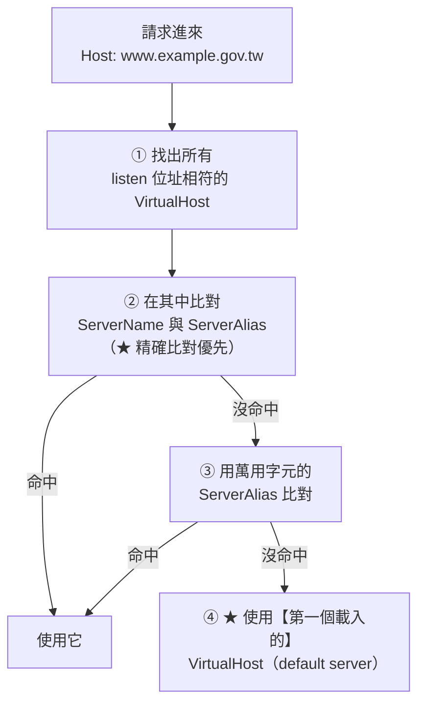

# Apache VirtualHost 設定

> [!abstract] 這篇你會學到
> - 掌握 **`ServerName` / `ServerAlias` 的比對規則**
> - 分清 **`<Directory>` / `<Location>` / `<Files>`** 三種容器的差別與合併順序
> - 用 **`Require`**（2.4 的新語法）做存取控制
> - 正確使用 **`Alias`** 與 **`DocumentRoot`**
> - 為 Vue / Nuxt / Laravel 寫出正確的 VirtualHost
> - 用 **`RequestHeader` / `Header`** 處理標頭

## 前置知識

- [[01-Apache-安裝與目錄結構]] — 目錄結構與 `a2*` 工具

---

## VirtualHost 的基本結構

```apache
# /etc/apache2/sites-available/app.example.gov.tw.conf
<VirtualHost *:80>
    # ── 身分 ──
    ServerName  app.example.gov.tw
    ServerAlias www.app.example.gov.tw
    ServerAdmin admin@example.gov.tw

    # ── 根目錄（★ 指向 public 子目錄）──
    DocumentRoot /var/www/app/current/public

    # ── 目錄權限 ──
    <Directory /var/www/app/current/public>
        Options -Indexes +FollowSymLinks
        AllowOverride None
        Require all granted
    </Directory>

    # ── 日誌 ──
    ErrorLog  ${APACHE_LOG_DIR}/app-error.log
    CustomLog ${APACHE_LOG_DIR}/app-access.log combined

    # ── 其他 ──
    LogLevel warn
</VirtualHost>
```

> [!warning] `${APACHE_LOG_DIR}` 是 Debian 系專有的
> 它定義在 `/etc/apache2/envvars`：
> ```bash
> export APACHE_LOG_DIR=/var/log/apache2$SUFFIX
> ```
> **RHEL 系沒有這個變數**，要寫絕對路徑：
> ```apache
> ErrorLog  /var/log/httpd/app-error.log
> CustomLog /var/log/httpd/app-access.log combined
> ```

---

## `ServerName` 的比對規則 ★



```apache
# ① 精確
ServerName app.example.gov.tw

# ② 別名（可多個，也可用萬用字元）
ServerAlias www.app.example.gov.tw
ServerAlias app.example.gov.tw *.app.example.gov.tw
ServerAlias *.example.gov.tw

# ③ 帶埠（★ 反向代理後面時很重要）
ServerName https://app.example.gov.tw:443

# ④ 讓 Apache 用 Host 標頭產生自我參照的網址
UseCanonicalName Off        # ★ 預設值，反向代理後面用這個
UseCanonicalName On         # 強制用 ServerName（產生固定的絕對網址）
```

> [!danger] Apache 與 Nginx 的 default server 邏輯不同
> ```
> Nginx ：可以明確指定 listen ... default_server
>          沒指定時用【第一個】
>
> Apache：【沒有】明確指定的機制
>          永遠是【第一個載入的 VirtualHost】
>          而載入順序 = 檔名的字母順序
> ```
>
> **所以一定要建立一個排在最前面的 catch-all**：
> ```apache
> # /etc/apache2/sites-available/000-catch-all.conf
> <VirtualHost *:80>
>     ServerName catch-all.invalid
>     DocumentRoot /var/www/empty
>     <Directory /var/www/empty>
>         Require all denied
>     </Directory>
>     RedirectMatch 404 ^/.*$
>     ErrorLog  /var/log/apache2/catch-all-error.log
>     CustomLog /var/log/apache2/catch-all-access.log combined
> </VirtualHost>
>
> <VirtualHost *:443>
>     ServerName catch-all.invalid
>     SSLEngine on
>     SSLCertificateFile    /etc/ssl/certs/ssl-cert-snakeoil.pem
>     SSLCertificateKeyFile /etc/ssl/private/ssl-cert-snakeoil.key
>     RedirectMatch 404 ^/.*$
> </VirtualHost>
> ```
> ```bash
> $ sudo a2ensite 000-catch-all
> $ sudo apache2ctl -S | grep 'default server'
> ```

```bash
# ★ 驗證比對結果
$ for h in app.example.gov.tw www.app.example.gov.tw unknown.com; do
    printf '%-30s → %s\n' "$h" \
      "$(curl -s -H "Host: $h" http://127.0.0.1/ -o /dev/null -w '%{http_code}')"
  done
```

---

## 三種容器：Directory / Location / Files

```apache
# ═══ <Directory>：比對【檔案系統路徑】 ═══
<Directory /var/www/app/public>
    Options -Indexes
    Require all granted
</Directory>

<DirectoryMatch "^/var/www/app/public/(uploads|media)">
    php_admin_flag engine off        # 需要 mod_php
</DirectoryMatch>

# ═══ <Location>：比對【URL 路徑】 ═══
<Location /admin>
    Require ip 10.0.9.0/24
</Location>

<LocationMatch "^/api/v[0-9]+/">
    Header always set X-API-Version "v1"
</LocationMatch>

# ═══ <Files>：比對【檔名】（不分目錄）═══
<Files ".env">
    Require all denied
</Files>

<FilesMatch "\.(env|log|sql|bak|ini|ya?ml)$">
    Require all denied
</FilesMatch>

<FilesMatch "\.php$">
    SetHandler "proxy:unix:/run/php/php8.3-fpm.sock|fcgi://localhost"
</FilesMatch>
```

| 容器 | 比對什麼 | 典型用途 |
| --- | --- | --- |
| **`<Directory>`** | **檔案系統路徑** | 目錄權限、Options、AllowOverride |
| `<DirectoryMatch>` | 同上（正規表示式） | 批次設定多個目錄 |
| **`<Location>`** | **URL 路徑** | 反向代理、存取控制、**代理來的 URL（磁碟上沒有對應檔案）** |
| `<LocationMatch>` | 同上（正規表示式） | — |
| **`<Files>`** | **檔名**（所有目錄中的同名檔） | 保護 `.env`、指定 PHP handler |
| `<FilesMatch>` | 同上（正規表示式） | **最常用**（`\.php$`、`\.(env\|log)$`） |
| `<If>` | 條件運算式 | 複雜條件（2.4+） |

### 合併順序 ★★

```
Apache 依【固定順序】套用這些區塊，後面的覆蓋前面的：

① <Directory>（★ 由【短到長】—— 短路徑先，長路徑後）
② <DirectoryMatch>
③ <Files> 與 <FilesMatch>
④ <Location> 與 <LocationMatch>       ★ 最後 —— 優先權最高
⑤ .htaccess（在對應的 <Directory> 之後、<Files> 之前）
```

> [!danger] `<Location>` 會覆蓋 `<Directory>` —— 這是安全陷阱
> ```apache
> # ❌ 危險的組合
> <Directory /var/www/app/public/admin>
>     Require ip 10.0.9.0/24              # 只允許內網
> </Directory>
>
> <Location />
>     Require all granted                 # ★★ 這個【後套用】，覆蓋上面的限制！
> </Location>
> # → /admin 對所有人開放了
> ```
>
> **原則**：
> ```
> 【存取控制】盡量集中在同一種容器（建議 <Directory>）
> 【不要】用 <Location /> 這種寬鬆的規則
> 設定完一定要【實際測試】而不是看設定檔推論
> ```

```bash
# ★ 實際驗證存取控制
$ curl -s -o /dev/null -w '%{http_code}\n' http://網站/admin/     # 從外部
$ ssh 內網主機 "curl -s -o /dev/null -w '%{http_code}\n' http://網站/admin/"
```

---

## `Require`：2.4 的存取控制語法

```apache
# ═══ 基本 ═══
Require all granted              # 全部允許
Require all denied               # 全部拒絕

# ═══ 依 IP ═══
Require ip 10.0.9.0/24
Require ip 192.168.1.100
Require ip 2001:db8::/32
Require not ip 203.0.113.5       # ★ 明確拒絕

# ═══ 依主機名（★ 需要反向 DNS，較慢且不可靠）═══
Require host example.gov.tw

# ═══ 依認證 ═══
Require valid-user               # 任何通過認證的使用者
Require user alice bob
Require group admins

# ═══ 依環境變數 ═══
Require env allowed_referer

# ═══ 依請求方法 ═══
<RequireAll>
    Require method GET POST
</RequireAll>
```

### 組合邏輯 ★

```apache
# ═══ RequireAny（預設）：任一條件成立即可 ═══
<RequireAny>
    Require ip 10.0.9.0/24
    Require valid-user
</RequireAny>
# → 內網 【或】 已登入 都可以

# ═══ RequireAll：所有條件都要成立 ═══
<RequireAll>
    Require ip 10.0.9.0/24
    Require valid-user
</RequireAll>
# → 必須【同時】是內網【且】已登入

# ═══ RequireNone：所有條件都不成立才通過 ═══
<RequireNone>
    Require ip 203.0.113.0/24
    Require ip 198.51.100.5
</RequireNone>
# → 這些 IP 【以外】的都可以

# ═══ 巢狀組合 ═══
<RequireAll>
    Require not ip 203.0.113.0/24         # 不是黑名單
    <RequireAny>
        Require ip 10.0.9.0/24            # 且（內網
        Require valid-user                #     或已登入）
    </RequireAny>
</RequireAll>
```

> [!warning] 2.2 的 `Order` / `Allow` / `Deny` 已經淘汰
> ```apache
> # ❌ Apache 2.2 的舊語法（2.4 需要 mod_access_compat 才能用）
> Order deny,allow
> Deny from all
> Allow from 10.0.9.0/24
>
> # ✅ Apache 2.4 的新語法
> <RequireAny>
>     Require ip 10.0.9.0/24
> </RequireAny>
> ```
>
> **舊語法的問題**：
> - `Order` 的語意極不直觀（`deny,allow` 與 `allow,deny` 差別很大）
> - 兩種語法**混用時行為不可預測**（`mod_access_compat` 載入時尤其危險）
>
> ```bash
> # ★ 檢查有沒有混用
> $ sudo apache2ctl -t -D DUMP_CONFIG 2>/dev/null | grep -cE '^\s*(Order|Allow from|Deny from)'
> # 不為 0 就該遷移
> $ sudo apache2ctl -M | grep access_compat
> ```

---

## `Alias` 與 `DocumentRoot`

```apache
DocumentRoot /var/www/app/current/public
# 請求 /index.php → /var/www/app/current/public/index.php

# ═══ Alias：把 URL 路徑對應到【其他】磁碟路徑 ═══
Alias /static /var/data/shared-static
# 請求 /static/logo.png → /var/data/shared-static/logo.png
<Directory /var/data/shared-static>
    Options -Indexes
    Require all granted
</Directory>

# ═══ AliasMatch：正規表示式版本 ═══
AliasMatch "^/img/(.*)\.(jpg|png)$" "/var/data/images/$1.$2"

# ═══ ScriptAlias：對應到 CGI 目錄（★ 非必要不要用）═══
# ScriptAlias /cgi-bin/ /usr/lib/cgi-bin/

# ═══ Redirect：伺服器端轉址 ═══
Redirect permanent /old-page /new-page      # 301
Redirect temp      /maintenance /sorry.html # 302
RedirectMatch 301 "^/blog/(.*)$" "/news/$1"
RedirectMatch 404 "^/\.git"                 # ★ 直接回 404
```

> [!danger] `Alias` 的斜線陷阱（與 Nginx 的 alias 類似）
> ```apache
> # ❌ 不一致 —— 可能導致意外的路徑組合
> Alias /static /var/data/static/
>
> # ✅ 兩邊都【沒有】結尾斜線
> Alias /static /var/data/static
>
> # ✅ 或兩邊都【有】
> Alias /static/ /var/data/static/
> ```
>
> **且 `Alias` 指向的目錄必須有對應的 `<Directory>` 授權**，
> 否則會 403（因為全域預設是 `Require all denied`）。

---

## 三大框架的 VirtualHost

### ① Laravel（PHP-FPM）

```apache
<VirtualHost *:443>
    ServerName app.example.gov.tw

    DocumentRoot /var/www/app/current/public        # ★★ public

    # ── TLS（見 05 篇）──
    SSLEngine on
    SSLCertificateFile    /etc/letsencrypt/live/app.example.gov.tw/fullchain.pem
    SSLCertificateKeyFile /etc/letsencrypt/live/app.example.gov.tw/privkey.pem

    <Directory /var/www/app/current/public>
        Options -Indexes +FollowSymLinks
        AllowOverride None                          # ★ 不用 .htaccess

        # ★ Laravel 的前端控制器（等同 .htaccess 的內容）
        RewriteEngine On
        # 處理 Authorization 標頭（★ API 認證必須）
        RewriteCond %{HTTP:Authorization} .
        RewriteRule .* - [E=HTTP_AUTHORIZATION:%{HTTP:Authorization}]
        # 移除結尾斜線
        RewriteCond %{REQUEST_FILENAME} -d
        RewriteCond %{REQUEST_URI} (.+)/$
        RewriteRule ^ %1 [L,R=301]
        # ★ 檔案或目錄不存在時交給 index.php
        RewriteCond %{REQUEST_FILENAME} !-d
        RewriteCond %{REQUEST_FILENAME} !-f
        RewriteRule ^ index.php [L]

        Require all granted
    </Directory>

    # ── ★ PHP 交給 FPM ──
    <FilesMatch \.php$>
        SetHandler "proxy:unix:/run/php/php8.3-fpm-app.sock|fcgi://localhost"
    </FilesMatch>

    # ── ★★ 上傳目錄禁止執行 PHP ──
    <Directory /var/www/app/current/public/uploads>
        <FilesMatch "\.(php|phtml|phar|php\d?)$">
            Require all denied
        </FilesMatch>
        # 若用 mod_php 還要加
        php_admin_flag engine off
    </Directory>

    <Directory /var/www/app/current/public/storage>
        <FilesMatch "\.(php|phtml|phar|php\d?)$">
            Require all denied
        </FilesMatch>
    </Directory>

    # ── ★ 拒絕敏感檔案 ──
    <FilesMatch "^\.|\.(env|log|sql|sqlite|bak|old|ini|ya?ml|lock|sh)$">
        Require all denied
    </FilesMatch>
    <FilesMatch "^(composer\.(json|lock)|package(-lock)?\.json|artisan|Dockerfile)$">
        Require all denied
    </FilesMatch>

    # ── 安全標頭 ──
    Header always set X-Frame-Options "SAMEORIGIN"
    Header always set X-Content-Type-Options "nosniff"
    Header always set Referrer-Policy "strict-origin-when-cross-origin"
    Header always set Strict-Transport-Security "max-age=31536000"
    Header always unset X-Powered-By

    ErrorLog  ${APACHE_LOG_DIR}/app-error.log
    CustomLog ${APACHE_LOG_DIR}/app-access.log combined
</VirtualHost>
```

> [!tip] Apache 的 `Header always set` 沒有 Nginx 的繼承陷阱
> **這是 Apache 相對 Nginx 的一個優勢** ——
> `Header` 指令**會從外層繼承並累加**，
> 不像 Nginx 的 `add_header` 會被內層完全覆蓋。
>
> 但 **`always` 仍然要加**（讓 4xx/5xx 也套用）：
> ```apache
> Header set     X-Frame-Options "SAMEORIGIN"    # 只在成功回應
> Header always set X-Frame-Options "SAMEORIGIN" # ★ 所有回應
> ```

### ② Vue SPA

```apache
<VirtualHost *:443>
    ServerName spa.example.gov.tw
    DocumentRoot /var/www/spa/current/dist

    <Directory /var/www/spa/current/dist>
        Options -Indexes +FollowSymLinks
        AllowOverride None

        # ★ SPA fallback
        RewriteEngine On
        RewriteCond %{REQUEST_FILENAME} !-f
        RewriteCond %{REQUEST_FILENAME} !-d
        RewriteRule ^ index.html [L]

        Require all granted
    </Directory>

    # ★ 帶 hash 的資源永久快取
    <FilesMatch "\.[0-9a-f]{8,}\.(js|mjs|css|woff2?)$">
        Header always set Cache-Control "public, max-age=31536000, immutable"
        Header unset ETag
        FileETag None
    </FilesMatch>

    # ★★ index.html 絕不快取
    <Files "index.html">
        Header always set Cache-Control "no-store, no-cache, must-revalidate, max-age=0"
    </Files>

    # 一般靜態資源
    <FilesMatch "\.(jpg|jpeg|png|gif|webp|svg|ico)$">
        Header always set Cache-Control "public, max-age=2592000"
    </FilesMatch>

    ErrorLog  ${APACHE_LOG_DIR}/spa-error.log
    CustomLog ${APACHE_LOG_DIR}/spa-access.log combined
</VirtualHost>
```

### ③ Nuxt SSR（反向代理到 Node）

```apache
<VirtualHost *:443>
    ServerName nuxt.example.gov.tw

    SSLEngine on
    SSLCertificateFile    /etc/letsencrypt/live/nuxt.example.gov.tw/fullchain.pem
    SSLCertificateKeyFile /etc/letsencrypt/live/nuxt.example.gov.tw/privkey.pem

    # ── ★ 靜態資源由 Apache 直接處理（比 Node 快）──
    DocumentRoot /var/www/nuxt/current/.output/public
    <Directory /var/www/nuxt/current/.output/public>
        Options -Indexes +FollowSymLinks
        AllowOverride None
        Require all granted
    </Directory>

    Alias /_nuxt /var/www/nuxt/current/.output/public/_nuxt
    <Directory /var/www/nuxt/current/.output/public/_nuxt>
        Header always set Cache-Control "public, max-age=31536000, immutable"
        Require all granted
    </Directory>

    # ── ★ 其他交給 Node ──
    ProxyPreserveHost On
    ProxyTimeout 60

    # 排除已由 Apache 處理的路徑
    ProxyPass        /_nuxt !
    ProxyPass        /favicon.ico !

    # WebSocket（HMR、即時功能）
    RewriteEngine On
    RewriteCond %{HTTP:Upgrade} =websocket [NC]
    RewriteRule /(.*) ws://127.0.0.1:3000/$1 [P,L]

    ProxyPass        / http://127.0.0.1:3000/
    ProxyPassReverse / http://127.0.0.1:3000/

    # ★ 必要的標頭
    RequestHeader set X-Forwarded-Proto "https"
    RequestHeader set X-Forwarded-Port  "443"
    RequestHeader set X-Real-IP         "%{REMOTE_ADDR}s"

    ErrorLog  ${APACHE_LOG_DIR}/nuxt-error.log
    CustomLog ${APACHE_LOG_DIR}/nuxt-access.log combined
</VirtualHost>
```

```bash
$ sudo a2enmod proxy proxy_http proxy_wstunnel rewrite headers
$ sudo systemctl restart apache2
```

> [!danger] `X-Forwarded-Proto` 在 Apache 也一樣重要
> **`mod_proxy` 不會自動加上 `X-Forwarded-Proto`**
> （它只加 `X-Forwarded-For`、`X-Forwarded-Host`、`X-Forwarded-Server`）。
>
> 沒有它，後端會以為請求是 http，
> 導致**登入後被踢回登入頁、重導向迴圈、混合內容警告**
> （與 Nginx 的情況完全相同，見 [[04-Nginx-反向代理與負載平衡]]）。
>
> ```apache
> RequestHeader set X-Forwarded-Proto "https"
> RequestHeader set X-Forwarded-Port  "443"
> ```
>
> **HTTP 的 VirtualHost 則要設成 http**：
> ```apache
> <VirtualHost *:80>
>     RequestHeader set X-Forwarded-Proto "http"
> </VirtualHost>
> ```

---

## 標頭處理

```apache
# ═══ Header：改【回應】標頭 ═══
Header always set    X-Frame-Options "SAMEORIGIN"
Header always append Vary "Accept-Encoding"
Header always unset  X-Powered-By                 # ★ 移除
Header always edit   Set-Cookie "^(.*)$" "$1; HttpOnly; Secure; SameSite=Lax"

# 條件式
Header always set Cache-Control "no-store" "expr=%{REQUEST_URI} =~ m#^/api/#"

# ═══ RequestHeader：改【請求】標頭（送給後端）═══
RequestHeader set   X-Forwarded-Proto "https"
RequestHeader set   X-Real-IP "%{REMOTE_ADDR}s"
RequestHeader unset Proxy                          # ★ 防 httpoxy 漏洞
RequestHeader unset X-Forwarded-For                # 若不想信任客戶端送的值
```

> [!warning] `Header always edit Set-Cookie` 是加固 Cookie 的好方法
> ```apache
> # ★ 強制所有 Cookie 加上安全屬性（即使應用程式忘了設）
> Header always edit Set-Cookie ^(.*)$ "$1; HttpOnly; Secure; SameSite=Lax"
> ```
> **但這是「補救措施」** —— 正確做法是在應用程式設定：
> ```ini
> # Laravel .env
> SESSION_SECURE_COOKIE=true
> SESSION_SAME_SITE=lax
> ```
> ```ini
> ; php.ini
> session.cookie_httponly = 1
> session.cookie_secure = 1
> session.cookie_samesite = Lax
> ```

> [!danger] `RequestHeader unset Proxy` —— httpoxy 漏洞
> **CVE-2016-5385**：某些 CGI/FastCGI 環境會把 HTTP 的 `Proxy:` 標頭
> 轉成環境變數 `HTTP_PROXY`，
> **導致後端程式的外連請求被導向攻擊者控制的代理**。
> ```apache
> RequestHeader unset Proxy early
> ```
> 現代的 PHP 已修補，但**加上這行沒有壞處**。

---

## 完整實戰範例

### VirtualHost 驗證腳本

```bash
#!/usr/bin/env bash
# Apache VirtualHost 檢查
CTL=$(command -v apache2ctl || command -v apachectl)
echo "═══ VirtualHost 檢查 ═══"

echo -e "\n【1】所有 VirtualHost"
sudo $CTL -S 2>&1 | sed 's/^/  /'

echo -e "\n【2】★ default server（未比對到時會用它）"
sudo $CTL -S 2>&1 | grep 'default server' | sed 's/^/  /'
sudo $CTL -S 2>&1 | grep -q 'catch-all\|000-' \
  && echo "  ✓ 看起來有 catch-all" \
  || echo "  ⚠ 沒有 catch-all，未知網域會連到某個真實站台"

echo -e "\n【3】重複的 ServerName"
sudo $CTL -t -D DUMP_CONFIG 2>/dev/null | \
  grep -oP '^\s*Server(Name|Alias)\s+\K.*' | tr ' ' '\n' | \
  sed 's|^https\?://||; s|:.*||' | grep -v '^$' | sort | uniq -d | \
  sed 's/^/  ⚠ 重複：/' || echo "  ✓ 沒有重複"

echo -e "\n【4】DocumentRoot"
sudo $CTL -t -D DUMP_CONFIG 2>/dev/null | grep -oP '^\s*DocumentRoot\s+"?\K[^"\s]+' | \
  sort -u | while read -r d; do
    if [ ! -d "$d" ]; then echo "  ✗ $d 【目錄不存在】"
    elif [[ "$d" == */public ]] || [[ "$d" == */dist ]] || [[ "$d" == */html ]]; then
        echo "  ✓ $d"
    else echo "  ⚠ $d 【確認是否應指向 public/】"; fi
done

echo -e "\n【5】★ 舊語法（Order/Allow/Deny）"
N=$(sudo $CTL -t -D DUMP_CONFIG 2>/dev/null | grep -cE '^\s*(Order|Allow from|Deny from)')
[ "$N" -gt 0 ] && echo "  ⚠ 有 $N 處使用 2.2 舊語法，建議改用 Require" \
               || echo "  ✓ 都用 2.4 的 Require"
sudo $CTL -M 2>/dev/null | grep -q access_compat \
  && echo "  ⚠ 載入了 mod_access_compat（新舊語法混用有風險）"

echo -e "\n【6】★ 危險的 Options"
sudo $CTL -t -D DUMP_CONFIG 2>/dev/null | grep -nE '^\s*Options.*[^-](Indexes|ExecCGI|Includes)\b' | \
  sed 's/^/  ⚠ /' || echo "  ✓ 沒有危險的 Options"

echo -e "\n【7】AllowOverride"
sudo $CTL -t -D DUMP_CONFIG 2>/dev/null | grep -oP '^\s*AllowOverride\s+\K\S+' | \
  sort | uniq -c | awk '{printf "  %s：%d 處\n", $2, $1}'
echo "  ★ All 會有效能代價（每個請求 stat 每層目錄找 .htaccess）"

echo -e "\n【8】★ 上傳目錄是否禁止執行"
for d in $(sudo $CTL -t -D DUMP_CONFIG 2>/dev/null | \
           grep -oP '^\s*DocumentRoot\s+"?\K[^"\s]+' | sort -u); do
    for sub in uploads storage media files; do
        [ -d "$d/$sub" ] || continue
        if sudo $CTL -t -D DUMP_CONFIG 2>/dev/null | grep -A5 "$d/$sub" | \
           grep -q 'Require all denied\|engine off'; then
            echo "  ✓ $d/$sub 有保護"
        else
            echo "  ⚠⚠ $d/$sub 【沒有禁止執行 PHP】"
        fi
    done
done

echo -e "\n【9】★ X-Forwarded-Proto（反向代理必要）"
if sudo $CTL -t -D DUMP_CONFIG 2>/dev/null | grep -q 'ProxyPass'; then
    sudo $CTL -t -D DUMP_CONFIG 2>/dev/null | grep -q 'X-Forwarded-Proto' \
      && echo "  ✓ 有設定" \
      || echo "  ✗✗ 【有 ProxyPass 但沒有 X-Forwarded-Proto —— HTTPS 會壞掉】"
else
    echo "  ○ 沒有使用反向代理"
fi

echo -e "\n【10】★ 實際存取測試"
for h in $(sudo $CTL -S 2>&1 | grep -oP 'namevhost \K\S+' | sort -u | head -5); do
    for p in / /.env /.git/config /uploads/test.php; do
        code=$(curl -sk -o /dev/null -w '%{http_code}' -m 5 -H "Host: $h" \
               "http://127.0.0.1$p" 2>/dev/null)
        case "$p:$code" in
            /:200|/:301|/:302) printf '  ✓ %-28s %-16s %s\n' "$h" "$p" "$code" ;;
            *:200) printf '  ⚠⚠ %-28s %-16s %s 【應該被擋】\n' "$h" "$p" "$code" ;;
            *) : ;;
        esac
    done
done
```

---

## 常見錯誤與排錯

| 現象／錯誤 | 原因 | 解法 |
| --- | --- | --- |
| **未知網域連到真實站台** | Apache 沒有 `default_server` 機制 | 建立 `000-catch-all.conf` |
| **`<Directory>` 的限制被繞過** ★ | **`<Location>` 後套用，覆蓋了它** | 存取控制集中在同一種容器；**實際測試** |
| **403 Forbidden**（路徑正確） | 全域 `Require all denied` 未針對該目錄開放 | 加對應的 `<Directory>` + `Require all granted` |
| 403 但權限看起來正常（RHEL） | **SELinux** | `restorecon -Rv /var/www`；`ausearch -m avc` |
| **`Alias` 的目錄一直 403** | 沒有對應的 `<Directory>` | Alias 指向的目錄要有 `<Directory>` 授權 |
| **登入後被踢回登入頁** | **缺 `X-Forwarded-Proto`** | `RequestHeader set X-Forwarded-Proto "https"` |
| `ERR_TOO_MANY_REDIRECTS` | 同上 | 同上 + 後端 trust proxy |
| **API 的 Authorization 標頭不見了** | CGI/FastCGI 不傳這個標頭 | `RewriteRule .* - [E=HTTP_AUTHORIZATION:%{HTTP:Authorization}]` |
| WebSocket 連不上 | 缺 `mod_proxy_wstunnel` 與 rewrite | `a2enmod proxy_wstunnel` + WebSocket 的 RewriteRule |
| **`Order`/`Allow` 沒作用** | 2.4 需要 `mod_access_compat` | **改用 `Require`** |
| 新舊語法混用行為詭異 | `mod_access_compat` 的相容邏輯 | **統一用 2.4 語法** |
| `${APACHE_LOG_DIR}` 未定義（RHEL） | Debian 系專有 | 寫絕對路徑 `/var/log/httpd/` |
| **`<FilesMatch>` 沒生效** | 被 `<Location>` 覆蓋 | 注意合併順序 |
| ServerAlias 萬用字元沒作用 | 語法或順序問題 | `apache2ctl -S` 確認 |

---

## 安全性注意事項

> [!danger] 容器合併順序造成的越權
> ```apache
> # ❌ 真實案例
> <Directory /var/www/app/public/admin>
>     Require ip 10.0.9.0/24
> </Directory>
>
> # 某個看似無害的設定
> <Location />
>     Require all granted
> </Location>
> # → 【/admin 對全世界開放】
> ```
>
> **驗證方式（不要只看設定檔）**：
> ```bash
> # 從外部（不在白名單的來源）測試
> $ curl -s -o /dev/null -w '%{http_code}\n' https://網站/admin/
> 200      # ⚠⚠ 應該是 403 或 404
> ```
> **每一條存取控制規則都要實際測試。**

> [!warning] 上傳目錄禁止執行的兩種寫法
> ```apache
> # 【PHP-FPM 模式】
> <Directory /var/www/app/public/uploads>
>     <FilesMatch "\.(php|phtml|phar|php\d?)$">
>         Require all denied
>     </FilesMatch>
> </Directory>
>
> # 【mod_php 模式】★ 額外要加這個
> <Directory /var/www/app/public/uploads>
>     php_admin_flag engine off        # ★ 直接關掉該目錄的 PHP 引擎
>     <FilesMatch "\.(php|phtml|phar)$">
>         Require all denied
>     </FilesMatch>
> </Directory>
> ```
> **`php_admin_flag` 比 `php_flag` 安全** ——
> 後者可以被 `.htaccess` 或 `ini_set()` 覆蓋。
>
> **更根本的做法同 Nginx**：上傳檔案不要放在 DocumentRoot 內。

> [!tip] 用 `<FilesMatch>` 保護敏感檔案
> ```apache
> # ★ 放在全域設定（conf-available/security-files.conf）
> <FilesMatch "^\.">
>     Require all denied
> </FilesMatch>
>
> <FilesMatch "\.(env|log|sql|sqlite3?|bak|old|orig|save|swp|ini|ya?ml|toml|lock|sh|pem|key)$">
>     Require all denied
> </FilesMatch>
>
> <FilesMatch "^(composer\.(json|lock)|package(-lock)?\.json|yarn\.lock|artisan|Makefile|Dockerfile|docker-compose\.ya?ml|README\.md)$">
>     Require all denied
> </FilesMatch>
>
> # 目錄
> <DirectoryMatch "/(\.git|\.svn|vendor|node_modules|tests)/">
>     Require all denied
> </DirectoryMatch>
> ```
> ```bash
> $ sudo a2enconf security-files
> ```
> **`<FilesMatch>` 是全域生效的**（所有 VirtualHost），
> 這比 Nginx 需要在每個 server 區塊 include 方便。

---

## 速查表

### VirtualHost 骨架

```apache
<VirtualHost *:443>
    ServerName  app.example.gov.tw
    ServerAlias www.app.example.gov.tw
    DocumentRoot /var/www/app/current/public       # ★ public

    <Directory /var/www/app/current/public>
        Options -Indexes -ExecCGI -Includes -MultiViews +FollowSymLinks
        AllowOverride None
        Require all granted
    </Directory>

    ErrorLog  ${APACHE_LOG_DIR}/app-error.log      # ★ RHEL 用絕對路徑
    CustomLog ${APACHE_LOG_DIR}/app-access.log combined
</VirtualHost>
```

### 三種容器與合併順序 ★

```
<Directory>      比對【檔案系統路徑】（★ 由短到長）
<DirectoryMatch> 同上，正規表示式
<Files/FilesMatch> 比對【檔名】（全域生效）
<Location/LocationMatch> 比對【URL】—— ★ 【最後套用，優先權最高】

★ <Location> 會覆蓋 <Directory> —— 存取控制不要分散在不同容器
```

### Require（2.4 語法）

```apache
Require all granted / denied
Require ip 10.0.9.0/24
Require not ip 203.0.113.5
Require valid-user / user alice / group admins
Require method GET POST

<RequireAny>  任一成立（預設）  </RequireAny>
<RequireAll>  全部成立          </RequireAll>
<RequireNone> 全部不成立才通過  </RequireNone>

❌ Order deny,allow / Allow from / Deny from  ← 2.2 舊語法，不要用
```

### Alias 與 Redirect

```apache
Alias /static /var/data/static          # ★ 兩邊斜線要一致
<Directory /var/data/static>            # ★ 一定要有對應的 Directory
    Require all granted
</Directory>

Redirect permanent /old /new
RedirectMatch 301 "^/blog/(.*)$" "/news/$1"
RedirectMatch 404 "^/\.git"
```

### 標頭

```apache
Header always set    X-Frame-Options "SAMEORIGIN"
Header always unset  X-Powered-By
Header always edit   Set-Cookie ^(.*)$ "$1; HttpOnly; Secure; SameSite=Lax"

RequestHeader set   X-Forwarded-Proto "https"      # ★★ 反向代理必要
RequestHeader set   X-Real-IP "%{REMOTE_ADDR}s"
RequestHeader unset Proxy early                     # 防 httpoxy

★ Apache 的 Header 會【繼承並累加】，沒有 Nginx add_header 的覆蓋陷阱
★ 但 always 仍要加（讓 4xx/5xx 也套用）
```

### Laravel 的關鍵三段

```apache
DocumentRoot /var/www/app/current/public

RewriteEngine On
RewriteCond %{HTTP:Authorization} .
RewriteRule .* - [E=HTTP_AUTHORIZATION:%{HTTP:Authorization}]    # ★ API 認證
RewriteCond %{REQUEST_FILENAME} !-d
RewriteCond %{REQUEST_FILENAME} !-f
RewriteRule ^ index.php [L]

<FilesMatch \.php$>
    SetHandler "proxy:unix:/run/php/php8.3-fpm.sock|fcgi://localhost"
</FilesMatch>
```

### 安全必備

```apache
# ★ 全域（conf-available/security-files.conf）
<FilesMatch "^\."> Require all denied </FilesMatch>
<FilesMatch "\.(env|log|sql|bak|ini|ya?ml|key|pem)$"> Require all denied </FilesMatch>
<DirectoryMatch "/(\.git|vendor|node_modules)/"> Require all denied </DirectoryMatch>

# ★ 上傳目錄
<Directory .../public/uploads>
    php_admin_flag engine off
    <FilesMatch "\.(php|phtml|phar)$"> Require all denied </FilesMatch>
</Directory>
```

### 排查

```bash
sudo apache2ctl -S                       # ★ VirtualHost 與 default server
sudo apache2ctl -t -D DUMP_CONFIG        # 完整展開設定
sudo apache2ctl configtest
curl -H 'Host: xxx' http://127.0.0.1/    # ★ 驗證比對
curl -s -o /dev/null -w '%{http_code}\n' https://網站/admin/   # ★ 實測存取控制
```

---

## 練習題

> [!question]- 練習 1：ServerName 比對實驗
> 1. 建立三個 VirtualHost：
>    ```
>    A: ServerName a.test.local
>    B: ServerName b.test.local  ServerAlias *.b.test.local
>    C: 000-catch-all（RedirectMatch 404）
>    ```
> 2. `apache2ctl -S` 確認 default server
> 3. **先預測**，再用 `curl -H 'Host: xxx'` 驗證：
>    `a.test.local`、`x.b.test.local`、`b.test.local`、`unknown.com`、不帶 Host
> 4. **移除 catch-all 再測一次**，看差異

> [!question]- 練習 2：容器覆蓋陷阱
> 1. 建立 `/admin` 目錄，用 `<Directory>` 限制只有 `127.0.0.1` 可存取
> 2. 從其他 IP 測試 → **應該 403**
> 3. **加上 `<Location /> Require all granted </Location>`**
> 4. **再測一次** → 還是 403 嗎？
> 5. **解釋為什麼**
> 6. 改成正確的寫法，重測
> 7. 寫一個「從外部驗證存取控制」的腳本

> [!question]- 練習 3：X-Forwarded-Proto 實驗
> 1. 用 Apache 反向代理一個 Laravel 應用（HTTPS）
> 2. **故意不設** `RequestHeader set X-Forwarded-Proto`
> 3. 觀察：
>    - `curl -skI https://網站/login | grep -i location` → 是 `http://` 嗎？
>    - 設 `SESSION_SECURE_COOKIE=true` 後能登入嗎？
> 4. 加上標頭 + Laravel 的 `trustProxies`
> 5. **重測全部**
> 6. 對照 Nginx 的做法，**兩者的設定方式有什麼不同？**

> [!question]- 練習 4：完整的 Laravel VirtualHost
> 1. 依本篇範例建立一個完整的 Laravel VirtualHost
> 2. 驗證：SPA 路由、API、後台都正常
> 3. 驗證：`.env`、`.git`、`composer.json` 全部 403/404
> 4. 上傳一個 `test.php` 到 `uploads/`，確認**無法執行**
> 5. **測試 API 的 `Authorization` 標頭是否有傳到後端**
>    （移除那條 RewriteRule 再測一次）
> 6. 跑本篇的驗證腳本

---

## 小測驗

Q1. **Apache 的 default server 是怎麼決定的？與 Nginx 有什麼不同？該怎麼處理**？

Q2. **`<Directory>` / `<Location>` / `<Files>` 分別比對什麼**？

Q3. **這三種容器的合併順序是什麼？會造成什麼安全陷阱**？

Q4. **`<RequireAny>` / `<RequireAll>` / `<RequireNone>` 的差別是什麼**？

Q5. **為什麼不該再用 `Order` / `Allow` / `Deny`**？

Q6. **`Alias` 指向的目錄一直 403，最可能的原因是什麼**？

Q7. **Apache 的 `Header` 與 Nginx 的 `add_header` 有什麼關鍵差異**？

Q8. **反向代理時為什麼一定要設 `X-Forwarded-Proto`**？

Q9. **Laravel 在 Apache 上為什麼需要 `E=HTTP_AUTHORIZATION` 那條 RewriteRule**？

Q10. **`mod_php` 模式下，上傳目錄除了 `<FilesMatch>` 還要加什麼？為什麼用 `php_admin_flag` 而非 `php_flag`**？

> [!question]- 測驗答案
> **Q1.** **Apache 的 default server 永遠是「第一個載入的 VirtualHost」，
> 而載入順序是檔名的字母順序** ——
> **Apache 沒有像 Nginx 的 `listen ... default_server` 那樣明確指定的機制**
> （Nginx 可以明確指定，沒指定時才用第一個）。
> **處理方式**：建立一個檔名排在最前面的 catch-all
> （例如 `000-catch-all.conf`），
> 內容是 `RedirectMatch 404 ^/.*$` 或 `Require all denied`，
> 這樣未比對到任何 `ServerName` 的請求（含掃描器與直接用 IP 存取）
> 就不會連到真實的站台。用 `apache2ctl -S | grep 'default server'` 確認。
>
> **Q2.** **`<Directory>`** 比對**檔案系統路徑**（`/var/www/app/public`），
> 用於目錄權限、`Options`、`AllowOverride`；
> **`<Location>`** 比對 **URL 路徑**（`/admin`），
> 適合**代理來的 URL**（磁碟上沒有對應檔案）與存取控制；
> **`<Files>`** 比對**檔名**（不分目錄，**所有目錄中的同名檔都會套用**），
> 適合保護 `.env`、指定 `.php` 的 handler。
> 三者都有 `*Match` 的正規表示式版本。
>
> **Q3.** **合併順序**（後面覆蓋前面）：
> ①**`<Directory>`（由短路徑到長路徑）** →
> ②`<DirectoryMatch>` →
> ③`<Files>` / `<FilesMatch>` →
> ④**`<Location>` / `<LocationMatch>`（最後，優先權最高）**。
> （`.htaccess` 在對應的 `<Directory>` 之後、`<Files>` 之前。）
> **安全陷阱**：**`<Location>` 會覆蓋 `<Directory>` 的限制** ——
> 例如 `<Directory .../admin>` 設了 `Require ip 10.0.9.0/24`，
> 但另一處有 `<Location /> Require all granted </Location>`，
> **`/admin` 就對全世界開放了**。
> 原則：**存取控制集中在同一種容器，且一定要實際測試而非看設定檔推論**。
>
> **Q4.** **`<RequireAny>`（預設）**：**任一條件成立即通過**
> （內網「或」已登入）；
> **`<RequireAll>`**：**所有條件都要成立**（必須「同時」是內網「且」已登入）；
> **`<RequireNone>`**：**所有條件都不成立才通過**
> （這些 IP「以外」的才可以，等於黑名單）。
> 三者可以巢狀組合：
> ```apache
> <RequireAll>
>     Require not ip 203.0.113.0/24
>     <RequireAny>
>         Require ip 10.0.9.0/24
>         Require valid-user
>     </RequireAny>
> </RequireAll>
> ```
>
> **Q5.** 因為那是 **Apache 2.2 的舊語法**，在 2.4 **需要載入 `mod_access_compat`
> 才能運作**。問題有兩個：
> ①**`Order` 的語意極不直觀** —— `Order deny,allow` 與 `Order allow,deny`
> 的行為差異很大且容易搞錯，是歷史上大量誤設定的來源；
> ②**新舊語法混用時行為不可預測** ——
> 同一個容器中同時有 `Require` 與 `Allow from` 時，
> `mod_access_compat` 的相容邏輯會產生難以推論的結果，**可能造成越權**。
> 應統一用 2.4 的 `Require` 語法，並考慮停用 `mod_access_compat`。
>
> **Q6.** **最可能是「沒有為 `Alias` 指向的目錄加上對應的 `<Directory>` 授權」**。
> 因為安全基準建議全域預設是 `<Directory /> Require all denied </Directory>`，
> 所以任何新的路徑都必須明確開放：
> ```apache
> Alias /static /var/data/static
> <Directory /var/data/static>          # ★ 這段不能少
>     Options -Indexes
>     Require all granted
> </Directory>
> ```
> 次要原因是 **`Alias` 兩邊的結尾斜線不一致**
> （要嘛兩邊都有、要嘛兩邊都沒有），
> 以及路徑上某一層目錄缺少 `x` 權限（或 RHEL 的 SELinux context 不對）。
>
> **Q7.** **Apache 的 `Header` 會從外層繼承並累加；
> Nginx 的 `add_header` 是「陣列型指令」，內層會完全覆蓋外層**。
> 這是 **Apache 相對 Nginx 的一個明顯優勢** ——
> 在 Apache 中，全域設定的安全標頭不會因為某個 `<Location>` 加了一個
> `Header set` 就整組消失；
> 而在 Nginx 中，每個有 `add_header` 的 `location` 都必須重新 `include`
> 一次完整的安全標頭。
> **但 `always` 在兩者都要加**（讓 4xx/5xx 的回應也套用）。
>
> **Q8.** 因為 **`mod_proxy` 只會自動加上 `X-Forwarded-For`、
> `X-Forwarded-Host`、`X-Forwarded-Server`，
> 不會加 `X-Forwarded-Proto`** ——
> 而 Apache 是用 `http://127.0.0.1:3000` 連後端的，
> **後端會以為原始請求是 http**，導致：
> ①**登入後被踢回登入頁**（Session Cookie 的 `Secure` 旗標讓瀏覽器不送出）；
> ②**`ERR_TOO_MANY_REDIRECTS`**（後端產生 `Location: http://...`，
> 瀏覽器連 http → Apache 又 301 到 https → 無限迴圈）；
> ③**混合內容警告**（資源用 http 載入被瀏覽器封鎖）。
> 修法：`RequestHeader set X-Forwarded-Proto "https"`
> （HTTP 的 VirtualHost 則設成 `"http"`），並在後端設定信任代理。
>
> **Q9.** 因為 **CGI / FastCGI 規範不會把 HTTP 的 `Authorization` 標頭
> 傳給後端**（基於安全考量，避免憑證外流到 CGI 程式），
> **所以 Laravel Sanctum / Passport 的 Bearer Token 認證會全部失敗**。
> 那條規則把它轉成一個環境變數傳過去：
> ```apache
> RewriteCond %{HTTP:Authorization} .
> RewriteRule .* - [E=HTTP_AUTHORIZATION:%{HTTP:Authorization}]
> ```
> Laravel 的 `Request::bearerToken()` 會去讀 `HTTP_AUTHORIZATION`。
> **這也是 Laravel 官方 `.htaccess` 中就有的內容** ——
> 改用 `AllowOverride None` 把規則搬進 VirtualHost 時**很容易漏掉這一段**，
> 症狀是「網頁登入正常，但 API 一律 401」。
>
> **Q10.** **`mod_php` 模式下還要加 `php_admin_flag engine off`** ——
> 直接關掉該目錄的 PHP 引擎，比只靠 `<FilesMatch>` 阻擋副檔名更徹底
> （可以擋掉 `.phtml`、`.php5`、大小寫變化等各種繞過）。
> **用 `php_admin_flag` 而非 `php_flag` 的原因**：
> **`php_admin_*` 設定的值「不能被 `.htaccess` 或執行時的 `ini_set()` 覆蓋」**，
> 而 `php_flag` 可以 ——
> 如果攻擊者能寫入 `.htaccess`（或應用程式有漏洞讓他呼叫 `ini_set`），
> `php_flag engine off` 就會被繞過。
> 注意這兩個指令**只在 `mod_php` 模式有效**，
> PHP-FPM 模式要用 `<FilesMatch>` + `Require all denied`，
> 或在 FPM pool 中設定。

---

## 延伸閱讀

- [[03-Apache-模組與MPM]] — 下一步：MPM 選擇與模組
- [[04-Apache-htaccess與Rewrite]] — mod_rewrite 完整說明
- [[05-Apache-HTTPS設定]] — TLS 設定
- [[06-Apache-與PHP整合]] — mod_php vs PHP-FPM
- [[02-Nginx-設定語法與虛擬主機]] — 對照 Nginx 的做法
