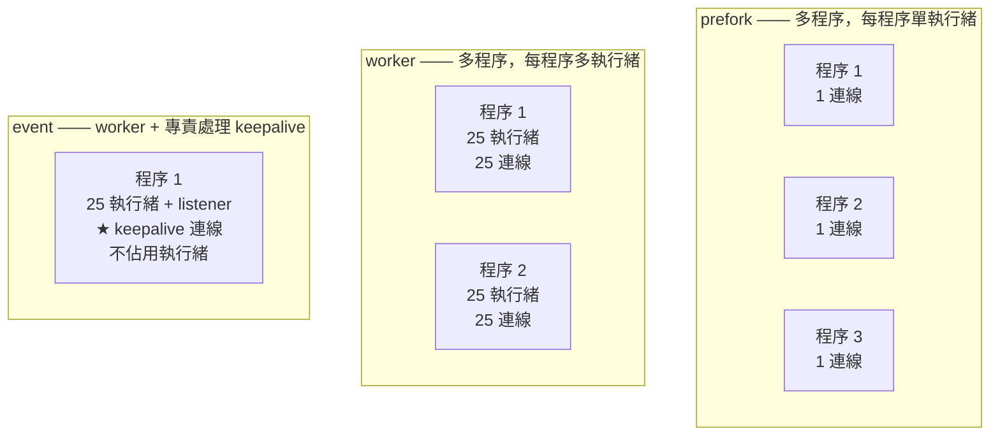

# Apache 模組與 MPM

> [!abstract] 這篇你會學到
> - 徹底理解 **prefork / worker / event** 三種 MPM 的差異
> - 知道**為什麼 `mod_php` 會強迫你用 prefork**（以及為什麼該離開它）
> - 依記憶體正確計算 **`MaxRequestWorkers`**
> - 用 **`mod_status`** 觀察即時狀態
> - 管理模組：**該啟用什麼、該停用什麼**
> - 診斷 **`server reached MaxRequestWorkers`** 這個經典問題

## 前置知識

- [[02-Apache-VirtualHost設定]] — VirtualHost 與容器

---

## 三種 MPM



| | **prefork** | **worker** | **event** ★ |
| --- | --- | --- | --- |
| **模型** | 多程序，**每程序 1 執行緒** | 多程序，每程序多執行緒 | worker + **keepalive 交給 listener** |
| **每連線成本** | **一個完整程序**（15-40 MB） | 一個執行緒（~1 MB） | 一個執行緒，**且 keepalive 不佔** |
| **記憶體** | **最高** | 中 | **最低** |
| **並發能力** | **最低** | 中 | **最高** |
| **執行緒安全需求** | **不需要** | 需要 | 需要 |
| **`mod_php`** | **✅ 只能用這個** | ❌ | ❌ |
| **PHP-FPM** | ✓ | ✓ | **✅ 推薦** |
| **穩定性** | 一個程序崩潰不影響其他 | 一個執行緒崩潰**會拖垮整個程序** | 同 worker |
| **預設** | 舊系統 | 少用 | **★ 現代系統的預設** |

> [!danger] `mod_php` 強迫你用 prefork —— 這是最大的效能瓶頸
> ```
> mod_php 【不是執行緒安全的】
>   → 只能搭配 prefork
>     → 每個連線都是一個【完整的 Apache 程序】
>       → 而且【每個程序都內嵌了整個 PHP 直譯器】（15-40 MB）
>         → 8GB 記憶體大約只能開 200-300 個程序
>           → 【並發 300 就滿了】
>             → 而且連載入一張圖片都佔用一個完整的 PHP 程序
> ```
>
> **對照 event + PHP-FPM**：
> ```
> Apache event：一個執行緒約 1 MB，8GB 可以開數千條
>   → 靜態檔完全不碰 PHP
>     → 只有真正的 .php 請求才交給 FPM
>       → FPM 的 worker 數量【獨立控制】
>         → 【並發能力提升 10 倍以上，記憶體用量下降】
> ```
>
> **這是 Apache 效能調校的第一件事：離開 `mod_php` + prefork。**
> 見 [[06-Apache-與PHP整合]]。

### 查看與切換 MPM

```bash
# ═══ 目前用哪個 ═══
$ apache2ctl -M | grep mpm
 mpm_event_module (shared)

# 或
$ apache2ctl -V | grep -i 'server mpm'
Server MPM:     event

# ═══ Ubuntu / Debian：切換 ═══
$ sudo a2dismod mpm_prefork
$ sudo a2enmod  mpm_event
$ sudo systemctl restart apache2

# ★ 若有 mod_php 會失敗（它相依 prefork）
$ sudo a2dismod mpm_prefork
ERROR: The following modules depend on mpm_prefork and need to be disabled first: php8.3

# → 正確順序：先移除 mod_php，改用 FPM
$ sudo a2dismod php8.3
$ sudo a2dismod mpm_prefork
$ sudo a2enmod  mpm_event proxy_fcgi setenvif
$ sudo a2enconf php8.3-fpm
$ sudo systemctl restart apache2
```

> [!info]- Rocky / AlmaLinux（RHEL 系）對照
> ```bash
> # ★ MPM 在 /etc/httpd/conf.modules.d/00-mpm.conf
> $ sudo cat /etc/httpd/conf.modules.d/00-mpm.conf
> # LoadModule mpm_prefork_module modules/mod_mpm_prefork.so
> LoadModule mpm_event_module modules/mod_mpm_event.so
> # LoadModule mpm_worker_module modules/mod_mpm_worker.so
>
> # 只要註解／取消註解對應那行
> $ sudo sed -i 's/^LoadModule mpm_prefork/#LoadModule mpm_prefork/' \
>     /etc/httpd/conf.modules.d/00-mpm.conf
> $ sudo sed -i 's/^#LoadModule mpm_event/LoadModule mpm_event/' \
>     /etc/httpd/conf.modules.d/00-mpm.conf
> $ sudo apachectl configtest && sudo systemctl restart httpd
>
> # RHEL 8/9 預設已經是 event + php-fpm
> $ httpd -V | grep -i mpm
> ```

---

## MPM 調校

### event（推薦）

```apache
# /etc/apache2/mods-available/mpm_event.conf
<IfModule mpm_event_module>
    StartServers              3
    MinSpareThreads          75
    MaxSpareThreads         250
    ThreadsPerChild          25       # ★ 每個程序的執行緒數
    ThreadLimit              64       # ThreadsPerChild 的硬上限（改大要重啟）
    ServerLimit              16       # ★ 最大程序數
    MaxRequestWorkers       400       # ★★ 最大並發請求數
    MaxConnectionsPerChild 10000      # ★ 處理幾個請求後重生程序（防記憶體洩漏）

    # ── keepalive（event MPM 的優勢所在）──
    AsyncRequestWorkerFactor  2
</IfModule>

# 全域
KeepAlive On
MaxKeepAliveRequests 500
KeepAliveTimeout 5                    # ★ 短一點（event 下 keepalive 成本低）
Timeout 30
```

> [!danger] 三個數字必須一致 ★★
> ```
> MaxRequestWorkers ≤ ServerLimit × ThreadsPerChild
>
> 例：ServerLimit 16 × ThreadsPerChild 25 = 400
>     → MaxRequestWorkers 最大只能是 400
>
> 設成 500 會怎樣？
>   error.log: WARNING: MaxRequestWorkers of 500 exceeds ServerLimit value of 16 servers,
>              decreasing MaxRequestWorkers to 400.
>   → ★ Apache 會【自己調回 400】，你以為設定生效了其實沒有
> ```
>
> **要提高並發，兩個方向**：
> ```apache
> # A. 增加程序數
> ServerLimit         32
> MaxRequestWorkers  800      # 32 × 25
>
> # B. 增加每程序的執行緒數（★ ThreadLimit 要一起改，且需要 restart）
> ThreadLimit         64
> ThreadsPerChild     50
> ServerLimit         16
> MaxRequestWorkers  800      # 16 × 50
> ```
>
> **`ThreadLimit` 與 `ServerLimit` 改動後必須 `restart`，`reload` 無效。**

### 怎麼算 `MaxRequestWorkers`

```bash
#!/usr/bin/env bash
# 依實際記憶體計算合適的 MaxRequestWorkers
echo "═══ MaxRequestWorkers 計算 ═══"

TOTAL=$(free -m | awk '/^Mem:/{print $2}')
# 保留給 OS、MySQL、PHP-FPM、Redis 等
OTHER=$(ps -eo rss,comm --sort=-rss | \
        awk '$2 ~ /mysqld|mariadb|postgres|redis|php-fpm|node/ {s+=$1} END {printf "%d", s/1024}')
RESERVE=$(( 512 + OTHER ))
AVAIL=$(( TOTAL - RESERVE ))

# 單一 Apache 程序的實際 RSS
PROC=$(ps -o rss= -C apache2 2>/dev/null || ps -o rss= -C httpd 2>/dev/null)
AVG=$(echo "$PROC" | awk '{s+=$1; n++} END {if(n) printf "%.1f", s/n/1024; else print 0}')
MAXP=$(echo "$PROC" | awk '{if($1>m) m=$1} END {printf "%.1f", m/1024}')

MPM=$(apache2ctl -M 2>/dev/null | grep -oP 'mpm_\K\w+(?=_module)' || \
      apachectl -M 2>/dev/null | grep -oP 'mpm_\K\w+(?=_module)')
TPC=$(apache2ctl -t -D DUMP_CONFIG 2>/dev/null | grep -oP 'ThreadsPerChild\s+\K\d+' | head -1)
TPC=${TPC:-25}

printf '  總記憶體          %d MB\n' "$TOTAL"
printf '  其他服務佔用      %d MB\n' "$OTHER"
printf '  保留（含 OS）     %d MB\n' "$RESERVE"
printf '  可用於 Apache     %d MB\n' "$AVAIL"
printf '  Apache 程序平均   %s MB（最大 %s MB）\n' "$AVG" "$MAXP"
printf '  目前 MPM          %s\n' "$MPM"

echo
case "$MPM" in
  prefork)
    echo "  ── prefork：每個【程序】處理一個連線 ──"
    awk -v a="$AVAIL" -v m="$MAXP" 'BEGIN {
        if (m <= 0) m = 30
        printf "  建議 MaxRequestWorkers = %d / %.1f ≈ \033[1m%d\033[0m\n", a, m, int(a/m)
        printf "  ★ prefork 記憶體效率極差，強烈建議改用 event + PHP-FPM\n"
    }'
    ;;
  event|worker)
    echo "  ── $MPM：每個【執行緒】處理一個連線 ──"
    awk -v a="$AVAIL" -v m="$MAXP" -v t="$TPC" 'BEGIN {
        if (m <= 0) m = 15
        procs = int(a / m)
        if (procs < 1) procs = 1
        printf "  可開程序數 = %d / %.1f ≈ %d\n", a, m, procs
        printf "  ThreadsPerChild = %d\n", t
        printf "  建議 ServerLimit = %d，MaxRequestWorkers = \033[1m%d\033[0m\n",
               procs, procs * t
    }'
    ;;
esac

echo
echo "  ── 目前設定 ──"
for k in ServerLimit ThreadsPerChild ThreadLimit MaxRequestWorkers StartServers \
         MinSpareThreads MaxSpareThreads MaxConnectionsPerChild; do
    v=$(apache2ctl -t -D DUMP_CONFIG 2>/dev/null | grep -oP "^\s*$k\s+\K\S+" | head -1)
    printf '  %-26s %s\n' "$k" "${v:-（未設定）}"
done

SL=$(apache2ctl -t -D DUMP_CONFIG 2>/dev/null | grep -oP 'ServerLimit\s+\K\d+' | head -1)
MRW=$(apache2ctl -t -D DUMP_CONFIG 2>/dev/null | grep -oP 'MaxRequestWorkers\s+\K\d+' | head -1)
if [ -n "$SL" ] && [ -n "$MRW" ] && [ "$MPM" != "prefork" ]; then
    LIMIT=$(( SL * TPC ))
    [ "$MRW" -gt "$LIMIT" ] && \
      echo "  ⚠⚠ MaxRequestWorkers($MRW) > ServerLimit×ThreadsPerChild($LIMIT) —— Apache 會自動調低"
fi

echo
echo "  ── 目前用量 ──"
CUR=$(pgrep -c -f 'apache2|httpd' 2>/dev/null)
echo "  Apache 程序數：$CUR"
echo "  ★ 檢查是否曾經達到上限："
sudo grep -c 'reached MaxRequestWorkers' /var/log/apache2/error.log 2>/dev/null | \
  awk '{if($1>0) print "    ⚠⚠ 有 "$1" 次達到上限！"; else print "    ✓ 未曾達到上限"}'
```

### prefork（若必須用 mod_php）

```apache
<IfModule mpm_prefork_module>
    StartServers              5
    MinSpareServers           5
    MaxSpareServers          20
    ServerLimit             256       # ★ MaxRequestWorkers 的硬上限
    MaxRequestWorkers       200       # ★★ 依記憶體算：可用記憶體 / 單程序 RSS
    MaxConnectionsPerChild 1000       # ★ prefork 一定要設（PHP 常有記憶體洩漏）
</IfModule>
```

> [!warning] prefork 的 `MaxConnectionsPerChild` 一定要設
> ```
> mod_php 的記憶體洩漏很常見（某些擴充、長時間執行）
>   → 程序的 RSS 會持續成長
>     → 幾天後每個程序從 20MB 漲到 80MB
>       → 【記憶體用完 → OOM】
>
> MaxConnectionsPerChild 1000
>   → 每處理 1000 個請求就重生該程序，強制釋放記憶體
> ```
> **代價**：重生程序有成本（要重新載入 PHP 直譯器），
> 但比 OOM 好太多。

---

## `mod_status`：即時狀態

```apache
# /etc/apache2/mods-available/status.conf
<IfModule mod_status.c>
    <Location /server-status>
        SetHandler server-status
        Require ip 127.0.0.1
        Require ip ::1
        Require ip 10.0.9.0/24          # ★ 只允許管理網段
        # Require all denied            # 或完全關閉
    </Location>

    ExtendedStatus On                   # ★ 顯示每個 worker 在做什麼
</IfModule>
```

```bash
$ sudo a2enmod status
$ sudo systemctl restart apache2

$ curl -s http://127.0.0.1/server-status?auto
Total Accesses: 1284231
Total kBytes: 8472913
CPULoad: 3.42
Uptime: 432000
ReqPerSec: 2.97
BytesPerSec: 20076.5
BytesPerReq: 6753.9
BusyWorkers: 12               # ★ 正在處理請求的 worker
IdleWorkers: 63               # ★ 閒置的 worker
ConnsTotal: 245
ConnsAsyncKeepAlive: 180      # ★ event MPM 的優勢：keepalive 不佔 worker
ConnsAsyncClosing: 5
Scoreboard: __W_W___RK_K___...
```

**Scoreboard 符號**：

| 符號 | 意思 |
| --- | --- |
| `_` | **閒置**（等待連線） |
| `S` | 啟動中 |
| `R` | 讀取請求 |
| **`W`** | **送出回應**（正在處理） |
| **`K`** | **keepalive** |
| `D` | DNS 查詢 |
| `C` | 關閉連線 |
| `L` | 寫日誌 |
| `G` | 優雅結束中 |
| `.` | **未使用的 slot** |

```bash
#!/usr/bin/env bash
# Apache 即時監控
URL="http://127.0.0.1/server-status?auto"
while true; do
    clear
    date '+%F %T'
    curl -s "$URL" | awk -F': ' '
      /^BusyWorkers/       {busy=$2}
      /^IdleWorkers/       {idle=$2}
      /^ConnsTotal/        {conns=$2}
      /^ConnsAsyncKeepAlive/ {ka=$2}
      /^ReqPerSec/         {rps=$2}
      /^CPULoad/           {cpu=$2}
      /^Scoreboard/        {sb=$2}
      END {
        total = busy + idle
        printf "  忙碌 %s / 總 %s （%.0f%%）  %s\n", busy, total, busy*100/total,
               (busy*100/total > 80 ? "⚠⚠ 接近上限" : "✓")
        printf "  連線 %s（keepalive %s）\n", conns, ka
        printf "  QPS %s   CPU %s%%\n", rps, cpu
        printf "  Scoreboard: %s\n", substr(sb, 1, 120)
        printf "    _ 閒置  W 處理中  K keepalive  R 讀取  . 未用\n"
      }'
    echo
    echo "  ── 記憶體 ──"
    ps -o rss= -C apache2 2>/dev/null | awk '{s+=$1;n++} END {
      printf "  程序 %d 個，共 %.0f MB，平均 %.1f MB\n", n, s/1024, s/n/1024}'
    sleep 2
done
```

> [!danger] `mod_status` 絕不能對外開放
> ```
> /server-status 洩漏：
>   · 所有正在處理的【URL】（含查詢字串中的 token）
>   · 客戶端 IP
>   · 虛擬主機清單
>   · 伺服器的執行狀態與版本
> ```
>
> ```bash
> # ★ 從外部驗證
> $ curl -s -o /dev/null -w '%{http_code}\n' https://你的網站/server-status
> 403      # ★ 必須是 403 或 404
> ```
>
> **不需要時直接停用**：`sudo a2dismod status`

---

## 模組管理

### 應該啟用的

```bash
$ sudo a2enmod \
    rewrite \           # URL 改寫（幾乎必要）
    headers \           # 回應標頭（安全標頭必要）
    ssl \               # HTTPS
    http2 \             # HTTP/2
    deflate \           # gzip 壓縮
    brotli \            # brotli 壓縮（若有）
    expires \           # 快取標頭
    setenvif \          # 條件式環境變數
    proxy \             # 反向代理
    proxy_http \        # HTTP 代理
    proxy_fcgi \        # ★ PHP-FPM 必要
    proxy_wstunnel \    # WebSocket
    remoteip \          # ★ 取得真實客戶端 IP
    socache_shmcb       # SSL session cache
$ sudo systemctl restart apache2
```

### 應該停用的（★ 減少攻擊面）

```bash
$ sudo a2dismod \
    status \            # ★ 洩漏執行狀態
    info \              # ★★ 洩漏完整設定！
    autoindex \         # ★ 目錄列表
    userdir \           # /~user/ 個人目錄
    cgi cgid \          # CGI 執行
    include \           # SSI（可能執行指令）
    dav dav_fs \        # WebDAV
    negotiation         # 內容協商（MultiViews）
$ sudo systemctl restart apache2
```

> [!danger] `mod_info` 是最危險的模組
> `/server-info` 會顯示 **Apache 的完整設定檔內容**：
> 所有 VirtualHost、DocumentRoot 路徑、
> 已載入模組、**甚至某些設定檔中的密碼**。
>
> ```bash
> $ sudo a2dismod info
> $ curl -s -o /dev/null -w '%{http_code}\n' https://網站/server-info
> 404      # ★ 必須
> ```

### `mod_remoteip`：取得真實客戶端 IP

```apache
# 在 CDN 或負載平衡器後面時必要
<IfModule mod_remoteip.c>
    RemoteIPHeader X-Forwarded-For
    RemoteIPTrustedProxy 10.0.0.0/8
    RemoteIPTrustedProxy 172.16.0.0/12
    RemoteIPTrustedProxy 127.0.0.1
    # Cloudflare 的網段（若有用）
    # RemoteIPTrustedProxy 173.245.48.0/20
</IfModule>

# ★ 日誌格式也要改（%a 是 remoteip 處理後的真實 IP）
LogFormat "%a %l %u %t \"%r\" %>s %O \"%{Referer}i\" \"%{User-Agent}i\" %D" combined_real
CustomLog ${APACHE_LOG_DIR}/access.log combined_real
```

> [!danger] `RemoteIPTrustedProxy` 只能列你控制的代理
> ```apache
> # ❌ 極度危險
> RemoteIPTrustedProxy 0.0.0.0/0
> # → 任何人送 X-Forwarded-For: 127.0.0.1 就能偽裝成本機
> #   → 繞過所有 Require ip 白名單、限流、fail2ban
> ```
> 與 Nginx 的 `set_real_ip_from` 是完全相同的風險。

### 檢查模組相依性

```bash
# ★ 某個模組被誰依賴
$ grep -r 'php8.3' /etc/apache2/mods-enabled/*.load

# 列出所有已啟用的模組並標註來源
$ ls -la /etc/apache2/mods-enabled/*.load | awk '{print $9, $11}'

# 找出載入了但沒用到的模組（人工判斷）
$ apache2ctl -M | grep shared | wc -l
$ apache2ctl -M | grep shared | sort
```

---

## 完整實戰範例

### 從 prefork + mod_php 遷移到 event + PHP-FPM

```bash
#!/usr/bin/env bash
# ★ 這是 Apache 效能提升最大的一次改動
set -euo pipefail
PHPV="${1:-8.3}"

echo "═══ 遷移到 event MPM + PHP-FPM ═══"

echo -e "\n【0】記錄現況（★ 之後要比對）"
echo "  MPM：$(apache2ctl -M | grep -oP 'mpm_\K\w+(?=_module)')"
ps -o rss= -C apache2 | awk '{s+=$1;n++} END {
  printf "  程序 %d 個，共 %.0f MB，平均 %.1f MB\n", n, s/1024, s/n/1024}'
curl -s 'http://127.0.0.1/server-status?auto' 2>/dev/null | \
  grep -E 'BusyWorkers|IdleWorkers|ReqPerSec' | sed 's/^/  /' || true

echo -e "\n【1】安裝 PHP-FPM"
sudo apt install -y "php${PHPV}-fpm" libapache2-mod-fcgid
sudo systemctl enable --now "php${PHPV}-fpm"

echo -e "\n【2】備份設定"
sudo cp -a /etc/apache2 "/etc/apache2.bak.$(date +%Y%m%d-%H%M%S)"

echo -e "\n【3】停用 mod_php 與 prefork"
sudo a2dismod "php${PHPV}" 2>/dev/null || true
sudo a2dismod mpm_prefork

echo -e "\n【4】啟用 event MPM 與 FPM 相關模組"
sudo a2enmod mpm_event proxy_fcgi setenvif http2
sudo a2enconf "php${PHPV}-fpm"

echo -e "\n【5】調整 MPM 參數"
sudo tee /etc/apache2/mods-available/mpm_event.conf >/dev/null <<'EOF'
<IfModule mpm_event_module>
    StartServers              3
    MinSpareThreads          75
    MaxSpareThreads         250
    ThreadLimit              64
    ThreadsPerChild          25
    ServerLimit              16
    MaxRequestWorkers       400
    MaxConnectionsPerChild 10000
    AsyncRequestWorkerFactor  2
</IfModule>
EOF

echo -e "\n【6】檢查 VirtualHost 中的 PHP handler"
echo "  ★ 確認每個站台都有："
echo '    <FilesMatch \.php$>'
echo "        SetHandler \"proxy:unix:/run/php/php${PHPV}-fpm.sock|fcgi://localhost\""
echo '    </FilesMatch>'
grep -rl 'SetHandler.*proxy:unix' /etc/apache2/sites-enabled/ 2>/dev/null | sed 's/^/    ✓ /' || \
  echo "    ⚠ 沒有找到，a2enconf php${PHPV}-fpm 已提供全域設定"

echo -e "\n【7】移除 php_value / php_flag（★ mod_php 專有，FPM 下無效）"
grep -rn 'php_value\|php_flag\|php_admin' /etc/apache2/ 2>/dev/null | sed 's/^/  ⚠ /' || \
  echo "  ✓ 沒有"
echo "  ★ 這些設定要搬到 php.ini 或 FPM pool 設定中"

echo -e "\n【8】測試與重啟"
sudo apache2ctl configtest
sudo systemctl restart apache2

echo -e "\n【9】驗證"
sleep 3
echo "  MPM：$(apache2ctl -M | grep -oP 'mpm_\K\w+(?=_module)')"
apache2ctl -M | grep -q php_module && echo "  ⚠ mod_php 還在" || echo "  ✓ mod_php 已移除"
apache2ctl -M | grep -q proxy_fcgi && echo "  ✓ proxy_fcgi 已載入"

echo "  PHP 是否正常："
echo '<?php echo "PHP ", PHP_VERSION, " via ", php_sapi_name(), "\n";' | \
  sudo tee /var/www/html/_check.php >/dev/null
curl -s http://127.0.0.1/_check.php | sed 's/^/    /'
echo "    ★ 應該顯示 'via fpm-fcgi'（不是 apache2handler）"
sudo rm -f /var/www/html/_check.php

echo -e "\n【10】比對記憶體"
sleep 5
ps -o rss= -C apache2 | awk '{s+=$1;n++} END {
  printf "  Apache 程序 %d 個，共 %.0f MB\n", n, s/1024}'
ps -o rss= -C "php-fpm${PHPV}" 2>/dev/null | awk '{s+=$1;n++} END {
  if(n) printf "  PHP-FPM 程序 %d 個，共 %.0f MB\n", n, s/1024}'

echo -e "\n✓ 完成。接著調校 PHP-FPM 的 pool（見 [[02-PHP-FPM設定與Pool調校]]）"
echo "  回退方式：sudo rm -rf /etc/apache2 && sudo mv /etc/apache2.bak.* /etc/apache2 && sudo systemctl restart apache2"
```

---

## 常見錯誤與排錯

| 現象／錯誤 | 原因 | 解法 |
| --- | --- | --- |
| **`server reached MaxRequestWorkers`** ★ | 並發超過上限 | 見下方完整排查 |
| **`MaxRequestWorkers of N exceeds ServerLimit`** | 三個數字不一致 | `MaxRequestWorkers ≤ ServerLimit × ThreadsPerChild` |
| **改了 `ServerLimit` 沒生效** | 需要 restart | **`restart` 而非 `reload`** |
| `a2dismod mpm_prefork` 失敗 | **mod_php 相依它** | 先 `a2dismod php8.3`，改用 FPM |
| **記憶體用完 OOM** | prefork + mod_php | **改用 event + PHP-FPM** |
| 程序記憶體持續成長 | PHP 記憶體洩漏 | `MaxConnectionsPerChild 1000` |
| **`Invalid command 'XXX'`** | 模組沒啟用 | `a2enmod` + **restart** |
| `php_value` 沒作用 | **PHP-FPM 下 `php_value` 無效** | 搬到 `php.ini` 或 FPM pool |
| **日誌全是 127.0.0.1** | 在代理後面 | `a2enmod remoteip` + `RemoteIPHeader` + 日誌用 `%a` |
| **`/server-status` 對外可存取** ★ | 沒有限制來源 | `Require ip`；或 `a2dismod status` |
| **`/server-info` 洩漏完整設定** ★★ | `mod_info` 啟用 | **`a2dismod info`** |
| keepalive 佔滿 worker | 用了 prefork/worker | **改用 event MPM** |
| 執行緒安全問題（隨機當機） | worker/event + 非執行緒安全的模組 | 檢查模組；PHP 一律用 FPM |

### `server reached MaxRequestWorkers` 完整排查

```bash
# ═══ 症狀 ═══
$ sudo grep 'reached MaxRequestWorkers' /var/log/apache2/error.log | tail -5
[mpm_event:error] AH00484: server reached MaxRequestWorkers setting,
consider raising the MaxRequestWorkers setting
# → 新的請求【全部排隊或被拒絕】，使用者看到很慢或 503

# ═══ 【1】確認是「真的需要更多 worker」還是「worker 被卡住」═══
$ curl -s 'http://127.0.0.1/server-status?auto' | \
    grep -E 'BusyWorkers|IdleWorkers|ConnsAsyncKeepAlive'
BusyWorkers: 400          # ★ 全滿
IdleWorkers: 0
ConnsAsyncKeepAlive: 12

# 看 worker 在做什麼
$ curl -s http://127.0.0.1/server-status | \
    grep -oP '<td>\K[GWKRDCL_.](?=</td>)' | sort | uniq -c
    380 W        # ★★ 380 個都在「送出回應」→ 【被後端卡住了】
     20 K

# ═══ 【2】W 太多 → 後端慢，不是 worker 不夠 ═══
# 查 PHP-FPM
$ curl -s http://127.0.0.1/fpm-status | grep -E 'active processes|listen queue|slow requests'
active processes:     50      # ★ FPM 也滿了
max active processes: 50
listen queue:        128      # ★★ 在排隊
slow requests:      1284      # ★★ 有慢請求

# 查慢請求的內容
$ sudo tail -50 /var/log/php8.3-fpm-slow.log

# 查資料庫
$ mysql -e "SHOW FULL PROCESSLIST" | grep -v Sleep | head -20
$ mysql -e "SELECT * FROM sys.statements_with_runtimes_in_95th_percentile LIMIT 10"

# ═══ 【3】判斷與處理 ═══
```

```
┌── 大部分 worker 是 W（處理中）────────────────────┐
│ → ★ 後端慢，【不是 worker 不夠】                    │
│   ① 找出慢的 SQL / 外部 API 呼叫                    │
│   ② 加快取（proxy_cache / Redis）                   │
│   ③ 把長時間任務改成非同步佇列                       │
│   ④ 調大 MaxRequestWorkers 只會【讓更多請求一起慢】  │
└──────────────────────────────────────────────┘

┌── 大部分 worker 是 K（keepalive）──────────────────┐
│ → ① 改用 event MPM（keepalive 不佔 worker）★        │
│   ② 縮短 KeepAliveTimeout（5 秒）                   │
└──────────────────────────────────────────────┘

┌── 大部分 worker 是 _（閒置）卻還是報錯 ─────────────┐
│ → 瞬間尖峰。調大 MinSpareThreads / StartServers      │
└──────────────────────────────────────────────┘

┌── 記憶體還很夠，且確實是流量成長 ──────────────────┐
│ → ★ 這才是真正該調大 MaxRequestWorkers 的情況        │
│   ServerLimit 32；MaxRequestWorkers 800             │
│   sudo systemctl restart apache2                    │
└──────────────────────────────────────────────┘
```

> [!danger] 不要無腦調大 `MaxRequestWorkers`
> ```
> 後端慢 → worker 全滿 → 調大 MaxRequestWorkers
>   → 更多請求同時打到後端
>     → 後端更慢 → 資料庫連線數也爆 → 【全面崩潰】
>
> ★ 正確的做法是【讓每個請求變快】，不是【讓更多請求一起慢】
> ```

---

## 安全性注意事項

> [!danger] 三個一定要停用的模組
> ```bash
> $ sudo a2dismod info          # ★★ /server-info 洩漏【完整設定檔】
> $ sudo a2dismod status        # ★ /server-status 洩漏執行中的 URL 與 IP
> $ sudo a2dismod autoindex     # ★ 目錄列表
> ```
> ```bash
> # 驗證
> $ for p in /server-info /server-status /icons/ /manual/; do
>     curl -s -o /dev/null -w "$p %{http_code}\n" https://網站$p
>   done
> # ★ 全部必須是 403 或 404
> ```
>
> 若真的需要 `mod_status` 做監控，
> **一定要用 `Require ip` 限制來源**，
> 而且**不要用 `Require host`**（反向 DNS 可被偽造）。

> [!warning] MPM 的安全考量
> ```
> prefork：
>   ✓ 一個程序崩潰不影響其他（隔離性好）
>   ✗ 記憶體用量高 → 【更容易被 DoS 打垮】
>
> worker / event：
>   ✗ 一個執行緒崩潰【會拖垮整個程序】（連帶影響 25 個連線）
>   ✓ 記憶體效率高 → 抗 DoS 能力強得多
>   ★ 但要求所有模組都是【執行緒安全】的
> ```
>
> **實務結論**：**event + PHP-FPM 是安全與效能都最好的組合** ——
> PHP 跑在獨立的 FPM 程序中，
> **即使 PHP 崩潰也不會影響 Apache 的執行緒**，
> 而且可以用不同的使用者身分執行（權限隔離）。

> [!tip] 用 `MaxConnectionsPerChild` 限制單一程序的生命週期
> ```apache
> MaxConnectionsPerChild 10000
> ```
> **三個好處**：
> ①**強制釋放洩漏的記憶體**；
> ②**限制單一程序被利用的時間窗**（若有記憶體洩漏型的漏洞）；
> ③避免長時間執行累積的 fd 洩漏。
>
> **設 0 表示永不重生** —— 除非你完全確定沒有洩漏，否則不要設 0。

---

## 速查表

### 三種 MPM ★

| | prefork | worker | **event** |
| --- | --- | --- | --- |
| 模型 | 多程序，每程序 1 執行緒 | 多程序多執行緒 | worker + keepalive 分離 |
| 每連線 | **一個程序（15-40 MB）** | 一個執行緒（~1 MB） | 一個執行緒，**keepalive 不佔** |
| `mod_php` | **✅ 只能用它** | ❌ | ❌ |
| PHP-FPM | ✓ | ✓ | **✅ 推薦** |
| 並發 | 最低 | 中 | **最高** |

```
★ Apache 效能調校第一件事：離開 mod_php + prefork
   → event MPM + PHP-FPM（並發提升 10 倍以上）
```

### event MPM 設定

```apache
<IfModule mpm_event_module>
    StartServers              3
    MinSpareThreads          75
    MaxSpareThreads         250
    ThreadLimit              64        # ★ 改動需 restart
    ThreadsPerChild          25
    ServerLimit              16        # ★ 改動需 restart
    MaxRequestWorkers       400        # ★★ ≤ ServerLimit × ThreadsPerChild
    MaxConnectionsPerChild 10000       # ★ 防記憶體洩漏
</IfModule>
KeepAlive On
KeepAliveTimeout 5
MaxKeepAliveRequests 500
```

```
MaxRequestWorkers ≤ ServerLimit × ThreadsPerChild
超過的話 Apache 會自動調低並在 error.log 警告

計算：MaxRequestWorkers = (總記憶體 - OS - MySQL - FPM) / 單程序 RSS × ThreadsPerChild
```

### 切換 MPM

```bash
sudo a2dismod php8.3            # ★ 先移除 mod_php
sudo a2dismod mpm_prefork
sudo a2enmod  mpm_event proxy_fcgi setenvif
sudo a2enconf php8.3-fpm
sudo systemctl restart apache2

apache2ctl -M | grep mpm        # 驗證
```

RHEL：編輯 `/etc/httpd/conf.modules.d/00-mpm.conf` 的 `LoadModule` 註解。

### 模組

```bash
# 啟用
sudo a2enmod rewrite headers ssl http2 deflate expires setenvif \
             proxy proxy_http proxy_fcgi proxy_wstunnel remoteip socache_shmcb

# ★ 停用（減少攻擊面）
sudo a2dismod info status autoindex userdir cgi cgid include dav dav_fs negotiation
```

```
★★ mod_info（/server-info）洩漏【完整設定檔】—— 一定要停用
★  mod_status（/server-status）洩漏執行中的 URL —— 停用或限制來源
```

### mod_status

```apache
<Location /server-status>
    SetHandler server-status
    Require ip 127.0.0.1
    Require ip 10.0.9.0/24
</Location>
ExtendedStatus On
```

```bash
curl -s 'http://127.0.0.1/server-status?auto' | grep -E 'BusyWorkers|IdleWorkers|ReqPerSec'
```

| Scoreboard | 意思 |
| --- | --- |
| `_` | 閒置 |
| **`W`** | **處理中**（多 = 後端慢） |
| **`K`** | **keepalive**（多 = 該用 event） |
| `R` 讀取 / `C` 關閉 / `L` 寫日誌 / `.` 未用 | |

### mod_remoteip

```apache
RemoteIPHeader X-Forwarded-For
RemoteIPTrustedProxy 10.0.0.0/8         # ★ 只列你控制的代理
LogFormat "%a %l %u %t \"%r\" %>s %O ..." combined_real    # ★ %a 是真實 IP
```

### `MaxRequestWorkers` 排查

```bash
sudo grep -c 'reached MaxRequestWorkers' /var/log/apache2/error.log
curl -s 'http://127.0.0.1/server-status?auto' | grep -E 'Busy|Idle'
curl -s http://127.0.0.1/server-status | grep -oP '<td>\K[WK_.](?=</td>)' | sort | uniq -c
```

```
W 多  → ★ 後端慢，調大 worker 只會讓更多請求一起慢
        → 找慢 SQL、加快取、改非同步
K 多  → 改用 event MPM；縮短 KeepAliveTimeout
_ 多  → 瞬間尖峰，調大 MinSpareThreads / StartServers
記憶體夠且流量真的成長 → ★ 這才該調大 MaxRequestWorkers
```

---

## 練習題

> [!question]- 練習 1：測量 MPM 的記憶體差異
> 1. 在 prefork + mod_php 下記錄：
>    - `ps -o rss= -C apache2 | awk '{s+=$1;n++} END {print n, s/1024"MB", s/n/1024"MB/程序"}'`
>    - `ab -n 2000 -c 100` 的 QPS
> 2. 遷移到 event + PHP-FPM
> 3. **記錄同樣的數字**
> 4. **平均每程序記憶體差多少倍？QPS 差多少？**
> 5. 用 `ab -c 500` 壓測，**兩者的失敗率如何？**

> [!question]- 練習 2：MaxRequestWorkers 的三數關係
> 1. 設定 `ServerLimit 8`、`ThreadsPerChild 25`、`MaxRequestWorkers 500`
> 2. `apache2ctl configtest` 與 `restart`
> 3. **看 error.log** —— 有警告嗎？實際生效的值是多少？
> 4. `curl -s 'http://127.0.0.1/server-status?auto' | grep Workers`
> 5. 改成合理的值，再驗證
> 6. **用本篇的計算腳本算出你的機器適合的值**

> [!question]- 練習 3：重現 MaxRequestWorkers 耗盡
> 1. 建立一個 `sleep(5)` 的 PHP 端點
> 2. 把 `MaxRequestWorkers` 設成 `20`
> 3. `ab -n 200 -c 50 http://localhost/slow.php`
> 4. **同時**觀察 `server-status` 的 Scoreboard
>    → **看到大量 `W` 了嗎？**
> 5. 看 error.log 的 `reached MaxRequestWorkers`
> 6. **試著調大 MaxRequestWorkers** → 問題解決了嗎？還是只是「更多請求一起慢」？
> 7. **把 sleep 改成非同步佇列** → 再測一次

> [!question]- 練習 4：模組安全稽核
> 1. `apache2ctl -M | grep shared | wc -l` —— 載入了幾個？
> 2. 逐一判斷哪些是你真的需要的
> 3. 停用 `info status autoindex userdir cgi`
> 4. **從外部驗證**：
>    ```bash
>    for p in /server-info /server-status /icons/ /manual/ /~root/; do
>      curl -s -o /dev/null -w "$p %{http_code}\n" https://網站$p
>    done
>    ```
> 5. **確認網站功能完全正常**
> 6. 記錄「停用前後的模組清單」到你的設定文件

---

## 小測驗

Q1. **prefork / worker / event 三種 MPM 的模型差異是什麼？各自的每連線成本**？

Q2. **為什麼 `mod_php` 只能搭配 prefork？這造成什麼後果**？

Q3. **event MPM 相對 worker 的關鍵優勢是什麼**？

Q4. **`MaxRequestWorkers`、`ServerLimit`、`ThreadsPerChild` 三者的關係是什麼？設錯會怎樣**？

Q5. **哪些 MPM 參數改動後必須 `restart` 而不能只 `reload`**？

Q6. **`MaxConnectionsPerChild` 的作用是什麼？為什麼 prefork 一定要設**？

Q7. **看到 `server reached MaxRequestWorkers` 時，第一步該做什麼判斷**？

Q8. **Scoreboard 中大量 `W` 與大量 `K` 分別代表什麼問題？各該怎麼處理**？

Q9. **哪三個模組一定要停用？各自洩漏什麼**？

Q10. **`RemoteIPTrustedProxy` 設成 `0.0.0.0/0` 有什麼風險**？

> [!question]- 測驗答案
> **Q1.** **prefork**：多程序，**每個程序只有一個執行緒**，
> **一個連線佔用一個完整的程序（15-40 MB）**；
> **worker**：多程序，**每個程序有多個執行緒**，
> 一個連線佔用一個執行緒（約 1 MB）；
> **event**：在 worker 的基礎上，**把 keepalive 連線交給專責的 listener 執行緒管理**，
> 一個連線佔用一個執行緒，**而且處於 keepalive 狀態的連線完全不佔用工作執行緒**。
> 記憶體效率：event > worker >> prefork。
>
> **Q2.** 因為 **`mod_php` 不是執行緒安全的**（PHP 的許多擴充也不是），
> 在多執行緒的 MPM 下會產生隨機的當機與資料錯亂。
> **後果**：
> **每個連線都是一個完整的 Apache 程序，而且每個程序都內嵌了整個 PHP 直譯器**
> （15-40 MB）——
> 8GB 記憶體大約只能開 200-300 個程序，**並發 300 就滿了**；
> 而且**連載入一張靜態圖片都會佔用一個完整的 PHP 程序**。
> 這是 Apache 最大的效能瓶頸，
> 改用 **event + PHP-FPM 後並發能力可提升 10 倍以上，記憶體用量還下降**。
>
> **Q3.** **event 把 keepalive 連線從工作執行緒中「解放」出來** ——
> 在 worker MPM 中，一個處於 keepalive 狀態（等待使用者的下一個請求）的連線
> **仍然佔用一個工作執行緒**，
> 而典型的 `KeepAliveTimeout 5` 意味著每個使用者瀏覽完一個頁面後
> 還要白白佔用 5 秒的執行緒。
> **event 用專責的 listener 執行緒管理這些閒置連線**，
> 工作執行緒可以立刻去服務其他請求。
> 在 `server-status` 中可以看到 `ConnsAsyncKeepAlive` 這個數字，
> 它代表「不佔用 worker 的 keepalive 連線數」。
>
> **Q4.** **`MaxRequestWorkers ≤ ServerLimit × ThreadsPerChild`**
> （prefork 時 `MaxRequestWorkers ≤ ServerLimit`）。
> `ServerLimit` 是**最大程序數**，`ThreadsPerChild` 是**每程序的執行緒數**，
> 兩者相乘就是理論上的最大並發請求數。
> **設錯（`MaxRequestWorkers` 超過乘積）的後果**：
> Apache **會自動把它調低到乘積的值**，並在 error.log 留下警告：
> ```
> WARNING: MaxRequestWorkers of 500 exceeds ServerLimit value of 16 servers,
> decreasing MaxRequestWorkers to 400.
> ```
> —— **你以為設定生效了，其實沒有**。
>
> **Q5.** **`ServerLimit` 與 `ThreadLimit`** ——
> 這兩個是「硬上限」，Apache 在啟動時就配置好對應的共享記憶體結構，
> **`reload` 不會重新配置**。
> 另外**載入或卸載模組（含切換 MPM）也必須 `restart`**。
> 其他參數（`MaxRequestWorkers`、`ThreadsPerChild`、`StartServers`、
> `MinSpareThreads`、`MaxSpareThreads`）
> 在不超過硬上限的範圍內 `reload` 即可。
> 保險起見，**改 MPM 設定一律用 `restart`**。
>
> **Q6.** `MaxConnectionsPerChild` 指定**一個子程序處理多少個請求之後就結束並重生**。
> **作用**：①**強制釋放洩漏的記憶體**；
> ②限制單一程序被利用的時間窗（若有記憶體洩漏型的漏洞）；
> ③避免長時間執行累積的 fd 洩漏。
> **prefork 一定要設**，是因為 **`mod_php` 的記憶體洩漏很常見**
> （某些擴充、長時間執行的腳本）——
> 程序的 RSS 會持續成長，幾天後從 20MB 漲到 80MB，**最終導致 OOM**。
> 設 `MaxConnectionsPerChild 1000` 讓程序定期重生。
> **設 0 表示永不重生**，除非完全確定沒有洩漏否則不要用。
>
> **Q7.** **第一步是判斷「是真的需要更多 worker」還是「worker 被卡住了」**：
> ```bash
> curl -s http://127.0.0.1/server-status | grep -oP '<td>\K[WK_.](?=</td>)' | sort | uniq -c
> ```
> 看 Scoreboard 中各狀態的分布。
> **絕對不要一看到這個錯誤就直接調大 `MaxRequestWorkers`** ——
> 如果根本原因是後端慢，
> 調大只會讓**更多請求同時打到後端，使後端更慢、資料庫連線數也爆掉，導致全面崩潰**。
> 正確的思路是**讓每個請求變快**，而不是**讓更多請求一起慢**。
>
> **Q8.** **大量 `W`（送出回應／處理中）**：
> 表示 **worker 被後端卡住了** ——
> 去查 PHP-FPM 的 `slow requests` 與 `listen queue`、
> 資料庫的慢查詢、外部 API 呼叫。
> 處理方式：①找出並修正慢 SQL / N+1；②加快取；
> ③把長時間任務改成非同步佇列。**調大 worker 沒用**。
> **大量 `K`（keepalive）**：
> 表示**工作執行緒被閒置的 keepalive 連線佔住** ——
> 處理方式：①**改用 event MPM**（keepalive 不再佔用 worker）；
> ②縮短 `KeepAliveTimeout`（5 秒）。
> 另外大量 `_`（閒置）卻仍報錯，表示是瞬間尖峰，
> 該調大 `MinSpareThreads` / `StartServers`。
>
> **Q9.** ①**`mod_info`（`/server-info`）** ——
> **最危險**，會顯示 **Apache 的完整設定檔內容**：
> 所有 VirtualHost、DocumentRoot 路徑、已載入模組，
> **甚至某些設定檔中的密碼**；
> ②**`mod_status`（`/server-status`）** ——
> 洩漏**所有正在處理的 URL（含查詢字串中的 token）**、客戶端 IP、
> 虛擬主機清單、伺服器執行狀態與版本；
> ③**`mod_autoindex`** —— **開啟目錄列表**，把目錄下所有檔案列給訪客看。
> 另外建議停用 `userdir`（`/~user/`）、`cgi`/`cgid`、`include`（SSI）、
> `dav`/`dav_fs`（WebDAV）、`negotiation`（MultiViews）。
> 驗證：對 `/server-info`、`/server-status`、`/icons/`、`/manual/` 做 curl，
> **全部必須是 403 或 404**。
>
> **Q10.** `RemoteIPTrustedProxy` 定義的是「**哪些來源送的
> `X-Forwarded-For` 標頭可以信任**」。
> 設成 `0.0.0.0/0` 等於**信任所有人送的值** ——
> **任何人只要在請求中加上 `X-Forwarded-For: 127.0.0.1`，
> Apache 就會把 `%a`（真實 IP）改寫成 `127.0.0.1`**，
> 從而**繞過所有 `Require ip` 白名單、限流規則、`Require not ip` 黑名單，
> 以及依日誌運作的 fail2ban**。
> 正確做法是**只列出你真正控制的代理 IP**
> （前端的 Nginx、硬體 LB、CDN 的官方網段）；
> 若 Apache 本身就是最外層，**根本不要啟用 `mod_remoteip`**。
> 這與 Nginx 的 `set_real_ip_from` 是完全相同的風險。

---

## 延伸閱讀

- [[06-Apache-與PHP整合]] — mod_php 遷移到 PHP-FPM 的完整流程
- [[07-Apache-安全與效能]] — 完整的效能與安全調校
- [[02-PHP-FPM設定與Pool調校]] — FPM 端的 worker 調校
- [[08-Nginx-效能調校]] — 對照 Nginx 的做法
- [[04-Nginx與Apache選型與共存]] — 兩者並用的架構
