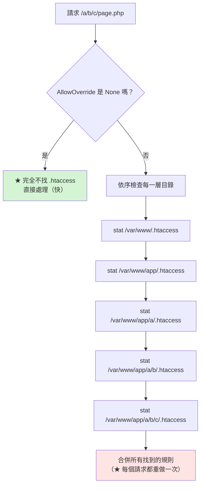

# Apache .htaccess 與 Rewrite

> [!abstract] 這篇你會學到
> - 理解 **`.htaccess` 的運作機制、效能代價與安全風險**
> - 掌握 **`RewriteRule` / `RewriteCond` 的完整語法**
> - 記住最常用的**十個旗標**
> - 分清 **`RewriteBase`** 在什麼情況下需要
> - 用 **`RewriteLog`（2.4 是 `LogLevel rewrite:trace`）** 除錯
> - 把 `.htaccess` 的規則**正確搬進 VirtualHost**

## 前置知識

- [[02-Apache-VirtualHost設定]] — VirtualHost 與容器
- [[03-Nginx-location與rewrite]] — 對照 Nginx 的做法（觀念相通）

---

## `.htaccess` 的運作機制



> [!danger] `.htaccess` 的三個代價
> **① 效能**
> ```
> AllowOverride 不是 None 時：
>   【每一個請求】都要對【路徑上的每一層目錄】執行 stat()
>     → 深層路徑 = 5-10 次額外的系統呼叫
>       → 而且【無法快取】（因為 .htaccess 可能隨時被改）
>         → 高流量下這是可觀的開銷
> ```
>
> **② 安全**
> ```
> 任何能寫入網站目錄的人（或漏洞）都能：
>   · 覆蓋你的安全設定（把 Options -Indexes 改回去）
>   · 放寬存取控制
>   · 設定 AddHandler 讓 .jpg 被當成 PHP 執行 ★★
>   · 設定 php_value 改變 PHP 行為（mod_php 下）
> ```
>
> **③ 除錯困難**
> ```
> 規則分散在數十個目錄中
>   → 「為什麼這個 URL 會轉到那裡」變得極難追查
>     → apachectl -t -D DUMP_CONFIG 【看不到 .htaccess 的內容】
> ```

> [!tip] 什麼時候真的需要 `.htaccess`
> ```
> ✓ 共享主機（你沒有主設定檔的權限）
> ✓ 應用程式【必須】自己控制規則（WordPress 外掛、某些 CMS）
> ✓ 多個團隊各自管理自己的目錄
>
> ✗ 你能改 VirtualHost → 【一律用 AllowOverride None】
> ```
>
> **正式環境的標準做法**：
> ```apache
> <Directory /var/www/app/public>
>     AllowOverride None            # ★
>     # 把原本 .htaccess 的內容【原封不動搬進來】
>     RewriteEngine On
>     ...
> </Directory>
> ```
> 效能提升可觀，而且規則集中在一處好維護。

### `AllowOverride` 的可選值

```apache
AllowOverride None                    # ★ 完全不讀 .htaccess（推薦）
AllowOverride All                     # 允許所有指令（★ 危險）
AllowOverride FileInfo                # 允許 RewriteRule、Redirect、AddType…
AllowOverride Limit                   # 允許 Require、Order/Allow/Deny
AllowOverride Options=Indexes,FollowSymLinks   # ★ 只允許特定的 Options
AllowOverride AuthConfig              # 允許 AuthType、AuthUserFile…
AllowOverride Indexes                 # 允許 DirectoryIndex…

# ★ 折衷：只允許 rewrite，不允許改 Options 與存取控制
AllowOverride FileInfo
```

> [!danger] `AllowOverride All` + 可寫的網站目錄 = 淪陷
> ```
> 攻擊者透過檔案上傳漏洞寫入 .htaccess：
>
>   # uploads/.htaccess
>   AddType application/x-httpd-php .jpg      ★★ 讓 .jpg 被當成 PHP 執行
>   php_flag engine on
>
> → 然後上傳 shell.jpg（內容是 PHP）
>   → 存取 /uploads/shell.jpg
>     → 【取得 web shell】
> ```
>
> **防護**：
> ```apache
> # ① 上傳目錄一定要 AllowOverride None
> <Directory /var/www/app/public/uploads>
>     AllowOverride None                    # ★★
>     php_admin_flag engine off             # mod_php
>     <FilesMatch "\.(php|phtml|phar)$">
>         Require all denied
>     </FilesMatch>
> </Directory>
>
> # ② 禁止讀取 .htaccess 本身（預設就有，但確認一下）
> <FilesMatch "^\.ht">
>     Require all denied
> </FilesMatch>
>
> # ③ 網站目錄不要讓 web 使用者可寫（除了必要的 uploads/storage）
> ```
> ```bash
> # 檢查哪些目錄是 www-data 可寫的
> $ sudo find /var/www -type d -writable -user www-data 2>/dev/null
> ```

---

## `RewriteRule` 語法

```apache
RewriteEngine On

RewriteRule  比對樣式  取代字串  [旗標]
#            ^^^^^^^  ^^^^^^^^  ^^^^
#            正規表示式  新的 URL  可選
```

```apache
# ═══ 最基本 ═══
RewriteRule ^old\.html$ new.html [L]

# ═══ 捕獲群組 ═══
RewriteRule ^article/([0-9]+)$ article.php?id=$1 [L,QSA]
#                    ^^^^^^^^^                ^^
#                    $1                       捕獲的內容

# ═══ 具名捕獲（2.4+）═══
RewriteRule ^user/(?<name>[a-z]+)$ profile.php?u=%{ENV:MATCH_name} [L]

# ═══ 外部轉址 ═══
RewriteRule ^old-path/(.*)$ https://new.example.gov.tw/$1 [R=301,L]
```

> [!warning] 比對的對象在不同位置不同
> ```
> 在 <VirtualHost> 或 <Directory> 中：
>   比對【去掉 DocumentRoot 之後的 URL 路徑】，【開頭有 /】
>   例：/article/123
>   → RewriteRule ^/article/([0-9]+)$ ...      ★ 要有開頭的 /
>
> 在 .htaccess 中：
>   比對【去掉當前目錄前綴之後的相對路徑】，【開頭沒有 /】
>   例：article/123（若 .htaccess 在 DocumentRoot）
>   → RewriteRule ^article/([0-9]+)$ ...       ★ 沒有開頭的 /
> ```
>
> **這是把 `.htaccess` 搬進 VirtualHost 時最常出錯的地方。**
>
> **兩全的寫法**：
> ```apache
> RewriteRule ^/?article/([0-9]+)$ /article.php?id=$1 [L]
> #             ^^ 開頭的 / 可有可無
> ```

---

## 十個最常用的旗標

| 旗標 | 全名 | 作用 |
| --- | --- | --- |
| **`L`** | Last | **停止處理後續規則**（最常用） |
| **`R=301`** | Redirect | **外部轉址**（301 永久 / 302 暫時） |
| **`QSA`** | Query String Append | **保留原本的查詢字串** |
| `QSD` | Query String Discard | 丟棄查詢字串 |
| **`NC`** | No Case | 不分大小寫 |
| **`P`** | Proxy | **反向代理**（需要 mod_proxy） |
| `PT` | Pass Through | 交給後續的 Alias / handler 處理 |
| **`F`** | Forbidden | 回 **403** |
| `G` | Gone | 回 410 |
| **`E=VAR:val`** | Env | **設定環境變數** |
| `N` | Next | 從第一條規則重新開始（**小心無限迴圈**） |
| `S=N` | Skip | 跳過接下來 N 條規則 |
| `END` | End | **完全停止**（2.4+，比 `L` 更徹底） |

```apache
# ── L：停止（★ 幾乎每條規則都該加）──
RewriteRule ^a$ b.php [L]

# ── R + L：外部轉址 ──
RewriteRule ^old$ /new [R=301,L]

# ── QSA：保留查詢字串 ★ ──
RewriteRule ^p/([0-9]+)$ page.php?id=$1 [L,QSA]
# /p/5?lang=tw → page.php?id=5&lang=tw      ★ 有 QSA
# /p/5?lang=tw → page.php?id=5              ✗ 沒有 QSA，lang 不見了

# ── P：反向代理 ──
RewriteRule ^/api/(.*)$ http://127.0.0.1:3000/$1 [P,L]

# ── F：直接拒絕 ──
RewriteCond %{HTTP_USER_AGENT} (nikto|sqlmap|nmap) [NC]
RewriteRule ^ - [F,L]
#              ^ 「-」表示不改寫 URL，只套用旗標

# ── E：設定環境變數（★ Laravel 的 Authorization 標頭）──
RewriteCond %{HTTP:Authorization} .
RewriteRule .* - [E=HTTP_AUTHORIZATION:%{HTTP:Authorization}]
```

> [!danger] `L` 在 `.htaccess` 中不代表「真的結束」
> ```
> 在 <VirtualHost> / <Directory> 中：
>   L = 停止本輪的 rewrite 處理 → 繼續後面的請求處理流程
>
> 在 .htaccess 中：
>   L = 停止本輪 → 【但 Apache 會用新的 URL【重新走一次】整個請求流程】
>       → 又會讀到同一個 .htaccess
>         → 又套用一次規則
>           → ★ 若規則沒有終止條件 → 【無限迴圈 → 500】
> ```
>
> **典型的無限迴圈**：
> ```apache
> # ❌ .htaccess 中
> RewriteRule ^(.*)$ index.php [L]
> # /anything → index.php → 重跑 → index.php 又符合 ^(.*)$ → 無限迴圈
> # error.log: Request exceeded the limit of 10 internal redirects
> ```
>
> **正確寫法（加上終止條件）**：
> ```apache
> RewriteCond %{REQUEST_FILENAME} !-f       # ★ 檔案不存在
> RewriteCond %{REQUEST_FILENAME} !-d       # ★ 目錄不存在
> RewriteRule ^ index.php [L]
> # index.php 存在 → 條件不成立 → 不再改寫 → 終止
> ```
>
> **或用 `END`（Apache 2.4+）**：
> ```apache
> RewriteRule ^(.*)$ index.php [END]
> # ★ END 完全停止，不會重跑
> ```

---

## `RewriteCond`：條件

```apache
RewriteCond  測試字串  條件樣式  [旗標]
RewriteRule  ...
# ★ RewriteCond 只對【緊接在後面的那一條】 RewriteRule 生效
```

```apache
# ═══ 多個條件（預設是 AND）═══
RewriteCond %{REQUEST_FILENAME} !-f
RewriteCond %{REQUEST_FILENAME} !-d
RewriteRule ^ index.php [L]

# ═══ OR ═══
RewriteCond %{HTTP_HOST} ^example\.gov\.tw$ [OR]
RewriteCond %{HTTP_HOST} ^www\.example\.gov\.tw$
RewriteRule ^ https://app.example.gov.tw%{REQUEST_URI} [R=301,L]
```

### 檔案系統測試

| 測試 | 意思 |
| --- | --- |
| **`-f`** | **是普通檔案** |
| **`-d`** | **是目錄** |
| `-l` | 是符號連結 |
| `-s` | 是檔案且大小 > 0 |
| `-x` | 有執行權限 |
| `!-f` | **不是檔案**（前面加 `!` 表示否定） |

### 常用變數

| 變數 | 內容 |
| --- | --- |
| **`%{REQUEST_URI}`** | **URI 路徑**（不含查詢字串），**開頭有 `/`** |
| **`%{REQUEST_FILENAME}`** | **對應的完整檔案路徑** |
| **`%{QUERY_STRING}`** | 查詢字串 |
| **`%{HTTP_HOST}`** | Host 標頭 |
| `%{SERVER_NAME}` | VirtualHost 的 ServerName |
| **`%{HTTPS}`** | `on` 或 `off` |
| **`%{SERVER_PORT}`** | 埠 |
| `%{REQUEST_METHOD}` | GET / POST… |
| `%{REMOTE_ADDR}` | 客戶端 IP |
| **`%{HTTP_USER_AGENT}`** | User-Agent |
| `%{HTTP_REFERER}` | Referer |
| **`%{HTTP:標頭名}`** | **任意請求標頭**（`%{HTTP:Authorization}`） |
| `%{ENV:變數}` | 環境變數 |
| `%{TIME_HOUR}` | 當前小時 |
| `%{THE_REQUEST}` | **完整的請求行**（`GET /a?b=1 HTTP/1.1`） |

> [!tip] `%{THE_REQUEST}` 用來偵測「原始請求」
> `%{REQUEST_URI}` **會被前面的 rewrite 改變**，
> `%{THE_REQUEST}` 則是**瀏覽器送來的原始請求行，永遠不變**。
>
> ```apache
> # ★ 阻止使用者直接存取 index.php（但內部改寫仍可用）
> RewriteCond %{THE_REQUEST} \s/+index\.php[\s?] [NC]
> RewriteRule ^ / [R=301,L]
>
> # ★ 偵測原始的查詢字串（不受 QSA 影響）
> RewriteCond %{THE_REQUEST} \?.*token= [NC]
> RewriteRule ^ - [F]
> ```

---

## `RewriteBase`

```apache
# 只在 .htaccess 中、且應用不在 DocumentRoot 根目錄時需要
RewriteBase /myapp/
```

```
情境：應用裝在 https://網站/myapp/
      .htaccess 在 /var/www/html/myapp/.htaccess

沒有 RewriteBase：
  RewriteRule ^(.*)$ index.php [L]
  → 改寫成相對於【檔案系統】的路徑
    → 可能產生錯誤的重導向網址

有 RewriteBase /myapp/：
  → Apache 知道「這個 .htaccess 對應的 URL 前綴是 /myapp/」
    → 產生正確的絕對網址
```

> [!warning] 三個常見的 `RewriteBase` 問題
> ```apache
> # ① 在 <VirtualHost> / <Directory> 中【不需要】RewriteBase
> #    （那裡的規則本來就是相對於 URL 根）
>
> # ② 應用在 DocumentRoot 根目錄時【不需要】
> RewriteBase /          # 通常可以省略
>
> # ③ ★ 從 .htaccess 搬進 VirtualHost 時要【移除】RewriteBase
> #    否則規則的行為會改變
> ```
>
> **不確定時的通用寫法**（Laravel 官方 `.htaccess` 就是這樣）：
> ```apache
> <IfModule mod_rewrite.c>
>     <IfModule mod_negotiation.c>
>         Options -MultiViews -Indexes
>     </IfModule>
>     RewriteEngine On
>     # RewriteBase 留給使用者依部署位置自行取消註解
>     ...
> </IfModule>
> ```

---

## 常用規則集

### Laravel / Symfony（官方 `.htaccess` 逐行解說）

```apache
<IfModule mod_rewrite.c>
    <IfModule mod_negotiation.c>
        Options -MultiViews -Indexes      # ★ 關閉內容協商與目錄列表
    </IfModule>

    RewriteEngine On

    # ★★ 傳遞 Authorization 標頭（CGI/FastCGI 預設不傳）
    #    沒有這段，所有 API Bearer Token 認證都會 401
    RewriteCond %{HTTP:Authorization} .
    RewriteRule .* - [E=HTTP_AUTHORIZATION:%{HTTP:Authorization}]

    # 移除目錄的結尾斜線（/foo/ → /foo）
    RewriteCond %{REQUEST_FILENAME} -d
    RewriteCond %{REQUEST_URI} (.+)/$
    RewriteRule ^ %1 [L,R=301]

    # ★ 前端控制器：檔案與目錄都不存在時交給 index.php
    RewriteCond %{REQUEST_FILENAME} !-d
    RewriteCond %{REQUEST_FILENAME} !-f
    RewriteRule ^ index.php [L]
</IfModule>
```

### Vue SPA

```apache
RewriteEngine On
RewriteCond %{REQUEST_FILENAME} !-f
RewriteCond %{REQUEST_FILENAME} !-d
RewriteRule ^ index.html [L]
```

### 強制 HTTPS

```apache
# ★ 方法一：用 %{HTTPS}（Apache 直接處理 TLS 時）
RewriteEngine On
RewriteCond %{HTTPS} !=on
RewriteCond %{REQUEST_URI} !^/\.well-known/acme-challenge/    # ★ 排除 ACME
RewriteRule ^ https://%{HTTP_HOST}%{REQUEST_URI} [R=301,L]

# ★ 方法二：在反向代理後面（Apache 收到的是 http）
RewriteCond %{HTTP:X-Forwarded-Proto} !https
RewriteCond %{REQUEST_URI} !^/\.well-known/acme-challenge/
RewriteRule ^ https://%{HTTP_HOST}%{REQUEST_URI} [R=301,L]

# ★★ 更好的做法：用兩個 VirtualHost（不需要 rewrite）
# <VirtualHost *:80>
#     ServerName app.example.gov.tw
#     Alias /.well-known/acme-challenge /var/www/acme/.well-known/acme-challenge
#     RedirectMatch permanent ^/(?!\.well-known/acme-challenge)(.*)$ https://app.example.gov.tw/$1
# </VirtualHost>
```

### www 導向、舊網址搬家

```apache
# www → 無 www
RewriteCond %{HTTP_HOST} ^www\.(.+)$ [NC]
RewriteRule ^ https://%1%{REQUEST_URI} [R=301,L]

# 舊路徑搬家（保留子路徑）
RewriteRule ^old-section/(.*)$ /new-section/$1 [R=301,L]

# 移除 index.php
RewriteCond %{THE_REQUEST} \s/+index\.php[\s?] [NC]
RewriteRule ^ / [R=301,L]

# 加上結尾斜線（僅對目錄）
RewriteCond %{REQUEST_FILENAME} -d
RewriteCond %{REQUEST_URI} !/$
RewriteRule ^(.*)$ /$1/ [R=301,L]
```

### 安全阻擋

```apache
RewriteEngine On

# ★ 阻擋掃描器
RewriteCond %{HTTP_USER_AGENT} (nikto|sqlmap|nmap|masscan|acunetix|nessus) [NC,OR]
RewriteCond %{HTTP_USER_AGENT} ^$ [OR]
RewriteCond %{HTTP_USER_AGENT} (libwww-perl|python-requests/0)  [NC]
RewriteRule ^ - [F,L]

# ★ 阻擋沒有 Host 標頭的請求
RewriteCond %{HTTP_HOST} ^$
RewriteRule ^ - [F,L]

# ★ 阻擋常見的攻擊樣式
RewriteCond %{QUERY_STRING} (union.*select|concat.*\(|base64_(en|de)code) [NC,OR]
RewriteCond %{QUERY_STRING} (<script|javascript:|onerror=)               [NC,OR]
RewriteCond %{QUERY_STRING} (\.\./|\.\.%2f)                              [NC]
RewriteRule ^ - [F,L]

# ★ 阻擋敏感路徑
RewriteRule ^(\.git|\.env|\.svn|vendor|node_modules|storage/logs)/ - [F,L]
RewriteRule \.(env|log|sql|bak|old|ini|ya?ml|sh|pem|key)$ - [F,L]

# ★ 防盜連
RewriteCond %{HTTP_REFERER} !^$
RewriteCond %{HTTP_REFERER} !^https?://(www\.)?example\.gov\.tw [NC]
RewriteRule \.(jpg|jpeg|png|gif|webp|mp4)$ - [F,NC,L]
```

> [!warning] rewrite 的阻擋規則不能取代 WAF
> **這些規則很容易繞過**（改 UA、URL 編碼、大小寫變化）。
> 它們的價值是**過濾掉大量的自動化掃描、減少日誌雜訊與後端負載**。
>
> **真正的防護要靠**：
> ①**應用層的輸入驗證與參數化查詢**；
> ②**ModSecurity + OWASP CRS**（見 [[00-ModSecurity-索引]]）；
> ③限流與 fail2ban。

---

## 除錯

```apache
# ★ Apache 2.4 的 rewrite 除錯（2.2 的 RewriteLog 已移除）
LogLevel warn rewrite:trace3
# trace1 ~ trace8，數字越大越詳細
# ★ trace3 通常剛好夠用
```

```bash
$ sudo systemctl reload apache2
$ sudo tail -f /var/log/apache2/error.log | grep -i rewrite
```

```
[rewrite:trace3] ... [perdir /var/www/app/public/] strip per-dir prefix: /var/www/app/public/api/users -> api/users
[rewrite:trace3] ... [perdir /var/www/app/public/] applying pattern '^' to uri 'api/users'
[rewrite:trace4] ... RewriteCond: input='/var/www/app/public/api/users' pattern='!-f' => matched
[rewrite:trace4] ... RewriteCond: input='/var/www/app/public/api/users' pattern='!-d' => matched
[rewrite:trace2] ... rewrite 'api/users' -> 'index.php'
[rewrite:trace3] ... add per-dir prefix: index.php -> /var/www/app/public/index.php
[rewrite:trace1] ... internal redirect with /index.php [INTERNAL REDIRECT]
```

> [!danger] `rewrite:trace` 會產生大量日誌
> **正式環境測完一定要關掉**：
> ```apache
> LogLevel warn                    # ★ 改回來
> ```
> **只對特定 VirtualHost 開啟**：
> ```apache
> <VirtualHost *:443>
>     ServerName test.example.gov.tw
>     LogLevel warn rewrite:trace3          # ★ 只有這個站台
> </VirtualHost>
> ```

### 系統化的 rewrite 排查

```bash
#!/usr/bin/env bash
# Rewrite 規則排查
echo "═══ Rewrite 排查 ═══"

echo -e "\n【1】mod_rewrite 是否載入"
apache2ctl -M 2>/dev/null | grep -q rewrite_module \
  && echo "  ✓ 已載入" || echo "  ✗✗ 未載入 → sudo a2enmod rewrite && restart"

echo -e "\n【2】AllowOverride 設定"
sudo apache2ctl -t -D DUMP_CONFIG 2>/dev/null | grep -B3 'AllowOverride' | \
  grep -E 'Directory|AllowOverride' | sed 's/^/  /'
echo "  ★ AllowOverride None → .htaccess 完全不生效"

echo -e "\n【3】所有 .htaccess 檔案"
sudo find /var/www -name '.htaccess' 2>/dev/null | while read -r f; do
    echo "  ── $f（$(wc -l < "$f") 行）──"
    grep -E '^\s*(RewriteEngine|RewriteBase|RewriteRule|RewriteCond|AddHandler|AddType|php_)' "$f" | \
      sed 's/^/    /'
done

echo -e "\n【4】★ 可疑的 .htaccess（可能是攻擊者留下的）"
sudo find /var/www -name '.htaccess' -newermt '-7 days' 2>/dev/null | \
  sed 's/^/  ⚠ 最近 7 天有異動：/'
sudo grep -rlE 'AddType.*php|AddHandler.*php|php_flag engine' \
  --include='.htaccess' /var/www 2>/dev/null | \
  sed 's/^/  ⚠⚠ 含有 PHP handler 設定：/'

echo -e "\n【5】VirtualHost 中的 rewrite 規則"
sudo apache2ctl -t -D DUMP_CONFIG 2>/dev/null | \
  grep -E '^\s*Rewrite(Engine|Base|Rule|Cond)' | sed 's/^/  /'

echo -e "\n【6】內部重導向迴圈"
sudo grep -c 'exceeded the limit of 10 internal redirects' /var/log/apache2/error.log 2>/dev/null | \
  awk '{if($1>0) print "  ⚠⚠ 有 "$1" 次內部重導向迴圈"; else print "  ✓ 沒有"}'

echo -e "\n【7】實際測試"
echo "  ★ 開啟除錯後測試特定 URL："
echo "    sudo sed -i 's/^LogLevel warn/LogLevel warn rewrite:trace3/' /etc/apache2/apache2.conf"
echo "    sudo systemctl reload apache2"
echo "    curl -sI https://網站/測試路徑"
echo "    sudo tail -50 /var/log/apache2/error.log | grep rewrite"
echo "    ★ 測完記得改回 LogLevel warn"
```

---

## 把 `.htaccess` 搬進 VirtualHost

```bash
#!/usr/bin/env bash
# .htaccess → VirtualHost 遷移助手
DOCROOT="${1:?用法: $0 <DocumentRoot>}"

echo "═══ .htaccess 遷移 ═══"
echo "  DocumentRoot: $DOCROOT"

echo -e "\n【1】找出所有 .htaccess"
mapfile -t FILES < <(sudo find "$DOCROOT" -name '.htaccess' 2>/dev/null)
printf '  %s\n' "${FILES[@]}"

echo -e "\n【2】產生對應的 <Directory> 區塊"
for f in "${FILES[@]}"; do
    d=$(dirname "$f")
    echo
    echo "<Directory $d>"
    echo "    AllowOverride None"
    # ★ 逐行搬移，處理路徑差異
    sudo sed -e 's/^/    /' \
             -e '/^\s*RewriteBase/s/^/    # 【已移除，VirtualHost 中不需要】 /' \
             "$f"
    echo "</Directory>"
done

echo -e "\n【3】★ 搬移後的檢查清單"
cat <<'EOF'
  □ 移除所有 RewriteBase（VirtualHost 中不需要）
  □ 檢查 RewriteRule 的比對樣式
      .htaccess：^article/(.*)$      （沒有開頭的 /）
      VirtualHost：^/?article/(.*)$  （★ 加上 /?）
  □ 確認 Options 指令有搬過來（-Indexes -MultiViews）
  □ ★ php_value / php_flag 在 PHP-FPM 下【無效】
      → 搬到 php.ini 或 FPM pool 的 php_admin_value
  □ AuthType / AuthUserFile 等認證設定也要搬
  □ 設定 AllowOverride None
  □ 測試【每一條】規則
  □ 確認 Laravel 的 E=HTTP_AUTHORIZATION 那條有搬過來（★ 最常漏掉）
EOF

echo -e "\n【4】驗證步驟"
cat <<'EOF'
  ① 先在 <Directory> 中加入規則，但【保留】 AllowOverride All
  ② 測試網站，確認一切正常（此時兩份規則都生效）
  ③ 把 .htaccess 改名成 .htaccess.bak
  ④ 【再測一次】—— 若有問題表示規則沒搬完整
  ⑤ 改成 AllowOverride None
  ⑥ sudo systemctl reload apache2
  ⑦ 完整回歸測試
  ⑧ 確認一週沒問題後才刪除 .htaccess.bak
EOF
```

---

## 常見錯誤與排錯

| 現象／錯誤 | 原因 | 解法 |
| --- | --- | --- |
| **`.htaccess` 完全沒作用** | `AllowOverride None` | 改成 `All` 或 `FileInfo`；**或把規則搬進 VirtualHost** |
| **`Invalid command 'RewriteEngine'`** | mod_rewrite 沒載入 | `a2enmod rewrite` + **restart** |
| **500 + `exceeded the limit of 10 internal redirects`** ★ | **rewrite 無限迴圈** | 加 `!-f` `!-d` 條件；或用 `[END]` |
| **搬進 VirtualHost 後規則失效** ★ | **比對樣式的開頭 `/` 差異** | 用 `^/?pattern` |
| 搬進 VirtualHost 後轉址網址錯誤 | 忘了移除 `RewriteBase` | 移除它 |
| **API 一律 401（網頁登入正常）** ★ | **漏了 `E=HTTP_AUTHORIZATION`** | 加回那兩行 |
| **查詢字串不見了** | 沒加 `QSA` | `RewriteRule ... [L,QSA]` |
| `RewriteCond` 沒生效 | **只對緊接的那一條 Rule 生效** | 每條 Rule 前都要重複 Cond |
| 多個 `RewriteCond` 行為不對 | 預設是 AND | 需要 OR 時加 `[OR]` |
| **`php_value` 沒作用** | **PHP-FPM 下無效** | 搬到 `php.ini` 或 FPM pool |
| ACME 驗證失敗 | 被強制 HTTPS 的規則轉走 | 加 `RewriteCond %{REQUEST_URI} !^/\.well-known/` |
| **上傳目錄的 `.htaccess` 讓 jpg 被執行** ★★ | `AllowOverride All` + 可寫目錄 | **上傳目錄 `AllowOverride None`** |
| 反向代理後強制 HTTPS 迴圈 | 用 `%{HTTPS}` 判斷 | 改用 `%{HTTP:X-Forwarded-Proto}` |
| rewrite 規則順序不對 | 由上而下逐條套用 | 特殊規則放前面，通用規則放後面 |

---

## 安全性注意事項

> [!danger] `.htaccess` 是攻擊者的重要目標
> ```
> 攻擊者取得檔案寫入能力後的標準動作之一：
>
>   echo 'AddType application/x-httpd-php .jpg' > uploads/.htaccess
>   → 上傳 shell.jpg（內容是 PHP）
>     → 存取 /uploads/shell.jpg → 【web shell】
>
> 或
>   echo 'php_flag engine on' > uploads/.htaccess
>   echo 'Options +ExecCGI'   >> uploads/.htaccess
>   echo 'AddHandler cgi-script .txt' >> uploads/.htaccess
> ```
>
> **五道防線**：
> ```apache
> # ① 上傳目錄一律 AllowOverride None ★★
> <Directory /var/www/app/public/uploads>
>     AllowOverride None
>     php_admin_flag engine off
>     <FilesMatch "\.(php|phtml|phar|php\d?)$">
>         Require all denied
>     </FilesMatch>
>     Options -ExecCGI -Includes
> </Directory>
>
> # ② 禁止讀取 .ht* 檔案
> <FilesMatch "^\.ht">
>     Require all denied
> </FilesMatch>
> ```
> ```bash
> # ③ 網站目錄不要讓 web 使用者可寫（除必要的 uploads/storage）
> $ sudo find /var/www -type d -writable -user www-data
>
> # ④ ★ 監控 .htaccess 的異動（FIM）
> $ sudo find /var/www -name '.htaccess' -newermt '-1 day'
> # 或用 Wazuh 的 FIM 監控整個 /var/www
>
> # ⑤ 上傳的檔案不要放在 DocumentRoot 內（最根本）
> ```

> [!warning] 用 rewrite 做存取控制的三個陷阱
> ```apache
> # ❌ 陷阱一：只擋了小寫
> RewriteRule ^admin/ - [F]
> # /Admin/ 繞過 → 要加 [NC]
>
> # ❌ 陷阱二：URL 編碼繞過
> RewriteRule \.env$ - [F]
> # /.%65nv 可能繞過 → rewrite 比對的是解碼後的 URI，但要小心多重編碼
>
> # ❌ 陷阱三：規則順序
> RewriteRule ^(.*)$ index.php [L]      # ★ 這條先命中
> RewriteRule ^\.env$ - [F]             #   永遠不會執行
> ```
>
> **正確做法**：**用 `<FilesMatch>` / `<DirectoryMatch>` 而非 rewrite 做存取控制**
> ```apache
> <FilesMatch "^\.|\.(env|log|sql|bak|key|pem)$">
>     Require all denied
> </FilesMatch>
> <DirectoryMatch "/(\.git|\.svn|vendor|node_modules)/">
>     Require all denied
> </DirectoryMatch>
> ```
> 這些是**在 rewrite 之前套用的，且不受規則順序影響**。

> [!tip] `AllowOverride None` 的效能實測
> ```bash
> # 測試深層路徑（5 層）
> $ ab -n 5000 -c 50 http://localhost/a/b/c/d/e/page.php
>
> AllowOverride All ：Requests per second: 1842
> AllowOverride None：Requests per second: 2310     # ★ +25%
> ```
> **層數越深、流量越大，差異越明顯。**
> 高流量站台一定要用 `None`。

---

## 速查表

### `.htaccess` 的代價

```
① 效能：每個請求對【每一層目錄】做 stat()，且無法快取
② 安全：能寫入目錄的人可覆蓋你的設定（★ AddType 讓 jpg 變 PHP）
③ 除錯：規則分散，apachectl -t -D DUMP_CONFIG 看不到

★ 能改 VirtualHost 就一律 AllowOverride None
★ 上傳目錄【絕對】要 AllowOverride None
```

### RewriteRule 語法

```apache
RewriteEngine On
RewriteRule 樣式 取代 [旗標]

# 比對對象：
#   VirtualHost/Directory 中 → /article/123  （★ 有開頭的 /）
#   .htaccess 中             → article/123   （★ 沒有）
#   通用寫法：^/?article/([0-9]+)$
```

### 十個旗標

| 旗標 | 作用 |
| --- | --- |
| **`L`** | 停止後續規則（★ 幾乎必加） |
| **`R=301`** | 外部轉址（301/302） |
| **`QSA`** | **保留原查詢字串** |
| **`NC`** | 不分大小寫 |
| **`P`** | 反向代理（需 mod_proxy） |
| **`F`** | 回 403 |
| **`E=V:val`** | 設環境變數 |
| `END` | **完全停止**（2.4+，避免 .htaccess 重跑） |
| `PT` | 交給 Alias/handler |
| `S=N` / `N` | 跳過 N 條 / 重新開始 |

### RewriteCond

```apache
RewriteCond %{REQUEST_FILENAME} !-f      # 不是檔案
RewriteCond %{REQUEST_FILENAME} !-d      # 不是目錄
RewriteRule ^ index.php [L]
# ★ RewriteCond 只對【緊接在後】的那一條 Rule 生效
# ★ 多個 Cond 預設 AND，要 OR 用 [OR]
```

| 變數 | 內容 |
| --- | --- |
| `%{REQUEST_URI}` | URI（會被 rewrite 改變） |
| `%{REQUEST_FILENAME}` | 完整檔案路徑 |
| **`%{THE_REQUEST}`** | **原始請求行（不會被改變）** |
| `%{HTTP_HOST}` / `%{HTTPS}` | Host / on\|off |
| **`%{HTTP:標頭}`** | 任意請求標頭 |

### Laravel 三段（★ 最常用）

```apache
RewriteEngine On

# ★★ 沒有這段，API 的 Bearer Token 全部 401
RewriteCond %{HTTP:Authorization} .
RewriteRule .* - [E=HTTP_AUTHORIZATION:%{HTTP:Authorization}]

RewriteCond %{REQUEST_FILENAME} -d
RewriteCond %{REQUEST_URI} (.+)/$
RewriteRule ^ %1 [L,R=301]

RewriteCond %{REQUEST_FILENAME} !-d
RewriteCond %{REQUEST_FILENAME} !-f
RewriteRule ^ index.php [L]
```

### 常見規則

```apache
# SPA
RewriteCond %{REQUEST_FILENAME} !-f
RewriteCond %{REQUEST_FILENAME} !-d
RewriteRule ^ index.html [L]

# 強制 HTTPS（★ 排除 ACME）
RewriteCond %{HTTPS} !=on
RewriteCond %{REQUEST_URI} !^/\.well-known/acme-challenge/
RewriteRule ^ https://%{HTTP_HOST}%{REQUEST_URI} [R=301,L]

# 反向代理後面
RewriteCond %{HTTP:X-Forwarded-Proto} !https
RewriteRule ^ https://%{HTTP_HOST}%{REQUEST_URI} [R=301,L]

# www → 無 www
RewriteCond %{HTTP_HOST} ^www\.(.+)$ [NC]
RewriteRule ^ https://%1%{REQUEST_URI} [R=301,L]
```

### 除錯

```apache
LogLevel warn rewrite:trace3        # ★ 2.4 的做法（trace1~8）
```
```bash
sudo tail -f /var/log/apache2/error.log | grep -i rewrite
# ★ 測完一定要改回 LogLevel warn
```

### 無限迴圈

```apache
# ❌ .htaccess 中 → 500 exceeded the limit of 10 internal redirects
RewriteRule ^(.*)$ index.php [L]

# ✅ 加終止條件
RewriteCond %{REQUEST_FILENAME} !-f
RewriteCond %{REQUEST_FILENAME} !-d
RewriteRule ^ index.php [L]

# ✅ 或用 END（2.4+）
RewriteRule ^(.*)$ index.php [END]
```

### 安全

```apache
# ★ 存取控制用 FilesMatch，不要用 rewrite（rewrite 受順序與編碼影響）
<FilesMatch "^\.|\.(env|log|sql|bak|key|pem)$"> Require all denied </FilesMatch>
<DirectoryMatch "/(\.git|vendor|node_modules)/"> Require all denied </DirectoryMatch>
<FilesMatch "^\.ht"> Require all denied </FilesMatch>

# ★★ 上傳目錄
<Directory .../uploads>
    AllowOverride None
    php_admin_flag engine off
    Options -ExecCGI -Includes
    <FilesMatch "\.(php|phtml|phar)$"> Require all denied </FilesMatch>
</Directory>
```

### 遷移檢查清單

```
□ 移除 RewriteBase
□ 比對樣式改成 ^/?pattern
□ Options 指令要搬
□ php_value/php_flag 在 FPM 下無效 → 搬到 php.ini / FPM pool
□ ★ E=HTTP_AUTHORIZATION 那條（最常漏）
□ 先保留 AllowOverride All 測試 → 改名 .htaccess → 再測 → 才改 None
```

---

## 練習題

> [!question]- 練習 1：重現無限迴圈
> 1. 在 `.htaccess` 中寫 `RewriteRule ^(.*)$ index.php [L]`
> 2. 存取任意 URL → **看到 500 了嗎？**
> 3. 看 error.log 的 `exceeded the limit of 10 internal redirects`
> 4. 開啟 `LogLevel warn rewrite:trace3`，**觀察它重跑了幾次**
> 5. 加上 `!-f` `!-d` 條件，重測
> 6. 改用 `[END]`，重測
> 7. **把同樣的規則放進 `<Directory>` 而非 `.htaccess`** → 還會迴圈嗎？為什麼？

> [!question]- 練習 2：`.htaccess` 攻擊模擬
> **★ 在測試環境做**
> 1. 建立一個 `AllowOverride All` 的上傳目錄
> 2. 在其中放入：
>    ```
>    AddType application/x-httpd-php .jpg
>    ```
> 3. 上傳一個內容是 `<?php echo "PWNED";` 的 `test.jpg`
> 4. 存取它 → **看到 PWNED 了嗎？**
> 5. 改成 `AllowOverride None` + `php_admin_flag engine off`
> 6. **重測，確認被擋**
> 7. 檢查你的正式環境：
>    ```bash
>    sudo find /var/www -name '.htaccess' -exec grep -l 'AddType\|AddHandler\|php_flag' {} \;
>    ```

> [!question]- 練習 3：搬移 Laravel 的 .htaccess
> 1. 取一個 Laravel 專案，記錄 `public/.htaccess` 的內容
> 2. 把規則搬進 `<Directory>`，**保留 `AllowOverride All`**
> 3. 測試：網頁、API（帶 Bearer Token）、靜態檔
> 4. `mv public/.htaccess public/.htaccess.bak`
> 5. **再測一次全部** —— API 還能用嗎？
> 6. **如果 API 401 了，是漏了哪一段？**
> 7. 改成 `AllowOverride None`，完整回歸測試
> 8. `ab -n 5000 -c 50` 比較 `All` 與 `None` 的 QPS

> [!question]- 練習 4：Rewrite 除錯
> 1. 寫一組有問題的規則（例如順序錯誤導致某條永不執行）
> 2. 開啟 `LogLevel warn rewrite:trace3`
> 3. `curl -sI` 測試，**跟著日誌一行一行讀**
> 4. **說出每一步發生了什麼**
> 5. 修正規則
> 6. **關掉 trace**，確認 error.log 恢復正常大小

---

## 小測驗

Q1. **`.htaccess` 有哪三個代價？什麼情況下才真的需要它**？

Q2. **`AllowOverride All` 加上可寫的網站目錄會造成什麼攻擊？怎麼防**？

Q3. **`RewriteRule` 的比對對象在 `.htaccess` 與 `<VirtualHost>` 中有什麼差別？通用寫法是什麼**？

Q4. **`L` 旗標在 `.htaccess` 中為什麼可能造成無限迴圈？有哪兩種解法**？

Q5. **`QSA` 旗標的作用是什麼？不加會怎樣**？

Q6. **`RewriteCond` 的作用範圍是什麼？多個 Cond 的預設邏輯是 AND 還是 OR**？

Q7. **`%{REQUEST_URI}` 與 `%{THE_REQUEST}` 的差別是什麼**？

Q8. **Laravel 的 `E=HTTP_AUTHORIZATION` 那條規則為什麼不能漏？漏了的症狀是什麼**？

Q9. **為什麼存取控制應該用 `<FilesMatch>` 而不是 rewrite 的 `[F]`**？

Q10. **Apache 2.4 怎麼除錯 rewrite 規則？要注意什麼**？

> [!question]- 測驗答案
> **Q1.** **三個代價**：
> ①**效能** —— `AllowOverride` 不是 `None` 時，
> **每一個請求都要對路徑上的每一層目錄執行 `stat()` 尋找 `.htaccess`**，
> 而且**無法快取**（因為檔案可能隨時被改），深層路徑與高流量下開銷可觀；
> ②**安全** —— **任何能寫入網站目錄的人（或漏洞）都能覆蓋你的安全設定**，
> 例如用 `AddType application/x-httpd-php .jpg` 讓圖片被當成 PHP 執行；
> ③**除錯困難** —— 規則分散在數十個目錄中，
> 而且 `apachectl -t -D DUMP_CONFIG` **看不到 `.htaccess` 的內容**。
> **真的需要的情況**：共享主機（沒有主設定檔權限）、
> 應用程式必須自己控制規則（WordPress 外掛）、多團隊各自管理目錄。
> **能改 VirtualHost 就一律 `AllowOverride None`。**
>
> **Q2.** 攻擊者取得檔案寫入能力（上傳漏洞）後，
> **在上傳目錄放入一個 `.htaccess`**：
> ```
> AddType application/x-httpd-php .jpg
> php_flag engine on
> ```
> 然後**上傳一個內容其實是 PHP 程式碼的 `shell.jpg`**，
> 存取它就**取得 web shell**。
> **五道防線**：
> ①**上傳目錄一律 `AllowOverride None`** + `php_admin_flag engine off`
> + `<FilesMatch "\.(php|phtml|phar)$"> Require all denied </FilesMatch>`
> + `Options -ExecCGI -Includes`；
> ②`<FilesMatch "^\.ht"> Require all denied </FilesMatch>`；
> ③網站目錄不要讓 web 使用者可寫（除必要的 uploads/storage）；
> ④**監控 `.htaccess` 的異動**（FIM / Wazuh）；
> ⑤**上傳的檔案不要放在 DocumentRoot 內**（最根本）。
>
> **Q3.** **在 `<VirtualHost>` / `<Directory>` 中**，
> 比對的是**去掉 DocumentRoot 之後的 URL 路徑，開頭有 `/`**
> （例如 `/article/123`）；
> **在 `.htaccess` 中**，比對的是**去掉當前目錄前綴之後的相對路徑，開頭沒有 `/`**
> （例如 `article/123`）。
> **這是把 `.htaccess` 搬進 VirtualHost 時最常出錯的地方** ——
> 原本的 `^article/([0-9]+)$` 搬過去後永遠不會命中。
> **通用寫法是加上 `/?`**：
> ```apache
> RewriteRule ^/?article/([0-9]+)$ /article.php?id=$1 [L]
> ```
>
> **Q4.** 因為**在 `.htaccess` 中，`L` 只停止「本輪」的 rewrite 處理，
> 然後 Apache 會用新的 URL「重新走一次」整個請求處理流程** ——
> 又會讀到同一個 `.htaccess`、又套用一次規則。
> 若規則沒有終止條件（例如 `RewriteRule ^(.*)$ index.php [L]`），
> `index.php` 本身也符合 `^(.*)$`，就會**無限迴圈**，
> error.log 出現 `Request exceeded the limit of 10 internal redirects`（500）。
> **兩種解法**：
> ①**加上終止條件**：
> ```apache
> RewriteCond %{REQUEST_FILENAME} !-f
> RewriteCond %{REQUEST_FILENAME} !-d
> RewriteRule ^ index.php [L]
> ```
> （`index.php` 存在 → 條件不成立 → 不再改寫）；
> ②**用 `[END]`（Apache 2.4+）** —— 它會**完全停止，不會重跑**。
>
> **Q5.** **`QSA`（Query String Append）會把「原本請求的查詢字串」
> 附加到改寫後的 URL 上**。
> ```apache
> RewriteRule ^p/([0-9]+)$ page.php?id=$1 [L,QSA]
> # /p/5?lang=tw → page.php?id=5&lang=tw    ★ 有 QSA
> # /p/5?lang=tw → page.php?id=5            ✗ 沒有 QSA，lang=tw 不見了
> ```
> **不加的症狀**：使用者帶的查詢參數（分頁、語系、搜尋關鍵字、UTM 追蹤）
> 在改寫後全部消失，功能異常但沒有錯誤訊息，很難察覺。
> **只要取代字串中含有 `?`，就應該考慮加 `QSA`。**
>
> **Q6.** **`RewriteCond` 只對「緊接在它後面的那一條 `RewriteRule`」生效** ——
> 一旦那條 Rule 處理完，後續的 Rule 就不再受它約束。
> 所以**每一條需要條件的 Rule 前面都要重複寫一次 Cond**。
> **多個 `RewriteCond` 的預設邏輯是 AND**（全部成立才套用 Rule）；
> **要 OR 必須在前面的 Cond 明確加上 `[OR]` 旗標**：
> ```apache
> RewriteCond %{HTTP_HOST} ^a\.com$ [OR]
> RewriteCond %{HTTP_HOST} ^b\.com$
> RewriteRule ^ https://c.com%{REQUEST_URI} [R=301,L]
> ```
>
> **Q7.** **`%{REQUEST_URI}` 是「當前的 URI 路徑」，
> 它會被前面已經套用的 rewrite 規則改變**；
> **`%{THE_REQUEST}` 是「瀏覽器送來的完整原始請求行」**
> （例如 `GET /a?b=1 HTTP/1.1`），**永遠不會被 rewrite 改變**。
> **典型用途**：偵測「使用者是否直接存取某個路徑」，
> 而不受內部改寫的干擾：
> ```apache
> # 阻止直接存取 index.php，但內部改寫仍可用
> RewriteCond %{THE_REQUEST} \s/+index\.php[\s?] [NC]
> RewriteRule ^ / [R=301,L]
> ```
> 若這裡用 `%{REQUEST_URI}`，內部改寫到 `index.php` 的請求也會被誤判，造成迴圈。
>
> **Q8.** 因為 **CGI / FastCGI 規範基於安全考量不會把 HTTP 的
> `Authorization` 標頭傳給後端程式**。
> ```apache
> RewriteCond %{HTTP:Authorization} .
> RewriteRule .* - [E=HTTP_AUTHORIZATION:%{HTTP:Authorization}]
> ```
> 這條規則把它明確轉成環境變數傳過去，
> Laravel 的 `Request::bearerToken()` 會去讀 `HTTP_AUTHORIZATION`。
> **漏了的症狀**：**網頁登入（用 Session Cookie）完全正常，
> 但所有用 Bearer Token 的 API 一律回 401** ——
> 因為後端根本收不到 token。
> 這在**把 `.htaccess` 搬進 VirtualHost 時最常漏掉**，
> 而且因為網頁功能正常，往往到 API 上線才發現。
>
> **Q9.** 因為 **rewrite 的 `[F]` 有三個陷阱**：
> ①**大小寫** —— `RewriteRule ^admin/ - [F]` 擋不住 `/Admin/`（要加 `[NC]`）；
> ②**URL 編碼** —— 各種編碼變化可能繞過；
> ③**規則順序** —— 若前面有一條 `RewriteRule ^(.*)$ index.php [L]` 先命中，
> 後面的阻擋規則**永遠不會執行**。
> **`<FilesMatch>` / `<DirectoryMatch>` 是在 rewrite 之前套用的存取控制，
> 不受規則順序影響，也不會被改寫繞過**：
> ```apache
> <FilesMatch "^\.|\.(env|log|sql|bak|key|pem)$">
>     Require all denied
> </FilesMatch>
> <DirectoryMatch "/(\.git|\.svn|vendor|node_modules)/">
>     Require all denied
> </DirectoryMatch>
> ```
> rewrite 適合做「URL 改寫與路由」，存取控制交給容器指令。
>
> **Q10.** **Apache 2.4 用 `LogLevel` 的模組級別設定**
> （2.2 的 `RewriteLog` / `RewriteLogLevel` 已經移除）：
> ```apache
> LogLevel warn rewrite:trace3        # trace1 ~ trace8，數字越大越詳細
> ```
> 然後 `sudo tail -f /var/log/apache2/error.log | grep -i rewrite`，
> 日誌會逐步顯示：去掉前綴、套用樣式、每個 `RewriteCond` 的比對結果、
> 改寫的結果、內部重導向。
> **要注意的兩件事**：
> ①**`trace` 會產生大量日誌**（每個請求數十行），
> **正式環境測完一定要改回 `LogLevel warn`**，否則磁碟很快就滿；
> ②**可以只對特定 VirtualHost 開啟**，減少影響：
> ```apache
> <VirtualHost *:443>
>     ServerName test.example.gov.tw
>     LogLevel warn rewrite:trace3
> </VirtualHost>
> ```

---

## 延伸閱讀

- [[05-Apache-HTTPS設定]] — TLS 與 HTTPS 轉址
- [[06-Apache-與PHP整合]] — php_value 為什麼在 FPM 下無效
- [[07-Apache-安全與效能]] — AllowOverride 的效能影響
- [[03-Nginx-location與rewrite]] — 對照 Nginx 的做法
- [[00-ModSecurity-索引]] — 真正的 WAF 防護
