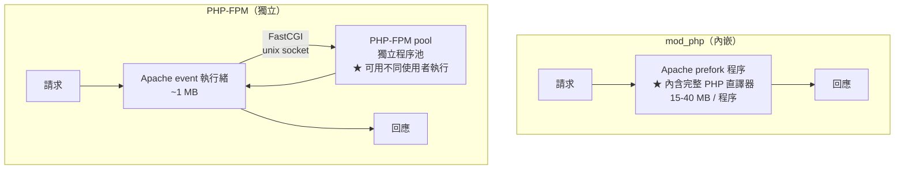

# Apache 與 PHP 整合

> [!abstract] 這篇你會學到
> - 徹底比較 **`mod_php` 與 PHP-FPM** 的差異
> - 完成 **`mod_php` → PHP-FPM 的遷移**（含所有會踩到的坑）
> - 掌握 **`SetHandler proxy:unix:`** 與 `ProxyPassMatch` 兩種寫法
> - 讓**多個 PHP 版本在同一台機器共存**
> - 知道 **`php_value` / `php_flag` 為什麼在 FPM 下失效**，以及替代方案
> - 用**獨立的 FPM pool** 做站台間的權限隔離

## 前置知識

- [[060-02-03-03-guide-Apache-模組與MPM]] — MPM 與 mod_php 的關係
- [[060-03-01-02-guide-PHP-FPM設定與Pool調校]] — FPM 端的設定

---

## 兩種整合方式



| | **`mod_php`** | **PHP-FPM** ★ |
| --- | --- | --- |
| **執行位置** | **Apache 程序內** | **獨立的程序池** |
| **MPM 限制** | **只能 prefork** | 任何（**推薦 event**） |
| **記憶體** | 每個 Apache 程序 15-40 MB | Apache 執行緒 ~1 MB + FPM 獨立 |
| **靜態檔** | **也佔用 PHP 程序** | **完全不碰 PHP** |
| **HTTP/2** | ❌（prefork 不支援） | **✓** |
| **執行身分** | **只能是 Apache 的身分** | **每個 pool 可用不同使用者** ★ |
| **多版本共存** | ❌（一台只能一個） | **✓** |
| **PHP 崩潰** | **拖垮 Apache 程序** | **不影響 Apache** |
| **`php_value`** | ✓ 可用 | ❌ **無效** |
| **`.htaccess` 改 PHP 設定** | ✓（**也是安全風險**） | ❌ |
| **重啟 PHP** | **要重啟 Apache** | **只重啟 FPM，Apache 不中斷** ★ |
| **效能** | 差 | **好很多** |

> [!danger] 現在幾乎沒有理由使用 `mod_php`
> ```
> 唯一還算合理的情境：
>   · 極舊的應用【依賴 .htaccess 中的 php_value】且無法修改
>   · 共享主機的特殊需求
>
> 除此之外，PHP-FPM 在【每一個維度】都更好。
> ```
>
> **遷移的實際效益**（8GB 記憶體的機器）：
> ```
> mod_php + prefork：
>   MaxRequestWorkers ≈ 250（每程序 30MB）
>   靜態檔也佔用 PHP 程序
>   → 【並發約 250】
>
> event + PHP-FPM：
>   Apache MaxRequestWorkers ≈ 2000（每執行緒 1MB）
>   PHP-FPM pm.max_children ≈ 60（每程序 60MB，只有真正的 PHP 請求）
>   → 【並發 2000（靜態）+ 60（PHP）】
>   → ★ 記憶體用量還更低
> ```

---

## 遷移到 PHP-FPM

### 完整流程

```bash
#!/usr/bin/env bash
set -euo pipefail
PHPV="${1:-8.3}"

echo "═══ mod_php → PHP-FPM 遷移 ═══"

echo -e "\n【0】記錄現況"
echo "  MPM：$(apache2ctl -M | grep -oP 'mpm_\K\w+(?=_module)')"
apache2ctl -M | grep -q php_module && echo "  mod_php：已載入" || echo "  mod_php：未載入"
ps -o rss= -C apache2 2>/dev/null | awk '{s+=$1;n++} END {
  printf "  Apache %d 程序，共 %.0f MB\n", n, s/1024}'

echo -e "\n【1】安裝 PHP-FPM"
sudo apt update
sudo apt install -y "php${PHPV}-fpm"
sudo systemctl enable --now "php${PHPV}-fpm"
sudo ls -l "/run/php/php${PHPV}-fpm.sock"

echo -e "\n【2】備份"
BK="/etc/apache2.bak.$(date +%Y%m%d-%H%M%S)"
sudo cp -a /etc/apache2 "$BK"
echo "  備份到 $BK"

echo -e "\n【3】★ 找出所有 php_value / php_flag（FPM 下無效）"
sudo grep -rn 'php_value\|php_flag\|php_admin_value\|php_admin_flag' \
     /etc/apache2/ /var/www/ --include='*.conf' --include='.htaccess' 2>/dev/null | \
  sed 's/^/  ⚠ /' || echo "  ✓ 沒有"
echo "  ★ 這些要搬到 php.ini 或 FPM pool 設定"

echo -e "\n【4】停用 mod_php 與 prefork"
sudo a2dismod "php${PHPV}" 2>/dev/null || true
sudo a2dismod mpm_prefork

echo -e "\n【5】啟用 event MPM 與 FPM"
sudo a2enmod mpm_event proxy_fcgi setenvif http2
sudo a2enconf "php${PHPV}-fpm"

echo -e "\n【6】檢查產生的設定"
cat "/etc/apache2/conf-available/php${PHPV}-fpm.conf"

echo -e "\n【7】測試"
sudo apache2ctl configtest
sudo systemctl restart apache2

echo -e "\n【8】★ 驗證 SAPI"
echo '<?php echo "PHP ", PHP_VERSION, " SAPI=", php_sapi_name(), "\n";' | \
  sudo tee /var/www/html/_sapi.php >/dev/null
curl -s http://127.0.0.1/_sapi.php | sed 's/^/  /'
echo "  ★ 應顯示 SAPI=fpm-fcgi（不是 apache2handler）"
sudo rm -f /var/www/html/_sapi.php

echo -e "\n【9】記憶體比對"
sleep 5
ps -o rss= -C apache2 | awk '{s+=$1;n++} END {printf "  Apache %d 程序，共 %.0f MB\n", n, s/1024}'
ps -o rss= -C "php-fpm${PHPV}" 2>/dev/null | awk '{s+=$1;n++} END {
  if(n) printf "  PHP-FPM %d 程序，共 %.0f MB\n", n, s/1024}'

echo -e "\n  回退：sudo rm -rf /etc/apache2 && sudo mv $BK /etc/apache2 && sudo systemctl restart apache2"
```

> [!info]- Rocky / AlmaLinux（RHEL 系）對照
> ```bash
> # ★ RHEL 8/9 【預設就是】 event MPM + php-fpm（沒有 mod_php 選項）
> $ sudo dnf install -y php php-fpm
> $ sudo systemctl enable --now php-fpm
>
> # socket 位置不同
> $ ls -l /run/php-fpm/www.sock
> srw-rw---- 1 root root ...
>
> # ★ 預設的設定在 /etc/httpd/conf.d/php.conf
> $ cat /etc/httpd/conf.d/php.conf
> <FilesMatch \.php$>
>     SetHandler "proxy:unix:/run/php-fpm/www.sock|fcgi://localhost"
> </FilesMatch>
>
> # ★ socket 權限（RHEL 預設是 root:root，Apache 讀不到）
> $ sudo vi /etc/php-fpm.d/www.conf
> listen.owner = apache
> listen.group = apache
> listen.mode = 0660
> $ sudo systemctl restart php-fpm
>
> # ★★ SELinux
> $ sudo setsebool -P httpd_execmem 1
> $ sudo setsebool -P httpd_can_network_connect 1     # 若用 TCP 而非 socket
> $ sudo ausearch -m avc -ts recent | grep -E 'httpd|php-fpm'
>
> # 多版本用 Remi
> $ sudo dnf install -y https://rpms.remirepo.net/enterprise/remi-release-9.rpm
> $ sudo dnf module reset php
> $ sudo dnf module enable php:remi-8.3
> ```

### 兩種 handler 寫法

```apache
# ═══ 方法一：SetHandler（★ 推薦，Apache 2.4.10+）═══
<FilesMatch \.php$>
    SetHandler "proxy:unix:/run/php/php8.3-fpm.sock|fcgi://localhost"
</FilesMatch>

# TCP 版本
<FilesMatch \.php$>
    SetHandler "proxy:fcgi://127.0.0.1:9000"
</FilesMatch>

# ═══ 方法二：ProxyPassMatch（舊寫法，有陷阱）═══
ProxyPassMatch "^/(.*\.php(/.*)?)$" \
    "unix:/run/php/php8.3-fpm.sock|fcgi://localhost/var/www/app/public/$1"
```

> [!danger] `ProxyPassMatch` 有兩個嚴重問題
> **問題一：路徑寫死在設定中**
> ```apache
> ProxyPassMatch "^/(.*\.php)$" "unix:...|fcgi://localhost/var/www/app/public/$1"
> #                                                        ^^^^^^^^^^^^^^^^^^^^^^^ 寫死
> # → 換 DocumentRoot 就要改；符號連結部署時路徑會不對
> ```
>
> **問題二：★★ 檔案不存在也會轉給 PHP（PathInfo 攻擊）**
> ```
> ProxyPassMatch 【不檢查檔案是否存在】
>   → /uploads/evil.jpg/x.php 會被轉給 PHP-FPM
>     → 若 cgi.fix_pathinfo=1 → PHP 執行 evil.jpg
>       → 【web shell】
> ```
>
> **`SetHandler` 沒有這些問題**：
> - 它使用 Apache 已經解析好的實體路徑
> - **Apache 會先確認檔案存在才觸發 handler**
>
> **一律使用 `SetHandler`。**

```apache
# ★ 完整的安全寫法
<FilesMatch \.php$>
    SetHandler "proxy:unix:/run/php/php8.3-fpm-app.sock|fcgi://localhost"
</FilesMatch>

# ★ 上傳目錄禁止
<Directory /var/www/app/current/public/uploads>
    <FilesMatch "\.(php|phtml|phar|php\d?)$">
        Require all denied
        SetHandler none                        # ★ 明確移除 handler
    </FilesMatch>
    AllowOverride None
    Options -ExecCGI -Includes
</Directory>
```

```ini
; ★ 第二道防線
; /etc/php/8.3/fpm/php.ini
cgi.fix_pathinfo = 0
```

### FPM 連線調校

```apache
# ★ Apache 2.4.26+ 支援 FastCGI 連線池（大幅減少連線開銷）
<Proxy "fcgi://localhost/" enablereuse=on max=32>
</Proxy>

<FilesMatch \.php$>
    SetHandler "proxy:fcgi://localhost/"
</FilesMatch>

# 逾時
ProxyTimeout 60
```

```apache
# ★ 完整版：具名 worker + 連線重用
<Proxy "unix:/run/php/php8.3-fpm.sock|fcgi://php-app">
    ProxySet enablereuse=on
    ProxySet max=32
    ProxySet timeout=60
    ProxySet connectiontimeout=5
</Proxy>

<FilesMatch \.php$>
    SetHandler "proxy:fcgi://php-app"
</FilesMatch>
```

---

## `php_value` 的替代方案 ★

```apache
# ❌ mod_php 專有，PHP-FPM 下【完全無效】（且不會報錯）
php_value  upload_max_filesize 100M
php_value  memory_limit 512M
php_flag   display_errors off
php_admin_value open_basedir /var/www/app
```

**三種替代方案**：

```ini
# ═══ ① FPM pool 設定（★ 推薦：每個站台獨立）═══
; /etc/php/8.3/fpm/pool.d/app.conf
[app]
user  = app-user
group = app-user
listen = /run/php/php8.3-fpm-app.sock
listen.owner = www-data
listen.group = www-data
listen.mode  = 0660

pm = dynamic
pm.max_children = 30
pm.start_servers = 5
pm.min_spare_servers = 5
pm.max_spare_servers = 10
pm.max_requests = 500

; ★ 原本 php_value 的內容搬到這裡
php_admin_value[memory_limit] = 512M
php_admin_value[upload_max_filesize] = 100M
php_admin_value[post_max_size] = 128M
php_admin_value[max_execution_time] = 120
php_admin_value[open_basedir] = /var/www/app/current:/var/www/app/shared:/tmp
php_admin_value[error_log] = /var/log/php/app-error.log
php_admin_flag[display_errors] = off
php_admin_flag[log_errors] = on
php_admin_value[disable_functions] = exec,passthru,shell_exec,system,proc_open,popen,pcntl_exec

; ★ 環境變數
env[APP_ENV] = production
```

```apache
# ═══ ② Apache 用 SetEnv 傳環境變數 ═══
SetEnv APP_ENV production
SetEnv DB_HOST 127.0.0.1
# ★ FPM pool 要允許：clear_env = no
```

```php
// ═══ ③ 應用程式自己設定（僅限「可在執行時修改」的項目）═══
ini_set('memory_limit', '512M');       // ✓ 可以
ini_set('upload_max_filesize', '100M'); // ✗ 無效（PHP_INI_PERDIR）
```

> [!danger] `php_admin_value` 與 `php_value` 的差別
> ```ini
> php_value[memory_limit]       = 256M    # 可被 ini_set() 覆蓋
> php_admin_value[memory_limit] = 256M    # ★ 【不能】被覆蓋
>
> php_admin_value[open_basedir]      = /var/www/app     ★ 安全設定用 admin
> php_admin_value[disable_functions] = exec,system,...  ★ 安全設定用 admin
> ```
> **所有安全相關的設定一律用 `php_admin_*`**，
> 否則應用程式（或被注入的程式碼）可以自己 `ini_set()` 解除限制。

---

## 多版本 PHP 共存

```bash
# ═══ Ubuntu：加入 ondrej PPA ═══
$ sudo add-apt-repository -y ppa:ondrej/php
$ sudo apt update
$ sudo apt install -y php8.1-fpm php8.2-fpm php8.3-fpm php8.4-fpm

$ ls -l /run/php/
srw-rw---- 1 www-data www-data php8.1-fpm.sock
srw-rw---- 1 www-data www-data php8.2-fpm.sock
srw-rw---- 1 www-data www-data php8.3-fpm.sock
srw-rw---- 1 www-data www-data php8.4-fpm.sock
```

```apache
# ═══ 站台 A：舊系統用 PHP 8.1 ═══
<VirtualHost *:443>
    ServerName legacy.example.gov.tw
    DocumentRoot /var/www/legacy/public
    <FilesMatch \.php$>
        SetHandler "proxy:unix:/run/php/php8.1-fpm.sock|fcgi://localhost"
    </FilesMatch>
    # ...
</VirtualHost>

# ═══ 站台 B：新系統用 PHP 8.3 ═══
<VirtualHost *:443>
    ServerName app.example.gov.tw
    DocumentRoot /var/www/app/current/public
    <FilesMatch \.php$>
        SetHandler "proxy:unix:/run/php/php8.3-fpm.sock|fcgi://localhost"
    </FilesMatch>
    # ...
</VirtualHost>
```

```bash
# 驗證
$ curl -s https://legacy.example.gov.tw/_sapi.php
PHP 8.1.29 SAPI=fpm-fcgi
$ curl -s https://app.example.gov.tw/_sapi.php
PHP 8.3.14 SAPI=fpm-fcgi
```

> [!tip] 多版本共存讓升級變成漸進式
> ```
> ① 安裝新版 PHP-FPM（舊版繼續跑）
> ② 建立一個測試子網域指向新版
> ③ 跑完整的測試套件與人工驗收
> ④ 確認沒問題後才把正式站台的 SetHandler 改成新版
> ⑤ 有問題就改回去（★ 只要改一行 + reload）
> ⑥ 穩定一段時間後才移除舊版
> ```
> **這比「一次全部升級然後祈禱」安全太多。**

---

## 每個站台獨立的 FPM pool（權限隔離）★

> [!danger] 共用一個 pool 的風險
> ```
> 所有站台都用 www-data 執行
>   → 站台 A 有 LFI 或 web shell 漏洞
>     → 攻擊者可以【讀取站台 B 的 .env】
>       → 拿到 B 的資料庫密碼
>         → 【一個站台淪陷 = 全部淪陷】
> ```

```bash
# ═══ ① 為每個站台建立獨立使用者 ═══
$ sudo useradd -r -M -d /var/www/app -s /usr/sbin/nologin app-user
$ sudo useradd -r -M -d /var/www/shop -s /usr/sbin/nologin shop-user

# ═══ ② 設定檔案擁有者 ═══
$ sudo chown -R app-user:app-user /var/www/app
$ sudo chown -R shop-user:shop-user /var/www/shop

# ★ Apache 需要能【讀取】才能服務靜態檔
$ sudo chmod 750 /var/www/app
$ sudo usermod -aG app-user www-data          # 讓 Apache 讀得到
$ sudo find /var/www/app -type d -exec chmod 750 {} \;
$ sudo find /var/www/app -type f -exec chmod 640 {} \;

# ★ 需要 PHP 寫入的目錄
$ sudo chmod -R 770 /var/www/app/shared/storage
$ sudo chmod 600 /var/www/app/shared/.env       # ★★ 只有 app-user 讀得到
```

```ini
# ═══ ③ 獨立的 pool ═══
; /etc/php/8.3/fpm/pool.d/app.conf
[app]
user  = app-user                    # ★ PHP 以這個身分執行
group = app-user
listen = /run/php/php8.3-fpm-app.sock
listen.owner = www-data             # ★ Apache 要能連
listen.group = www-data
listen.mode  = 0660

pm = dynamic
pm.max_children = 30
pm.start_servers = 5
pm.min_spare_servers = 5
pm.max_spare_servers = 10
pm.max_requests = 500

; ★★ 限制 PHP 只能存取自己的目錄
php_admin_value[open_basedir] = /var/www/app/current:/var/www/app/shared:/tmp:/usr/share/php
php_admin_value[disable_functions] = exec,passthru,shell_exec,system,proc_open,popen,pcntl_exec,pcntl_fork
php_admin_flag[display_errors] = off
php_admin_value[error_log] = /var/log/php/app-error.log
php_admin_value[session.save_path] = /var/lib/php/sessions/app
php_admin_value[upload_tmp_dir] = /var/www/app/shared/tmp

slowlog = /var/log/php/app-slow.log
request_slowlog_timeout = 5s
request_terminate_timeout = 120s

catch_workers_output = yes
clear_env = no
```

```apache
# ═══ ④ Apache 指向對應的 socket ═══
<VirtualHost *:443>
    ServerName app.example.gov.tw
    DocumentRoot /var/www/app/current/public
    <FilesMatch \.php$>
        SetHandler "proxy:unix:/run/php/php8.3-fpm-app.sock|fcgi://localhost"
    </FilesMatch>
</VirtualHost>

<VirtualHost *:443>
    ServerName shop.example.gov.tw
    DocumentRoot /var/www/shop/current/public
    <FilesMatch \.php$>
        SetHandler "proxy:unix:/run/php/php8.3-fpm-shop.sock|fcgi://localhost"
    </FilesMatch>
</VirtualHost>
```

```bash
# ═══ ⑤ 驗證隔離 ═══
$ sudo systemctl restart php8.3-fpm apache2

# 建立測試檔
$ cat > /var/www/app/current/public/_iso.php <<'EOF'
<?php
echo "使用者：", posix_getpwuid(posix_geteuid())['name'], "\n";
echo "open_basedir：", ini_get('open_basedir'), "\n";
echo "讀取自己的 .env：", (@file_get_contents('/var/www/app/shared/.env') ? "✓" : "✗"), "\n";
echo "讀取別人的 .env：", (@file_get_contents('/var/www/shop/shared/.env') ? "⚠⚠ 可以讀到！" : "✓ 被擋"), "\n";
echo "執行系統指令：", (@shell_exec('id') ?: "✓ 被 disable_functions 擋下"), "\n";
EOF

$ curl -s https://app.example.gov.tw/_iso.php
使用者：app-user
open_basedir：/var/www/app/current:/var/www/app/shared:/tmp:/usr/share/php
讀取自己的 .env：✓
讀取別人的 .env：✓ 被擋
執行系統指令：✓ 被 disable_functions 擋下

$ rm /var/www/app/current/public/_iso.php
```

---

## 完整實戰範例

### 整合檢查腳本

```bash
#!/usr/bin/env bash
# Apache + PHP 整合檢查
CTL=$(command -v apache2ctl || command -v apachectl)
echo "═══ Apache + PHP 整合檢查 ═══"

echo -e "\n【1】MPM 與 mod_php"
MPM=$(sudo $CTL -M 2>/dev/null | grep -oP 'mpm_\K\w+(?=_module)')
echo "  MPM：$MPM $([ "$MPM" = "event" ] && echo '✓' || echo '⚠ 建議 event')"
sudo $CTL -M 2>/dev/null | grep -q php_module \
  && echo "  ⚠⚠ mod_php 仍然載入【建議遷移到 PHP-FPM】" \
  || echo "  ✓ 沒有 mod_php"
sudo $CTL -M 2>/dev/null | grep -q proxy_fcgi_module \
  && echo "  ✓ proxy_fcgi 已載入" || echo "  ✗ proxy_fcgi 未載入"

echo -e "\n【2】PHP-FPM 服務"
systemctl list-units --type=service 2>/dev/null | grep -oP 'php[0-9.]*-fpm\.service|php-fpm\.service' | \
  sort -u | while read -r s; do
    st=$(systemctl is-active "$s")
    echo "  $s: $st $([ "$st" = active ] && echo ✓ || echo ✗)"
done

echo -e "\n【3】FPM socket"
ls -l /run/php/*.sock /run/php-fpm/*.sock 2>/dev/null | \
  awk '{printf "  %-45s %s %s:%s\n", $NF, $1, $3, $4}'
echo "  ★ 權限要讓 Apache 的執行身分讀得到"

echo -e "\n【4】★ Handler 設定"
sudo $CTL -t -D DUMP_CONFIG 2>/dev/null | grep -E 'SetHandler.*(proxy|fcgi)|ProxyPassMatch.*php' | \
  sed 's/^/  /'
sudo $CTL -t -D DUMP_CONFIG 2>/dev/null | grep -q 'ProxyPassMatch.*php' \
  && echo "  ⚠⚠ 使用 ProxyPassMatch【有 PathInfo 攻擊風險，改用 SetHandler】"

echo -e "\n【5】★ php_value / php_flag（FPM 下無效）"
sudo $CTL -t -D DUMP_CONFIG 2>/dev/null | grep -E '^\s*php_(value|flag)' | sed 's/^/  ⚠ /' \
  || echo "  ✓ 沒有"
sudo find /var/www -name '.htaccess' -exec grep -l 'php_value\|php_flag' {} \; 2>/dev/null | \
  sed 's/^/  ⚠ .htaccess 中有：/'

echo -e "\n【6】FPM pool 設定"
for p in /etc/php/*/fpm/pool.d/*.conf /etc/php-fpm.d/*.conf; do
    [ -e "$p" ] || continue
    name=$(grep -oP '^\[\K[^]]+' "$p" | head -1)
    user=$(grep -oP '^\s*user\s*=\s*\K\S+' "$p" | head -1)
    sock=$(grep -oP '^\s*listen\s*=\s*\K\S+' "$p" | head -1)
    ob=$(grep -oP 'open_basedir\]\s*=\s*\K.*' "$p" | head -1)
    df=$(grep -oP 'disable_functions\]\s*=\s*\K.*' "$p" | head -1)
    echo "  ── [$name] ──"
    echo "     使用者：${user:-?}  socket：${sock:-?}"
    echo "     open_basedir：${ob:-⚠ 未設定}"
    echo "     disable_functions：${df:+已設定}${df:-⚠ 未設定}"
done

echo -e "\n【7】★ 站台間的權限隔離"
USERS=$(grep -h '^\s*user\s*=' /etc/php/*/fpm/pool.d/*.conf /etc/php-fpm.d/*.conf 2>/dev/null | \
        grep -oP '=\s*\K\S+' | sort -u)
N=$(echo "$USERS" | wc -l)
SITES=$(sudo $CTL -S 2>&1 | grep -c namevhost)
echo "  FPM 使用者數：$N（$(echo "$USERS" | tr '\n' ' ')）"
echo "  站台數：$SITES"
[ "$N" -eq 1 ] && [ "$SITES" -gt 1 ] && \
  echo "  ⚠⚠ 多個站台共用同一個 PHP 使用者【一站淪陷 = 全部淪陷】"

echo -e "\n【8】★ PathInfo 防護"
grep -h '^\s*cgi.fix_pathinfo' /etc/php/*/fpm/php.ini /etc/php.ini 2>/dev/null | sed 's/^/  /'
grep -qh '^\s*cgi.fix_pathinfo\s*=\s*0' /etc/php/*/fpm/php.ini /etc/php.ini 2>/dev/null \
  && echo "  ✓ cgi.fix_pathinfo = 0" || echo "  ⚠⚠ cgi.fix_pathinfo 不是 0"

echo -e "\n【9】★ 上傳目錄保護"
sudo $CTL -t -D DUMP_CONFIG 2>/dev/null | grep -oP 'DocumentRoot\s+"?\K[^"\s]+' | sort -u | \
while read -r d; do
    for sub in uploads storage media; do
        [ -d "$d/$sub" ] || continue
        if sudo $CTL -t -D DUMP_CONFIG 2>/dev/null | grep -A6 "$d/$sub" | \
           grep -qE 'Require all denied|SetHandler none|engine off'; then
            echo "  ✓ $d/$sub"
        else
            echo "  ⚠⚠ $d/$sub 沒有禁止執行 PHP"
        fi
    done
done

echo -e "\n【10】實際驗證"
echo '<?php echo php_sapi_name()," ",PHP_VERSION," uid=",posix_getpwuid(posix_geteuid())["name"];' | \
  sudo tee /var/www/html/_chk.php >/dev/null 2>&1 && {
    echo "  $(curl -s http://127.0.0.1/_chk.php 2>/dev/null)"
    sudo rm -f /var/www/html/_chk.php
} || echo "  （無法建立測試檔）"
```

---

## 常見錯誤與排錯

| 現象／錯誤 | 原因 | 解法 |
| --- | --- | --- |
| **PHP 原始碼直接顯示在瀏覽器** ★ | handler 沒設定 | `a2enconf php8.3-fpm`；檢查 `SetHandler` |
| **`.php` 檔案被下載而非執行** | 同上 | 同上 |
| **503 Service Unavailable** | FPM 沒啟動 / socket 路徑錯 | `systemctl status php8.3-fpm`；`ls -l /run/php/` |
| **`AH01079: failed to make connection to backend`** | socket 權限 / 路徑錯 | `ls -l socket`；`listen.owner`；**SELinux** |
| `Permission denied` 連 socket | socket 權限 | `listen.owner = www-data`、`listen.mode = 0660` |
| **`php_value` 沒作用** ★ | **FPM 下無效** | 搬到 FPM pool 的 `php_admin_value[]` |
| `a2dismod mpm_prefork` 失敗 | mod_php 相依 | 先 `a2dismod php8.3` |
| **上傳的 jpg 被執行** ★★ | `ProxyPassMatch` + `cgi.fix_pathinfo=1` | **改用 `SetHandler`** + `cgi.fix_pathinfo=0` + 上傳目錄禁止 |
| **`open_basedir` 限制錯誤** | 路徑沒包含必要目錄 | 加入 `/tmp`、`/usr/share/php`、session 路徑 |
| session 遺失 | 多個 pool 共用 session 路徑但權限不同 | 每個 pool 獨立 `session.save_path` |
| **改了 php.ini 沒生效** | 改到 CLI 的 php.ini | **FPM 用 `/etc/php/8.3/fpm/php.ini`**；要 restart FPM |
| **`$_SERVER['HTTPS']` 是空的** | Apache 沒傳 | `SetEnvIf X-Forwarded-Proto https HTTPS=on` |
| 環境變數傳不過去 | FPM 預設 `clear_env = yes` | 設 `clear_env = no` |
| RHEL 上一直 503 | **SELinux** | `setsebool -P httpd_execmem 1`；`ausearch -m avc` |
| **多站台共用 www-data** ★ | 沒有做權限隔離 | **每個站台獨立 pool + 獨立使用者** |
| `pm.max_children` 不夠 | FPM worker 用完 | 見 [[060-03-01-02-guide-PHP-FPM設定與Pool調校]] |

### 排查流程

```bash
# 【1】PHP 到底有沒有在跑
$ echo '<?php phpinfo();' | sudo tee /var/www/html/_i.php
$ curl -s http://127.0.0.1/_i.php | head -5
# 看到 PHP 原始碼 → handler 沒設定
# 看到 HTML → 正常，看 "Server API" 那一欄

# 【2】確認 SAPI
$ echo '<?php echo php_sapi_name();' | sudo tee /var/www/html/_s.php
$ curl -s http://127.0.0.1/_s.php
fpm-fcgi          # ★ 正確
apache2handler    # ★ 還在用 mod_php

# 【3】FPM 狀態
$ sudo systemctl status php8.3-fpm
$ sudo journalctl -u php8.3-fpm -n 50
$ ls -l /run/php/php8.3-fpm.sock

# 【4】Apache 的錯誤
$ sudo tail -50 /var/log/apache2/error.log | grep -iE 'fcgi|proxy|php'

# 【5】FPM 的錯誤與慢請求
$ sudo tail -50 /var/log/php8.3-fpm.log
$ sudo tail -50 /var/log/php/app-slow.log

# 【6】直接測試 socket（繞過 Apache）
$ sudo apt install -y libfcgi-bin
$ SCRIPT_FILENAME=/var/www/html/_s.php \
  REQUEST_METHOD=GET \
  cgi-fcgi -bind -connect /run/php/php8.3-fpm.sock

# 【7】哪個 php.ini 生效
$ php -i | grep 'Loaded Configuration File'      # ★ 這是 CLI 的
$ curl -s http://127.0.0.1/_i.php | grep -A1 'Loaded Configuration File'   # ★ FPM 的
```

---

## 安全性注意事項

> [!danger] 三個必須的 PHP 安全設定
> ```ini
> ; /etc/php/8.3/fpm/pool.d/app.conf
> [app]
> ; ① ★ 限制 PHP 只能存取自己的目錄
> php_admin_value[open_basedir] = /var/www/app/current:/var/www/app/shared:/tmp:/usr/share/php
>
> ; ② ★ 停用危險函式
> php_admin_value[disable_functions] = exec,passthru,shell_exec,system,proc_open,popen,pcntl_exec,pcntl_fork,dl,putenv
>
> ; ③ ★ 不要洩漏錯誤訊息
> php_admin_flag[display_errors] = off
> php_admin_flag[log_errors] = on
> php_admin_value[error_log] = /var/log/php/app-error.log
> php_admin_value[expose_php] = 0
> ```
>
> **`open_basedir` 的效果**：
> ```
> 即使攻擊者取得 web shell：
>   ✗ 讀不到 /etc/passwd
>   ✗ 讀不到 /var/www/其他站台/.env
>   ✗ 寫不到 web root 之外
> ```
>
> **`disable_functions` 的效果**：
> ```
> ✗ 無法執行系統指令
> ✗ 無法開子程序
> → web shell 的能力大幅受限
> ```
>
> **注意**：`open_basedir` 要包含 `/tmp`、`/usr/share/php`、
> session 路徑、上傳暫存目錄，否則應用程式會出錯。

> [!danger] 站台間的權限隔離
> ```
> 沒有隔離：所有站台都用 www-data
>   → 站台 A 的漏洞 → 讀到站台 B 的 .env → 【全部淪陷】
>
> 有隔離：每個站台獨立 pool + 獨立使用者 + open_basedir
>   → 站台 A 的漏洞 → 只能影響站台 A
> ```
>
> **驗證方式**（見上方的 `_iso.php` 腳本）：
> **從站台 A 嘗試讀取站台 B 的 `.env`，必須失敗。**

> [!warning] `SetHandler` 而非 `ProxyPassMatch`
> ```apache
> # ❌ ProxyPassMatch：不檢查檔案存在，有 PathInfo 攻擊風險
> ProxyPassMatch "^/(.*\.php(/.*)?)$" "unix:...|fcgi://localhost/var/www/app/public/$1"
>
> # ✅ SetHandler：Apache 先確認檔案存在
> <FilesMatch \.php$>
>     SetHandler "proxy:unix:/run/php/php8.3-fpm.sock|fcgi://localhost"
> </FilesMatch>
> ```
> 搭配 `cgi.fix_pathinfo = 0` 與上傳目錄的明確禁止，
> 構成三道防線。

> [!tip] 用 `request_terminate_timeout` 防止程序卡死
> ```ini
> request_terminate_timeout = 120s        # ★ 超過就強制終止
> request_slowlog_timeout = 5s            # 超過 5 秒記錄 stack trace
> slowlog = /var/log/php/app-slow.log
> ```
> **慢請求日誌會顯示 PHP 卡在哪一行**：
> ```
> [28-Aug-2026 10:15:32] [pool app] pid 12345
> script_filename = /var/www/app/public/index.php
> [0x00007f...] curl_exec() /var/www/app/vendor/guzzle/Client.php:203
> [0x00007f...] callExternalApi() /var/www/app/app/Services/Sync.php:45
> ```
> **這是找出效能瓶頸最直接的工具。**

---

## 速查表

### mod_php vs PHP-FPM

| | mod_php | **PHP-FPM** |
| --- | --- | --- |
| MPM | **只能 prefork** | 任何（**event**） |
| 記憶體 | 15-40 MB/程序 | Apache 1MB + FPM 獨立 |
| HTTP/2 | ❌ | ✓ |
| 多版本 | ❌ | ✓ |
| 執行身分 | 只能 Apache 的 | **每 pool 可不同** ★ |
| `php_value` | ✓ | **❌ 無效** |
| 重啟 PHP | 要重啟 Apache | **只重啟 FPM** |

### 遷移

```bash
sudo apt install -y php8.3-fpm
sudo a2dismod php8.3 mpm_prefork
sudo a2enmod mpm_event proxy_fcgi setenvif http2
sudo a2enconf php8.3-fpm
sudo apache2ctl configtest && sudo systemctl restart apache2

# ★ 驗證
echo '<?php echo php_sapi_name();' > /var/www/html/_s.php
curl http://127.0.0.1/_s.php      # 應為 fpm-fcgi
```

### Handler（★ 一律用 SetHandler）

```apache
<FilesMatch \.php$>
    SetHandler "proxy:unix:/run/php/php8.3-fpm.sock|fcgi://localhost"
</FilesMatch>

# 連線重用（2.4.26+）
<Proxy "unix:/run/php/php8.3-fpm.sock|fcgi://php-app">
    ProxySet enablereuse=on max=32 timeout=60
</Proxy>
<FilesMatch \.php$>
    SetHandler "proxy:fcgi://php-app"
</FilesMatch>
```

```
❌ ProxyPassMatch：路徑寫死 + 【不檢查檔案存在 → PathInfo 攻擊】
```

### `php_value` 的替代

```ini
; FPM pool（★ 推薦）
php_admin_value[memory_limit] = 512M
php_admin_value[upload_max_filesize] = 100M
php_admin_value[post_max_size] = 128M
php_admin_value[open_basedir] = /var/www/app:/tmp:/usr/share/php
php_admin_flag[display_errors] = off

★ php_admin_* 不能被 ini_set() 覆蓋（安全設定一律用 admin）
★ php_value[] 可以被覆蓋
```

### 獨立 pool（權限隔離）

```ini
[app]
user  = app-user                    # ★ PHP 的執行身分
group = app-user
listen = /run/php/php8.3-fpm-app.sock
listen.owner = www-data             # ★ Apache 要能連
listen.group = www-data
listen.mode  = 0660

php_admin_value[open_basedir] = /var/www/app/current:/var/www/app/shared:/tmp
php_admin_value[disable_functions] = exec,passthru,shell_exec,system,proc_open,popen
php_admin_value[session.save_path] = /var/lib/php/sessions/app

request_terminate_timeout = 120s
request_slowlog_timeout = 5s
slowlog = /var/log/php/app-slow.log
```

### 多版本共存

```bash
sudo add-apt-repository -y ppa:ondrej/php
sudo apt install -y php8.1-fpm php8.3-fpm
```
```apache
# 站台 A
<FilesMatch \.php$> SetHandler "proxy:unix:/run/php/php8.1-fpm.sock|fcgi://localhost" </FilesMatch>
# 站台 B
<FilesMatch \.php$> SetHandler "proxy:unix:/run/php/php8.3-fpm.sock|fcgi://localhost" </FilesMatch>
```

### 安全三防線

```
① SetHandler（Apache 先確認檔案存在）
② php.ini: cgi.fix_pathinfo = 0
③ 上傳目錄：Require all denied + SetHandler none + AllowOverride None
＋ open_basedir + disable_functions + 每站獨立 pool 與使用者
```

### 排查

```bash
echo '<?php echo php_sapi_name();' > /var/www/html/_s.php && curl http://127.0.0.1/_s.php
sudo systemctl status php8.3-fpm ; ls -l /run/php/*.sock
sudo tail -50 /var/log/apache2/error.log | grep -i fcgi
sudo tail -50 /var/log/php8.3-fpm.log
sudo tail -50 /var/log/php/app-slow.log        # ★ 慢請求的 stack trace
cgi-fcgi -bind -connect /run/php/php8.3-fpm.sock   # 繞過 Apache 直接測
sudo ausearch -m avc -ts recent | grep php-fpm      # RHEL SELinux
```

| error.log | 原因 |
| --- | --- |
| `AH01079: failed to make connection` | socket 路徑/權限、FPM 沒啟動、SELinux |
| 看到 PHP 原始碼 | handler 沒設定 |
| 503 | FPM 沒啟動 |

---

## 練習題

> [!question]- 練習 1：完整遷移
> 1. 在 `mod_php` + prefork 環境記錄基準：
>    - `ps -o rss= -C apache2 | awk '{s+=$1;n++} END {print n, s/1024"MB"}'`
>    - `ab -n 3000 -c 100 http://localhost/index.php` 的 QPS
>    - `ab -n 3000 -c 100 http://localhost/image.png` 的 QPS
> 2. 執行遷移腳本
> 3. **記錄同樣的數字**
> 4. **PHP 請求與靜態檔請求的差異各是多少倍？**
> 5. 測試 HTTP/2 是否可用

> [!question]- 練習 2：ProxyPassMatch 的 PathInfo 攻擊
> **★ 測試環境**
> 1. 用 `ProxyPassMatch` 設定 PHP handler
> 2. 設定 `cgi.fix_pathinfo = 1`
> 3. 上傳 `uploads/test.jpg`，內容是 `<?php echo "PWNED";`
> 4. 存取 `/uploads/test.jpg/x.php` → **看到 PWNED 了嗎？**
> 5. 改用 `SetHandler` → 重測
> 6. 設 `cgi.fix_pathinfo = 0` → 重測
> 7. **兩道防線各自擋住了嗎？**

> [!question]- 練習 3：站台間權限隔離
> 1. 建立兩個站台，**都用 www-data**
> 2. 在站台 A 放一個測試 shell，嘗試讀取站台 B 的 `.env`
>    → **讀得到嗎？**
> 3. 建立獨立的使用者與 pool
> 4. 加上 `open_basedir` 與 `disable_functions`
> 5. **重測** —— 三項各自被擋了嗎？
> 6. 確認兩個站台的功能都還正常（**特別是 session 與檔案上傳**）

> [!question]- 練習 4：多版本共存
> 1. 安裝 PHP 8.1 與 8.3 的 FPM
> 2. 建立兩個站台，各用一個版本
> 3. 用 `_sapi.php` 驗證版本
> 4. **模擬升級流程**：
>    - 建立 `test.example.local` 指向新版
>    - 跑測試
>    - 把正式站台改成新版
>    - **改回舊版**（確認回退只要改一行 + reload）
> 5. 記錄整個流程的**中斷時間**

> [!question]- 練習 5：慢請求排查
> 1. 設定 `request_slowlog_timeout = 2s` 與 `slowlog`
> 2. 寫一個含 `sleep(3)` 或慢 SQL 的端點
> 3. 存取它
> 4. **看 slowlog** —— 有顯示卡在哪一行嗎？
> 5. 設定 `request_terminate_timeout = 5s`
> 6. 寫一個 `while(true){}` 的端點，**確認它會被終止**
> 7. 看 FPM 日誌的終止訊息

---

## 小測驗

Q1. **`mod_php` 與 PHP-FPM 在「執行位置、MPM 限制、執行身分、多版本」四個維度的差異是什麼**？

Q2. **為什麼說「靜態檔在 mod_php 下也佔用 PHP 程序」？這造成什麼影響**？

Q3. **`SetHandler` 相對 `ProxyPassMatch` 有哪兩個關鍵優勢**？

Q4. **`php_value` 為什麼在 PHP-FPM 下無效？有哪三種替代方案**？

Q5. **`php_admin_value` 與 `php_value` 的差別是什麼？哪些設定必須用 admin**？

Q6. **多個站台共用同一個 FPM pool（同一個使用者）有什麼風險**？

Q7. **獨立 pool 的 `listen.owner` 為什麼要設成 Apache 的身分，而 `user` 設成站台的身分**？

Q8. **`open_basedir` 與 `disable_functions` 各自擋住什麼？`open_basedir` 常需要包含哪些額外路徑**？

Q9. **多版本 PHP 共存怎麼讓升級變成漸進式**？

Q10. **`request_slowlog_timeout` 產生的日誌有什麼特別價值**？

> [!question]- 測驗答案
> **Q1.** **執行位置**：`mod_php` **在 Apache 程序內部執行**（內嵌直譯器）；
> PHP-FPM **在獨立的程序池中執行**，透過 FastCGI（unix socket 或 TCP）溝通。
> **MPM 限制**：`mod_php` **只能搭配 prefork**（因為不是執行緒安全的）；
> PHP-FPM **任何 MPM 都可以，推薦 event**。
> **執行身分**：`mod_php` **只能是 Apache 的身分**（www-data）；
> PHP-FPM **每個 pool 可以用不同的使用者**（權限隔離的基礎）。
> **多版本**：`mod_php` **一台機器只能載入一個版本**；
> PHP-FPM **可以同時跑多個版本，每個站台指向不同的 socket**。
>
> **Q2.** 因為在 `mod_php` + prefork 下，**每一個連線都佔用一個完整的 Apache 程序，
> 而每個程序都內嵌了整個 PHP 直譯器（15-40 MB）** ——
> **即使這個請求只是載入一張 `logo.png`，也一樣佔用一個內含 PHP 的程序**。
> **影響**：①**記憶體浪費極大**（一個頁面載入 50 個靜態資源，
> 就佔用 50 個 30MB 的程序）；
> ②**並發能力嚴重受限**（8GB 記憶體只能開 250 個程序左右）；
> ③靜態資源的流量會直接排擠真正需要 PHP 的請求。
> 改用 event + FPM 後，**靜態檔由 1MB 的執行緒處理，完全不碰 PHP**。
>
> **Q3.** ①**`SetHandler` 使用 Apache 已經解析好的實體路徑，
> 不需要在設定中寫死 DocumentRoot** ——
> `ProxyPassMatch` 要寫 `fcgi://localhost/var/www/app/public/$1`，
> 換目錄或用符號連結部署時路徑會不對；
> ②**★ `SetHandler` 下 Apache 會先確認檔案存在才觸發 handler，
> 而 `ProxyPassMatch` 不檢查** ——
> 這代表 `/uploads/evil.jpg/x.php` 這種請求會被 `ProxyPassMatch` 轉給 PHP-FPM，
> 若 `cgi.fix_pathinfo=1` 就會**執行 `evil.jpg`，形成 PathInfo 攻擊拿到 web shell**。
> **一律使用 `SetHandler`。**
>
> **Q4.** 因為 **`php_value` / `php_flag` 是 `mod_php` 提供的 Apache 指令** ——
> PHP-FPM 是獨立的程序，Apache 的這些指令**根本傳不過去**
> （而且**不會報錯，只是靜默失效**，特別容易被忽略）。
> **三種替代方案**：
> ①**FPM pool 設定的 `php_admin_value[]` / `php_value[]`**（★ 推薦，每站獨立）；
> ②**Apache 的 `SetEnv` 傳環境變數**（FPM pool 要設 `clear_env = no`）；
> ③**應用程式自己 `ini_set()`** ——
> 但只對「可在執行時修改」的項目有效
> （`memory_limit` 可以，`upload_max_filesize` 不行，因為它是 `PHP_INI_PERDIR`）。
>
> **Q5.** **`php_value[xxx]`** 設定的值**可以被應用程式的 `ini_set()` 覆蓋**；
> **`php_admin_value[xxx]`** 設定的值**不能被覆蓋**。
> **所有安全相關的設定一律用 `php_admin_*`**：
> ```ini
> php_admin_value[open_basedir] = /var/www/app:/tmp
> php_admin_value[disable_functions] = exec,shell_exec,system,...
> php_admin_flag[display_errors] = off
> php_admin_value[expose_php] = 0
> ```
> 否則**應用程式（或被注入的惡意程式碼）可以自己 `ini_set()` 解除限制** ——
> 例如 `ini_set('open_basedir', '/')` 就繞過了目錄限制。
>
> **Q6.** 因為**所有站台的 PHP 都以同一個使用者（通常是 www-data）執行**：
> ```
> 站台 A 有 LFI 漏洞或被上傳了 web shell
>   → 攻擊者以 www-data 的身分執行程式碼
>     → 【可以讀取站台 B、C、D 的 .env】
>       → 拿到所有站台的資料庫密碼、API 金鑰
>         → 【一個站台淪陷 = 全部淪陷】
> ```
> **解法**：每個站台建立獨立的系統使用者、獨立的 FPM pool，
> 並用 `open_basedir` 限制各自能存取的路徑。
> 驗證方式是從站台 A 嘗試讀取站台 B 的 `.env`，**必須失敗**。
>
> **Q7.** 這是兩件不同的事：
> **`user` / `group`** 是 **PHP 程序本身的執行身分** ——
> 設成站台的專屬使用者（`app-user`），
> 這樣 PHP 讀寫檔案時就以該身分進行，**達成站台間的權限隔離**。
> **`listen.owner` / `listen.group` / `listen.mode`** 是
> **unix socket 檔案本身的權限** ——
> **Apache 必須能「連上」這個 socket**，
> 所以要設成 Apache 的執行身分（`www-data` 或 `nginx`）：
> ```ini
> user  = app-user            # PHP 以誰的身分跑
> group = app-user
> listen.owner = www-data     # 誰可以連這個 socket
> listen.group = www-data
> listen.mode  = 0660
> ```
> 設錯 `listen.owner` 的症狀是 `AH01079: failed to make connection to backend`
> 或 `Permission denied`。
>
> **Q8.** **`open_basedir`** 限制 **PHP 只能存取指定的目錄樹** ——
> 即使攻擊者取得 web shell，也**讀不到 `/etc/passwd`、
> 讀不到其他站台的 `.env`、寫不到 web root 之外**。
> **`disable_functions`** 停用危險函式 ——
> **無法執行系統指令（`exec`、`shell_exec`、`system`、`passthru`）、
> 無法開子程序（`proc_open`、`popen`、`pcntl_exec`）**，
> web shell 的能力大幅受限。
> **`open_basedir` 常需要包含的額外路徑**：
> **`/tmp`**（暫存檔）、**`/usr/share/php`**（PEAR / 共用函式庫）、
> **session 儲存路徑**（或另外用 `session.save_path` 指定）、
> **上傳暫存目錄**（`upload_tmp_dir`）。
> 漏了這些會造成「應用程式莫名其妙出錯」。
>
> **Q9.** 因為多版本可以**並存**，升級變成：
> ①**安裝新版 PHP-FPM，舊版繼續跑**（互不影響）；
> ②建立一個**測試子網域指向新版的 socket**；
> ③在測試站台跑**完整的測試套件與人工驗收**；
> ④確認沒問題後，**把正式站台的 `SetHandler` 改成新版的 socket + reload**；
> ⑤**有問題就改回舊版的 socket + reload**（★ 只要改一行，秒級回退）；
> ⑥穩定運作一段時間後才移除舊版。
> **這比「一次全部升級然後祈禱」安全太多** ——
> 每一步都可以驗證，而且回退成本極低。
>
> **Q10.** `request_slowlog_timeout` 產生的慢請求日誌
> **會記錄「PHP 當時卡在哪一行程式碼」的完整呼叫堆疊**：
> ```
> [28-Aug-2026 10:15:32] [pool app] pid 12345
> script_filename = /var/www/app/public/index.php
> [0x00007f...] curl_exec() /var/www/app/vendor/guzzle/Client.php:203
> [0x00007f...] callExternalApi() /var/www/app/app/Services/Sync.php:45
> ```
> **價值**：一般的存取日誌只告訴你「這個 URL 花了 5 秒」，
> **慢請求日誌直接告訴你「卡在 `Sync.php` 第 45 行呼叫外部 API」** ——
> 不需要加任何程式碼、不需要重現問題，就能直接定位瓶頸。
> 這是找出效能問題最直接的工具。
> 搭配 `request_terminate_timeout` 還能防止程序永久卡死佔用 worker。

---

## 延伸閱讀

- [[060-02-03-07-guide-Apache-安全與效能]] — 完整加固
- [[060-02-03-03-guide-Apache-模組與MPM]] — event MPM 與 MaxRequestWorkers
- [[060-03-01-02-guide-PHP-FPM設定與Pool調校]] — pm.max_children 的計算
- [[060-03-01-06-guide-PHP-安全設定]] — open_basedir、disable_functions 完整說明
- [[060-03-01-01-guide-PHP-安裝與多版本管理]] — ondrej PPA 與 Remi
- [[060-02-04-guide-Web-Nginx與Apache選型與共存]] — 兩者並用
