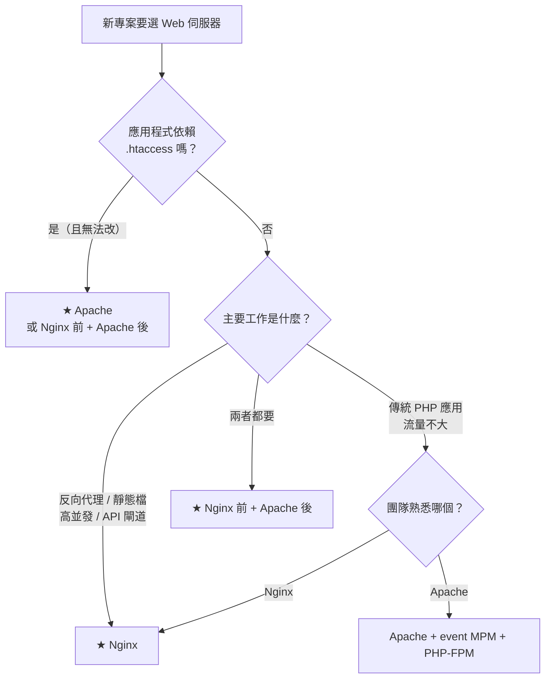
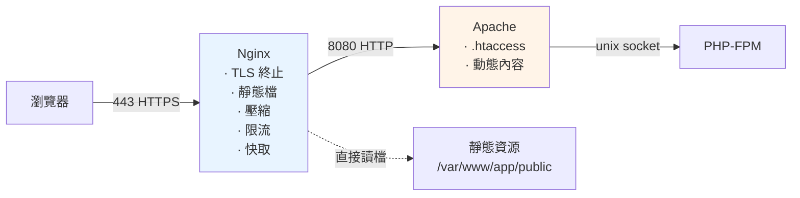

# Nginx 與 Apache 選型與共存

> [!abstract] 這篇你會學到
> - 用**一張決策表**在五分鐘內決定要用哪一個
> - 設定 **Nginx 在前、Apache 在後**的混合架構
> - 讓 Apache **正確取得真實客戶端 IP 與 HTTPS 狀態**
> - 把 **Apache 站台遷移到 Nginx**（含 `.htaccess` 轉換）
> - 讓兩者**在同一台機器上共存**（不同埠、不同網域）
> - 評估**混合架構的成本與收益**

## 前置知識

- [[060-02-02-09-guide-Nginx-安全設定]] — Nginx 完整設定
- [[060-02-03-07-guide-Apache-安全與效能]] — Apache 完整設定

---

## 選型決策表



### 逐項比較

| 需求 | Nginx | Apache | 建議 |
| --- | --- | --- | --- |
| **反向代理 / 負載平衡** | ★★★ | ★★ | **Nginx** |
| **靜態檔服務** | ★★★ | ★★ | **Nginx** |
| **高並發（>1000）** | ★★★ | ★★ | **Nginx** |
| **記憶體效率** | ★★★ | ★★ | **Nginx** |
| **TLS 終止 / HTTP/3** | ★★★ | ★★ | **Nginx** |
| **限流與 WAF 整合** | ★★★ | ★★ | Nginx |
| **`.htaccess` 支援** | ✗ | ★★★ | **Apache** |
| **動態模組管理** | ★★ | ★★★ | Apache |
| **設定彈性（per-directory）** | ★ | ★★★ | Apache |
| **mod_php 內嵌** | ✗ | ★★ | Apache（**但不推薦**） |
| **社群文件量（PHP 生態）** | ★★★ | ★★★ | 平手 |
| **設定學習曲線** | 中 | 中 | 平手 |

> [!tip] 三句話的結論
> ```
> ① 【新專案】、【純 API】、【前端 SPA】、【反向代理】 → Nginx
>
> ② 【現有的 Apache 站台且運作良好】 → 不要為了換而換，
>    先做好 event MPM + PHP-FPM 的遷移（效益比換伺服器大）
>
> ③ 【應用依賴 .htaccess 但又需要 Nginx 的效能】
>    → ★ Nginx 前 + Apache 後（本篇的重點）
> ```

> [!warning] 不要為了「Nginx 比較快」就急著遷移
> ```
> 實測：一個典型的 Laravel 應用
>
>   Apache prefork + mod_php     : 180 req/s
>   Apache event + PHP-FPM       : 1450 req/s     ★ +700%（換 MPM）
>   Nginx + PHP-FPM              : 1520 req/s     ★ +5%（再換伺服器）
>
> → ★ 真正的瓶頸是【mod_php + prefork】，不是 Apache 本身
> → 先做 MPM 遷移（改動小、風險低），再考慮換伺服器
> ```
> 見 [[060-02-03-03-guide-Apache-模組與MPM]]。

---

## 架構一：Nginx 前 + Apache 後（★ 最常見的混合）



**分工**：

| 層 | 負責 |
| --- | --- |
| **Nginx（前）** | TLS、HTTP/2、HTTP/3、**靜態檔**、壓縮、快取、限流、IP 封鎖、安全標頭 |
| **Apache（後）** | **`.htaccess`**、動態內容、應用邏輯的路由 |
| **PHP-FPM** | PHP 執行 |

**收益與成本**：
```
✓ 保留 .htaccess 的彈性
✓ 取得 Nginx 的靜態檔效能與並發能力
✓ TLS / HTTP/3 / 限流 / WAF 集中在一層
✓ Apache 只處理真正需要它的請求

✗ 多一層代理（增加 1-3ms 延遲）
✗ ★ 兩套設定要維護
✗ ★ 排錯時要看兩份日誌
✗ ★ 真實 IP 與 HTTPS 狀態需要正確傳遞（最容易出錯的地方）
```

### 完整設定

```nginx
# ═══════════ /etc/nginx/conf.d/10-maps.conf ═══════════
map $http_upgrade $connection_upgrade {
    default upgrade;
    ''      close;
}

geo $limit_exempt {
    default 0;
    10.0.0.0/8     1;
    172.16.0.0/12  1;
    127.0.0.0/8    1;
}
map $limit_exempt $limit_key {
    0 $binary_remote_addr;
    1 "";
}
limit_req_zone  $limit_key zone=general:20m rate=30r/s;
limit_conn_zone $limit_key zone=perip:20m;
limit_req_status 429;

# ═══════════ /etc/nginx/conf.d/20-upstreams.conf ═══════════
upstream apache_backend {
    server 127.0.0.1:8080;
    keepalive 32;                    # ★ 大幅減少連線開銷
    keepalive_requests 1000;
    keepalive_timeout 60s;
}
```

```nginx
# ═══════════ /etc/nginx/sites-available/app.example.gov.tw ═══════════
server {
    listen 80;
    listen [::]:80;
    server_name app.example.gov.tw;

    location ^~ /.well-known/acme-challenge/ {
        root /var/www/acme;
        default_type "text/plain";
    }
    location / { return 301 https://$host$request_uri; }
}

server {
    listen 443 ssl;
    listen [::]:443 ssl;
    http2 on;
    server_name app.example.gov.tw;

    # ═══ TLS（★ 只在 Nginx 這一層）═══
    ssl_certificate         /etc/letsencrypt/live/app.example.gov.tw/fullchain.pem;
    ssl_certificate_key     /etc/letsencrypt/live/app.example.gov.tw/privkey.pem;
    ssl_trusted_certificate /etc/letsencrypt/live/app.example.gov.tw/chain.pem;
    include snippets/ssl-params.conf;

    # ═══ 安全標頭（★ 在 Nginx 統一處理）═══
    include snippets/security-headers.conf;
    add_header Strict-Transport-Security "max-age=31536000; includeSubDomains" always;

    # ═══ ★ web root 與 Apache 指向【同一個目錄】═══
    root /var/www/app/current/public;

    client_max_body_size 50m;
    limit_req  zone=general burst=60 nodelay;
    limit_conn perip 30;

    access_log /var/log/nginx/app.access.log main;
    error_log  /var/log/nginx/app.error.log  warn;

    # ═══ ① 拒絕敏感路徑（★ 在最前面擋掉）═══
    include snippets/deny-hidden.conf;

    # ═══ ② 健康檢查（Nginx 自己回）═══
    location = /health {
        access_log off;
        limit_req off;
        default_type application/json;
        return 200 '{"status":"ok","layer":"nginx"}';
    }

    # ═══ ③ ★★ 靜態資源：Nginx 直接處理，不進 Apache ═══
    location ~* \.(?:js|mjs|css|jpg|jpeg|png|gif|webp|avif|svg|ico|woff2?|ttf|otf|eot|mp4|webm|pdf|zip)$ {
        try_files $uri =404;                  # ★ 防 Cache Deception
        expires 30d;
        add_header Cache-Control "public" always;
        access_log off;
        limit_req off;
        limit_conn off;
        include snippets/security-headers.conf;
    }

    # ★ 帶 hash 的資源永久快取
    location ~* "\.[0-9a-f]{8,}\.(js|mjs|css|woff2?)$" {
        try_files $uri =404;
        expires 1y;
        add_header Cache-Control "public, max-age=31536000, immutable" always;
        etag off;
        access_log off;
        include snippets/security-headers.conf;
    }

    # ★ index.html 絕不快取
    location = /index.html {
        expires -1;
        add_header Cache-Control "no-store, no-cache, must-revalidate" always;
        include snippets/security-headers.conf;
    }

    # ═══ ④ ★★ 上傳目錄：Nginx 直接服務且禁止執行 ═══
    location ^~ /uploads/ {
        location ~* \.(?:php|phtml|phar|php\d?)$ {
            deny all;
            access_log /var/log/nginx/upload-exec-attempt.log;
            return 404;
        }
        expires 7d;
        add_header Cache-Control "public" always;
        add_header X-Content-Type-Options "nosniff" always;
        add_header Content-Disposition "attachment" always;
    }

    # ═══ ⑤ 其他全部交給 Apache ═══
    location / {
        proxy_pass http://apache_backend;

        proxy_http_version 1.1;
        proxy_set_header Connection "";                    # ★ keepalive 必須

        # ★★ 這六個標頭是關鍵
        proxy_set_header Host              $host;
        proxy_set_header X-Real-IP         $remote_addr;
        proxy_set_header X-Forwarded-For   $proxy_add_x_forwarded_for;
        proxy_set_header X-Forwarded-Proto $scheme;        # ★★ 沒有它 HTTPS 會壞
        proxy_set_header X-Forwarded-Host  $host;
        proxy_set_header X-Forwarded-Port  $server_port;

        # WebSocket
        proxy_set_header Upgrade    $http_upgrade;
        proxy_set_header Connection $connection_upgrade;

        proxy_connect_timeout 10s;
        proxy_send_timeout    120s;
        proxy_read_timeout    120s;

        proxy_buffering  on;
        proxy_buffer_size 16k;
        proxy_buffers     16 16k;

        # ★ 隱藏 Apache 的指紋
        proxy_hide_header Server;
        proxy_hide_header X-Powered-By;
        proxy_intercept_errors off;
    }

    # ═══ ⑥ 錯誤頁 ═══
    error_page 502 503 504 @maintenance;
    location @maintenance {
        root /var/www/error-pages;
        rewrite ^ /maintenance.html break;
        add_header Retry-After 60 always;
    }
}
```

```apache
# ═══════════ /etc/apache2/ports.conf ═══════════
# ★★ 只監聽 127.0.0.1，外部連不到
Listen 127.0.0.1:8080
# ★ 移除 Listen 80 與 Listen 443（Nginx 用）
```

```apache
# ═══════════ /etc/apache2/sites-available/app.conf ═══════════
<VirtualHost 127.0.0.1:8080>
    ServerName app.example.gov.tw

    DocumentRoot /var/www/app/current/public       # ★ 與 Nginx 相同

    <Directory /var/www/app/current/public>
        Options -Indexes -MultiViews +FollowSymLinks
        AllowOverride All                          # ★ 保留 .htaccess（這是用 Apache 的理由）
        Require all granted
    </Directory>

    # ── PHP-FPM ──
    <FilesMatch \.php$>
        SetHandler "proxy:unix:/run/php/php8.3-fpm-app.sock|fcgi://localhost"
    </FilesMatch>

    # ── ★★ 取得真實客戶端 IP ──
    <IfModule mod_remoteip.c>
        RemoteIPHeader X-Forwarded-For
        RemoteIPTrustedProxy 127.0.0.1             # ★ 只信任本機的 Nginx
        RemoteIPTrustedProxy ::1
    </IfModule>

    # ── ★★ 讓 Apache 與 PHP 知道原始請求是 HTTPS ──
    SetEnvIf X-Forwarded-Proto "^https$" HTTPS=on
    SetEnvIf X-Forwarded-Proto "^https$" SERVER_PORT=443

    # ── ★ 不要重複做 Nginx 已經做過的事 ──
    #    · 不要壓縮（Nginx 做了）
    #    · 不要設安全標頭（Nginx 做了，重複會有兩份）
    #    · 不要 TLS
    <IfModule mod_deflate.c>
        SetEnv no-gzip 1
    </IfModule>

    # ── 隱藏指紋 ──
    Header always unset X-Powered-By
    Header unset Server

    # ── ★ 日誌用 %a（remoteip 處理後的真實 IP）──
    LogFormat "%a %l %u %t \"%r\" %>s %O \"%{Referer}i\" \"%{User-Agent}i\" rt=%D proto=%{X-Forwarded-Proto}i" behind_proxy
    ErrorLog  ${APACHE_LOG_DIR}/app-error.log
    CustomLog ${APACHE_LOG_DIR}/app-access.log behind_proxy
</VirtualHost>

# ═══ 預設拒絕（防止直接用 IP:8080 存取）═══
<VirtualHost 127.0.0.1:8080>
    ServerName localhost-catch-all
    DocumentRoot /var/www/empty
    <Directory /var/www/empty>
        Require all denied
    </Directory>
    RedirectMatch 404 ^/.*$
</VirtualHost>
```

```bash
$ sudo a2enmod remoteip headers setenvif proxy_fcgi
$ sudo a2dismod deflate ssl                        # ★ Nginx 做了
$ sudo apache2ctl configtest && sudo systemctl restart apache2

# ★ 確認 Apache 只監聽本機
$ sudo ss -tlnp | grep apache
LISTEN 0 511 127.0.0.1:8080 0.0.0.0:*
#            ^^^^^^^^^ ★ 必須是 127.0.0.1

# ★ 防火牆也擋一層
$ sudo ufw deny 8080/tcp
```

### 驗證混合架構

```bash
#!/usr/bin/env bash
# Nginx + Apache 混合架構驗證
D="${1:?用法: $0 <domain>}"
B="https://$D"
echo "═══ 混合架構驗證 $D ═══"

echo -e "\n【1】★★ Apache 只監聽本機"
sudo ss -tlnp 2>/dev/null | grep -E 'apache|httpd' | while read -r _ _ _ _ addr _; do
    [[ "$addr" == 127.0.0.1:* ]] && echo "  ✓ $addr" \
                                 || echo "  ⚠⚠ $addr 【外部可繞過 Nginx 直接連】"
done

echo -e "\n【2】Nginx 監聽 80/443"
sudo ss -tlnp 2>/dev/null | grep nginx | sed 's/^/  /'

echo -e "\n【3】★ 靜態檔由誰處理"
for p in /favicon.ico /assets/app.css; do
    srv=$(curl -skI -m 5 "$B$p" | grep -i '^server:' | tr -d '\r')
    n=$(sudo tail -5 /var/log/apache2/app-access.log 2>/dev/null | grep -c "$p")
    printf '  %-20s %s  Apache 日誌命中：%s %s\n' "$p" "${srv:-?}" "$n" \
        "$([ "$n" -eq 0 ] && echo '✓ 沒進 Apache' || echo '⚠ 進了 Apache')"
done

echo -e "\n【4】★★ Apache 收到的真實 IP"
echo '<?php
echo "REMOTE_ADDR=", $_SERVER["REMOTE_ADDR"] ?? "-", "\n";
echo "X-Forwarded-For=", $_SERVER["HTTP_X_FORWARDED_FOR"] ?? "-", "\n";
echo "X-Real-IP=", $_SERVER["HTTP_X_REAL_IP"] ?? "-", "\n";
echo "X-Forwarded-Proto=", $_SERVER["HTTP_X_FORWARDED_PROTO"] ?? "-", "\n";
echo "HTTPS=", $_SERVER["HTTPS"] ?? "(未設定)", "\n";
echo "SERVER_PORT=", $_SERVER["SERVER_PORT"] ?? "-", "\n";
echo "Host=", $_SERVER["HTTP_HOST"] ?? "-", "\n";
' | sudo tee /var/www/app/current/public/_proxy.php >/dev/null
echo "  ── 從外部請求 ──"
curl -sk -m 10 "$B/_proxy.php" | sed 's/^/    /'
echo "  ★ REMOTE_ADDR 應該是【你的真實 IP】，不是 127.0.0.1"
echo "  ★ HTTPS 應該是 on"
echo "  ★ SERVER_PORT 應該是 443"
sudo rm -f /var/www/app/current/public/_proxy.php

echo -e "\n【5】Apache 日誌的 IP"
sudo tail -3 /var/log/apache2/app-access.log 2>/dev/null | awk '{print "    " $1}'
echo "  ★ 應該是真實 IP（LogFormat 用 %a + mod_remoteip）"

echo -e "\n【6】.htaccess 是否生效"
sudo find /var/www/app -name '.htaccess' 2>/dev/null | sed 's/^/  /'
sudo apache2ctl -t -D DUMP_CONFIG 2>/dev/null | grep -oP 'AllowOverride\s+\K\S+' | \
  sort | uniq -c | sed 's/^/  AllowOverride /'

echo -e "\n【7】★ 沒有重複的標頭"
for h in strict-transport-security x-frame-options content-encoding server; do
    n=$(curl -skI -m 5 "$B/" | grep -ci "^$h:")
    [ "$n" -gt 1 ] && echo "  ⚠ $h 出現 $n 次【Nginx 與 Apache 都設了】" \
                   || echo "  ✓ $h × $n"
done

echo -e "\n【8】直接存取 Apache 應該失敗"
code=$(curl -s -o /dev/null -w '%{http_code}' -m 5 "http://127.0.0.1:8080/" 2>/dev/null)
echo "  本機 127.0.0.1:8080 → $code（應可存取，用於健康檢查）"
echo "  ★ 從【外部】測試 http://$D:8080/ 應該連不上"

echo -e "\n【9】keepalive"
sudo nginx -T 2>/dev/null | grep -A3 'upstream apache_backend' | grep -q keepalive \
  && echo "  ✓ upstream 有 keepalive" || echo "  ✗ 缺 keepalive"
sudo nginx -T 2>/dev/null | grep -q 'proxy_http_version 1.1' \
  && echo "  ✓ proxy_http_version 1.1" || echo "  ✗ 缺 proxy_http_version 1.1"
tw=$(ss -tan state time-wait 2>/dev/null | grep -c ':8080')
echo "  TIME_WAIT 連線數：$tw ★ 大量表示 keepalive 沒生效"

echo -e "\n【10】延遲比較"
echo "  ── 直接打 Apache ──"
for i in 1 2 3; do
    curl -s -o /dev/null -w "    %{time_total}s\n" -m 10 \
        -H "Host: $D" "http://127.0.0.1:8080/" 2>/dev/null
done
echo "  ── 透過 Nginx ──"
for i in 1 2 3; do
    curl -sk -o /dev/null -w "    ttfb=%{time_starttransfer}s total=%{time_total}s\n" -m 10 "$B/"
done
```

---

## 架構二：兩者共存（不同網域）

```
一台機器上：
  Nginx  監聽 80/443 → 服務 new.example.gov.tw（新專案）
  Apache 監聽 8080   → 由 Nginx 代理 legacy.example.gov.tw（舊系統）
```

```nginx
# Nginx 處理所有進入的流量，依網域分流
server {
    listen 443 ssl;
    http2 on;
    server_name new.example.gov.tw;
    include snippets/ssl-params.conf;
    ssl_certificate     /etc/letsencrypt/live/new.example.gov.tw/fullchain.pem;
    ssl_certificate_key /etc/letsencrypt/live/new.example.gov.tw/privkey.pem;

    root /var/www/new/current/public;
    # ★ 完全由 Nginx + PHP-FPM 處理
    location / { try_files $uri $uri/ /index.php?$query_string; }
    location ~ \.php$ {
        try_files $uri =404;
        fastcgi_pass unix:/run/php/php8.3-fpm-new.sock;
        include snippets/php-fpm.conf;
    }
}

server {
    listen 443 ssl;
    http2 on;
    server_name legacy.example.gov.tw;
    include snippets/ssl-params.conf;
    ssl_certificate     /etc/letsencrypt/live/legacy.example.gov.tw/fullchain.pem;
    ssl_certificate_key /etc/letsencrypt/live/legacy.example.gov.tw/privkey.pem;

    # ★ 全部交給 Apache（因為依賴 .htaccess）
    location / {
        proxy_pass http://127.0.0.1:8080;
        include snippets/proxy-common.conf;
    }
}
```

> [!warning] 不要讓兩者「各自監聽 80/443」
> ```
> ❌ Nginx 監聽 0.0.0.0:80，Apache 監聽 0.0.0.0:8080 並【對外開放】
>    → 使用者可能繞過 Nginx 直接連 Apache
>      → 繞過 TLS、繞過限流、繞過安全標頭、繞過 WAF
>      → 而且 Apache 收到的 X-Forwarded-For 可以被偽造
>
> ✅ Apache 只監聽 127.0.0.1:8080
> ```
>
> ```bash
> # 驗證
> $ sudo ss -tlnp | grep -vE '127\.0\.0\.1|\[::1\]'
> # ★ 只應該看到 Nginx 的 80/443
> ```

---

## Apache 遷移到 Nginx

### `.htaccess` → Nginx 對照表

| Apache | Nginx |
| --- | --- |
| `RewriteEngine On` | （不需要，Nginx 內建） |
| `RewriteCond %{REQUEST_FILENAME} !-f`<br/>`RewriteCond %{REQUEST_FILENAME} !-d`<br/>`RewriteRule ^ index.php [L]` | `try_files $uri $uri/ /index.php?$query_string;` |
| `RewriteRule ^old$ /new [R=301,L]` | `location = /old { return 301 /new; }` |
| `RewriteRule ^a/(.*)$ /b/$1 [R=301,L]` | `rewrite ^/a/(.*)$ /b/$1 permanent;` |
| `Redirect permanent /old /new` | `location /old { return 301 /new; }` |
| `<Directory>` + `Require all denied` | `location ^~ /path/ { deny all; }` |
| `<FilesMatch "\.env$">`<br/>`Require all denied</FilesMatch>` | `location ~* \.env$ { deny all; return 404; }` |
| `Options -Indexes` | `autoindex off;`（預設） |
| `ErrorDocument 404 /404.html` | `error_page 404 /404.html;` |
| `Header set X-Frame-Options SAMEORIGIN` | `add_header X-Frame-Options "SAMEORIGIN" always;` |
| `ExpiresByType image/png "access plus 1 month"` | `location ~* \.png$ { expires 30d; }` |
| `AddOutputFilterByType DEFLATE text/css` | `gzip_types text/css;` |
| `Deny from 1.2.3.4` | `deny 1.2.3.4;` |
| `AuthType Basic` + `AuthUserFile` | `auth_basic "Restricted";`<br/>`auth_basic_user_file /path/.htpasswd;` |
| `ProxyPass / http://backend/` | `proxy_pass http://backend/;` |
| `RewriteRule .* - [E=HTTP_AUTHORIZATION:%{HTTP:Authorization}]` | （**不需要**，Nginx 的 fastcgi 會傳） |
| `php_value memory_limit 512M` | （**搬到 FPM pool 的 `php_admin_value[]`**） |
| `SetHandler proxy:unix:...fcgi://` | `fastcgi_pass unix:/run/php/php8.3-fpm.sock;` |

> [!tip] Nginx 不需要 `HTTP_AUTHORIZATION` 的特殊處理
> Apache 的 `.htaccess` 中那條
> `RewriteRule .* - [E=HTTP_AUTHORIZATION:%{HTTP:Authorization}]`
> **在 Nginx 中不需要** ——
> Nginx 的 `fastcgi_params` 已經包含：
> ```
> fastcgi_param HTTP_AUTHORIZATION $http_authorization;
> ```
> （較舊的 Nginx 版本可能沒有，可以手動加。）

### 遷移流程

```bash
#!/usr/bin/env bash
# Apache → Nginx 遷移助手
set -euo pipefail
DOMAIN="${1:?用法: $0 <domain>}"
DOCROOT="${2:?請提供 DocumentRoot}"

echo "═══ Apache → Nginx 遷移分析 ═══"

echo -e "\n【1】找出所有 .htaccess"
mapfile -t HT < <(sudo find "$DOCROOT" -name '.htaccess' 2>/dev/null)
printf '  %s\n' "${HT[@]:-（沒有）}"

echo -e "\n【2】★ 需要人工轉換的規則"
for f in "${HT[@]}"; do
    [ -e "$f" ] || continue
    echo "  ── $f ──"
    grep -vE '^\s*(#|$)' "$f" | sed 's/^/    /'
done

echo -e "\n【3】★ Apache 專有、Nginx 沒有直接對應的功能"
for f in "${HT[@]}"; do
    [ -e "$f" ] || continue
    grep -lE 'php_value|php_flag|AddHandler|AddType|SetHandler|Options.*ExecCGI|mod_' "$f" 2>/dev/null | \
      sed 's/^/    ⚠ /'
done
sudo apache2ctl -M 2>/dev/null | grep -oE '\w+_module' | \
  grep -vE 'core|so|mpm|http|authz_core|authn_core|access_compat|alias|dir|mime|env|filter|log_config|unixd|autoindex|status|reqtimeout|setenvif|negotiation|deflate|headers|rewrite|ssl|socache|proxy|expires' | \
  sed 's/^/    ○ 使用中的其他模組：/'

echo -e "\n【4】產生 Nginx 設定骨架"
cat <<EOF

# /etc/nginx/sites-available/$DOMAIN
server {
    listen 80;
    server_name $DOMAIN;
    location ^~ /.well-known/acme-challenge/ { root /var/www/acme; }
    location / { return 301 https://\$host\$request_uri; }
}

server {
    listen 443 ssl;
    http2 on;
    server_name $DOMAIN;

    ssl_certificate     /etc/letsencrypt/live/$DOMAIN/fullchain.pem;
    ssl_certificate_key /etc/letsencrypt/live/$DOMAIN/privkey.pem;
    include snippets/ssl-params.conf;
    include snippets/security-headers.conf;
    include snippets/deny-hidden.conf;

    root $DOCROOT;
    index index.php index.html;

    client_max_body_size 20m;
    access_log /var/log/nginx/$DOMAIN.access.log main;
    error_log  /var/log/nginx/$DOMAIN.error.log  warn;

    # ★ 對應 .htaccess 的前端控制器
    location / {
        try_files \$uri \$uri/ /index.php?\$query_string;
    }

    location ~ \.php\$ {
        try_files \$uri =404;                    # ★★ 安全必備
        fastcgi_pass unix:/run/php/php8.3-fpm.sock;
        fastcgi_index index.php;
        fastcgi_param SCRIPT_FILENAME \$realpath_root\$fastcgi_script_name;
        fastcgi_param DOCUMENT_ROOT   \$realpath_root;
        fastcgi_param HTTPS           on;
        include fastcgi_params;
        include snippets/security-headers.conf;
    }

    # ★★ 上傳目錄禁止執行
    location ^~ /uploads/ {
        location ~* \.(php|phtml|phar)\$ { deny all; return 404; }
    }

    # 靜態資源
    location ~* \.(?:js|css|jpg|jpeg|png|gif|webp|svg|ico|woff2?)\$ {
        try_files \$uri =404;
        expires 30d;
        add_header Cache-Control "public" always;
        access_log off;
        include snippets/security-headers.conf;
    }
}
EOF

echo -e "\n【5】★ 遷移驗證步驟"
cat <<'EOF'
  ① Nginx 先監聽【另一個埠】（例如 8443），與 Apache 並存
  ② 用 curl -H "Host: xxx" https://127.0.0.1:8443/ 完整測試
  ③ 寫一份【路徑清單】，逐一比對兩者的回應（狀態碼 + 內容雜湊）
  ④ 特別測試：
       · 所有 .htaccess 規則對應的路徑
       · API 的 Authorization 標頭
       · 檔案上傳（大小限制）
       · 登入 / session
       · 重導向（301/302 的目標）
       · 404 / 500 錯誤頁
  ⑤ 確認 .env / .git 全部 404
  ⑥ 停掉 Apache，讓 Nginx 接管 80/443
  ⑦ 【保留 Apache 設定一個月】，方便回退
EOF
```

### 回應比對腳本

```bash
#!/usr/bin/env bash
# 比對 Apache 與 Nginx 的回應（遷移驗證）
OLD="${1:-http://127.0.0.1:8080}"      # Apache
NEW="${2:-https://127.0.0.1:8443}"     # Nginx
HOST="${3:?請提供 Host}"
PATHS_FILE="${4:-/tmp/paths.txt}"

# 從 Apache 日誌產生路徑清單
[ -f "$PATHS_FILE" ] || \
  awk '{print $7}' /var/log/apache2/access.log 2>/dev/null | \
  sed 's/?.*//' | sort -u | head -200 > "$PATHS_FILE"

echo "═══ 回應比對（$(wc -l < "$PATHS_FILE") 個路徑）═══"
printf '%-45s %-8s %-8s %s\n' "路徑" "Apache" "Nginx" "結果"
echo "───────────────────────────────────────────────────────────"

DIFF=0
while read -r p; do
    [ -z "$p" ] && continue
    a=$(curl -s -o /tmp/_a -w '%{http_code}' -m 10 -H "Host: $HOST" "$OLD$p" 2>/dev/null)
    n=$(curl -sk -o /tmp/_n -w '%{http_code}' -m 10 -H "Host: $HOST" "$NEW$p" 2>/dev/null)
    ha=$(md5sum < /tmp/_a | cut -c1-8)
    hn=$(md5sum < /tmp/_n | cut -c1-8)

    if [ "$a" = "$n" ] && [ "$ha" = "$hn" ]; then
        r="✓"
    elif [ "$a" = "$n" ]; then
        r="⚠ 狀態碼相同但內容不同（$ha vs $hn）"; DIFF=$((DIFF+1))
    else
        r="✗ 狀態碼不同"; DIFF=$((DIFF+1))
    fi
    printf '%-45s %-8s %-8s %s\n' "${p:0:45}" "$a" "$n" "$r"
done < "$PATHS_FILE"

rm -f /tmp/_a /tmp/_n
echo
echo "  差異：$DIFF 個  $([ "$DIFF" -eq 0 ] && echo '✓ 可以切換' || echo '★ 請先修正')"
```

---

## 常見錯誤與排錯

| 現象／問題 | 原因 | 解法 |
| --- | --- | --- |
| **Apache 日誌全是 127.0.0.1** ★ | 沒有 `mod_remoteip` | `a2enmod remoteip` + `RemoteIPHeader` + LogFormat 用 `%a` |
| **登入後被踢回登入頁** ★ | 缺 `X-Forwarded-Proto` | Nginx 加標頭 + Apache `SetEnvIf ... HTTPS=on` |
| **`ERR_TOO_MANY_REDIRECTS`** | 同上；或 Apache 也在做 HTTPS 轉址 | 同上；**移除 Apache 的轉址規則**（Nginx 做了） |
| **PHP 的 `$_SERVER['HTTPS']` 是空的** | Apache 沒設 | `SetEnvIf X-Forwarded-Proto "^https$" HTTPS=on` |
| **標頭出現兩次** | Nginx 與 Apache 都設了 | **安全標頭只在 Nginx 設定** |
| **`Content-Encoding` 出現兩次** | 兩者都壓縮 | **Apache 關閉 `mod_deflate`**（`SetEnv no-gzip 1`） |
| **使用者繞過 Nginx 直連 Apache** ★★ | Apache 監聽 0.0.0.0 | **`Listen 127.0.0.1:8080`** + 防火牆 |
| `502 Bad Gateway` | Apache 沒啟動 / 埠不對 | `ss -tlnp`；`curl 127.0.0.1:8080` |
| **大量 TIME_WAIT** | 沒有 keepalive | `upstream { keepalive 32; }` + `proxy_http_version 1.1` + `Connection ""` |
| **靜態檔還是進了 Apache** | Nginx 的 location 沒攔到 | 檢查 location 順序與副檔名清單 |
| 真實 IP 被偽造 | `RemoteIPTrustedProxy` 太寬 | **只列 `127.0.0.1`** |
| **`.htaccess` 遷移到 Nginx 後規則失效** | 兩者語法不同 | 用對照表逐條轉換；**實際測試每一條** |
| Nginx 下 API 401 | （通常不會，Nginx 會傳 Authorization） | 確認 `fastcgi_params` 有 `HTTP_AUTHORIZATION` |
| `php_value` 遷移後失效 | Nginx 沒有這個機制 | **搬到 FPM pool 的 `php_admin_value[]`** |
| 兩份日誌難以關聯 | 沒有共同的追蹤 ID | 見下方 |

### 用 request ID 串起兩層日誌

```nginx
# Nginx
map $http_x_request_id $req_id {
    default   $http_x_request_id;
    ""        $request_id;              # ★ Nginx 內建的唯一 ID
}

log_format main '... req_id=$req_id ...';

location / {
    proxy_pass http://apache_backend;
    proxy_set_header X-Request-ID $req_id;      # ★ 傳給 Apache
    add_header X-Request-ID $req_id always;     # ★ 也回給客戶端
}
```

```apache
# Apache
LogFormat "%a %l %u %t \"%r\" %>s %O rt=%D req_id=%{X-Request-ID}i" behind_proxy
```

```bash
# ★ 用同一個 ID 串起兩層
$ ID=$(curl -skI https://網站/slow-page | grep -i x-request-id | tr -d '\r' | awk '{print $2}')
$ grep "$ID" /var/log/nginx/app.access.log /var/log/apache2/app-access.log
/var/log/nginx/app.access.log:... rt=2.451 req_id=a1b2c3...
/var/log/apache2/app-access.log:... rt=2380000 req_id=a1b2c3...
#                                      ^^^^^^^ 2.38 秒
# → Nginx 2.451s，Apache 2.380s → ★ 慢的是 Apache/PHP，不是 Nginx
```

---

## 安全性注意事項

> [!danger] 混合架構的三個安全要點
> **① Apache 必須只監聽 127.0.0.1**
> ```apache
> # /etc/apache2/ports.conf
> Listen 127.0.0.1:8080
> ```
> ```bash
> $ sudo ss -tlnp | grep -E 'apache|httpd'
> LISTEN 0 511 127.0.0.1:8080      # ★ 必須
> $ sudo ufw deny 8080/tcp          # 再加一道
> ```
> **否則使用者可以繞過 Nginx** —— 繞過 TLS、限流、WAF、安全標頭，
> 而且**可以自己偽造 `X-Forwarded-For`**。
>
> **② `RemoteIPTrustedProxy` 只能是 `127.0.0.1`**
> ```apache
> RemoteIPTrustedProxy 127.0.0.1
> RemoteIPTrustedProxy ::1
> # ❌ 絕對不要 RemoteIPTrustedProxy 0.0.0.0/0
> ```
>
> **③ 安全設定不要「以為另一層做了」**
> ```
> 常見的錯誤思維：
>   「安全標頭 Nginx 做了，Apache 不用設」 ← ✓ 正確
>   「敏感檔案 Nginx 擋了，Apache 不用擋」 ← ⚠ 危險
>
> 因為：Nginx 的規則可能有漏網之魚（大小寫、編碼、新路徑）
> → ★ 【兩層都要擋】敏感檔案（深度防禦）
> → 但【安全標頭】只在一層設定（避免重複）
> ```

> [!warning] 責任分層要寫下來
> **混合架構最大的風險是「以為對方做了」。**
>
> 建議在設定檔頂端寫清楚：
> ```nginx
> # ═══════════════════════════════════════════
> # 本站台架構：Nginx（前）→ Apache:8080（後）→ PHP-FPM
> #
> # 【Nginx 負責】
> #   · TLS 終止、HTTP/2
> #   · 安全標頭（★ Apache 不設，避免重複）
> #   · 壓縮（★ Apache 已關閉 mod_deflate）
> #   · 限流、IP 封鎖
> #   · 靜態檔（不進 Apache）
> #   · 敏感路徑阻擋（第一道）
> #
> # 【Apache 負責】
> #   · .htaccess（這是使用 Apache 的唯一理由）
> #   · 動態內容路由
> #   · 敏感路徑阻擋（第二道，深度防禦）
> #
> # 【PHP-FPM 負責】
> #   · open_basedir、disable_functions
> #   · 獨立使用者（權限隔離）
> #
> # 修改前請確認不會與另一層衝突
> # ═══════════════════════════════════════════
> ```

> [!tip] 混合架構的最終目標應該是「移除 Apache」
> ```
> 混合架構是【過渡方案】，不是終點。
>
> 路線圖：
>   ① 現況：Apache + mod_php + prefork
>   ② 第一步：Apache + PHP-FPM + event MPM     ← ★ 效益最大
>   ③ 第二步：Nginx 前 + Apache 後              ← 取得 Nginx 的前端能力
>   ④ 第三步：把 .htaccess 規則搬進 Nginx
>   ⑤ 終點：Nginx + PHP-FPM                     ← 只維護一套設定
>
> ★ 每一步都可以停下來，不一定要走到終點。
>   但【第二步的效益遠大於第三、四步】。
> ```

---

## 速查表

### 選型

```
Nginx：反向代理 · 靜態檔 · 高並發 · TLS/HTTP3 · 限流 · 新專案 · 純 API
Apache：.htaccess 依賴 · per-directory 設定 · 現有站台運作良好
兩者：★ Nginx 前 + Apache 後（保留 .htaccess + 取得 Nginx 效能）

★ 先做 mod_php → PHP-FPM + event MPM（+700%），再考慮換伺服器（+5%）
```

### 混合架構的關鍵設定

```nginx
# Nginx
upstream apache_backend {
    server 127.0.0.1:8080;
    keepalive 32;
}
location / {
    proxy_pass http://apache_backend;
    proxy_http_version 1.1;
    proxy_set_header Connection "";
    proxy_set_header Host              $host;
    proxy_set_header X-Real-IP         $remote_addr;
    proxy_set_header X-Forwarded-For   $proxy_add_x_forwarded_for;
    proxy_set_header X-Forwarded-Proto $scheme;      # ★★
    proxy_set_header X-Forwarded-Port  $server_port;
    proxy_hide_header Server;
    proxy_hide_header X-Powered-By;
}
# ★ 靜態檔由 Nginx 直接處理，不進 Apache
location ~* \.(js|css|jpg|png|woff2)$ { try_files $uri =404; expires 30d; }
```

```apache
# Apache
Listen 127.0.0.1:8080                              # ★★ 只監聽本機

RemoteIPHeader X-Forwarded-For
RemoteIPTrustedProxy 127.0.0.1                     # ★★ 只信任本機
SetEnvIf X-Forwarded-Proto "^https$" HTTPS=on      # ★★
SetEnvIf X-Forwarded-Proto "^https$" SERVER_PORT=443

SetEnv no-gzip 1                                   # ★ Nginx 壓縮了
LogFormat "%a %l %u %t \"%r\" %>s %O rt=%D" behind_proxy   # ★ %a 是真實 IP
```

```bash
sudo a2enmod remoteip headers setenvif
sudo a2dismod deflate ssl
sudo ufw deny 8080/tcp
sudo ss -tlnp | grep -E 'apache|httpd'    # ★ 必須是 127.0.0.1
```

### 責任分層

```
Nginx  ：TLS · 安全標頭 · 壓縮 · 限流 · 靜態檔 · 敏感路徑（第一道）
Apache ：.htaccess · 動態路由 · 敏感路徑（第二道，深度防禦）
PHP-FPM：open_basedir · disable_functions · 獨立使用者

★ 安全標頭【只在一層】設定（避免重複）
★ 敏感檔案阻擋【兩層都做】（深度防禦）
```

### `.htaccess` → Nginx 對照

| Apache | Nginx |
| --- | --- |
| `RewriteCond !-f !-d` + `RewriteRule ^ index.php` | `try_files $uri $uri/ /index.php?$query_string;` |
| `Redirect permanent /old /new` | `location = /old { return 301 /new; }` |
| `<FilesMatch "\.env$"> Require all denied` | `location ~* \.env$ { deny all; return 404; }` |
| `Options -Indexes` | `autoindex off;` |
| `Header set X-Frame-Options ...` | `add_header X-Frame-Options "..." always;` |
| `ExpiresByType image/png "..."` | `location ~* \.png$ { expires 30d; }` |
| `AddOutputFilterByType DEFLATE` | `gzip_types ...;` |
| `Deny from 1.2.3.4` | `deny 1.2.3.4;` |
| `AuthType Basic` | `auth_basic` + `auth_basic_user_file` |
| `E=HTTP_AUTHORIZATION` | **不需要**（Nginx 會傳） |
| `php_value` | **搬到 FPM pool 的 `php_admin_value[]`** |

### 排錯

```bash
# Apache 收到什麼（★ 最重要的驗證）
echo '<?php print_r($_SERVER);' > public/_p.php
curl -sk https://D/_p.php | grep -E 'REMOTE_ADDR|X_FORWARDED|HTTPS|SERVER_PORT'
# ★ REMOTE_ADDR 應是真實 IP、HTTPS 應是 on、SERVER_PORT 應是 443

# 標頭有沒有重複
for h in strict-transport-security x-frame-options content-encoding; do
  echo "$h: $(curl -skI https://D/ | grep -ci "^$h:")"
done            # ★ 都應該是 1

# 靜態檔有沒有進 Apache
tail -5 /var/log/apache2/access.log | grep -c '\.css'   # ★ 應為 0

# keepalive
ss -tan state time-wait | grep -c ':8080'               # ★ 應該很少

# 用 request ID 串兩層日誌
ID=$(curl -skI https://D/ | grep -i x-request-id | awk '{print $2}' | tr -d '\r')
grep "$ID" /var/log/nginx/*.log /var/log/apache2/*.log
```

### 遷移路線圖

```
① Apache + mod_php + prefork
② Apache + PHP-FPM + event MPM        ← ★ 效益最大（+700%）
③ Nginx 前 + Apache 後                 ← 取得 Nginx 前端能力
④ 把 .htaccess 搬進 Nginx
⑤ Nginx + PHP-FPM                      ← 只維護一套設定

★ 每一步都可停下；第二步的效益遠大於後續步驟
```

---

## 練習題

> [!question]- 練習 1：建立混合架構
> 1. 現有的 Apache 站台改成 `Listen 127.0.0.1:8080`
> 2. 建立 Nginx 設定代理過去
> 3. **執行本篇的驗證腳本**
> 4. 特別確認：
>    - `REMOTE_ADDR` 是真實 IP 嗎？
>    - `$_SERVER['HTTPS']` 是 `on` 嗎？
>    - 靜態檔有進 Apache 嗎？
>    - 標頭有重複嗎？
> 5. 從**外部**嘗試連 `:8080` → **連不上吧？**

> [!question]- 練習 2：測量各層的貢獻
> 用同一個應用測量四種配置的 QPS（`ab -n 5000 -c 100`）：
> 1. Apache + mod_php + prefork
> 2. Apache + PHP-FPM + event
> 3. Nginx 前 + Apache 後 + PHP-FPM
> 4. Nginx + PHP-FPM
>
> **分別測「PHP 頁面」與「靜態檔」**，
> **哪一步的提升最大？與本篇的說法一致嗎？**

> [!question]- 練習 3：重現「繞過 Nginx」
> **★ 測試環境**
> 1. 讓 Apache 監聽 `0.0.0.0:8080`
> 2. 從外部 `curl http://主機IP:8080/`
> 3. **成功了嗎？** 這時候：
>    - 有 TLS 嗎？
>    - 限流生效嗎？
>    - 安全標頭有嗎？
> 4. `curl -H 'X-Forwarded-For: 1.2.3.4' http://主機IP:8080/`
>    → **Apache 日誌記錄的 IP 是什麼？**
> 5. 改成 `Listen 127.0.0.1:8080` + `ufw deny 8080`
> 6. **重測全部**

> [!question]- 練習 4：`.htaccess` 遷移
> 1. 取一個有複雜 `.htaccess` 的應用
> 2. 用對照表逐條轉換成 Nginx 設定
> 3. 讓 Nginx 監聽 8443，與 Apache 並存
> 4. **執行回應比對腳本**（用真實的路徑清單）
> 5. **逐一修正所有差異**
> 6. 特別測試：API 認證、檔案上傳、重導向、錯誤頁

> [!question]- 練習 5：跨層追蹤
> 1. 設定 `X-Request-ID` 在 Nginx 產生並傳給 Apache
> 2. 兩邊的 LogFormat 都加上這個欄位
> 3. 建立一個慢端點（`sleep(3)`）
> 4. 請求它，**取得 request ID**
> 5. `grep` 兩份日誌，**比較兩層的處理時間**
> 6. **判斷慢的是哪一層**

---

## 小測驗

Q1. **選 Nginx、選 Apache、選混合架構的判斷依據各是什麼**？

Q2. **「Apache 比 Nginx 慢」這個說法哪裡不準確？真正的瓶頸是什麼**？

Q3. **混合架構中，Nginx 與 Apache 各負責什麼**？

Q4. **混合架構的四個成本是什麼**？

Q5. **Apache 為什麼必須只監聽 127.0.0.1？不這樣做會有什麼後果**？

Q6. **讓 Apache 取得真實客戶端 IP 需要哪三個設定**？

Q7. **讓 Apache 與 PHP 知道原始請求是 HTTPS，需要什麼設定？沒設會有什麼症狀**？

Q8. **哪些設定應該「只在一層做」，哪些應該「兩層都做」**？

Q9. **`.htaccess` 中的 `E=HTTP_AUTHORIZATION` 遷移到 Nginx 時要怎麼處理**？

Q10. **怎麼用 request ID 判斷「慢的是 Nginx 還是 Apache」**？

> [!question]- 測驗答案
> **Q1.** **選 Nginx**：新專案、純 API、前端 SPA、反向代理、
> 高並發（>1000）、大量靜態檔、需要 HTTP/3、需要精細的限流。
> **選 Apache**：**應用程式依賴 `.htaccess` 且無法修改**、
> 需要 per-directory 的設定彈性、
> 現有 Apache 站台運作良好（**不要為了換而換**）。
> **選混合（Nginx 前 + Apache 後）**：
> **既需要 `.htaccess` 的彈性，又需要 Nginx 的前端效能與能力**
> （TLS、HTTP/3、靜態檔、限流、快取）。
>
> **Q2.** 不準確的地方是：**「慢」的主因不是 Apache 本身，
> 而是 `mod_php` + prefork MPM 的組合**。
> 實測一個典型的 Laravel 應用：
> ```
> Apache prefork + mod_php  : 180 req/s
> Apache event + PHP-FPM    : 1450 req/s   ← ★ +700%（只換 MPM）
> Nginx + PHP-FPM           : 1520 req/s   ← +5%（再換伺服器）
> ```
> **真正的瓶頸是 `mod_php` 強迫使用 prefork**
> （每個連線一個內含 PHP 直譯器的 15-40MB 程序，連靜態檔也是）。
> **實務結論**：先做 `mod_php → PHP-FPM + event MPM` 的遷移
> （改動小、風險低、效益極大），再考慮要不要換伺服器。
>
> **Q3.** **Nginx（前）**：**TLS 終止**、HTTP/2、HTTP/3、
> **靜態檔服務**（不進 Apache）、**壓縮**、**快取**、
> **限流與 IP 封鎖**、**安全標頭**、敏感路徑阻擋（第一道）。
> **Apache（後）**：**`.htaccess`（這是使用 Apache 的唯一理由）**、
> 動態內容的路由、敏感路徑阻擋（第二道，深度防禦）。
> **PHP-FPM**：PHP 執行、`open_basedir`、`disable_functions`、
> 獨立使用者的權限隔離。
>
> **Q4.** ①**多一層代理**（增加 1-3ms 的延遲）；
> ②**兩套設定要維護**（Nginx 與 Apache 各一份）；
> ③**排錯時要看兩份日誌**（需要 request ID 才能關聯）；
> ④**★ 真實 IP 與 HTTPS 狀態需要正確傳遞** ——
> 這是最容易出錯的地方，設錯會導致日誌全是 127.0.0.1、
> 登入被踢回登入頁、重導向迴圈。
> 另外還有「以為對方做了」的風險（責任分層要寫清楚）。
>
> **Q5.** 因為若 Apache 監聽 `0.0.0.0:8080` 並對外可達，
> **使用者可以直接連 Apache，完全繞過 Nginx**：
> **繞過 TLS**（明文傳輸）、**繞過限流**、**繞過 WAF**、
> **繞過安全標頭**、**繞過 IP 封鎖**。
> 更嚴重的是：**攻擊者可以自己送出偽造的 `X-Forwarded-For`**，
> 而 Apache 的 `mod_remoteip` 若信任了它，
> **就會繞過所有依 IP 的存取控制與 fail2ban**。
> ```apache
> Listen 127.0.0.1:8080
> ```
> ```bash
> sudo ufw deny 8080/tcp                     # 再加一道
> sudo ss -tlnp | grep -E 'apache|httpd'     # ★ 驗證
> ```
>
> **Q6.** ①**Nginx 送出標頭**：
> `proxy_set_header X-Real-IP $remote_addr;`
> + `proxy_set_header X-Forwarded-For $proxy_add_x_forwarded_for;`；
> ②**Apache 啟用並設定 `mod_remoteip`**：
> ```apache
> RemoteIPHeader X-Forwarded-For
> RemoteIPTrustedProxy 127.0.0.1        # ★ 只信任本機的 Nginx
> ```
> （需要 `sudo a2enmod remoteip`）；
> ③**Apache 的 `LogFormat` 用 `%a` 而不是 `%h`** ——
> `%a` 是 `mod_remoteip` 處理後的真實 IP，`%h` 會是 `127.0.0.1`。
> ```apache
> LogFormat "%a %l %u %t \"%r\" %>s %O rt=%D" behind_proxy
> ```
>
> **Q7.** 需要：
> ①**Nginx 送出** `proxy_set_header X-Forwarded-Proto $scheme;`；
> ②**Apache 轉成環境變數**：
> ```apache
> SetEnvIf X-Forwarded-Proto "^https$" HTTPS=on
> SetEnvIf X-Forwarded-Proto "^https$" SERVER_PORT=443
> ```
> ③後端框架設定信任代理（Laravel 的 `trustProxies`）。
> **沒設的症狀**：後端以為請求是 http，導致
> **①登入後被踢回登入頁**（Session Cookie 的 `Secure` 旗標使瀏覽器不送出）；
> **②`ERR_TOO_MANY_REDIRECTS`**（後端產生 `Location: http://...`，
> Nginx 又 301 到 https，無限迴圈）；
> **③混合內容警告**（資源用 http 載入被瀏覽器封鎖）。
>
> **Q8.** **只在一層做**：
> **安全標頭**（`X-Frame-Options`、HSTS 等）——
> 兩層都設會讓標頭出現兩次（雖然通常不會出錯，但混亂且可能衝突）；
> **壓縮**（Nginx 做，Apache 要 `SetEnv no-gzip 1` 關閉）——
> 兩層都壓縮會產生錯誤的 `Content-Encoding`；
> **TLS**（只在 Nginx）。
> **兩層都做**：
> **敏感檔案阻擋**（`.env`、`.git`、`composer.json`）——
> **深度防禦**：Nginx 的規則可能有漏網之魚（大小寫、URL 編碼、新增的路徑），
> Apache 的 `<FilesMatch>` 是第二道保險；
> **上傳目錄禁止執行 PHP** 同理。
>
> **Q9.** **不需要處理，直接刪掉** ——
> Apache 需要那條規則是因為 **CGI/FastCGI 規範不會傳 `Authorization` 標頭**，
> 但 **Nginx 的 `fastcgi_params` 已經包含**：
> ```
> fastcgi_param HTTP_AUTHORIZATION $http_authorization;
> ```
> 所以 Bearer Token 認證會自動運作。
> （若使用很舊的 Nginx 版本發現 API 401，可以手動在 `location ~ \.php$` 中加上這一行。）
> 遷移時建議**實際測試一次帶 Bearer Token 的 API 請求**確認。
>
> **Q10.** 用 **`X-Request-ID`** 把兩層的日誌串起來：
> ```nginx
> # Nginx：產生（或沿用客戶端送的）唯一 ID
> map $http_x_request_id $req_id {
>     default $http_x_request_id;
>     ""      $request_id;                    # Nginx 內建
> }
> log_format main '... req_id=$req_id ...';
> location / {
>     proxy_set_header X-Request-ID $req_id;  # ★ 傳給 Apache
>     add_header X-Request-ID $req_id always; # ★ 也回給客戶端
> }
> ```
> ```apache
> LogFormat "%a ... rt=%D req_id=%{X-Request-ID}i" behind_proxy
> ```
> **判斷方式**：
> ```bash
> ID=$(curl -skI https://D/slow | grep -i x-request-id | awk '{print $2}' | tr -d '\r')
> grep "$ID" /var/log/nginx/app.access.log /var/log/apache2/app-access.log
> # Nginx  rt=2.451（秒）
> # Apache rt=2380000（微秒 = 2.38 秒）
> # → 差距只有 0.07 秒 → ★ 慢的是 Apache/PHP，不是 Nginx
> ```
> 若 Nginx 的 `rt` 遠大於 Apache 的 `rt`，
> 表示慢在 Nginx 這一層（壓縮 CPU、磁碟 I/O、客戶端網路）。

---

## 延伸閱讀

- [[060-02-02-00-idx-Nginx]] — Nginx 完整教學
- [[060-02-03-00-idx-Apache]] — Apache 完整教學
- [[060-02-03-03-guide-Apache-模組與MPM]] — event MPM 遷移（★ 效益最大的一步）
- [[060-02-03-06-guide-Apache-與PHP整合]] — mod_php → PHP-FPM
- [[060-02-02-04-guide-Nginx-反向代理與負載平衡]] — proxy_pass 與標頭轉發
- [[060-02-01-guide-Web-Web伺服器概論]] — LXMP 整體架構
