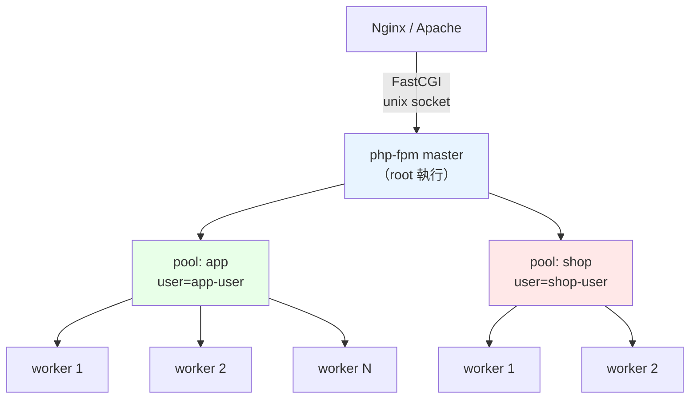

# PHP-FPM 設定與 Pool 調校

> [!abstract] 這篇你會學到
> - 分清 **`static` / `dynamic` / `ondemand`** 三種 pm 模式的適用情境
> - **依實際記憶體正確計算 `pm.max_children`**（不是抄別人的）
> - 用 **`/fpm-status`** 判讀即時狀態並找出問題
> - 用 **`slowlog`** 直接看到 PHP 卡在哪一行
> - 設定**每個站台獨立的 pool**（權限隔離）
> - 診斷 **`server reached pm.max_children`** 這個經典問題

## 前置知識

- [[060-03-01-01-guide-PHP-安裝與多版本管理]] — 多版本與設定檔位置
- [[060-02-03-03-guide-Apache-模組與MPM]] 或 [[060-02-02-08-guide-Nginx-效能調校]] — Web 伺服器端的調校

---

## FPM 的架構



```
master 程序（root）
  · 讀取設定、管理 pool、監聽 socket、處理訊號
  · 【不執行 PHP 程式碼】

worker 程序（pool 指定的使用者）
  · 實際執行 PHP
  · 每個 worker 一次只處理【一個】請求
  · ★ 這就是 pm.max_children 的意義：最大並發 PHP 請求數
```

### 設定檔結構

```
/etc/php/8.3/fpm/
├── php.ini                   ★ 網頁用的 PHP 設定
├── php-fpm.conf              ★ 全域（master）設定
└── pool.d/
    ├── www.conf              預設 pool
    ├── app.conf              ★ 自訂 pool（建議每站一個）
    └── shop.conf
```

```ini
; ═══════════ /etc/php/8.3/fpm/php-fpm.conf（全域）═══════════
[global]
pid = /run/php/php8.3-fpm.pid
error_log = /var/log/php8.3-fpm.log
log_level = notice

; ★ 緊急重啟：60 秒內有 10 個 worker 異常結束就重啟整個 FPM
emergency_restart_threshold = 10
emergency_restart_interval = 60s
process_control_timeout = 10s

; ★ 系統層級的程序上限（所有 pool 加總）
process.max = 128

daemonize = yes

include=/etc/php/8.3/fpm/pool.d/*.conf
```

---

## 三種 `pm` 模式

| 模式 | 行為 | 記憶體 | 延遲 | 適用 |
| --- | --- | --- | --- | --- |
| **`static`** | **固定開 N 個 worker**，永不變 | **固定且最高** | **最低** | **高流量、記憶體充足** |
| **`dynamic`** ★ | 依負載在 min-max 間增減 | 中等 | 低 | **★ 大多數情況** |
| `ondemand` | **有請求才開**，閒置就關 | **最低** | **較高**（要 fork） | 低流量、多站台共存、記憶體吃緊 |

```ini
; ═══ static：固定 ═══
pm = static
pm.max_children = 50           ; ★ 永遠開 50 個
pm.max_requests = 500

; ═══ dynamic：★ 推薦 ═══
pm = dynamic
pm.max_children = 50           ; ★★ 最大（記憶體上限決定）
pm.start_servers = 12          ; 啟動時開幾個
pm.min_spare_servers = 8       ; ★ 最少保持幾個閒置
pm.max_spare_servers = 20      ; ★ 最多保持幾個閒置
pm.process_idle_timeout = 10s
pm.max_requests = 500          ; ★ 處理幾個請求後重生（防記憶體洩漏）

; ═══ ondemand：省記憶體 ═══
pm = ondemand
pm.max_children = 50
pm.process_idle_timeout = 10s  ; 閒置多久後關閉
pm.max_requests = 500
```

> [!tip] `dynamic` 的四個參數關係
> ```
> pm.start_servers 建議 = (min_spare + max_spare) / 2
>
> 常見的比例：
>   pm.max_children       = M        （記憶體決定，見下方計算）
>   pm.start_servers      = M × 0.25
>   pm.min_spare_servers  = M × 0.15
>   pm.max_spare_servers  = M × 0.40
>
> 例：max_children = 50
>   start_servers = 12
>   min_spare = 8
>   max_spare = 20
> ```
>
> **設定不當的警告**：
> ```
> [WARNING] pm.start_servers(30) must not be less than pm.min_spare_servers(8)
>           and not greater than pm.max_spare_servers(20)
> ```

> [!warning] `ondemand` 的隱藏成本
> ```
> 每個新請求可能需要 fork 一個新程序
>   → fork + 載入擴充 + OPcache 預熱 ≈ 10-50ms
>     → ★ 對延遲敏感的應用不適合
>
> 但對「幾十個低流量站台共用一台機器」非常合適
>   → 沒人訪問的站台完全不佔記憶體
> ```

---

## `pm.max_children` 的計算 ★★★

> [!danger] 這是 FPM 調校最重要的一個數字
> ```
> 設太小 → server reached pm.max_children → 請求排隊 → 網站變慢或 502
> 設太大 → 記憶體用完 → OOM killer → 【整台機器掛掉】
> ```

```bash
#!/usr/bin/env bash
# /usr/local/bin/fpm-calc —— 計算合適的 pm.max_children
POOL="${1:-www}"
PHPV=$(php -r 'echo PHP_MAJOR_VERSION.".".PHP_MINOR_VERSION;' 2>/dev/null || echo "8.3")

echo "═══ pm.max_children 計算（pool: $POOL）═══"

# ── 記憶體現況 ──
TOTAL=$(free -m | awk '/^Mem:/{print $2}')
USED=$(free -m | awk '/^Mem:/{print $3}')
AVAIL=$(free -m | awk '/^Mem:/{print $7}')

# ── 其他服務佔用 ──
OTHER=$(ps -eo rss,comm --sort=-rss 2>/dev/null | \
  awk '$2 ~ /mysqld|mariadbd|postgres|redis-server|node|java|elasticsearch/ {s+=$1} END {printf "%d", s/1024}')
WEB=$(ps -eo rss,comm 2>/dev/null | awk '$2 ~ /nginx|apache2|httpd/ {s+=$1} END {printf "%d", s/1024}')

# ── PHP-FPM worker 的實際記憶體 ──
RSS=$(ps -o rss= -C "php-fpm${PHPV}" 2>/dev/null || ps -o rss= -C "php-fpm" 2>/dev/null)
if [ -z "$RSS" ]; then
    echo "  ⚠ 找不到 php-fpm 程序，用預設估值 60 MB"
    AVG=60; MAX=60
else
    AVG=$(echo "$RSS" | awk '{s+=$1;n++} END {printf "%.1f", s/n/1024}')
    MAX=$(echo "$RSS" | awk '{if($1>m)m=$1} END {printf "%.1f", m/1024}')
    N=$(echo "$RSS" | wc -l)
fi

printf '\n  總記憶體            %6d MB\n' "$TOTAL"
printf '  已使用              %6d MB\n' "$USED"
printf '  可用（available）   %6d MB\n' "$AVAIL"
printf '  資料庫等服務        %6d MB\n' "$OTHER"
printf '  Web 伺服器          %6d MB\n' "$WEB"
printf '  FPM worker 數量     %6s 個\n' "${N:-0}"
printf '  FPM worker 平均     %6s MB\n' "$AVG"
printf '  FPM worker 最大     %6s MB  ★ 用這個算比較保險\n' "$MAX"

# ── 計算 ──
RESERVE=$(( 1024 + OTHER + WEB ))       # OS 1GB + 其他服務
FOR_PHP=$(( TOTAL - RESERVE ))

echo
awk -v f="$FOR_PHP" -v a="$AVG" -v m="$MAX" 'BEGIN {
    if (f <= 0) { print "  ⚠⚠ 記憶體不足，其他服務已佔滿"; exit }
    printf "  可用於 PHP-FPM      %6d MB\n", f
    printf "\n  用【平均】RSS 計算：%d / %.1f ≈ \033[1m%d\033[0m\n", f, a, int(f/a)
    printf "  用【最大】RSS 計算：%d / %.1f ≈ \033[1m%d\033[0m  ★ 建議用這個\n", f, m, int(f/m)
    printf "\n  ── 建議設定（dynamic）──\n"
    M = int(f/m)
    printf "    pm = dynamic\n"
    printf "    pm.max_children       = %d\n", M
    printf "    pm.start_servers      = %d\n", int(M*0.25) > 0 ? int(M*0.25) : 1
    printf "    pm.min_spare_servers  = %d\n", int(M*0.15) > 0 ? int(M*0.15) : 1
    printf "    pm.max_spare_servers  = %d\n", int(M*0.40) > 0 ? int(M*0.40) : 2
    printf "    pm.max_requests       = 500\n"
}'

# ── 目前設定 ──
echo -e "\n  ── 目前設定 ──"
CONF="/etc/php/${PHPV}/fpm/pool.d/${POOL}.conf"
[ -f "$CONF" ] || CONF=$(ls /etc/php/*/fpm/pool.d/*.conf /etc/php-fpm.d/*.conf 2>/dev/null | head -1)
for k in pm pm.max_children pm.start_servers pm.min_spare_servers pm.max_spare_servers pm.max_requests; do
    v=$(grep -oP "^\s*${k//./\\.}\s*=\s*\K\S+" "$CONF" 2>/dev/null | head -1)
    printf '    %-24s %s\n' "$k" "${v:-（未設定）}"
done

# ── 是否曾經達到上限 ──
echo -e "\n  ── 是否曾經達到上限 ──"
N1=$(sudo grep -c 'reached pm.max_children' /var/log/php*-fpm.log 2>/dev/null | \
     awk -F: '{s+=$NF} END {print s+0}')
[ "$N1" -gt 0 ] && echo "    ⚠⚠ 有 $N1 次達到 pm.max_children【需要調整】" \
                || echo "    ✓ 未曾達到上限"

# ── 實際的 memory_limit ──
echo -e "\n  ── memory_limit ──"
ML=$(php -r 'echo ini_get("memory_limit");' 2>/dev/null)
echo "    CLI: $ML"
echo "    ★ memory_limit 是【單一請求】的上限，不是 worker 的常駐用量"
echo "    ★ 最壞情況：max_children × memory_limit（但實務上遠低於此）"
```

> [!warning] 三個計算上的陷阱
> **陷阱一：用 `memory_limit` 來算**
> ```
> ❌ max_children = 可用記憶體 / memory_limit
>    memory_limit 512M → 8GB / 512M = 16 個  ← ★ 太保守
>
> ✅ 用【實際的 RSS】
>    典型的 Laravel 應用 worker RSS ≈ 40-80 MB
>    → 6GB / 70MB ≈ 85 個
>
> memory_limit 是【單一請求的上限】，
> 只有極少數請求（大量資料處理）會接近它。
> ```
>
> **陷阱二：忘了扣除其他服務**
> ```
> 同一台機器上還有 MySQL（2GB）、Redis（512MB）、Nginx（100MB）
> → 這些都要先扣掉
> ```
>
> **陷阱三：用平均 RSS 而非最大 RSS**
> ```
> 平均 45MB，最大 120MB（某些頁面吃很多）
> → 用平均算會在尖峰時 OOM
> → ★ 用【最大值】算比較保險
> ```

```bash
# ★ 觀察 worker 的實際記憶體分布
$ ps -o rss=,pid=,args= -C php-fpm8.3 | sort -rn | head -10 | \
    awk '{printf "%7.1f MB  PID %s\n", $1/1024, $2}'
  118.3 MB  PID 12345
   82.1 MB  PID 12346
   45.2 MB  PID 12347
   ...

# ★ 長期觀察（找出真正的最大值）
$ while true; do
    ps -o rss= -C php-fpm8.3 | sort -rn | head -1 | \
      awk -v t="$(date +%T)" '{printf "%s 最大 %.1f MB\n", t, $1/1024}'
    sleep 60
  done | tee /tmp/fpm-mem.log
```

---

## 完整的 pool 設定

```ini
; ═══════════ /etc/php/8.3/fpm/pool.d/app.conf ═══════════
[app]

; ══ 執行身分（★ 權限隔離的核心）══
user  = app-user
group = app-user

; ══ 監聽 ══
listen = /run/php/php8.3-fpm-app.sock
listen.owner = www-data              ; ★ Web 伺服器的身分
listen.group = www-data
listen.mode  = 0660
listen.backlog = 511                 ; ★ 等待 accept 的佇列

; TCP 版本（★ 跨主機時用，本機一律用 socket）
; listen = 127.0.0.1:9001
; listen.allowed_clients = 127.0.0.1

; ══ 程序管理 ══
pm = dynamic
pm.max_children       = 40           ; ★★ 依記憶體計算
pm.start_servers      = 10
pm.min_spare_servers  = 6
pm.max_spare_servers  = 16
pm.max_requests       = 500          ; ★ 防記憶體洩漏
pm.process_idle_timeout = 10s

; ══ 狀態頁（★ 監控必備）══
pm.status_path = /fpm-status
ping.path      = /fpm-ping
ping.response  = pong

; ══ 逾時 ══
request_terminate_timeout = 120s     ; ★ 超過就強制終止（防卡死）
request_slowlog_timeout   = 5s       ; ★ 超過就記錄 stack trace
slowlog = /var/log/php/app-slow.log

; ══ 日誌 ══
access.log = /var/log/php/app-access.log
access.format = "%R - %u %t \"%m %r%Q%q\" %s %f %{mili}d %{kilo}M %C%%"
;                                              ^^^^^^^^ 毫秒  ^^^^^^^ 記憶體 ^^ CPU
catch_workers_output = yes           ; ★ 把 worker 的 stdout/stderr 寫進日誌
decorate_workers_output = no
php_admin_value[error_log] = /var/log/php/app-error.log
php_admin_flag[log_errors] = on

; ══ 環境變數 ══
clear_env = no                       ; ★ 允許繼承 Web 伺服器傳的環境變數
env[APP_ENV] = production
env[PATH] = /usr/local/bin:/usr/bin:/bin

; ══ ★★ 安全設定（php_admin_* 不能被 ini_set 覆蓋）══
php_admin_value[open_basedir] = /var/www/app/current:/var/www/app/shared:/tmp:/usr/share/php:/var/lib/php/sessions/app
php_admin_value[disable_functions] = exec,passthru,shell_exec,system,proc_open,popen,pcntl_exec,pcntl_fork,dl,putenv,proc_nice,proc_terminate
php_admin_flag[display_errors] = off
php_admin_flag[allow_url_include] = off
php_admin_value[expose_php] = 0

; ══ 資源限制 ══
php_admin_value[memory_limit] = 512M
php_admin_value[max_execution_time] = 60
php_admin_value[upload_max_filesize] = 50M
php_admin_value[post_max_size] = 64M
php_admin_value[max_input_vars] = 3000

; ══ Session（★ 每個 pool 獨立）══
php_admin_value[session.save_path] = /var/lib/php/sessions/app
php_admin_value[upload_tmp_dir] = /var/www/app/shared/tmp
php_admin_flag[session.cookie_httponly] = on
php_admin_flag[session.cookie_secure] = on
php_admin_value[session.cookie_samesite] = Lax
```

```bash
# ★ 必要的目錄與權限
$ sudo useradd -r -M -d /var/www/app -s /usr/sbin/nologin app-user
$ sudo mkdir -p /var/lib/php/sessions/app /var/www/app/shared/tmp /var/log/php
$ sudo chown app-user:app-user /var/lib/php/sessions/app /var/www/app/shared/tmp
$ sudo chmod 700 /var/lib/php/sessions/app
$ sudo chown www-data:www-data /var/log/php
$ sudo chmod 755 /var/log/php

$ sudo php-fpm8.3 -t                          # ★ 語法檢查
$ sudo systemctl restart php8.3-fpm
$ ls -l /run/php/php8.3-fpm-app.sock
```

---

## `/fpm-status`：即時狀態

```nginx
# Nginx
location = /fpm-status {
    allow 127.0.0.1;
    allow 10.0.9.0/24;
    deny  all;                                  # ★ 一定要限制
    access_log off;
    fastcgi_pass unix:/run/php/php8.3-fpm-app.sock;
    fastcgi_param SCRIPT_FILENAME $fastcgi_script_name;
    include fastcgi_params;
}
location = /fpm-ping {
    allow 127.0.0.1;
    deny all;
    access_log off;
    fastcgi_pass unix:/run/php/php8.3-fpm-app.sock;
    fastcgi_param SCRIPT_FILENAME $fastcgi_script_name;
    include fastcgi_params;
}
```

```apache
# Apache
<LocationMatch "^/(fpm-status|fpm-ping)$">
    Require ip 127.0.0.1
    Require ip 10.0.9.0/24
    SetHandler "proxy:unix:/run/php/php8.3-fpm-app.sock|fcgi://localhost"
</LocationMatch>
```

```bash
$ curl -s 'http://127.0.0.1/fpm-status'
pool:                 app
process manager:      dynamic
start time:           28/Aug/2026:08:00:00 +0800
start since:          9012
accepted conn:        184203
listen queue:         0            ★ >0 表示 worker 不夠
max listen queue:     12           ★ 歷史最大值
listen queue len:     511
idle processes:       28
active processes:     12           ★ 正在處理請求
total processes:      40
max active processes: 40           ★★ 曾經全滿 = 需要調大
max children reached: 3            ★★ 達到上限 3 次！
slow requests:        142          ★ 有慢請求
```

| 欄位 | 意義 | 警訊 |
| --- | --- | --- |
| **`listen queue`** | **等待被處理的請求數** | **> 0 = worker 不夠** |
| `max listen queue` | 歷史最大佇列 | 大 = 曾經有尖峰 |
| `active processes` | 正在處理請求的 worker | 接近 total = 忙碌 |
| `idle processes` | 閒置的 worker | 0 = 沒有餘裕 |
| **`max active processes`** | **歷史最大並發** | **= max_children 表示曾經全滿** |
| **`max children reached`** | **達到上限的次數** | **> 0 = 必須調整** |
| **`slow requests`** | **超過 `request_slowlog_timeout` 的請求數** | **> 0 = 有效能問題** |

```bash
# ★ 詳細模式：看每個 worker 在做什麼
$ curl -s 'http://127.0.0.1/fpm-status?full'
...
************************
pid:                  12345
state:                Running          ★ Running / Idle / Reading headers
start time:           28/Aug/2026:10:15:22 +0800
start since:          322
requests:             1842
request duration:     3521043          ★ 微秒（3.5 秒！）
request method:       POST
request URI:          /api/reports/generate
content length:       1024
user:                 -
script:               /var/www/app/current/public/index.php
last request cpu:     0.00
last request memory:  0                ★ 目前正在執行，所以是 0

# JSON 格式（給監控系統用）
$ curl -s 'http://127.0.0.1/fpm-status?json&full' | jq .
```

### 即時監控腳本

```bash
#!/usr/bin/env bash
# PHP-FPM 即時監控
URL="${1:-http://127.0.0.1/fpm-status}"
while true; do
    clear
    date '+%F %T'
    curl -s "$URL" 2>/dev/null | awk -F': +' '
      /^pool/                {pool=$2}
      /^listen queue:/       {lq=$2}
      /^max listen queue/    {mlq=$2}
      /^idle processes/      {idle=$2}
      /^active processes/    {act=$2}
      /^total processes/     {tot=$2}
      /^max active processes/{maxact=$2}
      /^max children reached/{mcr=$2}
      /^slow requests/       {slow=$2}
      /^accepted conn/       {acc=$2}
      END {
        printf "  Pool: %s   已處理 %s 個請求\n\n", pool, acc
        pct = (tot>0 ? act*100/tot : 0)
        printf "  Worker  忙碌 %s / 總 %s（%.0f%%）閒置 %s  %s\n",
               act, tot, pct, idle, (pct>80 ? "⚠ 接近上限" : "✓")
        printf "  佇列    當前 %s  歷史最大 %s  %s\n", lq, mlq,
               (lq+0 > 0 ? "⚠⚠ 請求在排隊" : "✓")
        printf "  歷史    最大並發 %s  達上限 %s 次  %s\n", maxact, mcr,
               (mcr+0 > 0 ? "⚠⚠ 需要調大 max_children" : "✓")
        printf "  慢請求  %s  %s\n", slow, (slow+0 > 0 ? "⚠ 看 slowlog" : "✓")
      }'
    echo
    echo "  ── 記憶體 ──"
    ps -o rss= -C php-fpm8.3 2>/dev/null | awk '{s+=$1;n++; if($1>m)m=$1} END {
      if(n) printf "  %d 個 worker，共 %.0f MB，平均 %.1f MB，最大 %.1f MB\n",
                   n, s/1024, s/n/1024, m/1024}'
    free -m | awk '/^Mem:/{printf "  系統：已用 %d MB / 總 %d MB（可用 %d MB）%s\n",
                           $3, $2, $7, ($7 < 500 ? "⚠⚠ 記憶體吃緊" : "")}'
    echo
    echo "  ── 正在執行的請求（>1 秒）──"
    curl -s "${URL}?full" 2>/dev/null | awk '
      /^pid:/ {pid=$2}
      /^state:/ {st=$2}
      /^request duration:/ {dur=$3}
      /^request URI:/ {uri=$3}
      /^script:/ {
        if (st == "Running" && dur+0 > 1000000)
          printf "    %7.2fs  PID %s  %s\n", dur/1000000, pid, uri
      }'
    sleep 2
done
```

---

## `slowlog`：找出慢在哪一行 ★

```ini
request_slowlog_timeout = 5s
slowlog = /var/log/php/app-slow.log
```

```bash
$ sudo tail -30 /var/log/php/app-slow.log
```

```
[28-Aug-2026 10:15:32]  [pool app] pid 12345
script_filename = /var/www/app/current/public/index.php
[0x00007f8b4c0a1234] curl_exec() /var/www/app/vendor/guzzlehttp/guzzle/src/Handler/CurlHandler.php:43
[0x00007f8b4c0a1180] __invoke() /var/www/app/vendor/guzzlehttp/guzzle/src/Client.php:333
[0x00007f8b4c0a10c0] request() /var/www/app/app/Services/ExternalApi.php:78
[0x00007f8b4c0a1000] fetchUserData() /var/www/app/app/Http/Controllers/UserController.php:45
[0x00007f8b4c0a0f40] show() /var/www/app/vendor/laravel/framework/src/.../ControllerDispatcher.php:46
...
```

> [!tip] 這是找效能問題最直接的工具
> **一般的存取日誌只告訴你「這個 URL 花了 5 秒」，
> slowlog 直接告訴你「卡在 `ExternalApi.php` 第 78 行呼叫外部 API」。**
>
> **不需要加任何程式碼、不需要重現問題。**

```bash
#!/usr/bin/env bash
# 慢請求分析
LOG="${1:-/var/log/php/app-slow.log}"
echo "═══ 慢請求分析 ═══"

echo -e "\n【1】總數"
grep -c '^\[.*\] \[pool' "$LOG" 2>/dev/null | sed 's/^/  /'

echo -e "\n【2】★ 最常見的卡點（第一層呼叫）"
grep -A1 '^script_filename' "$LOG" 2>/dev/null | grep '^\[0x' | \
  sed 's/^\[0x[0-9a-f]*\] //' | sort | uniq -c | sort -rn | head -15 | \
  sed 's/^/  /'

echo -e "\n【3】★ 最常卡住的函式"
grep '^\[0x' "$LOG" 2>/dev/null | sed 's/^\[0x[0-9a-f]*\] //; s/ .*//' | \
  sort | uniq -c | sort -rn | head -15 | sed 's/^/  /'

echo -e "\n【4】★ 最常卡住的應用程式碼（排除 vendor）"
grep '^\[0x' "$LOG" 2>/dev/null | grep -v '/vendor/' | \
  sed 's/^\[0x[0-9a-f]*\] //' | sort | uniq -c | sort -rn | head -15 | sed 's/^/  /'

echo -e "\n【5】依時間分布"
grep -oP '^\[\K\d{2}-\w{3}-\d{4} \d{2}' "$LOG" 2>/dev/null | \
  sort | uniq -c | tail -24 | \
  awk '{printf "  %s %s  %6d  ", $2, $3, $1; for(i=0;i<$1/5 && i<40;i++) printf "▇"; print ""}'

echo -e "\n【6】常見卡點的意義"
cat <<'EOF'
  curl_exec / file_get_contents   → 外部 API 呼叫慢（★ 加逾時、改非同步）
  PDO::execute / mysqli_query     → SQL 慢（★ 加索引、看 EXPLAIN）
  sleep / usleep                  → 程式碼中有 sleep
  preg_match                      → 正規表示式回溯爆炸（ReDoS）
  file_put_contents / fwrite      → 磁碟 I/O 慢
  session_start                   → session 鎖定（★ 常見！用 Redis）
  unserialize / json_decode       → 資料量太大
EOF
```

> [!warning] `session_start()` 常常是隱藏的瓶頸
> ```
> PHP 的檔案型 session 會【鎖定 session 檔案】
>   → 同一個使用者的多個並行請求（AJAX）會【互相等待】
>     → 前端發 5 個 AJAX，變成【串列執行】
>
> slowlog 會顯示大量卡在 session_start()
> ```
>
> **解法**：
> ```ini
> ; ① 改用 Redis（不會鎖）
> session.save_handler = redis
> session.save_path = "tcp://127.0.0.1:6379?database=1"
> ```
> ```php
> // ② 唯讀的請求提早關閉 session
> session_start();
> $user = $_SESSION['user'];
> session_write_close();          // ★ 立刻釋放鎖
> // ... 後續的處理
> ```

---

## `pm.max_children` 耗盡的排查

```bash
# ═══ 症狀 ═══
$ sudo tail /var/log/php8.3-fpm.log
[28-Aug-2026 10:15:32] WARNING: [pool app] server reached pm.max_children setting (40),
consider raising it

# → Nginx 看到的是：
$ sudo tail /var/log/nginx/app.error.log
upstream timed out (110: Connection timed out) while connecting to upstream
# 或 502 / 504
```

```bash
# ═══ 【1】確認是「真的需要更多」還是「worker 被卡住」═══
$ curl -s 'http://127.0.0.1/fpm-status'
active processes:     40          ★ 全滿
idle processes:       0
listen queue:         87          ★★ 87 個請求在排隊
slow requests:        1284        ★★ 有大量慢請求

# ═══ 【2】看 worker 在做什麼 ═══
$ curl -s 'http://127.0.0.1/fpm-status?full' | \
    awk '/^state:/{s=$2} /^request duration:/{d=$3} /^request URI:/{u=$3}
         /^script:/{if(s=="Running") printf "%8.2fs  %s\n", d/1000000, u}' | sort -rn
   12.43s  /api/reports/generate       ★★ 全部卡在同一個端點
   11.87s  /api/reports/generate
   11.02s  /api/reports/generate
   ...

# ═══ 【3】看 slowlog 的卡點 ═══
$ sudo tail -50 /var/log/php/app-slow.log | grep -v vendor
[0x...] fetchAllOrders() /var/www/app/app/Services/Report.php:112

# ═══ 【4】看資料庫 ═══
$ mysql -e "SHOW FULL PROCESSLIST" | grep -v Sleep
$ mysql -e "SELECT * FROM sys.statements_with_runtimes_in_95th_percentile LIMIT 5\G"

# ═══ 【5】看記憶體還夠不夠 ═══
$ free -m
$ ps -o rss= -C php-fpm8.3 | awk '{s+=$1} END {printf "%.0f MB\n", s/1024}'
```

```
┌── slow requests 很多、worker 都在 Running ────────────┐
│ → ★ 【後端慢】，不是 worker 不夠                        │
│   ① 看 slowlog 找出卡點                                │
│   ② 加索引 / 修 N+1 / 加快取                           │
│   ③ 長時間任務改成【非同步佇列】                        │
│   ④ 調大 max_children 只會【讓更多請求一起慢】          │
│      而且可能【壓垮資料庫】（連線數也會爆）              │
└──────────────────────────────────────────────────┘

┌── slow requests 很少、記憶體還很充裕 ──────────────────┐
│ → ★ 這才是真正該調大 max_children 的情況                │
└──────────────────────────────────────────────────┘

┌── 記憶體已經吃緊 ──────────────────────────────────┐
│ → 【不能】調大。要嘛加記憶體，要嘛降低單請求的記憶體用量  │
│   （減少載入的資料、改用串流處理）                       │
└──────────────────────────────────────────────────┘
```

> [!danger] 不要無腦調大 `pm.max_children`
> ```
> 後端慢 → worker 全滿 → 調大 max_children
>   → 更多請求同時打資料庫
>     → 資料庫連線數爆掉 / 鎖等待
>       → 更慢 → 更多請求堆積
>         → 【記憶體用完 → OOM → 整台機器掛掉】
> ```
>
> **同時要檢查資料庫的連線上限**：
> ```bash
> $ mysql -e "SHOW VARIABLES LIKE 'max_connections'"
> max_connections  151
>
> # ★ 所有 pool 的 max_children 加總不能超過它
> $ grep -h 'pm.max_children' /etc/php/*/fpm/pool.d/*.conf | \
>     grep -oP '\d+' | awk '{s+=$1} END {print "所有 pool 加總:", s}'
> ```

---

## 完整實戰範例

### 多站台的 pool 配置

```bash
#!/usr/bin/env bash
# 為一個新站台建立獨立的 pool
set -euo pipefail
SITE="${1:?用法: $0 <site-name> [max_children]}"
MAXC="${2:-20}"
PHPV="${3:-8.3}"

echo "═══ 建立 pool: $SITE ═══"

echo -e "\n【1】建立使用者"
id "$SITE-user" >/dev/null 2>&1 || \
  sudo useradd -r -M -d "/var/www/$SITE" -s /usr/sbin/nologin "$SITE-user"

echo -e "\n【2】建立目錄"
sudo mkdir -p "/var/lib/php/sessions/$SITE" "/var/www/$SITE/shared/tmp" /var/log/php
sudo chown "$SITE-user:$SITE-user" "/var/lib/php/sessions/$SITE" "/var/www/$SITE/shared/tmp"
sudo chmod 700 "/var/lib/php/sessions/$SITE"
sudo chown www-data:www-data /var/log/php

echo -e "\n【3】產生 pool 設定"
sudo tee "/etc/php/${PHPV}/fpm/pool.d/${SITE}.conf" >/dev/null <<EOF
[${SITE}]
user  = ${SITE}-user
group = ${SITE}-user

listen = /run/php/php${PHPV}-fpm-${SITE}.sock
listen.owner = www-data
listen.group = www-data
listen.mode  = 0660
listen.backlog = 511

pm = dynamic
pm.max_children       = ${MAXC}
pm.start_servers      = $(( MAXC / 4 > 0 ? MAXC / 4 : 1 ))
pm.min_spare_servers  = $(( MAXC / 6 > 0 ? MAXC / 6 : 1 ))
pm.max_spare_servers  = $(( MAXC * 2 / 5 > 1 ? MAXC * 2 / 5 : 2 ))
pm.max_requests       = 500
pm.process_idle_timeout = 10s

pm.status_path = /fpm-status
ping.path      = /fpm-ping
ping.response  = pong

request_terminate_timeout = 120s
request_slowlog_timeout   = 5s
slowlog = /var/log/php/${SITE}-slow.log

access.log = /var/log/php/${SITE}-access.log
access.format = "%R - %u %t \"%m %r%Q%q\" %s %f %{mili}d %{kilo}M %C%%"
catch_workers_output = yes
clear_env = no

php_admin_value[error_log] = /var/log/php/${SITE}-error.log
php_admin_flag[log_errors] = on
php_admin_flag[display_errors] = off

php_admin_value[open_basedir] = /var/www/${SITE}/current:/var/www/${SITE}/shared:/tmp:/usr/share/php:/var/lib/php/sessions/${SITE}
php_admin_value[disable_functions] = exec,passthru,shell_exec,system,proc_open,popen,pcntl_exec,pcntl_fork,dl,putenv
php_admin_flag[allow_url_include] = off
php_admin_value[expose_php] = 0

php_admin_value[memory_limit] = 512M
php_admin_value[max_execution_time] = 60
php_admin_value[upload_max_filesize] = 50M
php_admin_value[post_max_size] = 64M

php_admin_value[session.save_path] = /var/lib/php/sessions/${SITE}
php_admin_value[upload_tmp_dir] = /var/www/${SITE}/shared/tmp
php_admin_flag[session.cookie_httponly] = on
php_admin_flag[session.cookie_secure] = on
php_admin_value[session.cookie_samesite] = Lax
EOF

echo -e "\n【4】檢查所有 pool 的總量"
TOTAL=$(grep -h 'pm.max_children' /etc/php/${PHPV}/fpm/pool.d/*.conf | \
        grep -oP '\d+' | awk '{s+=$1} END {print s}')
MEM=$(free -m | awk '/^Mem:/{print $2}')
echo "  所有 pool 的 max_children 加總：$TOTAL"
echo "  總記憶體：$MEM MB"
awk -v t="$TOTAL" -v m="$MEM" 'BEGIN {
  need = t * 60 / 1024
  printf "  最壞情況需要約 %.1f GB（每 worker 60MB 估算）\n", need
  if (need * 1024 > m * 0.7) print "  ⚠⚠ 可能超過記憶體，請調降"
  else print "  ✓ 在合理範圍"
}'
echo "  ★ 也要確認資料庫的 max_connections 夠："
mysql -e "SHOW VARIABLES LIKE 'max_connections'" 2>/dev/null | tail -1 | sed 's/^/    /' || \
  echo "    （無法查詢資料庫）"

echo -e "\n【5】測試與重啟"
sudo "php-fpm${PHPV}" -t
sudo systemctl restart "php${PHPV}-fpm"
sleep 2
ls -l "/run/php/php${PHPV}-fpm-${SITE}.sock"

echo -e "\n【6】Web 伺服器設定"
cat <<EOF
  Nginx：
    location ~ \.php\$ {
        try_files \$uri =404;
        fastcgi_pass unix:/run/php/php${PHPV}-fpm-${SITE}.sock;
        include snippets/php-fpm.conf;
    }
    location = /fpm-status {
        allow 127.0.0.1; deny all;
        fastcgi_pass unix:/run/php/php${PHPV}-fpm-${SITE}.sock;
        fastcgi_param SCRIPT_FILENAME \$fastcgi_script_name;
        include fastcgi_params;
    }

  Apache：
    <FilesMatch \.php\$>
        SetHandler "proxy:unix:/run/php/php${PHPV}-fpm-${SITE}.sock|fcgi://localhost"
    </FilesMatch>
EOF

echo -e "\n✓ 完成"
```

### 健康檢查

```bash
#!/usr/bin/env bash
# PHP-FPM 健康檢查（可排程）
PHPV="${1:-8.3}"
FAIL=0
echo "═══ PHP-FPM 健康檢查 $(date '+%F %T') ═══"

echo -e "\n【1】服務"
systemctl is-active "php${PHPV}-fpm" >/dev/null && echo "  ✓ 執行中" \
  || { echo "  ✗✗ 未執行"; FAIL=1; }

echo -e "\n【2】設定語法"
sudo "php-fpm${PHPV}" -t 2>&1 | sed 's/^/  /'

echo -e "\n【3】各 pool 的設定"
for c in /etc/php/${PHPV}/fpm/pool.d/*.conf; do
    [ -e "$c" ] || continue
    n=$(grep -oP '^\[\K[^]]+' "$c" | head -1)
    u=$(grep -oP '^\s*user\s*=\s*\K\S+' "$c" | head -1)
    m=$(grep -oP '^\s*pm\.max_children\s*=\s*\K\d+' "$c" | head -1)
    pm=$(grep -oP '^\s*pm\s*=\s*\K\S+' "$c" | head -1)
    ob=$(grep -c 'open_basedir' "$c")
    df=$(grep -c 'disable_functions' "$c")
    sl=$(grep -c 'slowlog' "$c")
    printf '  [%s] user=%s pm=%s max_children=%s %s%s%s\n' \
      "$n" "${u:-?}" "${pm:-?}" "${m:-?}" \
      "$([ "$ob" -gt 0 ] && echo 'open_basedir✓ ' || echo 'open_basedir✗ ')" \
      "$([ "$df" -gt 0 ] && echo 'disable_fn✓ ' || echo 'disable_fn✗ ')" \
      "$([ "$sl" -gt 0 ] && echo 'slowlog✓' || echo 'slowlog✗')"
done

echo -e "\n【4】★ 是否達到 max_children"
N=$(sudo grep -c 'reached pm.max_children' /var/log/php${PHPV}-fpm.log 2>/dev/null || echo 0)
[ "$N" -gt 0 ] && { echo "  ⚠⚠ 有 $N 次達到上限"; FAIL=1; } || echo "  ✓ 未曾達到"

echo -e "\n【5】★ 狀態頁"
for s in $(grep -oP '^\s*listen\s*=\s*\K/run/php/\S+' /etc/php/${PHPV}/fpm/pool.d/*.conf 2>/dev/null); do
    [ -S "$s" ] || { echo "  ✗ $s 不存在"; FAIL=1; continue; }
    echo "  ── $s ──"
    SCRIPT_NAME=/fpm-status SCRIPT_FILENAME=/fpm-status REQUEST_METHOD=GET \
      cgi-fcgi -bind -connect "$s" 2>/dev/null | \
      grep -E 'listen queue:|active processes:|max children reached:|slow requests:' | \
      sed 's/^/    /' || echo "    （需要 libfcgi-bin）"
done

echo -e "\n【6】記憶體"
ps -o rss= -C "php-fpm${PHPV}" 2>/dev/null | awk '{s+=$1;n++;if($1>m)m=$1} END {
  if(n) printf "  %d 個 worker，共 %.0f MB，平均 %.1f MB，最大 %.1f MB\n",
               n, s/1024, s/n/1024, m/1024}'
free -m | awk '/^Mem:/{printf "  系統可用：%d MB %s\n", $7, ($7<500?"⚠⚠ 吃緊":"✓")}'

echo -e "\n【7】慢請求"
for l in /var/log/php/*-slow.log; do
    [ -e "$l" ] || continue
    n=$(grep -c '^script_filename' "$l" 2>/dev/null || echo 0)
    [ "$n" -gt 0 ] && {
        echo "  ⚠ $(basename "$l")：$n 筆"
        grep '^\[0x' "$l" | grep -v '/vendor/' | sed 's/^\[0x[0-9a-f]*\] //' | \
          sort | uniq -c | sort -rn | head -3 | sed 's/^/      /'
    }
done

echo -e "\n【8】所有 pool 的總量 vs 資源"
T=$(grep -h 'pm.max_children' /etc/php/${PHPV}/fpm/pool.d/*.conf 2>/dev/null | \
    grep -oP '\d+' | awk '{s+=$1} END {print s+0}')
MEM=$(free -m | awk '/^Mem:/{print $2}')
echo "  max_children 加總：$T"
awk -v t="$T" -v m="$MEM" 'BEGIN {
  need = t * 60
  printf "  最壞情況約需 %.1f GB / 總 %.1f GB %s\n", need/1024, m/1024,
         (need > m*0.7 ? "⚠⚠ 可能 OOM" : "✓")
}'
DBMAX=$(mysql -N -e "SELECT @@max_connections" 2>/dev/null || echo "")
[ -n "$DBMAX" ] && {
    echo "  資料庫 max_connections：$DBMAX"
    [ "$T" -gt "$DBMAX" ] && echo "  ⚠⚠ FPM worker 總數超過資料庫連線上限"
}

exit $FAIL
```

---

## 常見錯誤與排錯

| 現象／錯誤 | 原因 | 解法 |
| --- | --- | --- |
| **`server reached pm.max_children`** ★★ | 並發超過上限，或 worker 被卡住 | 先看 `slow requests`；見上方決策樹 |
| **記憶體用完 OOM** ★ | `max_children` 設太大 | 依實際 RSS 重算；**用最大值而非平均值** |
| **502 Bad Gateway** | FPM 沒啟動 / socket 路徑錯 | `systemctl status`；`ls -l /run/php/` |
| `Permission denied` 連 socket | `listen.owner` 不對 | `listen.owner = www-data`、`listen.mode = 0660` |
| **504 Gateway Timeout** | `request_terminate_timeout` 或後端太慢 | 看 slowlog；改非同步 |
| `pm.start_servers must not be less than pm.min_spare_servers` | 四個參數關係錯 | `min_spare ≤ start ≤ max_spare` |
| **session 遺失** ★ | 多 pool 共用 session 路徑但權限不同 | 每個 pool 獨立 `session.save_path` |
| **AJAX 請求變成串列** ★ | **檔案型 session 鎖定** | 改用 Redis；或 `session_write_close()` |
| worker 記憶體持續成長 | 記憶體洩漏 | `pm.max_requests = 500` |
| **`open_basedir` 錯誤** | 路徑不完整 | 加入 `/tmp`、`/usr/share/php`、session 路徑、upload_tmp_dir |
| **`/fpm-status` 404** | 沒有在 Web 伺服器設定 | 加 location + `fastcgi_param SCRIPT_FILENAME $fastcgi_script_name` |
| **`/fpm-status` 對外可存取** ★ | 沒有限制來源 | `allow 127.0.0.1; deny all;` |
| slowlog 是空的 | 沒設 `request_slowlog_timeout` | 設成 5s；**確認目錄權限** |
| 環境變數傳不進去 | `clear_env = yes`（預設） | 設 `clear_env = no` |
| **資料庫連線數爆掉** ★ | 所有 pool 的 max_children 總和過大 | 與 `max_connections` 一起規劃 |
| RHEL 上 socket 權限錯 | 預設 `root:root` | `listen.owner = apache`；**SELinux** |

> [!info]- Rocky / AlmaLinux（RHEL 系）對照
> ```bash
> # 設定檔位置
> /etc/php-fpm.conf              全域
> /etc/php-fpm.d/www.conf        pool
> /run/php-fpm/www.sock          socket
>
> # ★ socket 權限（預設 root:root，Apache/Nginx 讀不到）
> $ sudo vi /etc/php-fpm.d/www.conf
> listen.owner = apache          # ★ 或 nginx
> listen.group = apache
> listen.mode = 0660
> $ sudo systemctl restart php-fpm
>
> # ★★ SELinux
> $ sudo setsebool -P httpd_execmem 1
> $ sudo ausearch -m avc -ts recent | grep -E 'php-fpm|httpd'
>
> # session 目錄的 context
> $ sudo semanage fcontext -a -t httpd_var_run_t "/var/lib/php/sessions(/.*)?"
> $ sudo restorecon -Rv /var/lib/php/sessions
>
> # 多版本（Remi）
> /etc/opt/remi/php83/php-fpm.d/www.conf
> /var/opt/remi/php83/run/php-fpm/www.sock
> $ sudo systemctl restart php83-php-fpm
> ```

---

## 安全性注意事項

> [!danger] 每個站台獨立 pool 是最重要的隔離手段
> ```
> 共用 pool（都是 www-data）：
>   站台 A 有 LFI 或 web shell
>     → 讀得到站台 B、C、D 的 .env
>       → 【一站淪陷 = 全部淪陷】
>
> 獨立 pool（app-user / shop-user）+ open_basedir：
>   站台 A 淪陷 → 只能影響站台 A
> ```
>
> **驗證**：
> ```bash
> $ cat > /var/www/app/current/public/_iso.php <<'EOF'
> <?php
> echo "使用者：", posix_getpwuid(posix_geteuid())['name'], "\n";
> echo "open_basedir：", ini_get('open_basedir'), "\n";
> echo "讀自己的 .env：", (@file_get_contents('/var/www/app/shared/.env') ? "✓" : "✗"), "\n";
> echo "讀別人的 .env：", (@file_get_contents('/var/www/shop/shared/.env') ? "⚠⚠ 可以！" : "✓ 被擋"), "\n";
> echo "執行 id：", (@shell_exec('id') ?: "✓ 被擋"), "\n";
> EOF
> $ curl -s https://app.example.gov.tw/_iso.php
> $ rm /var/www/app/current/public/_iso.php
> ```

> [!warning] `/fpm-status` 洩漏的資訊
> ```
> ?full 模式會顯示：
>   · 所有正在處理的【URL 與查詢字串】（★ 可能含 token）
>   · 客戶端 IP
>   · script 的完整路徑
>   · 記憶體與 CPU 用量
> ```
> ```nginx
> location = /fpm-status {
>     allow 127.0.0.1;
>     allow 10.0.9.0/24;
>     deny all;                    # ★ 一定要
>     access_log off;
>     ...
> }
> ```
> ```bash
> # ★ 從外部驗證
> $ curl -sk -o /dev/null -w '%{http_code}\n' https://網站/fpm-status
> 403      # 必須是 403 或 404
> ```

> [!tip] `request_terminate_timeout` 是最後一道保險
> ```ini
> request_terminate_timeout = 120s
> ```
> **防止**：
> - 無窮迴圈的程式碼永久佔用 worker
> - 外部 API 沒有逾時導致 worker 卡死
> - 大量慢請求把所有 worker 吃光
>
> **注意**：要**比 `max_execution_time` 稍大**，
> 讓 PHP 有機會自己先觸發逾時（可以留下較好的錯誤訊息）。
> ```ini
> php_admin_value[max_execution_time] = 60
> request_terminate_timeout = 120s        ; ★ 比較大
> ```

---

## 速查表

### 三種 pm 模式

```
static    固定 N 個 worker          記憶體固定最高、延遲最低    高流量
dynamic   在 min-max 間增減 ★推薦    中等                      大多數情況
ondemand  有請求才開                最低、延遲較高（fork 成本） 低流量多站台
```

```ini
pm = dynamic
pm.max_children       = M          ; ★★ 記憶體決定
pm.start_servers      = M × 0.25
pm.min_spare_servers  = M × 0.15
pm.max_spare_servers  = M × 0.40
pm.max_requests       = 500        ; ★ 防記憶體洩漏
```

### `pm.max_children` 計算 ★★

```
可用於 PHP = 總記憶體 − OS(1GB) − 資料庫 − Redis − Web 伺服器
max_children = 可用於 PHP / 【單一 worker 的最大 RSS】

★ 用【最大】RSS 不是平均（尖峰時才不會 OOM）
★ 不要用 memory_limit 來算（那是單請求上限，太保守）
```

```bash
ps -o rss= -C php-fpm8.3 | sort -rn | head -5 | awk '{printf "%.1f MB\n", $1/1024}'
free -m
grep -h 'pm.max_children' /etc/php/*/fpm/pool.d/*.conf | grep -oP '\d+' | \
  awk '{s+=$1} END {print "所有 pool 加總:", s}'
mysql -e "SHOW VARIABLES LIKE 'max_connections'"     # ★ 不能超過它
```

### `/fpm-status` 判讀

```ini
pm.status_path = /fpm-status
ping.path      = /fpm-ping
```

| 欄位 | 警訊 |
| --- | --- |
| **`listen queue`** | **> 0 = worker 不夠** |
| **`max children reached`** | **> 0 = 必須調整** |
| **`slow requests`** | **> 0 = 有效能問題，看 slowlog** |
| `max active processes` | = max_children 表示曾經全滿 |

```bash
curl -s 'http://127.0.0.1/fpm-status'
curl -s 'http://127.0.0.1/fpm-status?full'      # ★ 每個 worker 在做什麼
curl -s 'http://127.0.0.1/fpm-status?json&full' # 給監控系統
```

### slowlog ★

```ini
request_slowlog_timeout = 5s
slowlog = /var/log/php/app-slow.log
request_terminate_timeout = 120s      ; ★ 比 max_execution_time 大
```

```bash
sudo tail -50 /var/log/php/app-slow.log
grep '^\[0x' slow.log | grep -v /vendor/ | sed 's/^\[0x[0-9a-f]*\] //' | \
  sort | uniq -c | sort -rn | head    # ★ 最常卡住的應用程式碼
```

| 常見卡點 | 意義 |
| --- | --- |
| `curl_exec` | 外部 API 慢 → 加逾時、改非同步 |
| `PDO::execute` | SQL 慢 → 加索引、看 EXPLAIN |
| **`session_start`** | **session 鎖定 → 改 Redis 或 `session_write_close()`** |
| `preg_match` | ReDoS（正規表示式回溯） |

### 獨立 pool（權限隔離）

```ini
[app]
user  = app-user                    ; ★ PHP 執行身分
group = app-user
listen = /run/php/php8.3-fpm-app.sock
listen.owner = www-data             ; ★ Web 伺服器身分
listen.group = www-data
listen.mode  = 0660

php_admin_value[open_basedir] = /var/www/app/current:/var/www/app/shared:/tmp:/usr/share/php:/var/lib/php/sessions/app
php_admin_value[disable_functions] = exec,passthru,shell_exec,system,proc_open,popen,pcntl_exec
php_admin_value[session.save_path] = /var/lib/php/sessions/app
php_admin_value[upload_tmp_dir] = /var/www/app/shared/tmp
```

### `max_children` 耗盡的決策

```
slow requests 多、worker 都 Running
  → ★ 後端慢，【不要】調大（會壓垮資料庫）
     看 slowlog → 加索引 / 修 N+1 / 加快取 / 改非同步佇列

slow requests 少、記憶體充裕
  → ★ 這才該調大

記憶體已吃緊
  → 不能調大。加記憶體或降低單請求的記憶體用量
```

### 排查

```bash
sudo php-fpm8.3 -t                                    # 語法
sudo systemctl status php8.3-fpm
sudo grep 'reached pm.max_children' /var/log/php8.3-fpm.log
curl -s http://127.0.0.1/fpm-status
sudo tail -50 /var/log/php/app-slow.log               # ★ 卡在哪一行
ps -o rss= -C php-fpm8.3 | awk '{s+=$1;n++} END {print n" 個, "s/1024" MB"}'
ls -l /run/php/*.sock
sudo ausearch -m avc -ts recent | grep php-fpm        # RHEL SELinux
```

---

## 練習題

> [!question]- 練習 1：計算並驗證 `max_children`
> 1. 執行本篇的 `fpm-calc` 腳本
> 2. **手動驗算**：`free -m`、`ps -o rss= -C php-fpm8.3`
> 3. 比較「用平均 RSS」與「用最大 RSS」算出的差異
> 4. 套用建議值
> 5. `ab -n 5000 -c 100` 壓測，**同時觀察**：
>    - `/fpm-status` 的 `active processes` 與 `listen queue`
>    - `free -m` 的可用記憶體
> 6. **有 OOM 嗎？有 `max children reached` 嗎？**

> [!question]- 練習 2：重現 `max_children` 耗盡
> 1. 建立一個 `sleep(5)` 的端點
> 2. 把 `pm.max_children` 設成 `5`
> 3. `ab -n 100 -c 20 http://localhost/slow.php`
> 4. **同時**觀察 `/fpm-status`：
>    - `listen queue` 是多少？
>    - `active processes` 是多少？
> 5. 看 `/var/log/php8.3-fpm.log` 的警告
> 6. **試著調大 max_children** → 問題解決了嗎？還是只是「更多請求一起慢」？
> 7. **把 sleep 改成佇列** → 再測一次

> [!question]- 練習 3：slowlog 實戰
> 1. 設定 `request_slowlog_timeout = 2s`
> 2. 建立三個慢端點：
>    ```php
>    // A: 外部 API
>    file_get_contents('https://httpbin.org/delay/3');
>    // B: 慢 SQL
>    DB::select('SELECT SLEEP(3)');
>    // C: session 鎖定（開兩個分頁同時請求）
>    session_start(); sleep(3);
>    ```
> 3. 各請求一次
> 4. **看 slowlog** —— 三者的 stack trace 有什麼不同？
> 5. **對 C 的情況**：改用 Redis session 後重測
> 6. 用分析腳本統計最常見的卡點

> [!question]- 練習 4：權限隔離驗證
> 1. 建立兩個站台，**先都用 `www-data`**
> 2. 用 `_iso.php` 測試 → **能讀到對方的 `.env` 嗎？**
> 3. 建立獨立的使用者與 pool
> 4. 加上 `open_basedir` 與 `disable_functions`
> 5. **重測三項** —— 各自被擋了嗎？
> 6. 確認**兩個站台的功能都還正常**（特別是 session 與檔案上傳）
> 7. 故意漏掉 `open_basedir` 中的 `/tmp` → **會出什麼錯？**

> [!question]- 練習 5：三種 pm 模式比較
> 對同一個應用測試三種模式：
> 1. `static` / `dynamic` / `ondemand`（`max_children` 都設 20）
> 2. **記錄閒置時的記憶體用量**（`ps -o rss= -C php-fpm8.3`）
> 3. **第一個請求的延遲**（`curl -w '%{time_total}'`，先等 60 秒讓 worker 關閉）
> 4. `ab -n 2000 -c 50` 的 QPS
> 5. **結論：各適合什麼情境？與本篇的說法一致嗎？**

---

## 小測驗

Q1. **FPM 的 master 與 worker 各負責什麼？`pm.max_children` 的實際意義是什麼**？

Q2. **`static` / `dynamic` / `ondemand` 三種模式的差異與適用情境**？

Q3. **`pm.max_children` 該怎麼算？有哪三個常見的計算陷阱**？

Q4. **為什麼不該用 `memory_limit` 來計算 `max_children`**？

Q5. **`/fpm-status` 中哪三個欄位是最重要的警訊**？

Q6. **看到 `server reached pm.max_children` 時，第一步該做什麼判斷**？

Q7. **為什麼「無腦調大 `max_children`」可能讓情況更糟**？

Q8. **`slowlog` 相對於一般存取日誌的價值是什麼**？

Q9. **`session_start()` 為什麼常常是隱藏的效能瓶頸？有哪兩種解法**？

Q10. **獨立 pool 的 `user` 與 `listen.owner` 為什麼要設成不同的身分**？

> [!question]- 測驗答案
> **Q1.** **master 程序（以 root 執行）**：讀取設定、管理 pool、
> 監聽 socket、處理訊號 —— **它不執行任何 PHP 程式碼**。
> **worker 程序（以 pool 指定的使用者執行）**：**實際執行 PHP**，
> 而且**每個 worker 一次只處理一個請求**。
> 所以 **`pm.max_children` 的實際意義就是「這個 pool 能同時處理的最大 PHP 請求數」** ——
> 超過就會排隊（`listen queue`），佇列滿了就是 502/504。
>
> **Q2.** **`static`**：**固定開 N 個 worker，永不增減** ——
> 記憶體用量固定且最高，但**延遲最低**（不需要 fork），適合高流量且記憶體充足。
> **`dynamic`（★ 推薦）**：**依負載在 min_spare 與 max_children 之間增減** ——
> 記憶體中等，延遲低，適合大多數情況。
> **`ondemand`**：**有請求才 fork worker，閒置超過 `process_idle_timeout` 就關閉** ——
> **記憶體用量最低**，但**每個新請求可能需要 fork（10-50ms 的延遲）**，
> 適合低流量、多站台共存、記憶體吃緊的環境
> （沒人訪問的站台完全不佔記憶體）。
>
> **Q3.** **計算方式**：
> ```
> 可用於 PHP = 總記憶體 − OS(約 1GB) − 資料庫 − Redis − Web 伺服器
> max_children = 可用於 PHP / 【單一 worker 的最大 RSS】
> ```
> **三個陷阱**：
> ①**用 `memory_limit` 來算**（太保守，見 Q4）；
> ②**忘了扣除其他服務**（MySQL、Redis、Nginx 都要先扣）；
> ③**用平均 RSS 而非最大 RSS** ——
> 平均 45MB 但某些頁面到 120MB，用平均算會在尖峰時 OOM，
> **用最大值算比較保險**。
>
> **Q4.** 因為 **`memory_limit` 是「單一請求可以使用的記憶體上限」，
> 不是 worker 的常駐用量** ——
> 只有極少數請求（大量資料處理、匯出報表）會接近它。
> ```
> ❌ memory_limit 512M → 8GB / 512M = 16 個   ← 太保守
> ✅ 實際 worker RSS 約 40-80 MB → 6GB / 70MB ≈ 85 個
> ```
> 應該用 **`ps -o rss= -C php-fpm8.3`** 觀察**實際的 RSS**，
> 而且要長期觀察找出真正的最大值。
>
> **Q5.** ①**`listen queue`** —— **> 0 表示有請求在排隊，worker 不夠用**；
> ②**`max children reached`** —— **> 0 表示曾經達到 `pm.max_children` 上限**，
> 必須調整（但要先判斷是真的不夠還是被卡住）；
> ③**`slow requests`** —— **> 0 表示有超過 `request_slowlog_timeout` 的請求**，
> 應該去看 slowlog 找出卡點。
> 另外 `max active processes` 等於 `max_children` 也代表曾經全滿。
>
> **Q6.** **第一步是判斷「是真的需要更多 worker」還是「worker 被卡住了」**：
> ```bash
> curl -s 'http://127.0.0.1/fpm-status'          # 看 slow requests
> curl -s 'http://127.0.0.1/fpm-status?full' | \
>   awk '/^state:/{s=$2} /^request duration:/{d=$3} /^request URI:/{u=$3}
>        /^script:/{if(s=="Running") printf "%8.2fs %s\n", d/1000000, u}' | sort -rn
> ```
> **如果 `slow requests` 很多、worker 都卡在同一個端點 → 是後端慢，不是 worker 不夠**。
> 這時要去看 slowlog、加索引、修 N+1、加快取、改非同步佇列。
> **只有在 `slow requests` 很少且記憶體充裕時，才是真正該調大 `max_children` 的情況。**
>
> **Q7.** 因為若根本原因是後端慢：
> ```
> 後端慢 → worker 全滿 → 調大 max_children
>   → 更多請求【同時】打到資料庫
>     → 資料庫連線數爆掉 / 鎖等待增加
>       → 更慢 → 更多請求堆積
>         → 【記憶體用完 → OOM killer → 整台機器掛掉】
> ```
> 而且**所有 pool 的 `max_children` 加總不能超過資料庫的 `max_connections`**：
> ```bash
> grep -h 'pm.max_children' /etc/php/*/fpm/pool.d/*.conf | grep -oP '\d+' | \
>   awk '{s+=$1} END {print s}'
> mysql -e "SHOW VARIABLES LIKE 'max_connections'"
> ```
> **正確的思路是「讓每個請求變快」，而不是「讓更多請求一起慢」。**
>
> **Q8.** **一般的存取日誌只告訴你「這個 URL 花了 5 秒」，
> slowlog 直接告訴你「PHP 當時卡在哪一個檔案的哪一行」**：
> ```
> [0x...] curl_exec() /var/www/app/vendor/guzzle/.../CurlHandler.php:43
> [0x...] fetchUserData() /var/www/app/app/Services/ExternalApi.php:78
> [0x...] show() /var/www/app/app/Http/Controllers/UserController.php:45
> ```
> **不需要加任何程式碼、不需要重現問題、不需要 APM 工具**，
> 就能直接定位瓶頸。設定只要兩行：
> ```ini
> request_slowlog_timeout = 5s
> slowlog = /var/log/php/app-slow.log
> ```
>
> **Q9.** 因為 **PHP 的預設檔案型 session 在 `session_start()` 時會「鎖定」session 檔案，
> 直到腳本結束或呼叫 `session_write_close()` 才釋放** ——
> **同一個使用者的多個並行請求（例如前端同時發出 5 個 AJAX）
> 會互相等待，變成串列執行**。
> slowlog 中會看到大量卡在 `session_start()`。
> **兩種解法**：
> ①**改用 Redis 作為 session handler**（不會鎖）：
> ```ini
> session.save_handler = redis
> session.save_path = "tcp://127.0.0.1:6379?database=1"
> ```
> ②**唯讀的請求在讀完 session 後立刻 `session_write_close()`**：
> ```php
> session_start();
> $user = $_SESSION['user'];
> session_write_close();       // ★ 立刻釋放鎖
> ```
>
> **Q10.** 這是**兩件不同的事**：
> **`user` / `group`** 是 **PHP worker 程序本身的執行身分** ——
> 設成站台專屬的使用者（`app-user`），
> **PHP 讀寫檔案時就以該身分進行，達成站台間的權限隔離**
> （搭配 `open_basedir`，站台 A 淪陷也讀不到站台 B 的 `.env`）。
> **`listen.owner` / `listen.group` / `listen.mode`** 是
> **unix socket 這個「檔案」本身的權限** ——
> **Web 伺服器（Nginx 的 `www-data` 或 Apache 的 `www-data`/`apache`）
> 必須能「連上」這個 socket**，所以要設成 Web 伺服器的身分。
> ```ini
> user  = app-user            # PHP 以誰的身分執行
> listen.owner = www-data     # 誰可以連這個 socket
> listen.mode  = 0660
> ```
> 設錯 `listen.owner` 的症狀是
> `connect() to unix:/run/php/... failed (13: Permission denied)` 與 502。

---

## 延伸閱讀

- [[060-03-01-03-guide-PHP-ini重要參數]] — 每個參數的意義
- [[060-03-01-05-guide-PHP-OPcache與效能]] — OPcache 設定
- [[060-03-01-06-guide-PHP-安全設定]] — open_basedir 與 disable_functions
- [[060-03-01-01-guide-PHP-安裝與多版本管理]] — 設定檔位置與多版本
- [[060-02-03-06-guide-Apache-與PHP整合]] — Apache 端的整合
- [[060-02-02-08-guide-Nginx-效能調校]] — Nginx 端的調校
