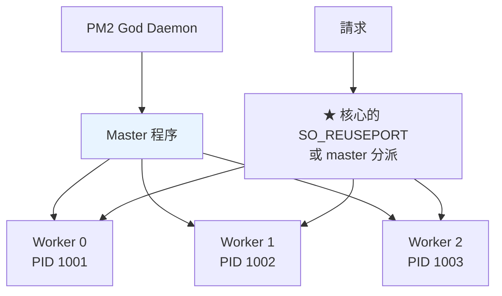

# PM2 進階設定與部署

> [!abstract] 這篇你會學到
> - 寫出一份完整的 **`ecosystem.config.cjs`**
> - 理解 **cluster 模式**的原理與限制（哪些應用不能用）
> - 實作真正的**零停機重載**（含 `wait_ready` 與 graceful shutdown）
> - 用**符號連結切版**做零停機部署
> - 設定**多環境**（staging / production）與**多應用**（web / worker）
> - 診斷 **cluster 模式特有的問題**（session、排程重複執行）

## 前置知識

- [[03-PM2-程序管理入門]] — PM2 基本操作與五個坑
- [[04-Nginx-反向代理與負載平衡]] — 反向代理

---

## `ecosystem.config.cjs` 完整範例

```javascript
// ═══════════ /var/www/app/ecosystem.config.cjs ═══════════
// ★ 用 .cjs 副檔名，避免 package.json 的 "type": "module" 造成解析錯誤

const path = require('path');
const APP_ROOT = '/var/www/app';

module.exports = {
  apps: [
    // ══════════════════ ① Web 伺服器（cluster）══════════════════
    {
      name: 'app-web',
      script: '.output/server/index.mjs',
      cwd: `${APP_ROOT}/current`,

      // ── 執行模式 ──
      exec_mode: 'cluster',           // ★ 才能零停機 reload
      instances: 2,                   // 數字 / 'max' / -1（= 核心數 - 1）

      // ── 環境變數 ──
      env: {
        NODE_ENV: 'production',
        HOST: '127.0.0.1',            // ★★ 只監聽本機
        PORT: 3000,
        NITRO_PORT: 3000,             // Nuxt/Nitro
      },
      env_staging: {                  // ★ pm2 start --env staging
        NODE_ENV: 'production',
        HOST: '127.0.0.1',
        PORT: 3100,
        API_BASE: 'https://staging-api.example.gov.tw',
      },

      // ── 記憶體與重啟 ──
      max_memory_restart: '600M',     // ★ 超過就重啟該 worker
      node_args: '--max-old-space-size=512',   // ★ 比 max_memory_restart 小

      autorestart: true,
      max_restarts: 10,               // ★ min_uptime 內最多重啟幾次
      min_uptime: '20s',              // ★ 存活超過這個時間才算「啟動成功」
      restart_delay: 3000,
      exp_backoff_restart_delay: 100, // ★ 指數退避（避免瘋狂重啟）

      // ── ★★ 零停機重載的關鍵 ──
      wait_ready: true,               // ★ 等待應用送出 process.send('ready')
      listen_timeout: 10000,          // 等待 ready 的逾時
      kill_timeout: 8000,             // ★ SIGINT 後等多久才 SIGKILL
      shutdown_with_message: false,

      // ── 日誌 ──
      out_file: `${APP_ROOT}/shared/logs/web-out.log`,
      error_file: `${APP_ROOT}/shared/logs/web-error.log`,
      merge_logs: true,               // ★ cluster 的所有 instance 寫同一個檔
      log_date_format: 'YYYY-MM-DD HH:mm:ss Z',
      time: true,

      // ── 其他 ──
      watch: false,                   // ★★ 正式環境必須 false
      autorestart: true,
      vizion: false,                  // ★ 關閉 git metadata 掃描（省資源）
      source_map_support: true,
      instance_var: 'INSTANCE_ID',    // ★ 每個 instance 的編號變數
    },

    // ══════════════════ ② 佇列 worker（fork）══════════════════
    {
      name: 'app-worker',
      script: 'worker.mjs',
      cwd: `${APP_ROOT}/current`,

      exec_mode: 'fork',              // ★ worker 通常不需要 cluster
      instances: 2,                   // fork 模式下也可以開多個

      env: {
        NODE_ENV: 'production',
        WORKER_CONCURRENCY: 5,
      },

      max_memory_restart: '400M',
      autorestart: true,
      min_uptime: '30s',
      max_restarts: 5,
      kill_timeout: 30000,            // ★ worker 需要更久來完成當前任務

      out_file: `${APP_ROOT}/shared/logs/worker-out.log`,
      error_file: `${APP_ROOT}/shared/logs/worker-error.log`,
      merge_logs: true,
      time: true,
      watch: false,
      vizion: false,
    },

    // ══════════════════ ③ 排程（★ 只跑一個 instance）══════════════════
    {
      name: 'app-scheduler',
      script: 'scheduler.mjs',
      cwd: `${APP_ROOT}/current`,

      exec_mode: 'fork',
      instances: 1,                   // ★★ 排程絕對只能有一個！

      env: { NODE_ENV: 'production' },

      // ★ 或用 cron_restart 讓 PM2 定時執行一次性任務
      // cron_restart: '0 3 * * *',
      // autorestart: false,

      max_memory_restart: '300M',
      min_uptime: '60s',
      out_file: `${APP_ROOT}/shared/logs/scheduler-out.log`,
      error_file: `${APP_ROOT}/shared/logs/scheduler-error.log`,
      merge_logs: true,
      time: true,
      watch: false,
      vizion: false,
    },
  ],
};
```

### 關鍵參數速解

| 參數 | 意義 | 建議 |
| --- | --- | --- |
| **`exec_mode`** | `fork` / `cluster` | **web 用 cluster，worker 用 fork** |
| **`instances`** | 幾個 instance | `2`～`max`；**排程必須 `1`** |
| **`wait_ready`** | 等應用送 `ready` 訊號 | **★ 零停機必備** |
| **`listen_timeout`** | 等 ready 的逾時 | 8000-15000 |
| **`kill_timeout`** | SIGINT 後多久 SIGKILL | **web 5-10s，worker 30s+** |
| **`max_memory_restart`** | 超過就重啟 | 依實際用量；**要大於 `--max-old-space-size`** |
| **`min_uptime`** | 存活多久算啟動成功 | 20-60s |
| **`max_restarts`** | 最多重啟幾次 | 5-10 |
| `exp_backoff_restart_delay` | 指數退避 | 100 |
| **`watch`** | 檔案變更自動重啟 | **★★ 正式環境 `false`** |
| `vizion` | 掃描 git metadata | **`false`（省資源）** |
| `merge_logs` | cluster 共用日誌檔 | `true` |

---

## Cluster 模式



```
原理：Node.js 內建的 cluster 模組
  · master 建立 listening socket
  · fork 出 N 個 worker，共用同一個 socket
  · 核心（或 master）把連線分派給 worker
    → ★ 每個 worker 是【獨立的程序，獨立的記憶體空間】
```

> [!danger] Cluster 模式下絕對不能做的三件事 ★★★
> **① 用程序內記憶體存 session 或狀態**
> ```javascript
> // ❌❌ 每個 worker 有自己的記憶體
> const sessions = new Map();
> app.post('/login', (req, res) => {
>     sessions.set(sid, user);        // ★ 存在 worker 0
> });
> app.get('/me', (req, res) => {
>     sessions.get(sid);              // ★★ 請求可能被分到 worker 1 → 找不到！
> });
>
> // ✅ 用外部儲存
> import Redis from 'ioredis';
> const redis = new Redis();
> await redis.set(`session:${sid}`, JSON.stringify(user), 'EX', 7200);
> ```
>
> **② 在每個 instance 中跑排程**
> ```javascript
> // ❌❌ 4 個 instance = 【每個排程執行 4 次】
> cron.schedule('0 3 * * *', () => sendDailyReport());
> //  → 使用者收到 4 封相同的郵件
> //  → 或資料被處理 4 次
>
> // ✅ 方法一：★ 排程獨立成一個 instances: 1 的應用
> // ✅ 方法二：只讓第一個 instance 執行
> if (process.env.NODE_APP_INSTANCE === '0') {
>     cron.schedule('0 3 * * *', () => sendDailyReport());
> }
> // ✅ 方法三：★ 用分散式鎖（多台伺服器時必須）
> const lock = await redis.set('cron:daily', process.pid, 'NX', 'EX', 300);
> if (lock) { await sendDailyReport(); }
> ```
>
> **③ 用記憶體做快取而不同步**
> ```javascript
> // ❌ 每個 worker 的快取不一致
> let configCache = null;
> // → worker 0 有舊的，worker 1 有新的 → 使用者看到的結果不一致
>
> // ✅ 用 Redis 或設定短 TTL 並容忍不一致
> ```

> [!warning] 哪些應用「不適合」cluster 模式
> ```
> ✗ WebSocket 伺服器（★ 除非用 Redis adapter 做跨程序廣播）
>    → socket.io 需要 @socket.io/redis-adapter
>
> ✗ 有狀態的長連線（SSE、gRPC streaming）
>
> ✗ 使用檔案鎖或本機 IPC 的應用
>
> ✗ 記憶體用量大的應用（N 個 instance = N 倍記憶體）
>
> ✗ 主要瓶頸是 I/O 而非 CPU 的應用
>    → Node 的 event loop 本來就很擅長處理 I/O
>    → cluster 的效益有限，反而多耗記憶體
> ```

```javascript
// ★ socket.io 在 cluster 模式下的正確設定
import { Server } from 'socket.io';
import { createAdapter } from '@socket.io/redis-adapter';
import { createClient } from 'redis';

const pubClient = createClient({ url: 'redis://127.0.0.1:6379' });
const subClient = pubClient.duplicate();
await Promise.all([pubClient.connect(), subClient.connect()]);

const io = new Server(httpServer);
io.adapter(createAdapter(pubClient, subClient));    // ★ 跨程序廣播
```

### `instances` 該設多少

```bash
# ★ 依 CPU 核心數與記憶體
$ nproc
4
$ free -m | awk '/^Mem:/{print $2" MB 總計，"$7" MB 可用"}'
8192 MB 總計，5432 MB 可用

# ★ 觀察單一 instance 的實際記憶體
$ pm2 jlist | jq -r '.[] | select(.name=="app-web") | "\(.monit.memory/1048576|floor) MB"'
185 MB
```

```
instances 的計算：

① CPU 密集的應用    → instances = 核心數（或 核心數 - 1）
② I/O 密集的應用    → instances = 2-4 就夠（Node 的 event loop 已很擅長 I/O）
③ 記憶體限制        → instances ≤ 可用記憶體 / 單一 instance 的記憶體

例：4 核心、5.4GB 可用、每 instance 185MB
   CPU 角度：4 個
   記憶體角度：5432 / 185 ≈ 29 個
   → ★ 取 CPU 的限制：instances = 4（或保守一點用 2-3）

★ 不要盲目用 'max' —— 8 核心 × 500MB = 4GB 記憶體
```

> [!tip] 實測才是唯一標準
> ```bash
> # ★ 分別測 1 / 2 / 4 個 instance
> $ for n in 1 2 4; do
>     pm2 delete app-web 2>/dev/null
>     pm2 start ecosystem.config.cjs --only app-web -i "$n"
>     sleep 10
>     echo "── instances=$n ──"
>     ab -n 5000 -c 50 -k http://127.0.0.1:3000/ 2>/dev/null | \
>       grep -E 'Requests per second|Time per request:.*mean\)'
>     pm2 jlist | jq -r "[.[] | select(.name==\"app-web\") | .monit.memory] |
>       add/1048576 | floor | \"記憶體共 \(.) MB\""
>   done
> ```
> **常見的結果**：I/O 密集的應用從 1 → 2 有明顯提升，
> 2 → 4 的提升很小，但記憶體翻倍。

---

## 零停機重載 ★★★

```
pm2 reload 的流程（cluster 模式）：

  ① 啟動一個【新的 worker】
    ② 等待它 ready（★ wait_ready + process.send('ready')）
      ③ 把它加入 load balancer
        ④ 對【舊的 worker】送出 SIGINT
          ⑤ 舊 worker 停止接受新請求，處理完手上的請求
            ⑥ 舊 worker 自己 exit（或 kill_timeout 後被 SIGKILL）
              ⑦ 重複 ①～⑥ 直到所有 worker 都換新
```

> [!danger] 沒有實作 graceful shutdown 的話 reload 不是零停機
> ```
> 應用沒有處理 SIGINT：
>   → PM2 送 SIGINT → 應用【立刻死掉】
>     → ★ 正在處理的請求【全部中斷】→ 使用者看到 502
>       → 「reload 了但還是有錯誤」
> ```

### 完整的 graceful shutdown 實作

```javascript
// ═══════════ server.mjs ═══════════
import http from 'node:http';
import express from 'express';

const app = express();
// ... 路由設定 ...

const server = http.createServer(app);

// ★ 追蹤所有連線（為了在關閉時能主動結束閒置連線）
const connections = new Set();
server.on('connection', (conn) => {
  connections.add(conn);
  conn.on('close', () => connections.delete(conn));
});

// ★ 健康狀態旗標
let isShuttingDown = false;

// ★ 健康檢查端點（關閉中要回傳失敗，讓 LB 停止導流）
app.get('/health', (req, res) => {
  if (isShuttingDown) {
    return res.status(503).json({ status: 'shutting_down' });
  }
  res.json({ status: 'ok', pid: process.pid, uptime: process.uptime() });
});

const PORT = Number(process.env.PORT) || 3000;
const HOST = process.env.HOST || '127.0.0.1';   // ★ 只監聽本機

server.listen(PORT, HOST, () => {
  console.log(`Server listening on ${HOST}:${PORT} (pid ${process.pid})`);

  // ★★ 通知 PM2「我準備好了」—— wait_ready: true 時必須
  if (process.send) {
    process.send('ready');
  }
});

// ═══════════ ★★ Graceful shutdown ═══════════
async function shutdown(signal) {
  if (isShuttingDown) return;
  isShuttingDown = true;
  console.log(`[${process.pid}] 收到 ${signal}，開始優雅關閉...`);

  // ① 停止接受新連線
  server.close(() => {
    console.log(`[${process.pid}] HTTP server 已關閉`);
  });

  // ② ★ 主動結束閒置的 keep-alive 連線
  //    （否則 server.close() 會一直等它們）
  for (const conn of connections) {
    // Node 18.2+ 有 closeIdleConnections
    if (typeof server.closeIdleConnections === 'function') break;
    conn.end();
  }
  if (typeof server.closeIdleConnections === 'function') {
    server.closeIdleConnections();
  }

  try {
    // ③ ★ 等待進行中的請求完成（最多 N 秒）
    await waitForConnections(5000);

    // ④ ★ 關閉外部資源
    await Promise.all([
      closeDatabase(),
      closeRedis(),
      flushLogs(),
    ]);

    console.log(`[${process.pid}] 優雅關閉完成`);
    process.exit(0);
  } catch (err) {
    console.error(`[${process.pid}] 關閉時發生錯誤:`, err);
    process.exit(1);
  }
}

function waitForConnections(timeoutMs) {
  return new Promise((resolve) => {
    const start = Date.now();
    const check = () => {
      if (connections.size === 0 || Date.now() - start > timeoutMs) {
        // ★ 逾時後強制結束剩餘連線
        for (const conn of connections) conn.destroy();
        return resolve();
      }
      setTimeout(check, 100);
    };
    check();
  });
}

// ★★ PM2 送的是 SIGINT（不是 SIGTERM）
process.on('SIGINT',  () => shutdown('SIGINT'));
process.on('SIGTERM', () => shutdown('SIGTERM'));    // systemd / Docker 送這個

// ★ PM2 的 shutdown_with_message: true 時
process.on('message', (msg) => {
  if (msg === 'shutdown') shutdown('message:shutdown');
});

// ★ 未捕捉的例外也要優雅關閉
process.on('uncaughtException', (err) => {
  console.error('未捕捉的例外:', err);
  shutdown('uncaughtException').finally(() => process.exit(1));
});
process.on('unhandledRejection', (reason) => {
  console.error('未處理的 Promise rejection:', reason);
});

// ── 資源關閉 ──
async function closeDatabase() {
  // await pool.end();
  console.log(`[${process.pid}] 資料庫連線已關閉`);
}
async function closeRedis() {
  // await redis.quit();
  console.log(`[${process.pid}] Redis 連線已關閉`);
}
async function flushLogs() {
  await new Promise((r) => setTimeout(r, 100));
}
```

> [!warning] PM2 送的是 SIGINT，systemd/Docker 送 SIGTERM
> ```
> PM2        → SIGINT   （★ 常被忽略）
> systemd    → SIGTERM
> Docker     → SIGTERM
> Kubernetes → SIGTERM
>
> ★ 兩個都要處理
> ```

### Nuxt / Nitro 的 graceful shutdown

```javascript
// ═══ Nuxt 3/4 的 Nitro plugin ═══
// server/plugins/graceful.ts
export default defineNitroPlugin((nitroApp) => {
  let isShuttingDown = false;

  // ★ 通知 PM2 已就緒
  nitroApp.hooks.hook('request', () => {}, );
  if (process.send) {
    // Nitro 啟動後送出（在 listen 之後）
    setTimeout(() => process.send?.('ready'), 100);
  }

  nitroApp.hooks.hook('close', async () => {
    console.log('Nitro 正在關閉...');
  });

  const shutdown = async (signal: string) => {
    if (isShuttingDown) return;
    isShuttingDown = true;
    console.log(`收到 ${signal}，關閉中...`);
    await nitroApp.hooks.callHook('close');
    process.exit(0);
  };

  process.on('SIGINT', () => shutdown('SIGINT'));
  process.on('SIGTERM', () => shutdown('SIGTERM'));
});
```

```javascript
// ★ 若不方便改應用，可以用 wait_ready: false（PM2 用 listen 事件判斷）
// ecosystem.config.cjs
{
  wait_ready: false,       // ★ 不等 ready 訊號
  listen_timeout: 8000,    // 等 8 秒後就視為啟動成功
  kill_timeout: 8000,      // ★ 給應用 8 秒優雅關閉
}
```

### 驗證零停機

```bash
#!/usr/bin/env bash
# 驗證 reload 是否真的零停機
URL="${1:-http://127.0.0.1:3000/health}"
APP="${2:-app-web}"

echo "═══ 零停機驗證 ═══"
echo "  持續請求 $URL，同時執行 pm2 reload $APP"
echo

TOTAL=0; FAIL=0
# 背景持續請求
(
  while [ ! -f /tmp/.stop-probe ]; do
      C=$(curl -s -o /dev/null -w '%{http_code}' -m 2 "$URL" 2>/dev/null)
      echo "$C" >> /tmp/probe.log
      sleep 0.05
  done
) &
PROBE=$!

rm -f /tmp/probe.log /tmp/.stop-probe
sleep 2
echo "  ── 執行 reload ──"
time pm2 reload "$APP"
sleep 3

touch /tmp/.stop-probe
wait $PROBE 2>/dev/null

TOTAL=$(wc -l < /tmp/probe.log)
OK=$(grep -c '^200$' /tmp/probe.log)
FAIL=$((TOTAL - OK))

echo
echo "  總請求：$TOTAL"
echo "  成功  ：$OK"
echo "  失敗  ：$FAIL"
if [ "$FAIL" -eq 0 ]; then
    echo "  ✓✓ 【零停機】"
else
    echo "  ✗✗ 有 $FAIL 個請求失敗"
    echo "  失敗的狀態碼："
    grep -v '^200$' /tmp/probe.log | sort | uniq -c | sed 's/^/    /'
    echo
    echo "  ★ 檢查清單："
    echo "    □ exec_mode 是 'cluster' 嗎？"
    echo "    □ instances 至少 2 個嗎？"
    echo "    □ 應用有處理 SIGINT 嗎？"
    echo "    □ wait_ready: true 時，應用有送 process.send('ready') 嗎？"
    echo "    □ kill_timeout 夠長嗎？"
fi
rm -f /tmp/probe.log /tmp/.stop-probe
```

---

## 零停機部署

```bash
#!/usr/bin/env bash
# /usr/local/bin/deploy-node —— Node 應用的零停機部署
set -euo pipefail

APP_NAME="${1:-app-web}"
BRANCH="${2:-main}"
APP_ROOT=/var/www/app
REPO=https://github.com/gov-org/myapp.git
KEEP=5
TS=$(date +%Y%m%d-%H%M%S)
REL="$APP_ROOT/releases/$TS"

log() { printf '\033[36m[%s]\033[0m %s\n' "$(date +%T)" "$*"; }
fail() { printf '\033[31m[錯誤]\033[0m %s\n' "$*"; exit 1; }

log "═══ 部署開始：$APP_NAME ($BRANCH) ═══"

# ══ 【1】取得程式碼 ══
log "取得程式碼..."
git clone --depth 1 --branch "$BRANCH" "$REPO" "$REL" || fail "git clone 失敗"
cd "$REL"
COMMIT=$(git rev-parse --short HEAD)
echo "$COMMIT" > "$REL/VERSION"
log "  commit: $COMMIT"

# ══ 【2】連結共享資源 ══
log "連結共享資源..."
ln -sfn "$APP_ROOT/shared/.env" "$REL/.env"
mkdir -p "$REL/.output" 2>/dev/null || true
for d in storage uploads; do
    [ -d "$APP_ROOT/shared/$d" ] && { rm -rf "$REL/$d"; ln -sfn "$APP_ROOT/shared/$d" "$REL/$d"; }
done

# ══ 【3】安裝相依 ══
log "安裝相依套件..."
if [ -f pnpm-lock.yaml ]; then
    pnpm install --frozen-lockfile --ignore-scripts || fail "pnpm install 失敗"
elif [ -f package-lock.json ]; then
    npm ci --ignore-scripts || fail "npm ci 失敗"
else
    fail "找不到 lock 檔"
fi

# ★ 只對信任的原生模組重建
for p in bcrypt sharp better-sqlite3 esbuild @swc/core; do
    [ -d "node_modules/$p" ] && { log "  重建 $p"; npm rebuild "$p" >/dev/null 2>&1 || true; }
done

# ══ 【4】建置 ══
log "建置..."
NODE_ENV=production npm run build || fail "建置失敗"

# ★ 驗證建置產物存在
[ -d "$REL/.output/server" ] || [ -d "$REL/dist" ] || fail "找不到建置產物"

# ══ 【5】★ 移除建置相依（Nuxt/Nitro 的 .output 已自帶所需）══
if [ -d "$REL/.output" ]; then
    log "移除 node_modules（.output 已自帶相依）..."
    SIZE=$(du -sh node_modules 2>/dev/null | cut -f1)
    rm -rf node_modules
    log "  釋放 $SIZE"
fi

# ══ 【6】資料庫遷移（若有）══
if [ -f "$REL/package.json" ] && jq -e '.scripts.migrate' "$REL/package.json" >/dev/null 2>&1; then
    log "執行資料庫遷移..."
    npm run migrate || fail "遷移失敗"
fi

# ══ 【7】★★ 先啟動新版本測試（不影響現有服務）══
log "啟動新版本進行煙霧測試..."
TEST_PORT=$((3000 + RANDOM % 1000))
(cd "$REL" && HOST=127.0.0.1 PORT="$TEST_PORT" NODE_ENV=production \
    node .output/server/index.mjs > /tmp/smoke-$TS.log 2>&1 &
 echo $! > /tmp/smoke-$TS.pid)

SMOKE_OK=0
for i in $(seq 1 30); do
    if curl -sf -m 2 "http://127.0.0.1:$TEST_PORT/health" >/dev/null 2>&1; then
        SMOKE_OK=1; break
    fi
    sleep 1
done
kill "$(cat /tmp/smoke-$TS.pid)" 2>/dev/null || true
rm -f /tmp/smoke-$TS.pid

if [ "$SMOKE_OK" -ne 1 ]; then
    log "  ✗ 煙霧測試失敗，日誌："
    tail -30 /tmp/smoke-$TS.log | sed 's/^/    /'
    rm -rf "$REL"
    fail "新版本無法啟動，已中止部署（現有服務不受影響）"
fi
log "  ✓ 煙霧測試通過"
rm -f /tmp/smoke-$TS.log

# ══ 【8】★★ 原子性切換符號連結 ══
log "切換到新版本..."
PREV=$(readlink -f "$APP_ROOT/current" 2>/dev/null || echo "")
ln -sfn "$REL" "$APP_ROOT/current.tmp"
mv -Tf "$APP_ROOT/current.tmp" "$APP_ROOT/current"    # ★ mv -T 是原子操作
log "  current -> $REL"

# ══ 【9】★★ 零停機重載 ══
log "重載應用..."
pm2 reload "$APP_ROOT/ecosystem.config.cjs" --update-env || fail "reload 失敗"
pm2 save

# ══ 【10】★ 驗證新版本真的生效 ══
log "驗證..."
sleep 5
ACTUAL=$(curl -s -m 5 http://127.0.0.1:3000/version 2>/dev/null | \
         grep -oP '"commit"\s*:\s*"\K[^"]+' || echo "?")
if [ "$ACTUAL" = "$COMMIT" ]; then
    log "  ✓ 版本一致：$ACTUAL"
else
    log "  ✗ 版本不符（預期 $COMMIT，實際 $ACTUAL）"
    if [ -n "$PREV" ]; then
        log "  ★ 自動回退到 $PREV"
        ln -sfn "$PREV" "$APP_ROOT/current.tmp"
        mv -Tf "$APP_ROOT/current.tmp" "$APP_ROOT/current"
        pm2 reload "$APP_ROOT/ecosystem.config.cjs" --update-env
        pm2 save
    fi
    fail "部署驗證失敗，已回退"
fi

# ══ 【11】健康檢查 ══
for i in 1 2 3; do
    C=$(curl -s -o /dev/null -w '%{http_code}' -m 5 http://127.0.0.1:3000/health)
    [ "$C" = "200" ] || fail "健康檢查失敗（$C）"
done
log "  ✓ 健康檢查通過"

# ══ 【12】清理舊版本 ══
log "清理舊版本（保留最近 $KEEP 個）..."
ls -1dt "$APP_ROOT"/releases/*/ 2>/dev/null | tail -n +$((KEEP+1)) | \
  while read -r d; do log "  刪除 $d"; rm -rf "$d"; done

# ══ 【13】狀態 ══
log "═══ 部署完成 ═══"
pm2 list
echo
log "版本：$COMMIT"
log "路徑：$REL"
log "回退：ln -sfn $PREV $APP_ROOT/current && pm2 reload $APP_ROOT/ecosystem.config.cjs"
```

### 快速回退腳本

```bash
#!/usr/bin/env bash
# /usr/local/bin/rollback-node —— 回退到上一版
set -euo pipefail
APP_ROOT=/var/www/app

CURRENT=$(readlink -f "$APP_ROOT/current")
echo "目前版本：$CURRENT"
echo
echo "可用的版本："
ls -1dt "$APP_ROOT"/releases/*/ | head -10 | nl -w2 -s') '

read -rp "回退到第幾個？（1 = 上一版，Enter 取消）" N
[ -z "$N" ] && { echo "已取消"; exit 0; }

TARGET=$(ls -1dt "$APP_ROOT"/releases/*/ | sed -n "$((N+0))p")
[ -d "$TARGET" ] || { echo "✗ 無效的選擇"; exit 1; }

echo "回退到：$TARGET"
read -rp "確認？(yes/no) " C
[ "$C" = "yes" ] || { echo "已取消"; exit 0; }

ln -sfn "$TARGET" "$APP_ROOT/current.tmp"
mv -Tf "$APP_ROOT/current.tmp" "$APP_ROOT/current"
pm2 reload "$APP_ROOT/ecosystem.config.cjs" --update-env
pm2 save

sleep 5
echo "版本：$(curl -s http://127.0.0.1:3000/version | grep -oP '"commit"\s*:\s*"\K[^"]+')"
pm2 list
```

> [!tip] `mv -Tf` 是原子操作
> ```bash
> # ❌ 非原子：有短暫的空窗期
> $ rm current && ln -s new current
>
> # ✅ 原子：符號連結的切換是一個 rename() 系統呼叫
> $ ln -sfn "$NEW" current.tmp
> $ mv -Tf current.tmp current
> ```
> **`mv -T` 的 `-T` 表示「把目標當成一般檔案而非目錄」** ——
> 沒有它，`mv current.tmp current` 會把連結**移到 current 目錄裡面**。

---

## 多環境與多應用

```bash
# ═══ 用 --env 切換環境 ═══
$ pm2 start ecosystem.config.cjs --env staging
$ pm2 reload ecosystem.config.cjs --env production --update-env

# ═══ 只操作特定應用 ═══
$ pm2 start ecosystem.config.cjs --only app-web
$ pm2 reload app-web
$ pm2 restart app-worker
$ pm2 stop app-scheduler

# ═══ 多個 ecosystem 檔案 ═══
$ pm2 start /var/www/app/ecosystem.config.cjs
$ pm2 start /var/www/api/ecosystem.config.cjs
$ pm2 save
```

```javascript
// ═══ 依環境的完整設定 ═══
const isProd = process.env.DEPLOY_ENV === 'production';

module.exports = {
  apps: [{
    name: `app-web-${process.env.DEPLOY_ENV || 'production'}`,
    script: '.output/server/index.mjs',
    cwd: isProd ? '/var/www/app/current' : '/var/www/app-staging/current',
    exec_mode: 'cluster',
    instances: isProd ? 4 : 1,
    max_memory_restart: isProd ? '600M' : '300M',
    env: {
      NODE_ENV: 'production',
      HOST: '127.0.0.1',
      PORT: isProd ? 3000 : 3100,
    },
    watch: false,
    vizion: false,
  }],
};
```

> [!warning] `--update-env` 不加的話環境變數不會更新
> ```bash
> # ❌ 改了 ecosystem 的 env 但沒生效
> $ pm2 reload app-web
>
> # ✅
> $ pm2 reload app-web --update-env
> $ pm2 reload ecosystem.config.cjs --update-env
> ```
> **PM2 會快取程序啟動時的環境變數**，
> `--update-env` 才會重新讀取。

---

## Cluster 特有的問題診斷

```bash
#!/usr/bin/env bash
# Cluster 模式的問題檢查
echo "═══ Cluster 模式檢查 ═══"

echo -e "\n【1】各應用的模式與 instance 數"
pm2 jlist | jq -r '.[] |
  "  \(.name)  mode=\(.pm2_env.exec_mode)  instances=\(.pm2_env.instances // 1)  \
pid=\(.pid)  記憶體=\((.monit.memory/1048576)|floor)MB"'

echo -e "\n【2】★★ 排程應用是否只有一個 instance"
pm2 jlist | jq -r '.[] |
  select(.name | test("sched|cron|worker"; "i")) |
  select((.pm2_env.instances // 1) > 1) |
  "  ⚠⚠ \(.name) 有 \(.pm2_env.instances) 個 instance【排程會重複執行！】"' \
  || echo "  ✓ 沒有問題"

echo -e "\n【3】★ Session 儲存方式"
if grep -rqE 'MemoryStore|new session\.MemoryStore' /var/www/app/current/*.{js,mjs,ts} 2>/dev/null; then
    echo "  ⚠⚠ 發現 MemoryStore【cluster 模式下 session 會遺失】"
else
    echo "  ○ 未發現 MemoryStore（請人工確認 session 存在 Redis 或資料庫）"
fi
grep -rlE 'connect-redis|ioredis|RedisStore' /var/www/app/current/package.json 2>/dev/null \
  && echo "  ✓ 有使用 Redis"

echo -e "\n【4】★ WebSocket 的跨程序廣播"
if grep -rq 'socket.io' /var/www/app/current/package.json 2>/dev/null; then
    grep -rq '@socket.io/redis-adapter' /var/www/app/current/package.json 2>/dev/null \
      && echo "  ✓ 有 redis-adapter" \
      || echo "  ⚠⚠ 用了 socket.io 但沒有 redis-adapter【cluster 下廣播會失效】"
else
    echo "  ○ 未使用 socket.io"
fi

echo -e "\n【5】★ 各 instance 的記憶體是否平均"
pm2 jlist | jq -r 'group_by(.name)[] |
  { name: .[0].name,
    mems: [.[] | (.monit.memory/1048576)|floor] } |
  select(.mems | length > 1) |
  "  \(.name): \(.mems | join(", ")) MB  \
\(if (.mems | max) > (.mems | min) * 2 then "⚠ 差異過大（可能有記憶體洩漏）" else "✓" end)"'

echo -e "\n【6】★ 各 instance 的重啟次數"
pm2 jlist | jq -r '.[] | select(.pm2_env.restart_time > 5) |
  "  ⚠ \(.name) [\(.pm2_env.NODE_APP_INSTANCE // 0)] 重啟 \(.pm2_env.restart_time) 次"' \
  || echo "  ✓ 正常"

echo -e "\n【7】零停機設定"
CONF=/var/www/app/ecosystem.config.cjs
if [ -f "$CONF" ]; then
    grep -q "exec_mode.*cluster" "$CONF" && echo "  ✓ exec_mode: cluster" \
      || echo "  ⚠ 不是 cluster 模式【reload 不會零停機】"
    grep -q "wait_ready.*true" "$CONF" && echo "  ✓ wait_ready: true" \
      || echo "  ○ wait_ready 未啟用（用 listen 事件判斷）"
    grep -q "kill_timeout" "$CONF" && echo "  ✓ 有設 kill_timeout：$(grep -oP 'kill_timeout:\s*\K\d+' "$CONF" | head -1) ms" \
      || echo "  ⚠ 未設 kill_timeout（預設 1600ms 可能太短）"
    grep -q "watch:\s*false" "$CONF" && echo "  ✓ watch: false" \
      || echo "  ⚠⚠ 檢查 watch 是否為 false"
fi

echo -e "\n【8】★ 應用是否處理 SIGINT"
grep -rq "process.on.*SIGINT" /var/www/app/current/ 2>/dev/null \
  && echo "  ✓ 有處理 SIGINT" \
  || echo "  ⚠⚠ 【沒有處理 SIGINT】→ reload 時請求會被中斷"

echo -e "\n【9】★ 是否送出 ready 訊號"
grep -rq "process.send.*ready" /var/www/app/current/ 2>/dev/null \
  && echo "  ✓ 有送 ready" \
  || echo "  ○ 沒有送 ready（wait_ready 必須設 false）"
```

---

## 常見錯誤與排錯

| 現象／問題 | 原因 | 解法 |
| --- | --- | --- |
| **`pm2 reload` 仍有請求失敗** ★★ | 應用沒處理 SIGINT | **實作 graceful shutdown** |
| **reload 沒有零停機效果** ★ | **fork 模式** | `exec_mode: 'cluster'` + `instances >= 2` |
| **reload 後應用起不來（卡住）** | `wait_ready: true` 但沒送 ready | 應用加 `process.send('ready')`；或 `wait_ready: false` |
| **cluster 下 session 遺失** ★★ | 用了記憶體型 session | **改用 Redis / 資料庫** |
| **排程重複執行 N 次** ★★★ | 每個 instance 都在跑排程 | **排程獨立成 `instances: 1` 的應用**；或用分散式鎖 |
| **WebSocket 廣播只有部分使用者收到** ★★ | cluster 下各 worker 獨立 | **`@socket.io/redis-adapter`** |
| 記憶體用量是預期的 N 倍 | N 個 instance | 減少 `instances`；或降低單一 instance 的用量 |
| **`--update-env` 沒加，環境變數沒更新** ★ | PM2 快取了舊 env | `pm2 reload xxx --update-env` |
| 某個 instance 記憶體特別高 | 記憶體洩漏 | `max_memory_restart`；找出洩漏 |
| **部署後還是舊版** | 符號連結沒切 / PM2 沒 reload | 驗證 `/version` 端點 |
| **部署到一半失敗，服務中斷** ★ | 沒有先做煙霧測試 | **先用臨時 port 測試新版再切換** |
| `kill_timeout` 太短 | 預設 1600ms | web 設 5-10s，worker 設 30s+ |
| **`max_memory_restart` 沒生效** | 值比 `--max-old-space-size` 小 | `max_memory_restart` 要**大於** heap 上限 |
| cluster 下讀不到 `process.env.PORT` | 每個 instance 應該用同一個 port | cluster 會共用 socket，這是正常的 |

### 排查零停機失敗

```bash
# 【1】確認模式
$ pm2 jlist | jq -r '.[] | "\(.name): \(.pm2_env.exec_mode), \(.pm2_env.instances // 1) instances"'
app-web: cluster_mode, 2 instances      # ★ 必須是 cluster 且 >= 2

# 【2】確認應用處理 SIGINT
$ grep -rn "SIGINT" /var/www/app/current/*.mjs

# 【3】觀察 reload 的過程
$ pm2 logs app-web --lines 0 &
$ pm2 reload app-web
# ★ 應該看到：新 worker 啟動 → ready → 舊 worker 收到 SIGINT → 優雅關閉

# 【4】測量實際的中斷
$ ./verify-zero-downtime.sh http://127.0.0.1:3000/health app-web

# 【5】檢查 kill_timeout
$ pm2 describe app-web | grep -i 'kill timeout'

# 【6】手動測試 graceful shutdown
$ PID=$(pm2 jlist | jq -r '.[] | select(.name=="app-web") | .pid' | head -1)
$ kill -INT "$PID"
$ # ★ 觀察日誌：應該看到「開始優雅關閉」而不是立刻消失
```

---

## 安全性注意事項

> [!danger] 部署腳本的安全
> ```
> 部署腳本通常有：
>   · git 憑證（deploy key / token）
>   · 資料庫連線資訊
>   · sudo 權限
>
> ★ 若部署腳本或其憑證洩漏 → 攻擊者可以部署任意程式碼
> ```
>
> **五個原則**：
> ```
> ① ★ 用【唯讀】的 deploy key（不是個人的 SSH 金鑰）
> ② ★ 部署使用者不要有完整的 sudo（只給必要的指令）
> ③ ★ .env 不在 git 中，放在 shared/ 且權限 400
> ④ ★ 部署腳本本身要進版本控制並 code review
> ⑤ ★ 記錄每次部署（誰、何時、哪個 commit）
> ```
>
> ```bash
> # ★ 限制部署使用者的 sudo
> $ sudo visudo -f /etc/sudoers.d/deploy
> deploy ALL=(root) NOPASSWD: /bin/systemctl reload nginx
> deploy ALL=(root) NOPASSWD: /bin/systemctl reload php8.3-fpm
> deploy ALL=(nodeapp) NOPASSWD: /usr/bin/pm2
> ```

> [!warning] 舊版本目錄也要保護
> ```bash
> $ ls /var/www/app/releases/
> 20260820-100000/    # ★ 舊版本仍然在磁碟上
> 20260825-140000/
> 20260828-090000/
> ```
> **問題**：
> - 舊版本可能有**已修補的漏洞**
> - 若 Nginx 的設定錯誤，可能被直接存取
> - **舊版本的 `.env` 符號連結指向同一個檔案**
>
> ```bash
> # ★ 確認 web root 只指向 current
> $ sudo nginx -T | grep -E 'root|alias' | grep releases
> # 應該沒有輸出（都應該用 current）
>
> # ★ 從外部驗證
> $ curl -sk -o /dev/null -w '%{http_code}\n' \
>     https://網站/releases/20260820-100000/.env
> 404      # 必須
>
> # ★ 定期清理
> $ ls -1dt /var/www/app/releases/*/ | tail -n +6 | xargs -r rm -rf
> ```

> [!tip] 部署記錄
> ```bash
> # ★ 每次部署記錄到檔案
> $ cat >> /var/log/deploy.log <<EOF
> $(date -Is) | $(whoami) | $APP_NAME | $COMMIT | $BRANCH | $REL
> EOF
>
> # ★ 或用 git tag 標記部署
> $ git tag -a "deploy-$(date +%Y%m%d-%H%M%S)" -m "Deployed to production by $(whoami)"
> $ git push origin --tags
> ```
> **這在事故調查時極為重要** ——
> 「網站什麼時候開始出問題的？那時候部署了什麼？」

---

## 速查表

### ecosystem 關鍵設定

```javascript
module.exports = { apps: [{
  name: 'app-web',
  script: '.output/server/index.mjs',
  cwd: '/var/www/app/current',

  exec_mode: 'cluster',            // ★★ 零停機的前提
  instances: 2,                    // ★ 排程必須是 1

  env: { NODE_ENV:'production', HOST:'127.0.0.1', PORT:3000 },

  wait_ready: true,                // ★★ 等 process.send('ready')
  listen_timeout: 10000,
  kill_timeout: 8000,              // ★ web 5-10s；worker 30s+

  max_memory_restart: '600M',      // ★ 要大於 --max-old-space-size
  node_args: '--max-old-space-size=512',
  autorestart: true,
  max_restarts: 10,
  min_uptime: '20s',
  exp_backoff_restart_delay: 100,

  merge_logs: true,
  watch: false,                    // ★★ 正式環境必須
  vizion: false,                   // 省資源
}]};
```

### Cluster 三大禁忌 ★★★

```
① ❌ 用程序內記憶體存 session   → ✅ Redis
② ❌ 每個 instance 都跑排程     → ✅ instances:1 的獨立應用；或分散式鎖
③ ❌ 記憶體快取不同步           → ✅ Redis；或容忍短暫不一致

不適合 cluster：WebSocket（除非用 redis-adapter）· 長連線 · 記憶體吃重 · 純 I/O
```

```javascript
// ★ 只讓第一個 instance 跑排程
if (process.env.NODE_APP_INSTANCE === '0') { cron.schedule(...); }

// ★ 分散式鎖（多台伺服器時必須）
const lock = await redis.set('cron:daily', process.pid, 'NX', 'EX', 300);
if (lock) { await job(); }
```

### Graceful shutdown ★★

```javascript
let isShuttingDown = false;
const connections = new Set();
server.on('connection', c => { connections.add(c); c.on('close', () => connections.delete(c)); });

server.listen(PORT, HOST, () => {
  if (process.send) process.send('ready');       // ★★ wait_ready 必須
});

async function shutdown(sig) {
  if (isShuttingDown) return; isShuttingDown = true;
  server.close();                                 // ① 停止接受新連線
  server.closeIdleConnections?.();                // ② 結束閒置的 keep-alive
  await waitForConnections(5000);                 // ③ 等進行中的請求
  await Promise.all([closeDb(), closeRedis()]);   // ④ 關閉資源
  process.exit(0);
}
process.on('SIGINT',  () => shutdown('SIGINT'));  // ★★ PM2 送這個
process.on('SIGTERM', () => shutdown('SIGTERM')); // systemd/Docker 送這個
```

### 零停機部署流程

```
① git clone 到 releases/時間戳
② 連結 shared/（.env、storage）
③ npm ci --ignore-scripts + rebuild 信任的原生模組
④ npm run build
⑤ ★★ 用臨時 port 做煙霧測試（失敗就中止，現有服務不受影響）
⑥ ★★ ln -sfn + mv -Tf 原子切換 current
⑦ pm2 reload ecosystem.config.cjs --update-env
⑧ ★ 驗證 /version 的 commit hash 是否一致（不符就自動回退）
⑨ 健康檢查
⑩ 清理舊版本（保留 5 個）
```

```bash
# ★ 原子切換
ln -sfn "$NEW" current.tmp && mv -Tf current.tmp current

# ★ 回退（秒級）
ln -sfn "$PREV" current.tmp && mv -Tf current.tmp current
pm2 reload ecosystem.config.cjs --update-env
```

### 驗證零停機

```bash
# 持續請求 + reload，計算失敗數
while true; do curl -s -o /dev/null -w '%{http_code}\n' localhost:3000/health; sleep 0.05; done > /tmp/p.log &
pm2 reload app-web
grep -vc '^200$' /tmp/p.log        # ★ 應為 0
```

```
失敗時的檢查清單：
□ exec_mode 是 cluster？
□ instances >= 2？
□ 應用有處理 SIGINT？
□ wait_ready:true 時有送 process.send('ready')？
□ kill_timeout 夠長？
```

### 常用指令

```bash
pm2 start ecosystem.config.cjs --env staging
pm2 reload ecosystem.config.cjs --update-env    # ★ --update-env 不能少
pm2 reload app-web
pm2 start ecosystem.config.cjs --only app-web
pm2 save                                         # ★ 每次改動後
pm2 jlist | jq -r '.[] | "\(.name) \(.pm2_env.exec_mode) \(.pm2_env.restart_time)"'
```

---

## 練習題

> [!question]- 練習 1：驗證零停機
> 1. 用 `exec_mode: 'fork'` 啟動應用，執行零停機驗證腳本
>    → **失敗了幾個請求？**
> 2. 改成 `cluster` + `instances: 2`，重測
> 3. **應用中不處理 SIGINT**，重測 → 還是有失敗嗎？
> 4. 加上完整的 graceful shutdown，重測
> 5. 加上 `wait_ready: true` + `process.send('ready')`，重測
> 6. **記錄每一步的失敗數，找出「哪一項最關鍵」**

> [!question]- 練習 2：Cluster 的三大禁忌
> 1. 寫一個用 `Map` 存 session 的應用，`instances: 4`
> 2. 登入後重複請求 `/me` → **有時候找不到 session 嗎？**
> 3. 改用 Redis，重測
> 4. 在應用中加一個「每分鐘寫一行日誌」的排程
> 5. `instances: 4` 下觀察日誌 → **一分鐘寫了幾行？**
> 6. 用 `NODE_APP_INSTANCE === '0'` 限制，重測
> 7. 改用 Redis 分散式鎖，**模擬兩台伺服器**再測

> [!question]- 練習 3：instances 的最佳值
> 1. `nproc` 與 `free -m` 記錄機器規格
> 2. 分別用 `instances: 1 / 2 / 4 / max` 壓測
> 3. 記錄每個的 **QPS、P95 延遲、總記憶體**
> 4. **畫出「instances vs QPS」與「instances vs 記憶體」**
> 5. **找出你的應用的最佳值**
> 6. 這個應用是 CPU 密集還是 I/O 密集？從結果看得出來嗎？

> [!question]- 練習 4：完整部署演練
> 1. 建立完整的部署目錄結構
> 2. 執行部署腳本部署 v1
> 3. 修改程式碼並部署 v2
> 4. **在部署過程中持續請求，計算失敗數**
> 5. **故意讓 v3 無法啟動**（例如語法錯誤）
>    → 煙霧測試有攔下來嗎？現有服務受影響嗎？
> 6. 執行回退腳本回到 v1
> 7. **記錄整個流程的中斷時間**

> [!question]- 練習 5：記憶體限制與重啟
> 1. 寫一個會持續累積記憶體的應用（模擬洩漏）
> 2. 設定 `max_memory_restart: '200M'`
> 3. 觀察 → **達到限制時發生什麼事？**
> 4. `pm2 list` 的重啟次數如何變化？
> 5. **在 cluster 模式下，是「整個應用重啟」還是「單一 worker 重啟」？**
> 6. 使用者會感受到中斷嗎？
> 7. 加上 `node_args: '--max-old-space-size=150'`（比 max_memory_restart 小）
>    → 行為有什麼不同？

---

## 小測驗

Q1. **`exec_mode: 'cluster'` 的原理是什麼？與 `fork` 的關鍵差異**？

Q2. **Cluster 模式下絕對不能做的三件事是什麼**？

Q3. **哪些應用不適合 cluster 模式**？

Q4. **`pm2 reload` 的完整流程是什麼？零停機的三個前提**？

Q5. **PM2 送的是哪個訊號？systemd 與 Docker 呢**？

Q6. **完整的 graceful shutdown 有哪四個步驟**？

Q7. **`wait_ready: true` 需要應用做什麼？不做會怎樣**？

Q8. **零停機部署中，為什麼要「先用臨時 port 做煙霧測試」**？

Q9. **`mv -Tf` 相對於 `rm && ln -s` 的優勢是什麼？`-T` 是什麼意思**？

Q10. **`--update-env` 不加會怎樣？`max_memory_restart` 與 `--max-old-space-size` 的關係**？

> [!question]- 測驗答案
> **Q1.** **`cluster` 使用 Node.js 內建的 cluster 模組**：
> master 程序建立 listening socket，然後 **fork 出 N 個 worker 程序共用同一個 socket**，
> 由核心（`SO_REUSEPORT`）或 master 把連線分派給各 worker。
> **關鍵差異**：
> **`fork` 模式下每個 instance 是完全獨立的程序，各自綁自己的 port**
> （所以多個 instance 需要不同的 port）；
> **`cluster` 模式下所有 worker 共用同一個 port**，
> 而且 **PM2 可以「逐一替換 worker」達成零停機 reload** ——
> 這是 `fork` 模式做不到的（fork 下 `reload` 等同 `restart`）。
> 但兩者的 **worker 都是獨立的程序，記憶體不共享**。
>
> **Q2.** ①**用程序內記憶體存 session 或狀態** ——
> 請求可能被分派到不同的 worker，**在 worker 0 存的 session，worker 1 找不到**；
> 必須用 Redis 或資料庫。
> ②**在每個 instance 中跑排程** ——
> 4 個 instance 就會**執行 4 次**（使用者收到 4 封相同的郵件、資料被處理 4 次）；
> 要把排程獨立成 `instances: 1` 的應用，或用 `NODE_APP_INSTANCE === '0'` 限制，
> 或用 Redis 分散式鎖（多台伺服器時必須）。
> ③**用記憶體做快取而不同步** ——
> 各 worker 的快取不一致，使用者看到的結果會隨機不同。
>
> **Q3.** ①**WebSocket 伺服器** ——
> 各 worker 的連線是獨立的，**廣播只會送到同一個 worker 的連線**；
> 除非用 `@socket.io/redis-adapter` 做跨程序廣播。
> ②**有狀態的長連線**（SSE、gRPC streaming）—— 同理。
> ③**使用檔案鎖或本機 IPC 的應用**。
> ④**記憶體用量大的應用** —— N 個 instance = N 倍記憶體。
> ⑤**主要瓶頸是 I/O 而非 CPU 的應用** ——
> Node 的 event loop 本來就很擅長處理並行 I/O，
> cluster 的效益有限但記憶體翻倍。
>
> **Q4.** **流程**：
> ①啟動一個**新的 worker** → ②**等待它 ready** →
> ③把它加入負載平衡 → ④對**舊 worker 送出 SIGINT** →
> ⑤舊 worker 停止接受新請求、處理完手上的 →
> ⑥舊 worker 自行 exit（或 `kill_timeout` 後被 SIGKILL）→ ⑦重複直到全部換新。
> **零停機的三個前提**：
> ①**`exec_mode: 'cluster'` 且 `instances >= 2`**；
> ②**應用實作了 graceful shutdown（處理 SIGINT）**；
> ③**`kill_timeout` 夠長**（讓進行中的請求有時間完成）。
> 加上 `wait_ready: true` + `process.send('ready')` 更可靠。
>
> **Q5.** **PM2 送的是 `SIGINT`**（★ 這點常被忽略，很多教學只處理 SIGTERM）；
> **systemd、Docker、Kubernetes 送的是 `SIGTERM`**。
> **兩個都要處理**：
> ```javascript
> process.on('SIGINT',  () => shutdown('SIGINT'));
> process.on('SIGTERM', () => shutdown('SIGTERM'));
> ```
> 若 PM2 設定了 `shutdown_with_message: true`，
> 還要處理 `process.on('message', msg => { if (msg === 'shutdown') ... })`。
>
> **Q6.** ①**停止接受新連線**（`server.close()`）；
> ②**★ 主動結束閒置的 keep-alive 連線**
> （`server.closeIdleConnections()` 或遍歷連線集合 `conn.end()`）——
> **沒有這步 `server.close()` 會一直等到所有 keep-alive 逾時**；
> ③**等待進行中的請求完成**（設一個上限，逾時就 `conn.destroy()`）；
> ④**關閉外部資源**（資料庫連線池、Redis、flush 日誌）後 `process.exit(0)`。
> 另外要有一個 `isShuttingDown` 旗標，
> 讓 `/health` 端點在關閉中回 503，使負載平衡器停止導流。
>
> **Q7.** **`wait_ready: true` 時，PM2 會等待應用主動送出 `process.send('ready')`
> 才認為它啟動完成**，然後才把流量導給它、才去關閉舊的 worker。
> **應用必須在真正可以服務請求時（通常是 `server.listen` 的 callback 中）送出**：
> ```javascript
> server.listen(PORT, HOST, () => {
>   if (process.send) process.send('ready');
> });
> ```
> **不做會怎樣**：PM2 一直等不到 ready 訊號，
> **等到 `listen_timeout` 逾時後才繼續**（預設 3000ms，reload 會變很慢），
> 某些版本甚至會判定啟動失敗而不斷重試，**應用看起來「卡住」**。
> 若不方便改應用，就設 `wait_ready: false`（改用 listen 事件判斷）。
>
> **Q8.** 因為**如果直接切換符號連結再 reload，而新版本有問題
> （語法錯誤、缺少相依、設定錯誤），服務就當場中斷了** ——
> 而且此時**舊版本已經被切走**，要回退還要再做一次操作，中斷時間更長。
> **先用臨時 port 啟動新版本做煙霧測試**：
> ```bash
> TEST_PORT=$((3000 + RANDOM % 1000))
> (cd "$REL" && PORT=$TEST_PORT node .output/server/index.mjs &)
> curl -sf "http://127.0.0.1:$TEST_PORT/health" || { rm -rf "$REL"; exit 1; }
> ```
> **失敗就直接中止部署，現有服務完全不受影響**（連符號連結都還沒動）。
> 這是「先驗證再切換」的原則。
>
> **Q9.** **`rm current && ln -s new current` 不是原子操作** ——
> 在 `rm` 與 `ln` 之間有一個**短暫的空窗期，`current` 不存在**，
> 這時候的請求會失敗（Nginx 找不到 root、Node 找不到檔案）。
> **`ln -sfn NEW current.tmp && mv -Tf current.tmp current` 是原子的** ——
> `mv` 到已存在的路徑底層是一個 **`rename()` 系統呼叫，核心保證原子性**，
> 不存在任何空窗期。
> **`-T` 的意思是「把目標當成一般檔案而非目錄」** ——
> 沒有它，因為 `current` 是一個指向目錄的符號連結，
> `mv current.tmp current` 會把 `current.tmp` **移進 `current` 指向的目錄裡面**，
> 變成 `releases/xxx/current.tmp`，完全不是你要的結果。
>
> **Q10.** **`--update-env`**：**PM2 會快取程序啟動時的環境變數**，
> `pm2 reload app` 不加 `--update-env` 的話，
> **即使你改了 `ecosystem.config.cjs` 中的 `env`，程序仍然用舊的值** ——
> 症狀是「明明改了設定但沒生效」。
> **`max_memory_restart` 與 `--max-old-space-size` 的關係**：
> 前者是 **PM2 監控程序的 RSS，超過就重啟該 worker**；
> 後者是 **V8 的 heap 上限，超過會拋出 `JavaScript heap out of memory` 並崩潰**。
> **`max_memory_restart` 必須「大於」`--max-old-space-size`**
> （因為 RSS = heap + 其他記憶體），例如：
> ```javascript
> node_args: '--max-old-space-size=512',   // heap 上限 512MB
> max_memory_restart: '600M',              // ★ RSS 超過 600MB 才重啟
> ```
> 反過來設（`max_memory_restart` 較小）的話，
> PM2 會在 V8 還沒到上限前就重啟，`--max-old-space-size` 形同虛設。

---

## 延伸閱讀

- [[03-PM2-程序管理入門]] — PM2 基本操作與五個坑
- [[04-Nginx-反向代理與負載平衡]] — upstream 與健康檢查
- [[00-Nuxt部署-索引]] — Nuxt SSR 完整部署
- [[08-Git-伺服器端與自動部署]] — 部署流程與 hooks
- [[01-Node-安裝與版本管理]] — systemd 管理 Node
- [[00-部署實戰-索引]] — 完整的部署實戰
