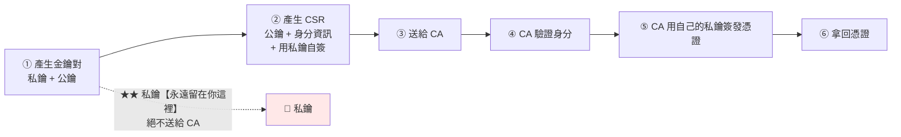

# CSR 產生與 req 設定檔

> [!abstract] 這篇你會學到
> - CSR 是什麼、**裡面有什麼、沒有什麼**
> - 用**互動式**與 **`req.txt` 設定檔**兩種方式產生 CSR
> - **★ 一定要把 SAN 寫進 CSR**（最常見的錯誤）
> - 選擇 **RSA 與 ECDSA** 金鑰
> - **驗證 CSR** 的內容再送出
> - 用**一份可重複使用的 `req.txt` 範本**管理機關的所有憑證申請

## 前置知識

- [[01-PKI與憑證基礎]] — 憑證的欄位與 SAN

---

## CSR 是什麼



```
CSR（Certificate Signing Request，憑證簽章請求）包含：
  ✓ 【公鑰】
  ✓ 【身分資訊】（CN、O、OU、L、S、C）
  ✓ 【SAN】（★ 要自己加，見下方）
  ✓ 【用私鑰對以上內容的簽章】（證明你確實持有對應的私鑰）

★★ CSR 【不包含】私鑰
   → 私鑰永遠留在你的伺服器上，絕不傳送給任何人
```

> [!danger] 絕對不要用「線上 CSR 產生器」
> ```
> 網路上有很多「線上產生 CSR」的網站
>   → 它們會在【它們的伺服器上】產生你的私鑰
>     → ★★★ 你的私鑰【已經被第三方持有】
>       → 對方可以完全冒充你的網站
>
> ★ 即使網站聲稱「產生後立刻刪除」，你也無法驗證
> ```
>
> **CSR 與私鑰必須在你自己的伺服器上產生。**

---

## 方式一：互動式（快速但容易漏 SAN）

```bash
# ═══ 一步產生私鑰與 CSR ═══
$ openssl req -new -newkey rsa:2048 -nodes \
    -keyout app.example.gov.tw.key \
    -out app.example.gov.tw.csr

Generating a RSA private key
.......+++++
writing new private key to 'app.example.gov.tw.key'
-----
You are about to be asked to enter information that will be incorporated
into your certificate request.
-----
Country Name (2 letter code) [AU]:TW
State or Province Name (full name) [Some-State]:Taiwan
Locality Name (eg, city) []:Taipei
Organization Name (eg, company) [Internet Widgits Pty Ltd]:Example Government Agency
Organizational Unit Name (eg, section) []:Information Department
Common Name (e.g. server FQDN or YOUR name) []:app.example.gov.tw
Email Address []:                                    ← ★ 留空

Please enter the following 'extra' attributes
to be sent with your certificate request
A challenge password []:                             ← ★★ 留空！
An optional company name []:                         ← 留空
```

| 參數 | 意義 |
| --- | --- |
| `-new` | 產生新的 CSR |
| `-newkey rsa:2048` | 同時產生 2048 位元的 RSA 金鑰 |
| **`-nodes`** | **★ 私鑰不加密**（伺服器啟動時不用輸入密碼） |
| `-keyout` | 私鑰的輸出檔 |
| `-out` | CSR 的輸出檔 |

> [!danger] `challenge password` 一定要留空 ★
> ```
> 這個欄位是 PKCS#10 標準中的遺跡，現在【完全沒有用】
>   → 但若你填了：
>     · 某些 CA 的系統會拒絕
>     · 某些會接受但造成後續問題
>
> ★★ 一律留空（直接按 Enter）
> ```
>
> **同理，`Email Address` 也建議留空** ——
> 現代憑證不需要，而且會出現在公開的 CT 日誌中。

> [!danger] `-nodes` 的取捨
> ```
> 沒有 -nodes（私鑰加密）：
>   ✓ 私鑰檔案被偷也需要密碼才能用
>   ✗ ★★ 【每次啟動 Nginx/Apache 都要人工輸入密碼】
>     → 無法自動重啟、無法開機自啟
>       → 半夜當機沒人能救
>
> 有 -nodes（私鑰不加密）：
>   ✓ 可以自動啟動
>   ✗ 檔案被讀到就完了
>     → ★ 用【檔案權限】保護（chmod 600, chown root:root）
>
> ★★ 伺服器憑證一律用 -nodes + 嚴格的檔案權限
>    （加密私鑰只適合「人工操作的 CA 私鑰」，見 06 篇）
> ```

### ★★ 互動式的致命問題：沒有 SAN

```bash
$ openssl req -in app.example.gov.tw.csr -noout -text | grep -A2 'Requested Extensions'
# ★★ 什麼都沒有 —— 這張 CSR 【沒有 SAN】
```

```
後果：
  · 若 CA 不自動補 SAN → 憑證沒有 SAN
    → ★★★ 【現代瀏覽器直接拒絕】
      NET::ERR_CERT_COMMON_NAME_INVALID
  · 無法申請多網域憑證
```

> [!warning] 有些 CA 會「幫你」把 CN 複製到 SAN
> **但不要依賴這個行為** ——
> 不同 CA 的做法不同，而且你無法控制多網域的情況。
> **一律自己在 CSR 中明確指定 SAN。**

---

## 方式二：`req.txt` 設定檔（★ 建議）

```ini
# ═══════════════════════════════════════════════════════════
# req.txt —— OpenSSL CSR 設定檔
# 用法：openssl req -new -config req.txt -newkey rsa:2048 -nodes \
#           -keyout app.key -out app.csr
# ═══════════════════════════════════════════════════════════

[ req ]
default_bits        = 2048
default_md          = sha256
prompt              = no                 # ★★ 不要互動式詢問
distinguished_name  = req_distinguished_name
req_extensions      = req_ext            # ★★ 關鍵：指向擴充欄位
string_mask         = utf8only
utf8                = yes

# ═══ 主體資訊（Distinguished Name）═══
[ req_distinguished_name ]
C                   = TW                                   # 國家（2 碼）
ST                  = Taiwan                               # 州／省
L                   = Taipei                               # 城市
O                   = Example Government Agency            # ★ 組織全名
OU                  = Information Department               # 部門
CN                  = app.example.gov.tw                   # ★ 主要網域

# ═══ ★★★ 擴充欄位（SAN）═══
[ req_ext ]
subjectAltName      = @alt_names
keyUsage            = critical, digitalSignature, keyEncipherment
extendedKeyUsage    = serverAuth, clientAuth
basicConstraints    = critical, CA:FALSE                   # ★ 不是 CA

[ alt_names ]
DNS.1               = app.example.gov.tw                   # ★★ CN 也要列在這裡
DNS.2               = www.app.example.gov.tw
DNS.3               = api.example.gov.tw
# DNS.4             = *.dev.example.gov.tw                 # 萬用（需 CA 支援）
# IP.1              = 10.0.5.20                            # ★ 內部憑證才用
```

```bash
# ═══ 產生 ═══
$ openssl req -new -config req.txt \
    -newkey rsa:2048 -nodes \
    -keyout app.example.gov.tw.key \
    -out app.example.gov.tw.csr

# ★ 完全不互動，一行完成
```

> [!danger] `prompt = no` 與 `req_extensions` 是兩個關鍵
> ```ini
> prompt = no
>   → ★ 不會互動式詢問，直接用 [req_distinguished_name] 的值
>   → 沒有它的話還是會問你一堆問題
>
> req_extensions = req_ext
>   → ★★★ 【告訴 openssl 要把 [req_ext] 的內容放進 CSR】
>   → 【沒有這一行，SAN 不會被寫進 CSR】
> ```
>
> **`req_extensions` 是最常漏掉的一行**，
> 而且漏掉時**不會有任何錯誤訊息** —— CSR 產生成功，但沒有 SAN。

### ★★ 一定要驗證 CSR

```bash
$ openssl req -in app.example.gov.tw.csr -noout -text

Certificate Request:
    Data:
        Version: 1 (0x0)
        Subject: C=TW, ST=Taiwan, L=Taipei, O=Example Government Agency,
                 OU=Information Department, CN=app.example.gov.tw
        Subject Public Key Info:
            Public Key Algorithm: rsaEncryption
                Public-Key: (2048 bit)
                ...
        Attributes:
            Requested Extensions:
                X509v3 Subject Alternative Name:              ★★★ 確認有這個
                    DNS:app.example.gov.tw, DNS:www.app.example.gov.tw,
                    DNS:api.example.gov.tw
                X509v3 Key Usage: critical
                    Digital Signature, Key Encipherment
                X509v3 Extended Key Usage:
                    TLS Web Server Authentication, TLS Web Client Authentication
                X509v3 Basic Constraints: critical
                    CA:FALSE
    Signature Algorithm: sha256WithRSAEncryption
    ...
```

```bash
# ★ 快速檢查 SAN
$ openssl req -in app.csr -noout -text | grep -A1 'Subject Alternative Name'
                X509v3 Subject Alternative Name:
                    DNS:app.example.gov.tw, DNS:www.app.example.gov.tw

# ★ 只看主體
$ openssl req -in app.csr -noout -subject
subject=C=TW, ST=Taiwan, L=Taipei, O=Example Government Agency, OU=Information Department, CN=app.example.gov.tw

# ★★ 驗證 CSR 的簽章（確認金鑰對正確）
$ openssl req -in app.csr -noout -verify
Certificate request self-signature verify OK

# ★★ 驗證 CSR 與私鑰是配對的（兩個 md5 必須相同）
$ openssl req -in app.csr -noout -pubkey | openssl md5
$ openssl rsa -in app.key -pubout 2>/dev/null | openssl md5
```

---

## 金鑰演算法的選擇

### RSA

```bash
# ═══ 2048 位元（★ 目前的標準）═══
$ openssl req -new -config req.txt -newkey rsa:2048 -nodes \
    -keyout app.key -out app.csr

# ═══ 4096 位元（更安全但慢 2-4 倍）═══
$ openssl req -new -config req.txt -newkey rsa:4096 -nodes \
    -keyout app.key -out app.csr

# ═══ 用既有的私鑰產生 CSR（★ 續期時常用）═══
$ openssl req -new -config req.txt -key app.key -out app.csr
```

### ECDSA（★ 更快、憑證更小）

```bash
# ═══ 方式一：先產生金鑰再產生 CSR ═══
$ openssl ecparam -name prime256v1 -genkey -noout -out app-ecc.key
$ openssl req -new -config req.txt -key app-ecc.key -out app-ecc.csr

# ═══ 方式二：一步完成 ═══
$ openssl req -new -config req.txt -nodes \
    -newkey ec -pkeyopt ec_paramgen_curve:prime256v1 \
    -keyout app-ecc.key -out app-ecc.csr

# ═══ P-384（更高強度）═══
$ openssl ecparam -name secp384r1 -genkey -noout -out app-ecc384.key
```

| 演算法 | 相當於 RSA | 金鑰大小 | 握手速度 | 相容性 |
| --- | --- | --- | --- | --- |
| RSA 2048 | — | 2048 bit | 基準 | **★ 100%** |
| RSA 4096 | — | 4096 bit | **慢 2-4 倍** | 100% |
| **ECDSA P-256** | **RSA 3072** | **256 bit** | **★ 快很多** | 現代裝置（2010+） |
| ECDSA P-384 | RSA 7680 | 384 bit | 快 | 現代裝置 |

> [!tip] 怎麼選
> ```
> ① 對外的一般網站    → ★ ECDSA P-256（快、憑證小、強度足夠）
> ② 需要相容極舊裝置  → ★ 雙憑證（ECDSA + RSA 2048）
> ③ 內部系統          → ECDSA P-256
> ④ 根 CA             → RSA 4096 或 ECDSA P-384（★ 它要用 10-20 年）
> ⑤ 政府基準有規定    → 依規定
> ```
>
> ```bash
> # ★ 檢查金鑰的類型與長度
> $ openssl rsa -in app.key -noout -text | head -1
> RSA Private-Key: (2048 bit, 2 primes)
> $ openssl ec -in app-ecc.key -noout -text | head -3
> Private-Key: (256 bit)
> ASN1 OID: prime256v1
> NIST CURVE: P-256
> ```

---

## 完整實戰範例

### 一鍵產生 CSR 的腳本

```bash
#!/usr/bin/env bash
# /usr/local/bin/gen-csr —— 產生 CSR 與私鑰
set -euo pipefail

usage() {
    cat <<'EOF'
用法：gen-csr <主網域> [其他網域...] [選項]

選項：
  --alg rsa2048|rsa4096|ec256|ec384   金鑰演算法（預設 ec256）
  --org "組織全名"                     組織（預設從設定檔讀）
  --ou  "部門"                         部門
  --out-dir <目錄>                     輸出目錄（預設 ./certs）

範例：
  gen-csr app.example.gov.tw www.app.example.gov.tw
  gen-csr api.example.gov.tw --alg rsa2048 --ou "資訊室"
EOF
}

[ $# -eq 0 ] && { usage; exit 1; }

# ── 預設值（★ 依機關修改）──
C="TW"
ST="Taiwan"
L="Taipei"
O="Example Government Agency"
OU="Information Department"
ALG="ec256"
OUTDIR="./certs"

DOMAINS=()
while [ $# -gt 0 ]; do
    case "$1" in
        --alg)     ALG="$2"; shift 2 ;;
        --org)     O="$2"; shift 2 ;;
        --ou)      OU="$2"; shift 2 ;;
        --out-dir) OUTDIR="$2"; shift 2 ;;
        -h|--help) usage; exit 0 ;;
        -*)        echo "未知的選項：$1"; exit 1 ;;
        *)         DOMAINS+=("$1"); shift ;;
    esac
done

[ ${#DOMAINS[@]} -eq 0 ] && { echo "✗ 至少要有一個網域"; exit 1; }

CN="${DOMAINS[0]}"
mkdir -p "$OUTDIR"
KEY="$OUTDIR/$CN.key"
CSR="$OUTDIR/$CN.csr"
CONF="$OUTDIR/$CN.req.txt"

echo "═══ 產生 CSR ═══"
echo "  CN       : $CN"
echo "  SAN      : ${DOMAINS[*]}"
echo "  演算法   : $ALG"
echo "  組織     : $O / $OU"
echo "  輸出目錄 : $OUTDIR"
echo

# ── 產生 req.txt ──
{
cat <<EOF
# 自動產生於 $(date -Is)
[ req ]
default_bits        = 2048
default_md          = sha256
prompt              = no
distinguished_name  = req_distinguished_name
req_extensions      = req_ext
string_mask         = utf8only
utf8                = yes

[ req_distinguished_name ]
C                   = $C
ST                  = $ST
L                   = $L
O                   = $O
OU                  = $OU
CN                  = $CN

[ req_ext ]
subjectAltName      = @alt_names
keyUsage            = critical, digitalSignature, keyEncipherment
extendedKeyUsage    = serverAuth, clientAuth
basicConstraints    = critical, CA:FALSE

[ alt_names ]
EOF
i=1; j=1
for d in "${DOMAINS[@]}"; do
    if [[ "$d" =~ ^[0-9]+\.[0-9]+\.[0-9]+\.[0-9]+$ ]]; then
        echo "IP.$j                = $d"; j=$((j+1))
    else
        echo "DNS.$i               = $d"; i=$((i+1))
    fi
done
} > "$CONF"

echo "  ✓ 設定檔：$CONF"

# ── 產生金鑰與 CSR ──
case "$ALG" in
    rsa2048)
        openssl req -new -config "$CONF" -newkey rsa:2048 -nodes \
            -keyout "$KEY" -out "$CSR" 2>/dev/null ;;
    rsa4096)
        openssl req -new -config "$CONF" -newkey rsa:4096 -nodes \
            -keyout "$KEY" -out "$CSR" 2>/dev/null ;;
    ec256)
        openssl ecparam -name prime256v1 -genkey -noout -out "$KEY"
        openssl req -new -config "$CONF" -key "$KEY" -out "$CSR" ;;
    ec384)
        openssl ecparam -name secp384r1 -genkey -noout -out "$KEY"
        openssl req -new -config "$CONF" -key "$KEY" -out "$CSR" ;;
    *) echo "✗ 未知的演算法：$ALG"; exit 1 ;;
esac

# ── ★ 權限 ──
chmod 600 "$KEY"
chmod 644 "$CSR" "$CONF"

echo "  ✓ 私鑰  ：$KEY（chmod 600）"
echo "  ✓ CSR   ：$CSR"

# ── ★★ 驗證 ──
echo
echo "═══ 驗證 ═══"

echo "  ── 主體 ──"
openssl req -in "$CSR" -noout -subject | sed 's/^/    /'

echo "  ── SAN（★ 最重要）──"
SAN=$(openssl req -in "$CSR" -noout -text | grep -A1 'Subject Alternative Name' | tail -1 | xargs)
if [ -n "$SAN" ]; then
    echo "    ✓ $SAN"
else
    echo "    ✗✗ 【沒有 SAN！檢查 req.txt 是否有 req_extensions = req_ext】"
    exit 1
fi

echo "  ── 金鑰 ──"
case "$ALG" in
    rsa*) openssl rsa -in "$KEY" -noout -text 2>/dev/null | head -1 | sed 's/^/    /' ;;
    ec*)  openssl ec -in "$KEY" -noout -text 2>/dev/null | grep -E 'Private-Key|NIST' | sed 's/^/    /' ;;
esac

echo "  ── 簽章驗證 ──"
openssl req -in "$CSR" -noout -verify 2>&1 | sed 's/^/    /'

echo "  ── 金鑰配對 ──"
A=$(openssl req -in "$CSR" -noout -pubkey 2>/dev/null | openssl md5)
case "$ALG" in
    rsa*) B=$(openssl rsa -in "$KEY" -pubout 2>/dev/null | openssl md5) ;;
    ec*)  B=$(openssl ec  -in "$KEY" -pubout 2>/dev/null | openssl md5) ;;
esac
[ "$A" = "$B" ] && echo "    ✓ CSR 與私鑰配對正確" || echo "    ✗✗ 不配對！"

echo
echo "═══ 下一步 ═══"
cat <<EOF
  ① 把【CSR】的內容送給 CA（★ 絕對不要送私鑰）：
       cat $CSR

  ② ★★ 妥善保管私鑰：
       · 權限已設為 600
       · 【不要】進 git
       · 【不要】放在 web root
       · 備份時要加密

  ③ 拿到憑證後部署（見 [[10-憑證部署到各服務]]）

  ④ 保留 $CONF —— 續期時可以重複使用
EOF
```

```bash
$ gen-csr app.example.gov.tw www.app.example.gov.tw api.example.gov.tw
$ gen-csr internal.example.local 10.0.5.20 --alg rsa2048
```

### 機關統一的 req.txt 範本

```ini
# ═══════════════════════════════════════════════════════════
# /etc/ssl/templates/gov-req-template.txt
# ★ 機關統一的 CSR 範本
#
# 用法：
#   ① cp gov-req-template.txt /tmp/myapp.req.txt
#   ② 修改 CN 與 [alt_names]
#   ③ openssl req -new -config /tmp/myapp.req.txt \
#          -newkey rsa:2048 -nodes -keyout myapp.key -out myapp.csr
#   ④ openssl req -in myapp.csr -noout -text | grep -A1 'Alternative'
# ═══════════════════════════════════════════════════════════

[ req ]
default_bits        = 2048
default_md          = sha256
prompt              = no
distinguished_name  = req_distinguished_name
req_extensions      = req_ext
string_mask         = utf8only
utf8                = yes

[ req_distinguished_name ]
# ═══ ★ 以下四項全機關統一，不要修改 ═══
C                   = TW
ST                  = Taiwan
L                   = Taipei
O                   = Example Government Agency

# ═══ ★ 以下依單位／系統修改 ═══
OU                  = Information Department
CN                  = CHANGE-ME.example.gov.tw

[ req_ext ]
subjectAltName      = @alt_names
keyUsage            = critical, digitalSignature, keyEncipherment
extendedKeyUsage    = serverAuth, clientAuth
basicConstraints    = critical, CA:FALSE

[ alt_names ]
# ═══ ★★ CN 也必須列在這裡 ═══
DNS.1               = CHANGE-ME.example.gov.tw
# DNS.2             = www.CHANGE-ME.example.gov.tw
# DNS.3             = CHANGE-ME-alt.example.gov.tw

# ═══ 內部憑證才用 IP（★ 公開 CA 通常不簽發 IP）═══
# IP.1              = 10.0.5.20

# ═══════════════════════════════════════════════════════════
# ★ 檢查清單（送出 CSR 前確認）
#   □ CN 已修改，不是 CHANGE-ME
#   □ [alt_names] 中包含 CN
#   □ 所有要用的網域都列在 SAN 中
#   □ O 與 OU 正確（OV/EV 憑證會核對登記文件）
#   □ 執行過 openssl req -in xxx.csr -noout -text 確認 SAN 存在
#   □ 私鑰權限是 600
#   □ 沒有填 challenge password
# ═══════════════════════════════════════════════════════════
```

### CSR 檢查腳本

```bash
#!/usr/bin/env bash
# /usr/local/bin/check-csr —— 送出前的完整檢查
CSR="${1:?用法: $0 <csr檔> [私鑰檔]}"
KEY="${2:-${CSR%.csr}.key}"
FAIL=0
pass() { printf '  \033[32m✓\033[0m %s\n' "$1"; }
warn() { printf '  \033[33m⚠\033[0m %s\n' "$1"; }
fail() { printf '  \033[31m✗\033[0m %s\n' "$1"; FAIL=$((FAIL+1)); }

echo "═══ CSR 檢查：$CSR ═══"

[ -f "$CSR" ] || { fail "檔案不存在"; exit 1; }

echo -e "\n【1】格式"
openssl req -in "$CSR" -noout -text >/dev/null 2>&1 \
  && pass "有效的 CSR" || { fail "不是有效的 CSR"; exit 1; }

echo -e "\n【2】主體"
SUBJ=$(openssl req -in "$CSR" -noout -subject | sed 's/^subject=//')
echo "  $SUBJ"
CN=$(echo "$SUBJ" | grep -oP 'CN\s*=\s*\K[^,/]+' | xargs)
[ -n "$CN" ] && pass "CN = $CN" || fail "沒有 CN"
echo "$CN" | grep -qi 'CHANGE-ME\|example\.com\|localhost\|test' && \
  warn "CN 看起來像範本或測試值：$CN"

echo -e "\n【3】★★ SAN（最重要）"
SAN=$(openssl req -in "$CSR" -noout -text | grep -A1 'Subject Alternative Name' | tail -1 | xargs)
if [ -z "$SAN" ]; then
    fail "★★ 沒有 SAN！現代瀏覽器會拒絕這張憑證"
    echo "     → 檢查 req.txt 是否有 'req_extensions = req_ext'"
else
    pass "$SAN"
    # ★ CN 是否在 SAN 中
    echo "$SAN" | grep -q "DNS:$CN" && pass "CN 有列在 SAN 中" \
      || fail "★★ CN（$CN）沒有列在 SAN 中【瀏覽器會拒絕】"
fi

echo -e "\n【4】金鑰"
BITS=$(openssl req -in "$CSR" -noout -text | grep -oP 'Public-Key: \(\K\d+')
ALG=$(openssl req -in "$CSR" -noout -text | grep -oP 'Public Key Algorithm: \K\S+')
echo "  $ALG，$BITS bit"
case "$ALG" in
    rsaEncryption)
        [ "$BITS" -ge 2048 ] && pass "RSA $BITS bit（≥2048）" \
                             || fail "RSA $BITS bit【太弱，至少要 2048】" ;;
    id-ecPublicKey)
        [ "$BITS" -ge 256 ] && pass "ECDSA $BITS bit" || fail "ECDSA $BITS bit 太弱" ;;
esac

echo -e "\n【5】簽章演算法"
SIG=$(openssl req -in "$CSR" -noout -text | grep -oP 'Signature Algorithm: \K\S+' | head -1)
echo "  $SIG"
echo "$SIG" | grep -qi 'sha1\|md5' && fail "★ 使用了不安全的雜湊演算法（$SIG）" \
                                   || pass "雜湊演算法安全"

echo -e "\n【6】擴充欄位"
EXT=$(openssl req -in "$CSR" -noout -text | sed -n '/Requested Extensions/,/Signature Algorithm/p')
echo "$EXT" | grep -q 'Basic Constraints' && {
    echo "$EXT" | grep -q 'CA:FALSE' && pass "Basic Constraints: CA:FALSE" \
                                     || fail "★★ CA:TRUE【伺服器憑證不該是 CA】"
} || warn "沒有 Basic Constraints（CA 通常會自己加）"
echo "$EXT" | grep -q 'Key Usage' && pass "有 Key Usage" || warn "沒有 Key Usage"
echo "$EXT" | grep -q 'serverAuth' && pass "Extended Key Usage 含 serverAuth" \
                                   || warn "沒有 serverAuth"

echo -e "\n【7】CSR 自簽章驗證"
openssl req -in "$CSR" -noout -verify >/dev/null 2>&1 \
  && pass "簽章有效（確認持有對應的私鑰）" || fail "簽章驗證失敗"

echo -e "\n【8】與私鑰配對"
if [ -f "$KEY" ]; then
    A=$(openssl req -in "$CSR" -noout -pubkey 2>/dev/null | openssl md5)
    B=$(openssl pkey -in "$KEY" -pubout 2>/dev/null | openssl md5)
    [ "$A" = "$B" ] && pass "CSR 與私鑰配對正確（$KEY）" \
                    || fail "★★ CSR 與私鑰【不配對】"
    P=$(stat -c '%a' "$KEY")
    [ "$P" = "600" ] || [ "$P" = "400" ] && pass "私鑰權限 $P" \
                                         || fail "★ 私鑰權限 $P 太鬆【應為 600】"
else
    warn "找不到私鑰 $KEY，跳過配對檢查"
fi

echo -e "\n【9】challenge password"
openssl req -in "$CSR" -noout -text | grep -q 'challengePassword' \
  && fail "★ 有 challenge password【某些 CA 會拒絕，應留空】" \
  || pass "沒有 challenge password"

echo -e "\n【10】★ 網域可解析性"
if [ -n "$SAN" ]; then
    echo "$SAN" | tr ',' '\n' | grep -oP 'DNS:\K\S+' | while read -r d; do
        [[ "$d" == \** ]] && { echo "    ○ $d（萬用，跳過）"; continue; }
        IP=$(dig +short "$d" 2>/dev/null | tail -1)
        [ -n "$IP" ] && echo "    ✓ $d → $IP" || echo "    ⚠ $d 無法解析【HTTP-01 驗證會失敗】"
    done
fi

echo -e "\n═══ 結果 ═══"
if [ "$FAIL" -eq 0 ]; then
    echo "  ✓ 通過所有檢查，可以送出"
    echo
    echo "  ── CSR 內容（複製給 CA）──"
    cat "$CSR"
else
    printf '  \033[31m✗ 有 %d 項失敗，請修正後再送出\033[0m\n' "$FAIL"
fi
exit $FAIL
```

---

## 常見錯誤與排錯

| 現象／問題 | 原因 | 解法 |
| --- | --- | --- |
| **CSR 中沒有 SAN** ★★★ | **`req.txt` 缺 `req_extensions = req_ext`** | 加上該行；重新產生並驗證 |
| **憑證發回來沒有 SAN** | CSR 就沒有 | 同上；重新申請 |
| **CN 沒有列在 SAN 中** ★★ | 忘了在 `[alt_names]` 重複一次 | **CN 必須也出現在 SAN** |
| CA 拒絕 CSR | 填了 challenge password | **留空** |
| `unable to load config` | 設定檔路徑錯或語法錯 | 檢查路徑；`openssl req -config x.txt -verify` |
| **產生時仍然被問問題** | 缺 `prompt = no` | 加上該行 |
| **CSR 與私鑰不配對** | 用錯了私鑰 | 比對 `-pubkey \| md5`；重新產生 |
| `-nodes` 忘了加 | 私鑰被加密 | 移除密碼：`openssl rsa -in x.key -out x.key` |
| **Nginx 啟動要輸入密碼** | 私鑰有加密 | 同上；或用 `ssl_password_file`（不建議） |
| 中文組織名亂碼 | 編碼問題 | `string_mask = utf8only` + `utf8 = yes`；**或用英文** |
| **公開 CA 拒絕 IP 在 SAN** | 多數公開 CA 不簽發 IP | IP 只用於**內部 CA** |
| 萬用憑證被拒 | 需要 DNS-01 驗證 | 見 [[03-向CA申請憑證]] |
| **金鑰太弱** | RSA < 2048 | 至少 2048；建議 ECDSA P-256 |
| `sha1WithRSAEncryption` | 舊的預設值 | `default_md = sha256` |

### 排查

```bash
# 【1】★ 最重要：檢查 SAN
$ openssl req -in app.csr -noout -text | grep -A1 'Subject Alternative Name'

# 【2】完整內容
$ openssl req -in app.csr -noout -text

# 【3】驗證簽章
$ openssl req -in app.csr -noout -verify

# 【4】★ 與私鑰配對
$ openssl req -in app.csr -noout -pubkey | openssl md5
$ openssl pkey -in app.key -pubout | openssl md5      # ★ pkey 通用於 RSA 與 EC

# 【5】檢查私鑰類型
$ openssl pkey -in app.key -noout -text | head -3

# 【6】驗證 req.txt 的語法
$ openssl req -new -config req.txt -newkey rsa:2048 -nodes \
    -keyout /dev/null -out /dev/null && echo "設定檔有效"

# 【7】移除私鑰的密碼
$ openssl rsa -in encrypted.key -out plain.key
$ openssl ec  -in encrypted-ec.key -out plain-ec.key

# 【8】從既有的憑證產生新的 CSR（★ 續期時很方便）
$ openssl x509 -x509toreq -in old-cert.pem -signkey app.key -out new.csr \
    -copy_extensions copyall
# ★ -copy_extensions copyall 會複製 SAN
```

---

## 安全性注意事項

> [!danger] 私鑰的產生與保管
> ```
> ★★★ 私鑰必須在【你自己的伺服器上】產生
>   ❌ 線上 CSR 產生器 → 你的私鑰在對方手上
>   ❌ CA 幫你產生金鑰 → 同樣的問題
>   ❌ 用同一把私鑰給多個系統 → 一個被攻破全部受影響
> ```
>
> **產生後立刻設定權限**：
> ```bash
> $ chmod 600 app.key
> $ chown root:root app.key            # 或該服務的執行身分
> $ ls -l app.key
> -rw------- 1 root root 1704 Aug 28 10:00 app.key
> ```
>
> **四個絕對不能做的事**：
> ```
> ❌ 私鑰進 git（即使是私有 repo）
> ❌ 私鑰放在 web root 內
> ❌ 用 email / Slack / 即時通訊傳送私鑰
> ❌ 私鑰備份未加密
> ```
> ```bash
> # ★ 加密備份
> $ tar czf - /etc/ssl/private/ | \
>     openssl enc -aes-256-cbc -pbkdf2 -salt -out keys-backup-$(date +%F).tar.gz.enc
> # 還原
> $ openssl enc -d -aes-256-cbc -pbkdf2 -in keys-backup-2026-08-28.tar.gz.enc | tar xzf -
> ```

> [!warning] 每個系統用獨立的金鑰
> ```
> ❌ 一把私鑰用在 10 個系統
>   → 其中一台被入侵 → 【10 個系統的憑證全部要撤銷重發】
>
> ✅ 每個系統獨立的金鑰對
>   → 影響範圍限縮在一台
> ```
> **萬用憑證也是同樣的考量** ——
> 一張 `*.example.gov.tw` 的憑證涵蓋所有子網域，
> **私鑰洩漏就影響全部**。
> 高價值的服務（金流、後台）應該用獨立的憑證。

> [!tip] 續期時重複使用金鑰的取捨
> ```
> 方式一：★ 每次續期都產生新的金鑰對（推薦）
>   ✓ 即使舊金鑰洩漏也只影響那段期間
>   ✗ 每次要重新部署金鑰檔
>
> 方式二：重複使用既有的私鑰
>   $ openssl req -new -config req.txt -key existing.key -out new.csr
>   ✓ 只要換憑證檔（★ 對 HPKP 或有金鑰釘選的環境重要）
>   ✗ 金鑰長期不變，風險累積
>
> ★★ 建議：預設每次產生新金鑰（Certbot 預設就是這樣）
>    除非有明確的技術理由才重用
> ```

> [!warning] CSR 中的資訊會出現在公開的 CT 日誌
> ```
> 憑證簽發後會被記錄在 Certificate Transparency 日誌中
>   → ★ Subject 的所有欄位與 SAN 【全部公開】
>
> 這代表：
>   · 【不要】在 SAN 中列出不想被知道的內部主機名
>     （例如 backup-db-prod-01.internal.example.gov.tw）
>   · 【不要】在 OU 填寫敏感的組織資訊
>   · 【不要】填 Email（會被爬蟲收集）
>
> ★ 內部系統應該用【內部 CA】，不要用公開 CA
>   → 見 [[06-自建根CA]]
> ```
> ```bash
> # ★ 看看你的網域洩漏了哪些子網域
> $ curl -s "https://crt.sh/?q=%25.example.gov.tw&output=json" | \
>     jq -r '.[].common_name' | sort -u
> ```

---

## 速查表

### CSR 的內容

```
CSR = 公鑰 + 身分資訊（CN/O/OU/L/ST/C）+ SAN + 用私鑰的自簽章
★★ 【不含】私鑰 —— 私鑰永遠留在你的伺服器上
❌ 絕不使用線上 CSR 產生器
```

### ★★ req.txt 範本

```ini
[ req ]
default_bits        = 2048
default_md          = sha256
prompt              = no                 # ★ 不互動
distinguished_name  = req_distinguished_name
req_extensions      = req_ext            # ★★★ 最常漏掉的一行
string_mask         = utf8only
utf8                = yes

[ req_distinguished_name ]
C  = TW
ST = Taiwan
L  = Taipei
O  = Example Government Agency
OU = Information Department
CN = app.example.gov.tw

[ req_ext ]
subjectAltName   = @alt_names
keyUsage         = critical, digitalSignature, keyEncipherment
extendedKeyUsage = serverAuth, clientAuth
basicConstraints = critical, CA:FALSE

[ alt_names ]
DNS.1 = app.example.gov.tw               # ★★ CN 也要列在這裡
DNS.2 = www.app.example.gov.tw
# IP.1 = 10.0.5.20                       # ★ 只有內部 CA 會簽發 IP
```

### 產生

```bash
# RSA 2048
openssl req -new -config req.txt -newkey rsa:2048 -nodes \
  -keyout app.key -out app.csr

# ★ ECDSA P-256（推薦：快、憑證小）
openssl ecparam -name prime256v1 -genkey -noout -out app.key
openssl req -new -config req.txt -key app.key -out app.csr

# ★ 用既有的私鑰（續期）
openssl req -new -config req.txt -key existing.key -out new.csr

chmod 600 app.key                        # ★ 立刻設權限
```

```
-nodes  ★ 私鑰不加密（★ 伺服器憑證必須，否則無法自動啟動）
challenge password ★ 一律留空
Email Address      ★ 建議留空（會出現在公開的 CT 日誌）
```

### ★★ 送出前必驗

```bash
# ① SAN（最重要）
openssl req -in app.csr -noout -text | grep -A1 'Subject Alternative Name'

# ② 主體
openssl req -in app.csr -noout -subject

# ③ 簽章
openssl req -in app.csr -noout -verify

# ④ 與私鑰配對（兩個 md5 要相同）
openssl req -in app.csr -noout -pubkey | openssl md5
openssl pkey -in app.key -pubout | openssl md5
```

```
檢查清單：
□ CSR 中有 SAN
□ ★ CN 也列在 SAN 中
□ 所有要用的網域都在 SAN
□ 金鑰 ≥ RSA 2048 或 ECDSA P-256
□ 簽章演算法是 sha256（不是 sha1/md5）
□ Basic Constraints: CA:FALSE
□ 沒有 challenge password
□ 私鑰權限 600
```

### 演算法選擇

```
RSA 2048    ★ 最低要求，100% 相容
RSA 4096    更安全但握手慢 2-4 倍
ECDSA P-256 ★★ 建議（≈ RSA 3072，快很多、憑證小）
ECDSA P-384 根 CA 用

★ 需要相容極舊裝置 → 雙憑證（ECDSA + RSA）
```

### 常見錯誤

| 錯誤 | 原因 |
| --- | --- |
| **CSR 沒有 SAN** | **缺 `req_extensions = req_ext`** |
| **CN 不在 SAN 中** | 忘了在 `[alt_names]` 重複 |
| 仍被問問題 | 缺 `prompt = no` |
| CA 拒絕 | 填了 challenge password |
| Nginx 要輸入密碼 | 忘了 `-nodes` |
| CSR 與私鑰不配對 | 用錯私鑰 |

### 私鑰保護

```bash
chmod 600 app.key && chown root:root app.key

❌ 進 git · 放 web root · email 傳送 · 未加密備份
❌ 線上 CSR 產生器（私鑰在對方手上）
❌ 一把私鑰用在多個系統

# 加密備份
tar czf - /etc/ssl/private/ | openssl enc -aes-256-cbc -pbkdf2 -salt -out keys.tar.gz.enc
```

### 從既有憑證產生 CSR（續期）

```bash
openssl x509 -x509toreq -in old-cert.pem -signkey app.key -out new.csr \
  -copy_extensions copyall        # ★ 複製 SAN
```

---

## 練習題

> [!question]- 練習 1：重現「沒有 SAN」的問題
> 1. 用**互動式**方式產生 CSR（不用設定檔）
> 2. `openssl req -in x.csr -noout -text | grep -A1 'Alternative'`
>    → **有 SAN 嗎？**
> 3. 寫一份 `req.txt`，但**故意漏掉 `req_extensions = req_ext`**
> 4. 產生 CSR 並檢查 → **有 SAN 嗎？有錯誤訊息嗎？**
> 5. 加上那一行，重新產生
> 6. **這說明「產生成功」不等於「內容正確」**

> [!question]- 練習 2：多網域 CSR
> 1. 寫一份 `req.txt`，SAN 包含 5 個網域
> 2. 產生 CSR 並驗證所有網域都在
> 3. **故意不把 CN 列在 SAN 中**
> 4. 用這張 CSR 自簽一張憑證（見 [[05-自簽憑證快速產生]]）
> 5. 用瀏覽器開啟 → **會報什麼錯？**
> 6. 修正後重做

> [!question]- 練習 3：RSA vs ECDSA
> 1. 用相同的 `req.txt` 產生 RSA 2048、RSA 4096、ECDSA P-256 三份 CSR
> 2. **比較檔案大小**
> 3. 各自自簽成憑證，**比較憑證大小**
> 4. 用 `openssl speed rsa2048 ecdsap256` 比較運算速度
> 5. 部署到 Nginx，用 `openssl s_client` 測量握手時間
> 6. **結論：你的環境該用哪個？**

> [!question]- 練習 4：CSR 檢查腳本
> 1. 部署本篇的 `check-csr` 腳本
> 2. 產生五份「有不同問題」的 CSR：
>    - 沒有 SAN
>    - CN 不在 SAN
>    - RSA 1024
>    - 有 challenge password
>    - 私鑰權限 644
> 3. **腳本都抓到了嗎？**
> 4. 加上你認為還需要的檢查項目
> 5. 把它加進機關的憑證申請流程

> [!question]- 練習 5：機關範本
> 1. 依你的機關資訊修改 `gov-req-template.txt`
> 2. 用它產生三個不同系統的 CSR
> 3. **寫一份給同仁的「憑證申請 SOP」**，包含：
>    - 如何複製與修改範本
>    - 送出前的檢查清單
>    - 私鑰的保管規定
>    - 拿到憑證後的部署步驟
> 4. **請一位不熟悉 openssl 的同仁照著做一次**
> 5. 依他卡住的地方修改 SOP

---

## 小測驗

Q1. **CSR 包含什麼？「不」包含什麼**？

Q2. **為什麼絕對不能用「線上 CSR 產生器」**？

Q3. **`req.txt` 中最常被漏掉、且漏掉不會報錯的是哪一行？後果是什麼**？

Q4. **`prompt = no` 做什麼？沒有它會怎樣**？

Q5. **CN 為什麼「也」要列在 SAN 中**？

Q6. **`-nodes` 的意義與取捨是什麼？伺服器憑證為什麼一定要用**？

Q7. **challenge password 該填什麼？為什麼**？

Q8. **怎麼驗證「CSR 與私鑰是配對的」**？

Q9. **RSA 2048 / RSA 4096 / ECDSA P-256 該怎麼選**？

Q10. **CSR 中的哪些資訊會出現在公開的 CT 日誌？這對內部系統有什麼意義**？

> [!question]- 測驗答案
> **Q1.** **CSR 包含**：①**公鑰**；
> ②**身分資訊**（CN、O、OU、L、ST、C）；
> ③**SAN 等擴充欄位**（★ 要自己在設定檔中指定）；
> ④**用私鑰對以上內容產生的自簽章**（證明你確實持有對應的私鑰）。
> **CSR 不包含【私鑰】** ——
> 私鑰永遠留在你自己的伺服器上，**絕對不會（也不該）傳送給 CA 或任何人**。
> 這是整個 PKI 信任模型的基礎。
>
> **Q2.** 因為**線上產生器會在「它們的伺服器上」產生你的私鑰** ——
> **你的私鑰已經被第三方持有**，對方可以：
> **完全冒充你的網站（有合法憑證）、解密你的流量**。
> 即使網站聲稱「產生後立刻刪除」，**你也完全無法驗證**。
> **CSR 與私鑰必須在你自己的伺服器上用 `openssl` 產生。**
> 同理，**也不要讓 CA 幫你產生金鑰**（某些 CA 提供這個「服務」）。
>
> **Q3.** **`req_extensions = req_ext`**（在 `[ req ]` 區塊中）。
> 它的作用是**告訴 openssl「把 `[req_ext]` 區塊的內容放進 CSR」** ——
> **沒有這一行，`[req_ext]` 中定義的 SAN 完全不會被寫進 CSR**。
> **後果**：CSR **產生成功、沒有任何錯誤訊息**，
> 但**裡面沒有 SAN** →
> 憑證簽發後也沒有 SAN →
> **現代瀏覽器直接拒絕**（`NET::ERR_CERT_COMMON_NAME_INVALID`）。
> **這是最典型的「產生成功不等於內容正確」** ——
> 所以**送出 CSR 前一定要 `openssl req -in x.csr -noout -text` 驗證**。
>
> **Q4.** `prompt = no` 讓 openssl **不要互動式詢問各個欄位，
> 直接使用 `[req_distinguished_name]` 區塊中定義的值**。
> **沒有它**：即使設定檔中已經寫好了 C、ST、L、O、OU、CN，
> **openssl 仍然會逐一詢問**（並把設定檔的值當成「預設值」顯示），
> 使用者按 Enter 接受或輸入新值 ——
> 這讓自動化腳本無法運作，也容易因為誤按而產生錯誤的 CSR。
>
> **Q5.** 因為**現代瀏覽器（Chrome 58+、Firefox 48+）完全忽略 CN，只比對 SAN**。
> 如果 CN 是 `app.example.gov.tw` 但 SAN 中只有 `www.app.example.gov.tw`，
> **瀏覽器存取 `https://app.example.gov.tw` 時會報憑證錯誤** ——
> 即使 CN 完全正確。
> 所以 `[alt_names]` 中**必須把 CN 也列進去**：
> ```ini
> CN = app.example.gov.tw
> [ alt_names ]
> DNS.1 = app.example.gov.tw        # ★ 與 CN 相同
> DNS.2 = www.app.example.gov.tw
> ```
>
> **Q6.** **`-nodes`（no DES）表示「私鑰不加密」** ——
> 私鑰檔案以明文形式儲存，讀取時不需要密碼。
> **取捨**：
> **不用 `-nodes`（私鑰加密）**：檔案被偷也需要密碼，
> 但**每次啟動 Nginx / Apache 都要人工輸入密碼** ——
> **無法自動重啟、無法開機自啟，半夜當機沒人能救**。
> **用 `-nodes`**：可以自動啟動，但檔案被讀到就完了，
> 所以**必須用檔案權限保護**（`chmod 600`、`chown root:root`）。
> **伺服器憑證一律用 `-nodes`** ——
> 加密的私鑰只適合「人工操作的 CA 私鑰」（見自建 CA 那幾篇）。
>
> **Q7.** **一律留空（直接按 Enter）**。
> `challengePassword` 是 PKCS#10 標準中的遺跡，
> 原本設計用於「撤銷憑證時的身分驗證」，但**現在完全沒有實際用途**。
> **填了的後果**：某些 CA 的系統會**直接拒絕這張 CSR**，
> 某些會接受但造成後續處理的問題。
> 同理，**`Email Address` 也建議留空** ——
> 現代憑證不需要，而且它會**出現在公開的 Certificate Transparency 日誌中**被爬蟲收集。
>
> **Q8.** **比對兩者公鑰的雜湊**：
> ```bash
> openssl req  -in app.csr -noout -pubkey | openssl md5
> openssl pkey -in app.key -pubout        | openssl md5
> # ★ 兩個 md5 必須完全相同
> ```
> （`openssl pkey` 通用於 RSA 與 EC；
> 舊寫法是 `openssl rsa -in x.key -pubout` 或 `openssl ec -in x.key -pubout`。）
> **另外也可以驗證 CSR 本身的自簽章**：
> ```bash
> openssl req -in app.csr -noout -verify
> # Certificate request self-signature verify OK
> ```
> 這證明「產生這張 CSR 的人確實持有對應的私鑰」。
>
> **Q9.**
> **RSA 2048** —— 目前的最低要求，**100% 相容**（含所有舊裝置）。
> **RSA 4096** —— 更高的安全邊際，但**TLS 握手慢 2-4 倍**（對高流量網站有感）。
> **ECDSA P-256** —— **強度相當於 RSA 3072，但金鑰只有 256 bit，
> 握手快很多、憑證小很多**；相容於 2010 年後的裝置。
> **建議**：
> ①**對外的一般網站 → ECDSA P-256**；
> ②**需要相容極舊裝置 → 雙憑證（同時提供 ECDSA + RSA 2048）**；
> ③**根 CA → RSA 4096 或 ECDSA P-384**（它要用 10-20 年，值得更高的強度）；
> ④政府基準有規定就依規定。
>
> **Q10.** **Subject 的所有欄位（C、ST、L、O、OU、CN）與 SAN 中的所有網域
> 全部會出現在公開的 CT 日誌中**，任何人都能用 `crt.sh` 查詢。
> **對內部系統的意義**：
> ①**不要在 SAN 中列出不想被知道的內部主機名**
> （例如 `backup-db-prod-01.internal.example.gov.tw` ——
> 這等於把內部的網路架構公開給攻擊者做情蒐）；
> ②不要在 OU 填寫敏感的組織資訊；
> ③不要填 Email（會被爬蟲收集）。
> **★★ 所以內部系統應該用「內部 CA」簽發憑證，而不是公開 CA** ——
> 內部 CA 簽發的憑證不會進入 CT 日誌。
> ```bash
> # 看看你的網域已經洩漏了哪些子網域
> curl -s "https://crt.sh/?q=%25.example.gov.tw&output=json" | jq -r '.[].common_name' | sort -u
> ```

---

## 延伸閱讀

- [[03-向CA申請憑證]] — 下一步：送出 CSR 並取得憑證
- [[04-CN與SAN設定與瀏覽器相容性]] — SAN 的完整說明與相容性
- [[05-自簽憑證快速產生]] — 測試用的快速產生
- [[08-用自建CA簽發伺服器憑證]] — 用內部 CA 簽發
- [[11-憑證格式轉換與檢視工具]] — openssl 工具箱
- [[01-PKI與憑證基礎]] — 憑證欄位的意義
