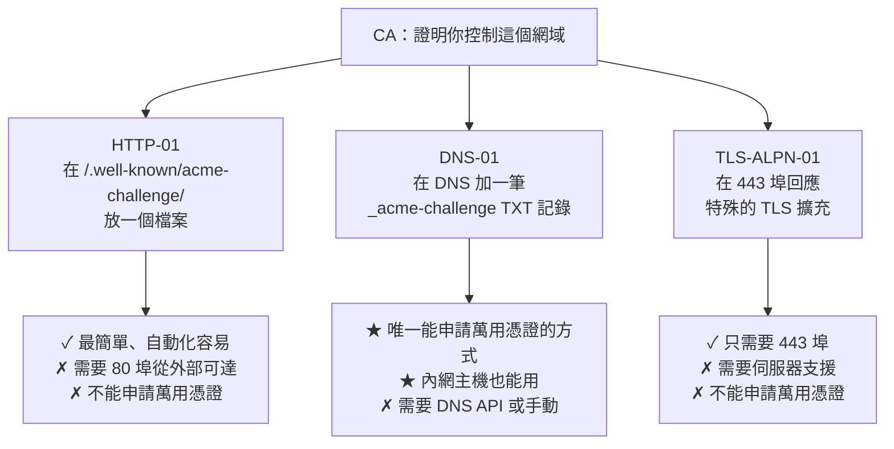

# 向 CA 申請憑證

> [!abstract] 這篇你會學到
> - 分清 **HTTP-01 / DNS-01 / TLS-ALPN-01** 三種驗證方式的適用情境
> - 用 **Certbot / acme.sh** 自動申請 Let's Encrypt 憑證
> - 用**既有的 CSR** 向商業 CA 申請
> - 申請**萬用憑證**（必須用 DNS-01）
> - 處理 **Let's Encrypt 的速率限制**
> - 為**內網主機**申請公開憑證（DNS-01 + 分離式驗證）

## 前置知識

- [[02-CSR產生與req設定檔]] — CSR 的產生與驗證
- [[01-PKI與憑證基礎]] — DV/OV/EV 的差別

---

## 三種驗證方式



| | **HTTP-01** | **DNS-01** | TLS-ALPN-01 |
| --- | --- | --- | --- |
| **驗證方式** | 放檔案在 `/.well-known/acme-challenge/` | 加 `_acme-challenge` TXT 記錄 | 443 埠的 TLS 擴充回應 |
| **需要的埠** | **80（★ 必須從外部可達）** | 無 | 443 |
| **萬用憑證** | ❌ | **✅ 唯一支援的方式** | ❌ |
| **內網主機** | ❌ | **✅** | ❌ |
| **自動化難度** | **★ 最簡單** | 需要 DNS API | 中 |
| **適用** | **一般的對外網站** | **萬用憑證、內網主機** | 80 埠被封鎖時 |

> [!danger] HTTP-01 的 80 埠不能省略
> ```
> 常見的誤解：「我全站都是 HTTPS，不需要 80 埠」
>
> ★★ 但 ACME 的 HTTP-01 驗證【固定從 80 埠開始】
>   → 即使你把 80 全部 301 到 443
>     → ★ Let's Encrypt 【會跟隨轉址】，所以仍然可行
>   → 但若 80 埠【完全關閉或被防火牆擋住】
>     → HTTP-01 驗證【永遠失敗】
>
> ✅ 正確做法：80 埠開著，但只做兩件事
>   ① 提供 /.well-known/acme-challenge/
>   ② 其餘全部 301 到 HTTPS
> ```

---

## Let's Encrypt + Certbot

### 安裝

```bash
# ═══ ★ snap（版本最新，官方推薦）═══
$ sudo snap install --classic certbot
$ sudo ln -sf /snap/bin/certbot /usr/bin/certbot
$ certbot --version
certbot 3.1.0

# ═══ apt（版本較舊但夠用）═══
$ sudo apt install -y certbot python3-certbot-nginx python3-certbot-apache
```

> [!info]- Rocky / AlmaLinux（RHEL 系）對照
> ```bash
> $ sudo dnf install -y epel-release
> $ sudo dnf install -y certbot python3-certbot-nginx
>
> # 或用 snap
> $ sudo dnf install -y snapd && sudo systemctl enable --now snapd.socket
> $ sudo ln -s /var/lib/snapd/snap /snap
> $ sudo snap install --classic certbot
>
> # ★ 防火牆
> $ sudo firewall-cmd --permanent --add-service=http --add-service=https
> $ sudo firewall-cmd --reload
> ```

### HTTP-01（`--webroot`，★ 推薦）

```nginx
# ═══ ① 先設定 Nginx（★ ACME 路徑要在轉址之前）═══
server {
    listen 80;
    listen [::]:80;
    server_name app.example.gov.tw www.app.example.gov.tw;

    # ★★ 用 ^~ 確保優先於任何正規表示式的 location
    location ^~ /.well-known/acme-challenge/ {
        root /var/www/acme;
        default_type "text/plain";
        allow all;
        access_log off;
    }

    location / {
        return 301 https://$host$request_uri;
    }
}
```

```bash
# ═══ ② 建立目錄 ═══
$ sudo mkdir -p /var/www/acme/.well-known/acme-challenge
$ sudo chown -R www-data:www-data /var/www/acme
$ sudo nginx -t && sudo systemctl reload nginx

# ═══ ★★ ③ 先驗證路徑可以從外部存取（★ 這一步不要跳過）═══
$ echo "test-$(date +%s)" | sudo tee /var/www/acme/.well-known/acme-challenge/test >/dev/null
$ curl -sf http://app.example.gov.tw/.well-known/acme-challenge/test && echo " ✓ 可存取"
test-1756368000 ✓ 可存取
$ sudo rm /var/www/acme/.well-known/acme-challenge/test

# ═══ ④ ★ 先用 staging 測試（避免踩到速率限制）═══
$ sudo certbot certonly --staging --webroot -w /var/www/acme \
    -d app.example.gov.tw -d www.app.example.gov.tw \
    --email admin@example.gov.tw --agree-tos --no-eff-email

# ═══ ⑤ 確認成功後，刪除 staging 憑證並申請正式的 ═══
$ sudo certbot delete --cert-name app.example.gov.tw
$ sudo certbot certonly --webroot -w /var/www/acme \
    -d app.example.gov.tw -d www.app.example.gov.tw \
    --email admin@example.gov.tw --agree-tos --no-eff-email

Successfully received certificate.
Certificate is saved at: /etc/letsencrypt/live/app.example.gov.tw/fullchain.pem
Key is saved at:         /etc/letsencrypt/live/app.example.gov.tw/privkey.pem
This certificate expires on 2026-11-26.
```

> [!tip] `--webroot` vs `--nginx` / `--apache`
> ```
> --nginx / --apache（外掛模式）：
>   ✓ 自動修改設定檔，一行搞定
>   ✗ ★ 它加入的設定不符合你的結構
>   ✗ ★ 續期時可能【再改一次，覆蓋你手動調整的內容】
>
> --webroot（★ 推薦）：
>   ✓ 只需要一段固定的 Nginx 設定
>   ✓ ★ 之後【完全不再碰你的設定檔】
>   ✓ 適用於任何 Web 伺服器
>
> --standalone：
>   ✓ Certbot 自己起一個臨時的 web server
>   ✗ ★ 需要【停掉】現有的服務（會中斷）
>   → 只適合「還沒裝 Web 伺服器」時的第一次申請
> ```

### DNS-01（萬用憑證 / 內網主機）

```bash
# ═══ 手動模式（一次性，不能自動續期）═══
$ sudo certbot certonly --manual --preferred-challenges dns \
    -d "example.gov.tw" -d "*.example.gov.tw" \
    --email admin@example.gov.tw --agree-tos

Please deploy a DNS TXT record under the name:
_acme-challenge.example.gov.tw.

with the following value:
gfj9Xq...Rg85nM

Press Enter to Continue
```

```bash
# ★ 在另一個終端加入 DNS 記錄後，先確認生效再按 Enter
$ dig +short TXT _acme-challenge.example.gov.tw @8.8.8.8
"gfj9Xq...Rg85nM"

# ★★ 一定要等 DNS 傳播完成（可能要幾分鐘）
$ for ns in 8.8.8.8 1.1.1.1 168.95.1.1; do
    echo -n "$ns: "; dig +short TXT _acme-challenge.example.gov.tw @$ns
  done
```

```bash
# ═══ ★★ 自動模式（DNS API 外掛）═══
# Cloudflare
$ sudo snap install certbot-dns-cloudflare
$ sudo snap set certbot trust-plugin-with-root=ok

$ sudo mkdir -p /root/.secrets
$ sudo tee /root/.secrets/cloudflare.ini >/dev/null <<'EOF'
dns_cloudflare_api_token = 你的_API_Token
EOF
$ sudo chmod 600 /root/.secrets/cloudflare.ini        # ★ 權限很重要

$ sudo certbot certonly \
    --dns-cloudflare \
    --dns-cloudflare-credentials /root/.secrets/cloudflare.ini \
    --dns-cloudflare-propagation-seconds 30 \
    -d "example.gov.tw" -d "*.example.gov.tw" \
    --email admin@example.gov.tw --agree-tos --no-eff-email
```

```bash
# ★ 其他 DNS 供應商的外掛
$ snap info certbot | grep -A30 'plugins'
certbot-dns-route53        # AWS
certbot-dns-google         # Google Cloud DNS
certbot-dns-azure          # Azure
certbot-dns-digitalocean
certbot-dns-linode
certbot-dns-ovh
certbot-dns-rfc2136        # ★ 標準的動態 DNS 更新（BIND 等自架 DNS）
```

> [!tip] 自架 BIND 時用 RFC2136
> ```bash
> # ★ BIND 的動態更新設定
> $ sudo tee -a /etc/bind/named.conf.local <<'EOF'
> key "certbot." {
>     algorithm hmac-sha512;
>     secret "產生的金鑰";
> };
>
> zone "example.gov.tw" {
>     type master;
>     file "/var/lib/bind/example.gov.tw.zone";
>     update-policy {
>         # ★ 只允許更新 _acme-challenge 記錄（最小權限）
>         grant certbot. name _acme-challenge.example.gov.tw. TXT;
>     };
> };
> EOF
>
> # 產生金鑰
> $ tsig-keygen -a hmac-sha512 certbot
> ```
> ```ini
> # /root/.secrets/rfc2136.ini
> dns_rfc2136_server = 10.0.5.53
> dns_rfc2136_port = 53
> dns_rfc2136_name = certbot.
> dns_rfc2136_secret = 產生的金鑰
> dns_rfc2136_algorithm = HMAC-SHA512
> ```
> ```bash
> $ sudo certbot certonly --dns-rfc2136 \
>     --dns-rfc2136-credentials /root/.secrets/rfc2136.ini \
>     -d "*.internal.example.gov.tw"
> ```

### ★ 為內網主機申請公開憑證

```
情境：內部系統 internal.example.gov.tw 只在內網可達
      但想用公開 CA 的憑證（使用者不用安裝根憑證）

★ 解法：DNS-01 驗證（不需要主機從外部可達）

  ① 在【公開的 DNS】建立 internal.example.gov.tw 的 A 記錄
     → 指向【內網 IP】（例如 10.0.5.20）
     → ★ 外部解析得到但連不上，這完全沒問題
  ② 用 DNS-01 申請憑證
  ③ 憑證部署到內網主機

★★ 注意：
  · 這會讓內部主機名【出現在公開的 CT 日誌中】
  · 若不希望，改用【內部 CA】（見 06-08 篇）
```

```bash
# ★ 分離式驗證：在有網路的機器申請，把憑證帶進內網
# 【DMZ 或有網路的機器】
$ sudo certbot certonly --dns-cloudflare \
    --dns-cloudflare-credentials /root/.secrets/cloudflare.ini \
    -d internal.example.gov.tw \
    --deploy-hook '/usr/local/bin/push-cert-to-internal.sh'
```

```bash
#!/usr/bin/env bash
# /usr/local/bin/push-cert-to-internal.sh
# ★ 續期後自動推送到內網主機
set -euo pipefail
DOMAIN="${RENEWED_DOMAINS%% *}"
SRC="/etc/letsencrypt/live/$DOMAIN"
HOSTS="10.0.5.20 10.0.5.21"

for h in $HOSTS; do
    echo "推送憑證到 $h..."
    scp -i /root/.ssh/cert-deploy \
        "$SRC/fullchain.pem" "$SRC/privkey.pem" \
        "cert-deploy@$h:/tmp/"
    ssh -i /root/.ssh/cert-deploy "cert-deploy@$h" \
        "sudo install -m 644 /tmp/fullchain.pem /etc/ssl/certs/$DOMAIN.crt && \
         sudo install -m 600 -o root -g root /tmp/privkey.pem /etc/ssl/private/$DOMAIN.key && \
         rm -f /tmp/fullchain.pem /tmp/privkey.pem && \
         sudo nginx -t && sudo systemctl reload nginx"
done
logger -t cert-deploy "憑證已推送到內網主機：$DOMAIN"
```

---

## acme.sh：另一個選擇

```bash
# ═══ 安裝（★ 純 shell，不需要 Python）═══
$ curl -fsSL https://get.acme.sh -o /tmp/acme.sh
$ less /tmp/acme.sh                          # ★ 先看過
$ sh /tmp/acme.sh --install -m admin@example.gov.tw
$ source ~/.bashrc

# ═══ 選擇 CA ═══
$ acme.sh --set-default-ca --server letsencrypt
# 其他選項：zerossl（預設）、buypass、google

# ═══ HTTP-01 ═══
$ acme.sh --issue -d app.example.gov.tw -w /var/www/acme

# ═══ DNS-01（Cloudflare）═══
$ export CF_Token="你的_Token"
$ export CF_Account_ID="你的_Account_ID"
$ acme.sh --issue --dns dns_cf -d example.gov.tw -d '*.example.gov.tw'

# ═══ ★★ 安裝憑證（含 reload hook）═══
$ acme.sh --install-cert -d app.example.gov.tw \
    --key-file       /etc/ssl/private/app.key \
    --fullchain-file /etc/ssl/certs/app.crt \
    --reloadcmd      "systemctl reload nginx"

# ═══ 自動續期（★ 安裝時已自動加入 cron）═══
$ crontab -l | grep acme
0 0 * * * "/root/.acme.sh"/acme.sh --cron --home "/root/.acme.sh" > /dev/null
```

| | **Certbot** | **acme.sh** |
| --- | --- | --- |
| 語言 | Python | **純 shell（★ 相依少）** |
| 官方支援 | **★ Let's Encrypt 官方推薦** | 社群 |
| DNS 外掛 | 需個別安裝 | **★ 內建 150+ 種** |
| 多 CA 支援 | 需設定 | **★ 內建切換** |
| 設定管理 | `/etc/letsencrypt/renewal/` | `~/.acme.sh/` |
| 部署 hook | `--deploy-hook` | `--reloadcmd` |
| **適用** | 標準環境、有 Python | **★ 極簡環境、需要多種 DNS API** |

---

## 向商業 CA 申請（用既有 CSR）

```bash
# ═══ ① 產生 CSR（見 02 篇）═══
$ gen-csr app.example.gov.tw www.app.example.gov.tw --alg rsa2048

# ═══ ② 檢查 CSR ═══
$ check-csr certs/app.example.gov.tw.csr

# ═══ ③ 複製 CSR 內容 ═══
$ cat certs/app.example.gov.tw.csr
-----BEGIN CERTIFICATE REQUEST-----
MIIC5TCCAc0CAQAwgZ8xCzAJBgNVBAYTAlRXMQ8wDQYDVQQIDAZUYWl3YW4xDzAN
...
-----END CERTIFICATE REQUEST-----

# ★ 貼到 CA 的申請介面
```

### 商業 CA 的驗證方式

```
DV（幾分鐘～幾小時）：
  · Email 驗證（admin@ / administrator@ / hostmaster@ / postmaster@ / webmaster@）
  · DNS TXT 記錄
  · HTTP 檔案驗證

OV（1-5 天）：
  · 上述其中一種 +
  · ★ 公司登記文件（營利事業登記證 / 機關組織法規）
  · ★ 電話驗證（CA 會打到公開的登記電話）

EV（1-3 週）：
  · 上述 + 更嚴格的法律實體驗證
  · 律師或會計師出具的意見書
```

> [!tip] 機關申請 OV/EV 憑證的準備
> ```
> 常見需要的文件：
>   □ 機關組織法規或設立文件
>   □ 網域註冊資訊（whois 的組織名稱要與申請一致）
>   □ 聯絡人的在職證明
>   □ ★ 公開可查的電話（CA 會用它來驗證）
>       —— 通常是機關總機，要先通知總機人員
>   □ 統一編號
>
> ★ 常見的卡關點：
>   · whois 資訊被隱私保護服務隱藏 → 要暫時關閉
>   · 機關名稱的英文譯名與登記不符
>   · 電話驗證時總機不知道這件事
> ```

### 拿到憑證後

```bash
# ★ CA 通常會給你多個檔案
your-domain.crt          # 你的憑證
intermediate.crt         # 中繼憑證（可能有多張）
root.crt                 # 根憑證（★ 通常不需要）

# ═══ ★★ 組合成 fullchain ═══
$ cat your-domain.crt intermediate.crt > fullchain.crt
# ★ 順序：【你的憑證在前，中繼在後】

# ═══ 驗證組合結果 ═══
$ openssl crl2pkcs7 -nocrl -certfile fullchain.crt | \
    openssl pkcs7 -print_certs -noout
subject=CN=app.example.gov.tw
issuer=C=US, O=DigiCert Inc, CN=DigiCert TLS RSA SHA256 2020 CA1

subject=C=US, O=DigiCert Inc, CN=DigiCert TLS RSA SHA256 2020 CA1
issuer=C=US, O=DigiCert Inc, OU=www.digicert.com, CN=DigiCert Global Root CA

# ═══ ★★ 驗證憑證與私鑰配對 ═══
$ openssl x509 -in your-domain.crt -noout -pubkey | openssl md5
$ openssl pkey -in app.key -pubout | openssl md5
# ★ 兩個必須相同

# ═══ ★ 驗證憑證鏈完整性 ═══
$ openssl verify -untrusted intermediate.crt your-domain.crt
your-domain.crt: OK

# ═══ 檢查 SAN ═══
$ openssl x509 -in your-domain.crt -noout -ext subjectAltName
```

---

## 速率限制

> [!danger] Let's Encrypt 的速率限制（踩到只能等）
> ```
> 主要限制（2026 年）：
>   · ★★ 每個【註冊網域】每週 50 張憑證
>   · ★★ 【完全相同的網域組合】每週 5 次（Duplicate Certificate）
>   · 每個帳號每 3 小時 300 個新訂單
>   · 每個帳號每小時 10 次失敗的驗證
>   · 每張憑證最多 100 個網域
>
> ★★★ 踩到限制後【只能等】，沒有申訴管道
> ```
>
> **避免的方法**：
> ```bash
> # ★★ 測試流程時一律用 staging
> $ sudo certbot certonly --staging --webroot -w /var/www/acme -d test.example.gov.tw
>
> # ★ staging 的憑證不被信任（這是預期的）
> $ curl https://test.example.gov.tw/
> curl: (60) SSL certificate problem: unable to get local issuer certificate
>
> # 測完刪掉，再申請正式的
> $ sudo certbot delete --cert-name test.example.gov.tw
> ```
>
> **查詢目前的用量**：
> ```bash
> $ curl -s "https://crt.sh/?q=example.gov.tw&output=json" | \
>     jq -r '.[] | select(.issuer_name | test("Let.s Encrypt")) | .not_before[0:10]' | \
>     sort | uniq -c | tail -10
> ```

> [!warning] `--dry-run` 不消耗速率限制
> ```bash
> # ★ 測試整個流程（不會真的簽發）
> $ sudo certbot certonly --dry-run --webroot -w /var/www/acme -d app.example.gov.tw
>
> # ★★ 測試續期（每次改設定後都應該跑）
> $ sudo certbot renew --dry-run
> ```

---

## 完整實戰範例

### 一鍵申請與部署

```bash
#!/usr/bin/env bash
# /usr/local/bin/request-cert —— 申請 Let's Encrypt 憑證
set -euo pipefail

usage() {
    cat <<'EOF'
用法：request-cert <主網域> [其他網域...] [選項]

選項：
  --dns <provider>     用 DNS-01（cloudflare / route53 / rfc2136...）
  --wildcard           申請萬用憑證（自動使用 DNS-01）
  --staging            用測試環境（★ 不消耗速率限制）
  --email <email>      聯絡信箱
  --webroot <path>     HTTP-01 的 webroot（預設 /var/www/acme）
  --reload <cmd>       續期後執行的指令（預設 systemctl reload nginx）

範例：
  request-cert app.example.gov.tw www.app.example.gov.tw --staging
  request-cert example.gov.tw --wildcard --dns cloudflare
EOF
}

[ $# -eq 0 ] && { usage; exit 1; }

EMAIL="admin@example.gov.tw"
WEBROOT="/var/www/acme"
DNS_PLUGIN=""
STAGING=""
WILDCARD=0
RELOAD="systemctl reload nginx"
DOMAINS=()

while [ $# -gt 0 ]; do
    case "$1" in
        --dns)      DNS_PLUGIN="$2"; shift 2 ;;
        --wildcard) WILDCARD=1; shift ;;
        --staging)  STAGING="--staging"; shift ;;
        --email)    EMAIL="$2"; shift 2 ;;
        --webroot)  WEBROOT="$2"; shift 2 ;;
        --reload)   RELOAD="$2"; shift 2 ;;
        -h|--help)  usage; exit 0 ;;
        -*)         echo "未知的選項：$1"; exit 1 ;;
        *)          DOMAINS+=("$1"); shift ;;
    esac
done

[ ${#DOMAINS[@]} -eq 0 ] && { echo "✗ 至少要有一個網域"; exit 1; }
MAIN="${DOMAINS[0]}"

# ★ 萬用憑證必須用 DNS-01
if [ "$WILDCARD" -eq 1 ]; then
    DOMAINS+=("*.$MAIN")
    [ -z "$DNS_PLUGIN" ] && { echo "✗ 萬用憑證必須用 --dns 指定 DNS 外掛"; exit 1; }
fi

echo "═══ 申請憑證 ═══"
echo "  網域   : ${DOMAINS[*]}"
echo "  驗證   : ${DNS_PLUGIN:+DNS-01（$DNS_PLUGIN）}${DNS_PLUGIN:-HTTP-01}"
echo "  環境   : ${STAGING:+★ STAGING（測試）}${STAGING:-正式}"
echo "  信箱   : $EMAIL"
echo

# ══ 前置檢查 ══
echo "【1】前置檢查"
for d in "${DOMAINS[@]}"; do
    [[ "$d" == \** ]] && continue
    IP=$(dig +short "$d" 2>/dev/null | tail -1)
    if [ -n "$IP" ]; then
        echo "  ✓ $d → $IP"
    else
        echo "  ✗ $d 無法解析【驗證會失敗】"
        exit 1
    fi
done

if [ -z "$DNS_PLUGIN" ]; then
    echo
    echo "【2】★ 驗證 ACME 路徑可從外部存取"
    sudo mkdir -p "$WEBROOT/.well-known/acme-challenge"
    sudo chown -R www-data:www-data "$WEBROOT" 2>/dev/null || \
      sudo chown -R nginx:nginx "$WEBROOT" 2>/dev/null || true
    TOKEN="test-$(date +%s)"
    echo "$TOKEN" | sudo tee "$WEBROOT/.well-known/acme-challenge/$TOKEN" >/dev/null
    FAILED=0
    for d in "${DOMAINS[@]}"; do
        [[ "$d" == \** ]] && continue
        R=$(curl -sf -m 10 "http://$d/.well-known/acme-challenge/$TOKEN" 2>/dev/null || echo "")
        if [ "$R" = "$TOKEN" ]; then
            echo "  ✓ $d"
        else
            echo "  ✗ $d 【路徑不通】"
            echo "     → 檢查：80 埠是否開放？Nginx 的 location ^~ /.well-known/ 設定？"
            FAILED=1
        fi
    done
    sudo rm -f "$WEBROOT/.well-known/acme-challenge/$TOKEN"
    [ "$FAILED" -eq 1 ] && exit 1
fi

# ══ 組合參數 ══
ARGS=(certonly --non-interactive --agree-tos --no-eff-email
      --email "$EMAIL" --cert-name "$MAIN")
[ -n "$STAGING" ] && ARGS+=("$STAGING")

if [ -n "$DNS_PLUGIN" ]; then
    CRED="/root/.secrets/${DNS_PLUGIN}.ini"
    [ -f "$CRED" ] || { echo "✗ 找不到 $CRED"; exit 1; }
    ARGS+=("--dns-$DNS_PLUGIN" "--dns-${DNS_PLUGIN}-credentials" "$CRED"
           "--dns-${DNS_PLUGIN}-propagation-seconds" "30")
else
    ARGS+=(--webroot -w "$WEBROOT")
fi

for d in "${DOMAINS[@]}"; do ARGS+=(-d "$d"); done

# ══ ★ 先 dry-run ══
echo
echo "【3】★ 測試執行（dry-run，不消耗速率限制）"
sudo certbot "${ARGS[@]}" --dry-run || { echo "✗ dry-run 失敗，中止"; exit 1; }
echo "  ✓ 通過"

# ══ 正式申請 ══
echo
echo "【4】正式申請"
read -rp "  確認要申請嗎？(y/N) " ans
[ "$ans" = "y" ] || { echo "  已取消"; exit 0; }
sudo certbot "${ARGS[@]}"

# ══ deploy hook ══
echo
echo "【5】★★ 設定 deploy hook"
sudo mkdir -p /etc/letsencrypt/renewal-hooks/deploy
HOOK=/etc/letsencrypt/renewal-hooks/deploy/reload-services.sh
if [ ! -f "$HOOK" ]; then
    sudo tee "$HOOK" >/dev/null <<EOF
#!/usr/bin/env bash
set -euo pipefail
if nginx -t 2>/dev/null; then
    systemctl reload nginx
    logger -t certbot-deploy "憑證已續期並重新載入：\${RENEWED_DOMAINS:-unknown}"
else
    logger -t certbot-deploy "★ nginx -t 失敗，未重新載入"
    exit 1
fi
EOF
    sudo chmod +x "$HOOK"
    echo "  ✓ 已建立 $HOOK"
else
    echo "  ○ 已存在"
fi

# ══ 測試續期 ══
echo
echo "【6】★ 測試續期"
sudo certbot renew --dry-run --cert-name "$MAIN"

# ══ 驗證 ══
echo
echo "【7】驗證"
sudo certbot certificates --cert-name "$MAIN"
echo
echo "  ── 憑證鏈 ──"
N=$(sudo openssl crl2pkcs7 -nocrl \
    -certfile "/etc/letsencrypt/live/$MAIN/fullchain.pem" 2>/dev/null | \
    openssl pkcs7 -print_certs -noout 2>/dev/null | grep -c '^subject')
echo "    憑證數：$N $([ "$N" -ge 2 ] && echo '✓' || echo '⚠')"

echo
echo "═══ 下一步 ═══"
cat <<EOF
  ① 在 Nginx 中設定：
       ssl_certificate     /etc/letsencrypt/live/$MAIN/fullchain.pem;
       ssl_certificate_key /etc/letsencrypt/live/$MAIN/privkey.pem;
       ssl_trusted_certificate /etc/letsencrypt/live/$MAIN/chain.pem;

  ② sudo nginx -t && sudo systemctl reload nginx

  ③ 驗證：
       curl -sI https://$MAIN/ | head -1
       echo | openssl s_client -connect $MAIN:443 -servername $MAIN -showcerts 2>/dev/null | grep -c 'BEGIN CERT'

  ④ 到 SSL Labs 檢測：
       https://www.ssllabs.com/ssltest/analyze.html?d=$MAIN
EOF
```

### 申請狀態總覽

```bash
#!/usr/bin/env bash
# /usr/local/bin/cert-status —— 所有憑證的狀態
echo "═══ Certbot 憑證總覽 ═══"

sudo certbot certificates 2>/dev/null

echo -e "\n═══ ★ 到期檢查（從外部連線驗證）═══"
sudo certbot certificates 2>/dev/null | grep -oP 'Domains: \K.*' | tr ' ' '\n' | \
  grep -v '^\*' | sort -u | while read -r d; do
    [ -z "$d" ] && continue
    END=$(echo | timeout 10 openssl s_client -connect "$d:443" -servername "$d" 2>/dev/null | \
          openssl x509 -noout -enddate 2>/dev/null | cut -d= -f2)
    if [ -z "$END" ]; then
        printf '  %-40s ⚠ 無法連線\n' "$d"
        continue
    fi
    DAYS=$(( ($(date -d "$END" +%s) - $(date +%s)) / 86400 ))
    if   [ "$DAYS" -lt 0 ];  then printf '  %-40s ✗✗ 已過期 %d 天\n' "$d" "$((-DAYS))"
    elif [ "$DAYS" -lt 14 ]; then printf '  %-40s ✗ 剩 %d 天【緊急】\n' "$d" "$DAYS"
    elif [ "$DAYS" -lt 30 ]; then printf '  %-40s ⚠ 剩 %d 天\n' "$d" "$DAYS"
    else                          printf '  %-40s ✓ 剩 %d 天\n' "$d" "$DAYS"
    fi
done

echo -e "\n═══ ★★ 磁碟 vs 線上（抓「沒 reload」）═══"
for c in /etc/letsencrypt/live/*/fullchain.pem; do
    [ -e "$c" ] || continue
    d=$(basename "$(dirname "$c")")
    DISK=$(sudo openssl x509 -in "$c" -noout -fingerprint -sha256 2>/dev/null | cut -d= -f2)
    LIVE=$(echo | timeout 10 openssl s_client -connect "$d:443" -servername "$d" 2>/dev/null | \
           openssl x509 -noout -fingerprint -sha256 2>/dev/null | cut -d= -f2)
    if [ -z "$LIVE" ]; then
        printf '  %-40s ⚠ 無法連線\n' "$d"
    elif [ "$DISK" = "$LIVE" ]; then
        printf '  %-40s ✓ 一致\n' "$d"
    else
        printf '  %-40s ✗✗ 【磁碟是新憑證但服務用舊的 → 需要 reload】\n' "$d"
    fi
done

echo -e "\n═══ 續期設定 ═══"
echo "  ── timer ──"
systemctl list-timers --all 2>/dev/null | grep -i certbot | sed 's/^/    /' || \
  echo "    ⚠ 找不到 certbot timer"
echo "  ── deploy hook ──"
ls -l /etc/letsencrypt/renewal-hooks/deploy/ 2>/dev/null | tail -n +2 | sed 's/^/    /' || \
  echo "    ✗✗ 【沒有 deploy hook —— 續期後服務不會重新載入】"

echo -e "\n═══ ★ 速率限制用量（近 7 天）═══"
for d in $(sudo certbot certificates 2>/dev/null | grep -oP 'Certificate Name: \K.*'); do
    N=$(curl -s --max-time 15 "https://crt.sh/?q=${d}&output=json" 2>/dev/null | \
        jq -r --arg since "$(date -d '7 days ago' +%Y-%m-%d)" \
        '[.[] | select(.not_before[0:10] >= $since)] | length' 2>/dev/null || echo "?")
    printf '  %-40s %s 張（上限 50/週）\n' "$d" "$N"
done
```

---

## 常見錯誤與排錯

| 現象／錯誤 | 原因 | 解法 |
| --- | --- | --- |
| **`Invalid response ... : 301`** ★★ | **ACME 路徑被轉址規則吃掉** | ACME 的 location 用 `^~` 且**放在轉址之前** |
| `Connection refused` during validation | 80 埠沒開 / 防火牆 | `ss -tlnp`；`ufw allow 80` |
| **`Timeout during connect`** | 防火牆 / 安全群組 / DNS 指向錯誤 | `dig` 確認 IP；檢查雲端的安全群組 |
| **`too many certificates already issued`** ★★ | **踩到速率限制** | **等一週**；用 `--staging` / `--dry-run` 測試 |
| `too many failed authorizations` | 一小時內失敗太多次 | 等一小時；先修好問題再試 |
| **DNS-01 驗證失敗** | DNS 未傳播 | 加大 `--propagation-seconds`；用 `dig @8.8.8.8` 確認 |
| **萬用憑證申請失敗** | 用了 HTTP-01 | **萬用憑證只能用 DNS-01** |
| `unauthorized` | CAA 記錄限制了其他 CA | `dig CAA 網域`；調整 CAA |
| **憑證申請成功但網站沒生效** | 沒有 reload | `systemctl reload nginx` |
| **續期成功但服務用舊憑證** ★★ | **沒有 deploy hook** | 建立 `renewal-hooks/deploy/` 腳本 |
| `--nginx` 改壞了設定 | 外掛自動修改 | **改用 `--webroot`**；從備份還原 |
| 商業 CA 的憑證裝上去手機失敗 | **忘了組合中繼憑證** | `cat cert.crt intermediate.crt > fullchain.crt` |
| **憑證與私鑰不配對** | 用錯了 CSR 對應的私鑰 | 比對 `-pubkey \| md5` |
| OV 驗證卡在電話 | 總機不知道這件事 | **事先通知總機**；確認 whois 電話正確 |
| whois 隱私保護導致驗證失敗 | 組織資訊被隱藏 | 暫時關閉隱私保護 |

### 排查 HTTP-01 失敗

```bash
# 【1】★ 從外部測試 ACME 路徑
$ echo "test" | sudo tee /var/www/acme/.well-known/acme-challenge/test
$ curl -v "http://app.example.gov.tw/.well-known/acme-challenge/test"
# ★ 應該回 200 與檔案內容
# ★ 若是 301 → 轉址規則吃掉了
# ★ 若是 404 → root 路徑錯或 location 沒生效

# 【2】檢查 Nginx 的 location
$ sudo nginx -T | grep -A5 'acme-challenge'

# 【3】確認 80 埠可達
$ sudo ss -tlnp | grep ':80 '
$ sudo ufw status | grep 80
# 雲端：檢查安全群組 / 網路 ACL

# 【4】DNS 是否指向這台機器
$ dig +short app.example.gov.tw
$ curl -s4 https://ifconfig.me      # 本機的外部 IP

# 【5】看 Certbot 的詳細日誌
$ sudo tail -100 /var/log/letsencrypt/letsencrypt.log
$ sudo certbot certonly --webroot -w /var/www/acme -d app.example.gov.tw -v --dry-run
```

### 排查 DNS-01 失敗

```bash
# 【1】★ 確認 TXT 記錄已生效（多個 DNS 伺服器都要查）
$ for ns in 8.8.8.8 1.1.1.1 168.95.1.1 208.67.222.222; do
    printf '%-16s ' "$ns"; dig +short TXT _acme-challenge.example.gov.tw @$ns
  done

# 【2】確認權威 DNS
$ dig +short NS example.gov.tw
$ dig +short TXT _acme-challenge.example.gov.tw @$(dig +short NS example.gov.tw | head -1)

# 【3】加大傳播等待時間
$ sudo certbot ... --dns-cloudflare-propagation-seconds 120

# 【4】檢查 API 憑證
$ sudo cat /root/.secrets/cloudflare.ini
$ sudo ls -l /root/.secrets/cloudflare.ini      # ★ 必須是 600

# 【5】CAA 記錄
$ dig +short CAA example.gov.tw
# ★ 若有 CAA 但不含 letsencrypt.org → 會被拒絕
```

---

## 安全性注意事項

> [!danger] DNS API 金鑰的權限要最小化
> ```
> ❌ 用「全帳號權限」的 API 金鑰
>   → 金鑰洩漏 = 攻擊者可以【修改你所有網域的 DNS】
>     → 劫持流量、申請憑證、接管 email
>
> ✅ 用【最小權限】的 token
> ```
>
> **Cloudflare 的正確設定**：
> ```
> 建立 API Token（不是 Global API Key）：
>   權限：Zone → DNS → Edit
>   範圍：★ 只包含需要的那個 zone
>   IP 限制：★ 只允許你的伺服器 IP
>   有效期：★ 設定到期日
> ```
>
> **自架 BIND 的 RFC2136**：
> ```
> update-policy {
>     # ★ 只允許更新 _acme-challenge 記錄
>     grant certbot. name _acme-challenge.example.gov.tw. TXT;
> };
> ```
>
> ```bash
> # ★ 憑證檔的權限
> $ sudo chmod 600 /root/.secrets/*.ini
> $ sudo chown root:root /root/.secrets/*.ini
> ```

> [!warning] 憑證申請的資訊會進入公開的 CT 日誌
> ```
> 申請 app.example.gov.tw 的憑證
>   → ★ 這個網域名稱【立刻出現在公開的 CT 日誌中】
>     → 任何人都能查到
>
> 這代表：
>   ❌ 不要為內部主機申請公開憑證（會洩漏內部架構）
>      backup-db-prod.internal.example.gov.tw
>   ❌ 不要在還沒上線時就申請（會提前曝光新系統）
>
> ✅ 內部系統用【內部 CA】（見 06-08 篇）
> ✅ 或用萬用憑證（*.internal.example.gov.tw 不洩漏個別主機名）
> ```

> [!tip] 設定 CAA 記錄
> ```
> example.gov.tw.  IN  CAA  0 issue "letsencrypt.org"
> example.gov.tw.  IN  CAA  0 issuewild ";"                 # ★ 禁止萬用憑證
> example.gov.tw.  IN  CAA  0 iodef "mailto:security@example.gov.tw"
> ```
> **好處**：
> ①**限制只有指定的 CA 能簽發**（CA 有義務檢查）；
> ②**違規時 CA 會寄通知到 `iodef` 的信箱**。
>
> **注意**：設定 CAA 後**要記得把你實際使用的 CA 加進去**，
> 否則自己的申請也會被拒絕（`unauthorized`）。

---

## 速查表

### 三種驗證方式

```
HTTP-01      放檔案在 /.well-known/acme-challenge/
             ★ 需要 80 埠從外部可達 · 不能申請萬用憑證 · 最簡單
DNS-01       加 _acme-challenge TXT 記錄
             ★★ 唯一能申請萬用憑證 · ★ 內網主機也能用 · 需要 DNS API
TLS-ALPN-01  443 埠的 TLS 擴充 · 80 埠被封鎖時用
```

### Certbot 常用

```bash
# ★ HTTP-01（推薦 --webroot，不動你的設定檔）
sudo certbot certonly --webroot -w /var/www/acme \
  -d app.example.gov.tw -d www.app.example.gov.tw \
  --email admin@example.gov.tw --agree-tos --no-eff-email

# ★ DNS-01（萬用憑證）
sudo certbot certonly --dns-cloudflare \
  --dns-cloudflare-credentials /root/.secrets/cloudflare.ini \
  --dns-cloudflare-propagation-seconds 30 \
  -d example.gov.tw -d "*.example.gov.tw"

# ★★ 測試（不消耗速率限制）
sudo certbot certonly --dry-run ...
sudo certbot certonly --staging ...
sudo certbot renew --dry-run

sudo certbot certificates            # 列出所有憑證
sudo certbot delete --cert-name D
sudo certbot renew --force-renewal
```

### ★★ ACME 的 Nginx 設定

```nginx
server {
    listen 80;
    server_name app.example.gov.tw;

    location ^~ /.well-known/acme-challenge/ {    # ★ ^~ 且在轉址之前
        root /var/www/acme;
        default_type "text/plain";
    }
    location / { return 301 https://$host$request_uri; }
}
```

```bash
# ★★ 申請前一定要先驗證路徑可從外部存取
echo test | sudo tee /var/www/acme/.well-known/acme-challenge/test
curl -sf http://D/.well-known/acme-challenge/test && echo OK
```

### ★★ deploy hook（最重要）

```bash
sudo tee /etc/letsencrypt/renewal-hooks/deploy/reload-nginx.sh <<'EOF'
#!/usr/bin/env bash
set -euo pipefail
nginx -t && systemctl reload nginx
EOF
sudo chmod +x /etc/letsencrypt/renewal-hooks/deploy/reload-nginx.sh
sudo certbot renew --dry-run
```

### 商業 CA

```bash
# ① 產生 CSR（見 02 篇）→ ② 貼給 CA → ③ 拿回憑證
# ★★ 組合 fullchain（順序：自己的在前）
cat your-domain.crt intermediate.crt > fullchain.crt

# 驗證
openssl crl2pkcs7 -nocrl -certfile fullchain.crt | openssl pkcs7 -print_certs -noout
openssl verify -untrusted intermediate.crt your-domain.crt
openssl x509 -in your-domain.crt -noout -pubkey | openssl md5   # ★ 與私鑰比對
openssl pkey -in app.key -pubout | openssl md5
```

### 速率限制（★ 踩到只能等）

```
每個註冊網域每週 50 張憑證
★★ 完全相同的網域組合每週 5 次
每帳號每小時 10 次失敗驗證

★ 測試一律用 --dry-run 或 --staging
```

### 排查

```bash
# HTTP-01 失敗
curl -v http://D/.well-known/acme-challenge/test    # ★ 301？404？
sudo nginx -T | grep -A5 acme-challenge
sudo ss -tlnp | grep ':80 '
dig +short D                                         # DNS 指向對嗎

# DNS-01 失敗
for ns in 8.8.8.8 1.1.1.1 168.95.1.1; do dig +short TXT _acme-challenge.D @$ns; done
sudo ls -l /root/.secrets/*.ini                      # ★ 必須 600
dig +short CAA D                                     # CAA 有擋嗎

sudo tail -100 /var/log/letsencrypt/letsencrypt.log
```

### 安全

```
① DNS API token 用【最小權限】（只有該 zone 的 DNS Edit + IP 限制 + 到期日）
② /root/.secrets/*.ini 權限 600
③ ★ 不要為內部主機申請公開憑證（會進 CT 日誌洩漏內部架構）→ 用內部 CA
④ 設定 CAA 記錄（記得把自己用的 CA 加進去）
```

---

## 練習題

> [!question]- 練習 1：重現「301 導致驗證失敗」
> 1. 設定一個 `server { listen 80; return 301 https://$host$request_uri; }`
>    （**沒有 ACME 的 location**）
> 2. `sudo certbot certonly --dry-run --webroot -w /var/www/acme -d 你的網域`
> 3. **看到什麼錯誤？**
> 4. 加上 `location ^~ /.well-known/acme-challenge/`
> 5. **先手動驗證路徑**：`curl http://網域/.well-known/acme-challenge/test`
> 6. 重新 dry-run
> 7. **把「手動驗證路徑」加進你的 SOP**

> [!question]- 練習 2：staging 環境
> 1. 用 `--staging` 申請一張憑證
> 2. 部署到 Nginx
> 3. 用瀏覽器開啟 → **看到什麼？為什麼？**
> 4. `openssl s_client` 看憑證的 Issuer → 是什麼？
> 5. `sudo certbot delete` 刪除後申請正式的
> 6. **記錄「staging 憑證不被信任是預期行為」**

> [!question]- 練習 3：DNS-01 與萬用憑證
> 1. 用 `--manual --preferred-challenges dns` 申請萬用憑證
> 2. **在多個 DNS 伺服器確認 TXT 記錄生效後**才按 Enter
> 3. 成功後檢查憑證的 SAN → 包含哪些？
> 4. 部署並用 `a.example.gov.tw`、`b.example.gov.tw` 測試
> 5. **試著用 HTTP-01 申請萬用憑證** → 會發生什麼？
> 6. 若有 DNS API，改成自動模式並測試續期

> [!question]- 練習 4：完整的申請流程
> 1. 部署本篇的 `request-cert` 腳本
> 2. 用它申請一張測試憑證（`--staging`）
> 3. **每一個檢查步驟都做了什麼？**
> 4. **故意讓 DNS 指向錯誤的 IP** → 腳本攔下來了嗎？
> 5. **故意關掉 80 埠** → 腳本攔下來了嗎？
> 6. 修正後申請正式憑證
> 7. 執行 `cert-status` 確認一切正常

> [!question]- 練習 5：CT 日誌與 CAA
> 1. 申請一張憑證後，到 `crt.sh` 查詢你的網域
> 2. **多久之後出現在 CT 日誌中？**
> 3. **列出所有已經曝光的子網域**
> 4. **有內部主機名嗎？**（這是資訊洩漏）
> 5. 設定 CAA 記錄限制只有 Let's Encrypt 能簽發
> 6. **試著用另一個 CA 申請** → 被拒絕了嗎？
> 7. 訂閱 CT 監控

---

## 小測驗

Q1. **HTTP-01 / DNS-01 / TLS-ALPN-01 各適合什麼情境**？

Q2. **「全站 HTTPS 不需要 80 埠」這個說法對嗎？正確的 80 埠設定是什麼**？

Q3. **`--webroot` 相對於 `--nginx` 的兩個優勢是什麼**？

Q4. **申請萬用憑證為什麼只能用 DNS-01**？

Q5. **Let's Encrypt 的兩個主要速率限制是什麼？怎麼避免踩到**？

Q6. **`--dry-run` 與 `--staging` 有什麼差別**？

Q7. **商業 CA 給的憑證檔要怎麼組合？順序是什麼？不組合的症狀是什麼**？

Q8. **DNS API token 該怎麼設定最小權限**？

Q9. **為什麼不該為內部主機申請公開憑證**？

Q10. **`Invalid response ... : 301` 這個錯誤的原因與解法是什麼**？

> [!question]- 測驗答案
> **Q1.** **HTTP-01** —— 在 `/.well-known/acme-challenge/` 放一個檔案，
> **需要 80 埠從外部可達**，**最簡單、自動化最容易**，
> 但**不能申請萬用憑證、內網主機不能用**；適合**一般的對外網站**。
> **DNS-01** —— 在 DNS 加一筆 `_acme-challenge` TXT 記錄，
> **不需要任何埠**，**★ 唯一能申請萬用憑證的方式**，**★ 內網主機也能用**，
> 但需要 DNS API 或手動操作。
> **TLS-ALPN-01** —— 在 443 埠回應特殊的 TLS 擴充，
> 只需要 443 埠，適合**80 埠被封鎖**的環境，但不能申請萬用憑證。
>
> **Q2.** **不完全對**。
> ACME 的 HTTP-01 驗證**固定從 80 埠開始** ——
> 雖然 **Let's Encrypt 會跟隨 301 轉址**（所以把 80 全部轉到 443 仍然可行），
> 但**若 80 埠完全關閉或被防火牆擋住，HTTP-01 驗證會永遠失敗**。
> **正確的 80 埠設定**：
> ```nginx
> server {
>     listen 80;
>     location ^~ /.well-known/acme-challenge/ {    # ★ 提供 ACME 挑戰
>         root /var/www/acme;
>         default_type "text/plain";
>     }
>     location / { return 301 https://$host$request_uri; }   # ★ 其餘轉址
> }
> ```
>
> **Q3.** ①**`--nginx` 外掛會自動修改你的設定檔** ——
> 它加入的設定通常不符合你自己的結構（例如你用了 `snippets/` 的組織方式），
> 而且**續期時可能再改一次，覆蓋你手動調整的內容**；
> **`--webroot` 只需要一段固定的 ACME location 設定，之後完全不再碰你的檔案**。
> ②**`--webroot` 適用於任何 Web 伺服器**（Nginx、Apache、Caddy、甚至靜態檔案伺服器），
> 而 `--nginx` / `--apache` 各自綁定特定的伺服器。
> （`--standalone` 則需要**停掉現有服務**，只適合第一次安裝時使用。）
>
> **Q4.** 因為 **HTTP-01 是「在某個特定的網域上放一個檔案」來證明控制權** ——
> 但萬用憑證 `*.example.gov.tw` 涵蓋**無限多個子網域**，
> **無法透過在某一個子網域放檔案來證明你控制「所有」子網域**。
> **DNS-01 則是在 `_acme-challenge.example.gov.tw` 加 TXT 記錄** ——
> **能夠修改該網域的 DNS，就證明了你控制整個網域（含所有子網域）**。
> 這是 Let's Encrypt（以及所有 ACME CA）的硬性規定。
>
> **Q5.** ①**每個「註冊網域」每週最多 50 張憑證**
> （`example.gov.tw` 及其所有子網域共用這個額度）；
> ②**★ 完全相同的網域組合每週最多 5 次**（Duplicate Certificate）——
> 這是測試時最容易踩到的。
> 另外還有「每帳號每小時 10 次失敗的驗證」。
> **踩到後只能等，沒有申訴管道。**
> **避免方法**：
> **測試流程一律用 `--dry-run`（完全不消耗）或 `--staging`（用測試環境的額度）**，
> 確認流程無誤後才申請正式憑證。
>
> **Q6.** **`--dry-run`**：**完整模擬整個流程（含驗證），但不會真的簽發憑證**，
> **完全不消耗任何速率限制**，也不會產生任何檔案。
> **`--staging`**：**使用 Let's Encrypt 的測試環境（staging）真的簽發一張憑證**，
> 消耗的是 staging 環境的額度（額度很寬鬆），
> 但**簽發的憑證由測試用的根憑證簽發，不被任何瀏覽器信任**
> （這是預期行為，用來驗證「部署流程」是否正確）。
> **建議**：先 `--dry-run` 驗證流程 → 需要驗證部署設定時用 `--staging` →
> 最後申請正式憑證。
>
> **Q7.** 商業 CA 通常給你 `your-domain.crt`（你的憑證）、
> `intermediate.crt`（中繼憑證，可能有多張）、`root.crt`（根憑證，通常不需要）。
> **組合方式**：
> ```bash
> cat your-domain.crt intermediate.crt > fullchain.crt
> ```
> **順序是「你的憑證在前，中繼憑證在後」**（由葉子往根的方向）。
> **不組合（只用 `your-domain.crt`）的症狀**：
> **桌面版 Chrome / Firefox 看起來正常**（它們會自己去 AIA 網址下載中繼憑證），
> 但**手機 App、`curl`、Java、舊版 Android 全部憑證驗證失敗** ——
> 這就是最典型的「我電腦上明明可以」的問題。
>
> **Q8.** 以 Cloudflare 為例：
> **建立「API Token」而不是「Global API Key」**（後者是全帳號權限）：
> ```
> 權限   ：Zone → DNS → Edit（只要編輯 DNS，不要其他權限）
> 範圍   ：★ 只包含需要簽發憑證的那一個 zone
> IP 限制：★ 只允許你的伺服器 IP
> 有效期 ：★ 設定到期日並定期輪替
> ```
> **自架 BIND（RFC2136）**：用 `update-policy` 限制只能更新特定記錄：
> ```
> update-policy {
>     grant certbot. name _acme-challenge.example.gov.tw. TXT;
> };
> ```
> **憑證檔權限**：`chmod 600 /root/.secrets/*.ini`。
> **理由**：金鑰洩漏 = 攻擊者可以修改你的 DNS → 劫持流量、接管 email、申請憑證。
>
> **Q9.** 因為**憑證申請成功後，網域名稱會立刻出現在公開的
> Certificate Transparency 日誌中**，任何人都能用 `crt.sh` 查詢。
> **為內部主機申請公開憑證等於把內部網路架構公開給攻擊者**：
> ```
> backup-db-prod-01.internal.example.gov.tw
> jenkins.internal.example.gov.tw
> vpn-admin.example.gov.tw
> ```
> 這是極有價值的情蒐資訊。
> **正確做法**：
> ①**內部系統用「內部 CA」簽發憑證**（不會進 CT 日誌，見 06-08 篇）；
> ②若一定要用公開憑證，**用萬用憑證 `*.internal.example.gov.tw`**
> （只曝光一個萬用名稱，不洩漏個別主機名）。
>
> **Q10.** **原因**：Let's Encrypt 去存取
> `http://網域/.well-known/acme-challenge/xxx` 時**收到 301 轉址**，
> 而轉址的目標**沒有提供該檔案**（通常是被 `return 301 https://...` 全部轉走了，
> 而 HTTPS 那邊也沒有對應的檔案）。
> **解法**：在 80 埠的 server 區塊中，
> **把 ACME 的 location 放在轉址規則「之前」，並用 `^~` 確保優先**：
> ```nginx
> server {
>     listen 80;
>     location ^~ /.well-known/acme-challenge/ {   # ★ 這個要在前面
>         root /var/www/acme;
>         default_type "text/plain";
>     }
>     location / { return 301 https://$host$request_uri; }
> }
> ```
> **申請前一定要先手動驗證**：
> ```bash
> echo test | sudo tee /var/www/acme/.well-known/acme-challenge/test
> curl -sf http://網域/.well-known/acme-challenge/test && echo OK
> ```

---

## 延伸閱讀

- [[04-CN與SAN設定與瀏覽器相容性]] — SAN 的完整說明
- [[10-憑證部署到各服務]] — 拿到憑證後怎麼部署
- [[12-憑證生命週期管理]] — 自動續期與監控
- [[06-Nginx-HTTPS與Certbot]] — Nginx 上的完整設定
- [[05-Apache-HTTPS設定]] — Apache 上的設定
- [[06-自建根CA]] — 內部系統的替代方案
