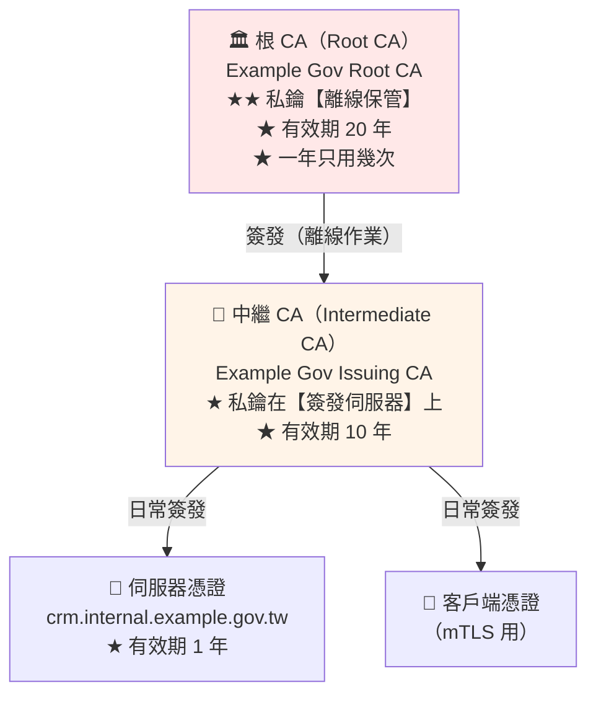
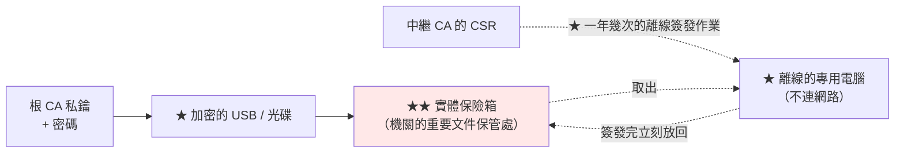

# 自建根 CA

> [!abstract] 這篇你會學到
> - 什麼時候該建立**內部 CA**（以及什麼時候不該）
> - 建立**符合最佳實務的根 CA 目錄結構**
> - 寫出完整的 **`openssl.cnf`**
> - 產生**受密碼保護的根 CA 私鑰**
> - 規劃**根 CA 的離線保管與作業程序**
> - 建立**CA 的稽核與備份機制**

## 前置知識

- [[05-自簽憑證快速產生]] — 自簽憑證的限制
- [[01-PKI與憑證基礎]] — 憑證鏈與信任

---

## 什麼時候該建立內部 CA

```
✅ 適合建立內部 CA：
  · ★ 大量的內部系統需要 HTTPS（10 台以上）
  · ★ 內部主機名不想曝光在公開的 CT 日誌中
  · ★ 需要簽發【IP 位址】的憑證（公開 CA 不簽發）
  · ★ 需要 mTLS（客戶端憑證）
  · 離線／隔離網路（無法連 Let's Encrypt）
  · 需要非標準的憑證屬性

❌ 不適合：
  · 對外服務（★ 用 Let's Encrypt，免費且自動）
  · 少數幾台內部機器（★ 用公開 CA + DNS-01 更省事）
  · 沒有人力維護 CA 的組織
    → ★★ CA 是一個【長期承諾】，不是一次性的工作
```

> [!danger] 建立 CA 是一個長期承諾
> ```
> 你要負責：
>   · ★★ 根 CA 私鑰的保管（10-20 年）
>   · ★ 憑證的簽發、續期、撤銷
>   · ★ CRL 的定期發布（否則撤銷機制失效）
>   · ★ 根憑證的派送與更新（每一台新電腦、每一個新 App）
>   · 作業程序的文件化與交接
>   · CA 私鑰洩漏時的應變計畫
>
> ★★★ 若沒有人力做這些，【不要建立 CA】
>    → 用公開 CA + DNS-01 為內部主機申請憑證（見 03 篇）
> ```

---

## CA 的階層設計



> [!tip] 為什麼要「根 CA + 中繼 CA」兩層
> ```
> 若只有根 CA（一層）：
>   · 根 CA 的私鑰必須【隨時可用】才能簽發憑證
>     → ★ 無法離線保管
>       → 被入侵時【整個信任體系崩潰】
>         → 而且要重新在【所有】客戶端安裝新的根憑證（★ 極痛苦）
>
> 有中繼 CA（兩層）：
>   · 根 CA 私鑰【離線保管】（USB / HSM / 保險箱）
>     → 一年只拿出來幾次（簽發中繼 CA、簽 CRL）
>   · ★ 中繼 CA 被入侵 → 只要撤銷那張中繼憑證，再簽一張新的
>     → 【客戶端完全不用動】（它們信任的是根 CA）
> ```
>
> **小型環境的簡化**：
> ```
> 若只有 5-10 台伺服器且風險可接受：
>   → ★ 可以只用一層（根 CA 直接簽發伺服器憑證）
>   → 但仍應該把根 CA 私鑰加密保護
>   → ★★ 並在文件中記錄「這是簡化版，有已知風險」
> ```

---

## 建立根 CA

### 目錄結構

```bash
#!/usr/bin/env bash
# 建立根 CA 的目錄結構
set -euo pipefail
CA_ROOT="${1:-/root/ca/root-ca}"

echo "═══ 建立根 CA 目錄：$CA_ROOT ═══"

sudo mkdir -p "$CA_ROOT"/{certs,crl,newcerts,private,csr}
sudo chmod 700 "$CA_ROOT/private"       # ★★ 只有 root
sudo chmod 755 "$CA_ROOT"/{certs,crl,newcerts,csr}

# ★ CA 的資料庫（openssl ca 需要）
sudo touch "$CA_ROOT/index.txt"
sudo touch "$CA_ROOT/index.txt.attr"
echo 1000 | sudo tee "$CA_ROOT/serial" >/dev/null       # 憑證序號起始值
echo 1000 | sudo tee "$CA_ROOT/crlnumber" >/dev/null    # CRL 編號起始值

sudo tree -a "$CA_ROOT" 2>/dev/null || sudo ls -laR "$CA_ROOT"
```

```
/root/ca/root-ca/
├── openssl.cnf              ★ CA 的設定檔
├── index.txt                ★★ 已簽發憑證的資料庫（不要手動編輯）
├── index.txt.attr           資料庫屬性
├── serial                   ★ 下一張憑證的序號
├── crlnumber                ★ 下一份 CRL 的編號
├── private/
│   └── ca.key.pem           ★★★ 根 CA 私鑰（chmod 400，離線保管）
├── certs/
│   └── ca.cert.pem          ★ 根 CA 憑證（公開）
├── newcerts/                ★ 每張簽發的憑證副本（以序號命名）
├── crl/
│   └── ca.crl.pem           撤銷清單
└── csr/                     待簽發的 CSR
```

### `openssl.cnf`

```ini
# ═══════════════════════════════════════════════════════════
# /root/ca/root-ca/openssl.cnf
# 根 CA 的設定檔
# ═══════════════════════════════════════════════════════════

[ ca ]
default_ca = CA_default

# ═══════════ CA 的預設設定 ═══════════
[ CA_default ]
dir               = /root/ca/root-ca
certs             = $dir/certs
crl_dir           = $dir/crl
new_certs_dir     = $dir/newcerts
database          = $dir/index.txt
serial            = $dir/serial
RANDFILE          = $dir/private/.rand

# ★ 根 CA 自己的憑證與私鑰
private_key       = $dir/private/ca.key.pem
certificate       = $dir/certs/ca.cert.pem

# ★ CRL 設定
crlnumber         = $dir/crlnumber
crl               = $dir/crl/ca.crl.pem
crl_extensions    = crl_ext
default_crl_days  = 30                    # ★ CRL 的有效期（要定期重新產生）

default_md        = sha256                # ★ 簽章雜湊
name_opt          = ca_default
cert_opt          = ca_default
default_days      = 3650                  # ★ 預設簽發 10 年（給中繼 CA）
preserve          = no
policy            = policy_strict         # ★ 根 CA 用嚴格政策
copy_extensions   = none                  # ★★ 見下方警告
unique_subject    = no                    # 允許同一個 Subject 重複簽發（續期用）

# ═══════════ 政策：根 CA 用嚴格政策 ═══════════
# ★ 中繼 CA 的 C/ST/O 必須與根 CA 相同
[ policy_strict ]
countryName             = match           # ★ 必須相同
stateOrProvinceName     = match           # ★ 必須相同
organizationName        = match           # ★ 必須相同
organizationalUnitName  = optional
commonName              = supplied        # ★ 必須提供
emailAddress            = optional

# ═══════════ 政策：中繼 CA 用寬鬆政策（給伺服器憑證用）═══════════
[ policy_loose ]
countryName             = optional
stateOrProvinceName     = optional
localityName            = optional
organizationName        = optional
organizationalUnitName  = optional
commonName              = supplied
emailAddress            = optional

# ═══════════ 產生 CSR 時的設定 ═══════════
[ req ]
default_bits        = 4096                # ★ 根 CA 用 4096
distinguished_name  = req_distinguished_name
string_mask         = utf8only
utf8                = yes
default_md          = sha256
x509_extensions     = v3_ca               # ★ 自簽根憑證時用這組擴充
prompt              = no

[ req_distinguished_name ]
countryName                     = TW
stateOrProvinceName             = Taiwan
localityName                    = Taipei
0.organizationName              = Example Government Agency
organizationalUnitName          = Information Security Division
commonName                      = Example Gov Root CA
# emailAddress                  = pki@example.gov.tw    # ★ 建議不填

# ═══════════ 擴充：根 CA 憑證 ═══════════
[ v3_ca ]
subjectKeyIdentifier   = hash
authorityKeyIdentifier = keyid:always,issuer
basicConstraints       = critical, CA:true          # ★★ 是 CA
keyUsage               = critical, digitalSignature, cRLSign, keyCertSign
# ★ 根 CA 不設 pathlen，允許多層中繼

# ═══════════ 擴充：中繼 CA 憑證 ═══════════
[ v3_intermediate_ca ]
subjectKeyIdentifier   = hash
authorityKeyIdentifier = keyid:always,issuer
basicConstraints       = critical, CA:true, pathlen:0   # ★★ 不能再簽發下一層 CA
keyUsage               = critical, digitalSignature, cRLSign, keyCertSign
crlDistributionPoints  = URI:http://pki.example.gov.tw/root-ca.crl
authorityInfoAccess    = caIssuers;URI:http://pki.example.gov.tw/root-ca.crt

# ═══════════ 擴充：伺服器憑證 ═══════════
[ server_cert ]
basicConstraints       = critical, CA:FALSE          # ★★ 不是 CA
nsCertType             = server
subjectKeyIdentifier   = hash
authorityKeyIdentifier = keyid,issuer:always
keyUsage               = critical, digitalSignature, keyEncipherment
extendedKeyUsage       = serverAuth
crlDistributionPoints  = URI:http://pki.example.gov.tw/issuing-ca.crl
authorityInfoAccess    = caIssuers;URI:http://pki.example.gov.tw/issuing-ca.crt
# ★ subjectAltName 由簽發時的 -extfile 提供

# ═══════════ 擴充：客戶端憑證（mTLS）═══════════
[ client_cert ]
basicConstraints       = critical, CA:FALSE
nsCertType             = client, email
subjectKeyIdentifier   = hash
authorityKeyIdentifier = keyid,issuer
keyUsage               = critical, nonRepudiation, digitalSignature, keyEncipherment
extendedKeyUsage       = clientAuth, emailProtection
crlDistributionPoints  = URI:http://pki.example.gov.tw/issuing-ca.crl

# ═══════════ 擴充：CRL ═══════════
[ crl_ext ]
authorityKeyIdentifier = keyid:always
```

> [!danger] `copy_extensions` 的安全風險 ★★★
> ```ini
> copy_extensions = copy       # ★★★ 極度危險
> ```
>
> ```
> copy_extensions = copy 會把【CSR 中的所有擴充欄位】原封不動複製到憑證中
>   → 攻擊者可以在 CSR 中放入：
>       basicConstraints = CA:TRUE          ★★★ 讓自己變成 CA！
>       subjectAltName = DNS:*.gov.tw       ★★★ 涵蓋任意網域！
>     → ★★★ 你的 CA 簽發後，攻擊者就能簽發任何憑證
>
> ★★ 這是 CA 設定中最嚴重的安全漏洞
> ```
>
> **正確做法**：
> ```ini
> copy_extensions = none       # ★★ 預設值，保持它
> ```
> **SAN 由 CA 用 `-extfile` 明確指定**（見 [[08-用自建CA簽發伺服器憑證]]）：
> ```bash
> $ openssl ca -config openssl.cnf -extensions server_cert \
>     -extfile <(printf 'subjectAltName=DNS:crm.internal.example.gov.tw\n') \
>     -in request.csr -out cert.pem
> ```
>
> **若真的需要從 CSR 複製 SAN（自動化流程）**：
> ```ini
> copy_extensions = copyall    # 仍然危險
> ```
> **必須在簽發前程式化地驗證 CSR 的內容**（見 08 篇的驗證腳本）。

---

## 產生根 CA 私鑰與憑證

```bash
#!/usr/bin/env bash
# ═══ 【1】★★ 產生根 CA 私鑰（加密保護）═══
set -euo pipefail
CA_ROOT=/root/ca/root-ca
cd "$CA_ROOT"

# ★ 4096 位元 RSA + AES-256 加密
sudo openssl genrsa -aes256 -out private/ca.key.pem 4096
# 會要求輸入密碼 —— ★★ 這個密碼極度重要

# ★ 或用 ECDSA P-384（更快，但相容性稍差）
# sudo openssl ecparam -name secp384r1 -genkey | \
#   sudo openssl ec -aes256 -out private/ca.key.pem

sudo chmod 400 private/ca.key.pem        # ★★ 唯讀，只有 root
sudo ls -l private/ca.key.pem
-r-------- 1 root root 3311 Aug 28 10:00 private/ca.key.pem
```

> [!danger] 根 CA 私鑰的密碼 ★★★
> ```
> 這個密碼保護的是【整個信任體系的根】
>
> ★ 要求：
>   · 至少 20 個字元的隨機密碼（或 diceware 密碼短語）
>   · 【不要】用機關的通用密碼
>   · 【不要】存在密碼管理器的一般資料夾中
>
> ★★ 保管方式（選一種或組合）：
>   ① 【金鑰分持】：分成 3 份，任 2 份可還原（Shamir's Secret Sharing）
>      → 3 位主管各持一份，需要 2 人同時到場
>   ② 【密封信封 + 保險箱】：寫在紙上，密封後放機關保險箱
>   ③ 【專用的密碼管理器】：只有 PKI 管理員能存取，且有稽核記錄
>
> ★★★ 【絕對不要】：
>   ❌ 寫在腳本中
>   ❌ 存在同一台機器的檔案中
>   ❌ 用 email / 即時通訊傳送
>   ❌ 只有一個人知道（★ 那個人離職怎麼辦）
> ```
>
> ```bash
> # ★ 產生強密碼
> $ openssl rand -base64 32
> $ pwgen -sy 32 1
>
> # ★ 金鑰分持（需要 ssss 套件）
> $ sudo apt install -y ssss
> $ echo "你的CA密碼" | ssss-split -t 2 -n 3
> # → 產生 3 份，任 2 份可還原
> $ ssss-combine -t 2
> ```

```bash
# ═══ 【2】產生根 CA 憑證（自簽）═══
$ cd /root/ca/root-ca
$ sudo openssl req -config openssl.cnf \
    -key private/ca.key.pem \
    -new -x509 -days 7300 -sha256 -extensions v3_ca \
    -out certs/ca.cert.pem
# ★ 7300 天 = 20 年
# 會要求輸入私鑰的密碼

$ sudo chmod 444 certs/ca.cert.pem       # ★ 憑證是公開的，唯讀
```

```bash
# ═══ 【3】★★ 驗證根 CA 憑證 ═══
$ sudo openssl x509 -noout -text -in certs/ca.cert.pem

Certificate:
    Data:
        Version: 3 (0x2)
        Serial Number: 0x4a:2b:... (random)
        Signature Algorithm: sha256WithRSAEncryption
        Issuer: C=TW, ST=Taiwan, L=Taipei,
                O=Example Government Agency,
                OU=Information Security Division,
                CN=Example Gov Root CA
        Validity
            Not Before: Aug 28 10:00:00 2026 GMT
            Not After : Aug 23 10:00:00 2046 GMT      ★ 20 年
        Subject: C=TW, ST=Taiwan, ...
                 CN=Example Gov Root CA               ★★ 與 Issuer 相同 = 自簽
        Subject Public Key Info:
            Public Key Algorithm: rsaEncryption
                Public-Key: (4096 bit)                ★ 4096
        X509v3 extensions:
            X509v3 Subject Key Identifier:
                8A:4F:2C:...
            X509v3 Authority Key Identifier:
                keyid:8A:4F:2C:...                    ★ 與 SKI 相同 = 自簽
            X509v3 Basic Constraints: critical
                CA:TRUE                               ★★★ 是 CA
            X509v3 Key Usage: critical
                Digital Signature, Certificate Sign, CRL Sign    ★★
```

```bash
# ★ 快速檢查清單
$ sudo openssl x509 -in certs/ca.cert.pem -noout -subject -issuer
# ★ 兩者必須相同（自簽）

$ sudo openssl x509 -in certs/ca.cert.pem -noout -ext basicConstraints
X509v3 Basic Constraints: critical
    CA:TRUE                    # ★★ 必須是 TRUE

$ sudo openssl x509 -in certs/ca.cert.pem -noout -ext keyUsage
X509v3 Key Usage: critical
    Certificate Sign, CRL Sign # ★★ 必須有這兩個

$ sudo openssl x509 -in certs/ca.cert.pem -noout -dates
# ★ 有效期應該是 15-25 年

$ sudo openssl x509 -in certs/ca.cert.pem -noout -fingerprint -sha256
SHA256 Fingerprint=A1:B2:C3:...
# ★★ 【記下這個指紋】—— 派送根憑證時要讓使用者核對
```

---

## 根 CA 的離線保管



```bash
#!/usr/bin/env bash
# ═══ 把根 CA 打包並加密（用於離線保管）═══
set -euo pipefail
CA_ROOT=/root/ca/root-ca
DATE=$(date +%Y%m%d)
OUT="/root/root-ca-backup-$DATE.tar.gz.enc"

echo "═══ 打包根 CA ═══"

# ★ 打包（含私鑰、憑證、設定、資料庫）
sudo tar czf - -C /root/ca root-ca | \
  sudo openssl enc -aes-256-cbc -pbkdf2 -iter 600000 -salt -out "$OUT"
# ★ 會要求輸入【備份加密密碼】（與 CA 私鑰密碼不同）

sudo chmod 400 "$OUT"

# ★ 計算校驗碼
sudo sha256sum "$OUT" | sudo tee "${OUT}.sha256"

echo "✓ $OUT"
echo
echo "★★ 接下來："
cat <<'EOF'
  ① 把 .enc 與 .sha256 複製到【至少兩個】獨立的媒體
     （USB × 2、或 USB + 光碟）
  ② 分別放在【不同的實體位置】
     （機關保險箱 + 異地備援保管處）
  ③ 【備份加密密碼】與【CA 私鑰密碼】分開保管
  ④ 記錄在《PKI 作業手冊》中：
     · 誰有權限取用
     · 取用需要幾人同時到場
     · 取用時的記錄表格
  ⑤ ★★ 每年演練一次還原程序
     （不然真的需要時可能發現備份是壞的）
  ⑥ 從線上的機器【刪除】根 CA 私鑰
     sudo shred -vfz -n 3 /root/ca/root-ca/private/ca.key.pem
EOF
```

```bash
# ═══ 還原 ═══
$ sudo sha256sum -c root-ca-backup-20260828.tar.gz.enc.sha256
$ sudo openssl enc -d -aes-256-cbc -pbkdf2 -iter 600000 \
    -in root-ca-backup-20260828.tar.gz.enc | sudo tar xzf - -C /root/ca
```

> [!danger] 根 CA 私鑰不應該留在線上的機器上
> ```
> 理想的做法：
>   ① 在【離線的專用電腦】上建立根 CA
>      （★ 從未連過網路，或用 Live USB）
>   ② 產生中繼 CA 的憑證
>   ③ 把中繼 CA 的私鑰與憑證帶到線上的簽發伺服器
>   ④ ★★ 根 CA 私鑰【只留在加密的離線媒體中】
>   ⑤ 需要時（簽發新的中繼 CA、簽 CRL）才拿出來
>
> 實務上的折衷（小型環境）：
>   · 根 CA 私鑰加密後留在一台【不對外服務】的管理機上
>   · 該機器有嚴格的存取控制與稽核
>   · ★ 在文件中明確記錄「這是簡化版，有已知風險」
> ```

---

## 產生 CRL

```bash
# ═══ ★ 產生初始的 CRL（即使還沒撤銷任何憑證）═══
$ cd /root/ca/root-ca
$ sudo openssl ca -config openssl.cnf -gencrl -out crl/ca.crl.pem
# 需要輸入根 CA 私鑰的密碼

$ sudo openssl crl -in crl/ca.crl.pem -noout -text
Certificate Revocation List (CRL):
        Version 2 (0x1)
        Signature Algorithm: sha256WithRSAEncryption
        Issuer: C=TW, ..., CN=Example Gov Root CA
        Last Update: Aug 28 10:00:00 2026 GMT
        Next Update: Sep 27 10:00:00 2026 GMT      ★ 30 天後過期
        CRL extensions:
            X509v3 Authority Key Identifier:
                keyid:8A:4F:...
No Revoked Certificates.

# ★ 轉成 DER 格式（某些系統需要，特別是 Windows）
$ sudo openssl crl -in crl/ca.crl.pem -outform DER -out crl/ca.crl
```

> [!warning] CRL 會過期 ★
> ```
> default_crl_days = 30
>   → CRL 的 Next Update 是 30 天後
>     → ★★ 過期的 CRL 【某些系統會拒絕接受】
>       → 導致所有憑證驗證失敗
>
> ★ 必須【定期重新產生並發布】CRL
>   → 即使沒有任何憑證被撤銷
> ```
>
> **但根 CA 的 CRL 需要私鑰（離線保管）** ——
> 所以實務上：
> ```
> ① 根 CA 的 CRL：★ 有效期設長一點（例如 180 天），
>    每半年在離線作業時重新產生
> ② 中繼 CA 的 CRL：★ 30 天，由簽發伺服器自動產生（見 07 篇）
> ```

```ini
# ★ 根 CA 的 openssl.cnf 調整
[ CA_default ]
default_crl_days = 180        # ★ 根 CA 的 CRL 有效期長一點
```

---

## 發布 CA 憑證與 CRL

```bash
# ═══ 建立 PKI 發布網站 ═══
$ sudo mkdir -p /var/www/pki
$ sudo cp /root/ca/root-ca/certs/ca.cert.pem /var/www/pki/root-ca.crt
$ sudo cp /root/ca/root-ca/crl/ca.crl.pem /var/www/pki/root-ca.crl
$ sudo cp /root/ca/root-ca/crl/ca.crl /var/www/pki/root-ca.der.crl

# ★ 也提供 DER 格式（Windows 匯入較方便）
$ sudo openssl x509 -in /var/www/pki/root-ca.crt -outform DER \
    -out /var/www/pki/root-ca.der.crt

$ sudo chmod 644 /var/www/pki/*
```

```nginx
# ═══ /etc/nginx/sites-available/pki ═══
# ★ 注意：PKI 發布站台通常用 HTTP（不是 HTTPS）
#   因為客戶端可能還沒信任你的 CA
server {
    listen 80;
    server_name pki.example.gov.tw;

    root /var/www/pki;
    autoindex on;
    charset utf-8;

    # ★ 正確的 MIME type
    location ~ \.crt$ {
        default_type application/x-x509-ca-cert;
        add_header Content-Disposition "attachment" always;
    }
    location ~ \.crl$ {
        default_type application/pkix-crl;
        # ★ CRL 不要快取太久
        expires 1h;
        add_header Cache-Control "public, max-age=3600";
    }
    location ~ \.pem$ {
        default_type application/x-pem-file;
    }

    access_log /var/log/nginx/pki-access.log;
}
```

```html
<!-- /var/www/pki/index.html -->
<!DOCTYPE html>
<html lang="zh-Hant">
<head>
    <meta charset="utf-8">
    <title>Example Government Agency PKI</title>
    <style>
        body { font-family: sans-serif; max-width: 800px; margin: 2em auto; padding: 0 1em; }
        code { background: #f4f4f4; padding: 2px 6px; }
        .fp { font-family: monospace; word-break: break-all; background: #fffbe6;
              padding: 1em; border-left: 4px solid #f0c000; }
    </style>
</head>
<body>
<h1>Example Government Agency 憑證機構</h1>

<h2>根憑證下載</h2>
<ul>
    <li><a href="root-ca.crt">root-ca.crt</a>（PEM 格式，Linux / macOS）</li>
    <li><a href="root-ca.der.crt">root-ca.der.crt</a>（DER 格式，Windows）</li>
</ul>

<h2>★ 請務必核對指紋</h2>
<p>安裝前請核對 SHA-256 指紋，確認下載的憑證未被竄改：</p>
<div class="fp">
SHA256: A1:B2:C3:D4:E5:F6:...
</div>
<p>核對方式：</p>
<pre>openssl x509 -in root-ca.crt -noout -fingerprint -sha256</pre>

<h2>憑證撤銷清單（CRL）</h2>
<ul>
    <li><a href="root-ca.crl">root-ca.crl</a></li>
    <li><a href="issuing-ca.crl">issuing-ca.crl</a></li>
</ul>

<h2>安裝說明</h2>
<p>請參閱《內部根憑證安裝指引》，或聯絡資訊室（分機 1234）。</p>
</body>
</html>
```

> [!danger] 派送根憑證時一定要讓使用者核對指紋 ★★
> ```
> 若使用者從一個【被竄改的】來源下載根憑證並安裝
>   → ★★★ 攻擊者可以對這台電腦的【所有 HTTPS 連線】做中間人
>     → 包含網路銀行、email、政府系統
>
> ★ 所以：
>   ① 在【多個獨立的管道】公布指紋
>      （PKI 網站、內部公告、email、實體公文）
>   ② 使用者安裝前核對
>   ③ ★ 最好用【自動派送】（GPO / MDM）避免人為錯誤
> ```

---

## 完整實戰範例

### 一鍵建立根 CA

```bash
#!/usr/bin/env bash
# /usr/local/bin/init-root-ca —— 建立根 CA
set -euo pipefail

CA_ROOT="${CA_ROOT:-/root/ca/root-ca}"
C="${CA_C:-TW}"
ST="${CA_ST:-Taiwan}"
L="${CA_L:-Taipei}"
O="${CA_O:-Example Government Agency}"
OU="${CA_OU:-Information Security Division}"
CN="${CA_CN:-Example Gov Root CA}"
DAYS="${CA_DAYS:-7300}"
BITS="${CA_BITS:-4096}"
PKI_URL="${PKI_URL:-http://pki.example.gov.tw}"

echo "═══════ 建立根 CA ═══════"
echo "  目錄     : $CA_ROOT"
echo "  CN       : $CN"
echo "  組織     : $O / $OU"
echo "  有效期   : $DAYS 天（約 $((DAYS/365)) 年）"
echo "  金鑰     : RSA $BITS"
echo "  PKI 網址 : $PKI_URL"
echo

[ -f "$CA_ROOT/private/ca.key.pem" ] && {
    echo "✗✗ 根 CA 私鑰已存在：$CA_ROOT/private/ca.key.pem"
    echo "   若要重建，請先備份並手動移除"
    exit 1
}

read -rp "確認要建立嗎？(yes/no) " ans
[ "$ans" = "yes" ] || { echo "已取消"; exit 0; }

# ══ 【1】目錄結構 ══
echo -e "\n【1】建立目錄結構"
sudo mkdir -p "$CA_ROOT"/{certs,crl,newcerts,private,csr}
sudo chmod 700 "$CA_ROOT/private"
sudo touch "$CA_ROOT/index.txt" "$CA_ROOT/index.txt.attr"
echo 1000 | sudo tee "$CA_ROOT/serial" >/dev/null
echo 1000 | sudo tee "$CA_ROOT/crlnumber" >/dev/null
echo "  ✓ $CA_ROOT"

# ══ 【2】openssl.cnf ══
echo -e "\n【2】產生 openssl.cnf"
sudo tee "$CA_ROOT/openssl.cnf" >/dev/null <<EOF
# 根 CA 設定檔 —— 產生於 $(date -Is)
[ ca ]
default_ca = CA_default

[ CA_default ]
dir               = $CA_ROOT
certs             = \$dir/certs
crl_dir           = \$dir/crl
new_certs_dir     = \$dir/newcerts
database          = \$dir/index.txt
serial            = \$dir/serial
RANDFILE          = \$dir/private/.rand
private_key       = \$dir/private/ca.key.pem
certificate       = \$dir/certs/ca.cert.pem
crlnumber         = \$dir/crlnumber
crl               = \$dir/crl/ca.crl.pem
crl_extensions    = crl_ext
default_crl_days  = 180
default_md        = sha256
name_opt          = ca_default
cert_opt          = ca_default
default_days      = 3650
preserve          = no
policy            = policy_strict
copy_extensions   = none
unique_subject    = no

[ policy_strict ]
countryName             = match
stateOrProvinceName     = match
organizationName        = match
organizationalUnitName  = optional
commonName              = supplied
emailAddress            = optional

[ policy_loose ]
countryName             = optional
stateOrProvinceName     = optional
localityName            = optional
organizationName        = optional
organizationalUnitName  = optional
commonName              = supplied
emailAddress            = optional

[ req ]
default_bits        = $BITS
distinguished_name  = req_distinguished_name
string_mask         = utf8only
utf8                = yes
default_md          = sha256
x509_extensions     = v3_ca
prompt              = no

[ req_distinguished_name ]
countryName             = $C
stateOrProvinceName     = $ST
localityName            = $L
0.organizationName      = $O
organizationalUnitName  = $OU
commonName              = $CN

[ v3_ca ]
subjectKeyIdentifier   = hash
authorityKeyIdentifier = keyid:always,issuer
basicConstraints       = critical, CA:true
keyUsage               = critical, digitalSignature, cRLSign, keyCertSign

[ v3_intermediate_ca ]
subjectKeyIdentifier   = hash
authorityKeyIdentifier = keyid:always,issuer
basicConstraints       = critical, CA:true, pathlen:0
keyUsage               = critical, digitalSignature, cRLSign, keyCertSign
crlDistributionPoints  = URI:$PKI_URL/root-ca.crl
authorityInfoAccess    = caIssuers;URI:$PKI_URL/root-ca.crt

[ server_cert ]
basicConstraints       = critical, CA:FALSE
nsCertType             = server
subjectKeyIdentifier   = hash
authorityKeyIdentifier = keyid,issuer:always
keyUsage               = critical, digitalSignature, keyEncipherment
extendedKeyUsage       = serverAuth
crlDistributionPoints  = URI:$PKI_URL/issuing-ca.crl
authorityInfoAccess    = caIssuers;URI:$PKI_URL/issuing-ca.crt

[ client_cert ]
basicConstraints       = critical, CA:FALSE
nsCertType             = client, email
subjectKeyIdentifier   = hash
authorityKeyIdentifier = keyid,issuer
keyUsage               = critical, nonRepudiation, digitalSignature, keyEncipherment
extendedKeyUsage       = clientAuth, emailProtection
crlDistributionPoints  = URI:$PKI_URL/issuing-ca.crl

[ crl_ext ]
authorityKeyIdentifier = keyid:always
EOF
echo "  ✓ $CA_ROOT/openssl.cnf"

# ══ 【3】★★ 私鑰 ══
echo -e "\n【3】★★ 產生根 CA 私鑰（RSA $BITS，AES-256 加密）"
cat <<'EOF'
  ★★★ 接下來要設定的密碼保護的是【整個信任體系的根】

  要求：
    · 至少 20 個字元的隨機密碼
    · 【不要】用機關的通用密碼
    · 【不要】只有一個人知道

  保管建議：
    · 金鑰分持（ssss-split -t 2 -n 3）
    · 或 密封信封 + 機關保險箱
    · 或 專用的密碼管理器（有稽核記錄）

  產生強密碼：openssl rand -base64 32
EOF
read -rp "  準備好了嗎？按 Enter 繼續..."
sudo openssl genrsa -aes256 -out "$CA_ROOT/private/ca.key.pem" "$BITS"
sudo chmod 400 "$CA_ROOT/private/ca.key.pem"
echo "  ✓ $CA_ROOT/private/ca.key.pem（chmod 400）"

# ══ 【4】根 CA 憑證 ══
echo -e "\n【4】產生根 CA 憑證（自簽，$DAYS 天）"
sudo openssl req -config "$CA_ROOT/openssl.cnf" \
    -key "$CA_ROOT/private/ca.key.pem" \
    -new -x509 -days "$DAYS" -sha256 -extensions v3_ca \
    -out "$CA_ROOT/certs/ca.cert.pem"
sudo chmod 444 "$CA_ROOT/certs/ca.cert.pem"
echo "  ✓ $CA_ROOT/certs/ca.cert.pem"

# ══ 【5】★★ 驗證 ══
echo -e "\n【5】★★ 驗證"
FAIL=0
chk() {
    if eval "$2" >/dev/null 2>&1; then printf '  ✓ %s\n' "$1"
    else printf '  ✗ %s\n' "$1"; FAIL=1; fi
}

SUBJ=$(sudo openssl x509 -in "$CA_ROOT/certs/ca.cert.pem" -noout -subject)
ISSU=$(sudo openssl x509 -in "$CA_ROOT/certs/ca.cert.pem" -noout -issuer)
[ "${SUBJ#subject=}" = "${ISSU#issuer=}" ] && echo "  ✓ 自簽（Subject == Issuer）" \
  || { echo "  ✗ 不是自簽"; FAIL=1; }

chk "CA:TRUE" "sudo openssl x509 -in '$CA_ROOT/certs/ca.cert.pem' -noout -ext basicConstraints | grep -q 'CA:TRUE'"
chk "有 Certificate Sign" "sudo openssl x509 -in '$CA_ROOT/certs/ca.cert.pem' -noout -ext keyUsage | grep -q 'Certificate Sign'"
chk "有 CRL Sign" "sudo openssl x509 -in '$CA_ROOT/certs/ca.cert.pem' -noout -ext keyUsage | grep -q 'CRL Sign'"
chk "私鑰權限 400" "[ \$(stat -c '%a' '$CA_ROOT/private/ca.key.pem') = '400' ]"
chk "私鑰已加密" "sudo head -2 '$CA_ROOT/private/ca.key.pem' | grep -q 'ENCRYPTED'"

echo
echo "  ── 憑證資訊 ──"
sudo openssl x509 -in "$CA_ROOT/certs/ca.cert.pem" -noout -subject -dates | sed 's/^/    /'

echo
echo "  ── ★★ SHA-256 指紋（派送時要公布這個）──"
FP=$(sudo openssl x509 -in "$CA_ROOT/certs/ca.cert.pem" -noout -fingerprint -sha256 | cut -d= -f2)
echo "    $FP"

# ══ 【6】CRL ══
echo -e "\n【6】產生初始 CRL"
sudo openssl ca -config "$CA_ROOT/openssl.cnf" -gencrl -out "$CA_ROOT/crl/ca.crl.pem"
sudo openssl crl -in "$CA_ROOT/crl/ca.crl.pem" -outform DER -out "$CA_ROOT/crl/ca.crl"
echo "  ✓ $CA_ROOT/crl/ca.crl.pem"

# ══ 【7】下一步 ══
echo
echo "═══════ 完成 ═══════"
[ "$FAIL" -eq 0 ] && echo "  ✓ 所有檢查通過" || echo "  ✗ 有檢查未通過，請確認"

cat <<EOF

★★★ 接下來的重要步驟：

  ① 【備份根 CA】（★ 最重要）
       sudo tar czf - -C \$(dirname $CA_ROOT) \$(basename $CA_ROOT) | \\
         sudo openssl enc -aes-256-cbc -pbkdf2 -iter 600000 -salt \\
           -out /root/root-ca-backup-\$(date +%Y%m%d).tar.gz.enc
     → 複製到至少兩個獨立的媒體，放在不同的實體位置

  ② 【建立中繼 CA】（見 [[07-自建中繼CA與憑證鏈]]）

  ③ 【發布根憑證】到 $PKI_URL
       sudo mkdir -p /var/www/pki
       sudo cp $CA_ROOT/certs/ca.cert.pem /var/www/pki/root-ca.crt
       sudo openssl x509 -in $CA_ROOT/certs/ca.cert.pem -outform DER \\
         -out /var/www/pki/root-ca.der.crt
       sudo cp $CA_ROOT/crl/ca.crl.pem /var/www/pki/root-ca.crl

  ④ ★★ 【公布指紋】讓使用者核對：
       SHA256: $FP

  ⑤ 【撰寫 PKI 作業手冊】記錄：
       · 根 CA 私鑰與密碼的保管方式與取用程序
       · 憑證簽發的申請與核准流程
       · CRL 的產生與發布排程
       · 應變程序（私鑰洩漏、CA 憑證即將到期）

  ⑥ ★★ 【把根 CA 私鑰移到離線媒體】並從線上機器刪除：
       sudo shred -vfz -n 3 $CA_ROOT/private/ca.key.pem
     （★ 確認備份可還原後才做）
EOF
```

### CA 稽核腳本

```bash
#!/usr/bin/env bash
# /usr/local/bin/ca-audit —— CA 稽核
CA_ROOT="${1:-/root/ca/root-ca}"
echo "═══ CA 稽核：$CA_ROOT ═══"

echo -e "\n【1】目錄與權限"
for d in private certs crl newcerts csr; do
    [ -d "$CA_ROOT/$d" ] && printf '  ✓ %-10s %s\n' "$d" "$(stat -c '%a %U:%G' "$CA_ROOT/$d")" \
                         || echo "  ✗ $d 不存在"
done
P=$(stat -c '%a' "$CA_ROOT/private" 2>/dev/null)
[ "$P" = "700" ] && echo "  ✓ private 權限 700" || echo "  ✗✗ private 權限 $P【應為 700】"

echo -e "\n【2】★★ 私鑰"
K="$CA_ROOT/private/ca.key.pem"
if [ -f "$K" ]; then
    echo "  ⚠⚠ 私鑰【存在於線上機器】—— 理想上應該離線保管"
    printf '     權限：%s\n' "$(stat -c '%a %U:%G' "$K")"
    [ "$(stat -c '%a' "$K")" = "400" ] && echo "     ✓ 權限 400" \
                                       || echo "     ✗✗ 權限應為 400"
    sudo head -2 "$K" | grep -q 'ENCRYPTED' && echo "     ✓ 已加密" \
                                            || echo "     ✗✗✗ 【私鑰未加密！】"
    B=$(sudo openssl rsa -in "$K" -noout -text -passin pass:x 2>/dev/null | \
        grep -oP 'Private-Key: \(\K\d+' || echo "?")
    echo "     金鑰長度：${B} bit"
else
    echo "  ✓ 私鑰不在線上（已離線保管）"
fi

echo -e "\n【3】CA 憑證"
C="$CA_ROOT/certs/ca.cert.pem"
if [ -f "$C" ]; then
    sudo openssl x509 -in "$C" -noout -subject -dates | sed 's/^/  /'
    END=$(sudo openssl x509 -in "$C" -noout -enddate | cut -d= -f2)
    DAYS=$(( ($(date -d "$END" +%s) - $(date +%s)) / 86400 ))
    printf '  剩餘 %d 天（%.1f 年）%s\n' "$DAYS" "$(echo "scale=1;$DAYS/365"|bc)" \
      "$([ "$DAYS" -lt 1825 ] && echo '⚠ 少於 5 年，該規劃更新了' || echo '✓')"
    echo "  ── 擴充 ──"
    sudo openssl x509 -in "$C" -noout -ext basicConstraints,keyUsage | sed 's/^/    /'
    echo "  ── ★ 指紋 ──"
    sudo openssl x509 -in "$C" -noout -fingerprint -sha256 | sed 's/^/    /'
else
    echo "  ✗✗ 找不到 CA 憑證"
fi

echo -e "\n【4】已簽發的憑證"
if [ -f "$CA_ROOT/index.txt" ]; then
    TOTAL=$(wc -l < "$CA_ROOT/index.txt")
    VALID=$(grep -c '^V' "$CA_ROOT/index.txt" 2>/dev/null || echo 0)
    REVOKED=$(grep -c '^R' "$CA_ROOT/index.txt" 2>/dev/null || echo 0)
    EXPIRED=$(grep -c '^E' "$CA_ROOT/index.txt" 2>/dev/null || echo 0)
    echo "  總計 $TOTAL  有效 $VALID  已撤銷 $REVOKED  已過期 $EXPIRED"
    echo "  ── 最近簽發的 5 張 ──"
    tail -5 "$CA_ROOT/index.txt" | awk -F'\t' '{printf "    %s  %s  %s\n", $1, $2, $6}'
    [ "$REVOKED" -gt 0 ] && {
        echo "  ── 已撤銷 ──"
        grep '^R' "$CA_ROOT/index.txt" | awk -F'\t' '{printf "    %s  %s\n", $3, $6}'
    }
else
    echo "  ✗ 找不到 index.txt"
fi

echo -e "\n【5】★ CRL"
CRL="$CA_ROOT/crl/ca.crl.pem"
if [ -f "$CRL" ]; then
    NEXT=$(sudo openssl crl -in "$CRL" -noout -nextupdate | cut -d= -f2)
    DAYS=$(( ($(date -d "$NEXT" +%s) - $(date +%s)) / 86400 ))
    printf '  Next Update: %s（剩 %d 天）%s\n' "$NEXT" "$DAYS" \
      "$([ "$DAYS" -lt 7 ] && echo '⚠⚠ 即將過期【要重新產生】' || echo '✓')"
    N=$(sudo openssl crl -in "$CRL" -noout -text | grep -c 'Serial Number' || echo 0)
    echo "  已撤銷的憑證數：$N"
else
    echo "  ✗✗ 沒有 CRL"
fi

echo -e "\n【6】★ 序號與 CRL 編號"
[ -f "$CA_ROOT/serial" ] && echo "  下一張憑證序號：$(cat "$CA_ROOT/serial")"
[ -f "$CA_ROOT/crlnumber" ] && echo "  下一份 CRL 編號：$(cat "$CA_ROOT/crlnumber")"

echo -e "\n【7】設定檔安全檢查"
CNF="$CA_ROOT/openssl.cnf"
if [ -f "$CNF" ]; then
    grep -q 'copy_extensions\s*=\s*copy' "$CNF" && \
      echo "  ✗✗✗ 【copy_extensions = copy —— 極度危險！攻擊者可自製 CA 憑證】" || \
      echo "  ✓ copy_extensions 安全"
    grep -q 'default_md\s*=\s*sha256\|sha384\|sha512' "$CNF" && echo "  ✓ default_md 安全" \
      || echo "  ⚠ 檢查 default_md（不應是 sha1/md5）"
    grep -oP 'default_crl_days\s*=\s*\K\d+' "$CNF" | head -1 | \
      awk '{printf "  ○ default_crl_days = %s\n", $1}'
fi

echo -e "\n【8】備份"
ls -lh /root/*root-ca-backup*.enc 2>/dev/null | sed 's/^/  /' || \
  echo "  ⚠⚠ 【找不到備份檔】—— CA 沒有備份是極高的風險"

echo -e "\n【9】★ 發布狀態"
for f in /var/www/pki/root-ca.crt /var/www/pki/root-ca.crl; do
    [ -f "$f" ] && printf '  ✓ %s（%s）\n' "$f" "$(stat -c '%y' "$f" | cut -d. -f1)" \
                || echo "  ⚠ $f 未發布"
done
```

---

## 常見錯誤與排錯

| 現象／問題 | 原因 | 解法 |
| --- | --- | --- |
| **`copy_extensions = copy`** ★★★ | **極度危險的設定** | **改成 `none`**；SAN 用 `-extfile` 指定 |
| `unable to load CA private key` | 密碼錯誤或檔案權限 | 確認密碼；`ls -l private/` |
| **`TXT_DB error number 2`** | **`index.txt` 中已有相同的 Subject** | `unique_subject = no`；或撤銷舊的 |
| `error while loading serial number` | `serial` 檔案不存在或格式錯 | `echo 1000 > serial` |
| **CA 憑證的 `CA:FALSE`** | 用錯了 `-extensions` | 用 `-extensions v3_ca` |
| **簽發的憑證沒有 SAN** | 沒有用 `-extfile` | 見 [[08-用自建CA簽發伺服器憑證]] |
| **CRL 過期導致驗證失敗** ★ | 沒有定期重新產生 | 排程產生；根 CA 的 CRL 有效期設長一點 |
| `policy_strict` 拒絕 CSR | C/ST/O 與根 CA 不同 | 改用 `policy_loose`；或修正 CSR |
| **私鑰未加密** ★★ | 忘了 `-aes256` | 重新產生；或 `openssl rsa -aes256 -in x.key -out x.key` |
| **忘記 CA 私鑰密碼** ★★★ | — | **無法還原**，只能重建整個 CA 並重新派送根憑證 |
| **根 CA 憑證即將到期** ★★ | 20 年到了 | 見下方 |
| `index.txt` 損毀 | 手動編輯或磁碟問題 | 從備份還原；或從 `newcerts/` 重建 |

### 根 CA 憑證即將到期

```
★★ 這是 PKI 最麻煩的事件之一

問題：
  · 根憑證到期 → 【所有】由它簽發的憑證全部失效
  · 要在【所有】客戶端安裝新的根憑證

★ 正確的處理（提前 3-5 年開始）：
  ① 產生【新的】根 CA（新的金鑰對）
  ② ★ 用【舊的】根 CA 簽發一張「交叉憑證」給新的根 CA
     → 讓還沒安裝新根憑證的客戶端也能驗證
  ③ 開始派送新的根憑證（與舊的並存）
  ④ 新簽發的憑證改用新的中繼 CA
  ⑤ 等舊的根憑證自然到期後移除

★★ 所以根 CA 的有效期要設得夠長（20 年），
   但【不要超過 25 年】（加密標準可能已淘汰）
```

```bash
# ★ 監控根 CA 的到期日
$ END=$(openssl x509 -in /var/www/pki/root-ca.crt -noout -enddate | cut -d= -f2)
$ DAYS=$(( ($(date -d "$END" +%s) - $(date +%s)) / 86400 ))
$ echo "根 CA 剩餘 $DAYS 天（$(echo "scale=1;$DAYS/365"|bc) 年）"
$ [ "$DAYS" -lt 1825 ] && echo "⚠⚠ 少於 5 年，應開始規劃更新"
```

---

## 安全性注意事項

> [!danger] CA 私鑰洩漏 = 整個信任體系崩潰 ★★★
> ```
> 攻擊者取得根 CA 私鑰後可以：
>   · 簽發【任何網域】的憑證（google.com、你的網銀…）
>   · 對所有信任你的 CA 的裝置做中間人攻擊
>   · ★★ 而且【不會有任何警告】
>
> 應變（極為痛苦）：
>   ① 立刻停止使用該 CA
>   ② 在【所有】客戶端移除該根憑證（★ 每一台電腦、每一支手機）
>   ③ 重建新的 CA
>   ④ 重新簽發【所有】憑證
>   ⑤ 重新派送新的根憑證
>   ⑥ 事件通報與檢討
> ```
>
> **預防**：
> ```
> ① ★★ 根 CA 私鑰【離線保管】（加密的 USB + 保險箱）
> ② ★★ 私鑰用強密碼加密，密碼【分持保管】
> ③ ★ 用中繼 CA 做日常簽發（根 CA 只用於簽中繼 CA 與 CRL）
> ④ ★ 簽發伺服器（中繼 CA）嚴格加固與監控
> ⑤ 定期稽核 index.txt（是否有未授權的簽發）
> ⑥ 文件化的作業程序與稽核記錄
> ```

> [!warning] `copy_extensions = copy` 是 CA 設定中最嚴重的漏洞
> ```
> 攻擊流程：
>   ① 攻擊者提交一份 CSR，其中包含：
>        basicConstraints = CA:TRUE
>        subjectAltName = DNS:*.example.gov.tw
>   ② 你的 CA 用 copy_extensions = copy 簽發
>   ③ ★★★ 攻擊者拿到一張【CA 憑證】
>     → 可以簽發【任何網域】的憑證
>       → 而且被你的所有客戶端信任
> ```
>
> ```ini
> copy_extensions = none       # ★★ 保持預設值
> ```
> **SAN 由 CA 端用 `-extfile` 明確指定，並在簽發前驗證 CSR 的內容。**

> [!tip] 建立 PKI 作業手冊
> ```markdown
> # PKI 作業手冊（範例大綱）
>
> ## 1. 角色與職責
>    - PKI 管理員（2 人以上，避免單點）
>    - 核准人（憑證申請的核准）
>    - 稽核人
>
> ## 2. 根 CA 的保管
>    - 私鑰儲存位置與媒體
>    - 密碼的分持方式與持有人
>    - ★ 取用程序（需幾人同時到場、記錄表格）
>    - 備份的位置與定期驗證排程
>
> ## 3. 憑證簽發流程
>    - 申請表單與必要資訊
>    - 核准層級
>    - ★ CSR 的驗證檢查清單
>    - 簽發後的交付方式
>    - 記錄與歸檔
>
> ## 4. 憑證撤銷流程
>    - 撤銷的觸發條件（私鑰洩漏、人員離職、系統下線）
>    - 撤銷的核准與執行
>    - ★ CRL 的重新產生與發布
>
> ## 5. 定期作業
>    - ★ CRL 產生排程（中繼 CA 每 30 天，根 CA 每 180 天）
>    - 到期憑證的清查（每月）
>    - CA 稽核（每季）
>    - ★ 備份還原演練（每年）
>
> ## 6. 應變程序
>    - CA 私鑰疑似洩漏
>    - 根 CA 憑證即將到期（提前 5 年）
>    - 簽發伺服器故障
>    - ★ PKI 管理員離職的交接
>
> ## 7. 附錄
>    - 根憑證的 SHA-256 指紋
>    - 相關指令速查
>    - 聯絡人清單
> ```

---

## 速查表

### 何時建立內部 CA

```
✅ 10 台以上內部系統 · 不想曝光在 CT 日誌 · 需要 IP 憑證 · 需要 mTLS · 離線網路
❌ 對外服務（用 Let's Encrypt）· 少數幾台（用公開 CA + DNS-01）
★★ CA 是【長期承諾】—— 沒人力維護就不要建
```

### 目錄結構

```bash
sudo mkdir -p /root/ca/root-ca/{certs,crl,newcerts,private,csr}
sudo chmod 700 /root/ca/root-ca/private       # ★★
sudo touch /root/ca/root-ca/index.txt{,.attr}
echo 1000 | sudo tee /root/ca/root-ca/{serial,crlnumber}
```

### ★★ 產生根 CA

```bash
cd /root/ca/root-ca

# ① 私鑰（★ 加密 + 強密碼）
sudo openssl genrsa -aes256 -out private/ca.key.pem 4096
sudo chmod 400 private/ca.key.pem

# ② 自簽憑證（20 年）
sudo openssl req -config openssl.cnf -key private/ca.key.pem \
  -new -x509 -days 7300 -sha256 -extensions v3_ca -out certs/ca.cert.pem
sudo chmod 444 certs/ca.cert.pem

# ③ 初始 CRL
sudo openssl ca -config openssl.cnf -gencrl -out crl/ca.crl.pem
```

### ★★★ openssl.cnf 的關鍵設定

```ini
[ CA_default ]
copy_extensions = none                  # ★★★ 絕不能是 copy
default_md      = sha256
policy          = policy_strict
default_crl_days = 180                  # 根 CA 的 CRL 有效期

[ v3_ca ]                               # 根 CA 憑證
basicConstraints = critical, CA:true
keyUsage = critical, digitalSignature, cRLSign, keyCertSign

[ v3_intermediate_ca ]                  # 中繼 CA
basicConstraints = critical, CA:true, pathlen:0    # ★ 不能再簽下一層

[ server_cert ]                         # 伺服器憑證
basicConstraints = critical, CA:FALSE   # ★★
keyUsage = critical, digitalSignature, keyEncipherment
extendedKeyUsage = serverAuth
```

### ★★ 驗證根 CA

```bash
openssl x509 -in certs/ca.cert.pem -noout -subject -issuer   # ★ 兩者相同 = 自簽
openssl x509 -in certs/ca.cert.pem -noout -ext basicConstraints   # ★ CA:TRUE
openssl x509 -in certs/ca.cert.pem -noout -ext keyUsage      # ★ Certificate Sign, CRL Sign
openssl x509 -in certs/ca.cert.pem -noout -dates             # 15-25 年
openssl x509 -in certs/ca.cert.pem -noout -fingerprint -sha256   # ★★ 派送時公布
head -2 private/ca.key.pem | grep ENCRYPTED                  # ★ 私鑰已加密
```

### ★★ 私鑰保管

```
密碼：≥20 字元隨機 · 不用通用密碼 · 不只一人知道
保管：金鑰分持（ssss-split -t 2 -n 3）· 密封信封+保險箱 · 專用密碼管理器
❌ 寫在腳本 · 存同一台機器 · email 傳送 · 只有一人知道

# 備份（★ 至少兩個獨立媒體，不同實體位置）
sudo tar czf - -C /root/ca root-ca | \
  sudo openssl enc -aes-256-cbc -pbkdf2 -iter 600000 -salt -out backup.tar.gz.enc

# ★ 確認備份可還原後，從線上機器刪除私鑰
sudo shred -vfz -n 3 private/ca.key.pem
```

### 發布

```bash
sudo cp certs/ca.cert.pem /var/www/pki/root-ca.crt
sudo openssl x509 -in certs/ca.cert.pem -outform DER -out /var/www/pki/root-ca.der.crt
sudo cp crl/ca.crl.pem /var/www/pki/root-ca.crl
```
```nginx
location ~ \.crt$ { default_type application/x-x509-ca-cert; }
location ~ \.crl$ { default_type application/pkix-crl; expires 1h; }
```
```
★★ 一定要在多個獨立管道公布 SHA-256 指紋讓使用者核對
```

### 稽核

```bash
grep -c '^V' index.txt      # 有效
grep -c '^R' index.txt      # 已撤銷
openssl crl -in crl/ca.crl.pem -noout -nextupdate    # ★ CRL 是否即將過期
stat -c '%a' private/                                 # ★ 應為 700
grep copy_extensions openssl.cnf                      # ★★ 應為 none
```

### 根 CA 到期（★ 提前 5 年規劃）

```
① 產生新的根 CA
② 用【舊根 CA】簽發交叉憑證給新根 CA
③ 派送新根憑證（與舊的並存）
④ 新憑證改用新的中繼 CA
⑤ 等舊根憑證自然到期後移除
```

---

## 練習題

> [!question]- 練習 1：建立完整的根 CA
> 1. 執行 `init-root-ca` 腳本
> 2. **逐一檢查產生的每個檔案**
> 3. `openssl x509 -in certs/ca.cert.pem -noout -text` **讀懂每個欄位**
> 4. **確認**：`CA:TRUE`、`Certificate Sign`、`CRL Sign`、Subject == Issuer
> 5. 記下 SHA-256 指紋
> 6. 執行 `ca-audit` 確認所有檢查通過

> [!question]- 練習 2：`copy_extensions` 的攻擊實驗
> **★ 在隔離的測試環境**
> 1. 把 `openssl.cnf` 改成 `copy_extensions = copy`
> 2. 產生一份**惡意的 CSR**：
>    ```ini
>    [ req_ext ]
>    basicConstraints = critical, CA:TRUE
>    subjectAltName = DNS:*.example.gov.tw
>    ```
> 3. 用 CA 簽發它
> 4. **檢查產生的憑證**：`openssl x509 -noout -ext basicConstraints`
> 5. **它是 CA:TRUE 嗎？**
> 6. 改回 `copy_extensions = none`，重做一次
> 7. **寫下這個實驗的結論**

> [!question]- 練習 3：私鑰保護
> 1. 產生一把**未加密**的 CA 私鑰
> 2. `head -2 ca.key.pem` → 有 `ENCRYPTED` 嗎？
> 3. 用 `-aes256` 重新產生
> 4. **再看一次**
> 5. 練習用 `ssss` 分持密碼：
>    ```bash
>    echo "測試密碼" | ssss-split -t 2 -n 3
>    ssss-combine -t 2
>    ```
> 6. **設計你的機關的密碼保管方案**

> [!question]- 練習 4：備份與還原演練
> 1. 執行完整的 CA 備份
> 2. **記下 SHA-256 校驗碼**
> 3. **把整個 CA 目錄刪除**（★ 在測試環境）
> 4. 從備份還原
> 5. **驗證**：能否用還原的 CA 簽發憑證？
> 6. **記錄還原花了多久、遇到什麼問題**
> 7. 把這個演練加進年度計畫

> [!question]- 練習 5：撰寫 PKI 作業手冊
> 依本篇的大綱，為你的機關撰寫一份 PKI 作業手冊，至少包含：
> 1. **根 CA 私鑰的取用程序**（誰、需要幾人、如何記錄）
> 2. **憑證申請與核准流程**
> 3. **CRL 的產生排程**
> 4. **PKI 管理員離職的交接清單**
> 5. **CA 私鑰洩漏的應變程序**
>
> 然後**請一位同仁照著「憑證申請流程」實際跑一次**，依他卡住的地方修改。

---

## 小測驗

Q1. **什麼情況適合建立內部 CA？什麼情況不適合**？

Q2. **為什麼要「根 CA + 中繼 CA」兩層架構**？

Q3. **`copy_extensions = copy` 為什麼是 CA 設定中最嚴重的漏洞**？

Q4. **根 CA 憑證必須有哪三個關鍵的擴充欄位**？

Q5. **根 CA 私鑰的密碼該怎麼保管？三個絕對不能做的事**？

Q6. **`pathlen:0` 在中繼 CA 憑證中的意義是什麼**？

Q7. **CRL 為什麼會「過期」？根 CA 與中繼 CA 的 CRL 有效期該怎麼設**？

Q8. **`policy_strict` 與 `policy_loose` 的差別？各用在哪裡**？

Q9. **派送根憑證時為什麼一定要公布指紋**？

Q10. **根 CA 憑證即將到期時該怎麼處理**？

> [!question]- 測驗答案
> **Q1.** **適合**：①**10 台以上的內部系統需要 HTTPS**；
> ②**內部主機名不想曝光在公開的 CT 日誌中**；
> ③**需要簽發 IP 位址的憑證**（公開 CA 不簽發）；
> ④**需要 mTLS（客戶端憑證）**；
> ⑤離線／隔離網路（無法連 Let's Encrypt）。
> **不適合**：①**對外服務**（用 Let's Encrypt，免費且自動）；
> ②**只有少數幾台內部機器**（用公開 CA + DNS-01 更省事）；
> ③**★★ 沒有人力維護 CA 的組織** ——
> CA 是一個**長期承諾**（私鑰保管 10-20 年、CRL 定期發布、
> 根憑證派送、作業程序文件化與交接），不是一次性的工作。
>
> **Q2.** 因為**根 CA 的私鑰必須離線保管**：
> **若只有一層**，根 CA 私鑰必須**隨時可用**才能簽發憑證 ——
> 無法離線保管，被入侵時**整個信任體系崩潰**，
> 而且**要重新在所有客戶端安裝新的根憑證**（極痛苦）。
> **有中繼 CA 時**：
> **根 CA 私鑰離線保管**（USB / HSM / 保險箱），一年只拿出來幾次
> （簽發中繼 CA、簽 CRL）；
> **★ 中繼 CA 被入侵時，只要撤銷那張中繼憑證再簽一張新的，
> 客戶端完全不用動**（它們信任的是根 CA）。
>
> **Q3.** 因為 `copy_extensions = copy` 會**把 CSR 中的所有擴充欄位
> 原封不動地複製到簽發的憑證中**。
> **攻擊流程**：
> ①攻擊者提交一份 CSR，其中包含
> `basicConstraints = CA:TRUE` 與 `subjectAltName = DNS:*.example.gov.tw`；
> ②你的 CA 照單全收地簽發；
> ③**★★★ 攻擊者拿到一張「CA 憑證」，可以簽發任何網域的憑證，
> 而且被你所有的客戶端信任**。
> **正確做法**：`copy_extensions = none`（預設值），
> **SAN 由 CA 端用 `-extfile` 明確指定**，並在簽發前驗證 CSR 的內容。
>
> **Q4.** ①**`basicConstraints = critical, CA:TRUE`** ——
> 宣告這是一個 CA，可以簽發其他憑證；
> ②**`keyUsage = critical, keyCertSign, cRLSign`** ——
> 這把金鑰可以「簽發憑證」與「簽 CRL」
> （加上 `digitalSignature`）；
> ③**`subjectKeyIdentifier = hash` 與 `authorityKeyIdentifier`** ——
> 用於建立憑證鏈的關聯（根 CA 的 AKI 會等於自己的 SKI）。
> 驗證：
> ```bash
> openssl x509 -in ca.cert.pem -noout -ext basicConstraints,keyUsage
> openssl x509 -in ca.cert.pem -noout -subject -issuer   # ★ 兩者相同 = 自簽
> ```
>
> **Q5.** **保管方式（選一種或組合）**：
> ①**金鑰分持**（Shamir's Secret Sharing，`ssss-split -t 2 -n 3`）——
> 分成 3 份，任 2 份可還原，由 3 位主管各持一份，需要 2 人同時到場；
> ②**密封信封 + 機關保險箱**；
> ③**專用的密碼管理器**（只有 PKI 管理員能存取，且有稽核記錄）。
> **三個絕對不能做的事**：
> ①**寫在腳本中**；
> ②**存在同一台機器的檔案中**；
> ③**只有一個人知道**（那個人離職或發生意外怎麼辦）。
> 另外也不能用 email / 即時通訊傳送。
>
> **Q6.** **`pathlen:0` 表示「這張 CA 憑證下面不能再有任何 CA 憑證」** ——
> 也就是**中繼 CA 只能簽發「終端憑證」（伺服器憑證、客戶端憑證），
> 不能再簽發下一層的中繼 CA**。
> **安全意義**：**限制信任鏈的深度**，
> 防止中繼 CA 被入侵後攻擊者建立自己的子 CA 來擴大影響範圍
> （並藉此規避你的稽核與撤銷）。
> ```ini
> [ v3_intermediate_ca ]
> basicConstraints = critical, CA:true, pathlen:0
> ```
> 根 CA 通常不設 pathlen（允許多層），但中繼 CA 應該設 0。
>
> **Q7.** 因為 **CRL 有 `Next Update` 欄位（由 `default_crl_days` 決定）** ——
> **超過這個時間的 CRL 被視為「過期」，某些系統會拒絕接受**，
> 導致依賴 CRL 驗證的憑證檢查全部失敗。
> **所以必須定期重新產生並發布 CRL，即使沒有任何憑證被撤銷。**
> **有效期的設定**：
> **根 CA 的 CRL：180 天**（因為需要離線的根 CA 私鑰才能簽，
> 一年只做 2 次離線作業）；
> **中繼 CA 的 CRL：30 天**（私鑰在簽發伺服器上，可以自動化排程產生）。
>
> **Q8.** **`policy_strict`**：要求 CSR 的
> `countryName`、`stateOrProvinceName`、`organizationName`
> **必須與 CA 憑證完全相同（`match`）** ——
> **用於「根 CA 簽發中繼 CA」**，確保中繼 CA 屬於同一個組織。
> **`policy_loose`**：這些欄位都是 `optional`，只要求 `commonName` 是 `supplied` ——
> **用於「中繼 CA 簽發伺服器／客戶端憑證」**，
> 因為不同單位的伺服器可能有不同的 OU、L 等資訊。
> 設定方式是在簽發時用 `-policy policy_loose` 覆蓋預設值。
>
> **Q9.** 因為**安裝根憑證等於「無條件信任這個 CA 簽發的一切」** ——
> **若使用者從一個被竄改的來源下載並安裝了攻擊者的根憑證，
> 攻擊者就能對這台電腦的「所有 HTTPS 連線」做中間人攻擊而不產生任何警告**
> （包括網路銀行、email、其他政府系統）。
> **所以必須**：
> ①**在多個獨立的管道公布指紋**（PKI 網站、內部公告、email、實體公文）；
> ②**使用者安裝前核對**：
> ```bash
> openssl x509 -in root-ca.crt -noout -fingerprint -sha256
> ```
> ③**最好用自動派送（GPO / MDM）避免人為錯誤**（見 [[09-根憑證派送與信任]]）。
>
> **Q10.** **這是 PKI 最麻煩的事件之一，必須提前 3-5 年開始規劃**：
> ①**產生新的根 CA**（新的金鑰對）；
> ②**★ 用「舊的」根 CA 簽發一張「交叉憑證」給新的根 CA** ——
> 這樣還沒安裝新根憑證的客戶端也能透過舊的信任鏈驗證新 CA 簽發的憑證；
> ③**開始派送新的根憑證**（與舊的並存，不要移除舊的）；
> ④**新簽發的憑證改用新的中繼 CA**；
> ⑤**等舊的根憑證自然到期後才移除**。
> **所以根 CA 的有效期要設得夠長（20 年）** ——
> 但**不要超過 25 年**（那時候的加密標準可能已經淘汰）。
> 監控：`openssl x509 -in root-ca.crt -noout -enddate`，剩餘 5 年就要開始規劃。

---

## 延伸閱讀

- [[07-自建中繼CA與憑證鏈]] — 下一步：建立中繼 CA
- [[08-用自建CA簽發伺服器憑證]] — 日常的簽發作業
- [[09-根憑證派送與信任]] — 把根憑證派送到各平台
- [[12-憑證生命週期管理]] — CRL、撤銷與監控
- [[05-自簽憑證快速產生]] — 為什麼不該用自簽憑證
- [[01-PKI與憑證基礎]] — 憑證鏈與信任模型
