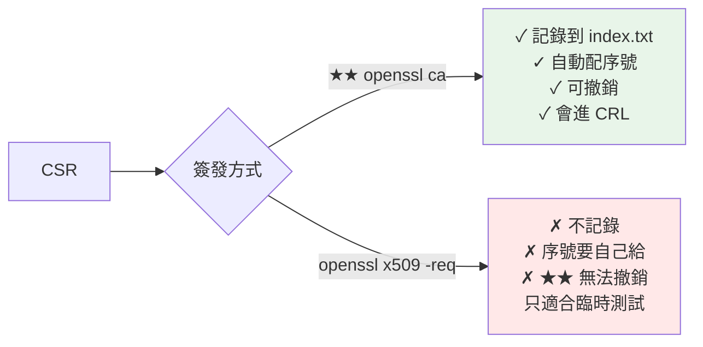
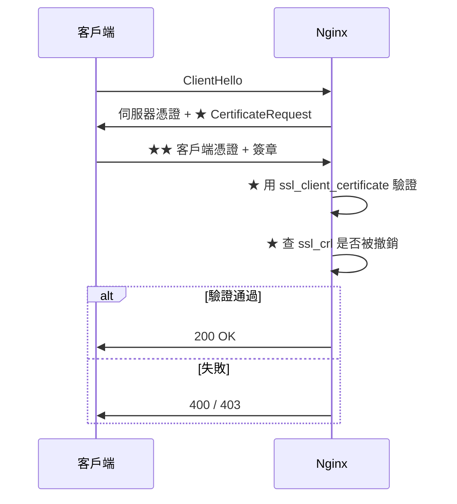

# 用自建 CA 簽發伺服器憑證

> [!abstract] 這篇你會學到
> - 用中繼 CA **簽發伺服器憑證**（含 SAN）
> - `openssl ca` 與 `openssl x509` **兩種簽發方式**的差別
> - **一鍵簽發腳本**（產金鑰 → CSR → 簽發 → 組 fullchain）
> - 簽發 **mTLS 客戶端憑證**與 **PKCS#12** 匯出
> - **批次續期**與到期監控
> - **撤銷憑證**與更新 CRL

## 前置知識

- [[07-自建中繼CA與憑證鏈]] — 中繼 CA 已建立
- [[02-CSR產生與req設定檔]] — CSR 與 `req.txt`
- [[04-CN與SAN設定與瀏覽器相容性]] — SAN 的重要性

---

## 兩種簽發方式



| | `openssl ca` ★★ | `openssl x509 -req` |
| --- | --- | --- |
| 記錄到 `index.txt` | ✓ | ✗ |
| 序號管理 | ✓ 自動遞增 | ✗ 要自己指定 |
| **可撤銷** | ✓ | **✗** |
| 進 CRL | ✓ | ✗ |
| 政策檢查 | ✓ `policy_*` | ✗ |
| 設定 | 需要 `openssl.cnf` | 只要 CA 憑證 + 私鑰 |
| 適用 | **正式 CA** | 臨時測試 |

> [!danger] 正式環境一律用 `openssl ca` ★★
> ```
> 用 openssl x509 -req 簽出來的憑證：
>   ✗ 【CA 完全不知道它存在】
>   ✗ 【無法撤銷】（openssl ca -revoke 需要 index.txt 中的記錄）
>   ✗ 序號可能與其他憑證重複（★ 違反 X.509）
>   ✗ 無法稽核「簽發過哪些憑證」
>
> ★★ 只有在「一次性的本機測試」才用 x509 -req
> ```

---

## 簽發伺服器憑證

### 【1】產生私鑰與 CSR

```bash
$ CN=crm.internal.example.gov.tw
$ mkdir -p ~/certs && cd ~/certs

# ═══ 私鑰（★ 伺服器憑證的私鑰【不加密】，否則每次重啟要輸密碼）═══
$ openssl genrsa -out "$CN.key" 2048
$ chmod 600 "$CN.key"

# ═══ ★★ SAN 設定檔 ═══
$ cat > "$CN.cnf" <<EOF
[ req ]
default_bits       = 2048
prompt             = no
default_md         = sha256
distinguished_name = dn
req_extensions     = req_ext

[ dn ]
C  = TW
ST = Taiwan
L  = Taipei
O  = Example Government Agency
OU = Information Department
CN = $CN

[ req_ext ]
subjectAltName = @alt_names

[ alt_names ]
DNS.1 = $CN                       # ★★ CN 也要列在 SAN
DNS.2 = crm.example.gov.tw
IP.1  = 10.0.20.15                # ★ IP 用 IP.n，不能用 DNS.n
EOF

# ═══ CSR ═══
$ openssl req -new -key "$CN.key" -out "$CN.csr" -config "$CN.cnf"

# ★ 驗證 CSR 的 SAN
$ openssl req -in "$CN.csr" -noout -text | grep -A3 'Subject Alternative Name'
            X509v3 Subject Alternative Name:
                DNS:crm.internal.example.gov.tw, DNS:crm.example.gov.tw, IP Address:10.0.20.15
```

### 【2】★★ 用中繼 CA 簽發

```bash
# ═══ ★★★ 關鍵：copy_extensions = none，所以 CSR 裡的 SAN【不會被複製】═══
#     → 必須用 -extfile 另外提供
$ cat > /tmp/san.ext <<EOF
subjectAltName = DNS:$CN, DNS:crm.example.gov.tw, IP:10.0.20.15
EOF

$ sudo openssl ca -config /root/ca/issuing-ca/openssl.cnf \
    -extensions server_cert \
    -extfile /tmp/san.ext \
    -days 365 -notext -md sha256 \
    -in "$CN.csr" \
    -out "$CN.crt"

Certificate Details:
        Serial Number: 4097 (0x1001)
        Validity
            Not Before: Aug 28 12:00:00 2026 GMT
            Not After : Aug 28 12:00:00 2027 GMT
        Subject:
            countryName               = TW
            ...
            commonName                = crm.internal.example.gov.tw
        X509v3 extensions:
            X509v3 Basic Constraints: critical
                CA:FALSE                                     ★★
            X509v3 Key Usage: critical
                Digital Signature, Key Encipherment
            X509v3 Extended Key Usage:
                TLS Web Server Authentication
            X509v3 Subject Alternative Name:
                DNS:crm.internal.example.gov.tw, DNS:crm.example.gov.tw, IP Address:10.0.20.15   ★★
Certify the certificate? [y/n]: y
1 out of 1 certificate requests certified, commit? [y/n]: y
```

> [!danger] `copy_extensions` 與 `-extfile` 的關係 ★★★
> ```
> openssl.cnf 中 copy_extensions = none（★ 正確的設定）
>   → CSR 裡的 subjectAltName 【完全被忽略】
>     → ★★ 必須用 -extfile 明確指定 SAN
>       → 若忘記 → 【簽出來的憑證沒有 SAN】→ 瀏覽器直接拒絕
>
> ★ 為什麼不設 copy_extensions = copy？
>   → 攻擊者可以在 CSR 裡放 basicConstraints = CA:TRUE
>     → 【簽出一張 CA 憑證】→ 他就能自己簽發任何憑證
>       → ★★★ 整個 PKI 淪陷
>
> ★★ 正確流程：CA 管理員【自己決定】要給哪些 SAN，
>    而不是讓申請者在 CSR 裡自己填。
> ```

```bash
# ★★ 簽完馬上驗證有沒有 SAN
$ openssl x509 -in "$CN.crt" -noout -ext subjectAltName
X509v3 Subject Alternative Name:
    DNS:crm.internal.example.gov.tw, DNS:crm.example.gov.tw, IP Address:10.0.20.15
```

### 【3】★ 組合 fullchain 並部署

```bash
# ═══ ★★ fullchain = 伺服器憑證 + 中繼憑證（不含根）═══
$ cat "$CN.crt" /root/ca/issuing-ca/certs/intermediate.cert.pem > "$CN-fullchain.crt"

# ★ 驗證
$ openssl verify -CAfile /root/ca/issuing-ca/certs/ca-chain.cert.pem "$CN.crt"
crm.internal.example.gov.tw.crt: OK

# ═══ 部署 ═══
$ sudo install -m 644 -o root -g root "$CN-fullchain.crt" /etc/ssl/certs/
$ sudo install -m 600 -o root -g root "$CN.key" /etc/ssl/private/
$ sudo install -m 644 /root/ca/issuing-ca/certs/ca-chain.cert.pem /etc/ssl/certs/
```

```nginx
server {
    listen 443 ssl;
    http2 on;
    server_name crm.internal.example.gov.tw;

    ssl_certificate         /etc/ssl/certs/crm.internal.example.gov.tw-fullchain.crt;
    ssl_certificate_key     /etc/ssl/private/crm.internal.example.gov.tw.key;
    ssl_trusted_certificate /etc/ssl/certs/ca-chain.cert.pem;

    ssl_protocols       TLSv1.2 TLSv1.3;
    ssl_ciphers         ECDHE-ECDSA-AES128-GCM-SHA256:ECDHE-RSA-AES128-GCM-SHA256:ECDHE-ECDSA-AES256-GCM-SHA384:ECDHE-RSA-AES256-GCM-SHA384;
    ssl_prefer_server_ciphers off;
    ssl_session_cache   shared:SSL:10m;
    ssl_session_timeout 1d;
    ssl_session_tickets off;

    # ★ 內部 CA 通常沒有 OCSP responder → 不要開 stapling
    # ssl_stapling on;
}
```

```bash
# ★ 測試
$ sudo nginx -t && sudo systemctl reload nginx
$ curl -v --cacert /etc/ssl/certs/ca-chain.cert.pem \
    https://crm.internal.example.gov.tw/ 2>&1 | grep -E 'subject|issuer|SSL certificate verify'
*  subject: ...CN=crm.internal.example.gov.tw
*  issuer: ...CN=Example Gov Issuing CA
*  SSL certificate verify ok.                    # ★★
```

---

## 一鍵簽發腳本 ★★

```bash
#!/usr/bin/env bash
# /usr/local/bin/issue-cert —— 用中繼 CA 簽發伺服器憑證
#
# 用法：
#   issue-cert crm.internal.example.gov.tw
#   issue-cert app.example.gov.tw www.app.example.gov.tw 10.0.20.15
#   TYPE=client issue-cert "王小明"
#   DAYS=730 KEYTYPE=ec issue-cert api.example.gov.tw
set -euo pipefail

INT_CA="${INT_CA:-/root/ca/issuing-ca}"
OUT="${OUT:-/etc/ssl/issued}"
DAYS="${DAYS:-365}"
TYPE="${TYPE:-server}"          # server | client | peer
KEYTYPE="${KEYTYPE:-rsa}"       # rsa | ec
BITS="${BITS:-2048}"
CURVE="${CURVE:-prime256v1}"
C="${CERT_C:-TW}"; ST="${CERT_ST:-Taiwan}"; L="${CERT_L:-Taipei}"
O="${CERT_O:-Example Government Agency}"
OU="${CERT_OU:-Information Department}"

[ $# -ge 1 ] || { cat <<'EOF'
用法：issue-cert <CN> [額外的 SAN...]

  SAN 會自動判斷是 DNS 還是 IP
  環境變數：
    DAYS=365        有效期
    TYPE=server     server | client | peer
    KEYTYPE=rsa     rsa | ec
    BITS=2048       RSA 位元數
    OUT=/etc/ssl/issued   輸出目錄

範例：
  issue-cert crm.internal.example.gov.tw
  issue-cert app.example.gov.tw www.app.example.gov.tw 10.0.20.15
  TYPE=client issue-cert "wang.xiaoming@example.gov.tw"
  DAYS=730 KEYTYPE=ec issue-cert api.example.gov.tw
EOF
exit 1; }

CN="$1"; shift
SANS=("$CN" "$@")

# ★ 檔名安全化（客戶端憑證的 CN 可能有中文或 @）
SAFE=$(echo "$CN" | tr -c 'a-zA-Z0-9.-' '_')

echo "═══════ 簽發憑證 ═══════"
echo "  CN       : $CN"
echo "  類型     : $TYPE"
echo "  金鑰     : $KEYTYPE $( [ "$KEYTYPE" = ec ] && echo "$CURVE" || echo "$BITS bits" )"
echo "  有效期   : $DAYS 天"
echo "  SAN      : ${SANS[*]}"
echo "  輸出     : $OUT/$SAFE.*"
echo

# ══ 前置檢查 ══
[ -f "$INT_CA/certs/intermediate.cert.pem" ] || { echo "✗ 找不到中繼 CA"; exit 1; }
[ -f "$INT_CA/openssl.cnf" ] || { echo "✗ 找不到 $INT_CA/openssl.cnf"; exit 1; }

# ★ 檢查中繼 CA 的剩餘有效期
IE=$(openssl x509 -in "$INT_CA/certs/intermediate.cert.pem" -noout -enddate | cut -d= -f2)
ID=$(( ($(date -d "$IE" +%s) - $(date +%s)) / 86400 ))
echo "  中繼 CA 剩餘 $ID 天"
if [ "$DAYS" -gt "$ID" ]; then
    echo "  ⚠⚠ 憑證有效期（$DAYS）超過中繼 CA 剩餘期（$ID）"
    echo "     → 中繼 CA 過期後這張憑證也會失效"
    read -rp "  仍要繼續？(yes/no) " a; [ "$a" = yes ] || exit 1
fi

# ★ 檢查是否已存在
if [ -f "$OUT/$SAFE.crt" ]; then
    OE=$(openssl x509 -in "$OUT/$SAFE.crt" -noout -enddate | cut -d= -f2)
    OD=$(( ($(date -d "$OE" +%s) - $(date +%s)) / 86400 ))
    echo "  ⚠ 已有憑證，剩餘 $OD 天（$OE）"
    read -rp "  要重新簽發嗎？(yes/no) " a; [ "$a" = yes ] || exit 0
    sudo cp "$OUT/$SAFE.crt" "$OUT/$SAFE.crt.bak-$(date +%Y%m%d%H%M%S)"
fi

sudo mkdir -p "$OUT"
sudo chmod 755 "$OUT"
TMP=$(mktemp -d); trap 'rm -rf "$TMP"' EXIT

# ══ 【1】組出 SAN 字串 ══
SANLIST=""
DN=0; IPN=0
for s in "${SANS[@]}"; do
    if [[ "$s" =~ ^[0-9]+\.[0-9]+\.[0-9]+\.[0-9]+$ ]] || [[ "$s" =~ ^[0-9a-fA-F:]+:[0-9a-fA-F:]+$ ]]; then
        IPN=$((IPN+1)); SANLIST+="${SANLIST:+,}IP:$s"
    elif [[ "$s" == *@* ]]; then
        SANLIST+="${SANLIST:+,}email:$s"
    else
        DN=$((DN+1)); SANLIST+="${SANLIST:+,}DNS:$s"
    fi
done
echo "【1】SAN：$SANLIST"

# ══ 【2】私鑰 ══
echo "【2】產生私鑰"
if [ "$KEYTYPE" = ec ]; then
    openssl ecparam -name "$CURVE" -genkey -noout -out "$TMP/key.pem"
else
    openssl genrsa -out "$TMP/key.pem" "$BITS" 2>/dev/null
fi
chmod 600 "$TMP/key.pem"

# ══ 【3】CSR ══
echo "【3】產生 CSR"
cat > "$TMP/req.cnf" <<EOF
[ req ]
prompt             = no
default_md         = sha256
distinguished_name = dn
[ dn ]
C  = $C
ST = $ST
L  = $L
O  = $O
OU = $OU
CN = $CN
EOF
openssl req -new -key "$TMP/key.pem" -out "$TMP/req.csr" -config "$TMP/req.cnf"

# ══ 【4】★★ 擴充檔（copy_extensions=none，SAN 必須從這裡來）══
echo "【4】產生擴充檔"
echo "subjectAltName = $SANLIST" > "$TMP/ext.cnf"

# ══ 【5】★★ 簽發 ══
echo "【5】★★ 用中繼 CA 簽發"
sudo openssl ca -config "$INT_CA/openssl.cnf" \
    -extensions "${TYPE}_cert" \
    -extfile "$TMP/ext.cnf" \
    -days "$DAYS" -notext -md sha256 -batch \
    -in "$TMP/req.csr" -out "$TMP/cert.pem"
# ★ -batch = 不互動確認（自動化用；★ 手動簽發時建議拿掉以便核對）

# ══ 【6】★★ 驗證 ══
echo "【6】★★ 驗證"
FAIL=0
chk() { if eval "$2" >/dev/null 2>&1; then printf '     ✓ %s\n' "$1"
        else printf '     ✗ %s\n' "$1"; FAIL=1; fi; }

chk "CA:FALSE" "openssl x509 -in '$TMP/cert.pem' -noout -ext basicConstraints | grep -q 'CA:FALSE'"
chk "★★ 有 SAN" "openssl x509 -in '$TMP/cert.pem' -noout -ext subjectAltName | grep -q ':'"
chk "★ CN 在 SAN 中" "openssl x509 -in '$TMP/cert.pem' -noout -ext subjectAltName | grep -q '$CN'"
chk "★★ 憑證鏈驗證通過" "openssl verify -CAfile '$INT_CA/certs/ca-chain.cert.pem' '$TMP/cert.pem'"

case "$TYPE" in
  server|peer) chk "有 serverAuth" "openssl x509 -in '$TMP/cert.pem' -noout -ext extendedKeyUsage | grep -q 'Server Authentication'";;
esac
case "$TYPE" in
  client|peer) chk "有 clientAuth" "openssl x509 -in '$TMP/cert.pem' -noout -ext extendedKeyUsage | grep -q 'Client Authentication'";;
esac

A=$(openssl x509 -in "$TMP/cert.pem" -noout -pubkey | openssl md5)
B=$(openssl pkey -in "$TMP/key.pem" -pubout 2>/dev/null | openssl md5)
[ "$A" = "$B" ] && echo "     ✓ 憑證與私鑰配對" || { echo "     ✗ 不配對"; FAIL=1; }

[ "$FAIL" -eq 0 ] || { echo "  ✗✗ 驗證失敗，不輸出檔案"; exit 1; }

# ══ 【7】組合並輸出 ══
echo "【7】輸出檔案"
cat "$TMP/cert.pem" "$INT_CA/certs/intermediate.cert.pem" > "$TMP/fullchain.pem"

sudo install -m 600 "$TMP/key.pem"       "$OUT/$SAFE.key"
sudo install -m 644 "$TMP/cert.pem"      "$OUT/$SAFE.crt"
sudo install -m 644 "$TMP/fullchain.pem" "$OUT/$SAFE-fullchain.crt"

# ★ 客戶端憑證額外產 PKCS#12
if [ "$TYPE" = client ] || [ "$TYPE" = peer ]; then
    echo "     ★ 產生 PKCS#12（給瀏覽器／Windows 匯入）"
    openssl pkcs12 -export \
        -inkey "$TMP/key.pem" -in "$TMP/cert.pem" \
        -certfile "$INT_CA/certs/ca-chain.cert.pem" \
        -name "$CN" -out "$TMP/bundle.p12"
    sudo install -m 600 "$TMP/bundle.p12" "$OUT/$SAFE.p12"
fi

# ══ 完成 ══
SERIAL=$(openssl x509 -in "$OUT/$SAFE.crt" -noout -serial | cut -d= -f2)
EXPIRE=$(openssl x509 -in "$OUT/$SAFE.crt" -noout -enddate | cut -d= -f2)

echo
echo "═══════ 完成 ═══════"
printf '  序號     : %s\n' "$SERIAL"
printf '  到期     : %s\n' "$EXPIRE"
printf '  私鑰     : %s\n' "$OUT/$SAFE.key"
printf '  憑證     : %s\n' "$OUT/$SAFE.crt"
printf '  ★ 部署用 : %s\n' "$OUT/$SAFE-fullchain.crt"
[ -f "$OUT/$SAFE.p12" ] && printf '  PKCS#12  : %s\n' "$OUT/$SAFE.p12"

cat <<EOF

  ── Nginx ──
    ssl_certificate         $OUT/$SAFE-fullchain.crt;
    ssl_certificate_key     $OUT/$SAFE.key;
    ssl_trusted_certificate $INT_CA/certs/ca-chain.cert.pem;

  ── Apache ──
    SSLCertificateFile      $OUT/$SAFE.crt
    SSLCertificateKeyFile   $OUT/$SAFE.key
    SSLCertificateChainFile $INT_CA/certs/intermediate.cert.pem

  ── 測試 ──
    curl -v --cacert $INT_CA/certs/ca-chain.cert.pem https://$CN/

  ★ 記得備份 index.txt：
    cd $INT_CA && sudo git add -A && sudo git commit -m "簽發 $CN"
EOF
```

```bash
$ sudo chmod +x /usr/local/bin/issue-cert

# ★ 使用範例
$ sudo issue-cert crm.internal.example.gov.tw
$ sudo issue-cert app.example.gov.tw www.app.example.gov.tw 10.0.20.15
$ sudo DAYS=730 KEYTYPE=ec issue-cert api.internal.example.gov.tw
$ sudo TYPE=client issue-cert "wang@example.gov.tw"
```

---

## mTLS 客戶端憑證



```bash
# ═══ 【1】簽發客戶端憑證 ═══
$ sudo TYPE=client issue-cert "wang.xiaoming@example.gov.tw"
# → 產生 .key / .crt / ★ .p12（給瀏覽器匯入）

# ═══ 【2】★ 手動產生 PKCS#12（若要另外設密碼）═══
$ openssl pkcs12 -export \
    -inkey client.key -in client.crt \
    -certfile /root/ca/issuing-ca/certs/ca-chain.cert.pem \
    -name "王小明" \
    -out client.p12
Enter Export Password:        # ★ 給使用者的匯入密碼

# ★ 檢視 p12 內容
$ openssl pkcs12 -in client.p12 -info -nokeys
```

```nginx
server {
    listen 443 ssl;
    server_name secure.internal.example.gov.tw;

    ssl_certificate         /etc/ssl/issued/secure.internal.example.gov.tw-fullchain.crt;
    ssl_certificate_key     /etc/ssl/issued/secure.internal.example.gov.tw.key;

    # ═══ ★★ mTLS ═══
    ssl_client_certificate  /root/ca/issuing-ca/certs/ca-chain.cert.pem;   # ★ 驗證客戶端用
    ssl_verify_client       on;          # ★ on=強制 / optional=可選 / off
    ssl_verify_depth        2;           # ★ 中繼 + 根 = 2
    ssl_crl                 /etc/ssl/certs/issuing-ca.crl.pem;  # ★★ 撤銷檢查

    location / {
        # ★ 把客戶端憑證資訊傳給後端
        proxy_set_header X-Client-DN     $ssl_client_s_dn;
        proxy_set_header X-Client-Serial $ssl_client_serial;
        proxy_set_header X-Client-Verify $ssl_client_verify;
        proxy_pass http://127.0.0.1:8080;
    }

    # ★ optional 模式時在應用層判斷
    # if ($ssl_client_verify != SUCCESS) { return 403; }
}
```

> [!danger] `ssl_crl` 的兩個陷阱 ★★
> ```
> ① ★ ssl_crl 必須包含【鏈上每一層】的 CRL
>      cat issuing-ca.crl.pem root-ca.crl.pem > /etc/ssl/certs/all.crl.pem
>      ssl_crl /etc/ssl/certs/all.crl.pem;
>    → 只給中繼的 CRL，Nginx 可能報 unable to get certificate CRL
>
> ② ★★ CRL 更新後【必須 reload Nginx】
>      → Nginx 在啟動時載入 CRL，不會自動重讀
>      → 排程：更新 CRL 後 systemctl reload nginx
> ```

```bash
# ★ CRL 更新後自動 reload
$ sudo tee -a /usr/local/bin/gen-crl >/dev/null <<'EOF'

# ★★ 更新 mTLS 主機的 CRL 並 reload
cat /var/www/pki/issuing-ca.crl.pem /var/www/pki/root-ca.crl.pem \
  > /etc/ssl/certs/all.crl.pem
systemctl reload nginx 2>/dev/null || true
EOF

# ★ 測試 mTLS
$ curl -v --cacert ca-chain.crt \
    --cert client.crt --key client.key \
    https://secure.internal.example.gov.tw/

# ★ 不帶憑證應該被拒絕
$ curl -v --cacert ca-chain.crt https://secure.internal.example.gov.tw/
< HTTP/1.1 400 Bad Request
No required SSL certificate was sent
```

> [!info]- Apache 的 mTLS 對照
> ```apache
> <VirtualHost *:443>
>     ServerName secure.internal.example.gov.tw
>     SSLEngine on
>     SSLCertificateFile      /etc/ssl/issued/secure.crt
>     SSLCertificateKeyFile   /etc/ssl/issued/secure.key
>     SSLCertificateChainFile /root/ca/issuing-ca/certs/intermediate.cert.pem
>
>     # ★★ mTLS
>     SSLCACertificateFile    /root/ca/issuing-ca/certs/ca-chain.cert.pem
>     SSLVerifyClient         require
>     SSLVerifyDepth          2
>
>     # ★ CRL 檢查
>     SSLCARevocationFile     /etc/ssl/certs/all.crl.pem
>     SSLCARevocationCheck    chain
>
>     # ★ 傳給後端
>     RequestHeader set X-Client-DN "%{SSL_CLIENT_S_DN}s"
>     SSLOptions +StdEnvVars
> </VirtualHost>
> ```
>
> ★ 只對特定路徑要求客戶端憑證：
> ```apache
> SSLVerifyClient none
> <Location /admin>
>     SSLVerifyClient require
>     SSLVerifyDepth  2
> </Location>
> ```

---

## 撤銷憑證

```bash
# ═══ 【1】★★ 撤銷 ═══
$ cd /root/ca/issuing-ca
$ sudo openssl ca -config openssl.cnf \
    -revoke /etc/ssl/issued/old-server.crt \
    -crl_reason keyCompromise
Revoking Certificate 1001.
Data Base Updated

# ★ 撤銷原因（-crl_reason）
#   unspecified          未指定
#   ★★ keyCompromise     私鑰外洩（最嚴重）
#   CACompromise         CA 私鑰外洩
#   affiliationChanged   組織資訊變更
#   ★ superseded         被新憑證取代（續期時用這個）
#   cessationOfOperation 服務停止
#   certificateHold      暫時停用（★ 可以取消）

# ═══ 【2】★★ 重新產生 CRL 並發布 ═══
$ sudo /usr/local/bin/gen-crl

# ═══ 【3】確認 ═══
$ sudo openssl crl -in crl/intermediate.crl.pem -noout -text | \
    grep -A2 'Serial Number'
    Serial Number: 1001
        Revocation Date: Aug 28 13:00:00 2026 GMT
        X509v3 CRL Reason Code:
            Key Compromise

# ★ index.txt 中該筆變成 R
$ sudo grep 1001 index.txt
R	270828120000Z	260828130000Z	1001	unknown	/C=TW/...
# ↑ R=Revoked（V=Valid、E=Expired）
```

```bash
# ★ 用序號撤銷（找不到憑證檔時）
$ sudo grep 'CN=old-server' index.txt        # 找出序號
$ sudo openssl ca -config openssl.cnf -revoke newcerts/1001.pem
# ★ newcerts/ 裡有每一張簽發過的憑證副本（以序號命名）
```

---

## 到期監控與批次續期

```bash
#!/usr/bin/env bash
# /usr/local/bin/cert-expiry —— 檢查所有已簽發憑證的到期狀況
INT_CA=/root/ca/issuing-ca
WARN="${1:-30}"

printf '%-45s %-12s %-8s %s\n' "CN" "到期日" "剩餘" "狀態"
printf '%.0s─' {1..85}; echo

EXPIRING=0
# ★ 從 index.txt 讀（★ 只看狀態為 V 的）
sudo awk -F'\t' '$1=="V"' "$INT_CA/index.txt" | while IFS=$'\t' read -r st exp rev serial fn subj; do
    CN=$(echo "$subj" | grep -o 'CN=[^/]*' | cut -d= -f2-)
    # index.txt 的日期格式：YYMMDDHHMMSSZ
    Y=20${exp:0:2}; M=${exp:2:2}; D=${exp:4:2}
    DAYS=$(( ($(date -d "$Y-$M-$D" +%s) - $(date +%s)) / 86400 ))

    if   [ "$DAYS" -lt 0 ];      then S="✗ 已過期"
    elif [ "$DAYS" -lt 7 ];      then S="✗✗ 緊急"
    elif [ "$DAYS" -lt "$WARN" ];then S="⚠ 需續期"
    else                              S="✓"
    fi
    printf '%-45s %-12s %-8s %s\n' "${CN:0:44}" "$Y-$M-$D" "${DAYS}d" "$S"
done

echo
echo "★ 續期：sudo issue-cert <CN> [SAN...]"
echo "★ 撤銷舊憑證：sudo openssl ca -config $INT_CA/openssl.cnf \\"
echo "                -revoke newcerts/<序號>.pem -crl_reason superseded"
```

```bash
$ sudo cert-expiry 45
CN                                            到期日       剩餘     狀態
─────────────────────────────────────────────────────────────────────────────────────
crm.internal.example.gov.tw                   2027-08-28   365d     ✓
api.internal.example.gov.tw                   2026-09-15   18d      ⚠ 需續期
old.internal.example.gov.tw                   2026-08-20   -8d      ✗ 已過期

# ★ 排程
$ sudo tee /etc/cron.d/cert-expiry >/dev/null <<'EOF'
0 8 * * 1 root /usr/local/bin/cert-expiry 30 | \
  mail -s "【PKI】內部憑證到期檢查" pki@example.gov.tw
EOF
```

---

## 完整實戰範例：LXMP 內部站台的憑證簽發與部署

```bash
#!/usr/bin/env bash
# 情境：內部 Laravel + Vue 站台改用內部 CA 的憑證
set -euo pipefail

DOMAIN=crm.internal.example.gov.tw
API=api.internal.example.gov.tw
INT_CA=/root/ca/issuing-ca

echo "═══ ① 簽發憑證（一張憑證涵蓋前後端）═══"
sudo issue-cert "$DOMAIN" "$API" 10.0.20.15
# ★ 前後端同一台 → 一張憑證放兩個 SAN 就好

echo -e "\n═══ ② 部署 ═══"
SAFE=$(echo "$DOMAIN" | tr -c 'a-zA-Z0-9.-' '_')
sudo install -m 644 "/etc/ssl/issued/$SAFE-fullchain.crt" /etc/nginx/ssl/
sudo install -m 600 "/etc/ssl/issued/$SAFE.key"           /etc/nginx/ssl/
sudo install -m 644 "$INT_CA/certs/ca-chain.cert.pem"     /etc/nginx/ssl/

echo -e "\n═══ ③ Nginx 設定 ═══"
sudo tee /etc/nginx/sites-available/crm.conf >/dev/null <<EOF
# ── HTTP → HTTPS ──
server {
    listen 80;
    server_name $DOMAIN $API;
    return 301 https://\$host\$request_uri;
}

# ── 前端 Vue（靜態）──
server {
    listen 443 ssl;
    http2 on;
    server_name $DOMAIN;

    ssl_certificate         /etc/nginx/ssl/$SAFE-fullchain.crt;
    ssl_certificate_key     /etc/nginx/ssl/$SAFE.key;
    ssl_trusted_certificate /etc/nginx/ssl/ca-chain.cert.pem;
    ssl_protocols           TLSv1.2 TLSv1.3;
    ssl_session_cache       shared:SSL:10m;
    ssl_session_tickets     off;

    add_header Strict-Transport-Security "max-age=31536000" always;
    add_header X-Content-Type-Options nosniff always;

    root /var/www/crm/current/dist;
    index index.html;

    location / { try_files \$uri \$uri/ /index.html; }

    location /assets/ {
        expires 1y;
        add_header Cache-Control "public, immutable";
        add_header X-Content-Type-Options nosniff always;   # ★ 要重複宣告
    }
}

# ── 後端 Laravel API ──
server {
    listen 443 ssl;
    http2 on;
    server_name $API;

    ssl_certificate         /etc/nginx/ssl/$SAFE-fullchain.crt;
    ssl_certificate_key     /etc/nginx/ssl/$SAFE.key;
    ssl_trusted_certificate /etc/nginx/ssl/ca-chain.cert.pem;
    ssl_protocols           TLSv1.2 TLSv1.3;

    root /var/www/crm-api/current/public;
    index index.php;

    location / { try_files \$uri \$uri/ /index.php?\$query_string; }

    location ~ \.php\$ {
        try_files \$uri =404;                       # ★★ 防 PathInfo 攻擊
        fastcgi_pass unix:/run/php/php8.3-fpm-crm.sock;
        fastcgi_index index.php;
        include fastcgi_params;
        fastcgi_param SCRIPT_FILENAME \$realpath_root\$fastcgi_script_name;
        fastcgi_param DOCUMENT_ROOT   \$realpath_root;
        fastcgi_param HTTPS on;                     # ★ 讓 Laravel 知道是 HTTPS
    }

    location ~ /\. { deny all; }
}
EOF

sudo ln -sfn /etc/nginx/sites-available/crm.conf /etc/nginx/sites-enabled/crm.conf
sudo nginx -t && sudo systemctl reload nginx

echo -e "\n═══ ④ Laravel 的 .env ═══"
cat <<EOF
  APP_URL=https://$API
  SESSION_SECURE_COOKIE=true      # ★ HTTPS 才送 cookie
  SANCTUM_STATEFUL_DOMAINS=$DOMAIN
  SESSION_DOMAIN=.internal.example.gov.tw
EOF

echo -e "\n═══ ⑤ 驗證 ═══"
for h in "$DOMAIN" "$API"; do
    printf '  %-40s ' "$h"
    if curl -sf -o /dev/null --cacert /etc/nginx/ssl/ca-chain.cert.pem "https://$h/"; then
        echo "✓"
    else
        echo "✗"
    fi
done

echo -e "\n  ── 憑證資訊 ──"
echo | openssl s_client -connect "$DOMAIN:443" -servername "$DOMAIN" \
    -CAfile /etc/nginx/ssl/ca-chain.cert.pem 2>/dev/null | \
    openssl x509 -noout -subject -issuer -dates -ext subjectAltName | sed 's/^/    /'

cat <<EOF

★★ 別忘了：把【根憑證】派送到所有需要存取這個站台的裝置
   → 見 [[09-根憑證派送與信任]]
   → 沒派送的話，瀏覽器仍然會顯示「不安全」
EOF
```

---

## 常見錯誤與排錯

| 現象 | 原因 | 解法 |
| --- | --- | --- |
| **簽出來的憑證沒有 SAN** ★★★ | `copy_extensions = none` 且忘了 `-extfile` | 用 `-extfile` 提供 `subjectAltName` |
| `NET::ERR_CERT_COMMON_NAME_INVALID` | SAN 沒有涵蓋存取用的名稱 | 重簽並加上 SAN |
| **`ERR_CERT_AUTHORITY_INVALID`** ★ | 客戶端沒安裝根憑證 | 見 [[09-根憑證派送與信任]] |
| `unable to get local issuer certificate` | 沒送出中繼憑證 | `ssl_certificate` 用 **fullchain** |
| **`TXT_DB error number 2`** | 相同 Subject 已存在 | `unique_subject = no` |
| `The organizationName field is different` | `policy_strict` | 中繼 CA 用 `policy_loose` |
| **憑證無法撤銷** ★★ | 是用 `x509 -req` 簽的 | 正式環境一律用 `openssl ca` |
| mTLS：`unable to get certificate CRL` | `ssl_crl` 缺少某一層的 CRL | 合併中繼與根的 CRL |
| **mTLS：撤銷後仍能連線** ★ | CRL 更新後沒 reload | `systemctl reload nginx` |
| `key values mismatch` | 憑證與私鑰不配對 | 比對 pubkey 的 md5 |
| Laravel 產生 `http://` 連結 | 沒設 `HTTPS on` / `TrustProxies` | `fastcgi_param HTTPS on;` |
| **憑證到期沒人發現** ★ | 沒有監控 | 排程 `cert-expiry` |

### 排查流程

```bash
# 【1】★★ 憑證有沒有 SAN
$ openssl x509 -in server.crt -noout -ext subjectAltName
# 沒輸出 → 忘了 -extfile，必須重簽

# 【2】SAN 有沒有涵蓋存取的名稱
$ openssl x509 -in server.crt -noout -ext subjectAltName | grep -o 'DNS:[^,]*'

# 【3】憑證鏈
$ openssl verify -CAfile ca-chain.crt server.crt

# 【4】伺服器有沒有送中繼
$ echo | openssl s_client -connect host:443 -servername host 2>/dev/null | \
    grep -c 'BEGIN CERTIFICATE'
# ★ 應該 ≥ 2（伺服器 + 中繼）

# 【5】憑證與私鑰配對
$ openssl x509 -in server.crt -noout -pubkey | openssl md5
$ openssl pkey -in server.key -pubout | openssl md5

# 【6】★ CRL 狀態
$ openssl crl -in issuing-ca.crl.pem -noout -nextupdate
$ SERIAL=$(openssl x509 -in server.crt -noout -serial | cut -d= -f2)
$ openssl crl -in issuing-ca.crl.pem -noout -text | grep -A1 "$SERIAL"
# 有輸出 → 這張憑證【已被撤銷】

# 【7】index.txt 中的狀態
$ sudo grep "$SERIAL" /root/ca/issuing-ca/index.txt
# V=有效 / R=已撤銷 / E=已過期
```

---

## 安全性注意事項

> [!danger] 簽發前的核准流程 ★★
> ```
> ★ 不應該讓任何人都能簽發憑證
>
> 建議流程：
>   ① 【申請】填表：域名、用途、負責人、有效期
>   ② 【審核】確認：
>        · 域名確實屬於本機關
>        · 申請者有權管理該服務
>        · SAN 清單合理（★ 不要包含不相干的域名）
>   ③ 【簽發】CA 管理員執行 issue-cert
>   ④ 【記錄】留存申請單與簽發紀錄
>   ⑤ 【交付】★ 私鑰用安全管道交付（不要 email／IM 明文傳）
>
> ★★ 更好的做法：讓服務自己產生私鑰與 CSR，
>    只把 CSR 送來簽 → 【私鑰從不離開伺服器】
> ```

> [!warning] 私鑰的交付
> ```
> ❌ email 傳 .key 檔
> ❌ Slack / LINE 傳
> ❌ 放在共用資料夾
>
> ✅ ★★ 最好：對方自己產私鑰 + CSR，只送 CSR 來
>      openssl genrsa -out server.key 2048
>      openssl req -new -key server.key -out server.csr -config req.cnf
>      # ★ 只把 server.csr 給 CA 管理員
>
> ✅ 次佳：用 age / GPG 加密後傳
>      age -r <對方公鑰> server.key > server.key.age
>
> ✅ PKCS#12 + 強密碼（密碼另一個管道給）
> ```

> [!tip] 憑證有效期的選擇
> ```
> 內部 CA 可以自己決定，但建議：
>
>   ★ 伺服器憑證：【1 年】（365 天）
>       → 太長：私鑰外洩的暴露期長
>       → 太短：續期負擔重（除非自動化）
>
>   客戶端憑證：1～2 年
>   中繼 CA：   10 年
>   根 CA：     20 年
>
> ★★ 若已經自動化續期（腳本 + 排程），可以縮到 90 天
>    → 這是 Let's Encrypt 的思路：短效期 + 全自動
>
> ★ 注意：內部憑證【不受 398 天的公信 CA 限制】
>   （那是 CA/B Forum 對公信 CA 的規定）
>   但 Apple 平台對【某些內部憑證】也有 825 天的上限
> ```

> [!warning] SAN 不要過度包含
> ```
> ❌ 一張憑證放 50 個不相干的域名
>   → 任何一台主機被入侵 → 私鑰外洩
>     → ★★ 這 50 個域名【全部要重簽】
>
> ✅ 原則：
>   · 同一台主機、同一個服務的別名 → 放同一張
>   · 不同主機 → 分開簽
>   · 前後端在同一台 → 可以放同一張（見上方實戰範例）
> ```

---

## 速查表

### ★★ 簽發伺服器憑證

```bash
# ① 私鑰（★ 不加密）
openssl genrsa -out server.key 2048 && chmod 600 server.key

# ② CSR
openssl req -new -key server.key -out server.csr -config req.cnf

# ③ ★★★ 擴充檔（copy_extensions=none → SAN 必須從這來）
echo "subjectAltName = DNS:app.example.gov.tw,DNS:www.app.example.gov.tw,IP:10.0.20.15" > san.ext

# ④ ★★ 簽發
sudo openssl ca -config /root/ca/issuing-ca/openssl.cnf \
  -extensions server_cert -extfile san.ext \
  -days 365 -notext -md sha256 \
  -in server.csr -out server.crt

# ⑤ ★★ 驗證有沒有 SAN
openssl x509 -in server.crt -noout -ext subjectAltName

# ⑥ ★ fullchain（伺服器 + 中繼，不含根）
cat server.crt intermediate.cert.pem > server-fullchain.crt
```

### ★★ 兩種簽發方式

```
openssl ca         ✓ 記錄 index.txt · ✓ 自動序號 · ★★ 可撤銷 · ✓ 進 CRL
openssl x509 -req  ✗ 不記錄 · ✗ 序號自己給 · ★★ 無法撤銷 · 只適合臨時測試

★★ 正式環境一律用 openssl ca
```

### `-extensions` 對應

```bash
-extensions server_cert   # serverAuth（網站）
-extensions client_cert   # clientAuth + emailProtection（mTLS 客戶端）
-extensions peer_cert     # serverAuth + clientAuth（服務對服務）
```

### mTLS

```nginx
ssl_client_certificate /root/ca/issuing-ca/certs/ca-chain.cert.pem;
ssl_verify_client      on;        # on / optional / off
ssl_verify_depth       2;         # 中繼 + 根
ssl_crl                /etc/ssl/certs/all.crl.pem;   # ★ 要含每一層的 CRL

proxy_set_header X-Client-DN     $ssl_client_s_dn;
proxy_set_header X-Client-Verify $ssl_client_verify;
```

```bash
# PKCS#12（給瀏覽器／Windows）
openssl pkcs12 -export -inkey client.key -in client.crt \
  -certfile ca-chain.crt -name "王小明" -out client.p12

# 測試
curl --cacert ca.crt --cert client.crt --key client.key https://host/
```

```
★★ CRL 更新後必須 systemctl reload nginx（Nginx 不會自動重讀）
```

### 撤銷

```bash
sudo openssl ca -config openssl.cnf -revoke server.crt -crl_reason superseded
sudo /usr/local/bin/gen-crl        # ★ 重新產 CRL 並發布

# 撤銷原因
#   ★★ keyCompromise  私鑰外洩
#   ★ superseded      被新憑證取代（續期用）
#   certificateHold   暫時停用（可取消）
```

### 到期監控

```bash
# index.txt 的狀態：V=有效 R=已撤銷 E=已過期
sudo awk -F'\t' '$1=="V"' /root/ca/issuing-ca/index.txt

# 單張憑證
openssl x509 -in server.crt -noout -enddate
openssl x509 -in server.crt -noout -checkend $((30*86400)) || echo "30 天內到期"
```

### ★★★ 最常見的三個錯

```
① copy_extensions=none 卻忘了 -extfile → 憑證沒有 SAN → 瀏覽器拒絕
② ssl_certificate 給了 server.crt 而非 fullchain → 缺中繼憑證
③ 用 x509 -req 簽發 → 事後無法撤銷
```

---

## 練習題

> [!question]- 練習 1：SAN 遺漏的實驗
> 1. **故意不加 `-extfile`** 簽發一張憑證
> 2. `openssl x509 -noout -ext subjectAltName` → **有輸出嗎？**
> 3. 部署到 Nginx，用瀏覽器開啟 → **錯誤訊息是什麼？**
> 4. `curl -v` 的錯誤是什麼？
> 5. 加上 `-extfile` 重簽 → 再測一次
> 6. **把這個錯誤加進你的簽發檢查清單**

> [!question]- 練習 2：`openssl ca` vs `x509 -req`
> 1. 用兩種方式各簽一張憑證
> 2. `cat index.txt` → **哪一張有記錄？**
> 3. 嘗試撤銷兩張 → **結果如何？**
> 4. 產生 CRL → 裡面有幾筆？
> 5. **寫下為什麼正式環境不能用 `x509 -req`**

> [!question]- 練習 3：完整的 mTLS
> 1. 簽發伺服器憑證與 2 張客戶端憑證（A、B）
> 2. 設定 Nginx 的 `ssl_verify_client on`
> 3. 用 A 的憑證 `curl` → 成功
> 4. 不帶憑證 → **錯誤訊息是什麼？**
> 5. **撤銷 B 的憑證**，更新 CRL，設定 `ssl_crl`
> 6. 用 B 連線 → **成功還是失敗？**
> 7. **如果沒有 reload Nginx 呢？**
> 8. 把 A 的憑證匯出成 `.p12` 並在瀏覽器匯入測試

> [!question]- 練習 4：一鍵簽發腳本
> 1. 部署 `issue-cert` 腳本
> 2. 簽發三張：
>    ```bash
>    sudo issue-cert web.test.local
>    sudo DAYS=90 KEYTYPE=ec issue-cert api.test.local 10.0.1.5
>    sudo TYPE=client issue-cert "test@test.local"
>    ```
> 3. 檢查每一張的擴充是否正確
> 4. **修改腳本**：加上「簽發後自動 commit index.txt 到 git」
> 5. **再加上**：簽發後自動寄通知信給申請者

> [!question]- 練習 5：續期演練
> 1. 簽發一張 **`DAYS=2`** 的憑證並部署
> 2. 設定 `cert-expiry` 排程
> 3. **等到剩 1 天** → 收到告警了嗎？
> 4. 續期：重新 `issue-cert` 同一個 CN
> 5. `openssl ca` 有抱怨 `TXT_DB error` 嗎？為什麼沒有？
> 6. 撤銷舊的（`-crl_reason superseded`）
> 7. **等憑證真的過期** → 瀏覽器的錯誤是什麼？
> 8. **寫一份「憑證續期 SOP」**

---

## 小測驗

Q1. **`openssl ca` 與 `openssl x509 -req` 的差別？為什麼正式環境要用前者**？

Q2. **`copy_extensions = none` 的情況下，怎麼讓簽出來的憑證有 SAN**？

Q3. **為什麼不能設 `copy_extensions = copy`**？

Q4. **`-extensions server_cert` / `client_cert` / `peer_cert` 分別對應什麼場景**？

Q5. **伺服器憑證的私鑰為什麼不加密**？

Q6. **mTLS 中 `ssl_crl` 有哪兩個陷阱**？

Q7. **撤銷憑證時，`keyCompromise` 與 `superseded` 各用在什麼情況**？

Q8. **`index.txt` 中的 V / R / E 分別代表什麼**？

Q9. **一張憑證放 50 個不相干域名的 SAN，有什麼風險**？

Q10. **私鑰該怎麼交付給服務負責人？最好的做法是什麼**？

> [!question]- 測驗答案
> **Q1.** **`openssl ca`**：①**記錄到 `index.txt`**；②**自動配序號**（`serial` 遞增）；
> ③**可以撤銷**；④**會進 CRL**；⑤有 `policy_*` 政策檢查。
> **`openssl x509 -req`**：不記錄、序號要自己給、**無法撤銷**、不進 CRL。
> **正式環境必須用 `openssl ca` 的原因**：
> **用 `x509 -req` 簽出來的憑證，CA 完全不知道它存在** ——
> `openssl ca -revoke` 需要 `index.txt` 中的記錄才能撤銷，
> **所以那張憑證永遠無法撤銷**（私鑰外洩時只能等它過期），
> 而且序號可能與其他憑證重複（違反 X.509），也無法稽核簽發歷史。
> `x509 -req` 只適合一次性的本機測試。
>
> **Q2.** **用 `-extfile` 提供**：
> ```bash
> echo "subjectAltName = DNS:app.example.gov.tw,IP:10.0.20.15" > san.ext
> openssl ca -config openssl.cnf -extensions server_cert \
>   -extfile san.ext -in server.csr -out server.crt
> ```
> `copy_extensions = none` 表示**CSR 裡的擴充（包含 SAN）完全被忽略**，
> **所以忘了 `-extfile` 就會簽出一張【沒有 SAN 的憑證】**，
> 現代瀏覽器（Chrome 58 以後）**只看 SAN 不看 CN**，會直接以
> `NET::ERR_CERT_COMMON_NAME_INVALID` 拒絕。
> **這是自建 CA 最常見的錯誤**，簽完一定要驗證：
> `openssl x509 -in server.crt -noout -ext subjectAltName`
>
> **Q3.** 因為**攻擊者可以在 CSR 裡放任意擴充**，其中最致命的是：
> ```
> basicConstraints = critical, CA:TRUE
> keyUsage = keyCertSign
> ```
> 若 `copy_extensions = copy`，CA 會**原封不動地把它複製到憑證裡** ——
> **等於簽出一張 CA 憑證**，攻擊者從此可以**用它簽發任何域名的憑證**，
> 而且這些憑證會被所有信任你的根 CA 的客戶端接受。
> **整個 PKI 淪陷**。
> 正確的觀念是：**SAN 與擴充應該由 CA 管理員決定**，
> 而不是讓申請者在 CSR 裡自己填 —— CSR 只用來證明「申請者持有那把私鑰」。
>
> **Q4.**
> **`server_cert`** —— `extendedKeyUsage = serverAuth`，
> 給**網站／API 伺服器**用（Nginx、Apache 的 `ssl_certificate`）。
> **`client_cert`** —— `extendedKeyUsage = clientAuth, emailProtection`，
> 給 **mTLS 的客戶端**或 **S/MIME 郵件簽章**用。
> **`peer_cert`** —— `serverAuth + clientAuth` 兩者都有，
> 給**服務對服務的雙向 TLS**（例如兩個微服務彼此都要驗證對方，
> 或 etcd / Kafka 這類節點間互為客戶端與伺服器的叢集）。
> **選錯的後果**：拿只有 `clientAuth` 的憑證去當伺服器憑證，
> 客戶端會報 `unsupported certificate purpose`。
>
> **Q5.** 因為**加密的私鑰在每次服務啟動時都要輸入密碼** ——
> Nginx / Apache 會在前景卡住等待輸入，
> **導致無法開機自動啟動、無法 systemd 管理、無法無人值守重啟**。
> 保護方式改為**檔案權限**：`chmod 600` + `chown root:root`，
> 放在 `/etc/ssl/private/`（該目錄本身也應該是 `700`）。
> **對比**：CA 的私鑰**必須加密**（`genrsa -aes256`），
> 因為它只在人工簽發時使用，輸入密碼不是問題，
> 而且它一旦外洩的影響遠大於單一伺服器憑證。
>
> **Q6.** ①**`ssl_crl` 必須包含鏈上【每一層】的 CRL**：
> ```bash
> cat issuing-ca.crl.pem root-ca.crl.pem > /etc/ssl/certs/all.crl.pem
> ```
> 只給中繼的 CRL，Nginx 可能報 `unable to get certificate CRL`。
> ②**CRL 更新後必須 `systemctl reload nginx`** ——
> **Nginx 只在啟動時載入 CRL，不會自動重讀檔案**，
> 所以「撤銷了憑證、更新了 CRL 檔案，但被撤銷的客戶端仍然連得進來」
> 是很常見的狀況。解法是在產生 CRL 的腳本結尾加上 reload。
>
> **Q7.**
> **`keyCompromise`** —— **私鑰確定或疑似外洩**時使用（最嚴重）。
> 例如伺服器被入侵、私鑰檔案被誤傳到公開的 git repo、備份磁帶遺失。
> 某些客戶端對這個原因會有**更嚴格的處理**（例如立刻停止快取該憑證的驗證結果）。
> **`superseded`** —— **憑證被新的取代**時使用，**續期時就用這個**。
> 表示舊憑證沒有安全問題，只是不再使用了。
> 另外還有 **`certificateHold`（暫時停用）** ——
> 這是**唯一可以取消的撤銷原因**，適合「主機暫時下線待調查」的情況。
>
> **Q8.** `index.txt` 每一行的第一個欄位是狀態：
> **`V` = Valid（有效）** —— 已簽發且未撤銷、未過期。
> **`R` = Revoked（已撤銷）** —— 第三欄會有撤銷日期與原因，**會出現在 CRL 中**。
> **`E` = Expired（已過期）** —— 過了 `notAfter`，
> **注意 openssl 不會自動把 V 改成 E**，
> 要執行 `openssl ca -updatedb` 才會更新狀態。
> 完整欄位（tab 分隔）：`狀態 \t 到期日 \t 撤銷日 \t 序號 \t 檔名 \t Subject`。
>
> **Q9.** **任何一台使用該憑證的主機被入侵導致私鑰外洩，
> 這 50 個域名的憑證就【全部要重簽並重新部署】**。
> 因為它們共用同一把私鑰、同一張憑證 ——
> 撤銷這張憑證，50 個服務同時中斷。
> 另外還有：①**憑證變大**（SAN 太多）影響握手效能；
> ②**資訊洩漏** —— 憑證是公開的，
> 攻擊者可以從 CT log 或直接連線讀到你所有的內部域名清單。
> **正確原則**：同一台主機、同一個服務的別名放同一張；
> 不同主機分開簽；前後端在同一台可以放同一張。
>
> **Q10.** **最好的做法是「私鑰從不離開伺服器」** ——
> 讓服務負責人在**自己的伺服器上**產生私鑰與 CSR，
> **只把 CSR 送給 CA 管理員簽**：
> ```bash
> openssl genrsa -out server.key 2048        # 在目標伺服器上執行
> openssl req -new -key server.key -out server.csr -config req.cnf
> # ★ 只把 server.csr 送出去
> ```
> CSR 是**公開資訊**（只含公鑰與 Subject），透過任何管道傳都沒問題。
> **次佳做法**：用 `age` 或 GPG 加密後傳，或匯出成 PKCS#12 加強密碼
> （**密碼用另一個管道**告知，例如電話）。
> **絕對不要**：email 明文傳 `.key`、放共用資料夾、用即時通訊軟體傳。

---

## 延伸閱讀

- [[09-根憑證派送與信任]] — 下一步：讓客戶端信任你的 CA
- [[10-憑證部署到各服務]] — 部署到 Nginx / Apache / 資料庫 / 其他服務
- [[11-憑證格式轉換與檢視工具]] — PEM / DER / PKCS#12 轉換
- [[12-憑證生命週期管理]] — 續期自動化與監控
- [[07-自建中繼CA與憑證鏈]] — 中繼 CA 的建立
- [[04-CN與SAN設定與瀏覽器相容性]] — SAN 的規則
