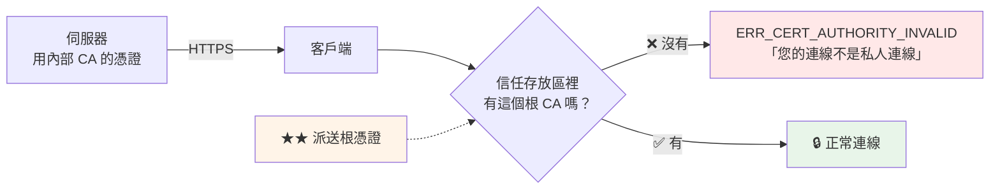

# 根憑證派送與信任

> [!abstract] 這篇你會學到
> - **各平台信任存放區**的位置與差異
> - Linux（`update-ca-certificates` / `update-ca-trust`）
> - Windows（**GPO 大量派送**、certutil、PowerShell）
> - macOS、iOS、Android
> - **瀏覽器**（Firefox 有自己的 NSS 存放區）
> - **程式語言**（Java / Node.js / Python / PHP / Go）
> - **容器與 CI**中的憑證信任
> - 派送**驗證**與**疑難排解**

## 前置知識

- [[08-用自建CA簽發伺服器憑證]] — 已簽出憑證
- [[06-自建根CA]] — 根憑證檔案的位置

---

## 為什麼要派送



> [!danger] 只派送根憑證，不要派送中繼 ★★
> ```
> ✅ 派送：root-ca.crt（根憑證）
>   → 客戶端信任根 → 自動信任【根簽發的整條鏈】
>     → 中繼 CA 換了、重簽了 → 客戶端【完全不用動】
>
> ❌ 派送中繼憑證到信任存放區
>   → 中繼 CA 被撤銷或更換時，每一台客戶端都要重新派送
>   → ★ 中繼憑證應該由【伺服器】在握手時送出（fullchain）
>
> ❌ 派送伺服器憑證
>   → 每年續期都要重新派送 → 災難
> ```

---

## Linux

### Ubuntu / Debian

```bash
# ═══ ★★ 副檔名必須是 .crt，內容是 PEM ═══
$ sudo cp root-ca.crt /usr/local/share/ca-certificates/example-gov-root-ca.crt
$ sudo chmod 644 /usr/local/share/ca-certificates/example-gov-root-ca.crt
$ sudo update-ca-certificates
Updating certificates in /etc/ssl/certs...
1 added, 0 removed; done.
Running hooks in /etc/ca-certificates/update.d...
done.

# ★ 驗證
$ ls -l /etc/ssl/certs/example-gov-root-ca.pem
$ awk -v cmd='openssl x509 -noout -subject' '/BEGIN/{c=cmd} c{print|c} /END/{close(c);c=0}' \
    /etc/ssl/certs/ca-certificates.crt | grep -i 'Example Gov'
subject=C=TW, ..., CN=Example Gov Root CA          # ★★

$ curl -I https://crm.internal.example.gov.tw/     # ★ 不用 --cacert 就能過
HTTP/2 200
```

> [!danger] Ubuntu 的三個常見坑 ★★
> ```
> ① ★★ 副檔名【必須是 .crt】
>      example-gov-root-ca.pem → ✗ 【會被忽略】
>      example-gov-root-ca.cer → ✗ 【會被忽略】
>      example-gov-root-ca.crt → ✓
>
> ② ★ 內容必須是 PEM（-----BEGIN CERTIFICATE-----）
>      DER 格式放進去 → update-ca-certificates 會靜默略過
>      轉換：openssl x509 -inform DER -in ca.der -out ca.crt
>
> ③ ★ 檔名不能有空白或中文
> ```

```bash
# ★ 檢查是不是 PEM
$ head -1 root-ca.crt
-----BEGIN CERTIFICATE-----        # ✓

# ★ DER 轉 PEM
$ openssl x509 -inform DER -in root-ca.der -out root-ca.crt

# ═══ 移除 ═══
$ sudo rm /usr/local/share/ca-certificates/example-gov-root-ca.crt
$ sudo update-ca-certificates --fresh
```

> [!info]- Rocky / AlmaLinux（RHEL 系）對照
> ```bash
> # ★ 目錄與指令都不同
> sudo cp root-ca.crt /etc/pki/ca-trust/source/anchors/example-gov-root-ca.crt
> sudo update-ca-trust extract
>
> # ★ RHEL 系【不挑副檔名】，.pem / .crt 都可以
> # ★ 也接受 DER（放在 anchors/ 下會自動辨識）
>
> # 驗證
> trust list --filter=ca-anchors | grep -A3 'Example Gov'
> openssl verify /etc/pki/tls/certs/ca-bundle.crt   # 或直接 curl 測試
>
> # 移除
> sudo rm /etc/pki/ca-trust/source/anchors/example-gov-root-ca.crt
> sudo update-ca-trust extract
>
> # ★ 只信任但不用於某些用途（blacklist / 分類）
> sudo cp ca.crt /etc/pki/ca-trust/source/blacklist/    # 明確不信任
> ```
>
> | | Ubuntu / Debian | RHEL 系 |
> | --- | --- | --- |
> | 放置目錄 | `/usr/local/share/ca-certificates/` | `/etc/pki/ca-trust/source/anchors/` |
> | 更新指令 | `update-ca-certificates` | `update-ca-trust extract` |
> | **副檔名要求** ★ | **必須 `.crt`** | 不限 |
> | 格式 | **只吃 PEM** | PEM / DER 都可 |
> | 產出的 bundle | `/etc/ssl/certs/ca-certificates.crt` | `/etc/pki/tls/certs/ca-bundle.crt` |

### 一鍵安裝腳本（跨發行版）

```bash
#!/usr/bin/env bash
# /usr/local/bin/install-root-ca —— 安裝內部根憑證（自動判斷發行版）
set -euo pipefail

CA_URL="${CA_URL:-http://pki.example.gov.tw/root-ca.crt}"
CA_NAME="${CA_NAME:-example-gov-root-ca}"
# ★★ 預期的指紋（從可信管道取得，用來防止中間人）
EXPECT_FP="${EXPECT_FP:-}"

TMP=$(mktemp -d); trap 'rm -rf "$TMP"' EXIT

echo "═══ 安裝內部根憑證 ═══"

# ══ 【1】下載 ══
echo "【1】下載 $CA_URL"
if [ -f "$CA_URL" ]; then
    cp "$CA_URL" "$TMP/ca.crt"
else
    curl -fsSL -o "$TMP/ca.crt" "$CA_URL" || { echo "✗ 下載失敗"; exit 1; }
fi

# ══ 【2】★ 確保是 PEM ══
if ! head -1 "$TMP/ca.crt" | grep -q 'BEGIN CERTIFICATE'; then
    echo "【2】偵測到 DER 格式，轉換為 PEM"
    openssl x509 -inform DER -in "$TMP/ca.crt" -out "$TMP/ca.pem"
    mv "$TMP/ca.pem" "$TMP/ca.crt"
else
    echo "【2】✓ 格式為 PEM"
fi

# ══ 【3】★★ 驗證指紋 ══
FP=$(openssl x509 -in "$TMP/ca.crt" -noout -fingerprint -sha256 | cut -d= -f2)
echo "【3】SHA-256 指紋："
echo "     $FP"
if [ -n "$EXPECT_FP" ]; then
    if [ "${FP//:/}" = "${EXPECT_FP//:/}" ]; then
        echo "     ✓ 指紋相符"
    else
        echo "     ✗✗ 指紋不符！可能遭到中間人攻擊"
        echo "        預期：$EXPECT_FP"
        exit 1
    fi
else
    echo "     ⚠ 未指定 EXPECT_FP，★ 請人工核對上方指紋"
fi

# ══ 【4】★ 確認是 CA 憑證 ══
if ! openssl x509 -in "$TMP/ca.crt" -noout -ext basicConstraints 2>/dev/null | grep -q 'CA:TRUE'; then
    echo "【4】✗✗ 這【不是】CA 憑證（basicConstraints 不是 CA:TRUE）"
    echo "        不要把伺服器憑證裝到信任存放區"
    exit 1
fi
echo "【4】✓ 確認是 CA 憑證"

openssl x509 -in "$TMP/ca.crt" -noout -subject -dates | sed 's/^/     /'

# ══ 【5】安裝 ══
echo "【5】安裝"
if [ -d /usr/local/share/ca-certificates ]; then
    # Debian / Ubuntu
    sudo install -m 644 "$TMP/ca.crt" "/usr/local/share/ca-certificates/$CA_NAME.crt"
    sudo update-ca-certificates
elif [ -d /etc/pki/ca-trust/source/anchors ]; then
    # RHEL 系
    sudo install -m 644 "$TMP/ca.crt" "/etc/pki/ca-trust/source/anchors/$CA_NAME.crt"
    sudo update-ca-trust extract
elif [ -d /etc/ca-certificates/trust-source/anchors ]; then
    # Arch
    sudo install -m 644 "$TMP/ca.crt" "/etc/ca-certificates/trust-source/anchors/$CA_NAME.crt"
    sudo trust extract-compat
else
    echo "✗ 無法辨識的發行版"; exit 1
fi

# ══ 【6】★★ 驗證 ══
echo "【6】★★ 驗證"
TEST_URL="${TEST_URL:-https://crm.internal.example.gov.tw/}"
if curl -sf -o /dev/null --max-time 10 "$TEST_URL"; then
    echo "     ✓ $TEST_URL 連線成功（系統已信任）"
else
    echo "     ⚠ 無法連線到 $TEST_URL（可能是網路問題，非憑證問題）"
    echo "       手動驗證："
    echo "         openssl s_client -connect <host>:443 -servername <host> </dev/null 2>&1 | grep Verify"
fi

# ══ 【7】提醒 ══
cat <<'EOF'

★★ 系統存放區已更新，但【以下不吃系統存放區】，需要另外處理：

  · Firefox      → 自己的 NSS 存放區（見本篇 Firefox 章節）
  · ★ Java       → keytool -importcert 到 cacerts
  · ★ Node.js    → NODE_EXTRA_CA_CERTS 環境變數
  · Python requests → REQUESTS_CA_BUNDLE（★ certifi 不吃系統）
  · Docker 容器  → 要在映像內安裝或掛載
EOF
```

---

## Windows

### 單機安裝

```powershell
# ═══ ★★ 必須裝到【本機電腦】的「受信任的根憑證授權單位」═══
#     不是「目前使用者」（否則只有那個使用者信任）

# ── 方法 A：PowerShell（★ 需要系統管理員）──
Import-Certificate -FilePath "C:\root-ca.crt" `
  -CertStoreLocation Cert:\LocalMachine\Root

# ── 方法 B：certutil ──
certutil -addstore -f "Root" C:\root-ca.crt

# ★ 驗證
Get-ChildItem Cert:\LocalMachine\Root | Where-Object { $_.Subject -like "*Example Gov*" } |
  Format-List Subject, Thumbprint, NotAfter

certutil -store Root | Select-String -Pattern "Example Gov" -Context 0,4

# ★ 測試
Invoke-WebRequest -Uri https://crm.internal.example.gov.tw/ -UseBasicParsing |
  Select-Object StatusCode

# ═══ 移除 ═══
certutil -delstore "Root" "<Thumbprint>"
```

> [!warning] Windows 存放區的區別 ★★
> ```
> Cert:\LocalMachine\Root     ★★ 本機電腦的受信任根 —— 【所有使用者與服務都信任】
> Cert:\CurrentUser\Root      只有目前使用者信任（★ IIS/服務不吃）
> Cert:\LocalMachine\CA       中繼憑證授權單位（★ 不是信任根）
> Cert:\LocalMachine\My       個人憑證（★ IIS 的伺服器憑證裝這裡）
>
> ★ 常見錯誤：裝到 CurrentUser\Root
>   → 使用者自己的瀏覽器可以，但【IIS、排程工作、服務帳號都不信任】
> ```

### ★★ GPO 大量派送

```
═══ 網域環境的標準做法 ═══

【1】把 root-ca.crt 放到網域共用位置
     \\dc01\NETLOGON\PKI\root-ca.crt

【2】開啟「群組原則管理」（gpmc.msc）

【3】建立或編輯 GPO，連結到目標 OU

【4】★★ 路徑：
     電腦設定
       → 原則
         → Windows 設定
           → 安全性設定
             → ★ 公開金鑰原則
               → ★★ 受信任的根憑證授權單位
                 → 右鍵「匯入」→ 選擇 root-ca.crt

【5】★ 若有中繼 CA 也要讓客戶端知道（非必要，但有助於鏈補全）：
     → 中繼憑證授權單位 → 匯入 intermediate.crt

【6】★ 強制更新
     gpupdate /force        # 在客戶端執行
     # 或等待預設的 90 分鐘週期

【7】★★ 驗證
     gpresult /h C:\gpreport.html
     certutil -store Root | findstr "Example Gov"
```

```powershell
# ═══ ★ 用 PowerShell 建立 GPO 並匯入（自動化）═══
Import-Module GroupPolicy

$GpoName = "PKI - 派送內部根憑證"
$CaPath  = "\\dc01\NETLOGON\PKI\root-ca.crt"
$Domain  = "example.gov.tw"

# 建立 GPO
$gpo = New-GPO -Name $GpoName -Comment "派送 Example Gov Root CA"

# ★ 連結到網域根（或特定 OU）
New-GPLink -Name $GpoName -Target "DC=example,DC=gov,DC=tw" -LinkEnabled Yes

# ★★ 匯入憑證到 GPO 的信任根存放區
#    （PowerShell 沒有直接的 cmdlet，用 certutil 操作 GPO 的存放區）
$gpoGuid = $gpo.Id.ToString("B").ToUpper()
$gpoPath = "\\$Domain\SYSVOL\$Domain\Policies\$gpoGuid\Machine\Registry.pol"

# ★ 實務上多用 GUI 匯入；自動化可改用 certutil -f -GroupPolicy -addstore Root
certutil -f -GroupPolicy -addstore Root $CaPath

Write-Host "★ GPO 已建立：$GpoName"
Write-Host "★ 在客戶端執行 gpupdate /force 後驗證："
Write-Host "  certutil -store Root | findstr 'Example Gov'"
```

```powershell
# ═══ ★ 沒有網域時：用登入指令碼或 Intune ═══
# install-root-ca.ps1（放在 NETLOGON 或用 Intune 派送）
$Url = "http://pki.example.gov.tw/root-ca.crt"
$ExpectedThumbprint = "A1B2C3D4E5F6..."      # ★★ 從可信管道取得
$Tmp = "$env:TEMP\root-ca.crt"

# 已安裝就跳過
if (Get-ChildItem Cert:\LocalMachine\Root |
    Where-Object { $_.Thumbprint -eq $ExpectedThumbprint }) {
    Write-Host "✓ 已安裝"; exit 0
}

Invoke-WebRequest -Uri $Url -OutFile $Tmp -UseBasicParsing

# ★★ 驗證指紋
$cert = New-Object System.Security.Cryptography.X509Certificates.X509Certificate2($Tmp)
if ($cert.Thumbprint -ne $ExpectedThumbprint) {
    Write-Error "✗✗ 指紋不符，中止安裝"
    Write-Error "   實際：$($cert.Thumbprint)"
    exit 1
}

Import-Certificate -FilePath $Tmp -CertStoreLocation Cert:\LocalMachine\Root
Write-Host "✓ 已安裝 $($cert.Subject)"
Remove-Item $Tmp
```

> [!tip] Windows 上的「自動根憑證更新」
> ```
> Windows 預設會從 Microsoft 的憑證信任清單自動更新根憑證
>
> ★ 這【不會移除】你手動或 GPO 安裝的內部根憑證
> ★ 但在【完全離線】的環境中，這個機制會造成憑證驗證延遲
>   （系統會嘗試連 ctldl.windowsupdate.com 逾時）
>
> 離線環境可關閉：
>   電腦設定 → 系統管理範本 → 系統 → 網際網路通訊管理
>     → 網際網路通訊設定
>       → 「關閉自動根憑證更新」= 已啟用
> ```

---

## macOS / iOS / Android

```bash
# ═══ macOS ═══
# ★★ 裝到 System keychain（所有使用者）
$ sudo security add-trusted-cert -d -r trustRoot \
    -k /Library/Keychains/System.keychain root-ca.crt

# ★ 只給目前使用者
$ security add-trusted-cert -d -r trustRoot \
    -k ~/Library/Keychains/login.keychain-db root-ca.crt

# 驗證
$ security find-certificate -c "Example Gov Root CA" -a -Z \
    /Library/Keychains/System.keychain

# 移除
$ sudo security delete-certificate -c "Example Gov Root CA" \
    /Library/Keychains/System.keychain
```

> [!danger] iOS 要【兩個步驟】★★
> ```
> ① 【安裝描述檔】
>    · 用 Safari 開啟 http://pki.example.gov.tw/root-ca.crt
>      → 「已下載設定描述檔」
>    · 設定 → 已下載的描述檔 → 安裝
>
> ② ★★★ 【啟用完全信任】（最多人漏掉這步）
>    設定 → 一般 → 關於本機 → ★ 憑證信任設定
>      → 把「Example Gov Root CA」的開關【打開】
>
> ★ 只做 ① 的話憑證有裝但【不被信任】，
>   Safari 仍然顯示「這個連線不是私人連線」
>
> ★ 企業管理（MDM）派送的描述檔會自動完成兩步
> ```

> [!warning] Android 7 以後的重大限制 ★★
> ```
> Android 7（Nougat, 2016）起：
>   ★★ App【預設只信任系統憑證】，不信任使用者安裝的憑證
>
> 影響：
>   · Chrome 瀏覽器 → ✓ 可以（會顯示「網路可能受到監控」警告）
>   · ★ 一般 App    → ✗ 不信任 → SSLHandshakeException
>
> 解法：
>   ① ★★ App 自己在 network_security_config.xml 宣告信任使用者憑證
>        <network-security-config>
>          <base-config>
>            <trust-anchors>
>              <certificates src="system" />
>              <certificates src="user" />    <!-- ★ -->
>            </trust-anchors>
>          </base-config>
>        </network-security-config>
>
>   ② ★ 用 MDM（Android Enterprise）派送到【系統存放區】
>
>   ③ Root 過的裝置：把憑證放到 /system/etc/security/cacerts/
>      （★ 檔名是 hash.0，例如 3513523f.0）
>
> 安裝路徑：設定 → 安全性 → 加密與憑證 → 安裝憑證 → CA 憑證
> ```

---

## 瀏覽器 ★★

| 瀏覽器 | 存放區 | 說明 |
| --- | --- | --- |
| Chrome / Edge（Win） | **Windows 系統存放區** | 裝系統即可 |
| Chrome（Linux） | **NSS**（`~/.pki/nssdb`）★ | **不吃系統存放區** |
| Chrome / Safari（macOS） | Keychain | 裝系統即可 |
| **Firefox（全平台）** ★★ | **自己的 NSS** | **一律要另外裝** |

> [!danger] Firefox 有自己的信任存放區 ★★★
> ```
> Firefox 【完全不看】作業系統的信任存放區（預設）
>   → 系統裝好了、curl 可以了，Firefox 還是報錯
>
> 三種解法：
>   ① ★★ 企業原則（推薦，可大量派送）
>   ② 手動匯入（設定 → 隱私權與安全性 → 檢視憑證 → 匯入）
>   ③ ★ 開啟「讀取系統存放區」（Firefox 68+）
>        about:config → security.enterprise_roots.enabled = true
> ```

### ★★ Firefox 企業原則（大量派送）

```json
// Linux:   /etc/firefox/policies/policies.json
//          （或 /usr/lib/firefox/distribution/policies.json）
// Windows: C:\Program Files\Mozilla Firefox\distribution\policies.json
// macOS:   /Applications/Firefox.app/Contents/Resources/distribution/policies.json
{
  "policies": {
    "Certificates": {
      "ImportEnterpriseRoots": true,
      "Install": [
        "/usr/local/share/ca-certificates/example-gov-root-ca.crt",
        "C:\\ProgramData\\PKI\\root-ca.crt"
      ]
    },
    "DisableTelemetry": true
  }
}
```

```bash
# ★ Linux 部署
$ sudo mkdir -p /etc/firefox/policies
$ sudo tee /etc/firefox/policies/policies.json >/dev/null <<'EOF'
{
  "policies": {
    "Certificates": {
      "ImportEnterpriseRoots": true,
      "Install": ["/usr/local/share/ca-certificates/example-gov-root-ca.crt"]
    }
  }
}
EOF
# ★ 重啟 Firefox 生效

# ★ 驗證：about:policies → 「作用中」分頁應看到 Certificates
```

> [!warning] Snap / Flatpak 版 Firefox
> ```
> Ubuntu 的 Firefox 預設是 Snap 套件
>   → policies.json 的位置不同：
>     /etc/firefox/policies/policies.json     ← ★ Snap 版仍讀這裡（22.04+）
>     或 /snap/firefox/current/usr/lib/firefox/distribution/policies.json（唯讀）
>
> ★ 更麻煩的是 Snap 的沙箱可能看不到 /usr/local/share/ca-certificates/
>   → 把憑證複製到 Snap 讀得到的位置，或改用 deb 版
>
> Flatpak：
>   flatpak override --system \
>     --filesystem=/etc/firefox/policies:ro org.mozilla.firefox
> ```

### Chrome on Linux（NSS）

```bash
# ★ Chrome/Chromium 在 Linux 用 NSS 資料庫，不吃系統存放區
$ sudo apt install -y libnss3-tools

# ★ 匯入到使用者的 NSS 資料庫
$ certutil -d sql:$HOME/.pki/nssdb -A \
    -t "C,," \
    -n "Example Gov Root CA" \
    -i /usr/local/share/ca-certificates/example-gov-root-ca.crt

# ★ 信任旗標的意義：
#   C = 可信任的 CA（TLS 伺服器）
#   T = 可信任的 CA（客戶端驗證）
#   P = 可信任的 peer
#   格式："SSL,S/MIME,程式碼簽章" → "C,," = 只信任 TLS

# 驗證
$ certutil -d sql:$HOME/.pki/nssdb -L | grep 'Example Gov'
Example Gov Root CA                                          C,,

# 移除
$ certutil -d sql:$HOME/.pki/nssdb -D -n "Example Gov Root CA"
```

```bash
# ★★ 大量派送：對每個使用者執行
$ sudo tee /usr/local/bin/nss-import-ca >/dev/null <<'EOF'
#!/usr/bin/env bash
# 對系統上所有使用者匯入根憑證到 NSS
CA=/usr/local/share/ca-certificates/example-gov-root-ca.crt
NAME="Example Gov Root CA"

for home in /home/*; do
    u=$(basename "$home")
    db="$home/.pki/nssdb"
    [ -d "$db" ] || { sudo -u "$u" mkdir -p "$db"; sudo -u "$u" certutil -d "sql:$db" -N --empty-password; }
    if sudo -u "$u" certutil -d "sql:$db" -L 2>/dev/null | grep -q "$NAME"; then
        echo "  $u：已存在"
    else
        sudo -u "$u" certutil -d "sql:$db" -A -t "C,," -n "$NAME" -i "$CA" && echo "  $u：✓"
    fi
done
EOF
$ sudo chmod +x /usr/local/bin/nss-import-ca && sudo nss-import-ca
```

---

## 程式語言與執行環境 ★★

| 執行環境 | 吃系統存放區？ | 處理方式 |
| --- | --- | --- |
| curl / wget | ✓ | 不用處理 |
| OpenSSL CLI | ✓ | 不用處理 |
| **Java** | **✗** ★★ | `keytool` 匯入 `cacerts` |
| **Node.js** | **✗** ★★ | `NODE_EXTRA_CA_CERTS` |
| **Python requests** | **✗** ★ | `REQUESTS_CA_BUNDLE`（certifi 有自己的 bundle） |
| Python urllib/ssl | ✓（多數平台） | 通常不用 |
| PHP（curl 擴充） | ✓ | 通常不用；否則設 `curl.cainfo` |
| Go | ✓ | 不用處理 |
| .NET（Linux） | ✓ | 不用處理 |
| Ruby | 部分 | `SSL_CERT_FILE` |

### Java ★★

```bash
# ═══ 找出 JAVA_HOME 與 cacerts ═══
$ readlink -f "$(which java)" | sed 's|/bin/java||'
/usr/lib/jvm/java-21-openjdk-amd64

$ CACERTS=$(readlink -f "$(which java)" | sed 's|/bin/java||')/lib/security/cacerts

# ═══ ★★ 匯入（預設密碼是 changeit）═══
$ sudo keytool -importcert -noprompt -trustcacerts \
    -alias example-gov-root-ca \
    -file /usr/local/share/ca-certificates/example-gov-root-ca.crt \
    -keystore "$CACERTS" \
    -storepass changeit

# ★ 驗證
$ keytool -list -keystore "$CACERTS" -storepass changeit -alias example-gov-root-ca
example-gov-root-ca, 2026-08-28, trustedCertEntry,
憑證指紋 (SHA-256): A1:B2:C3:...

# 移除
$ sudo keytool -delete -alias example-gov-root-ca -keystore "$CACERTS" -storepass changeit
```

> [!danger] Java 的三個坑 ★★
> ```
> ① ★★ 【每次升級 JDK 都要重新匯入】
>      → cacerts 是 JDK 的一部分，升級會換掉
>      → 解法：用外部 truststore
>        java -Djavax.net.ssl.trustStore=/etc/ssl/java-truststore.jks \
>             -Djavax.net.ssl.trustStorePassword=changeit -jar app.jar
>
> ② ★ 系統上可能有【多個 JDK】
>      → 每一個的 cacerts 都要匯入
>      for j in /usr/lib/jvm/*/lib/security/cacerts; do
>          sudo keytool -importcert -noprompt -trustcacerts \
>            -alias example-gov-root-ca -file ca.crt \
>            -keystore "$j" -storepass changeit
>      done
>
> ③ Debian/Ubuntu 的 OpenJDK 可能用符號連結指到
>      /etc/ssl/certs/java/cacerts
>      → ★ 這個檔案由 update-ca-certificates 的 hook 自動更新！
>        （ca-certificates-java 套件）
>      → ★★ 所以 Ubuntu 上裝了系統憑證後，Java 【可能自動就有了】
>        驗證：keytool -list -keystore /etc/ssl/certs/java/cacerts \
>                -storepass changeit | grep -i example
> ```

```bash
# ★ Ubuntu：確保 ca-certificates-java 有裝
$ sudo apt install -y ca-certificates-java
$ sudo update-ca-certificates -f       # ★ -f 強制重建 Java keystore
$ keytool -list -keystore /etc/ssl/certs/java/cacerts -storepass changeit 2>/dev/null | \
    grep -i 'example gov'
```

### Node.js ★★

```bash
# ═══ ★★ NODE_EXTRA_CA_CERTS（★ 附加，不取代內建的）═══
$ export NODE_EXTRA_CA_CERTS=/usr/local/share/ca-certificates/example-gov-root-ca.crt
$ node -e "fetch('https://crm.internal.example.gov.tw/').then(r=>console.log(r.status))"
200

# ★ 系統層級（所有使用者）
$ echo 'NODE_EXTRA_CA_CERTS=/usr/local/share/ca-certificates/example-gov-root-ca.crt' | \
    sudo tee -a /etc/environment
```

```ini
# ★★ systemd 服務
# /etc/systemd/system/nuxt-app.service
[Service]
Environment=NODE_EXTRA_CA_CERTS=/usr/local/share/ca-certificates/example-gov-root-ca.crt
```

```javascript
// ★★ PM2 ecosystem.config.js
module.exports = {
  apps: [{
    name: 'nuxt-app',
    script: '.output/server/index.mjs',
    env: {
      NODE_ENV: 'production',
      NODE_EXTRA_CA_CERTS: '/usr/local/share/ca-certificates/example-gov-root-ca.crt',
    },
  }],
};
```

```bash
# ★ npm 也要（安裝套件時走內部 registry 的話）
$ npm config set cafile /usr/local/share/ca-certificates/example-gov-root-ca.crt

# ❌❌ 絕對不要用這個「解法」
$ export NODE_TLS_REJECT_UNAUTHORIZED=0     # ★★★ 完全關閉 TLS 驗證！
```

> [!danger] `NODE_TLS_REJECT_UNAUTHORIZED=0` 是安全災難 ★★★
> ```
> 這個環境變數會【完全關閉 Node.js 的 TLS 憑證驗證】
>   → 對【所有】連線生效（不只是你的內部服務）
>     → ★★★ 任何中間人都能攔截，包括對外的 API 呼叫
>
> Node.js 自己會警告：
>   Warning: Setting the NODE_TLS_REJECT_UNAUTHORIZED environment variable
>   to '0' makes TLS connections and HTTPS requests insecure
>
> ★★ 正確做法一律是 NODE_EXTRA_CA_CERTS
> ```

### Python

```bash
# ═══ ★ requests 用 certifi 的 bundle，不吃系統 ═══
$ python3 -c "import certifi; print(certifi.where())"
/usr/lib/python3/dist-packages/certifi/cacert.pem

# ── 方法 A：★★ 環境變數（推薦）──
$ export REQUESTS_CA_BUNDLE=/etc/ssl/certs/ca-certificates.crt
$ export SSL_CERT_FILE=/etc/ssl/certs/ca-certificates.crt      # ★ 給 urllib/aiohttp
$ python3 -c "import requests; print(requests.get('https://crm.internal.example.gov.tw/').status_code)"
200

# ── 方法 B：程式碼中指定 ──
# requests.get(url, verify='/etc/ssl/certs/ca-certificates.crt')

# ── 方法 C：★ 把憑證加到 certifi 的 bundle（★ 升級會被覆蓋）──
$ cat root-ca.crt | sudo tee -a "$(python3 -c 'import certifi;print(certifi.where())')"

# ── pip 走內部鏡像時 ──
$ pip config set global.cert /usr/local/share/ca-certificates/example-gov-root-ca.crt
# 或 /etc/pip.conf:
#   [global]
#   cert = /usr/local/share/ca-certificates/example-gov-root-ca.crt

# ❌❌ 不要用
$ pip install --trusted-host ...      # ★ 等於關閉驗證
```

```ini
# ★ systemd 服務（gunicorn / uvicorn）
[Service]
Environment=REQUESTS_CA_BUNDLE=/etc/ssl/certs/ca-certificates.crt
Environment=SSL_CERT_FILE=/etc/ssl/certs/ca-certificates.crt
```

### PHP

```bash
# ★ PHP 的 curl 擴充通常用系統的 CA bundle
$ php -r "var_dump(ini_get('curl.cainfo'), ini_get('openssl.cafile'));"
string(0) ""            # ★ 空的 = 用系統預設 → 通常沒問題

# ★ 若要明確指定（php.ini）
curl.cainfo    = /etc/ssl/certs/ca-certificates.crt
openssl.cafile = /etc/ssl/certs/ca-certificates.crt

$ php -r "echo file_get_contents('https://crm.internal.example.gov.tw/') ? 'OK' : 'FAIL';"

# ★ Laravel 的 HTTP Client（Guzzle）也是走 curl → 系統存放區即可
```

### Go / .NET / Ruby

```bash
# ═══ Go —— ★ 直接吃系統存放區，不用處理 ═══
$ cat > /tmp/t.go <<'EOF'
package main
import ("fmt";"net/http")
func main() {
    r, err := http.Get("https://crm.internal.example.gov.tw/")
    if err != nil { fmt.Println("✗", err); return }
    fmt.Println("✓", r.Status)
}
EOF
$ go run /tmp/t.go
✓ 200 OK

# ★ 若要額外指定（Go 1.18+ 只在 Linux 有效）
$ export SSL_CERT_FILE=/etc/ssl/certs/ca-certificates.crt
$ export SSL_CERT_DIR=/etc/ssl/certs

# ═══ .NET on Linux —— ★ 吃 OpenSSL 的存放區 ═══
$ dotnet run       # 系統裝好就可以

# ═══ Ruby ═══
$ export SSL_CERT_FILE=/etc/ssl/certs/ca-certificates.crt
```

---

## 容器與 CI ★★

```dockerfile
# ═══ ★★ Debian/Ubuntu 基底 ═══
FROM node:22-bookworm-slim

# ★ 安裝內部根憑證
COPY pki/root-ca.crt /usr/local/share/ca-certificates/example-gov-root-ca.crt
RUN apt-get update && apt-get install -y --no-install-recommends ca-certificates && \
    update-ca-certificates && \
    rm -rf /var/lib/apt/lists/*

# ★★ Node.js 還要這個
ENV NODE_EXTRA_CA_CERTS=/usr/local/share/ca-certificates/example-gov-root-ca.crt

WORKDIR /app
COPY . .
CMD ["node", "server.js"]
```

```dockerfile
# ═══ ★ Alpine 基底（目錄與指令不同）═══
FROM node:22-alpine
COPY pki/root-ca.crt /usr/local/share/ca-certificates/example-gov-root-ca.crt
RUN apk add --no-cache ca-certificates && update-ca-certificates
ENV NODE_EXTRA_CA_CERTS=/usr/local/share/ca-certificates/example-gov-root-ca.crt
```

```dockerfile
# ═══ ★ 多階段建置：兩個階段都要裝 ═══
FROM node:22-bookworm AS build
COPY pki/root-ca.crt /usr/local/share/ca-certificates/root-ca.crt
RUN update-ca-certificates
ENV NODE_EXTRA_CA_CERTS=/usr/local/share/ca-certificates/root-ca.crt
WORKDIR /app
COPY package*.json ./
RUN npm ci                    # ★ 若 registry 是內部的 HTTPS，這裡需要憑證
COPY . .
RUN npm run build

FROM node:22-bookworm-slim
# ★★ runtime 階段也要（build 階段的信任不會帶過來）
COPY pki/root-ca.crt /usr/local/share/ca-certificates/root-ca.crt
RUN apt-get update && apt-get install -y --no-install-recommends ca-certificates && \
    update-ca-certificates && rm -rf /var/lib/apt/lists/*
ENV NODE_EXTRA_CA_CERTS=/usr/local/share/ca-certificates/root-ca.crt
WORKDIR /app
COPY --from=build /app/.output ./.output
CMD ["node", ".output/server/index.mjs"]
```

```yaml
# ═══ ★ docker compose：掛載（不用改映像）═══
services:
  app:
    image: node:22-bookworm-slim
    volumes:
      # ★ 直接覆蓋整個 bundle（最簡單）
      - /etc/ssl/certs/ca-certificates.crt:/etc/ssl/certs/ca-certificates.crt:ro
      # ★ Node.js 額外需要
      - /usr/local/share/ca-certificates/example-gov-root-ca.crt:/etc/ssl/internal-ca.crt:ro
    environment:
      NODE_EXTRA_CA_CERTS: /etc/ssl/internal-ca.crt
```

```bash
# ═══ ★★ Docker daemon 自己要拉內部 registry 的映像 ═══
$ sudo mkdir -p /etc/docker/certs.d/registry.internal.example.gov.tw
$ sudo cp root-ca.crt /etc/docker/certs.d/registry.internal.example.gov.tw/ca.crt
$ sudo systemctl restart docker
$ docker pull registry.internal.example.gov.tw/myapp:latest

# ★ 注意：目錄名必須完全等於 registry 的 host[:port]
#   registry.internal.example.gov.tw:5000 → 目錄要含 :5000
```

```yaml
# ═══ ★ GitHub Actions / GitLab CI ═══
# .github/workflows/deploy.yml
steps:
  - name: 安裝內部根憑證
    run: |
      echo "${{ secrets.INTERNAL_ROOT_CA }}" | \
        sudo tee /usr/local/share/ca-certificates/internal-ca.crt >/dev/null
      sudo update-ca-certificates
      echo "NODE_EXTRA_CA_CERTS=/usr/local/share/ca-certificates/internal-ca.crt" >> $GITHUB_ENV
      echo "REQUESTS_CA_BUNDLE=/etc/ssl/certs/ca-certificates.crt" >> $GITHUB_ENV
```

---

## 完整實戰範例：全機關派送

```bash
#!/usr/bin/env bash
# /usr/local/bin/verify-ca-trust —— 驗證本機所有環境是否信任內部根 CA
set -uo pipefail

CA_CN="${CA_CN:-Example Gov Root CA}"
TEST_URL="${TEST_URL:-https://crm.internal.example.gov.tw/}"
CA_FILE="${CA_FILE:-/usr/local/share/ca-certificates/example-gov-root-ca.crt}"

PASS=0; FAIL=0
r() { # r <名稱> <指令>
    printf '  %-28s ' "$1"
    if eval "$2" >/dev/null 2>&1; then echo "✓"; PASS=$((PASS+1))
    else echo "✗"; FAIL=$((FAIL+1)); fi
}

echo "═══ 驗證內部根 CA 的信任狀態 ═══"
echo "  CA   : $CA_CN"
echo "  測試 : $TEST_URL"
echo

echo "【系統】"
r "根憑證檔案存在" "[ -f '$CA_FILE' ]"
r "系統 bundle 含此 CA" \
  "grep -q . '$CA_FILE' && awk -v c='openssl x509 -noout -subject' '/BEGIN/{cmd=c} cmd{print|cmd} /END/{close(cmd);cmd=0}' /etc/ssl/certs/ca-certificates.crt 2>/dev/null | grep -q '$CA_CN'"
r "curl" "curl -sf -o /dev/null --max-time 10 '$TEST_URL'"
r "wget" "wget -q -O /dev/null --timeout=10 '$TEST_URL'"
r "openssl s_client" \
  "echo | openssl s_client -connect \$(echo '$TEST_URL'|sed 's|https://||;s|/.*||'):443 -servername \$(echo '$TEST_URL'|sed 's|https://||;s|/.*||') 2>&1 | grep -q 'Verify return code: 0'"

echo -e "\n【程式語言】"
command -v node >/dev/null && \
  r "Node.js（含 EXTRA_CA）" \
    "NODE_EXTRA_CA_CERTS='$CA_FILE' node -e \"fetch('$TEST_URL').then(r=>process.exit(r.ok?0:1)).catch(()=>process.exit(1))\""
command -v python3 >/dev/null && \
  r "Python requests" \
    "REQUESTS_CA_BUNDLE=/etc/ssl/certs/ca-certificates.crt python3 -c \"import requests,sys;sys.exit(0 if requests.get('$TEST_URL',timeout=10).ok else 1)\""
command -v php >/dev/null && \
  r "PHP" "php -r \"exit(@file_get_contents('$TEST_URL')===false?1:0);\""
command -v go >/dev/null && \
  r "Go" "printf 'package main\nimport(\"net/http\";\"os\")\nfunc main(){_,e:=http.Get(\"$TEST_URL\");if e!=nil{os.Exit(1)}}\n' > /tmp/_t.go && go run /tmp/_t.go"
if command -v keytool >/dev/null; then
    for ks in /etc/ssl/certs/java/cacerts $(ls -d /usr/lib/jvm/*/lib/security/cacerts 2>/dev/null); do
        [ -f "$ks" ] || continue
        r "Java $(echo "$ks"|cut -c1-40)" \
          "keytool -list -keystore '$ks' -storepass changeit 2>/dev/null | grep -qi '$(echo "$CA_CN"|tr 'A-Z' 'a-z')'"
    done
fi

echo -e "\n【瀏覽器】"
if [ -d "$HOME/.pki/nssdb" ]; then
    r "Chrome NSS" "certutil -d sql:$HOME/.pki/nssdb -L 2>/dev/null | grep -q '$CA_CN'"
else
    echo "  Chrome NSS                   － 未建立 nssdb"
fi
r "Firefox 企業原則" \
  "[ -f /etc/firefox/policies/policies.json ] && grep -q 'Certificates' /etc/firefox/policies/policies.json"

echo -e "\n【容器】"
command -v docker >/dev/null && {
    r "Docker 可拉內部 registry" \
      "[ -f /etc/docker/certs.d/registry.internal.example.gov.tw/ca.crt ]"
}

echo
echo "═══ 結果：✓ $PASS  ✗ $FAIL ═══"
[ "$FAIL" -eq 0 ] && echo "  ★ 全部通過" || cat <<'EOF'

  ★ 未通過的項目請對照：
    Firefox   → /etc/firefox/policies/policies.json
    Chrome    → certutil -d sql:$HOME/.pki/nssdb -A -t "C,," -n "..." -i ca.crt
    Java      → keytool -importcert ... -keystore <cacerts> -storepass changeit
    Node.js   → NODE_EXTRA_CA_CERTS=<ca.crt>
    Python    → REQUESTS_CA_BUNDLE=/etc/ssl/certs/ca-certificates.crt
EOF
exit "$FAIL"
```

```bash
$ sudo chmod +x /usr/local/bin/verify-ca-trust
$ verify-ca-trust
═══ 驗證內部根 CA 的信任狀態 ═══
  CA   : Example Gov Root CA
  測試 : https://crm.internal.example.gov.tw/

【系統】
  根憑證檔案存在               ✓
  系統 bundle 含此 CA          ✓
  curl                         ✓
  wget                         ✓
  openssl s_client             ✓

【程式語言】
  Node.js（含 EXTRA_CA）       ✓
  Python requests              ✓
  PHP                          ✓
  Java /etc/ssl/certs/java/... ✓

【瀏覽器】
  Chrome NSS                   ✓
  Firefox 企業原則             ✗

═══ 結果：✓ 10  ✗ 1 ═══
```

---

## 常見錯誤與排錯

| 現象 | 原因 | 解法 |
| --- | --- | --- |
| **Ubuntu 裝了沒效果** ★★ | 副檔名不是 `.crt` | 改成 `.crt` 再 `update-ca-certificates` |
| Ubuntu 靜默略過 | 內容是 DER 不是 PEM | `openssl x509 -inform DER -in x.der -out x.crt` |
| **curl 可以，Firefox 不行** ★★★ | Firefox 用自己的 NSS | `policies.json` 或 `security.enterprise_roots.enabled` |
| **curl 可以，Chrome(Linux) 不行** ★ | Chrome 用 NSS | `certutil -d sql:~/.pki/nssdb -A -t "C,,"` |
| **curl 可以，Java 不行** ★★ | Java 用自己的 cacerts | `keytool -importcert` |
| **curl 可以，Node 不行** ★★ | Node 用內建 bundle | `NODE_EXTRA_CA_CERTS` |
| curl 可以，Python requests 不行 ★ | certifi 有自己的 bundle | `REQUESTS_CA_BUNDLE` |
| **iOS 裝了還是不信任** ★★★ | 沒開「憑證信任設定」 | 設定→一般→關於本機→憑證信任設定 |
| **Android App 不信任** ★★ | Android 7+ 預設不信任使用者憑證 | `network_security_config.xml` 或 MDM |
| **Windows：IIS 不信任但瀏覽器可以** ★ | 裝到 `CurrentUser\Root` | 改裝 `LocalMachine\Root` |
| GPO 沒生效 | 沒 `gpupdate` / 連錯 OU | `gpupdate /force`、`gpresult /h` |
| Docker 容器內不信任 ★ | 映像內沒裝 | Dockerfile 加 `COPY` + `update-ca-certificates` |
| **升級 JDK 後又不信任** ★★ | cacerts 被換掉 | 用外部 truststore 或重新匯入 |
| Snap 版 Firefox 讀不到憑證 | 沙箱限制 | 憑證放沙箱可見的位置或改用 deb 版 |

### 逐層排查

```bash
# ★★ 順序：從最底層往上
HOST=crm.internal.example.gov.tw

# 【1】OpenSSL 層（★ 最底層，這裡不通就別往上找）
$ echo | openssl s_client -connect "$HOST:443" -servername "$HOST" 2>&1 | \
    grep -E 'Verify return code|verify error'
Verify return code: 0 (ok)                    # ★ 0 = 成功

# 常見錯誤碼：
#   19 = self signed certificate in certificate chain  → ★ 根憑證沒裝
#   20 = unable to get local issuer certificate        → ★ 伺服器沒送中繼
#   21 = unable to verify the first certificate        → 同上
#   10 = certificate has expired

# 【2】系統 bundle 裡有沒有
$ awk -v cmd='openssl x509 -noout -subject' \
    '/BEGIN/{c=cmd} c{print|c} /END/{close(c);c=0}' \
    /etc/ssl/certs/ca-certificates.crt | grep -i 'example gov'

# 【3】明確指定 CA 檔測試（★ 排除「憑證本身有問題」）
$ curl -v --cacert /usr/local/share/ca-certificates/example-gov-root-ca.crt "https://$HOST/"
# ★ 這樣可以 → 憑證沒問題，是【信任存放區沒裝好】
# ★ 這樣也不行 → 憑證鏈或 SAN 有問題，回頭看 08 篇

# 【4】伺服器有沒有送中繼
$ echo | openssl s_client -connect "$HOST:443" -servername "$HOST" -showcerts 2>/dev/null | \
    grep -c 'BEGIN CERTIFICATE'
2                                             # ★ 應該 ≥2

# 【5】看完整的鏈
$ echo | openssl s_client -connect "$HOST:443" -servername "$HOST" 2>/dev/null | \
    grep -E '^\s*[0-9]+ [si]:'
 0 s:CN=crm.internal.example.gov.tw
   i:CN=Example Gov Issuing CA
 1 s:CN=Example Gov Issuing CA
   i:CN=Example Gov Root CA                   # ★ 最後一層的 issuer 就是根

# 【6】個別執行環境
$ NODE_EXTRA_CA_CERTS=/usr/local/share/ca-certificates/example-gov-root-ca.crt \
    node -e "fetch('https://$HOST/').then(r=>console.log(r.status))"
$ keytool -list -keystore /etc/ssl/certs/java/cacerts -storepass changeit | grep -i example
$ certutil -d sql:$HOME/.pki/nssdb -L | grep -i example
```

---

## 安全性注意事項

> [!danger] 派送根憑證是【高權限操作】★★★
> ```
> 客戶端安裝了你的根憑證 = 【你可以簽發任何域名的憑證】
>   → 包含 google.com、bank.com.tw
>     → ★★ 理論上可以對該裝置做中間人攻擊
>
> ★ 所以：
>   ① 【根 CA 私鑰必須離線嚴密保管】（見 06 篇）
>   ② 派送前必須【驗證指紋】（防止派送到假的根憑證）
>   ③ 只在【機關管理的裝置】上派送
>   ④ ★ 不要要求員工在【個人裝置】上安裝
>      （若必要，要說明清楚並取得同意）
>   ⑤ 記錄派送範圍與時間（稽核用）
>
> ★★★ 這也是為什麼「只用內部 CA 簽發內部域名」很重要 ——
>    不要用它簽外部域名的憑證。
> ```

> [!warning] ★★ 派送前必須驗證指紋
> ```bash
> # ★ 在【伺服器端】公布指紋（用可信管道：內部公告、實體公告欄）
> openssl x509 -in root-ca.crt -noout -fingerprint -sha256
> SHA256 Fingerprint=A1:B2:C3:D4:...
>
> # ★★ 在【客戶端】安裝前核對
> openssl x509 -in downloaded-ca.crt -noout -fingerprint -sha256
>
> # ★ 兩者不符 → 【立刻停止】，可能是中間人攻擊
> ```
>
> 因為根憑證常常是用 **HTTP**（不是 HTTPS）下載的
> —— 這是雞生蛋的問題（還沒信任 CA 就沒辦法用 HTTPS 下載），
> **所以指紋核對是唯一的防線**。

> [!tip] 根憑證即將到期的處理
> ```
> 根 CA 有效期通常 20 年，但要提前規劃：
>
>   ★ 到期前【3～5 年】開始準備新的根 CA
>   ① 建立新的根 CA
>   ② ★★ 【先派送新的根憑證】（此時新舊並存）
>   ③ 等派送率達到 99%+（用 verify-ca-trust 統計）
>   ④ 用新的根 CA 簽發新的中繼 CA
>   ⑤ 用新的中繼 CA 重新簽發所有伺服器憑證
>   ⑥ 舊根憑證到期後才移除
>
> ★ 順序絕對不能顛倒 ——
>   先換憑證再派送 → 所有服務同時中斷
> ```

---

## 速查表

### ★★ 各平台一覽

```bash
# ── Ubuntu / Debian（★ 必須 .crt + PEM）──
sudo cp root-ca.crt /usr/local/share/ca-certificates/internal-ca.crt
sudo update-ca-certificates

# ── RHEL / Rocky / Alma ──
sudo cp root-ca.crt /etc/pki/ca-trust/source/anchors/internal-ca.crt
sudo update-ca-trust extract

# ── Windows（★ LocalMachine 不是 CurrentUser）──
Import-Certificate -FilePath root-ca.crt -CertStoreLocation Cert:\LocalMachine\Root
certutil -addstore -f "Root" root-ca.crt

# ── macOS ──
sudo security add-trusted-cert -d -r trustRoot \
  -k /Library/Keychains/System.keychain root-ca.crt

# ── Chrome on Linux（NSS）──
certutil -d sql:$HOME/.pki/nssdb -A -t "C,," -n "Internal CA" -i root-ca.crt

# ── Java ──
sudo keytool -importcert -noprompt -trustcacerts -alias internal-ca \
  -file root-ca.crt -keystore $JAVA_HOME/lib/security/cacerts -storepass changeit
```

### ★★★ 不吃系統存放區的清單

```
Firefox        → policies.json  或  security.enterprise_roots.enabled=true
Chrome(Linux)  → certutil -d sql:~/.pki/nssdb -A -t "C,,"
★ Java         → keytool -importcert（★ 升級 JDK 後要重做）
★ Node.js      → NODE_EXTRA_CA_CERTS=<路徑>
Python requests→ REQUESTS_CA_BUNDLE / SSL_CERT_FILE
容器           → Dockerfile 內安裝，或掛載 bundle
Docker daemon  → /etc/docker/certs.d/<registry>/ca.crt
```

### Windows GPO 派送

```
電腦設定 → 原則 → Windows 設定 → 安全性設定
  → 公開金鑰原則 → ★★ 受信任的根憑證授權單位 → 匯入

客戶端：gpupdate /force
驗證：  certutil -store Root | findstr "Example Gov"
```

### iOS / Android

```
★★ iOS 兩步驟：
   ① 安裝描述檔
   ② 設定 → 一般 → 關於本機 → 憑證信任設定 → 開啟開關

★★ Android 7+：App 預設不信任使用者憑證
   → network_security_config.xml 加 <certificates src="user" />
   → 或用 MDM 派送到系統存放區
```

### ★★ 排查順序

```bash
# ① OpenSSL（最底層）
echo | openssl s_client -connect host:443 -servername host 2>&1 | grep 'Verify return code'
#   0  = OK
#   19 = 根憑證沒裝
#   20/21 = 伺服器沒送中繼

# ② 明確指定 CA 測試（排除憑證本身的問題）
curl -v --cacert root-ca.crt https://host/
#   可以 → 是【信任存放區】的問題
#   不行 → 是【憑證／鏈】的問題（回 08 篇）

# ③ 伺服器有沒有送中繼
echo | openssl s_client -connect host:443 -showcerts 2>/dev/null | grep -c 'BEGIN CERT'
#   應該 ≥ 2
```

### ★★ 安全原則

```
□ 只派送【根憑證】，不派送中繼／伺服器憑證
□ ★★ 派送前【核對 SHA-256 指紋】
□ 只在機關管理的裝置上派送
□ 根 CA 私鑰離線保管
□ 不要用內部 CA 簽發外部域名
□ 記錄派送範圍與時間
□ ★ 根憑證到期前 3～5 年開始換發（先派送新的，再換憑證）
```

```
❌❌❌ 絕對不要用的「解法」
   NODE_TLS_REJECT_UNAUTHORIZED=0
   curl -k / --insecure
   pip install --trusted-host
   requests.get(url, verify=False)
   → 這些是【關閉驗證】不是【建立信任】
```

---

## 練習題

> [!question]- 練習 1：Ubuntu 的副檔名陷阱
> 1. 把根憑證複製成 `/usr/local/share/ca-certificates/ca.pem`
> 2. `sudo update-ca-certificates` → **輸出是什麼？加了幾個？**
> 3. `curl https://<內部站台>/` → 成功嗎？
> 4. 改名成 `ca.crt` 再跑一次 → **有什麼不同？**
> 5. 再試 DER 格式的 `.crt` → **結果如何？**
> 6. **寫下這三個坑**

> [!question]- 練習 2：Firefox 的獨立存放區
> 1. 系統裝好根憑證，`curl` 確認可以
> 2. 用 **Firefox** 開啟內部站台 → **可以嗎？**
> 3. `about:config` → `security.enterprise_roots.enabled = true` → 重啟 → 再試
> 4. 改用 `policies.json` 的方式
> 5. `about:policies` 確認生效
> 6. **Chrome on Linux 呢？測試看看**

> [!question]- 練習 3：程式語言的差異
> 對每一種寫一支「抓內部 HTTPS 站台」的小程式：
> 1. `curl` → 成功
> 2. Node.js（**不設** `NODE_EXTRA_CA_CERTS`）→ **錯誤是什麼？**
> 3. Java（不匯入 cacerts）→ **錯誤是什麼？**
> 4. Python `requests` → **成功還是失敗？**（Ubuntu 上可能兩種結果都有）
> 5. Go → **成功還是失敗？**
> 6. **整理出一張「誰吃系統存放區」的表**

> [!question]- 練習 4：容器內的信任
> 1. `docker run --rm node:22-slim node -e "fetch('https://<內部站台>/')"` → **失敗**
> 2. 用 `-v` 掛載系統 bundle → **成功嗎？**
> 3. 加上 `NODE_EXTRA_CA_CERTS` → 成功
> 4. 寫一個 Dockerfile 把憑證裝進映像
> 5. **多階段建置**：只在 build 階段裝，runtime 階段不裝 → **會怎樣？**

> [!question]- 練習 5：完整派送演練
> 1. 部署 `install-root-ca` 與 `verify-ca-trust` 腳本
> 2. 在一台乾淨的 VM 上執行 `install-root-ca`
> 3. **故意用錯誤的 `EXPECT_FP`** → **腳本有攔下來嗎？**
> 4. 執行 `verify-ca-trust` → 記錄哪些通過、哪些沒有
> 5. 逐一補齊未通過的項目
> 6. **設計你們機關的派送計畫**：
>    - Windows 網域機（GPO）
>    - Linux 伺服器（Ansible / 腳本）
>    - 個人手機（要不要派？怎麼說明？）
>    - 容器與 CI

---

## 小測驗

Q1. **為什麼只派送根憑證，不派送中繼憑證**？

Q2. **Ubuntu 上安裝根憑證有哪三個常見的坑**？

Q3. **Ubuntu 與 RHEL 系的目錄與指令分別是什麼**？

Q4. **`curl` 可以但 Firefox 不行，原因是什麼？三種解法**？

Q5. **哪些執行環境不吃系統信任存放區？各自怎麼處理**？

Q6. **Windows 上裝到 `CurrentUser\Root` 會有什麼問題**？

Q7. **iOS 安裝根憑證為什麼要「兩個步驟」**？

Q8. **Android 7 以後對使用者安裝的憑證有什麼限制**？

Q9. **`NODE_TLS_REJECT_UNAUTHORIZED=0` 為什麼是安全災難**？

Q10. **派送根憑證前為什麼一定要核對指紋**？

> [!question]- 測驗答案
> **Q1.** 因為**信任是從根往下傳遞的** ——
> 客戶端信任根 CA 後，**會自動信任根 CA 簽發的整條鏈**（包含中繼 CA 與伺服器憑證）。
> **只派送根憑證的好處**：
> **中繼 CA 更換、被撤銷、重新簽發時，客戶端完全不用動**。
> **派送中繼憑證的壞處**：中繼 CA 更換時，每一台客戶端都要重新派送。
> **中繼憑證應該由「伺服器」在 TLS 握手時送出**（這就是 `fullchain.pem` 的作用），
> 而不是預先安裝在客戶端。
> **更不要派送伺服器憑證** —— 每年續期都要重新派送，是災難。
>
> **Q2.** ①**副檔名必須是 `.crt`** ——
> `.pem`、`.cer` 會被 `update-ca-certificates` **靜默忽略**（不報錯，最難查）。
> ②**內容必須是 PEM 格式**（`-----BEGIN CERTIFICATE-----` 開頭），
> DER 格式放進去也會被略過；用 `openssl x509 -inform DER -in x.der -out x.crt` 轉換。
> ③**檔名不能有空白或中文**。
> **驗證方式**：`update-ca-certificates` 的輸出會說 `1 added`，
> 如果是 `0 added` 就代表被忽略了。
>
> **Q3.**
> | | Ubuntu / Debian | RHEL 系 |
> | --- | --- | --- |
> | 目錄 | `/usr/local/share/ca-certificates/` | `/etc/pki/ca-trust/source/anchors/` |
> | 指令 | `update-ca-certificates` | `update-ca-trust extract` |
> | 副檔名 | **必須 `.crt`** | 不限 |
> | 格式 | **只吃 PEM** | PEM / DER 都可 |
> | bundle | `/etc/ssl/certs/ca-certificates.crt` | `/etc/pki/tls/certs/ca-bundle.crt` |
>
> **Q4.** **原因**：**Firefox 有自己的 NSS 信任存放區，完全不看作業系統的**。
> **三種解法**：
> ①**企業原則 `policies.json`**（推薦，可大量派送）——
> 放在 `/etc/firefox/policies/policies.json`，
> 內容用 `"Certificates": {"ImportEnterpriseRoots": true, "Install": [...]}`；
> ②**手動匯入**（設定 → 隱私權與安全性 → 檢視憑證 → 匯入）；
> ③**`about:config` → `security.enterprise_roots.enabled = true`**
> （Firefox 68+，讓 Firefox 讀系統存放區）。
> **Chrome on Linux 也有類似問題**（用 NSS），要用 `certutil -d sql:~/.pki/nssdb -A -t "C,,"`。
>
> **Q5.**
> **Java** —— 用自己的 `cacerts`，要 `keytool -importcert`（**升級 JDK 後要重做**；
> Ubuntu 上裝了 `ca-certificates-java` 套件的話可能會自動同步）。
> **Node.js** —— 用內建編譯進去的 bundle，要設 **`NODE_EXTRA_CA_CERTS`**。
> **Python `requests`** —— 用 `certifi` 的 bundle，要設 **`REQUESTS_CA_BUNDLE`**
> （`SSL_CERT_FILE` 給 `urllib`/`aiohttp`）。
> **Firefox / Chrome(Linux)** —— NSS 存放區。
> **容器** —— 映像內要自己裝，或掛載 bundle。
> **Docker daemon** —— `/etc/docker/certs.d/<registry>/ca.crt`。
> **吃系統存放區的**：curl、wget、OpenSSL CLI、Go、.NET(Linux)、PHP(curl 擴充)。
>
> **Q6.** `CurrentUser\Root` **只有「安裝時的那個使用者」信任** ——
> **IIS、Windows 服務、排程工作、其他使用者都不信任**。
> 常見的狀況是：管理員自己測試瀏覽器可以正常開，
> 但 **IIS 應用程式集區（以服務帳號執行）呼叫內部 API 時仍然報憑證錯誤**。
> **正確位置是 `Cert:\LocalMachine\Root`**（本機電腦的受信任根憑證授權單位），
> 這需要系統管理員權限。
> 另外要注意 `LocalMachine\CA` 是**中繼**憑證授權單位（不是信任根），
> `LocalMachine\My` 是個人憑證（IIS 的伺服器憑證裝這裡）。
>
> **Q7.** 因為 iOS 把「安裝憑證」與「信任憑證」**分成兩件事**：
> ①**安裝描述檔**（設定 → 已下載的描述檔 → 安裝）—— 憑證進到系統裡；
> ②**★ 啟用完全信任**（設定 → 一般 → 關於本機 → **憑證信任設定** → 打開開關）
> —— 才真的被當作受信任的根。
> **只做第一步的話，憑證有裝但不被信任**，
> Safari 仍然顯示「這個連線不是私人連線」。
> **這是 iOS 上最多人卡住的地方**（第二步的位置很隱密）。
> 用 **MDM 派送**的描述檔會自動完成兩步，這也是企業環境的建議做法。
>
> **Q8.** **Android 7（Nougat, 2016）起，App 預設只信任系統憑證存放區，
> 不信任使用者安裝的憑證**。
> **影響**：Chrome 瀏覽器仍然可以用（但會顯示「網路可能受到監控」的警告），
> 但**一般 App 會直接拋 `SSLHandshakeException`**。
> **三種解法**：
> ①**App 自己在 `network_security_config.xml` 宣告信任使用者憑證**
> （加 `<certificates src="user" />`）—— 需要改 App 原始碼；
> ②**用 MDM（Android Enterprise）派送到系統存放區**（企業環境的正解）；
> ③Root 過的裝置手動放到 `/system/etc/security/cacerts/`（檔名是 hash.0）。
>
> **Q9.** 因為它**完全關閉 Node.js 的 TLS 憑證驗證，而且是對「所有」連線生效** ——
> 不只是你的內部服務，**連對外的第三方 API 呼叫、付款閘道、OAuth 端點都不再驗證憑證**。
> 任何能做中間人的攻擊者（同一個網段、被入侵的路由器、惡意的 DNS）
> 都能攔截與竄改這些連線的內容，**包括 API 金鑰與使用者資料**。
> Node.js 自己會在啟動時印出警告。
> **正確做法一律是 `NODE_EXTRA_CA_CERTS`** ——
> 它是**附加**信任的 CA，不影響原本內建的公信 CA 清單，
> 也不會削弱對其他連線的驗證。
> 同類的危險寫法還有 `curl -k`、`requests.get(url, verify=False)`、
> `pip install --trusted-host` —— **這些都是「關閉驗證」而不是「建立信任」**。
>
> **Q10.** 因為**根憑證通常是用 HTTP（不是 HTTPS）下載的** ——
> 這是雞生蛋的問題：還沒信任這個 CA，就沒辦法用它的 HTTPS 來安全地下載它自己。
> **所以下載過程本身可以被中間人竄改**，
> 攻擊者可以把你要裝的根憑證**替換成他自己的**，
> 而**一旦裝了攻擊者的根憑證，他就能對這台裝置上的所有 HTTPS 連線做中間人攻擊**
> （包含網路銀行、公務系統）。
> **指紋核對是唯一的防線**：
> ```bash
> openssl x509 -in downloaded-ca.crt -noout -fingerprint -sha256
> ```
> 指紋必須透過**可信的另一個管道**公布（內部公告系統、實體公告欄、電話確認），
> 不能跟憑證走同一條路。
> 這也是為什麼派送腳本要有 `EXPECT_FP` 這個必填的檢查。

---

## 延伸閱讀

- [[10-憑證部署到各服務]] — 部署到 Nginx / Apache / 資料庫 / 其他服務
- [[11-憑證格式轉換與檢視工具]] — PEM / DER / PKCS#12 轉換
- [[12-憑證生命週期管理]] — 續期自動化與監控
- [[13-憑證常見問題排查]] — 各種憑證錯誤的對照表
- [[08-用自建CA簽發伺服器憑證]] — 簽發作業
- [[06-自建根CA]] — 根 CA 的建立與指紋公布
