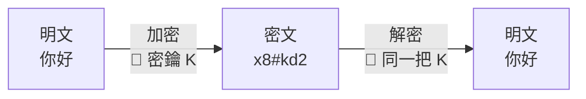
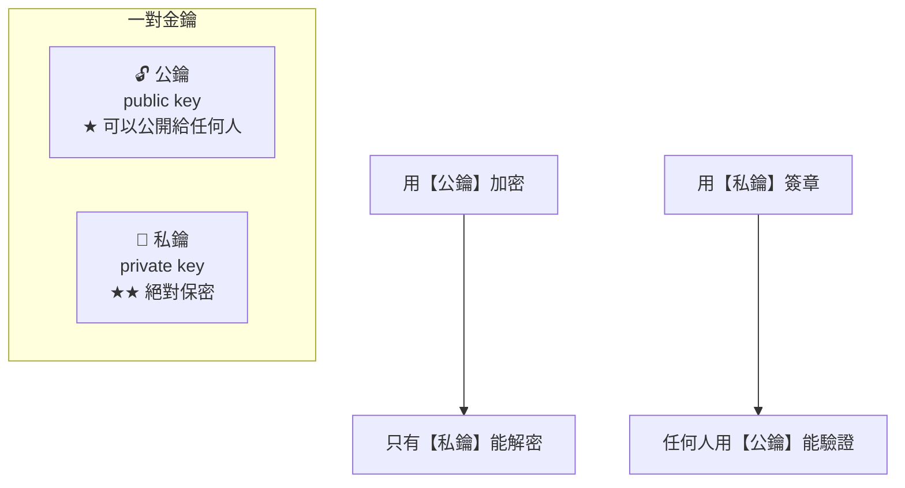
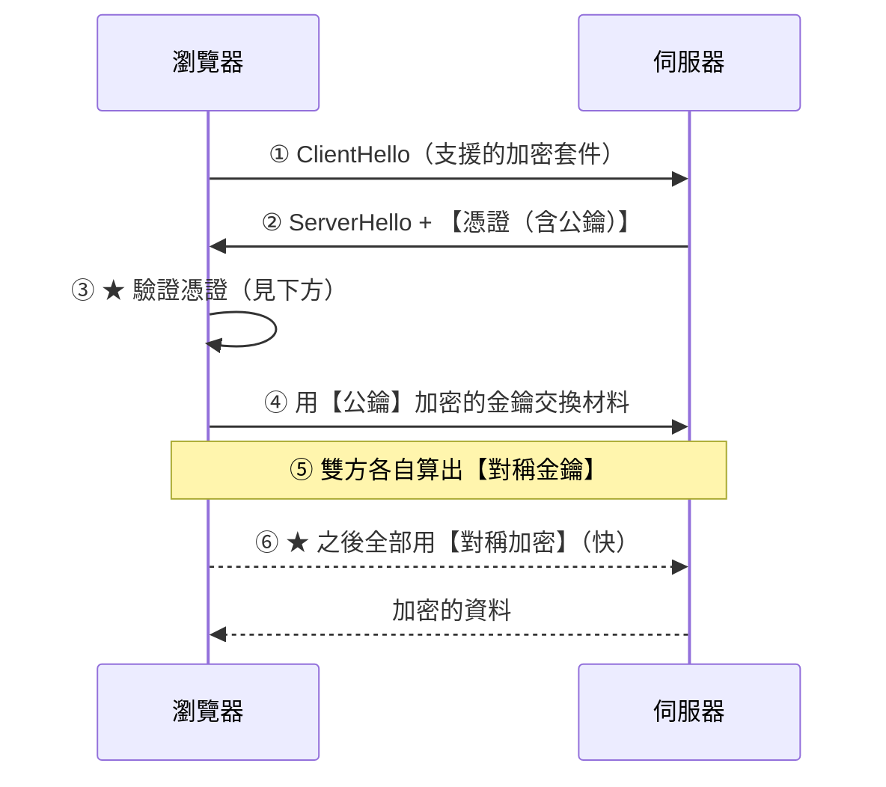
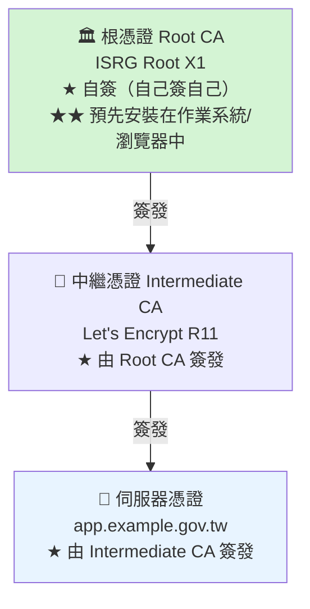
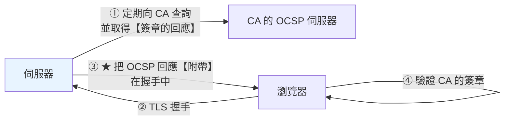

# PKI 與憑證基礎

> [!abstract] 這篇你會學到
> - 用**現實生活的比喻**理解非對稱加密與數位簽章
> - 憑證到底**證明了什麼**（以及沒有證明什麼）
> - **憑證鏈**與信任的傳遞
> - 讀懂 **X.509 憑證的每一個欄位**
> - 分清 **DV / OV / EV** 三種驗證等級
> - 理解**憑證撤銷（CRL / OCSP）**的機制與限制

## 前置知識

- 無（本篇是整個章節的起點）

---

## 從一個問題開始

```
你在瀏覽器輸入 https://bank.example.gov.tw

問題一：怎麼確定連到的【真的是】那個網站，而不是攻擊者假冒的？
問題二：怎麼確保傳輸的內容【不會被偷看】？
問題三：怎麼確保內容【沒有被竄改】？

★ 這三個問題就是 PKI 要解決的
```

---

## 對稱 vs 非對稱加密

### 對稱加密：同一把鑰匙



> [!note] 比喻：保險箱與鑰匙
> ```
> 你把文件放進保險箱鎖起來，用鑰匙 K
> 對方要用【同一把鑰匙 K】才能打開
>
> ★ 問題：【鑰匙怎麼交給對方？】
>   · 網路上傳送 → 會被攔截
>   · 親自交付 → 網際網路上不可能
>
> ★★ 這就是「金鑰交換問題」
> ```

**特性**：快（AES-256 一秒可以加密數 GB），但**無法安全地交換金鑰**。

### 非對稱加密：一對鑰匙



> [!note] 比喻一：郵筒與鑰匙
> ```
> 【公鑰】= 郵筒的投遞口
>   → 放在大街上，任何人都能投信進去
>
> 【私鑰】= 郵筒的鑰匙
>   → 只有你有，只有你能把信取出來
>
> ★ 任何人都能【投信給你】（用公鑰加密）
> ★ 只有你能【讀信】（用私鑰解密）
> ```

> [!note] 比喻二：印章與印鑑證明（★ 數位簽章）
> ```
> 【私鑰】= 你的印章（只有你有）
> 【公鑰】= 印鑑證明（大家都能查）
>
> 你在文件上蓋章（用私鑰簽章）
>   → 任何人拿印鑑證明比對（用公鑰驗證）
>     → 確認【確實是你蓋的】
>     → 而且【文件沒有被改過】（改了印章對不上）
>
> ★ 這是「數位簽章」的原理
> ★★ 注意方向相反：加密用【公鑰】，簽章用【私鑰】
> ```

| | 加密 | 簽章 |
| --- | --- | --- |
| **誰用什麼** | 發送方用**公鑰**加密 | 發送方用**私鑰**簽章 |
| **誰能還原** | 只有**私鑰**持有者能解密 | 任何人用**公鑰**都能驗證 |
| **目的** | **保密性** | **完整性 + 不可否認性** |

**特性**：安全地解決了金鑰交換，但**慢**（比 AES 慢 100-1000 倍）。

### TLS 的做法：兩者混用



```
★ 非對稱加密只用在「交換對稱金鑰」這一步（慢但只做一次）
★ 之後的所有資料傳輸都用對稱加密（快）
★ 這叫「混合式加密系統」
```

---

## 憑證到底是什麼

> [!note] 比喻：身分證
> ```
> 【憑證】= 身分證
>
>   上面寫著：
>     · 姓名（★ 網域名稱）
>     · 照片（★ 公鑰）
>     · 有效期限
>     · 【發證機關的鋼印】（★ CA 的數位簽章）
>
>   ★★ 憑證的價值不在於「上面寫什麼」，
>      而在於【是誰蓋的鋼印】
> ```

```
憑證 = 【公鑰】+【身分資訊】+【CA 的數位簽章】

★ CA（Certificate Authority，憑證機構）的角色：
  「我（CA）證明，這個公鑰確實屬於 bank.example.gov.tw 這個網域」
```

### 憑證證明了什麼、沒有證明什麼

```
✅ 憑證【證明】：
  · 你連到的伺服器確實持有這個網域對應的私鑰
  · 傳輸內容經過加密，中間人看不到、改不了
  · 這張憑證是某個受信任的 CA 簽發的

❌ 憑證【不證明】：
  · ★ 這個網站是「善良的」（釣魚網站也能申請憑證！）
  · 這個網站的程式沒有漏洞
  · 這個網站不會外洩你的資料
  · 網站背後的公司是合法的（★ DV 憑證完全不驗證這個）
```

> [!danger] 「有鎖頭 = 安全」是常見的誤解
> ```
> 攻擊者可以：
>   ① 註冊 bank-example.gov.tw（★ 注意是連字號不是點）
>   ② 用 Let's Encrypt 免費申請憑證（★ 幾分鐘就好）
>   ③ 架設與真銀行一模一樣的釣魚網站
>     → ★ 瀏覽器會顯示【綠色鎖頭】
>       → 使用者以為是安全的
>
> ★★ 鎖頭只代表「連線是加密的」，
>    【不代表對方是可信的】
> ```
> **正確的教育訊息**：
> **要看的是「網址列的完整網域」，不是鎖頭。**

---

## 憑證鏈與信任傳遞



```
驗證流程（瀏覽器做的事）：

  ① 收到伺服器憑證 app.example.gov.tw
    ② 看它的 Issuer 是「Let's Encrypt R11」
      ③ 找到 R11 的憑證（★ 伺服器應該一起送過來）
        ④ 用 R11 的公鑰驗證 app 憑證的簽章 ✓
          ⑤ 看 R11 的 Issuer 是「ISRG Root X1」
            ⑥ 在【作業系統的信任清單】中找到 ISRG Root X1 ✓
              ⑦ 用 ISRG Root X1 的公鑰驗證 R11 的簽章 ✓
                ⑧ ★ 信任鏈完整 → 憑證有效
```

> [!danger] 為什麼要有「中繼憑證」這一層 ★
> ```
> 根憑證的私鑰【極度珍貴】：
>   · 它是所有信任的源頭
>   · 一旦洩漏 → 【全世界的信任體系崩潰】
>   · 而且【無法快速撤換】（因為預裝在數十億台裝置中）
>
> ★ 所以根憑證的私鑰：
>   · 存在【離線的硬體安全模組（HSM）】中
>   · 放在【實體隔離的金庫】裡
>   · 使用時需要多人同時到場（金鑰分持）
>   · ★ 一年可能只拿出來用幾次
>
> ★★ 日常簽發用【中繼 CA】：
>   · 中繼 CA 的私鑰在線上（才能自動簽發）
>   · 若中繼 CA 被入侵 → 【只要撤銷那一張中繼憑證】
>     → 根憑證與整個信任體系不受影響
> ```
>
> **這就是為什麼伺服器必須送出 `fullchain.pem`（含中繼憑證）**
> —— 見下方。

> [!danger] `fullchain` vs `cert` —— 最常見的憑證設定錯誤
> ```
> 伺服器只送出自己的憑證（cert.pem）：
>   → 瀏覽器拿到 app.example.gov.tw 的憑證
>     → Issuer 是「Let's Encrypt R11」
>       → ★ 但它手上沒有 R11 的憑證！
>         → 桌面版 Chrome/Firefox 會【自己去 AIA 網址下載】→ 看起來正常
>         → ★★ 手機 App、curl、Java、舊 Android 【直接失敗】
>
> ✅ 伺服器送出 fullchain.pem（自己的 + 中繼的）
>   → 瀏覽器什麼都不用額外下載
> ```
>
> ```bash
> # ★ 檢查憑證鏈是否完整
> $ echo | openssl s_client -connect example.gov.tw:443 \
>     -servername example.gov.tw -showcerts 2>/dev/null | \
>     grep -c 'BEGIN CERTIFICATE'
> 2                     # ★ 至少 2（自己的 + 中繼的）
>
> # ★ 看完整的鏈
> $ echo | openssl s_client -connect example.gov.tw:443 \
>     -servername example.gov.tw 2>/dev/null | \
>     grep -E '^\s*[0-9] [si]:'
>  0 s:CN=example.gov.tw                              ← 伺服器憑證
>    i:C=US, O=Let's Encrypt, CN=R11                    Issuer
>  1 s:C=US, O=Let's Encrypt, CN=R11                  ← ★ 中繼憑證
>    i:C=US, O=Internet Security Research Group, CN=ISRG Root X1
> ```

### 信任清單在哪

```bash
# ═══ Ubuntu / Debian ═══
$ ls /usr/share/ca-certificates/mozilla/ | head
$ ls /etc/ssl/certs/ | head
$ cat /etc/ssl/certs/ca-certificates.crt | grep -c 'BEGIN CERTIFICATE'
146                            # ★ 系統信任的根憑證數量

# ★ 加入自訂的根憑證
$ sudo cp my-root-ca.crt /usr/local/share/ca-certificates/my-root-ca.crt
$ sudo update-ca-certificates
Updating certificates in /etc/ssl/certs...
1 added, 0 removed; done.
```

> [!info]- Rocky / AlmaLinux（RHEL 系）對照
> ```bash
> $ ls /etc/pki/ca-trust/source/anchors/
> $ trust list | head -20
>
> # 加入自訂的根憑證
> $ sudo cp my-root-ca.crt /etc/pki/ca-trust/source/anchors/
> $ sudo update-ca-trust extract
>
> # 檢視
> $ trust list --filter=ca-anchors | grep -c 'label:'
> ```

```
★ 每個「信任清單」是獨立的：

  作業系統          /etc/ssl/certs（curl、wget、多數程式）
  Firefox           ★ 自己的清單（NSS database）
  Chrome/Edge       用作業系統的（Linux 上是 NSS）
  Java              ★ 自己的 cacerts（$JAVA_HOME/lib/security/cacerts）
  Node.js           ★ 內建一份（可用 NODE_EXTRA_CA_CERTS 擴充）
  Python requests   ★ certifi 套件自己的一份
  Windows           憑證存放區（certlm.msc / certmgr.msc）
  Android/iOS       系統的 + 使用者安裝的

★★ 這就是「內部 CA 派送」為什麼麻煩 —— 要處理每一個
   見 [[090-01-09-guide-PKI-根憑證派送與信任]]
```

---

## X.509 憑證的欄位

```bash
$ openssl x509 -in cert.pem -noout -text
```

```
Certificate:
    Data:
        Version: 3 (0x2)                          ★ X.509 v3
        Serial Number:                            ★ CA 給的唯一序號
            04:1f:2a:8b:...
        Signature Algorithm: sha256WithRSAEncryption    ★ 簽章演算法

        Issuer: C=US, O=Let's Encrypt, CN=R11     ★★ 誰簽發的

        Validity
            Not Before: Aug 28 00:00:00 2026 GMT  ★ 生效時間
            Not After : Nov 26 23:59:59 2026 GMT  ★★ 到期時間

        Subject: CN=app.example.gov.tw            ★★ 憑證的主體

        Subject Public Key Info:                  ★★ 公鑰
            Public Key Algorithm: rsaEncryption
                Public-Key: (2048 bit)
                Modulus: 00:c4:2f:...
                Exponent: 65537 (0x10001)

        X509v3 extensions:
            X509v3 Key Usage: critical
                Digital Signature, Key Encipherment       ★ 這把金鑰能做什麼

            X509v3 Extended Key Usage:
                TLS Web Server Authentication,            ★★ 用途
                TLS Web Client Authentication

            X509v3 Basic Constraints: critical
                CA:FALSE                          ★★ 【不是】CA，不能簽發其他憑證

            X509v3 Subject Key Identifier:
                8A:4F:2C:...

            X509v3 Authority Key Identifier:
                keyid:5A:F3:...                   ★ 對應到簽發者的 SKI

            X509v3 Subject Alternative Name:      ★★★ 【瀏覽器實際比對的是這個】
                DNS:app.example.gov.tw, DNS:www.app.example.gov.tw

            Authority Information Access:
                OCSP - URI:http://r11.o.lencr.org        ★ OCSP 查詢網址
                CA Issuers - URI:http://r11.i.lencr.org/ ★ 中繼憑證下載網址

            X509v3 CRL Distribution Points:
                URI:http://r11.c.lencr.org/12.crl        ★ CRL 網址

            CT Precertificate SCTs:               ★ Certificate Transparency
                Signed Certificate Timestamp: ...

    Signature Algorithm: sha256WithRSAEncryption
    Signature Value:                              ★★ CA 用私鑰產生的簽章
        3a:5f:2e:...
```

### 最重要的六個欄位

| 欄位 | 意義 | 為什麼重要 |
| --- | --- | --- |
| **`Subject Alternative Name`（SAN）** | **憑證涵蓋的網域清單** | **★★★ 現代瀏覽器只看這個，不看 CN** |
| `Subject` 的 `CN` | 主體名稱 | **已被 SAN 取代**（見 [[090-01-04-guide-PKI-CN與SAN設定與瀏覽器相容性]]） |
| **`Validity`** | 生效與到期時間 | **★ 過期 = 瀏覽器直接拒絕** |
| **`Issuer`** | 誰簽發的 | **★ 用來建立憑證鏈** |
| **`Basic Constraints`** | **`CA:TRUE/FALSE`** | **★★ 決定能不能簽發其他憑證** |
| **`Key Usage` / `Extended Key Usage`** | 這把金鑰的用途 | **★ 用途不符會被拒絕** |

> [!danger] `Basic Constraints: CA:FALSE` 是關鍵的安全機制
> ```
> 若一張伺服器憑證的 CA:TRUE：
>   → 它就可以【簽發其他憑證】
>     → 任何人拿到這張憑證的私鑰
>       → 就能簽發【任何網域】的憑證
>         → ★★★ 整個信任體系被攻破
>
> ★ 這正是 2011 年 DigiNotar 事件與 2009 年
>   Moxie Marlinspike 展示的「null prefix」攻擊的核心
> ```
>
> **所以**：
> ```
> 根 CA 憑證      : CA:TRUE, pathlen 不限
> 中繼 CA 憑證    : CA:TRUE, pathlen:0（★ 不能再簽發下一層 CA）
> 伺服器憑證      : CA:FALSE ★★
> ```
> ```bash
> # ★ 檢查
> $ openssl x509 -in cert.pem -noout -text | grep -A1 'Basic Constraints'
>             X509v3 Basic Constraints: critical
>                 CA:FALSE
> ```

---

## 三種驗證等級

| | **DV** | **OV** | **EV** |
| --- | --- | --- | --- |
| **全名** | Domain Validation | Organization Validation | Extended Validation |
| **驗證什麼** | **只驗證你控制這個網域** | + **驗證組織確實存在** | + **嚴格的法律實體驗證** |
| **驗證方式** | 自動（DNS/HTTP/Email） | **人工審核公司登記文件** | **最嚴格的人工審核** |
| **簽發時間** | **幾分鐘** | 1-5 天 | 1-3 週 |
| **費用** | **免費**（Let's Encrypt） | 中 | 高 |
| **Subject 欄位** | 只有 CN | **含 O（組織名）** | **含 O、L、S、C、序號** |
| **瀏覽器顯示** | 鎖頭 | 鎖頭 | **★ 已不再有特殊顯示** |
| **加密強度** | **完全相同** | 相同 | 相同 |

> [!warning] EV 憑證的「綠色網址列」已經消失
> ```
> 2019 年之前：EV 憑證會顯示【綠色的公司名稱】
> 2019 年之後：Chrome、Firefox、Safari【全部移除】了這個顯示
>
> 原因：
>   · ★ 研究顯示使用者【根本不看】
>   · 可以透過註冊同名公司來欺騙
>   · 增加了 UI 複雜度但沒有安全效益
>
> ★★ 所以 EV 憑證現在的價值主要是：
>   · 法規要求（某些產業）
>   · 保險與責任條款
>   · 【不是】更好的技術安全性
> ```

> [!tip] 機關該選哪種
> ```
> ① 一般的資訊網站、內部系統 → ★ DV（Let's Encrypt 免費且自動化）
> ② 涉及個資、金流的對外服務 → OV（讓使用者能查到組織資訊）
> ③ 法規明確要求            → 依規定
> ④ 內部系統                → ★ 自建 CA（見 06-08 篇）
>
> ★★ 三者的【加密強度完全相同】
>    差別只在「驗證的嚴謹度」與「憑證中記載的資訊」
> ```

---

## 憑證撤銷

```
情境：憑證還沒到期，但私鑰洩漏了 → 必須讓它【立刻失效】
```

### CRL（Certificate Revocation List）

```
CA 定期發布一份【被撤銷的憑證序號清單】

  瀏覽器 → 下載 CRL → 檢查這張憑證的序號在不在裡面

★ 問題：
  · CRL 可能很大（數 MB）
  · 更新有延遲（通常幾小時到幾天）
  · ★ 大部分瀏覽器【已經不再檢查 CRL】
```

```bash
$ openssl crl -in crl.pem -noout -text | head -20
$ openssl crl -in crl.pem -noout -text | grep -c 'Serial Number'
```

### OCSP（Online Certificate Status Protocol）

```
瀏覽器 → 即時查詢 CA：「這張憑證（序號 XXX）還有效嗎？」
CA → 回答：good / revoked / unknown

★ 問題一：【隱私】—— CA 知道你在瀏覽哪個網站
★ 問題二：【效能】—— 多一次網路往返
★ 問題三：★★ 【軟失敗（soft-fail）】
   → OCSP 伺服器連不上時，瀏覽器【當作有效】繼續連線
     → 攻擊者只要【封鎖 OCSP 查詢】就能繞過撤銷檢查
       → 撤銷機制形同虛設
```

### OCSP Stapling（★ 目前的最佳解）



```
★ 好處：
  ① 瀏覽器【不需要】自己去問 CA → 隱私、效能都改善
  ② 少一次網路往返 → 首次連線更快
  ③ OCSP 回應有 CA 的簽章 → 伺服器無法偽造

★ 設定（見 06-Nginx-HTTPS與Certbot）：
  ssl_stapling on;
  ssl_stapling_verify on;
  ssl_trusted_certificate /path/chain.pem;
  resolver 1.1.1.1 8.8.8.8 valid=300s;
```

```bash
# ★ 驗證 OCSP Stapling
$ echo | openssl s_client -connect example.gov.tw:443 \
    -servername example.gov.tw -status 2>/dev/null | \
    grep -A5 'OCSP Response Status'
OCSP Response Status: successful (0x0)
    Cert Status: good                    # ★ good / revoked / unknown
    This Update: Aug 28 00:00:00 2026 GMT
    Next Update: Sep  4 00:00:00 2026 GMT
```

> [!tip] 現代的解法：短效期憑證
> ```
> 撤銷機制的根本問題無法完美解決
>   → ★ 業界的方向是【縮短憑證有效期】
>
>   2015 年：3 年
>   2018 年：2 年
>   2020 年：1 年（398 天）
>   2026 年起逐步縮短到：200 天 → 100 天 → 47 天
>   Let's Encrypt：★ 90 天（甚至有 6 天的短效憑證）
>
> ★★ 邏輯：與其依賴撤銷，不如讓憑證【很快自動過期】
>    → 這也是為什麼【自動化續期】變成必要能力
> ```
>
> **對維運的意義**：
> **手動更新憑證的時代已經結束** ——
> 必須建立自動化的申請、部署、續期、監控流程。
> 見 [[090-01-12-guide-PKI-憑證生命週期管理]]。

---

## Certificate Transparency（CT）

```
問題：怎麼知道有沒有 CA 誤發（或被入侵而簽發）你的網域的憑證？

★ CT 的解法：
  所有公開簽發的憑證都必須記錄在【公開、僅可附加、可稽核】的日誌中
    → 任何人都能查詢「某個網域被簽發過哪些憑證」
      → 網域擁有者能發現異常
```

```bash
# ★ 查詢某個網域被簽發過的所有憑證
$ curl -s "https://crt.sh/?q=example.gov.tw&output=json" | \
    jq -r '.[] | "\(.not_before[0:10])  \(.issuer_name | split("O=")[1] | split(",")[0])  \(.common_name)"' | \
    sort -u | tail -20

2026-05-15  Let's Encrypt  example.gov.tw
2026-08-13  Let's Encrypt  example.gov.tw
2026-08-20  DigiCert Inc   example.gov.tw      # ★★ 這張是誰申請的？！
```

> [!danger] 在 CT 日誌中發現不認識的憑證怎麼辦
> ```
> 可能的原因：
>   ① 同事／其他單位申請的（★ 先問清楚）
>   ② CDN / 雲端服務代為申請（Cloudflare、AWS）
>   ③ ★★ 【有人取得了你的網域控制權，或 CA 誤發】
>
> 處理：
>   ① 確認是否為內部申請
>   ② 若不是 → 【立刻聯絡該 CA 要求撤銷】
>   ③ 檢查 DNS 設定是否被竄改
>   ④ 檢查網域註冊商帳號是否被入侵
>   ⑤ 加上 CAA 記錄防止再發生
> ```

### CAA 記錄：限制誰能簽發

```
example.gov.tw.  IN  CAA  0 issue "letsencrypt.org"
example.gov.tw.  IN  CAA  0 issuewild ";"                    # ★ 禁止萬用憑證
example.gov.tw.  IN  CAA  0 iodef "mailto:security@example.gov.tw"
```

```bash
# ★ 檢查
$ dig +short CAA example.gov.tw
0 issue "letsencrypt.org"
0 iodef "mailto:security@example.gov.tw"

# ★ 沒有 CAA 記錄 = 任何 CA 都可以簽發
$ dig +short CAA google.com
0 issue "pki.goog"
0 issuewild "pki.goog"
```

> [!tip] CAA + CT 監控是低成本高效益的防護
> ```
> ① CAA 記錄  → 限制只有指定的 CA 能簽發（★ CA 有義務檢查）
> ② CT 監控   → 有人繞過時你會知道
>
> 免費的 CT 監控服務：
>   · https://crt.sh（可訂閱 RSS）
>   · Facebook 的 Certificate Transparency Monitoring
>   · Cert Spotter
> ```

---

## 完整實戰範例

### 憑證檢視工具箱

```bash
#!/usr/bin/env bash
# /usr/local/bin/cert-info —— 憑證資訊檢視
usage() {
    cat <<'EOF'
用法：
  cert-info file <憑證檔>              檢視本機憑證檔
  cert-info host <網域> [埠]           檢視線上憑證
  cert-info chain <網域>               檢視完整憑證鏈
  cert-info ct <網域>                  查詢 CT 日誌
  cert-info caa <網域>                 檢查 CAA 記錄
EOF
}

case "${1:-}" in
  file)
    F="${2:?請提供憑證檔}"
    echo "═══ 憑證資訊：$F ═══"
    openssl x509 -in "$F" -noout -subject -issuer -dates -serial | sed 's/^/  /'
    echo -e "\n  ── SAN（★ 瀏覽器實際比對的）──"
    openssl x509 -in "$F" -noout -ext subjectAltName 2>/dev/null | tail -n +2 | sed 's/^/    /'
    echo -e "\n  ── 公鑰 ──"
    openssl x509 -in "$F" -noout -text | grep -A2 'Public Key Algorithm' | sed 's/^/    /'
    echo -e "\n  ── Basic Constraints（★ CA:TRUE/FALSE）──"
    openssl x509 -in "$F" -noout -ext basicConstraints 2>/dev/null | tail -n +2 | sed 's/^/    /'
    echo -e "\n  ── Key Usage ──"
    openssl x509 -in "$F" -noout -ext keyUsage,extendedKeyUsage 2>/dev/null | \
      grep -v '^X509v3' | sed 's/^/    /'
    echo -e "\n  ── 指紋 ──"
    openssl x509 -in "$F" -noout -fingerprint -sha256 | sed 's/^/    /'
    echo -e "\n  ── 剩餘天數 ──"
    END=$(openssl x509 -in "$F" -noout -enddate | cut -d= -f2)
    D=$(( ($(date -d "$END" +%s) - $(date +%s)) / 86400 ))
    printf '    %d 天 %s\n' "$D" "$([ "$D" -lt 30 ] && echo '⚠' || echo '✓')"
    ;;

  host)
    H="${2:?請提供網域}"; P="${3:-443}"
    echo "═══ 線上憑證：$H:$P ═══"
    echo | timeout 10 openssl s_client -connect "$H:$P" -servername "$H" 2>/dev/null | \
      openssl x509 -noout -subject -issuer -dates -serial | sed 's/^/  /'
    echo -e "\n  ── SAN ──"
    echo | timeout 10 openssl s_client -connect "$H:$P" -servername "$H" 2>/dev/null | \
      openssl x509 -noout -ext subjectAltName 2>/dev/null | tail -n +2 | sed 's/^/    /'
    echo -e "\n  ── TLS 版本與加密套件 ──"
    echo | timeout 10 openssl s_client -connect "$H:$P" -servername "$H" 2>/dev/null | \
      grep -E 'Protocol|Cipher' | sed 's/^/    /'
    echo -e "\n  ── OCSP Stapling ──"
    echo | timeout 10 openssl s_client -connect "$H:$P" -servername "$H" -status 2>/dev/null | \
      grep -E 'OCSP Response Status|Cert Status' | sed 's/^/    /' || echo "    ⚠ 未啟用"
    ;;

  chain)
    H="${2:?請提供網域}"
    echo "═══ 憑證鏈：$H ═══"
    N=$(echo | timeout 10 openssl s_client -connect "$H:443" -servername "$H" \
        -showcerts 2>/dev/null | grep -c 'BEGIN CERTIFICATE')
    echo "  憑證數量：$N $([ "$N" -ge 2 ] && echo '✓' || echo '✗✗ 【缺中繼憑證，應用 fullchain.pem】')"
    echo -e "\n  ── 鏈的結構 ──"
    echo | timeout 10 openssl s_client -connect "$H:443" -servername "$H" 2>/dev/null | \
      grep -E '^\s*[0-9] [si]:' | sed 's/^/    /'
    echo -e "\n  ── 驗證結果 ──"
    echo | timeout 10 openssl s_client -connect "$H:443" -servername "$H" 2>/dev/null | \
      grep -E 'Verify return code|Verification' | sed 's/^/    /'
    ;;

  ct)
    H="${2:?請提供網域}"
    echo "═══ Certificate Transparency：$H ═══"
    echo "  （查詢 crt.sh，可能需要一點時間）"
    curl -s --max-time 30 "https://crt.sh/?q=${H}&output=json" | \
      jq -r '.[] | "\(.not_before[0:10])  \(.issuer_name | capture("O=(?<o>[^,]+)").o // "?")  \(.common_name)"' \
      2>/dev/null | sort -u | tail -25 | sed 's/^/  /' || echo "  （查詢失敗）"
    echo
    echo "  ★ 檢查有沒有你不認識的簽發者或網域"
    ;;

  caa)
    H="${2:?請提供網域}"
    echo "═══ CAA 記錄：$H ═══"
    R=$(dig +short CAA "$H")
    if [ -n "$R" ]; then
        echo "$R" | sed 's/^/  /'
        echo "  ✓ 已設定（只有列出的 CA 能簽發）"
    else
        echo "  ⚠ 沒有 CAA 記錄【任何 CA 都可以為這個網域簽發憑證】"
        echo
        echo "  建議加入："
        echo "    $H.  IN  CAA  0 issue \"letsencrypt.org\""
        echo "    $H.  IN  CAA  0 iodef \"mailto:security@$H\""
    fi
    ;;

  *) usage; exit 1 ;;
esac
```

```bash
$ cert-info host example.gov.tw
$ cert-info chain example.gov.tw
$ cert-info file /etc/letsencrypt/live/example.gov.tw/fullchain.pem
$ cert-info ct example.gov.tw
$ cert-info caa example.gov.tw
```

---

## 常見錯誤與排錯

| 現象／問題 | 原因 | 解法 |
| --- | --- | --- |
| **手機 App 說憑證無效，電腦正常** ★★ | **缺中繼憑證（用了 `cert.pem`）** | 用 `fullchain.pem` |
| `unable to get local issuer certificate` | 憑證鏈不完整 / 根憑證不在信任清單 | 同上；或安裝根憑證 |
| **`self signed certificate in certificate chain`** | 自簽憑證未被信任 | 派送根憑證（見 [[090-01-09-guide-PKI-根憑證派送與信任]]） |
| `certificate has expired` | 過期 | 續期；**檢查自動續期是否正常** |
| **`Hostname mismatch`** | **SAN 不含該網域** | 重新申請時加上（見 [[090-01-04-guide-PKI-CN與SAN設定與瀏覽器相容性]]） |
| **Java 說憑證無效但瀏覽器正常** ★ | **Java 有自己的信任清單** | 匯入 `cacerts` |
| **Node.js 說憑證無效** | Node 內建自己的清單 | `NODE_EXTRA_CA_CERTS=/path/ca.crt` |
| Python requests 憑證錯誤 | certifi 的清單 | `REQUESTS_CA_BUNDLE=/path/ca.crt` |
| **釣魚網站也有綠色鎖頭** | **憑證不證明善意** | 教育使用者「看網址不看鎖頭」 |
| CT 日誌中有不認識的憑證 | 誤發或被入侵 | 聯絡 CA 撤銷；設定 CAA |
| **OCSP 檢查被繞過** | soft-fail 機制 | 啟用 **OCSP Stapling**；縮短憑證效期 |
| 憑證的 `CA:TRUE` | 設定錯誤 | 伺服器憑證必須 `CA:FALSE` |

---

## 安全性注意事項

> [!danger] 私鑰是一切的根本
> ```
> 私鑰洩漏 = 攻擊者可以：
>   · 完全冒充你的網站（有合法憑證）
>   · 解密【過去錄下的】流量（★ 除非有前向保密）
>   · 簽發偽造的內容
>
> ★★ 而且【無法遠端補救】—— 只能撤銷憑證並重新簽發
> ```
>
> **保護私鑰的五個要求**：
> ```bash
> ① 權限 chmod 600、chown root:root
> ② 【絕不】進 git（即使是私有 repo）
> ③ 【絕不】放在 web root 內
> ④ 【絕不】用 email/Slack 傳送
> ⑤ 備份時要加密（且與憑證分開保存）
> ```
> ```bash
> # ★ 檢查
> $ sudo find /var/www -name '*.key' -o -name 'privkey*' 2>/dev/null
> $ git log --all --diff-filter=A --name-only | grep -iE '\.(key|pem)$'
> $ curl -sI https://網站/privkey.pem | head -1        # 必須 404
> ```

> [!warning] 前向保密（Forward Secrecy）的重要性
> ```
> 沒有前向保密：
>   攻擊者【錄下】加密的流量（存起來）
>     → 幾年後取得私鑰
>       → ★★ 可以解密【所有錄下的歷史流量】
>
> 有前向保密（ECDHE 金鑰交換）：
>   每次連線用【臨時的】金鑰交換
>     → 即使私鑰洩漏
>       → ★ 也無法解密過去的流量
> ```
> ```nginx
> # ★ 只用 ECDHE 開頭的 cipher suite
> ssl_ciphers 'ECDHE-ECDSA-AES128-GCM-SHA256:ECDHE-RSA-AES128-GCM-SHA256:...';
> ssl_session_tickets off;      # ★ ticket 金鑰不輪替會破壞前向保密
> ```
> **TLS 1.3 強制要求前向保密**（所有的 cipher suite 都有）。

> [!tip] 金鑰長度與演算法的選擇
> ```
> RSA：
>   1024 bit  ★★ 已被破解，絕對不能用
>   2048 bit  ★ 目前的最低要求（到 2030 年左右）
>   4096 bit  更安全但慢 2-4 倍（★ 對 TLS 握手有感）
>
> ECDSA（橢圓曲線）：
>   P-256（secp256r1）★ 相當於 RSA 3072，但快很多、憑證小很多
>   P-384（secp384r1）相當於 RSA 7680
>
> ★★ 建議：
>   · 一般用途 → ECDSA P-256（或 RSA 2048）
>   · 需要相容極舊裝置 → 同時提供 ECDSA + RSA 雙憑證
>   · 根 CA → RSA 4096 或 ECDSA P-384（它要用很久）
> ```

---

## 速查表

### 核心概念

```
對稱加密   同一把鑰匙 · 快 · ★ 無法安全交換金鑰
非對稱加密 一對鑰匙 · 慢 · ★ 解決金鑰交換

加密：公鑰加密 → 私鑰解密        （保密性）
簽章：私鑰簽章 → 公鑰驗證        （完整性 + 不可否認）

TLS = 非對稱（交換對稱金鑰）+ 對稱（傳輸資料）
```

### 憑證 = 公鑰 + 身分 + CA 簽章

```
✅ 證明：對方持有該網域的私鑰 · 傳輸加密 · 未被竄改
❌ 不證明：網站是善良的（★ 釣魚網站也有綠色鎖頭）
```

### 憑證鏈

```
Root CA（自簽，預裝在系統中，私鑰離線保管）
  └─ Intermediate CA（線上簽發，被入侵時只撤銷這張）
       └─ 伺服器憑證

★★ 伺服器必須送出 fullchain.pem（自己的 + 中繼的）
   只送 cert.pem → 桌面瀏覽器正常，手機/curl/Java 失敗
```

```bash
echo | openssl s_client -connect D:443 -servername D -showcerts 2>/dev/null | \
  grep -c 'BEGIN CERTIFICATE'          # ★ 至少 2
```

### X.509 六個重要欄位

| 欄位 | 說明 |
| --- | --- |
| **`Subject Alternative Name`** | **★★★ 瀏覽器實際比對的網域清單** |
| `Validity` | 生效／到期（過期 = 直接拒絕） |
| `Issuer` | 誰簽發的（建立憑證鏈） |
| **`Basic Constraints`** | **★★ `CA:TRUE/FALSE`（能否簽發其他憑證）** |
| `Key Usage` / `Extended Key Usage` | 金鑰的用途 |
| `Serial Number` | CA 給的唯一序號（撤銷時用） |

```bash
openssl x509 -in cert.pem -noout -text
openssl x509 -in cert.pem -noout -subject -issuer -dates -ext subjectAltName
openssl x509 -in cert.pem -noout -ext basicConstraints
openssl x509 -in cert.pem -noout -fingerprint -sha256
```

### DV / OV / EV

```
DV  只驗證網域控制權 · 幾分鐘 · 免費 · ★ 一般用途
OV  + 驗證組織存在   · 1-5 天 · 中價 · 涉及個資/金流
EV  + 嚴格法律驗證   · 1-3 週 · 高價 · 法規要求

★★ 三者的【加密強度完全相同】
★ EV 的綠色網址列已於 2019 年被所有瀏覽器移除
```

### 撤銷機制

```
CRL           下載撤銷清單 · 大、有延遲 · ★ 瀏覽器多已不檢查
OCSP          即時查詢 · ★★ soft-fail（連不上就當有效 → 可被繞過）
OCSP Stapling ★ 伺服器代查並附帶 · 隱私與效能都好 → 目前最佳解

★★ 業界方向：縮短憑證效期（90 天 → 47 天）取代依賴撤銷
   → 【自動化續期成為必要能力】
```

```nginx
ssl_stapling on;  ssl_stapling_verify on;
ssl_trusted_certificate /path/chain.pem;
resolver 1.1.1.1 8.8.8.8 valid=300s;
```

### CT + CAA（★ 低成本高效益）

```bash
# CT：查詢誰為你的網域簽發過憑證
curl -s "https://crt.sh/?q=D&output=json" | jq -r '.[] | "\(.not_before[0:10]) \(.common_name)"' | sort -u

# CAA：限制只有指定的 CA 能簽發
dig +short CAA example.gov.tw
```
```
example.gov.tw.  IN  CAA  0 issue "letsencrypt.org"
example.gov.tw.  IN  CAA  0 issuewild ";"                 # 禁止萬用憑證
example.gov.tw.  IN  CAA  0 iodef "mailto:security@..."
```

### 信任清單（★ 每個都是獨立的）

```
作業系統       /etc/ssl/certs（Debian）· /etc/pki/ca-trust（RHEL）
Firefox        ★ 自己的 NSS database
Java           ★ $JAVA_HOME/lib/security/cacerts
Node.js        ★ NODE_EXTRA_CA_CERTS
Python         ★ certifi / REQUESTS_CA_BUNDLE
Windows        certlm.msc
```

```bash
# Debian
sudo cp ca.crt /usr/local/share/ca-certificates/ && sudo update-ca-certificates
# RHEL
sudo cp ca.crt /etc/pki/ca-trust/source/anchors/ && sudo update-ca-trust extract
```

### 私鑰保護五要求

```
① chmod 600 · chown root:root
② 絕不進 git
③ 絕不放 web root
④ 絕不用 email/Slack 傳
⑤ 備份要加密且與憑證分開
```

### 演算法建議

```
RSA 2048   ★ 最低要求      RSA 4096  更安全但慢
ECDSA P-256 ★ 建議（= RSA 3072 但快很多、憑證小）
ECDSA P-384  根 CA 用

★ 前向保密：只用 ECDHE 的 cipher suite；ssl_session_tickets off
  → 私鑰洩漏也無法解密過去的流量
```

---

## 練習題

> [!question]- 練習 1：解剖一張真實的憑證
> 1. 取得任一網站的憑證：
>    ```bash
>    echo | openssl s_client -connect example.gov.tw:443 \
>      -servername example.gov.tw 2>/dev/null | \
>      openssl x509 > /tmp/cert.pem
>    ```
> 2. `openssl x509 -in /tmp/cert.pem -noout -text`
> 3. **找出並解釋**：Subject、Issuer、Validity、SAN、Basic Constraints、Key Usage
> 4. **這張憑證涵蓋哪些網域？**（看 SAN）
> 5. **它能簽發其他憑證嗎？**（看 Basic Constraints）
> 6. 用哪種演算法與金鑰長度？

> [!question]- 練習 2：追蹤憑證鏈
> 1. `openssl s_client -connect 網域:443 -showcerts` 取得完整的鏈
> 2. **畫出鏈的結構**（誰簽發誰）
> 3. 在 `/etc/ssl/certs/` 中**找到根憑證**
> 4. 手動驗證：
>    ```bash
>    openssl verify -CAfile root.pem -untrusted intermediate.pem server.pem
>    ```
> 5. **故意只用 `cert.pem`（不含中繼）測試**：
>    ```bash
>    curl --cacert root.pem https://網域/     # 成功嗎？
>    ```
> 6. **這說明了什麼？**

> [!question]- 練習 3：CT 日誌調查
> 1. 用 `crt.sh` 查詢你的機關網域
> 2. **列出所有簽發過的憑證與簽發者**
> 3. **有你不認識的嗎？**（子網域、簽發者）
> 4. 檢查 CAA 記錄：`dig +short CAA 你的網域`
> 5. **若沒有，設計一份 CAA 記錄**
> 6. 訂閱 crt.sh 的 RSS 或設定 CT 監控

> [!question]- 練習 4：釣魚網站的憑證
> **★ 觀念驗證，不要真的架設釣魚網站**
> 1. 註冊一個測試網域（或用子網域）
> 2. 用 Let's Encrypt 申請憑證 → **花了多久？**
> 3. 用瀏覽器開啟 → **有綠色鎖頭嗎？**
> 4. **這說明「鎖頭 = 安全」是什麼樣的誤解？**
> 5. 寫一段給同仁的教育訊息：「要看什麼才對」

> [!question]- 練習 5：前向保密驗證
> 1. 用 `openssl s_client` 檢查某網站的 cipher suite
> 2. **是 ECDHE 開頭嗎？**
> 3. 用 SSL Labs 檢測，看 "Forward Secrecy" 的評分
> 4. **想想這個情境**：
>    - 攻擊者今天錄下你的加密流量
>    - 三年後取得了你的私鑰
>    - **有／沒有前向保密時，結果各是什麼？**
> 5. 檢查 `ssl_session_tickets` 是否關閉

---

## 小測驗

Q1. **對稱加密與非對稱加密各解決什麼問題？TLS 怎麼結合兩者**？

Q2. **加密與簽章分別用公鑰還是私鑰？各達成什麼目的**？

Q3. **憑證證明了什麼？「不」證明什麼**？

Q4. **為什麼需要「中繼 CA」這一層**？

Q5. **`fullchain.pem` 與 `cert.pem` 的差別？用錯的症狀為什麼是「電腦正常、手機失敗」**？

Q6. **`Subject Alternative Name` 與 `CN` 哪個才是瀏覽器實際比對的**？

Q7. **`Basic Constraints: CA:FALSE` 為什麼是關鍵的安全機制**？

Q8. **DV / OV / EV 的差別是什麼？加密強度有差嗎？EV 的綠色網址列呢**？

Q9. **OCSP 的「soft-fail」問題是什麼？OCSP Stapling 怎麼改善**？

Q10. **CT 與 CAA 分別做什麼？為什麼說是「低成本高效益」的防護**？

> [!question]- 測驗答案
> **Q1.** **對稱加密**（AES）**快**（一秒可加密數 GB），
> 但**無法安全地交換金鑰**（金鑰在網路上傳送會被攔截）。
> **非對稱加密**（RSA / ECDSA）**解決了金鑰交換問題**
> （公鑰可以公開，私鑰保密），但**慢 100-1000 倍**。
> **TLS 的做法是「混合式加密」**：
> **用非對稱加密安全地交換一把對稱金鑰**（只做一次，慢但可接受），
> **之後所有的資料傳輸都用對稱加密**（快）。
>
> **Q2.** **加密**：發送方用**公鑰**加密，**只有私鑰持有者能解密** ——
> 目的是**保密性**（比喻：郵筒的投遞口人人可用，但只有你有鑰匙能取信）。
> **簽章**：發送方用**私鑰**簽章，**任何人用公鑰都能驗證** ——
> 目的是**完整性**（內容沒被改過）與**不可否認性**（確實是你發的）
> （比喻：印章只有你有，但印鑑證明大家都能查）。
> **★ 兩者的方向是相反的**，這是最容易混淆的地方。
>
> **Q3.** **證明**：①你連到的伺服器**確實持有這個網域對應的私鑰**；
> ②傳輸內容**經過加密**，中間人看不到也改不了；
> ③這張憑證是**某個受信任的 CA 簽發的**。
> **不證明**：①**這個網站是「善良的」** ——
> **釣魚網站也能用 Let's Encrypt 幾分鐘申請到憑證並顯示綠色鎖頭**；
> ②網站的程式沒有漏洞；③網站不會外洩你的資料；
> ④背後的公司是合法的（DV 憑證完全不驗證這個）。
> **「有鎖頭 = 安全」是最常見的誤解** ——
> 正確的教育訊息是**「看網址列的完整網域，不是看鎖頭」**。
>
> **Q4.** 因為**根憑證的私鑰極度珍貴** ——
> 它是所有信任的源頭，**一旦洩漏整個信任體系崩潰**，
> 而且**無法快速撤換**（預裝在數十億台裝置中）。
> 所以根憑證的私鑰**存在離線的 HSM 中、放在實體金庫、使用需多人到場**，
> **一年可能只用幾次**。
> **日常簽發交給中繼 CA**（私鑰在線上才能自動簽發）——
> **若中繼 CA 被入侵，只要撤銷那一張中繼憑證，根憑證與整個體系不受影響**。
> 這是「把風險隔離在可撤換的那一層」的設計。
>
> **Q5.** **`cert.pem` 只有伺服器自己的憑證**；
> **`fullchain.pem` = 伺服器憑證 + 中繼憑證**。
> **用錯的症狀**：瀏覽器收到伺服器憑證後，
> 看到 Issuer 是「Let's Encrypt R11」，但**手上沒有 R11 的憑證**：
> **桌面版 Chrome / Firefox 會自己去憑證中的 AIA 網址下載中繼憑證**
> （所以看起來正常）；
> 而**手機 App、`curl`、Java、舊版 Android 不會做這件事，直接驗證失敗**。
> 這就是最典型的「我電腦上明明可以」的憑證問題。
> 驗證：`openssl s_client ... -showcerts | grep -c 'BEGIN CERTIFICATE'` **至少要 2**。
>
> **Q6.** **`Subject Alternative Name`（SAN）** ——
> **現代瀏覽器（Chrome 58+、Firefox 48+）完全忽略 `CN`，只比對 SAN**。
> `CN`（Common Name）是舊時代的做法，
> 因為它是一個自由格式的欄位、無法表達多個網域、且語意不明確，
> 已經被 SAN 取代（RFC 2818 早就建議，瀏覽器在 2017 年前後全面執行）。
> **所以憑證中即使 CN 正確，若 SAN 不含該網域，
> 瀏覽器仍會報 `NET::ERR_CERT_COMMON_NAME_INVALID`**。
> 產生 CSR 時**一定要在 SAN 中列出所有網域**（見 [[090-01-04-guide-PKI-CN與SAN設定與瀏覽器相容性]]）。
>
> **Q7.** 因為 **`CA:TRUE` 代表「這張憑證可以簽發其他憑證」**。
> 若一張普通的伺服器憑證被錯誤地設成 `CA:TRUE`：
> **任何人取得這張憑證的私鑰，就能簽發「任何網域」的憑證** ——
> 而這些憑證會被所有信任該憑證鏈的裝置接受，
> **等於整個信任體系被攻破**。
> 正確的設定是：
> ```
> 根 CA 憑證   : CA:TRUE（pathlen 不限）
> 中繼 CA 憑證 : CA:TRUE, pathlen:0（★ 不能再簽發下一層 CA）
> 伺服器憑證   : CA:FALSE ★★
> ```
> 這也是歷史上多起憑證安全事件的核心（如 2009 年展示的相關攻擊）。
>
> **Q8.** **DV（Domain Validation）**：只驗證你**控制這個網域**
> （DNS / HTTP / Email 自動驗證），幾分鐘、免費。
> **OV（Organization Validation）**：**額外人工審核組織確實存在**
> （公司登記文件），1-5 天，憑證的 Subject 中含組織名（O）。
> **EV（Extended Validation）**：**最嚴格的法律實體驗證**，1-3 週，高價。
> **★★ 三者的加密強度完全相同** —— 差別只在「驗證的嚴謹度」與「憑證中記載的資訊」。
> **EV 的綠色網址列已於 2019 年被 Chrome、Firefox、Safari 全部移除** ——
> 因為研究顯示使用者根本不看、且可透過註冊同名公司欺騙。
> 所以 EV 現在的價值主要是**法規要求與保險條款**，不是技術上更安全。
>
> **Q9.** **OCSP 的 soft-fail**：瀏覽器即時向 CA 查詢憑證狀態，
> 但**當 OCSP 伺服器連不上時（逾時、被封鎖），瀏覽器會「當作憑證有效」繼續連線** ——
> 因為 hard-fail 會讓 CA 的服務中斷造成大量網站無法存取。
> **後果**：**攻擊者只要封鎖受害者到 OCSP 伺服器的連線，就能繞過撤銷檢查**，
> 使用已撤銷的憑證，**撤銷機制形同虛設**。
> **OCSP Stapling 的改善**：
> **伺服器自己定期向 CA 查詢並取得「CA 簽章的 OCSP 回應」，
> 在 TLS 握手時「附帶」給瀏覽器** ——
> ①瀏覽器不需要自己去問 CA（**隱私改善**，CA 不知道你瀏覽哪個網站）；
> ②**少一次網路往返**（效能改善）；
> ③回應有 CA 的簽章，**伺服器無法偽造**。
> 但根本問題無法完美解決，所以業界的方向是**縮短憑證效期**（90 天 → 47 天）。
>
> **Q10.** **CT（Certificate Transparency）**：
> **所有公開簽發的憑證都必須記錄在公開、僅可附加、可稽核的日誌中** ——
> 任何人都能查詢「某個網域被簽發過哪些憑證」，
> **網域擁有者可以發現「有人為我的網域申請了憑證」**（誤發或被入侵）。
> **CAA（Certification Authority Authorization）**：
> 一種 DNS 記錄，**限制「只有指定的 CA 可以為這個網域簽發憑證」** ——
> CA 在簽發前**有義務檢查** CAA 記錄。
> ```
> example.gov.tw.  IN  CAA  0 issue "letsencrypt.org"
> example.gov.tw.  IN  CAA  0 iodef "mailto:security@example.gov.tw"
> ```
> **「低成本高效益」的原因**：
> **CAA 只是加兩筆 DNS 記錄（幾分鐘），CT 監控可以用免費服務（crt.sh）訂閱**，
> 但**能防止／及早發現「憑證誤發」這類極難用其他方式察覺的攻擊**。
> 兩者搭配：CAA 事前限制，CT 事後偵測。

---

## 延伸閱讀

- [[090-01-02-guide-PKI-CSR產生與req設定檔]] — 下一步：產生 CSR
- [[090-01-04-guide-PKI-CN與SAN設定與瀏覽器相容性]] — SAN 的完整說明
- [[090-01-06-guide-PKI-自建根CA]] — 建立內部 CA
- [[090-01-09-guide-PKI-根憑證派送與信任]] — 各平台的信任清單
- [[090-01-12-guide-PKI-憑證生命週期管理]] — 自動化與監控
- [[060-02-02-06-guide-Nginx-HTTPS與Certbot]] — 在 Nginx 上部署
