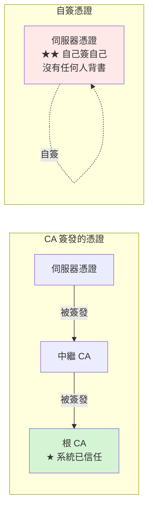

# 自簽憑證快速產生

> [!abstract] 這篇你會學到
> - 用**一行指令**產生含 SAN 的自簽憑證
> - 用 **`mkcert`** 產生「本機瀏覽器信任」的開發憑證
> - 理解自簽憑證的**適用範圍與限制**
> - 產生 **Nginx / Apache / Docker / Kubernetes** 用的測試憑證
> - 知道**什麼時候該用自簽、什麼時候該用內部 CA**

## 前置知識

- [[090-01-02-guide-PKI-CSR產生與req設定檔]] — req.txt 與 SAN
- [[090-01-01-guide-PKI-PKI與憑證基礎]] — 憑證鏈與信任

---

## 自簽憑證是什麼



```
自簽憑證 = 用【自己的私鑰】簽發【自己的憑證】

★ 加密強度與 CA 簽發的【完全相同】
★★ 但沒有任何第三方背書
  → 瀏覽器不認識 → 顯示警告
    → 使用者要手動點「繼續前往」
```

> [!danger] 自簽憑證的正確定位
> ```
> ✅ 適合：
>   · 本機開發環境
>   · 自動化測試
>   · 內部工具的臨時使用
>   · 【暫時】讓服務跑起來（之後換成正式憑證）
>
> ❌ 不適合：
>   · ★★★ 任何【使用者會看到】的正式服務
>   · 內部系統（★ 應該用【內部 CA】—— 見 06-08 篇）
>   · API 之間的呼叫（除非有憑證釘選）
>
> ★★ 「內部系統用自簽憑證就好」是常見的錯誤想法：
>   → 每台機器一張獨立的自簽憑證
>     → 每台都要在每個客戶端手動信任
>       → ★ 完全無法管理
>   → 而且使用者被訓練成「看到警告就點繼續」
>     → ★★ 真的遇到中間人攻擊時也會點繼續
> ```

---

## 一行指令產生（含 SAN）

```bash
# ═══ ★ OpenSSL 1.1.1+ / 3.x 的簡潔寫法 ═══
$ openssl req -x509 -newkey rsa:2048 -nodes -days 365 \
    -keyout server.key -out server.crt \
    -subj "/C=TW/ST=Taiwan/L=Taipei/O=Example Gov/CN=app.test.local" \
    -addext "subjectAltName=DNS:app.test.local,DNS:www.app.test.local,DNS:localhost,IP:127.0.0.1" \
    -addext "basicConstraints=critical,CA:FALSE" \
    -addext "keyUsage=critical,digitalSignature,keyEncipherment" \
    -addext "extendedKeyUsage=serverAuth"

$ chmod 600 server.key
```

| 參數 | 意義 |
| --- | --- |
| **`-x509`** | **直接產生憑證**（不是 CSR） |
| `-newkey rsa:2048` | 同時產生金鑰 |
| **`-nodes`** | **私鑰不加密**（伺服器啟動不用密碼） |
| `-days 365` | 有效天數 |
| `-subj` | **非互動式指定主體** |
| **`-addext`** | **★ 加入擴充欄位（SAN 等）** |

> [!danger] `-addext "subjectAltName=..."` 不能省 ★★★
> ```bash
> # ❌ 沒有 SAN 的自簽憑證
> $ openssl req -x509 -newkey rsa:2048 -nodes -days 365 \
>     -keyout s.key -out s.crt -subj "/CN=app.test.local"
>
> $ openssl x509 -in s.crt -noout -ext subjectAltName
> No extensions in certificate
> #   → ★★ 現代瀏覽器【直接拒絕】，連「繼續前往」都可能沒有
> ```
>
> **一定要加 `-addext "subjectAltName=DNS:...,DNS:...,IP:..."`。**

```bash
# ═══ ECDSA 版本（★ 更快、憑證更小）═══
$ openssl req -x509 -newkey ec -pkeyopt ec_paramgen_curve:prime256v1 -nodes \
    -days 365 -keyout server.key -out server.crt \
    -subj "/C=TW/O=Example Gov/CN=app.test.local" \
    -addext "subjectAltName=DNS:app.test.local,DNS:localhost,IP:127.0.0.1" \
    -addext "basicConstraints=critical,CA:FALSE"

# ═══ 用既有的 req.txt（★ 可重複、可版控）═══
$ openssl req -x509 -new -nodes -days 365 \
    -config req.txt -extensions req_ext \
    -newkey rsa:2048 -keyout server.key -out server.crt
# ★ -extensions req_ext 告訴它把 [req_ext] 的內容放進【憑證】
```

> [!warning] `-extensions` vs `req_extensions`
> ```
> 產生 CSR 時   ：req_extensions = req_ext（在 [req] 區塊中）
> 產生自簽憑證時：-extensions req_ext（命令列參數）
>
> ★ 這兩個不一樣，很容易搞混
> ★ 產生自簽憑證時若忘了 -extensions，SAN 不會進到憑證中
> ```

### 驗證

```bash
# ★★ 一定要驗證
$ openssl x509 -in server.crt -noout -subject -dates -ext subjectAltName
subject=C=TW, ST=Taiwan, L=Taipei, O=Example Gov, CN=app.test.local
notBefore=Aug 28 00:00:00 2026 GMT
notAfter=Aug 28 00:00:00 2027 GMT
X509v3 Subject Alternative Name:
    DNS:app.test.local, DNS:www.app.test.local, DNS:localhost, IP Address:127.0.0.1

# ★ 確認是自簽（Subject == Issuer）
$ openssl x509 -in server.crt -noout -subject -issuer
subject=C=TW, ... CN=app.test.local
issuer=C=TW, ... CN=app.test.local          # ★ 完全相同 = 自簽

# ★ 憑證與私鑰配對
$ openssl x509 -in server.crt -noout -pubkey | openssl md5
$ openssl pkey -in server.key -pubout | openssl md5
```

---

## `mkcert`：本機開發的最佳選擇 ★

```
mkcert 做的事：
  ① 在你的電腦上建立一個【本機 CA】
  ② ★★ 自動把這個 CA 加進【系統與瀏覽器的信任清單】
  ③ 用它簽發憑證

★★ 結果：本機的瀏覽器【完全信任】，沒有任何警告
★ 但這個 CA 只在【你這台機器】被信任
```

```bash
# ═══ 安裝 ═══
# Ubuntu / Debian
$ sudo apt install -y libnss3-tools
$ curl -fsSLO "https://dl.filippo.io/mkcert/latest?for=linux/amd64" -o mkcert
$ chmod +x mkcert && sudo mv mkcert /usr/local/bin/

# 或用 Go
$ go install filippo.io/mkcert@latest

$ mkcert -version
v1.4.4

# ═══ ★★ 安裝本機 CA（只需一次）═══
$ mkcert -install
Created a new local CA 💥
The local CA is now installed in the system trust store! ⚡️
The local CA is now installed in the Firefox and/or Chrome trust store ...! 🦊

$ mkcert -CAROOT
/home/user/.local/share/mkcert

# ═══ 產生憑證（★ 一行）═══
$ mkcert app.test.local "*.test.local" localhost 127.0.0.1 ::1

Created a new certificate valid for the following names 📜
 - "app.test.local"
 - "*.test.local"
 - "localhost"
 - "127.0.0.1"
 - "::1"

The certificate is at "./app.test.local+4.pem" and the key at "./app.test.local+4-key.pem" ✅
It will expire on 28 November 2028 🗓

# ═══ 指定輸出檔名 ═══
$ mkcert -cert-file server.crt -key-file server.key \
    app.test.local localhost 127.0.0.1

# ═══ 產生客戶端憑證（mTLS 測試）═══
$ mkcert -client app-client.test.local

# ═══ 產生 PKCS#12（Java / Windows 用）═══
$ mkcert -pkcs12 app.test.local
```

> [!tip] mkcert 的三個優勢
> ```
> ① ★★ 自動安裝到【系統 + Firefox + Chrome】的信任清單
>    → 開發時完全沒有憑證警告
> ② ★ 自動包含 SAN（不會忘記）
> ③ ★ 支援萬用、IP、IPv6、客戶端憑證、PKCS#12
> ```
>
> **給團隊使用**：
> ```bash
> # ★ 把 CA 的根憑證分享給團隊成員
> $ cat "$(mkcert -CAROOT)/rootCA.pem"
>
> # 團隊成員安裝
> $ export CAROOT=/path/to/shared/ca
> $ mkcert -install
> ```

> [!danger] mkcert 的 CA 私鑰要保護好
> ```bash
> $ ls -l "$(mkcert -CAROOT)"
> -rw------- 1 user user 2484 rootCA-key.pem      # ★★ 這把私鑰能簽發任何網域
> -rw-r--r-- 1 user user 1704 rootCA.pem
> ```
> **這把私鑰被偷 = 攻擊者可以對你的電腦發動中間人攻擊**
> （因為你的系統信任這個 CA）。
>
> ```
> ❌ 不要把 mkcert 的 CA 用在正式環境
> ❌ 不要把 rootCA-key.pem 提交到 git
> ❌ 不要在共用的伺服器上執行 mkcert -install
> ```
>
> **移除**：
> ```bash
> $ mkcert -uninstall          # 從信任清單移除
> $ rm -rf "$(mkcert -CAROOT)"
> ```

---

## 各服務的測試憑證

### Nginx

```bash
#!/usr/bin/env bash
# 產生 Nginx 用的自簽憑證
DOMAIN="${1:-localhost}"
DIR="${2:-/etc/ssl/selfsigned}"

sudo mkdir -p "$DIR"
sudo openssl req -x509 -newkey rsa:2048 -nodes -days 365 \
    -keyout "$DIR/$DOMAIN.key" -out "$DIR/$DOMAIN.crt" \
    -subj "/C=TW/ST=Taiwan/L=Taipei/O=Test/CN=$DOMAIN" \
    -addext "subjectAltName=DNS:$DOMAIN,DNS:localhost,IP:127.0.0.1,IP:::1" \
    -addext "basicConstraints=critical,CA:FALSE" \
    -addext "keyUsage=critical,digitalSignature,keyEncipherment" \
    -addext "extendedKeyUsage=serverAuth" 2>/dev/null

sudo chmod 600 "$DIR/$DOMAIN.key"
sudo chmod 644 "$DIR/$DOMAIN.crt"
echo "✓ $DIR/$DOMAIN.{crt,key}"
```

```nginx
server {
    listen 443 ssl;
    http2 on;
    server_name app.test.local;

    ssl_certificate     /etc/ssl/selfsigned/app.test.local.crt;
    ssl_certificate_key /etc/ssl/selfsigned/app.test.local.key;
    ssl_protocols TLSv1.2 TLSv1.3;

    # ★ 自簽憑證沒有 OCSP，關掉 stapling 避免警告
    ssl_stapling off;

    root /var/www/html;
}
```

> [!warning] Ubuntu 的 `ssl-cert-snakeoil`
> ```bash
> $ ls -l /etc/ssl/certs/ssl-cert-snakeoil.pem /etc/ssl/private/ssl-cert-snakeoil.key
> ```
> **Debian/Ubuntu 安裝 `ssl-cert` 套件時會自動產生一組自簽憑證**，
> 很多預設設定（如 Apache 的 `default-ssl.conf`）會用它。
>
> ```
> ★ 它的 CN 是你的主機名，通常【沒有 SAN】
> ★ 只適合「讓服務能起來」，絕對不能用於任何真實服務
> ```
> ```bash
> $ openssl x509 -in /etc/ssl/certs/ssl-cert-snakeoil.pem -noout -subject -ext subjectAltName
> subject=CN=myhost
> X509v3 Subject Alternative Name:
>     DNS:myhost                      # ★ 只有主機名
>
> # 重新產生
> $ sudo make-ssl-cert generate-default-snakeoil --force-overwrite
> ```

### Apache

```apache
<VirtualHost *:443>
    ServerName app.test.local
    SSLEngine on
    SSLCertificateFile    /etc/ssl/selfsigned/app.test.local.crt
    SSLCertificateKeyFile /etc/ssl/selfsigned/app.test.local.key
    SSLProtocol -all +TLSv1.2 +TLSv1.3
    SSLUseStapling off              # ★ 自簽憑證沒有 OCSP
    DocumentRoot /var/www/html
</VirtualHost>
```

### Docker / Docker Compose

```yaml
# docker-compose.yml
services:
  web:
    image: nginx:alpine
    ports: ["443:443"]
    volumes:
      - ./certs:/etc/nginx/certs:ro          # ★ 唯讀掛載
      - ./nginx.conf:/etc/nginx/conf.d/default.conf:ro
```

```bash
# ★ 產生憑證（用容器，不需要本機裝 openssl）
$ mkdir -p certs
$ docker run --rm -v "$PWD/certs:/certs" alpine/openssl \
    req -x509 -newkey rsa:2048 -nodes -days 365 \
    -keyout /certs/server.key -out /certs/server.crt \
    -subj "/CN=localhost" \
    -addext "subjectAltName=DNS:localhost,DNS:web,IP:127.0.0.1"

$ chmod 600 certs/server.key
```

```dockerfile
# ★ 在 image 中產生（僅限開發用的 image）
FROM nginx:alpine
RUN apk add --no-cache openssl && \
    openssl req -x509 -newkey rsa:2048 -nodes -days 365 \
      -keyout /etc/nginx/server.key -out /etc/nginx/server.crt \
      -subj "/CN=localhost" \
      -addext "subjectAltName=DNS:localhost,IP:127.0.0.1" && \
    chmod 600 /etc/nginx/server.key
# ★★ 絕對不要用於正式環境的 image
#    （憑證會被打包進 image，且所有實例共用同一把私鑰）
```

### Kubernetes（測試用）

```bash
# ★ 產生並建立 Secret
$ openssl req -x509 -newkey rsa:2048 -nodes -days 365 \
    -keyout tls.key -out tls.crt \
    -subj "/CN=app.test.local" \
    -addext "subjectAltName=DNS:app.test.local,DNS:app.default.svc.cluster.local"

$ kubectl create secret tls app-tls --cert=tls.crt --key=tls.key

$ kubectl get secret app-tls -o jsonpath='{.data.tls\.crt}' | \
    base64 -d | openssl x509 -noout -subject -ext subjectAltName
```

> [!tip] Kubernetes 正式環境用 cert-manager
> ```
> 測試：手動產生自簽憑證 + kubectl create secret
> 正式：★ cert-manager（自動申請 Let's Encrypt 或內部 CA 的憑證）
> ```

---

## 完整實戰範例

### 一鍵產生測試憑證

```bash
#!/usr/bin/env bash
# /usr/local/bin/selfsign —— 產生自簽憑證
set -euo pipefail

usage() {
    cat <<'EOF'
用法：selfsign <主網域> [其他網域/IP...] [選項]

選項：
  --days N          有效天數（預設 365）
  --alg rsa|ec      演算法（預設 ec）
  --out-dir DIR     輸出目錄（預設 ./certs）
  --p12             同時產生 PKCS#12（Java/Windows 用）
  --pem-bundle      同時產生 cert+key 合併的 .pem（HAProxy 用）

範例：
  selfsign app.test.local localhost 127.0.0.1
  selfsign "*.test.local" test.local --days 730 --alg rsa
EOF
}

[ $# -eq 0 ] && { usage; exit 1; }

DAYS=365; ALG=ec; OUTDIR="./certs"; P12=0; BUNDLE=0
NAMES=()
while [ $# -gt 0 ]; do
    case "$1" in
        --days)       DAYS="$2"; shift 2 ;;
        --alg)        ALG="$2"; shift 2 ;;
        --out-dir)    OUTDIR="$2"; shift 2 ;;
        --p12)        P12=1; shift ;;
        --pem-bundle) BUNDLE=1; shift ;;
        -h|--help)    usage; exit 0 ;;
        -*)           echo "未知的選項：$1"; exit 1 ;;
        *)            NAMES+=("$1"); shift ;;
    esac
done

[ ${#NAMES[@]} -eq 0 ] && { echo "✗ 至少要有一個名稱"; exit 1; }

CN="${NAMES[0]}"
# 檔名不能有 *
FNAME=$(echo "$CN" | tr -d '*' | sed 's/^\.//')
mkdir -p "$OUTDIR"
KEY="$OUTDIR/$FNAME.key"
CRT="$OUTDIR/$FNAME.crt"

# ── 組合 SAN ──
SAN=""
for n in "${NAMES[@]}"; do
    if [[ "$n" =~ ^([0-9]{1,3}\.){3}[0-9]{1,3}$ ]] || [[ "$n" =~ ^[0-9a-fA-F:]+$ && "$n" == *:* ]]; then
        SAN="${SAN}${SAN:+,}IP:$n"
    else
        SAN="${SAN}${SAN:+,}DNS:$n"
    fi
done

echo "═══ 產生自簽憑證 ═══"
echo "  CN     : $CN"
echo "  SAN    : $SAN"
echo "  有效期 : $DAYS 天"
echo "  演算法 : $ALG"
echo

# ── 產生 ──
case "$ALG" in
    ec)
        openssl req -x509 -newkey ec -pkeyopt ec_paramgen_curve:prime256v1 -nodes \
            -days "$DAYS" -keyout "$KEY" -out "$CRT" \
            -subj "/C=TW/ST=Taiwan/L=Taipei/O=Test Organization/CN=$CN" \
            -addext "subjectAltName=$SAN" \
            -addext "basicConstraints=critical,CA:FALSE" \
            -addext "keyUsage=critical,digitalSignature,keyEncipherment" \
            -addext "extendedKeyUsage=serverAuth,clientAuth" 2>/dev/null ;;
    rsa)
        openssl req -x509 -newkey rsa:2048 -nodes \
            -days "$DAYS" -keyout "$KEY" -out "$CRT" \
            -subj "/C=TW/ST=Taiwan/L=Taipei/O=Test Organization/CN=$CN" \
            -addext "subjectAltName=$SAN" \
            -addext "basicConstraints=critical,CA:FALSE" \
            -addext "keyUsage=critical,digitalSignature,keyEncipherment" \
            -addext "extendedKeyUsage=serverAuth,clientAuth" 2>/dev/null ;;
    *) echo "✗ 未知的演算法：$ALG"; exit 1 ;;
esac

chmod 600 "$KEY"; chmod 644 "$CRT"
echo "  ✓ $CRT"
echo "  ✓ $KEY（chmod 600）"

# ── 額外格式 ──
if [ "$P12" -eq 1 ]; then
    P12F="$OUTDIR/$FNAME.p12"
    openssl pkcs12 -export -out "$P12F" -inkey "$KEY" -in "$CRT" \
        -name "$CN" -passout pass:changeit
    chmod 600 "$P12F"
    echo "  ✓ $P12F（密碼：changeit）"
fi

if [ "$BUNDLE" -eq 1 ]; then
    BF="$OUTDIR/$FNAME.pem"
    cat "$CRT" "$KEY" > "$BF"
    chmod 600 "$BF"
    echo "  ✓ $BF（HAProxy 格式）"
fi

# ── ★★ 驗證 ──
echo
echo "═══ 驗證 ═══"
echo "  ── 主體與有效期 ──"
openssl x509 -in "$CRT" -noout -subject -issuer -dates | sed 's/^/    /'

echo "  ── ★ SAN ──"
S=$(openssl x509 -in "$CRT" -noout -ext subjectAltName 2>/dev/null | tail -n +2 | xargs)
if [ -n "$S" ]; then
    echo "    ✓ $S"
    # ★ CN 是否在 SAN 中
    echo "$S" | grep -q "DNS:$CN\|DNS:${CN#\*.}" && echo "    ✓ CN 在 SAN 中" \
      || echo "    ⚠ CN 不在 SAN 中"
else
    echo "    ✗✗ 沒有 SAN！"
    exit 1
fi

echo "  ── 自簽確認 ──"
SUBJ=$(openssl x509 -in "$CRT" -noout -subject | sed 's/^subject=//')
ISSU=$(openssl x509 -in "$CRT" -noout -issuer  | sed 's/^issuer=//')
[ "$SUBJ" = "$ISSU" ] && echo "    ✓ 這是自簽憑證（Subject == Issuer）" \
                      || echo "    ○ 不是自簽（由其他 CA 簽發）"

echo "  ── 金鑰配對 ──"
A=$(openssl x509 -in "$CRT" -noout -pubkey | openssl md5)
B=$(openssl pkey -in "$KEY" -pubout 2>/dev/null | openssl md5)
[ "$A" = "$B" ] && echo "    ✓ 憑證與私鑰配對正確" || echo "    ✗ 不配對"

# ── 使用說明 ──
cat <<EOF

═══ 使用方式 ═══

  ── Nginx ──
    ssl_certificate     $(realpath "$CRT");
    ssl_certificate_key $(realpath "$KEY");
    ssl_stapling off;                        # ★ 自簽憑證沒有 OCSP

  ── Apache ──
    SSLCertificateFile    $(realpath "$CRT")
    SSLCertificateKeyFile $(realpath "$KEY")
    SSLUseStapling off

  ── 測試 ──
    curl -k https://$CN/                     # ★ -k 跳過驗證
    curl --cacert $(realpath "$CRT") https://$CN/   # ★ 明確信任這張憑證

  ── ★ 讓本機信任（測試用）──
    sudo cp $(realpath "$CRT") /usr/local/share/ca-certificates/$FNAME.crt
    sudo update-ca-certificates
    # RHEL: sudo cp ... /etc/pki/ca-trust/source/anchors/ && sudo update-ca-trust extract

═══ ★★ 提醒 ═══
  · 自簽憑證【只適合測試與開發】
  · 正式環境請用 CA 簽發的憑證
  · 內部系統請用【內部 CA】（見 06-08 篇），不要每台一張自簽憑證
EOF
```

```bash
$ selfsign app.test.local www.app.test.local localhost 127.0.0.1
$ selfsign "*.test.local" test.local --days 730 --alg rsa --p12
```

### 快速測試環境（Nginx + 自簽憑證）

```bash
#!/usr/bin/env bash
# 一鍵建立可用 HTTPS 的測試站台
set -euo pipefail
DOMAIN="${1:-app.test.local}"

echo "【1】產生自簽憑證"
sudo mkdir -p /etc/ssl/selfsigned
sudo openssl req -x509 -newkey ec -pkeyopt ec_paramgen_curve:prime256v1 -nodes \
    -days 365 \
    -keyout "/etc/ssl/selfsigned/$DOMAIN.key" \
    -out    "/etc/ssl/selfsigned/$DOMAIN.crt" \
    -subj "/C=TW/O=Test/CN=$DOMAIN" \
    -addext "subjectAltName=DNS:$DOMAIN,DNS:localhost,IP:127.0.0.1" \
    -addext "basicConstraints=critical,CA:FALSE" 2>/dev/null
sudo chmod 600 "/etc/ssl/selfsigned/$DOMAIN.key"

echo "【2】設定 Nginx"
sudo tee "/etc/nginx/sites-available/$DOMAIN" >/dev/null <<EOF
server {
    listen 80;
    server_name $DOMAIN;
    return 301 https://\$host\$request_uri;
}

server {
    listen 443 ssl;
    http2 on;
    server_name $DOMAIN;

    ssl_certificate     /etc/ssl/selfsigned/$DOMAIN.crt;
    ssl_certificate_key /etc/ssl/selfsigned/$DOMAIN.key;
    ssl_protocols TLSv1.2 TLSv1.3;
    ssl_stapling off;

    root /var/www/$DOMAIN;
    index index.html;

    location / { try_files \$uri \$uri/ =404; }
}
EOF

sudo mkdir -p "/var/www/$DOMAIN"
echo "<h1>$DOMAIN 測試站台</h1><p>HTTPS 正常運作（自簽憑證）</p>" | \
  sudo tee "/var/www/$DOMAIN/index.html" >/dev/null

sudo ln -sf "/etc/nginx/sites-available/$DOMAIN" /etc/nginx/sites-enabled/
sudo nginx -t && sudo systemctl reload nginx

echo "【3】加入 /etc/hosts"
grep -q "$DOMAIN" /etc/hosts || echo "127.0.0.1  $DOMAIN" | sudo tee -a /etc/hosts >/dev/null

echo "【4】驗證"
curl -sk "https://$DOMAIN/" | head -3
echo
echo "  ── 憑證資訊 ──"
echo | openssl s_client -connect "$DOMAIN:443" -servername "$DOMAIN" 2>/dev/null | \
  openssl x509 -noout -subject -ext subjectAltName | sed 's/^/    /'

cat <<EOF

✓ 完成：https://$DOMAIN/

★ 瀏覽器會顯示憑證警告（這是預期的，因為是自簽憑證）
★ 要讓本機信任：
    sudo cp /etc/ssl/selfsigned/$DOMAIN.crt /usr/local/share/ca-certificates/
    sudo update-ca-certificates
    # ★ Firefox 與 Chrome 可能需要另外匯入
★ 或用 mkcert 產生「瀏覽器直接信任」的憑證
EOF
```

---

## 常見錯誤與排錯

| 現象／問題 | 原因 | 解法 |
| --- | --- | --- |
| **`ERR_CERT_COMMON_NAME_INVALID`** ★★ | **忘了 `-addext subjectAltName`** | 加上並重新產生 |
| **`ERR_CERT_AUTHORITY_INVALID`** | 自簽憑證不被信任 | **這是預期的**；加入信任清單或用 mkcert |
| `self signed certificate` (curl) | 同上 | `curl -k`；或 `--cacert server.crt` |
| **加入信任清單後 Firefox 仍警告** ★ | **Firefox 有自己的信任清單** | Firefox 設定中匯入；或用 mkcert |
| **Chrome 加入後仍警告** | Chrome 快取了舊的判定 | 重啟 Chrome；`chrome://net-internals/#hsts` 清除 |
| **`-addext` 不存在** | OpenSSL < 1.1.1 | 用 `-config` + `-extensions`；或升級 |
| SAN 沒進到憑證（用 config 時） | 忘了 `-extensions req_ext` | **產生自簽憑證時要用 `-extensions`** |
| **Nginx 啟動要輸入密碼** | 忘了 `-nodes` | `openssl pkey -in enc.key -out plain.key` |
| **OCSP stapling 警告** | 自簽憑證沒有 OCSP 網址 | `ssl_stapling off;` |
| **Docker 中憑證找不到** | 掛載路徑錯 | `docker exec ... ls -l /etc/nginx/certs/` |
| mkcert 產生的憑證在其他機器不被信任 | **CA 只裝在你的機器上** | 分享 `rootCA.pem` 並在對方 `mkcert -install` |
| **正式環境用了自簽憑證** ★★ | 誤用 | **改用 CA 憑證或內部 CA** |

### 排查

```bash
# 【1】★ 檢查 SAN
$ openssl x509 -in server.crt -noout -ext subjectAltName

# 【2】確認是自簽
$ openssl x509 -in server.crt -noout -subject -issuer
# ★ 兩者相同 = 自簽

# 【3】憑證與私鑰配對
$ openssl x509 -in server.crt -noout -pubkey | openssl md5
$ openssl pkey -in server.key -pubout | openssl md5

# 【4】測試連線（明確信任這張憑證）
$ curl --cacert server.crt https://app.test.local/
$ openssl s_client -connect app.test.local:443 -CAfile server.crt \
    -servername app.test.local -verify_hostname app.test.local

# 【5】看瀏覽器實際收到的憑證
$ echo | openssl s_client -connect app.test.local:443 \
    -servername app.test.local 2>/dev/null | openssl x509 -noout -text

# 【6】檢查信任清單
$ ls -l /usr/local/share/ca-certificates/
$ grep -c 'BEGIN CERTIFICATE' /etc/ssl/certs/ca-certificates.crt
$ openssl verify -CAfile /etc/ssl/certs/ca-certificates.crt server.crt

# 【7】OpenSSL 版本（-addext 需要 1.1.1+）
$ openssl version
OpenSSL 3.0.13 30 Jan 2024
```

---

## 安全性注意事項

> [!danger] 自簽憑證訓練使用者「忽略警告」★★★
> ```
> 內部系統用自簽憑證
>   → 使用者每天看到「您的連線不是私人連線」
>     → 每天點「進階」→「繼續前往」
>       → ★★★ 被訓練成「看到憑證警告就點繼續」
>         → 真的遇到中間人攻擊時
>           → 【也會點繼續】
>
> ★★ 這是自簽憑證最大的問題 —— 不是技術問題，是【行為問題】
> ```
>
> **正確的做法**：
> ```
> ① 對外服務  → 公開 CA 的憑證（Let's Encrypt 免費）
> ② 內部服務  → ★ 建立【內部 CA】並派送根憑證
>              → 使用者完全不會看到警告
> ③ 開發測試  → mkcert（本機信任）
> ④ 自簽憑證  → 只用於「臨時讓服務跑起來」
> ```
>
> 見 [[090-01-06-guide-PKI-自建根CA]] 與 [[090-01-09-guide-PKI-根憑證派送與信任]]。

> [!warning] 自簽憑證無法撤銷
> ```
> 私鑰洩漏時：
>   CA 憑證   → 向 CA 申請撤銷 → CRL/OCSP 生效
>   自簽憑證  → ★★ 【沒有任何撤銷機制】
>              → 只能：① 換一張新的
>                     ② 到【每一個】信任它的客戶端手動移除
>
> ★ 若有 100 台客戶端信任了這張憑證 → 要跑 100 台
> ```
>
> **內部 CA 的優勢**：只要撤銷該憑證並更新 CRL，
> 或直接換一張（客戶端信任的是「根 CA」，不是個別憑證）。

> [!tip] 自簽憑證的有效期不要設太長
> ```bash
> # ❌ 常見的做法
> $ openssl req -x509 ... -days 3650      # 10 年
>
> # 理由：「反正是測試，不想一直重新產生」
> #
> # ★ 問題：
> #   · 測試憑證常常「不小心」被用到正式環境
> #   · 10 年後的加密標準可能已經淘汰
> #   · 私鑰長期不變，風險累積
>
> # ✅ 建議
> $ openssl req -x509 ... -days 90        # ★ 短一點，逼你重新產生
> ```
>
> **而且 Safari / Chrome 對「公開 CA 簽發」的憑證有效期上限只有約一年，
> 而且【還在分階段縮短】（以 CA/B Forum 現行 BR 為準）** ——
> 自簽憑證雖然不受此限，但養成好習慣比較安全。

> [!warning] 不要把測試憑證提交到 git
> ```gitignore
> # .gitignore
> *.key
> *.pem
> *.crt
> *.p12
> *.pfx
> certs/
> ```
> ```bash
> # ★ 檢查是否曾經被提交
> $ git log --all --diff-filter=A --name-only | grep -iE '\.(key|pem|crt|p12|pfx)$'
> ```
>
> **理由**：
> ①開發者可能複製到正式環境；
> ②私鑰進了 git 就永遠在歷史中；
> ③**團隊成員都拿到同一把私鑰**。
>
> **正確做法**：把「產生憑證的腳本」提交到 git，**憑證本身不提交**。

---

## 速查表

### ★ 一行產生（含 SAN）

```bash
openssl req -x509 -newkey rsa:2048 -nodes -days 365 \
  -keyout server.key -out server.crt \
  -subj "/C=TW/O=Test/CN=app.test.local" \
  -addext "subjectAltName=DNS:app.test.local,DNS:localhost,IP:127.0.0.1" \
  -addext "basicConstraints=critical,CA:FALSE" \
  -addext "keyUsage=critical,digitalSignature,keyEncipherment" \
  -addext "extendedKeyUsage=serverAuth"

chmod 600 server.key
```

```bash
# ECDSA 版本
openssl req -x509 -newkey ec -pkeyopt ec_paramgen_curve:prime256v1 -nodes \
  -days 365 -keyout server.key -out server.crt \
  -subj "/CN=app.test.local" \
  -addext "subjectAltName=DNS:app.test.local,IP:127.0.0.1"

# 用 req.txt（★ 注意是 -extensions 不是 req_extensions）
openssl req -x509 -new -nodes -days 365 -config req.txt -extensions req_ext \
  -newkey rsa:2048 -keyout server.key -out server.crt
```

```
★★ 沒有 -addext subjectAltName 的自簽憑證 = 瀏覽器直接拒絕
```

### ★ mkcert（本機開發最佳）

```bash
sudo apt install -y libnss3-tools
curl -fsSLO "https://dl.filippo.io/mkcert/latest?for=linux/amd64" -o mkcert
chmod +x mkcert && sudo mv mkcert /usr/local/bin/

mkcert -install                                    # ★★ 只需一次
mkcert app.test.local "*.test.local" localhost 127.0.0.1
mkcert -cert-file server.crt -key-file server.key app.test.local
mkcert -client app-client.test.local               # mTLS 測試
mkcert -pkcs12 app.test.local                      # Java/Windows

mkcert -CAROOT                                     # CA 的位置
mkcert -uninstall                                  # 移除信任
```

```
★ 自動安裝到系統 + Firefox + Chrome 的信任清單 → 開發時零警告
★★ rootCA-key.pem 要保護好（能簽發任何網域，可對你的電腦做中間人）
❌ 不要用於正式環境；不要提交到 git
```

### 驗證

```bash
openssl x509 -in server.crt -noout -subject -issuer -dates -ext subjectAltName
# ★ Subject == Issuer 表示是自簽

openssl x509 -in server.crt -noout -pubkey | openssl md5    # ★ 與私鑰比對
openssl pkey -in server.key -pubout | openssl md5

curl --cacert server.crt https://app.test.local/            # 明確信任
curl -k https://app.test.local/                             # 跳過驗證
```

### 服務設定

```nginx
ssl_certificate     /etc/ssl/selfsigned/app.crt;
ssl_certificate_key /etc/ssl/selfsigned/app.key;
ssl_stapling off;                    # ★ 自簽憑證沒有 OCSP
```
```apache
SSLCertificateFile    /etc/ssl/selfsigned/app.crt
SSLCertificateKeyFile /etc/ssl/selfsigned/app.key
SSLUseStapling off
```

### 加入本機信任清單

```bash
# Debian / Ubuntu
sudo cp server.crt /usr/local/share/ca-certificates/myapp.crt
sudo update-ca-certificates

# RHEL / Rocky
sudo cp server.crt /etc/pki/ca-trust/source/anchors/
sudo update-ca-trust extract

★ Firefox 有自己的清單（要另外匯入）
★ Java 有自己的 cacerts
```

### ★★ 適用範圍

```
✅ 本機開發 · 自動化測試 · 臨時讓服務跑起來
❌ 任何使用者會看到的正式服務
❌ 內部系統（★ 應該用【內部 CA】—— 見 06-08 篇）

★★★ 自簽憑證最大的問題是【訓練使用者忽略憑證警告】
     → 真的遇到中間人攻擊時也會點「繼續前往」
★ 自簽憑證【無法撤銷】—— 私鑰洩漏時要到每一台客戶端手動移除
```

### 常見錯誤

| 錯誤 | 原因 |
| --- | --- |
| `ERR_CERT_COMMON_NAME_INVALID` | **忘了 `-addext subjectAltName`** |
| `ERR_CERT_AUTHORITY_INVALID` | 自簽不被信任（**預期行為**） |
| 加入信任後 Firefox 仍警告 | **Firefox 有自己的清單** |
| `-addext` 不存在 | OpenSSL < 1.1.1 |
| 用 config 時 SAN 沒進去 | 忘了 **`-extensions req_ext`** |
| Nginx 要輸入密碼 | 忘了 `-nodes` |

---

## 練習題

> [!question]- 練習 1：有無 SAN 的差別
> 1. 產生一張**沒有** `-addext subjectAltName` 的自簽憑證
> 2. 部署到 Nginx，用瀏覽器開啟 → **看到什麼錯誤？**
> 3. **能點「繼續前往」嗎？**
> 4. 加上 `-addext "subjectAltName=DNS:..."` 重新產生
> 5. **再測一次** → 錯誤訊息變成什麼？
> 6. **兩種錯誤的差別是什麼？**

> [!question]- 練習 2：mkcert 體驗
> 1. 安裝 mkcert 並執行 `mkcert -install`
> 2. `mkcert app.test.local localhost 127.0.0.1`
> 3. 部署到 Nginx 並用瀏覽器開啟
> 4. **有警告嗎？為什麼？**
> 5. `mkcert -CAROOT` 看 CA 在哪
> 6. **用另一台機器（或另一個瀏覽器 profile）開啟** → 有警告嗎？
> 7. `mkcert -uninstall` 後重測

> [!question]- 練習 3：信任清單實驗
> 1. 產生一張自簽憑證並部署
> 2. `curl https://app.test.local/` → 失敗
> 3. `curl --cacert server.crt https://app.test.local/` → 成功嗎？
> 4. 把憑證加進系統信任清單
> 5. **再測 `curl`** → 成功嗎？
> 6. **用 Firefox 開啟** → 還有警告嗎？為什麼？
> 7. `node -e "require('https').get('https://app.test.local',r=>console.log(r.statusCode))"`
>    → 成功嗎？需要什麼設定？

> [!question]- 練習 4：多格式輸出
> 1. 用 `selfsign` 腳本產生憑證，加上 `--p12` 與 `--pem-bundle`
> 2. 檢視三種格式的內容：
>    ```bash
>    openssl x509 -in app.crt -noout -subject
>    openssl pkcs12 -in app.p12 -info -nodes -passin pass:changeit
>    head -3 app.pem && tail -3 app.pem
>    ```
> 3. **各適合什麼服務？**
> 4. 用 `keytool -list -v -keystore app.p12` 檢視（Java）
> 5. 在 HAProxy 中使用 `.pem` 格式

> [!question]- 練習 5：自簽的極限
> **★ 觀念驗證**
> 1. 假設你有 20 台內部伺服器，每台一張自簽憑證
> 2. **要讓 50 台使用者電腦都信任，需要做幾次操作？**（20 × 50 = ?）
> 3. 其中一張憑證的私鑰洩漏了，**要怎麼撤銷？**
> 4. 一年後憑證到期，**要重做幾次？**
> 5. **改用一個內部 CA 的話，上述數字各變成多少？**
> 6. **寫下你的結論**

---

## 小測驗

Q1. **自簽憑證與 CA 簽發憑證在「加密強度」上有差別嗎？差別在哪**？

Q2. **產生自簽憑證時最容易漏掉什麼？後果是什麼**？

Q3. **用 `-config req.txt` 產生自簽憑證時，SAN 沒進去的原因是什麼**？

Q4. **`mkcert` 做了哪三件事？它的 CA 私鑰為什麼要保護好**？

Q5. **自簽憑證最大的問題是什麼？（提示：不是技術問題）**

Q6. **自簽憑證的私鑰洩漏了要怎麼處理？與內部 CA 相比有什麼差別**？

Q7. **為什麼加入系統信任清單後 Firefox 仍然警告**？

Q8. **Nginx 用自簽憑證時為什麼要 `ssl_stapling off`**？

Q9. **20 台內部伺服器用自簽憑證 vs 用內部 CA，管理成本差在哪**？

Q10. **測試憑證為什麼不該提交到 git？正確做法是什麼**？

> [!question]- 測驗答案
> **Q1.** **加密強度完全相同** ——
> 自簽憑證與 CA 簽發的憑證使用相同的演算法（RSA / ECDSA）、
> 相同的金鑰長度，TLS 握手與加密的過程也完全一樣。
> **差別在於「信任」**：
> **CA 簽發的憑證有第三方（受信任的 CA）背書**，
> 而**自簽憑證只是「自己說自己是誰」，沒有任何人證明**。
> 所以瀏覽器不認識它，會顯示警告。
>
> **Q2.** **最容易漏掉的是 `-addext "subjectAltName=DNS:...,IP:..."`**。
> **後果**：產生的憑證**沒有 SAN**，
> 而**現代瀏覽器完全不看 CN，只看 SAN** ——
> 會直接報 `ERR_CERT_COMMON_NAME_INVALID`，
> 而且這種錯誤**可能連「繼續前往」的選項都沒有**
> （與 `ERR_CERT_AUTHORITY_INVALID` 不同，後者通常可以繞過）。
> ```bash
> openssl x509 -in server.crt -noout -ext subjectAltName    # ★ 一定要驗證
> ```
>
> **Q3.** 因為**忘了加 `-extensions req_ext` 這個命令列參數**。
> 這是容易混淆的地方：
> ```
> 產生 CSR 時   ：在 [req] 區塊中寫 req_extensions = req_ext
> 產生自簽憑證時：★ 用命令列參數 -extensions req_ext
> ```
> **兩者是不同的機制** ——
> `req_extensions` 是「要放進 CSR 的擴充」，
> 而 `-extensions` 是「要放進最終憑證的擴充」。
> 正確寫法：
> ```bash
> openssl req -x509 -new -nodes -days 365 -config req.txt -extensions req_ext \
>   -newkey rsa:2048 -keyout server.key -out server.crt
> ```
>
> **Q4.** **mkcert 做的三件事**：
> ①**在你的電腦上建立一個本機 CA**（產生根憑證與私鑰）；
> ②**★★ 自動把這個 CA 加進「系統 + Firefox + Chrome」的信任清單**；
> ③**用它簽發憑證**（自動包含 SAN，支援萬用、IP、IPv6）。
> **CA 私鑰（`rootCA-key.pem`）要保護好的原因**：
> **你的系統已經信任這個 CA**，
> 所以**任何人拿到這把私鑰，就能簽發「任何網域」的憑證，
> 對你的電腦發動中間人攻擊而不會有任何警告**
> （包括你的銀行、Google、公司內部系統）。
> 絕不能提交到 git，也不要在共用伺服器上執行 `mkcert -install`。
>
> **Q5.** **最大的問題不是技術問題，而是「行為問題」** ——
> **自簽憑證訓練使用者「忽略憑證警告」**：
> ```
> 內部系統用自簽憑證
>   → 使用者每天看到「您的連線不是私人連線」
>     → 每天點「進階」→「繼續前往」
>       → ★★ 被訓練成「看到憑證警告就點繼續」
>         → 【真的遇到中間人攻擊時，也會點繼續】
> ```
> 這讓整個憑證警告機制失去意義。
> **正確做法**：內部服務應該建立**內部 CA 並派送根憑證**，
> 讓使用者**完全不會看到警告** ——
> 這樣真的出現警告時，使用者才會警覺。
>
> **Q6.** **自簽憑證沒有任何撤銷機制**（沒有 CRL、沒有 OCSP）——
> 私鑰洩漏時**只能**：
> ①產生一張新的憑證；
> ②**到「每一個」信任它的客戶端手動移除舊憑證並安裝新的**。
> 若有 100 台客戶端信任了這張憑證，就要跑 100 台。
> **內部 CA 的優勢**：**客戶端信任的是「根 CA」，不是個別的伺服器憑證** ——
> 所以只要**撤銷該憑證（加進 CRL）並重新簽發一張新的**，
> **客戶端完全不需要任何操作**。
> 這是「一次派送、長期管理」與「每次都要重新派送」的根本差異。
>
> **Q7.** 因為 **Firefox 有自己獨立的信任清單（NSS database）**，
> **不使用作業系統的 `/etc/ssl/certs/`**。
> 這是 Firefox 的設計決定（為了跨平台一致性與安全性）。
> **解法**：
> ①在 Firefox 的「設定 → 隱私權與安全性 → 憑證 → 檢視憑證 → 憑證機構 → 匯入」；
> ②用 `certutil` 操作 Firefox 的 profile；
> ③**★ 用 `mkcert`**（它會自動處理 Firefox 與 Chrome 的清單）。
> 同樣有獨立清單的還有 **Java（cacerts）、Node.js、Python（certifi）**。
>
> **Q8.** 因為 **OCSP Stapling 需要憑證中有 `Authority Information Access` 擴充
> 指向 CA 的 OCSP 伺服器網址** ——
> **自簽憑證沒有這個網址**（因為沒有 CA）。
> 開啟 `ssl_stapling on` 時，Nginx 會在 error log 中持續產生警告：
> ```
> [warn] "ssl_stapling" ignored, no OCSP responder URL in the certificate
> ```
> 雖然不影響運作，但會**污染日誌**並可能掩蓋真正的問題。
> 所以自簽憑證（以及大多數內部 CA 的憑證）應該設 `ssl_stapling off;`。
>
> **Q9.** **自簽憑證（每台一張）**：
> **信任建立**：20 張憑證 × 50 台客戶端 = **1000 次安裝操作**；
> **憑證到期**：每年重複 1000 次；
> **私鑰洩漏**：要到 50 台客戶端移除該憑證；
> **新增伺服器**：又要在 50 台客戶端安裝。
> **內部 CA**：
> **信任建立**：**1 張根憑證 × 50 台客戶端 = 50 次**（且可用 GPO / MDM 自動派送）；
> **憑證到期**：在 CA 上重新簽發，**客戶端不需要任何操作**；
> **私鑰洩漏**：撤銷該憑證即可，客戶端不動；
> **新增伺服器**：在 CA 上簽發即可，客戶端不動。
> **★ 差距是「一次性 50 次」vs「持續的 1000 次」。**
>
> **Q10.** **不該提交的三個理由**：
> ①**開發者可能複製到正式環境**（「反正 repo 裡有現成的」）；
> ②**私鑰進了 git 就永遠留在歷史中**（即使後來刪除，還在 commit 歷史裡）；
> ③**團隊所有成員都拿到同一把私鑰**（無法追蹤是誰洩漏的）。
> **正確做法**：
> **把「產生憑證的腳本」提交到 git，憑證本身不提交**：
> ```gitignore
> *.key
> *.pem
> *.crt
> *.p12
> certs/
> ```
> 每個開發者執行腳本產生自己的憑證，或用 `mkcert`。
> ```bash
> # 檢查是否曾經被提交
> git log --all --diff-filter=A --name-only | grep -iE '\.(key|pem|crt|p12)$'
> ```

---

## 延伸閱讀

- [[090-01-06-guide-PKI-自建根CA]] — 下一步：建立內部 CA（★ 內部系統的正確做法）
- [[090-01-07-guide-PKI-自建中繼CA與憑證鏈]] — 完整的憑證鏈
- [[090-01-08-guide-PKI-用自建CA簽發伺服器憑證]] — 用內部 CA 簽發
- [[090-01-09-guide-PKI-根憑證派送與信任]] — 各平台的信任設定
- [[090-01-04-guide-PKI-CN與SAN設定與瀏覽器相容性]] — SAN 的規則
- [[090-01-10-guide-PKI-憑證部署到各服務]] — 部署到 Nginx/Apache/其他服務
