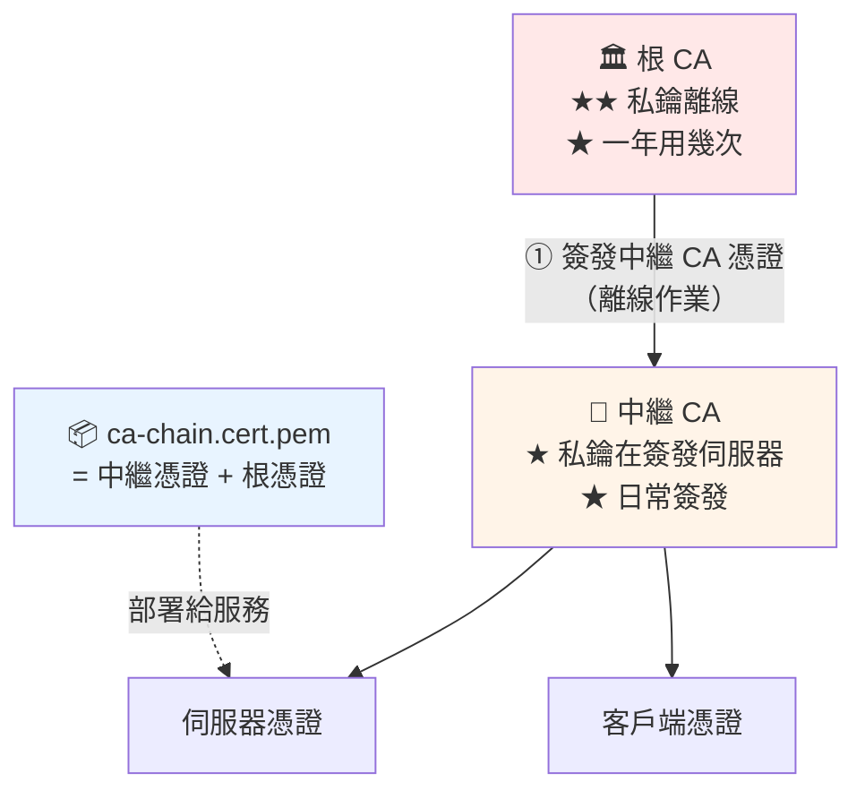

# 自建中繼 CA 與憑證鏈

> [!abstract] 這篇你會學到
> - 建立**中繼 CA**（日常簽發用）
> - 用根 CA **簽發中繼 CA 的憑證**
> - **驗證憑證鏈**並組合 `ca-chain.cert.pem`
> - 設定**中繼 CA 的自動化 CRL 產生**
> - 保護**簽發伺服器**（中繼 CA 私鑰在線上）
> - 處理**中繼 CA 被入侵**或**即將到期**

## 前置知識

- [[090-01-06-guide-PKI-自建根CA]] — 根 CA 的建立與 `openssl.cnf`
- [[090-01-01-guide-PKI-PKI與憑證基礎]] — 憑證鏈與信任傳遞

---

## 中繼 CA 的角色



```
分工：
  根 CA    → ① 簽發中繼 CA 的憑證（約 10 年一次）
             ② 簽 CRL（每 180 天）
             ★ 私鑰平時鎖在保險箱

  中繼 CA  → ① 日常簽發伺服器／客戶端憑證
             ② 簽 CRL（每 30 天，可自動化）
             ★ 私鑰在簽發伺服器上（加密保護 + 嚴格加固）
```

---

## 建立中繼 CA

### 目錄結構

```bash
#!/usr/bin/env bash
set -euo pipefail
INT_CA="${1:-/root/ca/issuing-ca}"

echo "═══ 建立中繼 CA 目錄：$INT_CA ═══"
sudo mkdir -p "$INT_CA"/{certs,crl,csr,newcerts,private}
sudo chmod 700 "$INT_CA/private"
sudo touch "$INT_CA/index.txt" "$INT_CA/index.txt.attr"
echo 1000 | sudo tee "$INT_CA/serial" >/dev/null
echo 1000 | sudo tee "$INT_CA/crlnumber" >/dev/null
sudo ls -la "$INT_CA"
```

### `openssl.cnf`

```ini
# ═══════════════════════════════════════════════════════════
# /root/ca/issuing-ca/openssl.cnf
# 中繼 CA（簽發 CA）的設定檔
# ═══════════════════════════════════════════════════════════

[ ca ]
default_ca = CA_default

[ CA_default ]
dir               = /root/ca/issuing-ca
certs             = $dir/certs
crl_dir           = $dir/crl
new_certs_dir     = $dir/newcerts
database          = $dir/index.txt
serial            = $dir/serial
RANDFILE          = $dir/private/.rand

private_key       = $dir/private/intermediate.key.pem
certificate       = $dir/certs/intermediate.cert.pem

crlnumber         = $dir/crlnumber
crl               = $dir/crl/intermediate.crl.pem
crl_extensions    = crl_ext
default_crl_days  = 30                  # ★ 中繼 CA 的 CRL 30 天（可自動化）

default_md        = sha256
name_opt          = ca_default
cert_opt          = ca_default
default_days      = 365                 # ★ 伺服器憑證預設 1 年
preserve          = no
policy            = policy_loose        # ★ 中繼 CA 用寬鬆政策
copy_extensions   = none                # ★★★ 絕不能是 copy
unique_subject    = no                  # ★ 允許同一個 CN 重複簽發（續期）

[ policy_loose ]
countryName             = optional
stateOrProvinceName     = optional
localityName            = optional
organizationName        = optional
organizationalUnitName  = optional
commonName              = supplied
emailAddress            = optional

[ req ]
default_bits        = 4096
distinguished_name  = req_distinguished_name
string_mask         = utf8only
utf8                = yes
default_md          = sha256
x509_extensions     = v3_ca
prompt              = no

[ req_distinguished_name ]
countryName                     = TW
stateOrProvinceName             = Taiwan
localityName                    = Taipei
0.organizationName              = Example Government Agency
organizationalUnitName          = Information Security Division
commonName                      = Example Gov Issuing CA          # ★ 與根 CA 不同

# ═══ 伺服器憑證 ═══
[ server_cert ]
basicConstraints       = critical, CA:FALSE          # ★★
nsCertType             = server
subjectKeyIdentifier   = hash
authorityKeyIdentifier = keyid,issuer:always
keyUsage               = critical, digitalSignature, keyEncipherment
extendedKeyUsage       = serverAuth
crlDistributionPoints  = URI:http://pki.example.gov.tw/issuing-ca.crl
authorityInfoAccess    = caIssuers;URI:http://pki.example.gov.tw/issuing-ca.crt
# ★ subjectAltName 由 -extfile 提供

# ═══ 客戶端憑證（mTLS）═══
[ client_cert ]
basicConstraints       = critical, CA:FALSE
nsCertType             = client, email
subjectKeyIdentifier   = hash
authorityKeyIdentifier = keyid,issuer
keyUsage               = critical, nonRepudiation, digitalSignature, keyEncipherment
extendedKeyUsage       = clientAuth, emailProtection
crlDistributionPoints  = URI:http://pki.example.gov.tw/issuing-ca.crl

# ═══ 同時可當伺服器與客戶端（服務對服務的 mTLS）═══
[ peer_cert ]
basicConstraints       = critical, CA:FALSE
subjectKeyIdentifier   = hash
authorityKeyIdentifier = keyid,issuer
keyUsage               = critical, digitalSignature, keyEncipherment
extendedKeyUsage       = serverAuth, clientAuth
crlDistributionPoints  = URI:http://pki.example.gov.tw/issuing-ca.crl

[ crl_ext ]
authorityKeyIdentifier = keyid:always
```

### 產生中繼 CA 私鑰與 CSR

```bash
# ═══ 【1】中繼 CA 私鑰（★ 加密，密碼與根 CA 不同）═══
$ cd /root/ca/issuing-ca
$ sudo openssl genrsa -aes256 -out private/intermediate.key.pem 4096
$ sudo chmod 400 private/intermediate.key.pem

# ═══ 【2】產生 CSR ═══
$ sudo openssl req -config openssl.cnf -new -sha256 \
    -key private/intermediate.key.pem \
    -out csr/intermediate.csr.pem

# ═══ 【3】★ 驗證 CSR ═══
$ sudo openssl req -in csr/intermediate.csr.pem -noout -text | head -20
$ sudo openssl req -in csr/intermediate.csr.pem -noout -verify
Certificate request self-signature verify OK
```

### ★★ 用根 CA 簽發（離線作業）

```bash
# ═══ ★ 這一步應該在【離線的機器】上做 ═══
# 【1】把 CSR 帶到離線機器（USB）
# 【2】取出根 CA 的私鑰

$ cd /root/ca/root-ca
$ sudo openssl ca -config openssl.cnf \
    -extensions v3_intermediate_ca \
    -days 3650 -notext -md sha256 \
    -in /path/to/intermediate.csr.pem \
    -out certs/intermediate.cert.pem

# 會顯示要簽發的憑證內容，並要求確認
Certificate Details:
        Serial Number: 4096 (0x1000)
        Validity
            Not Before: Aug 28 10:30:00 2026 GMT
            Not After : Aug 26 10:30:00 2036 GMT
        Subject:
            countryName               = TW
            stateOrProvinceName       = Taiwan
            organizationName          = Example Government Agency
            organizationalUnitName    = Information Security Division
            commonName                = Example Gov Issuing CA
        X509v3 extensions:
            X509v3 Basic Constraints: critical
                CA:TRUE, pathlen:0                    ★★ 確認這個
            X509v3 Key Usage: critical
                Digital Signature, Certificate Sign, CRL Sign    ★★

Certify the certificate? [y/n]: y
1 out of 1 certificate requests certified, commit? [y/n]: y

$ sudo chmod 444 certs/intermediate.cert.pem
```

> [!danger] 簽發前一定要仔細核對 ★★
> ```
> openssl ca 會在簽發前顯示完整的憑證內容
>
> ★ 必須確認：
>   □ Subject 正確（CN、O、OU）
>   □ ★★ basicConstraints: CA:TRUE, pathlen:0
>   □ ★★ keyUsage 含 Certificate Sign, CRL Sign
>   □ 有效期合理（10 年，且【短於根 CA 的剩餘有效期】）
>   □ Serial Number 是新的
>
> ★★★ 不要盲目按 y
> ```

> [!warning] 中繼 CA 的有效期不能超過根 CA
> ```
> 根 CA：2026-08-28 ~ 2046-08-23（20 年）
> 中繼 CA：2026-08-28 ~ 2036-08-26（10 年）    ✓ 在範圍內
>
> ❌ 若中繼 CA 到 2050 年
>   → 根 CA 2046 就過期了
>     → ★ 2046 之後中繼 CA 簽發的憑證【全部無法驗證】
> ```

### ★★ 驗證中繼 CA 憑證

```bash
# ═══ 【1】檢視內容 ═══
$ sudo openssl x509 -noout -text -in certs/intermediate.cert.pem

# ★ 快速檢查
$ sudo openssl x509 -in certs/intermediate.cert.pem -noout -subject -issuer
subject=C=TW, ..., CN=Example Gov Issuing CA
issuer=C=TW, ..., CN=Example Gov Root CA         # ★★ 由根 CA 簽發

$ sudo openssl x509 -in certs/intermediate.cert.pem -noout -ext basicConstraints
X509v3 Basic Constraints: critical
    CA:TRUE, pathlen:0                            # ★★

$ sudo openssl x509 -in certs/intermediate.cert.pem -noout -ext keyUsage
X509v3 Key Usage: critical
    Digital Signature, Certificate Sign, CRL Sign # ★★

# ═══ 【2】★★★ 驗證憑證鏈 ═══
$ sudo openssl verify -CAfile /root/ca/root-ca/certs/ca.cert.pem \
    certs/intermediate.cert.pem
certs/intermediate.cert.pem: OK                   # ★★ 必須是 OK

# ═══ 【3】★ 驗證私鑰配對 ═══
$ sudo openssl x509 -in certs/intermediate.cert.pem -noout -pubkey | openssl md5
$ sudo openssl pkey -in private/intermediate.key.pem -pubout | openssl md5
# ★ 兩個必須相同
```

---

## 組合憑證鏈 ★★

```bash
# ═══ ★★ ca-chain.cert.pem = 中繼憑證 + 根憑證 ═══
$ cat /root/ca/issuing-ca/certs/intermediate.cert.pem \
      /root/ca/root-ca/certs/ca.cert.pem | \
  sudo tee /root/ca/issuing-ca/certs/ca-chain.cert.pem >/dev/null

$ sudo chmod 444 /root/ca/issuing-ca/certs/ca-chain.cert.pem

# ★ 順序：【中繼在前，根在後】（由葉子往根）
$ sudo openssl crl2pkcs7 -nocrl -certfile certs/ca-chain.cert.pem | \
    openssl pkcs7 -print_certs -noout
subject=C=TW, ..., CN=Example Gov Issuing CA
issuer=C=TW, ..., CN=Example Gov Root CA

subject=C=TW, ..., CN=Example Gov Root CA
issuer=C=TW, ..., CN=Example Gov Root CA          # ★ 自簽 = 根
```

> [!danger] 三個檔案的用途要分清楚 ★★★
> ```
> ① intermediate.cert.pem   中繼 CA 的憑證（單張）
>
> ② ★★ ca-chain.cert.pem    中繼憑證 + 根憑證
>    → 【驗證用】：客戶端用它來驗證伺服器憑證
>    → openssl verify -CAfile ca-chain.cert.pem server.crt
>
> ③ ★★ fullchain.pem        伺服器憑證 + 中繼憑證
>    → 【部署用】：Nginx 的 ssl_certificate 用這個
>    → cat server.crt intermediate.cert.pem > fullchain.pem
>    ★★ 注意：【不含根憑證】（客戶端本來就有）
> ```
>
> **最常見的混淆**：
> ```nginx
> # ❌ 錯誤：把 ca-chain 給 ssl_certificate
> ssl_certificate /root/ca/issuing-ca/certs/ca-chain.cert.pem;
> #   → 這裡面沒有伺服器憑證！
>
> # ✅ 正確
> ssl_certificate     /etc/ssl/certs/server-fullchain.pem;   # 伺服器 + 中繼
> ssl_certificate_key /etc/ssl/private/server.key;
> ssl_trusted_certificate /etc/ssl/certs/ca-chain.cert.pem;  # OCSP/驗證用
> ```

```bash
# ★ 完整的驗證測試
$ sudo openssl verify -CAfile /root/ca/root-ca/certs/ca.cert.pem \
    -untrusted /root/ca/issuing-ca/certs/intermediate.cert.pem \
    /path/to/server.crt
server.crt: OK

# ★ 或用 ca-chain（更簡潔）
$ sudo openssl verify -CAfile /root/ca/issuing-ca/certs/ca-chain.cert.pem \
    /path/to/server.crt
server.crt: OK
```

---

## CRL 的自動化

```bash
# ═══ 產生中繼 CA 的 CRL ═══
$ cd /root/ca/issuing-ca
$ sudo openssl ca -config openssl.cnf -gencrl -out crl/intermediate.crl.pem
# 需要中繼 CA 私鑰的密碼

$ sudo openssl crl -in crl/intermediate.crl.pem -noout -text
Certificate Revocation List (CRL):
        Version 2 (0x1)
        Issuer: C=TW, ..., CN=Example Gov Issuing CA
        Last Update: Aug 28 11:00:00 2026 GMT
        Next Update: Sep 27 11:00:00 2026 GMT       ★ 30 天
No Revoked Certificates.
```

> [!danger] CRL 過期會讓所有憑證驗證失敗 ★★
> ```
> Next Update 過了之後：
>   · 某些系統（Windows、Java）會【拒絕接受過期的 CRL】
>     → 判定為「無法確認撤銷狀態」
>       → ★★ 依設定可能【拒絕所有憑證】
>
> ★★★ 必須排程自動產生
> ```

### 自動化 CRL 產生

```bash
#!/usr/bin/env bash
# /usr/local/bin/gen-crl —— 產生並發布 CRL
set -euo pipefail

INT_CA=/root/ca/issuing-ca
PKI_WEB=/var/www/pki
PASSFILE=/root/.ca-passwords/issuing-ca.pass    # ★ 見下方安全說明

log() { logger -t gen-crl "$*"; echo "[$(date +%T)] $*"; }

log "產生 CRL..."
if [ -f "$PASSFILE" ]; then
    sudo openssl ca -config "$INT_CA/openssl.cnf" -gencrl \
        -passin "file:$PASSFILE" \
        -out "$INT_CA/crl/intermediate.crl.pem" 2>/dev/null
else
    sudo openssl ca -config "$INT_CA/openssl.cnf" -gencrl \
        -out "$INT_CA/crl/intermediate.crl.pem"
fi

# ★ 轉成 DER（Windows / 某些系統需要）
sudo openssl crl -in "$INT_CA/crl/intermediate.crl.pem" \
    -outform DER -out "$INT_CA/crl/intermediate.crl"

# ★ 發布
sudo install -m 644 "$INT_CA/crl/intermediate.crl.pem" "$PKI_WEB/issuing-ca.crl.pem"
sudo install -m 644 "$INT_CA/crl/intermediate.crl"     "$PKI_WEB/issuing-ca.crl"

# ★ 驗證
NEXT=$(sudo openssl crl -in "$INT_CA/crl/intermediate.crl.pem" -noout -nextupdate | cut -d= -f2)
N=$(sudo openssl crl -in "$INT_CA/crl/intermediate.crl.pem" -noout -text | \
    grep -c 'Serial Number' || echo 0)
log "完成：Next Update $NEXT，已撤銷 $N 張"

# ★ 從外部驗證發布成功
if curl -sf -o /dev/null "http://pki.example.gov.tw/issuing-ca.crl"; then
    log "✓ CRL 已可從 http://pki.example.gov.tw/issuing-ca.crl 存取"
else
    log "⚠ CRL 無法從外部存取，檢查 PKI 網站"
fi
```

```bash
# ★ 排程（每 15 天產生一次，遠早於 30 天的到期）
$ sudo tee /etc/cron.d/gen-crl >/dev/null <<'EOF'
0 3 1,16 * * root /usr/local/bin/gen-crl >> /var/log/pki-crl.log 2>&1
EOF

# ★★ 加上監控：CRL 快到期時告警
$ sudo tee /usr/local/bin/check-crl >/dev/null <<'EOF'
#!/usr/bin/env bash
for c in /var/www/pki/*.crl.pem; do
    [ -e "$c" ] || continue
    NEXT=$(openssl crl -in "$c" -noout -nextupdate 2>/dev/null | cut -d= -f2)
    [ -z "$NEXT" ] && continue
    DAYS=$(( ($(date -d "$NEXT" +%s) - $(date +%s)) / 86400 ))
    if [ "$DAYS" -lt 7 ]; then
        echo "⚠⚠ $(basename "$c") 的 CRL 將在 $DAYS 天後過期"
        exit 1
    fi
done
exit 0
EOF
$ sudo chmod +x /usr/local/bin/check-crl
$ sudo tee /etc/cron.d/check-crl >/dev/null <<'EOF'
0 8 * * * root /usr/local/bin/check-crl || \
  mail -s "【警告】PKI CRL 即將過期" pki@example.gov.tw
EOF
```

> [!warning] 密碼檔的安全考量
> ```
> 為了自動化 CRL 產生，中繼 CA 的私鑰密碼需要能被腳本讀取
>
> ★ 折衷方案：
>   sudo mkdir -p /root/.ca-passwords
>   sudo chmod 700 /root/.ca-passwords
>   echo "密碼" | sudo tee /root/.ca-passwords/issuing-ca.pass
>   sudo chmod 400 /root/.ca-passwords/issuing-ca.pass
>
> ★★ 風險：root 被攻陷 = 中繼 CA 私鑰可用
>   → 這正是「中繼 CA 而非根 CA」的價值：
>     被入侵時只要撤銷中繼憑證再簽一張新的
>
> ★ 更好的做法（大型環境）：
>   · 用 HSM 保管中繼 CA 私鑰
>   · 或用 systemd 的 LoadCredential
>   · 或不自動化，改為人工每月執行（並記錄）
> ```

---

## 簽發伺服器的加固

```bash
#!/usr/bin/env bash
# 簽發伺服器（中繼 CA 所在的機器）加固
echo "═══ 簽發伺服器加固 ═══"

echo -e "\n【1】★★ 不對外提供任何服務"
sudo ss -tlnp | grep -v '127.0.0.1\|\[::1\]' | sed 's/^/  /'
echo "  ★ 除了 SSH（且限制來源）之外不應有任何對外服務"

echo -e "\n【2】防火牆"
cat <<'EOF'
  sudo ufw default deny incoming
  sudo ufw default deny outgoing          # ★ 連出去也限制
  sudo ufw allow from 10.0.9.0/24 to any port 22    # ★ 只允許管理網段 SSH
  sudo ufw allow out 53                                # DNS
  sudo ufw allow out to 10.0.5.10 port 80              # ★ 只允許推送到 PKI 網站
  sudo ufw enable
EOF

echo -e "\n【3】SSH 加固"
cat <<'EOF'
  # /etc/ssh/sshd_config
  PermitRootLogin no
  PasswordAuthentication no
  PubkeyAuthentication yes
  AllowUsers pki-admin@10.0.9.*           # ★ 限制使用者與來源
  MaxAuthTries 3
  ClientAliveInterval 300
  ClientAliveCountMax 2
EOF

echo -e "\n【4】★ 檔案權限"
for d in /root/ca/issuing-ca/private /root/.ca-passwords; do
    [ -d "$d" ] && printf '  %-35s %s\n' "$d" "$(stat -c '%a %U:%G' "$d")"
done
echo "  ★ 應為 700 root:root"

echo -e "\n【5】★★ 稽核（記錄所有 CA 操作）"
cat <<'EOF'
  # 用 auditd 監控 CA 目錄
  sudo apt install -y auditd
  sudo tee -a /etc/audit/rules.d/pki.rules <<'RULES'
-w /root/ca/ -p rwxa -k pki_access
-w /root/.ca-passwords/ -p rwxa -k pki_password
-w /usr/local/bin/gen-crl -p x -k pki_crl
RULES
  sudo augenrules --load
  sudo systemctl restart auditd

  # 查詢
  sudo ausearch -k pki_access -ts today
EOF

echo -e "\n【6】★ 檔案完整性監控"
cat <<'EOF'
  # AIDE 或 Wazuh FIM
  sudo apt install -y aide
  sudo tee -a /etc/aide/aide.conf <<'CONF'
/root/ca/ FIPSR
/root/.ca-passwords/ FIPSR
CONF
  sudo aideinit
EOF

echo -e "\n【7】★ 自動更新"
echo "  sudo apt install -y unattended-upgrades"
echo "  sudo dpkg-reconfigure -plow unattended-upgrades"

echo -e "\n【8】★★ 備份"
cat <<'EOF'
  # 中繼 CA 也要備份（含 index.txt —— ★ 遺失就無法撤銷憑證）
  sudo tar czf - -C /root/ca issuing-ca | \
    sudo openssl enc -aes-256-cbc -pbkdf2 -iter 600000 -salt \
      -out /backup/issuing-ca-$(date +%Y%m%d).tar.gz.enc
EOF
```

> [!danger] `index.txt` 遺失的後果 ★★
> ```
> index.txt 記錄了【所有已簽發憑證】的資訊
>
> 遺失後：
>   ✗ 【無法撤銷任何憑證】（openssl ca -revoke 需要它）
>   ✗ 無法產生正確的 CRL
>   ✗ 無法知道簽發過哪些憑證
>   ✗ serial 若也遺失 → 可能簽發出重複序號的憑證（★ 嚴重違反 X.509）
>
> ★★ index.txt、serial、crlnumber 必須與私鑰一起備份
> ★ 每次簽發後都應該備份（或用 git 版控 —— 但不含 private/）
> ```

```bash
# ★ 用 git 版控 CA 的資料庫（不含私鑰）
$ cd /root/ca/issuing-ca
$ sudo git init
$ sudo tee .gitignore >/dev/null <<'EOF'
private/
*.key
*.pass
EOF
$ sudo git add -A && sudo git commit -m "CA 資料庫初始化"

# ★ 每次簽發後
$ sudo git add index.txt serial crlnumber newcerts/ certs/
$ sudo git commit -m "簽發 crm.internal.example.gov.tw"
```

---

## 完整實戰範例

### 一鍵建立中繼 CA

```bash
#!/usr/bin/env bash
# /usr/local/bin/init-issuing-ca —— 建立中繼 CA 並用根 CA 簽發
set -euo pipefail

ROOT_CA="${ROOT_CA:-/root/ca/root-ca}"
INT_CA="${INT_CA:-/root/ca/issuing-ca}"
C="${CA_C:-TW}"; ST="${CA_ST:-Taiwan}"; L="${CA_L:-Taipei}"
O="${CA_O:-Example Government Agency}"
OU="${CA_OU:-Information Security Division}"
CN="${INT_CN:-Example Gov Issuing CA}"
DAYS="${INT_DAYS:-3650}"
BITS="${INT_BITS:-4096}"
PKI_URL="${PKI_URL:-http://pki.example.gov.tw}"

echo "═══════ 建立中繼 CA ═══════"
echo "  根 CA    : $ROOT_CA"
echo "  中繼 CA  : $INT_CA"
echo "  CN       : $CN"
echo "  有效期   : $DAYS 天（約 $((DAYS/365)) 年）"
echo

# ══ 前置檢查 ══
[ -f "$ROOT_CA/certs/ca.cert.pem" ] || { echo "✗ 找不到根 CA 憑證"; exit 1; }
[ -f "$ROOT_CA/private/ca.key.pem" ] || {
    echo "✗ 找不到根 CA 私鑰"
    echo "  ★ 若已離線保管，請先還原到 $ROOT_CA/private/"
    exit 1
}
[ -f "$INT_CA/private/intermediate.key.pem" ] && {
    echo "✗ 中繼 CA 私鑰已存在，若要重建請先備份並移除"
    exit 1
}

# ★ 檢查根 CA 的剩餘有效期
RE=$(sudo openssl x509 -in "$ROOT_CA/certs/ca.cert.pem" -noout -enddate | cut -d= -f2)
RD=$(( ($(date -d "$RE" +%s) - $(date +%s)) / 86400 ))
echo "  根 CA 剩餘 $RD 天"
[ "$DAYS" -gt "$RD" ] && {
    echo "  ✗✗ 中繼 CA 的有效期（$DAYS 天）超過根 CA 的剩餘期（$RD 天）"
    echo "     → 請縮短中繼 CA 的有效期"
    exit 1
}
echo "  ✓ 有效期在根 CA 的範圍內"

read -rp "確認要建立嗎？(yes/no) " ans
[ "$ans" = "yes" ] || { echo "已取消"; exit 0; }

# ══ 【1】目錄 ══
echo -e "\n【1】建立目錄"
sudo mkdir -p "$INT_CA"/{certs,crl,csr,newcerts,private}
sudo chmod 700 "$INT_CA/private"
sudo touch "$INT_CA/index.txt" "$INT_CA/index.txt.attr"
echo 1000 | sudo tee "$INT_CA/serial" >/dev/null
echo 1000 | sudo tee "$INT_CA/crlnumber" >/dev/null

# ══ 【2】openssl.cnf ══
echo -e "\n【2】產生 openssl.cnf"
sudo tee "$INT_CA/openssl.cnf" >/dev/null <<EOF
# 中繼 CA 設定檔 —— 產生於 $(date -Is)
[ ca ]
default_ca = CA_default

[ CA_default ]
dir               = $INT_CA
certs             = \$dir/certs
crl_dir           = \$dir/crl
new_certs_dir     = \$dir/newcerts
database          = \$dir/index.txt
serial            = \$dir/serial
RANDFILE          = \$dir/private/.rand
private_key       = \$dir/private/intermediate.key.pem
certificate       = \$dir/certs/intermediate.cert.pem
crlnumber         = \$dir/crlnumber
crl               = \$dir/crl/intermediate.crl.pem
crl_extensions    = crl_ext
default_crl_days  = 30
default_md        = sha256
name_opt          = ca_default
cert_opt          = ca_default
default_days      = 365
preserve          = no
policy            = policy_loose
copy_extensions   = none
unique_subject    = no

[ policy_loose ]
countryName             = optional
stateOrProvinceName     = optional
localityName            = optional
organizationName        = optional
organizationalUnitName  = optional
commonName              = supplied
emailAddress            = optional

[ req ]
default_bits        = $BITS
distinguished_name  = req_distinguished_name
string_mask         = utf8only
utf8                = yes
default_md          = sha256
prompt              = no

[ req_distinguished_name ]
countryName             = $C
stateOrProvinceName     = $ST
localityName            = $L
0.organizationName      = $O
organizationalUnitName  = $OU
commonName              = $CN

[ server_cert ]
basicConstraints       = critical, CA:FALSE
nsCertType             = server
subjectKeyIdentifier   = hash
authorityKeyIdentifier = keyid,issuer:always
keyUsage               = critical, digitalSignature, keyEncipherment
extendedKeyUsage       = serverAuth
crlDistributionPoints  = URI:$PKI_URL/issuing-ca.crl
authorityInfoAccess    = caIssuers;URI:$PKI_URL/issuing-ca.crt

[ client_cert ]
basicConstraints       = critical, CA:FALSE
nsCertType             = client, email
subjectKeyIdentifier   = hash
authorityKeyIdentifier = keyid,issuer
keyUsage               = critical, nonRepudiation, digitalSignature, keyEncipherment
extendedKeyUsage       = clientAuth, emailProtection
crlDistributionPoints  = URI:$PKI_URL/issuing-ca.crl

[ peer_cert ]
basicConstraints       = critical, CA:FALSE
subjectKeyIdentifier   = hash
authorityKeyIdentifier = keyid,issuer
keyUsage               = critical, digitalSignature, keyEncipherment
extendedKeyUsage       = serverAuth, clientAuth
crlDistributionPoints  = URI:$PKI_URL/issuing-ca.crl

[ crl_ext ]
authorityKeyIdentifier = keyid:always
EOF

# ══ 【3】私鑰 ══
echo -e "\n【3】★ 產生中繼 CA 私鑰（RSA $BITS，AES-256）"
echo "  ★★ 這個密碼要與【根 CA 的密碼不同】"
sudo openssl genrsa -aes256 -out "$INT_CA/private/intermediate.key.pem" "$BITS"
sudo chmod 400 "$INT_CA/private/intermediate.key.pem"

# ══ 【4】CSR ══
echo -e "\n【4】產生 CSR"
sudo openssl req -config "$INT_CA/openssl.cnf" -new -sha256 \
    -key "$INT_CA/private/intermediate.key.pem" \
    -out "$INT_CA/csr/intermediate.csr.pem"
sudo openssl req -in "$INT_CA/csr/intermediate.csr.pem" -noout -verify

# ══ 【5】★★ 用根 CA 簽發 ══
echo -e "\n【5】★★ 用根 CA 簽發（需要根 CA 的密碼）"
echo "  ★ 簽發前會顯示憑證內容，請仔細核對："
echo "     □ CA:TRUE, pathlen:0"
echo "     □ Certificate Sign, CRL Sign"
echo "     □ Subject 正確"
echo
sudo openssl ca -config "$ROOT_CA/openssl.cnf" \
    -extensions v3_intermediate_ca \
    -days "$DAYS" -notext -md sha256 \
    -in "$INT_CA/csr/intermediate.csr.pem" \
    -out "$INT_CA/certs/intermediate.cert.pem"
sudo chmod 444 "$INT_CA/certs/intermediate.cert.pem"

# ══ 【6】★★ 驗證 ══
echo -e "\n【6】★★ 驗證"
FAIL=0
chk() { if eval "$2" >/dev/null 2>&1; then printf '  ✓ %s\n' "$1"
        else printf '  ✗ %s\n' "$1"; FAIL=1; fi; }

chk "CA:TRUE, pathlen:0" \
  "sudo openssl x509 -in '$INT_CA/certs/intermediate.cert.pem' -noout -ext basicConstraints | grep -q 'CA:TRUE, pathlen:0'"
chk "有 Certificate Sign" \
  "sudo openssl x509 -in '$INT_CA/certs/intermediate.cert.pem' -noout -ext keyUsage | grep -q 'Certificate Sign'"
chk "有 CRL Sign" \
  "sudo openssl x509 -in '$INT_CA/certs/intermediate.cert.pem' -noout -ext keyUsage | grep -q 'CRL Sign'"
chk "★★ 憑證鏈驗證通過" \
  "sudo openssl verify -CAfile '$ROOT_CA/certs/ca.cert.pem' '$INT_CA/certs/intermediate.cert.pem'"

A=$(sudo openssl x509 -in "$INT_CA/certs/intermediate.cert.pem" -noout -pubkey | openssl md5)
B=$(sudo openssl pkey -in "$INT_CA/private/intermediate.key.pem" -pubout 2>/dev/null | openssl md5)
[ "$A" = "$B" ] && echo "  ✓ 憑證與私鑰配對" || { echo "  ✗ 不配對"; FAIL=1; }

echo
echo "  ── 憑證資訊 ──"
sudo openssl x509 -in "$INT_CA/certs/intermediate.cert.pem" -noout -subject -issuer -dates | sed 's/^/    /'

# ══ 【7】★★ 組合憑證鏈 ══
echo -e "\n【7】★★ 組合 ca-chain.cert.pem"
sudo bash -c "cat '$INT_CA/certs/intermediate.cert.pem' '$ROOT_CA/certs/ca.cert.pem' \
  > '$INT_CA/certs/ca-chain.cert.pem'"
sudo chmod 444 "$INT_CA/certs/ca-chain.cert.pem"

N=$(sudo openssl crl2pkcs7 -nocrl -certfile "$INT_CA/certs/ca-chain.cert.pem" | \
    openssl pkcs7 -print_certs -noout | grep -c '^subject')
echo "  ✓ $INT_CA/certs/ca-chain.cert.pem（$N 張憑證）"
sudo openssl crl2pkcs7 -nocrl -certfile "$INT_CA/certs/ca-chain.cert.pem" | \
  openssl pkcs7 -print_certs -noout | grep '^subject' | sed 's/^/    /'

# ══ 【8】CRL ══
echo -e "\n【8】產生初始 CRL"
sudo openssl ca -config "$INT_CA/openssl.cnf" -gencrl \
    -out "$INT_CA/crl/intermediate.crl.pem"
sudo openssl crl -in "$INT_CA/crl/intermediate.crl.pem" -outform DER \
    -out "$INT_CA/crl/intermediate.crl"

# ══ 【9】發布 ══
echo -e "\n【9】發布到 PKI 網站"
if [ -d /var/www/pki ]; then
    sudo install -m 644 "$INT_CA/certs/intermediate.cert.pem" /var/www/pki/issuing-ca.crt
    sudo install -m 644 "$INT_CA/certs/ca-chain.cert.pem"     /var/www/pki/ca-chain.crt
    sudo install -m 644 "$INT_CA/crl/intermediate.crl.pem"    /var/www/pki/issuing-ca.crl.pem
    sudo install -m 644 "$INT_CA/crl/intermediate.crl"        /var/www/pki/issuing-ca.crl
    sudo openssl x509 -in "$INT_CA/certs/intermediate.cert.pem" -outform DER \
        -out /var/www/pki/issuing-ca.der.crt
    echo "  ✓ 已發布"
else
    echo "  ⚠ /var/www/pki 不存在，跳過"
fi

# ══ 完成 ══
echo
echo "═══════ 完成 ═══════"
[ "$FAIL" -eq 0 ] && echo "  ✓ 所有檢查通過" || echo "  ✗ 有檢查未通過"

cat <<EOF

★★★ 接下來：

  ① 【★ 把根 CA 私鑰移回離線保管】
       sudo shred -vfz -n 3 $ROOT_CA/private/ca.key.pem
     （★ 確認離線備份可還原後才做）

  ② 【備份中繼 CA】（★ 含 index.txt、serial、crlnumber）
       sudo tar czf - -C \$(dirname $INT_CA) \$(basename $INT_CA) | \\
         sudo openssl enc -aes-256-cbc -pbkdf2 -iter 600000 -salt \\
           -out /backup/issuing-ca-\$(date +%Y%m%d).tar.gz.enc

  ③ 【設定 CRL 自動產生】
       sudo tee /etc/cron.d/gen-crl <<'CRON'
0 3 1,16 * * root /usr/local/bin/gen-crl >> /var/log/pki-crl.log 2>&1
CRON

  ④ 【加固簽發伺服器】（防火牆、SSH、auditd、FIM）

  ⑤ 【開始簽發伺服器憑證】（見 [[090-01-08-guide-PKI-用自建CA簽發伺服器憑證]]）

  ⑥ 【派送根憑證】（見 [[090-01-09-guide-PKI-根憑證派送與信任]]）

  ── 檔案用途速記 ──
    intermediate.cert.pem  中繼 CA 憑證（單張）
    ★ ca-chain.cert.pem     中繼 + 根（【驗證用】，給 ssl_trusted_certificate）
    ★ fullchain.pem         伺服器 + 中繼（【部署用】，給 ssl_certificate）
EOF
```

---

## 常見錯誤與排錯

| 現象／問題 | 原因 | 解法 |
| --- | --- | --- |
| **`verify error: unable to get issuer certificate`** | 缺根憑證 | `openssl verify -CAfile root.pem intermediate.pem` |
| **中繼 CA 的 `CA:FALSE`** | 用錯 `-extensions` | 用 `-extensions v3_intermediate_ca` |
| 中繼 CA 沒有 `pathlen:0` | 設定檔缺 | 在 `[v3_intermediate_ca]` 加上 |
| **`policy_strict` 拒絕 CSR** | C/ST/O 與根 CA 不同 | 修正中繼 CA 的 `req_distinguished_name` |
| **中繼 CA 有效期超過根 CA** ★ | 沒檢查 | 縮短中繼 CA 的天數 |
| **`ca-chain` 給了 `ssl_certificate`** ★★ | 混淆了三個檔案 | `ssl_certificate` 要用 `fullchain.pem` |
| **CRL 過期導致驗證失敗** ★★ | 沒有排程產生 | `cron` 每 15 天產生 |
| **`index.txt` 遺失** ★★ | 沒有備份 | 從備份還原；否則無法撤銷憑證 |
| `TXT_DB error number 2` | 相同的 Subject 已存在 | `unique_subject = no` |
| **簽發伺服器被入侵** ★ | 加固不足 | 撤銷中繼憑證 → 簽發新的（根 CA 不受影響） |
| `unable to load CA private key` | 密碼錯或權限 | 確認密碼；`ls -l private/` |
| 憑證鏈順序錯誤 | `cat` 的順序 | **中繼在前，根在後** |

### 排查憑證鏈

```bash
# 【1】★★ 驗證鏈是否完整
$ openssl verify -CAfile root-ca.crt intermediate.crt
$ openssl verify -CAfile ca-chain.crt server.crt
$ openssl verify -CAfile root-ca.crt -untrusted intermediate.crt server.crt

# 【2】檢視鏈的結構
$ openssl crl2pkcs7 -nocrl -certfile ca-chain.crt | \
    openssl pkcs7 -print_certs -noout

# 【3】確認 Issuer 與 Subject 的對應
$ openssl x509 -in server.crt -noout -issuer
issuer=... CN=Example Gov Issuing CA
$ openssl x509 -in intermediate.crt -noout -subject
subject=... CN=Example Gov Issuing CA         # ★ 必須完全相同

# 【4】比對 SKI / AKI
$ openssl x509 -in intermediate.crt -noout -ext subjectKeyIdentifier
$ openssl x509 -in server.crt -noout -ext authorityKeyIdentifier
# ★ server 的 AKI 應該等於 intermediate 的 SKI

# 【5】從線上檢查
$ echo | openssl s_client -connect internal.example.gov.tw:443 \
    -servername internal.example.gov.tw \
    -CAfile /etc/ssl/certs/ca-chain.crt 2>/dev/null | \
    grep -E 'Verify return code|^\s*[0-9] [si]:'

# 【6】CRL 狀態
$ openssl crl -in intermediate.crl.pem -noout -lastupdate -nextupdate
$ curl -sI http://pki.example.gov.tw/issuing-ca.crl | head -3
```

---

## 安全性注意事項

> [!danger] 中繼 CA 被入侵的應變 ★★
> ```
> 徵兆：
>   · index.txt 中有你不認識的憑證
>   · auditd 記錄到未授權的存取
>   · 簽發伺服器有異常的登入
>
> ★★ 應變步驟：
>   ① 立刻【隔離】簽發伺服器（拔網路線）
>   ② 檢視 index.txt，列出所有可疑的簽發
>   ③ ★ 用【根 CA】撤銷中繼 CA 的憑證
>        cd /root/ca/root-ca
>        openssl ca -config openssl.cnf -revoke \
>          /root/ca/issuing-ca/certs/intermediate.cert.pem \
>          -crl_reason keyCompromise
>   ④ ★ 重新產生根 CA 的 CRL 並【立刻發布】
>        openssl ca -config openssl.cnf -gencrl -out crl/ca.crl.pem
>   ⑤ 在【乾淨的機器】上建立新的中繼 CA
>   ⑥ 用新的中繼 CA 重新簽發【所有】伺服器憑證
>   ⑦ ★★ 【客戶端完全不用動】（它們信任的是根 CA）
>   ⑧ 事件調查與檢討
>
> ★★★ 這就是「中繼 CA 而非根 CA」的價值
>    → 若是根 CA 被入侵，要在【每一台客戶端】重新安裝根憑證
> ```

> [!warning] 簽發伺服器的最小攻擊面
> ```
> ★ 這台機器應該：
>   □ 不對外提供任何服務（除了限制來源的 SSH）
>   □ 出向連線也限制（只允許推送 CRL 到 PKI 網站）
>   □ 不安裝任何非必要的軟體
>   □ 啟用 auditd 記錄所有 CA 目錄的存取
>   □ 啟用 FIM（AIDE / Wazuh）監控檔案異動
>   □ 啟用自動安全更新
>   □ 定期檢視 index.txt（是否有未授權的簽發）
>
> ★★ 理想上：只在需要簽發時才開機（離線大部分時間）
> ```

> [!tip] 定期稽核 `index.txt`
> ```bash
> #!/usr/bin/env bash
> # /usr/local/bin/audit-issued —— 稽核已簽發的憑證
> INT_CA=/root/ca/issuing-ca
> BASELINE=/var/lib/pki/issued-baseline.txt
>
> sudo mkdir -p /var/lib/pki
> [ -f "$BASELINE" ] || sudo cp "$INT_CA/index.txt" "$BASELINE"
>
> # ★ 比對與上次的差異
> DIFF=$(diff "$BASELINE" "$INT_CA/index.txt" | grep '^>' || true)
> if [ -n "$DIFF" ]; then
>     echo "★ 自上次稽核以來新增的簽發："
>     echo "$DIFF" | awk -F'\t' '{printf "  %s  %s  %s\n", $1, $2, $6}'
>     echo
>     echo "★★ 請確認每一筆都是【經過核准的】"
> else
>     echo "✓ 沒有新的簽發"
> fi
>
> # 更新基準
> sudo cp "$INT_CA/index.txt" "$BASELINE"
> ```

---

## 速查表

### 中繼 CA 的建立流程

```bash
# ① 目錄
sudo mkdir -p /root/ca/issuing-ca/{certs,crl,csr,newcerts,private}
sudo chmod 700 /root/ca/issuing-ca/private
sudo touch /root/ca/issuing-ca/index.txt{,.attr}
echo 1000 | sudo tee /root/ca/issuing-ca/{serial,crlnumber}

# ② 私鑰（★ 密碼與根 CA 不同）
sudo openssl genrsa -aes256 -out private/intermediate.key.pem 4096
sudo chmod 400 private/intermediate.key.pem

# ③ CSR
sudo openssl req -config openssl.cnf -new -sha256 \
  -key private/intermediate.key.pem -out csr/intermediate.csr.pem

# ④ ★★ 用根 CA 簽發（離線作業，仔細核對後才按 y）
cd /root/ca/root-ca
sudo openssl ca -config openssl.cnf -extensions v3_intermediate_ca \
  -days 3650 -notext -md sha256 \
  -in ../issuing-ca/csr/intermediate.csr.pem \
  -out ../issuing-ca/certs/intermediate.cert.pem

# ⑤ ★★ 組合憑證鏈（中繼在前，根在後）
cat issuing-ca/certs/intermediate.cert.pem root-ca/certs/ca.cert.pem \
  > issuing-ca/certs/ca-chain.cert.pem

# ⑥ 初始 CRL
sudo openssl ca -config issuing-ca/openssl.cnf -gencrl \
  -out issuing-ca/crl/intermediate.crl.pem
```

### ★★★ 三個檔案的用途

```
intermediate.cert.pem   中繼 CA 憑證（單張）

★ ca-chain.cert.pem      中繼 + 根
   → 【驗證用】：ssl_trusted_certificate / openssl verify -CAfile

★ fullchain.pem          伺服器憑證 + 中繼憑證（★ 不含根）
   → 【部署用】：ssl_certificate
   → cat server.crt intermediate.cert.pem > fullchain.pem
```

```nginx
ssl_certificate         /etc/ssl/certs/server-fullchain.pem;   # ★ 伺服器+中繼
ssl_certificate_key     /etc/ssl/private/server.key;
ssl_trusted_certificate /etc/ssl/certs/ca-chain.crt;           # 驗證用
```

### ★★ 驗證

```bash
openssl verify -CAfile root-ca.crt intermediate.crt         # ★ 必須 OK
openssl verify -CAfile ca-chain.crt server.crt              # ★ 必須 OK
openssl x509 -in intermediate.crt -noout -ext basicConstraints   # CA:TRUE, pathlen:0
openssl x509 -in intermediate.crt -noout -ext keyUsage           # Certificate Sign, CRL Sign
openssl crl2pkcs7 -nocrl -certfile ca-chain.crt | openssl pkcs7 -print_certs -noout
```

```
★ 中繼 CA 的有效期【不能超過】根 CA 的剩餘有效期
```

### CRL 自動化 ★

```bash
# 產生
sudo openssl ca -config openssl.cnf -gencrl -out crl/intermediate.crl.pem
sudo openssl crl -in crl/intermediate.crl.pem -outform DER -out crl/intermediate.crl

# ★ 排程（每 15 天，遠早於 30 天的到期）
0 3 1,16 * * root /usr/local/bin/gen-crl

# ★ 監控（快過期時告警）
openssl crl -in x.crl.pem -noout -nextupdate
```

```
★★ CRL 過期 → 某些系統（Windows/Java）拒絕接受 → 所有憑證驗證失敗
```

### 簽發伺服器加固

```
□ 不對外提供服務（只有限制來源的 SSH）
□ 出向連線也限制（只允許推 CRL 到 PKI 網站）
□ auditd 監控 /root/ca/ 的所有存取
□ FIM（AIDE / Wazuh）
□ 自動安全更新
□ ★ 定期稽核 index.txt（有無未授權的簽發）
□ ★★ 備份含 index.txt / serial / crlnumber
```

### ★★ 中繼 CA 被入侵的應變

```
① 隔離簽發伺服器
② 檢視 index.txt 找出可疑簽發
③ ★ 用根 CA 撤銷中繼憑證
     openssl ca -config root/openssl.cnf -revoke intermediate.cert.pem \
       -crl_reason keyCompromise
④ ★ 重新產生根 CA 的 CRL 並立刻發布
⑤ 在乾淨的機器建立新的中繼 CA
⑥ 重新簽發所有伺服器憑證
⑦ ★★ 客戶端完全不用動（它們信任的是根 CA）
```

### `index.txt` 的重要性

```
記錄所有已簽發憑證
遺失後：✗ 無法撤銷 · ✗ 無法產生正確的 CRL · ✗ 可能簽出重複序號

★★ 必須與私鑰一起備份
★ 可用 git 版控（.gitignore 排除 private/）
```

---

## 練習題

> [!question]- 練習 1：完整建立中繼 CA
> 1. 執行 `init-issuing-ca` 腳本
> 2. **在簽發時仔細閱讀 openssl 顯示的憑證內容**
> 3. 確認 `CA:TRUE, pathlen:0` 與 `Certificate Sign, CRL Sign`
> 4. 驗證憑證鏈：`openssl verify -CAfile root-ca.crt intermediate.crt`
> 5. 組合 `ca-chain.cert.pem` 並檢視它的結構
> 6. **故意把 `cat` 的順序顛倒**（根在前）→ 有差別嗎？用 `openssl verify` 測試

> [!question]- 練習 2：三個檔案的用途
> 1. 用中繼 CA 簽發一張伺服器憑證（見 08 篇）
> 2. 分別嘗試三種 Nginx 設定：
>    ```nginx
>    ssl_certificate .../server.crt;              # 只有伺服器憑證
>    ssl_certificate .../ca-chain.cert.pem;       # ★ 錯誤的用法
>    ssl_certificate .../server-fullchain.pem;    # ★ 正確
>    ```
> 3. 每種都用 `curl --cacert root-ca.crt https://...` 測試
> 4. **哪些成功？錯誤訊息各是什麼？**
> 5. 用 `openssl s_client -showcerts | grep -c 'BEGIN CERT'` 看送出了幾張

> [!question]- 練習 3：CRL 過期實驗
> 1. 產生一份 CRL，`default_crl_days = 1`
> 2. 部署到 PKI 網站
> 3. 等它過期（或改系統時間）
> 4. 用有 `crlDistributionPoints` 的憑證測試連線
> 5. **不同的客戶端（curl / 瀏覽器 / Java）行為一樣嗎？**
> 6. 重新產生 CRL，**再測一次**
> 7. 設定自動化排程

> [!question]- 練習 4：中繼 CA 被入侵的演練
> **★ 在測試環境**
> 1. 建立根 CA + 中繼 CA，簽發 3 張伺服器憑證
> 2. 部署到 3 台測試主機，並在客戶端安裝根憑證
> 3. **模擬中繼 CA 被入侵**：
>    - 用根 CA 撤銷中繼憑證
>    - 重新產生根 CA 的 CRL
>    - 建立新的中繼 CA
>    - 重新簽發 3 張憑證並部署
> 4. **客戶端需要做任何事嗎？**
> 5. **記錄整個流程花了多久**
> 6. 對照「若是根 CA 被入侵」需要做什麼

> [!question]- 練習 5：`index.txt` 的重要性
> 1. 簽發 5 張憑證
> 2. `cat index.txt` 看它的格式（V/R/E、到期日、序號、Subject）
> 3. **備份 `index.txt`、`serial`、`crlnumber`**
> 4. **刪除 `index.txt`**
> 5. 嘗試撤銷一張憑證 → **發生什麼事？**
> 6. 嘗試產生 CRL → **發生什麼事？**
> 7. 從備份還原後重試
> 8. **設計你的 CA 資料庫備份策略**

---

## 小測驗

Q1. **根 CA 與中繼 CA 的分工是什麼**？

Q2. **`intermediate.cert.pem` / `ca-chain.cert.pem` / `fullchain.pem` 三個檔案的用途分別是什麼**？

Q3. **`ca-chain.cert.pem` 的組合順序是什麼？為什麼**？

Q4. **中繼 CA 憑證必須有哪兩個關鍵擴充？`pathlen:0` 的意義**？

Q5. **為什麼中繼 CA 的有效期不能超過根 CA**？

Q6. **CRL 過期會造成什麼問題？該怎麼避免**？

Q7. **`index.txt` 遺失會有什麼後果**？

Q8. **中繼 CA 被入侵時的應變步驟是什麼？為什麼「客戶端不用動」**？

Q9. **簽發伺服器該做哪些加固**？

Q10. **簽發中繼 CA 時，`openssl ca` 顯示的內容該核對哪四項**？

> [!question]- 測驗答案
> **Q1.** **根 CA**：①**簽發中繼 CA 的憑證**（約 10 年一次）；
> ②**簽 CRL**（每 180 天）。
> **私鑰平時離線保管在保險箱中**，一年只拿出來幾次。
> **中繼 CA**：①**日常簽發伺服器／客戶端憑證**；
> ②**簽 CRL**（每 30 天，可自動化）。
> **私鑰在簽發伺服器上**（加密保護 + 嚴格加固）。
> 這個分工讓「經常需要用到的私鑰」與「信任的根源」分離。
>
> **Q2.**
> **`intermediate.cert.pem`** —— **中繼 CA 的憑證（單張）**。
> **`ca-chain.cert.pem`** —— **中繼憑證 + 根憑證**，
> **【驗證用】**：客戶端用它來驗證伺服器憑證，
> 對應 Nginx 的 `ssl_trusted_certificate` 或 `openssl verify -CAfile`。
> **`fullchain.pem`** —— **伺服器憑證 + 中繼憑證（★ 不含根憑證）**，
> **【部署用】**：對應 Nginx 的 `ssl_certificate`。
> **最常見的混淆是把 `ca-chain.cert.pem` 給了 `ssl_certificate`** ——
> 那裡面根本沒有伺服器憑證。
>
> **Q3.** **順序是「中繼憑證在前，根憑證在後」**（由葉子往根的方向）：
> ```bash
> cat intermediate.cert.pem root-ca/ca.cert.pem > ca-chain.cert.pem
> ```
> **原因**：TLS 規範要求憑證鏈**按照「從終端憑證往根」的順序排列**，
> 讓驗證方可以循序建立信任鏈。
> 雖然多數現代的實作會自動排序，
> 但**某些舊系統會嚴格按順序處理**，順序錯誤會導致驗證失敗。
> 同樣的規則適用於 `fullchain.pem`（伺服器憑證在前，中繼在後）。
>
> **Q4.** ①**`basicConstraints = critical, CA:TRUE, pathlen:0`** ——
> 宣告這是 CA（可以簽發憑證），**`pathlen:0` 表示「下面不能再有 CA 憑證」**，
> 也就是**只能簽發終端憑證，不能再簽發下一層的中繼 CA**。
> ②**`keyUsage = critical, digitalSignature, cRLSign, keyCertSign`** ——
> 這把金鑰可以**簽發憑證**與**簽 CRL**。
> **`pathlen:0` 的安全意義**：**限制信任鏈的深度**，
> 防止中繼 CA 被入侵後攻擊者建立自己的子 CA 來擴大影響並規避稽核。
>
> **Q5.** 因為**憑證鏈的驗證要求「鏈上的每一張憑證在驗證當下都必須有效」**。
> ```
> 根 CA：2026 ~ 2046（20 年）
> 中繼 CA：2026 ~ 2050（24 年）    ★★ 超過了
> ```
> **2046 年根 CA 過期後，中繼 CA 雖然自己還沒過期，
> 但因為簽發它的根憑證已失效，整條鏈無法驗證** ——
> **中繼 CA 簽發的所有憑證全部失效**。
> 所以建立中繼 CA 時必須檢查：
> ```bash
> RE=$(openssl x509 -in root-ca.crt -noout -enddate | cut -d= -f2)
> RD=$(( ($(date -d "$RE" +%s) - $(date +%s)) / 86400 ))
> [ "$DAYS" -gt "$RD" ] && echo "✗ 超過根 CA 的剩餘有效期"
> ```
>
> **Q6.** **CRL 有 `Next Update` 欄位** ——
> 超過這個時間後，**某些系統（特別是 Windows 與 Java）會拒絕接受過期的 CRL**，
> 判定為「無法確認撤銷狀態」，**依設定可能拒絕所有憑證**，
> 導致**所有服務的憑證驗證失敗**。
> **避免方法**：
> ①**排程自動產生**（中繼 CA 每 15 天產生一次，遠早於 30 天的到期）；
> ②**監控告警**（剩餘不到 7 天就通知）；
> ③根 CA 的 CRL 有效期設長一點（180 天），配合離線作業的頻率。
>
> **Q7.** `index.txt` 記錄了**所有已簽發憑證**的資訊（狀態、到期日、序號、Subject）。
> **遺失的後果**：
> ①**無法撤銷任何憑證**（`openssl ca -revoke` 需要它）；
> ②**無法產生正確的 CRL**（不知道哪些被撤銷了）；
> ③**無法知道曾經簽發過哪些憑證**（無法稽核）；
> ④若 `serial` 也遺失，**可能簽發出重複序號的憑證**（嚴重違反 X.509 規範，
> 會造成某些客戶端的驗證異常）。
> **所以 `index.txt`、`serial`、`crlnumber` 必須與私鑰一起備份**，
> 每次簽發後都應該備份（或用 git 版控，`.gitignore` 排除 `private/`）。
>
> **Q8.** **應變步驟**：
> ①**立刻隔離簽發伺服器**；
> ②**檢視 `index.txt`** 列出所有可疑的簽發；
> ③**用根 CA 撤銷中繼 CA 的憑證**（`-crl_reason keyCompromise`）；
> ④**重新產生根 CA 的 CRL 並立刻發布**；
> ⑤在**乾淨的機器**上建立新的中繼 CA；
> ⑥用新的中繼 CA **重新簽發所有伺服器憑證**；
> ⑦事件調查與檢討。
> **「客戶端不用動」的原因**：
> **客戶端信任的是「根 CA」，不是中繼 CA** ——
> 只要新的中繼 CA 也是由同一個根 CA 簽發的，
> 客戶端就會自動信任它簽發的憑證。
> **這正是「用中繼 CA 而非根 CA 做日常簽發」的核心價值** ——
> 若是根 CA 被入侵，就必須在**每一台客戶端**重新安裝新的根憑證。
>
> **Q9.** ①**不對外提供任何服務**（只有限制來源 IP 的 SSH）；
> ②**出向連線也限制**（只允許推送 CRL 到 PKI 網站）；
> ③**不安裝任何非必要的軟體**；
> ④**啟用 auditd 記錄 `/root/ca/` 的所有存取**；
> ⑤**啟用 FIM**（AIDE / Wazuh）監控檔案異動；
> ⑥**啟用自動安全更新**；
> ⑦**定期稽核 `index.txt`**（是否有未授權的簽發）；
> ⑧**備份含 `index.txt`、`serial`、`crlnumber`**。
> 理想上這台機器**只在需要簽發時才開機**，大部分時間離線。
>
> **Q10.** `openssl ca` 在簽發前會顯示完整的憑證內容並要求確認，
> **必須核對**：
> ①**Subject 正確**（CN、O、OU 都是預期的）；
> ②**★★ `basicConstraints: CA:TRUE, pathlen:0`**
> （中繼 CA 必須是 CA，且不能再簽下一層）；
> ③**★★ `keyUsage` 含 `Certificate Sign, CRL Sign`**；
> ④**有效期合理**（10 年，且**短於根 CA 的剩餘有效期**）。
> 另外也要確認 **Serial Number 是新的**（不與既有憑證重複）。
> **★★★ 不要盲目按 y** —— 這是最後一道人工檢查，
> 特別是在自動化流程中，這一步往往是唯一能攔下設定錯誤的地方。

---

## 延伸閱讀

- [[090-01-08-guide-PKI-用自建CA簽發伺服器憑證]] — 下一步：日常簽發作業
- [[090-01-09-guide-PKI-根憑證派送與信任]] — 把根憑證派送到各平台
- [[090-01-12-guide-PKI-憑證生命週期管理]] — 撤銷、CRL 與監控
- [[090-01-06-guide-PKI-自建根CA]] — 根 CA 的建立與保管
- [[090-01-10-guide-PKI-憑證部署到各服務]] — 部署到 Nginx / Apache / 其他服務
- [[090-01-11-guide-PKI-憑證格式轉換與檢視工具]] — 格式轉換
