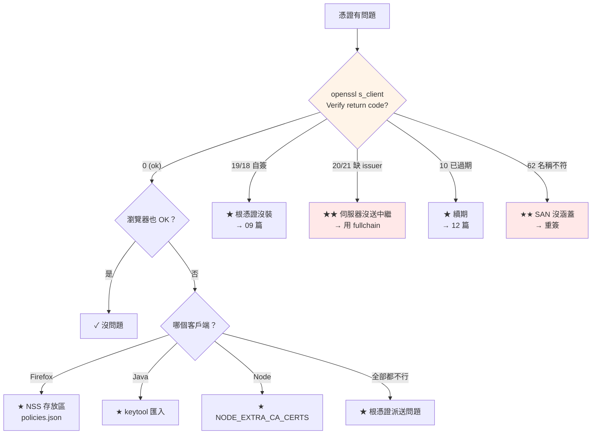

# 憑證常見問題排查

> [!abstract] 這篇你會學到
> - **排查決策樹**（三分鐘定位問題）
> - **瀏覽器錯誤碼**對照表（Chrome / Firefox / Safari）
> - **OpenSSL verify 錯誤碼**完整對照
> - 各服務的**錯誤訊息**（Nginx / Apache / Java / Node / Python / curl）
> - **一鍵診斷腳本**
> - 十個**經典案例**與解法

## 前置知識

- [[090-01-10-guide-PKI-憑證部署到各服務]] — 憑證部署
- [[090-01-11-guide-PKI-憑證格式轉換與檢視工具]] — 檢視指令

---

## 排查決策樹 ★★★



```bash
# ═══════ ★★★ 三分鐘定位 ═══════
HOST=app.example.gov.tw

# 【1】★★ 最重要的一行 —— 先看 verify code
$ echo | openssl s_client -connect "$HOST:443" -servername "$HOST" 2>&1 | \
    grep -E 'Verify return code|verify error'
Verify return code: 21 (unable to verify the first certificate)

# 【2】★ 送出了幾張憑證
$ echo | openssl s_client -connect "$HOST:443" -servername "$HOST" -showcerts 2>/dev/null | \
    grep -c 'BEGIN CERTIFICATE'
1                         # ★★ 只有 1 張 → 沒送中繼！這就是原因

# 【3】明確指定 CA 測試（排除「憑證本身有問題」）
$ curl -sv --cacert /etc/ssl/certs/ca-chain.crt "https://$HOST/" 2>&1 | grep -E 'SSL cert|subject|issuer'
# ★ 這樣可以 → 憑證沒問題，是【信任存放區】或【鏈】的問題
# ★ 這樣也不行 → 憑證本身有問題（SAN / 過期 / 不配對）
```

---

## OpenSSL verify 錯誤碼 ★★★

| 碼 | 訊息 | 意義 | 解法 |
| --- | --- | --- | --- |
| **0** | ok | ✓ 驗證通過 | — |
| **2** | unable to get issuer certificate | 找不到簽發者 | 裝根憑證 |
| **10** | certificate has expired | **憑證已過期** | 續期 → [[090-01-12-guide-PKI-憑證生命週期管理]] |
| **9** | certificate is not yet valid | 生效日還沒到 | **檢查系統時間** |
| **18** | self signed certificate | **自簽憑證** | 裝根憑證或用正式憑證 |
| **19** | self signed certificate in certificate chain | **鏈上有自簽（根）憑證但不信任** | **裝根憑證** → [[090-01-09-guide-PKI-根憑證派送與信任]] |
| **20** | unable to get local issuer certificate | 本機找不到簽發者 | 裝根憑證 / 伺服器送中繼 |
| **21** | **unable to verify the first certificate** ★★ | **伺服器沒送中繼憑證** | **`ssl_certificate` 用 fullchain** |
| **24** | invalid CA certificate | CA 憑證無效 | 檢查 `basicConstraints` |
| **26** | unsupported certificate purpose | **EKU 不符** | 用 `serverAuth` 的憑證 |
| **27** | certificate not trusted | 憑證不受信任 | 信任存放區 |
| **62** | **hostname mismatch** ★★ | **SAN 不含存取的名稱** | 重簽並加上 SAN |
| **23** | certificate revoked | **憑證已被撤銷** | 換新憑證 |
| **12** | CRL has expired | **CRL 過期** | 重新產生 CRL |
| **3** | unable to get certificate CRL | 找不到 CRL | 提供 CRL 檔 |

```bash
# ★ 完整的錯誤碼清單
$ openssl verify -help 2>&1 | head -20
$ man 1 verify | grep -A200 'DIAGNOSTICS'
```

> [!danger] 最常見的兩個：21 與 62 ★★★
> ```
> ═══ 21 = unable to verify the first certificate ═══
>   意思：客戶端拿到伺服器憑證，但【找不到簽發它的中繼憑證】
>   原因：★★ 伺服器只送了自己的憑證，沒送中繼
>   驗證：
>     echo | openssl s_client -connect host:443 -showcerts 2>/dev/null | \
>       grep -c 'BEGIN CERTIFICATE'
>     → 只有 1 = 確定就是這個問題
>   解法：
>     cat server.crt intermediate.crt > fullchain.crt
>     ssl_certificate /path/fullchain.crt;      ← ★ Nginx
>
>   ★ 為什麼瀏覽器有時候「看起來正常」？
>     → 瀏覽器會用 AIA（authorityInfoAccess）自己去抓中繼憑證
>     → 或是之前訪問別的站台時快取過那張中繼
>     → ★★ 但 curl / Java / Python 不會 → 它們會失敗
>     → 這造成「瀏覽器可以但程式不行」的詭異狀況
>
> ═══ 62 = hostname mismatch ═══
>   意思：憑證的 SAN 不包含你正在存取的主機名
>   驗證：
>     openssl x509 -in server.crt -noout -ext subjectAltName
>   常見原因：
>     · ★★★ 簽發時忘了 -extfile → 憑證【完全沒有 SAN】
>     · 只放了 CN 沒放 SAN（★ Chrome 58+ 不看 CN）
>     · 用 IP 存取但 SAN 只有 DNS 名稱
>     · 少放了 www. 或內部 FQDN
>   解法：★ 重簽（SAN 無法事後修改）
> ```

---

## 瀏覽器錯誤碼 ★★

| Chrome / Edge | Firefox | 意義 | 解法 |
| --- | --- | --- | --- |
| **`ERR_CERT_AUTHORITY_INVALID`** ★★ | `SEC_ERROR_UNKNOWN_ISSUER` | **不信任簽發的 CA** | 裝根憑證；Firefox 要另外裝 |
| **`ERR_CERT_COMMON_NAME_INVALID`** ★★★ | `SSL_ERROR_BAD_CERT_DOMAIN` | **SAN 不符** | 重簽並加 SAN |
| **`ERR_CERT_DATE_INVALID`** | `SEC_ERROR_EXPIRED_CERTIFICATE` | 過期或系統時間錯 | 續期 / **校時** |
| `ERR_CERT_REVOKED` | `SEC_ERROR_REVOKED_CERTIFICATE` | 已撤銷 | 換新憑證 |
| **`NET::ERR_CERT_WEAK_SIGNATURE_ALGORITHM`** | — | **SHA-1 簽章** | 用 SHA-256 重簽 |
| `ERR_SSL_VERSION_OR_CIPHER_MISMATCH` | `SSL_ERROR_NO_CYPHER_OVERLAP` | 協定或加密套件不符 | 檢查 `ssl_protocols` |
| **`ERR_CERT_SYMANTEC_LEGACY`** | — | 已不信任的 CA | 換 CA |
| `ERR_SSL_PROTOCOL_ERROR` | `SSL_ERROR_RX_RECORD_TOO_LONG` | **HTTP 服務在 HTTPS 埠** | 檢查 `listen 443 ssl` |
| **`ERR_CERT_INVALID`** | `SEC_ERROR_BAD_DER` | 憑證格式錯誤 | 檢查檔案 |
| `NET::ERR_CERT_VALIDITY_TOO_LONG` | — | **有效期超過 398 天** | 縮短有效期 |
| `ERR_CERT_NAME_CONSTRAINT_VIOLATION` | — | 違反 CA 的名稱限制 | 檢查 CA 的 nameConstraints |
| **`ERR_CERT_TRANSPARENCY_REQUIRED`** ★ | — | **缺 CT log**（公信 CA） | 換有 CT 的憑證 |

> [!warning] `ERR_SSL_PROTOCOL_ERROR` 常常不是憑證問題 ★
> ```
> 最常見的原因：
>   ① ★★ 用 HTTPS 連到只有 HTTP 的埠
>        server { listen 443; }        ← ★ 忘了 ssl
>        server { listen 443 ssl; }    ← ✓
>
>   ② 後端服務掛了（502 但 TLS 層先失敗）
>   ③ HTTP/2 設定問題
>   ④ 中間有設備（防火牆 / WAF / SSL 檢查）攔截
>
> ★ 驗證：
>   curl -v http://host:443/          # ★ 用 http 連 443
>   → 若有回應 → 那個埠沒有啟用 TLS
> ```

```bash
# ★★ Chrome 看詳細的憑證錯誤
#   F12 → Security 分頁 → View certificate
#   或 chrome://net-export/ 抓封包再用 netlog-viewer 分析

# ★ Chrome 忽略憑證錯誤（★ 只用於測試）
$ google-chrome --ignore-certificate-errors \
    --user-data-dir=/tmp/chrome-test https://host/

# ★ Firefox 查看
#   點網址列的鎖頭 → 連線安全性 → 更多資訊 → 檢視憑證
#   about:certificate?cert=... 直接看
```

---

## 各服務的錯誤訊息 ★★

### Nginx

| 錯誤 | 原因 | 解法 |
| --- | --- | --- |
| **`SSL_CTX_use_PrivateKey_file failed ... key values mismatch`** ★★ | 憑證與私鑰不配對 | `certtool match` 比對 |
| `cannot load certificate ... PEM_read_bio_X509_AUX` | 格式錯或檔案損壞 | 確認是 PEM；`dos2unix` |
| `no "ssl_certificate" is defined` | `listen 443 ssl` 但沒設憑證 | 補上 |
| `SSL_CTX_use_PrivateKey_file ... bad decrypt` | **私鑰有密碼** | `openssl pkey -in enc.key -out plain.key` |
| **`ssl_stapling ignored, host not found`** ★ | 內部 CA 沒有 OCSP | **關掉 `ssl_stapling`** |
| `client sent no required SSL certificate` | mTLS 沒帶客戶端憑證 | 客戶端要帶憑證 |
| **`unable to get certificate CRL`** ★ | `ssl_crl` 缺某層的 CRL | 合併所有層的 CRL |
| `SSL_do_handshake() failed ... unknown ca` | 客戶端不信任伺服器的 CA | 派送根憑證 |
| `SSL_read() failed ... http request` | **HTTP 連到 HTTPS 埠** | 客戶端用 `https://` |

```bash
# ★★ Nginx 憑證問題排查
$ sudo nginx -t                                   # 語法
$ sudo tail -50 /var/log/nginx/error.log
$ sudo journalctl -u nginx -n 50 --no-pager

# ★ 看實際載入了哪些憑證
$ sudo nginx -T 2>/dev/null | grep -E 'ssl_certificate|server_name'

# ★★ 配對檢查
$ sudo openssl x509 -in /etc/ssl/certs/app-fullchain.crt -noout -pubkey | openssl md5
$ sudo openssl pkey -in /etc/ssl/private/app.key -pubout | openssl md5
```

### Apache

| 錯誤 | 原因 | 解法 |
| --- | --- | --- |
| **`AH02561: Failed to configure certificate`** ★ | 2.4.8 前給了 fullchain | 拆成 `SSLCertificateFile` + `ChainFile` |
| `AH02572: Failed to configure at least one certificate` | 憑證或私鑰讀不到 | 檢查路徑與權限 |
| **`AH02241: Init: Unable to read server certificate`** | 格式錯 | 確認是 PEM |
| `AH01906: RSA server certificate is a CA certificate` | **裝到 CA 憑證了** | 用伺服器憑證不是 CA 憑證 |
| **`AH01909: server certificate does NOT include an ID which matches`** ★ | SAN 不含 ServerName | 重簽 |
| `AH00526: Syntax error ... SSLCertificateFile` | 檔案不存在 | 檢查路徑 |

```bash
$ sudo apache2ctl configtest
$ sudo tail -50 /var/log/apache2/error.log
$ sudo apache2ctl -t -D DUMP_VHOSTS
```

### Java

| 錯誤 | 原因 | 解法 |
| --- | --- | --- |
| **`PKIX path building failed: unable to find valid certification path`** ★★★ | **cacerts 沒有這個 CA** | `keytool -importcert` |
| `SunCertPathBuilderException` | 同上 | 同上 |
| **`No subject alternative names present`** ★★ | **憑證沒有 SAN** | 重簽並加 SAN |
| `No subject alternative DNS name matching X found` | SAN 不含該名稱 | 重簽 |
| `certificate_unknown` | 對方不信任你的憑證 | 對方要裝根憑證 |
| **`Failed to establish chain from reply`** ★ | keytool 匯入順序錯 | 根 → 中繼 → 伺服器 |
| `java.security.cert.CertificateExpiredException` | 過期 | 續期 |
| `Received fatal alert: handshake_failure` | 協定/套件不符 | 檢查 TLS 版本 |

```bash
# ★★ Java 的 TLS 除錯（最有用的一招）
$ java -Djavax.net.debug=ssl:handshake:verbose -jar app.jar 2>&1 | head -100

# ★ 只看憑證鏈
$ java -Djavax.net.debug=ssl:trustmanager -jar app.jar

# ★ 檢查 cacerts 有沒有你的 CA
$ keytool -list -keystore "$(readlink -f "$(which java)" | sed 's|/bin/java||')/lib/security/cacerts" \
    -storepass changeit | grep -i 'example gov'

# ★ Ubuntu 上通常是這個（由 update-ca-certificates 自動維護）
$ keytool -list -keystore /etc/ssl/certs/java/cacerts -storepass changeit | grep -i example
```

### Node.js

| 錯誤 | 原因 | 解法 |
| --- | --- | --- |
| **`UNABLE_TO_VERIFY_LEAF_SIGNATURE`** ★★ | **伺服器沒送中繼** | 伺服器用 fullchain |
| **`SELF_SIGNED_CERT_IN_CHAIN`** ★★ | 內部 CA 未信任 | **`NODE_EXTRA_CA_CERTS`** |
| `DEPTH_ZERO_SELF_SIGNED_CERT` | 自簽憑證 | 同上 |
| **`ERR_TLS_CERT_ALTNAME_INVALID`** ★★ | SAN 不符 | 重簽 |
| `CERT_HAS_EXPIRED` | 過期 | 續期 |
| `unable to get local issuer certificate` | 找不到簽發者 | `NODE_EXTRA_CA_CERTS` |
| `ERR_OSSL_PEM_NO_START_LINE` | 憑證檔格式錯 | 確認是 PEM |

```bash
# ★★ Node 的 TLS 除錯
$ NODE_DEBUG=tls node app.js 2>&1 | head -50

# ★ 測試信任
$ NODE_EXTRA_CA_CERTS=/usr/local/share/ca-certificates/internal-ca.crt \
    node -e "fetch('https://host/').then(r=>console.log(r.status)).catch(e=>console.error(e.code))"

# ❌❌❌ 絕對不要用
# NODE_TLS_REJECT_UNAUTHORIZED=0
```

### Python

| 錯誤 | 原因 | 解法 |
| --- | --- | --- |
| **`SSLCertVerificationError: unable to get local issuer certificate`** ★★ | certifi 沒有這個 CA | **`REQUESTS_CA_BUNDLE`** |
| **`certificate verify failed: self signed certificate in certificate chain`** | 內部 CA | 同上 |
| `certificate verify failed: Hostname mismatch` ★ | SAN 不符 | 重簽 |
| `certificate has expired` | 過期 | 續期 |
| `[SSL] PEM lib` | 憑證檔問題 | 確認格式 |

```bash
# ★★ 測試
$ REQUESTS_CA_BUNDLE=/etc/ssl/certs/ca-certificates.crt \
    python3 -c "import requests; print(requests.get('https://host/').status_code)"

# ★ 看 certifi 用的是哪個 bundle
$ python3 -c "import certifi; print(certifi.where())"

# ★ 詳細除錯
$ python3 -c "
import ssl, socket
ctx = ssl.create_default_context(cafile='/etc/ssl/certs/ca-chain.crt')
with socket.create_connection(('host', 443)) as s:
    with ctx.wrap_socket(s, server_hostname='host') as ss:
        print(ss.version(), ss.cipher())
        import pprint; pprint.pprint(ss.getpeercert())
"
```

### curl

```bash
# ★ curl 的憑證錯誤碼
$ curl https://host/ ; echo "exit=$?"
curl: (60) SSL certificate problem: unable to get local issuer certificate
exit=60

# 常見的 exit code：
#   ★★ 60 = 憑證驗證失敗（最常見）
#   51 = 遠端憑證不 OK
#   35 = SSL 連線錯誤
#   58 = 本機憑證問題（客戶端憑證）
#   77 = 讀不到 CA 憑證檔

# ★★ 詳細診斷
$ curl -vvI https://host/ 2>&1 | grep -E '^\*'
*  subject: CN=app.example.gov.tw
*  start date: Aug 28 12:00:00 2026 GMT
*  expire date: Aug 28 12:00:00 2027 GMT
*  subjectAltName: host "app.example.gov.tw" matched cert's "app.example.gov.tw"
*  issuer: CN=Example Gov Issuing CA
*  SSL certificate verify ok.

# ★ 指定 CA 測試
$ curl -v --cacert /etc/ssl/certs/ca-chain.crt https://host/

# ★ mTLS
$ curl -v --cacert ca.crt --cert client.crt --key client.key https://host/

# ❌ 只用於快速確認「是不是憑證問題」
$ curl -k https://host/
```

---

## 一鍵診斷腳本 ★★

```bash
#!/usr/bin/env bash
# /usr/local/bin/cert-doctor —— 憑證問題一鍵診斷
# 用法：cert-doctor <host[:port]> [ca-file]
set -uo pipefail

[ $# -ge 1 ] || { echo "用法：cert-doctor <host[:port]> [ca-file]"; exit 1; }
T="$1"; H="${T%%:*}"; P="${T##*:}"; [ "$P" = "$T" ] && P=443
CA="${2:-}"

echo "═══════ 憑證診斷：$H:$P ═══════"
ISSUES=()

# ══════ 【1】連線 ══════
echo -e "\n【1】連線"
if ! timeout 10 bash -c "</dev/tcp/$H/$P" 2>/dev/null; then
    echo "  ✗✗ 無法連線到 $H:$P"
    echo "     · 檢查 DNS：dig +short $H"
    echo "     · 檢查防火牆與服務是否啟動"
    dig +short "$H" 2>/dev/null | sed 's/^/       解析為 /'
    exit 1
fi
echo "  ✓ 連線正常"
dig +short "$H" 2>/dev/null | head -3 | sed 's/^/    IP: /'

# ══════ 【2】★★ TLS 握手與 verify code ══════
echo -e "\n【2】★★ TLS 握手"
OUT=$(echo | timeout 15 openssl s_client -connect "$H:$P" -servername "$H" \
      ${CA:+-CAfile "$CA"} -showcerts 2>&1)

VC=$(echo "$OUT" | grep -oP 'Verify return code: \K.*' | head -1)
PROTO=$(echo "$OUT" | grep -oP '^\s+Protocol\s+: \K.*' | head -1)
CIPHER=$(echo "$OUT" | grep -oP '^\s+Cipher\s+: \K.*' | head -1)

printf '  協定 : %s\n' "${PROTO:-?}"
printf '  套件 : %s\n' "${CIPHER:-?}"
printf '  驗證 : %s\n' "${VC:-?}"

case "$VC" in
  0*) echo "  ✓ 驗證通過" ;;
  10*) echo "  ✗✗ 憑證已過期"; ISSUES+=("憑證過期 → 續期") ;;
  9*)  echo "  ✗ 憑證尚未生效"; ISSUES+=("檢查系統時間：date -u") ;;
  18*|19*) echo "  ✗ 自簽或未信任的 CA"; ISSUES+=("★ 安裝根憑證 → 09 篇") ;;
  20*) echo "  ✗ 找不到簽發者"; ISSUES+=("★ 安裝根憑證，或伺服器沒送中繼") ;;
  21*) echo "  ✗✗ 無法驗證第一張憑證"; ISSUES+=("★★ 伺服器沒送中繼 → ssl_certificate 用 fullchain") ;;
  23*) echo "  ✗✗ 憑證已被撤銷"; ISSUES+=("★ 換新憑證") ;;
  26*) echo "  ✗ 憑證用途不符"; ISSUES+=("檢查 extendedKeyUsage 是否有 serverAuth") ;;
  62*) echo "  ✗✗ 主機名不符"; ISSUES+=("★★ SAN 不含 $H → 重簽") ;;
  12*) echo "  ✗ CRL 已過期"; ISSUES+=("重新產生 CRL") ;;
  *)   [ -n "$VC" ] && { echo "  ⚠ $VC"; ISSUES+=("$VC"); } ;;
esac

# ══════ 【3】★★ 憑證鏈 ══════
echo -e "\n【3】★★ 憑證鏈"
N=$(echo "$OUT" | grep -c 'BEGIN CERTIFICATE')
printf '  伺服器送出 %d 張憑證\n' "$N"
if [ "$N" -eq 0 ]; then
    echo "  ✗✗ 沒有收到任何憑證"
    ISSUES+=("★ 該埠可能沒有啟用 TLS（listen 443 忘了加 ssl？）")
elif [ "$N" -eq 1 ]; then
    echo "  ⚠⚠ 只有 1 張 —— ★★ 可能沒送中繼憑證"
    ISSUES+=("★★ ssl_certificate 應該用 fullchain（伺服器憑證 + 中繼）")
else
    echo "  ✓ 有送出中繼憑證"
fi
echo "$OUT" | grep -E '^\s*[0-9]+ [si]:' | sed 's/^/  /'

# ══════ 【4】★★ 憑證內容 ══════
echo -e "\n【4】★★ 憑證內容"
CERT=$(echo "$OUT" | sed -n '/BEGIN CERTIFICATE/,/END CERTIFICATE/p' | head -100)
if [ -z "$CERT" ]; then
    echo "  ✗ 無法取得憑證"
else
    TMP=$(mktemp); echo "$CERT" > "$TMP"
    openssl x509 -in "$TMP" -noout -subject -issuer -serial 2>/dev/null | sed 's/^/  /'

    # 有效期
    E=$(openssl x509 -in "$TMP" -noout -enddate | cut -d= -f2)
    S=$(openssl x509 -in "$TMP" -noout -startdate | cut -d= -f2)
    D=$(( ($(date -d "$E" +%s) - $(date +%s)) / 86400 ))
    printf '  生效 : %s\n  到期 : %s（剩 %d 天）' "$S" "$E" "$D"
    if   [ "$D" -lt 0 ];  then echo " ✗✗ 已過期"; ISSUES+=("憑證已過期 $((0-D)) 天")
    elif [ "$D" -lt 7 ];  then echo " ✗ 緊急";    ISSUES+=("★★ 剩 $D 天，立刻續期")
    elif [ "$D" -lt 30 ]; then echo " ⚠ 需續期";  ISSUES+=("★ 剩 $D 天，安排續期")
    else echo " ✓"; fi

    # ★★ SAN
    SAN=$(openssl x509 -in "$TMP" -noout -ext subjectAltName 2>/dev/null | tail -n +2 | tr -d ' ')
    if [ -z "$SAN" ]; then
        echo "  ✗✗✗ 【憑證沒有 SAN】"
        ISSUES+=("★★★ 憑證沒有 SAN —— 簽發時忘了 -extfile，必須重簽")
    else
        echo "  SAN  : $SAN"
        if echo "$SAN" | tr ',' '\n' | sed 's/^DNS://;s/^IPAddress://' | grep -qxF "$H"; then
            echo "  ✓ SAN 涵蓋 $H"
        elif echo "$SAN" | grep -q '\*\.'; then
            WC=$(echo "$SAN" | tr ',' '\n' | grep -oP 'DNS:\*\.\K.*' | head -1)
            if [ "${H#*.}" = "$WC" ]; then echo "  ✓ 萬用字元 *.$WC 涵蓋 $H"
            else echo "  ✗✗ 萬用字元不涵蓋 $H"; ISSUES+=("★★ SAN 不涵蓋 $H"); fi
        else
            echo "  ✗✗ SAN 不涵蓋 $H"
            ISSUES+=("★★ SAN 不涵蓋 $H → 重簽並加上")
        fi
    fi

    # 簽章演算法
    SIG=$(openssl x509 -in "$TMP" -noout -text | grep -m1 'Signature Algorithm' | awk '{print $NF}')
    printf '  簽章 : %s' "$SIG"
    case "$SIG" in
      *sha1*|*md5*) echo " ✗✗ 弱演算法"; ISSUES+=("★★ 使用 $SIG，必須改用 SHA-256 重簽") ;;
      *) echo " ✓" ;;
    esac

    # 金鑰
    KEY=$(openssl x509 -in "$TMP" -noout -text | grep -m1 'Public-Key:' | grep -oP '\(\K[0-9]+')
    ALG=$(openssl x509 -in "$TMP" -noout -text | grep -m1 'Public Key Algorithm' | awk '{print $NF}')
    printf '  金鑰 : %s %s bits' "$ALG" "${KEY:-?}"
    if [ "$ALG" = "rsaEncryption" ] && [ "${KEY:-2048}" -lt 2048 ]; then
        echo " ✗ 太短"; ISSUES+=("★ RSA 金鑰只有 $KEY bits，應該 ≥2048")
    else echo " ✓"; fi

    # 有效期長度
    VD=$(( ($(date -d "$E" +%s) - $(date -d "$S" +%s)) / 86400 ))
    [ "$VD" -gt 398 ] && ISSUES+=("★ 有效期 $VD 天 > 398，Safari/Chrome 可能拒絕")

    # 基本限制
    openssl x509 -in "$TMP" -noout -ext basicConstraints 2>/dev/null | grep -q 'CA:TRUE' && {
        echo "  ✗✗ 這是【CA 憑證】不是伺服器憑證"
        ISSUES+=("★★ 裝錯憑證了（CA:TRUE）")
    }

    # EKU
    EKU=$(openssl x509 -in "$TMP" -noout -ext extendedKeyUsage 2>/dev/null | tail -1 | xargs)
    [ -n "$EKU" ] && {
        printf '  EKU  : %s' "$EKU"
        echo "$EKU" | grep -q 'Server Authentication' && echo " ✓" || {
            echo " ✗"; ISSUES+=("★ 缺少 serverAuth"); }
    }
    rm -f "$TMP"
fi

# ══════ 【5】協定安全性 ══════
echo -e "\n【5】協定"
for v in tls1 tls1_1 tls1_2 tls1_3; do
    printf '  %-8s ' "$v"
    if echo | timeout 8 openssl s_client -connect "$H:$P" -servername "$H" "-$v" >/dev/null 2>&1; then
        case "$v" in
          tls1|tls1_1) echo "✗ 支援（★★ 應該停用）"; ISSUES+=("★ 仍支援 ${v}，應停用") ;;
          *) echo "✓ 支援" ;;
        esac
    else
        case "$v" in
          tls1|tls1_1) echo "✓ 已停用" ;;
          tls1_2) echo "✗ 不支援（★ 相容性問題）"; ISSUES+=("★ 不支援 TLS 1.2") ;;
          tls1_3) echo "－ 不支援（建議啟用）" ;;
        esac
    fi
done

# ══════ 【6】其他檢查 ══════
echo -e "\n【6】其他"
printf '  HTTP→HTTPS 轉址 : '
curl -sI --max-time 8 "http://$H/" 2>/dev/null | grep -qE '^HTTP.*30[128]' && echo "✓" || \
  { echo "✗"; ISSUES+=("建議設定 HTTP → HTTPS 轉址"); }

printf '  HSTS            : '
curl -sI --max-time 8 ${CA:+--cacert "$CA"} -k "https://$H/" 2>/dev/null | \
  grep -qi 'strict-transport-security' && echo "✓" || \
  { echo "✗"; ISSUES+=("建議加上 Strict-Transport-Security"); }

printf '  OCSP stapling   : '
echo "$OUT" | grep -q 'OCSP Response Status: successful' && echo "✓" || echo "－ 未啟用（內部 CA 正常）"

# ══════ 總結 ══════
echo
echo "═══════ 診斷結果 ═══════"
if [ ${#ISSUES[@]} -eq 0 ]; then
    echo "  ✓✓ 沒有發現問題"
    exit 0
fi
printf '  發現 %d 個問題：\n\n' "${#ISSUES[@]}"
i=1
for x in "${ISSUES[@]}"; do printf '  %d. %s\n' "$i" "$x"; i=$((i+1)); done

cat <<'EOF'

  ── 常用修正指令 ──
    # ★★ 沒送中繼
    cat server.crt intermediate.crt > /etc/ssl/certs/fullchain.crt
    # nginx: ssl_certificate /etc/ssl/certs/fullchain.crt;
    sudo nginx -t && sudo systemctl reload nginx

    # ★★ SAN 不對 → 重簽
    sudo issue-cert <CN> <SAN1> <SAN2> ...

    # ★ 續期
    sudo cert-renew          # 內部 CA
    sudo certbot renew       # Let's Encrypt

    # ★ 安裝根憑證
    sudo install-root-ca

    # ★ 驗證修正後的結果
    cert-doctor <host>
EOF
exit 1
```

```bash
$ sudo chmod +x /usr/local/bin/cert-doctor
$ cert-doctor app.example.gov.tw
$ cert-doctor db.internal.example.gov.tw:3306 /etc/ssl/certs/ca-chain.crt
```

---

## 十個經典案例 ★★

### 案例 1：「瀏覽器可以但 curl 不行」★★★

```bash
# 症狀
$ curl https://app.example.gov.tw/
curl: (60) SSL certificate problem: unable to get local issuer certificate

# 但 Chrome 開起來完全正常

# ★★ 原因：伺服器沒送中繼憑證
#   瀏覽器會用 AIA（authorityInfoAccess）自己去抓中繼憑證
#   或是之前訪問別的站台時快取過那張中繼
#   ★ curl / Java / Python 不會這樣做

# 診斷
$ echo | openssl s_client -connect app.example.gov.tw:443 \
    -servername app.example.gov.tw -showcerts 2>/dev/null | grep -c 'BEGIN CERT'
1                                  # ★★ 只有 1 張

# ★★ 解法
$ cat server.crt intermediate.crt | sudo tee /etc/ssl/certs/app-fullchain.crt
# nginx: ssl_certificate /etc/ssl/certs/app-fullchain.crt;
$ sudo nginx -t && sudo systemctl reload nginx

# 驗證
$ echo | openssl s_client -connect app.example.gov.tw:443 \
    -servername app.example.gov.tw -showcerts 2>/dev/null | grep -c 'BEGIN CERT'
2                                  # ✓
```

### 案例 2：「憑證沒有 SAN」★★★

```bash
# 症狀
NET::ERR_CERT_COMMON_NAME_INVALID
# Java: No subject alternative names present

# 診斷
$ openssl x509 -in server.crt -noout -ext subjectAltName
# ★★ 沒有任何輸出

# ★★★ 原因：用自建 CA 簽發時，openssl.cnf 是 copy_extensions = none
#      但簽發時忘了加 -extfile
$ sudo openssl ca -config openssl.cnf -extensions server_cert \
    -in server.csr -out server.crt          # ← ★ 少了 -extfile

# ★★ 解法：重簽（SAN 無法事後修改）
$ echo "subjectAltName = DNS:app.example.gov.tw,DNS:www.app.example.gov.tw" > san.ext
$ sudo openssl ca -config openssl.cnf -extensions server_cert \
    -extfile san.ext -in server.csr -out server.crt

# ★ 或直接用腳本（已內建這個檢查）
$ sudo issue-cert app.example.gov.tw www.app.example.gov.tw
```

### 案例 3：「續期了但沒生效」★★★

```bash
# 症狀：憑證檔案是新的，但線上還是舊的

# 診斷
$ openssl x509 -in /etc/ssl/certs/app-fullchain.crt -noout -enddate
notAfter=Aug 28 12:00:00 2027 GMT           # ★ 檔案是新的

$ echo | openssl s_client -connect app.example.gov.tw:443 \
    -servername app.example.gov.tw 2>/dev/null | openssl x509 -noout -enddate
notAfter=Sep 15 12:00:00 2026 GMT           # ★★ 線上是舊的！

# ★ 三種可能：
# ① 沒 reload
$ sudo systemctl reload nginx

# ② ★★ 設定檔指向的是【別的路徑】
$ sudo nginx -T 2>/dev/null | grep -A2 "server_name app.example.gov.tw" | grep ssl_certificate
    ssl_certificate /etc/nginx/ssl/old.crt;     # ★★ 指向舊檔案！

# ③ ★★ 負載平衡後面還有其他主機
$ for ip in 10.0.20.11 10.0.20.12 10.0.20.13; do
    printf '  %-15s ' "$ip"
    echo | openssl s_client -connect "$ip:443" -servername app.example.gov.tw 2>/dev/null | \
      openssl x509 -noout -enddate | cut -d= -f2
  done
  10.0.20.11      Aug 28 2027         # ✓
  10.0.20.12      Aug 28 2027         # ✓
  10.0.20.13      Sep 15 2026         # ★★ 這台沒更新
```

### 案例 4：「系統時間錯誤」★

```bash
# 症狀：所有 HTTPS 都失敗
NET::ERR_CERT_DATE_INVALID
# openssl: Verify return code: 9 (certificate is not yet valid)

# ★ 診斷
$ date -u
Wed Aug 28 12:00:00 UTC 2019               # ★★ 差了 7 年！

$ timedatectl
System clock synchronized: no              # ★ 沒有同步

# ★ 解法
$ sudo timedatectl set-ntp true
$ sudo systemctl restart systemd-timesyncd
$ timedatectl
System clock synchronized: yes

# ★ 常見於：
#   · 主機板電池沒電的老機器
#   · 離線環境沒有 NTP
#   · 虛擬機從快照還原
#   · 容器（★ 通常吃宿主機的時間，但某些沙箱不是）
```

### 案例 5：「Firefox 不行但 Chrome 可以」★★

```bash
# ★★ 原因：Firefox 有自己的 NSS 信任存放區

# 解法一：企業原則（可大量派送）
$ sudo mkdir -p /etc/firefox/policies
$ sudo tee /etc/firefox/policies/policies.json >/dev/null <<'EOF'
{"policies":{"Certificates":{"ImportEnterpriseRoots":true,
 "Install":["/usr/local/share/ca-certificates/internal-ca.crt"]}}}
EOF
# ★ 重啟 Firefox，用 about:policies 確認

# 解法二：about:config → security.enterprise_roots.enabled = true
```

### 案例 6：「憑證與私鑰不配對」★★

```bash
# 症狀
nginx: [emerg] SSL_CTX_use_PrivateKey_file(...) failed
  (SSL: error:0B080074:x509 certificate routines:X509_check_private_key:key values mismatch)

# ★★ 診斷
$ sudo openssl x509 -in /etc/ssl/certs/app.crt -noout -pubkey | openssl md5
(stdin)= a1b2c3...
$ sudo openssl pkey -in /etc/ssl/private/app.key -pubout | openssl md5
(stdin)= d4e5f6...                          # ★★ 不同

# ★ 常見原因：
#   · 重新產生了 CSR 但用了舊的私鑰
#   · 續期時只換憑證沒換私鑰（或反過來）
#   · 檔案複製時弄混了

# ★ 找出正確的配對
$ for k in /etc/ssl/private/*.key; do
    KM=$(sudo openssl pkey -in "$k" -pubout 2>/dev/null | openssl md5)
    for c in /etc/ssl/certs/*.crt; do
        CM=$(openssl x509 -in "$c" -noout -pubkey 2>/dev/null | openssl md5)
        [ "$KM" = "$CM" ] && echo "✓ $c ←→ $k"
    done
  done
```

### 案例 7：「mTLS 撤銷後還連得上」★★

```bash
# 症狀：撤銷了客戶端憑證，但對方還是連得進來

# ★ 診斷
$ openssl crl -in /etc/ssl/certs/all.crl.pem -noout -text | grep -A2 "$SERIAL"
    Serial Number: 1005
        Revocation Date: ...                # ★ CRL 裡確實有

# ★★ 原因：Nginx 只在【啟動時】載入 CRL，不會自動重讀
$ sudo systemctl reload nginx               # ★★ 解法

# ★ 永久解法：在 gen-crl 腳本結尾加上
cat /var/www/pki/issuing-ca.crl.pem /var/www/pki/root-ca.crl.pem \
  > /etc/ssl/certs/all.crl.pem
nginx -t && systemctl reload nginx
```

### 案例 8：「Docker 容器內憑證失效」★

```bash
# 症狀：宿主機可以，容器內不行
$ docker run --rm curlimages/curl curl https://app.internal.example.gov.tw/
curl: (60) SSL certificate problem

# ★ 原因：容器有自己的 CA bundle

# 解法一：掛載
$ docker run --rm \
    -v /etc/ssl/certs/ca-certificates.crt:/etc/ssl/certs/ca-certificates.crt:ro \
    curlimages/curl curl https://app.internal.example.gov.tw/

# 解法二：★★ 裝進映像（推薦）
# Dockerfile:
#   COPY pki/root-ca.crt /usr/local/share/ca-certificates/internal-ca.crt
#   RUN update-ca-certificates
#   ENV NODE_EXTRA_CA_CERTS=/usr/local/share/ca-certificates/internal-ca.crt

# ★★ 多階段建置：build 與 runtime 兩個階段【都要裝】
```

### 案例 9：「IP 直連拿到別站的憑證」★★

```bash
# 症狀：用 IP 或未知的 Host 存取時，拿到某個站台的憑證

$ echo | openssl s_client -connect 10.0.20.15:443 2>/dev/null | \
    openssl x509 -noout -subject
subject=CN=secret-admin.internal.example.gov.tw    # ★★ 洩漏了內部站台

# ★★ 原因：沒有設 default_server
#   → Nginx 用【第一個】listen 443 的 server 當預設

# ★ 解法
server {
    listen 443 ssl default_server;
    http2 on;
    server_name _;
    ssl_certificate     /etc/ssl/certs/default-fullchain.crt;
    ssl_certificate_key /etc/ssl/private/default.key;
    return 444;                             # ★ 直接斷線
}

$ sudo nginx -t && sudo systemctl reload nginx
```

### 案例 10：「憑證正常但 TLS 握手失敗」★

```bash
# 症狀
ERR_SSL_VERSION_OR_CIPHER_MISMATCH
# 或 SSL_ERROR_NO_CYPHER_OVERLAP

# ★ 診斷：逐一測試 TLS 版本
$ for v in tls1 tls1_1 tls1_2 tls1_3; do
    printf '%-8s ' "$v"
    echo | openssl s_client -connect host:443 -servername host "-$v" >/dev/null 2>&1 \
      && echo "✓" || echo "✗"
  done
tls1     ✗
tls1_1   ✗
tls1_2   ✗                                  # ★★ 連 1.2 都不支援
tls1_3   ✓

# ★★ 原因：ssl_protocols 只開了 TLSv1.3，舊客戶端連不上

# ★ 解法
ssl_protocols TLSv1.2 TLSv1.3;              # ★ 至少要有 1.2

# ★ 檢查支援的加密套件
$ nmap --script ssl-enum-ciphers -p 443 host
$ command -v testssl.sh >/dev/null && testssl.sh --quiet host:443
```

---

## 常見錯誤與排錯（總表）

| 現象 | 最可能的原因 | 一行解法 |
| --- | --- | --- |
| **verify code 21** ★★★ | 沒送中繼 | `ssl_certificate` 用 fullchain |
| **verify code 62 / CN_INVALID** ★★★ | SAN 不符或沒 SAN | 重簽並加 SAN |
| **verify code 19 / AUTHORITY_INVALID** ★★ | 根憑證沒裝 | `install-root-ca` |
| verify code 10 / DATE_INVALID | 過期 | `cert-renew` / `certbot renew` |
| verify code 9 | **系統時間錯** | `timedatectl set-ntp true` |
| **瀏覽器可以 curl 不行** ★★★ | 沒送中繼（瀏覽器用 AIA 補） | 同 21 |
| **Firefox 不行** ★★ | NSS 存放區 | `policies.json` |
| **Java 不行** ★★ | cacerts | `keytool -importcert` |
| **Node 不行** ★★ | 內建 bundle | `NODE_EXTRA_CA_CERTS` |
| Python 不行 ★ | certifi | `REQUESTS_CA_BUNDLE` |
| **key values mismatch** ★★ | 憑證私鑰不配對 | 比對 pubkey md5 |
| **續期了但線上是舊的** ★★★ | 沒 reload / 路徑錯 / LB | **從線上逐台驗證** |
| **IP 直連拿到別站憑證** ★★ | 沒 `default_server` | 加 `default_server` + `return 444` |
| mTLS 撤銷後還能連 ★★ | CRL 沒 reload | `systemctl reload nginx` |
| 容器內失效 ★ | 容器有自己的 bundle | Dockerfile 裝進去 |
| `ERR_SSL_PROTOCOL_ERROR` | **`listen 443` 忘了 `ssl`** | 加上 `ssl` |
| `ssl_stapling ignored` | 內部 CA 沒 OCSP | 關掉 `ssl_stapling` |
| PostgreSQL 起不來 ★ | 私鑰權限 | `postgres:postgres 600` |
| Apache `AH02561` | 2.4.8 前給了 fullchain | 拆成兩個指令 |

---

## 安全性注意事項

> [!danger] 排查時絕對不要做的事 ★★★
> ```
> ❌ curl -k / --insecure                    關閉驗證
> ❌ NODE_TLS_REJECT_UNAUTHORIZED=0          ★★★ 全域關閉
> ❌ requests.get(url, verify=False)
> ❌ 瀏覽器點「繼續前往（不安全）」
> ❌ pip install --trusted-host
> ❌ git config http.sslVerify false
>
> ★★ 這些【只能用於「快速確認是不是憑證問題」】
>    確認完必須立刻找出根因並修正
>
> ★★★ 絕對不能留在：
>    · 正式環境的設定
>    · CI/CD 腳本
>    · Dockerfile
>    · 程式碼中
>
> ★ 因為它們讓【所有】連線都不驗證，
>   包含對外的 API、付款閘道、OAuth 端點
> ```

```bash
# ★★ 檢查專案裡有沒有這些危險設定
$ grep -rn --include='*.js' --include='*.ts' --include='*.py' \
    --include='*.php' --include='*.yml' --include='*.sh' \
    --include='Dockerfile*' \
    -E 'NODE_TLS_REJECT_UNAUTHORIZED|verify=False|verify.*false|--insecure|-k |sslVerify.*false|InsecureSkipVerify' . \
  | grep -v node_modules
```

> [!warning] 排查時的資訊洩漏 ★
> ```
> ★ 貼錯誤訊息求助時要注意：
>   · 憑證內容【是公開的】→ 貼出來沒關係
>   · ★★ 【私鑰絕對不要貼】（BEGIN PRIVATE KEY）
>   · ★ 內部域名、IP、主機名 → 考慮遮蔽
>   · openssl s_client 的完整輸出可能含內部拓撲
>
> ★ 遮蔽的方式：
>   openssl x509 -in c.crt -noout -text | \
>     sed 's/internal\.example\.gov\.tw/internal.example.com/g'
> ```

---

## 速查表

### ★★★ 三分鐘定位

```bash
HOST=app.example.gov.tw

# 【1】★★ 最重要的一行
echo | openssl s_client -connect $HOST:443 -servername $HOST 2>&1 | \
  grep 'Verify return code'

# 【2】送出幾張憑證（★ 應該 ≥2）
echo | openssl s_client -connect $HOST:443 -servername $HOST -showcerts 2>/dev/null | \
  grep -c 'BEGIN CERTIFICATE'

# 【3】SAN 有沒有涵蓋
echo | openssl s_client -connect $HOST:443 -servername $HOST 2>/dev/null | \
  openssl x509 -noout -ext subjectAltName

# 【4】一鍵診斷
cert-doctor $HOST
```

### ★★★ verify 錯誤碼

```
 0  ok                                    ✓
 9  certificate is not yet valid          ★ 系統時間錯
10  certificate has expired               續期
18/19 self signed (in chain)              ★ 根憑證沒裝
20  unable to get local issuer            根憑證沒裝 / 沒送中繼
★★ 21  unable to verify first certificate  ★★ 伺服器沒送中繼
23  certificate revoked                   已撤銷
26  unsupported certificate purpose       EKU 不符
★★ 62  hostname mismatch                   ★★ SAN 不涵蓋
12  CRL has expired                       重產 CRL
```

### 瀏覽器錯誤

```
ERR_CERT_AUTHORITY_INVALID     根憑證沒裝
★★ ERR_CERT_COMMON_NAME_INVALID  SAN 不符
ERR_CERT_DATE_INVALID          過期 / 時間錯
ERR_CERT_REVOKED               已撤銷
ERR_SSL_PROTOCOL_ERROR         ★ listen 443 忘了加 ssl
ERR_SSL_VERSION_OR_CIPHER_MISMATCH  協定/套件不符
```

### 各語言的關鍵錯誤

```
Java   PKIX path building failed         → keytool -importcert
       No subject alternative names      → 憑證沒 SAN
Node   UNABLE_TO_VERIFY_LEAF_SIGNATURE   → 伺服器沒送中繼
       SELF_SIGNED_CERT_IN_CHAIN         → NODE_EXTRA_CA_CERTS
Python unable to get local issuer        → REQUESTS_CA_BUNDLE
curl   exit 60                           → 憑證驗證失敗
Nginx  key values mismatch               → 憑證私鑰不配對
```

### ★★★ 三個最常見的根因

```
① 沒送中繼 → ssl_certificate 用 fullchain
     cat server.crt intermediate.crt > fullchain.crt
     ★ 症狀：瀏覽器可以但 curl/Java/Python 不行

② 憑證沒 SAN → 簽發時忘了 -extfile
     echo "subjectAltName = DNS:host" > san.ext
     openssl ca ... -extfile san.ext ...
     ★ 症狀：ERR_CERT_COMMON_NAME_INVALID

③ 續期了但線上是舊的 → 沒 reload / 路徑錯 / LB 沒全換
     ★★ 一定要從線上逐台驗證
```

### ★★ 不吃系統存放區的清單

```
Firefox        policies.json / security.enterprise_roots.enabled
Chrome(Linux)  certutil -d sql:~/.pki/nssdb -A -t "C,,"
Java           keytool -importcert（★ 升級 JDK 要重做）
Node.js        NODE_EXTRA_CA_CERTS
Python requests REQUESTS_CA_BUNDLE
容器           Dockerfile 裝進去
Docker daemon  /etc/docker/certs.d/<registry>/ca.crt
```

### ❌ 絕對不要留在正式環境

```
curl -k / --insecure
NODE_TLS_REJECT_UNAUTHORIZED=0
requests.get(url, verify=False)
pip install --trusted-host
git config http.sslVerify false
Go 的 InsecureSkipVerify: true
```

---

## 練習題

> [!question]- 練習 1：重現三個最常見的錯誤
> 在測試環境**故意製造**：
> 1. **只給 `server.crt` 不給 fullchain** → `curl` 的錯誤碼？瀏覽器呢？
> 2. **簽發時不加 `-extfile`** → 錯誤是什麼？
> 3. **簽發一張已過期的憑證**（`-startdate`/`-enddate`）→ 錯誤是什麼？
> 4. 每一個都用 `cert-doctor` 診斷 → **有正確指出問題嗎？**
> 5. 逐一修正並驗證

> [!question]- 練習 2：「瀏覽器可以但 curl 不行」
> 1. 部署一張憑證，**只給 `server.crt`**（不含中繼）
> 2. 用 Chrome 開啟 → **成功還是失敗？**
> 3. 用 `curl` → 失敗
> 4. 用 Java / Node / Python → 各是什麼錯誤？
> 5. **為什麼瀏覽器可以？**（提示：AIA）
> 6. 用 `openssl x509 -noout -ext authorityInfoAccess` 看憑證裡的 AIA
> 7. 改用 fullchain 後全部都成功

> [!question]- 練習 3：系統時間的影響
> 1. 在一台測試機把時間調到**兩年前**
> 2. 存取任何 HTTPS 站台 → **錯誤是什麼？**
> 3. `openssl s_client` 的 verify code？
> 4. 把時間調到**兩年後** → 錯誤變成什麼？
> 5. 恢復並啟用 NTP
> 6. **在你的診斷流程中加入時間檢查**

> [!question]- 練習 4：負載平衡的續期陷阱
> 1. 用三個 server block（不同埠）模擬三台後端
> 2. **只在其中一個換憑證**
> 3. 用域名連 10 次 → **每次的到期日一樣嗎？**
> 4. 寫一個腳本逐一檢查每個後端
> 5. **設計你的「續期後驗證」流程**

> [!question]- 練習 5：完整的診斷演練
> 1. 請同事（或自己）**在測試環境隨機製造一個憑證問題**
> 2. **不看設定檔**，只用 `openssl s_client` 與 `cert-doctor` 診斷
> 3. **多久找到原因？**
> 4. 重複 5 次不同的問題
> 5. **整理出你自己的排查 SOP**（一頁 A4）
> 6. 把 `cert-doctor` 加進你的維運工具箱

---

## 小測驗

Q1. **排查憑證問題時，第一個該執行的指令是什麼**？

Q2. **verify code 21 代表什麼？怎麼解**？

Q3. **為什麼會出現「瀏覽器可以但 curl 不行」**？

Q4. **verify code 62 / `ERR_CERT_COMMON_NAME_INVALID` 的最常見根因是什麼**？

Q5. **verify code 9（尚未生效）通常代表什麼問題**？

Q6. **「續期了但線上還是舊憑證」有哪三種可能**？

Q7. **`ERR_SSL_PROTOCOL_ERROR` 最常見的原因是什麼**？

Q8. **mTLS 撤銷了客戶端憑證但對方還連得上，為什麼**？

Q9. **哪些「快速解法」絕對不能留在正式環境**？

Q10. **貼錯誤訊息求助時，哪些內容絕對不能貼**？

> [!question]- 測驗答案
> **Q1.** ```bash
> echo | openssl s_client -connect host:443 -servername host 2>&1 | grep 'Verify return code'
> ```
> **這一行會直接告訴你問題的類別**，
> 讓你不用猜是「憑證問題」「信任問題」還是「設定問題」。
> **`-servername` 不能省** —— 沒有它就不會送 SNI，
> 在多站台的伺服器上會拿到 `default_server` 的憑證，得到錯誤的結論。
> 接著看第二個指令：`-showcerts | grep -c 'BEGIN CERTIFICATE'`
> 確認伺服器送了幾張（**應該 ≥2**）。
>
> **Q2.** **21 = `unable to verify the first certificate`
> = 客戶端拿到了伺服器憑證，但找不到簽發它的中繼憑證**。
> **根因幾乎都是「伺服器只送了自己的憑證，沒送中繼」**。
> **驗證**：
> ```bash
> echo | openssl s_client -connect host:443 -showcerts 2>/dev/null | grep -c 'BEGIN CERT'
> ```
> 只有 1 張就確定是這個問題。
> **解法**：
> ```bash
> cat server.crt intermediate.crt > fullchain.crt
> # nginx: ssl_certificate /path/fullchain.crt;
> nginx -t && systemctl reload nginx
> ```
> 注意順序是**伺服器憑證在前，中繼在後**，**不含根憑證**。
>
> **Q3.** 因為**瀏覽器會用 AIA（`authorityInfoAccess`）自己去下載缺少的中繼憑證**
> —— 憑證裡有 `caIssuers;URI:http://.../issuing-ca.crt` 這個欄位，
> 瀏覽器發現鏈不完整時會自動去抓。
> 另外瀏覽器也會**快取之前訪問其他站台時看過的中繼憑證**。
> **但 curl、Java、Python、Node 都不會這樣做** ——
> 它們嚴格要求伺服器送出完整的鏈。
> **所以這個症狀本身就是診斷結果**：
> 「瀏覽器可以但程式不行」= **伺服器沒送中繼憑證**（verify code 21）。
> 這也是為什麼**不能只用瀏覽器測試 HTTPS 部署**。
>
> **Q4.** **最常見的根因是「憑證根本沒有 SAN」**，
> 而不是「SAN 內容寫錯」。
> 原因是自建 CA 的 `openssl.cnf` 設了 **`copy_extensions = none`**（正確的設定），
> **但簽發時忘了加 `-extfile`** ——
> CSR 裡的 SAN 被完全忽略，簽出來的憑證沒有 SAN 擴充。
> **Chrome 58 起完全不看 CN**，只認 SAN，所以直接拒絕。
> **驗證**：`openssl x509 -in server.crt -noout -ext subjectAltName`
> —— 沒有任何輸出就是這個問題。
> **解法只能重簽**（SAN 無法事後修改）：
> ```bash
> echo "subjectAltName = DNS:host,DNS:www.host" > san.ext
> openssl ca -config openssl.cnf -extensions server_cert -extfile san.ext ...
> ```
>
> **Q5.** **verify code 9（`certificate is not yet valid`）
> 幾乎總是「客戶端的系統時間錯了」**，
> 而不是憑證真的還沒生效。
> **檢查**：
> ```bash
> date -u
> timedatectl        # 看 "System clock synchronized"
> ```
> **常見場景**：主機板電池沒電的老機器、
> 離線環境沒有 NTP 來源、虛擬機從舊快照還原、
> 某些容器沙箱。
> **解法**：`sudo timedatectl set-ntp true`。
> **對照**：verify code 10（`has expired`）也可能是時間錯
> ——如果系統時間跑到未來，所有憑證都會顯示過期。
> 所以**診斷流程一定要包含時間檢查**。
>
> **Q6.** ①**沒有 reload 服務** —— 檔案換了但服務還載著舊的（最簡單的一種）；
> ②**設定檔指向的是別的路徑** ——
> 你換了 `/etc/ssl/certs/app.crt`，
> 但 Nginx 設定裡寫的是 `/etc/nginx/ssl/old.crt`
> （用 `nginx -T | grep ssl_certificate` 看實際載入的路徑）；
> ③**負載平衡後面還有其他主機沒更新** ——
> 用域名測試時可能連續幾次都導到已更新的機器，看起來正常。
> **診斷方式是用 IP 逐一連線**：
> ```bash
> for ip in 10.0.20.11 10.0.20.12 10.0.20.13; do
>   echo | openssl s_client -connect "$ip:443" -servername app.example.gov.tw 2>/dev/null | \
>     openssl x509 -noout -enddate
> done
> ```
>
> **Q7.** **最常見的原因不是憑證問題，而是「該埠根本沒有啟用 TLS」** ——
> Nginx 設定寫了 `listen 443;` 但**忘了加 `ssl`**：
> ```nginx
> server { listen 443; }        # ✗ 這是 HTTP 服務跑在 443 埠
> server { listen 443 ssl; }    # ✓
> ```
> 客戶端用 HTTPS 連過去，收到的是 HTTP 回應，TLS 握手直接失敗。
> **驗證**：`curl -v http://host:443/` —— 如果有正常回應，就確定是這個問題。
> **其他可能**：後端服務掛了、HTTP/2 設定問題、
> 中間有防火牆或 SSL 檢查設備攔截。
> Firefox 對應的錯誤是 `SSL_ERROR_RX_RECORD_TOO_LONG`
> （收到的資料不像 TLS record，這個訊息其實很有提示性）。
>
> **Q8.** 因為 **Nginx 只在「啟動或 reload 時」載入 `ssl_crl` 指定的 CRL 檔案，
> 之後不會自動重讀**。
> 所以「撤銷憑證 → 重新產生 CRL → 檔案已更新」之後，
> **Nginx 記憶體裡還是舊的 CRL**，被撤銷的客戶端仍然通得過。
> **解法**：`systemctl reload nginx`。
> **永久解法**：在產生 CRL 的腳本（`gen-crl`）結尾自動 reload：
> ```bash
> cat /var/www/pki/issuing-ca.crl.pem /var/www/pki/root-ca.crl.pem > /etc/ssl/certs/all.crl.pem
> nginx -t && systemctl reload nginx
> ```
> **另一個相關的坑**：`ssl_crl` 必須包含**鏈上每一層**的 CRL，
> 只給中繼的會報 `unable to get certificate CRL`。
>
> **Q9.** **`curl -k` / `--insecure`、
> `NODE_TLS_REJECT_UNAUTHORIZED=0`、
> `requests.get(url, verify=False)`、
> `pip install --trusted-host`、
> `git config http.sslVerify false`、
> Go 的 `InsecureSkipVerify: true`、
> 瀏覽器點「繼續前往（不安全）」**。
> **這些只能用於「快速確認是不是憑證問題」的排查步驟**，
> 確認完必須立刻找出根因並修正。
> **絕對不能留在**：正式環境設定、CI/CD 腳本、Dockerfile、程式碼中。
> 因為它們是**全域生效** ——
> 不只是你的內部服務，連對外的 API、付款閘道、OAuth 端點都不再驗證憑證，
> 任何中間人都能攔截與竄改。
> 定期用 grep 掃描專案：
> ```bash
> grep -rn -E 'NODE_TLS_REJECT_UNAUTHORIZED|verify=False|InsecureSkipVerify|sslVerify.*false' . | grep -v node_modules
> ```
>
> **Q10.** **私鑰絕對不能貼**（任何 `BEGIN ... PRIVATE KEY` 開頭的內容）——
> 貼出去的那一刻就等於私鑰外洩，必須撤銷憑證重簽。
> **憑證本身是公開資訊**，貼出來沒有問題
> （它本來就會在每次 TLS 握手時送給任何連線的人）。
> **需要考慮遮蔽的**：內部域名、內部 IP、主機名 ——
> 這些會洩漏內部網路拓撲；
> `openssl s_client` 的完整輸出可能包含這些資訊。
> **遮蔽方式**：
> ```bash
> openssl x509 -in c.crt -noout -text | sed 's/internal\.example\.gov\.tw/internal.example.com/g'
> ```
> 另外**錯誤日誌**也要注意 —— Nginx 的 error.log 可能含有內部路徑與 upstream 位址。

---

## 延伸閱讀

- [[090-01-12-guide-PKI-憑證生命週期管理]] — 監控與自動續期（預防勝於排查）
- [[090-01-11-guide-PKI-憑證格式轉換與檢視工具]] — 檢視與轉換指令
- [[090-01-10-guide-PKI-憑證部署到各服務]] — 各服務的正確設定
- [[090-01-09-guide-PKI-根憑證派送與信任]] — 信任存放區的差異
- [[090-01-08-guide-PKI-用自建CA簽發伺服器憑證]] — SAN 與簽發
- [[090-01-04-guide-PKI-CN與SAN設定與瀏覽器相容性]] — SAN 的規則
