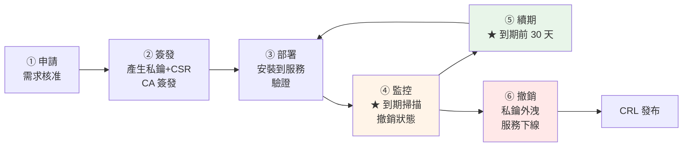

# 憑證生命週期管理

> [!abstract] 這篇你會學到
> - 憑證生命週期的**六個階段**
> - 建立與維護**憑證清冊**
> - **到期監控**（掃描 + 告警）
> - **自動續期**（公信 CA 用 ACME、內部 CA 用腳本）
> - **撤銷流程**與 CRL 發布
> - **稽核制度**與交接文件

## 前置知識

- [[10-憑證部署到各服務]] — 憑證已部署
- [[08-用自建CA簽發伺服器憑證]] — 簽發與撤銷

---

## 生命週期六階段



> [!danger] 憑證過期是最常見的線上事故 ★★★
> ```
> 真實案例（都發生過）：
>   · Microsoft Teams（2020）憑證過期 → 全球中斷數小時
>   · Ericsson（2018）憑證過期 → 英國與日本數千萬用戶斷網
>   · LinkedIn、Spotify、Cisco… 都出過同樣的事
>
> ★★ 共通原因：
>   ① 沒有清冊 → 不知道有這張憑證
>   ② 沒有監控 → 到期了才知道
>   ③ 負責人離職 → 沒人接手
>   ④ 續期了但【忘記 reload 服務】
>   ⑤ 續期了但【只換了一台】（負載平衡後面有多台）
>
> ★★★ 這一篇要解決的就是這五件事
> ```

---

## 憑證清冊 ★★

```yaml
# /etc/pki-inventory/certs.yml —— 憑證清冊（★ 納入 git 版控）
# 每次簽發／撤銷都要更新
---
- name: app.example.gov.tw
  cn: app.example.gov.tw
  san:
    - app.example.gov.tw
    - www.app.example.gov.tw
  ca: internal                      # internal | letsencrypt | digicert
  issued: 2026-08-28
  expires: 2027-08-28
  serial: "1001"
  key_type: rsa2048
  hosts:                            # ★★ 部署在哪些主機（負載平衡要列全）
    - web01.internal.example.gov.tw
    - web02.internal.example.gov.tw
  services:                         # ★ 哪些服務用到
    - nginx
  paths:
    cert: /etc/ssl/certs/app-fullchain.crt
    key:  /etc/ssl/private/app.key
  owner: 資訊室-王小明               # ★★ 負責人
  owner_email: wang@example.gov.tw
  backup_owner: 資訊室-李小華        # ★ 備援負責人
  renewal: manual                   # ★ manual | acme | script
  reload_cmd: "systemctl reload nginx"
  notes: "前後端共用一張憑證"

- name: db.internal.example.gov.tw
  cn: db.internal.example.gov.tw
  ca: internal
  issued: 2026-08-28
  expires: 2027-08-28
  serial: "1002"
  hosts: [db01.internal.example.gov.tw]
  services: [mysql]
  paths:
    cert: /etc/mysql/ssl/server-cert.pem
    key:  /etc/mysql/ssl/server-key.pem
  owner: 資訊室-陳小美
  owner_email: chen@example.gov.tw
  renewal: script
  reload_cmd: "mysql -e 'ALTER INSTANCE RELOAD TLS;'"    # ★ 免重啟

- name: www.example.gov.tw
  cn: www.example.gov.tw
  ca: letsencrypt
  expires: 2026-11-15
  hosts: [web01.internal.example.gov.tw]
  services: [nginx]
  renewal: acme                     # ★ certbot 自動
  reload_cmd: "systemctl reload nginx"
  owner: 資訊室-王小明
```

```bash
#!/usr/bin/env bash
# /usr/local/bin/pki-inventory —— 清冊查詢與檢核
set -uo pipefail
INV=/etc/pki-inventory/certs.yml

case "${1:-list}" in
list)
    printf '%-32s %-12s %-12s %-10s %s\n' "名稱" "CA" "到期" "續期" "負責人"
    printf '%.0s─' {1..90}; echo
    python3 - "$INV" <<'PY'
import sys, yaml, datetime
for c in yaml.safe_load(open(sys.argv[1])) or []:
    exp = c.get('expires', '')
    days = ''
    if exp:
        d = (datetime.date.fromisoformat(str(exp)) - datetime.date.today()).days
        days = f"{exp}({d}d)"
    print(f"{c['name']:<32} {c.get('ca',''):<12} {days:<20} "
          f"{c.get('renewal',''):<10} {c.get('owner','★ 無')}")
PY
    ;;

check)
    # ★★ 比對清冊與【實際線上】的憑證
    echo "═══ 清冊 vs 實際 ═══"
    python3 - "$INV" <<'PY'
import sys, yaml, subprocess, datetime, re
inv = yaml.safe_load(open(sys.argv[1])) or []
for c in inv:
    name = c['name']
    exp_inv = str(c.get('expires', ''))
    try:
        out = subprocess.run(
            ['bash','-c',
             f"echo | openssl s_client -connect {name}:443 -servername {name} 2>/dev/null "
             f"| openssl x509 -noout -enddate"],
            capture_output=True, text=True, timeout=15).stdout
        m = re.search(r'notAfter=(.+)', out)
        if not m:
            print(f"  ⚠ {name:<32} 無法連線")
            continue
        real = datetime.datetime.strptime(m.group(1).strip(), '%b %d %H:%M:%S %Y %Z').date()
        mark = '✓' if str(real) == exp_inv else '✗ 不一致'
        print(f"  {mark} {name:<32} 清冊={exp_inv}  實際={real}")
    except Exception as e:
        print(f"  ⚠ {name:<32} {e}")
PY
    ;;

orphan)
    # ★★ 找出【線上有但清冊沒有】的憑證（★ 影子憑證）
    echo "═══ 掃描系統上未登錄的憑證 ═══"
    KNOWN=$(python3 -c "
import yaml,sys
for c in yaml.safe_load(open('$INV')) or []:
    p=c.get('paths',{})
    print(p.get('cert',''))" 2>/dev/null)
    sudo find /etc/ssl /etc/nginx /etc/apache2 /etc/pki /etc/mysql /etc/postgresql \
        -name '*.crt' -o -name '*.pem' 2>/dev/null | while read -r f; do
        openssl x509 -in "$f" -noout >/dev/null 2>&1 || continue
        echo "$KNOWN" | grep -qxF "$f" && continue
        CN=$(openssl x509 -in "$f" -noout -subject | sed 's/.*CN *= *//;s/,.*//')
        E=$(openssl x509 -in "$f" -noout -enddate | cut -d= -f2)
        printf '  ⚠ %-45s CN=%-30s 到期=%s\n' "$f" "$CN" "$E"
    done
    ;;

owner)
    # ★ 找出沒有負責人的
    python3 - "$INV" <<'PY'
import sys, yaml
n=0
for c in yaml.safe_load(open(sys.argv[1])) or []:
    if not c.get('owner') or not c.get('owner_email'):
        print(f"  ✗ {c['name']} 沒有指定負責人"); n+=1
    if not c.get('backup_owner'):
        print(f"  ⚠ {c['name']} 沒有備援負責人")
print("  ✓ 全部都有負責人" if n==0 else f"\n  ★★ {n} 張憑證沒有負責人")
PY
    ;;

*) echo "用法：pki-inventory {list|check|orphan|owner}" ;;
esac
```

> [!danger] 「影子憑證」是最大的風險 ★★★
> ```
> 影子憑證 = 【線上有在用，但清冊裡沒有】的憑證
>
> 來源：
>   · 同事臨時簽了一張測試用，忘了登記
>   · 前任離職前簽的，沒交接
>   · 供應商幫忙裝的
>   · 專案結束但服務還在跑
>
> ★★★ 後果：沒有人監控它 → 它一定會過期 → 突然的線上事故
>
> ★★ 解法：
>   ① 定期執行 pki-inventory orphan（掃描檔案系統）
>   ② ★ 定期掃描網段的 443 埠（見下方）
>   ③ ★★ 對照 CA 的 index.txt（內部 CA 才知道自己簽了什麼）
>   ④ 公信 CA 的憑證查 CT log（crt.sh）
> ```

```bash
# ★★ 網段掃描：找出所有在跑 HTTPS 的服務
$ sudo tee /usr/local/bin/scan-tls >/dev/null <<'EOF'
#!/usr/bin/env bash
# 掃描網段找出所有 TLS 服務與其憑證
NET="${1:-10.0.20.0/24}"
PORTS="${2:-443,8443,3306,5432,6379,636,993,995}"

echo "═══ 掃描 $NET 的 TLS 服務 ═══"
nmap -p "$PORTS" --open -oG - "$NET" 2>/dev/null | grep '^Host:' | \
while read -r _ ip _ _ _ ports; do
    echo "$ports" | tr ',' '\n' | grep -o '^[0-9]*' | while read -r p; do
        [ -z "$p" ] && continue
        OUT=$(echo | timeout 5 openssl s_client -connect "$ip:$p" 2>/dev/null | \
              openssl x509 -noout -subject -enddate 2>/dev/null)
        [ -z "$OUT" ] && continue
        CN=$(echo "$OUT" | grep subject | sed 's/.*CN *= *//;s/,.*//')
        E=$(echo "$OUT"  | grep notAfter | cut -d= -f2)
        D=$(( ($(date -d "$E" +%s) - $(date +%s)) / 86400 ))
        printf '  %-16s :%-6s %-35s %4dd %s\n' "$ip" "$p" "${CN:0:34}" "$D" \
          "$( [ "$D" -lt 30 ] && echo '⚠' )"
    done
done
EOF
$ sudo chmod +x /usr/local/bin/scan-tls && sudo scan-tls 10.0.20.0/24
```

---

## 到期監控 ★★

```bash
#!/usr/bin/env bash
# /usr/local/bin/cert-monitor —— 憑證到期監控
# 用法：cert-monitor [警告天數]
#      cert-monitor 30 --json
set -uo pipefail

WARN="${1:-30}"
CRIT=7
JSON=0
[[ "${2:-}" == "--json" ]] && JSON=1

# ★ 監控目標（可從清冊或這個檔案讀）
TARGETS_FILE=/etc/pki-inventory/targets.txt
# 格式：host:port  或  /path/to/cert.pem

CRITICAL=(); WARNING=(); EXPIRED=(); OK=()

check_target() {
    local t="$1" enddate=''
    if [[ "$t" == /* ]]; then
        enddate=$(openssl x509 -in "$t" -noout -enddate 2>/dev/null | cut -d= -f2)
    else
        local h="${t%%:*}" p="${t##*:}"
        [ "$p" = "$t" ] && p=443
        enddate=$(echo | timeout 10 openssl s_client -connect "$h:$p" \
                    -servername "$h" 2>/dev/null | \
                  openssl x509 -noout -enddate 2>/dev/null | cut -d= -f2)
    fi
    [ -z "$enddate" ] && { echo "UNREACHABLE|$t|"; return; }
    local days=$(( ($(date -d "$enddate" +%s) - $(date +%s)) / 86400 ))
    if   [ "$days" -lt 0 ];      then echo "EXPIRED|$t|$days|$enddate"
    elif [ "$days" -lt "$CRIT" ];then echo "CRITICAL|$t|$days|$enddate"
    elif [ "$days" -lt "$WARN" ];then echo "WARNING|$t|$days|$enddate"
    else                              echo "OK|$t|$days|$enddate"; fi
}

# ══ 收集目標 ══
TARGETS=()
[ -f "$TARGETS_FILE" ] && while read -r l; do
    [[ -z "$l" || "$l" == \#* ]] && continue
    TARGETS+=("$l")
done < "$TARGETS_FILE"

# ★ 自動加上本機所有 Nginx / Apache 的憑證
while read -r c; do
    [ -f "$c" ] && TARGETS+=("$c")
done < <(
  { sudo grep -rhoP '(?<=ssl_certificate\s)[^;]+' /etc/nginx/ 2>/dev/null
    sudo grep -rhoP '(?<=SSLCertificateFile\s)\S+' /etc/apache2/ /etc/httpd/ 2>/dev/null
  } | tr -d '"' | sed 's/^ *//;s/ *$//' | sort -u
)

# ══ 檢查 ══
RESULTS=()
for t in $(printf '%s\n' "${TARGETS[@]}" | sort -u); do
    RESULTS+=("$(check_target "$t")")
done

# ══ 輸出 ══
if [ "$JSON" = 1 ]; then
    echo '{"checked":'"${#RESULTS[@]}"',"certs":['
    first=1
    for r in "${RESULTS[@]}"; do
        IFS='|' read -r st tg dy ed <<< "$r"
        [ "$first" = 1 ] && first=0 || echo ','
        printf '  {"target":"%s","status":"%s","days":%s,"expires":"%s"}' \
          "$tg" "$st" "${dy:-null}" "${ed:-}"
    done
    echo ']}'
    exit 0
fi

printf '%-45s %-10s %6s  %s\n' "目標" "狀態" "剩餘" "到期日"
printf '%.0s─' {1..90}; echo

EXIT=0
for r in $(printf '%s\n' "${RESULTS[@]}" | sort -t'|' -k3 -n); do
    IFS='|' read -r st tg dy ed <<< "$r"
    case "$st" in
      EXPIRED)     M="✗✗ 已過期"; EXIT=2 ;;
      CRITICAL)    M="✗ 緊急";    EXIT=2 ;;
      WARNING)     M="⚠ 需續期";  [ "$EXIT" -lt 1 ] && EXIT=1 ;;
      UNREACHABLE) M="? 無法連線"; [ "$EXIT" -lt 1 ] && EXIT=1 ;;
      *)           M="✓" ;;
    esac
    printf '%-45s %-10s %5sd  %s\n' "${tg:0:44}" "$M" "${dy:-—}" "${ed:-—}"
done

echo
E=$(printf '%s\n' "${RESULTS[@]}" | grep -c '^EXPIRED' || true)
C=$(printf '%s\n' "${RESULTS[@]}" | grep -c '^CRITICAL' || true)
W=$(printf '%s\n' "${RESULTS[@]}" | grep -c '^WARNING' || true)
echo "  已過期 $E ／ 緊急 $C ／ 需續期 $W ／ 共 ${#RESULTS[@]} 張"
[ "$EXIT" -ne 0 ] && echo -e "\n  ★★ 續期：sudo issue-cert <CN> [SAN...]"
exit "$EXIT"
```

```bash
$ sudo chmod +x /usr/local/bin/cert-monitor
$ sudo tee /etc/pki-inventory/targets.txt >/dev/null <<'EOF'
# host:port 或 憑證檔路徑
app.example.gov.tw:443
api.example.gov.tw:443
db.internal.example.gov.tw:3306
www.example.gov.tw:443
/etc/mysql/ssl/server-cert.pem
EOF

$ sudo cert-monitor 45
目標                                          狀態         剩餘  到期日
──────────────────────────────────────────────────────────────────────────────────
www.example.gov.tw:443                        ⚠ 需續期      18d  Sep 15 2026
app.example.gov.tw:443                        ✓            365d  Aug 28 2027
api.example.gov.tw:443                        ✓            365d  Aug 28 2027
db.internal.example.gov.tw:3306               ✓            365d  Aug 28 2027

  已過期 0 ／ 緊急 0 ／ 需續期 1 ／ 共 4 張
```

### 排程與告警 ★★

```bash
# ★★ 每天檢查
$ sudo tee /etc/cron.d/cert-monitor >/dev/null <<'EOF'
# 每天 08:00 檢查，只在有問題時寄信
0 8 * * * root /usr/local/bin/cert-monitor 30 > /tmp/certmon.txt 2>&1 || \
  mail -s "【警告】憑證即將到期 - $(hostname)" pki@example.gov.tw < /tmp/certmon.txt

# ★ 每週一發完整報表（不管有沒有問題）
0 9 * * 1 root /usr/local/bin/cert-monitor 60 | \
  mail -s "【週報】憑證狀態 - $(hostname)" pki@example.gov.tw
EOF
```

```ini
# ★ 用 systemd timer（比 cron 更好觀察）
# /etc/systemd/system/cert-monitor.service
[Unit]
Description=憑證到期監控

[Service]
Type=oneshot
ExecStart=/usr/local/bin/cert-monitor 30
StandardOutput=journal
StandardError=journal
```

```ini
# /etc/systemd/system/cert-monitor.timer
[Unit]
Description=每天執行憑證到期監控

[Timer]
OnCalendar=daily
Persistent=true                  # ★ 開機時補跑錯過的
RandomizedDelaySec=1h            # ★ 分散負載

[Install]
WantedBy=timers.target
```

```bash
$ sudo systemctl enable --now cert-monitor.timer
$ systemctl list-timers cert-monitor.timer
$ journalctl -u cert-monitor.service -n 30 --no-pager
```

### 整合監控系統

```yaml
# ★ Prometheus blackbox_exporter
# blackbox.yml
modules:
  http_2xx_tls:
    prober: http
    timeout: 10s
    http:
      tls_config:
        ca_file: /etc/ssl/certs/ca-chain.crt
      fail_if_not_ssl: true
```

```yaml
# prometheus.yml
scrape_configs:
  - job_name: blackbox-tls
    metrics_path: /probe
    params:
      module: [http_2xx_tls]
    static_configs:
      - targets:
          - https://app.example.gov.tw
          - https://api.example.gov.tw
    relabel_configs:
      - source_labels: [__address__]
        target_label: __param_target
      - source_labels: [__param_target]
        target_label: instance
      - target_label: __address__
        replacement: 127.0.0.1:9115
```

```yaml
# ★★ 告警規則
groups:
  - name: tls
    rules:
      - alert: 憑證即將到期
        expr: (probe_ssl_earliest_cert_expiry - time()) / 86400 < 30
        for: 1h
        labels: { severity: warning }
        annotations:
          summary: "{{ $labels.instance }} 的憑證將在 {{ $value | humanize }} 天後到期"

      - alert: 憑證緊急
        expr: (probe_ssl_earliest_cert_expiry - time()) / 86400 < 7
        for: 10m
        labels: { severity: critical }
        annotations:
          summary: "★★ {{ $labels.instance }} 的憑證剩不到 7 天"

      - alert: 憑證已過期
        expr: probe_ssl_earliest_cert_expiry - time() < 0
        for: 1m
        labels: { severity: critical }
```

```bash
# ★ Uptime Kuma（最簡單的方案）
# 新增監控 → 類型：HTTP(s) → 勾選「憑證到期通知」→ 設定天數
# ★ 支援 Telegram / Discord / Email / Webhook
```

---

## 自動續期 ★★

### 公信 CA：ACME（certbot）

```bash
# ═══ ★★ certbot 的自動續期 ═══
$ sudo certbot renew --dry-run          # ★ 先測試

# ★ certbot 安裝時就會建立 systemd timer
$ systemctl list-timers certbot.timer
NEXT                        LEFT     UNIT           ACTIVATES
Thu 2026-08-29 03:12:00 CST 15h left certbot.timer  certbot.service

# ★★ 續期後的 hook（自動 reload 服務）
$ sudo mkdir -p /etc/letsencrypt/renewal-hooks/deploy
$ sudo tee /etc/letsencrypt/renewal-hooks/deploy/reload-services.sh >/dev/null <<'EOF'
#!/usr/bin/env bash
# ★ certbot 續期成功後自動執行
set -e
logger -t certbot-hook "續期成功：$RENEWED_DOMAINS"

# ★★ 只有語法正確才 reload
if nginx -t 2>/dev/null; then
    systemctl reload nginx
    logger -t certbot-hook "nginx 已 reload"
else
    logger -t certbot-hook "★★ nginx 設定有誤，未 reload"
    exit 1
fi

# ★ 其他服務
systemctl is-active --quiet postfix && systemctl reload postfix
systemctl is-active --quiet haproxy && systemctl reload haproxy
EOF
$ sudo chmod +x /etc/letsencrypt/renewal-hooks/deploy/reload-services.sh
```

> [!danger] certbot 的三個常見失敗 ★★
> ```
> ① ★★ 續期成功但【沒有 reload 服務】
>      → 服務還在用舊憑證 → 過期後才發現
>      → 解法：deploy hook（★ 一定要設）
>
> ② ★ webroot 驗證失敗
>      Nginx 把 /.well-known/ 導去別的地方了
>      → 確保有：
>        location ^~ /.well-known/acme-challenge/ {
>            root /var/www/certbot;
>            default_type "text/plain";
>        }
>      → ★ 用 ^~ 讓它優先於正規表示式的 location
>
> ③ ★★ 續期【太晚】
>      Let's Encrypt 憑證 90 天，certbot 在剩 30 天時才續
>      → 若續期失敗，只有 30 天可以處理
>      → ★ 監控要在【剩 25 天】就告警（比 certbot 的觸發點更早警覺）
> ```

```nginx
# ★★ 讓 ACME 驗證能通過的 Nginx 設定
server {
    listen 80;
    server_name www.example.gov.tw;

    # ★★ 這個 location 必須在轉址【之前】
    location ^~ /.well-known/acme-challenge/ {
        root /var/www/certbot;
        default_type "text/plain";
        allow all;
    }

    location / {
        return 301 https://$host$request_uri;
    }
}
```

### 內部 CA：續期腳本 ★★

```bash
#!/usr/bin/env bash
# /usr/local/bin/cert-renew —— 內部 CA 的自動續期
# 用法：cert-renew [--dry-run] [--days 30]
set -uo pipefail

INV=/etc/pki-inventory/certs.yml
RENEW_BEFORE=30
DRY=0
LOG=/var/log/cert-renew.log

while [ $# -gt 0 ]; do
    case "$1" in
        --dry-run) DRY=1 ;;
        --days) RENEW_BEFORE="$2"; shift ;;
    esac; shift
done

log() { echo "[$(date -Is)] $*" | tee -a "$LOG"; }

log "═══ 憑證續期檢查（門檻 $RENEW_BEFORE 天，dry-run=$DRY）═══"

RENEWED=(); FAILED=()

# ★ 讀清冊中 renewal: script 的項目
python3 - "$INV" <<'PY' | while IFS='|' read -r NAME SANS CERT KEY RELOAD OWNER; do
import sys, yaml
for c in yaml.safe_load(open(sys.argv[1])) or []:
    if c.get('renewal') != 'script': continue
    p = c.get('paths', {})
    print('|'.join([
        c['name'],
        ' '.join(c.get('san', []) or [c['name']]),
        p.get('cert',''), p.get('key',''),
        c.get('reload_cmd',''), c.get('owner_email','')
    ]))
PY
    [ -z "$NAME" ] && continue
    [ -f "$CERT" ] || { log "  ⚠ $NAME：找不到 $CERT"; continue; }

    E=$(openssl x509 -in "$CERT" -noout -enddate | cut -d= -f2)
    D=$(( ($(date -d "$E" +%s) - $(date +%s)) / 86400 ))

    if [ "$D" -gt "$RENEW_BEFORE" ]; then
        log "  ✓ $NAME：剩 $D 天，不需續期"
        continue
    fi

    log "  ★ $NAME：剩 $D 天，開始續期"
    if [ "$DRY" = 1 ]; then
        log "    [dry-run] sudo issue-cert $SANS"
        continue
    fi

    # ══ ① 備份舊憑證 ══
    TS=$(date +%Y%m%d%H%M%S)
    cp "$CERT" "$CERT.bak-$TS"
    [ -f "$KEY" ] && cp "$KEY" "$KEY.bak-$TS"

    # ══ ② 簽發新憑證 ══
    if ! sudo issue-cert $SANS >>"$LOG" 2>&1; then
        log "    ✗✗ 簽發失敗"
        FAILED+=("$NAME")
        continue
    fi

    SAFE=$(echo "$NAME" | tr -c 'a-zA-Z0-9.-' '_')
    NEW_CERT="/etc/ssl/issued/$SAFE-fullchain.crt"
    NEW_KEY="/etc/ssl/issued/$SAFE.key"

    # ══ ★★ ③ 驗證新憑證 ══
    A=$(openssl x509 -in "$NEW_CERT" -noout -pubkey | openssl md5)
    B=$(openssl pkey -in "$NEW_KEY" -pubout 2>/dev/null | openssl md5)
    if [ "$A" != "$B" ]; then
        log "    ✗✗ 新憑證與私鑰不配對，中止"
        FAILED+=("$NAME"); continue
    fi
    if ! openssl x509 -in "$NEW_CERT" -noout -ext subjectAltName | grep -q ':'; then
        log "    ✗✗ 新憑證沒有 SAN，中止"
        FAILED+=("$NAME"); continue
    fi

    # ══ ④ 部署 ══
    install -m 644 "$NEW_CERT" "$CERT"
    install -m 600 "$NEW_KEY"  "$KEY"

    # ══ ★★ ⑤ 語法檢查再 reload ══
    OK=1
    if [[ "$RELOAD" == *nginx* ]] && ! nginx -t 2>>"$LOG"; then
        log "    ✗✗ nginx -t 失敗，回退"
        cp "$CERT.bak-$TS" "$CERT"; [ -f "$KEY.bak-$TS" ] && cp "$KEY.bak-$TS" "$KEY"
        OK=0
    fi
    if [ "$OK" = 1 ] && [ -n "$RELOAD" ]; then
        if eval "$RELOAD" >>"$LOG" 2>&1; then
            log "    ✓ 已 reload：$RELOAD"
        else
            log "    ✗ reload 失敗"; OK=0
        fi
    fi

    # ══ ★★ ⑥ 驗證線上真的換了 ══
    if [ "$OK" = 1 ]; then
        sleep 2
        ONLINE=$(echo | openssl s_client -connect "$NAME:443" -servername "$NAME" 2>/dev/null | \
                 openssl x509 -noout -enddate 2>/dev/null | cut -d= -f2)
        NEW_E=$(openssl x509 -in "$CERT" -noout -enddate | cut -d= -f2)
        if [ "$ONLINE" = "$NEW_E" ]; then
            log "    ✓✓ 線上已確認為新憑證（到期 $NEW_E）"
            RENEWED+=("$NAME")
        else
            log "    ⚠ 線上憑證與檔案不一致（線上=$ONLINE 檔案=$NEW_E）"
            log "      ★ 可能是負載平衡後面還有其他主機沒更新"
            FAILED+=("$NAME")
        fi
    else
        FAILED+=("$NAME")
    fi

    # ══ ⑦ 撤銷舊憑證 ══
    OLD_SERIAL=$(openssl x509 -in "$CERT.bak-$TS" -noout -serial 2>/dev/null | cut -d= -f2)
    if [ "$OK" = 1 ] && [ -n "$OLD_SERIAL" ]; then
        sudo openssl ca -config /root/ca/issuing-ca/openssl.cnf \
          -revoke "/root/ca/issuing-ca/newcerts/$OLD_SERIAL.pem" \
          -crl_reason superseded >>"$LOG" 2>&1 && \
          log "    ✓ 舊憑證 $OLD_SERIAL 已撤銷（superseded）"
    fi

    # ══ ⑧ 更新清冊 ══
    NEW_SERIAL=$(openssl x509 -in "$CERT" -noout -serial | cut -d= -f2)
    NEW_EXP=$(date -d "$(openssl x509 -in "$CERT" -noout -enddate | cut -d= -f2)" +%F)
    python3 - "$INV" "$NAME" "$NEW_SERIAL" "$NEW_EXP" <<'PY'
import sys, yaml, datetime
f, name, serial, exp = sys.argv[1:5]
data = yaml.safe_load(open(f)) or []
for c in data:
    if c['name'] == name:
        c['serial'] = serial
        c['expires'] = exp
        c['issued'] = str(datetime.date.today())
yaml.safe_dump(data, open(f,'w'), allow_unicode=True, sort_keys=False)
PY
    log "    ✓ 清冊已更新"
done

# ══ 產生 CRL ══
[ "$DRY" = 0 ] && sudo /usr/local/bin/gen-crl >>"$LOG" 2>&1 && log "  ✓ CRL 已更新"

log "═══ 完成 ═══"
```

```bash
$ sudo chmod +x /usr/local/bin/cert-renew

# ★★ 先 dry-run
$ sudo cert-renew --dry-run

# ★ 排程（每天檢查）
$ sudo tee /etc/cron.d/cert-renew >/dev/null <<'EOF'
30 3 * * * root /usr/local/bin/cert-renew --days 30 || \
  mail -s "【失敗】憑證自動續期" pki@example.gov.tw < /var/log/cert-renew.log
EOF
```

> [!danger] 續期流程的六個必要檢查 ★★★
> ```
> ① ★ 備份舊憑證（能回退）
> ② ★★ 驗證新憑證與私鑰【配對】
> ③ ★★ 驗證新憑證【有 SAN】
> ④ ★★ reload 前先【語法檢查】（nginx -t）
> ⑤ ★★★ reload 後【從線上驗證真的換了】
>      → 這一步最常被省略，也是最重要的
>      → 負載平衡後面有多台時，這裡才會發現「只換了一台」
> ⑥ 撤銷舊憑證（superseded）+ 更新 CRL + 更新清冊
> ```

---

## 撤銷流程

```bash
#!/usr/bin/env bash
# /usr/local/bin/cert-revoke —— 撤銷憑證的標準流程
set -euo pipefail

INT_CA=/root/ca/issuing-ca
INV=/etc/pki-inventory/certs.yml

[ $# -ge 1 ] || { cat <<'EOF'
用法：cert-revoke <CN 或 序號> [原因]

  原因（預設 superseded）：
    ★★ keyCompromise      私鑰外洩（最嚴重）
    ★ superseded          被新憑證取代
    cessationOfOperation  服務停止
    affiliationChanged    組織變更
    certificateHold       ★ 暫時停用（可取消）
EOF
exit 1; }

TARGET="$1"; REASON="${2:-superseded}"

# ══ 找出序號 ══
if [[ "$TARGET" =~ ^[0-9A-Fa-f]+$ ]] && [ -f "$INT_CA/newcerts/$TARGET.pem" ]; then
    SERIAL="$TARGET"
else
    SERIAL=$(sudo awk -F'\t' -v cn="CN=$TARGET" '$1=="V" && $6 ~ cn {print $4}' \
             "$INT_CA/index.txt" | tail -1)
fi
[ -n "$SERIAL" ] || { echo "✗ 找不到 $TARGET 的有效憑證"; exit 1; }

CERT="$INT_CA/newcerts/$SERIAL.pem"
[ -f "$CERT" ] || { echo "✗ 找不到 $CERT"; exit 1; }

echo "═══ 撤銷憑證 ═══"
sudo openssl x509 -in "$CERT" -noout -subject -serial -dates | sed 's/^/  /'
echo "  原因：$REASON"
echo

if [ "$REASON" = "keyCompromise" ]; then
cat <<'EOF'
  ★★★ keyCompromise 的額外步驟：
    □ 確認私鑰確實外洩（或有合理懷疑）
    □ 【立刻】更換該服務的私鑰與憑證（不要等）
    □ 檢視該私鑰可能被用於哪些連線
    □ 檢查是否有異常的存取紀錄
    □ 記錄事件並通報資安窗口
EOF
echo
fi

read -rp "確認撤銷？(yes/no) " a; [ "$a" = yes ] || { echo "已取消"; exit 0; }

# ══ ① 撤銷 ══
sudo openssl ca -config "$INT_CA/openssl.cnf" -revoke "$CERT" -crl_reason "$REASON"
echo "  ✓ 已撤銷"

# ══ ★★ ② 重新產生並發布 CRL ══
sudo /usr/local/bin/gen-crl
echo "  ✓ CRL 已更新並發布"

# ══ ★★ ③ 通知使用 CRL 的服務重載 ══
echo "  ★ 重載使用 ssl_crl 的服務"
if [ -f /etc/ssl/certs/all.crl.pem ]; then
    sudo bash -c "cat /var/www/pki/issuing-ca.crl.pem /var/www/pki/root-ca.crl.pem \
      > /etc/ssl/certs/all.crl.pem" 2>/dev/null || true
fi
sudo nginx -t 2>/dev/null && sudo systemctl reload nginx && echo "    ✓ nginx"

# ══ ④ 更新清冊 ══
python3 - "$INV" "$SERIAL" "$REASON" <<'PY' 2>/dev/null || true
import sys, yaml, datetime
f, serial, reason = sys.argv[1:4]
data = yaml.safe_load(open(f)) or []
for c in data:
    if str(c.get('serial')) == serial:
        c['revoked'] = str(datetime.date.today())
        c['revoke_reason'] = reason
yaml.safe_dump(data, open(f,'w'), allow_unicode=True, sort_keys=False)
PY
echo "  ✓ 清冊已更新"

# ══ ⑤ 記錄 ══
sudo tee -a /var/log/pki-revoke.log >/dev/null <<EOF
$(date -Is) 撤銷 序號=$SERIAL 原因=$REASON 操作者=${SUDO_USER:-$USER}
  $(sudo openssl x509 -in "$CERT" -noout -subject)
EOF

cat <<EOF

  ★★ 後續確認：
    ① 確認該服務已改用新憑證（或已下線）
    ② 確認所有使用 ssl_crl 的服務都重載了
    ③ 從客戶端驗證撤銷有生效：
         openssl crl -in /var/www/pki/issuing-ca.crl.pem -noout -text | grep -A2 $SERIAL
EOF
```

---

## 稽核與交接 ★★

```bash
#!/usr/bin/env bash
# /usr/local/bin/pki-audit —— PKI 季度稽核
set -uo pipefail
INT_CA=/root/ca/issuing-ca
ROOT_CA=/root/ca/root-ca
INV=/etc/pki-inventory/certs.yml
R=/var/log/pki-audit-$(date +%Y%m%d).txt

exec > >(tee "$R") 2>&1

echo "═══════ PKI 稽核報告 $(date +%F) ═══════"

echo -e "\n【1】★★ CA 狀態"
for ca in "$ROOT_CA/certs/ca.cert.pem" "$INT_CA/certs/intermediate.cert.pem"; do
    [ -f "$ca" ] || { echo "  ✗ 找不到 $ca"; continue; }
    CN=$(sudo openssl x509 -in "$ca" -noout -subject | sed 's/.*CN *= *//;s/,.*//')
    E=$(sudo openssl x509 -in "$ca" -noout -enddate | cut -d= -f2)
    D=$(( ($(date -d "$E" +%s) - $(date +%s)) / 86400 ))
    printf '  %-32s 剩餘 %5d 天  %s\n' "$CN" "$D" \
      "$( [ "$D" -lt 1095 ] && echo '⚠★ 三年內到期，開始規劃換發' )"
done

echo -e "\n【2】★★★ 根 CA 私鑰是否離線"
if sudo test -f "$ROOT_CA/private/ca.key.pem"; then
    echo "  ✗✗ 根 CA 私鑰【還在線上】！"
    echo "     → 應該離線保管，只在簽發中繼 CA 時取出"
else
    echo "  ✓ 根 CA 私鑰不在線上"
fi

echo -e "\n【3】★★ CRL 狀態"
for c in /var/www/pki/*.crl.pem; do
    [ -f "$c" ] || continue
    N=$(openssl crl -in "$c" -noout -nextupdate | cut -d= -f2)
    D=$(( ($(date -d "$N" +%s) - $(date +%s)) / 86400 ))
    R_=$(openssl crl -in "$c" -noout -text | grep -c 'Serial Number' || echo 0)
    printf '  %-30s 剩 %3d 天  已撤銷 %s %s\n' "$(basename "$c")" "$D" "$R_" \
      "$( [ "$D" -lt 7 ] && echo '★★ 即將過期！' )"
done

echo -e "\n【4】★ 已簽發憑證統計"
if sudo test -f "$INT_CA/index.txt"; then
    sudo awk -F'\t' '{c[$1]++} END {
        printf "  有效(V)   %d\n  已撤銷(R) %d\n  已過期(E) %d\n", c["V"], c["R"], c["E"]}' \
        "$INT_CA/index.txt"
fi

echo -e "\n【5】★★ 到期檢查"
/usr/local/bin/cert-monitor 60 2>/dev/null | tail -n +3

echo -e "\n【6】★★★ 影子憑證（線上有但清冊沒有）"
/usr/local/bin/pki-inventory orphan 2>/dev/null | tail -n +2

echo -e "\n【7】★★ 負責人檢查"
/usr/local/bin/pki-inventory owner 2>/dev/null

echo -e "\n【8】★ 清冊與實際的一致性"
/usr/local/bin/pki-inventory check 2>/dev/null | tail -n +2

echo -e "\n【9】★★ 私鑰權限與外洩"
/usr/local/bin/check-key-exposure 2>/dev/null | grep -E '✗|⚠' || echo "  ✓ 沒有問題"

echo -e "\n【10】★★ index.txt 的新增簽發（自上次稽核）"
BASE=/var/lib/pki/issued-baseline.txt
sudo mkdir -p /var/lib/pki
if sudo test -f "$BASE"; then
    DIFF=$(sudo diff "$BASE" "$INT_CA/index.txt" 2>/dev/null | grep '^>' || true)
    if [ -n "$DIFF" ]; then
        echo "  ★ 新增的簽發（請確認每一筆都經過核准）："
        echo "$DIFF" | awk -F'\t' '{printf "    %s %s %s\n", $1, $4, $6}'
    else
        echo "  ✓ 沒有新的簽發"
    fi
else
    echo "  ★ 首次稽核，建立基準"
fi
sudo cp "$INT_CA/index.txt" "$BASE" 2>/dev/null || true

echo -e "\n【11】★ 備份狀態"
LATEST=$(ls -t /backup/issuing-ca-*.tar.gz.enc 2>/dev/null | head -1)
if [ -n "$LATEST" ]; then
    AGE=$(( ($(date +%s) - $(stat -c %Y "$LATEST")) / 86400 ))
    printf '  最新備份：%s（%d 天前）%s\n' "$(basename "$LATEST")" "$AGE" \
      "$( [ "$AGE" -gt 90 ] && echo '⚠ 太舊' )"
else
    echo "  ✗✗ 找不到 CA 備份"
fi

echo -e "\n═══ 報告：$R ═══"
```

```bash
# ★ 每季稽核
$ sudo tee /etc/cron.d/pki-audit >/dev/null <<'EOF'
0 9 1 1,4,7,10 * root /usr/local/bin/pki-audit | \
  mail -s "【季報】PKI 稽核報告" pki@example.gov.tw ciso@example.gov.tw
EOF
```

### 交接文件範本

```markdown
# PKI 交接文件

## 一、CA 架構
- 根 CA：Example Gov Root CA（2026-08-28 ~ 2046-08-23）
  - 私鑰保管：★ 財務室保險箱 A-3 格，離線 USB（AES-256 加密）
  - 密碼保管：★ Shamir 3 選 2（資訊室主任 / 秘書室主任 / 政風室主任）
  - 指紋：SHA256:A1:B2:...
- 中繼 CA：Example Gov Issuing CA（2026-08-28 ~ 2036-08-26）
  - 簽發伺服器：pki01.internal.example.gov.tw
  - 私鑰位置：/root/ca/issuing-ca/private/intermediate.key.pem
  - 密碼保管：★ 密碼管理系統，群組「PKI 管理員」

## 二、系統與腳本
| 腳本 | 用途 | 排程 |
| --- | --- | --- |
| `issue-cert` | 簽發憑證 | 手動 |
| `cert-monitor` | 到期監控 | 每天 08:00 |
| `cert-renew` | 自動續期 | 每天 03:30 |
| `cert-revoke` | 撤銷憑證 | 手動 |
| `gen-crl` | 產生 CRL | 每月 1、16 日 |
| `pki-audit` | 季度稽核 | 每季 1 日 |
| `pki-inventory` | 清冊查詢 | 手動 |

## 三、清冊
`/etc/pki-inventory/certs.yml`（★ git 版控於 `git@internal:pki/inventory.git`）

## 四、常見作業
- 新簽發：`sudo issue-cert <CN> [SAN...]` → 更新清冊 → git commit
- 續期：自動（`renewal: script`）／`sudo certbot renew`（`renewal: acme`）
- 撤銷：`sudo cert-revoke <CN> <原因>`
- 派送根憑證：`install-root-ca`（Linux）／GPO（Windows）

## 五、緊急聯絡
- PKI 管理員：資訊室 王小明 分機 1234
- 備援：資訊室 李小華 分機 1235
- 資安窗口：政風室 分機 1100

## 六、★★ 已知風險與待辦
- [ ] 根 CA 2046 到期，2043 年前要開始換發規劃
- [ ] 尚未建立 OCSP responder（目前只有 CRL）
- [ ] 部分老舊網路設備憑證仍為手動更新
```

---

## 常見錯誤與排錯

| 現象 | 原因 | 解法 |
| --- | --- | --- |
| **憑證過期造成線上事故** ★★★ | 沒有監控 | `cert-monitor` + 排程告警 |
| **續期了但服務還用舊憑證** ★★★ | 沒有 reload | deploy hook；**reload 後從線上驗證** |
| **只換了一台**（LB 後有多台）★★ | 沒有全部部署 | 清冊記錄所有 `hosts`；線上驗證 |
| **影子憑證過期** ★★★ | 不在清冊裡 | `pki-inventory orphan` + 網段掃描 |
| **負責人離職沒交接** ★★ | 沒有記錄 owner | 清冊必填 `owner` + `backup_owner` |
| certbot 續期失敗 | `/.well-known/` 被轉址攔截 | `location ^~ /.well-known/acme-challenge/` |
| **CRL 過期導致驗證失敗** ★★ | 沒排程產生 | `gen-crl` 每 15 天 + 監控 |
| 續期後 `nginx -t` 失敗 | 憑證路徑或格式錯 | **reload 前先檢查，失敗要回退** |
| 撤銷了但客戶端還連得上 ★ | CRL 沒 reload | 更新 CRL 後 `systemctl reload nginx` |
| **清冊與實際不一致** ★ | 手動改了沒更新清冊 | `pki-inventory check` 定期比對 |
| Prometheus 抓不到到期資訊 | blackbox 設定 | 檢查 `probe_ssl_earliest_cert_expiry` |
| 監控告警太晚 | 門檻設太低 | **設 30 天（Let's Encrypt 設 25 天）** |

---

## 安全性注意事項

> [!danger] 「續期後從線上驗證」是最重要的一步 ★★★
> ```
> ❌ 常見的續期腳本：
>   簽發 → 複製檔案 → reload → 結束
>   → ★★ 沒有驗證「線上真的換了」
>
> ✅ 正確流程：
>   簽發 → 驗證配對與 SAN → 複製 → 語法檢查 → reload
>   → ★★★ 【從外部連線確認到期日已更新】
>
> ★★ 這一步會抓到：
>   · reload 沒生效（設定檔指向別的路徑）
>   · 負載平衡後面還有機器沒更新
>   · 有快取層（CDN）擋在前面
>   · 多個 server block 用同一個域名但憑證路徑不同
> ```

```bash
# ★★ 驗證負載平衡後的每一台
$ for ip in 10.0.20.11 10.0.20.12 10.0.20.13; do
    printf '  %-15s ' "$ip"
    echo | openssl s_client -connect "$ip:443" -servername app.example.gov.tw 2>/dev/null | \
      openssl x509 -noout -enddate 2>/dev/null | cut -d= -f2
  done
  10.0.20.11      Aug 28 12:00:00 2027 GMT
  10.0.20.12      Aug 28 12:00:00 2027 GMT
  10.0.20.13      Sep 15 12:00:00 2026 GMT     # ★★ 這台沒更新！
```

> [!warning] 監控的告警門檻 ★★
> ```
> ★ 建議：
>   一般憑證（1 年）  → 30 天告警、7 天緊急
>   Let's Encrypt（90 天）→ ★ 25 天告警
>     （certbot 在剩 30 天時嘗試續期，
>       設 25 天可以在「certbot 已經失敗一段時間」時才叫，
>       避免每天噪音，但仍有 25 天可處理）
>   內部 CA 憑證     → 30 天告警
>   中繼 CA（10 年）  → ★ 1 年告警
>   根 CA（20 年）    → ★★ 3 年告警（換發要很久）
>
> ★★ 告警要送到【會有人看的地方】
>   → 只寄 email 到共用信箱 = 沒人看
>   → 建議：Slack/Teams 頻道 + 值班手機 + 工單系統
> ```

> [!tip] 縮短憑證有效期反而更安全
> ```
> 傳統想法：憑證越長越省事
> ★★ 現代做法：越短越好，但【必須全自動】
>
> 公信 CA 的趨勢：
>   2015 前  → 3~5 年
>   2020     → 398 天上限（CA/B Forum）
>   2026+    → 業界推動 47 天（分階段實施）
>   Let's Encrypt → 90 天（一開始就是）
>
> ★ 短效期的好處：
>   · 私鑰外洩的暴露期短
>   · 【強迫】自動化（手動續期 47 天一次沒人受得了）
>   · 撤銷失效時的風險窗口小
>
> ★★ 內部 CA 也應該朝這個方向：
>   先把自動續期做穩 → 再把有效期從 365 天縮到 90 天
> ```

---

## 速查表

### ★★ 生命週期六階段

```
① 申請 → ② 簽發 → ③ 部署 → ④ 監控 → ⑤ 續期 →（回到 ③）
                                    ↘ ⑥ 撤銷 → CRL 發布
```

### ★★ 憑證過期事故的五個原因

```
① 沒有清冊 → 不知道有這張憑證     → pki-inventory
② 沒有監控 → 到期了才知道         → cert-monitor + 排程
③ 負責人離職 → 沒人接手           → 清冊必填 owner + backup_owner
④ ★★ 續期了但忘記 reload          → deploy hook
⑤ ★★ 只換了一台（LB 後有多台）    → 線上驗證每一台
```

### 清冊必要欄位

```yaml
name / cn / san          識別
ca / issued / expires    憑證資訊
serial                   ★ 撤銷時要用
hosts                    ★★ 部署在哪些主機（LB 要列全）
services / paths         ★ 用在哪、檔案在哪
owner / backup_owner     ★★ 負責人與備援
renewal                  manual | acme | script
reload_cmd               ★ 續期後要執行什麼
```

### ★★ 監控

```bash
cert-monitor 30                      # 檢查
cert-monitor 30 --json               # 給監控系統

# 單張
openssl x509 -in c.crt -noout -checkend $((30*86400)) || echo "30天內到期"

# 遠端
echo | openssl s_client -connect host:443 -servername host 2>/dev/null | \
  openssl x509 -noout -enddate

# Prometheus
(probe_ssl_earliest_cert_expiry - time()) / 86400 < 30
```

```
★ 告警門檻：
   1 年憑證 → 30 天 / 7 天緊急
   Let's Encrypt（90 天）→ 25 天
   中繼 CA（10 年）→ 1 年
   根 CA（20 年）→ ★★ 3 年
```

### ★★★ 續期的六個必要檢查

```
① 備份舊憑證（能回退）
② ★★ 驗證新憑證與私鑰配對
③ ★★ 驗證新憑證有 SAN
④ ★★ reload 前先 nginx -t（失敗要回退）
⑤ ★★★ reload 後【從線上驗證真的換了】
⑥ 撤銷舊憑證 + 更新 CRL + 更新清冊
```

### certbot

```bash
certbot renew --dry-run                          # ★ 測試
systemctl list-timers certbot.timer

# ★★ deploy hook（續期後自動 reload）
/etc/letsencrypt/renewal-hooks/deploy/reload-services.sh
```

```nginx
# ★★ ACME 驗證路徑（必須在轉址之前）
location ^~ /.well-known/acme-challenge/ {
    root /var/www/certbot;
    default_type "text/plain";
}
```

### 撤銷

```bash
cert-revoke <CN> keyCompromise       # ★★ 私鑰外洩
cert-revoke <CN> superseded          # ★ 續期取代
cert-revoke <CN> certificateHold     # 暫時停用（可取消）

# 撤銷後：
#   ① gen-crl（重新產生並發布）
#   ② ★ 重載使用 ssl_crl 的服務
```

### ★★★ 影子憑證

```bash
pki-inventory orphan                 # 掃描檔案系統
scan-tls 10.0.20.0/24                # ★ 掃描網段的 443
sudo awk -F'\t' '$1=="V"' /root/ca/issuing-ca/index.txt   # 對照 CA 記錄
# 公信 CA → https://crt.sh/?q=example.gov.tw（CT log）
```

### 稽核項目

```
□ CA 憑證剩餘期（★ 根 CA 剩 3 年要開始規劃）
□ ★★★ 根 CA 私鑰是否離線
□ CRL 是否即將過期
□ 已簽發憑證統計（V/R/E）
□ 到期檢查
□ ★★★ 影子憑證
□ ★★ 每張憑證都有負責人與備援
□ 清冊與實際一致
□ 私鑰權限與外洩檢查
□ ★ index.txt 的新增簽發（有無未授權）
□ 備份狀態
```

---

## 練習題

> [!question]- 練習 1：建立清冊
> 1. 用 `pki-inventory orphan` 與 `scan-tls` 掃出所有憑證
> 2. **有多少張是你原本不知道的？**
> 3. 建立 `certs.yml`，每張都填 `owner` 與 `backup_owner`
> 4. **有幾張找不到負責人？** 怎麼處理？
> 5. 把清冊納入 git 版控
> 6. 用 `pki-inventory check` 驗證清冊與實際一致

> [!question]- 練習 2：續期後的線上驗證
> 1. 部署一張憑證到 Nginx，**故意在設定檔寫錯路徑**
>    （指向另一個舊憑證）
> 2. 續期：換掉「清冊裡記的那個路徑」的憑證檔
> 3. `systemctl reload nginx` → **成功**
> 4. 用 `openssl s_client` 從外部看到期日 → **是新的還是舊的？**
> 5. **這就是為什麼要從線上驗證**
> 6. 修正設定並再測一次

> [!question]- 練習 3：負載平衡的陷阱
> 1. 架三台 Nginx 在同一個域名後面（或用 `--resolve` 模擬）
> 2. 只在其中一台換憑證
> 3. 用域名連線 → **每次都拿到新憑證嗎？**
> 4. 用 IP 逐一連線 → 找出沒更新的那台
> 5. **寫一個「驗證所有後端主機」的腳本**

> [!question]- 練習 4：certbot 的 deploy hook
> 1. 用 certbot 申請一張憑證（`--dry-run` 或用 staging）
> 2. **不設 deploy hook**，執行 `certbot renew --force-renewal`
> 3. `openssl s_client` 看線上憑證 → **換了嗎？**
> 4. 加上 deploy hook 再試一次
> 5. **在 hook 裡故意讓 `nginx -t` 失敗** → 會怎樣？
> 6. 檢查 `journalctl -t certbot-hook`

> [!question]- 練習 5：完整的季度稽核
> 1. 部署所有腳本（`cert-monitor` / `pki-inventory` / `pki-audit`）
> 2. 執行 `pki-audit`
> 3. **逐項檢視報告** —— 有幾項是紅的？
> 4. **根 CA 私鑰還在線上嗎？** 如果是，處理它
> 5. 逐一修正所有問題
> 6. **寫出你們機關的 PKI 交接文件**
> 7. 設定季度排程

---

## 小測驗

Q1. **憑證生命週期的六個階段是什麼**？

Q2. **憑證過期造成事故的五個常見原因**？

Q3. **什麼是「影子憑證」？怎麼找出來**？

Q4. **憑證清冊裡為什麼一定要記錄 `hosts` 這個欄位**？

Q5. **續期流程中最重要、也最常被省略的一步是什麼**？

Q6. **certbot 的 deploy hook 是做什麼的？為什麼一定要設**？

Q7. **Let's Encrypt 的告警門檻為什麼建議設 25 天而不是 30 天**？

Q8. **`keyCompromise` 與 `superseded` 兩種撤銷原因的處理有什麼不同**？

Q9. **根 CA 剩幾年就該開始規劃換發？為什麼要這麼早**？

Q10. **為什麼「縮短憑證有效期」反而更安全**？

> [!question]- 測驗答案
> **Q1.** ①**申請**（需求提出與核准）→
> ②**簽發**（產生私鑰與 CSR、CA 簽發）→
> ③**部署**（安裝到服務並驗證）→
> ④**監控**（到期掃描、撤銷狀態）→
> ⑤**續期**（到期前 30 天，回到③）→
> ⑥**撤銷**（私鑰外洩或服務下線，接著發布 CRL）。
> 其中 ③→④→⑤→③ 是**循環**，
> ⑥ 是從 ④ 分出來的例外路徑。
> **管理的重點在 ④ 與 ⑤** —— 前三階段是一次性的，
> 而監控與續期是**持續進行、也最容易失守**的部分。
>
> **Q2.** ①**沒有清冊** —— 根本不知道有這張憑證；
> ②**沒有監控** —— 到期了才知道；
> ③**負責人離職沒交接** —— 沒人接手；
> ④**續期了但忘記 reload 服務** —— 檔案換了但服務還載著舊的；
> ⑤**只換了一台** —— 負載平衡後面有多台，只更新了其中一台。
> **對應的解法**分別是：
> 憑證清冊、`cert-monitor` 排程告警、清冊必填 `owner` + `backup_owner`、
> deploy hook、**從線上逐一驗證每台後端主機**。
>
> **Q3.** **影子憑證 = 線上實際在用、但清冊裡沒有記錄的憑證**。
> **來源**：同事臨時簽的測試憑證忘了登記、前任離職前簽的沒交接、
> 供應商幫忙裝的、專案結束但服務還在跑。
> **危險在於「沒有人在監控它」—— 它一定會過期，而且是突然的**。
> **找出方法**：
> ①**掃描檔案系統**（`pki-inventory orphan`：找 `/etc/ssl`、`/etc/nginx` 下未登錄的憑證）；
> ②**掃描網段的 TLS 埠**（`scan-tls 10.0.20.0/24`，用 nmap + `openssl s_client`）；
> ③**對照 CA 的 `index.txt`**（內部 CA 才知道自己簽發過什麼）；
> ④公信 CA 的憑證可以查 **CT log**（`crt.sh`）。
>
> **Q4.** 因為**同一張憑證常常部署在多台主機上**（負載平衡、叢集、藍綠部署）。
> **續期時如果只換了其中一台，其他台的憑證仍會過期** ——
> 而且因為負載平衡的關係，
> **從域名連線時可能好幾次都連到已更新的那台，測起來一切正常**，
> 直到流量剛好導到沒更新的那台才出事。
> `hosts` 欄位讓續期腳本與驗證流程知道要**逐一檢查每一台**：
> ```bash
> for ip in 10.0.20.11 10.0.20.12 10.0.20.13; do
>     echo | openssl s_client -connect "$ip:443" -servername app.example.gov.tw 2>/dev/null | \
>       openssl x509 -noout -enddate
> done
> ```
>
> **Q5.** **reload 之後，從線上（外部連線）驗證憑證真的換了**。
> 大多數續期腳本只做到「簽發 → 複製檔案 → reload → 結束」，
> **沒有確認結果**。
> 這一步會抓到：
> ①**reload 沒生效**（設定檔指向的是別的路徑）；
> ②**負載平衡後面還有機器沒更新**；
> ③**有 CDN 或快取層擋在前面**；
> ④**多個 server block 用同一個域名但憑證路徑不同**。
> 做法：
> ```bash
> ONLINE=$(echo | openssl s_client -connect "$NAME:443" -servername "$NAME" 2>/dev/null | \
>          openssl x509 -noout -enddate | cut -d= -f2)
> [ "$ONLINE" = "$NEW_EXPIRY" ] || echo "✗ 線上還是舊憑證"
> ```
>
> **Q6.** **deploy hook 是 certbot 在「憑證成功續期後」自動執行的腳本**，
> 放在 `/etc/letsencrypt/renewal-hooks/deploy/`。
> **一定要設的原因**：
> **certbot 只負責取得新憑證並寫入檔案系統，它不知道你的服務要怎麼重載** ——
> 沒有 hook 的話，Nginx 會**一直載著舊憑證直到下次重啟**，
> 憑證檔案是新的、但**線上服務仍然用舊的**，直到過期才爆炸。
> **hook 裡應該**：
> ①**先 `nginx -t` 語法檢查**（失敗就不 reload 並回傳非 0）；
> ②`systemctl reload nginx`；
> ③重載其他用到憑證的服務（haproxy 等）；
> ④寫 log（`logger -t certbot-hook`）方便事後追查。
>
> **Q7.** 因為 **certbot 本身在憑證剩 30 天時就會開始嘗試續期**。
> 如果告警門檻也設 30 天，
> **會在 certbot 正常運作的那幾天就開始每天發出告警**，
> 造成噪音，久了大家就會忽略它。
> 設 **25 天**表示：**certbot 已經嘗試了約 5 天還沒成功**，
> 這才是真的需要人工介入的訊號，
> 而且**還有 25 天可以從容處理**（Let's Encrypt 憑證總共 90 天）。
> 同樣的邏輯適用於任何有自動續期的憑證 ——
> **告警門檻要設在「自動化已經失敗一段時間」的點，而不是「自動化開始運作」的點**。
>
> **Q8.**
> **`superseded`（被新憑證取代）** —— **續期時的正常流程**，
> 表示舊憑證沒有安全問題，只是不再使用。
> 撤銷後更新 CRL 即可，不需要緊急處理。
> **`keyCompromise`（私鑰外洩）** —— **這是資安事件**，
> 除了撤銷之外還必須：
> ①**立刻更換該服務的私鑰與憑證**（不能等排程）；
> ②**檢視該私鑰可能被用於哪些連線**（評估影響範圍）；
> ③**檢查是否有異常的存取紀錄**；
> ④**記錄事件並通報資安窗口**；
> ⑤**立刻發布新的 CRL 並確認所有服務都重載了**。
> 某些客戶端對 `keyCompromise` 的處理也更嚴格
> （會立刻停止快取該憑證的驗證結果）。
>
> **Q9.** **根 CA 剩 3～5 年就該開始規劃換發**。
> **原因是換發的順序很長且不能顛倒**：
> ①建立新的根 CA →
> ②**先把新的根憑證派送出去**（新舊並存）→
> ③**等派送率達到 99%+**（這一步最花時間，
> 要涵蓋所有 Windows 網域機、Linux 伺服器、行動裝置、容器、CI）→
> ④用新根 CA 簽發新的中繼 CA →
> ⑤重新簽發所有伺服器憑證 →
> ⑥舊根憑證到期後才移除。
> **光是「派送到所有裝置」在大型機關就可能要 1～2 年**
> （離線設備、外點、休假中的筆電、供應商的系統）。
> **順序絕對不能顛倒** —— 先換憑證再派送的話，所有服務會同時中斷。
>
> **Q10.** 因為**短效期強迫你把續期自動化**，
> 而**自動化的續期比手動的可靠得多**。
> **具體的安全好處**：
> ①**私鑰外洩後的暴露期短** —— 就算沒發現外洩，憑證也很快自然失效；
> ②**撤銷機制失效時的風險窗口小** ——
> CRL/OCSP 在現實中常常不可靠（客戶端不檢查、CRL 過期、軟失敗），
> 短效期等於「內建的撤銷」；
> ③**強迫自動化** —— 47 天或 90 天一次的手動續期沒人受得了，
> 一定會做成腳本，而腳本比人可靠。
> **業界趨勢**：2015 前 3～5 年 → 2020 年 398 天上限 →
> 2026 年後推動 **47 天**（CA/B Forum 分階段實施）。
> **內部 CA 也該朝這個方向**：先把自動續期做穩，再把有效期從 365 天縮到 90 天。

---

## 延伸閱讀

- [[13-憑證常見問題排查]] — 錯誤訊息對照表
- [[10-憑證部署到各服務]] — 部署與重載策略
- [[08-用自建CA簽發伺服器憑證]] — 簽發與撤銷
- [[07-自建中繼CA與憑證鏈]] — CRL 的自動化產生
- [[03-向CA申請憑證]] — 公信 CA 的申請流程
- [[06-Nginx-HTTPS與Certbot]] — certbot 的完整設定
