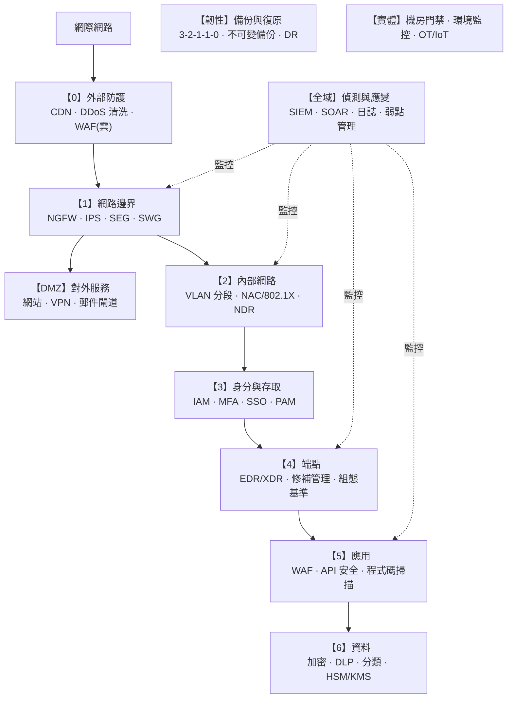

# 資安全景圖與縱深防禦

> [!abstract] 這篇你會學到
> - 用**城堡防禦**的比喻理解縱深防禦，知道為什麼「單一防線必敗」
> - 畫出企業資安的**完整分層圖**，把所有設備擺進對的位置
> - 說出每一層對應的設備類型與它們的**能力邊界**
> - 認識攻擊者的**殺傷鏈（Kill Chain）**，理解「每一層都是一次攔截機會」
> - 用這張全景圖**檢視自家的防護缺口**
> - 知道預算有限時該從哪裡開始

> [!tip] 這是本章的地圖，請先讀它
> 後面 15 篇是這張圖上的每一個方塊。
> 讀完這一篇，你就知道每一篇在整體中的位置。

## 前置知識

- [[18-計概-資訊安全初步]] — CIA 三要素、惡意程式、釣魚
- [[18-網概-網路安全基礎]] — 網路層面的攻擊與防護

---

## 觀念說明

### 核心比喻：中世紀城堡

> [!example] 城堡不是只有一道城牆
> 一座設計良好的城堡有：
>
> | 城堡的防禦 | 對應的資安機制 |
> | --- | --- |
> | **護城河** | 網路邊界、DDoS 清洗 |
> | **吊橋與城門** | **防火牆**（誰能進來） |
> | **門口衛兵查證件** | **身分驗證（IAM/MFA）** |
> | **城牆上的哨兵** | **IDS/IPS**（發現異常就示警） |
> | **內城牆（第二道）** | **網路分段（VLAN/微分段）** |
> | **每個房間的鎖** | **端點防護（EDR）、檔案權限** |
> | **金庫** | **加密、DLP、金鑰管理** |
> | **中央監控室** | **SIEM**（把所有哨兵的回報彙整） |
> | **逃生通道與備用糧倉** | **備份與災難復原** |
> | **訓練有素的守衛** | **資安意識教育** |
>
> **關鍵**：攻擊者必須**突破全部**才能得手；
> 而你只要**任何一層發揮作用，或任何一個警報響起**，就有機會阻止他。

### 為什麼「單一防線」必敗

> [!danger] 三個殘酷的事實
> **一、每一種防護都有能力邊界。**
> 防火牆看不到加密內容；防毒認不出零時差攻擊；
> WAF 擋不住設定錯誤；MFA 防不了端點被入侵。
>
> **二、攻擊者只要成功一次，防守方要每次都成功。**
> 這是根本的不對稱。
>
> **三、人一定會出錯。**
> 最貴的設備擋不住一封釣魚信。
>
> **結論**：不要問「哪一台設備最強」，
> 要問「**如果這一層被突破，下一層擋得住嗎**」。

---

## 完整的資安全景圖

### 逐層說明

| 層 | 防護什麼 | 主要設備／機制 | 本章對應 |
| --- | --- | --- | --- |
| **0 外部** | 流量到達你之前 | CDN、DDoS 清洗、雲端 WAF | [[11-DDoS防護與CDN]] |
| **1 邊界** | 誰能進出你的網路 | **NGFW**、IPS、郵件閘道、網頁閘道 | [[02-防火牆與次世代防火牆]]、[[03-入侵偵測與防禦IDS-IPS]]、[[06-郵件與網頁閘道防護]] |
| **2 內部網路** | 進來之後能走多遠 | **VLAN 分段**、NAC/802.1X、微分段、NDR | [[13-網路存取控制NAC與802.1X]]、[[12-零信任架構與微分段]] |
| **3 身分** | 誰是誰、能做什麼 | **IAM、MFA、SSO、PAM** | [[07-身分存取管理IAM與MFA]] |
| **4 端點** | 每一台機器 | **EDR/XDR**、修補管理、組態基準 | [[05-端點防護AV-EDR-XDR]] |
| **5 應用** | 網站與 API | **WAF**、輸入驗證、程式碼掃描 | [[04-Web應用防火牆WAF]] |
| **6 資料** | 資料本身 | **加密、DLP、分類、HSM/KMS** | [[08-資料防護DLP與加密]] |
| **全域 偵測** | 看見正在發生什麼 | **SIEM、SOAR、日誌、弱點掃描** | [[09-日誌集中與SIEM]]、[[10-弱點管理與滲透測試工具]] |
| **韌性** | 出事之後能復原 | **備份、不可變快照、DR** | [[14-備份與抗勒索防護]] |
| **實體** | 摸得到的東西 | 門禁、監視、環境監控、OT/IoT | [[15-實體與OT-IoT安全設備]] |

---

## 攻擊者的殺傷鏈：每一層都是攔截機會

> [!note] Kill Chain：把攻擊拆成七個階段
> 理解攻擊的階段，就知道每一層防護在攔截什麼。

| 階段 | 攻擊者在做什麼 | **哪些防護能攔截** |
| --- | --- | --- |
| **1 偵察** | 搜集你的資訊（網域、員工、對外服務） | 縮小暴露面、威脅情資、WHOIS 隱私 |
| **2 武器化** | 製作惡意檔案或漏洞利用 | （在攻擊者那端，無法攔截） |
| **3 遞送** | 寄釣魚信、掛馬網站、USB | **郵件閘道、網頁閘道、USB 管制、資安教育** |
| **4 利用** | 觸發漏洞或誘使使用者執行 | **修補管理、EDR、應用程式白名單、巨集封鎖** |
| **5 安裝** | 植入後門、建立持久性 | **EDR、檔案完整性監控、應用程式控制** |
| **6 C&C 回連** | 連回攻擊者的控制伺服器 | **出向防火牆、DNS 過濾、NDR、Proxy** |
| **7 行動** | 橫向移動、竊取資料、加密勒索 | **網路分段、PAM、DLP、備份、SIEM 偵測** |

> [!tip] 這張表就是「縱深防禦」的實證
> 一次成功的入侵必須**走完全部七步**。
>
> **你在任何一步攔下他，攻擊就失敗了。**
>
> 而且越早攔截，損害越小：
> - 在第 3 步擋掉釣魚信 → **零損害**
> - 在第 6 步偵測到 C&C 回連 → 一台機器被入侵，但資料還沒外洩
> - 到第 7 步才發現 → **資料已經外洩、系統已經被加密**

> [!warning] 大部分組織的偵測能力集中在第 1～5 步，但攻擊往往在第 6～7 步才被發現
> 這就是為什麼**日誌、SIEM、出向管制**這麼重要 ——
> 它們是「攻擊者已經進來了」之後唯一的偵測手段。
>
> 業界的「**平均偵測時間（MTTD）**」統計常常是**以「天」甚至「月」為單位**。
> 這段時間攻擊者可以做非常多事。

---

## 設備能力邊界對照表

> [!danger] 每一種設備都有它「做不到」的事
> 這張表是**選型時最該看的東西**，也是本章每一篇的核心內容。

| 設備 | ✅ 擅長 | ❌ **做不到** |
| --- | --- | --- |
| **防火牆** | 依 IP/埠/應用管制連線 | **看不到加密內容**；擋不住被允許的流量中的攻擊 |
| **IPS** | 偵測已知攻擊特徵 | **零時差攻擊**；加密流量；誤判會擋掉正常服務 |
| **WAF** | 擋 SQLi、XSS 等網站攻擊 | **業務邏輯漏洞**；設定錯誤；帳號被盜 |
| **防毒（AV）** | 已知惡意檔案 | **零時差、無檔案攻擊、合法工具濫用（LOLBins）** |
| **EDR** | 行為偵測、鑑識、回應 | 需要人看告警；可能被高階攻擊者停用 |
| **SEG（郵件閘道）** | 垃圾信、已知惡意附件與連結 | **精心設計的 BEC 變臉詐騙**（沒有惡意檔案） |
| **MFA** | 防止帳密外洩就被登入 | **端點已被入侵**；Session 劫持；MFA 疲勞轟炸 |
| **DLP** | 偵測已定義的敏感資料外傳 | 加密／壓縮後的資料；未分類的資料；拍照 |
| **SIEM** | 關聯分析、集中查詢 | **沒有人看就等於沒有**；日誌沒送進來就看不到 |
| **備份** | 資料復原 | **防不了資料外洩**（雙重勒索的第二半） |
| **VPN** | 加密傳輸 | 端點被入侵；帳號被盜；連上後的橫向移動 |
| **NAT** | 位址轉換 | **完全不是安全機制**（見 [[08-網概-NAT與私有位址]]） |

> [!tip] 用這張表檢視你的採購
> 廠商說「我們的設備可以防禦 XX 攻擊」時，
> **問他「那什麼情況下會失效」**。
>
> 願意誠實回答能力邊界的廠商，通常比較可信。

---

## 完整實戰範例：檢視自家的防護缺口

### 用全景圖做自我評估

> [!example] 逐層打分（0～3 分）
> **0 = 完全沒有；1 = 有但沒設定好；2 = 基本運作；3 = 有監控且定期檢視**

| 層 | 檢查項目 | 分數 |
| --- | --- | --- |
| **0 外部** | 對外服務有 DDoS 防護嗎？ | ___ |
| **1 邊界** | 防火牆是「預設拒絕」嗎？**有出向規則嗎**？ | ___ |
| 1 | 郵件有做 SPF/DKIM/DMARC 嗎？有郵件閘道嗎？ | ___ |
| **2 網路** | 有 VLAN 分段嗎？**VLAN 之間有 ACL 嗎**？ | ___ |
| 2 | 未使用的交換器埠關掉了嗎？ | ___ |
| 2 | 管理介面在獨立 VLAN 且不連外網嗎？ | ___ |
| **3 身分** | **重要帳號有 MFA 嗎**？ | ___ |
| 3 | 特權帳號有集中管理與紀錄嗎？ | ___ |
| 3 | 離職員工的帳號有確實停用嗎？ | ___ |
| **4 端點** | 所有端點都有 EDR/防毒且是最新的嗎？ | ___ |
| 4 | **修補有流程嗎？平均多久完成？** | ___ |
| 4 | 有套用組態基準（TWGCB/CIS）嗎？ | ___ |
| **5 應用** | 對外網站前面有 WAF 嗎？ | ___ |
| 5 | 有定期做弱點掃描嗎？ | ___ |
| **6 資料** | 敏感資料有分類與加密嗎？ | ___ |
| 6 | 筆電有全碟加密嗎？ | ___ |
| **偵測** | **日誌有集中保存嗎？有人在看嗎？** | ___ |
| 偵測 | 有告警機制嗎？誰負責處理？ | ___ |
| **韌性** | 備份有離線／不可變副本嗎？ | ___ |
| 韌性 | **上次成功還原演練是什麼時候？** | ___ |
| **實體** | 機房有門禁與紀錄嗎？ | ___ |
| **人** | 有定期資安教育與釣魚演練嗎？ | ___ |

> [!warning] 最常見的三個「0 分」項目
> 依實務經驗，機關與中小企業最常缺的是：
>
> **一、出向防火牆規則** ——
> 只擋進來的，不管出去的。而**大部分入侵是內部主動連出去造成的**。
>
> **二、日誌集中與監控** ——
> 有日誌但散落各處，而且**沒有人在看**。
> 出事時才發現日誌已經被輪替掉了。
>
> **三、備份還原演練** ——
> 有備份，但**從來沒有實際還原過**。
> 真的需要時才發現備份是壞的、或沒人記得密碼。

### 預算有限時的優先順序

> [!tip] 用「投資報酬率」排序
> 如果只能做幾件事，這個順序的效益最高：

| 優先 | 做什麼 | 成本 | 為什麼優先 |
| --- | --- | --- | --- |
| **1** | **重要帳號開啟 MFA** | **極低**（多數服務內建） | **能擋下絕大多數的帳號盜用** |
| **2** | **確實做好備份**（含離線副本 + 演練） | 低～中 | 勒索軟體的最後防線 |
| **3** | **修補管理**（作業系統、應用、韌體） | 低（人力） | **大部分入侵利用的是已有修補的舊漏洞** |
| **4** | **資安意識教育 + 釣魚演練** | 低 | **大部分事故起於人為** |
| **5** | **防火牆加上出向規則** | 低 | 攔截 C&C 回連 |
| **6** | **網路分段（VLAN + ACL）** | 中 | 限制橫向移動 |
| **7** | **日誌集中 + 基本告警** | 中 | 沒有它就是瞎的 |
| **8** | **端點 EDR** | 中～高 | 偵測與回應 |
| 9 | WAF、NGFW、SIEM 等設備 | 高 | 前面做好再說 |

> [!danger] 不要跳過前面直接買設備
> 常見的錯誤：花大錢買了 NGFW 與 SIEM，
> 但**MFA 沒開、備份沒演練、修補沒做**。
>
> **設備買了沒人維運，等於沒買。**
> 第 1～5 項幾乎不花錢，但效益遠大於任何單一設備。

---

## 常見錯誤與排錯

| 錯誤觀念 | 為什麼錯 | 正確理解 |
| --- | --- | --- |
| **「買了 XX 就安全了」** | 每種設備都有能力邊界 | **縱深防禦**，多層次互補 |
| 「內網很安全」 | 一台中招就橫向擴散 | **零信任**，內網也要驗證與分段 |
| 「我們很小，不會有人攻擊」 | 攻擊多半是**自動化、無差別**的 | 每個對外服務都會被掃描 |
| **「有備份就不怕勒索」** | 現代是**雙重勒索**（加密 + 竊取公開） | 備份 + 防外洩 + 不可變副本 |
| 「有防毒就夠了」 | 擋不住釣魚、零時差、設定錯誤 | 加上 EDR、教育、分段 |
| 只做入向管制 | 大部分入侵是內部連出去 | **出向規則同樣重要** |
| **買了設備卻沒人看告警** | 偵測 = 設備 + **人** | 先確認有人力，再買設備 |
| 「切了 VLAN 就有隔離」 | 沒有 ACL 等於沒隔離 | **VLAN + 存取控制規則** |
| 一次想做到滿分 | 資源有限，會什麼都做不好 | **依 ROI 排序，逐步推進** |
| 只看技術不看流程 | 制度沒撐住，三個月後就退回原狀 | 見 `61-資訊安全/14-資安實踐與規範` |

---

## 安全性注意事項

> [!warning] 資安是「風險管理」不是「消除風險」
> **沒有任何組織能達到 100% 安全。**
>
> 資安的目標不是「不會被攻擊」，而是：
> 1. **降低發生的機率**（防護）
> 2. **及早發現**（偵測）
> 3. **降低發生後的損害**（分段、備份）
> 4. **快速復原**（應變、DR）
>
> 所以資安投資的判斷標準是：
> **「這筆錢降低的風險，值不值得這個成本？」**
>
> 而不是「這個設備能不能防住所有攻擊」。

> [!tip] 三個必須先回答的問題
> 在買任何設備之前，先回答：
>
> **一、我最重要的資產是什麼？**
> （個資資料庫？公文系統？對外網站？）
> 保護資源應該集中在最重要的東西上。
>
> **二、最可能發生什麼？**
> 對多數機關而言：**釣魚 → 帳號被盜 → 勒索軟體**
> 遠比「被國家級駭客針對」可能得多。
>
> **三、出事的話，我承受得起嗎？**
> 這決定了你該投資多少。

> [!danger] 資安事件的通報義務
> 依《資通安全管理法》，
> **特定機關發生資安事件時有法定的通報時限與程序**。
>
> 這代表：
> 1. 你必須**有能力發現**事件（監控與日誌）
> 2. 你必須**知道通報流程**（不要出事才找）
> 3. 你必須**保全證據**（不要急著重灌）
>
> 見 [[07-台灣資安法規與個資法]] 與 [[04-資安事件應變流程]]。

---

## 速查表

### 縱深防禦分層

| 層 | 防什麼 | 代表設備 |
| --- | --- | --- |
| 0 外部 | 流量到達前 | CDN、DDoS 清洗 |
| **1 邊界** | 誰能進出 | **NGFW、IPS、SEG、SWG** |
| **2 網路** | 進來後能走多遠 | **VLAN、NAC、微分段** |
| **3 身分** | 誰能做什麼 | **IAM、MFA、PAM** |
| **4 端點** | 每台機器 | **EDR/XDR、修補** |
| 5 應用 | 網站與 API | **WAF** |
| 6 資料 | 資料本身 | **加密、DLP** |
| 偵測 | 看見發生什麼 | **SIEM、日誌** |
| 韌性 | 出事能復原 | **備份、DR** |
| 實體 | 摸得到的 | 門禁、環境監控 |

### 殺傷鏈與攔截點

| 階段 | 攔截手段 |
| --- | --- |
| 偵察 | 縮小暴露面 |
| **遞送** | **郵件閘道、教育** ← 最有價值 |
| 利用 | **修補、EDR** |
| 安裝 | EDR、應用程式控制 |
| **C&C 回連** | **出向防火牆、DNS 過濾** |
| 行動 | **分段、DLP、備份、SIEM** |

### 預算有限的優先順序

1. **MFA**（極低成本，極高效益）
2. **備份 + 還原演練**
3. **修補管理**
4. **資安教育 + 釣魚演練**
5. **出向防火牆規則**
6. 網路分段
7. 日誌集中 + 告警
8. 端點 EDR
9. 進階設備

### 三個必答問題

1. 我最重要的**資產**是什麼？
2. 最**可能**發生什麼？
3. 出事的話我**承受得起**嗎？

---

## 練習題

> [!question]- 練習 1：畫出你自己的全景圖
> 拿一張紙，畫出你機關的網路架構，並標出：
> 1. 每一層目前有什麼防護？
> 2. 哪一層完全是空白的？
> 3. 如果攻擊者從一封釣魚信開始，他會在哪一步被擋下來？
>    （對照殺傷鏈的七個階段）
>
> **空白的那幾層就是你的優先改善項目。**

> [!question]- 練習 2：做一次自我評估
> 用本篇的「逐層打分」表格，為你的環境打分（0～3）。
>
> 然後回答：
> 1. 總分是多少？滿分是多少？
> 2. 得 0 分的項目有幾個？
> 3. 其中哪些是**幾乎不用花錢就能改善**的？
>
> **先做那些不花錢的。**

> [!question]- 練習 3：模擬一次攻擊路徑
> 假設攻擊者的目標是「取得你機關的人事個資資料庫」。
>
> 請寫出：
> 1. 他最可能從哪裡開始？（提示：釣魚）
> 2. 從第一台被入侵的電腦到資料庫，他要經過哪些步驟？
> 3. **每一步你有什麼防護可以攔截他？**
> 4. 哪一步是你最弱的環節？
>
> 這個練習叫 **威脅建模（Threat Modeling）**，
> 是規劃資安投資最有效的方法。

---

## 小測驗

Q1. 用「中世紀城堡」的比喻說明縱深防禦。護城河、城門、哨兵、金庫各對應什麼？

Q2. 為什麼「單一防線必敗」？請說出三個殘酷的事實。

Q3. 請由外而內說出資安全景圖的主要分層（至少六層）。

Q4. 殺傷鏈（Kill Chain）的七個階段是什麼？為什麼「越早攔截損害越小」？

Q5. 大部分組織的偵測能力集中在哪幾步？攻擊往往在哪一步才被發現？這代表什麼機制特別重要？

Q6. 請說出下列設備各自「做不到」什麼：防火牆、防毒、WAF、MFA、備份。

Q7. 為什麼「NAT 不是安全機制」？

Q8. 預算有限時，最優先該做的三件事是什麼？為什麼它們排在買設備之前？

Q9. 機關與中小企業最常見的三個「0 分」項目是什麼？

Q10. 「資安是風險管理不是消除風險」是什麼意思？資安投資的判斷標準應該是什麼？

> [!question]- 測驗答案
> **Q1.** **護城河 = 網路邊界與 DDoS 清洗**；
> **吊橋與城門 = 防火牆**（誰能進來）；
> **城牆上的哨兵 = IDS/IPS**（發現異常就示警）；
> **金庫 = 加密、DLP、金鑰管理**。
> 其他：門口衛兵查證件 = IAM/MFA；內城牆 = 網路分段；
> 每個房間的鎖 = 端點防護；中央監控室 = SIEM；
> 逃生通道與備用糧倉 = 備份與災難復原；訓練有素的守衛 = 資安意識教育。
> **關鍵**：攻擊者必須突破全部，而你只要任何一層發揮作用就有機會阻止他。
>
> **Q2.** ①**每一種防護都有能力邊界**（防火牆看不到加密內容、防毒認不出零時差）；
> ②**攻擊者只要成功一次，防守方要每次都成功**（根本的不對稱）；
> ③**人一定會出錯**（最貴的設備擋不住一封釣魚信）。
>
> **Q3.** 由外而內：**①外部防護**（CDN、DDoS 清洗）→
> **②網路邊界**（NGFW、IPS、郵件/網頁閘道）→
> **③內部網路**（VLAN 分段、NAC、微分段）→
> **④身分與存取**（IAM、MFA、PAM）→
> **⑤端點**（EDR/XDR、修補、組態基準）→
> **⑥應用**（WAF、API 安全）→
> **⑦資料**（加密、DLP、HSM）。
> 另有橫跨全域的**偵測與應變**（SIEM、日誌）、**韌性**（備份、DR）與**實體安全**。
>
> **Q4.** ①偵察 → ②武器化 → ③**遞送** → ④利用 → ⑤安裝 →
> ⑥**C&C 回連** → ⑦行動（橫向移動、竊取、加密）。
> **越早攔截損害越小**，因為：
> 在第 3 步擋掉釣魚信 → **零損害**；
> 在第 6 步偵測到 C&C 回連 → 一台機器被入侵但資料還沒外洩；
> 到第 7 步才發現 → **資料已外洩、系統已被加密**。
>
> **Q5.** 大部分組織的偵測能力集中在**第 1～5 步**（防護導向），
> 但攻擊往往在**第 6～7 步（C&C 回連、資料外洩或加密）才被發現**。
> 這代表 **日誌、SIEM、出向流量管制**特別重要 ——
> 它們是「攻擊者已經進來了」之後**唯一的偵測手段**。
>
> **Q6.** **防火牆**：看不到**加密內容**，擋不住被允許流量中的攻擊；
> **防毒**：擋不住**零時差、無檔案攻擊、合法工具濫用（LOLBins）**；
> **WAF**：擋不住**業務邏輯漏洞**、設定錯誤、帳號被盜；
> **MFA**：防不了**端點已被入侵**、Session 劫持、MFA 疲勞轟炸；
> **備份**：**防不了資料外洩**（雙重勒索的第二半）。
>
> **Q7.** 因為 NAT 只是**位址轉換技術** ——
> 它只擋「未經請求的外部連線」，
> **完全不檢查封包內容，也不管內部主動連出去的流量**。
> 而現代攻擊幾乎都是「內部主動連出去」造成的
> （點釣魚連結 → 下載惡意程式 → 回連 C&C），NAT 全程攔不到。
>
> **Q8.** ①**重要帳號開啟 MFA**（極低成本，能擋下絕大多數帳號盜用）；
> ②**確實做好備份**（含離線副本 + **還原演練**）；
> ③**修補管理**（**大部分入侵利用的是已經有修補程式的舊漏洞**）。
> 它們排在買設備之前，是因為**幾乎不花錢但效益遠大於任何單一設備**，
> 而且**設備買了沒人維運等於沒買**。
>
> **Q9.** ①**出向防火牆規則**（只擋進來的，不管出去的，
> 而大部分入侵是內部主動連出去造成的）；
> ②**日誌集中與監控**（有日誌但散落各處，**而且沒有人在看**，
> 出事時才發現已被輪替掉）；
> ③**備份還原演練**（有備份但**從來沒有實際還原過**，
> 真的需要時才發現備份是壞的或沒人記得密碼）。
>
> **Q10.** 意思是**沒有任何組織能達到 100% 安全**，
> 資安的目標不是「不會被攻擊」，而是
> ①降低發生機率、②及早發現、③降低發生後的損害、④快速復原。
> **判斷標準應該是「這筆錢降低的風險，值不值得這個成本」**，
> 而不是「這個設備能不能防住所有攻擊」。

---

## 延伸閱讀

- [[02-防火牆與次世代防火牆]] — 第 1 層：網路邊界
- [[05-端點防護AV-EDR-XDR]] — 第 4 層：端點
- [[07-身分存取管理IAM與MFA]] — 第 3 層：身分（**投資報酬率最高**）
- [[09-日誌集中與SIEM]] — 偵測能力的核心
- [[14-備份與抗勒索防護]] — 最後一道防線
- [[16-資安設備選型與導入實務]] — 預算有限時怎麼買
- [[00-資安實踐與規範-索引]] — 制度面（沒有它，技術會退回原狀）
