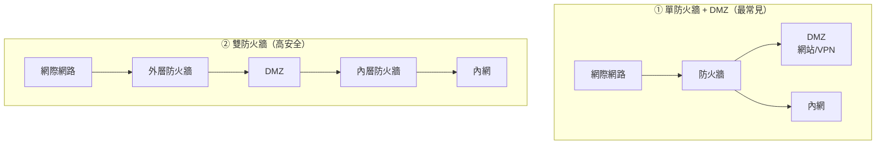

# 防火牆與次世代防火牆

> [!abstract] 這篇你會學到
> - 四代防火牆技術的演進：**封包過濾 → 狀態檢視 → 應用層 → NGFW**
> - 理解「**狀態檢視表**」為什麼是關鍵進步
> - 知道 NGFW 比傳統防火牆**多做了哪些事**，以及**做不到什麼**
> - 分辨 **UTM** 與 NGFW，評估一體機的取捨
> - 學會撰寫良好的防火牆規則（順序、預設拒絕、出向管制）
> - 認識常見的商用與開源產品

## 前置知識

- [[01-資安全景圖與縱深防禦]] — 防火牆在整體架構中的位置
- [[18-網概-網路安全基礎]] — 防火牆的基本概念
- [[10-網概-連接埠與應用層協定]] — 埠號

---

## 觀念說明

### 核心比喻：門口的警衛

**防火牆依照規則清單，決定每一個封包放行還是阻擋。**

| 警衛的能力 | 防火牆世代 |
| --- | --- |
| **只看證件上的姓名與地址** | 第一代：封包過濾 |
| **記得誰進去了，出來時直接放行** | 第二代：**狀態檢視** |
| **檢查你帶了什麼東西** | 第三代：應用層 |
| **認得你是誰、知道你的職務、還會掃描包包** | 第四代：**NGFW** |

---

## 四代防火牆技術

### 第一代：封包過濾（Packet Filter，1980 年代）

**只看每個封包的標頭欄位**，逐一比對規則。

| 看什麼 | 說明 |
| --- | --- |
| 來源／目的 **IP** | 誰要跟誰講話 |
| 來源／目的 **埠號** | 什麼服務 |
| **協定** | TCP / UDP / ICMP |
| TCP flags | SYN、ACK 等 |

> [!danger] 致命缺點：不記得連線狀態
> 每個封包都被**獨立看待**，防火牆不知道它屬於哪一條連線。
>
> **問題**：
> 你允許「內部 → 外部 443」，
> 但**回應封包是「外部 → 內部」** ——
> 為了讓回應進來，你必須額外開放
> **「外部 → 內部的所有高位埠（1024-65535）」**。
>
> **這等於開了一個巨大的洞。**
>
> ```
> ❌ 無狀態防火牆的規則
> allow  內部 → 外部 : any → 443     (出去)
> allow  外部 → 內部 : 443 → 1024-65535   (回來 ← 這條太寬鬆了)
>                                            攻擊者也能從 443 連進來
> ```

### 第二代：狀態檢視（Stateful Inspection，1990 年代）

> [!tip] 這是防火牆史上最重要的進步
> 防火牆維護一張**連線狀態表（state table / conntrack）**，
> **記住每一條已建立的連線**。
>
> 看到回應封包時，它知道「**這是我剛剛放行出去的那條連線的回應**」，
> **自動放行，不需要額外規則**。
>
> ```
> ✅ 狀態式防火牆的規則
> allow  內部 → 外部 : any → 443
> allow  ESTABLISHED, RELATED           ← 一條規則搞定所有回應
> deny   其他所有
> ```
>
> **這讓「只出不進」成為可能** ——
> 內部可以主動連出去，外部無法主動連進來。

**狀態表長什麼樣**：

```bash
$ sudo conntrack -L | head -3
tcp 6 431999 ESTABLISHED src=192.168.1.50 dst=93.184.216.34 sport=54321 dport=443 \
    src=93.184.216.34 dst=203.0.113.5 sport=443 dport=61000 [ASSURED]
udp 17 29 src=192.168.1.50 dst=8.8.8.8 sport=33445 dport=53 [UNREPLIED]
```

| 狀態 | 意義 |
| --- | --- |
| **NEW** | 新連線的第一個封包 |
| **ESTABLISHED** | 已建立的連線 |
| **RELATED** | 與已有連線相關（如 FTP 資料連線、ICMP 錯誤回應） |
| INVALID | 無法歸類（通常應該丟棄） |

> [!warning] 狀態表是有容量上限的
> 每一條連線都佔一格。表滿了 → **新連線全部被丟棄**。
>
> ```bash
> $ sudo conntrack -C                              # 目前連線數
> $ cat /proc/sys/net/netfilter/nf_conntrack_max   # 上限
> $ dmesg | grep -i 'conntrack.*table full'
> ```
>
> **這是 DDoS 攻擊的目標之一** ——
> 攻擊者製造大量半開連線把表塞爆。
> 也可能因為有人跑 P2P 而自然耗盡。
>
> **對策**：加大上限、縮短逾時、**納入監控告警**。

### 第三代：應用層閘道（Application Gateway / Proxy）

**代理（Proxy）模式**：不直接轉送封包，而是**代替客戶端建立連線**。

```
客戶端 ──連線1──> Proxy ──連線2──> 伺服器
                    ↑
              完整看到並理解應用層內容
```

| 優點 | 缺點 |
| --- | --- |
| **能理解應用層協定**（HTTP、FTP、SMTP） | **效能較差**（要完整解析） |
| 可以做**內容檢查與改寫** | 每種協定都要各自實作 |
| 隱藏內部結構 | 不支援的協定就過不去 |

### 第四代：次世代防火牆（NGFW，2010 年代～）

**NGFW = 狀態式防火牆 + 應用辨識 + 使用者身分 + IPS + 更多**

| 能力 | 說明 |
| --- | --- |
| **應用程式辨識（App-ID）** | **不看埠號，看實際的應用程式** |
| **使用者身分整合** | 規則可以寫「**業務部門的人**」而非「IP 10.1.1.5」 |
| **內建 IPS** | 偵測並阻擋已知攻擊 |
| **SSL/TLS 解密檢查** | 解開加密流量檢查內容 |
| **威脅情資整合** | 自動更新惡意 IP／網域清單 |
| 沙箱 | 可疑檔案送到沙箱執行觀察 |
| URL 過濾 | 依網站分類管制 |

> [!example] 應用辨識為什麼是關鍵改進
> **傳統防火牆的世界觀**：「443 埠 = HTTPS = 網頁瀏覽」
>
> **但現實是**：
> - 很多應用程式**故意用 443 埠**來繞過防火牆
> - Skype、BT、遠端桌面工具、翻牆軟體都可以走 443
> - **你以為只開了網頁，實際上什麼都通**
>
> **NGFW 用深度封包檢查（DPI）辨識實際的應用程式**：
> ```
> 傳統規則： allow tcp/443              ← 什麼都放行
> NGFW 規則： allow app=web-browsing     ← 只放行真正的網頁瀏覽
>            deny  app=bittorrent
>            deny  app=teamviewer
>            deny  app=ultrasurf
> ```

> [!warning] SSL/TLS 解密檢查的三個代價
> NGFW 要檢查加密流量，必須做**中間人解密**：
> ```
> 客戶端 ──TLS──> NGFW（解密、檢查、重新加密）──TLS──> 伺服器
> ```
>
> **代價**：
> **一、效能**：解密極耗資源，NGFW 的效能可能掉到**標示值的 1/3 甚至更低**。
> **選型時務必看「啟用 SSL 解密後的效能數字」**，不是最大吞吐量。
>
> **二、憑證管理**：所有端點必須信任 NGFW 的 CA 憑證，
> 否則會出現憑證警告。要透過 GPO 或 MDM 派送。
>
> **三、隱私與法遵**：
> 解密等於**看到員工的所有網路內容**（包含網銀、醫療、私人郵件）。
> **必須**：
> - 有明確的政策並**告知員工**
> - **排除**金融、醫療、政府等敏感類別
> - 存取解密內容的權限要嚴格管控與記錄
> - 諮詢法務與人資

---

## NGFW vs UTM

| | **UTM**（統一威脅管理） | **NGFW** |
| --- | --- | --- |
| 定位 | **多合一一體機** | 以防火牆為核心，強化應用與威脅偵測 |
| 目標客群 | **中小企業** | 中大型企業 |
| 功能 | 防火牆 + IPS + 防毒 + 內容過濾 + VPN + 反垃圾郵件 | 防火牆 + App-ID + User-ID + IPS + 解密 |
| 效能 | 功能全開時**掉很多** | 較強 |
| 管理 | **單一介面，簡單** | 較複雜但更細緻 |

> [!tip] 中小型機關通常適合 UTM
> **優點**：一台搞定、一個介面、一份保固、成本低。
>
> **要注意的**：
> 1. **效能數字要看「全功能啟用」的值**，
>    不是只開防火牆的最大吞吐量（差距可能是 10 倍）
> 2. **單點故障** —— 這一台掛了，網路就斷了。
>    重要環境要考慮 **HA 雙機**
> 3. 各項功能的深度不如專用設備

> [!warning] 選型時最常被灌水的數字
> | 數字 | 陷阱 |
> | --- | --- |
> | **防火牆吞吐量** | 通常是「只開防火牆、大封包」的最佳值 |
> | **IPS 吞吐量** | 開了 IPS 之後大幅下降 |
> | **威脅防護吞吐量** | 全功能開啟的值 ← **這才是你該看的** |
> | **SSL 檢查吞吐量** | **通常只有標示值的 1/5～1/3** |
> | 並發連線數 | 注意是否含 SSL 連線 |
> | 新建連線數/秒 | 對高流量環境很重要 |
>
> **請廠商提供「你實際會啟用的功能組合」下的效能數字**，
> 並在 POC 時實測。

---

## 部署架構

### 常見的三種擺法



| 架構 | 說明 | 適合 |
| --- | --- | --- |
| **單防火牆三腳（Three-legged）** | 一台防火牆，三個介面：外、DMZ、內 | **大多數機關與企業** |
| **雙防火牆（背對背）** | 兩台不同廠牌的防火牆夾住 DMZ | 高安全需求；攻破一台不等於攻破兩台 |
| 分散式／微分段 | 每個工作負載都有自己的防護 | 雲端、容器環境 |

> [!note] DMZ（非軍事區）是什麼
> **DMZ 是「半信任區」** —— 放置**必須對外開放的服務**
> （網站、VPN 端點、郵件閘道）。
>
> **規則設計原則**：
> ```
> 網際網路 → DMZ ：只開必要的埠（443）             ✅
> DMZ → 內網     ：極度限制（只開必要的資料庫連線）   ⚠️
> 內網 → DMZ     ：允許管理                        ✅
> DMZ → 網際網路 ：限制（只允許更新來源）            ⚠️
> ```
>
> **關鍵是「DMZ → 內網」要非常嚴格** ——
> DMZ 的機器是最可能被攻破的（它們對全世界開放），
> **不能讓攻破一台網站主機就等於進了內網**。

---

## 撰寫良好的防火牆規則

### 三個原則

> [!tip] 一、預設拒絕（Default Deny）
> **先擋掉全部，再開放明確需要的。**
>
> ```bash
> # ✅ 正確
> iptables -P INPUT DROP
> iptables -P FORWARD DROP
> iptables -A INPUT -i lo -j ACCEPT
> iptables -A INPUT -m conntrack --ctstate ESTABLISHED,RELATED -j ACCEPT
> iptables -A INPUT -p tcp --dport 22 -s 192.168.1.0/24 -j ACCEPT
> iptables -A INPUT -p tcp --dport 443 -j ACCEPT
> ```
>
> **不要「先全開，遇到問題再擋」** —— 你永遠不知道漏了什麼。

> [!tip] 二、規則順序很重要（由上而下，先符合先執行）
> ```
> ❌ 錯誤的順序
> 1. allow  any → any                    ← 這條符合了，下面永遠執行不到
> 2. deny   any → 3389
>
> ✅ 正確的順序
> 1. deny   any → 3389                   ← 具體的規則放前面
> 2. allow  內網 → any
> 3. deny   any → any                     ← 最寬鬆的放最後
> ```
>
> **原則：具體的規則放前面，寬鬆的放後面。**

> [!tip] 三、規則要有註解與定期檢視
> ```bash
> # 每條規則都該記錄：為什麼、誰申請、什麼時候、到期日
> iptables -A INPUT -p tcp --dport 8080 -s 203.0.113.10 -j ACCEPT \
>          -m comment --comment "廠商A遠端維護 2026-08-27~2026-09-10 申請單#1234"
> ```
>
> **防火牆規則會不斷累積** —— 三年後你會有幾百條規則，
> 而**沒有人記得為什麼有那一條**。
>
> **應該做的**：
> - 每條規則寫註解（用途、申請人、到期日）
> - **每季檢視一次**，刪掉不需要的
> - **臨時規則一定要設到期日**（廠商維護用的規則最常被遺忘）

### 出向規則：最常被忽略的一環

> [!danger] 大部分入侵是「內部主動連出去」造成的
> 見 [[01-資安全景圖與縱深防禦]] 的殺傷鏈：
> **第 6 步「C&C 回連」是出向管制的攔截點**。

| 對象 | 出向規則建議 |
| --- | --- |
| **伺服器** | **只允許必要**（內部 DNS、NTP、更新來源），其他一律擋 |
| **資料庫** | **完全不能主動對外** |
| **IoT／印表機／監視器** | 只能連內部的必要伺服器，**不能上網** |
| 使用者電腦 | 至少擋掉異常的埠；搭配 DNS 過濾 |

```bash
# 範例：Web 伺服器的出向規則
iptables -P OUTPUT DROP
iptables -A OUTPUT -o lo -j ACCEPT
iptables -A OUTPUT -m conntrack --ctstate ESTABLISHED,RELATED -j ACCEPT
iptables -A OUTPUT -p udp --dport 53  -d 192.168.1.1 -j ACCEPT   # 內部 DNS
iptables -A OUTPUT -p udp --dport 123 -d 192.168.1.1 -j ACCEPT   # 內部 NTP
iptables -A OUTPUT -p tcp --dport 443 -d 內部更新伺服器 -j ACCEPT
iptables -A OUTPUT -p tcp --dport 3306 -d 資料庫IP -j ACCEPT
iptables -A OUTPUT -j LOG --log-prefix "OUT-DROP: " --log-level 6
```

> [!tip] 先用「記錄但不擋」的方式導入
> 直接套用嚴格的出向規則會擋掉你不知道的正常流量。
>
> **正確做法**：
> 1. 先用 `LOG` 記錄所有「不符合允許清單」的出向連線
> 2. 跑一到兩週，**分析日誌**看有哪些正常需求
> 3. 補上必要的規則
> 4. **最後才改成 DROP**

---

## 完整實戰範例

### Linux：ufw（簡單）

```bash
# 預設拒絕入向、允許出向
$ sudo ufw default deny incoming
$ sudo ufw default allow outgoing

# 開放服務
$ sudo ufw allow from 192.168.1.0/24 to any port 22 proto tcp comment 'SSH from LAN'
$ sudo ufw allow 443/tcp comment 'HTTPS'

# 限速（防暴力破解）
$ sudo ufw limit 22/tcp

# 啟用並檢視
$ sudo ufw enable
$ sudo ufw status numbered verbose
Status: active
Logging: on (low)
Default: deny (incoming), allow (outgoing), disabled (routed)

     To                Action      From
     --                ------      ----
[ 1] 22/tcp            ALLOW IN    192.168.1.0/24  # SSH from LAN
[ 2] 443/tcp           ALLOW IN    Anywhere        # HTTPS

# 刪除規則
$ sudo ufw delete 2
```

### Linux：nftables（現代做法）

```bash
$ sudo nano /etc/nftables.conf
```

```
#!/usr/sbin/nft -f
flush ruleset

table inet filter {
    chain input {
        type filter hook input priority 0; policy drop;

        # 已建立的連線
        ct state established,related accept
        ct state invalid drop

        # loopback
        iif lo accept

        # ICMP（不要全擋！保留 PMTU 需要的類型）
        ip protocol icmp icmp type { echo-request, destination-unreachable, time-exceeded } \
            limit rate 10/second accept
        ip6 nexthdr icmpv6 accept

        # SSH（限來源 + 限速）
        tcp dport 22 ip saddr 192.168.1.0/24 ct state new \
            limit rate 5/minute accept

        # HTTPS
        tcp dport 443 accept

        # 記錄被丟棄的
        limit rate 5/minute log prefix "nft-drop-in: "
    }

    chain forward {
        type filter hook forward priority 0; policy drop;
    }

    chain output {
        type filter hook output priority 0; policy accept;
    }
}
```

```bash
$ sudo nft -c -f /etc/nftables.conf     # 先檢查語法
$ sudo systemctl enable --now nftables
$ sudo nft list ruleset
```

> [!info]- firewalld（RHEL 系）對照
> ```bash
> # 看目前的 zone 與規則
> $ sudo firewall-cmd --get-active-zones
> $ sudo firewall-cmd --list-all
>
> # 開放服務（永久 + 立即生效）
> $ sudo firewall-cmd --permanent --add-service=https
> $ sudo firewall-cmd --permanent --add-port=8080/tcp
>
> # 限制來源（rich rule）
> $ sudo firewall-cmd --permanent --add-rich-rule=\
>   'rule family="ipv4" source address="192.168.1.0/24" port port="22" protocol="tcp" accept'
>
> # 重新載入
> $ sudo firewall-cmd --reload
> ```
> firewalld 用「zone（區域）」的概念，
> 每個網路介面指派到一個 zone，各有不同的信任等級。

### 檢視與稽核現有規則

```bash
# 列出所有規則含封包計數（找出「從來沒被用過」的規則）
$ sudo iptables -L -n -v --line-numbers
Chain INPUT (policy DROP 1234 packets, 89K bytes)
num   pkts bytes target  prot opt in  out  source        destination
1    98234   12M ACCEPT  all  --  *   *    0.0.0.0/0     0.0.0.0/0    ctstate RELATED,ESTABLISHED
2     1523  91K ACCEPT  tcp  --  *   *    192.168.1.0/24 0.0.0.0/0   tcp dpt:22
3        0    0 ACCEPT  tcp  --  *   *    203.0.113.10  0.0.0.0/0    tcp dpt:8080
                ^^^^^^^^
                封包數是 0 → 這條規則從來沒生效過，可以考慮刪除

# 清空計數器重新統計（用來做定期檢視）
$ sudo iptables -Z
```

> [!tip] 用封包計數找出無用的規則
> 清空計數器後跑一個月，
> **計數仍然是 0 的規則，很可能可以刪掉**。
>
> 這是**防火牆規則瘦身**最實用的方法。
> 規則越少，越好理解、越不容易出錯、效能也越好。

---

## 常見產品

| 類型 | 產品 |
| --- | --- |
| **商用 NGFW** | Palo Alto、Fortinet FortiGate、Check Point、Cisco Firepower、Sophos |
| **商用 UTM** | FortiGate（中小型號）、Sophos XG、WatchGuard、Sonicwall |
| **開源軟路由／防火牆** | **OPNsense**、pfSense、VyOS |
| **Linux 內建** | **nftables**（現代）、iptables（傳統）、ufw、firewalld |
| 雲端 | AWS Security Group / NACL、Azure NSG、GCP Firewall |

> [!tip] OPNsense：機關的高 CP 值選擇
> **OPNsense**（FreeBSD 基底）是開源的軟體防火牆，
> 裝在一台普通的 x86 主機上就能提供：
> 防火牆、NAT、VPN（IPsec/OpenVPN/WireGuard）、
> IDS/IPS（Suricata）、網頁過濾、報表。
>
> **優點**：免費、功能完整、社群活躍、硬體可自選
> **限制**：沒有原廠支援（可另購商業支援）、
> 效能取決於硬體、需要自己維運
>
> 本手冊 `21-防火牆與軟路由` 有完整教學。

---

## 常見錯誤與排錯

| 現象／錯誤 | 原因 | 解法 |
| --- | --- | --- |
| 服務通不了 | 規則順序錯（寬鬆的規則在前） | `iptables -L -n -v --line-numbers` 檢查順序 |
| 設了規則但沒生效 | 忘了 `--reload` 或規則沒存檔 | firewalld 要 `--reload`；iptables 要 `netfilter-persistent save` |
| 重開機後規則全沒了 | 沒有持久化 | 安裝 `iptables-persistent` 或用 nftables 設定檔 |
| **把自己鎖在外面** | 先設了 `policy DROP` 才加 SSH 規則 | **遠端操作時先設定「N 分鐘後自動還原」的保險** |
| 大檔案傳不過去 | **ICMP 全部被擋（PMTU 黑洞）** | 放行 ICMP Type 3 Code 4 與 Type 11 |
| 新連線全部被丟棄 | **conntrack 表滿了** | 加大 `nf_conntrack_max`；縮短逾時；查是不是被攻擊 |
| NGFW 啟用 SSL 檢查後網路變超慢 | **解密極耗資源** | 看實際效能規格；排除高流量類別；升級設備 |
| 啟用 SSL 檢查後憑證錯誤 | 端點沒有信任 NGFW 的 CA | 用 GPO/MDM 派送 CA 憑證 |
| 規則累積數百條沒人敢動 | 沒有註解與定期檢視 | 加註解；用封包計數找出無用規則；**每季檢視** |
| 廠商維護用的規則忘記關 | 沒有到期機制 | **臨時規則一定要設到期日並列入追蹤** |
| 只設入向、出向全開 | 攔不到 C&C 回連 | **加上出向規則**（先 LOG 再 DROP） |
| DMZ 被攻破後直接進內網 | DMZ → 內網 的規則太寬鬆 | **極度限制 DMZ 對內網的連線** |

> [!danger] 遠端設定防火牆的保命技巧
> 在遠端主機上改防火牆，**最怕把自己鎖在外面**。
>
> ```bash
> # 方法 1：先排一個「N 分鐘後自動還原」的工作
> $ sudo bash -c 'echo "iptables-restore < /root/fw-backup.rules" | at now + 10 minutes'
> # 備份現有規則
> $ sudo iptables-save > /root/fw-backup.rules
> # 然後才開始改規則
> # 確認一切正常後，取消那個 at 工作
> $ atq && sudo atrm <job-id>
>
> # 方法 2：用 tmux/screen 開一個「持續 ping 自己」的視窗
> # 方法 3：先在 KVM/iDRAC 開好主控台連線
> ```
>
> **這個習慣會在某一天救你一次。**

---

## 安全性注意事項

> [!warning] 防火牆本身也是攻擊目標
> 它是**最高價值的目標**之一 —— 攻破它等於掌握整個網路的進出。
>
> **必做的加固**：
> | 項目 | 說明 |
> | --- | --- |
> | **管理介面不對外** | 只從**管理 VLAN** 或跳板機存取 |
> | **關閉明文管理** | 禁用 Telnet、HTTP 管理介面 |
> | **啟用 MFA** | 管理員登入要多因素 |
> | **韌體保持更新** | 防火牆的漏洞歷來都很嚴重（多次被用於大規模入侵） |
> | **設定備份** | 定期備份並驗證能還原 |
> | **完整日誌** | 送到 SIEM，本機日誌可能被清掉 |
> | **最小權限** | 不同管理員給不同層級的權限 |

> [!danger] 防火牆的漏洞是重大威脅
> 近年來多起大規模入侵事件，起點都是
> **對外開放管理介面且未修補的防火牆／VPN 設備**。
>
> **這類設備的漏洞特別危險，因為**：
> 1. 它們**必然對外開放**（VPN 端點）
> 2. 攻破後**直接進入內網**
> 3. 很多組織**不敢重開機或更新**（怕斷線）
>
> **對策**：
> - **訂閱廠商的資安公告**，重大漏洞要在數日內修補
> - 安排**定期的維護視窗**做韌體更新
> - **管理介面絕不對外**（VPN 服務埠與管理介面要分開）
> - 有 HA 雙機的話可以輪流更新不中斷

> [!tip] 防火牆日誌是資安調查的關鍵資料
> 它記錄了「**誰在什麼時候連了誰、被放行還是被擋**」。
>
> **應該記錄**：
> - 所有**被拒絕**的連線（發現掃描與攻擊嘗試）
> - **對外的新連線**（發現 C&C 回連）
> - 管理登入與設定變更
>
> **注意**：全記錄的量非常大，要規劃儲存空間並送到 SIEM。
> 依《資通安全管理法》，**連線紀錄需保存一定期間**。
> 見 [[09-日誌集中與SIEM]]。

---

## 速查表

### 四代技術

| 代 | 技術 | 看什麼 | 關鍵 |
| --- | --- | --- | --- |
| 1 | 封包過濾 | IP、埠、協定 | **不記狀態，回應方向要開大洞** |
| **2** | **狀態檢視** | **+ 連線狀態表** | **現代基本要求** |
| 3 | 應用層 Proxy | 完整解析應用協定 | 慢，但看得深 |
| **4** | **NGFW** | **+ 應用辨識、使用者、IPS、解密** | 現代企業標準 |

### 連線狀態

| 狀態 | 意義 |
| --- | --- |
| NEW | 新連線 |
| **ESTABLISHED** | 已建立 |
| **RELATED** | 相關連線（FTP 資料、ICMP 錯誤） |
| INVALID | 無法歸類 → 應丟棄 |

### 規則撰寫三原則

1. **預設拒絕**（`policy DROP`）
2. **具體的規則在前，寬鬆的在後**
3. **每條規則寫註解 + 定期檢視 + 臨時規則設到期日**

### DMZ 規則設計

```
網際網路 → DMZ ：只開必要（443）
DMZ → 內網     ：極度限制  ← 最關鍵
內網 → DMZ     ：允許管理
DMZ → 網際網路 ：限制
```

### 選型要看的效能數字

| ❌ 別看 | ✅ 要看 |
| --- | --- |
| 防火牆最大吞吐量 | **威脅防護吞吐量**（全功能開啟） |
| — | **SSL 檢查吞吐量**（通常只有 1/5～1/3） |
| — | 新建連線數/秒、並發連線數 |

### 常用指令

| 目的 | 指令 |
| --- | --- |
| ufw 狀態 | `sudo ufw status numbered verbose` |
| iptables 列規則含計數 | `sudo iptables -L -n -v --line-numbers` |
| 清空計數器 | `sudo iptables -Z` |
| 儲存規則 | `sudo netfilter-persistent save` |
| nftables 檢查語法 | `sudo nft -c -f /etc/nftables.conf` |
| nftables 列規則 | `sudo nft list ruleset` |
| firewalld 列規則 | `sudo firewall-cmd --list-all` |
| firewalld 重載 | `sudo firewall-cmd --reload` |
| **看連線狀態表** | `sudo conntrack -L` |
| 連線數/上限 | `sudo conntrack -C` / `cat /proc/sys/net/netfilter/nf_conntrack_max` |

---

## 練習題

> [!question]- 練習 1：檢視你的防火牆規則
> ```bash
> sudo iptables -L -n -v --line-numbers
> # 或
> sudo ufw status numbered verbose
> sudo nft list ruleset
> ```
> 回答：
> 1. 預設政策是 DROP 還是 ACCEPT？
> 2. **有沒有出向（OUTPUT）規則**？
> 3. 有沒有規則的封包計數是 0（可能可以刪除）？
> 4. 每條規則你都知道為什麼存在嗎？

> [!question]- 練習 2：設計一台 Web 伺服器的完整規則
> 需求：
> - 對外提供 HTTPS（443）
> - SSH 只允許管理網段 `10.0.100.0/24`
> - 需要連內部 MySQL（`10.0.20.5:3306`）
> - 需要連內部 DNS 與 NTP
> - 需要從內部更新伺服器抓套件
> - **其他一律禁止（含出向）**
>
> 寫出完整的 iptables 或 nftables 規則。
> 記得加上 ICMP 的必要類型與日誌。

> [!question]- 練習 3：實測 conntrack
> ```bash
> # 目前連線數與上限
> sudo conntrack -C
> cat /proc/sys/net/netfilter/nf_conntrack_max
>
> # 算出使用率
> echo "scale=2; $(sudo conntrack -C) / $(cat /proc/sys/net/netfilter/nf_conntrack_max) * 100" | bc
> ```
> 回答：
> 1. 目前使用率是多少？
> 2. 如果有人在跑 BT，這個數字會怎樣？
> 3. 你會把告警門檻設在多少？
> 4. 寫一個簡單的監控腳本

---

## 小測驗

Q1. 四代防火牆技術分別是什麼？各自看什麼？

Q2. **為什麼「狀態檢視」是防火牆史上最重要的進步**？無狀態防火牆有什麼致命缺點？

Q3. 連線狀態中的 `ESTABLISHED` 與 `RELATED` 各代表什麼？為什麼一條規則就能取代大量的回應方向規則？

Q4. conntrack 表滿了會怎樣？有哪三個可能原因？

Q5. NGFW 的「應用辨識（App-ID）」解決了傳統防火牆的什麼盲點？

Q6. NGFW 啟用 SSL/TLS 解密檢查有哪三個代價？

Q7. UTM 與 NGFW 的差別是什麼？中小型機關選 UTM 要注意哪兩件事？

Q8. 防火牆規則撰寫的三個原則是什麼？為什麼「規則順序」很重要？

Q9. DMZ 的四個方向規則中，哪一個最關鍵？為什麼？

Q10. 為什麼「防火牆本身是最高價值的攻擊目標」？請說出至少四項必做的加固。

> [!question]- 測驗答案
> **Q1.** ①**封包過濾**（看 IP、埠、協定、TCP flags）；
> ②**狀態檢視**（+ 連線狀態表）；
> ③**應用層 Proxy**（完整解析應用協定，代替客戶端建立連線）；
> ④**NGFW**（+ 應用辨識、使用者身分、IPS、SSL 解密、威脅情資）。
>
> **Q2.** 因為它讓防火牆**記住每一條已建立的連線**，
> 看到回應封包時知道「這是我剛放行出去那條連線的回應」，**自動放行**。
> **無狀態防火牆的致命缺點**：每個封包獨立看待，
> 為了讓回應進來，必須額外開放「**外部 → 內部的所有高位埠（1024-65535）**」——
> **等於開了一個巨大的洞**，攻擊者也能從那些埠連進來。
> 狀態式讓「**只出不進**」成為可能。
>
> **Q3.** **ESTABLISHED** = 已經完成建立的連線；
> **RELATED** = 與已有連線相關的新連線（如 FTP 的資料連線、ICMP 錯誤回應）。
> 一條 `ct state established,related accept` 就能放行**所有**已放行連線的回應，
> 不需要為每一種服務各寫一條回應方向的規則。
>
> **Q4.** 表滿了 → **新連線全部被丟棄**，
> 症狀是「網路突然完全不通，但 ping 閘道還通」。
> **三個原因**：①使用者/連線數自然成長；
> ②**有人在跑 P2P**（BT 可開幾千條連線）；
> ③**遭到 DDoS 或大量掃描**（另加：逾時設定太長）。
>
> **Q5.** 傳統防火牆的世界觀是「**443 埠 = 網頁瀏覽**」，
> 但現實是**很多應用程式故意用 443 埠繞過防火牆**
> （Skype、BT、遠端桌面工具、翻牆軟體）——
> **你以為只開了網頁，實際上什麼都通**。
> **App-ID 用深度封包檢查辨識實際的應用程式**，
> 讓你可以寫「只允許 web-browsing，禁止 bittorrent／teamviewer」這樣的規則。
>
> **Q6.** ①**效能** —— 解密極耗資源，效能可能掉到標示值的 **1/3 甚至更低**；
> ②**憑證管理** —— 所有端點必須信任 NGFW 的 CA 憑證，
> 要透過 GPO/MDM 派送，否則會出現憑證警告；
> ③**隱私與法遵** —— 解密等於**看到員工的所有網路內容**
> （網銀、醫療、私人郵件），必須有明確政策並告知員工、
> **排除敏感類別**、嚴格管控存取權限、諮詢法務與人資。
>
> **Q7.** **UTM 是多合一一體機**（防火牆+IPS+防毒+內容過濾+VPN+反垃圾郵件），
> 目標是**中小企業**，單一介面管理、成本低；
> **NGFW 以防火牆為核心**，強化應用辨識、使用者身分與威脅偵測，效能較強。
> 中小型機關選 UTM 要注意：
> ①**效能數字要看「全功能啟用」的值**（與只開防火牆可能差 10 倍）；
> ②**單點故障** —— 這一台掛了網路就斷，重要環境要考慮 **HA 雙機**。
>
> **Q8.** ①**預設拒絕**（先擋全部，再開放必要的）；
> ②**具體的規則在前，寬鬆的在後**；
> ③**每條規則寫註解 + 定期檢視 + 臨時規則設到期日**。
> 順序重要是因為防火牆**由上而下、先符合先執行** ——
> 如果把 `allow any → any` 放在最前面，
> **下面所有的拒絕規則永遠執行不到**。
>
> **Q9.** **「DMZ → 內網」最關鍵**，必須極度限制。
> 因為 DMZ 的機器是**最可能被攻破的**（它們對全世界開放），
> **不能讓攻破一台網站主機就等於進了內網**。
> 只應開放絕對必要的連線（例如網站連內部資料庫的特定埠）。
>
> **Q10.** 因為**攻破防火牆等於掌握整個網路的進出**；
> 而且這類設備**必然對外開放**（VPN 端點）、
> **攻破後直接進入內網**、很多組織**不敢重開機或更新**。
> **必做的加固**（任四項）：
> ①**管理介面不對外**（只從管理 VLAN 或跳板機存取）；
> ②**關閉明文管理**（禁用 Telnet、HTTP 管理介面）；
> ③管理員登入**啟用 MFA**；
> ④**韌體保持更新**（訂閱廠商資安公告，重大漏洞數日內修補）；
> ⑤**定期備份設定並驗證能還原**；
> ⑥**日誌送到 SIEM**（本機日誌可能被清掉）；
> ⑦**最小權限**（不同管理員不同層級）。

---

## 延伸閱讀

- [[01-資安全景圖與縱深防禦]] — 防火牆在整體架構中的位置
- [[03-入侵偵測與防禦IDS-IPS]] — 防火牆與 IDS 的分工
- [[04-Web應用防火牆WAF]] — 第 7 層的專用防護
- [[16-資安設備選型與導入實務]] — 怎麼買、怎麼導入
- [[02-防火牆-ufw基礎與實務]] — Linux 防火牆實作（進階）
- [[03-防火牆-nftables與iptables]] — 完整的規則語法（進階）
- [[04-防火牆-firewalld]] — RHEL 系的防火牆（進階）
