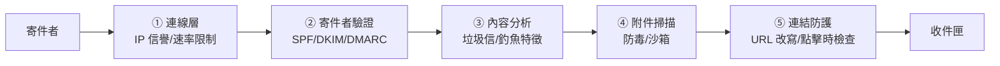

# 郵件與網頁閘道防護

> [!abstract] 這篇你會學到
> - 理解為什麼**郵件與瀏覽器是最大宗的入侵管道**
> - 認識 **SEG（郵件閘道）** 的多層過濾機制
> - **徹底搞懂 SPF / DKIM / DMARC** —— 這是防止網域被冒用的關鍵
> - 知道**為什麼 BEC 變臉詐騙攔不住**，以及唯一有效的防護
> - 認識 **SWG（網頁閘道）** 與 DNS 過濾的差別
> - 理解**沙箱**與**瀏覽器隔離**的原理
> - 學會實際檢查與設定郵件安全記錄

> [!note] 範圍說明
> 本篇討論的是**郵件與網頁的「防護設備」**，
> 不涵蓋郵件伺服器（Postfix/Dovecot）的架設 ——
> 那不在本手冊的範圍內。

## 前置知識

- [[11-網概-DNS網域名稱系統]] — SPF/DKIM/DMARC 是 DNS 記錄
- [[05-端點防護AV-EDR-XDR]] — 端點是最後一道防線
- [[18-計概-資訊安全初步]] — 釣魚的手法

---

## 觀念說明

### 為什麼這兩個入口最重要

> [!danger] 統計上，絕大多數的入侵從這裡開始
> 回顧殺傷鏈的**第 3 步「遞送（Delivery）」**：
> 攻擊者要把惡意內容送到目標手上，最有效的兩條路是：
>
> ```
> ① 電子郵件  → 使用者的收件匣
> ② 網頁瀏覽  → 使用者的瀏覽器
> ```
>
> **在這一步攔截 = 零損害**（見 [[01-資安全景圖與縱深防禦]]）。
>
> 相對地，如果讓它過了：
> - 使用者點開附件 → 端點被入侵 → 橫向移動 → 資料外洩
> - 每往後一步，處理成本增加十倍

| 攻擊管道 | 對應的防護設備 |
| --- | --- |
| **電子郵件** | **SEG**（Secure Email Gateway） |
| **網頁瀏覽** | **SWG**（Secure Web Gateway）、DNS 過濾、Proxy |

---

## SEG：郵件安全閘道

### 核心比喻：郵件的多層安檢



### 五層過濾

| 層 | 檢查什麼 | 攔截什麼 |
| --- | --- | --- |
| **① 連線層** | 來源 IP 信譽、RBL 黑名單、連線速率 | **大量垃圾信**（這一層擋掉最多） |
| **② 寄件者驗證** | **SPF / DKIM / DMARC** | **偽造寄件人** |
| **③ 內容分析** | 關鍵字、貝氏過濾、釣魚特徵、機器學習 | 垃圾信、一般釣魚 |
| **④ 附件掃描** | 防毒、檔案類型限制、**沙箱引爆** | 惡意附件 |
| **⑤ 連結防護** | URL 信譽、**點擊時重新檢查** | 惡意連結 |

> [!tip] 第 ① 層擋掉的量最大
> 一個真實的郵件閘道，通常有 **70～90% 的連線在第一層就被擋掉**
> （來自已知的垃圾信來源、殭屍網路）。
>
> 這一層成本最低（不用解析內容），效益最高。

### 附件處理策略

> [!warning] 直接封鎖高風險副檔名
> ```
> 一律封鎖：.exe .scr .bat .cmd .com .pif .vbs .js .jar .hta .lnk .iso .img
> 高風險（建議封鎖或沙箱）：.docm .xlsm .pptm（含巨集的 Office 檔）
> 注意：.zip .7z .rar 內含上述類型也要擋
> 加密壓縮檔：無法掃描 → 建議隔離或封鎖
> ```
>
> **`.iso` 與 `.img` 近年成為熱門的規避手法** ——
> 因為它們掛載後裡面的檔案**不會帶上「來自網際網路」的標記（MOTW）**，
> 可以繞過 Office 的巨集封鎖。

> [!danger] 加密的壓縮檔是常見的規避手法
> 攻擊者把惡意程式放進**有密碼的 ZIP**，
> **密碼寫在信件內文裡**。
>
> ```
> 主旨：報價單（密碼：1234）
> 附件：報價單.zip（加密）
> ```
>
> **閘道無法解壓縮掃描**，只好放行；
> 使用者照著信裡的密碼解開，就中招了。
>
> **對策**：
> - **封鎖加密的壓縮檔**，或送到隔離區由人工審核
> - 教育使用者：這是典型的攻擊模式

### 沙箱（Sandbox / 引爆室）

> [!example] 「先在隔離室裡打開看看」
> 沙箱把可疑附件**放進一個隔離的虛擬環境中實際執行**，
> 觀察它的行為：
> - 有沒有連到外部 IP？
> - 有沒有修改系統檔案或登錄檔？
> - 有沒有嘗試提權？
> - 有沒有加密檔案？
>
> **這能抓到防毒認不出的零時差惡意程式。**

> [!warning] 沙箱的三個限制
> **一、延遲**：引爆分析要幾分鐘，郵件會延遲送達。
>
> **二、可被規避**：惡意程式會偵測「我是不是在沙箱裡」：
> - 檢查 CPU 核心數、記憶體大小（沙箱通常配置很低）
> - 檢查有沒有滑鼠移動、有沒有使用者活動
> - **延遲執行**（睡 10 分鐘再動作，沙箱已經結束分析了）
> - 檢查特定的虛擬化痕跡（VMware/VirtualBox 的驅動）
>
> **三、成本**：沙箱是高階功能，通常要另外付費。

### 連結防護（URL Rewriting）

> [!tip] 「點擊時檢查」解決了時間差問題
> **問題**：攻擊者寄信時連結是乾淨的（通過檢查），
> **兩小時後才把網頁換成惡意內容**。
>
> **解法**：閘道把信中的所有連結**改寫成自己的網址**：
> ```
> 原本：https://example.com/doc
> 改寫：https://safelinks.gateway.com/?url=https%3A%2F%2Fexample.com%2Fdoc&id=abc123
> ```
>
> 使用者**點擊時**才會被導到閘道，**在那個當下重新檢查目標網址**。
>
> **副作用**：
> - 使用者看到的網址變得很長很奇怪（**反而降低了辨識能力**）
> - 有些系統的連結會失效
> - 使用者無法在點擊前用滑鼠懸停確認真實網址

---

## SPF / DKIM / DMARC：防止網域被冒用

> [!danger] 沒有這三個記錄，任何人都可以冒用你的網域寄信
> 這對機關特別危險 ——
> 攻擊者可以用 `it@你的機關.gov.tw` 寄釣魚信給你的同仁，
> **而收信方的過濾機制無法判斷它是假的**。
>
> **即使你的郵件系統是外包的，這三個 DNS 記錄仍然是你的責任。**

### SPF：誰可以用我的網域寄信

**SPF**（Sender Policy Framework）在 DNS 中宣告
「**哪些 IP／伺服器有權以我的網域寄信**」。

```dns
example.gov.tw.  IN  TXT  "v=spf1 ip4:203.0.113.0/24 include:_spf.google.com -all"
                            │      │                  │                       │
                            │      │                  │                       └ 硬性失敗
                            │      │                  └ 包含 Google 的 SPF 記錄
                            │      └ 允許這個 IP 範圍
                            └ SPF 版本
```

| 結尾 | 意義 | 收信方會怎麼做 |
| --- | --- | --- |
| **`-all`** | **Hard Fail**（嚴格） | **拒收**不在清單中的來源 |
| `~all` | Soft Fail（寬鬆） | 標記為可疑但仍收下 |
| `?all` | Neutral | 不做判斷（等於沒設） |
| `+all` | **允許所有** | ❌ **絕對不要用，等於沒設** |

> [!warning] SPF 的兩個限制
> **一、SPF 檢查的是「信封寄件者」（`MAIL FROM`），
> 不是使用者看到的 `From:` 標頭。**
>
> 攻擊者可以：
> ```
> MAIL FROM: attacker@evil.com     ← SPF 檢查這個（通過，因為是他自己的網域）
> From: it@你的機關.gov.tw          ← 使用者看到這個
> ```
> **這就是為什麼只有 SPF 是不夠的** —— 需要 DMARC 來檢查「對齊」。
>
> **二、轉寄會讓 SPF 失效。**
> 信件被轉寄時，來源 IP 變成轉寄伺服器的 IP → SPF 檢查失敗。
> 這是 SPF 誤判的主要來源（DKIM 沒有這個問題）。

### DKIM：用數位簽章證明信件沒被竄改

**DKIM**（DomainKeys Identified Mail）用**私鑰簽章郵件**，
收信方用 DNS 中的**公鑰驗證**。

```dns
selector1._domainkey.example.gov.tw.  IN  TXT  "v=DKIM1; k=rsa; p=MIGfMA0GCSq..."
   │                                                                 │
   └ selector（可以有多組金鑰）                                        └ 公鑰
```

**證明兩件事**：
1. 這封信**確實由持有私鑰的人寄出**
2. 信件內容**在傳輸過程中沒有被竄改**

> [!tip] DKIM 比 SPF 更耐轉寄
> 因為它驗證的是**簽章**而非來源 IP，
> 只要信件內容沒被修改，轉寄後仍然驗證得過。

### DMARC：檢查失敗時該怎麼辦

**DMARC**（Domain-based Message Authentication, Reporting and Conformance）
做兩件事：
1. **檢查「對齊」**：`From:` 標頭的網域，
   要與 SPF 或 DKIM 驗證通過的網域**一致**
2. **告訴收信方失敗時怎麼處理**

```dns
_dmarc.example.gov.tw.  IN  TXT  "v=DMARC1; p=quarantine; pct=100; \
    rua=mailto:dmarc-reports@example.gov.tw; \
    ruf=mailto:dmarc-forensic@example.gov.tw; \
    adkim=r; aspf=r; sp=quarantine"
```

| 參數 | 意義 |
| --- | --- |
| **`p=`** | **政策**：`none`（只觀察）/ `quarantine`（放垃圾信匣）/ **`reject`（拒收）** |
| `pct=` | 套用政策的比例（可用來漸進式導入） |
| **`rua=`** | **彙總報告**寄到哪（每天一份，非常有用） |
| `ruf=` | 鑑識報告（單封失敗的詳情，較少人啟用） |
| `adkim=` / `aspf=` | 對齊模式：`r`（relaxed，允許子網域）/ `s`（strict） |
| `sp=` | 子網域的政策 |

> [!tip] DMARC 的正確導入三階段
> **絕對不要一開始就設 `p=reject`** ——
> 你可能不知道有哪些系統在用你的網域寄信
> （公文系統、通知信、監控告警、第三方服務），
> 直接 reject 會讓它們**全部被拒收**。
>
> **階段一：`p=none`（觀察，2～4 週）**
> ```
> v=DMARC1; p=none; rua=mailto:dmarc@example.gov.tw
> ```
> **只收報告，不做任何處理。**
> 分析報告，找出所有合法的寄件來源。
>
> **階段二：`p=quarantine`（隔離）**
> ```
> v=DMARC1; p=quarantine; pct=25; rua=mailto:dmarc@example.gov.tw
> ```
> 先用 `pct=25` 只套用 25%，觀察沒問題再逐步調到 100。
>
> **階段三：`p=reject`（拒收）**
> ```
> v=DMARC1; p=reject; rua=mailto:dmarc@example.gov.tw
> ```
> **這才是真正有保護力的設定。**

> [!warning] DMARC 報告是 XML，要用工具解讀
> 每天你會收到各大郵件服務商（Google、Microsoft、Yahoo）
> 寄來的彙總報告，格式是壓縮的 XML。
>
> **建議用免費的分析服務或自架工具**
> （如 dmarcian、Postmark 的 DMARC 工具、parsedmarc）
> 把它們視覺化，才看得出：
> - 哪些 IP 在用你的網域寄信
> - 哪些通過驗證、哪些失敗
> - **有沒有人在冒用你的網域**

---

## BEC：郵件安全最難的問題

> [!danger] 變臉詐騙（Business Email Compromise）
> **這是財損最大的郵件攻擊，而且技術防護幾乎攔不住。**
>
> **典型流程**：
> 1. 攻擊者**先入侵或監看**一段時間的往來郵件
>    （可能是入侵你的信箱，也可能是入侵廠商的）
> 2. 摸清楚**採購流程、承辦人、用語習慣、付款時程**
> 3. 在**正確的時機**寄一封信：
>    ```
>    主旨：Re: 貴單位 8 月份採購案付款
>
>    您好，
>    因本公司近期更換往來銀行，
>    本次款項請改匯至以下帳戶：
>    ...
>    ```
>
> **為什麼技術防護攔不住**：
> - ❌ **沒有惡意附件**（防毒無效）
> - ❌ **沒有惡意連結**（URL 檢查無效）
> - ❌ 可能**從真正被入侵的信箱寄出**（SPF/DKIM/DMARC 全部通過！）
> - ❌ 內容看起來完全正常（垃圾信過濾無效）
>
> **這是社交工程，不是技術攻擊。**

> [!tip] BEC 唯一有效的防護是「流程」
> **一、雙管道確認原則**
> **任何變更匯款帳號的要求，一律用「另一個管道」確認。**
>
> 關鍵是：**打你原本就知道的電話號碼**，
> **不是信裡寫的那個**（攻擊者當然會附上他自己的號碼）。
>
> **二、金額門檻與雙人覆核**
> 超過一定金額的付款，需要兩個人分別確認。
>
> **三、標記外部郵件**
> ```
> 主旨：[外部郵件] Re: 採購案付款
> ```
> 或在信件開頭插入警告橫幅：
> ```
> ⚠️ 此郵件來自組織外部，請謹慎處理其中的連結與要求。
> ```
> 這能讓「冒充內部同事」的攻擊立刻現形。
>
> **四、相似網域偵測**
> 監控與你網域相似的註冊（`examp1e.gov.tw`、`example-gov.tw`），
> 並在閘道上封鎖。
>
> **五、教育**
> **「主管急著要你匯款」本身就是最大的警訊。**
> 見 [[12-資安意識與社交工程防範]]。

---

## SWG：網頁安全閘道

### 做什麼

**SWG** 站在使用者與網際網路之間，檢查所有網頁流量。

| 功能 | 說明 |
| --- | --- |
| **URL 分類過濾** | 依網站類別阻擋（賭博、成人、惡意軟體、代理跳板） |
| **惡意網站封鎖** | 依威脅情資封鎖已知的惡意/釣魚網站 |
| **下載檔案掃描** | 防毒 + 沙箱 |
| **SSL/TLS 檢查** | 解密後檢查（見下方警告） |
| **DLP** | 偵測敏感資料外傳（見 [[08-資料防護DLP與加密]]） |
| **應用程式管控** | 管制雲端服務的使用（CASB 功能） |
| **頻寬管理** | 限制串流影音等 |

### 三種部署方式

| 方式 | 說明 | 優缺點 |
| --- | --- | --- |
| **明確代理（Explicit Proxy）** | 瀏覽器設定 Proxy | 明確，但**使用者可能繞過** |
| **透明代理** | 網路層強制導向 | 使用者無感，但 HTTPS 需要處理 |
| **雲端 SWG（SASE）** | 端點裝 agent，流量導到雲端 | **保護在外的筆電**，但流量經第三方 |

> [!tip] 遠距工作讓雲端 SWG 變得重要
> 傳統 SWG 只保護「在辦公室內」的流量。
>
> 但現在筆電常常在家、在外面 —— **那些流量完全沒有經過任何檢查**。
>
> **雲端 SWG（SASE 的一部分）**在端點裝 agent，
> 不管在哪裡，流量都導到雲端過濾。
>
> **代價**：所有網路流量都經過第三方（法遵與隱私考量）。

### DNS 過濾：最便宜有效的網頁防護

> [!tip] 如果只能做一件事，做 DNS 過濾
> **原理極簡單**：使用者要連任何網站，**都要先做 DNS 查詢**。
> 在這一步把惡意網域解析成一個封鎖頁面就好。
>
> **優點**：
> - **極輕量**（不用解密、不用檢查內容）
> - **保護所有應用程式**（不只瀏覽器）
> - **能攔截 C&C 回連**（惡意程式也要查 DNS）
> - **成本低**（有免費方案）
> - 部署簡單（改 DHCP 發放的 DNS 就好）
>
> **限制**：
> - 只能擋「整個網域」，不能擋單一頁面
> - **直接用 IP 連線的可以繞過**
> - **DoH（DNS over HTTPS）會繞過它** ← 見下方

```bash
# 用 Pi-hole 或 AdGuard Home 自建（開源免費）
$ docker run -d --name pihole \
  -p 53:53/tcp -p 53:53/udp -p 8080:80 \
  -e TZ=Asia/Taipei -e WEBPASSWORD=強密碼 \
  -v pihole-etc:/etc/pihole \
  pihole/pihole:latest

# 加入威脅情資的黑名單（Pi-hole 支援訂閱清單）
# 然後把 DHCP 發放的 DNS 改成這台
```

> [!danger] DoH 會繞過你的 DNS 過濾
> **DoH（DNS over HTTPS）走 443 埠，混在一般 HTTPS 流量裡**，
> 網管**難以區分**。
>
> 現代瀏覽器可能**預設啟用 DoH**，直接連到 Cloudflare 或 Google 的 DNS，
> **完全繞過你的內部 DNS 與過濾機制**。
>
> **後果**：
> - 惡意網域擋不掉
> - **DNS 查詢日誌消失**（法遵與調查都受影響）
> - 內部名稱解析失敗
>
> **機關的處理方式**：
> 1. **用 GPO 或設定管理停用瀏覽器的 DoH**
>    ```
>    Chrome GPO: DnsOverHttpsMode = "off"
>    Firefox: network.trr.mode = 5（完全停用）
>    Edge: 同 Chrome
>    ```
> 2. **防火牆封鎖已知的 DoH 服務端點**
> 3. **阻擋對外的 UDP/TCP 53**（強制使用內部 DNS）與 **853（DoT）**
> 4. 部署 **Canary Domain**：
>    Firefox 會查詢 `use-application-dns.net`，
>    如果回應 NXDOMAIN，它就會**自動停用 DoH**
>
> 見 [[11-網概-DNS網域名稱系統]]。

### 瀏覽器隔離（RBI）

> [!note] Remote Browser Isolation
> **原理**：網頁**不在使用者的電腦上執行**，
> 而是在遠端的容器裡執行，只把**畫面串流**給使用者。
>
> ```
> 使用者 ←畫面串流← 遠端容器（實際執行網頁）←→ 網際網路
> ```
>
> **效果**：**即使網站有惡意程式碼，也只會感染那個拋棄式容器**，
> 碰不到使用者的電腦。
>
> **適合**：
> - 存取高風險網站（研究人員、資安分析師）
> - 開啟不信任的連結
> - 高安全需求的環境
>
> **限制**：成本高、有延遲、部分互動功能受限。

---

## 完整實戰範例

### 檢查你的網域的郵件安全設定

```bash
#!/usr/bin/env bash
# 郵件安全記錄健檢
DOMAIN="${1:?用法: $0 example.gov.tw}"

echo "════════════════════════════════════"
echo " 郵件安全檢查：$DOMAIN"
echo "════════════════════════════════════"

echo -e "\n【MX】郵件伺服器"
dig +short "$DOMAIN" MX | sed 's/^/  /' || echo "  ⚠ 沒有 MX 記錄"

echo -e "\n【SPF】誰可以用這個網域寄信"
SPF=$(dig +short "$DOMAIN" TXT | grep -i 'v=spf1')
if [ -z "$SPF" ]; then
  echo "  ❌ 沒有 SPF 記錄 → 任何人都可以冒用你的網域！"
else
  echo "  $SPF"
  case "$SPF" in
    *-all*) echo "  ✓ 使用 -all（嚴格，最好）" ;;
    *~all*) echo "  ⚠ 使用 ~all（寬鬆），建議改為 -all" ;;
    *\?all*) echo "  ❌ 使用 ?all（等於沒設）" ;;
    *+all*) echo "  ❌❌ 使用 +all（允許所有人，非常危險！）" ;;
  esac
fi

echo -e "\n【DMARC】驗證失敗時的處理政策"
DMARC=$(dig +short "_dmarc.$DOMAIN" TXT)
if [ -z "$DMARC" ]; then
  echo "  ❌ 沒有 DMARC 記錄 → SPF/DKIM 的保護大打折扣"
else
  echo "  $DMARC"
  case "$DMARC" in
    *p=reject*)     echo "  ✓✓ p=reject（最強保護）" ;;
    *p=quarantine*) echo "  ✓ p=quarantine（中度保護）" ;;
    *p=none*)       echo "  ⚠ p=none（只觀察，沒有實際保護）" ;;
  esac
  echo "$DMARC" | grep -q 'rua=' && echo "  ✓ 有設定彙總報告" \
                                 || echo "  ⚠ 沒有設 rua，收不到報告"
fi

echo -e "\n【DKIM】常見 selector 探測"
for s in default google selector1 selector2 s1 s2 dkim mail k1; do
  R=$(dig +short "${s}._domainkey.$DOMAIN" TXT)
  [ -n "$R" ] && echo "  ✓ 找到 selector: $s"
done
echo "  （沒找到不代表沒設定，selector 名稱由郵件系統決定）"

echo -e "\n【MTA-STS】強制 TLS 傳輸"
dig +short "_mta-sts.$DOMAIN" TXT | sed 's/^/  /' || echo "  （未設定，選用）"

echo -e "\n════════════════════════════════════"
```

**使用範例**：

```bash
$ ./mailcheck.sh example.gov.tw
```

> [!tip] 也可以用線上工具
> - MXToolbox（<https://mxtoolbox.com>）
> - Google Admin Toolbox
> - dmarcian 的 DMARC 檢查器
>
> 它們會給出更完整的分析與建議。

### 設定 SPF / DMARC（DNS 記錄）

```dns
; ===== SPF =====
; 列出所有有權以這個網域寄信的來源
example.gov.tw.  3600  IN  TXT  "v=spf1 ip4:203.0.113.10 ip4:203.0.113.11 include:_spf.google.com -all"

; ===== DMARC（階段一：觀察）=====
_dmarc.example.gov.tw.  3600  IN  TXT  "v=DMARC1; p=none; rua=mailto:dmarc@example.gov.tw; fo=1"

; ===== DMARC（階段二：隔離 25%）=====
; _dmarc.example.gov.tw.  3600  IN  TXT  "v=DMARC1; p=quarantine; pct=25; rua=mailto:dmarc@example.gov.tw"

; ===== DMARC（階段三：拒收）=====
; _dmarc.example.gov.tw.  3600  IN  TXT  "v=DMARC1; p=reject; rua=mailto:dmarc@example.gov.tw; sp=reject"
```

> [!warning] SPF 有 10 次 DNS 查詢的上限
> 每個 `include:` 都會產生 DNS 查詢，
> **超過 10 次查詢，SPF 驗證會直接失敗（PermError）**。
>
> ```
> ❌ 太多 include
> v=spf1 include:a.com include:b.com include:c.com include:d.com ... -all
> ```
>
> **檢查方法**：用線上的 SPF 檢查工具看查詢次數。
> **解法**：用 SPF 展平（flattening）服務，或減少第三方服務。

### 設定外部郵件警告橫幅

> [!tip] 這是成本最低、效果很好的防護
> **Microsoft 365**：
> ```
> Exchange 管理中心 → 郵件流程 → 規則 → 新增
>   條件：寄件者位於「組織外部」
>   動作：套用 HTML 免責聲明 → 在郵件最上方插入
> ```
>
> **HTML 範例**：
> ```html
> <div style="background:#FFF3CD;border-left:5px solid #E0A800;
>             padding:10px;margin-bottom:10px;font-family:sans-serif;">
>   <strong>⚠️ 外部郵件警告</strong><br>
>   此郵件來自本機關外部。除非您確認寄件者與內容可信，
>   否則<strong>請勿點擊連結或開啟附件</strong>。<br>
>   若涉及匯款帳號變更，請務必以<strong>電話</strong>向對方確認。
> </div>
> ```
>
> **也可以在主旨前加標記**：
> ```
> [外部] 原本的主旨
> ```
>
> **為什麼有效**：
> 冒充內部同事或主管的釣魚信，**會立刻顯示「外部」標記**，
> 使用者一眼就能看出不對勁。

### 用 Pi-hole 做 DNS 過濾

```bash
# Docker 部署
$ docker run -d --name pihole \
  -p 53:53/tcp -p 53:53/udp \
  -p 8080:80 \
  -e TZ=Asia/Taipei \
  -e WEBPASSWORD='強密碼' \
  -e DNS1=1.1.1.1 -e DNS2=8.8.8.8 \
  -v pihole-etc:/etc/pihole \
  -v pihole-dnsmasq:/etc/dnsmasq.d \
  --restart unless-stopped \
  pihole/pihole:latest

# 加入惡意網域黑名單（在 Web UI 的 Group Management → Adlists）
# 建議來源：
#   https://urlhaus.abuse.ch/downloads/hostfile/       ← 惡意軟體網域
#   https://phishing.army/download/phishing_army_blocklist_extended.txt

# 查看被擋掉的查詢（可以發現被入侵的機器）
$ docker exec pihole pihole -t
```

> [!tip] DNS 過濾的日誌是發現入侵的好工具
> 如果某台機器**一直嘗試連到已知的惡意網域**，
> 那台機器**很可能已經被入侵**（惡意程式在嘗試回連 C&C）。
>
> **應該做的**：
> - 定期檢視「被封鎖最多次」的來源 IP
> - 設定告警：某台機器短時間內大量觸發封鎖 → 通知
>
> 見 [[09-日誌集中與SIEM]]。

---

## 常見錯誤與排錯

| 現象／錯誤 | 原因 | 解法 |
| --- | --- | --- |
| **網域被冒用寄釣魚信** | **沒有 SPF/DKIM/DMARC** | 設定三個記錄，DMARC 逐步走到 `p=reject` |
| 設了 SPF 但還是被冒用 | **只有 SPF 不夠**（檢查的是信封寄件者） | **必須加上 DMARC** 檢查對齊 |
| 設了 `p=reject` 後正常的信被退 | 有系統在用你的網域寄信但沒列入 SPF | **先用 `p=none` 觀察 2～4 週**，找出所有合法來源 |
| SPF 驗證回 PermError | **超過 10 次 DNS 查詢上限** | 減少 `include:`；用 SPF flattening |
| 自家的通知信進垃圾桶 | SPF/DKIM 沒設好，或 PTR 反解不符 | 檢查三個記錄；向 ISP 申請 PTR |
| 轉寄的信 SPF 失敗 | **SPF 對轉寄先天不友善** | DKIM 沒有這個問題；DMARC 只要一個通過即可 |
| **BEC 詐騙成功匯錯款** | 技術防護攔不住社交工程 | **雙管道確認流程** + 外部郵件標記 + 教育 |
| 加密的 ZIP 附件夾帶病毒 | 閘道無法解壓縮掃描 | **封鎖加密壓縮檔**或送隔離區人工審核 |
| `.iso` 附件繞過巨集封鎖 | ISO 掛載後檔案不帶 MOTW 標記 | 封鎖 `.iso`、`.img` 附件 |
| **DNS 過濾被 DoH 繞過** | 瀏覽器預設啟用 DoH | **GPO 停用 DoH**；封鎖 DoH 端點；阻擋對外 53/853 |
| SWG 只保護辦公室內 | 遠距的筆電沒經過閘道 | 用**雲端 SWG（SASE）**或強制 VPN Full Tunnel |
| 沙箱沒抓到惡意程式 | 惡意程式偵測到沙箱而延遲執行 | 沙箱不是萬能；搭配 EDR 做端點偵測 |
| URL 改寫讓使用者更難判斷 | 網址變得又長又怪 | 教育：改看「點擊後」的網址；配合外部郵件標記 |

---

## 安全性注意事項

> [!danger] 郵件與網頁防護的能力邊界
> | 攻擊 | SEG/SWG 有效嗎 |
> | --- | --- |
> | 大量垃圾信 | ✅ **非常有效** |
> | 已知惡意附件／連結 | ✅ 有效 |
> | 網域偽造 | ✅ **DMARC 有效** |
> | 零時差惡意附件 | ⚠️ 沙箱**部分**有效（可被規避） |
> | **BEC 變臉詐騙** | ❌ **幾乎無效**（沒有惡意內容） |
> | **從被入侵的真實信箱寄出的信** | ❌ **通過所有驗證** |
> | 使用者自願提供密碼 | ❌ 需要 MFA 與教育 |
>
> **這就是為什麼「資安意識教育」是這一層不可取代的補強。**

> [!warning] SSL 檢查的隱私與法遵議題
> SWG 若要檢查 HTTPS 內容，必須做中間人解密 ——
> 這代表**機關看得到員工的所有網路內容**，包括網銀、醫療、私人郵件。
>
> **必做**：
> 1. **明確的政策並告知員工**
> 2. **排除敏感類別**（金融、醫療、政府）不解密
> 3. 存取解密內容的權限**嚴格管控與記錄**
> 4. 與**法務、人資**討論
>
> 見 [[02-防火牆與次世代防火牆]] 的相同議題。

> [!tip] 郵件日誌是資安調查的關鍵資料
> 當發生資安事件時，你需要能回答：
> - 「那封釣魚信**還寄給了誰**？」
> - 「有幾個人**點了那個連結**？」
> - 「有沒有人**回覆或提供了資訊**？」
>
> **郵件閘道的日誌能回答這些**，而且能做到：
> - **事後召回（Remediate）**：把已經送達的惡意郵件從所有收件匣移除
>   （Microsoft 365 的「威脅總管」、Google Workspace 的調查工具）
>
> **這個功能在事件應變時極為重要** ——
> 發現一封釣魚信後，能立刻把它從全機關的信箱中撤回。

> [!danger] 郵件安全記錄是機關的基本責任
> 即使郵件系統委外，**SPF/DKIM/DMARC 這三個 DNS 記錄仍然是機關的責任**。
>
> 沒有設定的後果：
> - **任何人都能冒用機關網域寄詐騙信**
> - 受害的是**民眾與其他機關**
> - 機關可能因此被質疑資安管理不當
>
> **這三個記錄不用花錢，只要花時間設定。**
> 建議把它納入 [[09-資安稽核與符合性檢核]] 的定期檢查項目。

---

## 速查表

### SEG 五層過濾

| 層 | 檢查 | 攔截 |
| --- | --- | --- |
| ① 連線 | IP 信譽、RBL | **大量垃圾信（最多）** |
| ② 驗證 | **SPF/DKIM/DMARC** | **偽造寄件人** |
| ③ 內容 | 關鍵字、ML | 垃圾信、釣魚 |
| ④ 附件 | 防毒、**沙箱** | 惡意附件 |
| ⑤ 連結 | **點擊時檢查** | 惡意連結 |

### 三個郵件記錄

| 記錄 | 作用 | DNS 位置 |
| --- | --- | --- |
| **SPF** | **誰可以用我的網域寄信** | `example.com TXT` |
| **DKIM** | **簽章證明沒被竄改** | `selector._domainkey.example.com TXT` |
| **DMARC** | **失敗時怎麼處理 + 報告** | `_dmarc.example.com TXT` |

### SPF 結尾

| 結尾 | 意義 |
| --- | --- |
| **`-all`** | **Hard Fail（建議）** |
| `~all` | Soft Fail |
| `?all` | Neutral（等於沒設） |
| `+all` | ❌ **絕對不要** |

### DMARC 導入三階段

```
① p=none        （觀察 2～4 週，分析報告）
② p=quarantine  （pct=25 → 50 → 100）
③ p=reject      （真正的保護）
```

### 該封鎖的附件類型

```
.exe .scr .bat .cmd .com .pif .vbs .js .jar .hta .lnk
.iso .img              ← 繞過 MOTW 的熱門手法
.docm .xlsm .pptm      ← 含巨集
加密的 .zip .7z .rar   ← 無法掃描
```

### BEC 防護（唯一有效的是流程）

1. **雙管道確認**（打你原本知道的電話，不是信裡的）
2. 金額門檻 + 雙人覆核
3. **外部郵件標記／橫幅**
4. 相似網域監控
5. 教育

### DNS 過濾

| 優點 | 限制 |
| --- | --- |
| 極輕量、成本低 | 只能擋整個網域 |
| **保護所有應用程式** | 直連 IP 可繞過 |
| **能攔截 C&C 回連** | **DoH 會繞過** |

### 停用 DoH（機關必做）

```
Chrome/Edge GPO: DnsOverHttpsMode = "off"
Firefox: network.trr.mode = 5
防火牆: 阻擋對外 53、853、已知 DoH 端點
```

### 檢查指令

| 目的 | 指令 |
| --- | --- |
| 查 MX | `dig +short 網域 MX` |
| 查 SPF | `dig +short 網域 TXT \| grep spf1` |
| 查 DMARC | `dig +short _dmarc.網域 TXT` |
| 查 DKIM | `dig +short selector._domainkey.網域 TXT` |

---

## 練習題

> [!question]- 練習 1：檢查你機關的郵件安全設定
> 用本篇的健檢腳本檢查你的網域，回答：
> 1. 有 SPF 嗎？結尾是 `-all` 還是 `~all`？
> 2. **有 DMARC 嗎？政策是 `none`、`quarantine` 還是 `reject`？**
> 3. 有設 `rua=` 收報告嗎？
> 4. 找得到 DKIM 的 selector 嗎？
>
> **如果 DMARC 是 `p=none` 或根本沒有，
> 那任何人都可以冒用你的網域寄詐騙信。**

> [!question]- 練習 2：規劃 DMARC 導入
> 假設你要為機關導入 DMARC，寫出你的計畫：
> 1. 第一階段要設什麼？觀察多久？
> 2. 你要怎麼收集與分析報告？
> 3. **有哪些系統可能在用機關網域寄信**？（列出至少五個）
>    （提示：公文系統、報名系統、監控告警、電子報、第三方服務…）
> 4. 每一個都要確認什麼？
> 5. 什麼情況下你會決定推進到下一階段？

> [!question]- 練習 3：設計一封釣魚信並找出破綻
> 設計一封針對你機關財務人員的 BEC 詐騙信，包含：
> - 合理的寄件者與主旨
> - 可信的情境（參考真實的採購流程）
> - 變更匯款帳號的要求
>
> 然後反過來列出：
> 1. **有哪些技術防護可以攔截它？**（提示：可能一個都沒有）
> 2. **有哪些流程可以攔截它？**
> 3. 如果加上「外部郵件標記」，會有幫助嗎？
>
> ⚠️ 這只是紙上練習。實際執行釣魚演練
> **必須經過機關正式核准**，見 [[12-資安意識與社交工程防範]]。

---

## 小測驗

Q1. 為什麼郵件與網頁是最重要的兩個防護入口？（對照殺傷鏈）

Q2. SEG 的五層過濾分別檢查什麼？哪一層攔截的量最大？

Q3. SPF、DKIM、DMARC 各自的作用是什麼？

Q4. **為什麼「只設 SPF 是不夠的」**？SPF 檢查的是哪個欄位？

Q5. SPF 記錄結尾的 `-all`、`~all`、`+all` 各代表什麼？哪個絕對不能用？

Q6. DMARC 為什麼必須「分三階段導入」？直接設 `p=reject` 會發生什麼事？

Q7. **為什麼 BEC 變臉詐騙幾乎無法用技術防護攔截**？唯一有效的防護是什麼？

Q8. 為什麼「加密的壓縮檔」與「`.iso` 附件」是常見的規避手法？

Q9. DNS 過濾的三個優點與三個限制是什麼？

Q10. DoH 為什麼是機關網管的麻煩？有哪四種處理方式？

> [!question]- 測驗答案
> **Q1.** 因為對照殺傷鏈的**第 3 步「遞送（Delivery）」**，
> 攻擊者要把惡意內容送到目標手上，最有效的兩條路就是
> **電子郵件（收件匣）**與**網頁瀏覽（瀏覽器）**。
> **在這一步攔截 = 零損害**；
> 讓它過了之後每往後一步（端點被入侵 → 橫向移動 → 資料外洩），
> **處理成本增加十倍**。
>
> **Q2.** ①**連線層**（IP 信譽、RBL、速率限制）；
> ②**寄件者驗證**（SPF/DKIM/DMARC）；
> ③**內容分析**（關鍵字、貝氏、機器學習）；
> ④**附件掃描**（防毒、沙箱引爆）；
> ⑤**連結防護**（URL 改寫、點擊時檢查）。
> **第 ① 層攔截的量最大** —— 通常 70～90% 的連線在這一層就被擋掉，
> 而且成本最低（不用解析內容）。
>
> **Q3.** **SPF** 在 DNS 中宣告「**哪些 IP／伺服器有權以我的網域寄信**」；
> **DKIM** 用**私鑰簽章郵件**，收信方用 DNS 中的公鑰驗證，
> 證明「確實由持有私鑰者寄出」且「內容未被竄改」；
> **DMARC** 檢查 `From:` 標頭與 SPF/DKIM 驗證通過的網域是否**對齊**，
> 並**告訴收信方驗證失敗時該怎麼處理**（none/quarantine/reject），
> 同時提供**彙總報告**。
>
> **Q4.** 因為 **SPF 檢查的是「信封寄件者」（`MAIL FROM`），
> 不是使用者看到的 `From:` 標頭**。
> 攻擊者可以讓 `MAIL FROM` 是自己的網域（SPF 通過），
> 但 `From:` 寫成你的網域（使用者看到的是這個）。
> **必須加上 DMARC 來檢查「對齊」** ——
> 要求 `From:` 的網域與 SPF 或 DKIM 驗證通過的網域一致。
>
> **Q5.** **`-all` = Hard Fail**（嚴格，收信方應拒收不在清單的來源，**建議**）；
> **`~all` = Soft Fail**（標記可疑但仍收下）；
> **`+all` = 允許所有人**（**絕對不能用，等於完全沒設，
> 任何人都能冒用你的網域**）。
> （另有 `?all` = Neutral，也等於沒設。）
>
> **Q6.** 因為**你可能不知道有哪些系統在用你的網域寄信**
> （公文系統、報名系統、監控告警、電子報、第三方服務）。
> **直接設 `p=reject` 會讓這些合法的信全部被拒收**，
> 造成業務中斷。
> 正確做法：
> ①`p=none` 觀察 2～4 週，**分析報告找出所有合法來源**並補進 SPF/DKIM；
> ②`p=quarantine` 用 `pct=25` 逐步提高；
> ③確認無誤後才 `p=reject`。
>
> **Q7.** 因為 BEC **是社交工程而非技術攻擊**：
> ❌ **沒有惡意附件**（防毒無效）；
> ❌ **沒有惡意連結**（URL 檢查無效）；
> ❌ 可能**從真正被入侵的信箱寄出**（SPF/DKIM/DMARC **全部通過**）；
> ❌ 內容看起來完全正常（垃圾信過濾無效）。
> **唯一有效的防護是「流程」** —— 核心是
> **任何變更匯款帳號的要求，一律用「另一個管道」確認，
> 而且要打你原本就知道的電話號碼，不是信裡寫的那個**。
> （輔以金額門檻雙人覆核、外部郵件標記、相似網域監控、教育。）
>
> **Q8.** **加密的壓縮檔**：攻擊者把惡意程式放進有密碼的 ZIP，
> **密碼寫在信件內文裡** —— 閘道**無法解壓縮掃描**只好放行，
> 使用者照信裡的密碼解開就中招。
> **`.iso` / `.img`**：掛載後裡面的檔案**不會帶上「來自網際網路」的標記（MOTW）**，
> 因此可以**繞過 Office 的巨集封鎖**等基於 MOTW 的防護。
> 兩者都應該直接封鎖或送隔離區人工審核。
>
> **Q9.** **三個優點**：①**極輕量**（不用解密、不用檢查內容）；
> ②**保護所有應用程式**（不只瀏覽器，因為任何連線都要先查 DNS）；
> ③**能攔截 C&C 回連**（惡意程式也要查 DNS），且成本低、部署簡單。
> **三個限制**：①只能擋「整個網域」，不能擋單一頁面；
> ②**直接用 IP 連線可以繞過**；③**DoH 會繞過它**。
>
> **Q10.** 因為 **DoH 走 443 埠，混在一般 HTTPS 流量裡，網管難以區分**，
> 而現代瀏覽器可能預設啟用它、直接連到外部 DNS，
> **完全繞過內部 DNS 與過濾機制** ——
> 導致惡意網域擋不掉、**DNS 查詢日誌消失**（影響法遵與調查）、
> 內部名稱解析失敗。
> **四種處理方式**：
> ①**用 GPO 或設定管理停用瀏覽器的 DoH**；
> ②**防火牆封鎖已知的 DoH 服務端點**；
> ③**阻擋對外的 53 與 853 埠**（強制使用內部 DNS）；
> ④部署 **Canary Domain**（`use-application-dns.net` 回 NXDOMAIN，
> Firefox 會自動停用 DoH）。

---

## 延伸閱讀

- [[05-端點防護AV-EDR-XDR]] — 郵件與網頁沒擋住時的下一道防線
- [[11-網概-DNS網域名稱系統]] — SPF/DKIM/DMARC 的 DNS 基礎
- [[09-日誌集中與SIEM]] — 郵件與 DNS 日誌的價值
- [[12-資安意識與社交工程防範]] — **這一層不可取代的補強**
- [[07-身分存取管理IAM與MFA]] — 帳號被盜的防護
- [[08-資料防護DLP與加密]] — SWG 的 DLP 功能
