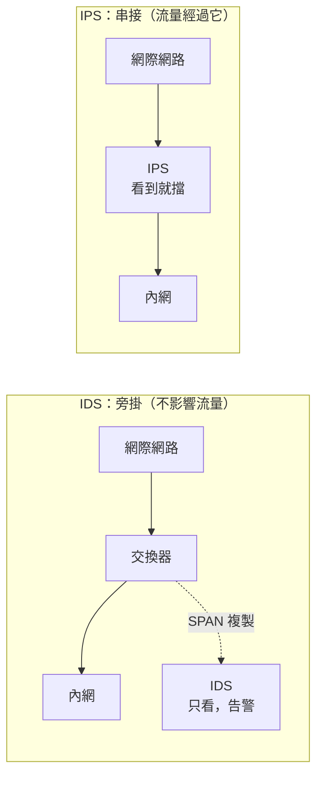
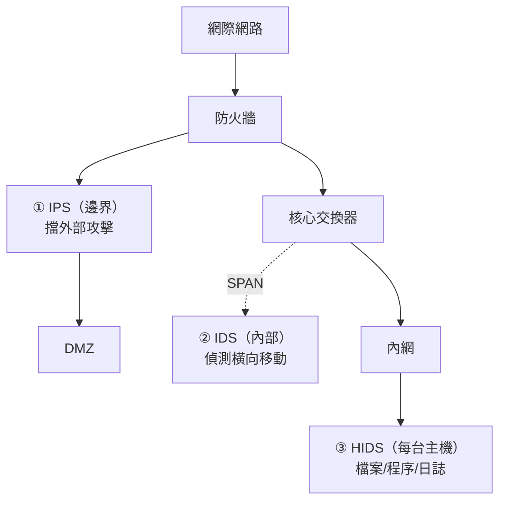

# 入侵偵測與防禦 IDS／IPS

> [!abstract] 這篇你會學到
> - 用**警報器 vs 自動鎖門**的比喻分清楚 IDS 與 IPS
> - 理解**防火牆與 IDS 的分工**（這是最常被問的問題）
> - 分辨 **NIDS（網路型）** 與 **HIDS（主機型）**，知道兩者互補
> - 理解**特徵式**與**異常式**偵測的優缺點
> - 明白**誤判（False Positive）為什麼是 IPS 最大的挑戰**
> - 認識 Snort、Suricata、Zeek、Wazuh 等主流工具
> - 學會 IDS/IPS 的部署與調校方法

## 前置知識

- [[090-05-02-guide-資安設備-防火牆與次世代防火牆]] — 防火牆的能力邊界
- [[090-05-01-guide-資安設備-資安全景圖與縱深防禦]] — 殺傷鏈與偵測的價值

---

## 觀念說明

### 核心比喻：警報器 vs 自動鎖門

| | **IDS**（Intrusion Detection System） | **IPS**（Intrusion Prevention System） |
| --- | --- | --- |
| 比喻 | **監視器 + 警報器**（響了叫人來） | **會自動鎖門的警報器** |
| 做什麼 | **只看，發現異常就告警** | **看到就擋** |
| 部署方式 | **旁掛**（Out-of-band，透過 SPAN/TAP 複製流量） | **串接**（In-line，流量必須經過它） |
| 對流量的影響 | **零**（複本，不影響正常流量） | 增加延遲；**它掛了流量可能全斷** |
| 誤判的後果 | 產生一則假告警（**煩，但無害**） | **擋掉正常業務**（可能造成服務中斷） |
| 需要什麼 | **有人看告警** | 精準的規則調校 |



> [!warning] IPS 的兩難
> **串接部署代表它是單點故障**：
> - 它當機了 → 網路可能全斷（除非有 **fail-open** 設計）
> - 它誤判了 → **正常業務被擋掉**
> - 它太慢了 → 整個網路變慢
>
> **這就是為什麼很多組織一開始把 IPS 設成「只偵測不阻擋」（IDS 模式）**，
> 跑一段時間確認誤判可控之後，才逐步開啟阻擋。

> [!tip] fail-open vs fail-close
> IPS 硬體故障時的行為：
> | 模式 | 行為 | 適合 |
> | --- | --- | --- |
> | **fail-open** | **直接放行**（網路不斷，但失去保護） | **可用性優先**（多數企業） |
> | **fail-close** | **全部阻斷**（安全但網路斷線） | **安全優先**（軍事、金融核心） |
>
> **這是採購與部署時必須明確決定的事**，
> 而且要和業務單位討論後寫進文件。

---

## 防火牆與 IDS 的分工

> [!note] 這是最常被問的問題
> **防火牆**擋的是「**你預先知道不該通過**」的東西
> —— 不該開放的埠、不該來的來源 IP。
>
> **IDS/IPS** 看的是「**通過防火牆的流量裡，有沒有壞東西**」。

> [!example] 用門禁比喻
> **防火牆是門口警衛檢查證件**：
> 「你有識別證嗎？有 → 進去。沒有 → 出去。」
>
> **IDS 是館內的監視器**：
> 「這個人有識別證進來了，但他為什麼在撬保險箱？」
>
> **防火牆看不到的**：
> - 從**被允許的埠**（443）進來的 SQL Injection
> - 已認證使用者的**惡意行為**
> - 內部機器之間的**橫向移動**
>
> 「防火牆主要阻絕**預想到**的攻擊；
> IDS 阻絕**預想不到、難以拒絕來源**的攻擊。」

| 情境 | 防火牆 | IDS/IPS |
| --- | --- | --- |
| 有人連 3389 埠 | ✅ 直接擋掉 | — |
| 從 443 埠送 SQL Injection | ❌ 看不到 | ✅ 偵測到攻擊特徵 |
| 內部機器互相掃描 | ❌（同網段不經過） | ✅ NIDS 可偵測 |
| 使用者下載惡意檔案 | ❌ | ✅ 可能偵測到 |
| 惡意程式回連 C&C | ⚠️ 出向規則可能擋到 | ✅ 偵測已知的 C&C 位址與行為 |

---

## NIDS vs HIDS

| | **NIDS**（網路型） | **HIDS**（主機型） |
| --- | --- | --- |
| 裝在哪 | **網路上**（透過 SPAN/TAP） | **每一台主機上**（agent） |
| 看得到 | **網路流量**、跨主機的行為 | **檔案變更、程序、本機日誌、登入紀錄** |
| **加密流量** | ❌ **看不到內容** | ✅ **看得到解密後的內容** |
| 涵蓋範圍 | 一次看整個網段 | 只看自己那一台 |
| 效能影響 | 對主機零影響 | 消耗主機資源 |
| 部署成本 | 幾個關鍵點 | **每台都要裝** |
| 代表工具 | **Snort、Suricata、Zeek** | **Wazuh、OSSEC、AIDE、auditd** |

> [!warning] NIDS 最大的困境：加密流量
> 現在**絕大多數的網路流量都是加密的**（HTTPS、TLS）。
>
> NIDS 只能看到：
> - 來源／目的 IP 與埠
> - 連線的時間與大小
> - TLS 的 **SNI**（要連的網域名稱）
> - 憑證資訊
> - **流量模式**（頻率、大小、時間規律）
>
> **看不到實際的內容。**
>
> **這代表**：
> - 傳統的「特徵比對」在加密流量上大幅失效
> - 現代 NIDS 轉向**行為與流量分析**（NDR 的方向）
> - **HIDS 的重要性上升**（它在解密之後的主機上）

> [!tip] 兩者互補，不是二選一
> 現代做法是：
> ```
> NIDS  → 看整體流量、發現橫向移動與異常連線
> HIDS  → 看主機內部的細節（檔案被改、可疑程序、登入異常）
> 兩者的日誌 → 送到 SIEM 做關聯分析
> ```
>
> 而且 **HIDS 與 EDR 的界線越來越模糊** ——
> 見 [[090-05-05-guide-資安設備-端點防護AV-EDR-XDR]]。

---

## 兩種偵測方式

### 特徵式（Signature-based / 簽章偵測）

**比對已知攻擊的特徵碼**，就像防毒軟體的病毒碼。

```
規則範例（Snort/Suricata 語法）：
alert tcp any any -> $HOME_NET 80 (msg:"SQL Injection attempt";
  content:"union select"; nocase; sid:1000001;)
```

| 優點 | 缺點 |
| --- | --- |
| **準確，誤判少** | **只認得已知的攻擊** |
| 告警明確（知道是什麼攻擊） | **零時差攻擊完全擋不住** |
| 容易理解與調校 | 攻擊者稍微變形就繞過 |
| 規則可以共享 | 規則庫越來越大，影響效能 |

### 異常式（Anomaly-based）

**先建立「正常行為」的基準，偏離就告警。**

```
基準：這台伺服器平常晚上 10 點到早上 6 點沒有流量
偵測：凌晨 3 點出現大量對外連線 → 告警
```

| 優點 | 缺點 |
| --- | --- |
| **可能發現未知的攻擊** | **誤判多**，需要大量調校 |
| 對零時差有機會 | **需要學習期**建立基準 |
| 能發現內部威脅 | 告警不明確（只知道「不正常」） |

### 行為分析（Behavior-based）

**監視使用者與實體的行為模式**（UEBA，User and Entity Behavior Analytics）。

> [!example] 行為分析能發現什麼
> - 「這個帳號平常只在上班時間、從辦公室登入，
>   **今天凌晨 3 點從國外登入**」
> - 「這個使用者平常一天存取 10 個檔案，
>   **今天下載了 5000 個**」（可能是離職前帶走資料）
> - 「這台伺服器平常只跟 3 台機器通訊，
>   **今天連了 200 台**」（橫向掃描）

> [!tip] 三種方式應該併用
> | 方式 | 抓什麼 |
> | --- | --- |
> | **特徵式** | 已知攻擊（大部分的自動化攻擊） |
> | **異常式** | 未知攻擊、變形的攻擊 |
> | **行為分析** | **內部威脅、帳號被盜** |
>
> 現代的 IDS/NDR/SIEM 產品通常三種都有。

---

## 誤判：IPS 最大的挑戰

> [!danger] 誤判（False Positive）會讓 IPS 變成阻斷服務的工具
> **真實會發生的情況**：
> - 某個規則誤判正常的 API 請求 → **整個業務系統掛掉**
> - 更新規則庫後突然大量誤擋 → **早上上班全部連不上**
> - 誤判來源 IP 為攻擊者 → **把整個分支機構封鎖了**

| 四種結果 | 說明 | 後果 |
| --- | --- | --- |
| **True Positive** | 真的是攻擊，也偵測到了 | ✅ 理想 |
| **True Negative** | 正常流量，沒有告警 | ✅ 理想 |
| **False Positive（誤判）** | 正常流量被當成攻擊 | ⚠️ **IPS 會擋掉業務** |
| **False Negative（漏判）** | 真的攻擊沒被偵測到 | ❌ **最危險** |

> [!warning] 「告警疲勞」是真實的問題
> 一台沒有調校的 IDS 可能一天產生**數萬則告警**，
> 其中 99% 是誤判或低價值的雜訊。
>
> **結果**：
> 1. 資安人員開始忽略告警
> 2. **真正的攻擊淹沒在雜訊裡**
> 3. 最後乾脆把系統關掉
>
> **這比沒有 IDS 更糟** —— 因為你以為自己有保護。

### 調校的方法

> [!tip] IPS 的正確導入四階段
> **階段一：純偵測（1～2 個月）**
> - 設成 IDS 模式（**只告警不阻擋**）
> - 收集所有告警，**不做任何處理**
>
> **階段二：分析與調校**
> - 統計「哪些規則告警最多」
> - 逐一判斷：這是真的攻擊，還是誤判？
> - **誤判的規則 → 停用或加入例外**
> - 調整規則的 **Paranoia Level / 敏感度**
>
> **階段三：逐步開啟阻擋**
> - **先擋「高信心度」的規則**（明確的攻擊特徵）
> - 一次開一小批，**觀察一週**
> - 有問題立刻回退
>
> **階段四：持續維運**
> - 規則庫更新後**先在測試模式跑**
> - 定期檢視告警趨勢
> - 建立「誤判回報」的流程

```bash
# 統計哪些規則告警最多（Suricata）
$ sudo jq -r 'select(.event_type=="alert") | .alert.signature' /var/log/suricata/eve.json \
  | sort | uniq -c | sort -rn | head -20
   8234 ET INFO Observed DNS Query to .cloud TLD
   3102 ET POLICY curl User-Agent Outbound
    892 ET SCAN Suspicious inbound to MSSQL port 1433
     12 ET EXPLOIT Possible SQL Injection
     ^^^                                    ← 前面那些是雜訊，這個才是重點
```

> [!tip] 先處理「告警最多」的前 10 條規則
> 通常前 10 條規則就佔了 90% 的告警量，
> 而它們**幾乎都是雜訊**（政策類、資訊類的規則）。
>
> 把它們停用或降級，告警量會立刻降到可管理的程度。

---

## 主流工具

### 網路型（NIDS/NIPS）

| 工具 | 類型 | 特點 |
| --- | --- | --- |
| **Snort** | 開源 | 元老級，規則語法是業界標準；Snort 3 效能大幅提升 |
| **Suricata** | 開源 | **多執行緒**、效能好、支援 IPS 模式、可輸出 JSON 給 SIEM |
| **Zeek**（原 Bro） | 開源 | **不是傳統 IDS** —— 它產生**豐富的網路中繼資料**，適合威脅獵捕 |
| 商用 NGFW 內建 IPS | 商用 | Palo Alto、Fortinet、Check Point 等 |

> [!note] Zeek 的定位很不一樣
> Snort/Suricata 是「**比對特徵，符合就告警**」。
>
> **Zeek 是「把網路流量轉成結構化的日誌」** ——
> 它會產生：
> ```
> conn.log     每一條連線的摘要
> dns.log      所有 DNS 查詢
> http.log     所有 HTTP 請求
> ssl.log      所有 TLS 交握（含憑證、SNI）
> files.log    傳輸的檔案（含雜湊）
> ```
>
> **這些日誌本身不告警，但它是威脅獵捕（Threat Hunting）的黃金資料**。
>
> 例如：「找出所有連到剛註冊不到 30 天的網域的機器」——
> 這種查詢用 Zeek 的 `dns.log` 就能做到，特徵式 IDS 做不到。

### 主機型（HIDS）

| 工具 | 特點 |
| --- | --- |
| **Wazuh** | **開源、功能完整**：檔案完整性監控、日誌分析、弱點偵測、法遵檢查；有中央管理介面 |
| OSSEC | Wazuh 的前身 |
| **AIDE** | 純**檔案完整性監控**，輕量 |
| **auditd** | Linux 核心層級的稽核，記錄系統呼叫 |
| Tripwire | 商用/開源的檔案完整性監控 |

> [!tip] 機關的高 CP 值組合
> ```
> Suricata（NIDS）  → 網路層偵測
> Wazuh（HIDS+SIEM）→ 主機偵測 + 日誌集中 + 法遵檢查
> ```
> **兩者都是開源、免費，而且 Wazuh 內建 SIEM 功能**，
> 可以把 Suricata 的告警一起收進來。
>
> 對預算有限但有人力的機關，這是很實際的起點。

---

## 完整實戰範例

### 部署 Suricata（IDS 模式）

```bash
# 安裝
$ sudo apt install suricata

# 更新規則（Emerging Threats 開源規則集）
$ sudo suricata-update
$ sudo suricata-update list-sources
$ sudo suricata-update enable-source et/open

# 設定監聽的介面與內部網段
$ sudo nano /etc/suricata/suricata.yaml
```

```yaml
vars:
  address-groups:
    HOME_NET: "[192.168.0.0/16,10.0.0.0/8,172.16.0.0/12]"   # 你的內網
    EXTERNAL_NET: "!$HOME_NET"

af-packet:
  - interface: eth0
    cluster-id: 99
    cluster-type: cluster_flow
    defrag: yes

outputs:
  - eve-log:
      enabled: yes
      filetype: regular
      filename: eve.json          # JSON 格式，方便送進 SIEM
      types:
        - alert
        - dns
        - http
        - tls
        - flow
```

```bash
# 檢查設定
$ sudo suricata -T -c /etc/suricata/suricata.yaml -v

# 啟動
$ sudo systemctl enable --now suricata
$ sudo systemctl status suricata

# 看告警
$ sudo tail -f /var/log/suricata/fast.log
08/27/2026-10:23:45.123456  [**] [1:2010935:3] ET SCAN Suspicious inbound to
  MSSQL port 1433 [**] [Classification: Potentially Bad Traffic] [Priority: 2]
  {TCP} 203.0.113.99:54321 -> 192.168.1.50:1433

# 用 jq 分析 JSON 日誌
$ sudo jq -r 'select(.event_type=="alert") |
    "\(.timestamp) \(.src_ip) -> \(.dest_ip) \(.alert.signature)"' \
    /var/log/suricata/eve.json | tail -20
```

### 測試 IDS 是否正常運作

```bash
# Suricata 內建一條測試規則（或自己加一條）
$ sudo nano /etc/suricata/rules/local.rules
```
```
alert http any any -> any any (msg:"LOCAL TEST - suspicious UA"; \
  http.user_agent; content:"IDS-TEST-STRING"; sid:9000001; rev:1;)
```
```bash
# 確認 local.rules 有被載入（suricata.yaml 的 rule-files）
$ sudo systemctl restart suricata

# 從另一台機器觸發
$ curl -A "IDS-TEST-STRING" http://你的網站/

# 應該會在 fast.log 看到告警
$ sudo tail -5 /var/log/suricata/fast.log
```

> [!tip] 一定要驗證 IDS 真的在運作
> 常見的失敗：
> - 監聽的介面錯了（沒收到流量）
> - SPAN 設定錯誤
> - `HOME_NET` 設錯，所有流量都被當成內部
> - 規則沒有載入
>
> **裝好之後一定要用測試規則驗證一次**，
> 而且**定期重測**（設定可能被改動）。

### 部署 Wazuh（HIDS）

```bash
# 在 agent（被監控的主機）上
$ curl -sO https://packages.wazuh.com/4.x/wazuh-install.sh
$ sudo bash wazuh-install.sh --wazuh-agent

# 設定連到 manager
$ sudo nano /var/ossec/etc/ossec.conf
```
```xml
<ossec_config>
  <client>
    <server>
      <address>192.168.1.100</address>   <!-- Wazuh manager -->
    </server>
  </client>

  <!-- 檔案完整性監控 -->
  <syscheck>
    <frequency>43200</frequency>          <!-- 12 小時掃一次 -->
    <directories check_all="yes" realtime="yes">/etc</directories>
    <directories check_all="yes" realtime="yes">/usr/bin,/usr/sbin</directories>
    <directories check_all="yes">/var/www</directories>
    <ignore>/etc/mtab</ignore>
    <ignore>/etc/random-seed</ignore>
  </syscheck>

  <!-- 收集日誌 -->
  <localfile>
    <log_format>syslog</log_format>
    <location>/var/log/auth.log</location>
  </localfile>
  <localfile>
    <log_format>syslog</log_format>
    <location>/var/log/nginx/access.log</location>
  </localfile>
</ossec_config>
```

```bash
$ sudo systemctl restart wazuh-agent
$ sudo tail -f /var/ossec/logs/ossec.log
```

> [!tip] Wazuh 開箱就有的功能
> | 功能 | 說明 |
> | --- | --- |
> | **檔案完整性監控（FIM）** | `/etc`、系統執行檔被改動就告警 |
> | **日誌分析** | 自動解析並偵測 SSH 暴力破解、sudo 濫用等 |
> | **Rootkit 偵測** | 檢查隱藏的檔案與程序 |
> | **弱點偵測** | 比對已安裝套件與 CVE 資料庫 |
> | **法遵檢查（SCA）** | 內建 **CIS Benchmark** 檢查 |
> | **主動回應** | 偵測到攻擊可自動封鎖 IP |
>
> **對機關而言，「法遵檢查」與「弱點偵測」的價值很高** ——
> 它能自動產出「哪些主機不符合 CIS 基準」的報表。
> 見 [[090-06-07-guide-TWGCB-Linux檢測與符合性報告]]。

### 用簡單的方式做「窮人版 HIDS」

如果連 Wazuh 都沒資源部署，至少做這三件事：

```bash
# 1. AIDE：檔案完整性監控
$ sudo apt install aide
$ sudo aideinit                              # 建立基準（在乾淨的系統上）
$ sudo mv /var/lib/aide/aide.db.new /var/lib/aide/aide.db
$ sudo aide --check                          # 之後定期檢查

# 加進每日排程
$ echo '0 4 * * * root /usr/bin/aide --check | mail -s "AIDE Report" admin@example.com' \
  | sudo tee /etc/cron.d/aide

# 2. auditd：稽核關鍵操作
$ sudo apt install auditd
$ sudo auditctl -w /etc/passwd -p wa -k passwd_changes
$ sudo auditctl -w /etc/shadow -p wa -k shadow_changes
$ sudo auditctl -w /etc/sudoers -p wa -k sudoers_changes
$ sudo ausearch -k passwd_changes            # 查詢

# 3. Fail2ban：自動封鎖暴力破解
$ sudo apt install fail2ban
$ sudo systemctl enable --now fail2ban
$ sudo fail2ban-client status sshd
```

---

## 部署位置



| 位置 | 型態 | 主要偵測 |
| --- | --- | --- |
| **① 邊界（防火牆後）** | IPS | 外部攻擊、掃描、漏洞利用 |
| **② 內部核心（SPAN）** | IDS | **橫向移動**、內部異常、C&C 回連 |
| **③ 每台主機** | HIDS | 檔案變更、可疑程序、登入異常 |

> [!warning] 只在邊界部署是不夠的
> 很多組織只在網際網路出口放了 IPS，
> **但攻擊者一旦進入內網（透過釣魚），
> 後續所有的橫向移動都不經過那台設備**。
>
> **內部的偵測能力（② 與 ③）往往比邊界更重要** ——
> 因為現代攻擊的起點幾乎都在內部（使用者點了釣魚連結）。

### SPAN vs TAP

| | **SPAN / 埠鏡像** | **網路 TAP** |
| --- | --- | --- |
| 怎麼做 | 交換器**軟體複製**流量到指定埠 | **實體分光/分電**設備串在線路上 |
| 成本 | 免費（交換器功能） | 需要買設備 |
| 影響 | 消耗交換器 CPU；**高負載時可能丟封包** | **零影響，不會丟包** |
| 可靠性 | 中 | **高** |
| 適合 | 一般環境 | 高流量、需要完整性的環境 |

```cisco
! Cisco：設定 SPAN
monitor session 1 source vlan 10 , 20 both
monitor session 1 destination interface GigabitEthernet0/24
```

---

## 常見錯誤與排錯

| 現象／錯誤 | 原因 | 解法 |
| --- | --- | --- |
| IDS 裝好但沒有任何告警 | 監聽介面錯、SPAN 沒設好、規則沒載入 | **用測試規則驗證**；`suricata -T` 檢查設定 |
| 一天幾萬則告警，沒人看得完 | **沒有調校**，規則全開 | 統計告警最多的前 10 條，停用雜訊規則 |
| **IPS 誤擋正常業務** | 規則太敏感、沒有例外 | **先跑 IDS 模式 1～2 個月**再開阻擋 |
| 規則更新後大量誤擋 | 新規則沒測試 | **新規則先在偵測模式跑一週** |
| HTTPS 流量什麼都看不到 | **NIDS 看不到加密內容** | 用 HIDS；或在 NGFW 做 SSL 解密；或用流量行為分析 |
| IPS 拖慢整個網路 | 效能不足或規則太多 | 看實際吞吐量規格；停用不需要的規則類別 |
| IPS 當機導致網路全斷 | **fail-close 設計** | 評估改成 fail-open；或部署 HA |
| SPAN 埠丟封包 | 交換器負載高、來源流量 > 目的埠頻寬 | 改用 TAP；或減少 SPAN 的來源 |
| 只在邊界部署，內部完全沒偵測 | 架構規劃不足 | **內部核心也要 SPAN 到 IDS**；部署 HIDS |
| 告警都是內部管理流量 | `HOME_NET` 設錯 | 正確設定內外網段 |
| 磁碟被日誌塞爆 | 沒有輪替與容量規劃 | 設定 logrotate；送到 SIEM 並限制本機保留 |

---

## 安全性注意事項

> [!danger] 沒有人看的告警等於沒有偵測
> **這是 IDS/SIEM 最大的失敗模式。**
>
> 你可以買最貴的設備、產生最完整的告警，
> 但**如果沒有人每天看，它就只是一台很貴的日誌產生器**。
>
> **部署前必須先回答**：
> | 問題 | |
> | --- | --- |
> | **誰負責看告警？** | 具體到人，不是「資訊室」 |
> | **多久看一次？** | 即時？每天？每週？ |
> | **看到告警之後做什麼？** | 有沒有處理流程（SOP）？ |
> | **高風險告警怎麼即時通知？** | Email？簡訊？值班手機？ |
> | **非上班時間怎麼辦？** | 有沒有輪班或外包 SOC？ |
>
> **如果這五題答不出來，先不要買設備** ——
> 先建立流程與人力，或考慮委外 SOC 服務。

> [!warning] IDS/IPS 本身也可能被攻擊
> | 攻擊 | 說明 |
> | --- | --- |
> | **規避（Evasion）** | 用分片、編碼變形、慢速攻擊來繞過特徵比對 |
> | **告警淹沒** | 故意觸發大量誤判，讓真正的攻擊淹沒在雜訊中 |
> | **針對 IDS 的漏洞** | IDS 要解析各種協定，本身可能有解析漏洞 |
> | **停用 agent** | HIDS 的 agent 可能被有權限的攻擊者停用 |
>
> **防護**：
> - 保持 IDS 軟體與規則更新
> - **監控 IDS/HIDS agent 本身的健康狀態**（斷線要告警）
> - HIDS 的日誌**即時送到中央**（本機日誌可能被清掉）
> - agent 用受保護的服務帳號執行

> [!tip] 檔案完整性監控（FIM）是最被低估的防護
> **原理很簡單**：系統檔案不該被改動，改了就告警。
>
> **能抓到什麼**：
> - **後門被植入**（`/usr/bin` 多了一個檔案）
> - 系統執行檔被替換（**rootkit**）
> - 設定檔被竄改（`/etc/passwd`、`sshd_config`、防火牆規則）
> - 網站檔案被掛馬
>
> **成本極低**（AIDE 是免費的），**但效果很好**。
> 這也是 **TWGCB 與 CIS 基準的要求項目**。
>
> **注意**：要在**乾淨的系統上建立基準**，
> 而且**基準資料庫本身要保護好**（否則攻擊者會一起改掉）。

---

## 速查表

### IDS vs IPS

| | IDS | IPS |
| --- | --- | --- |
| 比喻 | **警報器** | **自動鎖門** |
| 部署 | **旁掛（SPAN/TAP）** | **串接（in-line）** |
| 對流量影響 | 零 | 有延遲，可能是單點故障 |
| 誤判後果 | 假告警（煩） | **擋掉業務（嚴重）** |

### NIDS vs HIDS

| | NIDS | HIDS |
| --- | --- | --- |
| 位置 | 網路 | 每台主機 |
| 看得到 | 流量、跨主機行為 | **檔案、程序、日誌** |
| **加密流量** | ❌ **看不到** | ✅ 看得到 |
| 代表 | **Suricata、Snort、Zeek** | **Wazuh、AIDE、auditd** |

### 三種偵測方式

| 方式 | 抓什麼 | 缺點 |
| --- | --- | --- |
| **特徵式** | 已知攻擊 | 零時差擋不住 |
| **異常式** | 未知攻擊 | 誤判多 |
| **行為分析** | 內部威脅、帳號被盜 | 需要學習期 |

### 四種偵測結果

| | 有攻擊 | 沒攻擊 |
| --- | --- | --- |
| **告警** | True Positive ✅ | **False Positive（誤判）⚠️** |
| **沒告警** | **False Negative（漏判）❌** | True Negative ✅ |

### IPS 導入四階段

1. **純偵測 1～2 個月**（只告警不擋）
2. **分析與調校**（停用雜訊規則）
3. **逐步開啟阻擋**（先擋高信心度的）
4. **持續維運**（新規則先測試）

### 部署前必答五題

1. 誰負責看告警？
2. 多久看一次？
3. 看到之後做什麼？
4. 高風險怎麼即時通知？
5. 非上班時間怎麼辦？

### 常用指令

| 目的 | 指令 |
| --- | --- |
| Suricata 檢查設定 | `sudo suricata -T -c /etc/suricata/suricata.yaml -v` |
| 更新規則 | `sudo suricata-update` |
| 看告警 | `sudo tail -f /var/log/suricata/fast.log` |
| **統計告警排行** | `jq -r 'select(.event_type=="alert").alert.signature' eve.json \| sort \| uniq -c \| sort -rn` |
| AIDE 建立基準 | `sudo aideinit` |
| AIDE 檢查 | `sudo aide --check` |
| auditd 加規則 | `sudo auditctl -w /etc/passwd -p wa -k passwd_changes` |
| auditd 查詢 | `sudo ausearch -k passwd_changes` |
| Fail2ban 狀態 | `sudo fail2ban-client status sshd` |

---

## 練習題

> [!question]- 練習 1：部署並驗證 Suricata
> ```bash
> sudo apt install suricata
> sudo suricata-update
> # 設定 HOME_NET 為你的內網
> sudo nano /etc/suricata/suricata.yaml
> sudo suricata -T -c /etc/suricata/suricata.yaml -v
> sudo systemctl enable --now suricata
> ```
> 然後**加一條測試規則並驗證它會告警**（見本篇範例）。
>
> 跑一天後統計告警排行，回答：
> 1. 一天總共幾則告警？
> 2. 前 5 名的規則各是什麼？
> 3. 它們是真的攻擊還是雜訊？

> [!question]- 練習 2：用 AIDE 做檔案完整性監控
> ```bash
> sudo apt install aide
> sudo aideinit                    # 需要幾分鐘
> sudo mv /var/lib/aide/aide.db.new /var/lib/aide/aide.db
>
> # 故意改一個檔案
> sudo touch /etc/test-file
> echo "# test" | sudo tee -a /etc/hosts
>
> # 檢查
> sudo aide --check
> ```
> 觀察它是否正確報出變更。
> 想想：如果攻擊者植入了後門，這個機制抓得到嗎？

> [!question]- 練習 3：規劃你的偵測架構
> 為你的環境規劃 IDS/IPS 部署：
> 1. 邊界要不要放 IPS？fail-open 還是 fail-close？
> 2. 內部要在哪裡做 SPAN？監看哪些 VLAN？
> 3. 哪些主機要裝 HIDS？（提示：至少所有伺服器）
> 4. **誰負責看告警？多久看一次？**
> 5. 高風險告警怎麼通知？
> 6. 日誌要保存多久？存在哪裡？
>
> **第 4、5 題答不出來的話，先解決那個再談設備。**

---

## 小測驗

Q1. IDS 與 IPS 的三個主要差別是什麼？各用一個比喻說明。

Q2. 什麼是 fail-open 與 fail-close？各適合什麼環境？為什麼這是必須明確決定的事？

Q3. **防火牆與 IDS 的分工是什麼**？請舉三個「防火牆看不到但 IDS 看得到」的情境。

Q4. NIDS 與 HIDS 的差別是什麼？**為什麼現在 HIDS 的重要性上升**？

Q5. 特徵式與異常式偵測各有什麼優缺點？為什麼三種方式應該併用？

Q6. False Positive 與 False Negative 分別是什麼？對 IPS 而言哪一個的立即後果更嚴重？

Q7. 什麼是「告警疲勞」？為什麼說「沒有調校的 IDS 比沒有 IDS 更糟」？

Q8. IPS 的正確導入應該分哪四個階段？為什麼不能一開始就開啟阻擋？

Q9. Zeek 與 Snort/Suricata 的定位有什麼不同？Zeek 適合做什麼？

Q10. 部署 IDS 之前必須先回答哪五個問題？為什麼「檔案完整性監控（FIM）是最被低估的防護」？

> [!question]- 測驗答案
> **Q1.** ①**行為**：IDS **只看，發現異常就告警**（像**監視器 + 警報器**）；
> IPS **看到就擋**（像**會自動鎖門的警報器**）。
> ②**部署方式**：IDS **旁掛**（透過 SPAN/TAP 複製流量，不影響正常流量）；
> IPS **串接**（流量必須經過它）。
> ③**誤判後果**：IDS 只是產生假告警（煩但無害）；
> **IPS 會擋掉正常業務**（可能造成服務中斷）。
>
> **Q2.** **fail-open** = IPS 故障時**直接放行**（網路不斷，但失去保護），
> 適合**可用性優先**的環境（多數企業）；
> **fail-close** = 故障時**全部阻斷**（安全但網路斷線），
> 適合**安全優先**的環境（軍事、金融核心）。
> 必須明確決定，是因為它決定了「設備故障時業務會不會中斷」，
> **必須和業務單位討論後寫進文件**。
>
> **Q3.** **防火牆擋「你預先知道不該通過」的東西**（不該開放的埠、來源 IP）；
> **IDS 看「通過防火牆的流量裡有沒有壞東西」**。
> 三個防火牆看不到的情境：
> ①**從被允許的 443 埠送 SQL Injection**；
> ②**已認證使用者的惡意行為**；
> ③**內部機器之間的橫向移動**（同網段根本不經過防火牆）。
>
> **Q4.** **NIDS 裝在網路上**（透過 SPAN/TAP），看流量與跨主機行為；
> **HIDS 裝在每一台主機上**，看檔案變更、程序、本機日誌、登入紀錄。
> **HIDS 重要性上升**是因為**現在絕大多數網路流量都加密了** ——
> NIDS 只看得到 IP、埠、SNI、憑證與流量模式，**看不到實際內容**，
> 傳統的特徵比對大幅失效；而 **HIDS 在解密之後的主機上，看得到完整內容**。
>
> **Q5.** **特徵式**：比對已知攻擊特徵碼 ——
> 優點是**準確、誤判少、告警明確**；缺點是**只認得已知攻擊，零時差完全擋不住**。
> **異常式**：建立正常行為基準，偏離就告警 ——
> 優點是**可能發現未知攻擊**；缺點是**誤判多、需要學習期、告警不明確**。
> 應該併用是因為它們**抓的東西不同**：
> 特徵式抓已知攻擊、異常式抓未知攻擊、行為分析抓**內部威脅與帳號被盜**。
>
> **Q6.** **False Positive（誤判）** = 正常流量被當成攻擊；
> **False Negative（漏判）** = 真的攻擊沒被偵測到。
> 對 IPS 而言，**False Positive 的立即後果更嚴重** ——
> 它會**直接擋掉正常業務**，可能造成服務中斷。
> （但 False Negative 長期而言更危險，因為攻擊成功了你卻不知道。）
>
> **Q7.** 「告警疲勞」是指一台沒有調校的 IDS 一天產生**數萬則告警**，
> 其中 99% 是誤判或雜訊，導致資安人員**開始忽略告警**，
> **真正的攻擊淹沒在雜訊裡**，最後乾脆把系統關掉。
> 說它比沒有 IDS 更糟，是因為**你以為自己有保護，實際上沒有**。
>
> **Q8.** ①**純偵測 1～2 個月**（設成 IDS 模式，只告警不阻擋，收集資料）；
> ②**分析與調校**（統計告警最多的規則，判斷真假，停用誤判規則）；
> ③**逐步開啟阻擋**（先擋高信心度的規則，一次一小批，觀察一週）；
> ④**持續維運**（新規則先在測試模式跑，定期檢視趨勢）。
> 不能一開始就阻擋，是因為**未調校的規則會大量誤擋正常業務**，
> 造成服務中斷，而且會讓業務單位對資安措施失去信任。
>
> **Q9.** **Snort/Suricata 是「比對特徵，符合就告警」**；
> **Zeek 是「把網路流量轉成結構化的日誌」**
> （conn.log、dns.log、http.log、ssl.log、files.log），
> **它本身不告警**。
> Zeek 適合做**威脅獵捕（Threat Hunting）** ——
> 例如「找出所有連到剛註冊不到 30 天的網域的機器」，
> 這種查詢用 Zeek 的日誌就能做到，特徵式 IDS 做不到。
>
> **Q10.** **五個必答問題**：
> ①**誰負責看告警**（具體到人）；②**多久看一次**；
> ③**看到告警之後做什麼**（有沒有 SOP）；
> ④**高風險告警怎麼即時通知**；⑤**非上班時間怎麼辦**。
> **FIM 被低估**是因為它**原理極簡單、成本極低（AIDE 免費）、但效果很好** ——
> 它能抓到**後門被植入、系統執行檔被替換（rootkit）、
> 設定檔被竄改、網站被掛馬**，
> 而這些正是攻擊者「安裝」與「持久化」階段必然留下的痕跡。
> 它也是 TWGCB 與 CIS 基準的要求項目。

---

## 延伸閱讀

- [[090-05-02-guide-資安設備-防火牆與次世代防火牆]] — 防火牆與 IDS 的分工
- [[090-05-04-guide-資安設備-Web應用防火牆WAF]] — 應用層的專用偵測
- [[090-05-05-guide-資安設備-端點防護AV-EDR-XDR]] — HIDS 的演進方向
- [[090-05-09-guide-資安設備-日誌集中與SIEM]] — **告警要送到哪裡、誰來看**
- [[090-05-16-guide-資安設備-資安設備選型與導入實務]] — 導入前的準備
- [[090-02-05-guide-防護-Fail2ban入侵防護]] — 輕量版的自動阻擋（進階）
- [[090-02-08-guide-防護-系統強化與稽核]] — auditd 與稽核設定（進階）
