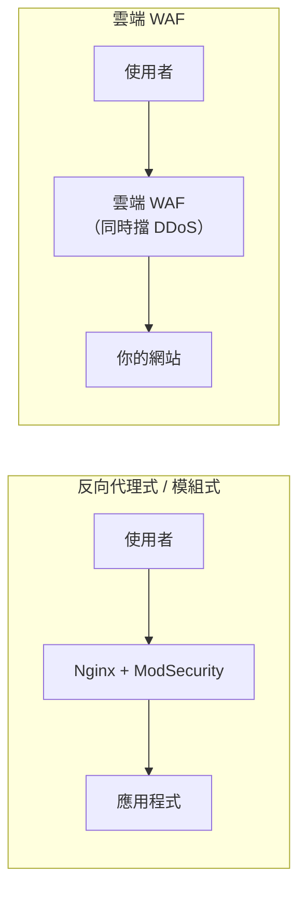

# Web 應用防火牆 WAF

> [!abstract] 這篇你會學到
> - 理解 **WAF 與一般防火牆的分工**（為什麼防火牆擋不住 SQL Injection）
> - 認識 **OWASP Top 10** 與 WAF 能擋／不能擋的部分
> - 分辨三種部署方式：**反向代理式、雲端式、模組式**
> - 理解 **OWASP CRS** 與 **Paranoia Level** 的取捨
> - 掌握**誤判排除**的方法（這是 WAF 導入最大的工作量）
> - 知道 **API 安全**的額外需求
> - 學會用 ModSecurity 實際部署與調校

## 前置知識

- [[010-02-13-guide-網概-HTTP與HTTPS]] — HTTP 請求結構
- [[090-05-03-guide-資安設備-入侵偵測與防禦IDS-IPS]] — IDS/IPS 的概念與誤判問題

---

## 觀念說明

### 為什麼防火牆擋不住網站攻擊

> [!example] 傳統防火牆的世界觀
> 傳統防火牆看的是：**「這個封包要去 443 埠嗎？」**
>
> 你的網站對外開放 443 —— 所以**所有連到 443 的流量都會被放行**。
>
> **但攻擊就藏在那些被放行的流量裡**：
> ```
> GET /product?id=1' UNION SELECT username,password FROM users--
>                     ^^^^^^^^^^^^^^^^^^^^^^^^^^^^^^^^^^^^^^^^^^
>                     這對防火牆而言只是一個正常的 HTTPS 請求
> ```
>
> **防火牆看不到 HTTP 的內容，更看不到 SQL 語法。**

| 層級 | 設備 | 看得到什麼 |
| --- | --- | --- |
| L3/L4 | 傳統防火牆 | IP、埠、協定 |
| L7（通用） | IPS | 網路封包中的已知攻擊特徵 |
| **L7（Web 專用）** | **WAF** | **完整的 HTTP 請求：URL、參數、標頭、Cookie、Body** |

### 核心比喻：針對特定招數的保鑣

> [!note] WAF 是「懂 Web 的保鑣」
> - **防火牆**是門口警衛：「你有沒有證件？」
> - **IPS** 是館內監視器：「這個人行為可疑」
> - **WAF** 是**懂拳擊的保鑣**：
>   「這個動作是**假動作接勾拳**，我知道你要幹嘛」
>
> WAF **理解 HTTP 與 Web 應用的語意**，
> 所以它能認出「這個參數裡的字串是 SQL 語法」、
> 「這個欄位裡有 `<script>` 標籤」。

---

## WAF 能擋什麼、不能擋什麼

### OWASP Top 10 對照

**OWASP Top 10** 是最權威的 Web 應用風險清單。

| 風險類別 | WAF 有效嗎 | 說明 |
| --- | --- | --- |
| **注入（SQLi、指令注入）** | ✅ **很有效** | 特徵明顯 |
| **XSS（跨站腳本）** | ✅ **有效** | 可偵測 `<script>` 等模式 |
| 失效的存取控制 | ⚠️ **有限** | WAF 不知道「這個使用者該不該看這筆資料」 |
| 加密機制失效 | ❌ | 是設定與程式的問題 |
| 安全設定缺陷 | ⚠️ 部分 | 可擋掉部分探測，但根因在設定 |
| **易受攻擊的元件** | ✅ **虛擬修補** | **在無法立即更新時爭取時間** |
| 身分驗證失效 | ⚠️ 部分 | 可做**暴力破解限速** |
| 軟體與資料完整性失效 | ❌ | 供應鏈問題 |
| **日誌與監控不足** | ✅ **附加價值** | WAF 提供完整的請求日誌 |
| **SSRF** | ⚠️ 部分 | 可擋掉部分模式 |

> [!danger] WAF 擋不住「業務邏輯漏洞」
> 這是 WAF 最大的能力邊界。
>
> **範例**：
> ```
> GET /api/order/1234        ← 我的訂單
> GET /api/order/1235        ← 改個數字就看到別人的訂單
> ```
>
> 這兩個請求**在 HTTP 層面完全正常** ——
> 沒有 SQL 語法、沒有 script 標籤、沒有任何攻擊特徵。
>
> **WAF 不知道「1235 不是你的訂單」。**
>
> 這叫 **IDOR（Insecure Direct Object Reference）**，
> 屬於「失效的存取控制」，**只能靠程式端做授權檢查**。
>
> **同類的還有**：
> - 修改價格參數（`price=1` 買一萬元的東西）
> - 重複使用一次性優惠券
> - 跳過付款步驟直接呼叫「完成訂單」的 API
> - 用別人的帳號 ID 修改資料

> [!warning] WAF 是「加一層防護」不是「取代安全的程式」
> **正確的定位**：
> ```
> 第一優先：寫安全的程式（參數化查詢、輸出編碼、授權檢查）
> 第二層：  WAF（擋掉大部分自動化攻擊、爭取修補時間）
> ```
>
> **不要因為有 WAF 就放鬆程式端的安全** ——
> WAF 可以被繞過（編碼變形、分段傳送、利用解析差異）。

### WAF 最有價值的一個功能：虛擬修補

> [!tip] Virtual Patching
> 情境：某個框架爆出重大漏洞，但你的系統**無法立即更新**
> （老舊系統、廠商還沒出修補、需要走變更流程）。
>
> **WAF 可以立刻加一條規則擋掉那個攻擊模式**，
> **爭取到修補的時間**。
>
> ```apache
> # 範例：Log4Shell 爆發時的緊急規則
> SecRule REQUEST_HEADERS|REQUEST_URI|ARGS "@rx \$\{jndi:" \
>     "id:9000100,phase:2,deny,status:403,log,\
>      msg:'Log4Shell JNDI injection attempt'"
> ```
>
> **這是 WAF 對機關最實際的價值** ——
> 因為機關常有「無法立即更新的老舊系統」。

---

## 三種部署方式

| 方式 | 說明 | 優點 | 缺點 |
| --- | --- | --- | --- |
| **反向代理式** | WAF 站在網站前面，流量先經過它 | **完整控制**、可改寫回應 | 單點故障；要處理 TLS |
| **模組式** | 直接嵌在 Web 伺服器裡（如 Nginx + ModSecurity） | **簡單、無額外跳點** | 消耗網站主機資源 |
| **雲端 WAF** | DNS 指到雲端服務，過濾後再回源 | **免維護、順便防 DDoS** | 流量經過第三方；月費 |
| 主機式（RASP） | 嵌在應用程式執行環境內 | **看得到程式內部的執行** | 需支援該語言 |



> [!warning] 用雲端 WAF 一定要鎖住來源 IP
> 雲端 WAF 的原理是「DNS 指到它，它過濾後再連你的源站」。
>
> **但如果攻擊者查到你的真實 IP，就能直接繞過 WAF**：
> ```
> 正常：使用者 → 雲端 WAF → 你的伺服器
> 繞過：攻擊者 ─────────────→ 你的伺服器（直連真實 IP）
> ```
>
> **必做**：
> ```bash
> # 防火牆只允許雲端 WAF 的 IP 範圍連進來
> ufw default deny incoming
> for ip in $(curl -s https://雲端WAF業者的IP清單); do
>     ufw allow from $ip to any port 443 proto tcp
> done
> ```
>
> **另外要注意**：
> - 舊的 DNS 記錄可能洩漏真實 IP（歷史 DNS 查詢服務查得到）
> - 郵件標頭、SSL 憑證透明度日誌也可能洩漏
> - 換用雲端 WAF 時**最好一併更換伺服器 IP**

---

## OWASP CRS 與 Paranoia Level

**OWASP CRS**（Core Rule Set）是最主流的開源 WAF 規則集。

### Paranoia Level（偏執等級）

CRS 用 **PL 1～4** 控制規則的嚴格程度：

| PL | 說明 | 誤判率 | 適合 |
| --- | --- | --- | --- |
| **PL 1** | 基本規則，**幾乎不誤判** | 極低 | **預設起點** |
| **PL 2** | 加入更多模式比對 | 低～中 | **調校後的一般網站** |
| PL 3 | 嚴格，會擋掉不常見但合法的輸入 | 中～高 | 高安全需求 |
| PL 4 | 極嚴格，**大量誤判** | 很高 | 極高安全需求（如金融核心） |

> [!tip] 從 PL 1 開始，不要一開始就上 PL 3
> **常見的失敗**：
> 直接套用 PL 3，結果一堆正常功能被擋掉，
> 業務單位抱怨，最後把 WAF 整個關掉。
>
> **正確做法**：
> ```
> 1. PL 1 + 只偵測模式（DetectionOnly）→ 跑兩週
> 2. 分析日誌，排除誤判
> 3. 改成阻擋模式
> 4. 穩定後考慮升到 PL 2，重複上述流程
> ```

### 異常分數機制（Anomaly Scoring）

CRS 3.x 用**累計分數**而非「符合一條就擋」：

```
每條規則有一個嚴重度分數：
  CRITICAL = 5
  ERROR    = 4
  WARNING  = 3
  NOTICE   = 2

請求的總分 >= 門檻（預設 5）→ 阻擋
```

> [!note] 為什麼用分數而不是直接擋
> 因為**單一規則命中不一定代表攻擊**。
>
> 例如「參數裡有單引號」——
> 這可能是 SQL Injection，也可能只是使用者的姓名是 `O'Brien`。
>
> **累計分數讓多個弱訊號組合成強訊號**：
> 「有單引號 **而且** 有 `UNION` **而且** 有註解符號」→ 分數超過門檻 → 擋。
>
> 你可以透過調整**門檻**來控制嚴格程度：
> ```apache
> SecAction "id:900110,phase:1,nolog,pass,t:none,\
>   setvar:tx.inbound_anomaly_score_threshold=5,\
>   setvar:tx.outbound_anomaly_score_threshold=4"
> ```

---

## 誤判排除：WAF 導入的主要工作

> [!danger] 這是 WAF 導入最大的工作量
> 不是安裝，不是設定 —— 而是**排除誤判**。
>
> **典型的誤判來源**：
> | 情境 | 為什麼誤判 |
> | --- | --- |
> | 富文本編輯器（CKEditor、TinyMCE） | 內容本身就含 HTML 標籤 |
> | 上傳 JSON/XML 的 API | 特殊符號多 |
> | 密碼欄位含特殊字元 | 看起來像注入 |
> | 中文內容 | 編碼可能觸發規則 |
> | 檔案上傳 | 二進位內容 |
> | 後台管理功能 | 常有 SQL 或程式碼輸入 |

### 排除誤判的四種方法（由粗到細）

```apache
# ❌ 方法 0（最糟）：直接關掉整個 WAF
# SecRuleEngine Off

# ⚠️ 方法 1（太粗）：關掉整條規則（全站失效）
SecRuleRemoveById 942100

# ✅ 方法 2：只在特定路徑關掉某條規則
<LocationMatch "^/admin/editor">
    SecRuleRemoveById 942100
</LocationMatch>

# ✅✅ 方法 3（最精確）：只排除特定參數
SecRuleUpdateTargetById 942100 "!ARGS:content"
SecRuleUpdateTargetById 942100 "!ARGS:description"

# ✅✅✅ 方法 4（最佳實務）：用 CRS 的排除機制
SecRule REQUEST_URI "@beginsWith /admin/post" \
    "id:9001,phase:1,pass,nolog,ctl:ruleRemoveTargetById=942100;ARGS:content"
```

> [!tip] 排除的原則
> **越精確越好**：
> ```
> 關掉整個 WAF          ← 絕對不要
> 全站關掉某條規則       ← 不得已才用
> 特定路徑關掉某條規則    ← 可接受
> 特定路徑的特定參數      ← ✅ 最佳
> ```
>
> 每一個排除都是一個**縮小的攻擊面**，
> 所以要**盡可能限縮範圍**，並**記錄為什麼要排除**。

### 找出誤判的流程

```bash
# 1. 統計哪些規則觸發最多
$ sudo grep -oP '\[id "\K[0-9]+' /var/log/modsec_audit.log \
  | sort | uniq -c | sort -rn | head -20
   1523 942100      ← SQL Injection 偵測（最多）
    892 941100      ← XSS 偵測
    234 920350

# 2. 看那條規則的實際內容
$ sudo grep -B5 -A20 'id "942100"' /var/log/modsec_audit.log | head -50

# 3. 判斷：這是真的攻擊，還是正常業務？
#    看 REQUEST_URI、參數名稱、來源 IP

# 4. 如果是誤判 → 加上精確的排除規則
# 5. 如果是真攻擊 → 保留規則，並考慮封鎖來源
```

> [!warning] 不要憑「哪條規則觸發最多」就直接關掉它
> **942100 觸發最多，可能是因為真的有人在攻擊你。**
>
> 一定要看**實際的請求內容**再判斷：
> - 來源 IP 是內部使用者還是外部陌生 IP？
> - 請求的路徑是正常功能還是奇怪的路徑？
> - 參數內容看起來像正常資料還是攻擊字串？

---

## 完整實戰範例：Nginx + ModSecurity

### 安裝

> [!tip] 用 MyGuard 套件庫最省事
> 自行編譯 ModSecurity 連接器很麻煩。
> **`deb.myguard.nl`** 提供**預先編譯好的 NGINX 與 ModSecurity 動態模組**，
> 而且每日重建、跟上 mainline 版本。
>
> 完整說明見 `51-Web伺服器/04-MyGuard套件庫與Angie/`
> 與 [[020-02-03-03-cmd-標準化-第三方APT套件庫實務]]。

```bash
# 方式 A：使用發行版套件（Ubuntu）
$ sudo apt install libnginx-mod-http-modsecurity

# 方式 B：使用 MyGuard 套件庫（版本較新、模組較齊）
#   詳見 51-Web伺服器/04-MyGuard套件庫與Angie/

# 下載 OWASP CRS
$ sudo git clone --depth 1 -b v4.0/master \
    https://github.com/coreruleset/coreruleset /etc/modsecurity/crs
$ sudo cp /etc/modsecurity/crs/crs-setup.conf.example \
          /etc/modsecurity/crs/crs-setup.conf
```

### 設定

```bash
$ sudo nano /etc/modsecurity/modsecurity.conf
```

```apache
# ===== 第一階段：只偵測不阻擋（一定要先跑這個模式）=====
SecRuleEngine DetectionOnly

# 檢查請求 body（POST 資料）
SecRequestBodyAccess On
SecRequestBodyLimit 13107200
SecRequestBodyNoFilesLimit 131072

# 檢查回應 body（可偵測資料外洩，但耗效能）
SecResponseBodyAccess On
SecResponseBodyMimeType text/plain text/html text/xml application/json
SecResponseBodyLimit 524288

# 稽核日誌
SecAuditEngine RelevantOnly
SecAuditLogParts ABIJDEFHZ
SecAuditLogType Serial
SecAuditLog /var/log/modsec_audit.log

# 除錯日誌（調校時開，正式環境設 0）
SecDebugLog /var/log/modsec_debug.log
SecDebugLogLevel 0
```

```bash
$ sudo nano /etc/modsecurity/crs/crs-setup.conf
```

```apache
# Paranoia Level（從 1 開始！）
SecAction "id:900000,phase:1,nolog,pass,t:none,\
  setvar:tx.blocking_paranoia_level=1"

# 異常分數門檻
SecAction "id:900110,phase:1,nolog,pass,t:none,\
  setvar:tx.inbound_anomaly_score_threshold=5,\
  setvar:tx.outbound_anomaly_score_threshold=4"
```

**Nginx 設定**：

```nginx
# /etc/nginx/nginx.conf
load_module modules/ngx_http_modsecurity_module.so;

http {
    server {
        listen 443 ssl http2;
        server_name example.gov.tw;

        modsecurity on;
        modsecurity_rules_file /etc/nginx/modsec/main.conf;

        # 記錄真實來源 IP（在反向代理/CDN 後面時必要）
        set_real_ip_from 雲端WAF的網段;
        real_ip_header X-Forwarded-For;

        location / {
            proxy_pass http://backend;
        }

        # 後台的富文本編輯器：放寬部分規則
        location /admin/editor {
            modsecurity_rules '
                SecRuleUpdateTargetById 942100 "!ARGS:content"
                SecRuleUpdateTargetById 941100 "!ARGS:content"
            ';
            proxy_pass http://backend;
        }
    }
}
```

```bash
# main.conf 載入設定與規則
$ sudo tee /etc/nginx/modsec/main.conf <<'EOF'
Include /etc/modsecurity/modsecurity.conf
Include /etc/modsecurity/crs/crs-setup.conf
Include /etc/modsecurity/crs/rules/*.conf
Include /etc/nginx/modsec/exclusions.conf
EOF

$ sudo touch /etc/nginx/modsec/exclusions.conf
$ sudo nginx -t && sudo systemctl reload nginx
```

### 測試 WAF 是否運作

```bash
# 觸發一個明顯的 SQL Injection 特徵
$ curl -s -o /dev/null -w "%{http_code}\n" \
    "https://example.gov.tw/?id=1' OR '1'='1"

# DetectionOnly 模式 → 回 200，但日誌會有紀錄
# 阻擋模式 → 回 403

# 檢查日誌
$ sudo tail -30 /var/log/modsec_audit.log
```

> [!tip] 一定要驗證 WAF 真的在運作
> 常見的失敗：模組沒載入、規則沒被 include、
> `modsecurity on;` 沒寫在對的 server block。
>
> **裝好一定要測，而且定期重測。**

### 調校：分析並排除誤判

```bash
#!/usr/bin/env bash
# WAF 告警分析腳本
LOG=/var/log/modsec_audit.log

echo "=== 觸發最多的規則 TOP 15 ==="
grep -oP '\[id "\K[0-9]+' "$LOG" | sort | uniq -c | sort -rn | head -15

echo -e "\n=== 觸發最多的來源 IP TOP 10 ==="
grep -oP '(?<=\[client )[0-9.]+' "$LOG" | sort | uniq -c | sort -rn | head -10

echo -e "\n=== 被攔截最多的 URI TOP 10 ==="
grep -oP '(?<=\[uri ")[^"]+' "$LOG" | sort | uniq -c | sort -rn | head -10

echo -e "\n=== 規則訊息（了解是什麼類型的攻擊）==="
grep -oP '(?<=\[msg ")[^"]+' "$LOG" | sort | uniq -c | sort -rn | head -10
```

**排除誤判的實例**：

```apache
# /etc/nginx/modsec/exclusions.conf

# --- 案例 1：後台文章編輯器允許 HTML ---
# 原因：CKEditor 的 content 欄位本來就含 HTML 標籤
# 排除範圍：只有 /admin/post 路徑的 content 參數
# 申請：資訊室 2026-08-27
SecRule REQUEST_URI "@beginsWith /admin/post" \
    "id:9001,phase:1,pass,nolog,\
     ctl:ruleRemoveTargetById=941100;ARGS:content,\
     ctl:ruleRemoveTargetById=941110;ARGS:content,\
     ctl:ruleRemoveTargetById=942100;ARGS:content"

# --- 案例 2：API 上傳 JSON ---
# 原因：JSON 的大括號與引號會觸發規則
SecRule REQUEST_URI "@beginsWith /api/v1/import" \
    "id:9002,phase:1,pass,nolog,\
     ctl:ruleRemoveById=920420,\
     ctl:ruleRemoveTargetById=942100;REQUEST_BODY"

# --- 案例 3：內部管理網段完全放行（謹慎使用）---
SecRule REMOTE_ADDR "@ipMatch 10.0.100.0/24" \
    "id:9003,phase:1,nolog,allow,ctl:ruleEngine=Off"
```

> [!warning] 每個排除規則都要寫註解
> 至少記錄：
> 1. **為什麼**要排除（哪個功能、什麼原因）
> 2. **排除的範圍**（哪個路徑、哪個參數）
> 3. **誰申請、什麼時候**
>
> 三年後你會有幾十條排除規則，
> **沒有註解的話沒有人敢動它們**。

### 切換到阻擋模式

```apache
# 確認誤判已排除後
SecRuleEngine On
```

```bash
$ sudo nginx -t && sudo systemctl reload nginx

# 監控 403 的數量（突然暴增代表有誤判）
$ sudo tail -f /var/log/nginx/access.log | grep ' 403 '
```

> [!tip] 準備好快速回退的方法
> 開啟阻擋模式後，如果出現大量誤擋：
> ```bash
> # 一行指令回退到偵測模式
> $ sudo sed -i 's/^SecRuleEngine On/SecRuleEngine DetectionOnly/' \
>     /etc/modsecurity/modsecurity.conf && sudo systemctl reload nginx
> ```
> **把這行指令準備好放在手邊**，
> 上線前告知業務單位「有問題立刻通知」。

---

## API 安全的額外需求

> [!note] API 與傳統網站不同
> | 面向 | 傳統網站 | **API** |
> | --- | --- | --- |
> | 資料格式 | 表單參數 | **JSON、XML、GraphQL** |
> | 認證 | Session Cookie | **Token（JWT、OAuth）** |
> | 使用者 | 人 | **程式** |
> | 流量模式 | 有人的節奏 | **可能非常高頻** |
> | 主要風險 | XSS、CSRF | **授權缺陷、資料過度暴露** |

**OWASP API Security Top 10** 的重點風險：

| 風險 | 說明 | WAF 有效嗎 |
| --- | --- | --- |
| **物件層級授權失效（BOLA/IDOR）** | 改個 ID 就看到別人的資料 | ❌ **要靠程式** |
| **認證失效** | Token 驗證不當 | ⚠️ 部分 |
| **資料過度暴露** | API 回傳了不該給的欄位 | ⚠️ 可做回應檢查 |
| **缺乏資源與速率限制** | 沒有限流 | ✅ **WAF 可做限速** |
| **功能層級授權失效** | 一般使用者能呼叫管理員 API | ❌ 要靠程式 |
| 大量指派 | 送出額外欄位覆寫敏感屬性 | ⚠️ 需要 schema 驗證 |

> [!tip] API 安全的三個實際做法
> **一、Schema 驗證**
> 用 OpenAPI/Swagger 定義**每個 API 的合法輸入**，
> 不符合 schema 的直接拒絕。
> 這比黑名單式的 WAF 規則有效得多（**白名單思維**）。
>
> **二、速率限制**
> ```nginx
> limit_req_zone $binary_remote_addr zone=api:10m rate=10r/s;
> limit_req_zone $http_authorization zone=apikey:10m rate=100r/s;
>
> location /api/ {
>     limit_req zone=api burst=20 nodelay;
>     limit_req_status 429;
> }
> ```
>
> **三、API Gateway**
> 專門的 API 閘道（Kong、APISIX、AWS API Gateway）提供：
> 認證、授權、限流、快取、日誌、schema 驗證。
> **比通用 WAF 更適合 API。**

---

## 常見錯誤與排錯

| 現象／錯誤 | 原因 | 解法 |
| --- | --- | --- |
| **裝了 WAF 但完全沒作用** | 模組沒載入、規則沒 include、寫錯 server block | **用測試請求驗證**；`nginx -T \| grep -i modsec` |
| 大量正常功能被擋 | 直接上高 Paranoia Level 或直接開阻擋模式 | **PL1 + DetectionOnly 先跑兩週** |
| 富文本編輯器不能用 | 內容含 HTML 觸發 XSS 規則 | **只排除該路徑的該參數** |
| API 上傳 JSON 被擋 | 特殊符號觸發規則 | 針對該 API 路徑排除；改用 schema 驗證 |
| **攻擊者繞過雲端 WAF 直連源站** | **真實 IP 洩漏且沒鎖來源** | **防火牆只允許雲端 WAF 的 IP**；換 IP |
| 日誌裡看到的來源都是 CDN 的 IP | 沒設 real_ip | `set_real_ip_from` + `real_ip_header` |
| WAF 拖慢網站 | 回應 body 檢查、規則太多、PL 太高 | 關閉不必要的 `SecResponseBodyAccess`；降 PL |
| 日誌把磁碟塞爆 | `SecAuditEngine On`（記錄全部） | 改成 `RelevantOnly`；設定 logrotate |
| 開了阻擋模式後電話被打爆 | 沒有事先溝通與回退計畫 | **準備好一行回退指令**；上線前通知業務單位 |
| WAF 擋不住 IDOR/越權 | **這是業務邏輯漏洞** | **程式端做授權檢查**，WAF 幫不了 |
| 排除規則越加越多、沒人敢動 | 沒有註解與記錄 | **每條排除都要寫原因、範圍、申請人、日期** |

---

## 安全性注意事項

> [!danger] WAF 不能取代安全的程式碼
> **WAF 可以被繞過**：
> | 繞過手法 | 說明 |
> | --- | --- |
> | **編碼變形** | URL 編碼、雙重編碼、Unicode、大小寫混合 |
> | **分段傳送** | 把攻擊字串拆成多個請求 |
> | **HTTP 走私** | 利用前後端解析 HTTP 的差異 |
> | **參數污染** | 送出多個同名參數 |
> | **利用未涵蓋的路徑** | 找到 WAF 沒保護的入口 |
>
> **正確的優先順序**：
> ```
> 1. 參數化查詢（防 SQLi）        ← 根本解法
> 2. 輸出編碼（防 XSS）           ← 根本解法
> 3. 伺服器端授權檢查（防 IDOR）   ← 根本解法
> 4. WAF                          ← 額外的一層
> ```
>
> 見 [[090-03-02-guide-應用安全-應用層安全]]。

> [!warning] WAF 的日誌含有敏感資料
> WAF 為了分析，會**記錄完整的請求內容**，
> 包括：
> - **POST 的表單資料**（可能含密碼）
> - Cookie（可能含 Session Token）
> - 上傳的檔案內容
>
> **必做**：
> 1. **遮罩敏感欄位**
>    ```apache
>    SecRule ARGS:password "@rx .*" "id:9100,phase:2,nolog,pass,\
>        ctl:auditLogParts=-E,sanitiseArg:password"
>    ```
> 2. **限制日誌檔的存取權限**（`chmod 640`，只有必要人員可讀）
> 3. **設定保留期限**並定期清除
> 4. 送到 SIEM 時也要注意權限

> [!tip] WAF 也是很好的偵測工具
> 即使不開啟阻擋，WAF 的日誌本身就很有價值：
> - **知道有人在攻擊你**（掃描、漏洞探測）
> - 知道攻擊者的**目標路徑**（可能是你不知道的舊系統）
> - 發現**已經被入侵的跡象**（Webshell 的存取模式）
>
> **建議至少開啟 DetectionOnly 模式並把日誌送到 SIEM**，
> 即使你還沒準備好阻擋。

> [!danger] 上傳功能是 WAF 之外必須額外處理的
> WAF 通常不深入檢查上傳的檔案內容。
>
> **檔案上傳的完整防護**（見 [[010-01-13-guide-計概-圖片聲音與影片]]）：
> 1. **驗證魔術數字**而非副檔名
> 2. **重新編碼**圖片（把圖片重新產生一次，去掉夾帶內容）
> 3. **重新命名**檔案
> 4. **存在網站根目錄之外**，或該目錄**禁止執行**
>    ```nginx
>    location ^~ /uploads/ {
>        location ~ \.(php|phtml|jsp|asp)$ { deny all; }
>    }
>    ```
> 5. 限制大小與尺寸
> 6. **移除 EXIF**
> 7. 掃毒

---

## 速查表

### WAF 能擋 / 不能擋

| ✅ 有效 | ❌ 無效 |
| --- | --- |
| SQL Injection | **業務邏輯漏洞（IDOR、越權）** |
| XSS | 加密機制失效 |
| 指令注入 | 供應鏈攻擊 |
| **虛擬修補（爭取修補時間）** | 帳號被盜 |
| 掃描與探測 | 設定錯誤的根因 |
| 暴力破解限速 | |

### 三種部署方式

| 方式 | 優點 | 缺點 |
| --- | --- | --- |
| **模組式**（Nginx+ModSec） | 簡單、無跳點 | 吃網站主機資源 |
| 反向代理式 | 完整控制 | 單點故障 |
| **雲端 WAF** | 免維護、順便防 DDoS | **必須鎖住源站 IP** |

### Paranoia Level

| PL | 誤判 | 適合 |
| --- | --- | --- |
| **1** | 極低 | **起點** |
| 2 | 低～中 | 調校後 |
| 3 | 中～高 | 高安全需求 |
| 4 | 很高 | 極高安全需求 |

### 導入四步驟

1. **PL1 + `SecRuleEngine DetectionOnly`** 跑兩週
2. **分析日誌、排除誤判**
3. 改 `SecRuleEngine On`
4. 穩定後考慮升 PL

### 排除誤判（由粗到細）

```
❌ 關掉整個 WAF
⚠️ SecRuleRemoveById（全站）
✅ 特定路徑關規則
✅✅ SecRuleUpdateTargetById（特定參數）
✅✅✅ ctl:ruleRemoveTargetById（路徑+參數）
```

### 常用指令

| 目的 | 指令 |
| --- | --- |
| 驗證模組載入 | `sudo nginx -T \| grep -i modsec` |
| 測試 WAF | `curl "https://站台/?id=1' OR '1'='1"` |
| 統計規則觸發 | `grep -oP '\[id "\K[0-9]+' 日誌 \| sort \| uniq -c \| sort -rn` |
| 統計來源 IP | `grep -oP '(?<=\[client )[0-9.]+' 日誌 \| sort \| uniq -c \| sort -rn` |
| **快速回退** | `sed -i 's/SecRuleEngine On/SecRuleEngine DetectionOnly/' ... && systemctl reload nginx` |
| 檢查設定 | `sudo nginx -t` |

---

## 練習題

> [!question]- 練習 1：部署並測試 ModSecurity
> 在測試環境安裝 Nginx + ModSecurity + OWASP CRS，
> 設成 `DetectionOnly` + PL 1，然後：
> ```bash
> # 觸發 SQL Injection 規則
> curl "http://localhost/?id=1' UNION SELECT 1,2,3--"
>
> # 觸發 XSS 規則
> curl "http://localhost/?q=<script>alert(1)</script>"
>
> # 觸發路徑遍歷規則
> curl "http://localhost/../../etc/passwd"
> ```
> 檢查 `/var/log/modsec_audit.log`，確認三個都有紀錄。

> [!question]- 練習 2：分析並排除誤判
> 用本篇的分析腳本統計你的 WAF 日誌，回答：
> 1. 觸發最多的前 5 條規則是什麼？
> 2. **逐一判斷**：是真的攻擊還是誤判？
>    （看來源 IP、URI、參數內容）
> 3. 對其中一個誤判，寫出**最精確的排除規則**
>    （只針對該路徑的該參數）
> 4. 為那條排除規則寫上完整註解

> [!question]- 練習 3：判斷 WAF 能不能擋
> 下列六種攻擊，WAF 各能不能有效防護？為什麼？
> 1. `?id=1' OR 1=1--`
> 2. `?search=`
> 3. 把 `/api/order/1234` 改成 `/api/order/1235` 看別人的訂單
> 4. 用弱密碼登入他人帳號
> 5. Log4Shell（`${jndi:ldap://...}`）
> 6. 送出 `price=1` 購買一萬元的商品
>
> 參考答案：
> 1. ✅ **有效**（明確的 SQLi 特徵）
> 2. ✅ **有效**（XSS 特徵）
> 3. ❌ **無效** —— **IDOR 是業務邏輯漏洞**，HTTP 層面完全正常
> 4. ⚠️ **部分** —— WAF 可做暴力破解限速，但擋不住一次就猜中
> 5. ✅ **有效**（可用虛擬修補立刻擋掉 `${jndi:` 模式）
> 6. ❌ **無效** —— **參數竄改屬於業務邏輯**，要靠伺服器端驗證價格

---

## 小測驗

Q1. 為什麼傳統防火牆擋不住 SQL Injection？WAF 看得到什麼是防火牆看不到的？

Q2. 用「保鑣」的比喻說明防火牆、IPS、WAF 三者的差別。

Q3. 什麼是 IDOR？為什麼 WAF 擋不住它？同類的業務邏輯漏洞還有哪些？

Q4. 什麼是「虛擬修補」？為什麼它對機關特別有價值？

Q5. 使用雲端 WAF 時，攻擊者可能怎麼繞過它？必須做什麼防護？

Q6. OWASP CRS 的 Paranoia Level 是什麼？為什麼建議從 PL 1 開始？

Q7. CRS 3.x 為什麼用「異常分數」而不是「符合一條就擋」？

Q8. 排除誤判有四種方法，由粗到細分別是什麼？應該優先用哪一種？

Q9. WAF 的導入應該分哪四個步驟？為什麼不能一裝好就開啟阻擋模式？

Q10. 為什麼說「WAF 不能取代安全的程式碼」？請說出三種 WAF 繞過手法，以及正確的防護優先順序。

> [!question]- 測驗答案
> **Q1.** 因為傳統防火牆只看 **IP、埠、協定** ——
> 你的網站對外開放 443，所以**所有連到 443 的流量都會被放行**，
> 而攻擊就藏在那些被放行的 HTTPS 請求裡。
> **WAF 看得到完整的 HTTP 請求**：URL、查詢參數、標頭、Cookie、
> 以及 POST 的 Body 內容，所以它能認出「這個參數裡的字串是 SQL 語法」。
>
> **Q2.** **防火牆是門口警衛**：「你有沒有證件？」（只看身分與目的地）；
> **IPS 是館內監視器**：「這個人行為可疑」（看通用的攻擊特徵）；
> **WAF 是懂拳擊的保鑣**：「這個動作是假動作接勾拳，我知道你要幹嘛」——
> 它**理解 HTTP 與 Web 應用的語意**。
>
> **Q3.** **IDOR（Insecure Direct Object Reference）**是
> 「改個 ID 就能存取別人的資料」，例如把 `/api/order/1234` 改成 `1235`。
> **WAF 擋不住**是因為這兩個請求**在 HTTP 層面完全正常** ——
> 沒有 SQL 語法、沒有 script 標籤、沒有任何攻擊特徵，
> **WAF 不知道「1235 不是你的訂單」**。
> 同類的業務邏輯漏洞：**修改價格參數**（`price=1`）、
> 重複使用一次性優惠券、跳過付款步驟直接呼叫完成訂單的 API、
> 用別人的帳號 ID 修改資料。
>
> **Q4.** **虛擬修補（Virtual Patching）**是指
> 當某個框架爆出重大漏洞而系統**無法立即更新**時，
> **在 WAF 上立刻加一條規則擋掉那個攻擊模式，爭取修補時間**。
> 對機關特別有價值，是因為**機關常有無法立即更新的老舊系統**
> （廠商還沒出修補、需要走變更流程、系統太舊不敢動）。
>
> **Q5.** 攻擊者可能**查到你的真實 IP 後直接連源站**，完全繞過雲端 WAF。
> 真實 IP 可能從**歷史 DNS 記錄、郵件標頭、SSL 憑證透明度日誌**洩漏。
> **必須做**：①**防火牆只允許雲端 WAF 業者的 IP 範圍**連進 443；
> ②換用雲端 WAF 時**最好一併更換伺服器 IP**。
>
> **Q6.** **Paranoia Level（偏執等級）**用 PL 1～4 控制規則的嚴格程度：
> PL1 幾乎不誤判，PL4 極嚴格但**大量誤判**。
> 建議從 PL 1 開始，是因為**常見的失敗是直接套用 PL 3，
> 結果一堆正常功能被擋掉、業務單位抱怨，最後把 WAF 整個關掉**。
> 應該 PL1 + 偵測模式跑兩週 → 排除誤判 → 開阻擋 → 穩定後才升 PL。
>
> **Q7.** 因為**單一規則命中不一定代表攻擊**。
> 例如「參數裡有單引號」可能是 SQL Injection，
> 也可能只是使用者的姓名是 `O'Brien`。
> **累計分數讓多個弱訊號組合成強訊號**：
> 「有單引號 **而且** 有 UNION **而且** 有註解符號」→ 總分超過門檻才擋。
> 而且可以透過調整門檻來控制嚴格程度。
>
> **Q8.** 由粗到細：
> ①**關掉整個 WAF**（絕對不要）；
> ②`SecRuleRemoveById`（**全站**關掉某條規則，不得已才用）；
> ③**特定路徑**關掉某條規則（可接受）；
> ④`ctl:ruleRemoveTargetById`（**特定路徑的特定參數**）。
> **應優先用第 4 種（最精確）** ——
> 每個排除都是縮小的攻擊面，要盡可能限縮範圍並記錄原因。
>
> **Q9.** ①**PL1 + `SecRuleEngine DetectionOnly` 跑兩週**；
> ②**分析日誌、排除誤判**；
> ③改成 `SecRuleEngine On` 阻擋模式；
> ④穩定後考慮升到 PL 2 並重複流程。
> 不能一裝好就阻擋，是因為**未調校的規則會大量誤擋正常業務**
> （富文本編輯器、API 的 JSON、中文內容、檔案上傳都容易誤判），
> 造成服務中斷並讓業務單位對資安措施失去信任。
>
> **Q10.** 因為 **WAF 可以被繞過**。
> **三種繞過手法**（任三）：
> ①**編碼變形**（URL 編碼、雙重編碼、Unicode、大小寫混合）；
> ②**分段傳送**（把攻擊字串拆成多個請求）；
> ③**HTTP 走私**（利用前後端解析 HTTP 的差異）；
> ④**參數污染**（送出多個同名參數）；
> ⑤利用 WAF 未涵蓋的路徑。
> **正確的防護優先順序**：
> ①**參數化查詢**（防 SQLi）→ ②**輸出編碼**（防 XSS）→
> ③**伺服器端授權檢查**（防 IDOR）→ ④**WAF 作為額外的一層**。

---

## 延伸閱讀

- [[090-05-03-guide-資安設備-入侵偵測與防禦IDS-IPS]] — 通用的 L7 偵測
- [[090-05-02-guide-資安設備-防火牆與次世代防火牆]] — L3/L4 的分工
- [[090-05-11-guide-資安設備-DDoS防護與CDN]] — 雲端 WAF 常與 CDN 一起提供
- [[090-04-01-svc-WAF-WAF概念與ModSecurity安裝]] — ModSecurity 完整教學（進階）
- [[090-04-02-guide-OWASP-CRS規則集]] — CRS 規則詳解（進階）
- [[090-04-03-svc-ModSecurity-規則調校與誤判處理]] — 誤判排除實戰（進階）
- [[090-03-02-guide-應用安全-應用層安全]] — 根本解法：安全的程式碼（進階）
