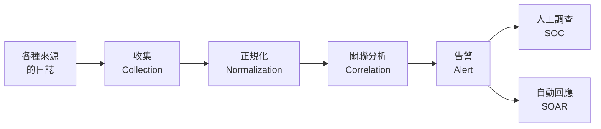

# 日誌集中與 SIEM

> [!abstract] 這篇你會學到
> - 理解**為什麼「沒有日誌就沒有調查能力」**
> - 知道 **SIEM、SOAR、SOC、UEBA、XDR** 各自是什麼
> - 學會決定**哪些日誌一定要收**、要保存多久
> - 認識**日誌關聯分析**如何把單獨無意義的事件變成告警
> - 用 **Wazuh** 實作一套開源的 SIEM
> - 避開**告警疲勞**這個 SIEM 最大的失敗原因
> - 理解**資通安全管理法對日誌保存的要求**

## 前置知識

- [[020-01-19-guide-Linux-日誌系統]] — journald、rsyslog、logrotate 的基礎
- [[090-05-01-guide-資安設備-資安全景圖與縱深防禦]] — 偵測層在縱深防禦中的位置
- [[100-01-03-guide-日誌-系統監控與告警]] — 一般維運監控

---

## 觀念說明

### 沒有日誌，你什麼都查不到

> [!danger] 資安事件發生時，你必須能回答這些問題
> - 攻擊者**什麼時候**進來的？
> - 從**哪裡**進來的？走哪個帳號？
> - 他**做了什麼**？看了哪些資料？
> - 他**動了哪些機器**？
> - **資料有沒有被帶走**？帶走了多少？
> - 他**現在還在不在**裡面？
>
> **如果沒有日誌，這些問題全部都是「不知道」。**
>
> 而「不知道」的後果是：
> - **無法判斷影響範圍** → 只能假設最壞情況 → 全部重灌
> - **無法向主管機關通報**（資安法要求說明影響範圍）
> - **無法確認攻擊者是否已清除**
> - **無法防止再次發生**（不知道怎麼進來的）

> [!warning] 日誌的殘酷現實
> **攻擊者的第一件事，常常就是清除日誌。**
>
> ```bash
> # 攻擊者常做的
> rm -rf /var/log/*
> > /var/log/auth.log
> history -c
> wevtutil cl Security          # Windows
> ```
>
> **所以「日誌必須即時送到另一台機器」** ——
> 這是日誌集中最根本的理由，
> 不是為了方便查詢，**而是為了讓日誌無法被抹除**。

### 名詞分辨

| 名詞 | 全稱 | 是什麼 |
| --- | --- | --- |
| **Log Management** | 日誌管理 | **收集、儲存、查詢**日誌 |
| **SIEM** | Security Information and Event Management | 日誌管理 **+ 關聯分析 + 告警** |
| **SOAR** | Security Orchestration, Automation and Response | **自動化回應**（收到告警自動處置） |
| **UEBA** | User and Entity Behavior Analytics | **行為基線分析**（偵測「不像平常的你」） |
| **SOC** | Security Operations Center | **資安監控中心**（人 + 流程 + 工具） |
| **MDR** | Managed Detection and Response | **委外的 SOC 服務** |
| **XDR** | Extended Detection and Response | 廠商整合的跨層偵測（見 [[090-05-05-guide-資安設備-端點防護AV-EDR-XDR]]） |



> [!tip] SIEM 最重要的能力是「關聯」
> 單獨看每一條日誌，**幾乎都沒有意義**：
>
> ```
> 防火牆：有一個連線從 1.2.3.4 進來        ← 每天幾百萬條
> AD：帳號 wang 登入成功                    ← 每天幾千條
> 檔案伺服器：wang 讀取了 5000 個檔案       ← 可能是正常備份
> 防火牆：有 2GB 資料傳到境外               ← 可能是正常備份
> ```
>
> **關聯起來就完全不同了**：
> ```
> ① 從「從未見過的境外 IP」登入
> ② 用「三個月沒登入過」的帳號
> ③ 在「凌晨 3 點」
> ④ 讀取了「他從來不碰的部門目錄」
> ⑤ 然後有「2GB 資料傳到同一個境外 IP」
> ```
> **→ 這是資料外洩，立刻告警。**
>
> **這就是 SIEM 存在的價值。**

---

## 該收哪些日誌

> [!danger] 不要「全部都收」，也不要「只收系統日誌」
> **全部都收**：儲存成本爆炸，查詢慢，雜訊淹沒訊號。
> **只收系統日誌**：查不到最關鍵的身分與網路軌跡。
>
> **原則：從「調查時會需要什麼」反推。**

### 優先順序

| 優先 | 來源 | 為什麼 |
| --- | --- | --- |
| **★★★ 必收** | **身分驗證日誌**（AD、IdP、SSH、VPN、sudo） | **帳號是最常見的入侵途徑** |
| **★★★ 必收** | **端點 EDR 告警** | 主機上實際發生了什麼 |
| **★★★ 必收** | **防火牆的拒絕與連線紀錄** | 進出的軌跡 |
| **★★★ 必收** | **DNS 查詢紀錄** | **能抓到 C&C 回連**，價值極高 |
| ★★ 重要 | Web 伺服器存取日誌 | Web 攻擊的證據 |
| ★★ 重要 | 郵件閘道日誌 | 釣魚信的傳播範圍 |
| ★★ 重要 | **特權操作日誌**（sudo、管理介面登入、設定變更） | 內部濫用與攻擊者提權 |
| ★★ 重要 | 雲端服務稽核日誌（M365、Google、雲平台） | 資料常常在雲端 |
| ★ 有餘力 | 資料庫稽核日誌 | 資料存取的直接證據 |
| ★ 有餘力 | Proxy／SWG 日誌 | 網頁行為 |
| ★ 有餘力 | NetFlow | 流量的統計軌跡 |

> [!tip] 如果預算只夠收兩種
> **收「身分驗證」與「DNS」。**
>
> - **身分驗證**：幾乎所有入侵都會留下登入痕跡
> - **DNS**：幾乎所有惡意程式都要查 DNS 才能回連 C&C
>
> 這兩種日誌**量小、價值極高**。

### 保存期限

| 依據 | 要求 |
| --- | --- |
| **資通安全管理法（公務機關）** | 依資安責任等級，**日誌至少保存 6 個月**；核心系統通常要求更長 |
| ISO 27001 | 依風險評鑑決定，並記錄在政策裡 |
| 實務建議 | **熱資料 30～90 天**（可即時查詢）＋ **冷資料 1 年以上**（歸檔） |

> [!warning] 攻擊者的「潛伏期」常常超過 6 個月
> 業界統計，從入侵到被發現的中位數常在**數十天到數百天**之間。
>
> **如果你只留 30 天日誌，發現事件時最關鍵的「初始入侵」證據早就沒了。**
>
> **實務做法**：
> ```
> 熱儲存（可搜尋）  30～90 天    → SSD，成本高
> 溫儲存           90 天～1 年   → HDD
> 冷儲存（歸檔）    1～3 年       → 物件儲存／磁帶，壓縮後成本很低
> ```
> 冷儲存壓縮後通常只有原始大小的 1/10，**成本比想像中低很多**。

### 日誌本身的完整性

> [!danger] 日誌可以被竄改，就沒有證據力
> **必做**：
> 1. **即時傳送到另一台機器**（攻擊者清不掉已經送出去的）
> 2. **收集端唯讀**（來源主機只能寫入，不能刪改）
> 3. **時間同步（NTP）** ← 極重要，見下方
> 4. 重要日誌**計算雜湊值**並定期驗證
> 5. **限制存取日誌伺服器**的權限並記錄

> [!danger] 時間不同步，日誌就沒有價值
> 資安調查靠的是**時間軸**。
> 如果 A 機器的時間比 B 機器快 5 分鐘，
> **你會得出完全錯誤的因果推論**。
>
> **必做**：
> ```bash
> # 全部機器使用同一組 NTP 來源，並確認同步狀態
> $ timedatectl status
>                Local time: Wed 2026-08-27 14:32:10 CST
>            Universal time: Wed 2026-08-27 06:32:10 UTC
>                 Time zone: Asia/Taipei (CST, +0800)
> System clock synchronized: yes                      ← 必須是 yes
>               NTP service: active
>
> $ chronyc sources -v         # 或 timedatectl show-timesync
> ```
>
> **另外：日誌盡量用 UTC 或帶時區的 ISO 8601 格式記錄**，
> 跨時區與跨系統比對時才不會混亂。

---

## 關聯規則與告警疲勞

### 好的偵測規則長什麼樣

| 情境 | 規則邏輯 |
| --- | --- |
| **暴力破解** | 同一來源 5 分鐘內失敗 > 20 次 |
| **密碼噴灑** | **同一來源**對**多個不同帳號**各失敗少數幾次 ← 比暴力破解更隱蔽 |
| **不可能的移動** | 同一帳號在短時間內從地理上不可能的兩地登入 |
| **異常時間登入** | 帳號在其歷史從未活動的時段登入 |
| **新裝置 + 敏感操作** | 從未見過的裝置登入後立刻存取敏感系統 |
| **提權後橫向移動** | 提權成功 → 短時間內連向多台內部主機 |
| **大量資料存取** | 使用者存取檔案數超過其歷史基線的 N 倍 |
| **C&C 回連** | DNS 查詢命中威脅情資，或**規律的心跳式外連** |
| **日誌中斷** | **某台機器突然停止送日誌** ← 很重要，可能是被關掉了 |

> [!tip] 「日誌中斷」是最容易被忽略的告警
> 攻擊者可能會停掉日誌代理程式。
>
> **設定一條規則**：
> 「某台機器超過 X 分鐘沒有送任何日誌 → 告警」
>
> 這同時也能抓到主機當機、代理程式壞掉等維運問題。

### 告警疲勞：SIEM 最大的失敗原因

> [!danger] 每天 500 條告警 = 等於沒有告警
> **真實情況**：
> 很多機關導入 SIEM 後，
> 每天產生數百條告警，**根本沒有人力看得完**，
> 於是：
> ```
> 第 1 週：認真看每一條
> 第 2 週：只看「高」等級
> 第 1 個月：只在有空的時候看
> 第 3 個月：沒有人看了
> 第 6 個月：真正的攻擊發生了，告警確實有觸發 —— 但沒有人看到
> ```
>
> **這是真實發生過無數次的劇本**（Target 的 2013 年資料外洩就是典型案例）。

> [!tip] 對抗告警疲勞的六個做法
> **一、從少數高品質規則開始**
> **10 條精準的規則，遠勝過 100 條會誤判的規則。**
>
> **二、每一條告警都要有「處理程序」**
> 收到這條告警時，**要做什麼？找誰？怎麼判斷真假？**
> 沒有處理程序的告警，等於沒有用。
>
> **三、持續調校（Tuning）**
> **每週檢視誤判**，把已知的正常行為排除。
> 例如：備份帳號每天凌晨讀取大量檔案 → 加入例外。
>
> **四、分級並定義回應時間**
> ```
> 嚴重：15 分鐘內回應，可直接電話叫人
> 高　：1 小時內
> 中　：當日處理
> 低　：每週彙整檢視（不即時通知）
> ```
>
> **五、自動化低風險的處置（SOAR）**
> 例如：偵測到暴力破解 → **自動封鎖來源 IP 30 分鐘**，
> 不需要人介入。
>
> **六、衡量指標**
> 追蹤**誤判率**。
> 如果某條規則的誤判率 > 90%，**它應該被關掉或重寫**。

---

## 完整實戰範例

### 方案一：rsyslog 集中（最輕量）

> [!tip] 沒有預算時，這是最快的起步
> 只要 30 分鐘就能把全機關的 Linux 日誌集中起來。

```bash
# ========== 日誌伺服器端 ==========
$ sudo apt install -y rsyslog
$ sudo tee /etc/rsyslog.d/10-remote.conf > /dev/null <<'EOF'
# 啟用 TCP 接收（比 UDP 可靠，不會掉封包）
module(load="imtcp")
input(type="imtcp" port="514")

# 依「來源主機/日期」分開存放
template(name="RemoteLog" type="string"
         string="/var/log/remote/%HOSTNAME%/%$YEAR%-%$MONTH%-%$DAY%.log")

# 來自遠端的（非本機）寫到上面的路徑，然後停止繼續處理
if $fromhost-ip != '127.0.0.1' then {
    action(type="omfile" dynaFile="RemoteLog"
           fileCreateMode="0640" dirCreateMode="0750"
           fileOwner="syslog" fileGroup="adm")
    stop
}
EOF

$ sudo mkdir -p /var/log/remote && sudo chown syslog:adm /var/log/remote
$ sudo systemctl restart rsyslog
$ sudo ss -tlnp | grep 514
LISTEN 0 25 0.0.0.0:514 0.0.0.0:* users:(("rsyslogd",pid=1234,fd=7))

# 防火牆只開放給內部網段
$ sudo ufw allow from 192.168.0.0/16 to any port 514 proto tcp
```

```bash
# ========== 客戶端（每台要送日誌的機器）==========
$ sudo tee /etc/rsyslog.d/90-forward.conf > /dev/null <<'EOF'
# 磁碟輔助佇列：伺服器掛掉時先存本機，恢復後補送
$ActionQueueType LinkedList
$ActionQueueFileName fwdq
$ActionQueueMaxDiskSpace 1g
$ActionQueueSaveOnShutdown on
$ActionResumeRetryCount -1

# 全部日誌送到集中伺服器（@@ 表示 TCP，@ 是 UDP）
*.* @@192.168.1.50:514
EOF

$ sudo systemctl restart rsyslog

# 測試
$ logger -p auth.warning "測試訊息 from $(hostname)"
# → 到伺服器上確認
$ sudo tail /var/log/remote/*/$(date +%F).log
```

> [!tip] 把 journald 的內容也送出去
> systemd 的 journal 預設不會經過 rsyslog。
> ```bash
> $ sudo sed -i 's/^#\?ForwardToSyslog=.*/ForwardToSyslog=yes/' \
>       /etc/systemd/journald.conf
> $ sudo systemctl restart systemd-journald
> ```

> [!warning] rsyslog 集中只是「日誌管理」，不是 SIEM
> 它**沒有關聯分析、沒有告警、沒有介面**。
> 但它已經達成最重要的目標：**日誌無法被來源主機抹除**。
>
> 加上 `grep` 與簡單腳本，就能做基本的偵測；
> 要做真正的關聯分析，往下看 Wazuh。

### 方案二：Wazuh（開源 SIEM）

> [!tip] Wazuh 是目前最完整的開源 SIEM/XDR
> 它同時提供：
> **日誌收集 + 檔案完整性監控（FIM）+ 弱點偵測 + 法規符合性報表 + 主動回應**。
>
> **適合**：中小型機關、沒有商用 SIEM 預算、想先建立基本偵測能力。

```bash
# ========== 安裝 Wazuh Server（單機一體式）==========
# ⚠ 需求：4 核心 / 8GB RAM 以上；請在乾淨的 Ubuntu/RHEL 上安裝
$ curl -sO https://packages.wazuh.com/4.x/wazuh-install.sh
$ sudo bash wazuh-install.sh -a -i

# 安裝完成會顯示：
# INFO: --- Summary ---
# INFO: You can access the web interface https://<wazuh-dashboard-ip>
#       User: admin
#       Password: xxxxxxxxxxxx        ← 記下來
```

```bash
# ========== 安裝 Agent（每台被監控的機器）==========
$ curl -sO https://packages.wazuh.com/4.x/apt/pool/main/w/wazuh-agent/wazuh-agent_4.9.0-1_amd64.deb
$ sudo WAZUH_MANAGER='192.168.1.50' WAZUH_AGENT_GROUP='default' \
    dpkg -i ./wazuh-agent_4.9.0-1_amd64.deb

$ sudo systemctl enable --now wazuh-agent
$ sudo systemctl status wazuh-agent

# 在 Server 上確認 Agent 已連上
$ sudo /var/ossec/bin/agent_control -l
Wazuh agent_control. List of available agents:
   ID: 000, Name: wazuh-server (server), IP: 127.0.0.1, Active/Local
   ID: 001, Name: web01, IP: 192.168.1.10, Active
```

```xml
<!-- ========== 自訂偵測規則 ========== -->
<!-- /var/ossec/etc/rules/local_rules.xml（Server 端） -->
<group name="local,syslog,">

  <!-- 非上班時間的 SSH 登入成功 -->
  <rule id="100001" level="10">
    <if_sid>5715</if_sid>                <!-- 5715 = sshd 認證成功 -->
    <time>18:00-08:00</time>
    <description>非上班時間的 SSH 登入成功：$(srcip) → $(dstuser)</description>
    <mitre><id>T1078</id></mitre>        <!-- Valid Accounts -->
  </rule>

  <!-- 短時間內大量 SSH 失敗（暴力破解） -->
  <rule id="100002" level="12" frequency="8" timeframe="120">
    <if_matched_sid>5760</if_matched_sid>
    <same_source_ip />
    <description>SSH 暴力破解：$(srcip) 在 2 分鐘內失敗 8 次以上</description>
    <mitre><id>T1110</id></mitre>
  </rule>

  <!-- 密碼噴灑：同一來源對多個帳號各失敗少數幾次 -->
  <rule id="100003" level="12" frequency="10" timeframe="300">
    <if_matched_sid>5760</if_matched_sid>
    <same_source_ip />
    <different_user />
    <description>疑似密碼噴灑：$(srcip) 對多個不同帳號嘗試登入</description>
    <mitre><id>T1110.003</id></mitre>
  </rule>

  <!-- 新增了 UID 0 的帳號（後門帳號） -->
  <rule id="100004" level="14">
    <if_sid>5902</if_sid>
    <match>uid=0</match>
    <description>★★ 新增了 UID 0 的帳號（可能是後門）</description>
    <mitre><id>T1136</id></mitre>
  </rule>

</group>
```

```xml
<!-- ========== 檔案完整性監控（FIM）========== -->
<!-- /var/ossec/etc/ossec.conf 或 agent 的 ossec.conf -->
<syscheck>
  <disabled>no</disabled>
  <frequency>43200</frequency>          <!-- 12 小時全掃一次 -->

  <!-- realtime="yes" = 即時偵測變更 -->
  <directories check_all="yes" realtime="yes">/etc</directories>
  <directories check_all="yes" realtime="yes">/bin,/sbin,/usr/bin,/usr/sbin</directories>
  <directories check_all="yes" realtime="yes">/var/www</directories>
  <directories check_all="yes" report_changes="yes">/etc/ssh</directories>

  <!-- 排除經常變動、會產生大量雜訊的檔案 -->
  <ignore>/etc/mtab</ignore>
  <ignore>/etc/hosts.deny</ignore>
  <ignore>/etc/resolv.conf</ignore>
  <ignore type="sregex">.log$|.tmp$|.swp$</ignore>
</syscheck>
```

> [!tip] FIM 是抓到入侵的高效手段
> 攻擊者幾乎一定會修改系統檔案：
> - 新增 SSH 公鑰到 `authorized_keys`
> - 修改 `/etc/passwd`、`/etc/sudoers`
> - 植入後門到 `/usr/bin`
> - 修改 `crontab` 建立持續性
>
> **這些檔案平常幾乎不會變**，
> 所以 FIM 的**誤判率很低、命中率很高**。

```xml
<!-- ========== 主動回應：自動封鎖攻擊來源 ========== -->
<active-response>
  <command>firewall-drop</command>
  <location>local</location>
  <rules_id>100002,100003</rules_id>
  <timeout>1800</timeout>              <!-- 封鎖 30 分鐘後自動解除 -->
</active-response>
```

> [!danger] 自動封鎖必須設定白名單，否則會封鎖自己
> ```xml
> <!-- ossec.conf 的 <global> 區段 -->
> <global>
>   <white_list>127.0.0.1</white_list>
>   <white_list>192.168.1.0/24</white_list>      <!-- 內部管理網段 -->
>   <white_list>203.0.113.5</white_list>          <!-- 監控系統 -->
> </global>
> ```
> **真實案例**：
> 沒設白名單 → 監控系統的健康檢查被誤判為攻擊 → 被封鎖 →
> 監控失效 → 沒人發現 → **兩週後才被察覺**。
>
> **也一定要設 `<timeout>`**，不要永久封鎖。

### 用 journalctl 做基本的日誌調查

```bash
# ===== 找出所有登入失敗 =====
$ journalctl -u ssh --since "24 hours ago" | grep -i "failed password"

# ===== 統計來源 IP（找暴力破解） =====
$ journalctl -u ssh --since "7 days ago" --no-pager |
  grep -oE 'from ([0-9]{1,3}\.){3}[0-9]{1,3}' |
  awk '{print $2}' | sort | uniq -c | sort -rn | head -20
   4821 45.155.205.233
   2103 61.177.173.18
     12 192.168.1.100

# ===== 找出成功的登入（誰在什麼時候從哪裡進來） =====
$ journalctl -u ssh --since "7 days ago" --no-pager |
  grep "Accepted" |
  awk '{print $1,$2,$3, $9, $11}' | sort | uniq -c

# ===== 所有 sudo 操作 =====
$ journalctl _COMM=sudo --since "7 days ago" -o short-iso |
  grep -v "pam_unix" | tail -50

# ===== 特定時間範圍的所有日誌（事件調查用） =====
$ journalctl --since "2026-08-27 03:00" --until "2026-08-27 05:00" -o short-iso

# ===== 匯出成 JSON 給後續分析 =====
$ journalctl --since "2026-08-20" -o json > /tmp/logs.json
$ jq -r 'select(.SYSLOG_IDENTIFIER=="sshd") | "\(.__REALTIME_TIMESTAMP) \(.MESSAGE)"' \
     /tmp/logs.json | head
```

```bash
# ===== 一個簡單的每日檢查腳本 =====
#!/usr/bin/env bash
# /usr/local/sbin/daily-security-check.sh
set -uo pipefail
SINCE="24 hours ago"

echo "=== 資安日誌摘要 $(hostname) $(date '+%F') ==="

echo -e "\n【SSH 登入失敗 Top 10 來源】"
journalctl -u ssh --since "$SINCE" --no-pager 2>/dev/null |
  grep -oE 'from ([0-9]{1,3}\.){3}[0-9]{1,3}' | awk '{print $2}' |
  sort | uniq -c | sort -rn | head -10 | sed 's/^/  /'

echo -e "\n【SSH 登入成功】"
journalctl -u ssh --since "$SINCE" --no-pager 2>/dev/null |
  grep "Accepted" | awk '{print "  " $1,$2,$3, $9, "from", $11}' | sort -u

echo -e "\n【sudo 使用紀錄】"
journalctl _COMM=sudo --since "$SINCE" --no-pager 2>/dev/null |
  grep "COMMAND=" | sed 's/^/  /' | tail -20

echo -e "\n【新增的使用者】"
journalctl --since "$SINCE" --no-pager 2>/dev/null |
  grep -E "new user|useradd" | sed 's/^/  /'

echo -e "\n【服務啟動失敗】"
systemctl --failed --no-legend | sed 's/^/  /' || echo "  （無）"

echo -e "\n【磁碟使用率 > 80%】"
df -h | awk 'NR>1 && int($5)>80 {print "  ⚠ " $6 " " $5}'
```

```bash
# 每天早上 8 點寄出摘要
$ sudo crontab -e
0 8 * * * /usr/local/sbin/daily-security-check.sh | mail -s "資安日誌摘要 $(hostname)" it@example.gov.tw
```

---

## 常見錯誤與排錯

| 現象／錯誤 | 原因 | 解法 |
| --- | --- | --- |
| **事件發生後查不到任何東西** | 日誌沒收、或**被攻擊者清掉了** | **即時送到集中伺服器**；收集端唯讀 |
| 收了日誌但**時間對不起來** | **NTP 沒同步** | 全機器統一 NTP；`timedatectl` 確認 `synchronized: yes` |
| 日誌保存不夠久，關鍵證據沒了 | 只留 30 天，但潛伏期更長 | **熱 30～90 天 + 冷歸檔 1 年以上** |
| **每天幾百條告警，沒人看** | **告警疲勞** | 從**少數高品質規則**開始；每週調校；分級 |
| 規則誤判率超高 | 規則太寬鬆、沒排除正常行為 | 加入例外；追蹤誤判率，>90% 就重寫或關掉 |
| SIEM 買了但沒人用 | **沒有處理程序**、沒有人負責 | 每條告警都要定義「收到後做什麼、找誰」 |
| 自動封鎖**把自己封鎖了** | **沒設白名單** | `<white_list>` 加入管理網段與監控系統；設 `<timeout>` |
| 日誌伺服器磁碟爆掉 | 沒估算量、沒輪替 | 估算日增量 × 保存天數 × 1.3；設 logrotate 與歸檔 |
| 日誌伺服器掛掉時日誌遺失 | rsyslog 沒設佇列 | 設定 `$ActionQueueType LinkedList` 磁碟輔助佇列 |
| **某台機器悄悄不送日誌了** | 代理程式停了或被關掉 | **設「日誌中斷」告警規則** |
| journald 的內容沒送出去 | 預設不轉發給 rsyslog | `ForwardToSyslog=yes` |
| FIM 產生大量雜訊 | 監控了經常變動的檔案 | 排除 `.log`、`.tmp`、`/etc/mtab` 等 |
| Wazuh Agent 連不上 | 防火牆擋了 1514/1515 | 開放 TCP 1514（事件）、1515（註冊） |
| 抓不到密碼噴灑 | 只設了「同來源多次失敗」規則 | 加上 **`<different_user/>`** 的規則 |

---

## 安全性注意事項

> [!danger] 日誌伺服器是攻擊者的高價值目標
> 因為：
> 1. **它有全機關的活動紀錄**（等於一張內網地圖）
> 2. **清掉它就沒有證據了**
>
> **必做**：
> - **獨立的網段**，只允許「日誌流入」，不允許從它連出去
> - **最少的服務**（不要在上面跑別的東西）
> - **獨立的管理帳號**（不要用網域帳號，避免網域被攻陷時一起失守）
> - **日誌再備份一份到離線或不可變儲存**
> - 對日誌伺服器本身的存取，**也要記錄**（記到另一個地方）

> [!warning] 日誌裡可能含有個資與密碼
> **常見的意外洩漏**：
> - Web 存取日誌的 URL 參數含**身分證號、密碼**
>   （`GET /login?user=A123456789&pass=xxx`）
> - 應用程式除錯日誌印出**完整的請求內容**
> - 資料庫查詢日誌含**查詢結果**
> - 郵件日誌含**主旨與收件者**
>
> **對策**：
> - **應用程式不要用 GET 傳遞敏感參數**
> - 日誌**遮蔽（masking）** 敏感欄位
> - **正式環境關閉 debug 等級的日誌**
> - 日誌的**存取權限比照個資系統**管理
> - 日誌保存與銷毀也要納入個資盤點（見 [[090-05-08-guide-資安設備-資料防護DLP與加密]]）

> [!tip] 資通安全管理法的日誌要求
> 公務機關依《資通安全管理法》及其子法：
> - 應**記錄資通系統的使用者存取、系統事件與安全事件**
> - **保存期限至少 6 個月**（依資安責任等級與系統分級可能更長）
> - 應**定期審查**日誌
> - 應確保日誌**不被竄改**
> - 資安事件應依等級在**規定時限內通報**
>
> **稽核時會實際檢查**：
> - 有沒有收？收了哪些？
> - 保存多久？怎麼證明？
> - **有沒有人在看？**（審查紀錄）
> - 怎麼防止竄改？
>
> 見 [[090-07-07-guide-資安實踐-台灣資安法規與個資法]] 與 [[090-07-09-guide-資安實踐-資安稽核與符合性檢核]]。

> [!warning] 沒有人看的 SIEM 等於沒有 SIEM
> **技術只是工具，SOC 的核心是「人 + 流程」。**
>
> 沒有 24 小時人力的機關，實際的選擇是：
> | 選項 | 說明 |
> | --- | --- |
> | **上班時間人工檢視 + 高等級告警即時通知手機** | 最務實的起步 |
> | **自動化處置低風險事件（SOAR）** | 減少人力負擔 |
> | **委外 MDR** | 有預算時，24 小時監控由廠商負責 |
> | 參與**政府的資安聯防機制** | 公務機關可運用 NCCST 的資源 |
>
> **不要買了 SIEM 就以為安全了。**

---

## 速查表

### 名詞

| 名詞 | 是什麼 |
| --- | --- |
| Log Management | 收集、儲存、查詢 |
| **SIEM** | 日誌管理 **+ 關聯 + 告警** |
| **SOAR** | **自動化回應** |
| **UEBA** | 行為基線分析 |
| **SOC** | 資安監控中心（人+流程+工具） |
| **MDR** | 委外的 SOC |

### 必收日誌（優先序）

```
★★★ 身分驗證（AD/IdP/SSH/VPN/sudo）
★★★ 端點 EDR 告警
★★★ 防火牆拒絕與連線
★★★ DNS 查詢          ← 抓 C&C 回連
★★  Web / 郵件 / 特權操作 / 雲端稽核
★   資料庫 / Proxy / NetFlow
```

**只夠收兩種 → 收「身分驗證」與「DNS」。**

### 保存期限

```
熱（可搜尋）  30～90 天
溫            90 天～1 年
冷（歸檔）    1～3 年
資安法要求：至少 6 個月
```

### 日誌完整性五要

```
1. 即時送到另一台機器   ← 攻擊者清不掉
2. 收集端唯讀
3. NTP 時間同步         ← 極重要
4. 重要日誌計算雜湊
5. 限制存取並記錄
```

### 對抗告警疲勞

```
1. 少數高品質規則（10 條精準 > 100 條誤判）
2. 每條告警都要有處理程序
3. 每週調校誤判
4. 分級 + 定義回應時間
5. 低風險自動化（SOAR）
6. 追蹤誤判率（>90% 就重寫）
```

### rsyslog 集中

```bash
# 伺服器：module(load="imtcp") input(type="imtcp" port="514")
# 客戶端：*.* @@192.168.1.50:514        （@@=TCP, @=UDP）
# journald 轉發：ForwardToSyslog=yes
```

### Wazuh

| 項目 | 值 |
| --- | --- |
| 安裝 | `bash wazuh-install.sh -a -i` |
| Agent 埠 | TCP **1514**（事件）、**1515**（註冊） |
| 自訂規則 | `/var/ossec/etc/rules/local_rules.xml` |
| 主設定 | `/var/ossec/etc/ossec.conf` |
| 列出 Agent | `/var/ossec/bin/agent_control -l` |

### 常用調查指令

| 目的 | 指令 |
| --- | --- |
| SSH 失敗來源統計 | `journalctl -u ssh \| grep -oE 'from ([0-9]{1,3}\.){3}[0-9]{1,3}' \| sort \| uniq -c \| sort -rn` |
| 登入成功 | `journalctl -u ssh \| grep Accepted` |
| sudo 紀錄 | `journalctl _COMM=sudo` |
| 時間範圍 | `journalctl --since "..." --until "..."` |
| 時間同步 | `timedatectl status` |

---

## 練習題

> [!question]- 練習 1：盤點你的日誌現況
> 對照「必收日誌」優先序表，逐項回答：
> 1. **有沒有收？**
> 2. **收在哪裡？是不是在來源主機上？**（如果是，攻擊者可以清掉）
> 3. **保存多久？**
> 4. **有沒有人在看？多久看一次？**
> 5. **所有機器的時間都同步嗎？**（實際去 `timedatectl` 確認幾台）
>
> 找出「★★★ 但沒收」的那一項，那是你最該優先補的。

> [!question]- 練習 2：設計三條偵測規則
> 針對你機關的環境，設計三條規則，每一條要包含：
> 1. **觸發條件**（具體到數字：幾分鐘內幾次）
> 2. **嚴重等級**
> 3. **可能的誤判情境是什麼？**（這一項最重要）
> 4. **怎麼排除誤判？**
> 5. **收到告警後，值班人員要做什麼？**（處理程序）
>
> 沒有第 5 項的規則，不要上線。

> [!question]- 練習 3：日誌調查演練
> 從你的伺服器日誌中回答（用本篇的指令）：
> 1. 過去 7 天有多少次 SSH 登入失敗？來自哪幾個 IP？
> 2. **過去 7 天有哪些帳號成功登入？從哪些 IP？**
> 3. 有沒有出現「你不認識的 IP 登入成功」？
> 4. 過去 7 天有誰用了 sudo？做了什麼？
> 5. **如果現在要調查「三個月前的一次登入」，你查得到嗎？**
>
> 第 5 題如果答案是「查不到」，那就是保存期限不足。

---

## 小測驗

Q1. **為什麼「日誌必須即時送到另一台機器」**？最根本的理由是什麼？

Q2. SIEM 與 Log Management 的差別是什麼？SIEM 最重要的能力是什麼？

Q3. 如果預算只夠收兩種日誌，該收哪兩種？為什麼？

Q4. **為什麼「NTP 時間同步」對資安調查極為重要**？

Q5. 資通安全管理法對公務機關的日誌保存期限有什麼要求？為什麼實務上建議留更久？

Q6. 什麼是「告警疲勞」？它為什麼是 SIEM 最大的失敗原因？

Q7. 對抗告警疲勞的六個做法是什麼？其中**哪一項是規則上線的必要條件**？

Q8. 「暴力破解」與「密碼噴灑」的偵測規則有什麼不同？後者為什麼更難抓？

Q9. **為什麼「檔案完整性監控（FIM）」的誤判率很低、命中率很高**？

Q10. 自動封鎖來源 IP 時，**一定要設定的兩件事**是什麼？不設會發生什麼？

> [!question]- 測驗答案
> **Q1.** 最根本的理由是：**攻擊者的第一件事常常就是清除日誌**
> （`rm -rf /var/log/*`、`history -c`、`wevtutil cl Security`）。
> 日誌即時送出去之後，**攻擊者就清不掉已經送出去的部分**。
> 也就是說，日誌集中的首要目的**不是方便查詢，而是讓日誌無法被抹除**。
>
> **Q2.** **Log Management** 只做**收集、儲存、查詢**；
> **SIEM** 在此之上加了**關聯分析與告警**。
> SIEM 最重要的能力是**關聯（Correlation）** ——
> 單獨看每一條日誌幾乎都沒有意義
> （「有連線進來」「帳號登入成功」「讀了很多檔案」「有資料外傳」都可能正常），
> 但**關聯起來**（陌生境外 IP + 三個月沒用的帳號 + 凌晨三點 +
> 讀了從不碰的目錄 + 2GB 外傳到同一個 IP）
> **就是明確的資料外洩訊號**。
>
> **Q3.** **身分驗證日誌**與 **DNS 查詢紀錄**。
> 因為**幾乎所有入侵都會留下登入痕跡**，
> 而**幾乎所有惡意程式都要查 DNS 才能回連 C&C**。
> 這兩種日誌**量小、價值極高**，投資報酬率最好。
>
> **Q4.** 因為**資安調查完全靠時間軸**來重建事件的因果順序。
> 如果 A 機器的時間比 B 機器快 5 分鐘，
> **你會得出完全錯誤的因果推論**（把後發生的事當成原因）。
> 必須全機器使用同一組 NTP 來源，
> 並用 `timedatectl status` 確認 `System clock synchronized: yes`；
> 日誌也應盡量用 UTC 或帶時區的 ISO 8601 格式記錄。
>
> **Q5.** 依資安責任等級，**日誌至少保存 6 個月**（核心系統可能更長）。
> 實務上建議留更久，是因為**攻擊者的潛伏期常常超過 6 個月**
> （從入侵到被發現的中位數常在數十天到數百天）——
> 如果只留 30 天，發現事件時**最關鍵的「初始入侵」證據早就沒了**。
> 建議做法：熱 30～90 天（可即時查詢）＋ 冷歸檔 1 年以上
> （壓縮後通常只有 1/10 大小，成本比想像中低）。
>
> **Q6.** 告警疲勞是「每天產生數百條告警，**根本沒有人力看得完**」，
> 於是逐步演變成「只看高等級 → 有空才看 → 沒有人看」。
> 它是 SIEM 最大的失敗原因，因為**最後真正的攻擊發生時，
> 告警確實有觸發，但沒有人看到** ——
> 系統形式上運作，實質上等於不存在。
>
> **Q7.** 六個做法：①從**少數高品質規則**開始（10 條精準 > 100 條誤判）；
> ②**每一條告警都要有處理程序**；③**每週檢視誤判並持續調校**；
> ④**分級並定義回應時間**；⑤**自動化低風險處置（SOAR）**；
> ⑥**追蹤誤判率**（>90% 就重寫或關掉）。
> **第 ② 項是規則上線的必要條件** ——
> 沒有定義「收到這條告警要做什麼、找誰、怎麼判斷真假」的規則，
> 等於沒有用，不應該上線。
>
> **Q8.** **暴力破解**是「**同一來源**對**同一帳號**短時間內失敗很多次」，
> 規則用 `same_source_ip` + 高頻率門檻即可。
> **密碼噴灑**是「**同一來源**對**多個不同帳號**各失敗**少數幾次**」——
> 用少數幾個常見密碼去試大量帳號。
> 它更難抓，因為**每個帳號的失敗次數都很低，不會觸發傳統的暴力破解門檻**，
> 也不會鎖定帳號。
> 規則必須加上 **`<different_user/>`** 這類「跨帳號」的判斷條件。
>
> **Q9.** 因為 FIM 監控的系統檔案（`/etc`、`/bin`、`/usr/bin`、`/etc/ssh`、
> `authorized_keys`、`sudoers`、`crontab`）**平常幾乎不會變動**，
> 所以**變動本身就是強訊號**（誤判率低）；
> 而攻擊者**幾乎一定會修改這些檔案**
> （加 SSH 公鑰、改 passwd/sudoers、植入後門、設定 crontab 持續性），
> 所以**命中率很高**。
> 前提是要排除經常變動的檔案（`.log`、`.tmp`、`/etc/mtab`）以避免雜訊。
>
> **Q10.** ①**設定白名單（`<white_list>`）**，
> 納入內部管理網段、監控系統、本機；
> ②**設定 `<timeout>`**（例如 30 分鐘後自動解除），不要永久封鎖。
> 不設白名單的後果：**監控系統的健康檢查被誤判為攻擊而遭封鎖 →
> 監控失效 → 沒有人發現 → 很久之後才被察覺**；
> 更糟的情況是把管理者自己的 IP 封鎖，導致無法遠端管理。

---

## 延伸閱讀

- [[020-01-19-guide-Linux-日誌系統]] — journald、rsyslog、logrotate 的基礎
- [[090-05-05-guide-資安設備-端點防護AV-EDR-XDR]] — EDR 告警是最重要的日誌來源之一
- [[090-07-04-guide-資安實踐-資安事件應變流程]] — 收到告警之後要做什麼
- [[090-07-07-guide-資安實踐-台灣資安法規與個資法]] — 日誌保存與通報的法遵要求
- [[090-07-09-guide-資安實踐-資安稽核與符合性檢核]] — 稽核會怎麼檢查日誌
- [[090-05-10-guide-資安設備-弱點管理與滲透測試工具]] — 弱點資料也該進 SIEM
- [[100-01-03-guide-日誌-系統監控與告警]] — 一般維運監控與資安監控的分工
