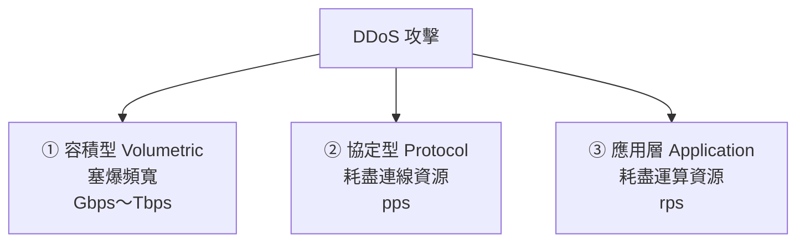
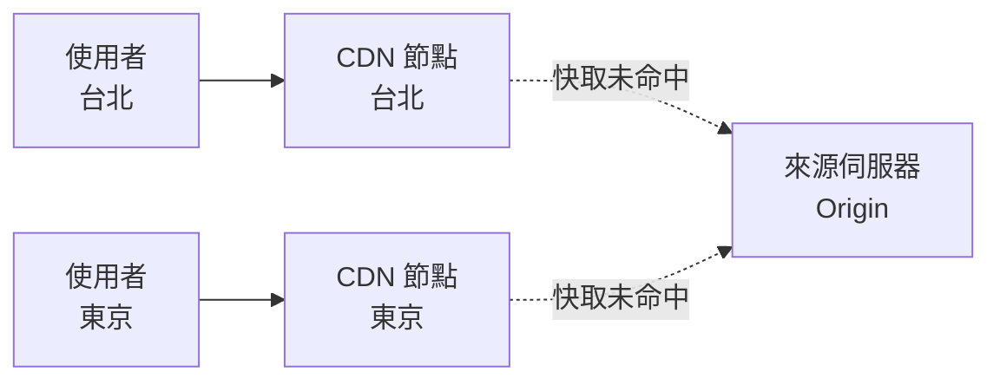

# DDoS 防護與 CDN

> [!abstract] 這篇你會學到
> - 理解 **DDoS 攻擊的三種類型**與各自的防禦方式
> - 知道**為什麼「自己的頻寬永遠不夠」** —— 防禦必須在上游
> - 認識 **CDN 如何順便解決了大部分 DDoS 問題**
> - 學會設定 **Nginx 的速率限制與連線限制**
> - **避開 CDN 最常見的致命錯誤：來源 IP 外洩**
> - 理解 **DDoS 是勒索與掩護的工具**，不只是搗亂
> - 準備一份**攻擊發生當下的應變清單**

## 前置知識

- [[010-02-09-guide-網概-TCP與UDP]] — TCP 三向交握與 UDP 的差異
- [[090-05-01-guide-資安設備-資安全景圖與縱深防禦]] — 可用性也是資安的三大目標之一
- [[090-05-02-guide-資安設備-防火牆與次世代防火牆]] — 防火牆為什麼擋不住 DDoS

---

## 觀念說明

### CIA 中被忽略的 A

> [!note] 資安三大目標
> - **C**onfidentiality 機密性 —— 不該看的人看不到
> - **I**ntegrity 完整性 —— 資料沒被竄改
> - **A**vailability **可用性** —— **服務要能用**
>
> **DDoS 攻擊的是可用性。**
>
> 對機關來說，**服務被打掛就是資安事件**：
> - 民眾洽公系統無法使用
> - 報稅、繳費、報名系統在關鍵期間中斷
> - 對外形象受損，可能上新聞

### DoS 與 DDoS

| | DoS | **DDoS** |
| --- | --- | --- |
| 來源 | **單一**來源 | **大量分散**的來源 |
| 阻擋 | 封鎖一個 IP 就好 | **無法靠封鎖 IP 解決** |
| 規模 | 有限 | 可達 Tbps 等級 |
| 來源組成 | 攻擊者的機器 | **殭屍網路、IoT 裝置、反射放大來源** |

> [!danger] DDoS 為什麼難防
> **因為攻擊流量「看起來」都是合法的請求，只是量太大。**
>
> - 每個來源 IP 都只發少量請求 → **看起來像正常使用者**
> - 來源可能有數十萬個 → **封不完**
> - 有些來源是**被入侵的正常使用者**（封了會誤傷）
> - 流量可能來自**你的客戶所在的國家**（不能整國封鎖）

### 三種攻擊類型



| 類型 | 目標 | 手法 | 衡量單位 | **防禦位置** |
| --- | --- | --- | --- | --- |
| **① 容積型** | **塞爆頻寬** | UDP 洪水、**DNS/NTP/memcached 反射放大** | **Gbps** | **只能在上游**（ISP／清洗中心／CDN） |
| **② 協定型** | 耗盡連線表資源 | **SYN Flood**、ACK Flood、連線耗盡 | **pps**（每秒封包） | 上游 + 本地（SYN Cookie） |
| **③ 應用層** | 耗盡 CPU／DB | **HTTP Flood**、Slowloris、打昂貴的查詢 | **rps**（每秒請求） | WAF、速率限制、**應用層優化** |

### 反射放大攻擊

> [!example] 為什麼小小的攻擊者能打出 Tbps
> **原理**：
> 1. 攻擊者**偽造來源 IP** 為受害者的 IP
> 2. 送一個**很小的查詢**給某個開放的伺服器
> 3. 該伺服器把**很大的回應**送給受害者
>
> ```
> 攻擊者 --（60 bytes 查詢，偽造來源=受害者）--> 開放的 DNS 伺服器
> 開放的 DNS 伺服器 --（4000 bytes 回應）--> 受害者
>
> 放大倍數 = 4000 / 60 ≈ 67 倍
> ```
>
> **攻擊者只要 15 Gbps 的頻寬，就能打出 1 Tbps 的攻擊。**

| 協定 | 埠 | 放大倍數（約） |
| --- | --- | --- |
| **memcached** | 11211/UDP | **可達數萬倍** ← 最誇張 |
| **NTP**（monlist） | 123/UDP | 數百倍 |
| **DNS** | 53/UDP | 數十倍 |
| **SSDP** | 1900/UDP | 約 30 倍 |
| **CLDAP** | 389/UDP | 約 50 倍 |

> [!danger] 你的伺服器可能正在被利用當作攻擊的跳板
> **這是機關常見的疏失**：
> 你的 DNS、NTP、memcached 對外開放，
> **被拿去攻擊別人**，而你完全不知道。
>
> **自我檢查**：
> ```bash
> # 你的 DNS 是不是開放遞迴查詢？（不該對外開放）
> $ dig @你的DNS伺服器 google.com
> # 如果從外部查得到外部網域 → ⚠ 你是開放遞迴解析器
>
> # NTP 是不是開放 monlist？
> $ ntpdc -n -c monlist 你的NTP伺服器
> # 有回應 → ⚠ 可被利用（現代 ntpd 預設已關閉）
>
> # memcached 有沒有對外開放？
> $ nmap -sU -p 11211 你的伺服器IP
> # 11211/udp open → ⚠⚠ 極危險，立刻關閉
> ```
>
> **修正**：
> - DNS：只對內部網段開放遞迴，對外只做權威回應
> - NTP：`restrict default noquery`，關閉 monlist
> - **memcached：綁定 127.0.0.1，絕對不要對外**
> - 上游防火牆封鎖這些埠的對外服務

> [!tip] BCP 38：從源頭解決反射攻擊
> 反射攻擊的根本原因是**可以偽造來源 IP**。
>
> **BCP 38 / uRPF（Unicast Reverse Path Forwarding）**
> 要求 ISP 檢查「從我這裡出去的封包，來源 IP 是不是真的屬於我的網段」，
> 不是的話就丟棄。
>
> **機關能做的**：
> - 在自己的出口路由器上啟用 uRPF
> - **不要讓自己的網路成為偽造來源的出口**
>
> 這是網路社群的共同責任。

---

## 為什麼「自己的頻寬永遠不夠」

> [!danger] 這是 DDoS 防禦最重要的觀念
> **假設你的機關有 1 Gbps 的網際網路頻寬。**
>
> 攻擊者送來 **10 Gbps** 的流量：
>
> ```
> 網際網路 --10 Gbps--> [ISP 的線路] --1 Gbps--> [你的防火牆] --> 你的伺服器
>                                       ↑
>                              瓶頸在這裡就爆了
> ```
>
> **重點**：
> - **你的防火牆再強也沒用** —— 流量根本進不到防火牆就把線路塞爆了
> - **你買再貴的 Anti-DDoS 設備放在自己機房也沒用**
> - **你的伺服器可能根本沒有負載** —— 但沒有人連得進來
>
> **結論：容積型 DDoS 只能在「上游」防禦。**

### 上游防禦的四種方式

| 方式 | 說明 | 成本 | 適用 |
| --- | --- | --- | --- |
| **CDN** | 流量先到 CDN，攻擊被 CDN 吸收 | 低～中 | **Web 服務（最常用）** |
| **ISP 的清洗服務** | 向 ISP 訂購，攻擊時流量導向清洗中心 | 中 | 非 Web 的服務 |
| **雲端清洗中心** | 改 DNS 或 BGP 把流量導到清洗中心 | 中～高 | 大型組織 |
| **黑洞路由（RTBH）** | **請 ISP 直接丟棄目標 IP 的所有流量** | 免費 | **緊急止血** |

> [!warning] 黑洞路由是「犧牲這個 IP 來保全其他服務」
> **Remotely Triggered Black Hole (RTBH)**：
> 請 ISP 把「打向某個 IP」的流量在上游全部丟棄。
>
> ```
> 效果：那個 IP 完全連不上 —— 但攻擊流量不會塞爆你的線路，
>       其他 IP 的服務可以繼續運作。
> ```
>
> **這等於「主動讓被攻擊的服務下線」**，
> 但它保住了**同一條線路上的其他服務**。
>
> **事前準備**：
> - **知道 ISP 的緊急聯絡電話與流程**
> - 確認**多久能生效**（有些要人工處理，可能要 30 分鐘以上）
> - 確認**觸發方式**（電話？工單？BGP Community？）
>
> **不要等到被打的時候才第一次打這通電話。**

---

## CDN：順便解決了大部分問題

### CDN 原本是為了效能



**原本的目的**：把內容快取在離使用者近的節點，加快速度、減輕來源負載。

### 為什麼順便就防了 DDoS

| 效果 | 說明 |
| --- | --- |
| **隱藏來源 IP** | 攻擊者只看得到 CDN 的 IP |
| **龐大的總頻寬** | 大型 CDN 有數十 Tbps 的容量，能吸收攻擊 |
| **分散在全球** | 攻擊流量被分散到各個節點 |
| **靜態內容不回源** | 快取命中的請求根本不會到你的伺服器 |
| **內建 WAF 與速率限制** | 順便擋掉應用層攻擊 |
| **Anycast** | 同一個 IP 在全球多處通告，攻擊自然被分散 |

> [!tip] 對大多數機關，CDN 是最務實的 DDoS 防禦
> **理由**：
> - 成本遠低於自建或訂購清洗服務
> - **設定簡單**（改 DNS 就好）
> - **順便得到效能提升與 WAF**
> - 有免費方案可以起步
>
> **常見選擇**：Cloudflare、Akamai、Fastly、AWS CloudFront + Shield、
> 以及國內 ISP 提供的 CDN 服務。

### CDN 的致命錯誤：來源 IP 外洩

> [!danger] 這是最常見、也最致命的 CDN 設定錯誤
> **如果攻擊者知道你的來源伺服器真實 IP，他可以「繞過 CDN 直接打你」** ——
> CDN 就完全失去意義了。
>
> **來源 IP 常見的外洩途徑**：
>
> | 途徑 | 說明 |
> | --- | --- |
> | **歷史 DNS 記錄** | 啟用 CDN 之前的 A 記錄被各種服務保存著 |
> | **其他子網域** | `mail.example.gov.tw` 或 `ftp.` 沒走 CDN，**直接指向來源** |
> | **SSL 憑證透明度日誌** | CT log 會記錄所有簽發的憑證與網域 |
> | **郵件標頭** | 從伺服器寄出的郵件含真實 IP |
> | **錯誤頁面** | 應用程式錯誤訊息洩漏內部 IP |
> | **全網掃描** | Shodan、Censys 等服務掃遍全網際網路，比對回應特徵 |
> | **伺服器主動對外連線** | 例如 webhook、外部 API 呼叫 |
>
> **必做的防護**：
> ```
> ① 防火牆只允許 CDN 的 IP 範圍連到 Web 埠 ← 最重要
> ② 啟用 CDN 後「更換來源伺服器的 IP」
> ③ 檢查所有子網域，確認沒有直接指向來源的
> ④ 郵件用獨立的寄送服務或 IP
> ⑤ 關閉會洩漏內部資訊的錯誤頁面
> ```

```bash
# ===== 只允許 Cloudflare 連到 80/443 =====
#!/usr/bin/env bash
set -euo pipefail

# 取得 Cloudflare 官方公布的 IP 範圍
curl -s https://www.cloudflare.com/ips-v4 -o /tmp/cf-v4.txt
curl -s https://www.cloudflare.com/ips-v6 -o /tmp/cf-v6.txt

# ufw：先清掉舊規則再重建
sudo ufw --force delete allow 80/tcp  2>/dev/null || true
sudo ufw --force delete allow 443/tcp 2>/dev/null || true

while read -r ip; do
  [ -z "$ip" ] && continue
  sudo ufw allow from "$ip" to any port 80,443 proto tcp comment 'Cloudflare'
done < /tmp/cf-v4.txt

while read -r ip; do
  [ -z "$ip" ] && continue
  sudo ufw allow from "$ip" to any port 80,443 proto tcp comment 'Cloudflare v6'
done < /tmp/cf-v6.txt

sudo ufw reload
echo "完成 —— 現在只有 Cloudflare 能連到 80/443"
```

> [!warning] CDN 的 IP 範圍會變動
> **把上面的腳本設成每月自動執行**，
> 否則 CDN 新增 IP 範圍時，那些節點會連不上你的來源。
>
> ```bash
> $ sudo crontab -e
> 0 4 1 * * /usr/local/sbin/update-cdn-allowlist.sh >> /var/log/cdn-allowlist.log 2>&1
> ```

> [!danger] 用了 CDN 之後，Nginx 看到的都是 CDN 的 IP
> **後果**：
> - 日誌全部記錄成 CDN 的 IP → **調查時完全沒用**
> - 速率限制對「CDN 的 IP」生效 → **一封鎖就封鎖了所有使用者**
> - Fail2ban 會封鎖 CDN 的 IP → **整個服務中斷**
>
> **必須設定真實 IP 還原**：

```nginx
# /etc/nginx/conf.d/cloudflare-realip.conf
# 官方 IP 清單：https://www.cloudflare.com/ips/
set_real_ip_from 173.245.48.0/20;
set_real_ip_from 103.21.244.0/22;
set_real_ip_from 103.22.200.0/22;
set_real_ip_from 103.31.4.0/22;
set_real_ip_from 141.101.64.0/18;
set_real_ip_from 108.162.192.0/18;
set_real_ip_from 190.93.240.0/20;
set_real_ip_from 188.114.96.0/20;
set_real_ip_from 197.234.240.0/22;
set_real_ip_from 198.41.128.0/17;
set_real_ip_from 162.158.0.0/15;
set_real_ip_from 104.16.0.0/13;
set_real_ip_from 104.24.0.0/14;
set_real_ip_from 172.64.0.0/13;
set_real_ip_from 131.0.72.0/22;
set_real_ip_from 2400:cb00::/32;
set_real_ip_from 2606:4700::/32;
set_real_ip_from 2803:f800::/32;
set_real_ip_from 2405:b500::/32;
set_real_ip_from 2405:8100::/32;
set_real_ip_from 2a06:98c0::/29;
set_real_ip_from 2c0f:f248::/32;

real_ip_header CF-Connecting-IP;
# 若使用其他 CDN，通常是：
# real_ip_header X-Forwarded-For;
# real_ip_recursive on;
```

> [!danger] `set_real_ip_from` 沒設對會造成 IP 偽造漏洞
> 如果你寫成 `set_real_ip_from 0.0.0.0/0`
> （或直接信任任何來源的 `X-Forwarded-For`），
> **任何人都可以偽造自己的 IP**：
> ```bash
> $ curl -H "X-Forwarded-For: 1.2.3.4" https://你的網站
> # → 日誌記錄成 1.2.3.4，速率限制與封鎖全部失效
> ```
>
> **一定要明確列出 CDN 的 IP 範圍。**

---

## 本地能做的：速率限制

> [!note] 本地防禦擋不住容積型，但能擋應用層攻擊
> **應用層 DDoS 的流量可能不大**（幾百 Mbps），
> 但因為每個請求都很昂貴（查資料庫、產生報表），
> **少量請求就能打垮伺服器**。
>
> **這種攻擊本地防禦是有效的。**

### Nginx 速率限制

```nginx
# ===== /etc/nginx/nginx.conf 的 http 區段 =====

# 定義限制區（zone）
# $binary_remote_addr 比 $remote_addr 省記憶體
# 10m 大約可以存 16 萬個 IP 的狀態
limit_req_zone  $binary_remote_addr  zone=general:10m  rate=30r/s;
limit_req_zone  $binary_remote_addr  zone=login:10m    rate=5r/m;
limit_req_zone  $binary_remote_addr  zone=api:10m      rate=10r/s;
limit_req_zone  $binary_remote_addr  zone=search:10m   rate=1r/s;

# 同時連線數限制
limit_conn_zone $binary_remote_addr  zone=perip:10m;
limit_conn_zone $server_name         zone=perserver:10m;

# 被限制時回傳的狀態碼（429 比預設的 503 語意正確）
limit_req_status  429;
limit_conn_status 429;
limit_req_log_level warn;
```

```nginx
# ===== server 區段 =====
server {
    listen 443 ssl;
    server_name example.gov.tw;

    # 每個 IP 最多 20 個同時連線
    limit_conn perip 20;
    # 整個站台最多 2000 個同時連線（保護後端）
    limit_conn perserver 2000;

    # 一般頁面：30 r/s，允許突發 50 個，不延遲
    location / {
        limit_req zone=general burst=50 nodelay;
        proxy_pass http://backend;
    }

    # 登入頁面：嚴格限制（防暴力破解）
    location /login {
        limit_req zone=login burst=3 nodelay;
        proxy_pass http://backend;
    }

    # API：中等限制
    location /api/ {
        limit_req zone=api burst=20 nodelay;
        proxy_pass http://backend;
    }

    # 搜尋（昂貴的操作）：嚴格限制且排隊而非拒絕
    location /search {
        limit_req zone=search burst=5;      # 沒有 nodelay = 排隊延遲處理
        proxy_pass http://backend;
    }

    # ===== 防 Slowloris =====
    client_body_timeout   10s;
    client_header_timeout 10s;
    send_timeout          10s;
    keepalive_timeout     30s;
    client_max_body_size  10m;
    large_client_header_buffers 4 8k;
}
```

> [!tip] `burst` 與 `nodelay` 的意思
> - **`rate=30r/s`** — 平均每秒 30 個請求
> - **`burst=50`** — 允許暫時累積 50 個請求的「緩衝佇列」
> - **`nodelay`** — 佇列中的請求**立刻處理**，而不是排隊慢慢放行
>
> **沒有 `burst`**：超過 30r/s 就立刻拒絕 → **正常使用者會被誤傷**
> （一個網頁可能同時載入 20 個資源）。
>
> **有 `burst` 沒有 `nodelay`**：超出的請求排隊，**會有延遲**（適合昂貴操作）。
>
> **有 `burst` + `nodelay`**：突發流量立刻處理，但持續超量仍會被限制 ← **一般用這個**。

> [!warning] 速率限制設太嚴會誤傷正常使用者
> **導入步驟**：
> 1. 先設一個**很寬鬆的值**並觀察日誌
> 2. 統計正常使用者的實際請求速率
> 3. 設定為「正常值的 3～5 倍」
> 4. **監控 429 的比例** —— 如果正常時段就有很多 429，代表設太嚴
>
> ```bash
> # 統計 429 的比例
> $ awk '{print $9}' /var/log/nginx/access.log | sort | uniq -c | sort -rn
>  842103 200
>    3421 304
>     892 429        ← 觀察這個數字
> ```

### 系統層的 SYN Flood 防護

```bash
# /etc/sysctl.d/99-ddos.conf
sudo tee /etc/sysctl.d/99-ddos.conf > /dev/null <<'EOF'
# ===== SYN Flood 防護 =====
net.ipv4.tcp_syncookies = 1              # ★ 啟用 SYN Cookie
net.ipv4.tcp_max_syn_backlog = 8192      # 半連線佇列
net.ipv4.tcp_synack_retries = 2          # 減少重試（更快釋放資源）
net.ipv4.tcp_abort_on_overflow = 0

# ===== 連線資源 =====
net.core.somaxconn = 32768               # 完全連線佇列
net.core.netdev_max_backlog = 32768
net.ipv4.tcp_fin_timeout = 15
net.ipv4.tcp_tw_reuse = 1
net.ipv4.ip_local_port_range = 10240 65535

# ===== 反 IP 偽造 =====
net.ipv4.conf.all.rp_filter = 1          # 反向路徑過濾
net.ipv4.conf.default.rp_filter = 1

# ===== 忽略某些可被濫用的封包 =====
net.ipv4.icmp_echo_ignore_broadcasts = 1 # 防 Smurf 攻擊
net.ipv4.conf.all.accept_redirects = 0
net.ipv4.conf.all.accept_source_route = 0
net.ipv4.icmp_ignore_bogus_error_responses = 1

# ===== conntrack 表（防連線耗盡）=====
net.netfilter.nf_conntrack_max = 1048576
net.netfilter.nf_conntrack_tcp_timeout_established = 3600
EOF

sudo sysctl --system
```

> [!tip] SYN Cookie 是最有效的 SYN Flood 防護
> **原理**：
> 收到 SYN 時**不配置任何記憶體**，
> 而是把連線資訊**編碼進 SYN-ACK 的序號**中。
> 只有當客戶端回傳正確的 ACK 時，才真正建立連線。
>
> **效果**：**SYN Flood 無法耗盡連線表**，因為根本沒配置資源。
>
> **代價**：某些 TCP 選項（如視窗縮放）在 SYN Cookie 模式下會受限，
> 但只在遭受攻擊時才啟用，影響很小。

```bash
# 觀察是否正在遭受 SYN Flood
$ ss -s
Total: 342
TCP:   8934 (estab 128, closed 42, orphaned 0, timewait 42)
       ↑ 大量非 established 的連線

$ netstat -ant | awk '{print $6}' | sort | uniq -c | sort -rn
   8721 SYN_RECV          ← ⚠⚠ 大量 SYN_RECV = SYN Flood
    128 ESTABLISHED
     42 TIME_WAIT

# 檢查 SYN Cookie 是否被觸發
$ nstat -az | grep -i syncookie
TcpExtSyncookiesSent     15234    ← 有數字代表正在防禦 SYN Flood
TcpExtSyncookiesRecv      8921
```

---

## 完整實戰範例

### 攻擊發生當下的處置流程

> [!danger] 這份清單要事先印出來貼在牆上
> **攻擊發生時不是研究這些的時候。**

```bash
# ========== 【1】確認是不是 DDoS（3 分鐘內）==========

# 網路介面流量（是不是頻寬被塞滿？）
$ ip -s link show eth0
$ vnstat -l -i eth0                    # 即時流量

# 連線狀態分布
$ netstat -ant | awk '{print $6}' | sort | uniq -c | sort -rn
# 大量 SYN_RECV     → SYN Flood
# 大量 ESTABLISHED  → 連線耗盡或應用層攻擊

# 來源 IP 統計（找出攻擊來源的樣態）
$ netstat -ant | grep ':443' | awk '{print $5}' | cut -d: -f1 |
  sort | uniq -c | sort -rn | head -20

# Web 請求速率
$ tail -10000 /var/log/nginx/access.log |
  awk '{print $4}' | cut -d: -f1-3 | uniq -c | tail -10

# 伺服器負載（如果負載不高但沒人連得進來 → 頻寬被塞爆，是容積型）
$ uptime && free -h

# ========== 【2】判斷類型 ==========
# 頻寬滿了、伺服器負載低         → 容積型 → 只能靠上游 → 跳到【4】
# 大量 SYN_RECV                  → 協定型 → SYN Cookie + 上游
# 頻寬正常但 CPU/DB 滿載          → 應用層 → 本地防禦有效 → 跳到【3】

# ========== 【3】應用層攻擊的緊急處置 ==========

# 找出攻擊特徵
$ tail -50000 /var/log/nginx/access.log | awk '{print $1}' |
  sort | uniq -c | sort -rn | head -20             # 來源 IP
$ tail -50000 /var/log/nginx/access.log | awk '{print $7}' |
  sort | uniq -c | sort -rn | head -20             # 被打的 URL
$ tail -50000 /var/log/nginx/access.log |
  grep -oP '"[^"]*"$' | sort | uniq -c | sort -rn | head -10   # User-Agent

# 緊急封鎖單一 IP
$ sudo ufw insert 1 deny from 1.2.3.4

# 緊急封鎖整個網段（謹慎！）
$ sudo ufw insert 1 deny from 1.2.3.0/24

# 用 ipset 批次封鎖（效率高得多）
$ sudo ipset create blacklist hash:net
$ sudo iptables -I INPUT -m set --match-set blacklist src -j DROP
$ tail -50000 /var/log/nginx/access.log | awk '{print $1}' |
  sort | uniq -c | sort -rn | awk '$1>1000 {print $2}' |
  while read ip; do sudo ipset add blacklist "$ip" -exist; done

# 臨時收緊速率限制
$ sudo sed -i 's/rate=30r\/s/rate=5r\/s/' /etc/nginx/nginx.conf
$ sudo nginx -t && sudo nginx -s reload

# 如果 CDN 有「攻擊模式」，立刻開啟
#   Cloudflare: Security → Settings → Under Attack Mode

# ========== 【4】容積型攻擊：聯絡上游 ==========
# ★ 打給 ISP —— 電話號碼應該事先貼在牆上
#   要求：① 上游過濾  ② 必要時黑洞路由目標 IP
#
# ★ 如果有 CDN/清洗服務，聯絡他們啟動緊急防護

# ========== 【5】記錄與通報 ==========
# 保留：流量圖表、日誌、來源 IP 清單、處置時間軸
# 公務機關：依資安事件等級在規定時限內通報
```

### 事前準備清單

> [!tip] DDoS 的防禦八成在事前
> 攻擊發生時能做的很有限，**準備才是關鍵**。

| 項目 | 說明 |
| --- | --- |
| ☐ **ISP 緊急聯絡電話** | 24 小時的、**測試過確實打得通** |
| ☐ **黑洞路由的觸發流程** | 誰有權要求？多久生效？ |
| ☐ **CDN 已部署且來源 IP 已隱藏** | 防火牆只允許 CDN IP |
| ☐ **速率限制已設定並測試過** | 不要等攻擊時才第一次設 |
| ☐ **SYN Cookie 已啟用** | `net.ipv4.tcp_syncookies = 1` |
| ☐ **監控與告警** | 流量異常要能立刻知道 |
| ☐ **靜態的降級頁面** | 動態服務撐不住時，至少能顯示公告 |
| ☐ **DNS TTL 調短**（如 300 秒） | 需要切換 IP 時能快速生效 |
| ☐ **不對外開放可被反射放大的服務** | DNS 遞迴、NTP monlist、memcached |
| ☐ **演練過** | 至少走過一次桌上推演 |

> [!tip] 靜態降級頁面
> 準備一個**純靜態的公告頁面**，
> 攻擊時把 DNS 或 CDN 指向它：
>
> ```html
> <h1>系統維護中</h1>
> <p>本系統目前因網路異常暫時無法提供服務，我們正在處理中。</p>
> <p>緊急事項請洽：(02)1234-5678</p>
> ```
>
> **這比「完全連不上」好太多** ——
> 至少民眾知道發生什麼事、知道怎麼聯絡。
>
> 靜態頁面放在 CDN 上，**幾乎不可能被打掛**。

### 監控流量異常

```bash
#!/usr/bin/env bash
# /usr/local/sbin/ddos-watch.sh —— 每分鐘檢查一次
set -uo pipefail

IFACE="eth0"
THRESHOLD_MBPS=800          # 頻寬告警門檻（依你的線路調整）
THRESHOLD_SYN=1000          # SYN_RECV 數量門檻
THRESHOLD_CONN=5000         # 總連線數門檻
NOTIFY="it@example.gov.tw"

# 取得目前的接收速率（Mbps）
RX1=$(cat /sys/class/net/$IFACE/statistics/rx_bytes)
sleep 5
RX2=$(cat /sys/class/net/$IFACE/statistics/rx_bytes)
MBPS=$(( (RX2 - RX1) * 8 / 5 / 1000000 ))

SYN=$(ss -tan state syn-recv 2>/dev/null | wc -l)
CONN=$(ss -tan 2>/dev/null | wc -l)

ALERT=""
[ "$MBPS" -gt "$THRESHOLD_MBPS" ] && ALERT="${ALERT}⚠ 入向流量 ${MBPS} Mbps（門檻 ${THRESHOLD_MBPS}）\n"
[ "$SYN"  -gt "$THRESHOLD_SYN"  ] && ALERT="${ALERT}⚠ SYN_RECV ${SYN} 個（可能是 SYN Flood）\n"
[ "$CONN" -gt "$THRESHOLD_CONN" ] && ALERT="${ALERT}⚠ 總連線數 ${CONN}\n"

if [ -n "$ALERT" ]; then
  {
    echo -e "$ALERT"
    echo ""
    echo "【Top 10 來源 IP】"
    ss -tan | awk 'NR>1 {print $5}' | cut -d: -f1 | sort | uniq -c | sort -rn | head -10
    echo ""
    echo "【連線狀態分布】"
    ss -tan | awk 'NR>1 {print $1}' | sort | uniq -c | sort -rn
    echo ""
    echo "【系統負載】"
    uptime
  } | mail -s "🔴 DDoS 疑似告警 $(hostname)" "$NOTIFY"
fi
```

```bash
$ sudo crontab -e
* * * * * /usr/local/sbin/ddos-watch.sh
```

---

## 常見錯誤與排錯

| 現象／錯誤 | 原因 | 解法 |
| --- | --- | --- |
| **買了 Anti-DDoS 設備還是被打掛** | **容積型攻擊在線路就塞爆了**，根本進不到設備 | **必須在上游防禦**（CDN／ISP 清洗／黑洞路由） |
| 用了 CDN 還是被直接打 | **來源 IP 外洩**，攻擊者繞過 CDN | **防火牆只允許 CDN IP**；啟用後**換來源 IP**；檢查所有子網域 |
| **日誌全部是 CDN 的 IP** | 沒設定真實 IP 還原 | `set_real_ip_from` + `real_ip_header CF-Connecting-IP` |
| Fail2ban 封鎖了 CDN 的 IP，全站中斷 | 同上，取到的是 CDN IP | 先做真實 IP 還原；把 CDN IP 加入 `ignoreip` |
| **任何人都能偽造自己的 IP** | `set_real_ip_from 0.0.0.0/0` 或無條件信任 XFF | **明確列出 CDN 的 IP 範圍** |
| CDN 節點突然連不上來源 | CDN 新增了 IP 範圍，白名單沒更新 | **每月自動更新** CDN IP 白名單 |
| 速率限制誤傷正常使用者 | 設太嚴或沒設 `burst` | 用 `burst=N nodelay`；先寬鬆觀察再收緊；監控 429 比例 |
| SYN Flood 讓服務無法連線 | 沒啟用 SYN Cookie | `net.ipv4.tcp_syncookies = 1` |
| **自己的伺服器被拿去攻擊別人** | DNS 遞迴／NTP monlist／memcached 對外開放 | 立刻關閉；memcached 綁 127.0.0.1 |
| 攻擊時才發現不知道找誰 | 沒有事前準備 | **ISP 緊急電話貼在牆上**；事先確認黑洞路由流程 |
| 想切換 IP 但 DNS 一直沒生效 | TTL 設太長 | **平時就把 TTL 設短**（300 秒） |
| 封鎖了攻擊 IP 但攻擊沒停 | DDoS 有數十萬個來源，封不完 | 用 **ipset 批次封鎖**；根本解法仍在上游 |
| 應用層攻擊：流量不大但服務掛了 | 攻擊打的是昂貴的查詢 | 對昂貴端點嚴格限速；**加快取**；WAF 規則 |

---

## 安全性注意事項

> [!danger] DDoS 常常是「掩護」而非目的
> **這是最容易被忽略的一點。**
>
> 攻擊者可能在 DDoS 的同時：
> - **從另一個管道入侵**（所有人的注意力都在處理 DDoS）
> - **資安人員忙著救火，沒有人在看告警**
> - **緊急處置時放寬了防護規則**（「先把服務救起來再說」）
> - **日誌被大量的攻擊流量淹沒**，真正的入侵痕跡被埋掉
>
> **對策**：
> - DDoS 應變**不要動用全部人力**，保留人力盯資安告警
> - **不要為了恢復服務而關閉防火牆或 WAF**
> - **事後一定要檢查**：這段期間有沒有其他異常？
> - 攻擊期間的日誌**完整保留**，事後仔細分析

> [!warning] DDoS 勒索
> 常見的模式：
> ```
> ① 攻擊者先發動一次「示範性」的短時間攻擊（幾分鐘～幾小時）
> ② 寄勒索信：「付 X 個比特幣，否則我們會發動更大規模的攻擊」
> ③ 給一個期限
> ```
>
> **建議**：
> - **不要付款** —— 付了會被標記為「會付錢的目標」，且不保證停止
> - **立刻通報**：TWCERT/CC、警政單位；公務機關依規定通報 NCCST
> - 聯絡 ISP 與 CDN 提高防護等級
> - **保留所有勒索訊息作為證據**
> - 通知管理階層（這是需要決策層知情的事件）
>
> 有些「勒索」其實**根本沒有攻擊能力**，只是廣發信件碰運氣。

> [!tip] 不要把「DDoS 防護」與「網站安全」混為一談
> CDN 擋住了 DDoS，**不代表你的網站安全**。
>
> - **SQL Injection、XSS 等應用層弱點仍然存在**
>   （攻擊者的請求會被 CDN 正常轉發給你）
> - CDN 的 WAF 只能擋已知樣式
> - **你的來源伺服器仍然需要完整的防護**
>
> 見 [[090-05-04-guide-資安設備-Web應用防火牆WAF]] 與 [[090-03-02-guide-應用安全-應用層安全]]。

> [!warning] 服務降級也是一種防禦
> 攻擊撐不住時，**主動降級比完全掛掉好**：
>
> | 降級手段 | 效果 |
> | --- | --- |
> | 關閉搜尋、報表等昂貴功能 | 大幅降低後端負載 |
> | 把動態頁面改成靜態快取 | 幾乎不消耗後端資源 |
> | 只允許已登入使用者存取 | 大幅減少請求量 |
> | 顯示排隊頁面（Waiting Room） | 控制進入的流量 |
> | **切到純靜態的公告頁** | 最後手段，至少能溝通 |
>
> **這些應該事先準備好開關**，攻擊時一鍵切換。

---

## 速查表

### 三種 DDoS

| 類型 | 目標 | 單位 | 防禦位置 |
| --- | --- | --- | --- |
| **容積型** | 塞爆頻寬 | Gbps | **只能上游** |
| **協定型** | 耗盡連線資源 | pps | 上游 + SYN Cookie |
| **應用層** | 耗盡 CPU/DB | rps | WAF + 速率限制 |

### 核心觀念

```
你的頻寬永遠不夠 → 容積型 DDoS 只能在上游防禦
你的防火牆再強也沒用 —— 流量進不到防火牆就把線路塞爆了
```

### 上游防禦四種

| 方式 | 成本 | 適用 |
| --- | --- | --- |
| **CDN** | 低～中 | **Web（最常用）** |
| ISP 清洗 | 中 | 非 Web |
| 雲端清洗中心 | 中～高 | 大型組織 |
| **黑洞路由 RTBH** | 免費 | **緊急止血** |

### CDN 三大必做

```
① 防火牆只允許 CDN IP 連 80/443   ← 最重要
② 設定真實 IP 還原（set_real_ip_from）
③ 每月自動更新 CDN IP 白名單
```

### 反射放大自我檢查

```bash
dig @你的DNS google.com          # 有回應 → ⚠ 開放遞迴
ntpdc -n -c monlist 你的NTP      # 有回應 → ⚠
nmap -sU -p 11211 你的IP         # open  → ⚠⚠ memcached 對外
```

### Nginx 速率限制

```nginx
limit_req_zone $binary_remote_addr zone=general:10m rate=30r/s;
limit_conn_zone $binary_remote_addr zone=perip:10m;
limit_req_status 429;

location / {
    limit_req zone=general burst=50 nodelay;
    limit_conn perip 20;
}
# 防 Slowloris
client_body_timeout 10s; client_header_timeout 10s;
```

**`burst` = 緩衝佇列；`nodelay` = 立刻處理而非排隊。**

### SYN Flood 防護

```bash
net.ipv4.tcp_syncookies = 1           # ★ 最重要
net.ipv4.tcp_max_syn_backlog = 8192
net.ipv4.tcp_synack_retries = 2
net.core.somaxconn = 32768
```

### 攻擊當下的診斷

| 目的 | 指令 |
| --- | --- |
| 連線狀態分布 | `netstat -ant \| awk '{print $6}' \| sort \| uniq -c \| sort -rn` |
| 來源 IP Top | `netstat -ant \| awk '{print $5}' \| cut -d: -f1 \| sort \| uniq -c \| sort -rn` |
| 被打的 URL | `awk '{print $7}' access.log \| sort \| uniq -c \| sort -rn` |
| SYN Cookie 觸發 | `nstat -az \| grep -i syncookie` |
| 即時流量 | `vnstat -l -i eth0` |

**大量 SYN_RECV → SYN Flood；頻寬滿但負載低 → 容積型。**

### 事前準備 10 項

```
□ ISP 緊急電話（測試過）    □ 黑洞路由流程
□ CDN + 來源 IP 已隱藏      □ 速率限制已測試
□ SYN Cookie 已啟用         □ 流量監控告警
□ 靜態降級頁面              □ DNS TTL 調短（300s）
□ 不開放可反射放大的服務    □ 演練過
```

---

## 練習題

> [!question]- 練習 1：檢查你是不是「攻擊幫兇」
> 對你機關的對外服務執行：
> 1. DNS 伺服器是否開放遞迴查詢？
> 2. NTP 是否回應 monlist？
> 3. **有沒有 memcached、Redis、Elasticsearch 對外開放？**
> 4. 檢查 `nmap -sU --top-ports 100` 的結果，有沒有不該開的 UDP 埠？
>
> 如果有任何一項是「有」，**你的伺服器可能正在被拿去攻擊別人**，
> 而且你的頻寬也被消耗掉了。

> [!question]- 練習 2：設定並測試速率限制
> 在測試環境的 Nginx 上：
> 1. 設定 `rate=5r/s burst=10 nodelay`
> 2. 用 `ab` 或 `hey` 產生負載測試：
>    ```bash
>    $ ab -n 200 -c 20 http://測試站/
>    ```
> 3. **觀察有多少個 429**
> 4. 調整 `burst` 的值，看看差別
> 5. **拿掉 `nodelay` 再測一次**，觀察回應時間的變化
> 6. 思考：你的正式站台該設多少？**你怎麼知道正常使用者的請求速率？**

> [!question]- 練習 3：寫一份 DDoS 應變卡
> 做一張**一頁的應變卡**（要能印出來貼在牆上），包含：
> 1. **如何在 3 分鐘內判斷是不是 DDoS、是哪一型**
> 2. **ISP 的 24 小時緊急電話**（去問到並確認打得通）
> 3. **黑洞路由要找誰、多久生效**
> 4. CDN 的緊急防護怎麼開
> 5. **服務降級的開關在哪裡**
> 6. **誰有權決定「讓服務下線」**
> 7. 通報對象與時限
>
> 然後找同事**做一次桌上推演**：
> 「現在是週五下午 5 點，官網打不開了，你的第一步是什麼？」

---

## 小測驗

Q1. DDoS 攻擊的是 CIA 三大目標中的哪一個？為什麼對機關來說這是資安事件？

Q2. DDoS 的三種類型是什麼？各自的**衡量單位**與**防禦位置**在哪？

Q3. **為什麼「自己的頻寬永遠不夠」**？這對防禦策略有什麼決定性的影響？

Q4. 反射放大攻擊的原理是什麼？**哪三個服務不該對外開放**？

Q5. 什麼是黑洞路由（RTBH）？它的代價是什麼？事前該準備什麼？

Q6. CDN 為什麼能順便防 DDoS？列出至少四個原因。

Q7. **CDN 最致命的設定錯誤是什麼**？來源 IP 有哪些常見的外洩途徑？必做的防護是什麼？

Q8. 用了 CDN 之後如果沒設定真實 IP 還原，會發生哪三個問題？

Q9. Nginx 的 `burst` 與 `nodelay` 各是什麼意思？三種組合的效果差在哪？

Q10. **為什麼說「DDoS 常常是掩護而非目的」**？應變時該注意什麼？

> [!question]- 測驗答案
> **Q1.** 攻擊的是 **A（Availability，可用性）**。
> 對機關來說這是資安事件，因為**服務被打掛就等於服務中斷**：
> 民眾洽公系統無法使用、報稅繳費報名系統在關鍵期間中斷、
> 對外形象受損可能上新聞。可用性與機密性、完整性同樣是資安的核心目標。
>
> **Q2.** ①**容積型（Volumetric）**——目標是**塞爆頻寬**，
> 單位 **Gbps**，**只能在上游防禦**（ISP／清洗中心／CDN）；
> ②**協定型（Protocol）**——耗盡連線表資源（SYN Flood），
> 單位 **pps**，上游 + 本地 SYN Cookie；
> ③**應用層（Application）**——耗盡 CPU／DB（HTTP Flood、Slowloris），
> 單位 **rps**，靠 WAF、速率限制、應用層優化。
>
> **Q3.** 因為攻擊流量在**進到你的防火牆之前，就已經把 ISP 到你的那條線路塞爆了**。
> 假設你有 1 Gbps 頻寬，攻擊者送 10 Gbps，瓶頸在線路而不在設備 ——
> **你的防火牆再強、買再貴的 Anti-DDoS 設備放在自己機房也沒用**，
> 你的伺服器甚至可能完全沒有負載，但沒有人連得進來。
> 決定性影響：**容積型 DDoS 只能在「上游」防禦**
> （CDN、ISP 清洗、雲端清洗中心、黑洞路由）。
>
> **Q4.** 原理：攻擊者**偽造來源 IP 為受害者**，
> 送一個**很小的查詢**給開放的伺服器，
> 該伺服器把**很大的回應**送給受害者，達成流量放大
> （例如 60 bytes 查詢換來 4000 bytes 回應 ≈ 67 倍）。
> **不該對外開放的三個**：**memcached（11211/UDP，放大可達數萬倍）**、
> **NTP 的 monlist（123/UDP）**、**開放遞迴的 DNS（53/UDP）**。
> （另有 SSDP、CLDAP。）
>
> **Q5.** **RTBH** 是請 ISP 把「打向某個 IP」的流量**在上游全部丟棄**。
> **代價**：那個 IP 完全連不上，等於**主動讓被攻擊的服務下線** ——
> 但它保住了**同一條線路上的其他服務**。
> 事前準備：**知道 ISP 的 24 小時緊急聯絡電話**、
> 確認**多久能生效**（有些要人工處理可能超過 30 分鐘）、
> 確認**觸發方式**（電話／工單／BGP Community）。
> **不要等到被打時才第一次打這通電話。**
>
> **Q6.** ①**隱藏來源 IP**（攻擊者只看得到 CDN 的 IP）；
> ②**龐大的總頻寬**（大型 CDN 有數十 Tbps 容量能吸收攻擊）；
> ③**分散在全球**（攻擊流量被分散到各節點）；
> ④**靜態內容不回源**（快取命中的請求根本不會到你的伺服器）；
> ⑤內建 WAF 與速率限制；⑥**Anycast** 讓同一個 IP 在全球多處通告，
> 攻擊自然被分散。
>
> **Q7.** 最致命的錯誤是**來源伺服器真實 IP 外洩** ——
> 攻擊者可以**繞過 CDN 直接打你的來源**，CDN 完全失去意義。
> 外洩途徑：**歷史 DNS 記錄**、**其他沒走 CDN 的子網域**
> （如 `mail.`、`ftp.`）、**SSL 憑證透明度（CT）日誌**、
> **郵件標頭**、**錯誤頁面洩漏內部 IP**、
> **全網掃描服務（Shodan/Censys）比對回應特徵**、伺服器主動對外連線。
> **必做防護**：①**防火牆只允許 CDN 的 IP 範圍連到 80/443**（最重要）；
> ②**啟用 CDN 後更換來源伺服器 IP**；③檢查所有子網域；
> ④郵件用獨立 IP／服務；⑤關閉洩漏資訊的錯誤頁面。
>
> **Q8.** ①**日誌全部記錄成 CDN 的 IP**，調查時完全沒用；
> ②**速率限制對「CDN 的 IP」生效**，一封鎖就封鎖了所有使用者；
> ③**Fail2ban 會封鎖 CDN 的 IP，導致整個服務中斷**。
> 解法：`set_real_ip_from`（明確列出 CDN IP 範圍）
> + `real_ip_header CF-Connecting-IP`。
> ⚠ 注意**不能寫 `0.0.0.0/0`**，否則任何人都能偽造自己的 IP。
>
> **Q9.** **`rate=30r/s`** 是平均速率；
> **`burst=50`** 是允許暫時累積的**緩衝佇列**大小；
> **`nodelay`** 表示佇列中的請求**立刻處理**而非排隊放行。
> 三種組合：
> **沒有 `burst`** → 超過速率就立刻拒絕，**正常使用者容易被誤傷**
> （一個網頁可能同時載入 20 個資源）；
> **有 `burst` 沒 `nodelay`** → 超出的請求**排隊，會有延遲**（適合昂貴操作）；
> **`burst` + `nodelay`** → 突發流量立刻處理、持續超量仍會被限制，
> **一般情況用這個**。
>
> **Q10.** 因為攻擊者可能在 DDoS 的同時**從另一個管道入侵** ——
> 此時**所有人的注意力都在處理 DDoS**、
> **資安人員忙著救火沒有人在看告警**、
> **緊急處置時可能為了救服務而放寬防護規則**、
> **真正的入侵痕跡被大量攻擊流量的日誌淹沒**。
> 應變注意事項：
> ①**不要動用全部人力處理 DDoS**，保留人力盯資安告警；
> ②**不要為了恢復服務而關閉防火牆或 WAF**；
> ③**事後一定要檢查這段期間有沒有其他異常**；
> ④攻擊期間的日誌**完整保留並仔細分析**。

---

## 延伸閱讀

- [[090-05-04-guide-資安設備-Web應用防火牆WAF]] — 應用層攻擊的防護
- [[090-05-02-guide-資安設備-防火牆與次世代防火牆]] — 為什麼防火牆擋不住容積型 DDoS
- [[090-05-09-guide-資安設備-日誌集中與SIEM]] — 攻擊期間的日誌分析
- [[090-07-04-guide-資安實踐-資安事件應變流程]] — DDoS 的通報與應變
- [[090-03-01-guide-應用安全-TLS憑證與HTTPS實務]] — CDN 的憑證設定
- [[090-03-02-guide-應用安全-應用層安全]] — CDN 擋不住的應用層弱點
- [[090-05-16-guide-資安設備-資安設備選型與導入實務]] — DDoS 防護服務的選型
