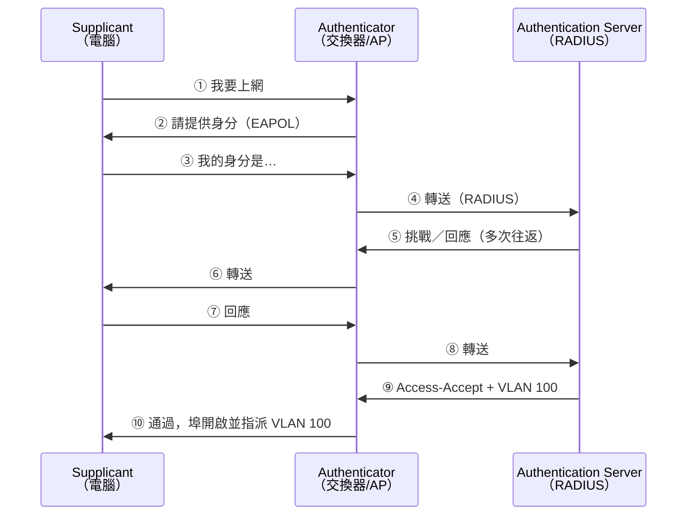

# 網路存取控制 NAC 與 802.1X

> [!abstract] 這篇你會學到
> - 理解**為什麼「插上網路線就有網路」是個資安問題**
> - 掌握 **802.1X** 的三個角色與認證流程
> - 分辨 **EAP 各種方法**的安全性差異
> - 知道 **MAB（MAC 認證）為什麼不安全，但為什麼還是要用**
> - 學會**動態 VLAN 指派**與訪客／IoT 隔離
> - 用 **FreeRADIUS + Cisco 交換器**完成一個可運作的實作
> - **避開 NAC 導入最大的風險：把全機關鎖在網路外**

## 前置知識

- [[010-02-16-guide-網概-VLAN與網路分段]] — VLAN 的基礎
- [[090-05-07-guide-資安設備-身分存取管理IAM與MFA]] — 認證的基本概念
- [[090-03-01-guide-應用安全-TLS憑證與HTTPS實務]] — EAP-TLS 需要憑證基礎

---

## 觀念說明

### 問題：實體存取等於網路存取

> [!danger] 走進你的辦公室，插上網路線，就進到內網了
> **傳統的網路交換器不做任何驗證** ——
> 只要實體上插得到，就有網路。
>
> **這代表**：
> - 會議室、大廳、走廊的網路孔**任何人都能用**
> - 外部廠商可以**自己接上內網**
> - 有心人士可以**帶一台小電腦插著就走**（Drop Box 攻擊）
> - **被偷走的公務電腦**插回內網仍然能用
> - 沒有納管的個人裝置**直接進到內網**

> [!example] 真實的攻擊：Drop Box
> 攻擊者假扮成清潔或維修人員進入辦公室，
> 把一台**樹莓派大小的裝置**插在會議室的網路孔後面，
> 裝置透過 4G 連回攻擊者。
>
> **他人已經離開了，但持續擁有你內網的存取權。**
>
> **NAC 就是為了解決這個問題。**

### NAC 能做什麼

| 功能 | 說明 |
| --- | --- |
| **驗證裝置與使用者** | 未通過認證就**沒有網路** |
| **動態指派 VLAN** | 依身分自動放進正確的網段 |
| **合規檢查（Posture）** | 檢查防毒、修補、加密狀態，不合規就隔離 |
| **訪客管理** | 自助註冊、限時、只能上網不能進內網 |
| **裝置可視性** | **知道網路上有哪些裝置**（連 IoT 都算） |
| **自動隔離** | 偵測到異常時把裝置移到隔離網段 |

> [!tip] NAC 的第一個價值往往是「可視性」
> 很多機關導入 NAC 後的第一個發現是：
> **「原來我們網路上有這麼多不知道的裝置。」**
>
> 印表機、監視器、門禁、冷氣控制、電視、投影機、
> 廠商留下的設備、早就該報廢的機器…
>
> **光是「知道有什麼」就已經很有價值。**

---

## 802.1X：埠級認證

### 三個角色



| 角色 | 是誰 | 做什麼 |
| --- | --- | --- |
| **Supplicant** | **電腦／手機**上的 802.1X 用戶端 | 提供憑證 |
| **Authenticator** | **交換器或無線 AP** | **執行放行／拒絕**（等同 PEP） |
| **Authentication Server** | **RADIUS 伺服器** | **判定**通過與否（等同 PDP） |

> [!note] 認證前，埠上只能通過 EAPOL
> 802.1X 的關鍵是：
> **認證通過之前，交換器的那個埠「只允許 EAPOL 封包」**，
> 其他任何流量（包括 DHCP、ARP）都被丟棄。
>
> → **未認證的裝置連 IP 都拿不到，更不用說進內網。**

### EAP 方法比較

> [!danger] 選錯 EAP 方法，802.1X 的保護會大打折扣

| 方法 | 認證方式 | 安全性 | 說明 |
| --- | --- | --- | --- |
| **EAP-TLS** | **雙向憑證** | ⭐⭐⭐⭐⭐ | **最安全**，沒有密碼可以被偷 |
| **PEAP-MSCHAPv2** | 伺服器憑證 + 使用者密碼 | ⭐⭐⭐ | **最常見**（AD 整合方便），但密碼可被離線破解 |
| **EAP-TTLS** | 伺服器憑證 + 內層任意方法 | ⭐⭐⭐ | 類似 PEAP，較有彈性 |
| **EAP-FAST** | PAC 檔案 | ⭐⭐⭐ | Cisco 專有 |
| **EAP-MD5** | 密碼雜湊 | ⭐ | **已淘汰**，不要用（無伺服器驗證、可離線破解） |
| **MAB** | **MAC 位址** | ⭐ | **不是真正的認證**（見下方） |

> [!danger] PEAP 必須驗證伺服器憑證，否則等於沒有保護
> **攻擊手法（Evil Twin / 惡意 RADIUS）**：
> 1. 攻擊者架一個**假的無線 AP 或假的 RADIUS 伺服器**
> 2. 使用者的裝置連上去
> 3. 如果裝置**沒有驗證伺服器憑證**，它會直接把
>    **MSCHAPv2 的挑戰／回應**交給攻擊者
> 4. 攻擊者**離線破解**取得使用者的網域密碼
>
> **必做的用戶端設定**：
> ```
> ☑ 驗證伺服器的憑證
> ☑ 指定信任的根 CA（只信任你自己的 CA）
> ☑ 指定伺服器名稱（例如 radius.example.gov.tw）
> ☑ 不要提示使用者授權新的伺服器或 CA   ← 最重要
> ```
>
> **最後一項最關鍵** ——
> 如果允許使用者自己按「信任」，那所有防護都白費了
> （使用者會直接按確定）。
>
> **用 GPO 或 MDM 統一推送這些設定，不要讓使用者自己設。**

> [!tip] EAP-TLS 是最安全的，但要有 PKI
> **優點**：
> - **沒有密碼可以被偷或被破解**
> - 憑證可以撤銷（比改密碼快）
> - 可以同時驗證「裝置」與「使用者」
>
> **代價**：
> - 需要建立與維護 **PKI**（見 [[090-01-00-idx-PKI-憑證與PKI]]）
> - **憑證的發放、更新、撤銷需要自動化**
>   （AD 環境可用**自動註冊 Auto-enrollment**）
> - 憑證過期會造成大規模斷線 ← **要監控到期日**
>
> **有 AD CS 的機關，EAP-TLS 其實不難做。**

### MAB：MAC 認證繞道

> [!warning] 有些裝置根本不支援 802.1X
> 印表機、IP 攝影機、門禁、電話、工控設備、老舊設備…
>
> **MAB（MAC Authentication Bypass）**：
> 用**MAC 位址**當作身分來認證。

> [!danger] MAC 位址可以被偽造，MAB 不是真正的認證
> ```bash
> # 改 MAC 位址只要一行指令
> $ sudo ip link set dev eth0 address 00:11:22:33:44:55
> ```
>
> 攻擊者只要：
> 1. 看一眼印表機背後的 MAC 位址標籤（或用 ARP 掃描取得）
> 2. 把自己的網卡改成那個 MAC
> 3. **通過 MAB 認證**
>
> **MAB 只能擋「隨便插上來的裝置」，擋不住有意的攻擊者。**

> [!tip] MAB 的正確用法：把它當成「分類」而不是「認證」
> 既然 MAB 不安全，就**不要給它太多權限**：
>
> ```
> 802.1X 認證通過的裝置  → 內部網段（VLAN 100）
> MAB 通過的裝置         → 【專屬的隔離網段】（VLAN 300）
>                           只能連它需要的那幾台伺服器
> 完全沒通過的           → 【訪客/隔離網段】（VLAN 999）或直接沒網路
> ```
>
> **例如印表機**：
> - 放進「印表機 VLAN」
> - 那個 VLAN **只允許連到列印伺服器**
> - **不允許連網際網路、不允許連其他網段**
>
> 這樣即使有人偽造 MAC 進來，**他也只在印表機的隔離網段裡**，
> 什麼都做不了。
>
> **這就是「微分段」與 NAC 的結合**（見 [[090-05-12-guide-資安設備-零信任架構與微分段]]）。

---

## 動態 VLAN 與後備機制

### 依身分指派 VLAN

RADIUS 回傳的屬性決定交換器要把這個埠放進哪個 VLAN：

```
Tunnel-Type            = VLAN (13)
Tunnel-Medium-Type     = IEEE-802 (6)
Tunnel-Private-Group-Id = "100"      ← VLAN ID 或 VLAN 名稱
```

| 使用者類型 | VLAN | 可以存取 |
| --- | --- | --- |
| 一般員工 | 100 | 內部網段 |
| IT 人員 | 110 | 內部 + 管理網段 |
| **訪客** | 900 | **只能上網際網路** |
| **印表機（MAB）** | 300 | **只能連列印伺服器** |
| **IoT（MAB）** | 400 | **只能連其對應的管理平台** |
| **不合規** | 950 | **只能連修補伺服器**（隔離修復） |
| 認證失敗 | — | **沒有網路** |

### 三種後備機制（極重要）

> [!danger] 沒有設定後備機制 = 遲早會出大事
> **真實會發生的情況**：
> - RADIUS 伺服器當機
> - RADIUS 與交換器之間的網路斷了
> - 憑證過期
> - 設定改錯
>
> **後果：全機關的網路孔全部失效，沒有人能上網。**
> 而且**你也連不上去修**（管理連線也在同一張網路上）。

| 機制 | Cisco 設定 | 作用 |
| --- | --- | --- |
| **Guest VLAN** | `authentication event no-response action authorize vlan 900` | 裝置**不支援 802.1X**（沒回應）→ 放進訪客 VLAN |
| **Auth-Fail VLAN** | `authentication event fail action authorize vlan 950` | **認證失敗** → 放進隔離 VLAN |
| **Critical VLAN** ★ | `authentication event server dead action authorize vlan 100` | **RADIUS 掛掉** → **放進正常 VLAN**（保障營運） |

> [!tip] Critical VLAN 是必設的保險
> **「RADIUS 掛掉時，讓大家還能上班。」**
>
> 這是可用性與安全性的權衡：
> - **不設**：RADIUS 掛掉 → 全機關斷網 → **災難**
> - **設了**：RADIUS 掛掉 → 大家照常上網（暫時沒有 NAC 保護）→ 修好後恢復
>
> **搭配監控**：RADIUS 異常要**立刻告警**，
> 不然你可能好幾天都在「沒有 NAC 保護」的狀態而不自知。
>
> ```
> ! Cisco：偵測 RADIUS 存活
> radius-server dead-criteria time 10 tries 3
> radius-server deadtime 5
> ```

> [!warning] 管理連線不要依賴 802.1X
> **交換器的管理介面、伺服器的管理網段，不要納入 802.1X**，
> 否則出問題時**你連上去修的路也斷了**。
>
> **保留**：
> - 獨立的頻外管理網路（OOB）
> - Console 線的實體存取
> - 至少一個不做認證的管理埠（**實體上鎖好**）

---

## 完整實戰範例

### FreeRADIUS + Cisco 交換器

> [!danger] 導入 802.1X 的鐵則
> **一定要從「監控模式」開始，絕對不要一開始就強制認證。**
> 詳見本節最後的導入步驟。

```bash
# ========== 【1】安裝 FreeRADIUS ==========
$ sudo apt update && sudo apt install -y freeradius freeradius-utils
$ sudo systemctl stop freeradius
```

```bash
# ========== 【2】設定交換器為 RADIUS 用戶端 ==========
$ sudo tee -a /etc/freeradius/3.0/clients.conf > /dev/null <<'EOF'

client switch-1f {
    ipaddr = 10.0.9.11
    secret = 用一個很長的隨機字串不要用預設值
    shortname = sw-1f
    nas_type = cisco
}

client switch-2f {
    ipaddr = 10.0.9.12
    secret = 另一個很長的隨機字串
    shortname = sw-2f
    nas_type = cisco
}

# 也可以整個網段（不建議，除非交換器很多）
# client switches {
#     ipaddr = 10.0.9.0/24
#     secret = ...
# }
EOF
```

> [!danger] RADIUS 共享密鑰必須是長隨機字串
> 預設的 `testing123` **一定要換掉**。
> ```bash
> $ openssl rand -base64 32
> ```
> 而且**每台交換器用不同的密鑰**。

```bash
# ========== 【3】測試用的本機使用者 ==========
$ sudo tee -a /etc/freeradius/3.0/users > /dev/null <<'EOF'

# 一般員工 → VLAN 100
testuser  Cleartext-Password := "測試密碼"
          Tunnel-Type = VLAN,
          Tunnel-Medium-Type = IEEE-802,
          Tunnel-Private-Group-Id = "100"

# IT 人員 → VLAN 110
ituser    Cleartext-Password := "測試密碼"
          Tunnel-Type = VLAN,
          Tunnel-Medium-Type = IEEE-802,
          Tunnel-Private-Group-Id = "110"

# MAB：印表機（MAC 當帳密，注意大小寫與分隔符要與交換器設定一致）
001122334455  Cleartext-Password := "001122334455"
              Tunnel-Type = VLAN,
              Tunnel-Medium-Type = IEEE-802,
              Tunnel-Private-Group-Id = "300"
EOF
```

```bash
# ========== 【4】除錯模式啟動並測試 ==========
$ sudo freeradius -X          # 前景執行，顯示完整除錯訊息

# 另開一個視窗測試
$ radtest testuser 測試密碼 127.0.0.1 0 testing123
Sent Access-Request Id 42 from 0.0.0.0:randomport to 127.0.0.1:1812
Received Access-Accept Id 42 from 127.0.0.1:1812
    Tunnel-Type = VLAN
    Tunnel-Medium-Type = IEEE-802
    Tunnel-Private-Group-Id = "100"       ← ✓ VLAN 有回傳

# 確認沒問題後正式啟動
$ sudo systemctl enable --now freeradius
```

```bash
# ========== 【5】串接 AD（實務上一定要做）==========
$ sudo apt install -y freeradius-ldap samba winbind krb5-user

# 加入網域
$ sudo realm join --user=Administrator example.gov.tw
$ wbinfo -t            # 測試信任關係
checking the trust secret for domain EXAMPLE via RPC calls succeeded

# 設定 mschap 模組使用 ntlm_auth
$ sudo nano /etc/freeradius/3.0/mods-available/mschap
```

```ini
mschap {
    # 讓 FreeRADIUS 透過 winbind 向 AD 驗證
    ntlm_auth = "/usr/bin/ntlm_auth --request-nt-key \
                 --username=%{%{Stripped-User-Name}:-%{%{User-Name}:-None}} \
                 --challenge=%{%{mschap:Challenge}:-00} \
                 --nt-response=%{%{mschap:NT-Response}:-00} \
                 --domain=EXAMPLE"

    # winbind 方式（較新，效能較好）
    # winbind_username = "%{mschap:User-Name}"
    # winbind_domain = "EXAMPLE"
}
```

```bash
# freeradius 需要能讀 winbind 的 socket
$ sudo usermod -aG winbindd_priv freerad
$ sudo systemctl restart freeradius
```

```bash
# ========== 【6】設定 EAP ==========
$ sudo nano /etc/freeradius/3.0/mods-available/eap
```

```ini
eap {
    default_eap_type = peap          # 或 tls（更安全）

    tls-config tls-common {
        # ★★ 一定要換成你自己的憑證，不要用預設的測試憑證
        private_key_file = /etc/freeradius/3.0/certs/radius.key
        certificate_file = /etc/freeradius/3.0/certs/radius.crt
        ca_file          = /etc/freeradius/3.0/certs/ca.crt
        private_key_password = ...

        # 憑證撤銷檢查（EAP-TLS 時很重要）
        check_crl = yes
        ca_path = /etc/freeradius/3.0/certs
    }

    peap {
        tls = tls-common
        default_eap_type = mschapv2
        virtual_server = "inner-tunnel"
    }

    tls {
        tls = tls-common
        # EAP-TLS：驗證用戶端憑證
        # 可用 CN 或 SAN 比對使用者名稱
    }
}
```

> [!danger] FreeRADIUS 預設帶的是「測試用」的自簽憑證
> **絕對不能用在正式環境** ——
> 它是公開的，任何人都能拿同一張憑證架假的 RADIUS。
>
> **必須用你自己的 CA 簽發的憑證**，
> 並且**把你的 CA 憑證推送到所有用戶端**（GPO/MDM）。
>
> **憑證的 CN 或 SAN 要與用戶端設定的「伺服器名稱」一致。**

```cisco
! ========== 【7】Cisco 交換器設定 ==========

! --- AAA ---
aaa new-model
aaa authentication dot1x default group radius
aaa authorization network default group radius
aaa accounting dot1x default start-stop group radius

! --- RADIUS 伺服器 ---
radius server RAD1
 address ipv4 10.0.9.60 auth-port 1812 acct-port 1813
 key 用一個很長的隨機字串不要用預設值
 retransmit 3
 timeout 5

! 第二台（高可用性）
radius server RAD2
 address ipv4 10.0.9.61 auth-port 1812 acct-port 1813
 key 另一個很長的隨機字串

! --- 偵測 RADIUS 是否存活（Critical VLAN 需要）---
radius-server dead-criteria time 10 tries 3
radius-server deadtime 5

! --- 全域啟用 802.1X ---
dot1x system-auth-control
ip device tracking

! --- 埠設定 ---
interface range GigabitEthernet1/0/1-24
 switchport mode access
 switchport access vlan 999                    ! 預設放進隔離 VLAN
 switchport voice vlan 200                     ! 若有 IP 話機

 ! === 認證設定 ===
 authentication port-control auto              ! ★ 正式模式
 ! authentication open                          ! ★★ 監控模式（導入初期用這個）

 authentication host-mode multi-domain         ! 允許一台電腦 + 一台話機
 authentication order dot1x mab                ! 先試 802.1X，失敗再試 MAB
 authentication priority dot1x mab

 ! === 後備機制 ===
 authentication event no-response action authorize vlan 900    ! Guest VLAN
 authentication event fail action authorize vlan 950           ! Auth-Fail VLAN
 authentication event server dead action authorize vlan 100    ! ★ Critical VLAN
 authentication event server alive action reinitialize

 ! === 重新認證 ===
 authentication periodic
 authentication timer reauthenticate server    ! 用 RADIUS 回傳的時間
 authentication violation restrict             ! 違規時限制而非關閉埠

 ! === 啟用 802.1X 與 MAB ===
 dot1x pae authenticator
 dot1x timeout tx-period 10
 dot1x max-reauth-req 2
 mab

 spanning-tree portfast
 spanning-tree bpduguard enable
```

> [!info]- Juniper JunOS 對照
> ```junos
> set access radius-server 10.0.9.60 port 1812
> set access radius-server 10.0.9.60 secret "很長的隨機字串"
> set access profile DOT1X-PROFILE authentication-order radius
> set access profile DOT1X-PROFILE radius authentication-server 10.0.9.60
>
> set protocols dot1x authenticator authentication-profile-name DOT1X-PROFILE
> set protocols dot1x authenticator interface ge-0/0/1 supplicant multiple
> set protocols dot1x authenticator interface ge-0/0/1 mac-radius
> set protocols dot1x authenticator interface ge-0/0/1 guest-vlan GUEST
> set protocols dot1x authenticator interface ge-0/0/1 server-fail vlan-name CRITICAL
> set protocols dot1x authenticator interface ge-0/0/1 reauthentication 3600
> ```

```cisco
! ========== 【8】驗證與除錯 ==========
show authentication sessions
show authentication sessions interface Gi1/0/5 details
show dot1x all
show dot1x interface Gi1/0/5 details
show aaa servers
test aaa group radius testuser 密碼 new-code

! 除錯（正式環境小心使用，會產生大量訊息）
debug dot1x all
debug radius authentication
```

**預期輸出**：
```
SW# show authentication sessions interface Gi1/0/5 details
            Interface:  GigabitEthernet1/0/5
          MAC Address:  0011.2233.4455
         IPv4 Address:  10.0.100.55
            User-Name:  EXAMPLE\wang
               Status:  Authorized             ← ✓
               Domain:  DATA
      Oper host mode:  multi-domain
    Oper control dir:  both
     Session timeout:  3600s
        Vlan Group:  Vlan: 100                 ← ✓ 動態指派成功
    Method status list:
          Method     State
          dot1x      Authc Success
```

### 導入步驟（極重要）

> [!danger] 直接開啟強制認證 = 全機關斷網
> **這是 NAC 導入最常見、也最嚴重的災難。**
>
> 你不會知道：
> - 有哪些裝置**不支援 802.1X**
> - 有哪些裝置的 supplicant **沒設定好**
> - 有哪些**你根本不知道存在的裝置**
> - 哪些**關鍵設備會因此斷線**（醫療、工控、門禁）

> [!tip] 正確的四階段導入
> **【階段一】監控模式（Monitor Mode）—— 至少 1 個月**
> ```cisco
> interface range Gi1/0/1-24
>  authentication open                    ! ★ 認證失敗也放行
>  authentication port-control auto
>  dot1x pae authenticator
>  mab
> ```
> **`authentication open` 讓所有流量照常通過**，
> 但 RADIUS 會**記錄每一次認證的結果**。
>
> **這個階段要做的**：
> - 收集 RADIUS 日誌，**列出所有失敗的裝置**
> - 建立**完整的裝置清冊**（這通常會發現一堆意外）
> - **逐一處理**：
>   - 支援 802.1X 但沒設定 → 用 GPO 推送設定
>   - 不支援 802.1X → **登記 MAC，加入 MAB 清單**
>   - 不明裝置 → **查清楚它是什麼**（這一步常有驚喜）
>
> **【階段二】低影響模式（Low Impact）**
> 仍然 `authentication open`，但**套用 ACL 限制未認證裝置**
> （只允許 DHCP、DNS、連到修補伺服器）。
>
> **【階段三】試行**
> 選一層樓或一個部門改成 `authentication port-control auto`（強制），
> 觀察 1～2 週。
>
> **【階段四】全面推行**
> 逐區推行，**每一區推行前先確認該區的裝置清冊完整**。
>
> **全程都要有明確的回退方式**（一條指令改回 `authentication open`）。

### 有線與無線的一致政策

```
無線（企業級 WPA2/WPA3-Enterprise）也是用 802.1X + RADIUS
→ 用同一台 RADIUS，同一套政策

SSID-Corp    → 802.1X (EAP-TLS/PEAP) → 動態 VLAN
SSID-Guest   → 訪客入口（Captive Portal）→ VLAN 900（只能上網）
SSID-IoT     → PSK 或 MAB → VLAN 400（隔離）
```

> [!warning] 訪客無線網路的三個必做設定
> 1. **Client Isolation（用戶端隔離）** ← 常被忘記
>    → 訪客之間不能互連（防止訪客之間互相攻擊）
> 2. **完全隔離於內網**
>    → 訪客 VLAN 的 ACL 只允許連往網際網路
> 3. **獨立的網際網路出口或明確的流量標記**
>    → 訪客的行為不要混在機關的對外 IP 下
>    （避免機關 IP 因訪客行為被列入黑名單，也方便追溯）
>
> 另外建議：**訪客帳號要有時效**（如 8 小時），
> 並記錄申請人與被訪對象（法遵與追溯需求）。

---

## 常見錯誤與排錯

| 現象／錯誤 | 原因 | 解法 |
| --- | --- | --- |
| **開啟強制認證後全機關斷網** | **沒有先跑監控模式** | 立刻改回 `authentication open`；**重新走四階段導入** |
| **RADIUS 掛掉，所有人斷網** | **沒設 Critical VLAN** | `authentication event server dead action authorize vlan 100` |
| RADIUS 掛了好幾天沒人發現 | Critical VLAN 生效但沒告警 | **RADIUS 存活監控 + 告警** |
| 你自己也連不上去修 | **管理網段也納入了 802.1X** | 保留 OOB 管理網路與不認證的管理埠（實體上鎖） |
| **PEAP 密碼被離線破解** | 用戶端**沒有驗證伺服器憑證** | GPO 強制「驗證憑證 + 指定 CA + 指定伺服器名稱 + **不允許使用者授權新伺服器**」 |
| 用了 FreeRADIUS 的預設憑證 | 那是公開的測試憑證 | **換成自己 CA 簽的憑證**，並推送 CA 到用戶端 |
| MAC 被偽造繞過 MAB | **MAB 本來就不是真正的認證** | MAB 裝置放進**權限極小的隔離 VLAN** |
| 印表機一直認證失敗 | 印表機不支援 802.1X | 登記 MAC 用 **MAB**，放進印表機專屬 VLAN |
| IP 話機與電腦共用一個埠出問題 | host-mode 設錯 | `authentication host-mode multi-domain` + `switchport voice vlan` |
| 動態 VLAN 沒生效 | RADIUS 沒回傳三個必要屬性 | 確認 `Tunnel-Type`/`Tunnel-Medium-Type`/`Tunnel-Private-Group-Id` 都有 |
| 認證通過但拿不到 IP | VLAN 上沒有 DHCP relay | 檢查該 VLAN 的 `ip helper-address` |
| 交換器與 RADIUS 溝通失敗 | **共享密鑰不符**或防火牆擋了 | 確認 secret；開放 UDP **1812/1813** |
| **EAP-TLS 憑證過期，大量斷線** | 沒有監控憑證到期日 | 建立到期監控；用 AD **自動註冊**續期 |
| 訪客之間互相攻擊 | **沒開 Client Isolation** | AP 上啟用用戶端隔離 |
| 有裝置從來沒被認證過 | 接在不受管的小交換器後面 | 盤點所有「串接的」交換器；考慮 `multi-auth` 模式 |
| 重新認證時使用者被斷線 | 重新認證機制設定不當 | 用 `authentication timer reauthenticate server` 交由 RADIUS 控制 |

---

## 安全性注意事項

> [!danger] 802.1X 不能防「已認證裝置」之後的行為
> 一旦通過認證，**這台裝置就在那個 VLAN 裡了**。
>
> **802.1X 擋不住的**：
> - 已認證的電腦**被入侵後在 VLAN 內橫向移動**
> - 合法使用者的惡意行為
> - **裝置在認證後才變得不合規**（防毒被關掉、被植入惡意程式）
>
> **必須搭配**：
> - **微分段**（見 [[090-05-12-guide-資安設備-零信任架構與微分段]]）—— VLAN 內也要管控
> - **EDR**（見 [[090-05-05-guide-資安設備-端點防護AV-EDR-XDR]]）
> - **持續的合規檢查**（不只在連線時檢查一次）
> - **異常時自動隔離**（NAC 與 EDR 整合：EDR 發現異常 → 通知 NAC 隔離）

> [!warning] 802.1X 的繞過手法
> **一、集線器插入（Hub Insertion / Bridge 攻擊）**
> 攻擊者在**已認證的電腦與交換器之間**插入一台裝置，
> 讓它「搭便車」使用已認證的連線。
>
> **對策**：
> - `authentication host-mode single-host`（一個埠只允許一個 MAC）
> - **MACsec（802.1AE）**加密鏈路 ← 根本解法
> - 定期重新認證
>
> **二、實體層攻擊**
> 直接接在已認證裝置的線路上竊聽。
> **對策**：MACsec 加密。
>
> **三、拔掉電腦立刻插上自己的裝置**
> 有些交換器在 Link Down 時**不會立刻清除認證狀態**。
> **對策**：確認交換器設定為 Link Down 時立即清除 Session。
>
> **四、繞過交換器**
> 攻擊者接在「不受 802.1X 管控的小交換器」後面。
> **對策**：盤點所有串接的交換器；辦公室不允許私接交換器。

> [!tip] NAC 應與 EDR、SIEM 整合
> **真正的價值在整合**：
> ```
> EDR 偵測到某台電腦有惡意行為
>   → 通知 NAC
>     → NAC 立刻把該埠移到隔離 VLAN
>       → 該電腦與內網完全隔絕（但還能連到修補/清除伺服器）
>         → 通知資安人員處理
> ```
>
> **這個自動化流程可以把「橫向移動」的時間窗從幾小時縮短到幾秒。**
>
> 見 [[090-05-09-guide-資安設備-日誌集中與SIEM]] 的 SOAR 部分。

> [!danger] 別忘了實體安全
> 802.1X 保護的是「網路存取」，不是「實體存取」。
>
> **仍然需要**：
> - **未使用的網路孔要在交換器上 shutdown**（最簡單有效）
> - 網路孔的實體管控（機櫃上鎖、明線走管）
> - **交換器機櫃上鎖**（有人能碰到 Console 就能重設）
> - 訪客陪同政策
> - 監視器
>
> 見 [[090-05-15-guide-資安設備-實體與OT-IoT安全設備]]。

---

## 速查表

### 802.1X 三角色

| 角色 | 是誰 |
| --- | --- |
| **Supplicant** | 電腦／手機上的用戶端 |
| **Authenticator** | **交換器／AP**（執行 = PEP） |
| **Auth Server** | **RADIUS**（判定 = PDP） |

**認證前，埠上只允許 EAPOL 通過。**

### EAP 方法

| 方法 | 安全性 | 說明 |
| --- | --- | --- |
| **EAP-TLS** | ⭐⭐⭐⭐⭐ | **雙向憑證，最安全** |
| PEAP-MSCHAPv2 | ⭐⭐⭐ | 最常見，**必須驗證伺服器憑證** |
| EAP-TTLS | ⭐⭐⭐ | 類似 PEAP |
| EAP-MD5 | ⭐ | **已淘汰** |
| **MAB** | ⭐ | **不是真正的認證** |

### PEAP 用戶端必設（用 GPO 推）

```
☑ 驗證伺服器的憑證
☑ 指定信任的根 CA
☑ 指定伺服器名稱
☑ 不要提示使用者授權新的伺服器或 CA   ← 最重要
```

### 動態 VLAN 的三個 RADIUS 屬性

```
Tunnel-Type             = VLAN (13)
Tunnel-Medium-Type      = IEEE-802 (6)
Tunnel-Private-Group-Id = "100"
```

### 三種後備機制

| 機制 | 觸發 | Cisco |
| --- | --- | --- |
| Guest VLAN | 沒有 supplicant | `event no-response action authorize vlan 900` |
| Auth-Fail VLAN | 認證失敗 | `event fail action authorize vlan 950` |
| **Critical VLAN ★** | **RADIUS 掛掉** | `event server dead action authorize vlan 100` |

### 導入四階段

```
① 監控模式（authentication open）≥ 1 個月  ← 絕對不能跳過
② 低影響模式（open + ACL 限制）
③ 一層樓/一部門試行（port-control auto）
④ 逐區全面推行
全程保留一鍵回退（改回 authentication open）
```

### Cisco 關鍵指令

| 目的 | 指令 |
| --- | --- |
| 全域啟用 | `dot1x system-auth-control` |
| **監控模式** | `authentication open` |
| **強制模式** | `authentication port-control auto` |
| 順序 | `authentication order dot1x mab` |
| 電腦+話機 | `authentication host-mode multi-domain` |
| 查看狀態 | `show authentication sessions` |
| 詳細 | `show authentication sessions interface X details` |
| 測試 RADIUS | `test aaa group radius <user> <pass> new-code` |

### FreeRADIUS

| 檔案 | 用途 |
| --- | --- |
| `clients.conf` | 哪些交換器可以用（含 secret） |
| `users` | 本機使用者與回傳屬性 |
| `mods-available/eap` | EAP 方法與憑證 |
| `mods-available/mschap` | AD 整合（ntlm_auth） |

```bash
sudo freeradius -X                          # 除錯模式
radtest user pass 127.0.0.1 0 secret        # 測試
```

### 802.1X 擋不住的

```
❌ 已認證裝置被入侵後的橫向移動 → 需要微分段
❌ 認證後才變得不合規           → 需要持續合規檢查
❌ Hub 插入/搭便車              → 需要 MACsec 或 single-host
❌ 實體存取                     → 未用埠 shutdown、機櫃上鎖
```

---

## 練習題

> [!question]- 練習 1：評估你的實體網路風險
> 走一趟你的辦公場所，回答：
> 1. **會議室、大廳、走廊有幾個網路孔？**
> 2. **它們在交換器上是「開著」的嗎？**（`show interface status`）
> 3. 如果有人插上網路線，**會拿到 IP 嗎？能連到什麼？**
> 4. **有沒有網路孔在交換器上是開的，但實際上沒人在用？**
> 5. 交換器機櫃有上鎖嗎？
>
> **最簡單的改善**：把所有未使用的埠 `shutdown`。
> 這不用花錢，五分鐘就能做完。

> [!question]- 練習 2：盤點不支援 802.1X 的裝置
> 列出你機關網路上**不支援 802.1X 的裝置**：
> 1. 印表機／影印機有幾台？
> 2. IP 攝影機、門禁、對講機？
> 3. IP 話機？
> 4. 冷氣、電表、其他 IoT？
> 5. 工控或特殊設備？
>
> 對每一類回答：
> - **它需要連到哪些系統？**（往往只有一台）
> - **它需要連網際網路嗎？**（往往不需要）
> - **如果放進一個「只能連那台伺服器」的 VLAN，會壞掉嗎？**
>
> 這份清單就是你的 MAB 與 IoT 分段規劃的基礎。

> [!question]- 練習 3：建一套測試環境
> 用一台 VM 與一台可管理的交換器（或用軟體模擬）：
> 1. 安裝 FreeRADIUS，設定一個測試使用者
> 2. 用 `radtest` 確認能通過認證並**回傳 VLAN**
> 3. 設定交換器的一個埠為 **`authentication open`（監控模式）**
> 4. 用一台筆電接上去，**觀察 RADIUS 的日誌**
> 5. 改成 `authentication port-control auto`（強制模式），再測一次
> 6. **故意把 RADIUS 停掉**，觀察 Critical VLAN 有沒有生效
> 7. 思考：如果這是正式環境，**第 6 步發生時你會多快發現？**

---

## 小測驗

Q1. 為什麼說「插上網路線就有網路」是個資安問題？什麼是 Drop Box 攻擊？

Q2. 802.1X 的三個角色是什麼？**認證通過之前，埠上只允許什麼通過**？

Q3. EAP-TLS 與 PEAP-MSCHAPv2 的差別是什麼？各自的優缺點？

Q4. **PEAP 用戶端必須設定的四項是什麼？其中哪一項最關鍵，為什麼**？

Q5. **MAB 為什麼不是真正的認證**？既然不安全，正確的用法是什麼？

Q6. 動態 VLAN 需要 RADIUS 回傳哪三個屬性？

Q7. **三種後備機制分別在什麼情況觸發？哪一個是「必設的保險」，為什麼**？

Q8. **NAC 導入為什麼一定要先跑「監控模式」**？直接開強制認證會怎樣？

Q9. 802.1X 擋不住哪四類威脅？各該搭配什麼防護？

Q10. 什麼是 Hub Insertion 攻擊？有哪三種對策？

> [!question]- 測驗答案
> **Q1.** 因為傳統交換器**不做任何驗證，只要實體插得到就有網路** ——
> 這代表會議室、大廳、走廊的網路孔任何人都能用，
> 外部廠商可以自己接上內網，被偷的公務電腦插回來仍然能用，
> 未納管的個人裝置直接進到內網。
> **Drop Box 攻擊**：攻擊者假扮清潔或維修人員進入辦公室，
> 把一台**樹莓派大小的裝置**插在會議室網路孔後面，
> 該裝置透過 4G 連回攻擊者 ——
> **人已經離開了，但持續擁有內網存取權**。
>
> **Q2.** **Supplicant**（電腦／手機上的 802.1X 用戶端，提供憑證）、
> **Authenticator**（交換器或 AP，執行放行／拒絕，等同 PEP）、
> **Authentication Server**（RADIUS 伺服器，判定通過與否，等同 PDP）。
> 認證通過之前，**埠上只允許 EAPOL 封包通過**，
> 其他流量（包括 DHCP、ARP）全部丟棄 ——
> 未認證的裝置**連 IP 都拿不到**。
>
> **Q3.** **EAP-TLS** 用**雙向憑證**（伺服器與用戶端都有憑證），
> 優點是**沒有密碼可以被偷或破解**、憑證可撤銷、
> 可同時驗證裝置與使用者；缺點是**需要建立與維護 PKI**，
> 憑證的發放更新撤銷要自動化，憑證過期會造成大規模斷線。
> **PEAP-MSCHAPv2** 用**伺服器憑證 + 使用者密碼**，
> 優點是與 AD 整合方便、部署容易（最常見）；
> 缺點是**密碼的挑戰／回應可被離線破解**，
> 安全性完全依賴用戶端有沒有正確驗證伺服器憑證。
>
> **Q4.** ①**驗證伺服器的憑證**；②**指定信任的根 CA**（只信任自己的 CA）；
> ③**指定伺服器名稱**；
> ④**不要提示使用者授權新的伺服器或 CA**。
> **第四項最關鍵** —— 如果允許使用者自己按「信任」，
> **所有防護都白費了**，因為使用者遇到提示會直接按確定，
> 這樣攻擊者架的假 RADIUS 就能取得 MSCHAPv2 的挑戰／回應去離線破解。
> 這些設定應該用 **GPO 或 MDM 統一推送**，不讓使用者自己設。
>
> **Q5.** 因為 **MAC 位址可以被輕易偽造**
> （`ip link set dev eth0 address ...` 一行指令就改掉），
> 攻擊者只要看一眼印表機背後的 MAC 標籤或用 ARP 掃描取得，
> 把自己的網卡改成那個 MAC 就能通過 MAB。
> **MAB 只能擋「隨便插上來的裝置」，擋不住有意的攻擊者。**
> **正確用法：把它當成「分類」而不是「認證」** ——
> MAB 通過的裝置放進**權限極小的專屬隔離 VLAN**
> （例如印表機 VLAN 只允許連列印伺服器、不能上網、不能連其他網段），
> 這樣即使有人偽造 MAC 進來也什麼都做不了。
>
> **Q6.** `Tunnel-Type = VLAN (13)`、
> `Tunnel-Medium-Type = IEEE-802 (6)`、
> `Tunnel-Private-Group-Id = "100"`（VLAN ID 或名稱）。
> **三個都要有**，缺一個動態 VLAN 就不會生效。
>
> **Q7.** **Guest VLAN** —— 裝置**不支援 802.1X**（沒有回應）時觸發；
> **Auth-Fail VLAN** —— **認證失敗**時觸發；
> **Critical VLAN** —— **RADIUS 伺服器掛掉**時觸發。
> **Critical VLAN 是必設的保險**，因為若不設，
> RADIUS 當機或網路斷線時**全機關的網路孔全部失效、沒有人能上網**，
> 而且**你自己也連不上去修**。
> 它是可用性與安全性的權衡：讓大家還能上班（暫時沒有 NAC 保護），
> 但**必須搭配 RADIUS 存活監控與告警**，
> 否則可能好幾天處在無保護狀態而不自知。
>
> **Q8.** 因為你**不會知道**：有哪些裝置不支援 802.1X、
> 有哪些裝置的 supplicant 沒設定好、
> 有哪些**你根本不知道存在的裝置**、
> 哪些關鍵設備（醫療、工控、門禁）會因此斷線。
> 直接開強制認證的後果是**全機關斷網** ——
> 這是 NAC 導入最常見也最嚴重的災難。
> 監控模式（`authentication open`）讓所有流量照常通過，
> 但 RADIUS 會**記錄每一次認證結果**，
> 讓你能收集失敗清單、建立完整裝置清冊、逐一處理，
> 至少要跑一個月。
>
> **Q9.** ①**已認證裝置被入侵後在 VLAN 內橫向移動** → 需要**微分段**；
> ②**裝置在認證後才變得不合規**（防毒被關、被植入惡意程式）
> → 需要**持續的合規檢查與 EDR**；
> ③**Hub Insertion／搭便車** → 需要 **MACsec 或 single-host 模式**；
> ④**實體存取**（未用埠、機櫃、Console）
> → 需要**未使用埠 shutdown、機櫃上鎖、實體管控**。
>
> **Q10.** **Hub Insertion**：攻擊者在**已認證的電腦與交換器之間**
> 插入一台裝置（集線器或橋接裝置），
> 讓自己的流量「搭便車」使用那條已通過認證的連線。
> **三種對策**：
> ①`authentication host-mode single-host`（一個埠只允許一個 MAC）；
> ②**MACsec（802.1AE）加密鏈路** ← 根本解法；
> ③**定期重新認證**（縮短搭便車的有效時間窗）。

---

## 延伸閱讀

- [[090-05-12-guide-資安設備-零信任架構與微分段]] — NAC 通過之後的內部管控
- [[010-02-16-guide-網概-VLAN與網路分段]] — VLAN 基礎
- [[090-05-07-guide-資安設備-身分存取管理IAM與MFA]] — 認證的整體架構
- [[090-05-05-guide-資安設備-端點防護AV-EDR-XDR]] — 與 NAC 整合的自動隔離
- [[090-05-15-guide-資安設備-實體與OT-IoT安全設備]] — IoT 裝置的隔離與實體安全
- [[090-05-09-guide-資安設備-日誌集中與SIEM]] — 認證日誌與 SOAR 自動化
- [[040-01-00-idx-網路設備]] — 交換器設定的基礎
