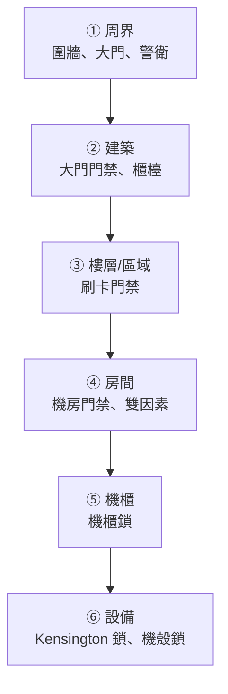
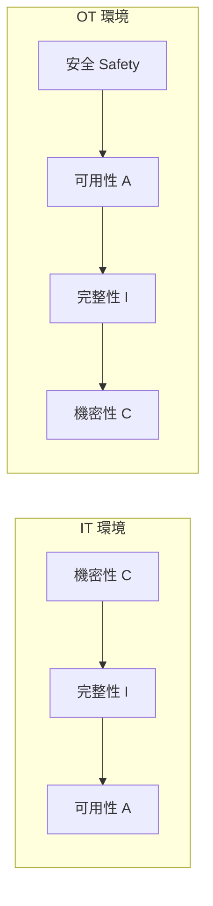

# 實體與 OT／IoT 安全設備

> [!abstract] 這篇你會學到
> - 理解**「實體存取 = 完全控制」** —— 為什麼實體安全是所有防護的地基
> - 認識**門禁、監視、機房**的實務管控要點
> - 知道**監視器與門禁本身就是常見的資安破口**
> - 分辨 **IT 與 OT 的優先順序為什麼完全相反**
> - 掌握 **普渡模型（Purdue Model）** 與 OT 網路分層
> - 知道 **IoT 裝置的六大風險**與務實的隔離做法
> - 學會**盤點你根本不知道存在的裝置**

## 前置知識

- [[090-05-13-guide-資安設備-網路存取控制NAC與802.1X]] — 裝置進網的管控
- [[090-05-12-guide-資安設備-零信任架構與微分段]] — 隔離的架構思維
- [[090-05-01-guide-資安設備-資安全景圖與縱深防禦]] — 實體層在縱深防禦的位置

---

## 觀念說明

### 實體存取 = 完全控制

> [!danger] 這是資安界的鐵律
> **只要能實體接觸一台機器，幾乎所有軟體防護都可以被繞過。**
>
> | 攻擊 | 需要多久 |
> | --- | --- |
> | 用 USB 開機碟開機，改 root 密碼 | **3 分鐘** |
> | 拆下硬碟接到別台電腦讀取 | **5 分鐘** |
> | 從 GRUB 進入單一使用者模式 | **1 分鐘** |
> | 重設 BIOS／清除主機板密碼 | 5 分鐘 |
> | 插入惡意 USB（BadUSB／Rubber Ducky） | **10 秒** |
> | 接上 Console 線重設交換器 | 5 分鐘 |
> | **拔走整台機器** | 2 分鐘 |
>
> **唯一能對抗實體存取的軟體防護是「全磁碟加密」**
> （見 [[090-05-08-guide-資安設備-資料防護DLP與加密]]），
> **但它只在關機時有效**。

> [!warning] 機關最常見的實體疏失
> - 伺服器機櫃**沒有上鎖**（或鑰匙就掛在旁邊）
> - 網路機櫃在**公共走廊**且沒鎖
> - **會議室的網路孔一直是通的**
> - 機房門長期**用垃圾桶擋著**（因為進出頻繁）
> - **門禁卡借來借去**、離職後沒繳回
> - 監視器**壞了三個月沒人發現**
> - 監視器**畫質太差，看不清楚人臉**
> - 錄影只保留 7 天（事件通常更久才發現）
> - **廢棄設備堆在走廊**（硬碟還在裡面）

### 實體安全的層次



**每一層都應該有：嚇阻 → 阻擋 → 偵測 → 記錄 → 應變。**

---

## 門禁系統

### 常見類型與安全性

| 類型 | 安全性 | 說明 |
| --- | --- | --- |
| **鑰匙** | ⭐⭐ | 可複製、無記錄、遺失要換鎖 |
| **125kHz 卡（EM/HID Prox）** | ⭐ | **極易複製**（幾百元的設備就能複製） |
| **13.56MHz（MIFARE Classic）** | ⭐⭐ | **已被破解**，可複製 |
| **MIFARE DESFire EV2/EV3** | ⭐⭐⭐⭐ | 加密良好，目前安全 |
| **生物辨識**（指紋、臉部） | ⭐⭐⭐ | 不能借給別人，但**無法「更換」** |
| **卡片 + PIN** | ⭐⭐⭐⭐ | 雙因素 |
| **卡片 + 生物辨識** | ⭐⭐⭐⭐⭐ | 機房建議 |

> [!danger] 你的門禁卡可能幾百元就能被複製
> **125kHz 的舊式感應卡（很多機關還在用）
> 用網購的複製機，靠近幾秒就能複製。**
>
> **MIFARE Classic（13.56MHz）也早已被破解**，
> 用手機 App + NFC 就可能讀取與複製。
>
> **檢查方法**：問門禁廠商你用的是哪一種卡片。
> 如果是 EM4100、HID Prox、MIFARE Classic → **應該規劃汰換**。
>
> **過渡期的補強**：
> - 機房等重要區域**加上第二因素**（PIN 或生物辨識）
> - **搭配監視器**（複製卡進得去，但錄影跑不掉）
> - **異常時段進出告警**

### 門禁的常見繞過手法

| 手法 | 說明 | 對策 |
| --- | --- | --- |
| **尾隨（Tailgating）** | 跟在有卡的人後面進去 | **防尾隨閘門**、教育「不要幫陌生人開門」、監視器 |
| **卡片複製** | 複製 125kHz/MIFARE Classic | **換成 DESFire**、加第二因素 |
| **借卡** | 同事之間互借 | 政策 + 稽核（一張卡同時出現在兩地？） |
| **出門按鈕（REX）欺騙** | 從門縫塞紙板或噴罐觸發紅外線感應 | 調整感應器位置、加裝門縫擋板 |
| **拆卸讀卡機** | 取得內部線路，短路開門 | **讀卡機裝在門外但控制器裝在門內** ← 關鍵 |
| **緊急開門裝置濫用** | 消防的緊急推桿 | 加裝告警（開啟即響鈴並通知） |
| **天花板／地板繞過** | 隔間牆沒到頂 | **機房隔間必須到樓板** |

> [!danger] 讀卡機與控制器必須分離
> **常見的嚴重設計錯誤**：
> 把整套門禁邏輯都放在**門外的讀卡機**裡。
>
> **後果**：攻擊者拆下讀卡機，
> **直接短路門鎖的線路就能開門**（幾秒鐘的事）。
>
> **正確設計**：
> - **讀卡機在門外，只負責讀卡並把資料送進去**
> - **控制器與門鎖電源在門內（安全側）**
> - 讀卡機被拆卸要**觸發防拆告警**
> - 通訊使用加密協定（**OSDP** 而非老舊的 Wiegand）
>
> **Wiegand 協定沒有加密**，可以被竊聽與重放。

### 門禁的必要功能

| 功能 | 說明 |
| --- | --- |
| **完整記錄** | 誰、什麼時候、進了哪個門、成功或失敗 |
| **異常告警** | **非上班時間進出**、連續失敗、防拆 |
| **反潛回（Anti-passback）** | 沒有刷出就不能再刷入（防借卡） |
| **時段管制** | 一般人只能在上班時段進入 |
| **立即停用** | **離職當天立刻停用**（見 [[090-05-07-guide-資安設備-身分存取管理IAM與MFA]]） |
| **與 HR 系統整合** | 人事異動自動連動 |
| **停電時的行為** | **消防法規要求失效開啟（Fail-safe）** ← 見下方 |

> [!danger] 消防安全 > 資訊安全
> **門禁在停電或火災時必須能讓人出來。**
>
> - **出口方向一律 Fail-safe（斷電開啟）** —— 這是**消防法規要求**
> - 入口方向可以 Fail-secure（斷電上鎖）
> - **絕對不能為了資安而讓人被困在裡面**
>
> **資安人員必須與消防、公安人員協調**，
> 不要自作主張改成「斷電上鎖」。
>
> **補償措施**：停電時的門禁失效，**用監視器與警衛補強**。

---

## 監視系統

### 常見問題

> [!warning] 大多數機關的監視系統形同虛設
> | 問題 | 後果 |
> | --- | --- |
> | **畫質太低** | 看得到有人，**但認不出是誰** |
> | **保存太短**（7～14 天） | 事件通常更久才被發現 |
> | **沒有涵蓋關鍵區域** | 機房門口、機櫃、廢棄設備區沒拍到 |
> | **逆光** | 拍到的是黑影 |
> | **壞了沒人知道** | 需要調閱時才發現三個月前就壞了 |
> | **時間不準** | 與門禁、系統日誌對不起來 |
> | **調閱程序不明** | 要查的時候找不到人、不知道怎麼調 |

> [!tip] 實用的檢查清單
> ```
> □ 機房門口有拍到嗎？【看得清楚人臉嗎？】
> □ 機櫃前方有拍到嗎？
> □ 保存多久？【至少 30 天，建議 90 天】
> □ 時間與 NTP 同步嗎？   ← 與門禁、系統日誌比對時的關鍵
> □ 有沒有「錄影中斷」的告警？
> □ 上個月有實際調閱測試過嗎？
> □ 誰有權調閱？有記錄嗎？
> □ 夜間紅外線正常嗎？
> ```

### 監視器本身就是資安風險

> [!danger] IP 攝影機是最常被入侵的裝置之一
> **原因**：
> - **預設密碼從沒改過**（`admin/admin`、`admin/12345`）
> - **韌體多年沒更新**（廠商也不再提供）
> - **直接對外開放**（為了遠端查看）
> - 內建**已知後門**（某些品牌被爆出多次）
> - 與內網**完全互通**
>
> **後果**：
> - **攻擊者從監視器進入你的內網** ← 這是真實常見的入侵途徑
> - 監視畫面被外流（隱私與機密外洩）
> - 被納入殭屍網路發動 DDoS
>   （**Mirai 殭屍網路**主要就是由 IP 攝影機與路由器組成）

> [!tip] 監視系統的正確架構
> ```
> 【攝影機】→ 獨立 VLAN（完全隔離）
>             ↓ 只允許連到
>          【NVR/錄影主機】
>             ↓ 只允許
>          【管理工作站】（單向）
>
> ✗ 攝影機不能連網際網路
> ✗ 攝影機不能連其他網段
> ✗ NVR 不要直接對外開放
> ✓ 遠端查看走 VPN 或反向代理 + MFA
> ```
>
> **必做**：
> - **改掉所有預設密碼**（每台不同）
> - **獨立 VLAN + 嚴格 ACL**
> - **停用 UPnP、P2P、雲端功能**（很多攝影機預設開啟，會自己打洞連外）
> - 定期更新韌體
> - **檢查有沒有攝影機直接暴露在網際網路上**
>
> ```bash
> # 從外部檢查你的對外 IP 有沒有開啟攝影機常用埠
> $ nmap -sV -p 80,554,8000,8080,8899,34567,37777 你的對外IP
> # 554=RTSP  34567=大華  37777=大華  8899/8000=海康
> ```

> [!warning] 監視錄影含有個資
> 錄影畫面可以識別特定個人，**屬於個人資料**。
>
> **法遵要求**：
> - **明確告示**（在錄影區域張貼告示牌）
> - 明確的**蒐集目的**與保存期限
> - **限制調閱權限並記錄**
> - **期限到期要刪除**（不能無限期保留）
> - 不得用於**蒐集目的以外**的用途（例如考勤監控要另外告知）
>
> 見 [[090-07-07-guide-資安實踐-台灣資安法規與個資法]]。

---

## 機房實體安全

### 檢查清單

```
【門禁】
□ 機房門獨立門禁，且【不與辦公區共用權限】
□ 【雙因素】（卡 + PIN 或卡 + 生物辨識）
□ 進出記錄保存並【定期審查】
□ 非上班時間進出【自動告警】
□ 隔間牆【到樓板】（不是只到天花板）
□ 門禁權限【每季審查一次】

【監視】
□ 機房門口 + 機櫃前方都有拍到
□ 畫質足以辨識人臉
□ 保存 ≥ 30 天（建議 90 天）
□ 時間與 NTP 同步

【機櫃】
□ 【前後門都上鎖】
□ 鑰匙集中保管，【有借還記錄】
□ 鑰匙【不要掛在機櫃旁邊】
□ 未使用的 U 位裝擋板（防塵、防氣流短路）

【環境】
□ 溫濕度監控 + 告警（建議 18～27°C、40～60% RH）
□ 【漏水偵測】（尤其空調下方與水管經過處）
□ 煙霧偵測 + 【氣體滅火】（不要用水）
□ UPS + 發電機，【定期測試】
□ 【市電斷電時 UPS 撐得住多久？測過嗎？】

【存取管控】
□ 外部人員【全程陪同】
□ 施工廠商進出【登記並事先申請】
□ 【禁止拍照】（或需申請）
□ 訪客識別證與陪同人記錄

【設備進出】
□ 設備進出【登記】
□ 【廢棄設備當日移出並安全存放】
□ 報廢硬碟【先抹除或破壞】再移出
```

> [!danger] 最常被忽略的：廢棄設備
> **堆在走廊、儲藏室的舊電腦與硬碟，
> 是機關資料外洩最常見的來源之一。**
>
> **必做**：
> - 待報廢設備**存放在上鎖的空間**
> - **硬碟在移出前就先抹除或拆下** ← 最保險
> - 報廢流程要有**序號清冊與簽收**
> - 委外處理要有**銷毀證明**
>
> 見 [[090-05-08-guide-資安設備-資料防護DLP與加密]] 的資料銷毀章節。

> [!tip] 也要防「內部」的意外
> 機房事故中，**人為意外**比蓄意破壞常見得多：
> - 施工人員誤拔電源線
> - 清潔人員拔掉插頭插吸塵器
> - **維修時誤動到隔壁機器**
> - 搬設備時扯斷線路
>
> **對策**：
> - **所有線路標示清楚**（兩端都要標）
> - **重要設備的電源開關加保護蓋**
> - 施工前**書面確認影響範圍**
> - **雙電源設備接在不同的 PDU 上**
> - 陪同施工，不要讓外部人員單獨作業

---

## OT：工控環境

### IT 與 OT 的優先順序完全相反



| | IT | **OT** |
| --- | --- | --- |
| **最高優先** | **機密性** | **人身安全（Safety）** |
| 次之 | 完整性 | **可用性** |
| 最後 | 可用性 | 機密性 |
| 停機 | 可以安排維護時間 | **可能完全不允許停機** |
| 修補 | 每月更新 | **可能好幾年不能更新** |
| 設備壽命 | 3～5 年 | **15～30 年** |
| 重開機 | 隨時可以 | **可能造成生產或安全事故** |
| 掃描 | 例行動作 | **可能導致設備當機** |

> [!danger] 在 OT 環境做弱點掃描可能造成人員傷亡
> **不是誇張**。
>
> 老舊的 PLC 與工控設備**可能因為收到非預期的封包就當機**，
> 而那台 PLC 可能正在控制：
> - 電梯
> - 消防系統
> - 空調與冰水主機
> - 電力切換
> - 給水或加藥系統
>
> **後果可能是實體的損害或人身安全事故。**
>
> **鐵則**：
> - **絕對不要在 OT 網路上做主動掃描**，除非有完整的評估與授權
> - 用**被動監聽**（Passive Monitoring）取代主動掃描
> - 任何變更都要有**工程與安全人員在場**
> - 有**測試環境**才做測試

### 普渡模型（Purdue Model）

```
Level 5  企業網路（ERP、郵件、網際網路）      ← IT
Level 4  廠區 IT（生產排程、MES）             ← IT
─────────────── DMZ（IDMZ）★ 關鍵分界 ───────────────
Level 3  營運管理（歷史資料庫、工程站）       ← OT
Level 2  監督控制（SCADA、HMI）               ← OT
Level 1  控制（PLC、DCS、RTU）                ← OT
Level 0  現場（感測器、致動器、閥門、馬達）   ← OT
```

> [!tip] IDMZ 是 IT/OT 分界的核心
> **原則：IT 與 OT 之間不應該有直接連線。**
>
> ```
> IT ──→ IDMZ ←── OT
>        ↑
>    所有跨界的資料交換都在這裡中轉
> ```
>
> **IDMZ 中放**：
> - 資料歷史庫的複本（IT 要看報表 → 讀這個複本）
> - 反向代理／跳板機
> - 修補檔案的中轉站
> - 防毒特徵碼的中轉
>
> **禁止**：
> - IT 直接連到 Level 2 以下
> - **OT 設備直接連網際網路** ← 最嚴重的違規
> - 跨界的檔案共享
>
> **實務上最常見的破口**：
> **廠商為了遠端維護，在 OT 設備上裝了 4G 路由器或遠端桌面軟體**，
> 完全繞過了所有分層。

### OT 安全的務實做法

> [!warning] OT 環境不能照搬 IT 的做法
> | IT 做法 | OT 的替代方案 |
> | --- | --- |
> | 每月修補 | **無法修補 → 用網路隔離與虛擬修補補償** |
> | 裝防毒 | **可能不支援 → 用白名單（Application Whitelisting）** |
> | 主動掃描 | **被動監聽**（Nozomi、Claroty、Dragos、開源的 Zeek） |
> | 強制重開機 | **只能在計畫性停機時做** |
> | 密碼定期更換 | 設備可能不支援 → 用**實體與網路管控**補償 |
> | 帳號個人化 | 設備可能只有一組帳號 → **用跳板機記錄誰在什麼時候操作** |

> [!tip] OT 安全的優先順序
> **1. 【最優先】網路隔離**
> - IT 與 OT 之間有 IDMZ
> - **確認沒有任何 OT 設備直接連網際網路**
> - **找出並移除所有「廠商偷裝的」遠端連線**（4G 路由器、TeamViewer）
>
> **2. 資產盤點與可視性**
> - **你知道 OT 網路上有哪些設備嗎？**
> - 用**被動監聽**建立清單（絕不主動掃描）
>
> **3. 遠端存取管控**
> - 廠商維護一律走**跳板機 + 全程錄影 + 事先申請 + 時限**
> - **不要給常駐的遠端存取權限**
>
> **4. 備份**
> - **PLC 程式與設定要備份**（很多機關沒有！）
> - 設定檔、專案檔、韌體版本都要留
>
> **5. 偵測**
> - 被動監聽異常通訊
> - **設定變更告警**（PLC 邏輯被改動）

---

## IoT：物聯網裝置

### 常見的 IoT 裝置（比你想的多）

```
IP 攝影機 · 門禁控制器 · IP 對講機 · 網路電話
智慧電表 · 環境感測器（溫濕度、漏水）
空調控制系統（BMS）· 電梯控制 · 消防主機
網路印表機／影印機 · 投影機 · 電視／數位看板
UPS 管理卡 · PDU · KVM over IP · IPMI/iDRAC/iLO
飲水機 · 自動門 · 停車場系統 · 電子看板
```

> [!danger] IoT 的六大風險
> | 風險 | 說明 |
> | --- | --- |
> | **① 預設密碼** | `admin/admin`，而且**很多裝置改不了** |
> | **② 韌體不更新** | 廠商早已停止支援，或更新需要停機 |
> | **③ 無法安裝防護軟體** | 裝不了防毒、EDR、代理程式 |
> | **④ 不安全的通訊** | 明文 HTTP、Telnet、無加密的專有協定 |
> | **⑤ 自己打洞連外** | **UPnP、P2P 雲端功能會主動穿透 NAT** |
> | **⑥ 沒有人負責** | **常常是總務或設備廠商裝的，資訊單位不知道** |

> [!warning] 第 ⑥ 點是最根本的問題
> **典型情況**：
> ```
> 總務採購了新的門禁系統
>   → 廠商來裝，順便接上網路
>     → 資訊單位完全不知道
>       → 它用預設密碼、開著 UPnP、韌體是 2018 年的
>         → 三年後成為入侵管道
> ```
>
> **對策（制度面，不是技術面）**：
> - **任何要連上機關網路的設備，都必須經過資訊單位審核**
> - 採購規範中納入**資安要求**（見 [[090-07-11-guide-資安實踐-委外與供應鏈資安]]）
> - 定期做**網路裝置盤點**（見下方腳本）

### IoT 的務實隔離

> [!tip] 你不可能「修好」IoT 裝置，只能隔離它
> **核心原則：把每一類 IoT 放進「只能做它該做的事」的網段。**
>
> ```
> IoT VLAN 規則範本：
>   ✓ 允許：連到它的管理平台（一台特定 IP 的特定埠）
>   ✗ 拒絕：連網際網路
>   ✗ 拒絕：連其他 VLAN
>   ✗ 拒絕：IoT 裝置之間互連       ← 很重要
>   ✓ 允許：管理網段主動連進來（單向）
> ```
>
> **這樣即使裝置被入侵，攻擊者也只能待在那個 VLAN 裡。**

```bash
# ===== 盤點：找出網路上的所有裝置 =====
# ⚠ 只掃你自己的網段；OT 網段【不要用這個】

# 1. 探測存活主機
$ sudo nmap -sn 10.0.0.0/16 -oG - | grep Up | awk '{print $2}' > /tmp/hosts.txt

# 2. 抓 MAC 位址與廠商（判斷裝置類型的關鍵）
$ sudo nmap -sn 10.0.0.0/24 | grep -B2 "MAC Address" |
  paste - - - | sed 's/Nmap scan report for //'

# 3. 用 MAC OUI 識別廠商
$ arp -an | awk '{print $2, $4}' | tr -d '()' | while read ip mac; do
    vendor=$(curl -s "https://api.macvendors.com/$mac" 2>/dev/null)
    echo "$ip  $mac  ${vendor:-unknown}"
    sleep 1
  done

# 4. 找出「不是電腦」的裝置（常見的 IoT 埠）
$ sudo nmap -p 23,80,443,554,1900,5000,8000,8080,8443,9100,37777,34567 \
    --open 10.0.0.0/24 -oG /tmp/iot-scan.txt

# 5. 檢查有沒有裝置直接暴露在網際網路上（從外部檢查）
#    可用 Shodan 搜尋你機關的 IP 範圍：net:"203.0.113.0/24"
```

```bash
# ===== 找出「還在用預設密碼」的裝置 =====
# ⚠ 只對你有權管理的裝置執行
$ while read ip; do
    # 常見的 HTTP 管理介面
    code=$(curl -s -o /dev/null -w '%{http_code}' -m 3 \
           -u admin:admin "http://$ip/" 2>/dev/null)
    [ "$code" = "200" ] && echo "⚠ $ip 可能使用預設密碼 admin/admin"
  done < /tmp/hosts.txt
```

> [!danger] 停用 IoT 裝置的「自己連外」功能
> 很多消費級與商用 IoT 裝置有這些功能，**而且預設開啟**：
>
> | 功能 | 危害 |
> | --- | --- |
> | **UPnP** | **自動在你的路由器上開埠**，把自己暴露到網際網路 |
> | **P2P / 雲端連線** | 主動連到廠商的雲端伺服器，**穿透 NAT** |
> | **DDNS** | 把自己的 IP 註冊到公開的網域 |
> | **遠端協助／後門** | 廠商保留的維護通道 |
>
> **必做**：
> - **在路由器與防火牆上全面關閉 UPnP** ← 最重要
> - 在每台裝置上關閉 P2P／雲端功能
> - **IoT VLAN 直接禁止連網際網路**（最徹底）

### 印表機也是 IoT

> [!warning] 網路印表機是常被忽略的破口
> **印表機可以做的事比你想的多**：
> - 儲存**列印過的文件**（硬碟或記憶體）
> - 掃描並**寄送郵件**（可被用來寄釣魚信）
> - 儲存**通訊錄與 SMTP 帳密**
> - 有完整的**作業系統與網路堆疊**
> - **9100 埠（Raw Print）通常無認證**，任何人都能印
>
> **必做**：
> - **改掉管理介面的預設密碼**
> - **停用不需要的協定**（Telnet、FTP、SNMP v1/v2c）
> - **啟用列印驗證**（刷卡取件）
> - **定期清除硬碟中的列印紀錄**
> - **報廢時務必清除或拆除硬碟** ← 常被忘記
> - 放進印表機專屬 VLAN

---

## 完整實戰範例

### 實體安全稽核腳本

```bash
#!/usr/bin/env bash
# 機房與實體安全的自我檢查清單（互動式）
cat <<'EOF'
════════════════════════════════════════════
 機房實體安全自我檢查
 請實際走一趟現場，逐項確認
════════════════════════════════════════════

【門禁】
 1. 機房門現在是鎖著的嗎？（不是用東西擋著）
 2. 門禁權限清單裡有幾個人？【他們都還在職嗎？】
 3. 最近一次審查門禁權限是什麼時候？
 4. 非上班時間有人進出時，會有告警嗎？
 5. 機房隔間牆是到樓板還是只到天花板？

【監視】
 6. 站在機房門口，攝影機拍得到你的臉嗎？
 7. 走到機櫃前，拍得到嗎？
 8. 現在調閱三天前的錄影，做得到嗎？（實際試一次）
 9. 錄影保存幾天？
10. 攝影機的時間跟現在差幾秒？

【機櫃】
11. 機櫃前後門都鎖著嗎？
12. 鑰匙在哪裡？【是不是掛在機櫃旁邊？】
13. 鑰匙有借還記錄嗎？

【環境】
14. 現在機房溫度幾度？濕度多少？
15. 溫度異常時誰會收到通知？【測試過嗎？】
16. 有漏水偵測器嗎？在空調下方嗎？
17. UPS 上次測試是什麼時候？能撐多久？

【設備】
18. 有沒有待報廢的設備放在沒上鎖的地方？
19. 那些設備的硬碟還在裡面嗎？
20. 現場有沒有「不知道是什麼」的設備或線路？

【線路】
21. 電源線有標示嗎？【兩端都有嗎？】
22. 網路線有標示嗎？
23. 雙電源設備是接在不同的 PDU 上嗎？

════════════════════════════════════════════
 任何一項答不出來，就是需要改善的地方
════════════════════════════════════════════
EOF
```

### IoT 裝置盤點表

> [!tip] 每一台連網裝置都應該有這些資訊

| 欄位 | 說明 |
| --- | --- |
| 裝置類型 | 攝影機／印表機／門禁／感測器… |
| 廠牌型號 | |
| **IP / MAC** | |
| 實體位置 | |
| **所屬 VLAN** | |
| **管理介面** | 網址、埠 |
| **密碼是否已改** | ← **重點欄位** |
| **韌體版本 / 上次更新** | ← **重點欄位** |
| **是否能連網際網路** | ← **重點欄位，應該是「否」** |
| **UPnP/P2P 是否停用** | |
| 業務負責單位 | ← **誰採購的、誰在用** |
| 廠商與聯絡方式 | |
| **保固／支援到期日** | |
| 汰換規劃 | |

```bash
# ===== 產生盤點表的起點 =====
#!/usr/bin/env bash
# ⚠ 只掃自有網段，OT 網段不要用
NET="${1:-10.0.0.0/24}"
OUT="iot-inventory-$(date +%Y%m%d).csv"

echo "IP,MAC,廠商,開放埠,可能類型" > "$OUT"

sudo nmap -sn "$NET" -oG - | grep "Status: Up" | awk '{print $2}' |
while read -r ip; do
  mac=$(arp -n "$ip" 2>/dev/null | awk 'NR==2 {print $3}')
  ports=$(sudo nmap -p 22,23,80,443,554,631,1900,8080,9100,37777 \
          --open -Pn "$ip" 2>/dev/null |
          grep '^[0-9]' | cut -d/ -f1 | paste -sd';')

  # 依開放埠猜測類型
  type="未知"
  case "$ports" in
    *554*)  type="IP攝影機" ;;
    *9100*|*631*) type="印表機" ;;
    *37777*|*34567*) type="監視系統" ;;
    *22*) type="伺服器/網路設備" ;;
  esac

  echo "$ip,$mac,,$ports,$type" >> "$OUT"
done

echo "完成：$OUT"
echo "★ 請人工補齊：實體位置、業務負責單位、密碼是否已改、韌體版本"
```

### IoT VLAN 的 ACL 範例

```cisco
! ===== 攝影機 VLAN 400 =====
ip access-list extended IOT-CAMERA-IN
 remark 只允許連到 NVR
 permit tcp 10.0.40.0 0.0.0.255 host 10.0.9.80 eq 554
 permit tcp 10.0.40.0 0.0.0.255 host 10.0.9.80 eq 80
 permit udp 10.0.40.0 0.0.0.255 host 10.0.9.123 eq 123
 remark 明確拒絕其他所有（含網際網路與其他 VLAN）
 deny   ip 10.0.40.0 0.0.0.255 any log

interface Vlan400
 description IoT-Cameras
 ip address 10.0.40.1 255.255.255.0
 ip access-group IOT-CAMERA-IN in
 no ip redirects
 no ip proxy-arp

! ===== 印表機 VLAN 300 =====
ip access-list extended IOT-PRINTER-IN
 permit tcp 10.0.30.0 0.0.0.255 host 10.0.9.85 eq 515
 permit tcp 10.0.30.0 0.0.0.255 host 10.0.9.85 eq 9100
 permit udp 10.0.30.0 0.0.0.255 host 10.0.9.123 eq 123
 deny   ip 10.0.30.0 0.0.0.255 any log

! ===== 同 VLAN 內裝置互相隔離 =====
interface range GigabitEthernet1/0/20-24
 switchport access vlan 400
 switchport protected              ! 這些埠之間不能互通
```

---

## 常見錯誤與排錯

| 現象／錯誤 | 原因 | 解法 |
| --- | --- | --- |
| **機房門用垃圾桶擋著** | 進出頻繁覺得麻煩 | 改善流程（如常駐區與機房分離）；**絕不能妥協** |
| 門禁卡被複製 | **用 125kHz 或 MIFARE Classic** | 換 **DESFire EV2/EV3**；過渡期加第二因素 |
| **拆下讀卡機就能開門** | 控制器裝在門外 | **控制器與門鎖電源裝在門內**；讀卡機防拆告警；用 **OSDP** |
| 離職員工還能刷進來 | 門禁沒有與 HR 連動 | **離職 checklist 納入門禁停用**；與 HR 系統整合 |
| **需要調閱錄影時發現壞了三個月** | 沒有錄影中斷告警 | 設定**錄影中斷與磁碟異常告警**；每月實際調閱測試 |
| 錄影與門禁時間對不起來 | **NTP 沒同步** | 全部設備統一 NTP |
| **攻擊者從監視器進入內網** | 攝影機用預設密碼、與內網互通 | **獨立 VLAN + ACL**；改密碼；停用 UPnP/P2P |
| 裝置自己連上網際網路 | **UPnP 或 P2P 雲端功能** | **路由器全面關閉 UPnP**；IoT VLAN 禁止連外 |
| 網路上有不知道是什麼的裝置 | **總務／廠商自行接上網路** | **制度：任何連網設備須經資訊單位審核**；定期盤點 |
| **OT 掃描造成 PLC 當機** | 老舊設備無法承受非預期封包 | **OT 絕不主動掃描**，改用**被動監聽** |
| OT 設備直接連網際網路 | **廠商裝了 4G 路由器做遠端維護** | 找出並移除；改用**跳板機 + 事先申請 + 錄影 + 時限** |
| PLC 程式毀損無法復原 | **沒有備份 PLC 程式** | 建立 OT 設定與程式的備份制度 |
| 停電時人被困在機房 | 門禁設成斷電上鎖 | **出口方向一律 Fail-safe**（消防法規要求） |
| 廢棄電腦資料外流 | 堆在走廊、硬碟還在裡面 | **存放在上鎖空間**；**硬碟移出前先抹除或拆下** |
| 印表機被用來寄釣魚信 | 掃描寄信功能無管制 | 限制 SMTP 設定；改密碼；放進印表機 VLAN |
| 施工人員誤拔電源 | 線路沒標示 | **兩端都標示**；電源開關加保護蓋；全程陪同 |

---

## 安全性注意事項

> [!danger] 實體安全是所有資安的地基
> **再完整的資安架構，遇到「有人拿走那台機器」都失效。**
>
> **最基本、也最常被忽略的五件事**：
> 1. **機房門要真的鎖著**
> 2. **機櫃要上鎖，鑰匙不要掛在旁邊**
> 3. **未使用的網路孔在交換器上 shutdown**
> 4. **廢棄設備的硬碟要先處理**
> 5. **離職當天收回門禁卡並停用**
>
> **這五件事都不用花錢。**

> [!warning] 訪客與外部人員管理
> - **登記**（姓名、單位、事由、被訪者、時間）
> - **識別證**（顏色與員工明顯不同）
> - **全程陪同** ← 尤其是機房
> - **禁止拍照**（或需申請核准）
> - **離開時收回識別證並確認離開**
> - **施工廠商要事先申請並書面確認影響範圍**
>
> **社交工程的實體版本非常有效**：
> 穿著工作服、拿著工具箱、說「我來修冷氣的」，
> **大多數人不會質疑**。
>
> 教育員工：**「陌生人在辦公區域 = 應該詢問或通報」**。
> 見 [[090-07-12-guide-資安實踐-資安意識與社交工程防範]]。

> [!danger] OT 環境的鐵則
> 1. **人身安全永遠優先於資訊安全**
> 2. **不做主動掃描**（除非有完整評估與授權）
> 3. **不在正式環境「試試看」**
> 4. **任何變更都要有工程與安全人員在場**
> 5. **變更要有回退計畫，並在計畫性停機時段執行**
> 6. **IT 的做法不能直接套用到 OT**
>
> **如果你不確定某個動作對 OT 設備會有什麼影響 —— 就不要做。**

> [!tip] 實體安全與資訊安全要協同
> 常見的組織問題：
> - **門禁與監視歸「總務」或「政風」管**
> - 資訊單位**看不到門禁與監視的記錄**
> - 兩邊的**時間軸對不起來**
> - 事件調查時要跨單位協調，很慢
>
> **改善**：
> - **門禁記錄也送到 SIEM**（見 [[090-05-09-guide-資安設備-日誌集中與SIEM]]）
> - 統一的 **NTP 時間來源**
> - **建立跨單位的事件調查流程**
> - 定期**聯合演練**
>
> **實體事件與資訊事件的關聯，往往是破案的關鍵** ——
> 例如「凌晨兩點有人刷卡進機房」＋「同時有帳號從機房網段登入」。

---

## 速查表

### 實體存取 = 完全控制

```
USB 開機碟改 root 密碼      3 分鐘
拆硬碟接到別台電腦          5 分鐘
GRUB 單一使用者模式         1 分鐘
BadUSB                     10 秒
拔走整台機器               2 分鐘

唯一的軟體對策：全磁碟加密（且只在關機時有效）
```

### 門禁卡安全性

| 類型 | 安全性 |
| --- | --- |
| EM4100 / HID Prox（125kHz） | ⭐ **極易複製** |
| MIFARE Classic | ⭐⭐ **已被破解** |
| **MIFARE DESFire EV2/EV3** | ⭐⭐⭐⭐ |
| 卡 + PIN / 卡 + 生物辨識 | ⭐⭐⭐⭐⭐ **機房建議** |

### 門禁設計要點

```
✓ 讀卡機在門外，【控制器與門鎖電源在門內】
✓ 用 OSDP（加密）而非 Wiegand（明文可重放）
✓ 讀卡機防拆告警
✓ 出口方向 Fail-safe（消防法規要求）★
✓ 反潛回、時段管制、非上班時間告警
```

### 監視系統檢查

```
□ 拍得到機房門口與機櫃，【看得清人臉】
□ 保存 ≥ 30 天（建議 90 天）
□ 【NTP 時間同步】
□ 錄影中斷有告警
□ 每月實際調閱測試一次
```

### 監視器本身的風險

```
✗ 預設密碼 admin/admin
✗ 韌體多年沒更新
✗ UPnP / P2P 自己打洞連外
✗ 與內網完全互通
→ 獨立 VLAN + 改密碼 + 停用 UPnP/P2P + 禁止連外
```

### IT vs OT 優先順序

```
IT:  機密性 C → 完整性 I → 可用性 A
OT:  【安全 Safety】→ 可用性 A → 完整性 I → 機密性 C
```

### 普渡模型

```
L5 企業網路  ┐
L4 廠區 IT   ┘ IT
──── IDMZ ★ 所有跨界資料在此中轉 ────
L3 營運管理  ┐
L2 SCADA/HMI │
L1 PLC/DCS   │ OT
L0 感測器    ┘
```

### OT 鐵則

```
① 人身安全 > 資訊安全
② 【絕不主動掃描】→ 用被動監聽
③ 不在正式環境試
④ 變更要有工程與安全人員在場
⑤ 要有回退計畫，在計畫性停機時執行
```

### IoT 六大風險

```
① 預設密碼（且改不了）    ② 韌體不更新
③ 裝不了防護軟體          ④ 明文通訊
⑤ UPnP/P2P 自己連外       ⑥ 【沒有人負責】← 最根本
```

### IoT VLAN 規則範本

```
✓ 允許：連到它的管理平台（特定 IP:Port）
✗ 拒絕：連網際網路
✗ 拒絕：連其他 VLAN
✗ 拒絕：IoT 裝置之間互連（switchport protected）
✓ 允許：管理網段單向連進來
```

### 不用花錢的五件事

```
1. 機房門真的鎖著
2. 機櫃上鎖，鑰匙不掛在旁邊
3. 未使用的網路孔 shutdown
4. 廢棄設備硬碟先處理
5. 離職當天收回門禁卡並停用
```

---

## 練習題

> [!question]- 練習 1：走一趟現場
> **實際走到機房，回答**：
> 1. 門是鎖著的嗎？
> 2. 站在門口，**攝影機拍得到你的臉嗎？**
> 3. 機櫃鎖著嗎？**鑰匙在哪裡？**
> 4. 現場溫度幾度？**溫度異常時誰會收到通知？**
> 5. 有沒有「不知道是什麼」的設備？
> 6. **有沒有待報廢的設備？硬碟還在裡面嗎？**
> 7. 電源線與網路線有標示嗎？
>
> 用本篇的檢查腳本走完 23 項，**答不出來的就是待改善項目**。

> [!question]- 練習 2：盤點你的 IoT
> 用本篇的盤點腳本掃描你的網段（**只掃自有網段**），然後：
> 1. **有幾台裝置是你「不知道存在」的？**
> 2. 有幾台是攝影機／印表機／其他 IoT？
> 3. **有幾台還在用預設密碼？**（挑幾台試試看）
> 4. **有幾台能連上網際網路？**
> 5. **有幾台有明確的業務負責單位？**
>
> 第 1 題與第 5 題的答案，通常最令人不安。

> [!question]- 練習 3：檢查對外暴露
> 從**機關外部**檢查（用手機的行動網路，或請外部同事協助）：
> 1. 你的對外 IP 有開啟 **554（RTSP）、37777、34567、8000** 等埠嗎？
> 2. 用 Shodan 搜尋你機關的 IP 範圍（`net:"你的網段"`），有什麼發現？
> 3. 有沒有攝影機、NVR、印表機、UPS 管理卡**直接暴露在網際網路上**？
> 4. 路由器上的 **UPnP 是關閉的嗎？**
>
> 如果找到任何一台，**那就是最高優先的處理項目**。

---

## 小測驗

Q1. 為什麼說「實體存取 = 完全控制」？唯一能對抗的軟體防護是什麼，它的限制是什麼？

Q2. 常見的門禁卡類型中，**哪些已經不安全**？該怎麼處理？

Q3. **門禁的「讀卡機」與「控制器」為什麼必須分離**？不分離會怎樣？

Q4. 為什麼「出口方向的門禁必須 Fail-safe」？這反映了什麼原則？

Q5. **監視系統本身為什麼是常見的資安破口**？正確的架構是什麼？

Q6. **IT 與 OT 的優先順序有什麼根本差異**？這造成哪五個實務上的不同？

Q7. **為什麼「絕對不要在 OT 網路做主動掃描」**？該用什麼替代？

Q8. 普渡模型中，**IDMZ 的作用是什麼**？實務上最常見的破口是什麼？

Q9. IoT 的六大風險是什麼？**哪一個是最根本的問題**，為什麼？

Q10. 什麼是 UPnP／P2P 帶來的風險？**不用花錢就能做的五件實體安全措施**是什麼？

> [!question]- 測驗答案
> **Q1.** 因為**只要能實體接觸一台機器，幾乎所有軟體防護都可以被繞過**：
> USB 開機碟改 root 密碼 3 分鐘、拆硬碟接到別台電腦 5 分鐘、
> GRUB 單一使用者模式 1 分鐘、BadUSB 10 秒、拔走整台機器 2 分鐘。
> **唯一能對抗的軟體防護是「全磁碟加密」**，
> **但它只在關機時有效** —— 系統開機後磁碟已解密，加密就不再提供保護。
>
> **Q2.** **125kHz 的 EM4100 / HID Prox** —— 幾百元的複製機靠近幾秒就能複製；
> **MIFARE Classic（13.56MHz）** —— 加密已被破解，用手機 App + NFC 就可能複製。
> 處理方式：**規劃汰換成 MIFARE DESFire EV2/EV3**；
> 過渡期的補強是**機房等重要區域加上第二因素**（PIN 或生物辨識）、
> **搭配監視器**（複製卡進得去但錄影跑不掉）、**異常時段進出告警**。
>
> **Q3.** 因為如果把整套門禁邏輯（含門鎖電源控制）都放在**門外的讀卡機**裡，
> **攻擊者只要拆下讀卡機、直接短路門鎖線路就能開門**，幾秒鐘的事。
> 正確設計：**讀卡機在門外，只負責讀卡並把資料送進去；
> 控制器與門鎖電源在門內（安全側）**；
> 讀卡機被拆卸要觸發**防拆告警**；
> 通訊要用 **OSDP（加密）而非 Wiegand**（Wiegand 沒有加密，可被竊聽與重放）。
>
> **Q4.** 因為**門禁在停電或火災時必須能讓人出來**，
> 這是**消防法規的要求**，絕對不能為了資安而讓人被困在裡面。
> 這反映的原則是：**人身安全永遠優先於資訊安全**。
> 資安人員必須與消防、公安人員協調，不能自作主張改成斷電上鎖；
> 補償措施是**停電時的門禁失效用監視器與警衛補強**。
>
> **Q5.** 因為 IP 攝影機通常**預設密碼從沒改過**、
> **韌體多年沒更新**（廠商也不再支援）、
> **為了遠端查看而直接對外開放**、內建已知後門、**與內網完全互通**。
> 後果是**攻擊者從監視器進入你的內網**（真實常見的入侵途徑）、
> 監視畫面外流、被納入殭屍網路（**Mirai 主要就是由 IP 攝影機與路由器組成**）。
> 正確架構：**攝影機放獨立 VLAN，只允許連到 NVR；
> NVR 只允許管理工作站單向連入；攝影機不能連網際網路也不能連其他網段；
> 遠端查看走 VPN 或反向代理 + MFA**；
> 並改掉所有預設密碼、**停用 UPnP／P2P／雲端功能**。
>
> **Q6.** **IT 是「機密性 → 完整性 → 可用性」；
> OT 是「人身安全 Safety → 可用性 → 完整性 → 機密性」** ——
> 順序幾乎完全相反。
> 五個實務差異：①**停機**（IT 可安排維護時間，OT 可能完全不允許停機）；
> ②**修補**（IT 每月更新，OT 可能好幾年不能更新）；
> ③**設備壽命**（IT 3～5 年，OT **15～30 年**）；
> ④**重開機**（IT 隨時可以，OT 可能造成生產或安全事故）；
> ⑤**掃描**（IT 是例行動作，OT **可能導致設備當機**）。
>
> **Q7.** 因為**老舊的 PLC 與工控設備可能因為收到非預期的封包就當機**，
> 而那台 PLC 可能正在控制電梯、消防系統、空調冰水主機、電力切換、
> 給水或加藥系統 —— **後果可能是實體損害或人身安全事故**。
> 替代做法：**用被動監聽（Passive Monitoring）取代主動掃描**
> （Nozomi、Claroty、Dragos，或開源的 Zeek）——
> 只聽網路上的流量來建立資產清單與偵測異常，不主動發送任何封包。
>
> **Q8.** **IDMZ 是 IT 與 OT 之間的緩衝區** ——
> 原則是**IT 與 OT 之間不應該有任何直接連線**，
> **所有跨界的資料交換都在 IDMZ 中轉**
> （放資料歷史庫的複本、反向代理／跳板機、修補檔案與防毒特徵碼的中轉站）。
> 禁止 IT 直接連到 Level 2 以下，也禁止 OT 設備直接連網際網路。
> **實務上最常見的破口是：廠商為了遠端維護，
> 在 OT 設備上裝了 4G 路由器或遠端桌面軟體，完全繞過了所有分層。**
>
> **Q9.** ①**預設密碼**（且很多裝置改不了）；②**韌體不更新**；
> ③**無法安裝防護軟體**（裝不了防毒／EDR）；
> ④**不安全的通訊**（明文 HTTP、Telnet）；
> ⑤**自己打洞連外**（UPnP、P2P 雲端功能穿透 NAT）；
> ⑥**沒有人負責**。
> **第 ⑥ 個最根本**，因為 IoT 裝置常常是**總務或設備廠商採購安裝的，
> 資訊單位完全不知道它存在** ——
> 既然不知道它存在，前五項就永遠不會被處理。
> 對策是**制度面的**：任何要連上機關網路的設備都必須經資訊單位審核，
> 採購規範納入資安要求，並定期做網路裝置盤點。
>
> **Q10.** **UPnP** 會**自動在你的路由器上開埠，把裝置暴露到網際網路**；
> **P2P／雲端連線**會讓裝置**主動連到廠商的雲端伺服器並穿透 NAT** ——
> 兩者都讓你精心設計的防火牆形同虛設，而且**預設常常是開啟的**。
> 對策：**在路由器與防火牆上全面關閉 UPnP**、
> 在每台裝置上關閉 P2P／雲端功能、**IoT VLAN 直接禁止連網際網路**。
> **不用花錢的五件實體安全措施**：
> ①**機房門要真的鎖著**；②**機櫃上鎖，鑰匙不要掛在旁邊**；
> ③**未使用的網路孔在交換器上 shutdown**；
> ④**廢棄設備的硬碟要先處理**；⑤**離職當天收回門禁卡並停用**。

---

## 延伸閱讀

- [[090-05-13-guide-資安設備-網路存取控制NAC與802.1X]] — 用 NAC 隔離 IoT 裝置
- [[090-05-12-guide-資安設備-零信任架構與微分段]] — IoT 與 OT 的分段思維
- [[090-05-08-guide-資安設備-資料防護DLP與加密]] — 全磁碟加密與設備報廢的資料銷毀
- [[090-05-09-guide-資安設備-日誌集中與SIEM]] — 門禁記錄也該進 SIEM
- [[090-07-12-guide-資安實踐-資安意識與社交工程防範]] — 社交工程的實體版本
- [[090-07-11-guide-資安實踐-委外與供應鏈資安]] — 設備採購的資安要求
- [[040-02-00-idx-機房與硬體]] — 機房環境與硬體管理
