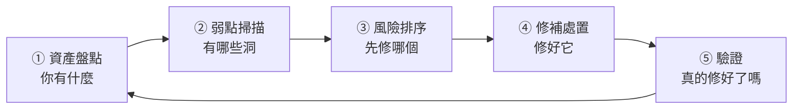

# 弱點管理與滲透測試工具

> [!abstract] 這篇你會學到
> - 理解**弱點管理是一個循環，不是一次性的掃描**
> - 分辨 **CVE、CVSS、EPSS、KEV** 的意義與用途
> - 知道**為什麼「先修 CVSS 9.0 以上」是錯誤的排序方式**
> - 分辨**弱點掃描、滲透測試、紅隊演練**的差別
> - 實際操作 **nmap、OpenVAS、Nuclei、Trivy、Lynis**
> - 理解**滲透測試的授權與法律紅線**
> - 建立可持續運作的弱點管理流程

> [!danger] 法律紅線（先讀這段）
> 本篇的工具**只能用在你擁有或已取得「書面授權」的系統上**。
>
> 未經授權對他人系統掃描或測試，
> 可能觸犯**刑法第 358～363 條**（妨害電腦使用罪），
> **即使你只是「掃描看看」、沒有造成損害，也可能構成犯罪**。
>
> **一定要有**：
> - 書面授權（明確列出**標的 IP／網域範圍**、測試期間、測試方式）
> - 授權者確認**有權授權**（雲端與共用主機還需要服務商的許可）
> - 緊急聯絡窗口與中止機制
>
> 詳見本篇的「安全性注意事項」。

## 前置知識

- [[08-系統強化與稽核]] — 系統加固的基礎
- [[01-資安全景圖與縱深防禦]] — 弱點管理在整體中的位置
- [[16-網路基礎指令]] — 網路掃描的基礎概念

---

## 觀念說明

### 弱點管理是循環，不是活動



> [!danger] 最常見的失敗：只做了②，沒做③④⑤
> **典型的失敗劇本**：
> ```
> 買了掃描工具 → 掃出 8000 個弱點 → 報告 500 頁 →
> 沒有人知道從哪裡開始 → 束之高閣 →
> 明年稽核前再掃一次 → 還是 8000 個
> ```
>
> **弱點掃描本身沒有價值，「修補」才有價值。**

> [!warning] 沒有資產盤點，掃描就沒有意義
> **你不可能掃描你不知道存在的東西。**
>
> 常見的漏網之魚：
> - 某個部門自己買的伺服器
> - 測試環境（**常常防護最弱、卻連著正式資料**）
> - 委外廠商架設但沒交接清楚的系統
> - 早就該下線但沒關的舊系統
> - **雲端上開了忘記關的資源**
> - IoT 裝置、印表機、監視器、網路設備
>
> **這些「影子 IT」往往就是入侵的破口。**
> 見 [[16-資安設備選型與導入實務]] 與資產盤點相關章節。

### CVE、CVSS、EPSS、KEV

| 名詞 | 是什麼 | 用途 |
| --- | --- | --- |
| **CVE** | 弱點的**唯一編號**（`CVE-2024-3094`） | 大家講同一件事 |
| **CVSS** | 弱點的**嚴重度評分**（0～10） | **技術上有多嚴重** |
| **EPSS** | **未來 30 天被利用的機率**（0～1） | **實際上有多可能被打** |
| **KEV** | 美國 CISA 的**「已知遭利用弱點目錄」** | **確定正在被攻擊** |
| **CWE** | 弱點的**類型分類**（如 CWE-89 SQL Injection） | 找出系統性的問題 |

> [!danger] 只看 CVSS 排優先序是錯的
> **CVSS 只回答「如果被利用，後果多嚴重」，
> 不回答「多有可能被利用」。**
>
> **實際的資料顯示**：
> - CVSS ≥ 7 的弱點**佔了絕大多數**（修不完）
> - 但**真正被實際利用的弱點只佔全部的極小比例**
> - 有些 **CVSS 只有 6.5 的弱點，卻正在被大規模利用**
>
> **只看 CVSS 的結果**：
> 你花光力氣去修一堆「嚴重但沒人在打」的弱點，
> **卻漏掉那個「中等但正在被大規模利用」的**。

> [!tip] 正確的排序邏輯（由上而下）
> ```
> ① 在 CISA KEV 目錄裡的            ← 最優先，確定正在被攻擊
> ② EPSS 分數高的（例如 > 0.1）      ← 很可能被打
> ③ 對外服務 + CVSS 高               ← 攻擊面大
> ④ 有公開 PoC/Exploit 的
> ⑤ 內部系統 + CVSS 高
> ⑥ 其他
> ```
>
> **同時要考慮「暴露程度」**：
> ```
> 對網際網路開放的        → 權重 ×10
> 內部但很多人能存取的    → 權重 ×3
> 需要先入侵才碰得到的    → 權重 ×1
> ```
>
> **一個「內網深處、需要管理員權限才能利用」的 CVSS 9.8，
> 危險程度可能遠低於「對外網頁上、任何人都能打」的 CVSS 6.5。**

> [!example] 具體對照
> | 弱點 | CVSS | EPSS | KEV | 該先修哪個？ |
> | --- | --- | --- | --- | --- |
> | 對外 VPN 的認證繞過 | 9.8 | 0.94 | ✅ | **① 立刻修（今天）** |
> | 對外 Web 的 RCE | 8.1 | 0.31 | ❌ | **② 很快修（本週）** |
> | 內網某服務的權限提升 | 9.1 | 0.002 | ❌ | ③ 排入例行修補 |
> | 需本機存取的資訊洩漏 | 7.5 | 0.001 | ❌ | ④ 低優先 |
>
> **注意第一列與第三列**：
> CVSS 差不多（9.8 vs 9.1），但**危險程度差了幾百倍**。

### 掃描、滲透測試、紅隊演練

| 項目 | 弱點掃描 | 滲透測試 | 紅隊演練 |
| --- | --- | --- | --- |
| **目的** | **找出已知弱點** | **驗證能不能被利用** | **測試偵測與應變能力** |
| 方式 | 自動化工具 | 人工 + 工具 | 模擬真實攻擊者（含社交工程、實體） |
| 範圍 | 廣（全部資產） | 中（特定系統） | 窄但深（特定目標，例如「拿到財務資料」） |
| 頻率 | **每月／每週**（可自動化） | 每年 1～2 次 | 每 1～3 年 |
| 成本 | 低 | 中～高 | 高 |
| **藍隊知不知道** | 知道 | 通常知道 | **通常不知道** ← 關鍵差異 |
| 產出 | 弱點清單 | **可利用的攻擊路徑** | **偵測與應變能力的評估** |

> [!tip] 三者的關係
> ```
> 弱點掃描  → 「你家有 20 扇窗戶沒鎖」
> 滲透測試  → 「我從三樓那扇窗爬進去了，還拿到了保險箱鑰匙」
> 紅隊演練  → 「我進去待了兩週，你們的警衛完全沒發現」
> ```
>
> **紅隊演練的價值不是找弱點，是驗證「你發現得了嗎、你擋得住嗎」。**
>
> **建議的成熟度順序**：
> 1. 先把**弱點掃描與修補流程**做順（這是基本功）
> 2. 有基本能力後做**滲透測試**
> 3. 有 SOC 與應變能力後才做**紅隊演練**
>
> **弱點修補流程都沒有的機關直接做紅隊演練，
> 只會得到一份「處處都能進」的報告，沒有實質幫助。**

---

## 常用工具

### nmap：網路探測

> [!danger] nmap 掃描他人系統可能違法
> 只掃你自己的網段，或有書面授權的範圍。

```bash
$ sudo apt install -y nmap
```

```bash
# ===== 探測網段內有哪些主機（不掃埠）=====
$ sudo nmap -sn 192.168.1.0/24
Nmap scan report for 192.168.1.1
Host is up (0.0012s latency).
MAC Address: AA:BB:CC:DD:EE:FF (Cisco Systems)
Nmap scan report for 192.168.1.10
Host is up (0.00089s latency).
...
Nmap done: 256 IP addresses (18 hosts up) scanned in 3.21 seconds

# ===== 掃描開放的埠與服務版本 =====
$ sudo nmap -sV -p- --min-rate 1000 192.168.1.10
PORT     STATE SERVICE  VERSION
22/tcp   open  ssh      OpenSSH 9.6p1 Ubuntu 3ubuntu13
80/tcp   open  http     nginx 1.24.0
443/tcp  open  ssl/http nginx 1.24.0
3306/tcp open  mysql    MySQL 8.0.36            ← ⚠ 資料庫對外開放！
```

```bash
# ===== 常用組合 =====
# 快速掃常見埠 + 版本 + 作業系統
$ sudo nmap -sS -sV -O --top-ports 1000 192.168.1.10

# 全埠掃描（慢，但完整）
$ sudo nmap -sS -p- -T4 192.168.1.10

# UDP 掃描（很慢，只掃常見的）
$ sudo nmap -sU --top-ports 100 192.168.1.10

# 用 NSE 腳本查已知弱點
$ sudo nmap --script vuln 192.168.1.10

# 檢查 TLS 設定（實用！）
$ nmap --script ssl-enum-ciphers -p 443 example.gov.tw
| ssl-enum-ciphers:
|   TLSv1.2:
|     ciphers:
|       TLS_ECDHE_RSA_WITH_AES_256_GCM_SHA384 (secp256r1) - A
|   TLSv1.3:
|     ciphers:
|       TLS_AKE_WITH_AES_256_GCM_SHA384 (ecdh_x25519) - A
|_  least strength: A

# 輸出成各種格式（給後續處理）
$ sudo nmap -sV -oA scan-$(date +%F) 192.168.1.0/24
# → 產生 .nmap（人讀）/.xml（程式讀）/.gnmap（grep 用）
```

> [!warning] 掃描可能造成服務中斷
> **`-T5`（最快）或大量並行掃描可能讓老舊設備當機**，
> 特別是：
> - 印表機、影印機
> - 工控設備（PLC、SCADA）
> - 老舊的網路設備
> - 醫療設備
>
> **在正式環境掃描時**：
> - 用 `-T3`（預設）或 `-T2`
> - **避開營業尖峰時段**
> - **事先通知相關單位**
> - **OT/醫療環境要極度謹慎**（見 [[15-實體與OT-IoT安全設備]]）

### OpenVAS / Greenbone：完整弱點掃描

> [!tip] 開源的完整弱點掃描器
> 商用的 Nessus、Qualys、Rapid7 功能更完整，
> 但 **OpenVAS 對中小型機關已經很夠用**。

```bash
# ===== 用 Docker 快速部署 =====
$ docker run -d --name gvm \
  -p 9392:9392 \
  -e PASSWORD="強密碼" \
  -v gvm-data:/data \
  --restart unless-stopped \
  immauss/openvas:latest

# 第一次啟動要下載弱點資料庫（NVT feed），可能要 30～60 分鐘
$ docker logs -f gvm

# 瀏覽 https://localhost:9392  帳號 admin
```

**掃描流程**：
```
① Configuration → Targets → 新增目標（IP 範圍）
② Scans → Tasks → 新增任務（選擇掃描設定檔）
   - Full and fast          ← 一般用這個
   - Full and very deep     ← 更完整但很慢
③ 執行 → 等待（一台主機約 10～30 分鐘）
④ 檢視報告 → 匯出 PDF/CSV/XML
```

> [!tip] 「已認證掃描」的結果準確得多
> **未認證掃描**：只能從外部看到的資訊 → 大量「可能有弱點」的猜測。
> **已認證掃描**：給掃描器一組**唯讀帳號**登入主機檢查實際的套件版本
> → **準確度大幅提升，誤判大幅減少**。
>
> ```
> Configuration → Credentials → 新增 SSH 帳號（Linux）或網域帳號（Windows）
> → 在 Target 設定中指定要使用的憑證
> ```
>
> ⚠️ **這組帳號權限要盡量小**（唯讀即可），
> 而且**它本身就是高價值目標**（能登入所有主機），
> 要用強密碼並限制來源 IP。

### Nuclei：快速的模板化弱點掃描

> [!tip] 現代化的輕量掃描器，很適合排程
> 用 YAML 模板定義檢測邏輯，社群維護數千個模板，更新極快。

```bash
$ go install -v github.com/projectdiscovery/nuclei/v3/cmd/nuclei@latest
# 或下載預編譯版本

$ nuclei -update-templates

# 掃描單一目標
$ nuclei -u https://example.gov.tw

# 掃描多個目標
$ nuclei -l targets.txt -o result.txt

# 只跑「嚴重」與「高」等級
$ nuclei -l targets.txt -severity critical,high

# 只跑特定類型
$ nuclei -u https://example.gov.tw -tags cve,exposure,misconfig

# 輸出 JSON 給後續處理
$ nuclei -l targets.txt -severity critical,high -jsonl -o result.jsonl
```

**輸出範例**：
```
[CVE-2021-44228] [http] [critical] https://example.gov.tw/api [log4j]
[ssl-issuer] [ssl] [info] example.gov.tw:443 [Let's Encrypt]
[missing-hsts] [http] [low] https://example.gov.tw
[git-config] [http] [medium] https://example.gov.tw/.git/config   ← ⚠ 原始碼外洩！
```

> [!danger] `.git` 目錄外洩是很常見也很嚴重的問題
> 如果 `https://網站/.git/config` 可以下載，
> **攻擊者可以還原整個原始碼**，
> 裡面通常有**資料庫密碼、API 金鑰、內部架構**。
>
> **檢查**：
> ```bash
> $ curl -sI https://example.gov.tw/.git/config | head -1
> HTTP/2 200          ← ⚠⚠ 有問題！應該是 403 或 404
> ```
>
> **修正（Nginx）**：
> ```nginx
> location ~ /\.(git|svn|hg|env|ht) {
>     deny all;
>     return 404;
> }
> ```
> **更根本的做法：部署時不要把 `.git` 目錄放到 web root。**

### Trivy：容器與相依套件掃描

```bash
$ sudo apt install -y wget apt-transport-https gnupg
$ wget -qO - https://aquasecurity.github.io/trivy-repo/deb/public.key | \
    sudo gpg --dearmor -o /usr/share/keyrings/trivy.gpg
$ echo "deb [signed-by=/usr/share/keyrings/trivy.gpg] \
    https://aquasecurity.github.io/trivy-repo/deb generic main" | \
    sudo tee /etc/apt/sources.list.d/trivy.list
$ sudo apt update && sudo apt install -y trivy
```

```bash
# ===== 掃描容器映像 =====
$ trivy image nginx:1.24
nginx:1.24 (debian 12.2)
Total: 87 (UNKNOWN: 0, LOW: 62, MEDIUM: 17, HIGH: 7, CRITICAL: 1)

┌──────────────┬────────────────┬──────────┬───────────────┬───────────────┐
│   Library    │ Vulnerability  │ Severity │ Installed Ver │  Fixed Version│
├──────────────┼────────────────┼──────────┼───────────────┼───────────────┤
│ libssl3      │ CVE-2024-XXXX  │ CRITICAL │ 3.0.11-1      │ 3.0.13-1      │
└──────────────┴────────────────┴──────────┴───────────────┴───────────────┘

# 只看「有修補版本」的高風險（可行動的）
$ trivy image --severity HIGH,CRITICAL --ignore-unfixed nginx:1.24

# ===== 掃描檔案系統（專案原始碼的相依套件）=====
$ trivy fs --scanners vuln,secret,misconfig /path/to/project

# ===== 掃描 IaC 設定錯誤 =====
$ trivy config ./terraform/
$ trivy config ./k8s-manifests/

# ===== 掃描原始碼中的機密（很實用）=====
$ trivy fs --scanners secret .
CRITICAL: AWS Access Key ID found in config/production.env
```

> [!tip] 把 Trivy 放進 CI/CD
> ```yaml
> # .github/workflows/security.yml
> - name: Trivy 弱點掃描
>   uses: aquasecurity/trivy-action@master
>   with:
>     image-ref: 'myapp:${{ github.sha }}'
>     format: 'sarif'
>     output: 'trivy-results.sarif'
>     severity: 'CRITICAL,HIGH'
>     ignore-unfixed: true
>     exit-code: '1'      # 有 CRITICAL/HIGH 就讓建置失敗
> ```
>
> **在「進入正式環境之前」擋下來，成本遠低於上線後才修。**

### Lynis：Linux 主機加固檢查

```bash
$ sudo apt install -y lynis
$ sudo lynis audit system

# 輸出摘要
  Hardening index : 67 [############        ]

# 詳細建議在
$ sudo cat /var/log/lynis-report.dat | grep -E '^(suggestion|warning)'
```

> [!tip] Lynis 對照 TWGCB 使用
> Lynis 的建議與 TWGCB 政府組態基準有大量重疊。
> **可以用 Lynis 做日常自檢，用 TWGCB 做正式符合性驗證。**
> 見 [[00-TWGCB-索引]]。

### 其他常見工具速覽

| 工具 | 用途 |
| --- | --- |
| **testssl.sh** | 深度檢查 TLS 設定（比 nmap 更完整） |
| **sslyze** | TLS 檢查（Python，適合自動化） |
| **nikto** | Web 伺服器常見問題掃描（老牌但仍實用） |
| **wpscan** | WordPress 專用弱點掃描 |
| **gitleaks / trufflehog** | 掃描 git 歷史中的機密 |
| **OWASP ZAP** | Web 應用弱點掃描（有 GUI，適合學習） |
| **Burp Suite** | Web 滲透測試的業界標準（社群版免費） |
| **Metasploit** | 漏洞利用框架（**僅限授權測試**） |
| **CrackMapExec / NetExec** | AD 環境的橫向移動測試（**僅限授權測試**） |
| **BloodHound** | **視覺化 AD 的攻擊路徑**（藍隊也該用） |

> [!tip] BloodHound 是藍隊也該用的工具
> 它會把 AD 的權限關係畫成圖，
> 回答「**從這個一般帳號到 Domain Admin 有幾條路徑？**」
>
> **藍隊用它來找出並切斷這些路徑** ——
> 這比等紅隊來告訴你有效率得多。

---

## 完整實戰範例

### 建立每月弱點掃描流程

```bash
#!/usr/bin/env bash
# /usr/local/sbin/monthly-vuln-scan.sh
# 每月弱點掃描 —— 僅限自有網段
set -uo pipefail

SCOPE="192.168.1.0/24"                    # ★ 只掃自己的網段
DATE=$(date +%Y%m)
OUT="/var/log/vulnscan/$DATE"
mkdir -p "$OUT"

echo "===== 每月弱點掃描 $DATE ====="

# ---------- 1. 資產發現 ----------
echo "[1/4] 探測存活主機…"
sudo nmap -sn "$SCOPE" -oG "$OUT/hosts.gnmap" > /dev/null
grep "Status: Up" "$OUT/hosts.gnmap" | awk '{print $2}' > "$OUT/live-hosts.txt"
echo "      發現 $(wc -l < "$OUT/live-hosts.txt") 台主機"

# 與資產清冊比對，找出「沒登記的機器」★重要
if [ -f /etc/asset-inventory.txt ]; then
  echo "[!] 未登記在資產清冊中的主機："
  comm -23 <(sort "$OUT/live-hosts.txt") <(sort /etc/asset-inventory.txt) |
    tee "$OUT/unknown-hosts.txt" | sed 's/^/      ⚠ /'
fi

# ---------- 2. 埠與服務掃描 ----------
echo "[2/4] 掃描開放的埠與服務…"
sudo nmap -sV -T3 --top-ports 1000 -iL "$OUT/live-hosts.txt" \
     -oA "$OUT/services" > /dev/null

# 找出高風險的對外服務
echo "[!] 高風險開放埠："
grep -E "open" "$OUT/services.gnmap" |
  grep -oE "(3306|5432|6379|27017|9200|1433|3389|445|23|21)/open" |
  sort | uniq -c | sed 's/^/      /'

# ---------- 3. Web 服務弱點掃描 ----------
echo "[3/4] Web 弱點掃描…"
grep -E "(80|443|8080|8443)/open" "$OUT/services.gnmap" |
  awk '{print $2}' | sed 's|^|http://|' > "$OUT/web-targets.txt"
if command -v nuclei > /dev/null && [ -s "$OUT/web-targets.txt" ]; then
  nuclei -l "$OUT/web-targets.txt" -severity critical,high,medium \
         -jsonl -o "$OUT/nuclei.jsonl" -silent
  echo "      發現 $(wc -l < "$OUT/nuclei.jsonl") 個問題"
fi

# ---------- 4. 容器映像掃描 ----------
echo "[4/4] 容器映像掃描…"
if command -v trivy > /dev/null; then
  docker images --format '{{.Repository}}:{{.Tag}}' 2>/dev/null |
    grep -v '<none>' | while read -r img; do
      trivy image --severity CRITICAL,HIGH --ignore-unfixed \
            --format json -o "$OUT/trivy-$(echo "$img" | tr '/:' '__').json" \
            "$img" 2>/dev/null
    done
fi

echo ""
echo "===== 完成，報告位於 $OUT ====="
echo "後續："
echo "  1. 檢視 unknown-hosts.txt → 這些是影子 IT，先查清楚"
echo "  2. 高風險開放埠 → 確認是否必要，不必要就關閉"
echo "  3. 用 CISA KEV + EPSS 排序 nuclei/trivy 的發現"
echo "  4. 建立修補工單並追蹤"
```

### 用 KEV + EPSS 排序弱點

```bash
#!/usr/bin/env bash
# 下載 CISA KEV 目錄，比對你的弱點清單
set -euo pipefail

# ===== 下載 CISA 已知遭利用弱點目錄 =====
curl -s https://www.cisa.gov/sites/default/files/feeds/known_exploited_vulnerabilities.json \
  -o /tmp/kev.json

echo "KEV 目錄共有 $(jq '.count' /tmp/kev.json) 個弱點"

# ===== 取出所有 CVE 編號 =====
jq -r '.vulnerabilities[].cveID' /tmp/kev.json | sort > /tmp/kev-cves.txt

# ===== 從你的掃描結果取出 CVE =====
# （這裡假設 nuclei 的 jsonl 輸出）
jq -r 'select(.info["classification"]["cve-id"] != null) |
       .info.classification["cve-id"][]' \
   /var/log/vulnscan/*/nuclei.jsonl 2>/dev/null | sort -u > /tmp/my-cves.txt

# ===== 找出交集：這些是「正在被實際攻擊」的弱點 =====
echo ""
echo "🔴🔴 以下弱點在 CISA KEV 目錄中 —— 請立即修補："
comm -12 /tmp/my-cves.txt /tmp/kev-cves.txt | while read -r cve; do
  info=$(jq -r --arg c "$cve" \
    '.vulnerabilities[] | select(.cveID==$c) |
     "\(.vendorProject) \(.product) — \(.vulnerabilityName)  [到期日: \(.dueDate)]"' \
    /tmp/kev.json)
  echo "  $cve: $info"
done
```

```bash
# ===== 查詢 EPSS 分數 =====
$ curl -s "https://api.first.org/data/v1/epss?cve=CVE-2021-44228" | jq
{
  "data": [{
    "cve": "CVE-2021-44228",
    "epss": "0.944400000",        ← 94.4% 的機率在未來 30 天被利用
    "percentile": "0.999940000",
    "date": "2026-08-27"
  }]
}

# 批次查詢多個 CVE
$ curl -s "https://api.first.org/data/v1/epss?cve=$(paste -sd, /tmp/my-cves.txt)" |
  jq -r '.data[] | "\(.epss)\t\(.cve)"' | sort -rn | head -20
```

### 修補追蹤表

> [!tip] 弱點管理的核心是「追蹤」，不是「掃描」
> 每個弱點都要有：
>
> | 欄位 | 說明 |
> | --- | --- |
> | CVE / 弱點編號 | |
> | **影響的資產** | 哪幾台機器 |
> | CVSS / EPSS / **是否在 KEV** | |
> | **暴露程度** | 對外／內部／需先入侵 |
> | **綜合優先序** | 依前面的排序邏輯 |
> | **修補期限** | 依優先序（見下表） |
> | **負責人** | ← 沒有負責人就不會有人修 |
> | 狀態 | 待處理／處理中／**已修補**／**風險接受** |
> | **驗證日期與方式** | 重掃確認 |

**建議的修補時限（可寫進資安政策）**：

| 優先序 | 修補時限 |
| --- | --- |
| **KEV 目錄內 + 對外服務** | **24～72 小時**（緊急變更） |
| 嚴重（Critical） | 7 天 |
| 高（High） | 30 天 |
| 中（Medium） | 90 天 |
| 低（Low） | 下次例行維護 |

> [!warning] 「風險接受」必須有正式程序
> 有些弱點**真的無法修補**：
> - 舊系統，套件升級會壞掉
> - 廠商已經不再維護
> - 修補需要停機，但業務不允許
>
> **這時不能只是「不修，然後假裝沒看到」**，必須：
> 1. **書面記錄理由**
> 2. **提出補償控制措施**
>    （網路隔離、加強監控、WAF 虛擬修補、限制存取來源）
> 3. **由適當層級的主管核准**（風險越高，核准層級越高）
> 4. **設定重新評估的期限**（例如每季重新檢視）
>
> 見 [[03-弱點與修補管理流程]]。

---

## 常見錯誤與排錯

| 現象／錯誤 | 原因 | 解法 |
| --- | --- | --- |
| **掃出 8000 個弱點，不知從何下手** | 只看 CVSS，沒有排序邏輯 | 用 **KEV → EPSS → 暴露程度**排序 |
| 修了一堆弱點但還是被入侵 | **修錯了對象**（修內網的、漏了對外的） | **暴露程度**要納入權重 |
| 掃描結果誤判很多 | **未認證掃描**只能靠猜測 | 改用**已認證掃描**（給唯讀帳號） |
| **掃描把印表機／工控設備弄當機** | 掃描速度太快或探測太深 | 用 `-T2/-T3`；OT 環境用被動探測；**事先通知** |
| 掃了半年還是同樣的弱點 | **只掃不修**，沒有追蹤機制 | 建立**修補追蹤表**，每個弱點都要有**負責人與期限** |
| 有些機器從來沒被掃到 | **資產盤點不完整**（影子 IT） | 定期做網段探測並與資產清冊比對 |
| 弱點修不掉（舊系統） | 廠商不再維護 | 走**風險接受程序**：書面記錄 + **補償控制** + 主管核准 + 定期複審 |
| **`.git` 目錄可以下載** | 部署時把整個 repo 放進 web root | Nginx `location ~ /\.(git\|env)` 拒絕；**部署時排除** |
| 掃描帳號本身變成風險 | 認證掃描的帳號能登入所有主機 | 權限最小化（唯讀）、強密碼、**限制來源 IP**、納入 PAM 管理 |
| CI 掃描讓所有建置都失敗 | 沒有 `--ignore-unfixed`，連無法修的也擋 | 加 `--ignore-unfixed`，先只擋 CRITICAL |
| **紅隊演練報告「處處都能進」，但幫助不大** | **成熟度不足就做紅隊** | 先把弱點掃描與修補流程做順，再做滲透測試，最後才紅隊 |
| 掃描到一半被防火牆／IPS 擋掉 | 掃描行為被判定為攻擊 | **事先與網路組協調**加入白名單，或從內部網段掃 |

---

## 安全性注意事項

> [!danger] 未經授權的掃描與測試可能違法
> **刑法妨害電腦使用罪章**：
> - **第 358 條**：無故輸入他人帳號密碼、破解保護措施，或**利用電腦系統之漏洞**
>   而入侵他人之電腦或相關設備
> - **第 359 條**：無故取得、刪除或變更他人電腦的電磁紀錄，致生損害
> - **第 360 條**：無故以電腦程式或其他電磁方式**干擾他人電腦或相關設備**，致生損害
> - **第 362 條**：製作專供犯本章之罪之電腦程式
>
> **重點提醒**：
> - **即使「只是掃描看看」、沒有造成損害，也可能構成犯罪**
> - **「我只是想幫他們找出問題」不是免責理由**
> - **公務機關的系統另有《資通安全管理法》相關規範**
>
> **一定要有的授權文件**：
> - [ ] **書面授權**（不是口頭、不是即時通訊訊息）
> - [ ] 明確的**標的範圍**（IP、網域、URL —— 寫清楚，不要寫「相關系統」）
> - [ ] 明確的**測試期間**（起訖日期與時段）
> - [ ] **允許與禁止的測試方式**（可否做 DoS？可否做社交工程？可否嘗試提權？）
> - [ ] **授權者確實有權授權** ← 常被忽略
> - [ ] **緊急聯絡人與中止機制**
> - [ ] 保密協定與**測試資料的處理方式**
>
> **雲端環境要特別注意**：
> AWS、Azure、GCP 對滲透測試各有規範，
> **有些測試類型需要事先報備或明確禁止**（尤其是 DoS 類）。
> 共用主機（Shared Hosting）上的掃描**會影響到同一台機器上的其他客戶**。

> [!warning] 掃描本身就是風險
> | 風險 | 對策 |
> | --- | --- |
> | 掃描造成服務中斷 | 降低速度、避開尖峰、事先通知、OT 環境用被動方式 |
> | 掃描帳號被濫用 | 最小權限、強密碼、限制來源、納入 PAM |
> | **掃描報告外流 = 完整的攻擊地圖** | **報告視為機密**、加密儲存、限制存取、定期銷毀 |
> | 掃描流量觸發 IPS 告警 | 事先協調；**但不要長期把掃描來源加白名單** |
>
> **弱點報告是攻擊者最想要的東西** ——
> 它精確地告訴對方「哪台機器有什麼洞」。
> 用郵件傳送時**務必加密**（見 [[08-資料防護DLP與加密]]）。

> [!tip] 委外滲透測試的注意事項
> 機關通常會委外做滲透測試。**契約中應該包含**：
> - **測試人員的資格要求**（例如持有 OSCP、CEH 等證照）
> - **測試方法論**（OWASP WSTG、PTES、NIST SP 800-115）
> - **禁止的行為**（不得使用 DoS、不得修改或刪除資料、不得外流資料）
> - **測試資料的處理與銷毀**（含所有截圖與匯出的資料）
> - **報告的交付方式**（加密、限制份數）
> - **重測（Retest）**：修補後的免費驗證 ← **常被漏掉但很重要**
> - **保密義務的存續期間**
> - **發現重大弱點時的即時通報義務**（不是等到期末報告）
>
> 見 [[11-委外與供應鏈資安]]。

> [!danger] 弱點揭露：發現別人的系統有問題時
> 如果你**不小心**發現其他機關或廠商的系統有弱點：
>
> **該做的**：
> 1. **立刻停止進一步的探測**（不要「再確認一下」）
> 2. **不要下載或存取任何資料**
> 3. 透過正式管道通報：
>    - 該單位的資安聯絡窗口
>    - **TWCERT/CC**（<https://www.twcert.org.tw>）
>    - 公務機關可通報 **NCCST**
> 4. **保留最少限度的證據**，不要公開
> 5. 給對方**合理的修補時間**再考慮揭露
>
> **不該做的**：
> - ❌ 繼續深入測試「看看能拿到什麼」
> - ❌ 下載資料當作「證據」 ← **這已經構成犯罪**
> - ❌ 公開發表未修補的弱點細節
> - ❌ 要求報酬（這可能構成恐嚇取財）

---

## 速查表

### 弱點管理循環

```
① 資產盤點 → ② 掃描 → ③ 排序 → ④ 修補 → ⑤ 驗證 → 回到 ①
```
**最常見的失敗：只做了②。**

### 四個編號／評分

| 名詞 | 回答什麼 |
| --- | --- |
| **CVE** | 這是哪個弱點 |
| **CVSS** | 有多嚴重（技術上） |
| **EPSS** | **有多可能被利用** |
| **KEV** | **是否正在被攻擊** |

### 正確的排序

```
① CISA KEV 目錄內          ← 最優先
② EPSS 高（> 0.1）
③ 對外服務 + CVSS 高
④ 有公開 PoC
⑤ 內部 + CVSS 高

暴露權重：對外 ×10 / 內部 ×3 / 需先入侵 ×1
```

### 修補時限

| 優先序 | 時限 |
| --- | --- |
| **KEV + 對外** | **24～72 小時** |
| Critical | 7 天 |
| High | 30 天 |
| Medium | 90 天 |

### 三種活動

| | 目的 | 頻率 | 藍隊知情 |
| --- | --- | --- | --- |
| 弱點掃描 | 找已知弱點 | 每月/每週 | ✅ |
| 滲透測試 | 驗證可利用性 | 每年 1～2 次 | 通常 ✅ |
| **紅隊演練** | **測偵測與應變** | 1～3 年 | **❌** |

### nmap 常用

| 目的 | 指令 |
| --- | --- |
| 探測存活主機 | `nmap -sn 192.168.1.0/24` |
| 埠 + 版本 | `nmap -sV --top-ports 1000 <ip>` |
| 全埠 | `nmap -sS -p- -T4 <ip>` |
| 弱點腳本 | `nmap --script vuln <ip>` |
| **TLS 檢查** | `nmap --script ssl-enum-ciphers -p 443 <host>` |
| 多格式輸出 | `nmap -sV -oA name <target>` |

### 其他工具

| 工具 | 用途 |
| --- | --- |
| **OpenVAS** | 完整弱點掃描（開源） |
| **Nuclei** | 模板化快速掃描 |
| **Trivy** | 容器／相依套件／IaC／機密 |
| **Lynis** | Linux 主機加固檢查 |
| **testssl.sh** | 深度 TLS 檢查 |
| **BloodHound** | **AD 攻擊路徑視覺化（藍隊也該用）** |
| gitleaks | git 歷史中的機密 |

### KEV / EPSS 查詢

```bash
# CISA KEV 目錄
curl -s https://www.cisa.gov/sites/default/files/feeds/known_exploited_vulnerabilities.json

# EPSS 分數
curl -s "https://api.first.org/data/v1/epss?cve=CVE-2021-44228" | jq
```

### 授權文件必備七項

```
□ 書面授權（不是口頭）
□ 明確的標的範圍（IP/網域/URL）
□ 明確的測試期間
□ 允許與禁止的測試方式
□ 授權者確實有權授權
□ 緊急聯絡人與中止機制
□ 保密協定與資料處理方式
```

---

## 練習題

> [!question]- 練習 1：掃描你自己的網段
> ⚠️ **只掃你有權管理的網段。**
> 1. 用 `nmap -sn` 探測有多少台主機
> 2. **與你的資產清冊比對** —— 有沒有「不該存在的機器」？
> 3. 掃描開放的埠，找出**不該對外開放的服務**
>    （3306 MySQL、6379 Redis、9200 Elasticsearch、27017 MongoDB、3389 RDP…）
> 4. 用 `nmap --script ssl-enum-ciphers` 檢查一台 HTTPS 伺服器的 TLS 設定
> 5. **最讓你意外的發現是什麼？**

> [!question]- 練習 2：用 KEV 排序
> 1. 下載 CISA KEV 目錄，看看裡面有多少個弱點
> 2. 挑三個你機關使用的產品（例如 Windows、nginx、某個 VPN），
>    **查查看它們有沒有在 KEV 裡**
> 3. 對其中一個，查它的 **EPSS 分數**
> 4. 對照你機關的實際情況：
>    - **這個弱點影響你哪幾台機器？**
>    - **那些機器對外開放嗎？**
>    - **已經修補了嗎？怎麼確認？**

> [!question]- 練習 3：設計弱點管理流程
> 為你的機關設計一份弱點管理流程，包含：
> 1. **多久掃一次？掃什麼範圍？**（分別對：對外服務／內部伺服器／終端）
> 2. **誰負責排序？依據什麼？**
> 3. 各等級的**修補時限**是多久？
> 4. **誰負責修？怎麼追蹤？**
> 5. **修完怎麼驗證？**
> 6. **無法修補時的風險接受程序**是什麼？誰核准？
> 7. **多久向管理階層報告一次？報告什麼指標？**
>    （提示：未修補弱點數、平均修補時間、逾期件數）

---

## 小測驗

Q1. 弱點管理的五個步驟是什麼？**最常見的失敗是漏掉哪幾步**？

Q2. CVE、CVSS、EPSS、KEV 各自回答什麼問題？

Q3. **為什麼「先修 CVSS 9.0 以上」是錯誤的排序方式**？正確的排序邏輯是什麼？

Q4. 為什麼「暴露程度」必須納入優先序的考量？舉例說明。

Q5. 弱點掃描、滲透測試、紅隊演練的差別是什麼？**哪一項的關鍵差異是「藍隊不知情」**？

Q6. **為什麼「沒有資產盤點就沒有意義」**？常見的漏網之魚有哪些？

Q7. 「已認證掃描」與「未認證掃描」的差別是什麼？各有什麼優缺點？

Q8. 對正式環境掃描時，有哪四項注意事項？哪些設備特別容易被掃當機？

Q9. **弱點真的無法修補時，正確的「風險接受」程序有哪四個步驟**？

Q10. 未經授權掃描他人系統可能觸犯什麼？**「只是掃描看看、沒造成損害」可以免責嗎**？

> [!question]- 測驗答案
> **Q1.** 五個步驟：①**資產盤點** → ②**弱點掃描** → ③**風險排序** →
> ④**修補處置** → ⑤**驗證**（然後回到 ①，是個循環）。
> 最常見的失敗是**只做了②，沒做③④⑤** ——
> 買了工具、掃出幾千個弱點、報告幾百頁，
> 但沒有人知道從哪裡開始，最後束之高閣。
> **弱點掃描本身沒有價值，「修補」才有價值。**
>
> **Q2.** **CVE** = 弱點的**唯一編號**（大家講同一件事）；
> **CVSS** = **嚴重度評分**（0～10，回答「如果被利用，後果多嚴重」）；
> **EPSS** = **未來 30 天被實際利用的機率**（回答「多有可能被打」）；
> **KEV** = 美國 CISA 的**已知遭利用弱點目錄**（回答「是否正在被攻擊」）。
>
> **Q3.** 因為 **CVSS 只回答「如果被利用，後果多嚴重」，
> 不回答「多有可能被利用」**。
> 實際資料顯示 CVSS ≥ 7 的弱點佔絕大多數（根本修不完），
> 但**真正被實際利用的只佔極小比例**，
> 而且有些 CVSS 只有 6.5 的弱點**正在被大規模利用**。
> 只看 CVSS 的結果是：花光力氣修一堆「嚴重但沒人在打」的，
> **卻漏掉那個「中等但正在被大規模利用」的**。
> 正確排序：①**在 CISA KEV 目錄裡的**（最優先）→
> ②**EPSS 分數高的** → ③對外服務 + CVSS 高 →
> ④有公開 PoC → ⑤內部 + CVSS 高。
>
> **Q4.** 因為**攻擊者要碰得到，弱點才有意義**。
> 建議權重：對網際網路開放 **×10**、內部但多人可存取 **×3**、
> 需先入侵才碰得到 **×1**。
> **例子**：「內網深處、需要管理員權限才能利用」的 **CVSS 9.8**，
> 危險程度可能**遠低於**「對外網頁上、任何人都能打」的 **CVSS 6.5** ——
> 因為前者攻擊者根本還碰不到，後者則是門戶洞開。
>
> **Q5.** **弱點掃描**用自動化工具**找出已知弱點**，範圍廣、頻率高、成本低；
> **滲透測試**用人工加工具**驗證弱點能不能被實際利用**，
> 產出**可利用的攻擊路徑**；
> **紅隊演練**模擬真實攻擊者（含社交工程、實體入侵），
> 目的是**測試偵測與應變能力**。
> **「藍隊不知情」是紅隊演練的關鍵差異** ——
> 它的價值不是找弱點，而是驗證「**你發現得了嗎、你擋得住嗎**」。
>
> **Q6.** 因為**你不可能掃描你不知道存在的東西**。
> 常見的漏網之魚：某部門自己買的伺服器、**測試環境**
> （常常防護最弱卻連著正式資料）、委外廠商架設但沒交接的系統、
> 早該下線但沒關的舊系統、**雲端上開了忘記關的資源**、
> IoT 裝置、印表機、監視器、網路設備。
> **這些「影子 IT」往往就是入侵的破口。**
>
> **Q7.** **未認證掃描**只能從外部觀察，
> 大量結果是「可能有弱點」的**猜測，誤判很多**；
> **已認證掃描**給掃描器一組**唯讀帳號**登入主機檢查實際的套件版本，
> **準確度大幅提升、誤判大幅減少**。
> 缺點是那組帳號能登入所有主機，**本身就是高價值目標** ——
> 必須權限最小化（唯讀）、強密碼、限制來源 IP、納入特權帳號管理。
>
> **Q8.** 四項注意事項：①**降低掃描速度**（用 `-T2`/`-T3`，不要用 `-T5`）；
> ②**避開營業尖峰時段**；③**事先通知相關單位**（也避免觸發 IPS 告警）；
> ④**OT／醫療環境要極度謹慎**（建議用被動探測）。
> 特別容易被掃當機的設備：**印表機、影印機、工控設備（PLC/SCADA）、
> 老舊的網路設備、醫療設備**。
>
> **Q9.** ①**書面記錄無法修補的理由**；
> ②**提出補償控制措施**（網路隔離、加強監控、WAF 虛擬修補、限制存取來源）；
> ③**由適當層級的主管核准**（風險越高，核准層級越高）；
> ④**設定重新評估的期限**（例如每季重新檢視）。
> **不能只是「不修，然後假裝沒看到」。**
>
> **Q10.** 可能觸犯**刑法妨害電腦使用罪章**：
> 第 **358** 條（利用漏洞入侵他人電腦）、
> 第 **359** 條（無故取得、刪除或變更電磁紀錄致生損害）、
> 第 **360** 條（干擾他人電腦致生損害）、
> 第 **362** 條（製作專供犯本章罪之程式）。
> **「只是掃描看看、沒造成損害」不能免責** ——
> 即使沒有損害也可能構成犯罪，
> 而且**「我只是想幫他們找出問題」也不是免責理由**。
> 一定要有**書面授權**，且授權者**確實有權授權**。

---

## 延伸閱讀

- [[03-弱點與修補管理流程]] — 修補的管理制度面
- [[08-系統強化與稽核]] — Lynis 與系統加固
- [[04-Web應用防火牆WAF]] — 無法立即修補時的虛擬修補
- [[09-日誌集中與SIEM]] — 弱點資料應納入 SIEM 的資產風險評估
- [[11-委外與供應鏈資安]] — 委外滲透測試的契約要求
- [[13-資安證照與學習路徑]] — OSCP 等滲透測試證照
- [[16-資安設備選型與導入實務]] — 掃描工具的選型
