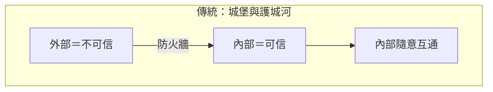
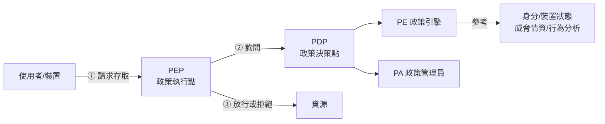
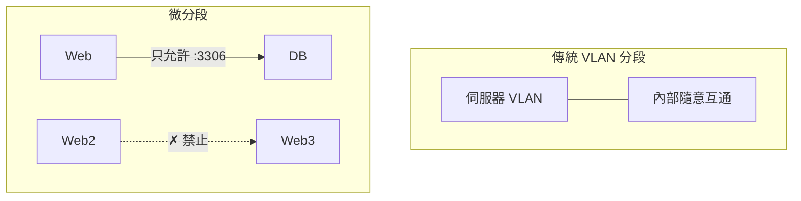
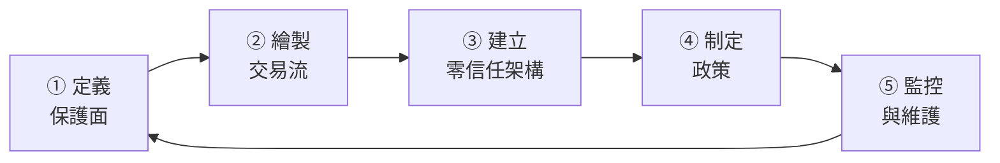

# 零信任架構與微分段

> [!abstract] 這篇你會學到
> - 理解**「城堡與護城河」模型為什麼失效**
> - 掌握零信任的**三個核心原則**與 **NIST SP 800-207** 的架構
> - 分辨**零信任、ZTNA、SDP、SASE、微分段**這些名詞
> - 知道**為什麼「零信任不是買一個產品」**
> - 學會**務實的分階段導入路徑**（不是一步到位）
> - 用 **nftables 與 WireGuard** 實作基本的微分段與 ZTNA
> - 避開零信任導入的常見陷阱

## 前置知識

- [[07-身分存取管理IAM與MFA]] — **身分是零信任的核心**
- [[01-資安全景圖與縱深防禦]] — 零信任是縱深防禦的現代形式
- [[16-網概-VLAN與網路分段]] — 傳統的網路分段

---

## 觀念說明

### 城堡與護城河為什麼失效



> [!danger] 這個模型的兩個致命假設
> **假設一：「內部是可信的」**
> → 一旦攻擊者進來（釣魚、VPN 帳號被盜、供應鏈），
> **他就能在內網暢行無阻**（橫向移動）。
>
> **假設二：「重要的東西都在內部」**
> → 但現在資料在 M365、Google Workspace、雲端資料庫；
> 使用者在家裡、在咖啡廳、用自己的手機。
> **「內部」這個概念已經不存在了。**

> [!example] 真實的攻擊路徑
> ```
> ① 財務同仁收到釣魚信，帳號密碼外洩
> ② 攻擊者用 VPN 登入 → 【他現在「在內部」了】
> ③ 掃描內網，發現一台沒修補的伺服器
> ④ 提權 → 取得網域管理員
> ⑤ 橫向移動到檔案伺服器、資料庫
> ⑥ 打包資料外傳，並部署勒索病毒
> ```
>
> **從 ② 到 ⑥，防火牆完全沒有作用** ——
> 因為所有動作都發生在「防火牆內側」。

### 零信任的三個核心原則

> [!tip] Zero Trust ≠「不信任任何人」
> 更準確的說法是：**「不因為位置而給予信任」**。
>
> **「Never trust, always verify」——永不信任，始終驗證。**

| 原則 | 意義 | 實作 |
| --- | --- | --- |
| **① 明確驗證** | **每一次存取**都驗證身分、裝置、情境 | MFA、裝置合規檢查、條件式存取 |
| **② 最小權限** | 只給**剛好夠用**的權限與時間 | JIT 特權、RBAC/ABAC、Session 時限 |
| **③ 假設已被入侵** | 假設攻擊者**已經在裡面**了 | **微分段、加密、持續監控、快速應變** |

> [!note] 第三個原則最重要，也最常被忽略
> 「假設已被入侵（Assume Breach）」的意思是：
>
> **不要問「怎麼防止入侵」，要問「入侵之後，他能走多遠？」**
>
> - 一台終端被入侵 → **他能碰到哪些機器？**
> - 一個帳號被盜 → **他能存取哪些資料？**
> - 一台伺服器被攻陷 → **他能不能從那裡連到資料庫？**
>
> **如果答案是「幾乎所有東西」，那你的架構就有根本問題。**

### NIST SP 800-207 的架構



| 元件 | 全稱 | 做什麼 |
| --- | --- | --- |
| **PEP** | Policy Enforcement Point | **執行**放行或拒絕（閘道、Proxy、Agent） |
| **PDP** | Policy Decision Point | **決定**該不該放行 |
| **PE** | Policy Engine | 依政策與情境做出**信任判定** |
| **PA** | Policy Administrator | 建立／中斷連線的**通道管理** |

> [!tip] 關鍵：每一次存取都要重新判定
> 傳統 VPN：**連上就一直可以用**（信任在連線時決定一次）。
>
> 零信任：**每一次請求都重新判定**，考慮：
> - 身分是否仍然有效
> - **裝置狀態是否仍然合規**（防毒是否過期？有沒有高風險告警？）
> - 情境有沒有變化（換了地點？換了網路？）
> - **風險分數有沒有升高**
>
> → 判定為高風險時，**立刻中斷已建立的連線**。

---

## 名詞分辨

| 名詞 | 全稱 | 是什麼 |
| --- | --- | --- |
| **Zero Trust** | 零信任 | **一種架構理念**（不是產品） |
| **ZTA** | Zero Trust Architecture | 零信任的整體架構 |
| **ZTNA** | Zero Trust Network Access | **取代 VPN 的遠端存取方案** |
| **SDP** | Software-Defined Perimeter | 軟體定義邊界（ZTNA 的技術基礎） |
| **SASE** | Secure Access Service Edge | **SD-WAN + 雲端資安服務**（ZTNA+SWG+CASB+FWaaS） |
| **SSE** | Security Service Edge | SASE 中的**資安部分**（不含 SD-WAN） |
| **微分段** | Micro-segmentation | **工作負載之間的細緻隔離** |

> [!danger] 「零信任」被濫用成行銷術語
> 幾乎每家資安廠商都說自己是「零信任解決方案」。
>
> **請記住**：
> **零信任是一種架構理念與設計原則，不是一個可以買來裝上的產品。**
>
> 買了 ZTNA 產品 ≠ 實現了零信任。
> 那只是**其中一塊**（而且通常是最容易的一塊）。

### ZTNA vs 傳統 VPN

| | 傳統 VPN | **ZTNA** |
| --- | --- | --- |
| 連上之後 | **進入內網**，能看到整個網段 | **只能存取被授權的特定應用** |
| 信任判定 | **連線時判定一次** | **每次請求都判定** |
| 對攻擊者 | 帳號被盜 = **內網暢行** | 帳號被盜 = **只能碰那幾個應用** |
| 網路可見性 | 內網對使用者可見（可以掃描） | **應用對未授權者完全不可見** |
| 裝置檢查 | 通常沒有 | **檢查裝置合規狀態** |
| 使用者體驗 | 要手動連 VPN | 通常無感 |

> [!tip] ZTNA 最重要的特性：「先驗證，後連線」
> **傳統 VPN**：先建立網路連線 → 再驗證身分
> → **未驗證的人也能看到 VPN 閘道，可以攻擊它**
> （這就是為什麼 VPN 設備的弱點總是被大規模利用）。
>
> **ZTNA（SDP）**：**先驗證身分 → 才建立連線**
> → **對未授權者，整個服務在網路上是「不存在」的**
> （Dark Cloud / 單封包授權 SPA）。
>
> **這大幅縮小了攻擊面。**

---

## 微分段

### 傳統分段 vs 微分段



| | VLAN 分段 | **微分段** |
| --- | --- | --- |
| 粒度 | **網段**（一個 VLAN 幾十台機器） | **單一工作負載**（每台機器、每個容器） |
| 同段內 | **完全互通** | **預設禁止**，明確允許才通 |
| 規則依據 | IP / VLAN | **身分、標籤、應用** |
| 東西向流量 | 不管控 | **明確管控** |

> [!danger] 「東西向流量」是傳統架構的最大盲點
> ```
> 南北向（North-South）：內部 ↔ 外部    → 防火牆有在看
> 東西向（East-West）：內部 ↔ 內部      → 通常完全沒管控
> ```
>
> **而勒索病毒與橫向移動，靠的正是東西向流量。**
>
> **典型情境**：
> 財務部同仁的電腦中了勒索病毒 →
> 它掃描同網段的所有機器 →
> **透過 SMB（445）連到每一台** →
> 全部加密。
>
> **如果終端之間根本不能互連，這個攻擊就無法擴散。**

> [!tip] 微分段最容易見效的一條規則
> **「終端與終端之間，預設禁止互連。」**
>
> 一般辦公室的電腦**根本不需要互相連線**：
> - 檔案透過**檔案伺服器**共享
> - 列印透過**列印伺服器**
> - 沒有正當理由需要 PC-A 直接連 PC-B 的 445 埠
>
> **這一條規則就能大幅阻斷勒索病毒的擴散。**
>
> **實作方式**：
> - 交換器的 **Private VLAN / Port Isolation**（見 [[16-網概-VLAN與網路分段]]）
> - 無線 AP 的 **Client Isolation**（很多 AP 有這個選項，但預設關閉）
> - Windows 防火牆的 **GPO 統一設定**
> - 端點的微分段代理程式
>
> **成本極低，效果極好。**

### 微分段的實作方式

| 方式 | 說明 | 適用 |
| --- | --- | --- |
| **主機防火牆 + 集中管理** | 每台機器自己擋（nftables/Windows Firewall + GPO） | **最務實的起步** |
| **Hypervisor 層** | VMware NSX、Hyper-V 網路虛擬化 | 虛擬化環境 |
| **容器網路政策** | Kubernetes NetworkPolicy、Cilium | 容器環境 |
| **代理程式（Agent）** | Illumio、Guardicore 等專用方案 | 混合環境、需要視覺化 |
| **Service Mesh** | Istio、Linkerd（含 mTLS） | 微服務架構 |
| **交換器/防火牆** | Private VLAN、內部防火牆 | 網路層 |

---

## 務實的導入路徑

> [!danger] 不要試圖「一步到位」
> **零信任是一趟旅程，不是一個專案。**
>
> **失敗的做法**：
> ```
> 「我們要導入零信任」→ 一年的大專案 →
> 想要一次改掉所有東西 → 業務中斷 → 全面回退 → 專案失敗
> ```
>
> **正確的做法**：**選一個「保護面」，把它做好，再擴展。**

### NIST 建議的五步驟



| 步驟 | 做什麼 |
| --- | --- |
| **① 定義保護面** | **不要想著保護「攻擊面」（無限大），而是保護「保護面」** ——最重要的**資料、應用、資產、服務（DAAS）** |
| **② 繪製交易流** | **這些資源實際上是怎麼被存取的？**誰？從哪？走什麼協定？ |
| **③ 建立架構** | 在保護面周圍放 PEP（閘道／主機防火牆／Proxy） |
| **④ 制定政策** | 用 **Kipling 法**：誰（Who）能用什麼（What）、何時（When）、何地（Where）、為何（Why）、如何（How） |
| **⑤ 監控與維護** | 觀察日誌，持續調整政策 |

### 分階段的實務路線

> [!tip] 建議的優先順序（依「投資報酬率」排序）
>
> **【階段一】身分（最重要、最快見效）**
> - [ ] **全員 MFA**，管理員用 FIDO2
> - [ ] **封鎖舊版驗證協定**
> - [ ] 條件式存取（地點、裝置、風險）
> - [ ] **管理員帳號與日常帳號分離**
> - [ ] 見 [[07-身分存取管理IAM與MFA]]
>
> **【階段二】裝置**
> - [ ] 裝置盤點與納管
> - [ ] **EDR 全面部署**
> - [ ] 裝置合規檢查（加密、修補、防毒狀態）
> - [ ] **只允許合規裝置存取敏感系統**
>
> **【階段三】網路分段（見效快、成本低）**
> - [ ] **終端之間禁止互連** ← **這一條最划算**
> - [ ] 伺服器網段與辦公網段分離
> - [ ] **管理介面獨立網段**
> - [ ] 訪客／IoT 網路完全隔離
>
> **【階段四】應用與資料**
> - [ ] 重要應用改用 **ZTNA 取代 VPN**
> - [ ] 資料分級與存取控制
> - [ ] 應用層的細緻授權
>
> **【階段五】可視性與自動化**
> - [ ] 集中日誌與 SIEM
> - [ ] 行為分析（UEBA）
> - [ ] 自動化回應（SOAR）

> [!warning] 階段一與階段三就能擋掉大部分的真實攻擊
> **不要因為做不到「完整的零信任」就什麼都不做。**
>
> - **全員 MFA** → 擋掉絕大多數的帳號盜用
> - **終端之間禁止互連** → 大幅阻斷勒索病毒擴散
> - **EDR** → 偵測已經進來的攻擊者
>
> 這三件事的成本遠低於一個完整的零信任專案，
> **但擋掉的攻擊比例最高**。

---

## 完整實戰範例

### 用 nftables 實作伺服器微分段

> [!danger] 在正式環境套用防火牆規則前
> **一定要保留一個已登入的 Session，或準備好主控台存取。**
> 建議先用 `nft -c -f` 檢查語法，並設定「N 分鐘後自動還原」的保險。

```bash
# ===== 情境 =====
# web01 (10.0.1.10)  — 對外提供 HTTPS
# db01  (10.0.2.10)  — 只能被 web01 存取
# mgmt  (10.0.9.0/24) — 管理網段
```

```bash
# ========== web01 的規則 ==========
$ sudo tee /etc/nftables.conf > /dev/null <<'EOF'
#!/usr/sbin/nft -f
flush ruleset

define MGMT_NET  = 10.0.9.0/24
define DB_HOST   = 10.0.2.10
define MONITOR   = 10.0.9.50

table inet filter {
    chain input {
        type filter hook input priority filter; policy drop;   # ★ 預設拒絕

        ct state established,related accept
        ct state invalid drop
        iif lo accept

        # 管理：SSH 只允許管理網段
        ip saddr $MGMT_NET tcp dport 22 accept comment "SSH from mgmt only"

        # 監控
        ip saddr $MONITOR tcp dport 9100 accept comment "node_exporter"

        # 對外服務
        tcp dport { 80, 443 } accept comment "public web"

        # ICMP（限速，方便診斷但不被濫用）
        ip protocol icmp icmp type echo-request limit rate 5/second accept

        # 記錄被拒絕的（限速避免日誌爆量）
        limit rate 10/minute log prefix "[nft-drop-in] " level warn
    }

    chain output {
        type filter hook output priority filter; policy drop;  # ★★ 出向也管控

        ct state established,related accept
        oif lo accept

        # 只允許連到資料庫
        ip daddr $DB_HOST tcp dport 3306 accept comment "to db01 only"

        # DNS
        ip daddr { 10.0.9.53, 10.0.9.54 } udp dport 53 accept
        ip daddr { 10.0.9.53, 10.0.9.54 } tcp dport 53 accept

        # 套件更新（只允許內部映像站）
        ip daddr 10.0.9.80 tcp dport { 80, 443 } accept comment "internal mirror"

        # NTP
        ip daddr 10.0.9.123 udp dport 123 accept

        # 送日誌到 SIEM
        ip daddr 10.0.9.60 tcp dport 514 accept

        limit rate 10/minute log prefix "[nft-drop-out] " level warn
    }

    chain forward {
        type filter hook forward priority filter; policy drop;
    }
}
EOF

# 語法檢查
$ sudo nft -c -f /etc/nftables.conf && echo "語法正確"

# ★ 保險：15 分鐘後自動還原（萬一把自己鎖住）
$ echo "nft flush ruleset" | sudo at now + 15 minutes

$ sudo systemctl enable --now nftables
$ sudo nft list ruleset

# 確認還能連線後，取消保險
$ sudo atq && sudo atrm <job-id>
```

> [!danger] 出向管控（Egress Filtering）是最被忽略、也最有效的一環
> 大多數機關的防火牆**只管進來的流量，出去的完全放行**。
>
> **但攻擊者需要「出去」**：
> - **C&C 回連**（下載後續模組、接收指令）
> - **資料外傳**
> - 下載攻擊工具
>
> **管控出向流量能夠**：
> - **切斷 C&C 通道**（惡意程式進來了也連不出去）
> - **阻止資料外洩**
> - **產生高價值的告警**（伺服器嘗試連外 = 極可能被入侵）
>
> **實務建議**：
> - **伺服器**：出向白名單（只允許必要的目的地）← 伺服器的連外需求很固定，容易做
> - **終端**：至少封鎖直接對外的 DNS（53）、SMB（445）、SSH（22）
> - 所有連外一律走 Proxy／SWG

```bash
# ========== db01 的規則（只接受 web01）==========
$ sudo tee /etc/nftables.conf > /dev/null <<'EOF'
#!/usr/sbin/nft -f
flush ruleset

define MGMT_NET = 10.0.9.0/24
define WEB_HOSTS = { 10.0.1.10, 10.0.1.11 }
define BACKUP_HOST = 10.0.9.70

table inet filter {
    chain input {
        type filter hook input priority filter; policy drop;

        ct state established,related accept
        iif lo accept

        # ★ 只有 web 伺服器能連資料庫
        ip saddr $WEB_HOSTS tcp dport 3306 accept comment "MySQL from web only"

        # 備份主機
        ip saddr $BACKUP_HOST tcp dport 3306 accept comment "backup"

        # 管理
        ip saddr $MGMT_NET tcp dport 22 accept

        limit rate 10/minute log prefix "[nft-drop] " level warn
    }
    chain output {
        type filter hook output priority filter; policy drop;
        ct state established,related accept
        oif lo accept
        ip daddr { 10.0.9.53, 10.0.9.54 } udp dport 53 accept
        ip daddr 10.0.9.80 tcp dport { 80, 443 } accept
        ip daddr 10.0.9.60 tcp dport 514 accept
    }
    chain forward { type filter hook forward priority filter; policy drop; }
}
EOF
```

> [!tip] 用「集中管理」來維護大量主機的規則
> 手動維護幾十台機器的 nftables 規則會失控。
>
> **用組態管理工具**（Ansible、Puppet、Salt）：
> ```yaml
> # Ansible 範例
> - name: 部署微分段規則
>   template:
>     src: "nftables-{{ host_role }}.conf.j2"
>     dest: /etc/nftables.conf
>     validate: '/usr/sbin/nft -c -f %s'      # ★ 部署前先驗證語法
>   notify: reload nftables
> ```
> **規則進版控**，變更走審核流程。

### Windows 終端之間禁止互連（GPO）

> [!tip] 這是「投資報酬率最高」的一條規則
> 成本幾乎為零，但能大幅阻斷勒索病毒的擴散。

```
電腦設定 → 原則 → Windows 設定 → 安全性設定
  → 具有進階安全性的 Windows Defender 防火牆
    → 輸入規則 → 新增規則

【規則一】封鎖來自其他終端的 SMB
  規則類型：連接埠
  通訊協定：TCP
  本機連接埠：445, 139
  動作：封鎖連線
  設定檔：網域、私人、公用
  範圍 → 遠端 IP 位址：
    ☑ 這些 IP 位址：10.0.10.0/24        （終端網段）
  ★ 例外（另建允許規則，優先序較高）：
    允許來自 10.0.9.0/24（伺服器與管理網段）

【規則二】封鎖終端之間的 RDP
  本機連接埠：3389
  範圍 → 遠端 IP：終端網段
  動作：封鎖

【規則三】封鎖 WinRM / RPC
  本機連接埠：5985, 5986, 135
  範圍 → 遠端 IP：終端網段
  動作：封鎖
```

```powershell
# 用 PowerShell 建立（可寫進部署腳本）
New-NetFirewallRule -DisplayName "封鎖終端間 SMB" `
  -Direction Inbound -Protocol TCP -LocalPort 445,139 `
  -RemoteAddress 10.0.10.0/24 -Action Block -Profile Any

New-NetFirewallRule -DisplayName "允許伺服器網段 SMB" `
  -Direction Inbound -Protocol TCP -LocalPort 445,139 `
  -RemoteAddress 10.0.9.0/24 -Action Allow -Profile Any

New-NetFirewallRule -DisplayName "封鎖終端間 RDP" `
  -Direction Inbound -Protocol TCP -LocalPort 3389 `
  -RemoteAddress 10.0.10.0/24 -Action Block -Profile Any

# 檢視現有規則
Get-NetFirewallRule -Direction Inbound -Enabled True |
  Where-Object Action -eq 'Block' |
  Select-Object DisplayName, Action
```

> [!warning] 先在測試群組上試行
> 有些應用程式可能真的需要終端之間的連線
> （某些會議系統、投影分享、舊的點對點應用）。
>
> **導入步驟**：
> 1. 先用**稽核模式**（Windows 防火牆的記錄功能）觀察一個月
> 2. 分析日誌，找出**真實存在的終端間連線需求**
> 3. 在測試群組（10～20 台）試行封鎖
> 4. 逐步擴大

### WireGuard 做簡易的 ZTNA

> [!tip] 沒有預算買 ZTNA 產品時的替代方案
> WireGuard **不是完整的 ZTNA**（沒有持續判定、沒有裝置合規檢查），
> 但它提供了「**每個使用者只能存取被授權的資源**」這個關鍵特性。

```bash
# ========== 閘道端 ==========
$ sudo apt install -y wireguard
$ wg genkey | sudo tee /etc/wireguard/server.key | wg pubkey | sudo tee /etc/wireguard/server.pub
$ sudo chmod 600 /etc/wireguard/server.key

$ sudo tee /etc/wireguard/wg0.conf > /dev/null <<'EOF'
[Interface]
Address = 10.99.0.1/24
ListenPort = 51820
PrivateKey = <server.key 的內容>

# ★ 關鍵：不做全網段 NAT，改用明確的轉發規則
PostUp   = nft -f /etc/wireguard/ztna-rules.nft
PostDown = nft delete table inet ztna

# --- 使用者 A：財務，只能存取財務系統 ---
[Peer]
PublicKey = <A 的公鑰>
AllowedIPs = 10.99.0.11/32

# --- 使用者 B：IT，可以存取管理網段 ---
[Peer]
PublicKey = <B 的公鑰>
AllowedIPs = 10.99.0.12/32

# --- 使用者 C：廠商，只能存取一台特定主機 ---
[Peer]
PublicKey = <C 的公鑰>
AllowedIPs = 10.99.0.13/32
EOF
```

```bash
# ========== 每個使用者的存取政策 ==========
$ sudo tee /etc/wireguard/ztna-rules.nft > /dev/null <<'EOF'
table inet ztna {
    chain forward {
        type filter hook forward priority filter - 10; policy accept;

        # 只處理來自 VPN 的流量
        iifname != "wg0" return

        ct state established,related accept

        # === 使用者 A（財務）→ 只能連財務系統的 443 ===
        ip saddr 10.99.0.11 ip daddr 10.0.3.20 tcp dport 443 accept

        # === 使用者 B（IT）→ 管理網段的 SSH 與 RDP ===
        ip saddr 10.99.0.12 ip daddr 10.0.9.0/24 tcp dport { 22, 3389 } accept

        # === 使用者 C（廠商）→ 只有一台主機的一個埠 ===
        ip saddr 10.99.0.13 ip daddr 10.0.5.30 tcp dport 8080 accept

        # ★ 其他一律拒絕並記錄
        iifname "wg0" limit rate 20/minute \
            log prefix "[ztna-deny] " level warn
        iifname "wg0" drop
    }
}
EOF

$ sudo systemctl enable --now wg-quick@wg0
$ sudo wg show
```

> [!tip] 這樣做達成了什麼
> | 特性 | 傳統 VPN | 這個設定 |
> | --- | --- | --- |
> | 連上後能看到什麼 | **整個內網** | **只有被授權的那幾個 IP:Port** |
> | 廠商帳號被盜 | 內網暢行 | **只能碰那一台主機的一個埠** |
> | 能不能掃描內網 | 可以 | **不行** |
>
> **這已經達成了零信任「最小權限」的核心精神**，
> 而且成本是零。
>
> **仍然欠缺的（真正的 ZTNA 會有的）**：
> - 持續的信任判定（這裡只在連線時驗證金鑰）
> - 裝置合規檢查
> - 與 IdP 整合的動態授權
> - 應用層的細緻授權
> - 單封包授權（SPA）讓服務對未授權者不可見

### 檢視你的橫向移動風險

```bash
#!/usr/bin/env bash
# 評估這台機器的「橫向移動暴露程度」
set -uo pipefail

echo "════════════════════════════════════════"
echo " 橫向移動風險評估 — $(hostname)"
echo "════════════════════════════════════════"

echo -e "\n【1】本機開放的埠（攻擊者從別台機器看得到什麼）"
ss -tlnp 2>/dev/null | awk 'NR>1 {print "  " $4, $6}' | sort -u

echo -e "\n【2】防火牆預設政策 ★★"
if command -v nft >/dev/null; then
  nft list ruleset 2>/dev/null | grep -E "policy (accept|drop)" | sed 's/^/  /'
elif command -v ufw >/dev/null; then
  sudo ufw status verbose 2>/dev/null | grep -i default | sed 's/^/  /'
fi
echo "  （input policy 應該是 drop；output policy 是 accept 代表沒有出向管控）"

echo -e "\n【3】本機能連到多少台機器？（測試同網段）"
NET=$(ip -4 route | awk '/proto kernel/ {print $1; exit}')
echo "  同網段：$NET"
echo "  （若能 ping 通並連上大量主機的 22/445/3389，代表沒有微分段）"

echo -e "\n【4】已知的信任關係 ★"
echo "  [SSH 授權金鑰 —— 這些機器能連進來]"
for h in /home/*/ /root/; do
  k="$h/.ssh/authorized_keys"
  [ -f "$k" ] && echo "    $(basename "$h"): $(grep -c . "$k" 2>/dev/null) 把金鑰"
done
echo "  [本機的 SSH 私鑰 —— 這台被入侵後能連到哪裡]"
ls -1 /home/*/.ssh/id_* /root/.ssh/id_* 2>/dev/null | grep -v '\.pub$' | sed 's/^/    /'
echo "  [known_hosts —— 這台曾經連過哪些機器]"
for h in /home/*/ /root/; do
  f="$h/.ssh/known_hosts"
  [ -f "$f" ] && echo "    $(basename "$h"): $(wc -l < "$f") 筆記錄"
done

echo -e "\n【5】掛載的網路磁碟"
mount | grep -E "cifs|nfs" | sed 's/^/  /' || echo "  （無）"

echo -e "\n【6】儲存的認證資訊 ★"
ls -1 ~/.aws/credentials ~/.docker/config.json ~/.kube/config \
      ~/.git-credentials 2>/dev/null | sed 's/^/  ⚠ /'
grep -rl "password\|PASSWORD\|api_key\|API_KEY" /etc/*.conf /etc/*/*.conf 2>/dev/null |
  head -5 | sed 's/^/  ⚠ /'

echo -e "\n════════════════════════════════════════"
echo " 關鍵問題：這台機器被入侵後，攻擊者能走多遠？"
echo "════════════════════════════════════════"
```

---

## 常見錯誤與排錯

| 現象／錯誤 | 原因 | 解法 |
| --- | --- | --- |
| **買了「零信任產品」但架構沒改變** | 零信任**不是產品**，是架構理念 | 從**保護面**出發，分階段改造 |
| 零信任專案做一年後全面回退 | **想一步到位**，範圍太大造成業務中斷 | 選**一個保護面**做好再擴展 |
| 帳號被盜後攻擊者在內網暢行 | **仍是城堡模型**，內部沒有管控 | **微分段** + 假設已被入侵 |
| **勒索病毒在內網橫向擴散** | **終端之間可以互連** | **終端間禁止互連**（最划算的一條） |
| VPN 帳號被盜 = 全內網淪陷 | 傳統 VPN **連上就進入內網** | 改用 **ZTNA**（只能存取被授權的應用） |
| VPN 設備本身被攻擊 | VPN 閘道**對所有人可見** | ZTNA/SDP 的「**先驗證後連線**」讓服務不可見 |
| **惡意程式進來後順利回連 C&C** | **只管入向，出向完全放行** | **出向白名單**（伺服器最容易做） |
| 微分段規則太多，維護失控 | 手動維護幾十台機器 | 用**組態管理工具**；規則**進版控** |
| 套用防火牆規則後把自己鎖住 | 沒有保險機制 | `nft -c -f` 驗證語法；設定**定時自動還原** |
| 封鎖終端互連後某些應用壞掉 | 有真實的終端間需求 | 先用**稽核模式觀察一個月**，再在測試群組試行 |
| ZTNA 導入後使用者抱怨連不上 | 授權清單不完整 | 先做「**繪製交易流**」這一步，弄清楚實際存取樣態 |
| 條件式存取把管理員鎖在外面 | 沒有排除規則 | 保留 **Break-glass 帳號**；先用 Report-only 測試 |
| **做了微分段但沒有監控** | 只擋不看，不知道有沒有人在嘗試 | **記錄被拒絕的連線**並送 SIEM（限速避免爆量） |

---

## 安全性注意事項

> [!danger] 零信任最容易被跳過、卻最重要的一步
> **「② 繪製交易流」。**
>
> 大多數失敗的導入都是因為**不知道系統實際上是怎麼被存取的**，
> 就直接開始設限制 → **正常業務被擋 → 全面回退**。
>
> **做法**：
> 1. **先用「記錄但不阻擋」模式跑一個月**
> 2. 分析日誌，畫出實際的存取關係圖
> 3. 你會發現**大量「不知道為什麼存在」的連線**
>    （這些往往就是問題所在，也可能是關鍵的業務流程）
> 4. **逐一確認**：這條連線是必要的嗎？
> 5. 依實際情況設定政策
>
> **這一步做得越紮實，後面越順利。**

> [!warning] 零信任不代表不需要邊界防護
> 常見的誤解：「有了零信任，防火牆就不需要了。」
>
> **錯。** 零信任是**加上**內部的管控，不是**取代**邊界防護。
>
> **你仍然需要**：
> - 防火牆（減少外部的攻擊面）
> - WAF、DDoS 防護
> - 郵件與網頁閘道
> - EDR
>
> **零信任讓「已經進來的攻擊者」走不遠**，
> 但**盡量不要讓他進來**仍然是第一優先。

> [!tip] 零信任的最大阻力是「人」，不是技術
> **常見的抗拒**：
> - 「這樣太麻煩了」（每次都要驗證）
> - 「以前都可以，為什麼現在不行」
> - 「我是主管，為什麼我不能存取全部？」 ← **最難處理的一種**
> - 業務單位擔心影響效率
>
> **應對方式**：
> - **從「不影響大多數人」的部分開始**（例如伺服器之間的分段）
> - **用真實案例說明風險**（其他機關的勒索事件）
> - **選擇對使用者無感的技術**（SSO 反而更方便）
> - **取得高層支持** ← 這是關鍵；沒有高層背書，遇到主管抗拒就會停擺
> - **量化成效**（導入後阻斷了幾次橫向移動嘗試）
> - **主管的權限尤其要管**，因為主管帳號是最高價值的目標

> [!danger] 微分段可能造成的營運風險
> 過度嚴格的分段會讓**故障排除變得極為困難**：
> - 「為什麼連不上？」變成常態問題
> - 新系統上線要開一堆規則
> - 緊急處理時規則變成阻礙
>
> **對策**：
> - **完整記錄每條規則的理由與負責人**
> - **被拒絕的連線一定要記錄**（不然無從診斷）
> - 提供**快速的例外申請流程**（慢的流程會逼人繞過）
> - 保留**緊急的全通模式**（要有核准機制與自動到期）
> - **變更管理**：規則變更要有審核與回退計畫

---

## 速查表

### 零信任三原則

```
① 明確驗證      每次存取都驗證身分、裝置、情境
② 最小權限      只給剛好夠用的權限與時間
③ 假設已被入侵  微分段、加密、持續監控   ← 最常被忽略
```

**核心問題不是「怎麼防止入侵」，而是「入侵之後他能走多遠」。**

### NIST SP 800-207 元件

| 元件 | 做什麼 |
| --- | --- |
| **PEP** | **執行**放行／拒絕 |
| **PDP** | **決定**該不該放行 |
| PE | 信任判定引擎 |
| PA | 連線通道管理 |

### 名詞

| 名詞 | 是什麼 |
| --- | --- |
| **Zero Trust** | **架構理念（不是產品）** |
| **ZTNA** | 取代 VPN 的遠端存取 |
| **SDP** | 軟體定義邊界（先驗證後連線） |
| **SASE** | SD-WAN + 雲端資安（ZTNA+SWG+CASB+FWaaS） |
| **SSE** | SASE 的資安部分 |
| **微分段** | 工作負載之間的細緻隔離 |

### ZTNA vs VPN

| | VPN | **ZTNA** |
| --- | --- | --- |
| 連上後 | **進入內網** | **只能存取授權的應用** |
| 判定 | 連線時一次 | **每次請求** |
| 順序 | 先連線後驗證 | **先驗證後連線** |
| 對未授權者 | 閘道可見（可被攻擊） | **服務不可見** |

### 南北 vs 東西

```
南北向：內部 ↔ 外部    → 防火牆有在看
東西向：內部 ↔ 內部    → 通常沒管控 ← 勒索病毒的通道
```

### NIST 五步驟

```
① 定義保護面（DAAS）→ ② 繪製交易流 → ③ 建立架構
→ ④ 制定政策（Kipling: Who/What/When/Where/Why/How）→ ⑤ 監控維護
```

**② 最容易被跳過，也最重要。**

### 導入優先序（投資報酬率）

```
階段一 身分     全員 MFA、封鎖舊版驗證、條件式存取   ← 最快見效
階段二 裝置     EDR、裝置合規
階段三 網路     終端間禁止互連 ← 最划算
階段四 應用     ZTNA 取代 VPN
階段五 可視性   SIEM、UEBA、SOAR
```

### 最划算的三件事

```
1. 全員 MFA               → 擋掉絕大多數帳號盜用
2. 終端之間禁止互連       → 阻斷勒索病毒擴散
3. 伺服器出向白名單       → 切斷 C&C 回連
```

### nftables 微分段骨架

```bash
chain input  { type filter hook input priority filter; policy drop; }
chain output { type filter hook output priority filter; policy drop; }  # ★ 出向也管
# 部署前：nft -c -f /etc/nftables.conf
# 保險：  echo "nft flush ruleset" | at now + 15 minutes
```

### 終端間封鎖（Windows）

```powershell
New-NetFirewallRule -DisplayName "封鎖終端間 SMB" -Direction Inbound `
  -Protocol TCP -LocalPort 445,139 -RemoteAddress 10.0.10.0/24 -Action Block
# 另建「允許伺服器網段」的規則
```

---

## 練習題

> [!question]- 練習 1：評估你的橫向移動風險
> 選一台**一般同仁的電腦**（不是伺服器），回答：
> 1. 從這台機器，**能 ping 通同網段的其他電腦嗎？**
> 2. **能連上其他電腦的 445（SMB）嗎？**
> 3. 這台機器上有沒有**能連到伺服器的 SSH 私鑰或儲存的密碼**？
> 4. 這台被入侵後，攻擊者能碰到哪些系統？
> 5. **如果這台中了勒索病毒，會擴散到幾台機器？**
>
> 用本篇的評估腳本檢查一台 Linux 主機，看看結果。

> [!question]- 練習 2：定義一個保護面
> 挑你機關**最重要的一個系統**，走完 NIST 五步驟的前四步：
> 1. **保護面是什麼？**（哪些資料、應用、資產、服務）
> 2. **繪製交易流**：誰會存取它？從哪裡？走什麼協定？什麼時候？
>    （提示：先去看日誌，不要用猜的）
> 3. PEP 該放在哪裡？
> 4. 用 Kipling 法寫出政策：
>    「**誰**（角色）可以在**何時**、從**何地**、用**什麼方式**存取**什麼資源**，**為什麼**」
> 5. **這個政策會擋掉現在的哪些存取？那些是必要的嗎？**

> [!question]- 練習 3：實作終端間隔離
> 在測試環境（兩台 VM）：
> 1. 確認 A 現在可以連 B 的 SSH／SMB
> 2. 在 B 上設定 nftables 或 Windows 防火牆，**封鎖來自 A 網段的連線**
> 3. **但允許來自管理網段的連線**
> 4. 從 A 測試（應該連不上）
> 5. 從管理網段測試（應該連得上）
> 6. **檢查被拒絕的連線有沒有被記錄下來**
> 7. 思考：如果全機關要這樣做，**你要怎麼發現「真的需要終端互連」的例外？**

---

## 小測驗

Q1. 「城堡與護城河」模型的兩個致命假設是什麼？為什麼失效？

Q2. 零信任的三個核心原則是什麼？**哪一個最常被忽略**，它的意義是什麼？

Q3. NIST SP 800-207 中，PEP 與 PDP 各自做什麼？

Q4. **ZTNA 與傳統 VPN 最關鍵的兩個差異**是什麼？

Q5. 什麼是「先驗證後連線」？它為什麼能大幅縮小攻擊面？

Q6. **什麼是「東西向流量」？為什麼它是傳統架構的最大盲點**？

Q7. 微分段中「投資報酬率最高的一條規則」是什麼？為什麼？

Q8. **為什麼「出向管控（Egress Filtering）」很重要**？它能達成哪三件事？

Q9. NIST 建議的五步驟中，**哪一步最容易被跳過卻最重要**？跳過它會發生什麼事？

Q10. 為什麼說「零信任是架構理念不是產品」？買了 ZTNA 產品等於實現零信任嗎？

> [!question]- 測驗答案
> **Q1.** **假設一：「內部是可信的」** ——
> 一旦攻擊者進來（釣魚、VPN 帳號被盜、供應鏈），
> **他就能在內網暢行無阻**做橫向移動。
> **假設二：「重要的東西都在內部」** ——
> 但現在資料在 M365、Google Workspace、雲端資料庫，
> 使用者在家裡、咖啡廳、用自己的手機，**「內部」這個概念已經不存在了**。
>
> **Q2.** ①**明確驗證**（每次存取都驗證身分、裝置、情境）；
> ②**最小權限**（只給剛好夠用的權限與時間）；
> ③**假設已被入侵**（微分段、加密、持續監控、快速應變）。
> **第三個最常被忽略**。它的意義是：
> **不要問「怎麼防止入侵」，要問「入侵之後，他能走多遠？」** ——
> 一台終端被入侵能碰到哪些機器？一個帳號被盜能存取哪些資料？
> 如果答案是「幾乎所有東西」，架構就有根本問題。
>
> **Q3.** **PEP（Policy Enforcement Point，政策執行點）**——
> 實際**執行**放行或拒絕的地方（閘道、Proxy、主機上的 Agent）；
> **PDP（Policy Decision Point，政策決策點）**——
> **決定**該不該放行，內含政策引擎（PE，做信任判定）
> 與政策管理員（PA，管理連線通道的建立與中斷）。
>
> **Q4.** ①**連上之後能存取什麼**：
> 傳統 VPN **進入整個內網**（能看到、能掃描整個網段）；
> ZTNA **只能存取被明確授權的特定應用**。
> ②**信任判定的時機**：
> 傳統 VPN **連線時判定一次，之後一直有效**；
> ZTNA **每次請求都重新判定**（含裝置合規狀態與風險分數，
> 判定為高風險時會立刻中斷已建立的連線）。
> 結果：VPN 帳號被盜 = 內網暢行；ZTNA 帳號被盜 = 只能碰那幾個應用。
>
> **Q5.** **傳統 VPN 是「先建立網路連線 → 再驗證身分」**，
> 所以**未驗證的人也能看到 VPN 閘道並攻擊它**
> （這就是 VPN 設備弱點總是被大規模利用的原因）。
> **ZTNA/SDP 是「先驗證身分 → 才建立連線」**，
> 對未授權者而言**整個服務在網路上是「不存在」的**
> （Dark Cloud／單封包授權 SPA）——
> 掃描不到、探測不到，自然也就攻擊不到，攻擊面大幅縮小。
>
> **Q6.** **南北向**是「內部 ↔ 外部」的流量，防火牆有在看；
> **東西向**是「內部 ↔ 內部」的流量，**通常完全沒有管控**。
> 它是最大盲點，因為**勒索病毒與橫向移動靠的正是東西向流量** ——
> 典型情境：一台終端中了勒索病毒 → 掃描同網段所有機器 →
> 透過 SMB（445）連到每一台 → 全部加密。
> 這整個過程防火牆完全看不到、也擋不住。
>
> **Q7.** **「終端與終端之間，預設禁止互連。」**
> 因為一般辦公室的電腦**根本不需要互相連線**
> （檔案透過檔案伺服器共享、列印透過列印伺服器，
> 沒有正當理由需要 PC-A 直接連 PC-B 的 445）。
> **這一條規則就能大幅阻斷勒索病毒的擴散**，
> 而實作成本極低（交換器的 Private VLAN／Port Isolation、
> 無線 AP 的 Client Isolation、Windows 防火牆 GPO）。
>
> **Q8.** 因為**攻擊者需要「出去」**：C&C 回連、資料外傳、下載攻擊工具，
> 而大多數機關的防火牆**只管進來的，出去的完全放行**。
> 三件事：①**切斷 C&C 通道**（惡意程式進來了也連不出去）；
> ②**阻止資料外洩**；
> ③**產生高價值的告警**（伺服器嘗試連外 = 極可能被入侵）。
> 實務上**伺服器最容易做**，因為它的連外需求很固定。
>
> **Q9.** **「② 繪製交易流」** ——
> 弄清楚這些資源**實際上是怎麼被存取的**（誰、從哪、走什麼協定、什麼時候）。
> 跳過它的後果：**不知道系統實際上是怎麼被存取的就直接開始設限制 →
> 正常業務被擋 → 使用者抱怨 → 全面回退 → 專案失敗**。
> 正確做法是**先用「記錄但不阻擋」模式跑一個月**，
> 分析日誌畫出實際的存取關係圖，
> 你會發現大量「不知道為什麼存在」的連線，逐一確認後再設定政策。
>
> **Q10.** 因為零信任是一套**架構理念與設計原則**
> （永不信任、始終驗證、最小權限、假設已被入侵），
> 需要橫跨身分、裝置、網路、應用、資料、可視性等多個面向的持續改造，
> 是**一趟旅程而不是一個專案**。
> **買了 ZTNA 產品不等於實現了零信任** ——
> 那只是其中一塊（而且通常是最容易的一塊）。
> 如果內部沒有微分段、沒有 MFA、沒有裝置合規檢查、沒有持續監控，
> 架構本質上仍然是城堡模型。

---

## 延伸閱讀

- [[07-身分存取管理IAM與MFA]] — **身分是零信任的核心**
- [[13-網路存取控制NAC與802.1X]] — 裝置進網前的驗證
- [[16-網概-VLAN與網路分段]] — 傳統網路分段的基礎
- [[02-防火牆與次世代防火牆]] — 零信任不取代邊界防護
- [[09-日誌集中與SIEM]] — 持續監控與信任判定的資料來源
- [[05-端點防護AV-EDR-XDR]] — 裝置合規狀態的來源
- [[16-資安設備選型與導入實務]] — ZTNA/SASE 的選型
