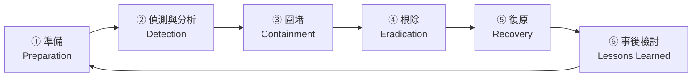

# 資安事件應變流程

> [!abstract] 這篇你會學到
> - 說出事件應變的**六個階段**（NIST SP 800-61）
> - 決定**什麼時候該拔網路線、什麼時候不該關機**
> - **保全證據而不破壞現場**（含記憶體與磁碟取證）
> - 知道**台灣公務機關的通報時限與對象**
> - 準備一份**能在半夜被叫醒時照著做的應變手冊**
> - 完成**事後檢討（不究責文化）**與改善追蹤

> [!danger] 這一篇要在事件發生「之前」讀
> **事件發生時，你不會有時間讀這篇。**
>
> 請把本篇的「應變卡」與「通報表」**印出來**，
> 放在你隨手拿得到的地方。

## 前置知識

- [[09-日誌集中與SIEM]] — 沒有日誌就無法調查
- [[14-備份與抗勒索防護]] — 復原的前提
- [[07-台灣資安法規與個資法]] — 通報的法定義務

---

## 觀念說明

### 六個階段（NIST SP 800-61）



| 階段 | 目標 | 關鍵問題 |
| --- | --- | --- |
| **① 準備** | **事前做好一切** | 有手冊嗎？有聯絡清單嗎？演練過嗎？ |
| **② 偵測與分析** | 確認**真的是事件**、判斷範圍 | 這是真的嗎？影響多大？ |
| **③ 圍堵** | **阻止擴散** | 怎麼止血而不破壞證據？ |
| **④ 根除** | **移除攻擊者與入侵途徑** | 他怎麼進來的？清乾淨了嗎？ |
| **⑤ 復原** | 恢復服務 | 從哪個時間點還原？怎麼確認乾淨？ |
| **⑥ 事後檢討** | **避免再次發生** | 學到什麼？改了什麼？ |

> [!danger] 80% 的工作在「① 準備」
> **事件當下能做的事情極其有限**，
> 你能做多好，取決於事前準備了多少。
>
> **沒有準備的後果**：
> ```
> 半夜三點接到電話：「網站被改了」
>   → 誰該負責？   （沒有人知道）
>   → 要通報誰？   （不知道電話）
>   → 能不能關機？ （沒有人敢決定）
>   → 有日誌嗎？   （沒有）
>   → 能還原嗎？   （沒試過）
>   → 要不要對外說明？（沒有人授權）
> ```

### ① 準備：事前該有的東西

> [!tip] 準備階段的檢查清單
> ```
> 【組織】
> □ 【明確的應變小組成員與角色】
> □ 24 小時聯絡清單（含備援聯絡人）
> □ 【誰有權決定「讓服務下線」】← 最關鍵
> □ 誰負責對外發言
> □ 上級機關與主管機關的聯絡窗口
>
> 【文件】
> □ 【應變手冊】（不同事件類型的處理步驟）
> □ 通報表單範本（填空即可）
> □ 網路架構圖與資產清單
> □ 系統的還原程序（SOP）
> □ 【重要系統的相依關係圖】
>
> 【技術】
> □ 集中的日誌（且保存夠久）
> □ 【已驗證可還原的備份】
> □ 鑑識工具（USB 隨身碟，事先備好）
> □ 隔離用的網段或 VLAN
> □ 【頻外管理通道】（內網掛了還能連）
>
> 【外部】
> □ 資安廠商的緊急支援契約或聯絡方式
> □ ISP 的 24 小時緊急電話
> □ 【法律諮詢管道】
> □ 保險（如有網路資安險）
>
> 【演練】
> □ 【至少每年一次桌上推演】
> □ 還原演練
> □ 通報流程演練
> ```

> [!danger] 「誰有權決定讓服務下線」是最關鍵的一項
> **真實情境**：
> ```
> 凌晨 2 點，發現主機被入侵，攻擊者正在活動中。
> 資訊人員：「要不要把伺服器關掉？」
> → 關掉：業務停擺，明天民眾罵，主管會不會怪我？
> → 不關：攻擊者繼續偷資料
> → 打電話給主管：沒接
> → 猶豫了 40 分鐘
> ```
>
> **這 40 分鐘可能就是資料被搬走的時間。**
>
> **必須事先明確**：
> - **什麼情況下，資訊人員可以「先斬後奏」**
> - 什麼情況需要主管核准
> - **主管沒接電話時的替代決策者**
> - 這些要**寫進正式的授權文件**，不是口頭默契

### 事件等級

> [!tip] 先分級，才知道要動用多少資源
> | 等級 | 判斷條件 | 反應 |
> | --- | --- | --- |
> | **1 級（低）** | 單一終端感染、無敏感資料、已自動阻擋 | 例行處理，記錄 |
> | **2 級（中）** | 多台受影響 / 內部服務中斷 / 疑似未遂 | 通知資安負責人，1 小時內回應 |
> | **3 級（高）** | **對外服務中斷 / 疑似資料外洩 / 伺服器被入侵** | **啟動應變小組**，通知主管 |
> | **4 級（重大）** | **核心系統淪陷 / 大量個資外洩 / 勒索病毒擴散** | **全面應變**，通知首長、依法通報 |
>
> **公務機關另依《資通安全事件通報及應變辦法》分為 1～4 級**，
> 且**各級有不同的通報時限**（見下方）。

---

## ② 偵測與分析

### 先確認「這是真的嗎」

> [!warning] 誤報浪費資源，漏報造成災難
> **常見的誤報**：
> - 弱點掃描器的誤判
> - 正常的維運作業被誤認為攻擊（備份、批次作業）
> - 使用者的正常行為觸發規則
> - 監控系統本身的問題
>
> **確認的方式**：
> - **多個獨立來源交叉驗證**（EDR + 日誌 + 網路流量）
> - **實際檢視現場**（不要只看告警）
> - 詢問相關人員（「這個時間你有在操作嗎？」）

### 快速分析清單

```bash
# ========== Linux 主機的快速檢查 ==========
# ★ 使用前先讀本篇的「證據保全」段落

# 【1】現在有誰登入
$ w
$ who -a
$ last -20

# 【2】異常的程序
$ ps auxf                                    # 完整的程序樹
$ ps aux --sort=-%cpu | head -20             # CPU 最高的
$ ps aux | awk '$11 ~ /^\.|\/tmp|\/dev\/shm/' # 從可疑路徑執行的 ★

# 【3】異常的網路連線 ★最重要
$ ss -tunap
$ ss -tunap | grep ESTAB | grep -v '127.0.0.1'
$ ss -tlnp                                    # 監聽中的埠

# 【4】最近修改的檔案
$ find /etc /usr/bin /usr/sbin /bin /sbin -mtime -7 -type f 2>/dev/null
$ find /tmp /dev/shm /var/tmp -type f -mtime -7 2>/dev/null    # ★ 常見的落腳處

# 【5】排程與持續性機制 ★
$ for u in $(cut -f1 -d: /etc/passwd); do
    echo "=== $u"; sudo crontab -l -u "$u" 2>/dev/null
  done
$ ls -la /etc/cron.*/ /var/spool/cron/crontabs/ 2>/dev/null
$ systemctl list-timers --all
$ systemctl list-units --type=service --state=running

# 【6】帳號異動
$ sudo awk -F: '$3==0 {print "UID 0: " $1}' /etc/passwd
$ sudo grep -E 'useradd|usermod|passwd|groupadd' /var/log/auth.log | tail -30
$ ls -la /home/*/.ssh/authorized_keys /root/.ssh/authorized_keys 2>/dev/null

# 【7】SSH 登入記錄
$ sudo grep "Accepted" /var/log/auth.log | tail -30
$ sudo grep "Failed password" /var/log/auth.log |
    grep -oE 'from ([0-9]{1,3}\.){3}[0-9]{1,3}' | sort | uniq -c | sort -rn | head

# 【8】Web 服務（如果是網站被入侵）
$ find /var/www -name '*.php' -mtime -7 -type f 2>/dev/null
$ grep -rl 'eval\s*(\|base64_decode\|system\s*(\|shell_exec' /var/www --include='*.php' 2>/dev/null
$ sudo tail -200 /var/log/nginx/access.log | grep -E 'POST|\.php'

# 【9】檢查是否有 rootkit
$ sudo apt install -y chkrootkit rkhunter
$ sudo chkrootkit | grep -i infected
$ sudo rkhunter --check --skip-keypress
```

```powershell
# ========== Windows 主機的快速檢查 ==========
# 【1】異常程序
Get-Process | Sort-Object CPU -Descending | Select-Object -First 20
Get-CimInstance Win32_Process |
  Select-Object ProcessId, Name, CommandLine, ExecutablePath |
  Where-Object { $_.ExecutablePath -match 'Temp|AppData|ProgramData|Users\\Public' }

# 【2】網路連線 ★
Get-NetTCPConnection -State Established |
  Select-Object LocalAddress,LocalPort,RemoteAddress,RemotePort,
                @{N='Process';E={(Get-Process -Id $_.OwningProcess).Name}} |
  Where-Object RemoteAddress -notmatch '^(127\.|::1|10\.|192\.168\.|172\.(1[6-9]|2\d|3[01])\.)'

# 【3】持續性機制 ★
Get-CimInstance Win32_StartupCommand | Select-Object Name, Command, Location, User
Get-ScheduledTask | Where-Object State -ne 'Disabled' |
  Select-Object TaskName, TaskPath, @{N='Action';E={$_.Actions.Execute}}
Get-Service | Where-Object Status -eq 'Running' |
  Select-Object Name, DisplayName, @{N='Path';E={(Get-CimInstance Win32_Service -Filter "Name='$($_.Name)'").PathName}}

# 【4】新增的本機使用者與群組異動
Get-LocalUser | Select-Object Name, Enabled, LastLogon, PasswordLastSet
Get-LocalGroupMember -Group "Administrators"

# 【5】關鍵事件記錄
Get-WinEvent -FilterHashtable @{LogName='Security'; Id=4720,4728,4732,4756} -MaxEvents 50  # 帳號/群組異動
Get-WinEvent -FilterHashtable @{LogName='Security'; Id=4625} -MaxEvents 50                 # 登入失敗
Get-WinEvent -FilterHashtable @{LogName='Security'; Id=4624} -MaxEvents 50 |
  Where-Object { $_.Properties[8].Value -in 3,10 }                                          # 網路/RDP 登入
Get-WinEvent -FilterHashtable @{LogName='Security'; Id=1102} -MaxEvents 10                  # ★ 日誌被清除！
Get-WinEvent -FilterHashtable @{LogName='System'; Id=7045} -MaxEvents 30                    # ★ 新服務安裝

# 【6】Defender 偵測記錄
Get-MpThreatDetection | Select-Object InitialDetectionTime, ThreatID, Resources
```

> [!danger] 事件 ID 1102（安全性日誌被清除）是強烈的入侵訊號
> **正常的維運作業不會清除安全性日誌。**
>
> 如果看到這個事件，幾乎可以確定有人在**湮滅證據**。
>
> 這也再次說明**日誌必須即時送到另一台機器**
> （見 [[09-日誌集中與SIEM]]）。

---

## ③ 圍堵：止血

> [!danger] 圍堵的三個決策
> **決策一：要不要中斷網路？**
> ```
> ✅ 應該：勒索病毒正在加密、資料正在外傳、攻擊者活動中
> ⚠️ 考慮：可能破壞正在進行的鑑識、可能觸發惡意程式的破壞機制
> ```
>
> **決策二：要不要關機？**
> ```
> ❌ 通常【不要】關機
> 理由：
>   · 記憶體中有【加密金鑰、解密的資料、執行中的惡意程式】
>   · 記憶體中有網路連線、已登入的憑證
>   · 關機會【永久失去這些證據】
>   · 有些惡意程式在關機時會執行破壞動作
>
> ✅ 正確做法：【拔網路線但保持開機】
> ```
>
> **決策三：要不要讓服務下線？**
> ```
> 這是【業務決策】不是技術決策
> → 依事前授權的規則決定，或由被授權的人決定
> ```

### 圍堵的具體手段

| 手段 | 效果 | 代價 |
| --- | --- | --- |
| **拔網路線／停用交換器埠** | **立即隔離**，保留記憶體 | 該機器無法遠端操作 |
| **移到隔離 VLAN** | 隔離但仍可遠端調查 | 需要事先準備好隔離網段 |
| **防火牆封鎖特定 IP** | 阻斷 C&C | 攻擊者可能換 IP |
| **停用被盜的帳號** | 阻止繼續使用 | 攻擊者可能已有其他管道 |
| **撤銷所有 Session/Token** | 中斷已建立的連線 | 所有人要重新登入 |
| **更換密碼與金鑰** | 阻止用舊憑證回來 | 影響範圍大 |
| **關閉受影響的服務** | 徹底止血 | 業務中斷 |

> [!warning] 圍堵時最容易犯的錯：打草驚蛇
> 如果攻擊者發現你在處理，他可能會：
> - **加速資料外傳**
> - **啟動破壞機制**（刪除資料、加密）
> - **啟用備用的後門**
> - **清除證據**
>
> **建議**：
> - **先完成調查與準備，再一次全面圍堵**
>   （而不是東擋一個西擋一個）
> - 溝通改用**帶外管道**（電話、另一個通訊軟體）
>   —— **不要用可能已被監控的內部郵件或通訊系統討論事件**
> - **一次撤換所有可能被取得的憑證**
>
> **但如果正在發生破壞（勒索病毒加密中），就立刻圍堵，不要猶豫。**

---

## 證據保全

> [!danger] 證據保全的順序：從最容易消失的開始
> **RFC 3227 的證據易失性順序**：
> ```
> ① 暫存器、快取                  ← 幾乎無法取得
> ② 記憶體（RAM）、網路連線狀態    ← ★ 關機就沒了
> ③ 正在執行的程序、暫存檔
> ④ 磁碟
> ⑤ 遠端日誌、監控資料
> ⑥ 實體設定、拓樸
> ⑦ 備份媒體、書面資料
> ```
>
> **所以：先取記憶體，再取磁碟。**

```bash
# ========== 記憶體取證（在關機前！）==========
# 準備：事先做好一顆含工具的 USB，掛載到 /mnt/forensic

# 方法一：LiME（Linux Memory Extractor）
$ sudo insmod /mnt/forensic/lime.ko \
    "path=/mnt/forensic/mem-$(hostname)-$(date +%Y%m%d%H%M).lime format=lime"

# 方法二：AVML（微軟開源，較容易使用）
$ sudo /mnt/forensic/avml /mnt/forensic/mem-$(hostname)-$(date +%Y%m%d%H%M).lime

# ========== 揮發性資訊快照 ==========
$ OUT="/mnt/forensic/volatile-$(hostname)-$(date +%Y%m%d%H%M)"
$ mkdir -p "$OUT"
$ {
    echo "=== 採證時間 ==="; date -Iseconds; uptime
    echo -e "\n=== 登入中的使用者 ==="; w; who -a
    echo -e "\n=== 程序 ==="; ps auxfww
    echo -e "\n=== 網路連線 ==="; ss -tunap; netstat -antup 2>/dev/null
    echo -e "\n=== 路由 ==="; ip route; ip neigh
    echo -e "\n=== 監聽的埠 ==="; ss -tlnp
    echo -e "\n=== 開啟的檔案 ==="; lsof -n 2>/dev/null
    echo -e "\n=== 已刪除但仍開啟的檔案 ★ ==="; lsof -n 2>/dev/null | grep deleted
    echo -e "\n=== 載入的核心模組 ==="; lsmod
    echo -e "\n=== 掛載點 ==="; mount; df -h
    echo -e "\n=== 排程 ==="; ls -la /etc/cron.*/; crontab -l 2>/dev/null
    echo -e "\n=== 帳號 ==="; cat /etc/passwd; sudo cat /etc/shadow
    echo -e "\n=== 最近登入 ==="; last -50; lastb -50 2>/dev/null
  } > "$OUT/volatile.txt" 2>&1

# ★ 計算雜湊值（證據完整性）
$ sha256sum "$OUT/volatile.txt" > "$OUT/volatile.txt.sha256"
```

> [!tip] `lsof | grep deleted` 是重要的線索
> 惡意程式常常**執行後就刪除自己的檔案**，
> 但只要程序還在執行，**檔案內容仍然可以從 `/proc` 取回**：
> ```bash
> $ sudo lsof -n | grep deleted
> malware  1234 root  txt  REG  8,1  45056  123456 /tmp/.hidden (deleted)
>
> # 從 /proc 救回檔案
> $ sudo cp /proc/1234/exe /mnt/forensic/recovered-malware.bin
> $ sha256sum /mnt/forensic/recovered-malware.bin
> ```

```bash
# ========== 磁碟映像（在隔離的環境下）==========
# ★ 一定要用「唯讀」方式，或先做寫入阻斷
# ★ 絕對不要寫入到被調查的磁碟

# 用 dd 製作映像（同時計算雜湊）
$ sudo dd if=/dev/sda bs=4M status=progress | \
    tee >(sha256sum > /mnt/evidence/sda.img.sha256) > /mnt/evidence/sda.img

# 更好的工具：dc3dd（自動計算雜湊與記錄）
$ sudo dc3dd if=/dev/sda of=/mnt/evidence/sda.img \
    hash=sha256 log=/mnt/evidence/sda.log

# 或用 ewfacquire（E01 格式，含壓縮與中繼資料）
$ sudo ewfacquire -t /mnt/evidence/case001 -f encase6 -c deflate:best /dev/sda
```

> [!danger] 證據監管鏈（Chain of Custody）
> 如果**可能需要法律行動**（報案、訴訟、懲處），
> **證據的處理過程必須完整記錄**：
>
> ```
> ═══════════════════════════════════════
>  證據監管紀錄
> ═══════════════════════════════════════
> 案件編號：IR-2026-003
> 證據編號：E-001
> 證據描述：web01 伺服器 /dev/sda 磁碟映像
> 來源：機房 A 區 03 機櫃 U12
>
> 【取得】
>   時間：2026-08-28 03:42:15 +0800
>   取得人：王小明（資訊室）
>   見證人：李小華（政風室）
>   方式：dc3dd 唯讀複製
>   SHA-256：a1b2c3d4e5f6...
>
> 【保管】
>   儲存位置：資訊室保險櫃 / 加密外接硬碟 EV-01
>
> 【異動紀錄】
> ┌──────────────┬────────┬────────┬──────────┬──────┐
> │ 時間          │ 交付人 │ 接收人 │ 事由      │ 簽名 │
> ├──────────────┼────────┼────────┼──────────┼──────┤
> │ 08-28 09:00  │ 王小明 │ 陳大同 │ 分析      │      │
> │ 08-28 18:00  │ 陳大同 │ 王小明 │ 分析完成  │      │
> └──────────────┴────────┴────────┴──────────┴──────┘
> ═══════════════════════════════════════
> ```
>
> **關鍵原則**：
> - **絕對不要在原始證據上分析** —— 用映像的複本
> - **每次交接都要記錄與簽名**
> - **雜湊值要在每個環節驗證**
> - **有疑慮時，請專業的數位鑑識人員處理**

---

## ④ 根除與 ⑤ 復原

> [!danger] 最重要的一件事：先找出入侵途徑
> **不知道他怎麼進來的，就無法確保他不會再進來。**
>
> ```
> ❌ 錯誤流程：
>   發現被入侵 → 重灌 → 還原備份 → 上線 → 【三天後又被打】
>
> ✅ 正確流程：
>   發現被入侵 → 【調查入侵途徑】→ 【修補該途徑】
>   → 重建 → 還原（乾淨的備份）→ 【加強監控】→ 上線
> ```

### 根除的檢查清單

```
□ 【找出並修補入侵途徑】（弱點？弱密碼？釣魚？供應鏈？）
□ 移除所有惡意程式與工具
□ 【移除所有持續性機制】：
    · 排程工作（cron、Scheduled Task）
    · 開機自動執行（systemd unit、Registry Run）
    · 【SSH authorized_keys 中的陌生金鑰】
    · 新增的帳號與群組成員
    · 修改過的系統二進位檔
    · WMI 事件訂閱（Windows）
    · Web shell（PHP/ASP 後門）
□ 【所有可能外洩的憑證全部更換】：
    · 所有使用者密碼（特別是管理員）
    · 服務帳號密碼
    · API 金鑰、Token
    · SSH 主機金鑰與使用者金鑰
    · 【AD 的 krbtgt 帳號（連續重設兩次）】← 極重要
    · TLS 憑證（如果私鑰可能外洩）
□ 檢查【同網段的其他機器】是否也被入侵
□ 檢查【備份中是否已含後門】
```

> [!danger] AD 被入侵時，一定要重設 krbtgt（兩次）
> 如果攻擊者取得了網域管理員權限，
> 他可能已經竊取了 **krbtgt 帳號的雜湊**，
> 用來製作 **Golden Ticket** —— **可以偽造任何使用者的票證，永久有效**。
>
> **即使你改了所有人的密碼，Golden Ticket 仍然有效。**
>
> ```powershell
> # ★ 必須連續重設兩次，中間間隔至少 10 小時（等票證自然過期）
> # 微軟提供官方腳本：New-KrbtgtKeys.ps1
> # 第一次重設
> Reset-ADServiceAccountPassword -Identity krbtgt      # 或用官方腳本
> # 等待 10～24 小時（讓現有票證過期）
> # 第二次重設
> ```
>
> ⚠️ **重設 krbtgt 會造成短暫的認證問題**，
> 請在**低峰時段**進行並事先通知。

### 復原

| 步驟 | 注意事項 |
| --- | --- |
| **選擇還原時間點** | **要早於入侵時間**（可能是幾個月前） |
| **還原前掃描備份** | 確認備份中沒有後門 |
| **在隔離環境還原並驗證** | 不要直接還原到正式網路 |
| **重建而非還原**（若可能） | 從乾淨的映像重建更安全 |
| **上線前完整檢查** | 修補、加固、密碼已換 |
| **加強監控** | 針對這次的攻擊手法設定告警 |
| **分階段恢復服務** | 先恢復關鍵服務，觀察後再全面恢復 |

> [!warning] 「重建」比「還原」安全
> **如果不確定備份是否乾淨**：
> ```
> 從乾淨的作業系統映像【重新安裝】
>   → 套用最新修補
>     → 【只還原資料，不還原系統檔案與設定】
>       → 資料還原前先掃描
> ```
>
> **這比較花時間，但能確保系統本身是乾淨的。**
>
> 對於**被入侵的核心系統，一律建議重建。**

---

## 台灣的通報義務

> [!danger] 公務機關有法定通報時限
> 依《**資通安全管理法**》及《**資通安全事件通報及應變辦法**》：

| 事件等級 | 通報時限 | 應變完成時限 |
| --- | --- | --- |
| **1、2 級** | **知悉後 72 小時內**通報 | 事件發生後 **72 小時內**完成應變 |
| **3、4 級** | **知悉後 36 小時內**通報 | 事件發生後 **36 小時內**完成應變 |

> [!warning] 這裡的數字請以現行法規為準
> **法規會修訂。動筆時請務必到主管機關網站確認現行的通報時限與程序。**
>
> - 數位發展部資通安全署：<https://moda.gov.tw>
> - **國家資通安全研究院（NICS）**：<https://www.nics.nat.gov.tw>
> - **技服中心（NCCST）**：<https://www.nccst.nat.gov.tw>
>
> **公務機關應透過指定的通報應變管道**（如 NCCST 的通報系統）辦理，
> 並依所屬主管機關的規定辦理。

> [!tip] 通報對象與順序
> ```
> 【內部】
>   ① 資安長 / 資訊主管
>   ② 機關首長（3、4 級）
>   ③ 政風、法制、公關（視情況）
>
> 【外部 —— 公務機關】
>   ④ 【上級／主管機關】
>   ⑤ 【資安署指定的通報系統（NCCST）】
>   ⑥ 涉及個資 → 依個資法【通知當事人】，並通報目的事業主管機關
>   ⑦ 涉及犯罪 → 【報警】（刑事局 165 或轄區警局）
>
> 【外部 —— 一般組織】
>   · TWCERT/CC：https://www.twcert.org.tw
>   · 涉及個資：依個資法通知當事人與主管機關
>   · 涉及犯罪：報警
> ```

> [!danger] 個資外洩的通知義務
> 《個人資料保護法》**第 12 條**：
> 「…違反本法規定，致個人資料被竊取、洩漏、竄改或其他侵害者，
> 應**查明後以適當方式通知當事人**。」
>
> **實務要點**：
> - **「查明後」**：不是查明「全部細節」才通知，
>   而是確認**確實發生**且知道**受影響的對象**後就要通知
> - **通知內容應包含**：外洩的事實、可能影響的資料類型、
>   已採取的措施、當事人可以做什麼、聯絡窗口
> - **不通知的風險**：可能面臨裁罰，且事後被揭露時信譽損害更大

### 通報單範本

```
═══════════════════════════════════════════
 資安事件通報單
═══════════════════════════════════════════
【基本資料】
  事件編號：IR-2026-003
  通報機關：○○市○○局
  通報人：王小明  職稱：資訊室技士
  聯絡電話：(02)1234-5678 / 0912-345-678
  通報時間：2026-08-28 05:30

【事件概要】
  發現時間：2026-08-28 03:15
  發現方式：☐自行發現 ☑監控告警 ☐使用者通報 ☐外部通知
  事件類型：☐惡意程式 ☑入侵 ☐阻斷服務 ☐資料外洩
            ☐網頁置換 ☐設備遺失 ☐其他______
  事件等級：☐1級 ☐2級 ☑3級 ☐4級

【影響範圍】
  受影響系統：民眾服務入口網（web01, web02）
  受影響資料：☑可能含個資（約 3,000 筆申辦紀錄）
  服務中斷：☑是，2026-08-28 04:00 起
  影響人數：約 3,000 人（待確認）

【事件經過】（時間軸）
  03:15  SIEM 告警：web01 出現異常對外連線
  03:22  值班人員確認，發現不明程序 /tmp/.x
  03:40  通知資安負責人
  03:55  完成記憶體取證
  04:00  【中斷 web01 網路，服務切換至維護頁】
  04:30  初步分析：疑似透過未修補的 CVE-2026-XXXX 入侵
  05:30  完成本通報

【已採取措施】
  1. 隔離受影響主機（拔除網路，保持開機）
  2. 完成記憶體與揮發性資訊取證
  3. 保全相關日誌
  4. 停用可能外洩的帳號並撤銷 Session
  5. 檢查同網段其他主機

【後續計畫】
  · 完整鑑識分析（預計 08-29 完成）
  · 修補入侵途徑後重建系統
  · 從 08-20 的備份還原資料（掃描後）
  · 確認個資外洩範圍後通知當事人

【協助需求】
  ☐ 需要技術支援  ☑ 需要鑑識協助  ☐ 無
═══════════════════════════════════════════
```

---

## ⑥ 事後檢討

> [!danger] 事後檢討的關鍵：不究責文化（Blameless）
> **如果檢討會變成究責大會，下次就沒有人願意通報事件了。**
>
> ```
> ❌ 「是誰點了那封釣魚信？」
> ✅ 「為什麼那封釣魚信能到達使用者的信箱？」
> ✅ 「為什麼點了之後能執行？」
> ✅ 「為什麼執行後能連到外部？」
> ✅ 「為什麼我們花了 6 小時才發現？」
> ```
>
> **焦點放在「系統與流程」，不是「個人」。**
>
> 事實上，**能鼓勵員工主動通報「我好像點到奇怪的東西」，
> 比任何技術防護都有價值** ——
> 早 5 分鐘知道，可能就少 100 台機器被感染。

### 事後檢討會議的議程

```
【1】事件時間軸重建（15 分鐘）
    · 攻擊者什麼時候進來的？
    · 我們什麼時候發現的？（【這兩個時間差多少？】）
    · 每個處置動作的時間點

【2】做得好的地方（10 分鐘）  ← 不要跳過這一段
    · 哪些準備發揮了作用？
    · 哪些決策是正確的？

【3】問題分析（30 分鐘）
    · 【技術面】：為什麼防護沒擋住？為什麼沒早點發現？
    · 【流程面】：哪一步卡住了？資訊傳遞順暢嗎？
    · 【人員面】：知道該做什麼嗎？找得到人嗎？
    · 【工具面】：需要的工具都有嗎？好用嗎？

【4】根本原因分析（20 分鐘）
    · 用「五個為什麼」往下挖
    · 【不要停在「使用者點了釣魚信」這一層】

【5】改善行動（20 分鐘）
    · 每一項要有：【做什麼、誰負責、什麼時候完成】
    · 分為「立即」「短期」「長期」

【6】追蹤機制
    · 誰負責追蹤改善項目？
    · 多久檢視一次？
```

> [!example] 五個為什麼的範例
> ```
> 事件：勒索病毒感染 30 台電腦
>
> 為什麼會被感染？
>   → 使用者開啟了郵件附件的巨集
> 為什麼巨集能執行？
>   → 沒有用 GPO 停用巨集
> 為什麼沒有停用？
>   → 三年前某個單位說需要用巨集，所以全機關開放
> 為什麼只有一個單位需要卻全機關開放？
>   → 【沒有能力做「分群組套用不同政策」】
> 為什麼沒有能力？
>   → 【AD 的 OU 結構是平的，無法針對單位套用政策】
>
> 【真正的根本原因：AD 架構設計問題】
> 改善行動：重整 OU 結構 → 分群組套用政策 → 只對真正需要的單位開放巨集
> ```
>
> **如果停在第一層「使用者點了附件」，
> 你只會得到「加強教育訓練」這種沒有用的結論。**

### 改善追蹤表

| # | 改善項目 | 類別 | 負責人 | 期限 | 狀態 |
| --- | --- | --- | --- | --- | --- |
| 1 | 用 GPO 停用 Office 巨集（例外單位另設） | 技術 | 王 | 09/05 | 進行中 |
| 2 | 郵件閘道加上外部郵件橫幅 | 技術 | 李 | 09/10 | 未開始 |
| 3 | 建立終端間網路隔離（GPO） | 技術 | 王 | 09/30 | 未開始 |
| 4 | 明訂「誰可以決定服務下線」 | 流程 | 主管 | 09/15 | 未開始 |
| 5 | 建立 24 小時聯絡清單 | 流程 | 陳 | 09/05 | **已完成** |
| 6 | 備份改為不可變儲存 | 技術 | 李 | 10/31 | 未開始 |
| 7 | 每季辦理釣魚演練 | 教育 | 陳 | 持續 | 進行中 |
| 8 | 重整 AD OU 結構 | 技術 | 王 | 12/31 | 規劃中 |

> [!warning] 沒有追蹤的改善項目 = 沒有改善
> **最常見的失敗**：檢討會開得很好，列了 10 項改善，
> **三個月後一項都沒做**。
>
> **對策**：
> - 每一項都要有**明確的負責人與期限**
> - **納入定期的管理會議追蹤**
> - **下次演練或稽核時驗證**
> - 未完成的要說明原因並重訂期限

---

## 完整實戰範例

### 一頁的應變卡（印出來貼在牆上）

```
╔══════════════════════════════════════════════════════════╗
║        資安事件應變卡  —— 保持冷靜，照著做                ║
╚══════════════════════════════════════════════════════════╝

【第 1 步：確認（5 分鐘內）】
  □ 這是真的事件嗎？（多來源交叉驗證）
  □ 現在還在進行中嗎？
  □ 影響了哪些系統？
  □ 【判斷等級】：1／2／3／4 級

【第 2 步：通知（10 分鐘內）】
  □ 資安負責人：王小明 0912-345-678
  □ 資訊主管：  李大同 0923-456-789
  □ 【3 級以上】通知機關首長
  □ 【備援聯絡人】：陳小美 0934-567-890

【第 3 步：圍堵】
  ★★ 【拔網路線，但不要關機】★★
     （記憶體中有關鍵證據）
  □ 或改接到隔離 VLAN 999
  □ 停用可能被盜的帳號 + 【撤銷所有 Session】
  □ 防火牆封鎖已知的惡意 IP
  □ 【正在加密/外傳 → 立刻圍堵，不要猶豫】

【第 4 步：保全證據】
  □ 記憶體取證（USB 在 資訊室保險櫃 / avml）
  □ 拍照記錄畫面
  □ 【匯出日誌】（機器上的可能被清掉）
  □ 記錄時間軸（每個動作幾點做的）

【第 5 步：通報】
  □ 上級機關：____________________
  □ NCCST 通報系統：______________
  □ 【時限】3、4 級 36 小時 / 1、2 級 72 小時
  □ 涉及個資 → 通知當事人
  □ 涉及犯罪 → 報警 165

【第 6 步：不要做的事】
  ✗ 不要關機
  ✗ 不要重灌（會摧毀證據）
  ✗ 不要在原始磁碟上分析
  ✗ 【不要用內部郵件/通訊軟體討論事件】（可能被監控）
  ✗ 不要在還沒找出入侵途徑前就還原上線
  ✗ 不要對外發言（除非你是被授權的人）

【重要電話】
  ISP 24H：__________  資安廠商：__________
  鑑識支援：_________  法律諮詢：__________
╚══════════════════════════════════════════════════════════╝
```

### 桌上推演的題目

> [!tip] 每年至少辦一次，兩小時就能做
> 不需要真的操作系統，**把人聚在一起討論就有效果**。

```
【情境一：勒索病毒】
週五下午 4:30，會計室通報「檔案打不開，變成奇怪的副檔名」。
你到現場看到勒索訊息。

Q1. 你的第一個動作是什麼？
Q2. 怎麼判斷有多少台機器受影響？
Q3. 【要不要關掉檔案伺服器？誰決定？】
Q4. 備份還在嗎？怎麼確認？
Q5. 【備份主機會不會也被加密？怎麼確認？】
Q6. 要通報嗎？向誰？時限？
Q7. 週末要不要叫人回來？
Q8. 週一早上使用者來上班，怎麼跟他們說？
Q9. 老闆問「多久能恢復？」你怎麼回答？

【情境二：網頁被置換】
早上 8:00，民眾打電話說機關網站首頁變成奇怪的圖片。

Q1. 先關站還是先調查？
Q2. 【攻擊者是怎麼進來的？你怎麼查？】
Q3. 資料庫有沒有被動過？怎麼確認？
Q4. 【網站有沒有其他後門？】
Q5. 直接從備份還原可以嗎？有什麼風險？
Q6. 要不要對外說明？誰來說？

【情境三：帳號被盜】
資安署通知：「你們機關的某個帳號正在對外發送釣魚信。」

Q1. 怎麼確認是哪個帳號？
Q2. 【停用帳號就夠了嗎？】
Q3. 對方在信箱裡做了什麼？怎麼查？
Q4. 【有沒有設定郵件轉發規則？】（攻擊者常做的）
Q5. 收到釣魚信的人怎麼辦？
Q6. 【那個帳號還能存取哪些系統？】

【情境四：內部人員】
政風室通知：某位即將離職的同仁，
上週下載了大量客戶資料。

Q1. 【怎麼確認這件事是真的？】（有日誌嗎？）
Q2. 他下載了什麼？多少？怎麼查？
Q3. 資料被帶到哪裡去了？
Q4. 【現在要不要停用他的帳號？】（會不會打草驚蛇？）
Q5. 這是資安事件還是人事案件？誰主導？
Q6. 需要保全什麼證據？
```

> [!tip] 推演的重點不是「答對」
> 而是**發現「我們原來沒有準備這個」**。
>
> 每個「不知道」「沒有」「要問一下」都是一個**改善項目**。

---

## 常見錯誤與排錯

| 現象／錯誤 | 原因 | 解法 |
| --- | --- | --- |
| **關機了，記憶體證據全沒了** | 直覺反應 | **拔網路線但保持開機**；先做記憶體取證 |
| **立刻重灌，無法查明原因** | 急著恢復服務 | 先取證、先調查入侵途徑，再重建 |
| **還原後又被打一次** | **沒有找出並修補入侵途徑** | 根除階段必須先查明途徑 |
| 猶豫要不要讓服務下線，錯過時機 | **沒有事先授權** | **明訂誰有權決定，含備援決策者** |
| 找不到人 / 主管沒接電話 | 沒有聯絡清單 | 24 小時聯絡清單 + **備援聯絡人** |
| **日誌被攻擊者清掉了** | 日誌只存在本機 | **即時送到集中日誌伺服器** |
| 用內部郵件討論事件 | 沒想到郵件可能被監控 | **改用帶外管道**（電話、另一套通訊軟體） |
| 東擋一個西擋一個，打草驚蛇 | 沒有整體圍堵計畫 | **先完成調查，再一次全面圍堵** |
| **改了所有密碼，攻擊者還是進得來** | **沒有重設 krbtgt**（Golden Ticket） | AD 被入侵時**連續重設 krbtgt 兩次** |
| 從備份還原，後門也一起還原 | 備份中已含後門 | **還原前掃描**；不確定就**重建而非還原** |
| 逾期通報 | 不知道時限 | **應變卡上寫明時限**；演練通報流程 |
| 個資外洩沒通知當事人 | 不知道有這個義務 | 個資法第 12 條：查明後應通知當事人 |
| **檢討會變成究責大會** | 沒有建立不究責文化 | 焦點放在**系統與流程**，不是個人 |
| 檢討列了 10 項改善，三個月後一項沒做 | **沒有追蹤機制** | 每項要有**負責人與期限**；納入管理會議追蹤 |
| 根本原因停在「使用者點了附件」 | 沒有往下挖 | 用**五個為什麼**挖到系統性原因 |
| 事件發生時大家不知道該做什麼 | **從來沒有演練過** | **每年至少一次桌上推演**（兩小時就能做） |

---

## 安全性注意事項

> [!danger] 事件當下最容易犯的五個錯
> 1. **關機**（記憶體證據永久消失）
> 2. **立刻重灌**（摧毀所有證據，也可能還原到含後門的狀態）
> 3. **在原始磁碟上分析**（污染證據）
> 4. **用可能被監控的管道討論**（攻擊者知道你在幹嘛）
> 5. **還沒找出入侵途徑就上線**（幾天後再被打一次）

> [!warning] 不要在壓力下做不可逆的決定
> 半夜三點、大家都很累、主管在催 ——
> **這是最容易做出錯誤決定的時候。**
>
> **原則**：
> - **可逆的動作可以快**（拔網路線、停用帳號）
> - **不可逆的動作要慢**（重灌、刪除、格式化）
> - **不確定就先保全，不要先破壞**
> - **「等一下再說」對不可逆的動作是好答案**

> [!tip] 對外溝通的原則
> **只有被授權的人可以對外發言。**
>
> **溝通內容的原則**：
> - **不要說沒有確認的事**（「應該沒有資料外洩」→ 事後打臉）
> - **不要說「不可能」**
> - 說**已經做了什麼**，而不是猜測
> - 說**什麼時候會有進一步消息**
> - **對受影響的人說明他們可以做什麼**
>
> **對內溝通同樣重要**：
> - 讓同仁知道發生了什麼（避免謠言）
> - 告訴他們**該做什麼**（改密碼？暫停使用某系統？）
> - **鼓勵通報**（「如果你也收到類似的信，請告訴我們」）

> [!danger] 保險與法律
> - 如果有**網路資安險**，**理賠通常有通報時限**（可能 24～72 小時）
>   → **事件發生時要記得通知保險公司**
> - 涉及**刑事責任**時，證據的取得方式會影響證據能力
>   → **有疑慮時請專業鑑識人員處理**
> - **委外廠商造成的事件**，要依契約釐清責任
>   → 見 [[11-委外與供應鏈資安]]
> - 涉及個資的事件，可能有**行政裁罰與民事賠償**風險
>   → 及早諮詢法制單位

---

## 速查表

### 六階段

```
① 準備（80% 的工作在這裡）→ ② 偵測與分析 → ③ 圍堵
→ ④ 根除（先找出入侵途徑！）→ ⑤ 復原 → ⑥ 事後檢討
```

### 事件當下的三個決策

```
中斷網路？ → 正在加密/外傳/攻擊者活動中 → 【立刻】
關機？     → 【通常不要】（記憶體中有關鍵證據）
服務下線？ → 【業務決策】，依事前授權
```

### 最重要的一句話

```
★★ 拔網路線，但【不要關機】★★
```

### 證據易失性順序（RFC 3227）

```
① 暫存器/快取  ② 【記憶體、網路狀態】← 關機就沒了
③ 程序/暫存檔  ④ 磁碟  ⑤ 遠端日誌  ⑥ 拓樸  ⑦ 備份/紙本
→ 先取記憶體，再取磁碟
```

### 記憶體取證

```bash
sudo avml /mnt/forensic/mem-$(hostname)-$(date +%Y%m%d%H%M).lime
# 或 LiME：sudo insmod lime.ko "path=... format=lime"
sudo lsof -n | grep deleted          # ★ 找出已刪除但仍執行的惡意程式
sudo cp /proc/<PID>/exe recovered.bin # 從 /proc 救回
```

### Linux 快速檢查

| 目的 | 指令 |
| --- | --- |
| 誰在線上 | `w` / `last -20` |
| 可疑路徑執行的程序 | `ps aux \| awk '$11 ~ /\/tmp\|\/dev\/shm/'` |
| **網路連線** | `ss -tunap` |
| 最近改的系統檔 | `find /etc /usr/bin -mtime -7 -type f` |
| 持續性 | `crontab -l` / `systemctl list-timers` |
| **陌生 SSH 金鑰** | `cat /home/*/.ssh/authorized_keys` |
| Web shell | `grep -rl 'eval(\|base64_decode' /var/www --include='*.php'` |

### Windows 關鍵事件 ID

| ID | 意義 |
| --- | --- |
| 4624 | 登入成功（Type 3=網路、10=RDP） |
| 4625 | 登入失敗 |
| 4720 | **建立使用者帳號** |
| 4728/4732/4756 | **加入群組** |
| **1102** | **★ 安全性日誌被清除（強烈入侵訊號）** |
| **7045** | **★ 新服務安裝** |

### 根除必做

```
□ 【先找出並修補入侵途徑】
□ 移除持續性機制（cron/服務/authorized_keys/Web shell/WMI 訂閱）
□ 【所有憑證全部更換】
□ 【AD 被入侵 → krbtgt 連續重設兩次（間隔 10h+）】
□ 檢查同網段其他機器
□ 檢查備份是否已含後門
```

### 台灣通報時限（請以現行法規為準）

| 等級 | 通報 | 應變完成 |
| --- | --- | --- |
| **1、2 級** | **72 小時內** | 72 小時內 |
| **3、4 級** | **36 小時內** | 36 小時內 |

**通報對象**：上級/主管機關 → NCCST 通報系統
**涉及個資** → 依個資法第 12 條**通知當事人**
**涉及犯罪** → 報警（刑事局 165）

### 事件當下不要做的事

```
✗ 關機                    ✗ 重灌
✗ 在原始磁碟上分析        ✗ 用內部郵件討論事件
✗ 沒查明途徑就還原上線    ✗ 未經授權對外發言
```

### 事後檢討

```
【不究責】焦點在「系統與流程」，不是個人
❌「是誰點了釣魚信？」
✅「為什麼那封信能到達信箱／能執行／能連外／6 小時才發現？」

用【五個為什麼】挖到根本原因
每項改善要有【負責人 + 期限 + 追蹤機制】
```

---

## 練習題

> [!question]- 練習 1：檢視你的準備程度
> 對照「準備階段檢查清單」逐項確認：
> 1. **有幾項是「有」？**
> 2. **「誰有權決定讓服務下線」這一項有明確答案嗎？**
> 3. 你有 24 小時聯絡清單嗎？**上面的電話都打得通嗎？**（去測試三支）
> 4. **上級機關的通報窗口電話是多少？**（現在就查，不要等到需要時）
> 5. 你有鑑識用的 USB 嗎？裡面有什麼工具？
> 6. **最後一次演練是什麼時候？**
>
> 把「沒有」的項目列出來，那就是你的準備清單。

> [!question]- 練習 2：做一次桌上推演
> 找 3～5 位同仁（含至少一位主管），用兩小時：
> 1. 選一個情境（建議從「勒索病毒」開始）
> 2. **逐題討論，記錄每一個「不知道」與「沒有」**
> 3. **特別記錄「這件事該找誰」答不出來的**
> 4. 討論後列出改善項目
> 5. **每項指定負責人與期限**
>
> **推演的價值不在於答對，而在於發現準備不足的地方。**

> [!question]- 練習 3：製作你的應變卡
> 把本篇的應變卡改成你機關的版本：
> 1. 填入**真實的姓名與電話**
> 2. 填入**上級機關與通報系統**的資訊
> 3. 填入**隔離 VLAN 的編號**與操作方式
> 4. 填入**鑑識工具的存放位置**
> 5. **印出來**，貼在資訊室與機房
> 6. **每半年檢視一次**（人員異動、電話變更）
>
> 然後測試：**把卡片交給一位沒參與製作的同仁，
> 問他「照著這張卡，你知道該做什麼嗎？」**

---

## 小測驗

Q1. 事件應變的六個階段是什麼？**哪一個階段佔了 80% 的工作**，為什麼？

Q2. **準備階段中「最關鍵的一項」是什麼**？沒有它會發生什麼？

Q3. **事件當下「拔網路線但不要關機」的理由是什麼**？

Q4. RFC 3227 的證據易失性順序是什麼？這對取證順序有什麼意義？

Q5. **圍堵時「打草驚蛇」的風險是什麼**？該怎麼避免？什麼情況下不該猶豫？

Q6. **為什麼「先找出入侵途徑」比「趕快還原上線」重要**？

Q7. **AD 被入侵時為什麼一定要重設 krbtgt？為什麼要連續兩次**？

Q8. 台灣公務機關的資安事件通報時限是多少？**涉及個資時另有什麼義務**？

Q9. **為什麼事後檢討必須是「不究責」的**？舉例說明正確與錯誤的提問方式。

Q10. **為什麼根本原因分析不能停在「使用者點了釣魚信」**？該用什麼方法往下挖？

> [!question]- 測驗答案
> **Q1.** ①**準備**、②偵測與分析、③圍堵、④根除、⑤復原、⑥事後檢討。
> **「① 準備」佔了 80% 的工作**，因為**事件當下能做的事情極其有限** ——
> 你能做多好，完全取決於事前準備了多少：
> 有沒有手冊、有沒有聯絡清單、有沒有日誌、備份能不能還原、
> 有沒有人知道該找誰、有沒有演練過。
> 沒有準備的話，半夜三點接到電話時每一個問題的答案都是「不知道」。
>
> **Q2.** **「誰有權決定讓服務下線」**。
> 沒有它會發生：凌晨兩點發現主機被入侵、攻擊者正在活動中，
> 資訊人員不敢決定要不要關掉（關了業務停擺會被怪罪，不關資料繼續被偷），
> 打電話給主管沒接，**猶豫了 40 分鐘** ——
> 而那 40 分鐘可能就是資料被搬走的時間。
> 必須事先明確：什麼情況資訊人員可以「先斬後奏」、
> 什麼情況需要核准、**主管沒接電話時的替代決策者是誰**，
> 而且要**寫進正式的授權文件**，不是口頭默契。
>
> **Q3.** 因為**記憶體中有關鍵且極易消失的證據**：
> 加密金鑰、已解密的資料、執行中的惡意程式本體
> （有些惡意程式執行後就刪除自己的檔案）、
> 網路連線狀態、已登入的憑證。
> **關機會永久失去這些證據**，
> 而且**有些惡意程式在關機時會執行破壞動作**。
> 拔網路線能達到隔離的效果（阻止擴散與外傳），同時保留記憶體內容。
>
> **Q4.** 順序（由最易失到最持久）：
> ①暫存器／快取 → ②**記憶體、網路連線狀態** →
> ③正在執行的程序、暫存檔 → ④磁碟 → ⑤遠端日誌、監控資料 →
> ⑥實體設定、拓樸 → ⑦備份媒體、書面資料。
> 意義：**取證要從最容易消失的開始** ——
> **先取記憶體，再取磁碟**。
> 磁碟隨時可以取（只要不寫入），但記憶體一關機就永遠沒了。
>
> **Q5.** 如果攻擊者發現你在處理，他可能會
> **加速資料外傳**、**啟動破壞機制**（刪除、加密）、
> **啟用備用的後門**、**清除證據**。
> 避免方式：①**先完成調查與準備，再一次全面圍堵**
> （而不是東擋一個西擋一個）；
> ②**溝通改用帶外管道**（電話、另一套通訊軟體）——
> 不要用可能已被監控的內部郵件或通訊系統討論事件；
> ③**一次撤換所有可能被取得的憑證**。
> **但如果正在發生破壞（勒索病毒正在加密），
> 就立刻圍堵，不要猶豫。**
>
> **Q6.** 因為**不知道他怎麼進來的，就無法確保他不會再進來**。
> 錯誤流程是「發現被入侵 → 重灌 → 還原備份 → 上線 →
> **三天後又被打**」——
> 這在真實案例中非常常見。
> 正確流程是「發現被入侵 → **調查入侵途徑** → **修補該途徑** →
> 重建 → 從乾淨的備份還原 → **加強監控** → 上線」。
>
> **Q7.** 因為如果攻擊者取得了網域管理員權限，
> 他可能已經**竊取了 krbtgt 帳號的雜湊**，
> 用來製作 **Golden Ticket** ——
> 那可以**偽造任何使用者的票證，而且永久有效**。
> **即使你改了所有人的密碼，Golden Ticket 仍然有效。**
> **要連續重設兩次**，是因為 AD 會保留前一版的金鑰以維持相容性 ——
> 只重設一次的話，用舊金鑰簽發的票證仍然驗證得過；
> 必須重設兩次，且**中間間隔至少 10 小時**（等現有票證自然過期）。
> ⚠ 重設會造成短暫的認證問題，應在低峰時段進行並事先通知。
>
> **Q8.** 依《資通安全事件通報及應變辦法》：
> **1、2 級事件於知悉後 72 小時內通報**，
> **3、4 級事件於知悉後 36 小時內通報**，
> 應變完成時限亦分別為 72／36 小時。
> （法規會修訂，實務上請以主管機關公告的現行規定為準。）
> **涉及個資時另依《個人資料保護法》第 12 條，
> 「查明後應以適當方式通知當事人」** ——
> 不是查明全部細節才通知，而是確認確實發生且知道受影響對象後就要通知；
> 通知內容應包含外洩事實、可能影響的資料類型、已採取的措施、
> 當事人可以做什麼、聯絡窗口。
>
> **Q9.** 因為**如果檢討會變成究責大會，下次就沒有人願意通報事件了** ——
> 而**能鼓勵員工主動通報「我好像點到奇怪的東西」，
> 比任何技術防護都有價值**（早 5 分鐘知道，可能就少 100 台機器被感染）。
> **錯誤的提問**：「是誰點了那封釣魚信？」
> **正確的提問**：「為什麼那封釣魚信能到達使用者的信箱？」
> 「為什麼點了之後能執行？」「為什麼執行後能連到外部？」
> 「為什麼我們花了 6 小時才發現？」——
> **焦點放在「系統與流程」，不是「個人」。**
>
> **Q10.** 因為停在那一層，你只會得到
> **「加強教育訓練」這種沒有用的結論** ——
> 而使用者永遠會有人點到釣魚信，這是必然的。
> 該用**「五個為什麼」往下挖**：
> 「為什麼會被感染？→ 使用者開了巨集」→
> 「為什麼巨集能執行？→ 沒用 GPO 停用」→
> 「為什麼沒停用？→ 三年前某單位說需要，所以全機關開放」→
> 「為什麼一個單位需要卻全機關開放？→ 沒有能力分群組套用政策」→
> 「為什麼沒有能力？→ **AD 的 OU 結構是平的**」。
> **真正的根本原因是 AD 架構設計問題**，
> 改善行動才會變成「重整 OU 結構 → 分群組套用政策」這種
> 真正能防止再次發生的措施。

---

## 延伸閱讀

- [[09-日誌集中與SIEM]] — 沒有日誌就無法調查
- [[14-備份與抗勒索防護]] — 復原能力的前提
- [[07-台灣資安法規與個資法]] — 通報義務的法源
- [[04-備份災難復原與入侵應變]] — DR 與 IR 的整體制度
- [[05-端點防護AV-EDR-XDR]] — 偵測與端點鑑識
- [[10-資安政策文件與制度]] — 把應變流程寫成正式文件
- [[12-資安意識與社交工程防範]] — 鼓勵通報的文化
