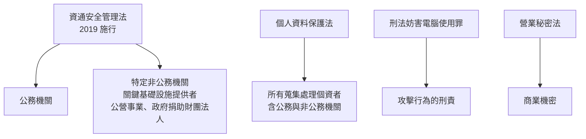
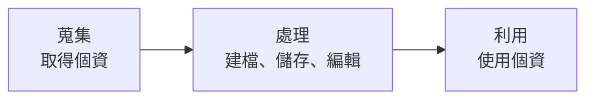

# 台灣資安法規與個資法

> [!abstract] 這篇你會學到
> - 理解《**資通安全管理法**》的**適用對象與資安責任等級**
> - 知道**通報與應變的時限要求**
> - 掌握《**個人資料保護法**》的**蒐集、處理、利用三原則**
> - 知道**個資外洩時的通知義務與裁罰風險**
> - 準備**稽核所需的文件與紀錄**
> - 分辨**「法遵」與「安全」的差別**

> [!danger] 重要聲明
> **本篇是「維運人員的實務理解」，不是法律意見。**
>
> - **法規會修訂**，條文編號與細節請**以現行法規為準**
> - 具體個案請**諮詢機關的法制單位或律師**
> - 主要查詢管道：
>   - **全國法規資料庫**：<https://law.moj.gov.tw>
>   - **數位發展部資通安全署**：<https://moda.gov.tw>
>   - **國家資通安全研究院（NICS）**：<https://www.nics.nat.gov.tw>
>   - **技服中心（NCCST）**：<https://www.nccst.nat.gov.tw>
>   - **個人資料保護委員會**（籌備／設立進度請查官方公告）

## 前置知識

- [[01-資安基本原則與實踐]] — 資安原則
- [[04-資安事件應變流程]] — 通報流程
- [[05-ISO27001與ISMS]] — 管理制度

---

## 觀念說明

### 台灣資安相關法規的全貌



| 法規 | 管誰 | 管什麼 |
| --- | --- | --- |
| **資通安全管理法** | **公務機關 + 特定非公務機關** | **資安管理制度、通報應變** |
| **個人資料保護法** | **所有蒐集處理個資的人** | **個資的蒐集、處理、利用** |
| 刑法第 358～363 條 | 所有人 | **攻擊行為的刑事責任** |
| 營業秘密法 | 所有人 | 商業機密的保護 |
| 國家機密保護法 | 公務機關 | 國家機密 |
| 電子簽章法 | — | 電子文件與簽章的效力 |

> [!tip] 一般民間企業要注意什麼
> **多數民間企業不受《資通安全管理法》規範**
> （除非是關鍵基礎設施提供者），
> **但一定受《個人資料保護法》規範**。
>
> 另外可能受：
> - **目的事業主管機關**的行業規範
>   （金管會對金融業、衛福部對醫療機構…）
> - **客戶契約**的資安要求
> - **國際法遵**（GDPR、PCI DSS，見 [[08-產業規範與國際法遵]]）

---

## 資通安全管理法

### 適用對象

| 類別 | 說明 |
| --- | --- |
| **公務機關** | 中央、地方各機關（不含軍事、情報機關另有規定） |
| **特定非公務機關** | ① **關鍵基礎設施提供者**<br/>② **公營事業**<br/>③ **政府捐助之財團法人** |

> [!note] 關鍵基礎設施（CI）的八大領域
> ```
> 能源 · 水資源 · 通訊傳播 · 交通
> 銀行與金融 · 緊急救援與醫院 · 中央與地方政府機關 · 高科技園區
> ```
> 由**中央目的事業主管機關**指定具體業者。

### 資安責任等級

> [!danger] 責任等級決定你要做多少事
> 主管機關依**業務重要性與機敏性**核定機關的責任等級：

| 等級 | 大致定位 | 要求的強度 |
| --- | --- | --- |
| **A** | 最高 | 最嚴格：專責人力、ISMS 驗證、定期演練、滲透測試… |
| **B** | 高 | 次之 |
| **C** | 中 | 中等 |
| **D** | 低 | 基本 |
| **E** | 最低 | 最基本 |

> [!warning] 具體要求請以現行的《資通安全責任等級分級辦法》為準
> 附表通常會規定各等級應辦理的事項，常見的面向包括：
>
> ```
> 【人力】
> · 資安專責人員的配置（人數依等級）
> · 資安人員的專業證照與訓練時數要求
>
> 【制度】
> · 資通安全維護計畫
> · 【資通安全長（CISO）的指派】
> · ISMS 導入或驗證（較高等級）
>
> 【技術】
> · 資通系統的【防護基準】（依系統分級）
> · 【政府組態基準 TWGCB】的導入
> · 弱點掃描的頻率
> · 【滲透測試】的頻率
> · 【資安健診】
> · 日誌保存
>
> 【演練與稽核】
> · 【社交工程演練】的頻率
> · 【資安事件通報應變演練】
> · 內部稽核
> ```
>
> **實務上，機關應該向主管機關確認自己的等級與具體應辦事項。**

### 資通系統的防護基準

> [!tip] 系統也要分級
> 除了「機關」有責任等級，**「資通系統」本身也要分級**
> （通常分為**普、中、高**三級或類似分類），
> 依級別套用不同強度的**防護基準**。
>
> 分級的考量：
> - 系統中斷的**衝擊**
> - 處理的**資料機敏性**（是否含個資、機密）
> - 服務的**對象與規模**
>
> **每個系統都應該完成分級並記錄**，
> 這是稽核必查項目。

### 通報與應變

> [!danger] 這是資安法最具體、最容易被稽核的部分
> 依《**資通安全事件通報及應變辦法**》：

| 事件等級 | **通報時限** | **應變完成時限** |
| --- | --- | --- |
| **1、2 級** | **知悉後 72 小時內** | 事件發生後 **72 小時內** |
| **3、4 級** | **知悉後 36 小時內** | 事件發生後 **36 小時內** |

> [!warning] 這些數字請以現行法規為準
> 通報時限與程序**會隨法規修訂而變動**。
> 請至資通安全署或 NCCST 確認現行規定，
> 並依所屬主管機關的通報管道辦理。

### 事件等級的判斷

> [!tip] 大致的分級邏輯（實際請依辦法附表）
> ```
> 【1 級】
>   · 非核心業務資訊遭輕微洩漏、竄改
>   · 非核心業務中斷，可於可容忍時間內回復
>
> 【2 級】
>   · 非核心業務資訊遭嚴重洩漏、竄改
>   · 非核心業務中斷，超過可容忍時間
>   · 核心業務資訊遭【輕微】洩漏、竄改
>
> 【3 級】
>   · 【核心業務資訊】遭嚴重洩漏、竄改
>   · 【核心業務中斷】，可於可容忍時間內回復
>   · 一般公務機密、敏感資訊遭洩漏
>
> 【4 級】
>   · 【國家機密】遭洩漏、竄改
>   · 【核心業務中斷且無法於可容忍時間內回復】
> ```
>
> **判斷的關鍵字**：
> **「核心業務 vs 非核心業務」**、
> **「輕微 vs 嚴重」**、
> **「可容忍時間內 vs 超過」**。
>
> **這代表你必須事先定義**：
> - **哪些是核心業務系統？**
> - **每個系統的「可容忍中斷時間」是多久？**（就是 RTO）
>
> 見 [[14-備份與抗勒索防護]] 的 RPO/RTO 章節。

> [!danger] 「知悉」的時間點很重要
> 通報時限是從「**知悉**」起算，不是從「事件發生」起算。
>
> **實務上要注意**：
> - **要能證明「什麼時候知悉」**（告警時間、通報紀錄、日誌）
> - **不要為了拖延而假裝不知道** —— 這會讓情況更糟
> - **值班人員發現異常時就應該記錄時間**
>
> **建議**：所有異常都留下**帶時戳的紀錄**
> （工單系統、群組訊息、值班日誌）。

### 資通安全維護計畫

> [!tip] 這是機關必備的核心文件
> 通常應包含：
> ```
> □ 資通安全政策及目標
> □ 【資通安全推動組織】（含資安長、專責人員）
> □ 【資通系統與資訊之盤點及風險評估】
> □ 【資通安全防護及控制措施】
> □ 資通安全事件【通報及應變機制】
> □ 【資通安全情資之評估及因應】
> □ 【資通系統或服務委外之管理】
> □ 資通安全【認知宣導及專業訓練】
> □ 資通安全【內部稽核】
> □ 【業務持續運作演練】
> □ 資通安全維護計畫之【修正及改善】
> ```
>
> **這份計畫要定期檢討修正，並依規定提報主管機關。**

---

## 個人資料保護法

### 什麼是個人資料

> [!note] 定義比你想的廣
> 「**得以直接或間接方式識別該個人之資料**」。
>
> **直接識別**：姓名、身分證字號、護照號碼、照片、指紋
>
> **間接識別**（常被忽略）：
> - **IP 位址**（在某些情境下）
> - **Cookie／裝置識別碼**
> - **員工編號、學號、病歷號**
> - 車牌號碼
> - **「某公司唯一的女性工程師」**（描述性資料的組合）
>
> **關鍵在「可識別性」** ——
> 單獨看不能識別，但**組合起來能識別特定個人**，就是個資。

> [!danger] 特種個資（第 6 條）
> 以下五類原則上**不得蒐集、處理或利用**，除非符合法定例外：
> ```
> 【病歷】【醫療】【基因】【性生活】【健康檢查】【犯罪前科】
> ```
>
> 例外情形包括：法律明文規定、公務機關執行法定職務或
> 非公務機關履行法定義務必要範圍內且有適當安全維護措施、
> 當事人自行公開或已合法公開、
> **當事人書面同意**（且有其他要件）等。
>
> **實務提醒**：
> 機關的健康檢查資料、員工的病假證明、
> 學校的學生健康紀錄 —— **這些都是特種個資**，
> 保護等級要更高。

### 三個階段：蒐集、處理、利用



| 階段 | 意義 | 要求 |
| --- | --- | --- |
| **蒐集** | 取得個資 | **要有特定目的 + 法定事由 + 告知義務** |
| **處理** | 建檔、儲存、更正、複製、傳輸 | 在蒐集目的必要範圍內 |
| **利用** | 實際使用 | **原則上不得逾越蒐集的特定目的** |

### 告知義務（第 8 條）

> [!danger] 蒐集時「應」告知的事項
> ```
> ① 公務機關或非公務機關【名稱】
> ② 【蒐集之目的】
> ③ 個人資料之【類別】
> ④ 個人資料【利用之期間、地區、對象及方式】
> ⑤ 【當事人得行使之權利及方式】
> ⑥ 當事人得【自由選擇提供】個資時，
>    不提供將對其權益之影響
> ```
>
> **實務上就是各種表單上的「個資蒐集告知聲明」。**
>
> ⚠️ **常見的錯誤**：
> - 告知聲明寫得**太籠統**（「為業務需要」）
> - **利用目的與實際用途不符**
> - 表單改版但告知聲明沒跟著改
> - **只在網站上放，紙本表單沒有**

### 當事人的權利（第 3 條）

> [!tip] 這六項權利不得預先拋棄或限制
> ```
> ① 查詢或請求【閱覽】
> ② 請求製給【複製本】
> ③ 請求【補充或更正】
> ④ 請求【停止蒐集、處理或利用】
> ⑤ 請求【刪除】
> ⑥ （前述權利）不得預先拋棄或以特約限制
> ```
>
> **維運上的意義**：
> - 你的系統**要有辦法找出「某個人的所有資料」**
> - 要能**匯出、更正、刪除**
> - **包含備份中的副本嗎？** ← 這要有政策
> - 要有**回應的流程與時限**（法定期限請依現行條文）

> [!warning] 「刪除」在技術上很難完全做到
> 個資可能散落在：
> - 主資料庫
> - **各種備份**（含異地、離線、不可變的）
> - **日誌**
> - 快取
> - **測試環境的副本**
> - 匯出過的報表與 Excel
> - **同仁的電腦與信箱**
>
> **實務做法**：
> - 訂定**明確的刪除政策**（哪些立刻刪、哪些等備份輪替過期）
> - **記錄刪除的執行**
> - 對備份中的副本，說明**保留期限與到期自動失效**
> - **從源頭減少副本**（不要隨便匯出、測試環境不要用真實個資）

### 安全維護義務（第 27 條與施行細則第 12 條）

> [!danger] 這是維運人員最直接相關的條文
> 第 27 條要求
> 「**採行適當之安全措施**，防止個人資料被竊取、竄改、毀損、滅失或洩漏」。
>
> **施行細則第 12 條**列出的具體措施（實務檢核重點）：

| 措施 | 對應本手冊 |
| --- | --- |
| ① **配置管理人員及相當資源** | 組織面 |
| ② **界定個人資料之範圍**（**資料盤點與分級**） | [[08-資料防護DLP與加密]] |
| ③ **資料安全管理及人員管理** | [[02-密碼與帳號管理實務]] |
| ④ **認知宣導及教育訓練** | [[12-資安意識與社交工程防範]] |
| ⑤ **設備安全管理**（**含全磁碟加密、機房**） | [[08-資料防護DLP與加密]]、[[15-實體與OT-IoT安全設備]] |
| ⑥ **資料安全稽核機制** | [[09-資安稽核與符合性檢核]] |
| ⑦ **使用紀錄、軌跡資料及證據保存** | [[09-日誌集中與SIEM]] |
| ⑧ **個人資料安全維護之整體持續改善** | [[05-ISO27001與ISMS]] |
| ⑨ **事故之預防、通報及應變機制** | [[04-資安事件應變流程]] |

> [!tip] 第 ⑦ 項「使用紀錄、軌跡資料」是稽核必查
> 意思是：**誰在什麼時候存取了哪些個資，要有紀錄。**
>
> **實務要求**：
> - 個資系統要有**存取日誌**（不只是登入，還有查詢與匯出）
> - **大量查詢與匯出要特別記錄並可告警**
> - 日誌要**保存足夠久**且**不可竄改**
> - 要**定期審查**
>
> 見 [[09-日誌集中與SIEM]]。

### 外洩時的通知義務（第 12 條）

> [!danger] 「查明後應以適當方式通知當事人」
> **實務要點**：
>
> **「查明後」的意思**：
> 不是查明「全部細節」才通知，
> 而是**確認確實發生外洩，且知道受影響的對象後**就要通知。
>
> **「適當方式」**：
> 依情況可能是電話、書面、電子郵件、簡訊；
> 若當事人眾多或難以逐一通知，
> 可能透過**公告、新聞稿、網站**等方式（但仍應盡力個別通知）。
>
> **通知內容建議包含**：
> ```
> □ 【外洩的事實與時間】
> □ 【可能被外洩的資料類型】（姓名？身分證號？金融帳號？）
> □ 【已採取的措施】
> □ 【當事人可以做什麼】（改密碼？留意詐騙？）★ 最重要
> □ 【聯絡窗口】（專線、信箱）
> □ 後續會如何處理
> ```

> [!warning] 個資外洩最常見的後續傷害：詐騙
> 台灣的實務經驗：**個資外洩後，當事人常會接到針對性的詐騙電話**
> （對方能說出你的姓名、購買紀錄、訂單編號 → **極高的可信度**）。
>
> **所以通知時一定要提醒**：
> ```
> 「近期若接到自稱本機關（或本公司）的電話，
>   要求您操作 ATM、提供金融資訊或購買點數，
>   【一律為詐騙】，請立即掛斷並撥打 165 反詐騙專線查證。」
> ```
>
> **這句話能實際減少民眾的財損。**

### 裁罰與責任

> [!warning] 違反個資法的三種責任
> | 類型 | 內容 |
> | --- | --- |
> | **行政責任** | 主管機關得**限期改正**、**罰鍰**；未改正得按次處罰 |
> | **民事責任** | 損害賠償；**被害人不易證明損害額時，法院得依情節酌定金額**；**同一事實有總額上限** |
> | **刑事責任** | **意圖為自己或第三人不法利益或損害他人利益**，違法蒐集處理利用個資足生損害於他人者，有刑責 |
>
> **公務機關另有**：
> - **國家賠償責任**
> - 公務員的**懲戒與行政責任**
>
> **具體的罰鍰金額與刑度請以現行條文為準**（個資法近年有修正）。

> [!danger] 團體訴訟的風險
> 個資法允許**財團法人或公益社團法人**
> 在符合要件下**為多數當事人提起團體訴訟**。
>
> **實務意義**：
> 一次大規模的個資外洩，
> **可能面臨數千甚至數萬名當事人的集體求償**。
>
> 這也是為什麼**「最小化蒐集」是最有效的風險控制** ——
> **沒有蒐集的資料，不會外洩。**

---

## 完整實戰範例

### 個資盤點表

> [!tip] 這是所有個資保護工作的起點
> 個資法施行細則第 12 條第 2 款明確要求「**界定個人資料之範圍**」。

```
═══════════════════════════════════════════════════════════
 個人資料檔案盤點表
═══════════════════════════════════════════════════════════
【基本資料】
  檔案名稱：民眾申辦服務資料庫
  管理單位：○○課        管理人：王小明
  建立日期：2019/03      最後盤點：2026/08

【蒐集】
  特定目的（依代號）：○○一 - 其他公共服務
  法定事由：☑執行法定職務必要範圍 ☐當事人同意 ☐契約關係
  法源依據：○○法第 ○ 條
  蒐集方式：☑臨櫃紙本 ☑線上表單 ☐第三方提供
  【告知聲明】：☑有（版本 v2.1，2025/06 更新）☐無

【資料內容】
  一般個資：☑姓名 ☑身分證字號 ☑地址 ☑電話 ☑電子郵件
            ☑出生年月日 ☐金融帳號
  【特種個資】：☐病歷 ☐醫療 ☐基因 ☐性生活 ☑健康檢查 ☐犯罪前科
            ★ 有特種個資 → 保護等級提高
  資料筆數：約 45,000 筆
  【分類等級】：機密

【存放位置 ★ 含所有副本】
  主系統：   AP-SVR-03 (10.0.5.30) / MySQL 資料庫 citizen_db
  【備份】： BACKUP-01 每日 / S3 不可變儲存（保留 90 天）
  【副本】： ☑ 承辦人電腦有匯出的 Excel（★ 待處理）
             ☑ 每月報表存放於檔案伺服器 \\FS01\報表
             ☐ 測試環境（已改用去識別化資料 2026/05）

【存取控制】
  可存取人員：○○課 8 人 + 系統管理員 2 人
  存取方式：☑帳號密碼 ☑MFA ☑限內網 ☐VPN
  【權限審查】：每半年，最近 2026/06
  【存取日誌】：☑有（含查詢與匯出）保存 1 年，送 SIEM
  【大量匯出告警】：☑有（單次 > 100 筆即告警）

【保護措施】
  傳輸加密：☑HTTPS/TLS 1.3
  儲存加密：☑資料庫 TDE ☑全磁碟加密（LUKS）
  【欄位加密】：☑身分證字號（應用層加密）
  遮罩顯示：☑清單頁顯示 A12****789

【保存與銷毀】
  保存期限：申辦結案後 5 年（依檔案保存年限表）
  【銷毀方式】：資料庫刪除 + 備份輪替過期後自動失效
  【上次銷毀】：2026/03（銷毀 2020 年以前的 8,200 筆）
  銷毀紀錄：☑有（文件編號 REC-2026-003）

【委外】
  是否委外：☑是 廠商：○○資訊公司
  【契約資安條款】：☑有 ☑保密協定 ☑禁止再委外 ☑稽核權
  【廠商可否接觸個資】：☑是（維護時）→ 需申請 + 全程錄影

【風險與待改善】
  ⚠ 承辦人電腦有匯出的 Excel 未管制 → 2026/09 前建立匯出管制
  ⚠ 檔案伺服器上的月報表未加密 → 2026/10 前處理
═══════════════════════════════════════════════════════════
```

### 個資存取的日誌與告警

```sql
-- ===== 資料庫層面：記錄個資查詢 =====
-- MySQL：啟用一般查詢日誌會影響效能，建議用稽核外掛或應用層記錄

-- 應用層記錄的資料表設計
CREATE TABLE pii_access_log (
  id          BIGINT AUTO_INCREMENT PRIMARY KEY,
  accessed_at DATETIME(3) NOT NULL DEFAULT CURRENT_TIMESTAMP(3),
  user_id     VARCHAR(64)  NOT NULL COMMENT '存取者帳號',
  user_ip     VARCHAR(45)  NOT NULL,
  action      VARCHAR(32)  NOT NULL COMMENT 'query/view/export/update/delete',
  target_type VARCHAR(64)  NOT NULL COMMENT '資料類型',
  record_count INT         NOT NULL DEFAULT 1 COMMENT '★ 筆數，用於偵測大量匯出',
  query_cond  TEXT         COMMENT '查詢條件（不含結果內容）',
  purpose     VARCHAR(255) COMMENT '★ 存取目的（法遵要求）',
  INDEX idx_time (accessed_at),
  INDEX idx_user (user_id, accessed_at),
  INDEX idx_count (record_count)
) COMMENT '個資存取軌跡（個資法施行細則第12條第7款）';
```

```sql
-- ===== 定期稽核查詢 =====

-- 【1】大量匯出（可能的資料竊取）
SELECT user_id, user_ip, accessed_at, action, record_count, purpose
FROM pii_access_log
WHERE record_count > 100
  AND accessed_at >= DATE_SUB(NOW(), INTERVAL 30 DAY)
ORDER BY record_count DESC;

-- 【2】非上班時間的存取
SELECT user_id, accessed_at, action, record_count
FROM pii_access_log
WHERE (HOUR(accessed_at) < 8 OR HOUR(accessed_at) >= 19
       OR DAYOFWEEK(accessed_at) IN (1,7))
  AND accessed_at >= DATE_SUB(NOW(), INTERVAL 30 DAY)
ORDER BY accessed_at DESC;

-- 【3】異常活躍的使用者（與歷史基線比較）
SELECT user_id,
       COUNT(*)              AS access_count,
       SUM(record_count)     AS total_records,
       COUNT(DISTINCT DATE(accessed_at)) AS active_days
FROM pii_access_log
WHERE accessed_at >= DATE_SUB(NOW(), INTERVAL 30 DAY)
GROUP BY user_id
HAVING total_records > 1000
ORDER BY total_records DESC;

-- 【4】即將離職者的存取行為（配合人事資料）
-- ★ 實務上這是很有效的內部威脅偵測
```

```bash
# ===== 設定告警（送到 SIEM 或直接通知）=====
#!/usr/bin/env bash
# 每小時檢查一次大量匯出
mysql -N -B citizen_db <<'SQL' | while IFS=$'\t' read -r u ip t n; do
SELECT user_id, user_ip, accessed_at, record_count
FROM pii_access_log
WHERE record_count > 500
  AND accessed_at >= DATE_SUB(NOW(), INTERVAL 1 HOUR);
SQL
  echo "🔴 大量個資匯出：$u 從 $ip 於 $t 匯出 $n 筆" |
    mail -s "個資存取異常告警" security@example.gov.tw
done
```

### 個資外洩通知範本

```
═══════════════════════════════════════════════════════════
 個人資料外洩事件通知
═══════════════════════════════════════════════════════════
                                            2026 年 8 月 30 日

○○○ 先生／女士 台鑒：

一、事件說明
    本機關於 115 年 8 月 28 日發現，
    「民眾申辦服務系統」遭受不明人士入侵，
    經初步查證，您於本機關申辦服務時所留存之個人資料
    可能遭到未經授權之存取。

二、可能受影響之資料類型
    ☑ 姓名
    ☑ 身分證統一編號
    ☑ 聯絡電話
    ☑ 通訊地址
    ☐ 金融帳號（本次未涉及）
    ☐ 健康檢查資料（本次未涉及）

三、本機關已採取之措施
    1. 立即隔離受影響系統並停止對外服務
    2. 完成鑑識調查，確認入侵途徑並完成修補
    3. 全面更換系統帳號密碼與加密金鑰
    4. 已依《資通安全管理法》完成通報主管機關
    5. 已向警察機關報案（受理案號：○○○）
    6. 強化系統防護措施，並委請第三方進行資安檢測

四、★ 提醒您注意事項 ★
    1. 【近期若接到自稱本機關之電話，要求您操作 ATM、
       網路銀行，或提供金融帳號、密碼、驗證碼者，
       一律為詐騙】，請立即掛斷。
    2. 本機關【絕不會】以電話要求您操作 ATM 或轉帳。
    3. 若接到可疑電話，請撥打【165 反詐騙諮詢專線】查證。
    4. 建議您近期留意金融帳戶異動，
       如有疑慮可向往來銀行申請帳戶警示。
    5. 若您在其他網站使用相同的密碼，建議一併更換。

五、您的權利
    依《個人資料保護法》第 3 條，您得向本機關請求
    查詢、閱覽、製給複製本、補充或更正、
    停止蒐集處理利用、刪除您的個人資料。

六、聯絡窗口
    專線：(02)XXXX-XXXX（週一至週五 08:00-17:00）
    電子信箱：privacy@example.gov.tw
    個資保護聯絡人：○○○

    本機關對此事件造成您的困擾深感歉意，
    後續調查如有新事證，將另行通知。

                              ○○市○○局　敬啟
═══════════════════════════════════════════════════════════
```

### 稽核準備清單

> [!tip] 資安稽核與個資稽核最常要求的文件

```
【資安法相關】
□ 【資通安全維護計畫】（最新版 + 核定文件）
□ 【資安長指派文件】
□ 資安專責人員名單與【證照、訓練時數紀錄】
□ 【資通系統盤點清冊與分級結果】
□ 【風險評鑑報告】
□ 弱點掃描報告（頻率符合等級要求）
□ 【滲透測試報告】（如責任等級要求）
□ 【資安健診報告】
□ 【TWGCB 導入情形與檢核結果】
□ 【社交工程演練報告】
□ 【資安事件通報紀錄】（含未達通報標準的事件紀錄）
□ 【應變演練紀錄】
□ 內部稽核報告與【改善追蹤】
□ 教育訓練紀錄（簽到表、時數統計）
□ 【委外廠商管理紀錄】（契約資安條款、查核紀錄）

【個資法相關】
□ 【個人資料檔案盤點清冊】
□ 【個資蒐集告知聲明】（各表單、網站）
□ 【個資保護管理制度／作業程序】
□ 【當事人權利行使的處理紀錄】
□ 【個資存取日誌】（含查詢與匯出）
□ 【個資銷毀紀錄】
□ 【個資外洩事件處理紀錄】（如有）
□ 委外處理個資的【契約與監督紀錄】
□ 個資保護教育訓練紀錄
□ 【定期稽核紀錄】
```

---

## 常見錯誤與排錯

| 現象／錯誤 | 原因 | 解法 |
| --- | --- | --- |
| **逾期通報** | 不知道時限，或不確定等級 | **應變卡上寫明時限**；事先定義核心業務與可容忍中斷時間 |
| 不確定事件屬於幾級 | **沒有事先定義「核心業務」** | 系統分級時就要明確標示核心／非核心與 RTO |
| **個資外洩沒有通知當事人** | 不知道有這個義務 | 個資法第 12 條；納入應變流程 |
| **通知了但沒提醒防詐騙** | 只講事實沒講對策 | 通知一定要加**「接到電話要求操作 ATM 一律是詐騙」** |
| 告知聲明太籠統 | 隨便寫「為業務需要」 | 依第 8 條**逐項具體列出**六款事項 |
| 實際用途超出告知的目的 | 目的外利用 | 重新告知並取得同意，或確認有法定事由 |
| **不知道個資存在哪裡** | **沒有做個資盤點** | 施行細則第 12 條要求「界定個人資料之範圍」 |
| 個資散落在同仁電腦的 Excel | 缺乏匯出管制 | 限制匯出權限；記錄與告警；提供替代的查詢介面 |
| **測試環境用真實個資** | 圖方便 | **改用去識別化或合成資料**；這是稽核常見缺失 |
| 沒有個資存取日誌 | 系統設計時沒考慮 | 施行細則第 12 條第 7 款明確要求；補上應用層記錄 |
| 有日誌但沒人看 | 缺乏稽核機制 | **定期審查 + 大量匯出自動告警** |
| **當事人要求刪除但備份中還有** | 沒有政策 | 訂定刪除政策：立刻刪主資料 + 說明備份保留期限與自動失效 |
| **健康檢查資料當一般個資處理** | 不知道那是特種個資 | 第 6 條特種個資保護等級要更高 |
| 委外廠商造成外洩，責任不清 | 契約沒有資安條款 | 見 [[11-委外與供應鏈資安]] |
| 稽核時拿不出紀錄 | **只做事沒留紀錄** | 「沒有紀錄 = 沒有做」；每項工作都要留證據 |

---

## 安全性注意事項

> [!danger] 法遵 ≠ 安全
> **符合法規的最低要求，不代表你是安全的。**
>
> ```
> 法規：「日誌保存至少 6 個月」
>   → 你保存 6 個月 → 【合規】
>   → 但攻擊者潛伏了 8 個月 → 【查不到初始入侵】
>
> 法規：「應採行適當之安全措施」
>   → 你裝了防毒 → 【勉強算有做】
>   → 但沒有 MFA、沒有備份演練 → 【實際上很危險】
> ```
>
> **正確的心態**：
> - **法規是「地板」不是「天花板」**
> - 先滿足法規（避免責任），**再依實際風險加強**
> - 用 [[06-NIST-CSF與CIS-Controls]] 來補法規沒說的部分

> [!warning] 但也不要「為了安全而違法」
> **反例**：
> - 為了監控內部威脅，**未經告知就側錄員工的所有網路流量與郵件**
>   → 可能侵害隱私權與通訊秘密
> - 為了測試，**未經授權掃描其他機關的系統**
>   → 可能觸犯刑法第 358 條（見 [[10-弱點管理與滲透測試工具]]）
> - 為了留證據，**長期保存超出必要的個資**
>   → 違反個資法的比例原則
>
> **技術措施也要合法**：
> - **SSL 解密檢查**要有明確政策並告知員工
> - **監控員工**要在合理必要範圍內並事先告知
> - **監視錄影**要張貼告示、限定目的、限期銷毀
> - 有疑慮時**諮詢法制單位**

> [!tip] 最有效的個資保護：不要蒐集
> **個資法的核心原則之一是「比例原則」** ——
> 蒐集應與**特定目的具有正當合理之關聯**，
> 且在**必要範圍內**。
>
> **每個系統設計時都該問**：
> ```
> □ 這個欄位【真的需要】嗎？
> □ 需要【完整的】嗎？（能不能只存後四碼？）
> □ 需要保存【多久】？（能不能自動過期刪除？）
> □ 【誰真的需要看到】？（能不能遮罩？）
> □ 【測試環境需要真實資料嗎】？（幾乎都不需要）
> □ 這份匯出的報表【需要含身分證號嗎】？
> ```
>
> **沒有蒐集的資料，不會外洩，也不會被裁罰。**
>
> 這是**成本最低、效果最好**的個資保護措施。

> [!danger] 公務機關的額外責任
> 除了行政與民事責任，公務機關人員還可能面臨：
> - **公務員懲戒**（記過、降級、免職）
> - **國家賠償**後對故意或重大過失人員的**求償**
> - **刑事責任**（如涉及圖利、洩密、違法蒐集個資）
> - **審計與監察**的調查
>
> **這代表**：
> - **留下你「已盡合理注意義務」的紀錄極為重要**
>   （風險評鑑、簽核文件、建議簽呈）
> - 如果你**建議過但長官不採納**，
>   **書面留存那份建議**（這在事後可能保護你）
> - 不要為了「不想麻煩」而跳過該做的紀錄

---

## 速查表

### 兩大法規

| 法規 | 管誰 | 核心 |
| --- | --- | --- |
| **資通安全管理法** | 公務機關 + 特定非公務機關 | **管理制度 + 通報應變** |
| **個人資料保護法** | **所有蒐集處理個資的人** | 蒐集、處理、利用 |

### 資安責任等級

```
A（最高）→ B → C → D → E（最低）
依業務重要性與機敏性由主管機關核定
等級決定：人力配置、ISMS、演練頻率、滲透測試、健診…
```

### 通報時限（請以現行法規為準）

| 等級 | 通報 | 應變完成 |
| --- | --- | --- |
| **1、2 級** | **知悉後 72 小時** | 72 小時 |
| **3、4 級** | **知悉後 36 小時** | 36 小時 |

**時限從「知悉」起算 → 要能證明知悉時間點。**

### 事件分級的關鍵字

```
【核心業務 vs 非核心業務】
【輕微 vs 嚴重】
【可容忍時間內 vs 超過】
→ 必須事先定義核心系統與 RTO
```

### 個資三階段

```
蒐集（特定目的 + 法定事由 +【告知】）
  → 處理（必要範圍內）
    → 利用（【不得逾越特定目的】）
```

### 告知六款（第 8 條）

```
① 機關名稱  ② 蒐集目的  ③ 資料類別
④ 利用之期間、地區、對象、方式
⑤ 當事人得行使之權利及方式
⑥ 自由選擇提供時，不提供之影響
```

### 當事人六項權利（第 3 條）

```
查詢/閱覽 · 複製本 · 補充或更正
停止蒐集處理利用 · 刪除 ·【不得預先拋棄或特約限制】
```

### 特種個資（第 6 條）

```
【病歷】【醫療】【基因】【性生活】【健康檢查】【犯罪前科】
原則禁止蒐集，例外須符合法定事由
→ 健康檢查、病假證明、學生健康紀錄都是
```

### 安全維護九項（施行細則第 12 條）

```
① 配置管理人員及資源     ②【界定個資範圍】= 盤點
③ 資料與人員管理         ④ 認知宣導及教育訓練
⑤ 設備安全管理           ⑥ 資料安全稽核機制
⑦【使用紀錄、軌跡資料及證據保存】★ 稽核必查
⑧ 整體持續改善           ⑨ 事故預防、通報及應變
```

### 外洩通知必含

```
□ 外洩事實與時間       □ 可能外洩的資料類型
□ 已採取的措施         □【當事人可以做什麼】★
□ 聯絡窗口             □ 後續處理

★★ 一定要加：「接到電話要求操作 ATM 一律是詐騙，
   請撥 165 查證」
```

### 最有效的個資保護

```
【不要蒐集】
每個欄位問：真的需要嗎？需要完整的嗎？需要保存多久？
誰真的需要看到？測試環境需要真實資料嗎？
→ 沒有蒐集的資料，不會外洩
```

### 法遵 vs 安全

```
法規是【地板】不是【天花板】
先滿足法規（避免責任）→ 再依實際風險加強
但也不要「為了安全而違法」（監控、掃描、保存都要合法）
```

---

## 練習題

> [!question]- 練習 1：確認你的責任等級與應辦事項
> 1. **你的機關是幾級？**（去問，不要猜）
> 2. 該等級**應辦理哪些事項**？（查現行的分級辦法附表）
> 3. **每一項的現況是什麼？**（已做／部分／未做）
> 4. **資安專責人員的證照與訓練時數達標了嗎？**
> 5. **上次資安健診／滲透測試是什麼時候？**
> 6. **社交工程演練的頻率符合要求嗎？**
>
> 把未達標的項目列出來，那就是你今年的必辦工作。

> [!question]- 練習 2：做一份個資盤點
> 挑一個你負責的系統，用本篇的範本完成盤點：
> 1. 蒐集了哪些個資？**有沒有特種個資？**
> 2. **告知聲明有嗎？內容符合第 8 條六款嗎？**
> 3. **資料存在哪裡？列出「所有」副本**
>    （主系統、備份、報表、承辦人的 Excel、測試環境…）
> 4. **誰可以存取？有存取日誌嗎？**
> 5. **保存期限是多久？到期會刪除嗎？有紀錄嗎？**
> 6. **測試環境用的是真實資料還是去識別化資料？**
>
> 第 3 題與第 6 題通常會有意外的發現。

> [!question]- 練習 3：模擬個資外洩事件
> 假設你的系統外洩了 5,000 筆含身分證號的個資：
> 1. **這是幾級的資安事件？**
> 2. **通報時限是多久？要通報誰？**
> 3. **要通知當事人嗎？怎麼通知 5,000 個人？**
> 4. **通知內容要寫什麼？**（用本篇的範本改寫）
> 5. **你查得出「哪 5,000 個人」受影響嗎？**（有存取日誌嗎？）
> 6. 可能面臨什麼責任？
> 7. **如果當初只蒐集必要的欄位（不含身分證號），
>    影響會小多少？**
>
> 第 5 題如果答不出來，那是最需要優先補的能力。

---

## 小測驗

Q1. 《資通安全管理法》的適用對象是誰？**一般民間企業受它規範嗎**？

Q2. **資安責任等級是什麼？它決定了什麼**？

Q3. 資安事件的通報時限是多久？**時限從什麼時候起算，這有什麼實務意義**？

Q4. **事件分級的三組關鍵字是什麼？這代表你必須事先定義什麼**？

Q5. 什麼是「個人資料」？**舉三個容易被忽略的「間接識別」例子**。

Q6. **什麼是特種個資？舉出機關中常見的三種**。

Q7. 個資的「蒐集、處理、利用」各有什麼要求？**告知義務要包含哪六款**？

Q8. **個資法施行細則第 12 條中，哪一項是「稽核必查」的？它具體要求什麼**？

Q9. **個資外洩通知中「最重要」的一項內容是什麼？為什麼**？

Q10. **為什麼說「法遵 ≠ 安全」？但為什麼也不能「為了安全而違法」**？

> [!question]- 測驗答案
> **Q1.** 適用對象是**公務機關**（中央與地方各機關）
> 與**特定非公務機關**（**關鍵基礎設施提供者**、
> **公營事業**、**政府捐助之財團法人**）。
> **一般民間企業原則上不受它規範**（除非被指定為關鍵基礎設施提供者），
> **但一定受《個人資料保護法》規範**，
> 另外可能受目的事業主管機關的行業規範、客戶契約的資安要求、
> 以及國際法遵（GDPR、PCI DSS）。
>
> **Q2.** 資安責任等級是主管機關依**業務重要性與機敏性**
> 核定機關的等級（**A 到 E，A 最高**）。
> **它決定了你要做多少事** —— 包括資安專責人力的配置、
> 資安人員的證照與訓練時數要求、是否需導入或驗證 ISMS、
> 資通系統防護基準、TWGCB 導入、弱點掃描與滲透測試的頻率、
> 資安健診、社交工程演練與應變演練的頻率、內部稽核等。
>
> **Q3.** **1、2 級事件於知悉後 72 小時內通報；
> 3、4 級事件於知悉後 36 小時內通報**
> （應變完成時限亦分別為 72／36 小時；請以現行法規為準）。
> **時限從「知悉」起算，不是從「事件發生」起算。**
> 實務意義：①**你必須能證明「什麼時候知悉」**
> （告警時間、通報紀錄、日誌）；
> ②**不要為了拖延而假裝不知道**，那會讓情況更糟；
> ③值班人員發現異常時就應留下**帶時戳的紀錄**。
>
> **Q4.** 三組關鍵字：**「核心業務 vs 非核心業務」**、
> **「輕微 vs 嚴重」**、**「可容忍時間內 vs 超過」**。
> 這代表你必須**事先定義**：
> **哪些是核心業務系統**，以及**每個系統的「可容忍中斷時間」（RTO）是多久**。
> 沒有事先定義的話，事件當下根本無法判斷等級，也就無法決定通報時限。
>
> **Q5.** 個人資料是「**得以直接或間接方式識別該個人之資料**」。
> 容易被忽略的間接識別例子：
> ①**IP 位址**（在某些情境下）；
> ②**Cookie／裝置識別碼**；
> ③**員工編號、學號、病歷號**（或車牌號碼，
> 或「某公司唯一的女性工程師」這種描述性資料的組合）。
> 關鍵在**可識別性** —— 單獨看不能識別，
> 但**組合起來能識別特定個人**，就是個資。
>
> **Q6.** 特種個資是個資法第 6 條規定**原則上不得蒐集、處理或利用**
> 的六類：**病歷、醫療、基因、性生活、健康檢查、犯罪前科**
> （除非符合法定例外，如法律明文規定、執行法定職務必要範圍內
> 且有適當安全維護措施、當事人書面同意等）。
> **機關中常見的三種**：**員工的健康檢查資料**、
> **員工的病假／診斷證明（醫療、病歷）**、
> **學校的學生健康紀錄**。這些的保護等級要更高。
>
> **Q7.** **蒐集**要有**特定目的 + 法定事由 + 告知義務**；
> **處理**（建檔、儲存、更正、複製、傳輸）須在蒐集目的必要範圍內；
> **利用**原則上**不得逾越蒐集的特定目的**。
> **告知六款（第 8 條）**：
> ①機關名稱；②**蒐集之目的**；③個人資料之**類別**；
> ④**利用之期間、地區、對象及方式**；
> ⑤**當事人得行使之權利及方式**；
> ⑥當事人得自由選擇提供時，**不提供將對其權益之影響**。
>
> **Q8.** **第 7 款「使用紀錄、軌跡資料及證據保存」**。
> 它具體要求：**誰在什麼時候存取了哪些個資，要有紀錄**。
> 實務上代表：個資系統要有**存取日誌**
> （不只是登入，還要含**查詢與匯出**）、
> **大量查詢與匯出要特別記錄並可告警**、
> 日誌要**保存足夠久且不可竄改**、並要**定期審查**。
> 這是稽核最常查的項目之一，很多系統設計時沒有考慮，事後補很困難。
>
> **Q9.** 最重要的是 **「當事人可以做什麼」**，
> 特別是**防詐騙的提醒**。
> 因為台灣的實務經驗是：**個資外洩後，當事人常會接到針對性的詐騙電話**
> —— 對方能說出你的姓名、購買紀錄、訂單編號，**可信度極高**。
> 所以通知一定要寫：
> 「近期若接到自稱本機關的電話，要求您操作 ATM、
> 提供金融資訊或購買點數，**一律為詐騙**，
> 請立即掛斷並撥打 **165** 反詐騙專線查證。」
> **這句話能實際減少民眾的財損** ——
> 通知的目的不只是履行法定義務，更是要真正保護當事人。
>
> **Q10.** **「法遵 ≠ 安全」**，因為法規訂的是最低要求：
> 例如法規要求「日誌保存至少 6 個月」，你保存 6 個月就合規了，
> 但攻擊者可能潛伏了 8 個月，**你仍然查不到初始入侵**；
> 法規要求「採行適當之安全措施」，你裝了防毒勉強算有做，
> 但沒有 MFA、沒有備份演練，實際上仍然很危險。
> **法規是「地板」不是「天花板」**。
> 但也**不能「為了安全而違法」** ——
> 未經告知就側錄員工所有網路流量與郵件可能侵害隱私權與通訊秘密；
> 未經授權掃描其他機關系統可能觸犯刑法第 358 條；
> 為了留證據而長期保存超出必要的個資違反比例原則。
> **技術措施本身也要合法**：SSL 解密檢查要有政策並告知、
> 監控員工要在合理必要範圍內、監視錄影要張貼告示並限期銷毀；
> 有疑慮時應諮詢法制單位。

---

## 延伸閱讀

- [[04-資安事件應變流程]] — 通報的執行細節
- [[08-資料防護DLP與加密]] — 個資的技術保護措施
- [[09-日誌集中與SIEM]] — 使用紀錄與軌跡資料
- [[09-資安稽核與符合性檢核]] — 稽核的準備
- [[00-TWGCB-索引]] — 政府組態基準
- [[08-產業規範與國際法遵]] — GDPR、PCI DSS 等
- [[11-委外與供應鏈資安]] — 委外處理個資的責任
