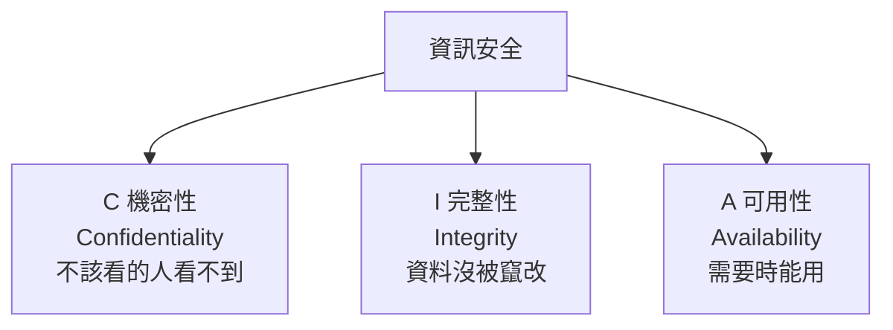

# 資安基本原則與實踐

> [!abstract] 這篇你會學到
> - 說明 **CIA 三要素**與它們在實際設定上的對應
> - 把**最小權限**落實到帳號、服務、檔案、網路
> - 理解**職責分離**的用意與在小型機關的變通做法
> - 掌握**十個核心資安原則**，作為所有決策的判斷基準
> - 用這些原則**檢視你現有的設定**（附檢查腳本）
> - 知道**「安全」與「可用」衝突時該怎麼權衡**

> [!note] 這一篇是整章的基礎
> 後面 11 篇講的是各種制度與規範，
> **但它們背後的邏輯都來自這一篇的原則**。
>
> 遇到規範沒寫到的情況時，**回到原則去判斷**。

## 前置知識

- [[010-01-18-guide-計概-資訊安全初步]] — 資安的入門概念
- [[090-05-01-guide-資安設備-資安全景圖與縱深防禦]] — 防護設備的全景

---

## 觀念說明

### CIA 三要素



| 要素 | 意義 | 被破壞的例子 | 對應的技術措施 |
| --- | --- | --- | --- |
| **機密性** | 只有被授權的人能存取 | 個資外洩、機密文件被看 | 存取控制、**加密**、最小權限 |
| **完整性** | 資料正確且未被竄改 | 網頁被置換、資料被改、假公文 | **雜湊驗證**、數位簽章、版本控制、稽核軌跡 |
| **可用性** | 需要時服務能用 | DDoS、勒索病毒、硬體故障 | **備份**、備援、DDoS 防護、容量規劃 |

> [!warning] 可用性最常被忽略，但常常最重要
> 很多人講資安只想到「不要外洩」，
> **但對機關來說，「服務停擺」往往是更立即的傷害**：
> - 民眾洽公系統當機
> - 報稅、繳費在期限內無法使用
> - 公文系統中斷影響所有業務
>
> **可用性也是資安的一部分**，
> 所以備份、備援、容量規劃都是資安工作。

> [!tip] 三者常常互相衝突
> | 措施 | C | I | A |
> | --- | --- | --- | --- |
> | 加密所有資料 | ⬆️ | — | **⬇️**（金鑰遺失就拿不回來） |
> | 嚴格的存取控制 | ⬆️ | ⬆️ | **⬇️**（緊急時可能卡住） |
> | 開放的權限 | ⬇️ | ⬇️ | ⬆️ |
> | 頻繁的備份 | **⬇️**（副本變多） | — | ⬆️ |
> | 多重備援 | ⬇️ | — | ⬆️ |
>
> **資安工作的本質是「權衡」，不是「把所有東西鎖死」。**

### 擴充：CIA + 三個

| 要素 | 意義 |
| --- | --- |
| **鑑別性（Authenticity）** | **確認對方真的是他宣稱的人** |
| **不可否認性（Non-repudiation）** | **做過的事不能事後否認**（數位簽章、稽核日誌） |
| **可歸責性（Accountability）** | **每個動作都能追溯到特定的人** |

> [!tip] 「可歸責性」是機關最需要的
> **共用帳號（`admin`、`root`）最大的問題不是安全性，
> 是「出事時查不出是誰做的」。**
>
> 稽核與事件調查都需要能回答：
> **「這個動作是誰在什麼時候做的？」**
>
> 這就是為什麼**每個人都要有自己的具名帳號**。

---

## 十個核心原則

### ① 最小權限（Least Privilege）

> [!note] 只給「完成工作所需的最小權限」，且只給「需要的期間」

| 面向 | 錯誤做法 | 正確做法 |
| --- | --- | --- |
| **使用者** | 大家都是本機管理員 | 一般使用者權限；需要時才提權 |
| **管理員** | 永久是 Domain Admin | **JIT 即時特權**（用完自動收回） |
| **服務帳號** | 用 root 或 Administrator 跑 | **專屬帳號 + 最小權限** |
| **資料庫** | 應用程式用 root 連線 | 只給該資料庫的必要權限 |
| **檔案** | `chmod 777` | `640` / `750`，用群組控制 |
| **網路** | 全部互通 | **預設拒絕，明確允許** |
| **API 金鑰** | 全權限的金鑰 | 依用途分開，限定範圍 |

```bash
# ===== 檢查違反最小權限的設定 =====

# 1. UID 0 的帳號（應該只有 root）
$ awk -F: '$3==0 {print "⚠ UID 0: " $1}' /etc/passwd

# 2. sudo 的 NOPASSWD 設定
$ sudo grep -rn NOPASSWD /etc/sudoers /etc/sudoers.d/ 2>/dev/null

# 3. 全世界可寫的檔案（非常危險）
$ find / -xdev -type f -perm -0002 -not -path '/proc/*' 2>/dev/null | head -20

# 4. 全世界可寫的目錄且沒有 sticky bit
$ find / -xdev -type d -perm -0002 ! -perm -1000 2>/dev/null

# 5. SUID/SGID 程式（每一個都是潛在的提權路徑）
$ find / -xdev \( -perm -4000 -o -perm -2000 \) -type f 2>/dev/null

# 6. 用 root 執行的服務
$ ps -eo user,comm --no-headers | awk '$1=="root"' | sort -u | head -20
```

> [!warning] SUID 程式是常見的提權路徑
> SUID 讓程式**以檔案擁有者的身分執行**。
> 如果一個 SUID root 的程式有弱點，**任何人都能藉此取得 root**。
>
> **檢查你的系統上有哪些 SUID 程式，
> 移除不需要的**：
> ```bash
> $ sudo chmod u-s /path/to/unnecessary-binary
> ```
> 常見可以移除的：`/usr/bin/at`、`/usr/bin/wall`、
> `/usr/bin/chsh`、`/usr/bin/chfn`（視環境需求）。

### ② 縱深防禦（Defense in Depth）

> [!tip] 不要把所有希望寄託在單一防護上
> ```
> 邊界防火牆 → 網段隔離 → 主機防火牆 → 系統加固
> → 應用權限 → 資料加密 → 備份
> ```
>
> **假設每一層都可能失效**，
> 所以要有下一層。
>
> 見 [[090-05-01-guide-資安設備-資安全景圖與縱深防禦]]。

### ③ 職責分離（Separation of Duties）

> [!note] 一個人不應該能單獨完成「敏感的完整流程」

| 流程 | 應該分開 |
| --- | --- |
| **採購** | 請購 ≠ 核准 ≠ 驗收 ≠ 付款 |
| **系統變更** | 開發 ≠ 審核 ≠ 上線 |
| **權限管理** | 申請 ≠ 核准 ≠ 執行 |
| **稽核** | **被稽核者 ≠ 稽核者** |
| **日誌** | **系統管理員不應能刪改自己的操作日誌** |

> [!warning] 小型機關做不到完整的職責分離
> **只有兩三個資訊人員的機關，一個人什麼都要做。**
>
> **補償控制措施**：
> | 做不到 | 補償方式 |
> | --- | --- |
> | 找不到第二人核准 | **由「業務主管」核准**（不用懂技術，但要知情） |
> | 一個人操作 | **完整記錄操作日誌，送到他改不了的地方** |
> | 沒有獨立稽核 | **定期由外部或上級機關稽核** |
> | 一個人有所有權限 | **重大操作要有雙人在場並簽核** |
>
> **關鍵是「留下記錄」與「有人事後檢視」。**

### ④ 預設安全（Secure by Default）

> [!danger] 預設值通常是「方便」而不是「安全」
> **必須主動關閉的常見預設值**：
> ```
> □ 預設密碼（admin/admin）
> □ 預設帳號（Guest、預設的管理員帳號名稱）
> □ 不需要的服務與埠
> □ 目錄瀏覽（Directory Listing）
> □ 版本資訊揭露（Server header、錯誤頁面）
> □ 除錯模式
> □ SNMP 的 public/private community
> □ 路由器的 UPnP
> □ 資料庫的遠端 root 登入
> □ Office 巨集
> ```

```bash
# ===== 找出不需要的服務 =====
$ systemctl list-unit-files --state=enabled --type=service

# ===== 看看有哪些埠在監聽 =====
$ sudo ss -tlnp
State  Recv-Q Send-Q Local Address:Port  Process
LISTEN 0      4096   0.0.0.0:22          users:(("sshd",pid=1,fd=3))
LISTEN 0      511    0.0.0.0:80          users:(("nginx",pid=2,fd=6))
LISTEN 0      70     127.0.0.1:33060     users:(("mysqld",pid=3,fd=21))
LISTEN 0      151    0.0.0.0:3306        users:(("mysqld",pid=3,fd=23))
                     ↑ ⚠ MySQL 監聽在所有介面上！應該只綁 127.0.0.1

# 對每一個問：「這個服務真的需要對外開放嗎？」
```

> [!tip] 「綁定 127.0.0.1」是最簡單的加固
> 只有本機使用的服務（資料庫、快取、管理介面），
> **一律綁在 `127.0.0.1`**：
> ```ini
> # MySQL: /etc/mysql/mysql.conf.d/mysqld.cnf
> bind-address = 127.0.0.1
>
> # Redis: /etc/redis/redis.conf
> bind 127.0.0.1
> protected-mode yes
>
> # PostgreSQL: postgresql.conf
> listen_addresses = 'localhost'
> ```
>
> **這一行設定，就擋掉了整個網際網路。**

### ⑤ 減少攻擊面（Attack Surface Reduction）

> [!tip] 沒安裝的東西不會有弱點
> ```
> 攻擊面 = 所有「外部能接觸到」的入口總和
>        = 開放的埠 + 執行中的服務 + 安裝的套件
>        + 對外的 API + 使用者輸入點 + 開放的帳號
> ```
>
> **減少攻擊面的具體做法**：
> - **移除不用的套件**（不是停用，是移除）
> - **關閉不用的服務**
> - **關閉不用的網路孔**
> - **移除不用的帳號**
> - **停用不用的功能**（Office 巨集、瀏覽器外掛）
> - **使用最小化的作業系統安裝**（Minimal Install）
> - **容器用最小化的基底映像**（distroless、alpine）

```bash
# ===== 找出可以移除的套件 =====
# 手動安裝但沒有被相依的套件
$ apt list --installed 2>/dev/null | wc -l
$ sudo apt autoremove --purge

# 檢查有沒有裝了不該有的東西
$ dpkg -l | grep -E 'telnet|rsh|ftp|tftp|talk|finger'
```

### ⑥ 失效安全（Fail Securely）

> [!note] 出錯時應該「拒絕」而不是「放行」
> ```python
> # ❌ 錯誤：出錯時放行
> def check_permission(user, resource):
>     try:
>         return db.query(...)
>     except:
>         return True        # ← 資料庫掛了就全部放行！
>
> # ✅ 正確：出錯時拒絕
> def check_permission(user, resource):
>     try:
>         return db.query(...)
>     except Exception as e:
>         log.error(f"權限檢查失敗: {e}")
>         return False       # ← 拒絕，並記錄
> ```

> [!warning] 但「可用性優先」的場景要例外
> | 情境 | 該怎麼失效 |
> | --- | --- |
> | 權限檢查 | **Fail-closed**（拒絕） |
> | WAF | 通常 Fail-open（不然網站全掛） |
> | 防火牆 | **Fail-closed** |
> | NAC | **Critical VLAN**（放行，但告警） |
> | **消防逃生門禁** | **Fail-safe（開啟）** ← 人身安全優先 |
>
> **沒有標準答案，要依「失效的後果」決定。**
> 但無論選哪個，**都必須是「刻意的決定」並記錄下來**，
> 不能是「沒想過」。

### ⑦ 完整仲裁（Complete Mediation）

> [!danger] 每一次存取都要檢查，不能只檢查一次
> **常見的漏洞**：
> ```
> ① 使用者登入 → 檢查權限 → 通過
> ② 之後的所有操作都不再檢查    ← ⚠ 問題
> ```
>
> **典型的攻擊（IDOR / 越權存取）**：
> ```
> GET /api/documents/1001    ← 我的文件，有權限
> GET /api/documents/1002    ← 別人的文件，【但系統沒再檢查】
> ```
>
> **正確做法：每一次請求都驗證「這個使用者對這個資源有權限嗎」。**
>
> 這也是零信任的核心原則（見 [[090-05-12-guide-資安設備-零信任架構與微分段]]）。

### ⑧ 開放式設計（Open Design）

> [!tip] 安全性不應該依賴「演算法保密」
> **Kerckhoffs 原則**：
> **系統的安全性應該只依賴「金鑰的保密」，
> 而不是「設計的保密」。**
>
> ❌ **不安全的思維**（Security by Obscurity）：
> - 「我們的加密演算法是自己寫的，沒人知道」
> - 「管理介面改到 8443 埠就沒人找得到」
> - 「網址沒有連結，別人不會知道」
>
> **為什麼錯**：
> - 自製的加密演算法**幾乎一定有漏洞**
> - 掃描全網際網路只要幾小時
> - 網址會出現在 Referer、CT log、瀏覽記錄、搜尋引擎
>
> **但「隱藏」可以作為「額外的一層」**：
> - 改 SSH 埠**能減少 99% 的自動化掃描**（減少日誌雜訊）
> - 但**不能取代**金鑰認證與防火牆
>
> **原則：隱藏可以加分，但不能當作唯一的防護。**

### ⑨ 心理可接受性（Psychological Acceptability）

> [!danger] 太麻煩的安全措施，使用者一定會繞過
> **真實會發生的**：
> | 過度嚴格的措施 | 使用者的反應 |
> | --- | --- |
> | 密碼要 20 字元且每月換 | **寫在便條紙貼在螢幕上** |
> | 檔案不能用 USB 帶出 | **上傳到個人 Gmail** |
> | 內網不能上網 | **用手機熱點** |
> | 申請權限要三天 | **借同事的帳號** |
> | VPN 很慢 | **請廠商開後門** |
>
> **結果：安全性反而更差。**

> [!tip] 讓「安全的做法」成為「最方便的做法」
> | 需求 | 讓它變方便 |
> | --- | --- |
> | 強密碼 | **提供密碼管理器**（機關統一採購） |
> | 傳檔案 | **提供好用的內部檔案傳輸服務** |
> | 遠端存取 | **VPN/ZTNA 要快、要穩、要無感** |
> | 申請權限 | **線上申請，一天內核准** |
> | MFA | **用推播或 FIDO2**（比輸入驗證碼快） |
> | SSO | **登入一次就好**（比記十組密碼方便） |
>
> **如果安全的路比較好走，大家就會走安全的路。**

### ⑩ 假設會被入侵（Assume Breach）

> [!note] 不要問「會不會被入侵」，要問「被入侵後會怎樣」
> **要能回答的問題**：
> - 一台終端被入侵 → **他能碰到哪些機器？**
> - 一個帳號被盜 → **他能存取哪些資料？**
> - **我們多久會發現？**
> - **我們有能力調查嗎？**（有日誌嗎？）
> - **我們能還原嗎？**（有備份嗎？演練過嗎？）
>
> 見 [[090-05-12-guide-資安設備-零信任架構與微分段]] 與 [[090-07-04-guide-資安實踐-資安事件應變流程]]。

---

## 完整實戰範例

### 用原則檢視一台 Linux 主機

```bash
#!/usr/bin/env bash
# 資安基本原則自我檢查
set -uo pipefail
PASS=0; FAIL=0
chk() { if eval "$2" >/dev/null 2>&1; then echo "  ✓ $1"; PASS=$((PASS+1));
        else echo "  ✗ $1"; FAIL=$((FAIL+1)); fi; }

echo "════════════════════════════════════════"
echo " 資安基本原則檢查 — $(hostname) $(date '+%F')"
echo "════════════════════════════════════════"

echo -e "\n【最小權限】"
chk "只有一個 UID 0 帳號" \
    "[ \$(awk -F: '\$3==0' /etc/passwd | wc -l) -eq 1 ]"
chk "沒有空密碼帳號" \
    "! sudo awk -F: '\$2==\"\"' /etc/shadow | grep -q ."
chk "sudoers 沒有 NOPASSWD ALL" \
    "! sudo grep -rq 'NOPASSWD:\s*ALL' /etc/sudoers /etc/sudoers.d/ 2>/dev/null"
chk "沒有全世界可寫的檔案（/etc 下）" \
    "[ \$(find /etc -type f -perm -0002 2>/dev/null | wc -l) -eq 0 ]"
echo "  ℹ SUID 程式數量：$(find / -xdev -perm -4000 -type f 2>/dev/null | wc -l)"

echo -e "\n【預設安全】"
chk "SSH 禁止 root 登入" \
    "sshd -T 2>/dev/null | grep -q '^permitrootlogin no'"
chk "SSH 禁止密碼認證" \
    "sshd -T 2>/dev/null | grep -q '^passwordauthentication no'"
chk "SSH 禁止空密碼" \
    "sshd -T 2>/dev/null | grep -q '^permitemptypasswords no'"

echo -e "\n【減少攻擊面】"
echo "  ℹ 監聽中的埠："
sudo ss -tlnH 2>/dev/null | awk '{print "     " $4}' | sort -u
echo "  ℹ 啟用的服務數：$(systemctl list-unit-files --state=enabled --type=service --no-legend 2>/dev/null | wc -l)"
chk "沒有安裝 telnet/rsh/ftp 伺服器" \
    "! dpkg -l 2>/dev/null | grep -qE '^ii\s+(telnetd|rsh-server|vsftpd|tftpd)'"

echo -e "\n【失效安全】"
chk "防火牆預設政策為拒絕" \
    "sudo nft list ruleset 2>/dev/null | grep -q 'hook input.*policy drop' || \
     sudo ufw status verbose 2>/dev/null | grep -q 'deny (incoming)'"

echo -e "\n【可歸責性】"
chk "auditd 正在執行" "systemctl is-active --quiet auditd"
chk "日誌有轉送到遠端" \
    "grep -rq '^\*\.\*\s*@' /etc/rsyslog.conf /etc/rsyslog.d/ 2>/dev/null"
chk "NTP 時間已同步" \
    "timedatectl show -p NTPSynchronized --value 2>/dev/null | grep -q yes"

echo -e "\n【可用性】"
chk "根目錄使用率低於 85%" \
    "[ \$(df / | awk 'NR==2{print int(\$5)}') -lt 85 ]"
chk "沒有 failed 的 systemd 服務" \
    "[ \$(systemctl --failed --no-legend 2>/dev/null | wc -l) -eq 0 ]"

echo -e "\n【完整性】"
chk "有安裝檔案完整性監控工具" \
    "command -v aide || command -v tripwire || systemctl is-active --quiet wazuh-agent"

echo -e "\n════════════════════════════════════════"
echo " 通過：$PASS   未通過：$FAIL"
echo "════════════════════════════════════════"
```

**執行範例**：
```bash
$ sudo bash principles-check.sh
════════════════════════════════════════
 資安基本原則檢查 — web01 2026-08-28
════════════════════════════════════════

【最小權限】
  ✓ 只有一個 UID 0 帳號
  ✓ 沒有空密碼帳號
  ✗ sudoers 沒有 NOPASSWD ALL       ← 要處理
  ✓ 沒有全世界可寫的檔案（/etc 下）
  ℹ SUID 程式數量：24
...
════════════════════════════════════════
 通過：11   未通過：4
════════════════════════════════════════
```

### 最小權限的實際落實

```bash
# ========== 服務帳號的正確設定 ==========
# 建立一個「不能登入、沒有家目錄」的服務帳號
$ sudo useradd --system --no-create-home \
    --shell /usr/sbin/nologin \
    --comment "MyApp service account" myapp

$ grep myapp /etc/passwd
myapp:x:998:998:MyApp service account:/nonexistent:/usr/sbin/nologin
```

```ini
# ========== systemd 的沙箱化（大幅降低風險）==========
# /etc/systemd/system/myapp.service
[Unit]
Description=MyApp
After=network.target

[Service]
Type=simple
User=myapp
Group=myapp
ExecStart=/opt/myapp/bin/server

# ===== 檔案系統隔離 =====
ProtectSystem=strict            # /usr /boot /etc 唯讀
ProtectHome=true                # 看不到 /home /root /run/user
PrivateTmp=true                 # 獨立的 /tmp
ReadWritePaths=/var/lib/myapp /var/log/myapp

# ===== 權限限制 =====
NoNewPrivileges=true            # ★ 禁止提權（連 SUID 也無效）
PrivateDevices=true             # 只給基本裝置節點
ProtectKernelTunables=true      # 不能改 /proc/sys
ProtectKernelModules=true       # 不能載入核心模組
ProtectControlGroups=true
ProtectClock=true
ProtectHostname=true
LockPersonality=true
RestrictRealtime=true
RestrictSUIDSGID=true
RemoveIPC=true

# ===== 能力（Capabilities）=====
CapabilityBoundingSet=          # 移除所有 capability
AmbientCapabilities=
# 若需要綁定 <1024 的埠：
# AmbientCapabilities=CAP_NET_BIND_SERVICE
# CapabilityBoundingSet=CAP_NET_BIND_SERVICE

# ===== 系統呼叫過濾 =====
SystemCallFilter=@system-service
SystemCallErrorNumber=EPERM
SystemCallArchitectures=native

# ===== 網路限制 =====
RestrictAddressFamilies=AF_INET AF_INET6 AF_UNIX
IPAddressDeny=any
IPAddressAllow=localhost 10.0.0.0/8    # 只允許連內網

# ===== 資源限制（防止單一服務拖垮整台機器）=====
MemoryMax=2G
CPUQuota=200%
TasksMax=512
LimitNOFILE=4096

[Install]
WantedBy=multi-user.target
```

```bash
# ===== 檢查沙箱化的效果（分數越低越安全）=====
$ systemd-analyze security myapp.service
NAME                      DESCRIPTION                    EXPOSURE
✗ PrivateNetwork=         Service has access to network       0.5
✓ User=/DynamicUser=      Service runs under a static user
✓ CapabilityBoundingSet=  Service has no capabilities
...
→ Overall exposure level for myapp.service: 1.8 OK 🙂

# 對照：沒有任何加固的服務通常是 9.x UNSAFE 😨
```

> [!tip] `systemd-analyze security` 是很好用的工具
> 它會列出每一個沒有設定的加固選項，
> **照著把分數壓低，就是在落實最小權限**。
>
> ```bash
> # 檢查所有服務
> $ systemd-analyze security
> ```

### 檔案權限的最小權限

```bash
# ===== 網站目錄的正確權限 =====
# 原則：Web 伺服器只需要「讀」，不需要「寫」
$ sudo chown -R deploy:www-data /var/www/myapp
$ sudo find /var/www/myapp -type d -exec chmod 750 {} \;
$ sudo find /var/www/myapp -type f -exec chmod 640 {} \;

# 只有需要寫入的目錄才給寫權限
$ sudo chown -R www-data:www-data /var/www/myapp/storage
$ sudo chmod -R 770 /var/www/myapp/storage

# ===== 設定檔（含密碼）=====
$ sudo chown root:myapp /etc/myapp/config.yml
$ sudo chmod 640 /etc/myapp/config.yml
# root 可讀寫、myapp 群組可讀、其他人完全看不到

# ===== 私鑰 =====
$ sudo chmod 400 /etc/ssl/private/server.key
$ sudo chown root:root /etc/ssl/private/server.key
$ sudo chmod 700 /etc/ssl/private

# ===== 檢查敏感檔案的權限 =====
$ ls -l /etc/shadow /etc/gshadow /etc/ssh/ssh_host_*_key
-rw-r----- 1 root shadow  1234 Aug 28 10:00 /etc/shadow
-rw------- 1 root root     432 Aug 28 10:00 /etc/ssh/ssh_host_ed25519_key
```

> [!danger] `chmod 777` 永遠是錯的
> **沒有任何合理的情況需要 777。**
>
> 如果你想用 777 解決權限問題，
> **正確的解法通常是「調整擁有者或群組」**：
> ```bash
> # ❌ 不要這樣
> $ chmod 777 /var/www/uploads
>
> # ✅ 應該這樣
> $ chown www-data:www-data /var/www/uploads
> $ chmod 750 /var/www/uploads
> ```

---

## 常見錯誤與排錯

| 現象／錯誤 | 原因 | 解法 |
| --- | --- | --- |
| **出事查不出是誰做的** | **共用帳號**（root、admin） | 每人**具名帳號**；sudo 記錄；日誌送遠端 |
| 服務被入侵後整台機器淪陷 | 服務用 root 執行 | **專屬服務帳號 + systemd 沙箱化** |
| 一個帳號被盜就存取所有資料 | 權限過大 | **最小權限**；定期權限盤點 |
| 資料庫被從網際網路直接連上 | **綁定在 0.0.0.0** | `bind-address = 127.0.0.1` |
| 使用者把密碼寫在便條紙上 | **密碼政策太嚴苛** | 長度優先、不強制定期換、**提供密碼管理器** |
| 使用者用個人雲端傳檔案 | **內部沒有好用的替代方案** | 提供方便的內部檔案傳輸服務 |
| 權限檢查掛掉後全部放行 | **Fail-open 的程式邏輯** | 例外處理要 **return False** 並記錄 |
| 改了 URL 就看到別人的資料 | **只在登入時檢查一次** | **每次請求都驗證資源擁有權**（完整仲裁） |
| 「改埠號就安全了」 | **Security by Obscurity** | 隱藏只是加分，不能取代真正的防護 |
| SUID 程式被用來提權 | 不必要的 SUID | 盤點並移除不需要的 SUID 位元 |
| 小型機關無法職責分離 | 人力不足 | **補償控制**：業務主管核准 + 完整日誌 + 外部稽核 |
| 加密後金鑰遺失，資料拿不回來 | **只顧機密性犧牲可用性** | 金鑰要有備份與託管機制 |
| 安全措施上線後大家想辦法繞過 | **心理可接受性太低** | **讓安全的做法成為最方便的做法** |

---

## 安全性注意事項

> [!danger] 資安工作的本質是「權衡」，不是「把所有東西鎖死」
> 一個「完全安全」的系統是：
> **拔掉網路線、關機、鎖進保險櫃** ——
> 但那樣它就沒有任何價值了。
>
> **每一個資安決策都是在 C、I、A 之間取捨**，
> 而**取捨的依據是「風險」**：
> ```
> 風險 = 威脅發生的可能性 × 影響的嚴重程度
> ```
>
> **要問的問題**：
> - 這個資產值多少？
> - 什麼樣的攻擊者會想要它？
> - 我們願意花多少成本保護它？
> - **剩餘的風險，我們能接受嗎？**

> [!warning] 沒有「絕對安全」，只有「可接受的風險」
> **要避免的兩種極端**：
>
> **一、資安虛無主義**
> 「反正一定會被駭，做什麼都沒用」
> → **錯**。防護能大幅提高攻擊成本，讓多數攻擊者放棄。
>
> **二、資安完美主義**
> 「一定要做到 100% 安全才能上線」
> → **錯**。永遠達不到，只會讓業務停擺。
>
> **正確的態度**：
> - 把風險降到**可接受的程度**
> - **明確記錄「剩餘風險」並由適當層級核准**
> - 持續改善

> [!tip] 原則衝突時的判斷順序（建議）
> 遇到規範沒寫、原則互相衝突時：
> ```
> ① 人身安全（Safety）        ← 永遠第一
> ② 法律要求（法規、契約）
> ③ 可用性（服務不能停）      ← 對機關特別重要
> ④ 機密性與完整性
> ⑤ 便利性
> ```
>
> **但這個順序不是絕對的** ——
> 處理個資的系統，機密性可能要排到可用性前面。
>
> **重點是：這個順序應該事先討論好並寫進政策**
> （見 [[090-07-10-guide-資安實踐-資安政策文件與制度]]），
> 而不是每次出事才臨時決定。

> [!danger] 最容易被忽略的原則：可歸責性
> **機關最常見的問題**：
> - 大家共用 `administrator` 密碼
> - 廠商用同一組帳號
> - 系統管理員能刪自己的操作日誌
>
> **後果**：
> - 事件調查**查不出是誰**
> - **稽核直接不通過**
> - 出事時**無法究責**，也**無法證明「不是我做的」** ← 這對員工其實是保護
>
> **落實可歸責性**：
> 1. **每人具名帳號**
> 2. **所有特權操作記錄**（sudo、管理介面登入、設定變更）
> 3. **日誌送到操作者改不了的地方**
> 4. **時間同步**（否則時間軸對不起來）

---

## 速查表

### CIA + 3

| 要素 | 意義 | 主要措施 |
| --- | --- | --- |
| **C** 機密性 | 不該看的看不到 | 存取控制、加密 |
| **I** 完整性 | 沒被竄改 | 雜湊、簽章、稽核軌跡 |
| **A** 可用性 | **需要時能用** | **備份**、備援、DDoS 防護 |
| 鑑別性 | 確認是本人 | MFA、憑證 |
| 不可否認性 | 不能事後否認 | 數位簽章、日誌 |
| **可歸責性** | **能追溯到人** | **具名帳號 + 日誌** |

### 十個核心原則

```
① 最小權限        只給剛好夠用的權限與時間
② 縱深防禦        假設每一層都會失效
③ 職責分離        一個人不能單獨完成敏感流程
④ 預設安全        預設值通常是「方便」不是「安全」
⑤ 減少攻擊面      沒安裝的東西不會有弱點
⑥ 失效安全        出錯時拒絕（但要看後果決定）
⑦ 完整仲裁        每一次存取都檢查，不是只檢查一次
⑧ 開放式設計      不依賴「保密設計」（隱藏只能加分）
⑨ 心理可接受性    太麻煩一定會被繞過
⑩ 假設會被入侵    問「被入侵後會怎樣」
```

### 最小權限檢查

```bash
awk -F: '$3==0' /etc/passwd                    # UID 0 帳號
sudo grep -rn NOPASSWD /etc/sudoers*           # NOPASSWD
find / -xdev -perm -4000 -type f 2>/dev/null   # SUID
find / -xdev -type f -perm -0002 2>/dev/null   # 全世界可寫
sudo ss -tlnp                                  # 監聽的埠
```

### 預設安全必關項目

```
□ 預設密碼          □ 預設帳號（Guest）
□ 不需要的服務      □ 目錄瀏覽
□ 版本資訊揭露      □ 除錯模式
□ SNMP public       □ UPnP
□ DB 遠端 root      □ Office 巨集
```

### 綁定 127.0.0.1（最簡單的加固）

```ini
MySQL:      bind-address = 127.0.0.1
Redis:      bind 127.0.0.1 / protected-mode yes
PostgreSQL: listen_addresses = 'localhost'
```

### systemd 沙箱化重點

```ini
User=myapp                 NoNewPrivileges=true      ★
ProtectSystem=strict       ProtectHome=true
PrivateTmp=true            PrivateDevices=true
CapabilityBoundingSet=     SystemCallFilter=@system-service
MemoryMax=2G               ReadWritePaths=/var/lib/myapp

# 檢查：systemd-analyze security <service>
```

### 檔案權限

| 對象 | 權限 |
| --- | --- |
| 網站檔案 | `640`（目錄 `750`） |
| 需寫入的目錄 | `770` + 擁有者是 www-data |
| 設定檔（含密碼） | `640` root:group |
| **私鑰** | **`400`** root:root |
| **任何情況** | **絕不用 `777`** |

### 小型機關的職責分離補償

```
找不到第二人核准  → 由【業務主管】核准
一個人操作        → 完整日誌送到他改不了的地方
沒有獨立稽核      → 定期由外部/上級稽核
一人有所有權限    → 重大操作雙人在場並簽核
```

### 衝突時的判斷順序

```
① 人身安全  ② 法律要求  ③ 可用性  ④ 機密性/完整性  ⑤ 便利性
（順序應事先討論並寫進政策，不要臨時決定）
```

---

## 練習題

> [!question]- 練習 1：用原則檢視一台主機
> 對一台你管理的伺服器執行本篇的檢查腳本，然後：
> 1. 有幾項沒通過？
> 2. **每一項沒通過的，對應到哪個原則？**
> 3. 修正其中最容易的三項
> 4. 對「不容易修正」的，寫下**為什麼**（可能有業務理由）
>    以及**補償控制措施**是什麼
>
> 第 4 題就是「風險接受」的雛形，也是稽核會問的。

> [!question]- 練習 2：找出違反最小權限的地方
> 在你的環境中找出：
> 1. **有幾個服務是用 root 執行的？**（`ps -eo user,comm`）
> 2. 其中**有幾個真的需要 root？**
> 3. 挑一個不需要 root 的，**用 systemd 沙箱化改造它**
> 4. 用 `systemd-analyze security` 看改造前後的分數差異
> 5. **有幾個資料庫或快取服務綁在 0.0.0.0？**

> [!question]- 練習 3：心理可接受性檢視
> 訪談三位不同單位的同仁，問他們：
> 1. **「哪一個資安規定讓你覺得最麻煩？」**
> 2. **「你或同事有沒有想辦法繞過它？怎麼繞的？」**
>    （強調不會究責，只是想改善）
> 3. **「如果可以改，你希望怎麼改？」**
>
> 然後思考：
> - 那個規定的**原始目的**是什麼？
> - **有沒有「同樣安全但更方便」的做法？**
> - 如果沒有，**要怎麼溝通才能讓人願意配合？**

---

## 小測驗

Q1. CIA 三要素各是什麼？**為什麼說「可用性也是資安的一部分」**？

Q2. 舉出三個例子說明 **CIA 三者會互相衝突**。這對資安工作的本質意味著什麼？

Q3. 除了 CIA，還有哪三個要素？**其中哪一個是機關最需要、也最常缺的**，為什麼？

Q4. 最小權限在「使用者、服務帳號、資料庫、網路、檔案」五個面向各該怎麼落實？

Q5. **小型機關做不到職責分離時，有哪四種補償控制措施**？關鍵是什麼？

Q6. **「失效安全」是不是永遠都該 Fail-closed**？舉三個不同的例子說明。

Q7. 什麼是「完整仲裁」？不遵守它會產生什麼典型漏洞？

Q8. **什麼是 Security by Obscurity？為什麼它不能當作唯一防護，但又為什麼「改 SSH 埠」仍然有價值**？

Q9. **「心理可接受性」原則說什麼**？舉三個「過度嚴格反而降低安全」的真實例子。

Q10. 為什麼說「沒有絕對安全，只有可接受的風險」？要避免的兩種極端態度是什麼？

> [!question]- 測驗答案
> **Q1.** **C 機密性**（只有被授權的人能存取）、
> **I 完整性**（資料正確且未被竄改）、
> **A 可用性**（需要時服務能用）。
> **可用性也是資安的一部分**，因為對機關來說
> **「服務停擺」往往是更立即的傷害** ——
> 民眾洽公系統當機、報稅繳費在期限內無法使用、公文系統中斷。
> 所以**備份、備援、容量規劃、DDoS 防護都是資安工作**。
>
> **Q2.** ①**加密所有資料**：機密性上升，但**可用性下降**
> （金鑰遺失資料就永遠拿不回來）；
> ②**嚴格的存取控制**：機密性與完整性上升，但**可用性下降**
> （緊急時可能卡住）；
> ③**頻繁備份／多重備援**：可用性上升，但**機密性下降**（副本變多）。
> 這意味著**資安工作的本質是「權衡」，不是「把所有東西鎖死」** ——
> 一個完全安全的系統（拔網路線、關機、鎖進保險櫃）沒有任何價值。
>
> **Q3.** **鑑別性**（確認對方真的是他宣稱的人）、
> **不可否認性**（做過的事不能事後否認）、
> **可歸責性**（每個動作都能追溯到特定的人）。
> **機關最需要也最常缺的是「可歸責性」** ——
> 因為大家共用 `administrator`／`root` 密碼，
> 出事時**查不出是誰做的**，稽核直接不通過，
> 而且無法究責、也無法讓員工證明「不是我做的」。
> 這就是為什麼每個人都要有自己的具名帳號。
>
> **Q4.** **使用者**：不是本機管理員，一般權限，需要時才提權；
> **服務帳號**：專屬帳號（`--system --no-create-home --shell nologin`）
> 而非用 root 執行，並用 systemd 沙箱化；
> **資料庫**：應用程式不用 root 連線，只給該資料庫的必要權限；
> **網路**：**預設拒絕，明確允許**（含出向管控）；
> **檔案**：`640`／`750` 用群組控制，**絕不用 777**，私鑰用 `400`。
>
> **Q5.** ①**找不到第二人核准 → 由「業務主管」核准**
> （不用懂技術，但要知情）；
> ②**一個人操作 → 完整記錄操作日誌，送到他改不了的地方**；
> ③**沒有獨立稽核 → 定期由外部或上級機關稽核**；
> ④**一個人有所有權限 → 重大操作要有雙人在場並簽核**。
> **關鍵是「留下記錄」與「有人事後檢視」** ——
> 既然無法在事前分權，就要確保事後查得到、有人會查。
>
> **Q6.** **不是**，要依「失效的後果」決定。
> ①**權限檢查 → Fail-closed**（出錯就拒絕，否則資料庫掛掉等於全部放行）；
> ②**WAF → 通常 Fail-open**（不然 WAF 一掛整個網站都不能用）；
> ③**消防逃生門禁 → Fail-safe（斷電開啟）** —— 人身安全優先，這是法規要求。
> （另可舉 NAC 的 Critical VLAN：RADIUS 掛掉時放行但告警。）
> **無論選哪個，都必須是「刻意的決定」並記錄下來**，不能是「沒想過」。
>
> **Q7.** 「完整仲裁」是指**每一次存取都要檢查權限，不能只在登入時檢查一次**。
> 不遵守會產生 **IDOR／越權存取**漏洞：
> ```
> GET /api/documents/1001   ← 我的文件，有權限
> GET /api/documents/1002   ← 別人的文件，但系統沒再檢查 → 看得到
> ```
> 正確做法是**每一次請求都驗證「這個使用者對這個資源有權限嗎」**。
> 這也是零信任的核心原則。
>
> **Q8.** **Security by Obscurity** 是「把安全性寄託在『設計或位置的保密』上」
> （自製加密演算法、把管理介面改到冷門埠、網址沒有連結別人就不知道）。
> **不能當唯一防護**，因為自製加密演算法幾乎一定有漏洞、
> 掃描全網際網路只要幾小時、
> 網址會出現在 Referer／CT log／瀏覽記錄／搜尋引擎。
> Kerckhoffs 原則說：**安全性應該只依賴「金鑰的保密」，而非「設計的保密」**。
> **但「改 SSH 埠」仍有價值**，因為它**能減少 99% 的自動化掃描**，
> 大幅降低日誌雜訊、讓真正的攻擊更容易被看見 ——
> **隱藏可以加分，但不能取代**金鑰認證與防火牆。
>
> **Q9.** 「心理可接受性」說：**太麻煩的安全措施，使用者一定會繞過，
> 結果安全性反而更差**。
> 三個例子：①**密碼要 20 字元且每月換 → 寫在便條紙貼在螢幕上**；
> ②**檔案不能用 USB 帶出 → 上傳到個人 Gmail**；
> ③**申請權限要三天 → 借同事的帳號**
> （或：內網不能上網 → 用手機熱點；VPN 太慢 → 請廠商開後門）。
> 正解是**讓「安全的做法」成為「最方便的做法」** ——
> 提供密碼管理器、好用的內部檔案傳輸服務、快速的 VPN／ZTNA、
> 一天內核准的線上權限申請、用推播或 FIDO2 的 MFA、SSO。
>
> **Q10.** 因為安全性永遠是在 C、I、A 與成本之間取捨，
> 依據是**風險 = 威脅發生的可能性 × 影響的嚴重程度**，
> 目標是把風險降到**可接受的程度**，
> 並**明確記錄剩餘風險、由適當層級核准**。
> 要避免的兩種極端：
> ①**資安虛無主義**（「反正一定會被駭，做什麼都沒用」）——
> 錯，因為防護能大幅提高攻擊成本，讓多數攻擊者放棄；
> ②**資安完美主義**（「一定要 100% 安全才能上線」）——
> 錯，因為永遠達不到，只會讓業務停擺。

---

## 延伸閱讀

- [[090-05-01-guide-資安設備-資安全景圖與縱深防禦]] — 縱深防禦的完整架構
- [[090-07-02-guide-資安實踐-密碼與帳號管理實務]] — 最小權限與可歸責性的落實
- [[090-05-12-guide-資安設備-零信任架構與微分段]] — 完整仲裁與假設已被入侵
- [[090-07-06-guide-NIST-CSF與CIS-Controls]] — 把原則變成可檢核的清單
- [[090-07-10-guide-資安實踐-資安政策文件與制度]] — 把原則寫成政策
- [[090-02-08-guide-防護-系統強化與稽核]] — Linux 加固的具體做法
- [[090-03-02-guide-應用安全-應用層安全]] — 應用開發中的原則落實
