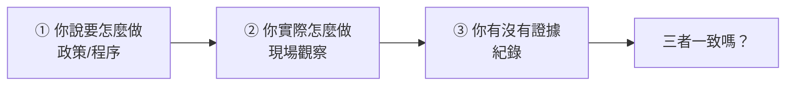

# 資安稽核與符合性檢核

> [!abstract] 這篇你會學到
> - 理解**「沒有紀錄 = 沒有做」**這句話的真正含義
> - 建立**日常運作自然產生證據**的機制（而不是事後補）
> - 學會**自行執行符合性檢核**（附自動化腳本）
> - 撰寫**站得住腳的例外與豁免理由**
> - 把**缺失轉成有追蹤的改善計畫**
> - 知道**稽核當天該怎麼應對**

> [!tip] 這一篇的核心觀念
> **好的制度是「做事的同時自然產生證據」，
> 不是「做完事再另外寫一份報告」。**
>
> 如果你每次稽核前都要花兩週補紀錄，
> **那不是稽核的問題，是制度設計的問題。**

## 前置知識

- [[090-07-05-guide-資安實踐-ISO27001與ISMS]] — 內部稽核與管理審查
- [[090-07-07-guide-資安實踐-台灣資安法規與個資法]] — 法遵要求
- [[090-07-06-guide-NIST-CSF與CIS-Controls]] — 檢核的基準

---

## 觀念說明

### 稽核到底在查什麼



> [!danger] 稽核的本質：驗證「說、做、記」三者一致
> ```
> 【說的】程序書寫「每月執行弱點掃描」
> 【做的】實際上三個月才掃一次
> 【記的】只有兩份報告
> → 【不符合】
> ```
>
> **三種常見的不一致**：
> | 情況 | 問題 | 稽核結果 |
> | --- | --- | --- |
> | 說了，沒做 | 制度沒落實 | **不符合** |
> | 做了，沒記 | **無法證明** | **不符合**（視同沒做） |
> | 做了，但跟說的不一樣 | 文件過時 | **不符合**（文件或做法要改） |
>
> **注意第二種** —— 這是技術人員最常踩的坑。
> **「我明明有做」在稽核中沒有意義，除非你拿得出證據。**

### 稽核的類型

| 類型 | 誰來查 | 目的 |
| --- | --- | --- |
| **第一方（內部稽核）** | **自己人**（但要有獨立性） | 自我改善、為外部稽核做準備 |
| **第二方** | **客戶或上級機關** | 確認供應商／下級機關符合要求 |
| **第三方（驗證稽核）** | **驗證機構**（如 ISO 驗證） | 取得證書 |
| **主管機關稽核** | 資安署、上級機關、審計 | 法遵查核 |

> [!tip] 內部稽核是「幫自己找問題」，不是「應付」
> **內部稽核的正確心態**：
> ```
> ❌「趕快查完，不要找到問題」
> ✅「【我要在外部稽核之前先找到所有問題】」
> ```
>
> **內部稽核找到 10 個問題 = 好事**
> （代表你的稽核有效，而且你有機會先改）
>
> **內部稽核找到 0 個問題，外部稽核找到 10 個 = 災難**
> （代表你的內部稽核是形式化的）

---

## 建立可稽核的證據

### 什麼樣的東西算「證據」

| 證據類型 | 例子 | 強度 |
| --- | --- | --- |
| **系統自動產生的紀錄** | 日誌、掃描報告、監控圖表 | **最強**（不易造假） |
| **有簽核的文件** | 申請單、核准單、會議紀錄 | 強 |
| **有時戳的紀錄** | 工單系統、版本控制的 commit | 強 |
| 截圖 | 設定畫面 | 中（**要有日期與可辨識的環境**） |
| 口頭說明 | 「我們有做」 | **最弱**（幾乎不算證據） |

> [!danger] 截圖的常見問題
> ```
> ❌ 截圖沒有日期 → 「這是什麼時候的？」
> ❌ 截圖看不出是哪台機器 → 「這是正式環境嗎？」
> ❌ 截圖是稽核前一天才截的 → 「那之前的呢？」
> ```
>
> **好的截圖應該包含**：
> - **系統時間**（畫面上看得到）
> - **主機名稱或環境識別**
> - **完整的畫面**（不要只截一小塊）
> - **檔名含日期**：`20260828-web01-防火牆設定.png`

### 讓證據「自然產生」

> [!tip] 這是本篇最重要的實務建議
> **設計制度時就要想：「這件事做完，會自動留下什麼？」**

| 工作 | ❌ 事後補紀錄 | ✅ 自然產生證據 |
| --- | --- | --- |
| **弱點掃描** | 掃完看一看就關掉 | **報告自動存檔到指定目錄，檔名含日期** |
| **修補** | 手動更新 | **自動更新的日誌 + 集中收集狀態** |
| **權限審查** | 每半年做一次表 | **系統自動產生清單 → 主管線上確認 → 存檔** |
| **備份** | 有跑就好 | **每次執行寫入日誌 + 失敗告警 + 月度演練報告** |
| **教育訓練** | 事後補簽到表 | **線上課程系統自動記錄完成時間與測驗分數** |
| **變更管理** | 做完再補單 | **工單系統：沒有單就不能動手** |
| **設定變更** | 直接改 | **設定檔進 git，每次變更都有 commit 紀錄** |
| **事件處理** | 口頭處理 | **所有異常都開工單，含時間軸** |

```bash
# ===== 範例：讓弱點掃描自動產生可稽核的證據 =====
#!/usr/bin/env bash
# /usr/local/sbin/monthly-vulnscan.sh
set -euo pipefail

DATE=$(date +%Y%m)
EVIDENCE_DIR="/srv/evidence/vulnscan/$DATE"    # ★ 集中的證據庫
mkdir -p "$EVIDENCE_DIR"

# 執行掃描，報告直接存到證據庫
nuclei -l /etc/scan-targets.txt \
       -severity critical,high,medium \
       -jsonl -o "$EVIDENCE_DIR/nuclei-$DATE.jsonl" \
       -stats

# 產生人類可讀的摘要（稽核員看這份）
{
  echo "═══════════════════════════════════════"
  echo " 月度弱點掃描報告"
  echo " 執行時間：$(date '+%F %T %z')"
  echo " 執行人：  ${SUDO_USER:-$USER}"
  echo " 主機：    $(hostname -f)"
  echo " 掃描範圍：$(wc -l < /etc/scan-targets.txt) 個標的"
  echo " 依據：    資通安全維護計畫 5.3 節 / ISO 27001 A.8.8"
  echo "═══════════════════════════════════════"
  echo ""
  echo "【發現統計】"
  for sev in critical high medium; do
    n=$(grep -c "\"severity\":\"$sev\"" "$EVIDENCE_DIR/nuclei-$DATE.jsonl" 2>/dev/null || echo 0)
    printf "  %-10s %s 項\n" "$sev" "$n"
  done
  echo ""
  echo "【後續處理】"
  echo "  已建立修補工單，追蹤於工單系統"
  echo "  P0/P1 項目修補時限依「弱點修補管理程序」PRO-007"
} | tee "$EVIDENCE_DIR/摘要-$DATE.txt"

# 計算雜湊（防止事後竄改的爭議）
sha256sum "$EVIDENCE_DIR"/* > "$EVIDENCE_DIR/SHA256SUMS"

echo "證據已存至：$EVIDENCE_DIR"
```

> [!tip] 建立集中的「證據庫」
> ```
> /srv/evidence/
> ├─ 弱點掃描/       202601/ 202602/ ...
> ├─ 修補紀錄/
> ├─ 權限審查/
> ├─ 備份演練/
> ├─ 教育訓練/
> ├─ 事件處理/
> ├─ 內部稽核/
> ├─ 管理審查/
> ├─ 演練紀錄/
> └─ 委外查核/
> ```
>
> **好處**：
> - 稽核時**直接把目錄開給稽核員看**
> - 不用四處翻找
> - **一眼看得出有沒有中斷**（哪個月沒有資料）
>
> **注意**：
> - 這個目錄要**備份**
> - 存取要**限制與記錄**（裡面可能有敏感資訊）
> - **保存期限要長於稽核週期**（建議至少 3 年）

### 常被要求但常常沒有的證據

> [!danger] 這幾項是稽核最常開缺失的
> ```
> □ 【權限審查的紀錄】—— 「你們說每半年審一次，證據呢？」
> □ 【還原演練的紀錄】—— 「你們說有備份，證明它能還原」
> □ 【教育訓練的簽到表與時數統計】
> □ 【變更的核准紀錄】—— 「這個設定是誰改的？誰核准的？」
> □ 【委外廠商的查核紀錄】—— 「你們怎麼監督廠商？」
> □ 【內部稽核的改善追蹤】—— 「上次的缺失改了嗎？」
> □ 【管理審查的會議紀錄】—— 「高層有參與嗎？」
> □ 【事件處理紀錄】—— 「去年有事件嗎？怎麼處理的？」
> □ 【文件的審查紀錄】—— 「這份程序書上次審查是什麼時候？」
> □ 【資產清單的更新紀錄】
> ```

---

## 自行檢核

> [!tip] 在外部稽核之前，先自己查一遍

### 自動化的技術面檢核

```bash
#!/usr/bin/env bash
# /usr/local/sbin/compliance-check.sh
# 技術面符合性自動檢核 —— 每月執行，結果存入證據庫
set -uo pipefail

DATE=$(date +%Y%m%d)
OUT="/srv/evidence/符合性檢核/$(date +%Y%m)"
mkdir -p "$OUT"
REPORT="$OUT/檢核報告-$DATE.txt"

PASS=0; FAIL=0; WARN=0
chk() {
  local ref="$1" desc="$2" cmd="$3"
  if eval "$cmd" >/dev/null 2>&1; then
    printf "  ✓ [%-12s] %s\n" "$ref" "$desc"; PASS=$((PASS+1))
  else
    printf "  ✗ [%-12s] %s\n" "$ref" "$desc"; FAIL=$((FAIL+1))
  fi
}
warn() { printf "  ⚠ [%-12s] %s\n" "$1" "$2"; WARN=$((WARN+1)); }

{
echo "═══════════════════════════════════════════════════"
echo " 資安符合性自動檢核"
echo " 主機：$(hostname -f)   時間：$(date '+%F %T %z')"
echo " 執行：${SUDO_USER:-$USER}"
echo "═══════════════════════════════════════════════════"

echo -e "\n【存取控制】ISO A.8.5 / CIS 5,6 / 個資法細則12-3"
chk "A.8.5"  "SSH 禁止 root 登入" \
    "sshd -T 2>/dev/null | grep -q '^permitrootlogin no'"
chk "A.8.5"  "SSH 禁止密碼認證" \
    "sshd -T 2>/dev/null | grep -q '^passwordauthentication no'"
chk "CIS 5.1" "僅有一個 UID 0 帳號" \
    "[ \$(awk -F: '\$3==0' /etc/passwd | wc -l) -eq 1 ]"
chk "CIS 5.3" "無 90 天未登入且啟用的帳號" \
    "[ \$(lastlog -b 90 2>/dev/null | grep -vc 'Never\|Username') -eq 0 ]"
chk "A.8.2"  "sudoers 無 NOPASSWD:ALL" \
    "! grep -rq 'NOPASSWD:\s*ALL' /etc/sudoers /etc/sudoers.d/ 2>/dev/null"

echo -e "\n【日誌】ISO A.8.15 / 資安法 / 個資法細則12-7"
chk "A.8.15" "日誌服務執行中" \
    "systemctl is-active --quiet rsyslog || systemctl is-active --quiet systemd-journald"
chk "A.8.15" "日誌有轉送至集中主機" \
    "grep -rq '^\*\.\*\s*@' /etc/rsyslog.conf /etc/rsyslog.d/ 2>/dev/null"
chk "A.8.15" "時間已與 NTP 同步" \
    "timedatectl show -p NTPSynchronized --value 2>/dev/null | grep -q yes"
LOGDAYS=$(journalctl --disk-usage 2>/dev/null | grep -oE '[0-9.]+[MG]' | head -1)
warn "A.8.15" "journal 目前佔用 ${LOGDAYS:-未知}（保存期限請確認 ≥ 6 個月）"

echo -e "\n【弱點管理】ISO A.8.8 / CIS 7"
chk "A.8.8"  "已啟用自動安全性更新" \
    "systemctl is-enabled --quiet unattended-upgrades 2>/dev/null || \
     systemctl is-enabled --quiet dnf-automatic.timer 2>/dev/null"
SECU=$(apt list --upgradable 2>/dev/null | grep -c -- '-security' || echo 0)
chk "A.8.8"  "無待安裝的安全性更新（目前 $SECU 項）" "[ \"$SECU\" -eq 0 ]"
chk "A.8.8"  "系統不需重新開機" "[ ! -f /var/run/reboot-required ]"

echo -e "\n【惡意程式防護】ISO A.8.7 / CIS 10"
chk "A.8.7"  "有部署防護或完整性偵測工具" \
    "command -v clamscan || command -v aide || systemctl is-active --quiet wazuh-agent"

echo -e "\n【網路安全】ISO A.8.20-8.23 / CIS 4,13"
chk "A.8.20" "主機防火牆已啟用" \
    "(ufw status 2>/dev/null | grep -q 'Status: active') || \
     (nft list ruleset 2>/dev/null | grep -q 'hook input')"
chk "A.8.22" "無非必要服務監聽於 0.0.0.0" \
    "[ \$(ss -tlnH 2>/dev/null | grep -c '0\.0\.0\.0:') -le 3 ]"
echo "     監聽中的埠："
ss -tlnH 2>/dev/null | awk '{print "       " $4}' | sort -u

echo -e "\n【加密】ISO A.8.24 / 個資法細則12-5"
chk "A.8.24" "TLS 私鑰權限為 400 或 600" \
    "! find /etc/ssl/private /etc/letsencrypt -name '*.key' -o -name 'privkey*.pem' \
       2>/dev/null | xargs -r stat -c '%a' 2>/dev/null | grep -qv '^[46]00$'"
chk "A.8.24" "磁碟加密已啟用（如適用）" \
    "lsblk -f 2>/dev/null | grep -q crypto_LUKS"

echo -e "\n【備份】ISO A.8.13 / CIS 11"
chk "A.8.13" "有備份排程" \
    "(crontab -l 2>/dev/null | grep -qi backup) || \
     (systemctl list-timers --all 2>/dev/null | grep -qi backup)"
if [ -f /var/log/restic-backup.log ]; then
  LAST=$(stat -c %Y /var/log/restic-backup.log)
  AGE=$(( ($(date +%s) - LAST) / 3600 ))
  chk "A.8.13" "最後一次備份在 26 小時內（目前 ${AGE}h）" "[ $AGE -lt 26 ]"
fi

echo -e "\n【組態管理】ISO A.8.9 / CIS 4"
chk "A.8.9"  "/etc 有納入版本控制或設定管理" \
    "[ -d /etc/.git ] || command -v ansible || command -v puppet"

echo -e "\n═══════════════════════════════════════════════════"
printf " 通過 %d  未通過 %d  提醒 %d   通過率 %d%%\n" \
       "$PASS" "$FAIL" "$WARN" "$((PASS*100/(PASS+FAIL)))"
echo "═══════════════════════════════════════════════════"
echo ""
echo "註：本報告為技術面自動檢核，"
echo "    組織面項目（訓練、審查、演練、委外）需另行檢核。"
} | tee "$REPORT"

sha256sum "$REPORT" > "$REPORT.sha256"
echo "報告已存入證據庫：$REPORT"
```

### 組織面的檢核（自動化不了的部分）

```
═══════════════════════════════════════════════════════════
 組織面符合性檢核表（每季執行）
═══════════════════════════════════════════════════════════
檢核人：__________  日期：__________

【文件】
□ 資安政策最後審查日期：________（應 ≤ 1 年）
□ 資通安全維護計畫最後修訂：________
□ 各程序書是否都在審查週期內？    有效___ 逾期___
□ 【逾期的文件清單】：___________________________

【組織】
□ 資安長／專責人員的指派文件是否有效？
□ 人員異動後，職責是否已重新指派？
□ 資安人員的訓練時數是否達標？   達標___ 未達___
□ 資安人員的證照是否在有效期內？

【風險與資產】
□ 資產清單最後更新：________（應 ≤ 半年）
□ 【清單中有幾台機器已不存在？】______
□ 【網路上有幾台機器不在清單中？】______  ★
□ 風險評鑑最後執行：________（應 ≤ 1 年）
□ 高風險項目的處理進度：完成___ / 總數___

【權限】
□ 權限審查最後執行：________（應 ≤ 半年）
□ 【是否由業務主管確認？】☐是 ☐否（僅資訊人員自行檢視）
□ 審查後移除了幾個權限？______
□ 【離職人員的帳號是否已全數停用？】抽查___人，異常___人

【弱點與修補】
□ 弱點掃描頻率是否符合規定？    應___/月，實際___/月
□ 【P0/P1 弱點是否都在時限內修補？】逾期___件
□ 【風險接受的項目是否都在複審期限內？】逾期___件

【備份】
□ 【還原演練最後執行：________】（應 ≤ 每季）
□ 演練的實際 RTO：______（目標：______）
□ 【是否有不可變或離線副本？】☐是 ☐否

【事件】
□ 本期發生資安事件___件（1級___ 2級___ 3級___ 4級___）
□ 【是否都在時限內通報？】逾期___件
□ 【事後檢討的改善項目完成率：___%】
□ 應變演練最後執行：________（應 ≤ 1 年）

【教育訓練】
□ 一般人員資安訓練完成率：____%（目標 100%）
□ 【社交工程演練最後執行：________】
□ 演練的點擊率：____%（前次：____%）

【委外】
□ 委外廠商清單是否更新？
□ 【契約是否都有資安條款？】無條款的：___家
□ 【廠商查核最後執行：________】
□ 廠商人員的存取權限是否都有申請與時限？

【稽核】
□ 內部稽核最後執行：________（應 ≤ 1 年）
□ 【上次稽核缺失的改善完成率：___%】
□ 【逾期未改善的缺失：___件】★
□ 管理審查最後召開：________（應 ≤ 1 年）
□ 【最高管理階層是否出席？】☐是 ☐否
═══════════════════════════════════════════════════════════
```

---

## 撰寫例外與豁免

> [!danger] 有例外不是問題，「沒有記錄的例外」才是問題
> 稽核員看到「**有例外但有正式的評估、核准與複審**」，
> 會認為你的制度是**成熟的**。
>
> 看到「**做不到就不做，也沒說明**」，才會開缺失。

### 例外申請單的必要欄位

```
═══════════════════════════════════════════════════════════
 資安控制措施例外申請單                    編號：EX-2026-005
═══════════════════════════════════════════════════════════
【申請資訊】
  申請單位：○○課        申請人：王小明
  申請日期：2026-08-28

【例外標的】
  無法遵循的規定：「資通安全維護計畫」4.2 節
                  「所有伺服器應啟用自動安全性更新」
  對應控制措施：ISO 27001 A.8.8 / CIS 7.3
  影響系統：    XX 業務系統（AP-SVR-07, 10.0.5.27）
  系統重要性：  ☑核心 ☐一般 ☐測試

【★ 無法遵循的具體原因】
  本系統使用廠商客製化的 PHP 7.4 模組，
  經 2026 年 6 月測試驗證，套件自動更新會導致
  該模組載入失敗，系統無法啟動。
  廠商已於 2025 年 12 月終止對本版本的支援，
  無法提供相容於新版套件的修正。
  （測試紀錄：文件編號 TEST-2026-018）

  ※ 不可接受的寫法：「有困難」「不方便」「怕出事」
     必須寫出【具體的技術或業務原因，並附佐證】

【★ 實際風險評估】
  弱點：CVE-2026-XXXXX（CVSS 9.1，EPSS 0.03，不在 KEV）
  可利用性分析：
    · 本系統僅開放內部網路存取，不對外
    · 需先取得內網存取權才能接觸
    · 使用者僅限 3 個單位共 12 人
    · 攻擊者需先突破邊界防護
  → 【實際被利用的可能性：低】
  → 【殘餘風險等級：中】

【★ 補償控制措施】（必填，至少 3 項）
  1. 移入獨立 VLAN 505，防火牆僅允許 3 個單位的網段存取
     （實施日期：2026-08-30，負責人：李○○）
  2. 前置 WAF 並套用針對此 CVE 的虛擬修補規則
     （實施日期：2026-08-29，規則編號：VP-2026-003）
  3. SIEM 新增針對本系統的異常存取告警規則
     （實施日期：2026-09-05）
  4. 備份頻率由每日改為每 4 小時
     （實施日期：2026-08-30）
  5. 本系統之存取日誌保存期限延長至 2 年

【★ 期限與退場】
  例外生效期間：2026-08-28 ～ 2027-06-30
  【複審週期】：每季（下次：2026-11-30）
  【退場計畫】：已編列 116 年度預算進行系統重置，
                預計 2027 年 6 月新系統上線後解除本例外
  預算編號：116-資訊-005

【★ 核准】（依風險等級決定層級）
  ┌─────────────┬──────────┬────────┬──────┐
  │ 角色         │ 姓名      │ 日期    │ 簽章 │
  ├─────────────┼──────────┼────────┼──────┤
  │ 申請人       │ 王小明    │        │      │
  │ 業務單位主管 │           │        │      │
  │ 資訊單位主管 │           │        │      │
  │ 資安長       │           │        │      │  ← 中風險以上
  │ 機關首長     │    —      │   —    │  —   │  ← 高風險才需要
  └─────────────┴──────────┴────────┴──────┘

【複審紀錄】
  ┌────────────┬────────────────────────┬──────┐
  │ 複審日期    │ 結果與說明              │ 簽核 │
  ├────────────┼────────────────────────┼──────┤
  │ 2026-11-30 │                         │      │
  │ 2027-02-28 │                         │      │
  └────────────┴────────────────────────┴──────┘
═══════════════════════════════════════════════════════════
```

> [!warning] 例外的三個常見問題
> **一、寫了例外但沒有補償控制措施**
> → 那只是「不做」的正式版本，稽核員不會接受。
>
> **二、沒有退場計畫**
> → 例外會變成永久的。
> **每個例外都要有「什麼時候、用什麼方式解除」。**
>
> **三、逾期未複審**
> → 例外「過期」了還在用，等於失效。
> **把複審日期排進行事曆並設提醒。**

---

## 把缺失變成改善

### 缺失的等級

| 等級 | 意義 | 處理 |
| --- | --- | --- |
| **重大不符合（Major NC）** | 制度性失效、完全沒做、影響重大 | **限期改善，可能影響驗證** |
| **輕微不符合（Minor NC）** | 個別疏失、部分未落實 | 限期改善 |
| **觀察事項（OBS）** | 尚未違反，但有風險 | 建議改善 |
| **改善機會（OFI）** | 可以做得更好 | 參考 |

### 矯正措施：不要只治標

> [!danger] 最常見的錯誤：只做「修正」，沒做「矯正」
> ```
> 【缺失】某台伺服器沒有安裝安全性更新
>
> ❌ 只做修正（Correction）：
>    「已完成該台伺服器的更新」
>    → 【下次還是會發生】
>
> ✅ 完整的矯正措施（Corrective Action）：
>    ① 修正：立即更新該台伺服器 ✓
>    ② 【根本原因分析】：
>       為什麼沒更新？→ 該機器不在自動更新的清單中
>       為什麼不在清單中？→ 它是三個月前新增的
>       為什麼新增時沒加入？→ 【新機建置流程沒有這一步】
>    ③ 【矯正】：修改新機建置檢查表，加入「啟用自動更新」
>    ④ 【擴大檢查】：檢查【所有】機器是否都在自動更新清單中
>       → 發現另外 3 台也有同樣問題，一併處理
>    ⑤ 【驗證有效性】：三個月後再檢查，確認沒有新的漏網之魚
> ```
>
> **稽核員會特別看第 ②、④、⑤ 步。**

### 缺失追蹤表

```
═══════════════════════════════════════════════════════════
 稽核缺失改善追蹤表                          更新：2026/08/28
═══════════════════════════════════════════════════════════
編號   │等級│ 缺失描述        │根本原因  │矯正措施│負責│期限  │狀態
───────┼────┼─────────────────┼──────────┼────────┼────┼──────┼──────
NC-001 │重大│ 3 台伺服器未納  │新機建置  │修改建置│ 王 │09/15 │進行中
       │    │ 入自動更新      │流程缺步驟│檢查表+ │    │      │
       │    │                 │          │全面檢查│    │      │
───────┼────┼─────────────────┼──────────┼────────┼────┼──────┼──────
NC-002 │輕微│ 第一季無還原    │人力異動  │納入年度│ 李 │09/30 │進行中
       │    │ 演練紀錄        │未交接    │行事曆+ │    │      │
       │    │                 │          │設提醒  │    │      │
───────┼────┼─────────────────┼──────────┼────────┼────┼──────┼──────
NC-003 │輕微│ 2 位離職人員的  │離職流程  │離職    │ 陳 │09/05 │【已完成】
       │    │ SSH 公鑰未移除  │未含此項  │checklist│   │      │2026/09/03
       │    │                 │          │新增項目│    │      │驗證：✓
───────┼────┼─────────────────┼──────────┼────────┼────┼──────┼──────
OBS-001│觀察│ 備份失敗的紀錄  │無異常追蹤│建立備份│ 李 │10/31 │未開始
       │    │ 無後續處理說明  │機制      │異常工單│    │      │
═══════════════════════════════════════════════════════════
【統計】重大 1 件 / 輕微 2 件 / 觀察 1 件
        已完成 1 件（25%）  逾期 0 件
【下次檢視】2026/09/15（管理會議）
═══════════════════════════════════════════════════════════
```

> [!warning] 「已完成」不等於「有效」
> 改善完成後，**要在下一個週期驗證它真的有效**：
> ```
> NC-003 改善：離職 checklist 新增「移除 SSH 公鑰」
>   → 【驗證】：下次有人離職時，實際檢查有沒有做到
>     → 有做到 → 【確認有效，結案】
>     → 沒做到 → 【矯正措施無效，要重新分析】
> ```

---

## 稽核當天

> [!tip] 稽核當天的準備與應對

### 事前準備

```
□ 【證據庫整理好，目錄清楚】
□ 準備一台可以現場操作的電腦（有權限查系統）
□ 【相關人員在場或可聯絡】（不要只有一個人應付）
□ 準備會議室與網路
□ 【重新看一遍上次的缺失與改善狀況】★
□ 準備組織架構圖、網路架構圖、系統清單
□ 【確認機房可以進去】（帶鑰匙、門禁卡）
```

### 應對原則

> [!danger] 五個原則
> **① 誠實**
> ```
> ❌「有啊有啊」（其實沒有）
>    → 稽核員會要求看證據，當場穿幫，信任全失
>
> ✅「這一項我們目前沒有做到，
>     原因是 XXX，我們的補償措施是 YYY，
>     已納入改善計畫，預計 Z 月完成」
> ```
> **「有計畫的不足」遠好於「被拆穿的謊言」。**
>
> **② 只回答被問的問題**
> ```
> 稽核員：「你們有做弱點掃描嗎？」
> ❌「有，不過我們的日誌只留 30 天，
>     而且測試環境用真實資料，另外備份也沒演練過…」
>    → 【你自己招出了三個缺失】
>
> ✅「有，每月執行，這是報告。」
> ```
> **不要主動延伸。** 稽核員問什麼答什麼。
>
> **③ 不確定就說「我確認一下」**
> ```
> ❌ 猜測或含糊帶過
> ✅「這個部分我需要確認一下，
>     可以在今天下午給您答覆嗎？」
> ```
> **猜錯比不知道更糟。**
>
> **④ 不要跟稽核員辯論**
> ```
> 如果你認為判定有誤：
> ✅「我理解您的觀點。我們的做法是 XXX，
>     依據是 YYY。可以請您說明一下判定的依據嗎？」
> ❌「這樣有什麼問題？我們一直都這樣做啊！」
> ```
> **有異議可以在「末次會議」正式提出，並記錄在報告中。**
>
> **⑤ 做筆記**
> 記下每一個問題與你的回答，
> **這些就是你的改善清單。**

### 稽核員會怎麼查

> [!tip] 了解稽核的手法，你就知道該準備什麼
> **① 文件審查 → 現場查證 → 訪談**
> ```
> 看你的程序書寫「每月掃描」
>   → 要看 12 個月的報告（【有沒有中斷】）
>     → 問承辦人「你怎麼做的？」（【說得出來嗎】）
>       → 請你現場示範一次
> ```
>
> **② 抽樣**
> ```
> 「請給我 8 月份的所有變更紀錄」
>   → 隨機抽 3 筆
>     → 「這一筆的核准單呢？」
>       → 「這個變更為什麼沒有測試紀錄？」
> ```
> **抽樣代表你不能只準備「樣板」，要每一筆都經得起查。**
>
> **③ 追溯**
> ```
> 「上次稽核的 NC-002 改善了嗎？」
>   → 「給我看證據」
>     → 「改善之後有再發生嗎？怎麼確認的？」
> ```
>
> **④ 交叉驗證**
> ```
> 問資訊人員：「權限多久審查一次？」→「每半年」
> 問業務主管：「你有審查過部屬的系統權限嗎？」→「沒有印象」
>   → 【不一致 → 深入追查】
> ```
>
> **⑤ 現場觀察**
> ```
> · 機房門有鎖嗎？
> · 桌上有沒有寫著密碼的便條紙？
> · 離開座位有沒有鎖螢幕？
> · 訪客有沒有識別證與陪同？
> ```
> **這些是文件造不了假的。**

> [!warning] 訪談是稽核員最有效的工具
> 稽核員常常會**隨機找一位一般同仁**問：
> ```
> · 「如果你收到可疑的郵件，你會怎麼做？」
> · 「你知道機關的資安政策嗎？在哪裡可以看到？」
> · 「你的密碼多久換一次？」
> · 「如果電腦怪怪的，你會找誰？」
> · 「你有接受過資安訓練嗎？什麼時候？內容是什麼？」
> ```
>
> **如果同仁答不出來，就代表你的「認知宣導」沒有落實** ——
> 不管你辦了幾場訓練、簽到表有多完整。
>
> **這也提醒我們：教育訓練的目的是「讓人記得」，
> 不是「湊時數」。**

---

## 常見錯誤與排錯

| 現象／錯誤 | 原因 | 解法 |
| --- | --- | --- |
| **明明有做，但拿不出證據** | 沒有留紀錄的習慣 | **設計「自然產生證據」的流程**；建立集中證據庫 |
| 稽核前兩週都在補紀錄 | **制度設計問題** | 讓做事的過程本身就產生證據 |
| 截圖被質疑 | 沒有日期、看不出環境 | 截圖含**系統時間 + 主機名 + 完整畫面**；檔名含日期 |
| **文件說的跟實際做的不一樣** | 文件過時 | **定期審查文件**；做法變更時同步改文件 |
| 內部稽核找不到問題 | 形式化、自己查自己 | **交叉稽核**或外部協助；心態是「幫自己找問題」 |
| **矯正措施只治標** | 沒做根本原因分析 | 五個為什麼 + **擴大檢查** + **驗證有效性** |
| 缺失改善了但沒驗證 | 以為完成就結束 | 下個週期**驗證是否真的有效** |
| **例外沒有補償控制措施** | 只是「不做」的正式版 | 每個例外至少 3 項具體的補償控制 |
| **例外變成永久的** | 沒有退場計畫 | 每個例外都要有**解除條件與預計日期** |
| 例外逾期未複審 | 沒有提醒機制 | 複審日期**排進行事曆並設提醒** |
| **稽核時說謊被拆穿** | 想讓報告好看 | **誠實 + 說明補償措施與改善計畫** |
| 主動招出其他缺失 | 緊張、話太多 | **只回答被問的問題**，不主動延伸 |
| 跟稽核員辯論 | 不服氣 | 詢問判定依據；有異議在**末次會議正式提出** |
| 同仁答不出基本資安問題 | **訓練只是湊時數** | 訓練要**讓人記得**；用測驗驗證；反覆宣導 |
| **交叉驗證時說法不一致** | 資訊與業務單位認知不同 | 讓業務單位**實際參與**（如權限審查） |
| 抽樣時被抽到有問題的那筆 | 只準備了樣板 | **每一筆都要經得起查**，不能只做給稽核看 |

---

## 安全性注意事項

> [!danger] 不要為了稽核而做假
> **做假的後果遠比缺失嚴重**：
> - **信任全失**（後續每一項都會被加倍檢查）
> - 可能構成**行政責任甚至刑事責任**（偽造文書）
> - **驗證可能被撤銷**
> - **給組織虛假的安全感** ← 最危險
>
> **常見的「做假」形式**（有些人不覺得那是做假）：
> ```
> ❌ 事後補簽到表（找同事代簽）
> ❌ 把三個月前的掃描報告改日期
> ❌ 稽核前一天才把設定改對，稽核後改回來
> ❌ 演練紀錄是「想像」出來的
> ❌ 權限審查表由資訊人員代替主管勾選
> ```
>
> **如果你發現組織有這些做法，
> 那是比任何技術弱點都嚴重的問題。**

> [!warning] 證據本身也要保護
> 稽核證據中可能包含：
> - **網路架構與系統清單** → 等於攻擊地圖
> - **弱點掃描報告** → 精確告訴攻擊者哪裡有洞
> - **人員名單與職掌**
> - **設定截圖**（可能含 IP、路徑、帳號）
>
> **必做**：
> - 證據庫**限制存取並記錄**
> - 提供給外部稽核員時**加密傳輸**
> - 稽核結束後**確認對方的資料處理與銷毀**
> - 稽核報告本身**視為機密文件**
> - **不要把弱點報告用一般郵件寄來寄去**

> [!tip] 把稽核當成免費的顧問
> **心態轉換**：
> ```
> ❌ 稽核 = 找麻煩 = 應付過去就好
> ✅ 稽核 = 【有人免費幫你檢視盲點】
> ```
>
> **好的稽核員會告訴你**：
> - 別的組織怎麼做（**同業比較**）
> - 你沒想到的風險
> - 更有效率的做法
>
> **主動請教**：
> ```
> 「以您看過的其他機關，這一項通常怎麼處理？」
> 「如果我們要改善這個，您建議的優先順序是什麼？」
> 「我們這樣的規模，這一項做到什麼程度算合理？」
> ```
>
> **這些資訊的價值，可能超過稽核本身。**

> [!danger] 缺失沒改善的累積效應
> ```
> 第一次稽核：發現 5 個缺失 → 改了 2 個
> 第二次稽核：舊的 3 個 + 新的 4 個 = 7 個 → 改了 3 個
> 第三次稽核：舊的 4 個 + 新的 5 個 = 9 個
> → 【越積越多，最後失控】
> ```
>
> **「上次的缺失沒改」在稽核中是很嚴重的問題** ——
> 它代表**你的改善機制失效**，
> 通常會被提升為**重大不符合**。
>
> **對策**：
> - **每月**在管理會議追蹤改善進度（不是等下次稽核前才看）
> - 逾期的要**說明原因並重訂期限**（並向上呈報）
> - **改善不了的，走正式的例外程序**

---

## 速查表

### 稽核在查什麼

```
【說的】政策/程序  ←→  【做的】現場觀察  ←→  【記的】紀錄
三者一致嗎？

說了沒做 → 不符合
【做了沒記 → 不符合（視同沒做）】← 技術人員最常踩
做的跟說的不一樣 → 不符合
```

### 證據強度

```
系統自動產生的紀錄  ★★★★★（不易造假）
有簽核的文件        ★★★★
有時戳的紀錄        ★★★★
截圖                ★★★（要有日期+主機名+完整畫面）
口頭說明            ★（幾乎不算）
```

### 讓證據「自然產生」

```
弱點掃描 → 報告自動存檔到證據庫
修補     → 自動更新日誌 + 集中狀態
權限審查 → 系統產生清單 → 主管線上確認 → 存檔
備份     → 執行日誌 + 失敗告警 + 月度演練報告
訓練     → 線上課程自動記錄
變更     → 【沒有工單就不能動手】
設定     → 進 git，每次變更都有 commit
```

### 最常被開缺失的證據

```
□ 權限審查紀錄     □ 還原演練紀錄
□ 教育訓練簽到表   □ 變更核准紀錄
□ 委外查核紀錄     □ 缺失改善追蹤
□ 管理審查會議紀錄 □ 事件處理紀錄
□ 文件審查紀錄     □ 資產清單更新紀錄
```

### 例外申請必要欄位

```
①【具體的無法遵循原因】（不能寫「有困難」，要有佐證）
②【實際風險評估】（在我們的環境真的能被利用嗎）
③【補償控制措施】（至少 3 項，要具體可執行）
④【核准】（風險越高層級越高）
⑤【複審週期】（每季）
⑥【退場計畫】（什麼時候、怎麼解除）
```

### 矯正措施五步驟

```
① 修正（立即處理這一件）
②【根本原因分析】（五個為什麼）
③ 矯正（改流程，防止再發生）
④【擴大檢查】（其他地方有沒有同樣問題）★
⑤【驗證有效性】（下個週期確認真的有效）★
稽核員特別看 ②④⑤
```

### 稽核當天五原則

```
① 誠實（「有計畫的不足」> 「被拆穿的謊言」）
②【只回答被問的問題】（不要主動延伸招出其他缺失）
③ 不確定就說「我確認一下」（猜錯比不知道更糟）
④ 不辯論（詢問判定依據；異議在末次會議提出）
⑤ 做筆記（每個問題都是改善清單）
```

### 稽核員的五種手法

```
① 文件審查 → 現場查證 → 訪談
② 抽樣（每一筆都要經得起查）
③ 追溯（上次缺失改了嗎）
④ 交叉驗證（問不同的人，看說法是否一致）
⑤ 現場觀察（機房門、便條紙、鎖螢幕、訪客識別證）
```

### 訪談常問一般同仁

```
· 收到可疑郵件怎麼辦？
· 知道資安政策嗎？在哪看？
· 電腦怪怪的找誰？
· 接受過什麼資安訓練？
→ 答不出來 = 認知宣導沒落實（不管辦過幾場）
```

### 絕不能做的事

```
❌ 事後補簽到表 / 找人代簽
❌ 改報告日期
❌ 稽核前改對、稽核後改回
❌ 想像出來的演練紀錄
❌ 資訊人員代替主管勾選權限審查表
→ 後果比缺失嚴重得多（信任、責任、虛假的安全感）
```

---

## 練習題

> [!question]- 練習 1：測試你的證據完整性
> 隨機挑五項工作，問自己：
> 1. **「今年 3 月有做嗎？」**
> 2. **「證據在哪裡？現在能拿出來嗎？」**（實際去找，計時）
> 3. 證據上**有日期、執行人、對應的規範條款嗎？**
>
> 建議挑這五項（都是稽核必查）：
> - 3 月的弱點掃描報告
> - 上半年的權限審查紀錄
> - 最近一次的還原演練紀錄
> - 某位離職同仁的帳號停用紀錄
> - 去年的資安教育訓練簽到表
>
> **找超過 10 分鐘還找不到 = 你需要建立證據庫。**

> [!question]- 練習 2：跑一次自我檢核
> 1. 執行本篇的技術面檢核腳本，**通過率多少？**
> 2. 填完組織面檢核表，**有幾項是「未執行」或「逾期」？**
> 3. **有幾項是「有做但沒紀錄」？**
> 4. 針對前三大缺口，寫出改善計畫（含負責人與期限）
> 5. **把這份自檢報告存進證據庫** ← 它本身就是證據

> [!question]- 練習 3：模擬稽核訪談
> 找一位同事扮演稽核員，用「稽核員的五種手法」查你：
> 1. **文件審查**：「給我看你們的弱點管理程序書」
> 2. **現場查證**：「給我看今年每個月的掃描報告」
>    （**有沒有中斷？**）
> 3. **訪談**：「請說明你們的修補流程」
> 4. **抽樣**：「隨機抽 8 月的三筆變更，核准單呢？」
> 5. **追溯**：「上次自我檢核發現的問題，改了嗎？」
> 6. **現場觀察**：帶他去機房、隨機看一台電腦
>
> 然後：
> - **哪幾題你答不出來？**
> - **哪幾題你答得出來但拿不出證據？**
> - 把這些變成你的改善清單

---

## 小測驗

Q1. **稽核的本質是驗證哪三者一致？三種常見的不一致各是什麼**？

Q2. **「做了沒記」為什麼在稽核中等於「沒做」？這對技術人員有什麼啟示**？

Q3. 證據的強度排序是什麼？**截圖要包含哪四項才算合格的證據**？

Q4. **「讓證據自然產生」是什麼意思？舉三個例子**。

Q5. **例外申請單必須包含哪六個要素？「沒有補償控制措施的例外」有什麼問題**？

Q6. **「修正」與「矯正措施」的差別是什麼？完整的矯正措施有哪五步驟**？

Q7. 稽核當天的五個應對原則是什麼？**為什麼「只回答被問的問題」很重要**？

Q8. **稽核員的五種查核手法是什麼？哪一種是「文件造不了假」的**？

Q9. **為什麼稽核員喜歡訪談一般同仁？如果他們答不出來，代表什麼**？

Q10. **「上次的缺失沒改善」為什麼特別嚴重？有什麼累積效應**？

> [!question]- 測驗答案
> **Q1.** 驗證**「說的」（政策／程序）、「做的」（實際作業）、
> 「記的」（紀錄證據）三者一致**。
> 三種不一致：
> ①**說了，沒做** → 制度沒落實 → 不符合；
> ②**做了，沒記** → **無法證明** → **不符合（視同沒做）**；
> ③**做的跟說的不一樣** → 文件過時 → 不符合（文件或做法要改）。
>
> **Q2.** 因為稽核是**基於證據的查核** ——
> 稽核員無法採信「我明明有做」這種口頭說明，
> 他必須有客觀證據才能下結論。
> 對技術人員的啟示：
> **技術人員最容易踩的坑就是「做了很多但沒留紀錄」** ——
> 你可能每個月都認真掃描、每次都認真修補，
> 但如果報告看完就刪、修補完沒記錄，
> **在稽核眼中等於完全沒做**。
> 所以要養成「做事的同時留下證據」的習慣。
>
> **Q3.** 強度排序：**系統自動產生的紀錄**（日誌、掃描報告、監控圖表，
> 最強、不易造假）＞ **有簽核的文件** ≈ **有時戳的紀錄**
> （工單、git commit）＞ **截圖** ＞ **口頭說明**（幾乎不算）。
> **合格的截圖要包含**：①**系統時間**（畫面上看得到）；
> ②**主機名稱或環境識別**；③**完整的畫面**（不要只截一小塊）；
> ④**檔名含日期**（如 `20260828-web01-防火牆設定.png`）。
>
> **Q4.** 意思是**設計制度時就要想「這件事做完會自動留下什麼」**，
> 讓證據成為工作的副產品，而不是額外的負擔。
> 三個例子：
> ①**弱點掃描**：報告**自動存檔到指定的證據庫目錄，檔名含日期**
> （而不是掃完看一看就關掉）；
> ②**變更管理**：**沒有工單就不能動手**
> （而不是做完再補單）；
> ③**設定變更**：**設定檔進 git，每次變更都有 commit 紀錄**
> （自動有時間、執行人、變更內容）。
> （其他：權限審查由系統產生清單讓主管線上確認；
> 教育訓練用線上課程系統自動記錄；備份執行寫日誌 + 失敗告警。）
>
> **Q5.** 六個要素：①**具體的無法遵循原因**
> （不能寫「有困難」，要有技術或業務的具體說明與佐證）；
> ②**實際風險評估**（這個弱點在我們的環境真的能被利用嗎）；
> ③**補償控制措施**（至少 3 項，具體可執行）；
> ④**適當層級的核准**（風險越高層級越高）；
> ⑤**複審週期**（例如每季）；
> ⑥**退場計畫**（什麼時候、用什麼方式解除）。
> **「沒有補償控制措施的例外」的問題是：
> 它只是「不做」的正式版本** ——
> 你只是把「我們沒做」寫得比較好看，並沒有降低任何風險，
> 稽核員不會接受。
>
> **Q6.** **「修正（Correction）」只處理這一件事**
> （例如「已完成該台伺服器的更新」）——
> **下次還是會發生**；
> **「矯正措施（Corrective Action）」要消除根本原因，防止再發生**。
> 五步驟：①**修正**（立即處理這一件）；
> ②**根本原因分析**（五個為什麼，挖到「新機建置流程缺少這一步」這一層）；
> ③**矯正**（修改流程，例如在新機建置檢查表加入該項目）；
> ④**擴大檢查**（檢查**所有**機器有沒有同樣問題，通常會找到更多）；
> ⑤**驗證有效性**（下個週期再檢查，確認真的沒有再發生）。
> **稽核員特別看第 ②④⑤ 步。**
>
> **Q7.** ①**誠實**；②**只回答被問的問題**；
> ③**不確定就說「我確認一下」**；④**不跟稽核員辯論**；⑤**做筆記**。
> **「只回答被問的問題」很重要**，因為緊張時很容易主動延伸 ——
> 稽核員只問「有做弱點掃描嗎」，
> 你卻回答「有，不過我們日誌只留 30 天、測試環境用真實資料、
> 備份也沒演練過…」——
> **你自己招出了三個缺失**。
> 稽核員問什麼答什麼，不要主動提供沒被問到的資訊。
>
> **Q8.** ①**文件審查 → 現場查證 → 訪談**（三段式深入）；
> ②**抽樣**（隨機抽幾筆查細節，所以不能只準備樣板）；
> ③**追溯**（上次的缺失改善了嗎、改善後有沒有再發生）；
> ④**交叉驗證**（問資訊人員與業務主管同一件事，看說法是否一致）；
> ⑤**現場觀察**。
> **「現場觀察」是文件造不了假的** ——
> 機房門有沒有鎖、桌上有沒有寫著密碼的便條紙、
> 離開座位有沒有鎖螢幕、訪客有沒有識別證與陪同，
> 這些是當下的真實狀態，無法用文件粉飾。
>
> **Q9.** 因為**訪談能驗證「認知宣導與教育訓練是否真的有效」** ——
> 這是文件與簽到表無法證明的。
> 稽核員常隨機找一位一般同仁問：
> 「收到可疑郵件怎麼辦？」「知道資安政策嗎？在哪看？」
> 「電腦怪怪的找誰？」「接受過什麼資安訓練？」
> **如果同仁答不出來，代表你的認知宣導沒有落實** ——
> **不管你辦了幾場訓練、簽到表有多完整**。
> 這也提醒：**教育訓練的目的是「讓人記得」，不是「湊時數」**。
>
> **Q10.** 因為它代表**你的改善機制失效** ——
> 不只是「這一件事沒做」，而是「你們有問題也不會改」，
> 這是**制度性的問題**，通常會被提升為**重大不符合**。
> **累積效應**：
> 第一次稽核發現 5 個缺失只改了 2 個 →
> 第二次是舊的 3 個 + 新的 4 個 = 7 個，只改了 3 個 →
> 第三次是舊的 4 個 + 新的 5 個 = 9 個 →
> **越積越多，最後失控**。
> 對策：**每月**在管理會議追蹤改善進度（不是等下次稽核前才看）、
> 逾期的要**說明原因並重訂期限並向上呈報**、
> **改善不了的走正式的例外程序**。

---

## 延伸閱讀

- [[090-07-05-guide-資安實踐-ISO27001與ISMS]] — 內部稽核與管理審查的要求
- [[090-07-07-guide-資安實踐-台灣資安法規與個資法]] — 法遵稽核的準備清單
- [[090-07-08-guide-資安實踐-產業規範與國際法遵]] — 客戶稽核與資安問卷
- [[090-07-10-guide-資安實踐-資安政策文件與制度]] — 文件與紀錄的管理
- [[090-07-03-guide-資安實踐-弱點與修補管理流程]] — 風險接受的正式程序
- [[090-07-06-guide-NIST-CSF與CIS-Controls]] — 自我檢核的基準
- [[090-07-11-guide-資安實踐-委外與供應鏈資安]] — 對廠商的查核
