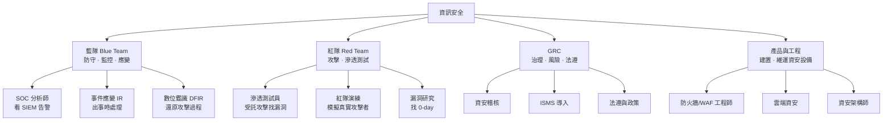

# 資安證照與學習路徑

> [!abstract] 這篇你會學到
> - 資安不是一個職業，而是**至少四種**差很多的職業，先搞清楚你要走哪一條
> - 每一條路線由低到高該考哪些證照，以及每張證照實際在測什麼
> - 「有效期、年資門檻、年費」這些報名前沒人告訴你、事後才痛的細節
> - 不用花錢就能練功的靶場、CTF 與實驗環境
> - 一份可以照著走的 24 個月排程，從完全零基礎到能投遞資安職缺

## 前置知識

- [[010-01-18-guide-計概-資訊安全初步]] — 完全外行請先讀這篇建立詞彙
- [[010-02-18-guide-網概-網路安全基礎]] — 攻擊手法與防禦機制的最基本概念
- [[090-05-00-idx-資安防護設備]] — 知道業界有哪些設備，才看得懂證照考綱在講什麼
- [[980-05-ref-附錄-國際證照地圖]] — 其他領域（Linux、網路、雲端）的證照對照

---

## 觀念說明

### 資安不是一個職業

這是新手最大的誤解。「我想做資安」就像「我想做醫生」一樣籠統 ——
外科、內科、放射科、公衛，做的事情天差地別。資安至少分成四大類：



| 分軌 | 日常在做什麼 | 適合的人格 | 台灣就業市場 |
| --- | --- | --- | --- |
| **藍隊** | 盯 SIEM 告警、調查可疑事件、寫偵測規則、事後鑑識 | 有耐心、細心、喜歡拼圖 | **需求最大**，SOC 職缺多 |
| **紅隊** | 受託對客戶系統做滲透測試、寫報告 | 好奇心強、不怕撞牆、愛鑽漏洞 | 職缺少但薪資高，多在資安服務商 |
| **GRC** | 寫政策、做稽核、應付 ISO 27001 與資安法 | 文書能力強、有耐心跟人溝通 | **公部門與大型企業需求穩定** |
| **產品工程** | 導入與維運防火牆、WAF、EDR、SIEM | 動手能力強、喜歡把東西架起來 | 需求大，常由 IT 維運轉任 |

> [!tip] 給本手冊的讀者（機關／企業維運人員）
> 你目前的位置最容易往 **產品工程** 與 **藍隊** 兩個方向轉，
> 因為你已經有作業系統、網路與服務的底子 —— 那正是這兩條路線最缺的基礎。
> **GRC** 則是公務機關人員最容易切入的方向（你本來就在應付資安法與稽核）。
> 紅隊路線最難、最花時間，但也最不需要現成的人脈。

### 證照在資安領域為什麼比較重要

比起其他 IT 領域，資安更看證照，原因很實際：

1. **能力難以驗證** —— 你不能在面試時要求對方讓你打進他們的系統
2. **法遵與標案要求** —— ISO 27001 驗證、政府標案常明文要求團隊持證人數
3. **信任門檻高** —— 這個職位能碰到最敏感的資料，雇主需要第三方背書

> [!warning] 但也別走火入魔
> 資安圈有句話：*「Certs get you the interview, skills get you the job.」*
> 證照讓你拿到面試，技術讓你拿到工作。
> 面試時被問到「你怎麼發現這個漏洞的」，背過的題庫救不了你。

### 五個報名前一定要知道的細節

| 項目 | 說明 |
| --- | --- |
| **有效期** | 幾乎都有。CompTIA 3 年、ISC2 3 年、GIAC 4 年、CKS 2 年、Offensive Security **終身有效** |
| **續證方式** | CompTIA／ISC2 靠 **CPE／CEU 學分**（上課、演講、寫文章都能換分）；也可重考 |
| **年費（AMF）** | ISC2 與 ISACA 收年費，持有多張時是實際負擔 |
| **年資門檻** | CISSP／CISM／CISA／CCSP 都要 **5 年**。未滿可先考過，取得準會員身分 |
| **重考規則** | 多數有等待期與次數限制；OSCP 重考需另外付費 |

> [!tip] 年費是長期成本
> ISC2 的年度維持費（AMF）不論持有幾張證照都是同一筆；
> ISACA 則是會員費 + 每張證照各自的維持費。
> 如果你打算長期持有多張 ISACA 證照，加入會員通常比較划算。

---

## 基礎設定：完全入門的三張證照

### 1. ISC2 CC（Certified in Cybersecurity）

| 項目 | 內容 |
| --- | --- |
| 定位 | **完全零基礎**的第一張資安證照 |
| 考綱 | 資安原則、業務持續與災難復原、存取控制、網路安全、資安維運 |
| 型態 | 100 題選擇題，2 小時 |
| 年資門檻 | **無** |
| 特色 | ISC2 的 *One Million Certified in Cybersecurity* 計畫**常提供免費的自學教材與考試券** |

> [!tip] 這是 CP 值最高的起點
> 免費（或極低成本）、無年資門檻、國際認可、而且掛的是 CISSP 同一家的名字。
> 如果你完全沒有資安證照，**先去 ISC2 官網查詢目前是否還有免費名額**。

### 2. CompTIA Security+（SY0-701 或更新版）

| 項目 | 內容 |
| --- | --- |
| 定位 | **資安領域最通用的敲門磚**，台灣公部門加分清單常客 |
| 考綱 | 威脅與攻擊、架構與設計、實作、事件應變、治理與法遵 |
| 型態 | 最多 90 題，含 **PBQ 模擬操作題**，90 分鐘 |
| 年資門檻 | 無（官方建議 2 年 IT 經驗） |
| 有效期 | 3 年，可用 CEU 展延 |

> [!note] 為什麼幾乎每條路線都從它開始
> Security+ 的考綱是整個資安領域的**共同語言**。
> 它讓你在往後讀任何資安文件時，不會卡在「什麼是 SIEM」「什麼是零信任」這種基本名詞。
> 對照本手冊：[[090-05-00-idx-資安防護設備]] 全部 16 篇，
> 幾乎就是 Security+ 考綱中「架構與設計」那一大塊的白話版。

### 3. Cisco CyberOps Associate

| 項目 | 內容 |
| --- | --- |
| 定位 | **藍隊／SOC 分析師**的入門，比 Security+ 更聚焦在「監控與分析」 |
| 考綱 | 資安概念、監控、主機分析、網路入侵分析、資安政策與程序 |
| 型態 | 選擇題 |
| 特色 | 大量封包與日誌判讀，對照本手冊 [[090-05-09-guide-資安設備-日誌集中與SIEM]] 與 tcpdump 相關章節 |

---

## 進階應用：四條分軌路線

### 路線一：藍隊（防守、監控、應變）

台灣需求最大的方向。

```
ISC2 CC ──→ Security+ ──→ CySA+ ──→ GIAC GCIH ──→ GIAC GCFA ──→ CISSP
（入門）      （共通語言）   （分析師）   （事件處理）    （鑑識）      （架構與管理）
                │
                └──→ Cisco CyberOps Associate（SOC 導向的平行選擇）
```

| 證照 | 重點 | 備註 |
| --- | --- | --- |
| **CySA+**（CompTIA） | 行為分析、威脅獵捕、弱點管理、事件應變 | Security+ 的下一步，仍是選擇題 + PBQ |
| **GCIH**（GIAC Certified Incident Handler） | 事件處理流程與常見攻擊手法 | GIAC 系列考試**可攜帶紙本筆記**，重點是查得快 |
| **GCIA**（GIAC Certified Intrusion Analyst） | 封包分析與入侵偵測 | 需要紮實的 TCP/IP 基礎，先讀完 [[010-02-00-idx-計算機網路]] |
| **GCFA**（GIAC Certified Forensic Analyst） | 數位鑑識與事件回應 | DFIR 方向的核心證照 |
| **GREM**（Reverse Engineering Malware） | 惡意程式逆向分析 | 難度高，需要組合語言基礎 |

> [!warning] GIAC 很貴
> GIAC 證照通常搭配 SANS 課程販售，**一張的總成本可能超過新台幣二十萬元**。
> 多數人是由公司出錢。若自費，可以只買考試（challenge attempt），
> 但仍不便宜，且沒有課程輔助難度會高很多。

### 路線二：紅隊（滲透測試）

```
Security+ ──→ PenTest+ ／ CEH ──→ OSCP ──→ OSEP ／ OSWE ／ OSED ──→ OSCE³
              （方法論）           （實作）      （進階實作三選）      （三張齊備）
```

| 證照 | 重點 | 備註 |
| --- | --- | --- |
| **PenTest+**（CompTIA） | 滲透測試的方法論、範圍界定、報告撰寫 | 選擇題 + PBQ，適合先建立流程觀念 |
| **CEH**（EC-Council） | 攻擊手法的廣度掃描 | 市場認知度高（尤其是 HR 端），但被技術圈批評「太理論」；有 CEH Practical 實作版 |
| **OSCP**（Offensive Security PEN-200） | **24 小時實機攻擊 + 24 小時寫報告** | 紅隊領域最被認可的證照，**終身有效** |
| **OSEP** | 進階攻擊與防禦規避 | OSCP 之後的三選一 |
| **OSWE** | Web 應用白箱漏洞挖掘 | |
| **OSED** | 漏洞利用開發（exploit development） | 三者中最難 |
| **OSCE³** | 集齊 OSEP + OSWE + OSED 的頭銜 | 全球持有者稀少 |

> [!danger] OSCP 的真實難度
> 官方座右銘是 *"Try Harder"*，不是玩笑。
> 考試是 24 小時不間斷的實機攻擊，多數人**第一次不會過**。
> 建議準備期 6～12 個月，先在 HackTheBox 或 TryHackMe 打完數十台機器再報名。
> 前置能力：Linux 熟練（本手冊 [[020-01-00-idx-Linux基礎]] 全部）、網路熟練（[[010-02-00-idx-計算機網路]] 全部）、
> 會寫基本的 Python 與 Bash（[[020-01-21-cmd-Linux-Shell腳本入門]]、[[020-01-22-guide-Linux-Shell腳本進階]]）。

### 路線三：GRC（治理、風險、法遵）

**公務機關人員最容易切入的方向**，因為你本來就在做這些事。

```
Security+ ──→ ISO 27001 Lead Auditor ──→ CISA ──→ CISM ──→ CISSP
                （稽核員資格）            （稽核）  （管理）  （全面）
                       │
                       └──→ ISO 27001 Lead Implementer（導入方向）
```

| 證照 | 發證 | 重點 | 年資門檻 |
| --- | --- | --- | --- |
| **ISO 27001 Lead Auditor** | PECB／BSI／SGS 等 | 有資格擔任 ISMS 稽核員 | 無（但通常要上課） |
| **ISO 27001 Lead Implementer** | 同上 | 有能力主導 ISMS 導入專案 | 無 |
| **CISA**（Certified Information Systems Auditor） | ISACA | 資訊系統稽核，全球稽核界的黃金標準 | **5 年** |
| **CRISC** | ISACA | 風險管理與控制 | **3 年** |
| **CISM**（Certified Information Security Manager） | ISACA | 資安管理者視角：策略、治理、專案、事件管理 | **5 年** |
| **CISSP** | ISC2 | 八大領域全覆蓋，管理與架構並重 | **5 年**（4 年 + 學歷可折抵 1 年） |

> [!tip] 公務機關的最短路徑
> 若你的工作已經在處理 TWGCB 導入、資安法通報、稽核應對，
> 那你缺的只是「把做過的事對應到國際框架的語言」。
> 建議順序：**Security+ → ISO 27001 Lead Auditor → CISM**。
> 對照本手冊：[[090-07-00-idx-資安實踐與規範]] 全部 12 篇、
> [[090-06-00-idx-TWGCB]]。

### 路線四：產品與工程（防護設備建置與維運）

從 IT 維運轉資安最自然的一條路，也最接近本手冊的主軸。

```
Security+ ──→ 廠商證照（依你單位的設備）──→ 雲端資安 ──→ CISSP／CCSP
                │
                ├─ Fortinet NSE 系列（NSE 4 是實務門檻）
                ├─ Palo Alto PCNSA → PCNSE
                ├─ Cisco CCNP Security
                ├─ Check Point CCSA → CCSE
                └─ F5 Certified BIG-IP（含 ASM／WAF）
```

| 領域 | 建議證照 |
| --- | --- |
| **防火牆／NGFW** | Fortinet NSE 4／Palo Alto PCNSA／Check Point CCSA／Cisco CCNP Security |
| **WAF** | F5 Certified BIG-IP Administrator + ASM 相關；Imperva／Akamai 產品認證 |
| **端點 EDR** | CrowdStrike CCFA／CCFR、SentinelOne、Microsoft SC-200 |
| **SIEM** | Splunk Enterprise Certified Admin、Elastic Certified Engineer、Microsoft SC-200 |
| **雲端資安** | AWS Certified Security – Specialty、**Microsoft SC-200／SC-300／SC-100**、Google PCSE |
| **Kubernetes 資安** | **CKS**（需先持有 CKA） |
| **雲端資安架構** | **CCSP**（ISC2，5 年年資）、Microsoft SC-100 |

> [!note] Microsoft SC 系列很適合本手冊讀者
> - **SC-900** — 資安、合規與身分的基礎（入門）
> - **SC-200** — 資安維運分析師（Defender、Sentinel SIEM）
> - **SC-300** — 身分與存取管理（Entra ID，對應 [[030-01-00-idx-Windows系統管理-Windows管理]] 的 AD）
> - **SC-100** — 資安架構師（專家級，建議先有 SC-200 或 SC-300 或 AZ-500）
>
> 如果你的單位已經在用 Microsoft 365 與 AD，這一系列的投資報酬率最高。

---

## 完整實戰範例：24 個月從零到資安職缺

以下排程假設你目前是**機關或企業的一般資訊維運人員**，想轉往資安。
每天投入 1～1.5 小時，週末多一點。

### 第 0～2 個月：補齊地基（不考試）

| 週次 | 做什麼 | 對照本手冊 |
| --- | --- | --- |
| 1～3 | 讀完計算機網路全章，特別是分層、TCP/UDP、DNS、HTTPS | [[010-02-00-idx-計算機網路]] 全 17 篇 |
| 4～6 | 讀完 Linux 基礎，並在虛擬機實際操作 | [[020-01-00-idx-Linux基礎]] 01～20 篇 |
| 7～8 | 讀完資安防護設備全景，建立設備地圖 | [[090-05-00-idx-資安防護設備]] 全 16 篇 |

> [!tip] 這兩個月不要急著報名考試
> 沒有網路與 Linux 基礎就去讀資安，會變成純背名詞。
> 「為什麼 ARP 詐騙有效」「為什麼 DNS 可以被劫持」這類問題，
> 都要先懂協定本身才答得出來。

### 第 3～4 個月：第一張證照 · ISC2 CC

- 用官方免費自學教材（若仍有名額）
- 每天 1 小時，兩個月足夠
- **目標**：建立資安詞彙，拿到履歷上的第一行

### 第 5～8 個月：第二張證照 · CompTIA Security+

- 這是整條路的**核心**，值得慢慢讀
- 對照本手冊：[[090-00-idx-資訊安全-總覽]] 各章（憑證與PKI、系統與網路防護、應用與資料安全、WAF與ModSecurity） + [[090-05-00-idx-資安防護設備]] + [[090-07-00-idx-資安實踐與規範]]
- 同時開始在 **TryHackMe** 走完 *Pre Security* 與 *Cyber Security 101* 路徑
- **目標**：拿到台灣公部門與企業最認的那張

> [!example] 動手練習清單（配合 Security+）
> 在你的實驗環境（[[980-03-guide-附錄-實驗環境搭建]]）依序做完：
> 1. 用 ufw 或 nftables 寫出一組只開 22／80／443 的規則 → [[090-02-02-guide-防火牆-ufw基礎與實務]]
> 2. 裝好 Fail2ban 並故意打錯密碼觸發封鎖 → [[090-02-05-guide-防護-Fail2ban入侵防護]]
> 3. 自簽一組憑證鏈並讓瀏覽器信任 → [[090-01-00-idx-PKI-憑證與PKI]]
> 4. 裝 ModSecurity + OWASP CRS，用一段 SQL Injection 測試看它擋不擋得住 → [[090-04-01-svc-WAF-WAF概念與ModSecurity安裝]]
> 5. 用 tcpdump 抓一段 HTTP 與 HTTPS 流量，比較差異
>
> 這五件事做完，Security+ 的實作題對你來說會非常直覺。

### 第 9～14 個月：分軌，選一條

此時你已經有基礎，**必須做出選擇**。往下走的路差異很大。

| 你的選擇 | 接下來 6 個月 |
| --- | --- |
| **藍隊** | CySA+ 或 Cisco CyberOps；同時在 TryHackMe 走 *SOC Level 1* 路徑；架一套 Wazuh 或 Elastic 自己收日誌 |
| **紅隊** | PenTest+ 打底，接著開始在 HackTheBox 打機器；目標半年內拿下 30～50 台 |
| **GRC** | ISO 27001 Lead Auditor 課程 + 考試；同時把單位的資安文件實際整理一遍 |
| **產品工程** | 挑你單位實際在用的品牌考廠商證照（Fortinet NSE 4 / Palo Alto PCNSA / SC-200） |

### 第 15～24 個月：第一張「有份量」的證照

| 分軌 | 目標證照 | 說明 |
| --- | --- | --- |
| 藍隊 | GCIH 或 SC-200 | 若公司不出錢，SC-200 成本低很多 |
| 紅隊 | **OSCP** | 準備期至少 6 個月，先打完 100 台再報名 |
| GRC | CISM（年資夠的話）或 CRISC | 年資不足先考過拿準會員身分 |
| 產品工程 | 廠商專家級（NSE 7、PCNSE）或 CKS | 依環境選 |

> [!example] 24 個月後的履歷長相（以藍隊為例）
> ```
> 證照：CompTIA Security+、CompTIA CySA+、ISC2 CC
> 實作：
>   - 自建 Wazuh SIEM，收容 15 台 Linux／Windows 主機日誌，撰寫 8 條自訂偵測規則
>   - 導入 TWGCB-01-014 基準至 Ubuntu 伺服器，產出符合性報告與豁免清單
>   - 建置 Nginx + ModSecurity(OWASP CRS)，處理 30+ 條誤判排除規則
>   - 撰寫資安事件應變程序書，並執行一次桌上型演練
> ```
> 注意**實作那一段比證照那一段長**。這才是能拿到工作的履歷。

---

## 免費的練功場

證照要錢，但練習不用。

| 平台 | 類型 | 說明 |
| --- | --- | --- |
| **TryHackMe** | 引導式靶場 | 對新手最友善，有完整學習路徑；免費內容已經很多 |
| **Hack The Box** | 挑戰式靶場 | 難度高、無引導，OSCP 的最佳前置訓練；有免費機器 |
| **OverTheWire** | Linux 遊戲 | Bandit 關卡是練 Linux 指令的經典，完全免費 |
| **PortSwigger Web Security Academy** | Web 漏洞 | **完全免費**，Burp Suite 官方出品，Web 安全的最佳教材 |
| **OWASP Juice Shop** | 靶站 | 可在自己的 Docker 裡跑，涵蓋 OWASP Top 10 |
| **VulnHub** | 靶機映像 | 下載 VM 回來自己打 |
| **CTFtime** | CTF 賽事表 | 台灣有 HITCON CTF、AIS3 等賽事 |
| **AIS3 / 臺灣好厲駭** | 台灣官方培訓 | 教育部與資安院支持的免費培訓計畫，適合學生與轉職者 |
| **MITRE ATT&CK** | 知識庫 | 攻擊手法的標準分類，藍隊必讀，免費 |

> [!tip] 最推薦的免費起點
> **PortSwigger Web Security Academy**。它免費、有系統、有實驗環境，
> 而且 Web 漏洞是所有資安分軌都用得到的知識。
> 光是把 SQL Injection 與 XSS 兩個章節做完，你對 [[090-04-01-svc-WAF-WAF概念與ModSecurity安裝]]
> 裡的規則會有完全不同的理解。

---

## 常見錯誤與排錯

| 現象 | 原因 | 解法 |
| --- | --- | --- |
| 讀資安讀不進去，全是名詞 | 網路與 Linux 基礎不足 | 回頭補 [[010-02-00-idx-計算機網路]] 與 [[020-01-00-idx-Linux基礎]]，資安是建在它們之上的 |
| 考過 Security+ 卻找不到資安工作 | 只有證照沒有作品 | 架實驗環境做出可以講的專案（Wazuh／ModSecurity／TWGCB 導入），寫進履歷 |
| 一開始就想考 CISSP | 不知道有 5 年年資門檻 | 先考 Security+ 累積實務；年資不足只能拿 Associate 身分 |
| OSCP 考了兩次都沒過 | 準備量不足 | 官方建議至少打完數十台靶機；補 Buffer Overflow、AD 攻擊與 privilege escalation |
| 證照過期沒發現 | 沒追蹤 CPE／CEU | 建立試算表記錄學分與到期日；上課、看研討會、寫技術文章都能換學分 |
| 花錢考了廠商證照，換工作就用不到 | 押錯品牌 | 廠商證照先選你**現在單位在用**的；長期投資選廠商中立的（CompTIA、ISC2、GIAC） |
| 在正式環境練滲透測試 | 沒有授權觀念 | **絕對不可以**。用 HackTheBox、自架靶機，或走正式的授權與變更程序 |
| GIAC 太貴考不起 | 沒有公司補助 | 改走 CompTIA + 廠商證照 + 實作作品的組合，成本只有零頭 |

---

## 安全性注意事項

> [!danger] 未經授權的測試在台灣是刑事犯罪
> 《中華民國刑法》第三十六章「妨害電腦使用罪」：
> - **第 358 條** 無故輸入他人帳號密碼、破解使用電腦之保護措施，或利用電腦系統之漏洞，
>   而入侵他人之電腦或相關設備
> - **第 359 條** 無故取得、刪除或變更他人電腦或相關設備之電磁紀錄，致生損害於公眾或他人
> - **第 360 條** 無故以電腦程式或其他電磁方式干擾他人電腦或相關設備，致生損害於公眾或他人
>
> **「我只是掃描看看」「我沒有破壞任何東西」不是免責理由。**
> 對公務機關的電腦犯罪還會依第 361 條加重其刑。

> [!warning] 滲透測試的三個必要條件
> 1. **書面授權** —— 明確載明測試範圍（IP／網域）、時間窗口、允許的手法、緊急聯絡人
> 2. **範圍界定** —— 白紙黑字寫清楚哪些系統可測、哪些絕對不能碰
> 3. **免責條款** —— 測試造成服務中斷時的責任歸屬
>
> 沒有這三樣，不要動手。這是 PenTest+ 與 OSCP 考綱的第一課，不是形式。

> [!warning] 職業道德規範
> ISC2、ISACA、EC-Council 都有 **Code of Ethics**，違反者證照會被撤銷。
> 常見的違規包括：協助他人作弊、散布考題、未經授權的測試、隱匿已知漏洞牟利。
> 資安從業人員的信譽一旦受損，很難修補 —— 這個圈子比想像中小。

> [!tip] 發現漏洞時的正確做法
> 若你在合法使用某服務時意外發現漏洞：
> 1. **停止進一步探測**（尤其不要嘗試取得更多資料）
> 2. 循該單位的資安通報管道或 bug bounty 計畫回報
> 3. 台灣可通報 **TWCERT/CC**（<https://www.twcert.org.tw/>）
> 4. 保留紀錄但不外流，給予合理的修補期間再公開
>
> 這叫 **coordinated disclosure**，是業界公認的正當做法。

---

## 速查表

### 資安證照一覽（依難度）

| 階 | 證照 | 發證 | 型態 | 年資 | 有效期 |
| --- | --- | --- | --- | --- | --- |
| 入門 | ISC2 CC | ISC2 | 選擇題 | 無 | 3 年 |
| 入門 | SC-900 | Microsoft | 選擇題 | 無 | 不過期 |
| 入門 | Security+ | CompTIA | 選擇 + PBQ | 無 | 3 年 |
| 入門 | Cisco CyberOps Associate | Cisco | 選擇題 | 無 | 3 年 |
| 中階 | CySA+ | CompTIA | 選擇 + PBQ | 無 | 3 年 |
| 中階 | PenTest+ | CompTIA | 選擇 + PBQ | 無 | 3 年 |
| 中階 | CEH | EC-Council | 選擇題 | 無* | 3 年 |
| 中階 | SSCP | ISC2 | 選擇題 | 1 年 | 3 年 |
| 中階 | SC-200 / SC-300 | Microsoft | 選擇題 | 無 | 1 年（免費續） |
| 中階 | Fortinet NSE 4 / PCNSA | 廠商 | 選擇題 | 無 | 2～3 年 |
| 進階 | GCIH / GCIA / GCFA | GIAC | 開書選擇題 | 無 | 4 年 |
| 進階 | **OSCP** | OffSec | **24hr 實作** | 無 | **終身** |
| 進階 | **CKS** | CNCF | **實作** | 需 CKA | 2 年 |
| 進階 | AWS Security Specialty / AZ-500 | 雲端廠商 | 選擇題 | 無 | 1～3 年 |
| 專家 | CISA | ISACA | 選擇題 | **5 年** | 3 年 + 年費 |
| 專家 | CISM | ISACA | 選擇題 | **5 年** | 3 年 + 年費 |
| 專家 | CISSP | ISC2 | 自適應選擇題 | **5 年** | 3 年 + AMF |
| 專家 | CCSP | ISC2 | 選擇題 | **5 年** | 3 年 + AMF |
| 專家 | OSEP / OSWE / OSED | OffSec | **實作** | 無 | 終身 |
| 專家 | SC-100 | Microsoft | 選擇題 | 建議先有 SC-200/300 | 1 年 |

\* CEH 若未上官方課程，需提供 2 年資安工作經驗證明才能報考。

### 對照本手冊章節

| 證照考綱主題 | 本手冊對應 |
| --- | --- |
| 網路基礎與協定 | [[010-02-00-idx-計算機網路]] 全章 |
| 作業系統加固 | [[090-02-01-guide-防護-伺服器初始安全設定]]、[[090-02-08-guide-防護-系統強化與稽核]]、[[090-06-00-idx-TWGCB]] |
| 防火牆與網路分段 | [[090-02-00-idx-防護-系統與網路防護]]、[[090-05-02-guide-資安設備-防火牆與次世代防火牆]]、[[010-02-16-guide-網概-VLAN與網路分段]] |
| WAF 與應用安全 | [[090-04-00-idx-ModSecurity]]、[[090-05-04-guide-資安設備-Web應用防火牆WAF]]、[[090-03-02-guide-應用安全-應用層安全]] |
| 密碼學與 PKI | [[090-01-00-idx-PKI-憑證與PKI]] 全章、[[090-03-03-guide-應用安全-機密管理與金鑰保護]] |
| 身分與存取控制 | [[090-05-07-guide-資安設備-身分存取管理IAM與MFA]]、[[020-01-09-cmd-Linux-使用者與群組管理]]、[[030-01-00-idx-Windows系統管理-Windows管理]] |
| 日誌、監控與 SIEM | [[090-05-09-guide-資安設備-日誌集中與SIEM]]、[[100-01-00-idx-監控與日誌]]、[[020-01-19-guide-Linux-日誌系統]] |
| 事件應變與鑑識 | [[090-07-04-guide-資安實踐-資安事件應變流程]]、[[090-03-04-guide-應用安全-備份災難復原與入侵應變]] |
| 治理、風險與法遵 | [[090-07-00-idx-資安實踐與規範]] 全章 |
| 業務持續與備份 | [[090-05-14-guide-資安設備-備份與抗勒索防護]]、[[090-03-04-guide-應用安全-備份災難復原與入侵應變]] |
| 雲端與容器安全 | [[050-02-00-idx-容器化]]、[[090-05-12-guide-資安設備-零信任架構與微分段]] |

### 台灣本土資源

| 名稱 | 說明 | 網址 |
| --- | --- | --- |
| 國家資通安全研究院（NICS） | TWGCB 政府組態基準發布單位 | <https://www.nics.nat.gov.tw/> |
| 國家資通安全會報技術服務中心（NCCST） | GCB 下載、資安通報 | <https://www.nccst.nat.gov.tw/> |
| TWCERT/CC | 台灣電腦網路危機處理中心，漏洞通報 | <https://www.twcert.org.tw/> |
| iPAS 資訊安全工程師 | 經濟部產業人才能力鑑定（本土證照，公部門有認列） | <https://www.ipas.org.tw/> |
| AIS3 / 臺灣好厲駭 | 免費資安培訓計畫 | 每年公告 |
| HITCON | 台灣最大資安研討會與 CTF | <https://hitcon.org/> |

---

## 練習題

> [!question]- 練習 1：確認你的分軌
> 誠實回答以下五題，各選 A（藍）／B（紅）／C（GRC）／D（工程）：
> 1. 你比較喜歡：A 從一堆日誌裡找出異常｜B 想辦法突破一道防線｜C 把制度寫清楚讓大家照做｜D 把設備架起來跑順
> 2. 遇到問題時你傾向：A 慢慢比對細節｜B 一直換方法硬試｜C 先查規定怎麼寫｜D 先看設定檔哪裡錯
> 3. 你能接受：A 輪班盯螢幕｜B 長時間卡關沒進展｜C 大量文書與會議｜D 半夜維護視窗
> 4. 你的現有強項：A 觀察力｜B 好奇心｜C 溝通與寫作｜D 動手能力
> 5. 你單位最缺的是：A 沒人看告警｜B 沒人做測試｜C 稽核一直被打回｜D 設備沒人會管
>
> 統計最多的字母，就是你最該投入的分軌。若 D 最多（本手冊多數讀者的情況），
> 從路線四開始，成本最低、轉換最順。

> [!question]- 練習 2：把本手冊做過的事翻譯成履歷語言
> 挑三件你在本手冊實際動手做過的事，各用「情境 — 動作 — 結果」三句話寫出來。
>
> 範例：
> > **情境**：對外網站遭大量 404 掃描，日誌一天暴增到 200MB。
> > **動作**：部署 Nginx + ModSecurity（OWASP CRS Paranoia Level 2），
> > 排除 12 條誤判規則，並以 Fail2ban 針對 404 濫用來源自動封鎖。
> > **結果**：惡意請求下降 94%，日誌量回到 15MB／日，正常使用者零誤擋。
>
> 這種寫法比「熟悉 ModSecurity」有力十倍。

> [!question]- 練習 3：查證與估算
> 到 CompTIA 官網下載 **Security+ 最新版的 Exam Objectives PDF**，然後：
> 1. 逐條對照本篇「對照本手冊章節」表格，標出手冊已涵蓋的部分
> 2. 列出手冊沒有涵蓋、需要另外補的主題
> 3. 查出報名費、有效期、續證所需 CEU 數，估算三年總成本
>
> 這個練習本身就是 Security+ 準備工作的第一步。

---

## 小測驗

Q1. 資安至少可分成哪四大分軌？各自的日常工作重點是什麼？

Q2. 為什麼本篇建議機關／企業的一般維運人員，最容易從「產品工程」與「藍隊」兩個方向轉入資安？

Q3. ISC2 CC 這張證照對完全零基礎的人特別友善，原因有哪三個？

Q4. CISSP 需要 5 年工作年資。若你通過考試但年資不足，會取得什麼身分？

Q5. OSCP 的考試型態是什麼？它跟 CEH 最大的差別在哪裡？

Q6. GIAC 系列考試有一個和其他證照很不一樣的規則，是什麼？這個規則暗示了準備方向該如何調整？

Q7. CKS 有一個特別的報考前提，是什麼？

Q8. 在台灣，未經授權對他人系統進行連接埠掃描可能觸犯哪一部法律的哪一章？「我沒有破壞任何東西」能不能當作免責理由？

Q9. 執行滲透測試前必備的三個條件是什麼？

Q10. 假設你在合法使用某網站時意外發現一個漏洞，正確的處理順序為何？在台灣可以向哪個單位通報？

> [!question]- 測驗答案
> **Q1.** **藍隊**（防守、監控、事件應變與鑑識）、**紅隊**（滲透測試與紅隊演練）、
> **GRC**（治理、風險、法遵、稽核）、**產品與工程**（建置與維運防火牆、WAF、EDR、SIEM 等設備）。
> 見「資安不是一個職業」段落的分軌表。
>
> **Q2.** 因為這兩條路線最需要的正是**作業系統、網路與服務的實務底子**，
> 而這正是維運人員已經具備的。紅隊需要額外的攻擊技術累積，GRC 需要文書與溝通能力，
> 轉換成本較高（不過公務機關人員因為本來就在應付資安法與稽核，切入 GRC 也很自然）。
>
> **Q3.** ①**無年資門檻**；②ISC2 的 *One Million Certified in Cybersecurity* 計畫
> **常提供免費自學教材與考試券**；③掛的是 CISSP 同一家發證單位的名字，國際認可度高。
>
> **Q4.** 「**Associate of ISC2**」（ISC2 準會員）。等年資累積滿 5 年後再轉為正式的 CISSP。
> CISM、CISA、CCSP 也有類似機制。
>
> **Q5.** OSCP 是 **24 小時實機攻擊 + 24 小時撰寫報告**的實作考，**終身有效**。
> CEH 主要是選擇題（另有 CEH Practical 實作版），偏重攻擊手法的廣度掃描與理論；
> 業界普遍認為 OSCP 的技術含金量較高，但 CEH 在 HR 端的認知度較好。
>
> **Q6.** GIAC 考試**可以攜帶紙本筆記**（開書考）。
> 這表示準備重點不是死背，而是**整理出一份查得快的索引**；
> 平常讀課程時就要同步做索引，考場上比的是查找速度。
>
> **Q7.** 報考 CKS 必須**先持有仍在有效期內的 CKA**。兩者都是實作考，有效期均為 2 年。
>
> **Q8.** 可能觸犯《中華民國刑法》第三十六章「**妨害電腦使用罪**」，
> 特別是第 358 條（入侵電腦）與第 360 條（干擾電腦設備）。
> **「沒有破壞任何東西」不是免責理由** —— 第 358 條處罰的是「入侵」這個行為本身，
> 不以造成損害為要件。對公務機關犯之還會依第 361 條加重其刑。
>
> **Q9.** ①**書面授權**（載明範圍、時間窗口、允許手法、緊急聯絡人）；
> ②**明確的範圍界定**（哪些系統可測、哪些絕對不能碰）；
> ③**免責條款**（服務中斷時的責任歸屬）。三者缺一不可。
>
> **Q10.** ①**立即停止進一步探測**，尤其不要嘗試取得更多資料；
> ②循該單位的資安通報管道或 bug bounty 計畫回報；
> ③台灣可通報 **TWCERT/CC**（<https://www.twcert.org.tw/>）；
> ④保留紀錄但不外流，給予合理修補期間後再公開。
> 這套流程稱為 **coordinated disclosure**（協同揭露）。

---

## 延伸閱讀

- [[980-05-ref-附錄-國際證照地圖]] — 全手冊各章節的證照對照，含 Linux、網路、雲端、維運
- [[090-05-00-idx-資安防護設備]] — 16 篇防護設備全覽，Security+ 架構題的白話版
- [[090-07-00-idx-資安實踐與規範]] — 12 篇治理與法遵，GRC 路線的核心教材
- [[090-06-00-idx-TWGCB]] — 台灣政府組態基準，公務機關必修
- [[980-04-guide-附錄-延伸學習資源]] — 更多免費課程與社群
- [[980-03-guide-附錄-實驗環境搭建]] — 練功用的虛擬環境
- [[000-01-idx-索引-學習路徑]] — 本手冊自身的閱讀路線

> [!warning] 證照資訊會變動
> 考試代號、科目、費用、有效期與年資規則**經常改版**。
> 本篇整理的是撰寫當下（2026-08）的狀況，**報名前務必到發證單位官網確認**。
