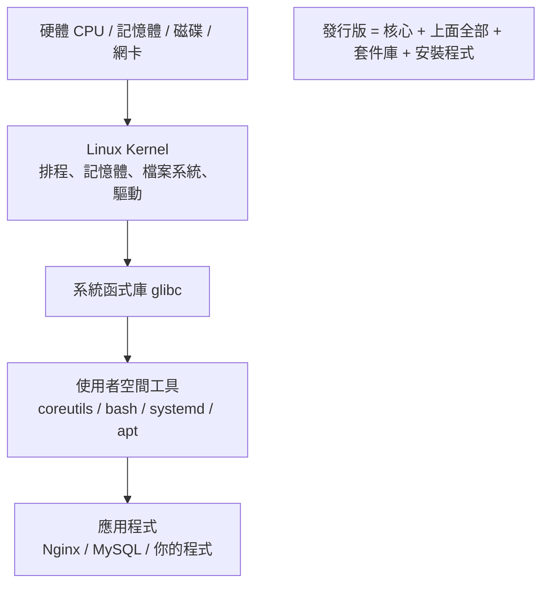
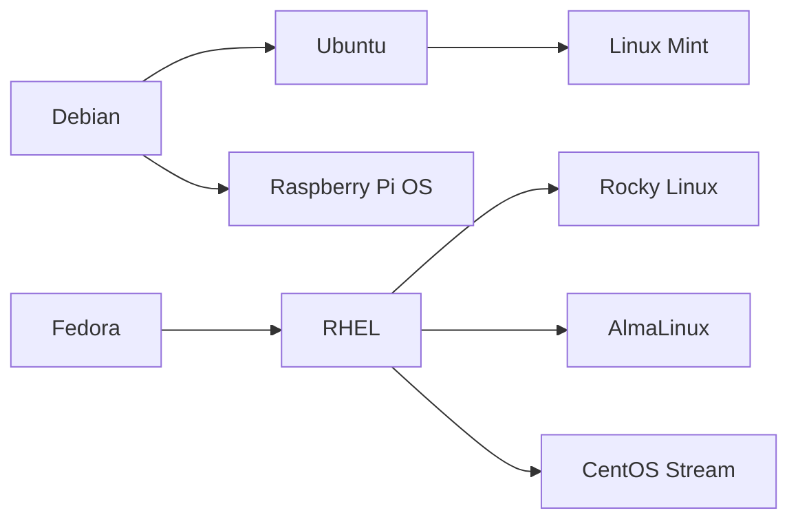

# Linux 是什麼與發行版選擇

> [!abstract] 這篇你會學到
> - 說清楚 kernel、GNU 工具、發行版三者的關係，不再把「Linux」當成一個模糊的東西
> - 比較 Debian 系與 RHEL 系的定位、版本策略與支援年限
> - 用一套明確的判斷準則，替自己的情境選出發行版
> - 查出手上任何一台機器的發行版、版本與剩餘支援期限

## 前置知識

無。這是全書的第一篇。

---

## 觀念說明

### Linux 到底是什麼

嚴格講，**Linux 只是一個核心（kernel）**。核心負責的事情很有限但很關鍵：

- 管理 CPU 時間分配給哪個程序（排程）
- 管理記憶體怎麼配置與回收
- 提供檔案系統的讀寫介面
- 驅動硬體（網卡、磁碟、USB）
- 提供程序之間溝通的機制

核心本身不提供你在終端機打的任何一個指令。`ls`、`cp`、`grep` 這些來自
**GNU coreutils** 等專案；`bash` 是 GNU 的 shell；套件管理、開機流程、
系統服務管理（systemd）又是另外的專案。

把「核心 + 一整套使用者空間工具 + 套件管理 + 安裝程式 + 預設設定」
包裝成一個可以安裝使用的成品，就是**發行版（distribution，簡稱 distro）**。



> [!tip] 為什麼要在意這個區別
> 因為排錯的時候你必須知道問題出在哪一層。
> 「核心版本」和「發行版版本」是兩件事：Ubuntu 24.04 可能跑 6.8 核心，
> 也可能升級成 6.11 核心；RHEL 9 用的核心版本號看起來很舊（5.14），
> 但廠商把新功能回移（backport）進去了。**用核心版本號判斷有沒有某個功能，經常會判斷錯。**

### 為什麼會有這麼多發行版

因為「該裝哪些軟體、預設怎麼設定、多久發一次版、支援多久」這些問題
沒有標準答案，不同的人有不同的取捨：

| 取捨 | 一端 | 另一端 |
| --- | --- | --- |
| 套件新舊 | 追最新版（Arch、Fedora） | 凍結版本重視穩定（Debian stable、RHEL） |
| 發版節奏 | 滾動更新，沒有版本號 | 固定週期發版 |
| 支援年限 | 半年到一年 | 5～10 年 |
| 商業支援 | 社群為主 | 有原廠合約與 SLA |
| 預設安裝 | 極簡，自己裝 | 開箱即用，什麼都有 |

### 兩大主流家族

實務上，伺服器環境九成以上落在這兩個家族：



**Debian 系**（套件格式 `.deb`，套件管理 `apt`）

| 發行版 | 定位 | 支援年限 |
| --- | --- | --- |
| Debian stable | 極度重視穩定，套件偏舊 | 約 5 年（含 LTS） |
| **Ubuntu LTS** | 伺服器最常見的選擇 | 5 年標準 + Ubuntu Pro 可延長至 10～12 年 |
| Ubuntu 非 LTS | 每半年一版，追新功能 | 9 個月 |

**RHEL 系**（套件格式 `.rpm`，套件管理 `dnf`）

| 發行版 | 定位 | 支援年限 |
| --- | --- | --- |
| RHEL | 商業版，有原廠支援與認證 | 10 年 |
| **Rocky Linux / AlmaLinux** | RHEL 的免費相容重build | 跟隨 RHEL，約 10 年 |
| CentOS Stream | RHEL 的**上游**滾動預覽版 | 5 年 |
| Fedora | RHEL 的實驗場，套件很新 | 約 13 個月 |

> [!danger] CentOS Linux 已經不存在了
> CentOS Linux 7 於 2024-06-30 終止支援，CentOS Linux 8 更早（2021-12-31）就結束。
> 現在的 **CentOS Stream 是 RHEL 的上游測試版本，不是 RHEL 的下游複製品**，
> 定位完全相反。如果你還在維護 CentOS 7 的機器，那是一台沒有安全更新的機器。
> 正式環境要免費的 RHEL 相容系統，請選 **Rocky Linux** 或 **AlmaLinux**。

### Ubuntu 的版本號規則

Ubuntu 版本號是 `YY.MM`，就是發布的年月：

- `24.04` = 2024 年 4 月
- `25.10` = 2025 年 10 月
- **偶數年的 4 月版本是 LTS**（Long Term Support）：20.04、22.04、24.04、26.04
- 每個版本還有一個代號（codename），如 `noble`（24.04）、`jammy`（22.04）

代號很重要，因為**加第三方套件庫時要填的就是代號**，不是版本號：

```
deb [signed-by=...] https://example.com/apt noble main
                                            ^^^^^ 代號
```

> [!tip] 正式環境請用 LTS
> 非 LTS 版本只有 9 個月支援，等於每 9 個月就要被迫做一次大版本升級。
> 伺服器用 LTS，工作站或想玩新功能才考慮非 LTS。

---

## 逐步說明：查出手上這台機器是什麼

### 最可靠的方式：`/etc/os-release`

這個檔案是跨發行版的標準（systemd 定義），**任何現代 Linux 都有**：

```bash
cat /etc/os-release
```

```
PRETTY_NAME="Ubuntu 26.04.1 LTS"
NAME="Ubuntu"
VERSION_ID="26.04"
VERSION="26.04.1 LTS (Resolute Raccoon)"
VERSION_CODENAME=resolute
ID=ubuntu
ID_LIKE=debian
HOME_URL="https://www.ubuntu.com/"
SUPPORT_URL="https://help.ubuntu.com/"
```

在腳本裡要取值時不要用 `grep` 加 `cut` 慢慢切，直接 source 它：

```bash
. /etc/os-release
echo "$ID $VERSION_ID ($VERSION_CODENAME)"
```

```
ubuntu 26.04 (resolute)
```

> [!tip] `ID_LIKE` 是寫跨發行版腳本的關鍵
> `ID_LIKE=debian` 代表「我雖然不是 Debian，但我跟 Debian 相容」。
> 寫安裝腳本時可以這樣判斷家族：
>
> ```bash
> . /etc/os-release
> case "$ID $ID_LIKE" in
>   *debian*) PKG="apt-get install -y" ;;
>   *rhel*|*fedora*) PKG="dnf install -y" ;;
>   *) echo "不支援的發行版：$ID" >&2; exit 1 ;;
> esac
> ```

### 其他查法與它們的問題

```bash
hostnamectl
```

```
 Static hostname: web01
       Icon name: computer-vm
         Chassis: vm
Operating System: Ubuntu 26.04.1 LTS
          Kernel: Linux 6.6.87.2-microsoft-standard-WSL2
    Architecture: x86-64
```

`hostnamectl` 一次給你發行版、核心版本與架構，資訊最完整，但**需要 systemd**
（容器裡經常沒有）。

```bash
lsb_release -a
```

```
Distributor ID: Ubuntu
Description:    Ubuntu 26.04.1 LTS
Release:        26.04
Codename:       resolute
```

`lsb_release` 好讀，但**最小安裝的系統經常沒有裝**（Ubuntu 需要 `lsb-release` 套件）。
寫腳本不要依賴它。

```bash
uname -r    # 只給核心版本
uname -a    # 核心版本 + 架構 + 編譯時間
```

```
6.6.87.2-microsoft-standard-WSL2
```

> [!warning] `uname` 不會告訴你發行版
> `uname` 是核心提供的資訊，跟發行版無關。在 Ubuntu 上跑 `uname` 不會出現 "Ubuntu" 字樣。
> 想知道發行版永遠先看 `/etc/os-release`。

> [!info]- Rocky / AlmaLinux（RHEL 系）對照
> `/etc/os-release` 一樣有，內容像這樣：
>
> ```
> NAME="Rocky Linux"
> VERSION="9.4 (Blue Onyx)"
> ID="rocky"
> ID_LIKE="rhel centos fedora"
> PLATFORM_ID="platform:el9"
> ```
>
> RHEL 系另外有一個傳統檔案 `/etc/redhat-release`：
>
> ```bash
> cat /etc/redhat-release
> ```
>
> ```
> Rocky Linux release 9.4 (Blue Onyx)
> ```
>
> 注意 `PLATFORM_ID="platform:el9"` 裡的 **el9**（Enterprise Linux 9）——
> 下載第三方 rpm 時經常要對應這個代號，等同 Ubuntu 的 codename 角色。
>
> RHEL 系沒有「代號」的概念，第三方套件庫用的是大版本號（`el8`、`el9`）。

### 查支援期限

```bash
# Ubuntu 內建工具（需要 ubuntu-advantage-tools / ubuntu-pro-client）
pro status
```

不確定或不是 Ubuntu 時，最快的是查 <https://endoflife.date>：

```bash
curl -s https://endoflife.date/api/ubuntu.json | head -30
```

> [!tip] 把 EOL 檢查排進維護作業
> 「這台機器還有多久支援」是每季維護該檢查的項目。
> 一台過保的伺服器不會壞，但它不會再收到安全更新，這比壞掉更危險。

---

## 完整實戰範例：寫一個跨發行版的環境偵測腳本

這個腳本在後面很多章節都用得上，先寫起來放。

```bash
#!/usr/bin/env bash
# detect-os.sh — 偵測發行版家族並輸出對應的套件管理指令
set -euo pipefail

if [ ! -r /etc/os-release ]; then
    echo "找不到 /etc/os-release，無法判斷發行版" >&2
    exit 1
fi

# shellcheck source=/dev/null
. /etc/os-release

case "${ID:-} ${ID_LIKE:-}" in
    *debian*|*ubuntu*)
        FAMILY="debian"
        PKG_UPDATE="apt-get update"
        PKG_INSTALL="apt-get install -y"
        WEB_USER="www-data"
        NGINX_SITES="/etc/nginx/sites-available"
        ;;
    *rhel*|*fedora*|*centos*)
        FAMILY="rhel"
        PKG_UPDATE="dnf makecache"
        PKG_INSTALL="dnf install -y"
        WEB_USER="nginx"
        NGINX_SITES="/etc/nginx/conf.d"
        ;;
    *)
        echo "不支援的發行版：${ID:-unknown}" >&2
        exit 1
        ;;
esac

cat <<INFO
發行版      : ${PRETTY_NAME:-$ID $VERSION_ID}
家族        : $FAMILY
代號        : ${VERSION_CODENAME:-無（RHEL 系不使用代號）}
核心        : $(uname -r)
架構        : $(uname -m)
安裝指令    : sudo $PKG_INSTALL <套件名>
Web 執行帳號: $WEB_USER
Nginx 站台  : $NGINX_SITES
INFO
```

執行：

```bash
chmod +x detect-os.sh
./detect-os.sh
```

```
發行版      : Ubuntu 26.04.1 LTS
家族        : debian
代號        : resolute
核心        : 6.6.87.2-microsoft-standard-WSL2
架構        : x86-64
安裝指令    : sudo apt-get install -y <套件名>
Web 執行帳號: www-data
Nginx 站台  : /etc/nginx/sites-available
```

> [!tip] 為什麼用 `apt-get` 不用 `apt`
> `apt` 是給人用的（輸出漂亮、有進度條），**它的輸出格式沒有穩定性保證**，
> 在腳本裡跑還會警告 `WARNING: apt does not have a stable CLI interface`。
> 腳本裡一律用 `apt-get` / `apt-cache`。

---

## 常見錯誤與排錯

| 現象 | 原因 | 解法 |
| --- | --- | --- |
| `lsb_release: command not found` | 最小安裝沒裝 `lsb-release` | 改讀 `/etc/os-release`；真要用就 `apt install lsb-release` |
| 照著網路教學裝套件卻找不到 | 教學是 RHEL 系（`dnf`），你的機器是 Debian 系 | 先確認發行版家族，再找對應教學 |
| 第三方套件庫加了但 `apt update` 說沒有 Release 檔 | codename 填錯（例如填了 `24.04` 而不是 `noble`） | 用 `. /etc/os-release; echo $VERSION_CODENAME` 取得正確代號 |
| 明明是新系統，套件版本卻很舊 | Debian stable / RHEL 的版本凍結政策 | 這是正常的；需要新版就加官方上游套件庫，見 [[14-套件管理]] |
| CentOS 7 機器 `yum update` 找不到套件庫 | CentOS 7 已 EOL，官方鏡像下架 | 這台機器該遷移了；臨時可改用 vault 鏡像，但沒有安全更新 |
| 容器裡 `hostnamectl` 沒反應 | 容器內通常沒有 systemd | 用 `cat /etc/os-release` |

---

## 安全性注意事項

> [!danger] 用過保的發行版等於裸奔
> 支援期限結束後，即使爆出重大漏洞（如 OpenSSL、glibc 等級的），
> 官方也不會再發修補套件。一台 EOL 的伺服器上跑著對外服務，
> 是資安稽核第一個會被打槍的項目，也是實際入侵最常見的入口。

> [!warning] 不要在正式環境用非 LTS 或滾動更新發行版
> 9 個月的支援期意味著你每年要做一到兩次大版本升級，
> 每次升級都是一次停機風險。正式環境選 LTS，把升級週期拉到 2～5 年一次。

> [!tip] 混用發行版的代價
> 一個機房裡同時有 Ubuntu、Rocky、Debian，代表你的每一份維運腳本、
> 每一份文件都要寫兩到三套。除非有明確理由（例如某軟體只支援 RHEL），
> **標準化成單一發行版家族是最划算的決定**。

---

## 速查表

| 指令 | 說明 | 備註 |
| --- | --- | --- |
| `cat /etc/os-release` | 查發行版與版本 | **最可靠**，跨發行版標準 |
| `. /etc/os-release; echo $ID` | 在腳本中取發行版 ID | `ubuntu` / `debian` / `rocky` / `rhel` |
| `. /etc/os-release; echo $VERSION_CODENAME` | 取代號 | 加第三方 apt 套件庫時要填這個 |
| `. /etc/os-release; echo $ID_LIKE` | 取家族 | 判斷 debian 系或 rhel 系 |
| `hostnamectl` | 發行版 + 核心 + 架構 | 需要 systemd |
| `lsb_release -a` | 發行版資訊 | 可能沒安裝，腳本勿依賴 |
| `uname -r` | 核心版本 | **不含發行版資訊** |
| `uname -m` | CPU 架構 | `x86_64` / `aarch64` |
| `cat /etc/redhat-release` | RHEL 系版本 | 僅 RHEL 系 |
| `cat /etc/debian_version` | Debian 版本 | Ubuntu 上顯示的是對應的 Debian 版本 |

### 家族速查

| | Debian 系 | RHEL 系 |
| --- | --- | --- |
| 套件格式 | `.deb` | `.rpm` |
| 套件管理 | `apt` / `apt-get` | `dnf`（舊版 `yum`） |
| 代表發行版 | Ubuntu LTS、Debian | Rocky、AlmaLinux、RHEL |
| 第三方庫識別 | codename（`noble`） | 大版本（`el9`） |
| Web 預設帳號 | `www-data` | `nginx` / `apache` |
| 防火牆前端 | `ufw` | `firewalld` |
| 強制存取控制 | AppArmor | SELinux |

---

## 練習題

> [!question]- 練習 1：查出你的練習機資訊
> 用**兩種以上**方式查出你的發行版、版本、代號與核心版本，
> 並說明為什麼腳本裡應該優先用其中哪一種。
>
> **解答**
>
> ```bash
> cat /etc/os-release          # 方式一：跨發行版標準，一定存在
> hostnamectl                  # 方式二：資訊最完整，但需要 systemd
> lsb_release -a               # 方式三：好讀，但可能沒安裝
> uname -r                     # 核心版本（與發行版無關）
> ```
>
> 腳本裡優先用 `/etc/os-release`，因為它是 systemd 定義的跨發行版標準檔案，
> 最小安裝與容器環境都有，而 `lsb_release` 是額外套件、`hostnamectl` 需要 systemd。

> [!question]- 練習 2：判斷這台機器該不該升級
> 假設你接手一台機器，`cat /etc/os-release` 顯示 `Ubuntu 18.04.6 LTS`。
> 今天是 2026 年。這台機器的狀態如何？該怎麼處理？
>
> **解答**
>
> Ubuntu 18.04 LTS 的標準支援在 2023 年 5 月結束。到 2026 年，
> 這台機器**只有在購買 Ubuntu Pro（ESM）的情況下才還有安全更新**，
> 否則已經超過三年沒有收到修補。
>
> 處理順序：
> 1. 先確認 `pro status` 是否有啟用 ESM——有的話還算有更新，但仍應排入汰換。
> 2. 盤點這台機器上跑什麼服務、有沒有對外開放（見 [[16-網路基礎指令]]）。
> 3. 規劃遷移到現行 LTS，而不是原地做跨兩個大版本的升級（風險高且經常失敗）。
> 4. 遷移前先做完整備份與還原演練。

> [!question]- 練習 3：修正一段有問題的腳本
> 下面這段腳本想判斷是不是 Ubuntu，但有兩個問題，找出來並修正：
>
> ```bash
> if [ "$(lsb_release -i | cut -f2)" = "Ubuntu" ]; then
>     apt install nginx
> fi
> ```
>
> **解答**
>
> 問題一：依賴 `lsb_release`，最小安裝的系統上不存在，腳本會直接失敗。
> 問題二：用 `apt` 而不是 `apt-get`，在腳本中會噴不穩定介面警告；
> 而且少了 `-y`，非互動環境會卡住等使用者輸入。
>
> 另外只判斷 `Ubuntu` 會漏掉 Debian 與其他衍生版。修正版：
>
> ```bash
> . /etc/os-release
> case "${ID} ${ID_LIKE:-}" in
>     *debian*|*ubuntu*)
>         apt-get update
>         apt-get install -y nginx
>         ;;
>     *)
>         echo "此腳本僅支援 Debian 系" >&2
>         exit 1
>         ;;
> esac
> ```

---

## 延伸閱讀

- [[02-實驗環境準備與初次登入]] — 動手建一台可以隨便玩的練習機
- [[14-套件管理]] — `apt` 與 `dnf` 的完整用法與第三方套件庫
- [[01-Ubuntu與RHEL差異總表]] — 兩系差異的完整對照
- [[03-實驗環境搭建]] — WSL2 / VM / VPS 四種練習環境
- 官方支援期限：<https://endoflife.date>
