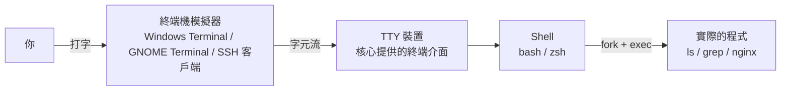

# 終端機與 Shell 入門

> [!abstract] 這篇你會學到
> - 分清楚終端機、Shell、TTY 三個常被混用的詞
> - 看懂指令的組成，知道參數為什麼有 `-a`、`--all`、`--opt=值` 三種寫法
> - 理解**萬用字元是 Shell 展開的，不是指令做的**——這是後面很多怪事的根源
> - 用 Tab 補完、歷史搜尋與快捷鍵，把打字量減少一半
> - 用 `man` 自己查答案，不用每次都 Google

## 前置知識

- [[02-實驗環境準備與初次登入]]

---

## 觀念說明

### 終端機、Shell、TTY 的差別

這三個詞常被混用，但它們是不同層次的東西：



| 名詞 | 是什麼 | 例子 |
| --- | --- | --- |
| **終端機**（terminal） | 顯示文字、接收鍵盤輸入的**視窗程式** | Windows Terminal、iTerm2、PuTTY |
| **TTY** | 核心提供的終端裝置介面 | `/dev/pts/0`、`/dev/tty1` |
| **Shell** | **解讀你打的指令**並執行它的程式 | `bash`、`zsh`、`sh`、`fish` |

換句話說：終端機負責「顯示」，Shell 負責「理解與執行」。
你可以在同一個終端機裡切換不同 Shell，也可以不透過終端機直接跑 Shell（例如腳本）。

查你現在用的是哪個 Shell：

```bash
echo $SHELL      # 你的預設登入 shell（從 /etc/passwd 讀）
ps -p $$         # 目前這個 session 實際跑的 shell
```

```
/bin/bash
    PID TTY          TIME CMD
   1234 pts/0    00:00:00 bash
```

> [!tip] `$SHELL` 和實際的 shell 可能不一樣
> `$SHELL` 是**登入時的預設 shell**，不會因為你手動執行 `zsh` 而改變。
> 想知道「現在」跑的是什麼，用 `ps -p $$`（`$$` 是目前 shell 的 PID）。
> 寫腳本判斷 shell 時這個差別會咬人。

### 讀懂提示字元

Ubuntu 預設的提示字元長這樣：

```
mike@lab01:~/projects$
└┬─┘ └─┬─┘ └───┬───┘└┬
 │     │       │     └── $ = 一般使用者，# = root
 │     │       └──────── 目前目錄（~ 代表家目錄）
 │     └──────────────── 主機名稱
 └────────────────────── 使用者名稱
```

> [!danger] `#` 代表你是 root
> 看到 `#` 就要提高警覺——這時候打錯字沒有安全網。
> 這也是為什麼建議日常用一般使用者、需要時才 `sudo`（見 [[09-使用者與群組管理]]）。

提示字元由環境變數 `PS1` 決定，可以自訂（見 [[03-Bash與Zsh效率設定]]）。
**維運環境強烈建議把主機名稱放進去**，避免在錯的機器上執行指令。

### 指令的組成

```
sudo   apt-get   install   -y   --no-install-recommends   nginx
└─┬─┘  └──┬──┘   └──┬──┘  └┬┘  └───────────┬──────────┘  └─┬─┘
 提權    程式      子指令  短選項        長選項           參數
```

Shell 用**空白**把這一行切成一個個「詞」（word），第一個詞是要執行的程式，
其餘的原封不動交給那個程式。**Shell 自己不理解 `-y` 是什麼意思**，
是 `apt-get` 自己去解讀的。

### 三種參數寫法

| 形式 | 例子 | 說明 |
| --- | --- | --- |
| 短選項 | `-l` `-a` | 單一字母，可合併：`-la` 等同 `-l -a` |
| 長選項 | `--all` `--human-readable` | 完整單字，**不能合併** |
| 帶值的選項 | `-n 5` / `--lines=5` / `--lines 5` | 短選項通常空格分隔，長選項可用 `=` |

```bash
ls -l -a -h    # 三個短選項
ls -lah        # 完全等價，合併寫法
ls --all --human-readable -l   # 長選項不能寫成 --allhuman
```

> [!warning] `--` 的特殊意義：後面都不是選項
> 想刪除一個叫 `-rf` 的檔案（是的，這種檔案存在），直接 `rm -rf` 會被當成選項。
> 用 `--` 明確告訴指令「選項到此為止」：
>
> ```bash
> rm -- -rf              # 刪除名為 -rf 的檔案
> grep -- -v file.txt    # 搜尋字串 "-v"
> ```
>
> 處理使用者輸入的檔名時，加 `--` 是重要的防護習慣。

### 萬用字元是 Shell 展開的（重要）

這是新手最常誤解、也最容易造成事故的一點。

```bash
ls *.txt
```

**`ls` 從來沒看過 `*.txt`。** Shell 先把 `*.txt` 展開成符合的檔名清單，
再把清單交給 `ls`。實際執行的是：

```bash
ls a.txt b.txt c.txt
```

用 `echo` 可以親眼看到展開結果：

```bash
echo *.txt
```

```
a.txt b.txt c.txt
```

常用萬用字元（稱為 glob）：

| 符號 | 比對 | 例子 |
| --- | --- | --- |
| `*` | 任意長度的任意字元（**不含**開頭的 `.`） | `*.log` |
| `?` | 剛好一個字元 | `file?.txt` 比對 `file1.txt` |
| `[abc]` | 中括號內任一字元 | `file[12].txt` |
| `[a-z]` | 範圍 | `log[0-9].txt` |
| `[!abc]` | 不是這些字元 | `[!0-9]*` |
| `{a,b}` | 大括號展開（**不是 glob，不需檔案存在**） | `file{1,2,3}.txt` |

```bash
echo file{1,2,3}.txt
```

```
file1.txt file2.txt file3.txt
```

> [!danger] 沒有比對到任何檔案時，`*` 會原樣傳下去
> ```bash
> $ ls
> a.jpg
> $ rm *.txt
> rm: cannot remove '*.txt': No such file or directory
> ```
> `bash` 預設在無比對時**把 `*.txt` 當成普通字串傳給指令**。
> 這在 `rm` 上只是報錯，但在某些指令上會產生意外行為。
>
> 危險組合的經典案例：
> ```bash
> rm -rf $DIR/*     # 若 $DIR 是空的，這行變成 rm -rf /*
> ```
> 這就是為什麼腳本要寫 `set -u`（未定義變數就報錯），見 [[22-Shell腳本進階]]。

> [!tip] `*` 不會比對隱藏檔
> `rm *` 不會刪掉 `.bashrc`。想包含隱藏檔要用 `.[!.]*` 或開啟 `shopt -s dotglob`。
> 這也是為什麼 `cp -r source/* dest/` 經常漏掉隱藏檔，
> 應該用 `cp -r source/. dest/`。

### 引號決定 Shell 做多少事

| 寫法 | 變數展開 | 萬用字元 | 用途 |
| --- | --- | --- | --- |
| 不加引號 | ✅ | ✅ | 一般情況 |
| `"雙引號"` | ✅ | ❌ | **最常用**，保護空白但保留變數 |
| `'單引號'` | ❌ | ❌ | 完全照字面，適合正規表示式與密碼 |

```bash
name="My Documents"

ls $name       # ✗ 被切成兩個參數：ls My Documents
ls "$name"     # ✓ 一個參數：ls "My Documents"
echo '$name'   # 輸出字面的 $name
```

> [!tip] 變數幾乎永遠要加雙引號
> `"$var"` 是預設寫法，不加引號才是特例。
> 檔名含空白、變數是空值、內容含萬用字元——這三種情況都會讓不加引號的寫法爆炸。

---

## 基礎操作

### Tab 補完：最重要的一個習慣

按一次 `Tab`：補完唯一可能的結果。按兩次：列出所有可能。

```bash
$ cd /etc/ng<Tab>
$ cd /etc/nginx/

$ systemctl status ng<Tab><Tab>
nginx.service  nginx.socket
```

Bash 也能補完**子指令與選項**（需要 `bash-completion` 套件）：

```bash
$ git che<Tab>
checkout  cherry  cherry-pick

$ systemctl <Tab><Tab>
start  stop  restart  reload  status  enable  disable  ...
```

如果補完不會動：

```bash
sudo apt install -y bash-completion
# 確認 ~/.bashrc 有載入（Ubuntu 預設有）
```

> [!tip] Tab 不只省時間，更是防打錯
> 用 Tab 補出來的路徑必然存在。手打的路徑可能有錯字，
> 而 `mkdir -p /var/lgo/myapp` 這種錯字會安靜地建出錯誤的目錄。

### 歷史紀錄

```bash
history              # 列出歷史
history 20           # 最近 20 筆
!!                   # 重複上一個指令
!$                   # 上一個指令的最後一個參數
!nginx               # 執行最近一個以 nginx 開頭的指令
```

**最實用的三個**：

```bash
# 1. 忘記加 sudo
$ apt install nginx
E: Could not open lock file - open (13: Permission denied)
$ sudo !!
sudo apt install nginx

# 2. 重用上一個指令的參數
$ mkdir -p /var/www/example.com
$ cd !$
cd /var/www/example.com

# 3. Ctrl+R 反向搜尋（最常用）
$ <Ctrl+R>
(reverse-i-search)`nginx': sudo systemctl reload nginx
```

`Ctrl+R` 之後繼續打字縮小範圍，再按 `Ctrl+R` 跳到更早的比對，
`Enter` 執行、`→` 或 `Esc` 編輯後再執行。

> [!tip] 讓歷史更好用
> 在 `~/.bashrc` 加上：
> ```bash
> HISTSIZE=10000
> HISTFILESIZE=20000
> HISTCONTROL=ignoreboth:erasedups   # 忽略重複與空白開頭
> HISTTIMEFORMAT='%F %T '            # 歷史帶時間戳記
> shopt -s histappend                # 多個 session 不互相覆蓋
> ```
> `HISTTIMEFORMAT` 特別有價值——事後追查「我什麼時候改了這個」時救命。

> [!warning] 密碼不要打在指令列
> 指令列會進入 `~/.bash_history`，而且 `ps aux` 期間其他使用者看得到。
> ```bash
> mysql -u root -pMyPassword123     # ✗ 密碼會被記錄與看見
> mysql -u root -p                  # ✓ 互動輸入
> ```
> 開頭加一個空白可以讓該行不進歷史（需 `HISTCONTROL` 含 `ignorespace`），
> 但 `ps` 的問題還在。詳見 [[10-機密管理與金鑰保護]]。

### 編輯快捷鍵

Bash 預設使用 Emacs 風格的快捷鍵：

| 快捷鍵 | 作用 |
| --- | --- |
| `Ctrl+A` | 跳到行首 |
| `Ctrl+E` | 跳到行尾 |
| `Ctrl+U` | 刪除游標前所有字元 |
| `Ctrl+K` | 刪除游標後所有字元 |
| `Ctrl+W` | 刪除前一個「詞」 |
| `Ctrl+Y` | 貼回剛剛刪除的內容 |
| `Alt+.` | 插入上一個指令的最後參數（可連按翻更早的） |
| `Ctrl+L` | 清畫面（等同 `clear`，但保留目前輸入的內容） |
| `Ctrl+C` | 中斷目前執行的指令 |
| `Ctrl+D` | 送出 EOF；空行時等同 `exit` |
| `Ctrl+Z` | 把目前程式丟到背景暫停（見 [[10-程序管理與訊號]]） |

> [!tip] 打了一長串才發現要先做別的事
> 不要刪掉重打。按 `Ctrl+U` 剪下整行 → 執行別的指令 → 按 `Ctrl+Y` 貼回來。
>
> 或者在行首加 `#` 按 Enter，指令會被當註解不執行但**進入歷史**，
> 之後用 `Ctrl+R` 叫回來。

> [!info]- Rocky / AlmaLinux（RHEL 系）對照
> Shell 行為完全相同（都是 bash）。差異只在：
> - 補完套件叫 `bash-completion`，安裝指令是 `sudo dnf install -y bash-completion`
> - RHEL 最小安裝預設**不含** `bash-completion`，需要手動裝
> - RHEL 9 起預設 shell 仍是 bash，但部分容器映像用 `sh`（dash 或 busybox），
>   那些環境沒有 `!!`、`Ctrl+R` 這些 bash 專屬功能

---

## 進階用法：用 `man` 自己找答案

### 為什麼要學會查 man

網路教學會過時、會針對別的發行版、會抄錯。
`man` 是**你這台機器上、這個版本、這個發行版**的權威說明——
它和你的軟體是同一個套件裝進來的。

> [!tip] 判斷準則
> 網路查到的做法**不生效或報錯**時，第一件事就是回頭查 `man`。
> 八成是因為版本差異或參數改名。

### man 的分節（section）

`man` 手冊分成 8 個主要章節，同一個名稱可能在多個章節出現：

| 節 | 內容 | 例子 |
| --- | --- | --- |
| 1 | 使用者指令 | `man 1 passwd` — `passwd` 指令 |
| 2 | 系統呼叫 | `man 2 open` |
| 3 | 函式庫函式 | `man 3 printf` |
| 4 | 裝置檔案 | `man 4 tty` |
| 5 | **設定檔格式** | `man 5 passwd` — `/etc/passwd` 的欄位格式 |
| 6 | 遊戲 | |
| 7 | 雜項與慣例 | `man 7 glob` — 萬用字元規則 |
| 8 | **系統管理指令** | `man 8 mount` |

> [!tip] 第 5 節是維運人員最該記得的
> 想知道 `/etc/fstab`、`/etc/passwd`、`/etc/crontab` 每個欄位是什麼意思，
> 答案都在第 5 節：
>
> ```bash
> man 5 fstab
> man 5 crontab      # 排程語法（第 1 節是 crontab 指令本身）
> man 5 sshd_config  # sshd 每個設定項的完整說明
> ```
>
> `man 5 sshd_config` 比任何網路教學都完整且正確。

### 在 man 裡面移動

| 按鍵 | 作用 |
| --- | --- |
| `空白` / `f` | 下一頁 |
| `b` | 上一頁 |
| `/關鍵字` | 向下搜尋 |
| `n` / `N` | 下一個 / 上一個比對 |
| `g` / `G` | 跳到開頭 / 結尾 |
| `q` | 離開 |

```bash
man ls
/human            # 搜尋 human
n                 # 找下一個
```

### 讀懂 SYNOPSIS 的記法

`man` 開頭的 SYNOPSIS 用一套固定符號描述用法：

```
SYNOPSIS
       ls [OPTION]... [FILE]...
       tar [-] A --catenate --concatenate | c --create | ...
       chmod [OPTION]... MODE[,MODE]... FILE...
```

| 記法 | 意義 |
| --- | --- |
| `[ ]` | **可省略** |
| `...` | **可重複多個** |
| `\|` | 擇一 |
| `{ }` | 群組（必選其一） |
| 粗體 / 一般字 | 照字面輸入 |
| *斜體* / 大寫 | 由你替換成實際值 |

```
chmod [OPTION]... MODE[,MODE]... FILE...
      └───┬───┘   └─────┬─────┘  └──┬──┘
      選項可省可多    MODE 必填     檔案必填且可多個
```

看懂這個之後，不用讀完整篇也知道指令怎麼組。

### 搜尋手冊

```bash
man -k permission        # 用關鍵字搜尋所有手冊標題（等同 apropos）
man -k "^chmod"          # 用正規表示式
man -f passwd            # 列出所有分節中的 passwd（等同 whatis）
man -a passwd            # 依序顯示所有分節（看完一個按 q 進下一個）
man -w ls                # 顯示手冊檔案的路徑
```

```bash
man -f passwd
```

```
passwd (1)           - change user password
passwd (1ssl)        - compute password hashes
passwd (5)           - the password file
```

一眼看出 `passwd` 同時是**指令（1）**和**設定檔格式（5）**。

> [!warning] `man -k` 說 nothing appropriate
> 代表手冊索引資料庫還沒建立。執行：
> ```bash
> sudo mandb
> ```
> 新裝套件後索引通常由 cron/timer 自動更新，急著用就手動跑。

### Shell 內建指令沒有 man，要用 `help`

```bash
man cd
```

```
No manual entry for cd
```

因為 `cd`、`export`、`set`、`alias`、`source`、`trap`、`ulimit`
這些是 **bash 內建指令**，不是獨立的執行檔，說明藏在 `man bash` 裡面
（那是一份六千多行的手冊）。

```bash
help cd                  # ✓ 直接看 bash 內建指令的說明
help set                 # set -e / -u / -o pipefail 的完整說明
help                     # 列出所有內建指令
type cd                  # 確認它是不是內建
```

```bash
type cd export ls
```

```
cd is a shell builtin
export is a shell builtin
ls is aliased to `ls --color=auto'
```

> [!tip] 這是新手常卡住的地方
> 「為什麼 `man cd` 找不到？」——因為它不是程式，是 shell 的一部分。
> **規則：`type X` 說是 builtin 就用 `help X`，否則用 `man X`。**

### 手冊不見了怎麼辦

Ubuntu 的官方容器映像與部分雲端映像會**刻意刪掉手冊**以縮小體積：

```bash
man ls
```

```
This system has been minimized by removing packages and content that are
not required on a system that users do not log into.
```

還原：

```bash
sudo unminimize              # Ubuntu：還原被移除的文件與套件
sudo apt install -y man-db manpages manpages-posix
```

> [!info]- Rocky / AlmaLinux（RHEL 系）對照
> RHEL 系的最小安裝預設**不含手冊**，`dnf` 也預設不裝文件：
> ```bash
> sudo dnf install -y man-db man-pages
>
> # 檢查是否設定了「不安裝文件」
> grep -i tsflags /etc/dnf/dnf.conf
> # 若有 tsflags=nodocs，重裝套件時加上 --setopt=tsflags=
> sudo dnf reinstall --setopt=tsflags= coreutils
> ```
> 另外 RHEL 系的手冊分節與 Debian 系相同，但**部分指令的手冊內容不同**
> （例如 `useradd` 的預設值），查自己機器上的才準確。

### 讓 man 更好用

```bash
# 用顏色顯示（需要 bat 或 most）
export MANPAGER="sh -c 'col -bx | bat -l man -p'"

# 或用 less 的設定（見 06 篇）
export LESS='-R -i -M -j5'

# 在 man 裡開啟編輯器編輯範例：按 v
```

```bash
# 一次搜尋所有手冊的「內容」而不只是標題
man -K "client_max_body_size"     # 大寫 K，會很慢但很徹底
```

### `info`：GNU 工具的完整文件

GNU 的工具（`coreutils`、`gawk`、`sed`、`tar`）真正完整的文件在 `info`，
`man` 只是摘要：

```bash
info gawk           # gawk 的完整手冊，有章節與範例
info coreutils 'ls invocation'
```

```
man tar
```

```
For complete documentation, run: info tar
```

| 按鍵 | 作用 |
| --- | --- |
| `空白` / `Backspace` | 下一頁 / 上一頁 |
| `n` / `p` | 下一節 / 上一節 |
| `u` | 上一層 |
| `l` | 上一個看過的節點 |
| `s` | 搜尋 |
| `q` | 離開 |

> [!tip] 什麼時候該看 info
> `awk` 的陣列、`tar` 的增量備份、`date` 的格式字串——
> 這些 `man` 只帶過一句，`info` 有完整章節與範例。

### 其他求助方式


```bash
ls --help | less        # 大部分指令都支援，比 man 簡短
apropos permission      # 用關鍵字搜尋所有手冊標題
whatis ls               # 一行簡介
type ls                 # 這是別名？函式？內建？還是執行檔？
command -v python3      # 這個指令在哪（腳本中用這個，不要用 which）
```

```
$ type ls
ls is aliased to `ls --color=auto'

$ type cd
cd is a shell builtin

$ command -v python3
/usr/bin/python3
```

> [!tip] `type` 能解釋「為什麼指令行為跟文件不一樣」
> 如果 `ls` 的行為跟 `man ls` 描述的不同，八成是因為它是個別名。
> `type ls` 會告訴你。想暫時繞過別名，在指令前加反斜線：`\ls`。

> [!tip] 裝 `tldr` 看實用範例
> `man` 完整但冗長。`tldr` 給你最常用的幾個範例：
>
> ```bash
> sudo apt install -y tldr && tldr tar
> ```
>
> ```
> tar
> Archiving utility.
>
> - Create an archive from files:
>   tar cf target.tar file1 file2
>
> - Create a gzipped archive:
>   tar czf target.tar.gz file1 file2
> ```
>
> 忘記 `tar` 參數時，`tldr tar` 比翻 `man tar` 快十倍。

### 退出碼：指令成功了嗎

每個指令結束時都會回傳一個數字，`0` 代表成功，非 `0` 代表失敗：

```bash
ls /etc > /dev/null
echo $?
```

```
0
```

```bash
ls /notexist 2> /dev/null
echo $?
```

```
2
```

這是所有 Shell 腳本判斷成敗的基礎：

```bash
if systemctl is-active --quiet nginx; then
    echo "nginx 正在執行"
else
    echo "nginx 沒有在執行"
fi
```

> [!warning] `$?` 只保留「最後一個」指令的退出碼
> ```bash
> command_that_fails
> echo "檢查中"        # ← 這行成功了
> echo $?              # ← 印出 echo 的退出碼 0，不是失敗指令的！
> ```
> 要判斷就立刻判斷，或先存起來：`rc=$?`。

---

## 完整實戰範例：五分鐘讓終端機變順手

把下面內容加到 `~/.bashrc` 的最後：

```bash
# ── 歷史紀錄 ─────────────────────────────────────
HISTSIZE=10000
HISTFILESIZE=20000
HISTCONTROL=ignoreboth:erasedups
HISTTIMEFORMAT='%F %T '
shopt -s histappend           # 多 session 不互相覆蓋
shopt -s checkwinsize         # 視窗改變大小時更新行寬

# ── 安全網 ───────────────────────────────────────
alias rm='rm -I'              # 刪超過 3 個檔案時確認一次（比 -i 不煩）
alias cp='cp -i'              # 覆蓋前確認
alias mv='mv -i'

# ── 常用縮寫 ─────────────────────────────────────
alias ll='ls -alh'
alias la='ls -A'
alias ..='cd ..'
alias ...='cd ../..'
alias grep='grep --color=auto'
alias df='df -h'
alias free='free -h'

# ── 提示字元：把主機名稱標明顯，避免在錯的機器上操作 ──
PS1='\[\e[1;32m\]\u@\h\[\e[0m\]:\[\e[1;34m\]\w\[\e[0m\]\$ '
```

套用：

```bash
source ~/.bashrc
```

> [!tip] `rm -I` 比 `rm -i` 好用
> `-i` 每個檔案都問一次，刪 100 個檔案要按 100 次 y，
> 大家很快就會養成 `rm -f` 的壞習慣。
> `-I`（大寫）只在**刪超過 3 個檔案或遞迴刪除時**問一次，
> 剛好擋住真正危險的操作，日常又不煩人。

> [!danger] 別名不會在腳本裡生效，也不會跟著 sudo 走
> ```bash
> sudo rm -rf /some/path      # ← 這裡的 rm 沒有你的 -I 別名！
> ```
> 別名只是給互動式使用的便利，**不能當成安全機制**。
> 真正的防護是操作前先看清楚路徑。

---

## 常見錯誤與排錯

| 現象 | 原因 | 解法 |
| --- | --- | --- |
| `command not found` | 拼錯、沒安裝、或不在 `$PATH` | `command -v <指令>` 確認；`apt search` 找套件 |
| `sudo` 之後找不到指令 | `sudo` 會重設 `PATH`（`secure_path`） | 用完整路徑，或 `sudo env "PATH=$PATH" cmd`，見 [[20-環境變數與設定檔]] |
| 檔名含空白，指令只吃到一半 | 沒加引號 | `"$file"` 一律加雙引號 |
| `rm *.txt` 說找不到檔案 | 沒有比對到任何檔案，`*.txt` 原樣傳下去 | 先用 `echo *.txt` 確認展開結果 |
| 明明改了 `.bashrc` 卻沒生效 | 沒重新載入，或改錯檔案（`.bash_profile` vs `.bashrc`） | `source ~/.bashrc`；載入順序見 [[20-環境變數與設定檔]] |
| 指令行為和 `man` 說的不一樣 | 被別名或函式覆蓋 | `type <指令>` 確認；用 `\指令` 繞過別名 |
| Tab 補完不會動 | 沒裝 `bash-completion` | `apt install bash-completion` 後重新登入 |
| 終端機卡住不動 | 誤按 `Ctrl+S`（凍結輸出） | 按 `Ctrl+Q` 解除 |
| 畫面變成亂碼 | `cat` 了二進位檔案 | 執行 `reset` |
| `Ctrl+C` 停不下來 | 程式忽略 SIGINT | `Ctrl+Z` 丟背景後 `kill %1`，見 [[10-程序管理與訊號]] |

---

## 安全性注意事項

> [!danger] 不要盲目複製貼上網路上的指令
> 特別是這種形式：
> ```bash
> curl -sL https://example.com/install.sh | sudo bash
> ```
> 你把一段**看都沒看過的程式碼用 root 權限執行**。
> 網站被入侵、DNS 被劫持，你的機器就沒了。
>
> 至少先下載下來看過：
> ```bash
> curl -sL https://example.com/install.sh -o install.sh
> less install.sh        # 看過再說
> sudo bash install.sh
> ```

> [!warning] 貼上多行指令的風險
> 從網頁複製的內容可能藏著換行符號，貼進終端機會**立刻執行**，
> 你來不及看清楚。惡意網站可以用 CSS 把危險指令藏在看不見的地方。
> 先貼到編輯器看過再貼進終端機。

> [!tip] root session 加上視覺警示
> 在 root 的 `~/.bashrc` 把提示字元設成紅色，時時刻刻提醒自己：
> ```bash
> PS1='\[\e[1;31m\]\u@\h\[\e[0m\]:\w\# '
> ```

---

## 速查表

### 快捷鍵

| 快捷鍵 | 作用 |
| --- | --- |
| `Tab` / `Tab Tab` | 補完 / 列出所有可能 |
| `Ctrl+R` | 反向搜尋歷史（**最常用**） |
| `Ctrl+A` / `Ctrl+E` | 行首 / 行尾 |
| `Ctrl+U` / `Ctrl+K` | 刪到行首 / 刪到行尾 |
| `Ctrl+W` / `Ctrl+Y` | 刪前一個詞 / 貼回 |
| `Alt+.` | 插入上一個指令的最後參數 |
| `Ctrl+L` | 清畫面（保留目前輸入） |
| `Ctrl+C` / `Ctrl+D` / `Ctrl+Z` | 中斷 / EOF / 丟背景暫停 |
| `Ctrl+S` / `Ctrl+Q` | 凍結 / 解除凍結輸出 |

### 歷史

| 寫法 | 作用 |
| --- | --- |
| `!!` | 上一個指令 |
| `sudo !!` | 用 sudo 重跑上一個指令 |
| `!$` | 上一個指令的最後參數 |
| `!nginx` | 最近一個以 nginx 開頭的指令 |
| `history \| grep xxx` | 搜尋歷史 |

### 求助

| 指令 | 用途 |
| --- | --- |
| `man <指令>` | 完整手冊 |
| `man 5 <設定檔>` | **設定檔格式說明** |
| `man 8 <指令>` | 系統管理指令 |
| `man 7 <主題>` | 概念與慣例（`man 7 glob`、`man 7 signal`） |
| `man -k <關鍵字>` | 搜尋所有手冊標題（= `apropos`） |
| `man -f <名稱>` | 列出所有分節（= `whatis`） |
| `man -a <名稱>` | 依序顯示所有分節 |
| `man -K <字串>` | 搜尋手冊**內容**（慢但徹底） |
| `man -w <指令>` | 手冊檔案路徑 |
| `sudo mandb` | 重建手冊索引 |
| **`help <內建指令>`** | **bash 內建指令說明（`cd`/`set`/`export`）** |
| `info <工具>` | GNU 工具的完整文件 |
| `<指令> --help` | 簡短說明 |
| `apropos <關鍵字>` | 用關鍵字搜尋手冊 |
| `tldr <指令>` | 實用範例（需安裝） |
| `type <指令>` | 這是別名 / 函式 / 內建 / 執行檔？ |
| `command -v <指令>` | 指令的完整路徑 |

### 萬用字元

| 符號 | 比對 |
| --- | --- |
| `*` | 任意長度（不含開頭的 `.`） |
| `?` | 剛好一個字元 |
| `[abc]` `[a-z]` `[!abc]` | 字元集合 / 範圍 / 排除 |
| `{a,b,c}` | 大括號展開（不需檔案存在） |
| `--` | 選項到此為止 |

---

## 練習題

> [!question]- 練習 1：預測 glob 展開結果
> 目錄裡有這些檔案：`a.txt` `b.txt` `c.log` `.hidden` `data1.csv` `data2.csv`
>
> 用 `echo` 預測下列各自會展開成什麼：
> `*` `*.txt` `data?.csv` `[ab].txt` `*.{txt,log}` `.*`
>
> **解答**
>
> ```bash
> echo *              # a.txt b.txt c.log data1.csv data2.csv  （不含 .hidden）
> echo *.txt          # a.txt b.txt
> echo data?.csv      # data1.csv data2.csv
> echo [ab].txt       # a.txt b.txt
> echo *.{txt,log}    # a.txt b.txt c.log
> echo .*             # .hidden . ..  （注意會包含 . 和 ..！）
> ```
>
> 最後一個是重要陷阱：`.*` 會比對到 `.`（目前目錄）與 `..`（上層目錄）。
> `rm -rf .*` 可能刪到上層目錄的東西。要只比對隱藏檔請用 `.[!.]*`。

> [!question]- 練習 2：為什麼這行會出錯
> ```bash
> file="my report.txt"
> rm $file
> ```
> 說明會發生什麼，以及正確寫法。
>
> **解答**
>
> Shell 用空白切詞，`$file` 展開成 `my report.txt` 後被切成**兩個參數**，
> 實際執行的是：
> ```bash
> rm my report.txt
> ```
> 結果是嘗試刪除 `my` 和 `report.txt` 兩個檔案，前者不存在會報錯，
> **而如果剛好存在一個叫 `report.txt` 的重要檔案，它會被刪掉**。
>
> 正確寫法：
> ```bash
> rm "$file"
> ```
>
> 這就是「變數幾乎永遠要加雙引號」的理由。

> [!question]- 練習 3：用 man 查出答案
> 不上網，只用 `man`，回答：
> 1. `/etc/fstab` 的第 4 欄是什麼？
> 2. `ls` 要怎麼依修改時間排序，最新的排最後？
> 3. `sshd_config` 裡 `PermitRootLogin` 有哪些可選值？
>
> **解答**
>
> ```bash
> man 5 fstab       # 搜尋 /fourth 或看 DESCRIPTION
> ```
> 第 4 欄是 **mount options**（掛載選項），如 `defaults`、`noatime`、`ro`。
>
> ```bash
> man ls
> /sort by time     # 找到 -t
> /reverse          # 找到 -r
> ```
> 答案是 `ls -ltr`（`-t` 依時間排序，`-r` 反轉，所以最新的在最下面）。
> **這是查日誌目錄時最常用的組合**。
>
> ```bash
> man 5 sshd_config
> /PermitRootLogin
> ```
> 可選值：`yes`、`prohibit-password`（只允許金鑰）、`forced-commands-only`、`no`。
> 注意 `prohibit-password` 而不是很多舊教學寫的 `without-password`（後者是別名）。
>
> 這題的重點：**`man` 的答案永遠比網路教學新且正確**，
> 因為它就是你這台機器上這個版本的說明。

---

## 小測驗

Q1. 終端機、TTY、Shell 三者各負責什麼？
Q2. `echo $SHELL` 與 `ps -p $$` 顯示的可能不同，為什麼？
Q3. `ls *.txt` 中的 `*.txt` 是誰展開的？`ls` 看到的是什麼？
Q4. 目錄裡沒有任何 `.txt` 時，`rm *.txt` 會發生什麼？這暗示了什麼腳本陷阱？
Q5. `rm *` 會刪掉 `.bashrc` 嗎？想包含隱藏檔該怎麼寫？
Q6. 想刪除一個叫 `-rf` 的檔案，指令怎麼下？
Q7. 雙引號與單引號各允許哪些展開？變數應該用哪種包？
Q8. `sudo !!` 做什麼？`!$` 呢？
Q9. `man cd` 找不到手冊，原因與正確查法？
Q10. `man 5 sshd_config` 和 `man sshd_config` 有何差別？第 5 節放什麼？

> [!question]- 測驗答案
> **Q1.** 終端機負責顯示與接收輸入；TTY 是核心提供的終端裝置介面；Shell 解讀並執行指令（見「終端機、Shell、TTY 的差別」）。
> **Q2.** `$SHELL` 是登入時的預設 shell，手動執行 `zsh` 不會改變它；`ps -p $$` 才是目前實際跑的。
> **Q3.** Shell 展開；`ls` 收到的是實際檔名清單 `a.txt b.txt`，它從沒看過 `*.txt`。
> **Q4.** `*.txt` 原樣傳給 `rm`，報錯找不到檔案。同理 `rm -rf $DIR/*` 在 `$DIR` 為空時變成 `rm -rf /*`，所以腳本要 `set -u` 與 `${VAR:?}`。
> **Q5.** 不會，`*` 不比對開頭的 `.`；用 `.[!.]*` 或 `shopt -s dotglob`（注意 `.*` 會比對到 `..`）。
> **Q6.** `rm -- -rf` 或 `rm ./-rf`；`--` 表示選項到此為止。
> **Q7.** 雙引號展開變數但不展開萬用字元；單引號完全照字面。變數幾乎永遠用雙引號。
> **Q8.** 用 sudo 重跑上一個指令；`!$` 是上一個指令的最後一個參數。
> **Q9.** `cd` 是 bash 內建指令不是程式，說明在 `man bash` 裡；用 `help cd`。判斷法：`type cd`。
> **Q10.** 加 `5` 明確指定設定檔格式那一節（不加時可能先命中第 8 節的指令）；第 5 節是設定檔格式，`man 5 fstab`、`man 5 crontab` 都在這。

---

## 延伸閱讀

- [[04-檔案系統與目錄結構]] — 知道怎麼打指令了，接著要知道東西放在哪
- [[11-輸入輸出重導向與管線]] — 把指令串起來的關鍵
- [[20-環境變數與設定檔]] — `PATH`、`.bashrc` 與 `.profile` 的載入順序
- [[03-Bash與Zsh效率設定]] — 別名、提示字元與 dotfiles 的完整設定
- [[04-現代CLI工具集]] — `fzf`、`ripgrep` 等能再提升一個檔次的工具
