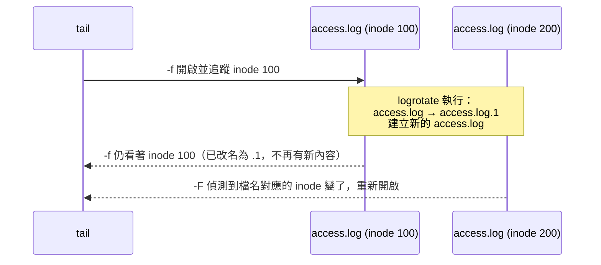

# 檢視檔案內容

> [!abstract] 這篇你會學到
> - 依檔案大小與用途選對工具，不要再用 `cat` 開 2GB 的日誌
> - 把 `less` 用熟——它是你查日誌時最常待的地方
> - 分清楚 `tail -f` 與 `tail -F`，避免日誌輪替後追蹤失效
> - 直接讀壓縮過的日誌，不用先解壓縮
> - 用 `watch` 觀察會變動的輸出

## 前置知識

- [[05-路徑導覽與檔案操作]]

---

## 觀念說明

### 選對工具

| 情境 | 工具 | 理由 |
| --- | --- | --- |
| 小檔案（幾十行） | `cat` | 一次全印，最快 |
| 大檔案、要翻閱搜尋 | **`less`** | 分頁、可搜尋、不佔記憶體 |
| 極簡環境沒有 `less` | `more` | 功能少但幾乎一定存在 |
| 只看開頭 | `head` | 看設定檔前幾行、CSV 標題 |
| 只看結尾 | `tail` | **看日誌最新內容** |
| 即時追蹤 | `tail -F` | 日誌一有新行就顯示 |
| 壓縮檔 | `zcat` `zless` `zgrep` | 不用先解壓縮 |
| 週期性重跑指令 | `watch` | 觀察數值變化 |
| systemd 服務日誌 | `journalctl` | 見 [[19-日誌系統]] |

> [!danger] 不要 `cat` 大檔案
> `cat access.log` 在一個 2GB 的日誌上會把終端機刷爆，
> 而且中斷（`Ctrl+C`）之前你什麼也做不了。
> **超過幾百行就用 `less`。**
>
> 更糟的是 `cat` 二進位檔案——終端機會收到控制字元變成亂碼。
> 真的發生了就執行 `reset` 修復。

---

## 基礎操作

### `cat`：串接與輸出

`cat` 的名字來自 **concatenate**（串接），它的本意是把多個檔案接起來：

```bash
cat file1.txt file2.txt > combined.txt
```

常用選項：

```bash
cat -n file.txt        # 顯示行號
cat -b file.txt        # 顯示行號，但跳過空行
cat -A file.txt        # 顯示所有看不見的字元
cat -s file.txt        # 連續空行壓縮成一行
```

**`cat -A` 是排查「看起來一樣卻不能動」的利器**：

```bash
printf 'server_name example.com;\t \r\n' > test.conf
cat -A test.conf
```

```
server_name example.com;^I $^M$
```

| 符號 | 代表 |
| --- | --- |
| `$` | 行尾（Unix 換行 LF） |
| `^M$` | **Windows 換行 CRLF** ← 最常見的問題 |
| `^I` | Tab 字元 |
| 行尾的空白 | 出現在 `$` 之前 |

> [!tip] 設定檔「明明沒錯卻讀不到」多半是 CRLF
> 在 Windows 編輯過的設定檔或腳本，換行是 `\r\n`。
> Linux 會把 `\r` 當成內容的一部分，於是：
> - 腳本報錯 `bad interpreter: /bin/bash^M`
> - 設定值變成 `example.com\r`，比對永遠失敗
>
> 檢查與修復：
> ```bash
> file script.sh                    # 會顯示 "with CRLF line terminators"
> sudo apt install -y dos2unix
> dos2unix script.sh
> # 或用 sed
> sed -i 's/\r$//' script.sh
> ```

> [!tip] 別做 UUOC（Useless Use of Cat）
> ```bash
> cat file.txt | grep error      # ✗ 多開一個程序
> grep error file.txt            # ✓ 直接讀
> grep error < file.txt          # ✓ 也可以
> ```
> 不是效能問題（差異很小），而是**多一層管線就多一層可能出錯的地方**，
> 而且 `grep` 直接讀檔案時能顯示檔名、支援 `-r` 遞迴等功能。

`tac` 是 `cat` 反過來（反向輸出）：

```bash
tac /var/log/syslog | head -20     # 看最後 20 行，但由新到舊排列
```

### `less`：查日誌的主場

```bash
less /var/log/nginx/access.log
```

**必記的操作**：

| 按鍵 | 作用 |
| --- | --- |
| `空白` / `f` | 下一頁 |
| `b` | 上一頁 |
| `j` / `k` | 下一行 / 上一行（同 Vim） |
| `g` / `G` | 跳到檔頭 / 檔尾 |
| `/關鍵字` | 向下搜尋 |
| `?關鍵字` | 向上搜尋 |
| `n` / `N` | 下一個 / 上一個比對 |
| `&關鍵字` | **只顯示含關鍵字的行**（過濾！） |
| `-N` | 切換行號顯示 |
| `-S` | 切換長行截斷（不換行） |
| `F` | **進入追蹤模式**（等同 `tail -f`），`Ctrl+C` 離開 |
| `v` | 用 `$EDITOR` 開啟目前檔案 |
| `q` | 離開 |

> [!tip] `&` 過濾功能幾乎沒人知道，但超好用
> 在 `less` 裡按 `&` 然後輸入 `500`，畫面就只剩下含 `500` 的行。
> 再按 `&` 輸入空字串就取消過濾。
>
> 這比退出去重打 `grep 500 access.log | less` 快得多，
> 而且可以反覆切換不同條件。

> [!tip] `less` 的 `F` 模式比 `tail -f` 好用
> `tail -f` 只能一直往下看。`less` 的 `F` 模式可以：
> 1. 按 `F` 開始追蹤
> 2. 看到可疑的東西按 `Ctrl+C` 停下來
> 3. 往回翻、搜尋、過濾
> 4. 再按 `F` 繼續追蹤
>
> ```bash
> less +F /var/log/nginx/error.log    # 直接以追蹤模式開啟
> ```

長行處理（access log 常常一行很長）：

```bash
less -S /var/log/nginx/access.log    # 不換行，用 → ← 左右捲動
```

顯示彩色輸出：

```bash
journalctl -u nginx | less -R        # -R 保留 ANSI 色碼
```

> [!tip] 設定 `LESS` 環境變數一勞永逸
> 在 `~/.bashrc` 加上：
> ```bash
> export LESS='-R -i -M -j5'
> ```
> | 選項 | 作用 |
> | --- | --- |
> | `-R` | 保留顏色 |
> | `-i` | 搜尋時忽略大小寫（除非你輸入大寫） |
> | `-M` | 顯示更詳細的狀態列（行號、百分比） |
> | `-j5` | 搜尋命中時，把該行顯示在第 5 行而非最上方（看得到上下文） |
>
> 設定之後，`man`、`git log`、`systemctl status` 都會跟著變好用，
> 因為它們預設都用 `less` 當分頁器。

### `more`：最低限度的分頁器

`more` 是比 `less` 更古老的分頁器，功能少很多，但**在極簡環境裡可能只有它**。

```bash
more /var/log/syslog
more -10 file.txt        # 一次顯示 10 行
cat file.txt | more      # 也能接管線
```

| 按鍵 | 作用 |
| --- | --- |
| `空白` | 下一頁 |
| `Enter` | 下一行 |
| `/關鍵字` | 向下搜尋 |
| `n` | 下一個比對 |
| `v` | 用 `$EDITOR` 開啟 |
| `q` | 離開 |

`more` 與 `less` 的差別：

| | `more` | `less` |
| --- | --- | --- |
| 向上翻頁 | **舊版不行**（GNU 版可用 `b`） | ✅ `b`、`k`、`↑` |
| 讀取方式 | 可能整份讀進記憶體 | **邊看邊讀，開 10GB 也秒開** |
| 到檔尾 | **自動離開** | 停在原地等你按 `q` |
| 追蹤模式 | ❌ | ✅ `F` |
| 過濾 | ❌ | ✅ `&關鍵字` |
| 何處可見 | 幾乎所有系統，含最小容器映像 | 需要 `less` 套件 |

> [!tip] 「less is more」這句話的由來
> `less` 的名字就是在調侃 `more`：它能做的比 `more` 更多。
> **日常一律用 `less`**，只有在容器或救援環境裡發現沒有 `less` 時才退回 `more`。
>
> 確認手上有什麼：
> ```bash
> command -v less more most 2>/dev/null
> ```

> [!warning] `more` 到檔尾會自動離開，內容就消失了
> 在小檔案上 `more` 會直接把內容印完然後結束，等同 `cat`。
> 想停在檔尾檢視就必須用 `less`。
>
> 另外 `more` 在某些實作上會把整個檔案讀進記憶體，
> **對超大日誌檔不要用 `more`**。

### `head` 與 `tail`

```bash
head file.txt              # 前 10 行
head -n 20 file.txt        # 前 20 行
head -20 file.txt          # 同上（簡寫）
head -c 100 file.bin       # 前 100 位元組

tail file.txt              # 後 10 行
tail -n 50 file.txt        # 後 50 行
tail -n +100 file.txt      # 從第 100 行開始到結尾
```

> [!tip] `tail -n +N` 是跳過標頭的標準做法
> ```bash
> tail -n +2 data.csv       # 跳過 CSV 標題列
> ```

**組合起來取中間某段**：

```bash
sed -n '100,120p' file.txt          # 第 100～120 行（推薦）
head -120 file.txt | tail -21       # 同樣結果
```

### `tail -f` vs `tail -F`（重要）

```bash
tail -f /var/log/nginx/access.log     # 追蹤這個「檔案描述符」
tail -F /var/log/nginx/access.log     # 追蹤這個「檔名」
```

差別在**日誌輪替發生的時候**：

| | `-f` | `-F` |
| --- | --- | --- |
| 追蹤對象 | 開啟時的那個 inode | 檔案名稱 |
| 輪替後 | **繼續看舊檔案，永遠不再有新內容** | 自動重新開啟新檔案 |
| 檔案暫時不存在 | 報錯結束 | 等待它出現 |



> [!warning] 用 `-f` 追日誌追了半小時卻沒動靜，多半是這個原因
> 半夜輪替之後 `tail -f` 就啞了，你以為系統很安靜，其實日誌一直在寫。
>
> **養成一律用 `-F` 的習慣**，它沒有任何缺點。
> 或者用 `less +F`（它也會處理輪替）。

同時追蹤多個檔案：

```bash
tail -F /var/log/nginx/{access,error}.log
```

```
==> /var/log/nginx/access.log <==
203.0.113.5 - - [27/Aug/2026:10:22:01 +0800] "GET / HTTP/1.1" 200 1234

==> /var/log/nginx/error.log <==
2026/08/27 10:22:03 [error] 891#891: *12 open() "/var/www/x" failed
```

搭配 `grep` 即時過濾：

```bash
tail -F /var/log/nginx/access.log | grep --line-buffered " 50[0-9] "
```

> [!warning] 管線裡的 `grep` 要加 `--line-buffered`
> 沒加的話 `grep` 會把輸出緩衝到 4KB 才吐出來，
> 你會覺得「怎麼都沒反應」，然後突然一次噴出一大堆。
> `--line-buffered` 讓它逐行輸出。
>
> 同理，`awk` 用 `fflush()`、`sed` 用 `-u`（unbuffered）。

### 直接讀壓縮檔

輪替後的日誌通常是 `.gz`。不用解壓縮：

```bash
zcat  /var/log/nginx/access.log.2.gz              # 等同 cat
zless /var/log/nginx/access.log.2.gz              # 等同 less
zgrep "500" /var/log/nginx/access.log.*.gz        # 等同 grep，可用萬用字元
```

> [!tip] 跨越輪替檔案搜尋
> 要在「所有歷史日誌」裡找東西：
> ```bash
> # 同時處理未壓縮與壓縮的
> zgrep -h "203.0.113.5" /var/log/nginx/access.log*
> ```
> `zgrep` 對未壓縮檔案也能正常運作，所以一個 glob 就搞定。
> `-h` 是不顯示檔名（多檔搜尋時預設會顯示）。

其他壓縮格式有對應工具：`bzcat`/`bzless`/`bzgrep`（bz2）、
`xzcat`/`xzless`/`xzgrep`（xz）、`zstdcat`/`zstdgrep`（zstd）。

### `watch`：週期性重跑

```bash
watch -n 2 'df -h /'                    # 每 2 秒重跑一次
watch -d 'ss -tn state established'     # -d 高亮變動的部分
watch -n 1 -d 'systemctl status nginx | head -20'
```

```
Every 2.0s: df -h /                              lab01: Wed Aug 27 10:35:12 2026

Filesystem      Size  Used Avail Use% Mounted on
/dev/sda2        50G   12G   36G  25% /
```

> [!tip] `watch` 的三個實用場景
> 1. **監看磁碟被填滿的速度**：`watch -n 5 'df -h /var'`
> 2. **等待服務啟動**：`watch -n 1 'ss -tlnp | grep :443'`
> 3. **觀察備份進度**：`watch -n 10 'du -sh /backup/current'`
>
> 記得指令要用引號包起來，否則 `|` 會被 Shell 先解讀掉。

> [!info]- Rocky / AlmaLinux（RHEL 系）對照
> `cat`、`less`、`head`、`tail` 完全相同。差異只有：
> - **`watch` 可能沒安裝**（屬於 `procps-ng` 套件）：
>   ```bash
>   sudo dnf install -y procps-ng
>   ```
> - 日誌路徑不同：認證日誌在 `/var/log/secure` 而不是 `/var/log/auth.log`
> - RHEL 系預設更依賴 `journalctl`，很多服務不寫獨立的檔案日誌：
>   ```bash
>   journalctl -u nginx -f          # 等同 tail -F
>   journalctl -u nginx --since "10 minutes ago"
>   ```
> - `dos2unix` 需要先安裝：`sudo dnf install -y dos2unix`

---

## 完整實戰範例：網站突然變慢，從日誌下手

```bash
# 1. 先看最近有沒有錯誤
sudo tail -n 50 /var/log/nginx/error.log
```

```
2026/08/27 10:41:02 [error] 891#891: *8821 upstream timed out (110: Connection
timed out) while reading response header from upstream, client: 203.0.113.77,
server: example.com, request: "GET /api/report HTTP/1.1",
upstream: "fastcgi://unix:/run/php/php8.3-fpm.sock:", host: "example.com"
```

```bash
# 2. 開追蹤模式即時觀察，看還在不在發生
sudo less +F /var/log/nginx/error.log
# （按 Ctrl+C 停下來翻閱，按 F 繼續）
```

```bash
# 3. 統計最近 1000 筆請求的狀態碼分布
sudo tail -n 1000 /var/log/nginx/access.log | awk '{print $9}' | sort | uniq -c | sort -rn
```

```
    812 200
    103 304
     67 504      ← 大量閘道逾時
     18 404
```

```bash
# 4. 找出是哪個路徑在逾時
sudo tail -n 5000 /var/log/nginx/access.log | awk '$9 == 504 {print $7}' | sort | uniq -c | sort -rn | head
```

```
     61 /api/report
      6 /api/export
```

```bash
# 5. 這個問題什麼時候開始的？往歷史日誌找
sudo zgrep -h " 504 " /var/log/nginx/access.log* | awk '{print $4}' | cut -c2-15 | sort | uniq -c
```

```
      3 27/Aug/2026:09
     47 27/Aug/2026:10
     94 27/Aug/2026:11
```

```bash
# 6. 對照 PHP-FPM 的日誌
sudo tail -n 100 /var/log/php8.3-fpm.log
sudo journalctl -u php8.3-fpm --since "1 hour ago" | less
```

> [!tip] 這個流程的邏輯
> **最新錯誤 → 即時觀察 → 量化統計 → 定位範圍 → 追溯起點 → 對照上下游**。
>
> 關鍵是第 3、4 步的「量化」——不要只看幾行日誌就下結論。
> `awk` + `sort` + `uniq -c` + `sort -rn` 這個組合會在
> [[12-文字處理三劍客]] 詳細說明，先把它當成固定招式記起來。

---

## 常見錯誤與排錯

| 現象 | 原因 | 解法 |
| --- | --- | --- |
| `tail -f` 追了很久沒新內容，但服務明明有流量 | 日誌輪替後仍追著舊 inode | 改用 `tail -F` 或 `less +F` |
| `tail -F ... \| grep x` 沒有即時輸出 | `grep` 輸出緩衝 | 加 `--line-buffered` |
| `cat` 之後終端機變亂碼 | 讀了二進位檔 | 執行 `reset`；先用 `file` 確認類型 |
| `Permission denied` 讀不到日誌 | 日誌權限通常是 `640 root:adm` | 用 `sudo`，或把自己加入 `adm` 群組 |
| 設定檔看起來正常卻不生效 | CRLF 換行或行尾空白 | `cat -A` 檢查；`dos2unix` 修復 |
| `less` 裡顏色變成 `ESC[0;31m` 亂碼 | 沒有 `-R` | `less -R` 或設 `export LESS='-R'` |
| 日誌檔太大，`grep` 跑很久 | 全檔掃描 | 先用 `tail -n 100000` 限縮範圍，或用 `zgrep` 對特定輪替檔 |
| `watch 'cmd \| grep x'` 沒作用 | 沒加引號，管線被 Shell 解讀 | 指令用單引號包起來 |
| 開啟壓縮日誌是亂碼 | 用了 `cat` 而非 `zcat` | 用 `zcat` / `zless` / `zgrep` |

---

## 安全性注意事項

> [!warning] 日誌裡可能有敏感資料
> Web 存取日誌會記錄完整 URL，如果應用把 token 放在 query string
> （`?api_key=xxx`），那它就明文躺在 `/var/log/nginx/access.log` 裡。
>
> - 檢查你的日誌有沒有這種內容
> - 分享日誌給廠商或貼到論壇前**務必去識別化**
> - 日誌權限應該是 `640 root:adm`，不要放寬
>
> ```bash
> # 快速檢查有沒有疑似金鑰的參數
> sudo grep -oE '(token|key|password|secret)=[^&" ]*' /var/log/nginx/access.log | head
> ```

> [!warning] 不要用 `sudo cat` 讀不明來源的檔案
> 二進位內容送進終端機可能包含控制序列。
> 雖然現代終端機大多已修補，但用 `less`（會跳脫控制字元）比 `cat` 安全。
>
> 先確認檔案類型：
> ```bash
> file /path/to/unknown
> ```

> [!tip] 把自己加入 `adm` 群組，日常查日誌不用 sudo
> ```bash
> sudo usermod -aG adm mike     # 重新登入後生效
> tail -F /var/log/nginx/error.log    # 不用 sudo 了
> ```
> 這比到處用 `sudo` 好——**降低你使用 root 權限的頻率**，
> 也就降低誤操作的機會。RHEL 系的對應群組也是 `adm`。

---

## 速查表

### 檢視

| 指令 | 說明 |
| --- | --- |
| `cat -n` / `-A` / `-s` | 行號 / 顯示不可見字元 / 壓縮空行 |
| `tac file` | 反向輸出 |
| `less file` | 分頁檢視（大檔案首選） |
| `less +F file` | 以追蹤模式開啟 |
| `less -S file` | 長行不換行 |
| `less -R` | 保留顏色 |
| `more file` | 最低限度分頁器（到檔尾自動離開） |
| `head -n N` / `head -c N` | 前 N 行 / 前 N 位元組 |
| `tail -n N` | 後 N 行 |
| `tail -n +N` | 從第 N 行到結尾（跳過標頭） |
| `tail -F file` | **即時追蹤（處理輪替）** |
| `sed -n '10,20p'` | 第 10～20 行 |

### `less` 內部操作

| 按鍵 | 作用 |
| --- | --- |
| `/` `?` `n` `N` | 向下搜尋 / 向上搜尋 / 下一個 / 上一個 |
| `&關鍵字` | **只顯示比對的行（過濾）** |
| `g` / `G` | 檔頭 / 檔尾 |
| `F` | 追蹤模式（`Ctrl+C` 離開） |
| `-N` / `-S` | 切換行號 / 切換長行截斷 |
| `v` | 用編輯器開啟 |
| `q` | 離開 |

### 壓縮檔

| 指令 | 對應 |
| --- | --- |
| `zcat` `zless` `zgrep` | gzip（`.gz`） |
| `bzcat` `bzless` `bzgrep` | bzip2（`.bz2`） |
| `xzcat` `xzless` `xzgrep` | xz（`.xz`） |
| `zstdcat` `zstdgrep` | zstd（`.zst`） |

### 其他

| 指令 | 說明 |
| --- | --- |
| `watch -n 2 -d 'cmd'` | 每 2 秒重跑並高亮變動 |
| `file <檔案>` | 判斷檔案類型 |
| `dos2unix <檔案>` | 修復 CRLF 換行 |
| `journalctl -u <服務> -f` | 追蹤 systemd 服務日誌 |

---

## 練習題

> [!question]- 練習 1：親眼看到 `-f` 與 `-F` 的差別
> 模擬日誌輪替，觀察兩者行為：
> ```bash
> cd /tmp && echo "line 1" > app.log
>
> # 終端機 A
> tail -f /tmp/app.log
> # 終端機 B
> tail -F /tmp/app.log
>
> # 終端機 C：模擬 logrotate
> echo "line 2" >> /tmp/app.log        # 兩邊都會顯示
> mv /tmp/app.log /tmp/app.log.1       # 輪替
> echo "line 3" > /tmp/app.log         # 新檔案
> ```
>
> **解答**
>
> - 終端機 A（`-f`）：顯示 `line 2` 之後就**再也沒有新內容**，
>   因為它仍握著已改名的 `app.log.1` 的 inode。
> - 終端機 B（`-F`）：會顯示
>   ```
>   tail: /tmp/app.log: file truncated
>   line 3
>   ```
>   它偵測到檔名對應到新的 inode，自動重新開啟。
>
> 這就是為什麼**一律用 `-F`**。

> [!question]- 練習 2：找出佔用最多流量的來源 IP
> 用 `/var/log/nginx/access.log`（沒有的話用任何有 IP 的日誌），
> 找出請求數最多的前 5 個 IP，並統計它們各自的狀態碼分布。
>
> **解答**
>
> ```bash
> # 前 5 名 IP
> sudo awk '{print $1}' /var/log/nginx/access.log | sort | uniq -c | sort -rn | head -5
> ```
>
> ```
>   4821 203.0.113.77
>   1092 198.51.100.4
>    877 203.0.113.5
> ```
>
> ```bash
> # 看第一名的狀態碼分布
> sudo awk '$1 == "203.0.113.77" {print $9}' /var/log/nginx/access.log \
>   | sort | uniq -c | sort -rn
> ```
>
> ```
>   4102 404
>    719 200
> ```
>
> 大量 404 加上單一來源高請求量，是**掃描或爆破**的典型特徵。
> 處理方式見 [[03-Fail2ban入侵防護]] 與 [[09-Nginx-安全設定]]。
>
> 想涵蓋所有歷史日誌就把 `awk` 換成先 `zcat`：
> ```bash
> sudo zcat -f /var/log/nginx/access.log* | awk '{print $1}' | sort | uniq -c | sort -rn | head
> ```
> （`zcat -f` 對未壓縮檔案也能運作）

> [!question]- 練習 3：抓出設定檔的隱形問題
> 建立一個含問題的設定檔並找出來：
> ```bash
> printf 'server_name  example.com; \r\nlisten\t80;\r\n' > /tmp/bad.conf
> ```
> 用什麼指令能看出它有什麼問題？怎麼修？
>
> **解答**
>
> ```bash
> file /tmp/bad.conf
> ```
> ```
> /tmp/bad.conf: ASCII text, with CRLF line terminators
> ```
>
> ```bash
> cat -A /tmp/bad.conf
> ```
> ```
> server_name  example.com; ^M$
> listen^I80;^M$
> ```
>
> 找到三個問題：
> 1. `^M$` → **CRLF 換行**（Windows 編輯過）
> 2. 第一行 `;` 後面有**行尾空白**
> 3. 第二行用了 **Tab**（`^I`）而非空白——多數設定檔可接受，但格式不一致
>
> 修復：
> ```bash
> dos2unix /tmp/bad.conf
> sed -i 's/[[:space:]]*$//' /tmp/bad.conf     # 去除行尾空白
> cat -A /tmp/bad.conf
> ```
> ```
> server_name  example.com;$
> listen^I80;$
> ```
>
> **這一招在排查「設定明明對卻不生效」時能省下好幾小時。**

---

## 延伸閱讀

- [[07-尋找檔案與內容]] — 用 `grep` 與 `find` 精準定位
- [[11-輸入輸出重導向與管線]] — 把這些工具串起來
- [[12-文字處理三劍客]] — `awk` 統計日誌的完整用法
- [[19-日誌系統]] — `journalctl` 與 `logrotate`
- [[07-Nginx-日誌與除錯]] — Nginx 日誌格式與判讀
- [[01-GoAccess-安裝與基本使用]] — 把日誌變成視覺化報表
