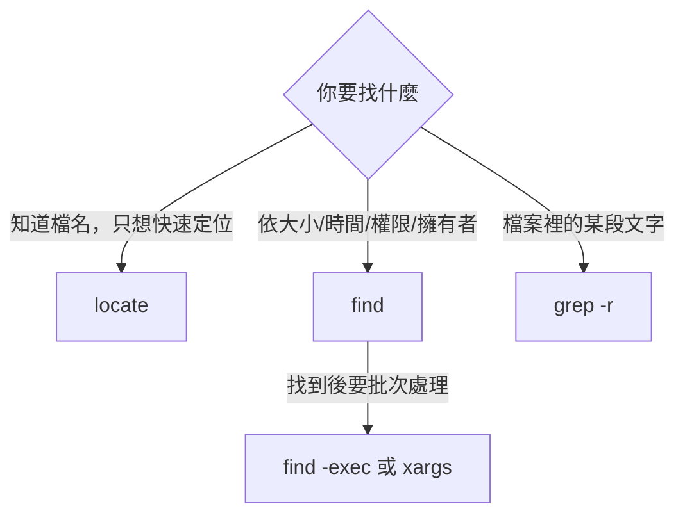

# 尋找檔案與內容

> [!abstract] 這篇你會學到
> - 用 `find` 依名稱、時間、大小、權限、擁有者精準定位檔案
> - 用 `grep` 在成千上萬個檔案裡找到那一行設定
> - 把 `find` 與 `xargs` 串起來批次處理，並避開檔名含空白的地雷
> - 知道 `find -exec {} \;` 和 `{} +` 的效能差異（可以差到百倍）
> - 用固定招式回答維運最常見的三個問題：誰吃了空間、剛剛誰改了什麼、這個設定寫在哪

## 前置知識

- [[06-檢視檔案內容]]

---

## 觀念說明

### 三種「找」的差別

| 工具 | 找什麼 | 怎麼找 | 速度 |
| --- | --- | --- | --- |
| `find` | **檔案**（依屬性） | 即時走訪目錄樹 | 慢但精準、即時 |
| `locate` | **檔案**（依名稱） | 查預先建好的索引資料庫 | 極快但可能過時 |
| `grep` | **檔案內容** | 逐行比對 | 視資料量而定 |



---

## 基礎操作

### `find`：語法結構

```
find <從哪找> <條件> <動作>
     └──┬──┘  └─┬─┘  └─┬─┘
      路徑     測試   預設是 -print
```

```bash
find /var/log -name "*.log"
find . -type d -name "cache"
find /etc -newer /etc/hostname
```

> [!warning] 萬用字元要加引號
> ```bash
> find . -name *.log      # ✗ Shell 先展開 *.log，find 收到的是實際檔名
> find . -name "*.log"    # ✓ 把 *.log 原樣交給 find 自己比對
> ```
> 不加引號時，如果目前目錄剛好有 `a.log`，Shell 會把指令變成
> `find . -name a.log`，結果只找得到那一個。

### 常用條件

**依名稱**

```bash
find /etc -name "*.conf"           # 區分大小寫
find /etc -iname "*.CONF"          # 不分大小寫
find / -name "nginx*" -type f      # 只找一般檔案
find / -name "nginx*" -type d      # 只找目錄
find . -path "*/cache/*"           # 比對完整路徑
find . -regex ".*\.\(jpg\|png\)"   # 正規表示式
```

`-type` 的值：`f` 檔案、`d` 目錄、`l` 符號連結、`s` socket、`b` 區塊裝置、`c` 字元裝置。

**依時間**（維運最常用）

| 條件 | 意義 |
| --- | --- |
| `-mtime -1` | **內容**在 1 天內修改 |
| `-mtime +30` | 內容在 30 天前修改（超過 30 天沒動） |
| `-mmin -10` | 內容在 10 分鐘內修改 |
| `-atime` | 依**存取**時間 |
| `-ctime` | 依 **inode 變更**時間（權限、擁有者改變也算） |
| `-newer <檔案>` | 比某個檔案新 |

```bash
# 剛剛 10 分鐘內 /etc 底下有什麼被改過？（排查「誰動了設定」）
sudo find /etc -mmin -10 -type f

# 30 天沒動過的暫存檔
find /tmp -type f -mtime +30
```

> [!tip] `-mtime` 的數字有陷阱
> `-mtime n` 是「剛好 n 天前」（n×24 小時 到 (n+1)×24 小時之間），
> 不是「n 天內」。要「n 天內」必須加減號：
>
> | 寫法 | 意義 |
> | --- | --- |
> | `-mtime 1` | 距今 24～48 小時 |
> | `-mtime -1` | 距今 **0～24 小時內** ← 通常是你要的 |
> | `-mtime +1` | 距今 **超過 48 小時** |
>
> 想精確一點就用 `-mmin`（分鐘）或 `-newermt`：
> ```bash
> find /etc -newermt "2026-08-27 09:00" -type f
> find /var/log -newermt "1 hour ago" -type f
> ```

**依大小**

```bash
find / -type f -size +100M          # 大於 100MB
find /var -type f -size +1G         # 大於 1GB
find . -type f -size -1k            # 小於 1KB
find . -type f -empty               # 空檔案
```

單位：`c` 位元組、`k` KB、`M` MB、`G` GB。**不寫單位預設是 512 位元組區塊**，
`-size +100` 是「大於 51200 位元組」而不是 100 什麼——這是常見誤解。

**依擁有者與權限**

```bash
find /var/www ! -user www-data              # 擁有者不是 www-data 的
find /home -type f -perm 0777               # 權限剛好是 777
find / -type f -perm -4000                  # 有 setuid 的檔案（安全稽核必查）
find /etc -type f -perm /o=w                # 任何人都可寫的設定檔（危險！）
find /home -nouser -o -nogroup              # 擁有者已被刪除的孤兒檔案
```

`-perm` 的三種寫法很容易搞混：

| 寫法 | 意義 |
| --- | --- |
| `-perm 644` | **完全等於** 644 |
| `-perm -644` | **至少包含** 644 的所有位元 |
| `-perm /644` | **任一符合**（有 owner 讀 或 group 讀 或 other 讀） |

**組合條件**

```bash
find /var/log -name "*.log" -a -size +10M            # -a = AND（預設可省略）
find . \( -name "*.jpg" -o -name "*.png" \)          # -o = OR，括號要跳脫
find /etc ! -name "*.conf"                           # ! = NOT
find / -path /proc -prune -o -name "*.conf" -print   # 排除 /proc
```

> [!tip] `-prune` 排除目錄的固定寫法
> 搜尋整個系統時排除虛擬檔案系統，避免噪音與權限錯誤：
> ```bash
> find / \( -path /proc -o -path /sys -o -path /run \) -prune \
>        -o -name "*.conf" -type f -print
> ```
> 更簡單的做法是把錯誤丟掉：
> ```bash
> find / -name "*.conf" -type f 2>/dev/null
> ```
> 但 `-prune` 比較快，因為它根本不進去那些目錄。

### `find` 的動作：`-exec` 與 `-delete`

```bash
find /tmp -name "*.tmp" -delete                      # 直接刪除
find . -name "*.sh" -exec chmod +x {} \;             # 每個檔案跑一次
find . -name "*.sh" -exec chmod +x {} +              # 累積多個檔案跑一次
find . -name "*.log" -exec grep -l "ERROR" {} +      # 找出含 ERROR 的日誌檔
find . -name "*.conf" -ok rm {} \;                   # -ok 每個都問一次
```

> [!tip] `{} \;` 與 `{} +` 的效能差距可以到百倍
> ```bash
> find . -name "*.txt" -exec grep foo {} \;    # 1000 個檔案 → 開 1000 次 grep
> find . -name "*.txt" -exec grep foo {} +     # 1000 個檔案 → 開 1～2 次 grep
> ```
> `+` 會把檔名累積起來一次傳給指令（類似 `xargs`），
> 在大量檔案上快非常多。
>
> **什麼時候必須用 `\;`**：指令一次只能處理一個檔案，
> 或 `{}` 出現在中間位置（例如 `mv {} {}.bak`）。

> [!danger] `-delete` 之前一定要先 `-print`
> ```bash
> find /var/log -name "*.gz" -mtime +90 -print     # 先看會刪什麼
> find /var/log -name "*.gz" -mtime +90 -delete    # 確認無誤才刪
> ```
> 另外 **`-delete` 的位置很重要**——它必須寫在條件後面。
> `find /tmp -delete -name "*.tmp"` 會先刪光整個 `/tmp`，
> 因為 `find` 是由左至右依序評估的。

### `xargs`：把輸出變成參數

```bash
find . -name "*.log" | xargs grep "ERROR"
find . -name "*.bak" | xargs rm
```

> [!danger] 檔名含空白時 `xargs` 會爆炸
> ```bash
> # 檔案叫 "my report.log"
> find . -name "*.log" | xargs rm
> # → 嘗試刪除 "my" 和 "report.log" 兩個檔案！
> ```
>
> **正確寫法一律用 `-print0` 配 `-0`**：
> ```bash
> find . -name "*.log" -print0 | xargs -0 rm
> ```
> `-print0` 用 NUL 字元（`\0`）分隔檔名，而 NUL 是唯一不可能出現在檔名裡的字元。
>
> 或者直接用 `-exec ... +`，它天生就安全：
> ```bash
> find . -name "*.log" -exec rm {} +
> ```

`xargs` 其他實用選項：

```bash
xargs -n 1 cmd          # 每次只傳 1 個參數
xargs -P 4 cmd          # 平行執行 4 個
xargs -I{} cmd {} .bak  # 用 {} 佔位，可放在任意位置
xargs -r cmd            # 輸入為空時不執行（重要！）
xargs -t cmd            # 執行前印出指令（除錯用）
```

```bash
# 平行壓縮所有日誌（4 個一起跑）
find /var/log -name "*.log" -mtime +7 -print0 | xargs -0 -P 4 gzip

# 批次改副檔名
find . -name "*.txt" -print0 | xargs -0 -I{} mv {} {}.bak
```

> [!warning] `-r` 可以避免「空輸入卻執行」的災難
> ```bash
> find /nonexistent -name "*.log" | xargs rm -rf    # 沒有輸入時 rm -rf 還是會跑！
> find /nonexistent -name "*.log" | xargs -r rm -rf # ✓ 空輸入就不執行
> ```
> GNU xargs 才有 `-r`，但 Linux 上都是 GNU 版本。

### `grep`：搜尋內容

```bash
grep "pattern" file.txt
grep -r "pattern" /etc/nginx/          # -r 遞迴搜尋目錄
grep -i "error" app.log                # -i 不分大小寫
grep -n "error" app.log                # -n 顯示行號
grep -v "debug" app.log                # -v 反向（不含）
grep -c "error" app.log                # -c 只算數量
grep -l "error" *.log                  # -l 只列出「有」的檔名
grep -L "error" *.log                  # -L 只列出「沒有」的檔名
grep -w "cat" file.txt                 # -w 完整單字（不比對 category）
grep -o "GET /[^ ]*" access.log        # -o 只輸出比對到的部分
grep -A 3 -B 2 "error" app.log         # 前 2 行後 3 行的上下文
grep -C 3 "error" app.log              # 前後各 3 行
grep -E "error|warn|fatal" app.log     # -E 擴充正規表示式
grep -F "1.2.3.4" access.log           # -F 純字串，不當正規表示式（快）
```

搜尋目錄時排除不需要的：

```bash
grep -rn "server_name" /etc/nginx/ --include="*.conf"
grep -rn "TODO" . --exclude-dir={.git,node_modules,vendor}
```

> [!tip] 三個最常用的組合
> ```bash
> # 1. 這個設定寫在哪個檔案的第幾行？
> grep -rn "client_max_body_size" /etc/nginx/
>
> # 2. 看設定檔的「有效內容」（去掉註解與空行）
> grep -vE "^\s*(#|$)" /etc/nginx/nginx.conf
>
> # 3. 錯誤發生前後發生了什麼？
> grep -C 5 "Segmentation fault" /var/log/syslog
> ```
> 第 2 個特別實用——一個 200 行的設定檔可能只有 30 行是實際生效的內容。

### 正規表示式：基本 vs 擴充

`grep` 預設用 **BRE**（基本正規表示式），`+` `?` `|` `(` `)` 需要跳脫；
`grep -E` 用 **ERE**（擴充），不用跳脫。**建議一律用 `-E`**。

```bash
grep    "error\|warn" app.log     # BRE 要跳脫 |
grep -E "error|warn"  app.log     # ERE 直觀多了
```

常用元字元：

| 符號 | 意義 | 例子 |
| --- | --- | --- |
| `^` | 行首 | `^server` |
| `$` | 行尾 | `;$` |
| `.` | 任一字元 | `a.c` |
| `*` | 前一項 0 次以上 | `ab*c` |
| `+` | 前一項 1 次以上（ERE） | `ab+c` |
| `?` | 前一項 0 或 1 次（ERE） | `colou?r` |
| `[abc]` `[^abc]` | 字元集 / 排除 | `[0-9]` |
| `\|` | 或（ERE 直接寫 `\|`→`|`） | `cat\|dog` |
| `{n,m}` | 重複 n 到 m 次 | `[0-9]{1,3}` |
| `\b` | 單字邊界 | `\bcat\b` |
| `\s` `\d` | 空白 / 數字（GNU 擴充） | `\s+` |

```bash
# 找出所有 IPv4 位址
grep -oE "\b([0-9]{1,3}\.){3}[0-9]{1,3}\b" /var/log/auth.log | sort -u

# 找出非 2xx/3xx 的請求
awk '$9 !~ /^[23]/' /var/log/nginx/access.log

# 找出設定檔裡未被註解的 PermitRootLogin
grep -E "^\s*PermitRootLogin" /etc/ssh/sshd_config
```

### `locate`：快但可能過時

```bash
sudo apt install -y plocate
sudo updatedb                # 建立/更新索引
locate nginx.conf
locate -i README             # 不分大小寫
locate -r "\.conf$"          # 正規表示式
```

> [!warning] `locate` 找不到剛建立的檔案
> 它查的是索引資料庫，預設每天由 cron/systemd timer 更新一次。
> 剛建立的檔案要等下次更新，或手動 `sudo updatedb`。
>
> **維運排查時用 `find`**（即時、精準），
> **「我記得有個檔案叫 xxx」時用 `locate`**（快）。

### 找指令在哪

```bash
type python3          # 別名？函式？內建？執行檔？
command -v python3    # 完整路徑（腳本中用這個）
which python3         # 完整路徑（互動用）
whereis python3       # 執行檔 + 手冊 + 原始碼
type -a python3       # 列出所有同名的（找出 PATH 衝突）
```

```
$ type -a python3
python3 is /usr/local/bin/python3
python3 is /usr/bin/python3
```

> [!tip] `type -a` 能解釋「為什麼版本不對」
> 如果 `python3 --version` 跟你以為的不一樣，
> `type -a` 會列出 `$PATH` 裡所有同名執行檔，**第一個才是實際執行的**。
> 這是排查版本混亂最快的方法。

> [!info]- Rocky / AlmaLinux（RHEL 系）對照
> `find`、`grep`、`xargs` 完全相同（都是 GNU 版本）。差異：
>
> | 項目 | Debian / Ubuntu | RHEL 系 |
> | --- | --- | --- |
> | locate 套件 | `plocate`（新）或 `mlocate` | `mlocate` |
> | 安裝 | `apt install plocate` | `dnf install mlocate` |
> | 索引更新 | `plocate-updatedb.timer` | `mlocate-updatedb.timer` |
>
> 另外 RHEL 系啟用 SELinux 時，`find -perm` 稽核之外還要看 SELinux 標籤：
> ```bash
> ls -Z /var/www/html
> find /var/www -context "*httpd_sys_content_t*"
> ```
> 見 [[07-SELinux與AppArmor]]。

> [!tip] 現代替代品：ripgrep
> ```bash
> sudo apt install -y ripgrep
> rg "server_name" /etc/nginx/
> ```
> `rg` 預設遞迴、自動略過 `.git` 與二進位檔、速度快數倍，
> 而且輸出直接帶顏色與行號。日常搜尋建議用它，
> 但**寫腳本仍用 `grep`**（每台機器都有）。見 [[04-現代CLI工具集]]。

---

## 完整實戰範例

### 情境一：磁碟快滿了，誰吃掉的？

```bash
# 1. 哪個掛載點滿了
df -h
```

```
Filesystem      Size  Used Avail Use% Mounted on
/dev/sda2        50G   47G  1.2G  98% /
```

```bash
# 2. 逐層往下找
sudo du -h --max-depth=1 / 2>/dev/null | sort -rh | head -5
sudo du -h --max-depth=1 /var 2>/dev/null | sort -rh | head -5
```

```bash
# 3. 直接找出所有大檔案
sudo find / -xdev -type f -size +500M -exec ls -lh {} + 2>/dev/null | sort -k5 -rh | head
```

```
-rw-r----- 1 mysql mysql 18G  8月 27 10:12 /var/lib/mysql/ibdata1
-rw-r----- 1 www-data adm 6.2G  8月 27 10:41 /var/log/nginx/access.log
-rw-r--r-- 1 root root  3.1G  8月 20 02:00 /var/backups/db-2026-08-20.sql
```

```bash
# 4. 檢查是不是 inode 用光（檔案數太多也會滿）
df -i
sudo find /var -xdev -type d -exec bash -c 'echo "$(ls -1 "$1" | wc -l) $1"' _ {} \; 2>/dev/null \
  | sort -rn | head -5
```

> [!tip] `-xdev` 讓 `find` 不跨越檔案系統
> 沒加的話它會走進 `/proc`、`/sys`、NFS 掛載點、其他磁碟，
> 又慢又會找到不相干的東西。**找「這顆磁碟」的大檔一定要加 `-xdev`**。

### 情境二：剛剛是誰改了什麼

```bash
# 最近 30 分鐘 /etc 底下被修改的檔案
sudo find /etc -mmin -30 -type f -exec ls -lh {} +
```

```
-rw-r--r-- 1 root root 2.5K  8月 27 11:14 /etc/nginx/sites-available/api.example.com
-rw------- 1 root root 1.2K  8月 27 11:02 /etc/ssh/sshd_config
```

```bash
# 對照登入紀錄與 sudo 使用紀錄
sudo grep -E "sudo:.*COMMAND" /var/log/auth.log | tail -20
sudo last -n 10
```

```bash
# 如果有裝 etckeeper，直接看 diff
cd /etc && sudo git log --oneline -5 && sudo git diff HEAD~1
```

### 情境三：這個設定到底寫在哪

```bash
# 在整個 Nginx 設定樹裡找
grep -rn "client_max_body_size" /etc/nginx/
```

```
/etc/nginx/nginx.conf:42:    client_max_body_size 2m;
/etc/nginx/sites-available/api.example.com:18:    client_max_body_size 50m;
```

```bash
# 找出所有 include 進來的檔案，確認搜尋範圍完整
grep -rn "include" /etc/nginx/nginx.conf
```

```bash
# 看「有效設定」而非整個檔案
grep -vE "^\s*(#|$)" /etc/nginx/nginx.conf
```

> [!tip] 很多服務有「印出實際生效設定」的指令
> 比 `grep` 更可靠，因為它包含預設值與 include 的結果：
> ```bash
> sshd -T                    # SSH 的完整生效設定
> nginx -T                   # Nginx 的完整設定（含所有 include）
> apachectl -S               # Apache 的虛擬主機列表
> php -i                     # PHP 的完整設定
> mysqld --verbose --help    # MySQL 的所有參數與預設值
> ```
> **排查「我設了但沒生效」時，先跑這個。**

### 情境四：安全稽核

```bash
# 有 setuid 的檔案（提權風險）
sudo find / -xdev -type f -perm -4000 -exec ls -l {} + 2>/dev/null
```

```bash
# 任何人都可寫的檔案與目錄
sudo find / -xdev -type f -perm -o+w ! -path "/proc/*" -exec ls -l {} + 2>/dev/null | head
sudo find / -xdev -type d -perm -o+w ! -perm -1000 -exec ls -ld {} + 2>/dev/null
```

（第二條的 `! -perm -1000` 排除有 sticky bit 的正常目錄如 `/tmp`）

```bash
# 沒有擁有者的孤兒檔案（使用者被刪但檔案還在）
sudo find / -xdev \( -nouser -o -nogroup \) -exec ls -l {} + 2>/dev/null
```

```bash
# 找出被寫死的密碼或金鑰（部署前自檢）
grep -rnE "(password|passwd|secret|api_key|token)\s*=\s*['\"][^'\"]{8,}" \
     /var/www/example.com/ --exclude-dir={vendor,node_modules,.git}
```

> [!tip] 把稽核指令寫成腳本，排進每季維護
> 這幾條指令的結果應該是穩定的。把它們寫成腳本，
> 每季跑一次並與上次結果 diff，**新出現的項目就是需要調查的**。
> 見 [[08-系統強化與稽核]] 與每季維護作業。

---

## 常見錯誤與排錯

| 現象 | 原因 | 解法 |
| --- | --- | --- |
| `find . -name *.log` 只找到一個檔案 | Shell 先展開了萬用字元 | 加引號：`-name "*.log"` |
| `find` 噴一堆 `Permission denied` | 走進沒權限的目錄 | `sudo` 或 `2>/dev/null` |
| `find /` 跑很久還走進 `/proc` | 沒限制檔案系統 | 加 `-xdev` |
| `xargs rm` 刪錯檔案 | 檔名含空白 | `find -print0 \| xargs -0` |
| `xargs` 在空輸入時仍執行指令 | 沒加 `-r` | `xargs -r cmd` |
| `find -exec` 處理上萬檔案極慢 | 用了 `\;` 每個檔案開一次程序 | 改用 `{} +` |
| `find /tmp -delete -name "*.tmp"` 刪光整個目錄 | 條件順序錯，`-delete` 先執行 | 條件寫在 `-delete` 前面 |
| `-size +100` 找到的檔案很小 | 預設單位是 512 位元組區塊 | 明確寫 `-size +100M` |
| `-mtime -1` 找不到今天改的檔案 | `-mtime 1` 是「1～2 天前」 | 用 `-mtime -1`、`-mmin`、`-newermt` |
| `grep -r` 搜到一堆 `node_modules` 的雜訊 | 沒排除 | `--exclude-dir={.git,node_modules,vendor}` |
| `grep` 在二進位檔顯示 `Binary file matches` | 檔案含非文字內容 | `grep -a`（當文字處理）或 `-I`（跳過二進位） |
| `locate` 找不到剛建的檔案 | 索引未更新 | `sudo updatedb`，或改用 `find` |
| `grep "a|b"` 找不到東西 | BRE 模式下 `\|` 不是「或」 | 用 `grep -E "a\|b"` |

---

## 安全性注意事項

> [!danger] `find -exec rm` 之前務必先 `-print`
> 這是實務上造成資料遺失最常見的指令之一。
> ```bash
> find /data -name "*.tmp" -mtime +7 -print      # 第一步：看
> find /data -name "*.tmp" -mtime +7 -delete     # 第二步：刪
> ```
> 特別注意起始路徑是變數時：
> ```bash
> find "$DIR" -delete            # ✗ $DIR 未定義 → find 從目前目錄開始刪
> find "${DIR:?}" -delete        # ✓ 未定義就中止
> ```

> [!warning] setuid 檔案是提權的主要途徑
> ```bash
> sudo find / -xdev -type f -perm -4000 -exec ls -l {} + 2>/dev/null
> ```
> 正常系統上這個清單應該只有 `sudo`、`su`、`passwd`、`mount`、`ping` 等少數幾個。
> **出現不認識的項目（特別是在 `/tmp`、`/home`、`/var/tmp`）就是入侵跡象。**
>
> 把基準清單存起來，定期比對：
> ```bash
> sudo find / -xdev -type f -perm -4000 2>/dev/null | sort > /root/setuid-baseline.txt
> # 之後
> sudo find / -xdev -type f -perm -4000 2>/dev/null | sort | diff /root/setuid-baseline.txt -
> ```

> [!warning] `grep` 敏感資料時小心把它記進歷史
> ```bash
> grep "MySecretPassword" /etc/app.conf     # 這個密碼進入 ~/.bash_history 了
> ```
> 用變數或檔案傳入，或在指令前加空白（需 `HISTCONTROL` 含 `ignorespace`）。

---

## 速查表

### find 條件

| 條件 | 說明 |
| --- | --- |
| `-name "x"` / `-iname` | 檔名比對 / 不分大小寫 |
| `-type f/d/l/s` | 檔案/目錄/連結/socket |
| `-size +100M` / `-empty` | 大於 100MB / 空檔案 |
| `-mtime -1` / `-mmin -30` | 1 天內 / 30 分鐘內修改 |
| `-newermt "1 hour ago"` | 比某時間新 |
| `-user x` / `-group x` | 依擁有者 / 群組 |
| `-perm -4000` | 有 setuid |
| `-perm -o+w` | 任何人可寫 |
| `-nouser` / `-nogroup` | 孤兒檔案 |
| `-xdev` | **不跨越檔案系統** |
| `-maxdepth N` | 限制深度 |
| `! ` / `-o` / `\( \)` | NOT / OR / 群組 |
| `-prune` | 排除目錄 |

### find 動作

| 動作 | 說明 |
| --- | --- |
| `-print` / `-print0` | 輸出 / 用 NUL 分隔（配 `xargs -0`） |
| `-delete` | 刪除（**先用 `-print` 確認**） |
| `-exec cmd {} \;` | 每個檔案執行一次 |
| `-exec cmd {} +` | **累積後執行（快很多）** |
| `-ok cmd {} \;` | 每個都詢問 |
| `-ls` | 以 `ls -l` 格式輸出 |

### grep

| 選項 | 說明 |
| --- | --- |
| `-r` / `-i` / `-n` / `-v` | 遞迴 / 忽略大小寫 / 行號 / 反向 |
| `-c` / `-l` / `-L` | 計數 / 有的檔名 / 沒有的檔名 |
| `-w` / `-x` | 完整單字 / 完整整行 |
| `-o` | 只輸出比對部分 |
| `-E` / `-F` | 擴充正規表示式 / 純字串（快） |
| `-A n` `-B n` `-C n` | 後 n 行 / 前 n 行 / 前後各 n 行 |
| `--include` / `--exclude-dir` | 限定 / 排除 |
| `--line-buffered` | 管線中即時輸出 |

### xargs

| 選項 | 說明 |
| --- | --- |
| `-0` | 配合 `find -print0` |
| `-r` | **空輸入不執行** |
| `-n N` / `-P N` | 每次 N 個 / 平行 N 個 |
| `-I{}` | 佔位符號 |
| `-t` | 印出將執行的指令 |

### 找指令

| 指令 | 說明 |
| --- | --- |
| `type -a x` | **列出所有同名執行檔**（排查版本衝突） |
| `command -v x` | 完整路徑（腳本用） |
| `whereis x` | 執行檔 + 手冊 + 原始碼 |

---

## 練習題

> [!question]- 練習 1：找出佔空間的前十大檔案
> 找出你機器上 `/`（不跨檔案系統）中最大的 10 個檔案，
> 依大小排序顯示，並排除 `/proc` 等虛擬檔案系統。
>
> **解答**
>
> ```bash
> sudo find / -xdev -type f -size +50M -exec ls -lh {} + 2>/dev/null \
>   | sort -k5 -rh | head -10
> ```
>
> 拆解：
> - `-xdev` 不跨檔案系統（同時也就跳過了 `/proc`、`/sys`，因為它們是不同的檔案系統）
> - `-size +50M` 先粗篩，減少要 `ls` 的數量
> - `-exec ls -lh {} +` 用 `+` 累積執行，比 `\;` 快很多
> - `sort -k5 -rh` 依第 5 欄（大小）反向、人類可讀數字排序
>
> 另一種寫法用 `-printf` 更精準（GNU find）：
> ```bash
> sudo find / -xdev -type f -printf '%s %p\n' 2>/dev/null \
>   | sort -rn | head -10 | numfmt --to=iec --field=1
> ```

> [!question]- 練習 2：安全地批次改名
> 目錄裡有一堆檔名含空白的 `.txt` 檔，要全部改成 `.txt.bak`。
> 寫出**不會因空白出錯**的指令，並先驗證會做什麼。
>
> **解答**
>
> ```bash
> # 準備測試檔
> mkdir -p /tmp/lab && cd /tmp/lab
> touch "my report.txt" "another file.txt" normal.txt
>
> # 先驗證：印出將執行的指令但不執行
> find . -name "*.txt" -print0 | xargs -0 -t -I{} echo mv {} {}.bak
> ```
> ```
> mv ./my report.txt ./my report.txt.bak      ← 看起來會被切開？
> ```
>
> 其實 `xargs -0 -I{}` 已經正確處理了空白（`-t` 只是顯示，沒有引號）。
> 更安全直接的寫法：
> ```bash
> find . -name "*.txt" -exec mv {} {}.bak \;
> ```
> 這裡**必須用 `\;`** 而不是 `+`，因為 `{}` 出現兩次且指令一次只處理一個檔案。
>
> 驗證：
> ```bash
> ls
> ```
> ```
> another file.txt.bak  my report.txt.bak  normal.txt.bak
> ```
>
> **重點**：`-exec` 天生安全（不經過 Shell 切詞），
> 用管線時則必須 `-print0` + `-0`。

> [!question]- 練習 3：稽核可疑的 setuid 檔案
> 建立一個「假的」可疑 setuid 檔案，然後用 `find` 找出來，
> 並說明為什麼這種檔案危險。
>
> **解答**
>
> ```bash
> # 模擬（在練習機上做）
> cp /bin/bash /tmp/rootbash
> sudo chown root:root /tmp/rootbash
> sudo chmod 4755 /tmp/rootbash
>
> # 稽核
> sudo find / -xdev -type f -perm -4000 -exec ls -l {} + 2>/dev/null
> ```
> ```
> -rwsr-xr-x 1 root root 1265648  8月 27 11:52 /tmp/rootbash
> -rwsr-xr-x 1 root root  277936  4月 10  2026 /usr/bin/sudo
> -rwsr-xr-x 1 root root   68248  3月 22  2026 /usr/bin/passwd
> ```
>
> 注意權限的 `s`（在 owner 的 x 位置）——這就是 setuid。
>
> **為什麼危險**：setuid 讓任何使用者執行時都以**檔案擁有者（root）的身分**執行。
> 一個 setuid root 的 `bash` 等於送給所有人一個 root shell：
> ```bash
> /tmp/rootbash -p
> whoami          # root
> ```
>
> 這是入侵者最常留下的後門之一。清理：
> ```bash
> sudo rm /tmp/rootbash
> ```
>
> 防護：`/tmp`、`/home`、`/var/tmp` 應該用 `nosuid` 選項掛載，
> 讓 setuid 位元在這些位置失效。見 [[15-磁碟分割與掛載]] 與 [[08-系統強化與稽核]]。

---

## 延伸閱讀

- [[08-檔案權限與擁有者]] — `-perm` 條件的完整權限模型
- [[12-文字處理三劍客]] — `grep` 之後用 `sed`/`awk` 加工
- [[11-輸入輸出重導向與管線]] — `2>/dev/null` 與管線的原理
- [[04-現代CLI工具集]] — `ripgrep`、`fd`、`fzf`
- [[08-系統強化與稽核]] — 把稽核指令制度化
- [[15-磁碟分割與掛載]] — `nosuid`、`noexec` 掛載選項
